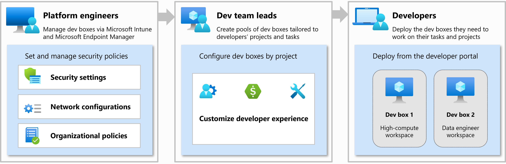

{}  
**Learn more** about Microsoft Dev Box Organizational roles and responsibilities for the deployment, access the [official documentation site](https://learn.microsoft.com/en-us/azure/dev-box/concept-dev-box-deployment-guide#organizational-roles-and-responsibilities).
{} 

# Overview

Microsoft Dev Box enables organizations to provide secure, preconfigured, and ready-to-code development environments in the cloud. To successfully deploy and operate Microsoft Dev Box, organizations should align responsibilities across three primary roles:

- **Platform Engineers**
- **Development Team Leads**
- **Developers**

These roles ensure that Dev Box is deployed in accordance with technical, operational, and team-specific needs. In some organizations, multiple roles may be performed by the same individual or team.

---

## Platform Engineers

### Responsibilities

Platform engineers are responsible for the initial setup and long-term governance of Dev Box infrastructure. They ensure Dev Box operates within the organization's cloud environment in a scalable, secure, and compliant manner.

### Key Responsibilities

- Set up Dev Center, network connections, projects, and dev box definitions
- Manage network integration, DNS, identity integration, and hybrid join scenarios
- Define custom virtual networks and subnet infrastructure
- Apply policies for governance, compliance, and cost management
- Configure monitoring and diagnostics

### Requirements

| Requirement                           | Description                                                                                               | Documentation Link                                                                 |
|---------------------------------------|-----------------------------------------------------------------------------------------------------------|-------------------------------------------------------------------------------------|
| Azure Subscription                    | A valid Azure subscription with permission to deploy and manage Azure resources                           | [Create and manage subscriptions](https://learn.microsoft.com/en-us/azure/cost-management-billing/manage/create-subscription) |
| Microsoft Entra ID                    | Microsoft Entra tenant configured for identity and access management                                       | [What is Microsoft Entra ID?](https://learn.microsoft.com/en-us/entra/fundamentals/whatis) |
| Custom Virtual Network (Optional)     | Required if deploying Dev Box in a network that connects to on-prem resources or requires domain join      | [Configure custom networks](https://learn.microsoft.com/en-us/azure/dev-box/network-connection-overview) |
| Azure DNS or Custom DNS               | Required for domain resolution inside private virtual networks                                             | [DNS Integration](https://learn.microsoft.com/en-us/azure/dev-box/network-connection-overview#dns-requirements) |
| Hybrid Join / AD DS Integration (Optional) | Required if using on-premises domain join via Azure AD DS or hybrid join                            | [Join devices to domain](https://learn.microsoft.com/en-us/azure/dev-box/network-connection-overview#active-directory-integration) |
| Azure Monitor                         | To enable diagnostics and monitoring for deployed Dev Boxes                                                | [Monitor Dev Box](https://learn.microsoft.com/en-us/azure/dev-box/monitor-dev-box-usage) |

#### Required RBAC Permissions

| RBAC Role                 | Description                                                                                         | Documentation Link                                                                 |
|---------------------------|-----------------------------------------------------------------------------------------------------|-------------------------------------------------------------------------------------|
| **Owner**                 | Full access to all resources, including the right to delegate access to others                      | [Owner Role](https://learn.microsoft.com/en-us/azure/role-based-access-control/built-in-roles#owner) |
| **Contributor**           | Can create and manage all types of Azure resources but can’t grant access to others                 | [Contributor Role](https://learn.microsoft.com/en-us/azure/role-based-access-control/built-in-roles#contributor) |
| **Network Contributor**   | Lets you manage virtual networks, but not access them                                               | [Network Contributor](https://learn.microsoft.com/en-us/azure/role-based-access-control/built-in-roles#network-contributor) |
| **DevCenter Administrator** | Manage Dev Centers, including definitions, projects, and network connections                        | [DevCenter RBAC Roles](https://learn.microsoft.com/en-us/azure/dev-box/role-based-access-control#roles) |

> To learn more about how to assign RBAC roles on Azure, [click here](https://learn.microsoft.com/en-us/azure/role-based-access-control/role-assignments-portal)

---

## Development Team Leads

### Responsibilities

Development team leads are responsible for customizing Dev Box pools to meet the development team’s needs. They define and assign appropriate environments, tools, and images, ensuring alignment with the software lifecycle.

### Key Responsibilities

- Create Dev Box pools and assign users
- Define and curate custom or base images with development tools
- Configure auto-start schedules, idle shutdown, and retention settings
- Ensure Dev Box definitions meet the development requirements
- Test and validate pools before enabling broad use

### Requirements

| Requirement                           | Description                                                                                              | Documentation Link                                                                 |
|---------------------------------------|----------------------------------------------------------------------------------------------------------|-------------------------------------------------------------------------------------|
| Dev Box Definitions                   | Templates that define base image, compute size, and configuration                                         | [Configure Dev Box definitions](https://learn.microsoft.com/en-us/azure/dev-box/dev-box-definitions) |
| Azure Compute Gallery (Optional)      | Used to create and distribute custom images organization-wide                                              | [Use Compute Gallery](https://learn.microsoft.com/en-us/azure/virtual-machines/shared-image-galleries) |
| Azure Image Builder (Optional)        | Allows automated creation of golden images                                                               | [Image Builder Overview](https://learn.microsoft.com/en-us/azure/virtual-machines/image-builder-overview) |
| Knowledge of Team Tooling             | Understanding of frameworks, SDKs, and runtimes required by the development teams                         | [Customize Dev Box](https://learn.microsoft.com/en-us/azure/dev-box/customize-dev-box) |

#### Required RBAC Permissions

| RBAC Role                        | Description                                                                                             | Documentation Link                                                                 |
|----------------------------------|---------------------------------------------------------------------------------------------------------|-------------------------------------------------------------------------------------|
| **DevCenter Project Admin**      | Manages projects, assigns users, and configures Dev Box pools                                           | [DevCenter RBAC Roles](https://learn.microsoft.com/en-us/azure/dev-box/role-based-access-control#roles) |
| **Contributor**                  | Allows creation and management of image galleries and related compute resources                         | [Contributor Role](https://learn.microsoft.com/en-us/azure/role-based-access-control/built-in-roles#contributor) |

> To learn more about how to assign RBAC roles on Azure, [click here](https://learn.microsoft.com/en-us/azure/role-based-access-control/role-assignments-portal)

---

## Developers

### Responsibilities

Developers consume Dev Box as a pre-provisioned environment. They focus on development and testing activities while following any constraints or guidelines set by the organization.

### Key Responsibilities

- Access and use the Dev Box through the developer portal
- Develop and test applications using the pre-installed tools
- Customize personal environment as allowed (e.g., installing extensions)
- Restart, stop, or delete personal Dev Boxes as needed
- Report issues to team leads or IT admins

### Requirements

| Requirement                           | Description                                                                                              | Documentation Link                                                                 |
|---------------------------------------|----------------------------------------------------------------------------------------------------------|-------------------------------------------------------------------------------------|
| Microsoft Entra ID Account            | The user must have a Microsoft Entra ID identity and be assigned to a Dev Box pool                        | [Access Dev Box portal](https://learn.microsoft.com/en-us/azure/dev-box/end-user-dev-box-portal) |
| Assigned Dev Box Pool                 | User must be added to a group associated with a Dev Box pool                                              | [Assign Dev Box users](https://learn.microsoft.com/en-us/azure/dev-box/dev-box-pools#assign-users-to-a-pool) |
| Dev Box Portal Access                 | User interface to manage Dev Boxes (start, stop, connect, delete)                                         | [Using the portal](https://learn.microsoft.com/en-us/azure/dev-box/end-user-dev-box-portal) |
| Remote Desktop (Optional)             | RDP client may be needed for certain Dev Box connection types                                             | [Connect to a Dev Box](https://learn.microsoft.com/en-us/azure/dev-box/end-user-connect-dev-box) |

#### Required RBAC Permissions

| RBAC Role                      | Description                                                                                     | Documentation Link                                                                 |
|--------------------------------|-------------------------------------------------------------------------------------------------|-------------------------------------------------------------------------------------|
| **Dev Box User**               | Allows users to view and manage their own Dev Boxes                                             | [DevCenter RBAC Roles](https://learn.microsoft.com/en-us/azure/dev-box/role-based-access-control#roles) |

> To learn more about how to assign RBAC roles on Azure, [click here](https://learn.microsoft.com/en-us/azure/role-based-access-control/role-assignments-portal)

---

## Summary Table

| Role                | Responsibilities                                                                 | Key Requirements                                            |
|---------------------|----------------------------------------------------------------------------------|-------------------------------------------------------------|
| Platform Engineer   | Infrastructure setup, governance, security, networking                          | Azure subscription, VNETs, RBAC, DNS, Monitoring            |
| Team Lead           | Dev Box pool setup, image curation, developer assignment                        | Contributor access, Dev Box definitions, image customization|
| Developer           | Use assigned Dev Box for coding and testing                                     | Microsoft Entra ID identity, Dev Box portal access, Dev Box pool |

---

## References

- [Dev Box Deployment Guide](https://learn.microsoft.com/en-us/azure/dev-box/concept-dev-box-deployment-guide#organizational-roles-and-responsibilities)
- [Dev Box Documentation](https://learn.microsoft.com/en-us/azure/dev-box/)

## Microsoft Dev Box vs Dev Box Landing Zone Accelerator

### Purpose

While **Microsoft Dev Box** provides cloud-based, ready-to-code developer workstations, the **Dev Box Landing Zone Accelerator** takes it further by automating and operationalizing the provisioning, governance, and scalability processes aligned to enterprise standards.

Together, they enable organizations to offer **Developer Workstations as a Service**, reducing friction and overhead across Platform Engineering, Development Leads, and Developer teams.

---

### Capability Comparison

| Capability                               | Microsoft Dev Box                            | Dev Box Landing Zone Accelerator                                                   |
|------------------------------------------|----------------------------------------------|-------------------------------------------------------------------------------------|
| **Dev Box Provisioning**                 | Manual via Portal or API                     | Automated via Bicep templates and GitHub workflows                                 |
| **Dev Center & Project Setup**           | Manual configuration                         | Infrastructure-as-code definitions for fast and repeatable setup                  |
| **Network Integration**                  | Supports Microsoft-hosted and custom VNETs   | Deploys and configures custom VNETs, DNS, and domain join options                 |
| **RBAC & Access Control**                | Must be manually assigned                    | Predefined Entra ID group roles aligned with Platform Engineer, Lead, Developer   |
| **Dev Box Definitions & Pools**          | Configured manually                          | Defined as part of the IaC templates with flexibility to extend                   |
| **Monitoring & Compliance**              | Optional, must be enabled                    | Integrated with Azure Monitor, diagnostic settings, and Azure Policy              |
| **Onboarding Speed**                     | Depends on manual setup                      | Entire environment deployable in < 1 hour, ready for developer onboarding         |
| **Governance & Policy Enforcement**      | Optional, manually managed                   | Embedded in deployment templates (naming, tagging, region, policy, identity)      |
| **Enterprise Readiness**                 | Requires orchestration                       | Out-of-the-box enterprise-aligned architecture                                     |

---

### How the Accelerator Supports Each Role

#### Platform Engineers

| Responsibility                         | Dev Box (Base)                                      | Accelerator Enhancement                                                                 |
|----------------------------------------|-----------------------------------------------------|------------------------------------------------------------------------------------------|
| Create Dev Center and Projects         | Manually in Portal                                  | Fully automated via Bicep; governed by naming and tagging standards                     |
| Configure Network Connections          | Manual VNET setup required                          | Prebuilt modules for custom VNETs, DNS, and hybrid domain join                          |
| Apply Governance & Compliance          | Must build policies manually                        | Governance integrated into deployment pipeline (CAF aligned)                            |
| Assign RBAC Roles                      | Manual and error-prone                              | Built-in role assignment templates based on Entra groups                                |
| Monitoring & Telemetry                 | Optional, not enforced                              | Automatically enabled using Azure Monitor and Diagnostic Settings                       |

**Result**: Reduced infrastructure setup from days/weeks to under 1 hour, with secure, scalable, and compliant environments.

---

#### Development Team Leads

| Responsibility                         | Dev Box (Base)                                      | Accelerator Enhancement                                                                 |
|----------------------------------------|-----------------------------------------------------|------------------------------------------------------------------------------------------|
| Define Dev Box Pools                   | Manual creation                                     | Pools and definitions are preconfigured and customizable via parameters                 |
| Assign Developers                      | Requires manual RBAC setup                          | Entra group-based access aligned to Dev Box pools                                       |
| Validate and Test Environments         | Set up per environment                              | Get consistent, tested, compliant environments every time                               |
| Manage DevEx Policies (auto-start, etc)| Set per box                                         | Templates include policies for retention, idle shutdown, and auto-start configurations  |

**Result**: Faster environment readiness, centralized control, and less time spent managing infrastructure.

---

#### Developers

| Responsibility                         | Dev Box (Base)                                      | Accelerator Enhancement                                                                 |
|----------------------------------------|-----------------------------------------------------|------------------------------------------------------------------------------------------|
| Access Dev Box                         | Must wait until setup is complete                   | Ready-to-code environments available immediately after group assignment                 |
| Development Environment Consistency    | Depends on team-specific setup                      | Consistent tooling and configurations across teams and projects                         |
| Self-Service Management                | Supported via portal                                | No change — still managed through the Dev Box portal                                    |
| Fast Onboarding                        | Blocked by provisioning delays                      | No delays — entire environment can be operational in a matter of hours                  |

**Result**: Developers spend less time waiting, more time coding — with consistent and secure environments.

---

### Summary

The **Dev Box Landing Zone Accelerator** enhances **Microsoft Dev Box** by:

- Automating all foundational setup work
- Aligning to Microsoft’s Cloud Adoption Framework
- Encapsulating best practices for governance, networking, RBAC, and diagnostics
- Scaling onboarding for development teams with minimal manual intervention

Together, they empower organizations to deliver **Developer Workstations as a Service** — faster, more securely, and at enterprise scale.

---

### Additional Resources

- [Dev Box Landing Zone Accelerator (GitHub)](https://github.com/Azure/devbox-landing-zone-accelerator)
- [Microsoft Dev Box Documentation](https://learn.microsoft.com/en-us/azure/dev-box/)
- [Cloud Adoption Framework](https://learn.microsoft.com/en-us/azure/cloud-adoption-framework/)
