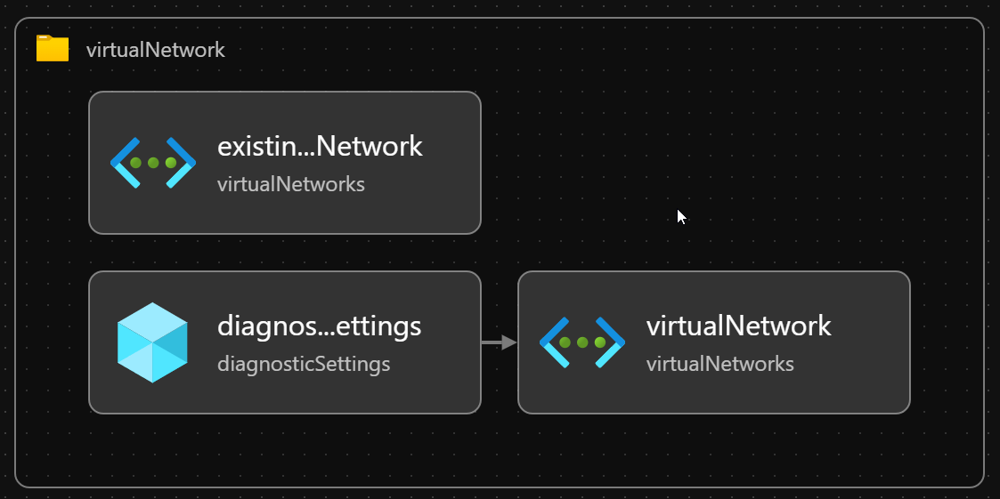

## Overview

The **newtork.yaml** file is a core configuration file for the Microsoft Dev Box Accelerator, specifically designed to define and manage the virtual network infrastructure for Dev Box environments. This YAML file enables teams to provision, organize, and secure Azure Virtual Networks (VNets) and subnets, ensuring isolated, scalable, and policy-compliant environments for development workloads. It also standardizes resource tagging for governance, cost management, and operational clarity.

This file is intended to be used as part of the Dev Box Accelerator’s infrastructure-as-code approach, supporting automated, repeatable, and best-practice-aligned network deployments in Azure.

---

## Components Visualization



---

## Table of Contents

- [Overview](#overview)
- [Configuration Items](#configuration-items)
  - [`create`](#create)
  - [`virtualNetworkType`](#virtualnetworktype)
  - [`name`](#name)
  - [`addressPrefixes`](#addressprefixes)
  - [`subnets`](#subnets)
  - [`tags`](#tags)
- [Best Practices](#best-practices)
- [Considerations](#considerations)
- [References](#references)

---

## Default Configuration 

```yaml
# yaml-language-server: $schema=./network.schema.json
#
# Microsoft Dev Box accelerator: Network Configuration
# ===============================================
# 
# Purpose: Defines the virtual network infrastructure for environments.
# This configuration creates a managed virtual network that isolates DevBox resources
# while enabling secure connectivity to Azure services and corporate resources.
#
# References:
# - Azure VNet best practices: https://learn.microsoft.com/en-us/azure/architecture/reference-architectures/hybrid-networking/
# - DevBox networking: https://learn.microsoft.com/en-us/azure/dev-box/how-to-configure-network-connectivity

# Create flag: Determines whether to create a new virtual network (true) or use existing (false)
# Best practice: Create dedicated VNets per environment to maintain proper isolation
# Setting to true ensures a clean, dedicated network environment for DevBox resources
create: true

# Virtual Network Type: Controls how network connectivity is provisioned
# - Managed: Azure manages the network configuration (simpler, fewer permissions needed)
# - Unmanaged: Customer manages the network (greater control, required for hybrid scenarios)
# Best practice: Use Managed for dev/test; Unmanaged for production or when connecting to on-prem
virtualNetworkType: Managed

# Virtual Network Name: Identifier for the VNet resource
# Best practice naming: Use lowercase, include environment and purpose
# Format: [company]-[purpose]-[env]-vnet
name: contoso-vnet

# Address Prefixes: CIDR blocks that define the IP address range for the VNet
# Best practices:
# - Use private ranges (10.0.0.0/8, 172.16.0.0/12, 192.168.0.0/16)
# - Ensure no overlap with on-premises or other Azure VNet ranges
# - Allocate sufficient address space for future growth (default provides 65,536 IPs)
addressPrefixes:
  - 10.0.0.0/16

# Subnets: Network segments within the VNet to organize and secure resources
# Best practices:
# - Create separate subnets based on workload type and security requirements
# - Apply NSGs at the subnet level for traffic filtering
# - Size subnets appropriately for the expected number of resources
subnets:
  - name: contoso-subnet
    properties:
      # Address Prefix: CIDR block for this subnet within the VNet's address space
      # A /24 subnet provides 251 usable IP addresses (Azure reserves 5 IPs)
      # Best practice: Size according to expected resource count plus room for growth
      addressPrefix: 10.0.1.0/24

# Tags: Metadata attached to resources for organization, governance, and cost management
# Best practices:
# - Apply consistent tags across all resources
# - Automate tagging with naming and tagging conventions
# - Include ownership, environment, and cost allocation information
tags:
  # Environment tag: Identifies the deployment environment
  # Values typically include: dev, test, staging, prod
  # Used for filtering resources and applying policies appropriately
  environment: dev
  
  # Division tag: Identifies the organizational division responsible for the resource
  # Helps with cost allocation and resource ownership at division level
  division: Platforms
  
  # Team tag: Identifies the team responsible for the resource
  # Used for operational ownership and access management
  team: DevExP
  
  # Project tag: Associates the resource with a specific project
  # Used for cost allocation and resource lifecycle management
  project: DevExP-DevBox
  
  # Cost Center tag: Links resource costs to specific cost centers
  # Essential for charge-back and show-back accounting models
  costCenter: IT
  
  # Owner tag: Identifies the resource owner (individual or team)
  # Critical for operational contacts and responsibility assignment
  owner: Contoso
  
  # Resources tag: Describes the resource type or purpose
  # Helps with resource categorization and filtering
  resources: Network
``` 
---

## Configuration Items

### `create`

**Configuration Purpose:**  
Determines whether to create a new Azure Virtual Network (VNet) or use an existing one.

**Default Configuration:**
```yaml
create: true
```

**Configuration Structure:**  
A boolean value (`true` or `false`).

**Detailed Configuration:**  
- `true`: The deployment process will create a new, dedicated VNet for the environment.
- `false`: An existing VNet will be used, as specified elsewhere in the configuration.

**Use Cases:**  
- Set to `true` for isolated, environment-specific VNets (recommended for dev/test).
- Set to `false` when reusing shared or pre-existing VNets (common in production or hybrid scenarios).

**Best Practices:**  
- Use dedicated VNets per environment to maintain isolation and reduce cross-environment risk.

**Considerations:**  
- Creating new VNets increases isolation but may require additional configuration for cross-environment connectivity.

---

### `virtualNetworkType`

**Configuration Purpose:**  
Specifies how the VNet is provisioned and managed.

**Default Configuration:**
```yaml
virtualNetworkType: Managed
```

**Configuration Structure:**  
A string value: `Managed` or `Unmanaged`.

**Detailed Configuration:**  
- `Managed`: Azure manages the network configuration, simplifying setup and reducing required permissions.
- `Unmanaged`: The customer manages the network, providing more control (required for hybrid or advanced scenarios).

**Use Cases:**  
- Use `Managed` for dev/test or when simplicity is preferred.
- Use `Unmanaged` for production or when integrating with on-premises networks.

**Best Practices:**  
- Default to `Managed` unless advanced customization or hybrid connectivity is required.

**Considerations:**  
- `Unmanaged` mode may require additional permissions and manual configuration.

---

### `name`

**Configuration Purpose:**  
Defines the name of the VNet resource.

**Default Configuration:**
```yaml
name: contoso-vnet
```

**Configuration Structure:**  
A string following a naming convention.

**Detailed Configuration:**  
- Format: `[company]-[purpose]-[env]-vnet` (e.g., `contoso-devbox-dev-vnet`).

**Use Cases:**  
- Ensures consistent, descriptive resource naming for easier management and automation.

**Best Practices:**  
- Use lowercase letters.
- Include company, purpose, environment, and resource type in the name.

**Considerations:**  
- Naming conventions help with automation, filtering, and compliance.

---

### `addressPrefixes`

**Configuration Purpose:**  
Defines the IP address range(s) for the VNet using CIDR notation.

**Default Configuration:**
```yaml
addressPrefixes:
  - 10.0.0.0/16
```

**Configuration Structure:**  
A list of CIDR blocks.

**Detailed Configuration:**  
- Use private address ranges (e.g., `10.0.0.0/8`, `172.16.0.0/12`, `192.168.0.0/16`).
- Ensure no overlap with on-premises or other Azure VNets.

**Use Cases:**  
- Allocate sufficient IP space for current and future workloads.

**Best Practices:**  
- Plan for future growth.
- Avoid overlapping address spaces to prevent routing conflicts.

**Considerations:**  
- Changing address ranges after deployment is complex and disruptive.

---

### `subnets`

**Configuration Purpose:**  
Defines subnets within the VNet for organizing and securing resources.

**Default Configuration:**
```yaml
subnets:
  - name: contoso-subnet
    properties:
      addressPrefix: 10.0.1.0/24
```

**Configuration Structure:**  
A list of subnet objects, each with a `name` and `properties`.

**Detailed Configuration:**  
- Each subnet has a unique name and an address prefix (CIDR block).
- Subnets can be sized based on workload requirements.

**Use Cases:**  
- Separate workloads (e.g., Dev Boxes, databases, services) into different subnets.
- Apply Network Security Groups (NSGs) at the subnet level.

**Best Practices:**  
- Create subnets based on workload type and security needs.
- Size subnets with room for growth.
- Apply NSGs for traffic filtering.

**Considerations:**  
- Azure reserves 5 IPs per subnet.
- Subnet resizing requires recreation.

---

### `tags`

**Configuration Purpose:**  
Attaches metadata to resources for organization, governance, and cost management.

**Default Configuration:**
```yaml
tags:
  environment: dev
  division: Platforms
  team: DevExP
  project: DevExP-DevBox
  costCenter: IT
  owner: Contoso
  resources: Network
```

**Configuration Structure:**  
A dictionary of key-value pairs.

**Detailed Configuration:**  
- Common tags: `environment`, `division`, `team`, `project`, `costCenter`, `owner`, `resources`.
- Used for filtering, automation, cost allocation, and policy enforcement.

**Use Cases:**  
- Automate resource management and reporting.
- Enable charge-back/show-back accounting.

**Best Practices:**  
- Apply consistent tags across all resources.
- Automate tagging where possible.

**Considerations:**  
- Missing or inconsistent tags can hinder governance and cost tracking.

---

## Best Practices

- **Follow Azure naming conventions** for all resources.
- **Use private IP ranges** and avoid overlaps with on-premises or other Azure VNets.
- **Apply NSGs** at the subnet level for security.
- **Tag all resources** consistently for governance and cost management.
- **Plan address spaces and subnet sizes** for future growth.
- **Automate deployments** using infrastructure-as-code tools (e.g., Bicep, ARM, Terraform).
- **Review Azure VNet best practices**: [Azure VNet Best Practices](https://learn.microsoft.com/en-us/azure/architecture/reference-architectures/hybrid-networking/).

---

## Considerations

- **Subnet and address space changes** post-deployment are disruptive and may require resource recreation.
- **Permissions**: Unmanaged networks require additional Azure permissions.
- **Hybrid connectivity**: Plan for VPN/ExpressRoute if connecting to on-premises resources.
- **Resource limits**: Be aware of Azure subscription and region limits for VNets and subnets.

---

## References

- [Azure Virtual Network documentation](https://learn.microsoft.com/en-us/azure/virtual-network/)
- [Dev Box networking](https://learn.microsoft.com/en-us/azure/dev-box/how-to-configure-network-connectivity)
- [Azure Resource Naming](https://learn.microsoft.com/en-us/azure/cloud-adoption-framework/ready/azure-best-practices/resource-naming)
- [Azure Tagging Best Practices](https://learn.microsoft.com/en-us/azure/azure-resource-manager/management/tag-resources)

---
