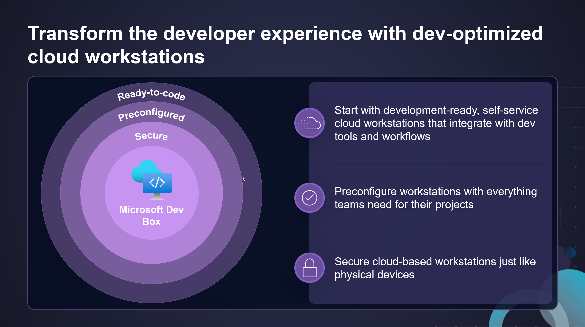

## Microsoft Dev Box Documentation
{}  
**Learn more** about Microsoft Dev Box:

- [Microsoft Dev Box architecture overview](https://learn.microsoft.com/en-us/azure/dev-box/concept-dev-box-architecture)
- [Key concepts in Microsoft Dev Box](https://learn.microsoft.com/en-us/azure/dev-box/concept-dev-box-concepts)
{}

# What is Microsoft Dev Box?

Microsoft Dev Box gives developers self-service access to ready-to-code cloud workstations called *dev boxes*. You can configure dev boxes with tools, source code, and prebuilt binaries that are specific to a project, so developers can immediately start work. You can create cloud development environments for your developer teams by using a customized image, or a preconfigured image from Azure Marketplace, complete with Visual Studio already installed. 

If you're a developer, you can use multiple dev boxes in your day-to-day workflows. Access and manage your dev boxes through the developer portal.

Microsoft Dev Box bridges the gap between development teams and IT, by bringing control of project resources closer to the development team.

The Dev Box service was designed with three organizational roles in mind: platform engineers, development team leads, and developers.

Platform engineers and IT admins work together to provide developer infrastructure and tools to the developer teams. Platform engineers set and manage security settings, network configurations, and organizational policies to ensure that dev boxes can access resources securely.

Developer team leads are experienced developers who have in-depth knowledge of their projects. They can be assigned the DevCenter Project Admin role and assist with creating and managing the developer experience. Project admins create and manage pools of dev boxes.

Members of a development team are assigned the DevCenter Dev Box User role. They can then self-serve one or more dev boxes on demand from the dev box pools that are enabled for a project. Dev box users can work on multiple projects or tasks by creating multiple dev boxes. 

Microsoft Dev Box bridges the gap between development teams and IT, by bringing control of project resources closer to the development team.

{}  
**Learn more** about Microsoft Dev Box:

- [Microsoft Dev Box architecture overview](https://learn.microsoft.com/en-us/azure/dev-box/concept-dev-box-architecture)
- [Key concepts in Microsoft Dev Box](https://learn.microsoft.com/en-us/azure/dev-box/concept-dev-box-concepts)
{}
