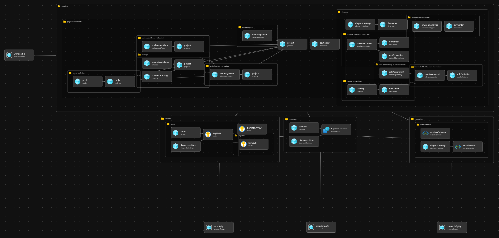

# Overview
The **Dev Box landing zone accelerator** is an open-source, reference implementation designed to help you quickly establish a landing zone subscription optimized for Microsoft Dev Box deployments. Built on the principles and best practices of the [**Azure Cloud Adoption Framework (CAF) enterprise-scale landing zones**](https://docs.microsoft.com/azure/cloud-adoption-framework/ready/landing-zone/enterprise-scale), it provides a strategic design path and a target technical state that:

- Establishes foundational services (network, monitoring, security, and workload) required for a secure, scalable, and multi-tenant Dev Box environment.
- Aligns to CAF guidance for subscription structure, resource groups, and role-based access control (RBAC).
- Is fully modular, parameterized, and ready to be adapted to your organization’s existing landing zone or to provision new platform services from scratch.
- Is open source—feel free to fork, extend, or customize the Bicep modules, policies, and scripts to meet your unique requirements.

## Resources Visualization

## What the Microsoft Dev Box Accelerator Landing Zone Provides

1. **Architectural Approach & Reference Implementation**  
   
   A set of Bicep modules, scripts, and yaml configuration files that together prepare a landing zone subscription for production-ready Microsoft Dev Box workloads. This includes:
   - **Networking**: Virtual network, subnets, and optional network connections to hub networks.  
   - **Identity & Access**: Integration with Microsoft Entra, service principals, managed identities, and RBAC assignments.  
   - **Security & Governance**: Policy assignments (tagging, security baseline, resource consistency), Azure Monitor and Log Analytics integration.  
   - **Platform Services**: DevCenter, Projects and its dependencies.

2. **Cloud Adoption Framework Alignment**  
   
   All artifacts adhere to the CAF’s enterprise-scale landing zone patterns:
   - **Management Group Hierarchy** for clear separation of environments (e.g., Connectivity, Monitoring, Security, and Workload).    
   - **Modularity** so you can pick and choose how the foundational services will be deployed.
   

3. **Enterprise-Scale Design Principles**  
   - **Scalability**: Built to support hundreds of developer seats and multiple Dev Box SKUs.    
   - **Security**: Zero-trust networking, least-privilege access, and continuous compliance monitoring.  
   - **Cost Management**: Tagging, budget alerts, and automated shutdown/startup of idle Dev Boxes.

## Design Areas

When implementing a scalable Microsoft Dev Box landing zone, consider the following design areas:

| Design Area                | Considerations                                                                                                           |
|----------------------------|--------------------------------------------------------------------------------------------------------------------------|
| **Subscription Topology**  | Placement under a dedicated **“Dev Box”** subscription; isolation from production workloads; environment-dependent naming. |
| **Resource Organization**  | Resource group structure (e.g., `connectivity-rg`, `monitoring-rg`, `security-rg`, and `workload-rg`); consistent naming & tagging policies.        |
| **Networking**             | Hub-and-spoke or standalone VNet; subnet segmentation; Azure Firewall or NVA integration; optional VPN/ExpressRoute.     |
| **Identity & Access**      | Microsoft Entra security groups for platform engineering teams, dev team leads, and developers; managed identities for automation, and DevCenter integration. |                 |
| **Security & Governance**  | Key Vault for secrets; Log Analytics workspace for logs, and telemetry.                    |
| **Platform Services** | Configuration of Dev Center, Custom Tasks Catalogs, Networking Connections, Projects, Environments and Image Definitions, and environments types; assignment of Dev Center roles via RBAC.                        |

## Journey Paths
{}  
> - **Greenfield**: Deploy the accelerator’s Bicep modules to create platform foundational services, then launch your Dev Box environment.  
> - **Brownfield**: Import existing landing zone services by disabling and parameterizing connections (e.g., pointing to an existing VNet, Subnet, Resource Group or Key Vault).

**Learn more** how to configure the Accelerator in the [Configure Resources](../../configureResources/) session.
{}