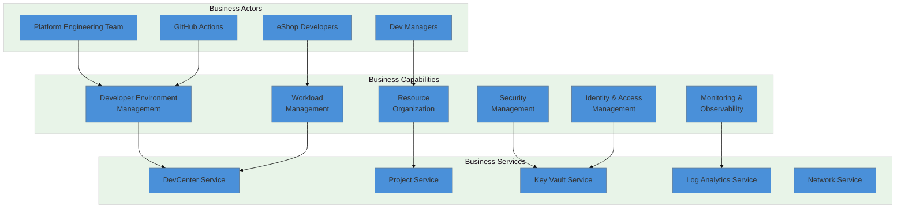
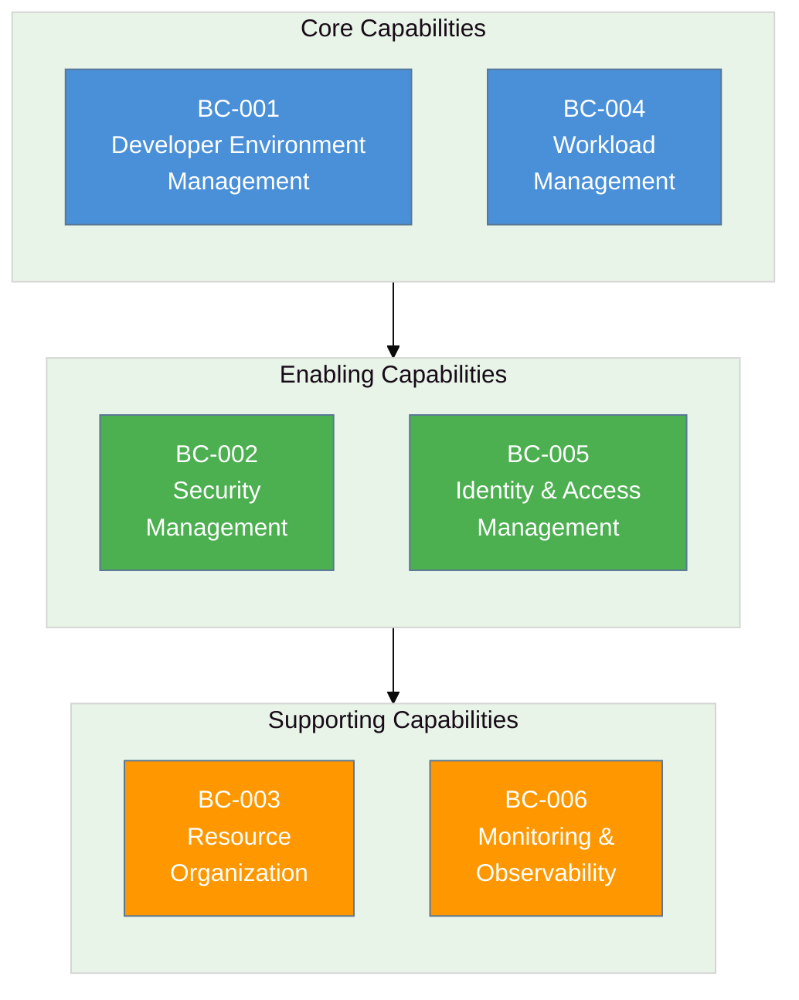
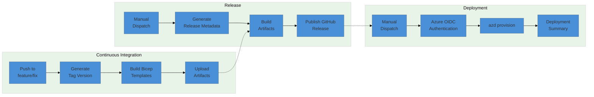
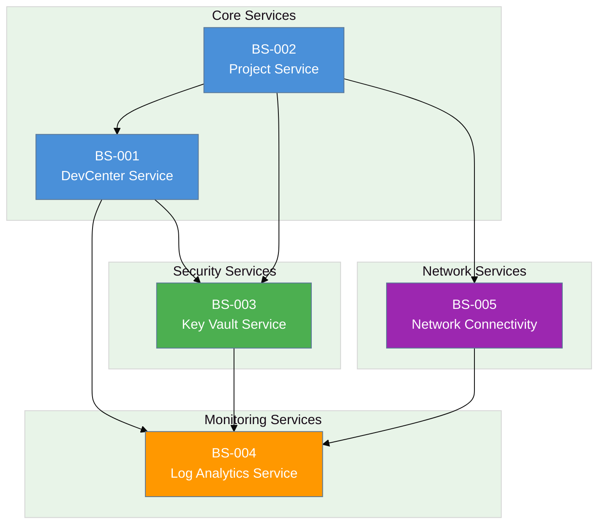
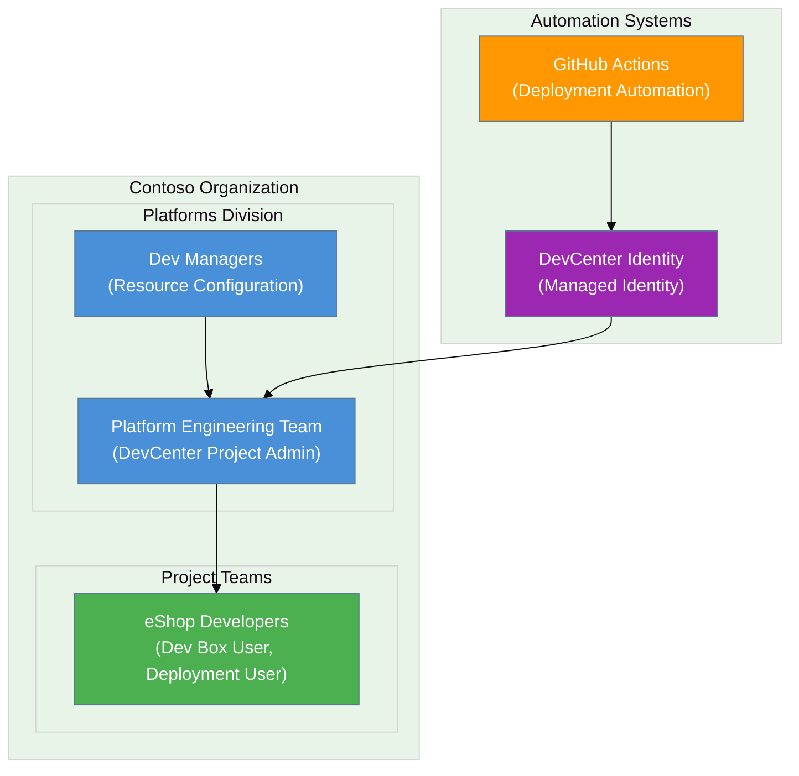
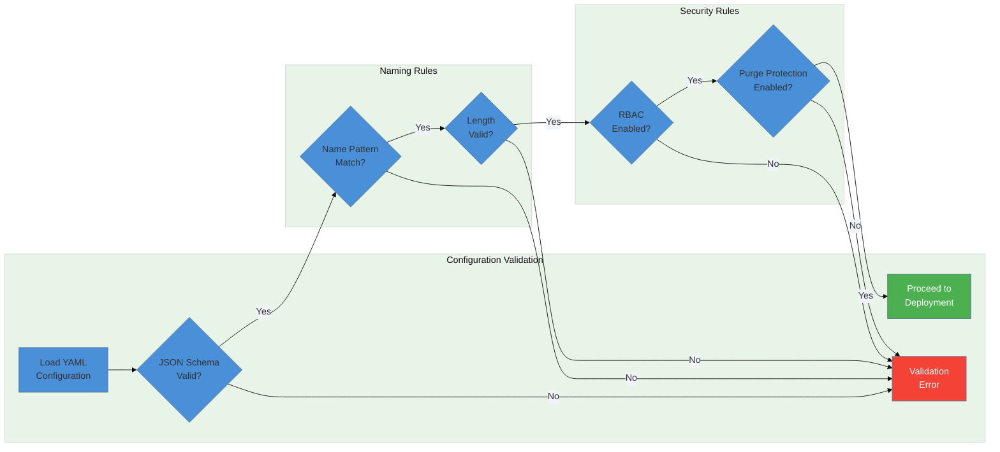

# Business Architecture Document

---

## Document Control

| Attribute      | Value                                        |
| -------------- | -------------------------------------------- |
| Document Title | DevExp-DevBox Business Layer Architecture    |
| Version        | 1.0.0                                        |
| Last Updated   | 2026-02-02                                   |
| Author         | Enterprise Architecture Team                 |
| Status         | Published                                    |
| Repository     | https://github.com/Evilazaro/DevExp-DevBox   |
| Review Cycle   | Quarterly                                    |
| Framework      | TOGAF 10 ADM Phase B - Business Architecture |

### Version History

| Version | Date       | Author                       | Changes         |
| ------- | ---------- | ---------------------------- | --------------- |
| 1.0.0   | 2026-02-02 | Enterprise Architecture Team | Initial release |

---

## 1. Executive Summary

### Overview

The DevExp-DevBox accelerator is a **Microsoft Dev Box deployment platform**
that enables organizations to provision, manage, and govern developer
workstations at enterprise scale. This Business Architecture document identifies
and documents the business capabilities, processes, services, actors, and rules
discovered within the codebase, following TOGAF 10 principles for Business
Architecture (Phase B).

### Key Findings Summary

| Category              | Count | Key Items Identified                                                                                                                                        |
| --------------------- | ----- | ----------------------------------------------------------------------------------------------------------------------------------------------------------- |
| Business Capabilities | 6     | Developer Environment Management, Security Management, Resource Organization, Workload Management, Identity & Access Management, Monitoring & Observability |
| Business Processes    | 4     | Environment Provisioning, CI/CD Pipeline, Security Configuration, Role Assignment                                                                           |
| Business Services     | 5     | DevCenter Service, Project Service, Key Vault Service, Log Analytics Service, Network Connectivity Service                                                  |
| Business Actors       | 5     | Platform Engineering Team, eShop Developers, DevCenter Admins, Dev Managers, Deployment Automation (GitHub Actions)                                         |
| Business Rules        | 12    | Schema validation rules, tagging governance, RBAC policies, naming conventions                                                                              |

### High-Level Business Architecture Diagram



---

## 2. Business Capabilities

### Overview

Business capabilities represent the organization's ability to deliver value
through the DevExp-DevBox platform. These capabilities were identified by
analyzing the infrastructure configurations, deployment scripts, and workload
definitions within the codebase.

### Capability Inventory

| ID     | Capability                       | Description                                                                                                  | Maturity Level | Source File                                                                       |
| ------ | -------------------------------- | ------------------------------------------------------------------------------------------------------------ | -------------- | --------------------------------------------------------------------------------- |
| BC-001 | Developer Environment Management | Provision and manage standardized developer workstations (Dev Boxes) with role-specific configurations       | Defined        | [devcenter.yaml](../infra/settings/workload/devcenter.yaml)                       |
| BC-002 | Security Management              | Centralized secrets management, RBAC authorization, and security policy enforcement                          | Defined        | [security.yaml](../infra/settings/security/security.yaml)                         |
| BC-003 | Resource Organization            | Organize Azure resources into logical landing zones (Workload, Security, Monitoring) with consistent tagging | Defined        | [azureResources.yaml](../infra/settings/resourceOrganization/azureResources.yaml) |
| BC-004 | Workload Management              | Deploy and manage DevCenter workloads including projects, pools, catalogs, and environment types             | Defined        | [workload.bicep](../src/workload/workload.bicep)                                  |
| BC-005 | Identity & Access Management     | Manage role assignments, managed identities, and Azure RBAC for DevCenter resources                          | Defined        | [devCenterRoleAssignment.bicep](../src/identity/devCenterRoleAssignment.bicep)    |
| BC-006 | Monitoring & Observability       | Centralized logging, diagnostics, and telemetry collection through Log Analytics                             | Defined        | [logAnalytics.bicep](../src/management/logAnalytics.bicep)                        |

### Capability Map Diagram



### Capability Descriptions

#### BC-001: Developer Environment Management

This capability enables the provisioning of standardized developer workstations
through Microsoft Dev Box. It includes:

- **Dev Box Pools**: Role-specific configurations (backend-engineer,
  frontend-engineer)
- **Image Definitions**: Custom Dev Box images with pre-installed tools
- **DSC Configurations**: Desired State Configuration for automated workstation
  setup

**Source Evidence**:

- Pool definitions in
  [devcenter.yaml](../infra/settings/workload/devcenter.yaml#L89-L94)
- DSC configurations in
  [common-config.dsc.yaml](../.configuration/devcenter/workloads/common-config.dsc.yaml)

#### BC-002: Security Management

Centralized security capability providing:

- **Azure Key Vault**: Secure storage for secrets (GitHub PAT tokens)
- **RBAC Authorization**: Role-based access control for data plane operations
- **Soft Delete & Purge Protection**: Data protection mechanisms

**Source Evidence**:

- Security configuration in
  [security.yaml](../infra/settings/security/security.yaml)
- Key Vault implementation in [keyVault.bicep](../src/security/keyVault.bicep)

---

## 3. Business Processes

### Overview

Business processes represent the operational workflows that enable the
DevExp-DevBox platform. These processes were identified from CI/CD workflows,
setup scripts, and deployment configurations.

### Process Catalog

| ID     | Process Name             | Description                                                              | Trigger              | Owner                     | Source File                                                                                           |
| ------ | ------------------------ | ------------------------------------------------------------------------ | -------------------- | ------------------------- | ----------------------------------------------------------------------------------------------------- |
| BP-001 | Environment Provisioning | End-to-end deployment of Azure resources using Azure Developer CLI (azd) | Manual / CI Pipeline | Platform Engineering Team | [deploy.yml](../.github/workflows/deploy.yml)                                                         |
| BP-002 | Continuous Integration   | Build and validate Bicep templates on feature/fix branches               | Push to feature/fix  | GitHub Actions            | [ci.yml](../.github/workflows/ci.yml)                                                                 |
| BP-003 | Release Management       | Semantic versioning and GitHub release publication                       | Manual dispatch      | Platform Engineering Team | [release.yml](../.github/workflows/release.yml)                                                       |
| BP-004 | User Role Assignment     | Assign DevCenter roles to users/groups for project access                | Post-provisioning    | Platform Engineering Team | [createUsersAndAssignRole.ps1](../.configuration/setup/powershell/Azure/createUsersAndAssignRole.ps1) |

### Environment Provisioning Process Flow

```mermaid
%%{init: {'theme': 'base', 'themeVariables': { 'primaryColor': '#4a90d9', 'secondaryColor': '#f0f4f8', 'tertiaryColor': '#e8f4e8'}}}%%
flowchart LR
    subgraph Trigger["1. Trigger"]
        A["Manual Dispatch<br/>or CI Pipeline"]
    end

    subgraph Preparation["2. Preparation"]
        B["Authenticate<br/>with Azure OIDC"]
        C["Load YAML<br/>Configurations"]
    end

    subgraph Deployment["3. Deployment"]
        D["Create Resource<br/>Groups"]
        E["Deploy Security<br/>Resources"]
        F["Deploy Monitoring<br/>Resources"]
        G["Deploy Workload<br/>Resources"]
    end

    subgraph Completion["4. Completion"]
        H["Output Resource<br/>Names & IDs"]
    end

    A --> B
    B --> C
    C --> D
    D --> E
    E --> F
    F --> G
    G --> H

    style A fill:#FF9800,color:#fff
    style B fill:#4CAF50,color:#fff
    style C fill:#4CAF50,color:#fff
    style D fill:#4a90d9,color:#fff
    style E fill:#4a90d9,color:#fff
    style F fill:#4a90d9,color:#fff
    style G fill:#4a90d9,color:#fff
    style H fill:#9C27B0,color:#fff
```



### CI/CD Pipeline Process Flow



---

## 4. Business Services

### Overview

Business services are discrete units of business functionality exposed to
consumers. These services were identified from the modular Bicep infrastructure
and configuration files.

### Service Inventory

| ID     | Service Name          | Description                                                               | Consumers                  | SLA/SLO            | Source File                                                  |
| ------ | --------------------- | ------------------------------------------------------------------------- | -------------------------- | ------------------ | ------------------------------------------------------------ |
| BS-001 | DevCenter Service     | Centralized management of Dev Box environments, projects, and catalogs    | Developers, Dev Managers   | Azure SLA (99.9%)  | [devCenter.bicep](../src/workload/core/devCenter.bicep)      |
| BS-002 | Project Service       | Project-level management including pools, catalogs, and environment types | Project Teams              | Azure SLA (99.9%)  | [project.bicep](../src/workload/project/project.bicep)       |
| BS-003 | Key Vault Service     | Secure secrets management for GitHub tokens and credentials               | DevCenter, CI/CD Pipelines | Azure SLA (99.99%) | [keyVault.bicep](../src/security/keyVault.bicep)             |
| BS-004 | Log Analytics Service | Centralized logging and monitoring for all deployed resources             | Operations, Security Teams | Azure SLA (99.9%)  | [logAnalytics.bicep](../src/management/logAnalytics.bicep)   |
| BS-005 | Network Connectivity  | Virtual network and subnet management for Dev Box connectivity            | Dev Box Pools              | Azure SLA (99.95%) | [connectivity.bicep](../src/connectivity/connectivity.bicep) |

### Service Dependency Diagram



### Service Descriptions

#### BS-001: DevCenter Service

The core service providing centralized developer workstation management:

| Property                 | Value                           |
| ------------------------ | ------------------------------- |
| Service Name             | devexp-devcenter                |
| Identity Type            | SystemAssigned Managed Identity |
| Catalog Sync             | Enabled                         |
| Microsoft Hosted Network | Enabled                         |
| Azure Monitor Agent      | Enabled                         |

**Catalogs Provided**:

| Catalog Name | Type   | Repository                                         |
| ------------ | ------ | -------------------------------------------------- |
| customTasks  | GitHub | https://github.com/microsoft/devcenter-catalog.git |

#### BS-002: Project Service

Project-level service for the eShop development team:

| Property      | Value       |
| ------------- | ----------- |
| Project Name  | eShop       |
| Network Type  | Managed     |
| Address Space | 10.0.0.0/16 |
| Subnet        | 10.0.1.0/24 |

**Dev Box Pools**:

| Pool Name         | Image Definition        | VM SKU                      |
| ----------------- | ----------------------- | --------------------------- |
| backend-engineer  | eShop-backend-engineer  | general_i_32c128gb512ssd_v2 |
| frontend-engineer | eShop-frontend-engineer | general_i_16c64gb256ssd_v2  |

---

## 5. Business Actors & Roles

### Overview

Business actors represent the individuals, teams, or systems that interact with
the DevExp-DevBox platform. These were identified from Azure AD group
configurations, role assignments, and CI/CD configurations.

### Actor/Role Matrix

| ID     | Actor Name                | Actor Type   | Role                        | Scope         | Azure AD Group ID                    | Source File                                                           |
| ------ | ------------------------- | ------------ | --------------------------- | ------------- | ------------------------------------ | --------------------------------------------------------------------- |
| BA-001 | Platform Engineering Team | Human (Team) | DevCenter Project Admin     | ResourceGroup | 5a1d1455-e771-4c19-aa03-fb4a08418f22 | [devcenter.yaml](../infra/settings/workload/devcenter.yaml#L59-L62)   |
| BA-002 | eShop Developers          | Human (Team) | Dev Box User                | Project       | 9d42a792-2d74-441d-8bcb-71009371725f | [devcenter.yaml](../infra/settings/workload/devcenter.yaml#L109-L127) |
| BA-003 | eShop Developers          | Human (Team) | Deployment Environment User | Project       | 9d42a792-2d74-441d-8bcb-71009371725f | [devcenter.yaml](../infra/settings/workload/devcenter.yaml#L109-L127) |
| BA-004 | DevCenter System Identity | System       | Contributor                 | Subscription  | (Managed Identity)                   | [devcenter.yaml](../infra/settings/workload/devcenter.yaml#L36-L49)   |
| BA-005 | GitHub Actions            | Automation   | Deployment Principal        | Subscription  | (Service Principal via OIDC)         | [deploy.yml](../.github/workflows/deploy.yml)                         |

### RBAC Role Assignments

| Role Name                   | Role ID                              | Assigned To               | Scope         |
| --------------------------- | ------------------------------------ | ------------------------- | ------------- |
| Contributor                 | b24988ac-6180-42a0-ab88-20f7382dd24c | DevCenter Identity        | Subscription  |
| User Access Administrator   | 18d7d88d-d35e-4fb5-a5c3-7773c20a72d9 | DevCenter Identity        | Subscription  |
| Key Vault Secrets User      | 4633458b-17de-408a-b874-0445c86b69e6 | DevCenter Identity        | ResourceGroup |
| Key Vault Secrets Officer   | b86a8fe4-44ce-4948-aee5-eccb2c155cd7 | DevCenter Identity        | ResourceGroup |
| DevCenter Project Admin     | 331c37c6-af14-46d9-b9f4-e1909e1b95a0 | Platform Engineering Team | ResourceGroup |
| Dev Box User                | 45d50f46-0b78-4001-a660-4198cbe8cd05 | eShop Developers          | Project       |
| Deployment Environment User | 18e40d4e-8d2e-438d-97e1-9528336e149c | eShop Developers          | Project       |

### Organizational Diagram



---

## 6. Business Rules & Policies

### Overview

Business rules represent the constraints, policies, and decision logic that
govern the DevExp-DevBox platform. These were identified from JSON schemas,
tagging configurations, and validation requirements.

### Rules Catalog

| ID     | Rule Name                   | Category          | Description                                                                                | Enforcement   | Source File                                                                                     |
| ------ | --------------------------- | ----------------- | ------------------------------------------------------------------------------------------ | ------------- | ----------------------------------------------------------------------------------------------- |
| BR-001 | Resource Group Naming       | Naming Convention | Resource group names must be 1-90 chars, pattern: `^[a-zA-Z0-9._-]+$`                      | JSON Schema   | [azureResources.schema.json](../infra/settings/resourceOrganization/azureResources.schema.json) |
| BR-002 | Key Vault Naming            | Naming Convention | Key Vault names must be 3-24 chars, globally unique, pattern: `^[a-zA-Z0-9-]{3,24}$`       | JSON Schema   | [security.schema.json](../infra/settings/security/security.schema.json)                         |
| BR-003 | GUID Format Validation      | Data Validation   | All role IDs must be valid UUID format: `^[0-9a-fA-F]{8}-...$`                             | JSON Schema   | [devcenter.schema.json](../infra/settings/workload/devcenter.schema.json)                       |
| BR-004 | Environment Tag Required    | Governance        | All resources MUST have an `environment` tag (dev, test, staging, prod)                    | JSON Schema   | [security.schema.json](../infra/settings/security/security.schema.json)                         |
| BR-005 | Soft Delete Retention       | Security Policy   | Key Vault soft delete retention must be 7-90 days                                          | JSON Schema   | [security.schema.json](../infra/settings/security/security.schema.json)                         |
| BR-006 | RBAC Authorization          | Security Policy   | Key Vault MUST use Azure RBAC for data plane authorization                                 | Configuration | [security.yaml](../infra/settings/security/security.yaml)                                       |
| BR-007 | Purge Protection            | Security Policy   | Key Vault MUST have purge protection enabled                                               | Configuration | [security.yaml](../infra/settings/security/security.yaml)                                       |
| BR-008 | CIDR Validation             | Network Policy    | Network address prefixes must be valid CIDR notation: `^(?:\d{1,3}\.){3}\d{1,3}\/\d{1,2}$` | JSON Schema   | [devcenter.schema.json](../infra/settings/workload/devcenter.schema.json)                       |
| BR-009 | Environment Types           | Governance        | Valid environment types are: dev, staging, UAT, prod                                       | Configuration | [devcenter.yaml](../infra/settings/workload/devcenter.yaml)                                     |
| BR-010 | Catalog Visibility          | Access Control    | Private catalogs require GitHub PAT stored in Key Vault                                    | Configuration | [devcenter.yaml](../infra/settings/workload/devcenter.yaml)                                     |
| BR-011 | Managed Identity            | Security Policy   | DevCenter MUST use SystemAssigned managed identity                                         | Configuration | [devcenter.yaml](../infra/settings/workload/devcenter.yaml)                                     |
| BR-012 | Landing Zone Classification | Governance        | Resources must be organized into Workload, Security, and Monitoring landing zones          | Configuration | [azureResources.yaml](../infra/settings/resourceOrganization/azureResources.yaml)               |

### Tagging Governance Policy

All Azure resources MUST implement the following tagging taxonomy:

| Tag Key     | Required | Valid Values                       | Purpose                     |
| ----------- | -------- | ---------------------------------- | --------------------------- |
| environment | Yes      | dev, test, staging, prod           | Environment classification  |
| division    | No       | e.g., Platforms                    | Organizational division     |
| team        | No       | e.g., DevExP                       | Responsible team            |
| project     | No       | e.g., Contoso-DevExp-DevBox        | Project for cost allocation |
| costCenter  | No       | e.g., IT                           | Financial tracking          |
| owner       | No       | e.g., Contoso                      | Resource ownership          |
| landingZone | No       | Workload, security                 | Landing zone classification |
| resources   | No       | ResourceGroup, DevCenter, KeyVault | Resource type identifier    |

### Business Rule Decision Flow



---

## 7. Traceability Matrix

### Component-to-Source File Mapping

| Component Type | Component ID | Component Name                   | Source File                                                                                           |
| -------------- | ------------ | -------------------------------- | ----------------------------------------------------------------------------------------------------- |
| Capability     | BC-001       | Developer Environment Management | [devcenter.yaml](../infra/settings/workload/devcenter.yaml)                                           |
| Capability     | BC-002       | Security Management              | [security.yaml](../infra/settings/security/security.yaml)                                             |
| Capability     | BC-003       | Resource Organization            | [azureResources.yaml](../infra/settings/resourceOrganization/azureResources.yaml)                     |
| Capability     | BC-004       | Workload Management              | [workload.bicep](../src/workload/workload.bicep)                                                      |
| Capability     | BC-005       | Identity & Access Management     | [devCenterRoleAssignment.bicep](../src/identity/devCenterRoleAssignment.bicep)                        |
| Capability     | BC-006       | Monitoring & Observability       | [logAnalytics.bicep](../src/management/logAnalytics.bicep)                                            |
| Process        | BP-001       | Environment Provisioning         | [deploy.yml](../.github/workflows/deploy.yml)                                                         |
| Process        | BP-002       | Continuous Integration           | [ci.yml](../.github/workflows/ci.yml)                                                                 |
| Process        | BP-003       | Release Management               | [release.yml](../.github/workflows/release.yml)                                                       |
| Process        | BP-004       | User Role Assignment             | [createUsersAndAssignRole.ps1](../.configuration/setup/powershell/Azure/createUsersAndAssignRole.ps1) |
| Service        | BS-001       | DevCenter Service                | [devCenter.bicep](../src/workload/core/devCenter.bicep)                                               |
| Service        | BS-002       | Project Service                  | [project.bicep](../src/workload/project/project.bicep)                                                |
| Service        | BS-003       | Key Vault Service                | [keyVault.bicep](../src/security/keyVault.bicep)                                                      |
| Service        | BS-004       | Log Analytics Service            | [logAnalytics.bicep](../src/management/logAnalytics.bicep)                                            |
| Service        | BS-005       | Network Connectivity             | [connectivity.bicep](../src/connectivity/connectivity.bicep)                                          |
| Actor          | BA-001       | Platform Engineering Team        | [devcenter.yaml](../infra/settings/workload/devcenter.yaml)                                           |
| Actor          | BA-002       | eShop Developers                 | [devcenter.yaml](../infra/settings/workload/devcenter.yaml)                                           |
| Actor          | BA-005       | GitHub Actions                   | [deploy.yml](../.github/workflows/deploy.yml)                                                         |
| Rule           | BR-001       | Resource Group Naming            | [azureResources.schema.json](../infra/settings/resourceOrganization/azureResources.schema.json)       |
| Rule           | BR-002       | Key Vault Naming                 | [security.schema.json](../infra/settings/security/security.schema.json)                               |
| Rule           | BR-004       | Environment Tag Required         | [security.schema.json](../infra/settings/security/security.schema.json)                               |

### Configuration File Inventory

| File Path                                                            | Purpose                          | Business Layer Component |
| -------------------------------------------------------------------- | -------------------------------- | ------------------------ |
| `infra/settings/workload/devcenter.yaml`                             | DevCenter configuration          | BC-001, BS-001, BA-001   |
| `infra/settings/workload/devcenter.schema.json`                      | DevCenter validation schema      | BR-003, BR-008           |
| `infra/settings/security/security.yaml`                              | Security configuration           | BC-002, BS-003           |
| `infra/settings/security/security.schema.json`                       | Security validation schema       | BR-002, BR-004, BR-005   |
| `infra/settings/resourceOrganization/azureResources.yaml`            | Resource group configuration     | BC-003                   |
| `infra/settings/resourceOrganization/azureResources.schema.json`     | Resource group validation schema | BR-001                   |
| `.github/workflows/deploy.yml`                                       | Deployment workflow              | BP-001                   |
| `.github/workflows/ci.yml`                                           | CI workflow                      | BP-002                   |
| `.github/workflows/release.yml`                                      | Release workflow                 | BP-003                   |
| `.configuration/setup/powershell/Azure/createUsersAndAssignRole.ps1` | Role assignment script           | BP-004, BA-001           |

---

## 8. Appendix

### Glossary

| Term             | Definition                                                                      |
| ---------------- | ------------------------------------------------------------------------------- |
| Dev Box          | Microsoft Dev Box - cloud-based developer workstation service                   |
| DevCenter        | Azure DevCenter - centralized management hub for developer environments         |
| Dev Box Pool     | Collection of Dev Boxes with identical configuration (image, VM SKU)            |
| Environment Type | Deployment target classification (dev, staging, UAT, prod)                      |
| Catalog          | Git repository containing Dev Box image definitions or environment definitions  |
| Managed Identity | Azure-managed service principal for secure, automatic authentication            |
| RBAC             | Role-Based Access Control - Azure's authorization system                        |
| Landing Zone     | Logical grouping of Azure resources following Cloud Adoption Framework patterns |
| DSC              | Desired State Configuration - declarative configuration management              |
| IaC              | Infrastructure as Code - managing infrastructure through code                   |
| Bicep            | Domain-specific language for Azure Resource Manager deployments                 |
| azd              | Azure Developer CLI - end-to-end developer experience tool                      |

### References

#### Internal Documentation

| Document                   | Location                                                                                        |
| -------------------------- | ----------------------------------------------------------------------------------------------- |
| Data Architecture Document | [Data.md](../Data.md)                                                                           |
| Azure Resources Schema     | [azureResources.schema.json](../infra/settings/resourceOrganization/azureResources.schema.json) |
| Security Schema            | [security.schema.json](../infra/settings/security/security.schema.json)                         |
| DevCenter Schema           | [devcenter.schema.json](../infra/settings/workload/devcenter.schema.json)                       |

#### External References

| Reference                       | URL                                                                                  |
| ------------------------------- | ------------------------------------------------------------------------------------ |
| Microsoft Dev Box Documentation | https://learn.microsoft.com/en-us/azure/dev-box/overview-what-is-microsoft-dev-box   |
| Microsoft Dev Box Accelerator   | https://evilazaro.github.io/DevExp-DevBox/                                           |
| Azure DevCenter Documentation   | https://learn.microsoft.com/en-us/azure/dev-box/concept-dev-box-concepts             |
| Azure Landing Zones             | https://learn.microsoft.com/en-us/azure/cloud-adoption-framework/ready/landing-zone/ |
| Azure RBAC Built-in Roles       | https://learn.microsoft.com/en-us/azure/role-based-access-control/built-in-roles     |
| TOGAF 10 Business Architecture  | https://pubs.opengroup.org/togaf-standard/business-architecture/                     |
| Azure Key Vault Best Practices  | https://learn.microsoft.com/en-us/azure/key-vault/general/best-practices             |

### Files Scanned

The following files and directories were analyzed to produce this document:

```
d:\DevExp-DevBox\
├── infra\
│   ├── main.bicep
│   ├── main.parameters.json
│   └── settings\
│       ├── resourceOrganization\
│       │   ├── azureResources.yaml
│       │   └── azureResources.schema.json
│       ├── security\
│       │   ├── security.yaml
│       │   └── security.schema.json
│       └── workload\
│           ├── devcenter.yaml
│           └── devcenter.schema.json
├── src\
│   ├── connectivity\
│   ├── identity\
│   ├── management\
│   ├── security\
│   └── workload\
├── .configuration\
│   ├── devcenter\workloads\
│   └── setup\powershell\Azure\
├── .github\workflows\
│   ├── ci.yml
│   ├── deploy.yml
│   └── release.yml
├── azure.yaml
├── azure-pwh.yaml
├── setUp.ps1
├── setUp.sh
├── cleanSetUp.ps1
└── Data.md
```

---

_Document generated following TOGAF 10 ADM Phase B - Business Architecture
principles._
