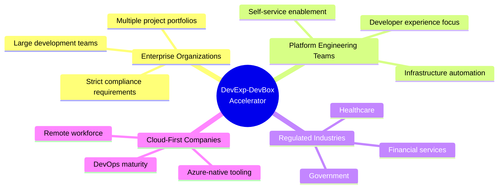
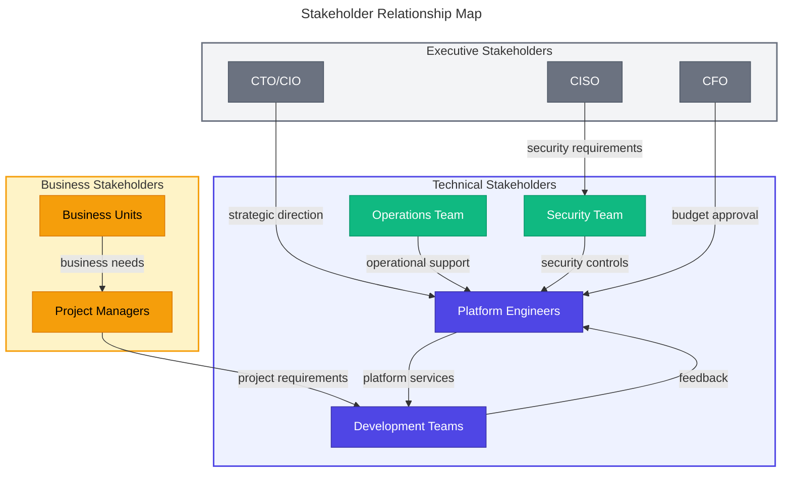
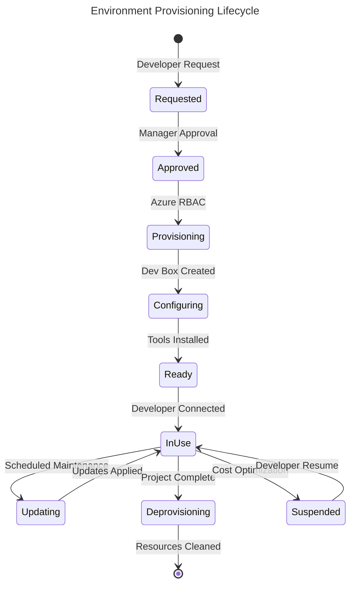
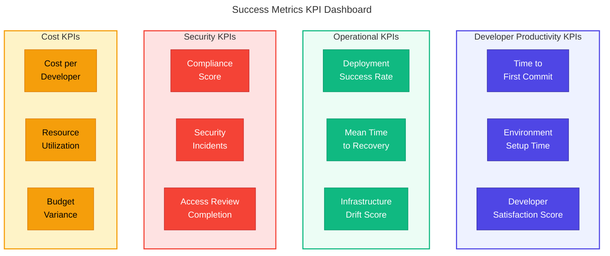

# 📊 Business Architecture

> [!NOTE]
> **Target Audience**: Business Decision Makers, Enterprise Architects, Project Managers  
> **Reading Time**: ~15 minutes

📍 <strong>Document Navigation</strong>

| Previous | Index | Next |
|:---------|:-----:|-----:|
| — | [Architecture Index](README.md) | [Data Architecture →](02-data-architecture.md) |

> **TOGAF Layer**: Business Architecture  
> **Version**: 1.0.0  
> **Last Updated**: January 22, 2026  
> **Author**: DevExp Team

---

## 📑 Table of Contents

- [📋 Executive Summary](#-executive-summary)
- [🎯 Business Context](#-business-context)
- [👥 Stakeholder Analysis](#-stakeholder-analysis)
- [🏗️ Business Capabilities](#️-business-capabilities)
- [🔄 Value Streams](#-value-streams)
- [📝 Business Requirements](#-business-requirements)
- [📈 Success Metrics](#-success-metrics)
- [📚 References](#-references)
- [📖 Glossary](#-glossary)

---

## 📋 Executive Summary

The **DevExp-DevBox Landing Zone Accelerator** is an enterprise-grade infrastructure-as-code solution that streamlines the deployment and management of Microsoft Dev Box environments on Azure. This accelerator enables organizations to rapidly provision secure, compliant, and scalable developer workstations while maintaining governance controls and operational excellence.

> [!TIP]
> **Key Benefit**: Reduce developer onboarding time from days to minutes with pre-configured, secure environments.

### Key Business Value Propositions

| Value Area | Description |
|:-----------|:------------|
| **Accelerated Developer Onboarding** | Reduce new developer setup time from days to minutes through pre-configured Dev Box environments |
| **Standardized Development Environments** | Ensure consistency across teams with role-specific configurations (backend, frontend engineers) |
| **Security & Compliance** | Built-in security controls with Key Vault integration, RBAC, and Azure AD authentication |
| **Cost Optimization** | Right-sized VM SKUs per role and centralized resource management |
| **Operational Efficiency** | Automated provisioning via Azure Developer CLI (azd) with CI/CD integration |

[↑ Back to Top](#-business-architecture)

---

## 🎯 Business Context

### Problem Statement

Modern enterprises face significant challenges in managing developer environments:

1. **Environment Inconsistency**: Developers spend excessive time configuring local machines, leading to "works on my machine" issues
2. **Security Risks**: Unmanaged developer workstations create security vulnerabilities
3. **Slow Onboarding**: New developer setup can take days or weeks
4. **Compliance Gaps**: Difficulty enforcing organizational policies on distributed workstations
5. **Cost Visibility**: Lack of centralized tracking for developer infrastructure costs

### Target Audience

### Business Drivers

| Driver | Description | Priority |
|:-------|:------------|:--------:|
| **Developer Productivity** | Eliminate environment setup overhead | High |
| **Security Posture** | Centralized security controls and monitoring | High |
| **Operational Excellence** | Automated, repeatable deployments | High |
| **Cost Management** | Predictable infrastructure costs | Medium |
| **Talent Retention** | Modern developer experience | Medium |
| **Compliance** | Meet regulatory requirements | High |

[↑ Back to Top](#-business-architecture)

---

## 👥 Stakeholder Analysis

### Stakeholder Map

### Stakeholder Registry

<strong>Click to expand Stakeholder Registry table</strong>

| Stakeholder | Role | Concerns | Interests | Engagement Level |
|-------------|------|----------|-----------|------------------|
| **Platform Engineers** | Build & maintain landing zones | Automation, scalability, maintainability | Infrastructure as Code, self-service capabilities | High - Primary implementers |
| **Development Teams** | Consume Dev Box environments | Fast onboarding, reliable environments, tool availability | Productivity, modern tooling, minimal friction | High - Primary users |
| **Security Team** | Ensure security compliance | Access control, secrets management, audit trails | Zero-trust architecture, compliance reporting | High - Governance |
| **Operations Team** | Monitor & support infrastructure | Observability, incident response, cost management | Centralized monitoring, automated remediation | Medium - Ongoing support |
| **Project Managers** | Coordinate project delivery | Resource allocation, timeline management | Predictable provisioning, clear ownership | Medium - Coordination |
| **CTO/CIO** | Strategic technology direction | ROI, innovation, competitive advantage | Developer productivity metrics, cost optimization | Low - Strategic oversight |
| **CISO** | Security governance | Risk mitigation, compliance adherence | Security posture, audit readiness | Medium - Policy approval |
| **CFO** | Financial oversight | Cost control, budget planning | Infrastructure cost visibility, optimization | Low - Budget approval |

### RACI Matrix

<strong>Click to expand RACI Matrix</strong>

| Activity | Platform Engineers | Dev Teams | Security | Operations | Project Managers |
|----------|-------------------|-----------|----------|------------|------------------|
| Landing Zone Design | **R/A** | C | C | C | I |
| Dev Box Provisioning | R | **A** | I | C | I |
| Security Configuration | C | I | **R/A** | C | I |
| Monitoring Setup | R | I | C | **A** | I |
| Cost Management | R | I | I | C | **A** |
| Incident Response | C | I | C | **R/A** | I |

> [!NOTE]
> **Legend**: R = Responsible, A = Accountable, C = Consulted, I = Informed

[↑ Back to Top](#-business-architecture)

---

## 🏗️ Business Capabilities

### Business Capability Model

```mermaid
---
title: Business Capability Model
---
graph TB
    %% ===== LEVEL 0: ROOT =====
    subgraph level0["Level 0: Developer Experience Platform"]
        L0["DevExp-DevBox<br/>Landing Zone Accelerator"]
    end
    
    %% ===== LEVEL 1: CORE DOMAINS =====
    subgraph level1["Level 1: Core Capability Domains"]
        SEC["Security<br/>Management"]
        MON["Monitoring &<br/>Observability"]
        CON["Connectivity<br/>Management"]
        WRK["Workload<br/>Management"]
    end
    
    %% ===== LEVEL 2: SECURITY =====
    subgraph level2sec["Level 2: Security Capabilities"]
        SEC1["Secrets Management"]
        SEC2["Identity & Access"]
        SEC3["Compliance Controls"]
    end
    
    %% ===== LEVEL 2: MONITORING =====
    subgraph level2mon["Level 2: Monitoring Capabilities"]
        MON1["Log Analytics"]
        MON2["Diagnostics"]
        MON3["Alerting"]
    end
    
    %% ===== LEVEL 2: CONNECTIVITY =====
    subgraph level2con["Level 2: Connectivity Capabilities"]
        CON1["Network Provisioning"]
        CON2["Network Isolation"]
        CON3["Hybrid Connectivity"]
    end
    
    %% ===== LEVEL 2: WORKLOAD =====
    subgraph level2wrk["Level 2: Workload Capabilities"]
        WRK1["DevCenter Management"]
        WRK2["Project Management"]
        WRK3["Pool Management"]
        WRK4["Catalog Management"]
    end
    
    %% ===== RELATIONSHIPS =====
    L0 -->|manages| SEC
    L0 -->|monitors| MON
    L0 -->|connects| CON
    L0 -->|orchestrates| WRK
    
    SEC -->|includes| SEC1
    SEC -->|includes| SEC2
    SEC -->|includes| SEC3
    
    MON -->|includes| MON1
    MON -->|includes| MON2
    MON -->|includes| MON3
    
    CON -->|includes| CON1
    CON -->|includes| CON2
    CON -->|includes| CON3
    
    WRK -->|includes| WRK1
    WRK -->|includes| WRK2
    WRK -->|includes| WRK3
    WRK -->|includes| WRK4
    
    %% ===== CLASS DEFINITIONS =====
    classDef primary fill:#4F46E5,stroke:#3730A3,color:#FFFFFF
    classDef security fill:#F44336,stroke:#C62828,color:#FFFFFF
    classDef monitoring fill:#10B981,stroke:#059669,color:#FFFFFF
    classDef connectivity fill:#818CF8,stroke:#4F46E5,color:#FFFFFF
    classDef workload fill:#F59E0B,stroke:#D97706,color:#000000
    
    %% ===== CLASS ASSIGNMENTS =====
    class L0 primary
    class SEC,SEC1,SEC2,SEC3 security
    class MON,MON1,MON2,MON3 monitoring
    class CON,CON1,CON2,CON3 connectivity
    class WRK,WRK1,WRK2,WRK3,WRK4 workload
    
    %% ===== SUBGRAPH STYLES =====
    style level0 fill:#E0E7FF,stroke:#4F46E5,stroke-width:2px
    style level1 fill:#F3F4F6,stroke:#6B7280,stroke-width:2px
    style level2sec fill:#FEE2E2,stroke:#F44336,stroke-width:2px
    style level2mon fill:#ECFDF5,stroke:#10B981,stroke-width:2px
    style level2con fill:#EEF2FF,stroke:#4F46E5,stroke-width:2px
    style level2wrk fill:#FEF3C7,stroke:#F59E0B,stroke-width:2px
```

### Capability to Landing Zone Mapping

| Business Capability | Landing Zone | Key Resources | Business Value |
|---------------------|--------------|---------------|----------------|
| **Secrets Management** | Security | Azure Key Vault | Secure credential storage for PAT tokens and service credentials |
| **Identity & Access** | Security | Azure RBAC, Managed Identities | Fine-grained access control with least privilege |
| **Compliance Controls** | Security | Purge Protection, Soft Delete | Data protection and audit compliance |
| **Log Analytics** | Monitoring | Log Analytics Workspace | Centralized logging for troubleshooting and compliance |
| **Diagnostics** | Monitoring | Diagnostic Settings | Resource health and performance monitoring |
| **Network Provisioning** | Connectivity | Virtual Networks, Subnets | Secure network infrastructure for Dev Box |
| **Network Isolation** | Connectivity | NSGs, Network Connections | Workload segmentation and security boundaries |
| **DevCenter Management** | Workload | Azure DevCenter | Central management for developer environments |
| **Project Management** | Workload | DevCenter Projects | Team-level environment organization |
| **Pool Management** | Workload | Dev Box Pools | Role-specific workstation configurations |
| **Catalog Management** | Workload | Git Catalogs | Configuration-as-code for Dev Box definitions |

[↑ Back to Top](#-business-architecture)

---

## 🔄 Value Streams

### Developer Onboarding Value Stream

```mermaid
---
title: Developer Onboarding Value Stream
---
graph LR
    %% ===== STAGE 1: REQUEST =====
    subgraph stage1["Stage 1: Request"]
        A1["Developer<br/>Joins Team"]
        A2["Access<br/>Request"]
    end
    
    %% ===== STAGE 2: PROVISIONING =====
    subgraph stage2["Stage 2: Provisioning"]
        B1["Azure AD<br/>Group Assignment"]
        B2["Project<br/>Access Granted"]
        B3["Dev Box<br/>Provisioned"]
    end
    
    %% ===== STAGE 3: CONFIGURATION =====
    subgraph stage3["Stage 3: Configuration"]
        C1["Image<br/>Downloaded"]
        C2["Tools<br/>Installed"]
        C3["Secrets<br/>Configured"]
    end
    
    %% ===== STAGE 4: PRODUCTIVE =====
    subgraph stage4["Stage 4: Productive"]
        D1["Developer<br/>Coding"]
        D2["Feedback<br/>Loop"]
    end
    
    %% ===== FLOW CONNECTIONS =====
    A1 -->|initiates| A2
    A2 -->|triggers| B1
    B1 -->|enables| B2
    B2 -->|creates| B3
    B3 -->|starts| C1
    C1 -->|installs| C2
    C2 -->|configures| C3
    C3 -->|enables| D1
    D1 -->|generates| D2
    D2 -.->|improvements| B3
    
    %% ===== CLASS DEFINITIONS =====
    classDef trigger fill:#818CF8,stroke:#4F46E5,color:#FFFFFF
    classDef primary fill:#4F46E5,stroke:#3730A3,color:#FFFFFF
    classDef secondary fill:#10B981,stroke:#059669,color:#FFFFFF
    classDef input fill:#F3F4F6,stroke:#6B7280,color:#000000
    
    %% ===== CLASS ASSIGNMENTS =====
    class A1,A2 input
    class B1,B2,B3 primary
    class C1,C2,C3 secondary
    class D1,D2 trigger
    
    %% ===== SUBGRAPH STYLES =====
    style stage1 fill:#F3F4F6,stroke:#6B7280,stroke-width:2px
    style stage2 fill:#EEF2FF,stroke:#4F46E5,stroke-width:2px
    style stage3 fill:#ECFDF5,stroke:#10B981,stroke-width:2px
    style stage4 fill:#E0E7FF,stroke:#4F46E5,stroke-width:2px
```

### Value Stream Metrics

| Stage | Traditional Approach | With DevExp-DevBox | Improvement |
|-------|---------------------|-------------------|-------------|
| **Request to Access** | 1-3 days | < 1 hour | 95% faster |
| **Environment Provisioning** | 4-8 hours | 15-30 minutes | 90% faster |
| **Tool Configuration** | 2-4 hours | Automated | 100% automated |
| **Time to First Commit** | 2-5 days | Same day | 80% faster |
| **Environment Consistency** | Variable | 100% consistent | Standardized |

### Environment Provisioning Lifecycle

[↑ Back to Top](#-business-architecture)

---

## 📝 Business Requirements

### Functional Requirements

| ID | Requirement | Priority | Landing Zone |
|:---|:------------|:--------:|:-------------|
| **FR-001** | Deploy Azure DevCenter with project organization | Must Have | Workload |
| **FR-002** | Provision Dev Box pools with role-specific configurations | Must Have | Workload |
| **FR-003** | Integrate Git catalogs for image definitions | Must Have | Workload |
| **FR-004** | Store secrets securely in Azure Key Vault | Must Have | Security |
| **FR-005** | Assign RBAC roles based on Azure AD groups | Must Have | Security |
| **FR-006** | Deploy virtual networks for Dev Box connectivity | Should Have | Connectivity |
| **FR-007** | Enable centralized logging via Log Analytics | Must Have | Monitoring |
| **FR-008** | Support multiple environment types (dev, staging, UAT) | Should Have | Workload |
| **FR-009** | Enable catalog synchronization from GitHub/Azure DevOps | Must Have | Workload |
| **FR-010** | Support managed and unmanaged network configurations | Should Have | Connectivity |

### Non-Functional Requirements

| ID | Requirement | Category | Target | Measurement |
|:---|:------------|:---------|:-------|:------------|
| **NFR-001** | Infrastructure deployment time | Performance | < 30 minutes | azd provision duration |
| **NFR-002** | Dev Box startup time | Performance | < 15 minutes | DevCenter metrics |
| **NFR-003** | System availability | Reliability | 99.9% | Azure Monitor |
| **NFR-004** | Secret access latency | Performance | < 100ms | Key Vault diagnostics |
| **NFR-005** | Audit log retention | Compliance | 90 days minimum | Log Analytics |
| **NFR-006** | RBAC propagation time | Performance | < 5 minutes | Manual testing |
| **NFR-007** | Disaster recovery | Reliability | RPO < 24 hours | Bicep redeployment |
| **NFR-008** | Cost visibility | Manageability | Per-project breakdown | Azure Cost Management |

[↑ Back to Top](#-business-architecture)

---

## 📈 Success Metrics

### Key Performance Indicators (KPIs)

### Success Metrics Dashboard

| Metric | Baseline | Target | Current | Status |
|--------|----------|--------|---------|--------|
| **Developer Onboarding Time** | 5 days | < 1 day | - | 🎯 Target |
| **Environment Consistency** | 60% | 100% | - | 🎯 Target |
| **Deployment Success Rate** | - | > 95% | - | 🎯 Target |
| **Security Compliance Score** | - | 100% | - | 🎯 Target |
| **Cost per Developer/Month** | Variable | Predictable | - | 🎯 Target |
| **Mean Time to Recovery** | - | < 1 hour | - | 🎯 Target |
| **Developer Satisfaction (NPS)** | - | > 50 | - | 🎯 Target |

### Business Value Realization

| Value Area | Metric | Expected Outcome |
|------------|--------|------------------|
| **Productivity** | Developer hours saved per onboarding | 16-32 hours |
| **Quality** | Environment-related incidents reduced | 70% reduction |
| **Security** | Security findings in developer environments | Zero critical findings |
| **Cost** | Infrastructure cost predictability | ±10% budget variance |
| **Speed** | Time to market for new projects | 2 weeks faster |

[↑ Back to Top](#-business-architecture)

---

## 📚 References

### Internal Documents

- [Data Architecture](02-data-architecture.md) - Configuration schemas and data flows
- [Application Architecture](03-application-architecture.md) - Module design and dependencies
- [Technology Architecture](04-technology-architecture.md) - Azure services and infrastructure
- [Security Architecture](05-security-architecture.md) - Security controls and compliance

### External References

- [Microsoft Dev Box Documentation](https://learn.microsoft.com/en-us/azure/dev-box/overview-what-is-microsoft-dev-box)
- [Azure Landing Zones](https://learn.microsoft.com/en-us/azure/cloud-adoption-framework/ready/landing-zone/)
- [Azure DevCenter Documentation](https://learn.microsoft.com/en-us/azure/dev-box/concept-dev-box-concepts)
- [TOGAF Architecture Framework](https://www.opengroup.org/togaf)

[↑ Back to Top](#-business-architecture)

---

## 📖 Glossary

| Term | Definition |
|------|------------|
| **Dev Box** | A cloud-based developer workstation provided by Microsoft Azure |
| **DevCenter** | Azure service for managing developer environments at scale |
| **Landing Zone** | A pre-configured Azure environment with governance, security, and networking |
| **Accelerator** | Pre-built infrastructure-as-code templates for rapid deployment |
| **Catalog** | Git repository containing Dev Box image definitions or environment templates |
| **Pool** | Collection of Dev Boxes with shared configuration (VM size, image, network) |
| **RBAC** | Role-Based Access Control - Azure's authorization system |
| **Managed Identity** | Azure AD identity automatically managed for Azure resources |
| **azd** | Azure Developer CLI - Command-line tool for Azure development workflows |

[↑ Back to Top](#-business-architecture)

---

## 📎 Related Documents

<strong>TOGAF Architecture Series</strong>

| Document | Description |
|:---------|:------------|
| 📊 **Business Architecture** | *You are here* |
| [🗄️ Data Architecture](02-data-architecture.md) | Configuration schemas, secrets management, data flows |
| [🏛️ Application Architecture](03-application-architecture.md) | Bicep module design, dependencies, patterns |
| [⚙️ Technology Architecture](04-technology-architecture.md) | Azure services, CI/CD, deployment tools |
| [🔐 Security Architecture](05-security-architecture.md) | Threat model, RBAC, compliance controls |

---

**[← Previous: Index](README.md)** | **[Next: Data Architecture →](02-data-architecture.md)**

---

*Document generated as part of TOGAF Architecture Documentation for DevExp-DevBox Landing Zone Accelerator*

