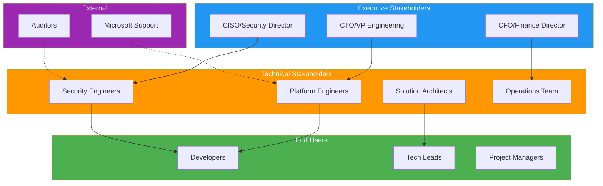
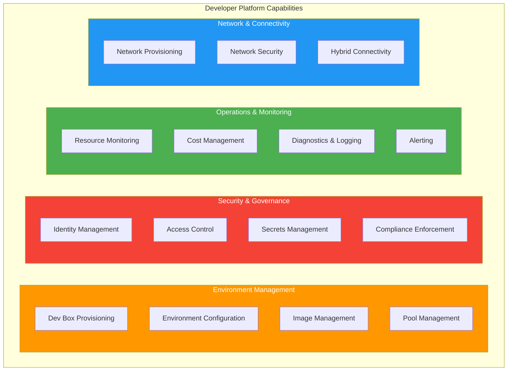
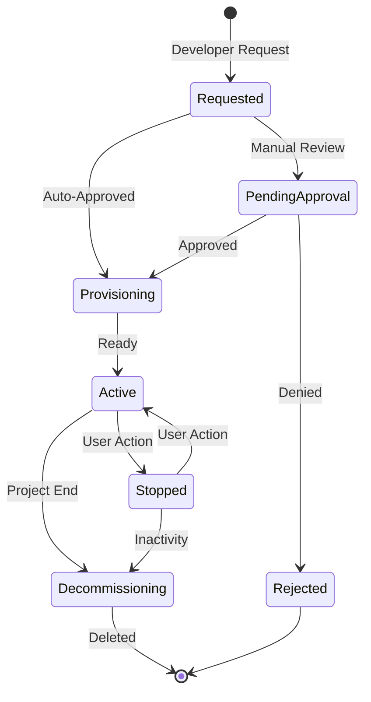
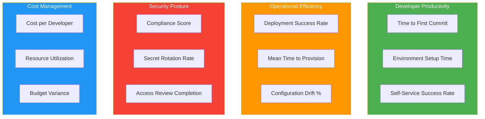

# 🏢 Business Architecture

> **DevExp-DevBox Landing Zone Accelerator**

| Property | Value |
|:---------|:------|
| **Version** | 1.0.0 |
| **Last Updated** | 2026-01-23 |
| **Author** | DevExp Team |
| **Status** | Published |

---

## 📑 Table of Contents

- [📋 Executive Summary](#executive-summary)
- [🎯 Business Context](#business-context)
- [👥 Stakeholder Analysis](#stakeholder-analysis)
- [⚙️ Business Capabilities](#business-capabilities)
- [🔄 Value Streams](#value-streams)
- [📝 Business Requirements](#business-requirements)
- [📊 Success Metrics](#success-metrics)
- [📖 Glossary](#glossary)
- [🔗 References](#references)

---

## 📋 Executive Summary

The **DevExp-DevBox Landing Zone Accelerator** is an enterprise-grade infrastructure-as-code solution that enables organizations to rapidly deploy and manage Microsoft Dev Box environments at scale. Built on Azure Landing Zone principles, it provides a standardized, secure, and compliant foundation for developer workstation provisioning.

### Key Business Value

| Value Proposition | Description |
|-------------------|-------------|
| **Time-to-Productivity** | Reduce developer onboarding from days to hours with pre-configured workstations |
| **Standardization** | Enforce consistent development environments across teams and projects |
| **Security by Design** | Built-in security controls, RBAC, and secrets management |
| **Cost Optimization** | Right-sized VM SKUs and centralized resource governance |
| **Self-Service** | Empower developers to provision their own environments within guardrails |

### Target Organizations

- Enterprise software development teams (500+ developers)
- Organizations with multiple development projects requiring environment isolation
- Companies with compliance requirements (SOC2, ISO 27001)
- Platform engineering teams building internal developer platforms (IDPs)

---

[⬆️ Back to Top](#-table-of-contents)

---

## 🎯 Business Context

### Problem Statement

Modern software development organizations face significant challenges in providing consistent, secure, and rapidly deployable development environments:

### Business Drivers

| Driver | Description | Priority |
|--------|-------------|----------|
| **Developer Experience** | Streamline developer workflows and reduce friction | High |
| **Security & Compliance** | Meet enterprise security requirements and regulatory standards | High |
| **Operational Efficiency** | Reduce manual intervention in environment provisioning | Medium |
| **Cost Control** | Optimize infrastructure spending through standardization | Medium |
| **Scalability** | Support growth without linear increase in operational burden | Medium |

### Target Audience

The DevExp-DevBox accelerator serves organizations that:

- Have 50+ developers requiring standardized development environments
- Use Azure as their primary cloud platform
- Follow DevOps/GitOps practices for infrastructure management
- Require centralized governance over development resources
- Need to support multiple projects with different tooling requirements

---

[⬆️ Back to Top](#-table-of-contents)

---

## 👥 Stakeholder Analysis

### Stakeholder Map

### Stakeholder Register

| Stakeholder | Role | Concerns | Interests | Influence |
|-------------|------|----------|-----------|-----------|
| **CTO/VP Engineering** | Strategic Decision Maker | ROI, developer productivity, competitive advantage | Faster time-to-market, reduced technical debt | High |
| **CISO/Security Director** | Security Governance | Data protection, compliance, access control | Zero-trust implementation, audit readiness | High |
| **CFO/Finance Director** | Budget Authority | Cost optimization, predictable spending | Resource utilization metrics, cost allocation | Medium |
| **Platform Engineers** | Primary Implementers | Maintainability, automation, extensibility | Infrastructure-as-code, GitOps workflows | High |
| **Solution Architects** | Design Authority | Scalability, integration, standards | Reference architectures, best practices | High |
| **Security Engineers** | Security Implementation | Threat mitigation, vulnerability management | Security controls, monitoring, response | Medium |
| **Operations Team** | Day-2 Operations | Reliability, monitoring, incident response | Observability, runbooks, alerting | Medium |
| **Developers** | End Users | Fast provisioning, self-service, tool availability | Productivity, autonomy, environment parity | Low |
| **Tech Leads** | Team Management | Team productivity, resource allocation | Project-specific configurations, access management | Medium |
| **Project Managers** | Delivery Management | Timeline adherence, resource availability | Status visibility, cost tracking | Low |
| **Microsoft Support** | Vendor Support | Product adoption, issue resolution | Feature requests, bug reports | Low |
| **Auditors** | Compliance Verification | Evidence collection, control validation | Audit trails, documentation | Low |

---

[⬆️ Back to Top](#-table-of-contents)

---

## ⚙️ Business Capabilities

### Capability Model

### Capability to Landing Zone Mapping

| Capability Domain | Landing Zone | Key Resources | Business Value |
|-------------------|--------------|---------------|----------------|
| **Environment Management** | Workload | DevCenter, Projects, Pools | Self-service developer provisioning |
| **Security & Governance** | Security | Key Vault, RBAC Assignments | Protection of sensitive data and access |
| **Operations & Monitoring** | Monitoring | Log Analytics, Diagnostics | Visibility and operational insights |
| **Network & Connectivity** | Connectivity | VNet, Subnets, NSGs | Secure network isolation |

### Capability Details

#### Environment Management Capabilities

| Capability | Description | Maturity Target |
|------------|-------------|-----------------|
| **Dev Box Provisioning** | Automated creation of developer workstations from curated images | Automated |
| **Environment Configuration** | DSC-based configuration of development tools and settings | Declarative |
| **Image Management** | Centralized catalog of approved VM images with versioning | Governed |
| **Pool Management** | Role-based pool configurations with appropriate sizing | Optimized |

#### Security & Governance Capabilities

| Capability | Description | Maturity Target |
|------------|-------------|-----------------|
| **Identity Management** | SystemAssigned managed identities for all workloads | Zero-Trust |
| **Access Control** | Fine-grained RBAC at subscription, RG, and resource levels | Least Privilege |
| **Secrets Management** | Centralized secrets with rotation and audit | Automated |
| **Compliance Enforcement** | Policy-driven compliance with tagging and configuration | Continuous |

---

[⬆️ Back to Top](#-table-of-contents)

---

## 🔄 Value Streams

### Primary Value Stream: Developer Onboarding

```mermaid
flowchart LR
    subgraph Trigger["Trigger"]
        T1["New Developer Joins"]
    end
    
    subgraph Request["Request Phase"]
        R1["Request Dev Box Access"]
        R2["Assign to Project"]
        R3["Select Dev Box Pool"]
    end
    
    subgraph Provision["Provisioning Phase"]
        P1["Create Dev Box Instance"]
        P2["Apply DSC Configuration"]
        P3["Clone Repositories"]
    end
    
    subgraph Validate["Validation Phase"]
        V1["Verify Tools Installed"]
        V2["Test Connectivity"]
        V3["Confirm Access"]
    end
    
    subgraph Outcome["Outcome"]
        O1["Developer Productive"]
    end
    
    T1 --> R1 --> R2 --> R3
    R3 --> P1 --> P2 --> P3
    P3 --> V1 --> V2 --> V3
    V3 --> O1
    
    style Trigger fill:#9C27B0,color:#fff
    style Request fill:#2196F3,color:#fff
    style Provision fill:#FF9800,color:#fff
    style Validate fill:#4CAF50,color:#fff
    style Outcome fill:#4CAF50,color:#fff
```

### Value Stream Metrics

| Stage | Target Duration | Key Metric |
|-------|-----------------|------------|
| **Request Phase** | < 15 minutes | Time to request approval |
| **Provisioning Phase** | < 60 minutes | Dev Box creation time |
| **Validation Phase** | < 30 minutes | First successful build |
| **End-to-End** | < 4 hours | Time to first commit |

### Secondary Value Stream: Environment Lifecycle

---

[⬆️ Back to Top](#-table-of-contents)

---

## 📝 Business Requirements

### Functional Requirements

| ID | Requirement | Priority | Source |
|----|-------------|----------|--------|
| **FR-001** | System shall provision Dev Box instances within 60 minutes | High | Developer Experience |
| **FR-002** | System shall support multiple projects with isolated configurations | High | Multi-tenancy |
| **FR-003** | System shall integrate with GitHub and Azure DevOps for catalog sync | High | DevOps Integration |
| **FR-004** | System shall support role-based VM SKU selection per pool | Medium | Cost Optimization |
| **FR-005** | System shall automatically configure development tools via DSC | Medium | Standardization |
| **FR-006** | System shall provide self-service portal access for developers | Medium | Developer Experience |
| **FR-007** | System shall support custom image definitions from Git catalogs | Low | Extensibility |

### Non-Functional Requirements

| ID | Requirement | Priority | Target |
|----|-------------|----------|--------|
| **NFR-001** | System shall achieve 99.9% availability for DevCenter services | High | SLA |
| **NFR-002** | System shall encrypt all secrets at rest and in transit | High | Security |
| **NFR-003** | System shall support 1000+ concurrent Dev Box instances | Medium | Scalability |
| **NFR-004** | System shall retain audit logs for 90 days minimum | Medium | Compliance |
| **NFR-005** | System shall complete deployments within 30 minutes | Medium | Performance |
| **NFR-006** | System shall support deployment across multiple Azure regions | Low | Availability |

### Compliance Requirements

| Requirement | Framework | Implementation |
|-------------|-----------|----------------|
| Access Control | SOC2 CC6.1 | RBAC with least privilege |
| Encryption | SOC2 CC6.7 | Key Vault with TLS 1.2+ |
| Audit Logging | SOC2 CC7.2 | Log Analytics with retention |
| Change Management | ISO 27001 A.12.1.2 | GitOps with approval workflows |

---

[⬆️ Back to Top](#-table-of-contents)

---

## 📊 Success Metrics

### Key Performance Indicators (KPIs)

### KPI Targets

| Category | KPI | Baseline | Target | Measurement |
|----------|-----|----------|--------|-------------|
| **Developer Productivity** | Time to First Commit | 2 days | < 4 hours | Azure DevCenter Metrics |
| **Developer Productivity** | Environment Setup Time | 4 hours | < 60 mins | Provisioning Logs |
| **Developer Productivity** | Self-Service Success Rate | N/A | > 95% | Support Tickets |
| **Operational Efficiency** | Deployment Success Rate | N/A | > 99% | Pipeline Metrics |
| **Operational Efficiency** | Mean Time to Provision | N/A | < 45 mins | DevCenter Telemetry |
| **Operational Efficiency** | Configuration Drift | N/A | < 5% | Compliance Scans |
| **Security Posture** | Compliance Score | N/A | > 90% | Azure Policy |
| **Security Posture** | Secret Rotation Rate | Manual | Automated | Key Vault Metrics |
| **Cost Management** | Cost per Developer | Variable | Predictable | Cost Management APIs |
| **Cost Management** | Resource Utilization | N/A | > 70% | Azure Monitor |

---

[⬆️ Back to Top](#-table-of-contents)

---

## 📖 Glossary

| Term | Definition |
|------|------------|
| **Dev Box** | Cloud-hosted developer workstation managed by Microsoft Dev Box service |
| **DevCenter** | Azure resource that serves as the administrative hub for Dev Box and Deployment Environments |
| **Landing Zone** | Pre-configured Azure environment that provides governance, security, and compliance foundations |
| **Pool** | Collection of Dev Boxes with identical configuration (image, VM SKU, network) |
| **Catalog** | Git repository containing Dev Box image definitions or environment templates |
| **DSC** | Desired State Configuration - declarative configuration management for Windows |
| **RBAC** | Role-Based Access Control - Azure authorization mechanism |
| **IaC** | Infrastructure as Code - managing infrastructure through version-controlled definitions |

---

[⬆️ Back to Top](#-table-of-contents)

---

## 🔗 References

### 🌐 External References

- [Microsoft Dev Box Documentation](https://learn.microsoft.com/en-us/azure/dev-box/)
- [Azure Landing Zones](https://learn.microsoft.com/en-us/azure/cloud-adoption-framework/ready/landing-zone/)
- [TOGAF Standard](https://pubs.opengroup.org/togaf-standard/)
- [Azure Well-Architected Framework](https://learn.microsoft.com/en-us/azure/well-architected/)

### 📚 Related Documents

- [Data Architecture](02-data-architecture.md)
- [Application Architecture](03-application-architecture.md)
- [Technology Architecture](04-technology-architecture.md)
- [Security Architecture](05-security-architecture.md)
