# 🏢 Business Architecture

> **DevExp-DevBox Landing Zone Accelerator**

> [!NOTE]
>
> **Target Audience:** Business Decision Makers, Enterprise Architects, Platform
> Engineers
>
> **Reading Time:** ~15 minutes

<strong>📍 Navigation</strong>

| Previous |                Index                 |                                                Next |
| :------- | :----------------------------------: | --------------------------------------------------: |
| -        | [🏠 Architecture Index](./README.md) | [📊 Data Architecture →](./02-data-architecture.md) |

| Metadata         | Value                     |
| ---------------- | ------------------------- |
| **Version**      | 1.0.0                     |
| **Last Updated** | January 22, 2026          |
| **Author**       | Platform Engineering Team |
| **Status**       | Active                    |

---

## 📑 Table of Contents

- [📋 Executive Summary](#-executive-summary)
- [🏢 Business Context](#-business-context)
- [👥 Stakeholder Analysis](#-stakeholder-analysis)
- [💼 Business Capabilities](#-business-capabilities)
- [🔄 Value Streams](#-value-streams)
- [📝 Business Requirements](#-business-requirements)
- [📊 Success Metrics](#-success-metrics)
- [📚 References](#-references)
- [📖 Glossary](#-glossary)

---

## 📋 Executive Summary

The **DevExp-DevBox Landing Zone Accelerator** is a comprehensive
infrastructure-as-code solution that automates the deployment and management of
Microsoft Dev Box environments on Azure. This accelerator enables organizations
to provision secure, compliant, and scalable developer workstations following
Azure Landing Zone best practices.

> [!TIP]
>
> **Quick Value Summary:** This accelerator reduces developer onboarding from
> days to hours while ensuring security compliance and cost visibility.

### Key Business Value

| Value Proposition                    | Description                                                    |
| ------------------------------------ | -------------------------------------------------------------- |
| **Accelerated Developer Onboarding** | Reduce new developer setup time from days to hours             |
| **Standardized Environments**        | Ensure consistent tooling and configurations across teams      |
| **Security by Design**               | Built-in RBAC, Key Vault integration, and compliance controls  |
| **Cost Optimization**                | Role-specific VM SKUs and resource tagging for cost allocation |
| **Operational Excellence**           | Centralized monitoring, diagnostics, and lifecycle management  |

### Target Outcomes

---

## 🏢 Business Context

### Problem Statement

Enterprise development teams face significant challenges in maintaining
consistent, secure, and scalable developer workstations:

| Challenge                     | Impact                                             | Solution Approach                                                  |
| ----------------------------- | -------------------------------------------------- | ------------------------------------------------------------------ |
| **Inconsistent Environments** | "Works on my machine" syndrome, debugging overhead | Standardized Dev Box definitions with role-specific configurations |
| **Slow Onboarding**           | Days/weeks to provision new developer machines     | Automated provisioning through DevCenter projects and pools        |
| **Security Gaps**             | Manual credential management, compliance risks     | Centralized Key Vault, RBAC, and managed identities                |
| **Operational Overhead**      | Manual infrastructure management                   | Infrastructure-as-Code with Bicep, GitOps workflows                |
| **Cost Visibility**           | Untracked resource consumption                     | Consistent tagging strategy and resource grouping                  |

### Target Audience

The DevExp-DevBox accelerator serves organizations that:

- Operate cloud-native or hybrid development teams
- Require standardized, secure development environments
- Follow DevOps and Infrastructure-as-Code practices
- Need to demonstrate compliance with security frameworks
- Manage multiple projects or product teams

### Business Drivers

---

## 👥 Stakeholder Analysis

### Stakeholder Map

### Detailed Stakeholder Analysis

| Stakeholder            | Role                                                | Key Concerns                                     | Interests                                           | Communication Needs                                 |
| ---------------------- | --------------------------------------------------- | ------------------------------------------------ | --------------------------------------------------- | --------------------------------------------------- |
| **Platform Engineers** | Design and maintain the landing zone infrastructure | Scalability, maintainability, automation         | Modular architecture, IaC patterns, extensibility   | Technical documentation, architecture decisions     |
| **Security Team**      | Ensure compliance and security posture              | RBAC, secrets management, audit trails           | Key Vault integration, identity management, logging | Security controls documentation, compliance reports |
| **Developers**         | Consume Dev Box environments                        | Fast provisioning, correct tooling, self-service | Quick onboarding, consistent environments           | User guides, self-service portals                   |
| **DevOps Engineers**   | Manage CI/CD pipelines and deployments              | Automation, reliability, deployment velocity     | Pipeline integration, GitOps workflows              | Deployment procedures, runbooks                     |
| **IT Operations**      | Monitor and support production systems              | Observability, incident response, SLA compliance | Log Analytics integration, alerting                 | Operational dashboards, incident procedures         |
| **Finance/FinOps**     | Manage cloud costs and budgets                      | Cost visibility, budget compliance, chargebacks  | Resource tagging, cost allocation                   | Cost reports, budget alerts                         |
| **Project Managers**   | Coordinate development activities                   | Team productivity, project timelines             | Environment availability, team onboarding           | Status reports, capacity planning                   |
| **Executive Sponsors** | Strategic oversight and funding                     | Business value, ROI, risk management             | Success metrics, strategic alignment                | Executive summaries, KPI dashboards                 |

### RACI Matrix

| Activity                 | Platform Engineers | Security Team | Developers | DevOps | IT Ops  | Finance |
| ------------------------ | ------------------ | ------------- | ---------- | ------ | ------- | ------- |
| Landing Zone Design      | **R/A**            | C             | I          | C      | C       | I       |
| Security Configuration   | C                  | **R/A**       | I          | I      | C       | I       |
| DevCenter Setup          | **R/A**            | C             | I          | C      | I       | I       |
| Pool Definition          | **R**              | C             | C          | **A**  | I       | I       |
| Environment Provisioning | C                  | I             | **R**      | **A**  | I       | I       |
| Cost Monitoring          | I                  | I             | I          | I      | C       | **R/A** |
| Incident Response        | C                  | C             | I          | C      | **R/A** | I       |

_R = Responsible, A = Accountable, C = Consulted, I = Informed_

---

## 💼 Business Capabilities

### Business Capability Model

```mermaid
block-beta
    columns 4

    block:header:4
        A["DevExp-DevBox Business Capabilities"]
    end

    block:security:1
        B["🔐 Security"]
        B1["Key Vault Management"]
        B2["RBAC Administration"]
        B3["Secret Lifecycle"]
        B4["Compliance Reporting"]
    end

    block:monitoring:1
        C["📊 Monitoring"]
        C1["Log Analytics"]
        C2["Diagnostic Settings"]
        C3["Performance Metrics"]
        C4["Alert Management"]
    end

    block:connectivity:1
        D["🌐 Connectivity"]
        D1["VNet Management"]
        D2["Subnet Configuration"]
        D3["Network Connections"]
        D4["NSG Rules"]
    end

    block:workload:1
        E["💻 Workload"]
        E1["DevCenter Management"]
        E2["Project Administration"]
        E3["Pool Configuration"]
        E4["Catalog Management"]
    end
```

### Capability to Landing Zone Mapping

| Capability Domain              | Landing Zone              | Azure Resources                                | Bicep Modules                                                            |
| ------------------------------ | ------------------------- | ---------------------------------------------- | ------------------------------------------------------------------------ |
| **Security Management**        | Security Landing Zone     | Key Vault, Secrets, Access Policies            | `security.bicep`, `keyVault.bicep`, `secret.bicep`                       |
| **Monitoring & Observability** | Monitoring Landing Zone   | Log Analytics Workspace, Diagnostic Settings   | `logAnalytics.bicep`                                                     |
| **Network Management**         | Connectivity Landing Zone | Virtual Networks, Subnets, Network Connections | `vnet.bicep`, `networkConnection.bicep`, `connectivity.bicep`            |
| **Developer Workload**         | Workload Landing Zone     | DevCenter, Projects, Pools, Catalogs           | `devCenter.bicep`, `project.bicep`, `projectPool.bicep`, `catalog.bicep` |
| **Identity Management**        | Cross-cutting             | Managed Identities, Role Assignments           | `devCenterRoleAssignment.bicep`, `projectIdentityRoleAssignment.bicep`   |

### Capability Details

#### Security Capability

| Sub-Capability       | Description                                                                    | Business Value                                    |
| -------------------- | ------------------------------------------------------------------------------ | ------------------------------------------------- |
| Key Vault Management | Centralized secrets, keys, and certificates storage                            | Eliminates credential sprawl, enables rotation    |
| RBAC Administration  | Role-based access control at subscription, resource group, and resource levels | Principle of least privilege enforcement          |
| Secret Lifecycle     | Automated secret creation, rotation, and expiration                            | Reduced security incidents from stale credentials |
| Compliance Reporting | Audit logging and diagnostic data collection                                   | Regulatory compliance demonstration               |

#### Workload Capability

| Sub-Capability         | Description                                         | Business Value                                  |
| ---------------------- | --------------------------------------------------- | ----------------------------------------------- |
| DevCenter Management   | Centralized control plane for Dev Box environments  | Single pane of glass administration             |
| Project Administration | Logical grouping of development teams and resources | Team isolation and governance                   |
| Pool Configuration     | Role-specific VM definitions and configurations     | Right-sized resources, cost optimization        |
| Catalog Management     | Centralized image and environment definitions       | Standardized, version-controlled configurations |

---

## 🔄 Value Streams

### Developer Onboarding Value Stream

### Value Stream Stages

| Stage                         | Activities                                                | Inputs              | Outputs                | Duration  | Automation Level |
| ----------------------------- | --------------------------------------------------------- | ------------------- | ---------------------- | --------- | ---------------- |
| **Identity Setup**            | Add developer to Azure AD group                           | HR onboarding data  | Group membership       | Minutes   | Manual/Automated |
| **Access Provisioning**       | RBAC roles automatically assigned via group membership    | AD group membership | Project access         | Seconds   | Fully Automated  |
| **Environment Selection**     | Developer accesses DevCenter and selects appropriate pool | DevCenter access    | Pool selection         | Minutes   | Self-Service     |
| **Dev Box Provisioning**      | Dev Box VM created from pool definition                   | Pool config, image  | Running VM             | 30-60 min | Fully Automated  |
| **Configuration Application** | DSC configurations apply required tools and settings      | DSC YAML configs    | Configured workstation | 15-30 min | Fully Automated  |
| **Productivity Start**        | Developer begins work with all required tools             | Configured Dev Box  | Productive developer   | Immediate | N/A              |

### Environment Provisioning Lifecycle

---

## 📝 Business Requirements

### Functional Requirements

| ID         | Requirement                                                  | Priority    | Source               | Acceptance Criteria                                      |
| ---------- | ------------------------------------------------------------ | ----------- | -------------------- | -------------------------------------------------------- |
| **FR-001** | System shall provision DevCenter with configurable settings  | Must Have   | Platform Engineering | DevCenter deployed with YAML-defined settings            |
| **FR-002** | System shall create role-specific Dev Box pools              | Must Have   | Development Teams    | Pools created with specified VM SKUs and images          |
| **FR-003** | System shall manage secrets in Azure Key Vault               | Must Have   | Security Team        | GitHub/ADO tokens stored securely with RBAC              |
| **FR-004** | System shall assign RBAC roles based on AD group membership  | Must Have   | Security Team        | Developers receive appropriate permissions automatically |
| **FR-005** | System shall support multiple projects within DevCenter      | Should Have | Project Management   | Multiple projects with isolated configurations           |
| **FR-006** | System shall integrate Git catalogs for image definitions    | Should Have | Platform Engineering | Catalogs sync from GitHub/Azure DevOps                   |
| **FR-007** | System shall configure diagnostic settings for all resources | Should Have | IT Operations        | All resources send logs to Log Analytics                 |
| **FR-008** | System shall support both managed and unmanaged networks     | Could Have  | Network Team         | Network type configurable per project                    |

### Non-Functional Requirements

| ID          | Requirement                                             | Category        | Target          | Measurement                   |
| ----------- | ------------------------------------------------------- | --------------- | --------------- | ----------------------------- |
| **NFR-001** | Deployment shall complete within 30 minutes             | Performance     | < 30 min        | Pipeline duration metrics     |
| **NFR-002** | Infrastructure code shall be idempotent                 | Reliability     | 100%            | Repeated deployments succeed  |
| **NFR-003** | All resources shall have consistent tagging             | Governance      | 100% compliance | Azure Policy evaluation       |
| **NFR-004** | Secrets shall use RBAC authorization only               | Security        | RBAC enabled    | Key Vault configuration audit |
| **NFR-005** | Solution shall support 12+ Azure regions                | Scalability     | 12 regions      | Deployment validation         |
| **NFR-006** | Configuration changes shall be version controlled       | Maintainability | 100%            | Git history tracking          |
| **NFR-007** | Deployment shall work with both GitHub and Azure DevOps | Compatibility   | Both platforms  | CI/CD pipeline success        |

### Requirements Traceability

---

## 📊 Success Metrics

### Key Performance Indicators (KPIs)

| KPI                               | Description                                         | Target        | Measurement Method      | Frequency      |
| --------------------------------- | --------------------------------------------------- | ------------- | ----------------------- | -------------- |
| **Developer Onboarding Time**     | Time from AD group addition to productive Dev Box   | < 2 hours     | Tracking timestamps     | Per onboarding |
| **Deployment Success Rate**       | Percentage of successful infrastructure deployments | > 99%         | CI/CD pipeline metrics  | Weekly         |
| **Environment Provisioning Time** | Time to provision a new Dev Box                     | < 60 minutes  | DevCenter metrics       | Daily          |
| **Security Compliance Score**     | Azure Security Center compliance percentage         | > 95%         | Azure Security Center   | Weekly         |
| **Resource Tagging Compliance**   | Percentage of resources with required tags          | 100%          | Azure Policy            | Daily          |
| **Cost per Developer**            | Monthly Azure spend per active developer            | Baseline -10% | Cost Management reports | Monthly        |
| **Mean Time to Recovery**         | Average time to resolve infrastructure issues       | < 4 hours     | Incident tracking       | Per incident   |

### Success Metrics Dashboard

### Business Value Realization

| Metric                                  | Before Accelerator | After Accelerator | Improvement     |
| --------------------------------------- | ------------------ | ----------------- | --------------- |
| Developer Onboarding                    | 3-5 days           | 2-4 hours         | 90%+ reduction  |
| Environment Consistency                 | 60%                | 100%              | 40% improvement |
| Security Incidents (credential-related) | 5/quarter          | <1/quarter        | 80%+ reduction  |
| Infrastructure Deployment Time          | 2-3 days           | 30 minutes        | 95%+ reduction  |
| Compliance Audit Preparation            | 2 weeks            | 2 days            | 85% reduction   |

---

## 📚 References

### External References

| Reference                       | URL                                                                            | Description                    |
| ------------------------------- | ------------------------------------------------------------------------------ | ------------------------------ |
| Microsoft Dev Box Documentation | https://learn.microsoft.com/azure/dev-box/                                     | Official Dev Box documentation |
| Azure Landing Zones             | https://learn.microsoft.com/azure/cloud-adoption-framework/ready/landing-zone/ | CAF Landing Zone guidance      |
| DevExp-DevBox Accelerator       | https://evilazaro.github.io/DevExp-DevBox/                                     | Project documentation site     |
| TOGAF Standard                  | https://www.opengroup.org/togaf                                                | TOGAF architecture framework   |

### Related Architecture Documents

| Document                 | Path                                                               | Description                         |
| ------------------------ | ------------------------------------------------------------------ | ----------------------------------- |
| Data Architecture        | [02-data-architecture.md](./02-data-architecture.md)               | Data entities and information flows |
| Application Architecture | [03-application-architecture.md](./03-application-architecture.md) | Bicep module architecture           |
| Technology Architecture  | [04-technology-architecture.md](./04-technology-architecture.md)   | Azure services and infrastructure   |

---

## 📖 Glossary

| Term             | Definition                                                                       |
| ---------------- | -------------------------------------------------------------------------------- |
| **Dev Box**      | Microsoft's cloud-powered developer workstation service                          |
| **DevCenter**    | Azure resource that manages Dev Box projects, pools, and catalogs                |
| **Landing Zone** | A pre-configured Azure environment with governance, security, and connectivity   |
| **Pool**         | A collection of Dev Boxes with the same configuration (VM SKU, image, network)   |
| **Catalog**      | A Git repository containing Dev Box image definitions or environment definitions |
| **RBAC**         | Role-Based Access Control - Azure's authorization system                         |
| **DSC**          | Desired State Configuration - declarative configuration management               |
| **IaC**          | Infrastructure as Code - managing infrastructure through code                    |
| **azd**          | Azure Developer CLI - tool for deploying Azure applications                      |
| **Bicep**        | Domain-specific language for deploying Azure resources                           |

---

_This document follows TOGAF Architecture Development Method (ADM) principles
and aligns with the Business Architecture domain of the BDAT framework._

---

**[⬆️ Back to Top](#-business-architecture)** |
**[📊 Data Architecture →](./02-data-architecture.md)**

