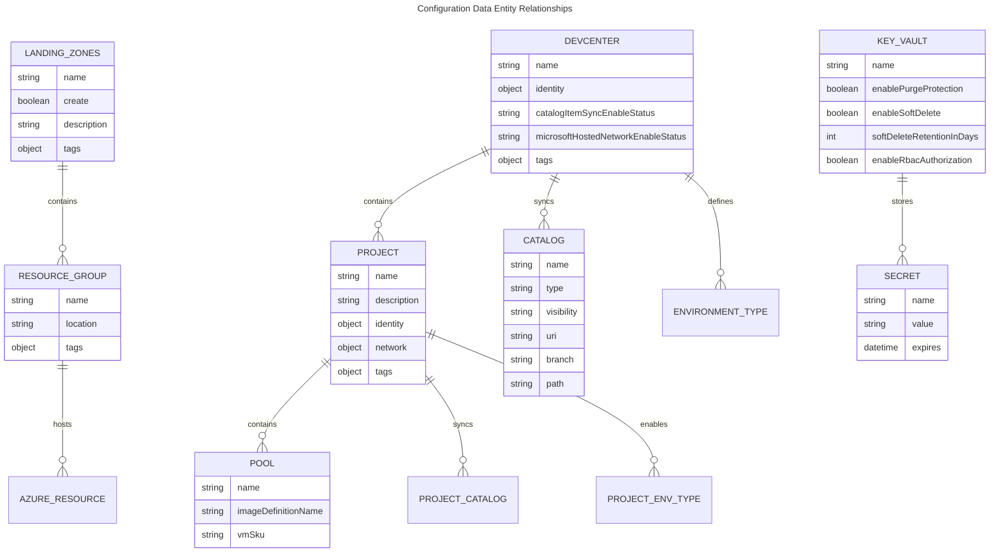

# 🗄️ Data Architecture

> **DevExp-DevBox Landing Zone Accelerator**

> [!NOTE]
> **Target Audience:** Data Architects, Platform Engineers, Security Engineers  
> **Reading Time:** ~20 minutes

<details>
<summary>📍 Navigation</summary>

| Previous | Index | Next |
|:---------|:-----:|-----:|
| [← Business Architecture](01-business-architecture.md) | [Architecture Index](../README.md) | [Application Architecture →](03-application-architecture.md) |

</details>

| Property | Value |
|:---------|:------|
| **Version** | 1.0.0 |
| **Last Updated** | 2026-01-23 |
| **Author** | DevExp Team |
| **Status** | Published |

---

## 📑 Table of Contents

- [📊 Data Overview](#data-overview)
- [📁 Configuration Data Model](#configuration-data-model)
- [🔐 Secrets Management](#secrets-management)
- [📶 Telemetry & Diagnostics](#telemetry--diagnostics)
- [🔄 Data Flow Diagrams](#data-flow-diagrams)
- [🛡️ Data Governance](#data-governance)
- [📝 Schema Documentation](#schema-documentation)
- [📖 Glossary](#glossary)
- [🔗 References](#references)

---

## 📊 Data Overview

The DevExp-DevBox accelerator manages four primary categories of data, each with distinct lifecycle, sensitivity, and storage requirements.

### Data Categories

```mermaid
---
title: Data Categories Overview
---
flowchart TB
    %% ===== DATA CATEGORIES =====
    subgraph DataCategories["📊 Data Categories"]
        %% ===== CONFIGURATION DATA =====
        subgraph Config["⚙️ Configuration Data"]
            C1["📁 Resource Organization"]
            C2["🔒 Security Settings"]
            C3["📦 Workload Definitions"]
        end
        
        %% ===== SECRETS & CREDENTIALS =====
        subgraph Secrets["🔐 Secrets & Credentials"]
            S1["🔑 GitHub PAT Tokens"]
            S2["🎫 Azure DevOps PATs"]
            S3["👤 Service Principal Credentials"]
        end
        
        %% ===== TELEMETRY & DIAGNOSTICS =====
        subgraph Telemetry["📶 Telemetry & Diagnostics"]
            T1["📝 Resource Logs"]
            T2["📊 Metrics"]
            T3["📋 Activity Logs"]
        end
        
        %% ===== DEPLOYMENT STATE =====
        subgraph State["💾 Deployment State"]
            ST1["🌐 azd Environment"]
            ST2["📄 Bicep Outputs"]
            ST3["🆔 Resource IDs"]
        end
    end
    
    %% ===== STYLES =====
    classDef primary fill:#4F46E5,stroke:#3730A3,color:#FFFFFF
    classDef failed fill:#F44336,stroke:#C62828,color:#FFFFFF
    classDef secondary fill:#10B981,stroke:#059669,color:#FFFFFF
    classDef datastore fill:#F59E0B,stroke:#D97706,color:#000000
    
    class C1,C2,C3 primary
    class S1,S2,S3 failed
    class T1,T2,T3 secondary
    class ST1,ST2,ST3 datastore
    
    style DataCategories fill:#F3F4F6,stroke:#6B7280,stroke-width:2px
    style Config fill:#E0E7FF,stroke:#4F46E5,stroke-width:2px
    style Secrets fill:#FEE2E2,stroke:#F44336,stroke-width:2px
    style Telemetry fill:#ECFDF5,stroke:#10B981,stroke-width:2px
    style State fill:#FEF3C7,stroke:#F59E0B,stroke-width:2px
```



### Data Classification Matrix

| Data Type | Classification | Storage Location | Encryption | Retention |
|-----------|---------------|------------------|------------|-----------|
| Resource Organization Config | Internal | Git Repository | At Rest (Git) | Indefinite |
| Security Settings | Internal | Git Repository | At Rest (Git) | Indefinite |
| Workload Definitions | Internal | Git Repository | At Rest (Git) | Indefinite |
| GitHub PAT Tokens | Confidential | Azure Key Vault | AES-256 | Until Rotation |
| Azure DevOps PATs | Confidential | Azure Key Vault | AES-256 | Until Rotation |
| Service Principal Secrets | Confidential | GitHub Secrets | Encrypted | 1 Year |
| Resource Logs | Internal | Log Analytics | At Rest | 90 Days |
| Metrics Data | Internal | Azure Monitor | At Rest | 93 Days |
| Activity Logs | Internal | Log Analytics | At Rest | 90 Days |
| azd Environment State | Internal | Local `.azure/` | None | Session |
| Bicep Outputs | Internal | Azure/Pipeline | At Rest | Deployment |

---

[⬆️ Back to Top](#-table-of-contents)

---

## 📁 Configuration Data Model

The accelerator uses YAML-based configuration files with JSON Schema validation. All configuration is loaded at deployment time using Bicep's `loadYamlContent()` function.

### Entity Relationship Diagram



### Configuration File Structure

```
infra/settings/
├── resourceOrganization/
│   ├── azureResources.yaml      # Landing zone definitions
│   └── azureResources.schema.json
├── security/
│   ├── security.yaml            # Key Vault configuration
│   └── security.schema.json
└── workload/
    ├── devcenter.yaml           # DevCenter & projects
    └── devcenter.schema.json
```

### azureResources.yaml Schema

Defines the landing zone resource group organization following Azure Cloud Adoption Framework principles.

```yaml
# Schema: azureResources.schema.json
workload:
  create: true                    # Create new or use existing
  name: devexp-workload           # Base name (suffix added)
  description: prodExp
  tags:
    environment: dev
    division: Platforms
    team: DevExP
    project: Contoso-DevExp-DevBox
    costCenter: IT
    owner: Contoso
    landingZone: Workload
    resources: ResourceGroup

security:
  create: true
  name: devexp-security
  # ... tags

monitoring:
  create: true
  name: devexp-monitoring
  # ... tags
```

| Field | Type | Required | Description |
|-------|------|----------|-------------|
| `create` | boolean | Yes | Whether to create new resource group |
| `name` | string | Yes | Base name for resource group |
| `description` | string | No | Purpose description |
| `tags` | object | Yes | Resource tags for governance |

### security.yaml Schema

Defines Azure Key Vault configuration for secrets management.

```yaml
# Schema: security.schema.json
create: true

keyVault:
  name: contoso                   # Globally unique (suffix added)
  description: Development Environment Key Vault
  secretName: gha-token           # Name for GitHub token
  
  # Security settings
  enablePurgeProtection: true
  enableSoftDelete: true
  softDeleteRetentionInDays: 7
  enableRbacAuthorization: true
  
  tags:
    environment: dev
    landingZone: security
    # ... additional tags
```

| Field | Type | Required | Default | Description |
|-------|------|----------|---------|-------------|
| `create` | boolean | Yes | - | Create new Key Vault |
| `keyVault.name` | string | Yes | - | Base name for Key Vault |
| `keyVault.secretName` | string | Yes | - | Name for PAT secret |
| `keyVault.enablePurgeProtection` | boolean | No | true | Prevent permanent deletion |
| `keyVault.enableSoftDelete` | boolean | No | true | Enable soft delete |
| `keyVault.softDeleteRetentionInDays` | integer | No | 7 | Retention period (7-90) |
| `keyVault.enableRbacAuthorization` | boolean | No | true | Use RBAC for access |

### devcenter.yaml Schema

Comprehensive DevCenter configuration including projects, pools, catalogs, and RBAC.

```yaml
# Schema: devcenter.schema.json
name: "devexp-devcenter"
catalogItemSyncEnableStatus: "Enabled"
microsoftHostedNetworkEnableStatus: "Enabled"
installAzureMonitorAgentEnableStatus: "Enabled"

identity:
  type: "SystemAssigned"
  roleAssignments:
    devCenter:
      - id: "b24988ac-6180-42a0-ab88-20f7382dd24c"
        name: "Contributor"
        scope: "Subscription"
      # ... additional roles
    orgRoleTypes:
      - type: DevManager
        azureADGroupId: "<guid>"
        azureADGroupName: "Platform Engineering Team"
        azureRBACRoles:
          - name: "DevCenter Project Admin"
            id: "331c37c6-af14-46d9-b9f4-e1909e1b95a0"
            scope: ResourceGroup

catalogs:
  - name: "customTasks"
    type: gitHub
    visibility: public
    uri: "https://github.com/microsoft/devcenter-catalog.git"
    branch: "main"
    path: "./Tasks"

environmentTypes:
  - name: "dev"
  - name: "staging"
  - name: "UAT"

projects:
  - name: "eShop"
    description: "eShop project."
    network:
      name: eShop
      create: true
      virtualNetworkType: Managed
      addressPrefixes: ["10.0.0.0/16"]
      subnets:
        - name: eShop-subnet
          properties:
            addressPrefix: 10.0.1.0/24
    identity:
      type: SystemAssigned
      roleAssignments:
        - azureADGroupId: "<guid>"
          azureADGroupName: "eShop Developers"
          azureRBACRoles:
            - name: "Dev Box User"
              id: "45d50f46-0b78-4001-a660-4198cbe8cd05"
              scope: Project
    pools:
      - name: "backend-engineer"
        imageDefinitionName: "eShop-backend-engineer"
        vmSku: general_i_32c128gb512ssd_v2
      - name: "frontend-engineer"
        imageDefinitionName: "eShop-frontend-engineer"
        vmSku: general_i_16c64gb256ssd_v2
    catalogs:
      - name: "environments"
        type: environmentDefinition
        sourceControl: gitHub
        visibility: private
        uri: "https://github.com/Evilazaro/eShop.git"
        branch: "main"
        path: "/.devcenter/environments"
```

---

[⬆️ Back to Top](#-table-of-contents)

---

## 🔐 Secrets Management

### Secret Types and Lifecycle

```mermaid
---
title: Secret Types and Lifecycle
---
flowchart TB
    %% ===== SECRET SOURCES =====
    subgraph Sources["🔑 Secret Sources"]
        GH["🐙 GitHub CLI<br/>(gh auth token)"]
        ADO["🔷 Azure DevOps CLI<br/>Manual Entry"]
        SP["👤 Service Principal<br/>(az ad sp create-for-rbac)"]
    end
    
    %% ===== SECRET STORAGE =====
    subgraph Storage["🔐 Secret Storage"]
        KV["🏛️ Azure Key Vault<br/>(gha-token secret)"]
        GHS["📦 GitHub Secrets<br/>(AZURE_CREDENTIALS)"]
        ENV["📄 azd Environment<br/>(.azure/.env)"]
    end
    
    %% ===== SECRET CONSUMERS =====
    subgraph Consumers["⚡ Secret Consumers"]
        CAT["📚 DevCenter Catalogs<br/>(Private Repos)"]
        WF["🔄 GitHub Actions<br/>(OIDC Auth)"]
        DEP["🚀 azd Provision<br/>(Key Vault)"]
    end
    
    %% ===== CONNECTIONS =====
    GH -->|extracts| ENV
    ENV -->|stores| KV
    ADO -->|provides| ENV
    SP -->|configures| GHS
    
    KV -->|authenticates| CAT
    GHS -->|authorizes| WF
    KV -->|provisions| DEP
    
    %% ===== STYLES =====
    classDef datastore fill:#F59E0B,stroke:#D97706,color:#000000
    classDef failed fill:#F44336,stroke:#C62828,color:#FFFFFF
    classDef secondary fill:#10B981,stroke:#059669,color:#FFFFFF
    
    class GH,ADO,SP datastore
    class KV,GHS,ENV failed
    class CAT,WF,DEP secondary
    
    style Sources fill:#FEF3C7,stroke:#F59E0B,stroke-width:2px
    style Storage fill:#FEE2E2,stroke:#F44336,stroke-width:2px
    style Consumers fill:#ECFDF5,stroke:#10B981,stroke-width:2px
```



### Secret Inventory

| Secret Name | Type | Storage | Consumer | Rotation Policy |
|-------------|------|---------|----------|-----------------|
| `gha-token` | GitHub PAT | Key Vault | DevCenter Catalogs | 90 days |
| `KEY_VAULT_SECRET` | GitHub/ADO PAT | azd Environment | Deployment | Manual |
| `AZURE_CREDENTIALS` | Service Principal JSON | GitHub Secrets | GitHub Actions | 365 days |
| `AZURE_CLIENT_ID` | OIDC Client ID | GitHub Variables | GitHub Actions | N/A (Federated) |
| `AZURE_TENANT_ID` | Tenant ID | GitHub Variables | GitHub Actions | N/A |
| `AZURE_SUBSCRIPTION_ID` | Subscription ID | GitHub Variables | GitHub Actions | N/A |

### Key Vault Access Pattern

```mermaid
---
title: Key Vault Access Pattern
---
sequenceDiagram
    participant DC as 🏢 DevCenter
    participant MI as 🔐 Managed Identity
    participant KV as 🏛️ Key Vault
    participant CAT as 📚 Catalog (GitHub)
    
    DC->>MI: Request token (SystemAssigned)
    MI-->>DC: Access token
    DC->>KV: Get secret (secretIdentifier)
    Note over DC,KV: RBAC: Key Vault Secrets User
    KV-->>DC: PAT Token value
    DC->>CAT: Clone repository (PAT auth)
    CAT-->>DC: Repository content
```



---

[⬆️ Back to Top](#-table-of-contents)

---

## 📶 Telemetry & Diagnostics

### Log Analytics Data Collection

All resources send diagnostic data to a centralized Log Analytics workspace for unified monitoring and analysis.

```mermaid
---
title: Log Analytics Data Collection
---
flowchart LR
    %% ===== AZURE RESOURCES =====
    subgraph Resources["🏢 Azure Resources"]
        DC["🖥️ DevCenter"]
        KV["🔐 Key Vault"]
        VN["🌐 Virtual Network"]
        LA["📊 Log Analytics"]
    end
    
    %% ===== LOG ANALYTICS WORKSPACE =====
    subgraph LAW["📈 Log Analytics Workspace"]
        LOGS["📝 Diagnostic Logs"]
        MET["📊 Metrics"]
        ACT["📋 Activity Logs"]
    end
    
    %% ===== SOLUTIONS =====
    subgraph Solutions["🔧 Solutions"]
        AA["☁️ AzureActivity"]
    end
    
    %% ===== CONNECTIONS =====
    DC -->|sends logs| LOGS
    KV -->|sends logs| LOGS
    VN -->|sends logs| LOGS
    LA -->|sends logs| LOGS
    
    DC -->|exports metrics| MET
    KV -->|exports metrics| MET
    VN -->|exports metrics| MET
    
    LOGS -->|feeds| AA
    ACT -->|feeds| AA
    
    %% ===== STYLES =====
    classDef primary fill:#4F46E5,stroke:#3730A3,color:#FFFFFF
    classDef secondary fill:#10B981,stroke:#059669,color:#FFFFFF
    classDef datastore fill:#F59E0B,stroke:#D97706,color:#000000
    
    class DC,KV,VN,LA primary
    class LOGS,MET,ACT secondary
    class AA datastore
    
    style Resources fill:#E0E7FF,stroke:#4F46E5,stroke-width:2px
    style LAW fill:#ECFDF5,stroke:#10B981,stroke-width:2px
    style Solutions fill:#FEF3C7,stroke:#F59E0B,stroke-width:2px
```



### Diagnostic Settings Configuration

Each resource type has diagnostic settings configured in its Bicep module:

```bicep
resource diagnosticSettings 'Microsoft.Insights/diagnosticSettings@2021-05-01-preview' = {
  name: '${resourceName}-diagnostics'
  scope: targetResource
  properties: {
    logAnalyticsDestinationType: 'AzureDiagnostics'
    logs: [
      {
        categoryGroup: 'allLogs'
        enabled: true
      }
    ]
    metrics: [
      {
        category: 'AllMetrics'
        enabled: true
      }
    ]
    workspaceId: logAnalyticsId
  }
}
```

### Telemetry Data Retention

| Data Type | Retention Period | Cost Tier |
|-----------|------------------|-----------|
| Logs (allLogs) | 90 days | PerGB2018 |
| Metrics (AllMetrics) | 93 days | Included |
| Activity Logs | 90 days | Free (first 5GB) |

---

[⬆️ Back to Top](#-table-of-contents)

---

## 🔄 Data Flow Diagrams

### Configuration Loading Flow

```mermaid
---
title: Configuration Loading Flow
---
flowchart TB
    %% ===== SOURCE LAYER =====
    subgraph Source["📁 Git Repository"]
        Y1["📄 azureResources.yaml"]
        Y2["🔐 security.yaml"]
        Y3["🖥️ devcenter.yaml"]
    end
    
    %% ===== BICEP COMPILATION LAYER =====
    subgraph Bicep["⚙️ Bicep Compilation"]
        LOAD["🔄 loadYamlContent()"]
        MAIN["📄 main.bicep"]
        SEC["🔐 security.bicep"]
        WL["📦 workload.bicep"]
    end
    
    %% ===== DEPLOYMENT LAYER =====
    subgraph Deploy["🚀 Deployment"]
        ARM["📋 ARM Template"]
        AZ["☁️ Azure Resource Manager"]
    end
    
    %% ===== RESOURCES LAYER =====
    subgraph Resources["🏢 Azure Resources"]
        RG["📁 Resource Groups"]
        KVRES["🔑 Key Vault"]
        DCRES["🖥️ DevCenter"]
    end
    
    %% ===== CONNECTIONS =====
    Y1 -->|loads| LOAD
    Y2 -->|loads| LOAD
    Y3 -->|loads| LOAD
    
    LOAD -->|configures| MAIN
    MAIN -->|invokes| SEC
    MAIN -->|invokes| WL
    
    SEC -->|compiles| ARM
    WL -->|compiles| ARM
    
    ARM -->|deploys| AZ
    AZ -->|creates| RG
    AZ -->|creates| KVRES
    AZ -->|creates| DCRES
    
    %% ===== STYLES =====
    classDef datastore fill:#F59E0B,stroke:#D97706,color:#000000
    classDef primary fill:#4F46E5,stroke:#3730A3,color:#FFFFFF
    classDef secondary fill:#10B981,stroke:#059669,color:#FFFFFF
    classDef trigger fill:#818CF8,stroke:#4F46E5,color:#FFFFFF
    
    class Y1,Y2,Y3 datastore
    class LOAD,MAIN,SEC,WL primary
    class ARM,AZ trigger
    class RG,KVRES,DCRES secondary
    
    %% ===== SUBGRAPH STYLES =====
    style Source fill:#FEF3C7,stroke:#F59E0B,stroke-width:2px
    style Bicep fill:#E0E7FF,stroke:#4F46E5,stroke-width:2px
    style Deploy fill:#EEF2FF,stroke:#4F46E5,stroke-width:2px
    style Resources fill:#ECFDF5,stroke:#10B981,stroke-width:2px
```



### Secrets Flow Diagram

```mermaid
---
title: Secrets Flow Diagram
---
flowchart TB
    %% ===== SETUP PHASE =====
    subgraph Setup["🔧 Setup Phase"]
        CLI["🔑 gh auth token<br/>OR<br/>Manual PAT Entry"]
        PS["📜 setUp.ps1 / setUp.sh"]
    end
    
    %% ===== AZD ENVIRONMENT =====
    subgraph AZD["🌐 azd Environment"]
        ENV["📄 .azure/{env}/.env<br/>KEY_VAULT_SECRET='...'"]
    end
    
    %% ===== DEPLOYMENT =====
    subgraph Deploy["🚀 Deployment"]
        PARAMS["📋 main.parameters.json<br/>${KEY_VAULT_SECRET}"]
        BICEP["⚙️ security.bicep"]
    end
    
    %% ===== AZURE RESOURCES =====
    subgraph Azure["☁️ Azure Resources"]
        KV["🏛️ Key Vault<br/>gha-token secret"]
        DC["🖥️ DevCenter<br/>secretIdentifier reference"]
    end
    
    %% ===== RUNTIME ACCESS =====
    subgraph Access["🔓 Runtime Access"]
        CAT["📚 Private Catalog<br/>(GitHub/ADO)"]
    end
    
    %% ===== CONNECTIONS =====
    CLI -->|executes| PS
    PS -->|configures| ENV
    ENV -->|injects| PARAMS
    PARAMS -->|deploys| BICEP
    BICEP -->|creates| KV
    KV -->|references| DC
    DC -->|authenticates| CAT
    
    %% ===== STYLES =====
    classDef datastore fill:#F59E0B,stroke:#D97706,color:#000000
    classDef trigger fill:#818CF8,stroke:#4F46E5,color:#FFFFFF
    classDef primary fill:#4F46E5,stroke:#3730A3,color:#FFFFFF
    classDef secondary fill:#10B981,stroke:#059669,color:#FFFFFF
    classDef failed fill:#F44336,stroke:#C62828,color:#FFFFFF
    
    class CLI,PS datastore
    class ENV trigger
    class PARAMS,BICEP primary
    class KV,DC secondary
    class CAT failed
    
    style Setup fill:#FEF3C7,stroke:#F59E0B,stroke-width:2px
    style AZD fill:#EEF2FF,stroke:#4F46E5,stroke-width:2px
    style Deploy fill:#E0E7FF,stroke:#4F46E5,stroke-width:2px
    style Azure fill:#ECFDF5,stroke:#10B981,stroke-width:2px
    style Access fill:#FEE2E2,stroke:#F44336,stroke-width:2px
```



---

[⬆️ Back to Top](#-table-of-contents)

---

## 🛡️ Data Governance

### Data Ownership

| Data Category | Owner | Steward | Access Control |
|---------------|-------|---------|----------------|
| Configuration (YAML) | Platform Engineering | DevOps Team | Git CODEOWNERS |
| Secrets | Security Team | Platform Engineering | Key Vault RBAC |
| Telemetry | Operations | SRE Team | Log Analytics RBAC |
| Deployment State | DevOps | Pipeline Service | Pipeline Variables |

### Tagging Standards

All resources must include the following tags for governance:

| Tag Key | Required | Purpose | Example Values |
|---------|----------|---------|----------------|
| `environment` | Yes | Deployment stage | dev, staging, prod |
| `division` | Yes | Business unit | Platforms, Engineering |
| `team` | Yes | Owning team | DevExP, SRE |
| `project` | Yes | Project name | Contoso-DevExp-DevBox |
| `costCenter` | Yes | Cost allocation | IT, R&D |
| `owner` | Yes | Resource owner | Contoso |
| `landingZone` | Yes | Landing zone type | Workload, Security, Monitoring |
| `resources` | Yes | Resource category | ResourceGroup, DevCenter |

### Data Quality Rules

| Rule | Application | Validation |
|------|-------------|------------|
| Schema Validation | YAML configs | JSON Schema (`*.schema.json`) |
| Required Fields | All configs | Bicep parameter validation |
| Name Uniqueness | Key Vault, DevCenter | `uniqueString()` suffix |
| Tag Completeness | All resources | Bicep `union()` with defaults |

---

[⬆️ Back to Top](#-table-of-contents)

---

## 📝 Schema Documentation

### JSON Schema Files

The repository includes JSON Schema definitions for all YAML configuration files:

#### azureResources.schema.json

Location: `infra/settings/resourceOrganization/azureResources.schema.json`

```json
{
  "$schema": "http://json-schema.org/draft-07/schema#",
  "type": "object",
  "properties": {
    "workload": { "$ref": "#/definitions/landingZone" },
    "security": { "$ref": "#/definitions/landingZone" },
    "monitoring": { "$ref": "#/definitions/landingZone" }
  },
  "definitions": {
    "landingZone": {
      "type": "object",
      "required": ["create", "name", "tags"],
      "properties": {
        "create": { "type": "boolean" },
        "name": { "type": "string" },
        "description": { "type": "string" },
        "tags": { "$ref": "#/definitions/tags" }
      }
    }
  }
}
```

#### security.schema.json

Location: `infra/settings/security/security.schema.json`

Validates Key Vault configuration including security settings and retention policies.

#### devcenter.schema.json

Location: `infra/settings/workload/devcenter.schema.json`

Comprehensive schema for DevCenter, projects, pools, catalogs, and RBAC configuration.

### Schema Validation in IDE

Configure VS Code to validate YAML files:

```yaml
# yaml-language-server: $schema=./azureResources.schema.json
```

---

[⬆️ Back to Top](#-table-of-contents)

---

## 📖 Glossary

| Term | Definition |
|------|------------|
| **Catalog** | Git repository containing Dev Box images or environment definitions |
| **DSC** | Desired State Configuration - declarative Windows configuration |
| **Environment Type** | Deployment target classification (dev, staging, UAT) |
| **Landing Zone** | Pre-configured resource group with governance policies |
| **loadYamlContent()** | Bicep function to parse YAML at compile time |
| **PAT** | Personal Access Token for Git authentication |
| **Pool** | Collection of Dev Boxes with identical configuration |
| **Schema** | JSON Schema definition for configuration validation |
| **Secret Identifier** | Key Vault URI pointing to specific secret version |

---

[⬆️ Back to Top](#-table-of-contents)

---

## 🔗 References

### 📚 Internal References

- [Business Architecture](01-business-architecture.md)
- [Application Architecture](03-application-architecture.md)
- [Technology Architecture](04-technology-architecture.md)
- [Security Architecture](05-security-architecture.md)

### 🌐 External References

- [Azure Key Vault Documentation](https://learn.microsoft.com/en-us/azure/key-vault/)
- [Log Analytics Documentation](https://learn.microsoft.com/en-us/azure/azure-monitor/logs/log-analytics-overview)
- [Bicep loadYamlContent](https://learn.microsoft.com/en-us/azure/azure-resource-manager/bicep/bicep-functions-files#loadyamlcontent)
- [JSON Schema Specification](https://json-schema.org/specification.html)

---

<div align="center">

[← Business Architecture](01-business-architecture.md) | [⬆️ Back to Top](#-table-of-contents) | [Application Architecture →](03-application-architecture.md)

*DevExp-DevBox Landing Zone Accelerator • Data Architecture*

</div>
