# 📊 Data Architecture

> **DevExp-DevBox Landing Zone Accelerator**

> [!NOTE]
>
> **Target Audience:** Data Architects, Platform Engineers, Security Engineers
>
> **Reading Time:** ~20 minutes

<details>
<summary><strong>📍 Navigation</strong></summary>

| Previous                                                 |                Index                 |                                                              Next |
| :------------------------------------------------------- | :----------------------------------: | ----------------------------------------------------------------: |
| [← Business Architecture](./01-business-architecture.md) | [🏠 Architecture Index](./README.md) | [🏛️ Application Architecture →](./03-application-architecture.md) |

</details>

| Metadata         | Value                     |
| ---------------- | ------------------------- |
| **Version**      | 1.0.0                     |
| **Last Updated** | January 22, 2026          |
| **Author**       | Platform Engineering Team |
| **Status**       | Active                    |

---

## 📑 Table of Contents

- [📊 Data Overview](#-data-overview)
- [⚙️ Configuration Data Model](#%EF%B8%8F-configuration-data-model)
- [🔐 Secrets Management](#-secrets-management)
- [📱 Telemetry & Diagnostics](#-telemetry--diagnostics)
- [🔀 Data Flow Diagrams](#-data-flow-diagrams)
- [🛡️ Data Governance](#%EF%B8%8F-data-governance)
- [📄 Schema Documentation](#-schema-documentation)
- [📚 References](#-references)
- [📖 Glossary](#-glossary)

---

## 📊 Data Overview

The DevExp-DevBox Landing Zone Accelerator manages several categories of data
that flow through the system during deployment and operation.

### Data Categories

| Category               | Type                    | Storage Location                   | Sensitivity | Lifecycle           |
| ---------------------- | ----------------------- | ---------------------------------- | ----------- | ------------------- |
| **Configuration Data** | YAML files              | Git repository (`infra/settings/`) | Low         | Version controlled  |
| **Secrets**            | PAT tokens, credentials | Azure Key Vault                    | High        | Managed rotation    |
| **Telemetry**          | Logs, metrics           | Log Analytics Workspace            | Medium      | 30-90 day retention |
| **State**              | Deployment outputs      | Azure Resource Manager             | Low         | Deployment lifetime |
| **Identity Data**      | Role assignments        | Azure RBAC                         | Medium      | Resource lifetime   |

### Data Entity Overview

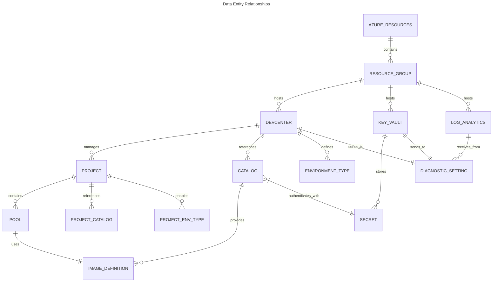

---

## ⚙️ Configuration Data Model

### Configuration File Hierarchy

```
infra/settings/
├── resourceOrganization/
│   ├── azureResources.yaml      # Landing zone resource groups
│   └── azureResources.schema.json
├── security/
│   ├── security.yaml            # Key Vault configuration
│   └── security.schema.json
└── workload/
    ├── devcenter.yaml           # DevCenter, projects, pools
    └── devcenter.schema.json
```

### Resource Organization Configuration (`azureResources.yaml`)

Defines the landing zone resource group structure following Azure Landing Zone
principles.

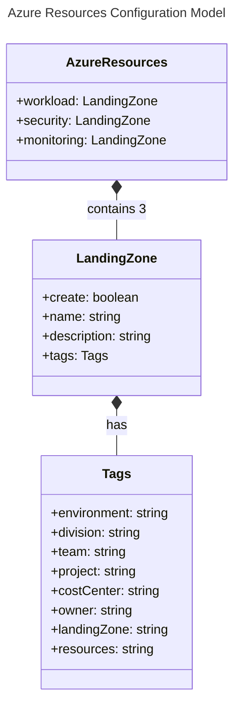

#### Data Model Details

| Entity          | Field         | Type    | Required | Description                            |
| --------------- | ------------- | ------- | -------- | -------------------------------------- |
| **LandingZone** | `create`      | boolean | Yes      | Whether to create the resource group   |
|                 | `name`        | string  | Yes      | Base name for the resource group       |
|                 | `description` | string  | Yes      | Purpose description                    |
|                 | `tags`        | object  | Yes      | Resource tags                          |
| **Tags**        | `environment` | string  | Yes      | Deployment environment (dev/test/prod) |
|                 | `division`    | string  | Yes      | Business division                      |
|                 | `team`        | string  | Yes      | Owning team                            |
|                 | `project`     | string  | Yes      | Project name                           |
|                 | `costCenter`  | string  | Yes      | Cost allocation center                 |
|                 | `owner`       | string  | Yes      | Resource owner                         |

### Security Configuration (`security.yaml`)

Defines Azure Key Vault settings for secrets management.

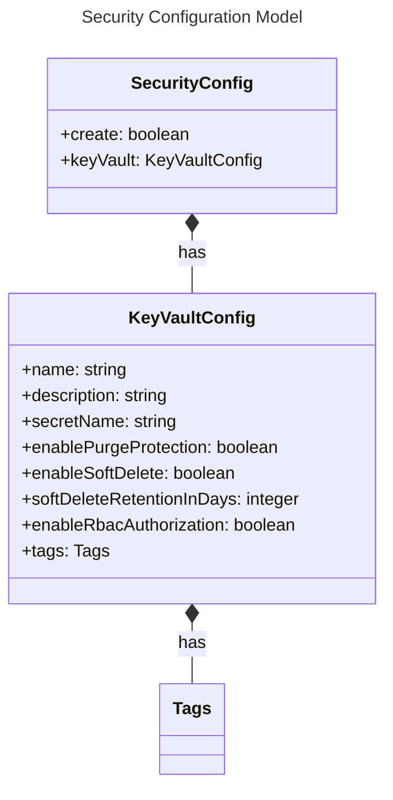

#### Security Configuration Details

| Field                       | Type    | Constraints              | Default     | Description                        |
| --------------------------- | ------- | ------------------------ | ----------- | ---------------------------------- |
| `name`                      | string  | 3-24 chars, alphanumeric | -           | Globally unique Key Vault name     |
| `secretName`                | string  | -                        | `gha-token` | Name for the stored secret         |
| `enablePurgeProtection`     | boolean | -                        | `true`      | Prevents permanent deletion        |
| `enableSoftDelete`          | boolean | -                        | `true`      | Enables recovery window            |
| `softDeleteRetentionInDays` | integer | 7-90                     | `7`         | Retention period for deleted items |
| `enableRbacAuthorization`   | boolean | -                        | `true`      | Use Azure RBAC vs access policies  |

### DevCenter Configuration (`devcenter.yaml`)

The most complex configuration defining the entire workload structure.

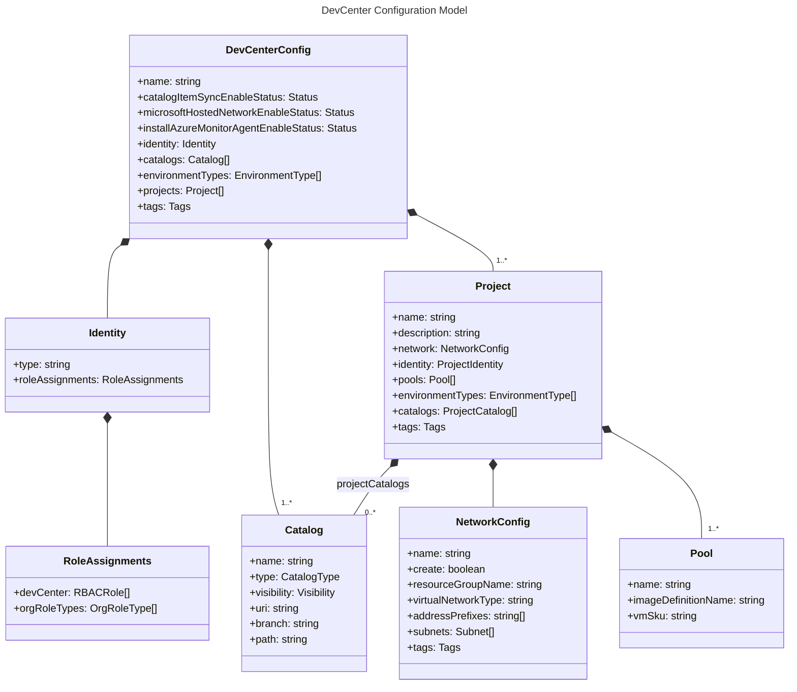

#### DevCenter Entity Details

| Entity              | Field                                  | Type             | Description                                        |
| ------------------- | -------------------------------------- | ---------------- | -------------------------------------------------- |
| **DevCenterConfig** | `name`                                 | string           | DevCenter resource name                            |
|                     | `catalogItemSyncEnableStatus`          | Enabled/Disabled | Auto-sync catalog items                            |
|                     | `microsoftHostedNetworkEnableStatus`   | Enabled/Disabled | Use Microsoft-hosted networks                      |
|                     | `installAzureMonitorAgentEnableStatus` | Enabled/Disabled | Install monitoring agent on Dev Boxes              |
| **Project**         | `name`                                 | string           | Project identifier                                 |
|                     | `description`                          | string           | Project description                                |
|                     | `network`                              | NetworkConfig    | Network connectivity settings                      |
|                     | `pools`                                | Pool[]           | Dev Box pool definitions                           |
| **Pool**            | `name`                                 | string           | Pool identifier (e.g., `backend-engineer`)         |
|                     | `imageDefinitionName`                  | string           | Reference to catalog image                         |
|                     | `vmSku`                                | string           | Azure VM SKU (e.g., `general_i_32c128gb512ssd_v2`) |
| **Catalog**         | `type`                                 | gitHub/adoGit    | Source control type                                |
|                     | `visibility`                           | public/private   | Repository visibility                              |
|                     | `uri`                                  | string           | Repository URL                                     |
|                     | `branch`                               | string           | Branch to sync                                     |
|                     | `path`                                 | string           | Path within repository                             |

---

## 🔐 Secrets Management

> [!CAUTION]
>
> **Secret Rotation:** PAT tokens should be rotated every 90 days. Federated
> credentials are automatically managed by Azure AD.

### Secret Types

| Secret                    | Storage                 | Purpose                        | Consumers                       | Rotation                      |
| ------------------------- | ----------------------- | ------------------------------ | ------------------------------- | ----------------------------- |
| **GitHub PAT**            | Key Vault (`gha-token`) | Private catalog authentication | DevCenter catalogs              | Manual (recommended: 90 days) |
| **Azure DevOps PAT**      | Key Vault               | ADO catalog authentication     | DevCenter catalogs              | Manual (recommended: 90 days) |
| **Federated Credentials** | Azure AD                | CI/CD authentication           | GitHub Actions, Azure Pipelines | Automatic                     |

### Secrets Flow Diagram

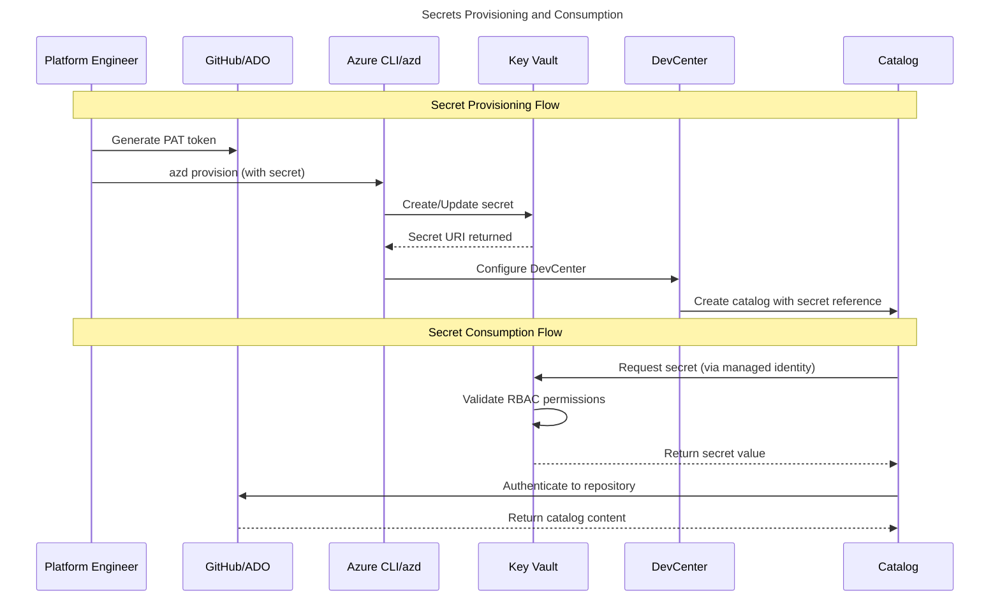

### Key Vault Access Model

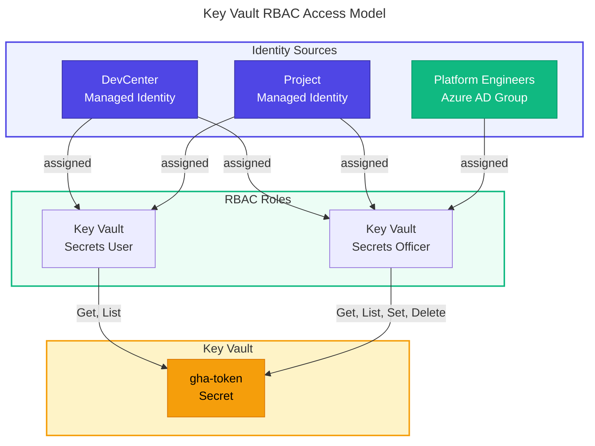

### Secret Security Controls

| Control                | Implementation                       | Purpose                                     |
| ---------------------- | ------------------------------------ | ------------------------------------------- |
| **RBAC Authorization** | `enableRbacAuthorization: true`      | Granular access control via Azure RBAC      |
| **Soft Delete**        | `enableSoftDelete: true`             | Recover accidentally deleted secrets        |
| **Purge Protection**   | `enablePurgeProtection: true`        | Prevent permanent deletion during retention |
| **Retention Period**   | `softDeleteRetentionInDays: 7`       | Recovery window for deleted secrets         |
| **Diagnostic Logging** | Log Analytics integration            | Audit all secret operations                 |
| **Managed Identities** | SystemAssigned on DevCenter/Projects | Eliminate credential storage in code        |

---

## 📱 Telemetry & Diagnostics

### Log Analytics Data Collection

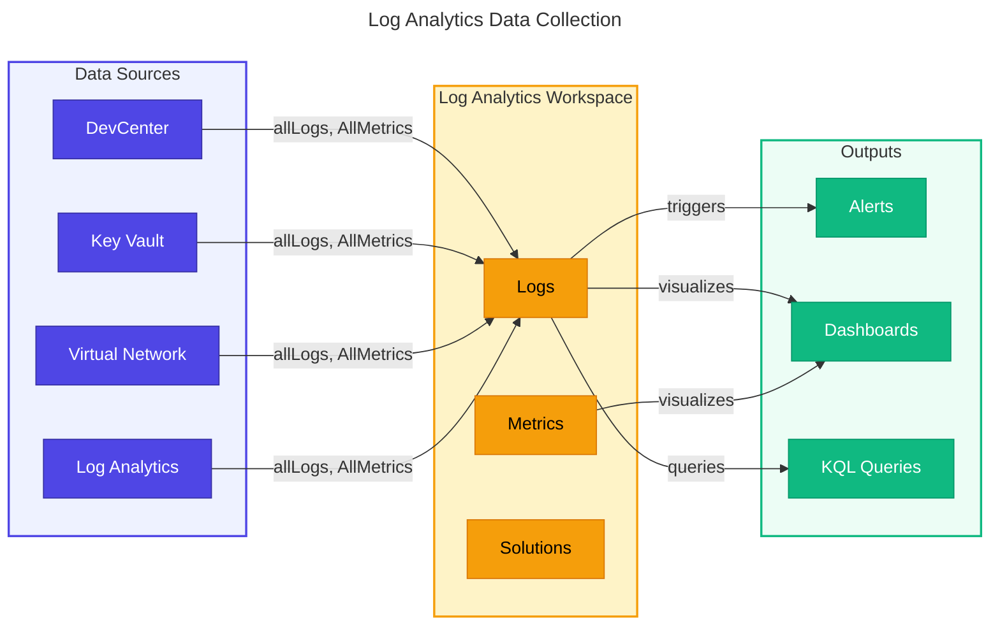

### Diagnostic Settings Configuration

All resources deploy with standardized diagnostic settings:

| Resource            | Log Categories | Metric Categories | Destination             |
| ------------------- | -------------- | ----------------- | ----------------------- |
| **DevCenter**       | allLogs        | AllMetrics        | Log Analytics Workspace |
| **Key Vault**       | allLogs        | AllMetrics        | Log Analytics Workspace |
| **Virtual Network** | allLogs        | AllMetrics        | Log Analytics Workspace |
| **Log Analytics**   | allLogs        | AllMetrics        | Self (workspace)        |

### Telemetry Data Model

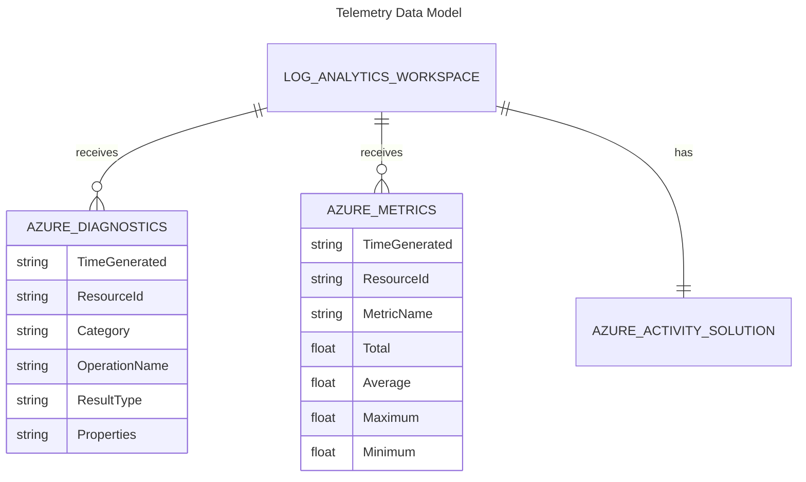

### Data Retention

| Data Type         | Default Retention | Configurable      | Purpose                     |
| ----------------- | ----------------- | ----------------- | --------------------------- |
| **Logs**          | 30 days           | Yes (30-730 days) | Operational troubleshooting |
| **Metrics**       | 93 days           | No                | Performance analysis        |
| **Activity Logs** | 90 days           | No                | Audit trail                 |
| **Security Logs** | 90 days           | Yes               | Compliance                  |

---

## 🔀 Data Flow Diagrams

### Configuration Loading Flow

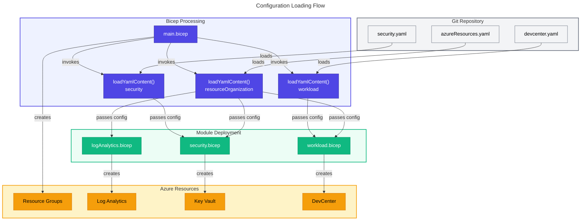

### Deployment Data Flow

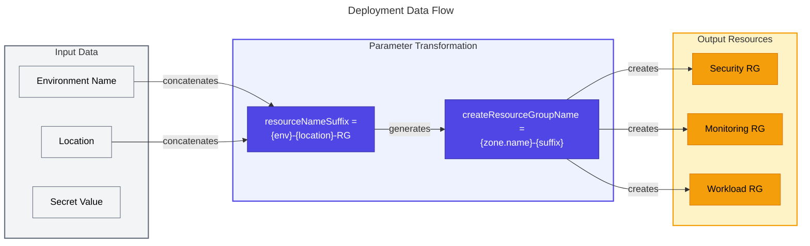

### Cross-Module Data Dependencies

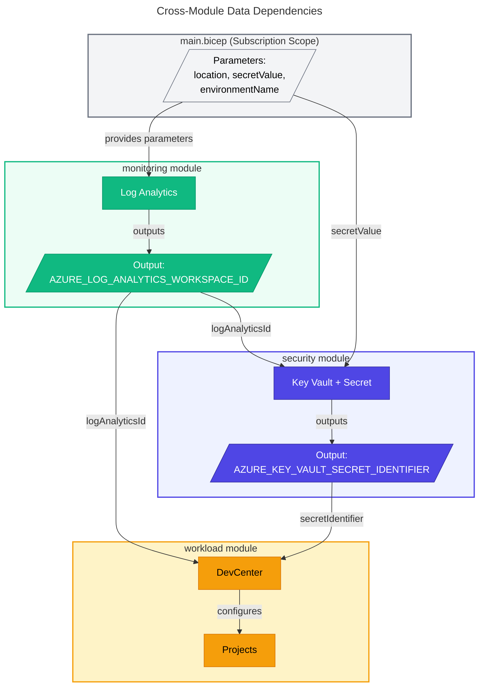

---

## 🛡️ Data Governance

### Data Classification

| Classification   | Examples                     | Controls              | Access                |
| ---------------- | ---------------------------- | --------------------- | --------------------- |
| **Public**       | Documentation, schemas       | Version control       | Anyone                |
| **Internal**     | Configuration YAML, tags     | Git repository        | Organization          |
| **Confidential** | PAT tokens, credentials      | Key Vault + RBAC      | Authorized identities |
| **Restricted**   | Tenant IDs, subscription IDs | Environment variables | CI/CD pipelines       |

### Compliance Considerations

| Framework        | Requirement        | Implementation                             |
| ---------------- | ------------------ | ------------------------------------------ |
| **SOC 2**        | Access logging     | Key Vault diagnostic logs to Log Analytics |
| **ISO 27001**    | Secrets encryption | Key Vault with software-protected keys     |
| **GDPR**         | Data minimization  | No PII in configuration files              |
| **Azure Policy** | Tagging compliance | Mandatory tags on all resources            |

### Data Lineage

```mermaid
---
title: Data Lineage
---
flowchart LR
    %% ===== STYLE DEFINITIONS =====
    classDef primary fill:#4F46E5,stroke:#3730A3,color:#FFFFFF
    classDef secondary fill:#10B981,stroke:#059669,color:#FFFFFF
    classDef datastore fill:#F59E0B,stroke:#D97706,color:#000000
    classDef external fill:#6B7280,stroke:#4B5563,color:#FFFFFF,stroke-dasharray:5 5

    %% ===== SOURCE OF TRUTH =====
    subgraph Source["Source of Truth"]
        GIT["Git Repository"]
    end

    %% ===== CI/CD =====
    subgraph CI["CI/CD"]
        GHA["GitHub Actions"]
        ADO["Azure DevOps"]
    end

    %% ===== DEPLOYMENT =====
    subgraph Deploy["Deployment"]
        AZD["azd CLI"]
        ARM["ARM/Bicep"]
    end

    %% ===== RUNTIME =====
    subgraph Runtime["Runtime"]
        AZ["Azure Resources"]
    end

    %% ===== AUDIT TRAIL =====
    subgraph Audit["Audit Trail"]
        LA["Log Analytics"]
        ACT["Activity Log"]
    end

    %% ===== CONNECTIONS =====
    GIT -->|"push"| GHA
    GIT -->|"push"| ADO
    GHA -->|"azd provision"| AZD
    ADO -->|"azd provision"| AZD
    AZD -->|"deploy"| ARM
    ARM -->|"create/update"| AZ
    AZ -->|"diagnostics"| LA
    AZ -->|"operations"| ACT

    %% ===== APPLY STYLES =====
    class GIT external
    class GHA,ADO primary
    class AZD,ARM secondary
    class AZ datastore
    class LA,ACT datastore

    %% ===== SUBGRAPH STYLING =====
    style Source fill:#F3F4F6,stroke:#6B7280,stroke-width:2px
    style CI fill:#EEF2FF,stroke:#4F46E5,stroke-width:2px
    style Deploy fill:#ECFDF5,stroke:#10B981,stroke-width:2px
    style Runtime fill:#FEF3C7,stroke:#F59E0B,stroke-width:2px
    style Audit fill:#FEF3C7,stroke:#F59E0B,stroke-width:2px
```

### Data Quality Rules

| Rule                   | Enforcement                   | Validation                         |
| ---------------------- | ----------------------------- | ---------------------------------- |
| **Schema Validation**  | JSON Schema files             | YAML files must conform to schemas |
| **Required Fields**    | Schema `required` arrays      | Deployment fails if missing        |
| **Value Constraints**  | Schema patterns, enums        | Invalid values rejected            |
| **Naming Conventions** | Bicep `@minLength/@maxLength` | Enforced at deployment             |
| **Tag Requirements**   | Azure Policy                  | Post-deployment compliance         |

---

## 📄 Schema Documentation

### JSON Schema Files

#### `azureResources.schema.json`

Validates landing zone resource group configuration.

| Property Path       | Type    | Constraints | Description          |
| ------------------- | ------- | ----------- | -------------------- |
| `workload.create`   | boolean | Required    | Create workload RG   |
| `workload.name`     | string  | Required    | RG base name         |
| `workload.tags`     | object  | Required    | Resource tags        |
| `security.create`   | boolean | Required    | Create security RG   |
| `security.name`     | string  | Required    | RG base name         |
| `monitoring.create` | boolean | Required    | Create monitoring RG |
| `monitoring.name`   | string  | Required    | RG base name         |

#### `security.schema.json`

Validates Key Vault security configuration.

| Property Path                        | Type    | Constraints                                 | Description      |
| ------------------------------------ | ------- | ------------------------------------------- | ---------------- |
| `create`                             | boolean | Required                                    | Create Key Vault |
| `keyVault.name`                      | string  | 3-24 chars, pattern: `^[a-zA-Z0-9-]{3,24}$` | KV name          |
| `keyVault.enablePurgeProtection`     | boolean | -                                           | Purge protection |
| `keyVault.softDeleteRetentionInDays` | integer | 7-90                                        | Retention days   |
| `keyVault.tags.environment`          | string  | enum: dev/test/staging/prod                 | Environment tag  |

#### `devcenter.schema.json`

Validates DevCenter workload configuration.

| Property Path                          | Type   | Constraints                            | Description           |
| -------------------------------------- | ------ | -------------------------------------- | --------------------- |
| `name`                                 | string | minLength: 1                           | DevCenter name        |
| `identity.type`                        | string | enum: SystemAssigned/UserAssigned/etc. | Identity type         |
| `catalogs[].type`                      | string | -                                      | Catalog source type   |
| `catalogs[].visibility`                | string | enum: public/private                   | Repository visibility |
| `projects[].pools[].vmSku`             | string | -                                      | VM SKU for pool       |
| `projects[].network.addressPrefixes[]` | string | CIDR pattern                           | VNet address space    |

### Schema Validation Flow

```mermaid
---
title: Schema Validation Flow
---
flowchart TD
    %% ===== STYLE DEFINITIONS =====
    classDef primary fill:#4F46E5,stroke:#3730A3,color:#FFFFFF
    classDef secondary fill:#10B981,stroke:#059669,color:#FFFFFF
    classDef failed fill:#F44336,stroke:#C62828,color:#FFFFFF
    classDef input fill:#F3F4F6,stroke:#6B7280,color:#000000

    %% ===== INPUTS =====
    YAML["YAML Configuration File"]
    SCHEMA["JSON Schema"]
    VALIDATOR["YAML Language Server"]

    %% ===== OUTPUTS =====
    SUCCESS["✅ Proceed to Deployment"]
    ERROR["❌ Validation Errors"]
    FIX["Fix Configuration"]

    %% ===== CONNECTIONS =====
    YAML -->|"validates against"| VALIDATOR
    SCHEMA -->|"defines rules"| VALIDATOR

    VALIDATOR -->|"valid"| SUCCESS
    VALIDATOR -->|"invalid"| ERROR

    ERROR -->|"requires"| FIX
    FIX -->|"updates"| YAML

    %% ===== APPLY STYLES =====
    class YAML,SCHEMA input
    class VALIDATOR primary
    class SUCCESS secondary
    class ERROR failed
    class FIX primary
```

---

## 📚 References

### External References

| Reference                      | URL                                                                         | Description       |
| ------------------------------ | --------------------------------------------------------------------------- | ----------------- |
| Azure Key Vault Best Practices | https://learn.microsoft.com/azure/key-vault/general/best-practices          | Security guidance |
| Log Analytics Documentation    | https://learn.microsoft.com/azure/azure-monitor/logs/log-analytics-overview | Monitoring setup  |
| JSON Schema Specification      | https://json-schema.org/specification                                       | Schema validation |

### Related Architecture Documents

| Document                 | Path                                                               | Description                       |
| ------------------------ | ------------------------------------------------------------------ | --------------------------------- |
| Business Architecture    | [01-business-architecture.md](./01-business-architecture.md)       | Business context and stakeholders |
| Application Architecture | [03-application-architecture.md](./03-application-architecture.md) | Bicep module architecture         |
| Technology Architecture  | [04-technology-architecture.md](./04-technology-architecture.md)   | Azure services and infrastructure |

---

## 📖 Glossary

| Term                    | Definition                                                                     |
| ----------------------- | ------------------------------------------------------------------------------ |
| **loadYamlContent()**   | Bicep function that loads YAML files as typed objects at compile time          |
| **Diagnostic Settings** | Azure configuration that routes logs and metrics to destinations               |
| **RBAC Authorization**  | Key Vault access model using Azure role assignments instead of access policies |
| **Soft Delete**         | Feature that retains deleted Key Vault objects for recovery                    |
| **Purge Protection**    | Feature that prevents permanent deletion during retention period               |
| **PAT**                 | Personal Access Token for Git repository authentication                        |
| **Managed Identity**    | Azure AD identity automatically managed by Azure for service authentication    |
| **KQL**                 | Kusto Query Language used for Log Analytics queries                            |

---

_This document follows TOGAF Architecture Development Method (ADM) principles
and aligns with the Data Architecture domain of the BDAT framework._

---

<div align="center">

**[← Business Architecture](./01-business-architecture.md)** |
**[⬆️ Back to Top](#-data-architecture)** |
**[🏛️ Application Architecture →](./03-application-architecture.md)**

</div>
