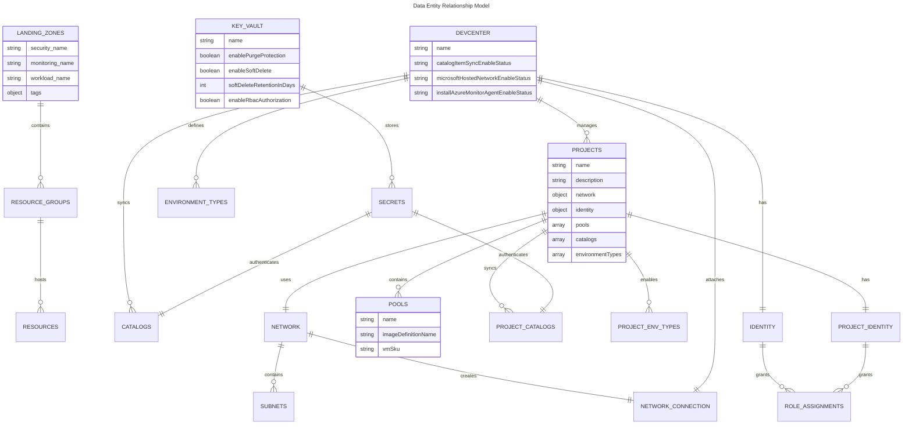

# 🗄️ Data Architecture

> [!NOTE]
> **Target Audience**: Data Architects, Platform Engineers, Security Teams  
> **Reading Time**: ~20 minutes

<details>
<summary>📍 <strong>Document Navigation</strong></summary>

| Previous | Index | Next |
|:---------|:-----:|-----:|
| [← Business Architecture](01-business-architecture.md) | [Architecture Index](README.md) | [Application Architecture →](03-application-architecture.md) |

</details>

> **TOGAF Layer**: Data Architecture  
> **Version**: 1.0.0  
> **Last Updated**: January 22, 2026  
> **Author**: DevExp Team

---

## 📑 Table of Contents

- [📊 Data Overview](#-data-overview)
- [⚙️ Configuration Data Model](#️-configuration-data-model)
- [🔐 Secrets Management](#-secrets-management)
- [📡 Telemetry & Diagnostics](#-telemetry--diagnostics)
- [🔀 Data Flow Diagrams](#-data-flow-diagrams)
- [🏛️ Data Governance](#️-data-governance)
- [📋 Schema Documentation](#-schema-documentation)
- [📚 References](#-references)
- [📖 Glossary](#-glossary)

---

## 📊 Data Overview

The DevExp-DevBox Landing Zone Accelerator manages several categories of data that flow through the system during deployment and runtime operations. Understanding these data types is essential for security, compliance, and operational management.

### Data Categories


### Data Classification

| Data Type | Classification | Sensitivity | Storage Location | Retention |
|:----------|:--------------:|:-----------:|:-----------------|:----------|
| Resource Organization Config | Internal | Low | Git Repository | Version controlled |
| Security Configuration | Confidential | Medium | Git Repository | Version controlled |
| DevCenter Configuration | Internal | Low | Git Repository | Version controlled |
| GitHub PAT Token | Secret | Critical | Azure Key Vault | 7-90 days (soft delete) |
| Managed Identity Tokens | Secret | Critical | Azure AD | Session-based |
| Deployment Logs | Internal | Medium | Log Analytics | 30-90 days |
| Resource Metrics | Internal | Low | Azure Monitor | 93 days |
| Deployment State | Internal | Medium | azd Environment | Until deleted |

[↑ Back to Top](#️-data-architecture)

---

## ⚙️ Configuration Data Model

### Overview

The accelerator uses YAML-based configuration files with JSON Schema validation to define infrastructure settings. Configuration is loaded at deployment time using Bicep's `loadYamlContent()` function.

### Configuration File Structure

```
infra/settings/
├── resourceOrganization/
│   ├── azureResources.yaml      # Landing zone resource groups
│   └── azureResources.schema.json
├── security/
│   ├── security.yaml            # Key Vault configuration
│   └── security.schema.json
└── workload/
    ├── devcenter.yaml           # DevCenter & projects
    └── devcenter.schema.json
```

### Data Entity Relationship Diagram



### Resource Organization Configuration

**File**: `infra/settings/resourceOrganization/azureResources.yaml`

| Property | Type | Description | Example |
|----------|------|-------------|---------|
| `workload.name` | string | Workload resource group name | `devexp-workload` |
| `workload.create` | boolean | Create new or use existing | `true` |
| `workload.tags` | object | Azure resource tags | See tags schema |
| `security.name` | string | Security resource group name | `devexp-security` |
| `security.create` | boolean | Create new or use existing | `true` |
| `monitoring.name` | string | Monitoring resource group name | `devexp-monitoring` |
| `monitoring.create` | boolean | Create new or use existing | `true` |

**Tags Schema**:

```yaml
tags:
  environment: dev|test|staging|prod
  division: string          # Business division
  team: string              # Team name
  project: string           # Project identifier
  costCenter: string        # Cost allocation
  owner: string             # Resource owner
  landingZone: string       # Landing zone type
  resources: string         # Resource type
```

### Security Configuration

**File**: `infra/settings/security/security.yaml`

| Property | Type | Description | Constraints |
|:---------|:-----|:------------|:------------|
| `create` | boolean | Create Key Vault | Required |
| `keyVault.name` | string | Key Vault name prefix | 3-24 chars, alphanumeric |
| `keyVault.description` | string | Purpose description | Optional |
| `keyVault.secretName` | string | Secret name for PAT | Default: `gha-token` |
| `keyVault.enablePurgeProtection` | boolean | Prevent permanent deletion | Recommended: `true` |
| `keyVault.enableSoftDelete` | boolean | Enable recovery period | Recommended: `true` |
| `keyVault.softDeleteRetentionInDays` | integer | Soft delete retention | 7-90 days |
| `keyVault.enableRbacAuthorization` | boolean | Use Azure RBAC | Recommended: `true` |

### DevCenter Configuration

**File**: `infra/settings/workload/devcenter.yaml`

#### Core DevCenter Properties

| Property | Type | Description |
|----------|------|-------------|
| `name` | string | DevCenter resource name |
| `catalogItemSyncEnableStatus` | Enabled\|Disabled | Catalog sync feature |
| `microsoftHostedNetworkEnableStatus` | Enabled\|Disabled | Microsoft-hosted networking |
| `installAzureMonitorAgentEnableStatus` | Enabled\|Disabled | Azure Monitor agent |
| `identity.type` | SystemAssigned\|UserAssigned | Managed identity type |

#### Identity & Role Assignments

```yaml
identity:
  type: "SystemAssigned"
  roleAssignments:
    devCenter:
      - id: "b24988ac-6180-42a0-ab88-20f7382dd24c"  # Contributor
        name: "Contributor"
        scope: "Subscription"
      - id: "18d7d88d-d35e-4fb5-a5c3-7773c20a72d9"  # User Access Admin
        name: "User Access Administrator"
        scope: "Subscription"
      - id: "4633458b-17de-408a-b874-0445c86b69e6"  # Key Vault Secrets User
        name: "Key Vault Secrets User"
        scope: "ResourceGroup"
    orgRoleTypes:
      - type: DevManager
        azureADGroupId: "<guid>"
        azureADGroupName: "Platform Engineering Team"
        azureRBACRoles:
          - name: "DevCenter Project Admin"
            id: "331c37c6-af14-46d9-b9f4-e1909e1b95a0"
            scope: ResourceGroup
```

#### Project Configuration

```yaml
projects:
  - name: "eShop"
    description: "eShop project"
    network:
      name: eShop
      create: true
      resourceGroupName: "eShop-connectivity-RG"
      virtualNetworkType: Managed|Unmanaged
      addressPrefixes: ["10.0.0.0/16"]
      subnets:
        - name: eShop-subnet
          properties:
            addressPrefix: "10.0.1.0/24"
    pools:
      - name: "backend-engineer"
        imageDefinitionName: "eShop-backend-engineer"
        vmSku: "general_i_32c128gb512ssd_v2"
      - name: "frontend-engineer"
        imageDefinitionName: "eShop-frontend-engineer"
        vmSku: "general_i_16c64gb256ssd_v2"
    catalogs:
      - name: "environments"
        type: environmentDefinition
        sourceControl: gitHub
        visibility: private
        uri: "https://github.com/org/repo.git"
        branch: "main"
        path: "/.devcenter/environments"
```

[↑ Back to Top](#️-data-architecture)

---

## 🔐 Secrets Management

> [!IMPORTANT]
> All secrets are stored in Azure Key Vault with RBAC authorization. Never commit secrets to source control.

### Secret Types

| Secret | Purpose | Storage | Rotation |
|--------|---------|---------|----------|
| **GitHub PAT** | Catalog authentication for private repos | Key Vault | Manual (recommended: 90 days) |
| **Azure DevOps PAT** | ADO catalog authentication | Key Vault | Manual (recommended: 90 days) |
| **Service Principal** | CI/CD deployment | GitHub Secrets / Azure DevOps | OIDC (no rotation needed) |

### Key Vault Architecture


### Secret Lifecycle


### Secret Access Patterns

| Principal | Role | Scope | Purpose |
|-----------|------|-------|---------|
| DevCenter Managed Identity | Key Vault Secrets User | Security RG | Read PAT for catalog sync |
| Project Managed Identity | Key Vault Secrets User | Security RG | Read PAT for project catalogs |
| DevCenter Managed Identity | Key Vault Secrets Officer | Security RG | Manage secrets if needed |
| CI/CD Service Principal | Deployer (custom) | Key Vault | Initial secret provisioning |

[↑ Back to Top](#️-data-architecture)

---

## 📡 Telemetry & Diagnostics

### Log Analytics Data Collection


### Diagnostic Settings Configuration

| Resource | Log Categories | Metrics | Destination |
|----------|---------------|---------|-------------|
| Log Analytics Workspace | allLogs | AllMetrics | Self (workspace) |
| Key Vault | allLogs | AllMetrics | Log Analytics |
| DevCenter | allLogs | AllMetrics | Log Analytics |
| Virtual Network | allLogs | AllMetrics | Log Analytics |

### Telemetry Data Schema

**DevCenter Logs**:

```
AzureDiagnostics
| where ResourceProvider == "MICROSOFT.DEVCENTER"
| project TimeGenerated, OperationName, ResultType, CallerIpAddress
```

**Key Vault Logs**:

```
AzureDiagnostics
| where ResourceProvider == "MICROSOFT.KEYVAULT"
| project TimeGenerated, OperationName, ResultType, identity_claim_upn_s
```

[↑ Back to Top](#️-data-architecture)

---

## 🔀 Data Flow Diagrams

### Configuration Loading Flow


### Secrets Flow Diagram

```mermaid
flowchart TB
    subgraph "Secret Injection"
        ENV[Environment Variable<br/>KEY_VAULT_SECRET]
        AZD[azd provision]
        PARAM[@secure param<br/>secretValue]
    end
    
    subgraph "Secret Storage"
        SEC[security.bicep]
        SECMOD[secret.bicep]
        KV[(Key Vault<br/>gha-token)]
    end
    
    subgraph "Secret Consumption"
        URI[secretIdentifier<br/>URI]
        CAT[catalog.bicep]
        PCAT[projectCatalog.bicep]
    end
    
    ENV --> AZD
    AZD --> PARAM
    PARAM --> SEC
    SEC --> SECMOD
    SECMOD --> KV
    
    KV -->|properties.secretUri| URI
    URI --> CAT
    URI --> PCAT
    
    style KV fill:#D32F2F,color:#fff
    style ENV fill:#FFC107,color:#000
```

### Deployment Data Flow


---

## Data Governance

### Data Classification Matrix

| Data Element | Classification | Owner | Access Control | Encryption |
|--------------|---------------|-------|----------------|------------|
| YAML Configuration | Internal | Platform Team | Git branch protection | At rest (Git LFS optional) |
| JSON Schemas | Public | Platform Team | Read-only | None required |
| PAT Tokens | Secret | Security Team | Key Vault RBAC | At rest + in transit |
| Deployment Logs | Confidential | Operations | Log Analytics RBAC | At rest |
| Resource Metrics | Internal | Operations | Azure Monitor RBAC | At rest |
| Bicep Templates | Internal | Platform Team | Git branch protection | At rest |

### Data Retention Policies

| Data Type | Retention Period | Justification | Archive Location |
|-----------|------------------|---------------|------------------|
| Deployment Logs | 90 days | Compliance/troubleshooting | Log Analytics |
| Key Vault Soft Delete | 7-90 days | Recovery window | Key Vault |
| Resource Metrics | 93 days | Azure default | Azure Monitor |
| Git History | Indefinite | Version control | Git repository |
| azd Environment State | Until deleted | Active deployments | Local/.azure |

### Compliance Considerations

| Requirement | Implementation | Evidence |
|-------------|----------------|----------|
| **Data Encryption at Rest** | Azure Storage encryption, Key Vault encryption | Azure Security Center |
| **Data Encryption in Transit** | TLS 1.2+ for all Azure services | Network policies |
| **Access Logging** | Key Vault audit logs, Azure Activity Log | Log Analytics queries |
| **Data Residency** | Region-specific deployment | Bicep location parameter |
| **Right to Erasure** | Key Vault purge, resource deletion | Deletion scripts |

[↑ Back to Top](#️-data-architecture)

---

## 📋 Schema Documentation

### JSON Schema References

<details>
<summary><strong>📜 Security Schema (<code>security.schema.json</code>)</strong></summary>

```json
{
  "$schema": "http://json-schema.org/draft-07/schema#",
  "title": "Azure Key Vault Security Configuration",
  "type": "object",
  "required": ["create", "keyVault"],
  "properties": {
    "create": { "type": "boolean" },
    "keyVault": {
      "type": "object",
      "required": ["name", "tags"],
      "properties": {
        "name": {
          "type": "string",
          "pattern": "^[a-zA-Z0-9-]{3,24}$",
          "minLength": 3,
          "maxLength": 24
        },
        "enablePurgeProtection": { "type": "boolean" },
        "enableSoftDelete": { "type": "boolean" },
        "softDeleteRetentionInDays": {
          "type": "integer",
          "minimum": 7,
          "maximum": 90
        },
        "enableRbacAuthorization": { "type": "boolean" }
      }
    }
  }
}
```

</details>

<details>
<summary><strong>📜 DevCenter Schema (<code>devcenter.schema.json</code>) - Key Definitions</strong></summary>

```json
{
  "definitions": {
    "roleAssignment": {
      "type": "object",
      "properties": {
        "id": { "type": "string", "pattern": "^[a-fA-F0-9-]{36}$" },
        "name": { "type": "string" },
        "scope": { "enum": ["Subscription", "ResourceGroup", "Project"] }
      }
    },
    "catalog": {
      "type": "object",
      "required": ["name", "type", "uri"],
      "properties": {
        "name": { "type": "string" },
        "type": { "enum": ["gitHub", "adoGit", "environmentDefinition", "imageDefinition"] },
        "visibility": { "enum": ["public", "private"] },
        "uri": { "type": "string", "format": "uri" },
        "branch": { "type": "string" },
        "path": { "type": "string" }
      }
    },
    "pool": {
      "type": "object",
      "required": ["name", "imageDefinitionName", "vmSku"],
      "properties": {
        "name": { "type": "string" },
        "imageDefinitionName": { "type": "string" },
        "vmSku": { "type": "string" }
      }
    }
  }
}
```

</details>

### Schema Validation

Schemas are validated at authoring time using the `yaml-language-server` directive:

```yaml
# yaml-language-server: $schema=./security.schema.json
```

[↑ Back to Top](#️-data-architecture)

---

## 📚 References

### Internal Documents

- [Business Architecture](01-business-architecture.md) - Business context and stakeholders
- [Application Architecture](03-application-architecture.md) - Module design and Bicep structure
- [Technology Architecture](04-technology-architecture.md) - Azure services and infrastructure
- [Security Architecture](05-security-architecture.md) - Security controls and secrets management

### External References

- [Azure Key Vault Best Practices](https://learn.microsoft.com/en-us/azure/key-vault/general/best-practices)
- [Log Analytics Workspace Design](https://learn.microsoft.com/en-us/azure/azure-monitor/logs/workspace-design)
- [Bicep loadYamlContent Function](https://learn.microsoft.com/en-us/azure/azure-resource-manager/bicep/bicep-functions-files#loadyamlcontent)
- [JSON Schema Specification](https://json-schema.org/specification.html)

[↑ Back to Top](#️-data-architecture)

---

## 📖 Glossary

| Term | Definition |
|------|------------|
| **loadYamlContent()** | Bicep function that loads YAML files as objects at compile time |
| **Secret Identifier** | URI to a specific version of a secret in Azure Key Vault |
| **Diagnostic Settings** | Azure configuration for routing logs and metrics to destinations |
| **Soft Delete** | Key Vault feature allowing recovery of deleted secrets within retention period |
| **Purge Protection** | Key Vault feature preventing permanent deletion during soft delete period |
| **RBAC Authorization** | Key Vault access control using Azure Role-Based Access Control instead of access policies |

[↑ Back to Top](#️-data-architecture)

---

## 📎 Related Documents

<details>
<summary><strong>TOGAF Architecture Series</strong></summary>

| Document | Description |
|:---------|:------------|
| [📊 Business Architecture](01-business-architecture.md) | Stakeholder analysis, capabilities, value streams |
| 🗄️ **Data Architecture** | *You are here* |
| [🏛️ Application Architecture](03-application-architecture.md) | Bicep module design, dependencies, patterns |
| [⚙️ Technology Architecture](04-technology-architecture.md) | Azure services, CI/CD, deployment tools |
| [🔐 Security Architecture](05-security-architecture.md) | Threat model, RBAC, compliance controls |

</details>

---

<div align="center">

**[← Previous: Business Architecture](01-business-architecture.md)** | **[Next: Application Architecture →](03-application-architecture.md)**

---

*Document generated as part of TOGAF Architecture Documentation for DevExp-DevBox Landing Zone Accelerator*

</div>
