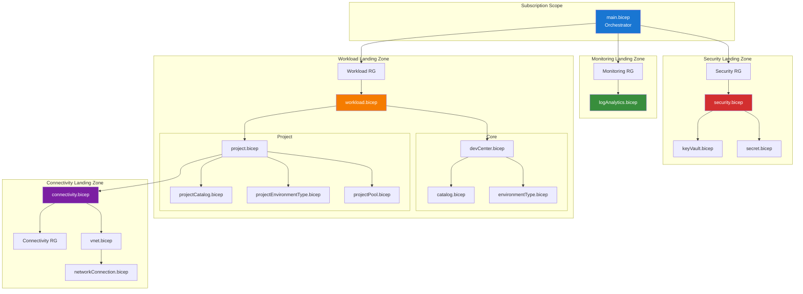
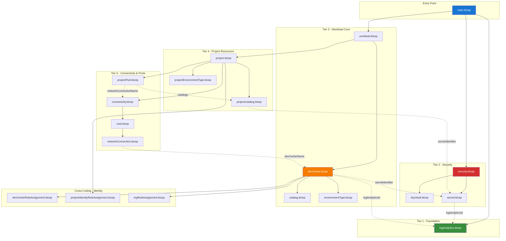
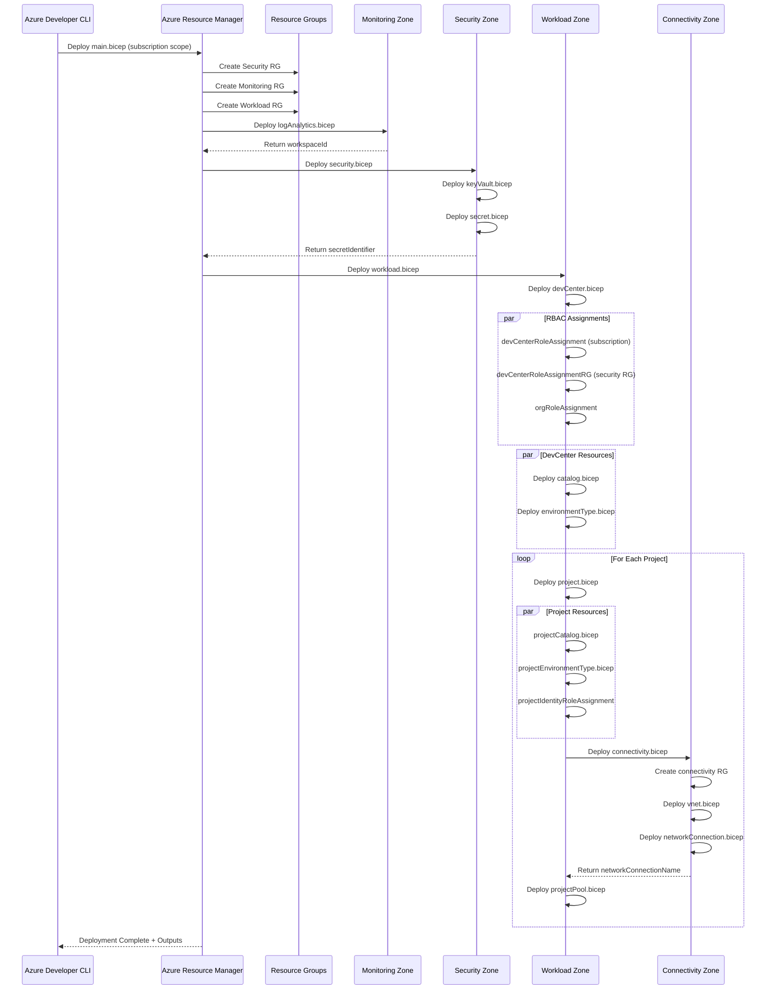

# 🏛️ Application Architecture

> [!NOTE]
> **Target Audience**: Platform Engineers, DevOps Engineers, Infrastructure Architects  
> **Reading Time**: ~25 minutes

<details>
<summary>📍 <strong>Document Navigation</strong></summary>

| Previous | Index | Next |
|:---------|:-----:|-----:|
| [← Data Architecture](02-data-architecture.md) | [Architecture Index](README.md) | [Technology Architecture →](04-technology-architecture.md) |

</details>

> **TOGAF Layer**: Application Architecture  
> **Version**: 1.0.0  
> **Last Updated**: January 22, 2026  
> **Author**: DevExp Team

---

## 📑 Table of Contents

- [🔍 Architecture Overview](#-architecture-overview)
- [📦 Module Catalog](#-module-catalog)
- [🔗 Module Dependencies](#-module-dependencies)
- [🚀 Deployment Orchestration](#-deployment-orchestration)
- [📝 Interface Contracts](#-interface-contracts)
- [🎨 Design Patterns](#-design-patterns)
- [🔌 Extension Points](#-extension-points)
- [📚 References](#-references)
- [📖 Glossary](#-glossary)

---

## 🔍 Architecture Overview

The DevExp-DevBox Landing Zone Accelerator implements a **modular Infrastructure-as-Code (IaC)** architecture using Azure Bicep. The solution follows the **Landing Zone Accelerator** pattern with four distinct zones, each responsible for specific infrastructure concerns.

### Landing Zone Pattern



### Deployment Scopes

| Zone | Bicep Scope | Resource Group | Purpose |
|:-----|:-----------:|:---------------|:--------|
| **Orchestrator** | `subscription` | Creates RGs | Entry point, resource group creation |
| **Security** | `resourceGroup` | devexp-security-* | Key Vault, secrets management |
| **Monitoring** | `resourceGroup` | devexp-monitoring-* | Log Analytics, diagnostics |
| **Workload** | `resourceGroup` | devexp-workload-* | DevCenter, projects, pools |
| **Connectivity** | `resourceGroup` | *-connectivity-RG | Virtual networks, network connections |

[↑ Back to Top](#️-application-architecture)

---

## 📦 Module Catalog

### Entry Point Module

#### Module: main.bicep

- **Path**: `infra/main.bicep`
- **Scope**: `subscription`
- **Purpose**: Subscription-level orchestrator that creates resource groups and invokes landing zone modules

**Inputs**:

| Parameter | Type | Required | Description |
|-----------|------|----------|-------------|
| `location` | string | Yes | Azure region (validated against allowed list) |
| `secretValue` | secureString | Yes | GitHub/ADO PAT for catalog authentication |
| `environmentName` | string | Yes | Environment identifier (2-10 chars) |

**Outputs**:

| Output | Type | Description |
|--------|------|-------------|
| `SECURITY_AZURE_RESOURCE_GROUP_NAME` | string | Security RG name |
| `MONITORING_AZURE_RESOURCE_GROUP_NAME` | string | Monitoring RG name |
| `WORKLOAD_AZURE_RESOURCE_GROUP_NAME` | string | Workload RG name |
| `AZURE_LOG_ANALYTICS_WORKSPACE_ID` | string | Log Analytics resource ID |
| `AZURE_LOG_ANALYTICS_WORKSPACE_NAME` | string | Log Analytics workspace name |
| `AZURE_KEY_VAULT_NAME` | string | Key Vault name |
| `AZURE_KEY_VAULT_SECRET_IDENTIFIER` | string | Secret URI |
| `AZURE_KEY_VAULT_ENDPOINT` | string | Key Vault URI |
| `AZURE_DEV_CENTER_NAME` | string | DevCenter name |
| `AZURE_DEV_CENTER_PROJECTS` | array | List of project names |

**Dependencies**: None (entry point)

**Dependents**: All other modules

---

### Management Modules

#### Module: logAnalytics.bicep

- **Path**: `src/management/logAnalytics.bicep`
- **Scope**: `resourceGroup`
- **Purpose**: Deploys Log Analytics workspace for centralized monitoring

**Inputs**:

| Parameter | Type | Required | Default | Description |
|-----------|------|----------|---------|-------------|
| `name` | string | Yes | - | Workspace name prefix |
| `location` | string | No | RG location | Azure region |
| `tags` | object | No | `{}` | Resource tags |
| `sku` | string | No | `PerGB2018` | Pricing tier |

**Outputs**:

| Output | Type | Description |
|--------|------|-------------|
| `AZURE_LOG_ANALYTICS_WORKSPACE_ID` | string | Workspace resource ID |
| `AZURE_LOG_ANALYTICS_WORKSPACE_NAME` | string | Workspace name (with unique suffix) |

**Dependencies**: None

**Dependents**: security.bicep, workload.bicep, connectivity.bicep (all diagnostic settings)

---

### Security Modules

#### Module: security.bicep

- **Path**: `src/security/security.bicep`
- **Scope**: `resourceGroup`
- **Purpose**: Orchestrates security resources deployment (Key Vault and secrets)

**Inputs**:

| Parameter | Type | Required | Description |
|-----------|------|----------|-------------|
| `tags` | object | Yes | Resource tags |
| `secretValue` | secureString | Yes | PAT token value |
| `logAnalyticsId` | string | Yes | Log Analytics workspace ID |

**Outputs**:

| Output | Type | Description |
|--------|------|-------------|
| `AZURE_KEY_VAULT_NAME` | string | Key Vault name |
| `AZURE_KEY_VAULT_SECRET_IDENTIFIER` | string | Secret URI for catalog auth |
| `AZURE_KEY_VAULT_ENDPOINT` | string | Key Vault vault URI |

**Dependencies**: logAnalytics.bicep

**Dependents**: workload.bicep

---

#### Module: keyVault.bicep

- **Path**: `src/security/keyVault.bicep`
- **Scope**: `resourceGroup`
- **Purpose**: Deploys Azure Key Vault with security configurations

**Inputs**:

| Parameter | Type | Required | Description |
|-----------|------|----------|-------------|
| `keyvaultSettings` | object | Yes | Configuration from security.yaml |
| `location` | string | No | Azure region |
| `tags` | object | Yes | Resource tags |
| `unique` | string | No | Unique suffix for naming |

**Outputs**:

| Output | Type | Description |
|--------|------|-------------|
| `AZURE_KEY_VAULT_NAME` | string | Full Key Vault name |
| `AZURE_KEY_VAULT_ENDPOINT` | string | Key Vault URI |

**Dependencies**: None

**Dependents**: secret.bicep

---

#### Module: secret.bicep

- **Path**: `src/security/secret.bicep`
- **Scope**: `resourceGroup`
- **Purpose**: Creates secrets in Key Vault and configures diagnostics

**Inputs**:

| Parameter | Type | Required | Description |
|-----------|------|----------|-------------|
| `name` | string | Yes | Secret name |
| `secretValue` | secureString | Yes | Secret value |
| `keyVaultName` | string | Yes | Parent Key Vault name |
| `logAnalyticsId` | string | Yes | Log Analytics workspace ID |

**Outputs**:

| Output | Type | Description |
|--------|------|-------------|
| `AZURE_KEY_VAULT_SECRET_IDENTIFIER` | string | Secret URI |

**Dependencies**: keyVault.bicep, logAnalytics.bicep

**Dependents**: catalog.bicep, projectCatalog.bicep

---

### Workload Modules

#### Module: workload.bicep

- **Path**: `src/workload/workload.bicep`
- **Scope**: `resourceGroup`
- **Purpose**: Orchestrates DevCenter and project deployments

**Inputs**:

| Parameter | Type | Required | Description |
|-----------|------|----------|-------------|
| `logAnalyticsId` | string | Yes | Log Analytics workspace ID |
| `secretIdentifier` | secureString | Yes | Key Vault secret URI |
| `securityResourceGroupName` | string | Yes | Security RG for RBAC |
| `location` | string | No | Azure region |

**Outputs**:

| Output | Type | Description |
|--------|------|-------------|
| `AZURE_DEV_CENTER_NAME` | string | DevCenter name |
| `AZURE_DEV_CENTER_PROJECTS` | array | Project names array |

**Dependencies**: security.bicep, logAnalytics.bicep

**Dependents**: None (terminal module)

---

#### Module: devCenter.bicep

- **Path**: `src/workload/core/devCenter.bicep`
- **Scope**: `resourceGroup`
- **Purpose**: Deploys Azure DevCenter with identity and role assignments

**Inputs**:

| Parameter | Type | Required | Description |
|-----------|------|----------|-------------|
| `config` | DevCenterConfig | Yes | DevCenter configuration object |
| `catalogs` | array | Yes | Catalog configurations |
| `environmentTypes` | array | Yes | Environment type definitions |
| `logAnalyticsId` | string | Yes | Log Analytics workspace ID |
| `secretIdentifier` | secureString | Yes | Secret URI for catalogs |
| `securityResourceGroupName` | string | Yes | Security RG name |
| `location` | string | No | Azure region |

**Outputs**:

| Output | Type | Description |
|--------|------|-------------|
| `AZURE_DEV_CENTER_NAME` | string | DevCenter name |

**Dependencies**: logAnalytics.bicep, secret.bicep

**Dependents**: project.bicep, catalog.bicep, environmentType.bicep

---

#### Module: catalog.bicep

- **Path**: `src/workload/core/catalog.bicep`
- **Scope**: `resourceGroup`
- **Purpose**: Configures DevCenter catalogs for image/environment definitions

**Inputs**:

| Parameter | Type | Required | Description |
|-----------|------|----------|-------------|
| `devCenterName` | string | Yes | Parent DevCenter name |
| `catalogConfig` | Catalog | Yes | Catalog configuration |
| `secretIdentifier` | secureString | Yes | Secret URI for private repos |

**Type Definition - Catalog**:

```bicep
type Catalog = {
  name: string
  type: 'gitHub' | 'adoGit'
  visibility: 'public' | 'private'
  uri: string
  branch: string
  path: string
}
```

**Outputs**:

| Output | Type | Description |
|--------|------|-------------|
| `AZURE_DEV_CENTER_CATALOG_NAME` | string | Catalog name |
| `AZURE_DEV_CENTER_CATALOG_ID` | string | Catalog resource ID |
| `AZURE_DEV_CENTER_CATALOG_TYPE` | string | Catalog type |

**Dependencies**: devCenter.bicep, secret.bicep

**Dependents**: None

---

#### Module: environmentType.bicep

- **Path**: `src/workload/core/environmentType.bicep`
- **Scope**: `resourceGroup`
- **Purpose**: Defines environment types (dev, staging, UAT) in DevCenter

**Inputs**:

| Parameter | Type | Required | Description |
|-----------|------|----------|-------------|
| `devCenterName` | string | Yes | Parent DevCenter name |
| `environmentConfig` | EnvironmentType | Yes | Environment type config |

**Outputs**:

| Output | Type | Description |
|--------|------|-------------|
| `environmentTypeName` | string | Environment type name |
| `environmentTypeId` | string | Environment type resource ID |

**Dependencies**: devCenter.bicep

**Dependents**: projectEnvironmentType.bicep

---

#### Module: project.bicep

- **Path**: `src/workload/project/project.bicep`
- **Scope**: `resourceGroup`
- **Purpose**: Deploys DevCenter projects with pools, catalogs, and networking

**Inputs**:

| Parameter | Type | Required | Description |
|-----------|------|----------|-------------|
| `devCenterName` | string | Yes | Parent DevCenter name |
| `name` | string | Yes | Project name |
| `logAnalyticsId` | string | Yes | Log Analytics workspace ID |
| `projectDescription` | string | Yes | Project description |
| `catalogs` | object[] | Yes | Project catalog configurations |
| `projectEnvironmentTypes` | array | Yes | Environment types for project |
| `projectPools` | array | Yes | Pool configurations |
| `projectNetwork` | object | Yes | Network configuration |
| `secretIdentifier` | secureString | Yes | Secret URI for catalogs |
| `securityResourceGroupName` | string | Yes | Security RG name |
| `identity` | Identity | Yes | Managed identity config |
| `tags` | object | No | Resource tags |
| `location` | string | No | Azure region |

**Outputs**:

| Output | Type | Description |
|--------|------|-------------|
| `AZURE_PROJECT_NAME` | string | Project name |
| `AZURE_PROJECT_ID` | string | Project resource ID |

**Dependencies**: devCenter.bicep

**Dependents**: projectCatalog.bicep, projectPool.bicep, projectEnvironmentType.bicep, connectivity.bicep

---

#### Module: projectPool.bicep

- **Path**: `src/workload/project/projectPool.bicep`
- **Scope**: `resourceGroup`
- **Purpose**: Deploys Dev Box pools with specific VM configurations

**Inputs**:

| Parameter | Type | Required | Description |
|-----------|------|----------|-------------|
| `name` | string | Yes | Pool name |
| `location` | string | No | Azure region |
| `catalogs` | Catalog[] | Yes | Catalog references |
| `imageDefinitionName` | string | Yes | Image definition name |
| `networkConnectionName` | string | Yes | Network connection name |
| `vmSku` | string | Yes | VM SKU (e.g., `general_i_32c128gb512ssd_v2`) |
| `networkType` | string | Yes | `Managed` or `Unmanaged` |
| `projectName` | string | Yes | Parent project name |

**Dependencies**: project.bicep, connectivity.bicep, projectCatalog.bicep

**Dependents**: None

---

### Connectivity Modules

#### Module: connectivity.bicep

- **Path**: `src/connectivity/connectivity.bicep`
- **Scope**: `resourceGroup`
- **Purpose**: Orchestrates network infrastructure for Dev Box connectivity

**Inputs**:

| Parameter | Type | Required | Description |
|-----------|------|----------|-------------|
| `devCenterName` | string | Yes | DevCenter name |
| `projectNetwork` | object | Yes | Network configuration |
| `logAnalyticsId` | string | Yes | Log Analytics workspace ID |
| `location` | string | Yes | Azure region |

**Outputs**:

| Output | Type | Description |
|--------|------|-------------|
| `networkConnectionName` | string | Network connection name |
| `networkType` | string | `Managed` or `Unmanaged` |

**Dependencies**: devCenter.bicep, logAnalytics.bicep

**Dependents**: projectPool.bicep

---

#### Module: vnet.bicep

- **Path**: `src/connectivity/vnet.bicep`
- **Scope**: `resourceGroup`
- **Purpose**: Deploys virtual networks and subnets

**Inputs**:

| Parameter | Type | Required | Description |
|-----------|------|----------|-------------|
| `logAnalyticsId` | string | Yes | Log Analytics workspace ID |
| `location` | string | Yes | Azure region |
| `tags` | object | No | Resource tags |
| `settings` | object | Yes | Network settings from YAML |

**Outputs**:

| Output | Type | Description |
|--------|------|-------------|
| `AZURE_VIRTUAL_NETWORK` | object | VNet details (name, RG, subnets) |

**Dependencies**: logAnalytics.bicep

**Dependents**: networkConnection.bicep

---

#### Module: networkConnection.bicep

- **Path**: `src/connectivity/networkConnection.bicep`
- **Scope**: `resourceGroup`
- **Purpose**: Creates DevCenter network connections for Dev Box

**Inputs**:

| Parameter | Type | Required | Description |
|-----------|------|----------|-------------|
| `name` | string | Yes | Connection name |
| `devCenterName` | string | Yes | DevCenter name |
| `subnetId` | string | Yes | Subnet resource ID |
| `location` | string | No | Azure region |
| `tags` | object | No | Resource tags |

**Outputs**:

| Output | Type | Description |
|--------|------|-------------|
| `vnetAttachmentName` | string | Attached network name |
| `networkConnectionId` | string | Network connection ID |
| `attachedNetworkId` | string | Attached network resource ID |
| `networkConnectionName` | string | Network connection name |

**Dependencies**: vnet.bicep, devCenter.bicep

**Dependents**: projectPool.bicep

---

### Identity Modules

#### Module: devCenterRoleAssignment.bicep

- **Path**: `src/identity/devCenterRoleAssignment.bicep`
- **Scope**: `subscription`
- **Purpose**: Assigns RBAC roles to DevCenter managed identity at subscription scope

**Inputs**:

| Parameter | Type | Required | Description |
|-----------|------|----------|-------------|
| `id` | string | Yes | Role definition GUID |
| `principalId` | string | Yes | DevCenter managed identity |
| `principalType` | string | No | Default: `ServicePrincipal` |
| `scope` | string | Yes | `Subscription` or `ResourceGroup` |

**Outputs**:

| Output | Type | Description |
|--------|------|-------------|
| `roleAssignmentId` | string | Role assignment ID |
| `scope` | string | Assignment scope |

---

#### Module: projectIdentityRoleAssignment.bicep

- **Path**: `src/identity/projectIdentityRoleAssignment.bicep`
- **Scope**: `resourceGroup`
- **Purpose**: Assigns RBAC roles to project identities and Azure AD groups

**Inputs**:

| Parameter | Type | Required | Description |
|-----------|------|----------|-------------|
| `projectName` | string | Yes | Project name |
| `principalId` | string | Yes | Principal object ID |
| `roles` | array | Yes | Role definitions to assign |
| `principalType` | string | Yes | `User`, `Group`, or `ServicePrincipal` |

**Outputs**:

| Output | Type | Description |
|--------|------|-------------|
| `roleAssignmentIds` | array | Created role assignment details |
| `projectId` | string | Project resource ID |

---

#### Module: orgRoleAssignment.bicep

- **Path**: `src/identity/orgRoleAssignment.bicep`
- **Scope**: `resourceGroup`
- **Purpose**: Assigns RBAC roles to organizational Azure AD groups

**Inputs**:

| Parameter | Type | Required | Description |
|-----------|------|----------|-------------|
| `principalId` | string | Yes | Azure AD group object ID |
| `roles` | array | Yes | Role definitions to assign |
| `principalType` | string | No | Default: `Group` |

---

## Module Dependencies

### Dependency Graph



### Dependency Matrix

| Module | Depends On | Required By |
|--------|-----------|-------------|
| main.bicep | - | All modules |
| logAnalytics.bicep | main.bicep | security, devCenter, vnet, secret |
| security.bicep | main.bicep, logAnalytics | workload |
| keyVault.bicep | security | secret |
| secret.bicep | keyVault, logAnalytics | catalog, projectCatalog |
| workload.bicep | main.bicep, security, logAnalytics | - |
| devCenter.bicep | workload, logAnalytics, secret | project, catalog, environmentType |
| catalog.bicep | devCenter, secret | - |
| environmentType.bicep | devCenter | projectEnvironmentType |
| project.bicep | devCenter | projectCatalog, projectPool, projectEnvironmentType |
| projectPool.bicep | project, connectivity, projectCatalog | - |
| connectivity.bicep | devCenter, logAnalytics | projectPool |
| vnet.bicep | logAnalytics | networkConnection |
| networkConnection.bicep | vnet, devCenter | connectivity |

[↑ Back to Top](#️-application-architecture)

---

## 🚀 Deployment Orchestration

### Deployment Sequence Diagram



### Deployment Configuration

**azure.yaml** (azd configuration):

```yaml
name: ContosoDevExp

hooks:
  preprovision:
    shell: sh
    continueOnError: false
    interactive: true
    run: |
      ./setup.sh -e ${AZURE_ENV_NAME} -s ${SOURCE_CONTROL_PLATFORM}
```

### Environment Variables

| Variable | Purpose | Source |
|----------|---------|--------|
| `AZURE_ENV_NAME` | Environment name | User input / CI/CD |
| `AZURE_LOCATION` | Azure region | User input / CI/CD |
| `KEY_VAULT_SECRET` | PAT token value | GitHub Secret / ADO Variable |
| `SOURCE_CONTROL_PLATFORM` | `github` or `adogit` | User selection |
| `AZURE_SUBSCRIPTION_ID` | Target subscription | Azure login |

[↑ Back to Top](#️-application-architecture)

---

## 📝 Interface Contracts

### Module Parameter Standards

All modules follow consistent parameter patterns:

```bicep
// Required parameters
@description('Clear description of purpose')
param requiredParam string

// Secure parameters
@description('Sensitive data - stored securely')
@secure()
param secretParam string

// Optional with defaults
@description('Optional parameter with sensible default')
param optionalParam string = 'default'

// Validated parameters
@description('Parameter with validation')
@allowed(['option1', 'option2'])
param validatedParam string

// Length-validated strings
@minLength(3)
@maxLength(24)
param constrainedParam string
```

### Output Standards

```bicep
// All outputs use SCREAMING_SNAKE_CASE for azd integration
@description('Clear description of output value')
output AZURE_RESOURCE_NAME string = resource.name

@description('Resource ID for downstream modules')
output AZURE_RESOURCE_ID string = resource.id
```

### Type Definitions

The accelerator uses custom Bicep types for validation:

```bicep
// Status type for feature toggles
type Status = 'Enabled' | 'Disabled'

// Identity configuration
type Identity = {
  type: 'SystemAssigned' | 'UserAssigned'
  roleAssignments: RoleAssignment
}

// RBAC role definition
type AzureRBACRole = {
  id: string
  name: string
  scope: 'Subscription' | 'ResourceGroup' | 'Project'
}

// Catalog configuration
type Catalog = {
  name: string
  type: 'gitHub' | 'adoGit' | 'environmentDefinition' | 'imageDefinition'
  visibility: 'public' | 'private'
  uri: string
  branch: string
  path: string
}
```

[↑ Back to Top](#️-application-architecture)

---

## 🎨 Design Patterns

### Pattern 1: Modular Landing Zone Design

**Description**: Each landing zone (Security, Monitoring, Workload, Connectivity) is implemented as independent, reusable modules.

**Benefits**:

- Clear separation of concerns
- Independent scaling and updates
- Easier testing and validation
- Team ownership boundaries

**Implementation**:

```
src/
├── security/      → Security Landing Zone
├── management/    → Monitoring Landing Zone
├── workload/      → Workload Landing Zone
└── connectivity/  → Connectivity Landing Zone
```

---

### Pattern 2: Declarative Configuration

**Description**: Infrastructure configuration is externalized to YAML files with JSON Schema validation.

**Benefits**:

- Configuration-as-code
- IDE autocomplete and validation
- Environment-specific overrides
- Non-developer friendly editing

**Implementation**:

```yaml
# yaml-language-server: $schema=./security.schema.json
create: true
keyVault:
  name: contoso
  enablePurgeProtection: true
```

---

### Pattern 3: RBAC Separation

**Description**: Role assignments are implemented in dedicated identity modules with scope-specific deployments.

**Benefits**:

- Least privilege enforcement
- Clear audit trail
- Reusable role assignment logic
- Scope-appropriate permissions

**Implementation**:

```
src/identity/
├── devCenterRoleAssignment.bicep      → Subscription scope
├── devCenterRoleAssignmentRG.bicep    → Resource group scope
├── projectIdentityRoleAssignment.bicep → Project scope
└── orgRoleAssignment.bicep            → Organization groups
```

---

### Pattern 4: Conditional Resource Creation

**Description**: Resources can be conditionally created or referenced as existing based on configuration.

**Benefits**:

- Support for brownfield deployments
- Resource reuse across environments
- Flexible deployment scenarios

**Implementation**:

```bicep
// Create new or reference existing Key Vault
resource keyVault 'Microsoft.KeyVault/vaults@...' = if (settings.create) { ... }
resource existingKeyVault 'Microsoft.KeyVault/vaults@...' existing = if (!settings.create) { ... }

// Output appropriate reference
output name string = settings.create ? keyVault.name : existingKeyVault.name
```

---

### Pattern 5: Diagnostic Settings Integration

**Description**: Every resource that supports diagnostics is configured to send logs/metrics to Log Analytics.

**Benefits**:

- Centralized observability
- Consistent logging across resources
- Compliance and audit support

**Implementation**:

```bicep
resource diagnosticSettings 'Microsoft.Insights/diagnosticSettings@...' = {
  scope: targetResource
  properties: {
    workspaceId: logAnalyticsId
    logs: [{ categoryGroup: 'allLogs', enabled: true }]
    metrics: [{ category: 'AllMetrics', enabled: true }]
  }
}
```

[↑ Back to Top](#️-application-architecture)

---

## 🔌 Extension Points

### Adding a New Project

1. Edit `infra/settings/workload/devcenter.yaml`:

```yaml
projects:
  - name: "newProject"
    description: "New project description"
    network:
      name: newProject
      create: true
      resourceGroupName: "newProject-connectivity-RG"
      virtualNetworkType: Managed
      addressPrefixes: ["10.1.0.0/16"]
      subnets:
        - name: newProject-subnet
          properties:
            addressPrefix: "10.1.1.0/24"
    pools:
      - name: "developer"
        imageDefinitionName: "newProject-developer"
        vmSku: "general_i_16c64gb256ssd_v2"
    catalogs:
      - name: "images"
        type: imageDefinition
        sourceControl: gitHub
        visibility: private
        uri: "https://github.com/org/newProject.git"
        branch: "main"
        path: "/.devcenter/imageDefinitions"
```

1. Run `azd provision` to deploy the new project.

---

### Adding a New Dev Box Pool

1. Add pool configuration to the project's `pools` array:

```yaml
pools:
  - name: "data-engineer"
    imageDefinitionName: "project-data-engineer"
    vmSku: "general_i_32c128gb1024ssd_v2"
```

1. Ensure the image definition exists in the referenced catalog.

---

### Adding a New Catalog

1. Add catalog to DevCenter or project level:

```yaml
catalogs:
  - name: "customEnvironments"
    type: environmentDefinition
    sourceControl: adoGit
    visibility: private
    uri: "https://dev.azure.com/org/project/_git/repo"
    branch: "main"
    path: "/environments"
```

---

### Adding a New Landing Zone

1. Create new module directory: `src/newzone/`
2. Create orchestrator module: `src/newzone/newzone.bicep`
3. Add resource group configuration to `azureResources.yaml`
4. Reference from `main.bicep`:

```bicep
module newzone '../src/newzone/newzone.bicep' = {
  scope: resourceGroup(newzoneRgName)
  params: { ... }
}
```

[↑ Back to Top](#️-application-architecture)

---

## 📚 References

### Internal Documents

- [Business Architecture](01-business-architecture.md) - Business context and stakeholders
- [Data Architecture](02-data-architecture.md) - Configuration schemas and data flows
- [Technology Architecture](04-technology-architecture.md) - Azure services and infrastructure
- [Security Architecture](05-security-architecture.md) - Security controls and RBAC

### External References

- [Azure Bicep Documentation](https://learn.microsoft.com/en-us/azure/azure-resource-manager/bicep/)
- [Azure Developer CLI](https://learn.microsoft.com/en-us/azure/developer/azure-developer-cli/)
- [Azure Landing Zones](https://learn.microsoft.com/en-us/azure/cloud-adoption-framework/ready/landing-zone/)
- [DevCenter API Reference](https://learn.microsoft.com/en-us/rest/api/devcenter/)

[↑ Back to Top](#️-application-architecture)

---

## 📖 Glossary

| Term | Definition |
|------|------------|
| **Bicep** | Domain-specific language for Azure Resource Manager templates |
| **Module** | Reusable Bicep file that encapsulates resource definitions |
| **Scope** | Deployment target level (subscription, resourceGroup, etc.) |
| **Landing Zone** | Pre-configured environment segment with specific purpose |
| **Orchestrator** | Main entry point module that coordinates other modules |
| **loadYamlContent()** | Bicep function to load YAML configuration at compile time |
| **azd** | Azure Developer CLI for streamlined Azure deployments |

[↑ Back to Top](#️-application-architecture)

---

## 📎 Related Documents

<details>
<summary><strong>TOGAF Architecture Series</strong></summary>

| Document | Description |
|:---------|:------------|
| [📊 Business Architecture](01-business-architecture.md) | Stakeholder analysis, capabilities, value streams |
| [🗄️ Data Architecture](02-data-architecture.md) | Configuration schemas, secrets management, data flows |
| 🏛️ **Application Architecture** | *You are here* |
| [⚙️ Technology Architecture](04-technology-architecture.md) | Azure services, CI/CD, deployment tools |
| [🔐 Security Architecture](05-security-architecture.md) | Threat model, RBAC, compliance controls |

</details>

---

<div align="center">

**[← Previous: Data Architecture](02-data-architecture.md)** | **[Next: Technology Architecture →](04-technology-architecture.md)**

---

*Document generated as part of TOGAF Architecture Documentation for DevExp-DevBox Landing Zone Accelerator*

</div>
