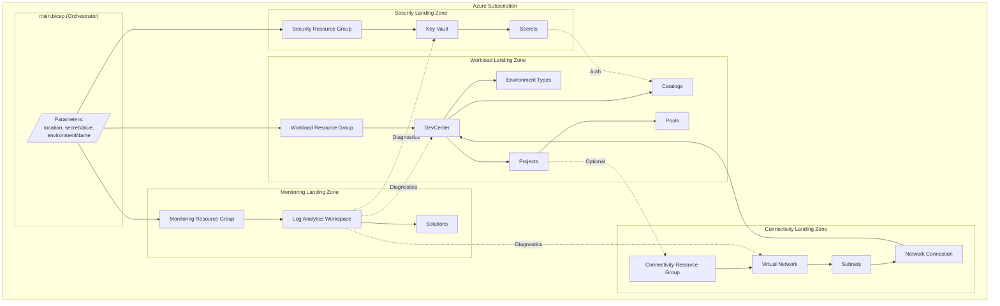
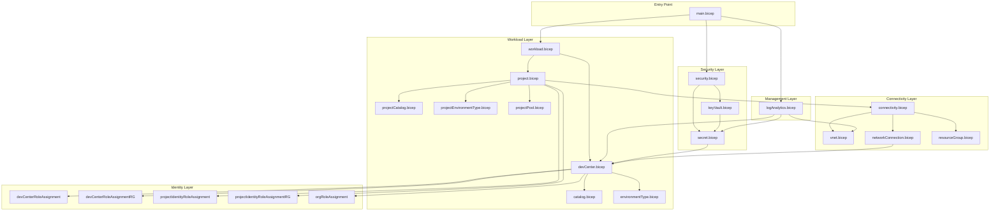
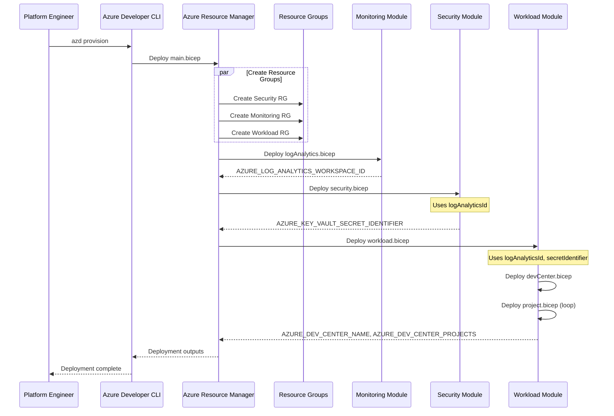
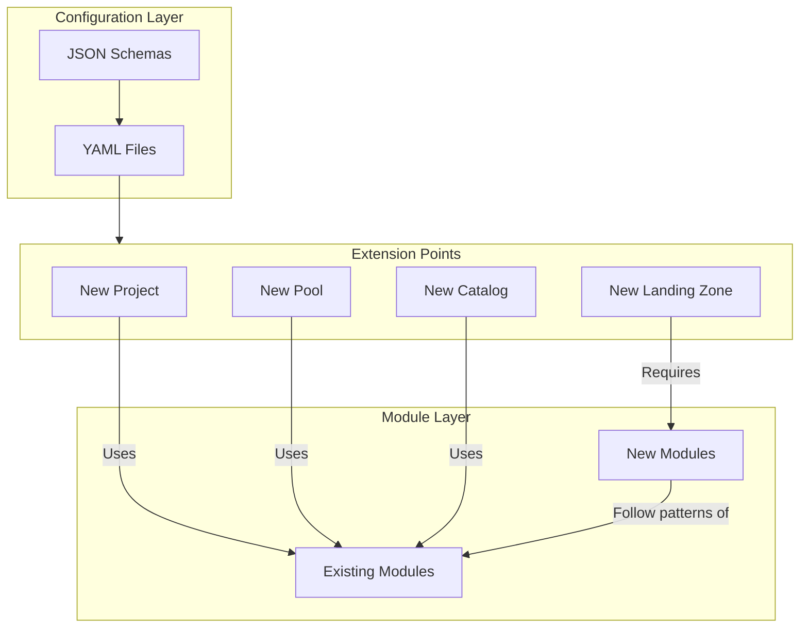

# 🏛️ Application Architecture

> **DevExp-DevBox Landing Zone Accelerator**

> [!NOTE] **Target Audience:** Platform Engineers, DevOps Engineers, Cloud
> Architects  
> **Reading Time:** ~25 minutes

<details>
<summary><strong>📍 Navigation</strong></summary>

| Previous                                         |                Index                 |                                                            Next |
| :----------------------------------------------- | :----------------------------------: | --------------------------------------------------------------: |
| [← Data Architecture](./02-data-architecture.md) | [🏠 Architecture Index](./README.md) | [🏗️ Technology Architecture →](./04-technology-architecture.md) |

</details>

| Metadata         | Value                     |
| ---------------- | ------------------------- |
| **Version**      | 1.0.0                     |
| **Last Updated** | January 22, 2026          |
| **Author**       | Platform Engineering Team |
| **Status**       | Active                    |

---

## 📑 Table of Contents

- [🏛️ Architecture Overview](#️-architecture-overview)
- [📦 Module Catalog](#-module-catalog)
- [🔗 Module Dependencies](#-module-dependencies)
- [🚀 Deployment Orchestration](#-deployment-orchestration)
- [📝 Interface Contracts](#-interface-contracts)
- [🎯 Design Patterns](#-design-patterns)
- [🔌 Extension Points](#-extension-points)
- [📚 References](#-references)
- [📖 Glossary](#-glossary)

---

## 🏛️ Architecture Overview

The DevExp-DevBox Landing Zone Accelerator implements a **modular Bicep
architecture** following Azure Landing Zone patterns. The solution is organized
into four distinct landing zones, each with dedicated resource groups and
specialized Bicep modules.

### Landing Zone Architecture



### Architecture Principles

| Principle                     | Description                               | Implementation                                    |
| ----------------------------- | ----------------------------------------- | ------------------------------------------------- |
| **Modularity**                | Each module has a single responsibility   | Separate `.bicep` files per resource type         |
| **Declarative Configuration** | Infrastructure defined as code            | YAML configuration files with JSON schemas        |
| **Separation of Concerns**    | Landing zones isolate different functions | Resource groups by security, monitoring, workload |
| **Least Privilege**           | Minimal permissions per identity          | Scoped RBAC role assignments                      |
| **Configuration as Code**     | All settings version controlled           | Git repository with YAML files                    |
| **Idempotency**               | Repeated deployments yield same result    | Bicep's declarative model                         |

---

## 📦 Module Catalog

### Module Hierarchy

```
src/
├── connectivity/          # Network infrastructure
│   ├── connectivity.bicep     # Network orchestrator
│   ├── networkConnection.bicep # DevCenter network connection
│   ├── resourceGroup.bicep    # Dynamic RG creation
│   └── vnet.bicep            # Virtual network
├── identity/              # RBAC and identity
│   ├── devCenterRoleAssignment.bicep
│   ├── devCenterRoleAssignmentRG.bicep
│   ├── keyVaultAccess.bicep
│   ├── orgRoleAssignment.bicep
│   ├── projectIdentityRoleAssignment.bicep
│   └── projectIdentityRoleAssignmentRG.bicep
├── management/            # Monitoring resources
│   └── logAnalytics.bicep
├── security/              # Security resources
│   ├── keyVault.bicep
│   ├── secret.bicep
│   └── security.bicep        # Security orchestrator
└── workload/              # DevCenter resources
    ├── workload.bicep        # Workload orchestrator
    ├── core/
    │   ├── catalog.bicep
    │   ├── devCenter.bicep
    │   └── environmentType.bicep
    └── project/
        ├── project.bicep
        ├── projectCatalog.bicep
        ├── projectEnvironmentType.bicep
        └── projectPool.bicep
```

---

### Module: main.bicep

- **Path**: `infra/main.bicep`
- **Scope**: Subscription
- **Purpose**: Top-level orchestrator that creates resource groups and
  coordinates all module deployments

**Inputs**:

| Parameter         | Type         | Required | Description                                   |
| ----------------- | ------------ | -------- | --------------------------------------------- |
| `location`        | string       | Yes      | Azure region (validated against allowed list) |
| `secretValue`     | securestring | Yes      | GitHub/ADO PAT token                          |
| `environmentName` | string       | Yes      | Environment name (2-10 chars)                 |

**Outputs**:

| Output                                 | Type   | Description                  |
| -------------------------------------- | ------ | ---------------------------- |
| `SECURITY_AZURE_RESOURCE_GROUP_NAME`   | string | Security RG name             |
| `MONITORING_AZURE_RESOURCE_GROUP_NAME` | string | Monitoring RG name           |
| `WORKLOAD_AZURE_RESOURCE_GROUP_NAME`   | string | Workload RG name             |
| `AZURE_LOG_ANALYTICS_WORKSPACE_ID`     | string | Log Analytics resource ID    |
| `AZURE_LOG_ANALYTICS_WORKSPACE_NAME`   | string | Log Analytics workspace name |
| `AZURE_KEY_VAULT_NAME`                 | string | Key Vault name               |
| `AZURE_KEY_VAULT_SECRET_IDENTIFIER`    | string | Secret URI                   |
| `AZURE_KEY_VAULT_ENDPOINT`             | string | Key Vault URI                |
| `AZURE_DEV_CENTER_NAME`                | string | DevCenter name               |
| `AZURE_DEV_CENTER_PROJECTS`            | array  | List of project names        |

**Dependencies**: None (entry point)

**Dependents**: All other modules

---

### Module: logAnalytics.bicep

- **Path**: `src/management/logAnalytics.bicep`
- **Scope**: Resource Group (Monitoring)
- **Purpose**: Deploy Log Analytics workspace for centralized monitoring

**Inputs**:

| Parameter  | Type   | Required | Default                  | Description            |
| ---------- | ------ | -------- | ------------------------ | ---------------------- |
| `name`     | string | Yes      | -                        | Base name (4-49 chars) |
| `location` | string | No       | resourceGroup().location | Azure region           |
| `tags`     | object | No       | {}                       | Resource tags          |
| `sku`      | string | No       | PerGB2018                | Workspace SKU          |

**Outputs**:

| Output                               | Type   | Description           |
| ------------------------------------ | ------ | --------------------- |
| `AZURE_LOG_ANALYTICS_WORKSPACE_ID`   | string | Workspace resource ID |
| `AZURE_LOG_ANALYTICS_WORKSPACE_NAME` | string | Workspace name        |

**Dependencies**: Monitoring resource group

**Dependents**: `security.bicep`, `workload.bicep`, `vnet.bicep`

**Resources Created**:

- `Microsoft.OperationalInsights/workspaces` - Log Analytics workspace
- `Microsoft.OperationsManagement/solutions` - Azure Activity solution
- `Microsoft.Insights/diagnosticSettings` - Self-diagnostics

---

### Module: security.bicep

- **Path**: `src/security/security.bicep`
- **Scope**: Resource Group (Security)
- **Purpose**: Orchestrate Key Vault and secret deployment

**Inputs**:

| Parameter        | Type         | Required | Description                |
| ---------------- | ------------ | -------- | -------------------------- |
| `tags`           | object       | Yes      | Resource tags              |
| `secretValue`    | securestring | Yes      | Secret content             |
| `logAnalyticsId` | string       | Yes      | Log Analytics workspace ID |

**Outputs**:

| Output                              | Type   | Description        |
| ----------------------------------- | ------ | ------------------ |
| `AZURE_KEY_VAULT_NAME`              | string | Key Vault name     |
| `AZURE_KEY_VAULT_SECRET_IDENTIFIER` | string | Secret URI         |
| `AZURE_KEY_VAULT_ENDPOINT`          | string | Key Vault endpoint |

**Dependencies**: `logAnalytics.bicep`

**Dependents**: `workload.bicep`

---

### Module: keyVault.bicep

- **Path**: `src/security/keyVault.bicep`
- **Scope**: Resource Group (Security)
- **Purpose**: Deploy Azure Key Vault with security configuration

**Inputs**:

| Parameter          | Type   | Required | Description                       |
| ------------------ | ------ | -------- | --------------------------------- |
| `keyvaultSettings` | object | Yes      | Key Vault configuration from YAML |
| `location`         | string | No       | Azure region                      |
| `tags`             | object | Yes      | Resource tags                     |
| `unique`           | string | No       | Unique suffix for naming          |

**Outputs**:

| Output                     | Type   | Description    |
| -------------------------- | ------ | -------------- |
| `AZURE_KEY_VAULT_NAME`     | string | Key Vault name |
| `AZURE_KEY_VAULT_ENDPOINT` | string | Vault URI      |

**Dependencies**: Security resource group

**Dependents**: `secret.bicep`

**Resources Created**:

- `Microsoft.KeyVault/vaults` - Key Vault with RBAC, soft delete, purge
  protection

---

### Module: secret.bicep

- **Path**: `src/security/secret.bicep`
- **Scope**: Resource Group (Security)
- **Purpose**: Create secrets in Key Vault with diagnostic settings

**Inputs**:

| Parameter        | Type         | Required | Description                |
| ---------------- | ------------ | -------- | -------------------------- |
| `name`           | string       | Yes      | Secret name                |
| `secretValue`    | securestring | Yes      | Secret content             |
| `keyVaultName`   | string       | Yes      | Target Key Vault           |
| `logAnalyticsId` | string       | Yes      | Log Analytics workspace ID |

**Outputs**:

| Output                              | Type   | Description |
| ----------------------------------- | ------ | ----------- |
| `AZURE_KEY_VAULT_SECRET_IDENTIFIER` | string | Secret URI  |

**Dependencies**: `keyVault.bicep`, `logAnalytics.bicep`

**Dependents**: `catalog.bicep`, `projectCatalog.bicep`

---

### Module: workload.bicep

- **Path**: `src/workload/workload.bicep`
- **Scope**: Resource Group (Workload)
- **Purpose**: Orchestrate DevCenter and project deployments

**Inputs**:

| Parameter                   | Type         | Required | Description                |
| --------------------------- | ------------ | -------- | -------------------------- |
| `logAnalyticsId`            | string       | Yes      | Log Analytics workspace ID |
| `secretIdentifier`          | securestring | Yes      | Key Vault secret URI       |
| `securityResourceGroupName` | string       | Yes      | Security RG for RBAC       |
| `location`                  | string       | No       | Azure region               |

**Outputs**:

| Output                      | Type   | Description           |
| --------------------------- | ------ | --------------------- |
| `AZURE_DEV_CENTER_NAME`     | string | DevCenter name        |
| `AZURE_DEV_CENTER_PROJECTS` | array  | List of project names |

**Dependencies**: `logAnalytics.bicep`, `security.bicep`

**Dependents**: None (terminal module)

---

### Module: devCenter.bicep

- **Path**: `src/workload/core/devCenter.bicep`
- **Scope**: Resource Group (Workload)
- **Purpose**: Deploy DevCenter with identity, catalogs, and environment types

**Inputs**:

| Parameter                   | Type            | Required | Description                  |
| --------------------------- | --------------- | -------- | ---------------------------- |
| `config`                    | DevCenterConfig | Yes      | DevCenter configuration      |
| `catalogs`                  | array           | Yes      | Catalog definitions          |
| `environmentTypes`          | array           | Yes      | Environment type definitions |
| `logAnalyticsId`            | string          | Yes      | Log Analytics workspace ID   |
| `secretIdentifier`          | securestring    | Yes      | Secret for private catalogs  |
| `securityResourceGroupName` | string          | Yes      | Security RG name             |
| `location`                  | string          | No       | Azure region                 |

**Outputs**:

| Output                  | Type   | Description    |
| ----------------------- | ------ | -------------- |
| `AZURE_DEV_CENTER_NAME` | string | DevCenter name |

**Dependencies**: `logAnalytics.bicep`, `secret.bicep`

**Dependents**: `project.bicep`, `catalog.bicep`, `environmentType.bicep`

**Resources Created**:

- `Microsoft.DevCenter/devcenters` - DevCenter resource
- `Microsoft.Insights/diagnosticSettings` - Diagnostic settings
- Role assignments via identity modules
- Catalogs via `catalog.bicep`
- Environment types via `environmentType.bicep`

---

### Module: project.bicep

- **Path**: `src/workload/project/project.bicep`
- **Scope**: Resource Group (Workload)
- **Purpose**: Deploy DevCenter project with identity, catalogs, pools

**Inputs**:

| Parameter                   | Type         | Required | Description                 |
| --------------------------- | ------------ | -------- | --------------------------- |
| `devCenterName`             | string       | Yes      | Parent DevCenter            |
| `name`                      | string       | Yes      | Project name                |
| `logAnalyticsId`            | string       | Yes      | Log Analytics workspace ID  |
| `projectDescription`        | string       | Yes      | Project description         |
| `catalogs`                  | object[]     | Yes      | Project-specific catalogs   |
| `projectEnvironmentTypes`   | array        | Yes      | Enabled environment types   |
| `projectPools`              | array        | Yes      | Dev Box pool definitions    |
| `projectNetwork`            | object       | Yes      | Network configuration       |
| `secretIdentifier`          | securestring | Yes      | Secret for private catalogs |
| `securityResourceGroupName` | string       | Yes      | Security RG name            |
| `identity`                  | Identity     | Yes      | Project identity config     |
| `tags`                      | object       | No       | Resource tags               |
| `location`                  | string       | No       | Azure region                |

**Outputs**:

| Output               | Type   | Description  |
| -------------------- | ------ | ------------ |
| `AZURE_PROJECT_NAME` | string | Project name |

**Dependencies**: `devCenter.bicep`

**Dependents**: `projectPool.bicep`, `projectCatalog.bicep`,
`projectEnvironmentType.bicep`

---

### Module: projectPool.bicep

- **Path**: `src/workload/project/projectPool.bicep`
- **Scope**: Resource Group (Workload)
- **Purpose**: Create Dev Box pools within a project

**Inputs**:

| Parameter               | Type      | Required | Description                                  |
| ----------------------- | --------- | -------- | -------------------------------------------- |
| `name`                  | string    | Yes      | Pool name (e.g., `backend-engineer`)         |
| `location`              | string    | No       | Azure region                                 |
| `catalogs`              | Catalog[] | Yes      | Catalog references for images                |
| `imageDefinitionName`   | string    | Yes      | Image definition name                        |
| `networkConnectionName` | string    | Yes      | Network connection name                      |
| `vmSku`                 | string    | Yes      | VM SKU (e.g., `general_i_32c128gb512ssd_v2`) |
| `networkType`           | string    | Yes      | Managed or Unmanaged                         |
| `projectName`           | string    | Yes      | Parent project                               |

**Outputs**: None

**Dependencies**: `project.bicep`, `connectivity.bicep`, `projectCatalog.bicep`

**Dependents**: None (terminal module)

**Resources Created**:

- `Microsoft.DevCenter/projects/pools` - Dev Box pool

---

### Module: catalog.bicep

- **Path**: `src/workload/core/catalog.bicep`
- **Scope**: Resource Group (Workload)
- **Purpose**: Create DevCenter-level catalogs from Git repositories

**Inputs**:

| Parameter          | Type         | Required | Description              |
| ------------------ | ------------ | -------- | ------------------------ |
| `devCenterName`    | string       | Yes      | Parent DevCenter         |
| `catalogConfig`    | Catalog      | Yes      | Catalog configuration    |
| `secretIdentifier` | securestring | Yes      | Secret for private repos |

**Outputs**:

| Output                          | Type   | Description                  |
| ------------------------------- | ------ | ---------------------------- |
| `AZURE_DEV_CENTER_CATALOG_NAME` | string | Catalog name                 |
| `AZURE_DEV_CENTER_CATALOG_ID`   | string | Catalog resource ID          |
| `AZURE_DEV_CENTER_CATALOG_TYPE` | string | Catalog type (gitHub/adoGit) |

**Dependencies**: `devCenter.bicep`, `secret.bicep`

**Dependents**: `projectPool.bicep`

---

### Module: connectivity.bicep

- **Path**: `src/connectivity/connectivity.bicep`
- **Scope**: Resource Group (Workload/Connectivity)
- **Purpose**: Orchestrate network infrastructure for projects

**Inputs**:

| Parameter        | Type   | Required | Description                |
| ---------------- | ------ | -------- | -------------------------- |
| `devCenterName`  | string | Yes      | DevCenter name             |
| `projectNetwork` | object | Yes      | Network configuration      |
| `logAnalyticsId` | string | Yes      | Log Analytics workspace ID |
| `location`       | string | Yes      | Azure region               |

**Outputs**:

| Output                  | Type   | Description             |
| ----------------------- | ------ | ----------------------- |
| `networkConnectionName` | string | Network connection name |
| `networkType`           | string | Managed or Unmanaged    |

**Dependencies**: `devCenter.bicep`, `logAnalytics.bicep`

**Dependents**: `projectPool.bicep`

---

### Module: vnet.bicep

- **Path**: `src/connectivity/vnet.bicep`
- **Scope**: Resource Group (Connectivity)
- **Purpose**: Create or reference virtual networks

**Inputs**:

| Parameter        | Type   | Required | Description                            |
| ---------------- | ------ | -------- | -------------------------------------- |
| `logAnalyticsId` | string | Yes      | Log Analytics workspace ID             |
| `location`       | string | Yes      | Azure region                           |
| `tags`           | object | No       | Resource tags                          |
| `settings`       | object | Yes      | Network settings (name, type, subnets) |

**Outputs**:

| Output                  | Type   | Description                      |
| ----------------------- | ------ | -------------------------------- |
| `AZURE_VIRTUAL_NETWORK` | object | VNet details (name, RG, subnets) |

**Dependencies**: Connectivity resource group

**Dependents**: `networkConnection.bicep`

**Resources Created**:

- `Microsoft.Network/virtualNetworks` - Virtual network (if create=true)
- `Microsoft.Insights/diagnosticSettings` - VNet diagnostics

---

### Module: networkConnection.bicep

- **Path**: `src/connectivity/networkConnection.bicep`
- **Scope**: Resource Group (Workload)
- **Purpose**: Create DevCenter network connection to VNet

**Inputs**:

| Parameter       | Type   | Required | Description               |
| --------------- | ------ | -------- | ------------------------- |
| `devCenterName` | string | Yes      | DevCenter name            |
| `name`          | string | Yes      | Connection name           |
| `subnetId`      | string | Yes      | Target subnet resource ID |

**Outputs**:

| Output                  | Type   | Description             |
| ----------------------- | ------ | ----------------------- |
| `networkConnectionName` | string | Network connection name |

**Dependencies**: `vnet.bicep`, `devCenter.bicep`

**Dependents**: `projectPool.bicep`

---

### Identity Modules

| Module                                  | Path            | Purpose                                                              |
| --------------------------------------- | --------------- | -------------------------------------------------------------------- |
| `devCenterRoleAssignment.bicep`         | `src/identity/` | Subscription-scope role assignments for DevCenter managed identity   |
| `devCenterRoleAssignmentRG.bicep`       | `src/identity/` | Resource group-scope role assignments for DevCenter managed identity |
| `projectIdentityRoleAssignment.bicep`   | `src/identity/` | Project-scope role assignments for project managed identity          |
| `projectIdentityRoleAssignmentRG.bicep` | `src/identity/` | Security RG role assignments for project managed identity            |
| `orgRoleAssignment.bicep`               | `src/identity/` | Role assignments for organizational AD groups                        |
| `keyVaultAccess.bicep`                  | `src/identity/` | Key Vault access configuration                                       |

---

## 🔗 Module Dependencies

### Dependency Graph



### Dependency Matrix

| Module               | Depends On                            | Provides To                          |
| -------------------- | ------------------------------------- | ------------------------------------ |
| `main.bicep`         | -                                     | All modules                          |
| `logAnalytics.bicep` | main                                  | security, workload, connectivity     |
| `keyVault.bicep`     | main                                  | secret                               |
| `secret.bicep`       | keyVault, logAnalytics                | devCenter, catalog                   |
| `security.bicep`     | logAnalytics                          | workload                             |
| `devCenter.bicep`    | logAnalytics, secret                  | project, catalog, envType            |
| `project.bicep`      | devCenter                             | pool, projectCatalog, projectEnvType |
| `connectivity.bicep` | devCenter, logAnalytics               | projectPool                          |
| `projectPool.bicep`  | project, connectivity, projectCatalog | -                                    |

---

## 🚀 Deployment Orchestration

### Deployment Sequence



### Deployment Scopes

| Scope               | Modules                                                 | Purpose                             |
| ------------------- | ------------------------------------------------------- | ----------------------------------- |
| **Subscription**    | `main.bicep`, `devCenterRoleAssignment.bicep`           | Create RGs, subscription-level RBAC |
| **Security RG**     | `keyVault.bicep`, `secret.bicep`                        | Security resources                  |
| **Monitoring RG**   | `logAnalytics.bicep`                                    | Monitoring resources                |
| **Workload RG**     | `devCenter.bicep`, `project.bicep`, `projectPool.bicep` | DevCenter resources                 |
| **Connectivity RG** | `vnet.bicep`, `networkConnection.bicep`                 | Network resources (conditional)     |

### Deployment Commands

```bash
# Initialize environment
azd init

# Provision infrastructure
azd provision --no-prompt

# Full deployment with environment
azd provision -e dev --no-prompt
```

---

## 📝 Interface Contracts

### Module Parameter Types

```bicep
// DevCenter configuration type
type DevCenterConfig = {
  name: string
  identity: Identity
  catalogItemSyncEnableStatus: Status
  microsoftHostedNetworkEnableStatus: Status
  installAzureMonitorAgentEnableStatus: Status
  tags: object
}

// Identity configuration type
type Identity = {
  type: string
  roleAssignments: RoleAssignment
}

// Role assignment configuration
type RoleAssignment = {
  devCenter: AzureRBACRole[]
  orgRoleTypes: OrgRoleType[]
}

// Azure RBAC role definition
type AzureRBACRole = {
  id: string
  name: string
  scope: string
}

// Catalog type definition
type Catalog = {
  name: string
  type: CatalogType  // 'gitHub' | 'adoGit'
  visibility: 'public' | 'private'
  uri: string
  branch: string
  path: string
}

// Network settings type
type NetworkSettings = {
  name: string
  virtualNetworkType: 'Unmanaged' | 'Managed'
  create: bool
  resourceGroupName: string
  addressPrefixes: string[]
  subnets: object[]
  tags: object
}
```

### Output Contract Summary

| Module         | Key Output                          | Type   | Consumer                         |
| -------------- | ----------------------------------- | ------ | -------------------------------- |
| `logAnalytics` | `AZURE_LOG_ANALYTICS_WORKSPACE_ID`  | string | security, workload, connectivity |
| `security`     | `AZURE_KEY_VAULT_SECRET_IDENTIFIER` | string | workload (catalogs)              |
| `devCenter`    | `AZURE_DEV_CENTER_NAME`             | string | projects, network connections    |
| `connectivity` | `networkConnectionName`             | string | projectPool                      |
| `vnet`         | `AZURE_VIRTUAL_NETWORK`             | object | networkConnection                |

---

## 🎯 Design Patterns

### Patterns Implemented

| Pattern                       | Description                           | Implementation                                  |
| ----------------------------- | ------------------------------------- | ----------------------------------------------- |
| **Modular Design**            | Single responsibility per module      | Each `.bicep` file handles one resource type    |
| **Declarative Configuration** | Configuration separate from logic     | YAML files in `infra/settings/`                 |
| **Factory Pattern**           | Loop-based resource creation          | `for` loops for projects, pools, catalogs       |
| **Dependency Injection**      | Parameters passed between modules     | Output-to-input parameter chaining              |
| **Conditional Deployment**    | Resources created based on conditions | `if` statements for optional resources          |
| **Orchestrator Pattern**      | Parent modules coordinate children    | `workload.bicep` orchestrates DevCenter modules |

### Conditional Deployment Examples

```bicep
// Create VNet only if needed (Unmanaged network type)
resource virtualNetwork '...' = if (settings.create && settings.virtualNetworkType == 'Unmanaged') {
  // ...
}

// Deploy Key Vault or reference existing
module keyVault '...' = if (securitySettings.create) {
  // ...
}

// Create pool only for imageDefinition catalogs
resource pool '...' = [
  for (catalog, i) in catalogs: if (catalog.type == 'imageDefinition') {
    // ...
  }
]
```

### Factory Pattern for Multiple Resources

```bicep
// Deploy multiple projects from configuration
module projects 'project/project.bicep' = [
  for (project, i) in devCenterSettings.projects: {
    scope: resourceGroup()
    params: {
      name: project.name
      // ... other parameters from project config
    }
  }
]

// Output all project names
output AZURE_DEV_CENTER_PROJECTS array = [
  for (project, i) in devCenterSettings.projects: projects[i].outputs.AZURE_PROJECT_NAME
]
```

---

## 🔌 Extension Points

### Adding a New Project

1. **Update Configuration** (`infra/settings/workload/devcenter.yaml`):

```yaml
projects:
  - name: 'new-project'
    description: 'New project description'
    network:
      name: new-project
      create: true
      # ... network config
    identity:
      type: SystemAssigned
      roleAssignments:
        - azureADGroupId: '<group-id>'
          azureADGroupName: 'New Project Developers'
          azureRBACRoles:
            - name: 'Dev Box User'
              id: '45d50f46-0b78-4001-a660-4198cbe8cd05'
              scope: Project
    pools:
      - name: 'developer'
        imageDefinitionName: 'new-project-developer'
        vmSku: general_i_16c64gb256ssd_v2
    # ... rest of config
```

2. **Redeploy**: `azd provision`

### Adding a New Pool

1. **Update Project Configuration**:

```yaml
pools:
  - name: 'new-pool'
    imageDefinitionName: 'custom-image'
    vmSku: general_i_32c128gb512ssd_v2
```

2. **Ensure Catalog Contains Image Definition**

3. **Redeploy**: `azd provision`

### Adding a New Catalog

1. **DevCenter-Level Catalog** (in `devcenter.yaml`):

```yaml
catalogs:
  - name: 'new-catalog'
    type: gitHub
    visibility: private
    uri: 'https://github.com/org/repo.git'
    branch: 'main'
    path: './definitions'
```

2. **Project-Level Catalog** (in project section):

```yaml
projects:
  - name: 'project'
    catalogs:
      - name: 'project-catalog'
        type: imageDefinition
        sourceControl: gitHub
        visibility: private
        uri: 'https://github.com/org/project-repo.git'
        branch: 'main'
        path: '/.devcenter/imageDefinitions'
```

### Adding a New Landing Zone

1. **Create New Module** (`src/newzone/newzone.bicep`)

2. **Update Resource Organization**
   (`infra/settings/resourceOrganization/azureResources.yaml`):

```yaml
newzone:
  create: true
  name: devexp-newzone
  tags:
    landingZone: NewZone
    # ... other tags
```

3. **Update `main.bicep`**:

```bicep
resource newzoneRg 'Microsoft.Resources/resourceGroups@...' = if (landingZones.newzone.create) {
  name: createResourceGroupName.newzone
  location: location
  tags: landingZones.newzone.tags
}

module newzone '../src/newzone/newzone.bicep' = {
  scope: resourceGroup(newzoneRgName)
  params: {
    // ...
  }
}
```

### Extension Architecture



---

## 📚 References

### External References

| Reference               | URL                                                                            | Description              |
| ----------------------- | ------------------------------------------------------------------------------ | ------------------------ |
| Bicep Documentation     | https://learn.microsoft.com/azure/azure-resource-manager/bicep/                | Bicep language reference |
| Azure Landing Zones     | https://learn.microsoft.com/azure/cloud-adoption-framework/ready/landing-zone/ | CAF guidance             |
| DevCenter API Reference | https://learn.microsoft.com/azure/templates/microsoft.devcenter/               | Bicep resource reference |

### Related Architecture Documents

| Document                | Path                                                             | Description           |
| ----------------------- | ---------------------------------------------------------------- | --------------------- |
| Business Architecture   | [01-business-architecture.md](./01-business-architecture.md)     | Business context      |
| Data Architecture       | [02-data-architecture.md](./02-data-architecture.md)             | Data models and flows |
| Technology Architecture | [04-technology-architecture.md](./04-technology-architecture.md) | Azure services        |

---

## 📖 Glossary

| Term                  | Definition                                                                |
| --------------------- | ------------------------------------------------------------------------- |
| **Bicep**             | Domain-specific language for Azure resource deployment                    |
| **Module**            | Reusable Bicep file that can be called from other templates               |
| **Scope**             | Deployment level (tenant, management group, subscription, resource group) |
| **Orchestrator**      | Module that coordinates deployment of multiple child modules              |
| **Factory Pattern**   | Design pattern using loops to create multiple similar resources           |
| **loadYamlContent()** | Bicep function to load YAML as typed configuration                        |
| **targetScope**       | Bicep declaration specifying deployment scope                             |
| **dependsOn**         | Explicit dependency declaration between resources/modules                 |

---

_This document follows TOGAF Architecture Development Method (ADM) principles
and aligns with the Application Architecture domain of the BDAT framework._

---

<div align="center">

**[← Data Architecture](./02-data-architecture.md)** |
**[⬆️ Back to Top](#-application-architecture)** |
**[🏗️ Technology Architecture →](./04-technology-architecture.md)**

</div>
