# 📦 Application Architecture

> **DevExp-DevBox Landing Zone Accelerator**

> [!NOTE]
> **Target Audience:** Platform Engineers, DevOps Engineers, IaC Developers  
> **Reading Time:** ~25 minutes

<details>
<summary>📍 Navigation</summary>

| Previous | Index | Next |
|:---------|:-----:|-----:|
| [← Data Architecture](02-data-architecture.md) | [Architecture Index](../README.md) | [Technology Architecture →](04-technology-architecture.md) |

</details>

| Property | Value |
|:---------|:------|
| **Version** | 1.0.0 |
| **Last Updated** | 2026-01-23 |
| **Author** | DevExp Team |
| **Status** | Published |

---

## 📑 Table of Contents

- [📊 Application Overview](#-application-overview)
- [📋 Bicep Module Catalog](#-bicep-module-catalog)
- [🔗 Module Dependency Graph](#-module-dependency-graph)
- [📜 Interface Contracts](#-interface-contracts)
- [🚀 Deployment Orchestration](#-deployment-orchestration)
- [🔧 Component Details](#-component-details)
- [🔄 Integration Patterns](#-integration-patterns)
- [🔌 Extension Points](#-extension-points)
- [📚 References](#-references)

---

## 📊 Application Overview

The DevExp-DevBox accelerator is an Infrastructure as Code (IaC) application built using Azure Bicep. It follows a modular, hierarchical architecture with clear separation of concerns across landing zones.

### Solution Architecture

```mermaid
---
title: Solution Architecture Overview
---
flowchart TB
    %% ===== ORCHESTRATION LAYER =====
    subgraph Orchestration["🎯 Orchestration Layer"]
        MAIN["📄 main.bicep<br/>(Subscription Scope)"]
    end
    
    %% ===== LANDING ZONE MODULES =====
    subgraph LandingZones["🏗️ Landing Zone Modules"]
        SEC["🔐 security.bicep"]
        MON["📊 logAnalytics.bicep"]
        WL["📦 workload.bicep"]
        CONN["🌐 connectivity.bicep"]
    end
    
    %% ===== CORE RESOURCE MODULES =====
    subgraph CoreResources["⚙️ Core Resource Modules"]
        KV["🔑 keyVault.bicep"]
        LA["📈 logAnalytics.bicep"]
        DC["🖥️ devCenter.bicep"]
        VN["🔗 vnet.bicep"]
    end
    
    %% ===== PROJECT MODULES =====
    subgraph ProjectResources["📁 Project Modules"]
        PROJ["📋 project.bicep"]
        POOL["🏊 projectPool.bicep"]
        PCAT["📚 projectCatalog.bicep"]
        PENV["🌍 projectEnvironmentType.bicep"]
    end
    
    %% ===== IDENTITY MODULES =====
    subgraph Identity["👤 Identity Modules"]
        DCRA["🔐 devCenterRoleAssignment.bicep"]
        ORA["🏢 orgRoleAssignment.bicep"]
        PIRA["👥 projectIdentityRoleAssignment.bicep"]
        KVA["🔑 keyVaultAccess.bicep"]
    end
    
    %% ===== CONNECTIONS =====
    MAIN -->|deploys| SEC
    MAIN -->|deploys| MON
    MAIN -->|deploys| WL
    
    SEC -->|creates| KV
    MON -->|creates| LA
    WL -->|creates| DC
    WL -->|includes| CONN
    
    CONN -->|provisions| VN
    DC -->|creates| PROJ
    PROJ -->|deploys| POOL
    PROJ -->|syncs| PCAT
    PROJ -->|enables| PENV
    
    DC -->|assigns| DCRA
    DC -->|assigns| ORA
    PROJ -->|assigns| PIRA
    SEC -->|grants| KVA
    
    %% ===== STYLES =====
    classDef trigger fill:#818CF8,stroke:#4F46E5,color:#FFFFFF
    classDef primary fill:#4F46E5,stroke:#3730A3,color:#FFFFFF
    classDef secondary fill:#10B981,stroke:#059669,color:#FFFFFF
    classDef datastore fill:#F59E0B,stroke:#D97706,color:#000000
    
    class MAIN trigger
    class SEC,MON,WL,CONN primary
    class KV,LA,DC,VN secondary
    class PROJ,POOL,PCAT,PENV secondary
    class DCRA,ORA,PIRA,KVA datastore
    
    style Orchestration fill:#EEF2FF,stroke:#4F46E5,stroke-width:2px
    style LandingZones fill:#E0E7FF,stroke:#4F46E5,stroke-width:2px
    style CoreResources fill:#ECFDF5,stroke:#10B981,stroke-width:2px
    style ProjectResources fill:#ECFDF5,stroke:#10B981,stroke-width:2px
    style Identity fill:#FEF3C7,stroke:#F59E0B,stroke-width:2px
```



### Module Statistics

| Category | Module Count | Lines of Code | Description |
|----------|-------------|---------------|-------------|
| Orchestration | 1 | ~200 | main.bicep subscription orchestrator |
| Landing Zones | 3 | ~150 | Security, Monitoring, Workload |
| Connectivity | 4 | ~200 | VNet, Network Connection |
| Identity | 5 | ~300 | RBAC role assignments |
| Security | 3 | ~150 | Key Vault, Secrets |
| Workload | 8 | ~500 | DevCenter, Projects, Pools |
| **Total** | **24** | **~1500** | Full infrastructure coverage |

---

[⬆️ Back to Top](#-table-of-contents)

---

## 📋 Bicep Module Catalog

### Module Inventory

| Module | Scope | Purpose | Dependencies |
|--------|-------|---------|--------------|
| `main.bicep` | Subscription | Orchestration | All modules |
| `security.bicep` | Resource Group | Key Vault deployment | keyVault.bicep, keyVaultAccess.bicep |
| `logAnalytics.bicep` | Resource Group | Log Analytics workspace | None |
| `workload.bicep` | Resource Group | DevCenter orchestration | devCenter.bicep, connectivity.bicep |
| `connectivity.bicep` | Resource Group | Network orchestration | vnet.bicep, networkConnection.bicep |
| `keyVault.bicep` | Resource | Key Vault creation | secret.bicep |
| `devCenter.bicep` | Resource | DevCenter & catalogs | catalog.bicep, environmentType.bicep |
| `project.bicep` | Resource | Project deployment | projectPool.bicep, projectCatalog.bicep |
| `vnet.bicep` | Resource | Virtual Network | None |

### Module Classification

```mermaid
---
title: Bicep Module Classification
---
mindmap
    root((📦 Bicep Modules))
        🎯 Orchestration
            main.bicep
        🏗️ Landing Zones
            security.bicep
            workload.bicep
        🌐 Infrastructure
            connectivity.bicep
            vnet.bicep
            networkConnection.bicep
            resourceGroup.bicep
        ⚙️ Resources
            keyVault.bicep
            secret.bicep
            logAnalytics.bicep
        📦 Workload
            devCenter.bicep
            catalog.bicep
            environmentType.bicep
        📁 Projects
            project.bicep
            projectPool.bicep
            projectCatalog.bicep
            projectEnvironmentType.bicep
        👤 Identity
            devCenterRoleAssignment.bicep
            devCenterRoleAssignmentRG.bicep
            orgRoleAssignment.bicep
            projectIdentityRoleAssignment.bicep
            projectIdentityRoleAssignmentRG.bicep
            keyVaultAccess.bicep
```



---

[⬆️ Back to Top](#-table-of-contents)

---

## 🔗 Module Dependency Graph

### Complete Dependency Tree

```mermaid
---
title: Complete Module Dependency Tree
---
flowchart TB
    %% ===== LAYER 0: ORCHESTRATION =====
    subgraph L0["🎯 Layer 0: Orchestration"]
        MAIN["📄 main.bicep<br/>(targetScope: subscription)"]
    end
    
    %% ===== LAYER 1: RESOURCE GROUPS =====
    subgraph L1["📁 Layer 1: Resource Groups"]
        RG_SEC["🔐 Resource Group<br/>(Security)"]
        RG_MON["📊 Resource Group<br/>(Monitoring)"]
        RG_WL["📦 Resource Group<br/>(Workload)"]
    end
    
    %% ===== LAYER 2: LANDING ZONE MODULES =====
    subgraph L2["🏗️ Layer 2: Landing Zone Modules"]
        SEC["🔒 security.bicep"]
        LA["📈 logAnalytics.bicep"]
        WL["📦 workload.bicep"]
    end
    
    %% ===== LAYER 3: CORE RESOURCES =====
    subgraph L3["⚙️ Layer 3: Core Resources"]
        KV["🔑 keyVault.bicep"]
        LOG["📊 Log Analytics<br/>Workspace"]
        DC["🖥️ devCenter.bicep"]
        CONN["🌐 connectivity.bicep"]
    end
    
    %% ===== LAYER 4: CHILD RESOURCES =====
    subgraph L4["📦 Layer 4: Child Resources"]
        SECRET["🔐 secret.bicep"]
        CAT["📚 catalog.bicep"]
        ENV["🌍 environmentType.bicep"]
        VN["🔗 vnet.bicep"]
        NC["📶 networkConnection.bicep"]
    end
    
    %% ===== LAYER 5: PROJECT RESOURCES =====
    subgraph L5["📁 Layer 5: Project Resources"]
        PROJ["📋 project.bicep"]
    end
    
    %% ===== LAYER 6: PROJECT CHILD RESOURCES =====
    subgraph L6["📦 Layer 6: Project Child Resources"]
        POOL["🏊 projectPool.bicep"]
        PCAT["📚 projectCatalog.bicep"]
        PENV["🌍 projectEnvironmentType.bicep"]
    end
    
    %% ===== LAYER 7: IDENTITY =====
    subgraph L7["👤 Layer 7: Identity"]
        DCRA["🔐 devCenterRoleAssignment"]
        ORA["🏢 orgRoleAssignment"]
        PIRA["👥 projectIdentityRoleAssignment"]
        KVA["🔑 keyVaultAccess"]
    end
    
    %% ===== CONNECTIONS =====
    MAIN -->|creates| RG_SEC
    MAIN -->|creates| RG_MON
    MAIN -->|creates| RG_WL
    
    RG_SEC -->|scopes| SEC
    RG_MON -->|scopes| LA
    RG_WL -->|scopes| WL
    
    SEC -->|deploys| KV
    LA -->|deploys| LOG
    WL -->|deploys| DC
    WL -->|deploys| CONN
    
    KV -->|creates| SECRET
    KV -->|assigns| KVA
    DC -->|syncs| CAT
    DC -->|defines| ENV
    DC -->|assigns| DCRA
    DC -->|assigns| ORA
    CONN -->|provisions| VN
    CONN -->|connects| NC
    
    DC -->|spawns| PROJ
    PROJ -->|deploys| POOL
    PROJ -->|syncs| PCAT
    PROJ -->|enables| PENV
    PROJ -->|assigns| PIRA
    
    LOG -.->|logAnalyticsId| KV
    LOG -.->|logAnalyticsId| DC
    LOG -.->|logAnalyticsId| VN
    KV -.->|secretIdentifier| CAT
    
    %% ===== STYLES =====
    classDef trigger fill:#818CF8,stroke:#4F46E5,color:#FFFFFF
    classDef primary fill:#4F46E5,stroke:#3730A3,color:#FFFFFF
    classDef secondary fill:#10B981,stroke:#059669,color:#FFFFFF
    classDef datastore fill:#F59E0B,stroke:#D97706,color:#000000
    
    class MAIN trigger
    class RG_SEC,RG_MON,RG_WL trigger
    class SEC,LA,WL primary
    class KV,LOG,DC,CONN primary
    class SECRET,CAT,ENV,VN,NC secondary
    class PROJ secondary
    class POOL,PCAT,PENV secondary
    class DCRA,ORA,PIRA,KVA datastore
    
    style L0 fill:#EEF2FF,stroke:#4F46E5,stroke-width:2px
    style L1 fill:#EEF2FF,stroke:#4F46E5,stroke-width:2px
    style L2 fill:#E0E7FF,stroke:#4F46E5,stroke-width:2px
    style L3 fill:#E0E7FF,stroke:#4F46E5,stroke-width:2px
    style L4 fill:#ECFDF5,stroke:#10B981,stroke-width:2px
    style L5 fill:#ECFDF5,stroke:#10B981,stroke-width:2px
    style L6 fill:#ECFDF5,stroke:#10B981,stroke-width:2px
    style L7 fill:#FEF3C7,stroke:#F59E0B,stroke-width:2px
```



### Dependency Matrix

| Module | Depends On | Provides To |
|--------|------------|-------------|
| `main.bicep` | azureResources.yaml, security.yaml, devcenter.yaml | All modules |
| `security.bicep` | logAnalyticsId, securityConfig | secretIdentifier |
| `logAnalytics.bicep` | monitoringLandingZone | logAnalyticsId |
| `workload.bicep` | logAnalyticsId, secretIdentifier, devCenterConfig | devCenterName, projects |
| `keyVault.bicep` | logAnalyticsId | keyVaultId, secretIdentifier |
| `devCenter.bicep` | logAnalyticsId, secretIdentifier | devCenterId, catalogIds |
| `project.bicep` | devCenterName, networkConnectionId | projectId, poolIds |
| `vnet.bicep` | logAnalyticsId, networkConfig | vnetId, subnetIds |

---

[⬆️ Back to Top](#-table-of-contents)

---

## 📜 Interface Contracts

### main.bicep Parameters

```bicep
// Orchestration Parameters
@description('Azure region for deployment')
param location string = deployment().location

@description('Environment suffix (e.g., dev, prod)')
param deploymentEnvironmentName string = 'dev'

@secure()
@description('PAT token for catalog authentication')
param keyVaultSecret string

// Configuration Loading
var securityConfig = loadYamlContent('./settings/security/security.yaml')
var devCenterConfig = loadYamlContent('./settings/workload/devcenter.yaml')
var azureResourcesConfig = loadYamlContent('./settings/resourceOrganization/azureResources.yaml')
```

### main.bicep Outputs

```bicep
// Resource Group Outputs
output securityResourceGroupName string = securityResourceGroup.name
output monitoringResourceGroupName string = monitoringResourceGroup.name
output workloadResourceGroupName string = workloadResourceGroup.name

// Resource Outputs
output logAnalyticsWorkspaceId string = logAnalyticsWorkspace.outputs.logAnalyticsWorkspaceId
output keyVaultName string = security.outputs.keyVaultName
output devCenterName string = workload.outputs.devCenterName
output keyVaultSecretIdentifier string = security.outputs.keyVaultSecretIdentifier
output devCenterProjects array = workload.outputs.devCenterProjects
```

### Module Interface: security.bicep

```bicep
// Input Parameters
@description('Security landing zone configuration')
param landingZone object

@description('Key Vault configuration')
param keyVaultConfig object

@description('Log Analytics workspace ID')
param logAnalyticsWorkspaceId string

@secure()
@description('Secret value to store')
param keyVaultSecret string

@description('Deployment environment')
param deploymentEnvironmentName string

@description('Location')
param location string

// Outputs
output keyVaultName string = keyVault.outputs.keyVaultName
output keyVaultId string = keyVault.outputs.keyVaultId
output keyVaultSecretIdentifier string = keyVault.outputs.secretIdentifier
```

### Module Interface: workload.bicep

```bicep
// Input Parameters
@description('Workload landing zone configuration')
param landingZone object

@description('DevCenter configuration')
param devCenterConfig object

@description('Log Analytics workspace ID')
param logAnalyticsId string

@description('Key Vault secret identifier')
param keyVaultSecretIdentifier string

@description('Deployment environment')
param deploymentEnvironmentName string

@description('Location')
param location string

// Outputs
output devCenterName string = devCenter.outputs.devCenterName
output devCenterProjects array = devCenter.outputs.devCenterProjects
```

---

[⬆️ Back to Top](#-table-of-contents)

---

## 🚀 Deployment Orchestration

### Deployment Sequence Diagram

```mermaid
---
title: Deployment Sequence
---
sequenceDiagram
    participant U as 👤 User/Pipeline
    participant AZD as 🚀 azd CLI
    participant ARM as ☁️ Azure Resource Manager
    participant RG as 📁 Resource Groups
    participant SEC as 🔐 Security Module
    participant MON as 📊 Monitoring Module
    participant WL as 📦 Workload Module
    
    U->>AZD: azd provision
    AZD->>ARM: Deploy main.bicep (subscription scope)
    
    par Create Resource Groups
        ARM->>RG: Create Security RG
        ARM->>RG: Create Monitoring RG
        ARM->>RG: Create Workload RG
    end
    
    Note over ARM,MON: Phase 1: Independent Modules
    ARM->>MON: Deploy logAnalytics.bicep
    MON-->>ARM: logAnalyticsWorkspaceId
    
    Note over ARM,SEC: Phase 2: Security (depends on LA)
    ARM->>SEC: Deploy security.bicep
    SEC-->>ARM: keyVaultSecretIdentifier
    
    Note over ARM,WL: Phase 3: Workload (depends on LA + KV)
    ARM->>WL: Deploy workload.bicep
    
    WL->>WL: Deploy DevCenter
    WL->>WL: Deploy Catalogs
    WL->>WL: Deploy Projects
    WL->>WL: Deploy Pools
    
    WL-->>ARM: devCenterName, projects
    ARM-->>AZD: Deployment complete
    AZD-->>U: Outputs displayed
```



### Deployment Dependencies

```mermaid
---
title: Deployment Dependencies
---
flowchart LR
    %% ===== PHASE 1: FOUNDATION =====
    subgraph Phase1["🏗️ Phase 1: Foundation"]
        RG["📁 Resource Groups"]
        LA["📊 Log Analytics"]
    end
    
    %% ===== PHASE 2: SECURITY =====
    subgraph Phase2["🔐 Phase 2: Security"]
        KV["🔑 Key Vault"]
        SEC["🔒 Secrets"]
    end
    
    %% ===== PHASE 3: NETWORK =====
    subgraph Phase3["🌐 Phase 3: Network"]
        VN["🔗 Virtual Network"]
        NC["📶 Network Connection"]
    end
    
    %% ===== PHASE 4: WORKLOAD =====
    subgraph Phase4["📦 Phase 4: Workload"]
        DC["🖥️ DevCenter"]
        CAT["📚 Catalogs"]
        ENV["🌍 Environment Types"]
    end
    
    %% ===== PHASE 5: PROJECTS =====
    subgraph Phase5["📁 Phase 5: Projects"]
        PROJ["📋 Projects"]
        POOL["🏊 Pools"]
        PCAT["📖 Project Catalogs"]
    end
    
    %% ===== PHASE 6: IDENTITY =====
    subgraph Phase6["👤 Phase 6: Identity"]
        RBAC["🔐 RBAC Assignments"]
    end
    
    %% ===== CONNECTIONS =====
    Phase1 -->|enables| Phase2
    Phase1 -->|enables| Phase3
    Phase2 -->|unlocks| Phase4
    Phase3 -->|connects| Phase4
    Phase4 -->|spawns| Phase5
    Phase5 -->|secures| Phase6
    
    %% ===== STYLES =====
    classDef trigger fill:#818CF8,stroke:#4F46E5,color:#FFFFFF
    classDef primary fill:#4F46E5,stroke:#3730A3,color:#FFFFFF
    classDef secondary fill:#10B981,stroke:#059669,color:#FFFFFF
    classDef datastore fill:#F59E0B,stroke:#D97706,color:#000000
    
    class RG,LA trigger
    class KV,SEC primary
    class VN,NC primary
    class DC,CAT,ENV secondary
    class PROJ,POOL,PCAT secondary
    class RBAC datastore
    
    style Phase1 fill:#EEF2FF,stroke:#4F46E5,stroke-width:2px
    style Phase2 fill:#E0E7FF,stroke:#4F46E5,stroke-width:2px
    style Phase3 fill:#E0E7FF,stroke:#4F46E5,stroke-width:2px
    style Phase4 fill:#ECFDF5,stroke:#10B981,stroke-width:2px
    style Phase5 fill:#ECFDF5,stroke:#10B981,stroke-width:2px
    style Phase6 fill:#FEF3C7,stroke:#F59E0B,stroke-width:2px
```



---

[⬆️ Back to Top](#-table-of-contents)

---

## 🔧 Component Details

### main.bicep - Subscription Orchestrator

**Scope:** `targetScope = 'subscription'`

**Responsibilities:**

- Load YAML configuration files
- Create landing zone resource groups
- Orchestrate module deployments with dependencies
- Aggregate and expose outputs

**Key Implementation Details:**

```bicep
// Resource Group Creation
module securityResourceGroup 'src/connectivity/resourceGroup.bicep' = if (securityConfig.create) {
  name: 'securityResourceGroup'
  params: {
    name: '${securityLandingZone.name}-${deploymentEnvironmentName}'
    location: location
    tags: union(defaultTags, securityLandingZone.tags)
  }
}

// Module Dependencies
module security 'src/security/security.bicep' = if (securityConfig.create) {
  name: 'securityDeployment'
  scope: resourceGroup(securityResourceGroup.outputs.resourceGroupName)
  params: {
    logAnalyticsWorkspaceId: logAnalyticsWorkspace.outputs.logAnalyticsWorkspaceId
    keyVaultSecret: keyVaultSecret
    // ...
  }
  dependsOn: [
    logAnalyticsWorkspace
  ]
}
```

### devCenter.bicep - DevCenter Core Module

**Scope:** Resource Group

**Resources Created:**

- Microsoft.DevCenter/devcenters
- Diagnostic Settings
- Catalogs (via child module)
- Environment Types (via child module)
- Role Assignments (via child module)

**Key Features:**

- SystemAssigned managed identity
- Microsoft-hosted network support
- Azure Monitor agent installation
- Multi-catalog synchronization

```bicep
resource devCenter 'Microsoft.DevCenter/devcenters@2024-08-01-preview' = {
  name: name
  location: location
  identity: {
    type: identity.type
  }
  properties: {
    displayName: name
    devCenterUri: name
    projectCatalogSettings: {
      catalogItemSyncEnableStatus: catalogItemSyncEnableStatus
    }
    networkSettings: {
      microsoftHostedNetworkEnableStatus: microsoftHostedNetworkEnableStatus
    }
  }
  tags: tags
}
```

### project.bicep - Project Deployment Module

**Scope:** DevCenter

**Resources Created:**

- Microsoft.DevCenter/devcenters/projects
- Project Pools (via child module)
- Project Catalogs (via child module)
- Project Environment Types (via child module)
- Project Identity Role Assignments

**Configuration Flow:**

```mermaid
---
title: Project Configuration Flow
---
flowchart TB
    %% ===== INPUT CONFIGURATION =====
    subgraph Input["📥 Input Configuration"]
        PC["⚙️ project config object"]
        NCI["🔗 networkConnectionId"]
        SID["🔑 secretIdentifier"]
    end
    
    %% ===== PROJECT RESOURCE =====
    subgraph Project["📋 Project Resource"]
        PR["🏢 Microsoft.DevCenter/devcenters/projects"]
    end
    
    %% ===== CHILD RESOURCES =====
    subgraph Children["📦 Child Resources"]
        PO["🏊 Pools<br/>(projectPool.bicep)"]
        CA["📚 Catalogs<br/>(projectCatalog.bicep)"]
        ET["🌍 Environment Types<br/>(projectEnvironmentType.bicep)"]
    end
    
    %% ===== IDENTITY =====
    subgraph Identity["👤 Identity"]
        MI["🔐 SystemAssigned Identity"]
        RA["🛡️ Role Assignments"]
    end
    
    %% ===== CONNECTIONS =====
    Input -->|configures| Project
    Project -->|creates| Children
    Project -->|provisions| MI
    MI -->|enables| RA
    
    %% ===== STYLES =====
    classDef datastore fill:#F59E0B,stroke:#D97706,color:#000000
    classDef primary fill:#4F46E5,stroke:#3730A3,color:#FFFFFF
    classDef secondary fill:#10B981,stroke:#059669,color:#FFFFFF
    classDef trigger fill:#818CF8,stroke:#4F46E5,color:#FFFFFF
    
    class PC,NCI,SID datastore
    class PR primary
    class PO,CA,ET secondary
    class MI,RA trigger
    
    style Input fill:#FEF3C7,stroke:#F59E0B,stroke-width:2px
    style Project fill:#E0E7FF,stroke:#4F46E5,stroke-width:2px
    style Children fill:#ECFDF5,stroke:#10B981,stroke-width:2px
    style Identity fill:#EEF2FF,stroke:#4F46E5,stroke-width:2px
```



---

[⬆️ Back to Top](#-table-of-contents)

---

## 🔄 Integration Patterns

### Configuration Integration Pattern

The accelerator uses the **Configuration as Data** pattern where all deployment parameters are externalized to YAML files.

```mermaid
---
title: Configuration Integration Pattern
---
flowchart LR
    %% ===== CONFIGURATION LAYER =====
    subgraph Config["📁 Configuration Layer"]
        YAML["📄 YAML Files<br/>(infra/settings/)"]
        SCHEMA["📋 JSON Schemas<br/>(validation)"]
    end
    
    %% ===== BICEP LAYER =====
    subgraph Bicep["⚙️ Bicep Layer"]
        LOAD["🔄 loadYamlContent()"]
        PARAM["📥 Parameters"]
        MOD["📦 Modules"]
    end
    
    %% ===== ARM LAYER =====
    subgraph ARM["☁️ ARM Layer"]
        TEMPLATE["📋 ARM Template"]
        DEPLOY["🚀 Deployment"]
    end
    
    %% ===== CONNECTIONS =====
    SCHEMA -->|validates| YAML
    YAML -->|loads| LOAD
    LOAD -->|injects| PARAM
    PARAM -->|configures| MOD
    MOD -->|compiles| TEMPLATE
    TEMPLATE -->|executes| DEPLOY
    
    %% ===== STYLES =====
    classDef datastore fill:#F59E0B,stroke:#D97706,color:#000000
    classDef primary fill:#4F46E5,stroke:#3730A3,color:#FFFFFF
    classDef secondary fill:#10B981,stroke:#059669,color:#FFFFFF
    
    class YAML,SCHEMA datastore
    class LOAD,PARAM,MOD primary
    class TEMPLATE,DEPLOY secondary
    
    style Config fill:#FEF3C7,stroke:#F59E0B,stroke-width:2px
    style Bicep fill:#E0E7FF,stroke:#4F46E5,stroke-width:2px
    style ARM fill:#ECFDF5,stroke:#10B981,stroke-width:2px
```



### Hierarchical Module Pattern

Modules follow a parent-child pattern where parent modules orchestrate child resources:

```mermaid
---
title: Hierarchical Module Pattern
---
flowchart TB
    %% ===== PATTERN =====
    subgraph Pattern["🏗️ Hierarchical Module Pattern"]
        P["📄 Parent Module"]
        C1["📦 Child Module 1"]
        C2["📦 Child Module 2"]
        C3["📦 Child Module 3"]
    end
    
    P -->|for loop| C1
    P -->|for loop| C2
    P -->|for loop| C3
    
    %% ===== EXAMPLE =====
    subgraph Example["📝 Example: devCenter.bicep"]
        DC["🖥️ devCenter.bicep"]
        CAT["📚 catalog.bicep<br/>(for each catalog)"]
        ENV["🌍 environmentType.bicep<br/>(for each type)"]
        PROJ["📋 project.bicep<br/>(for each project)"]
    end
    
    DC -->|module catalogs| CAT
    DC -->|module envTypes| ENV
    DC -->|module projects| PROJ
    
    %% ===== STYLES =====
    classDef primary fill:#4F46E5,stroke:#3730A3,color:#FFFFFF
    classDef secondary fill:#10B981,stroke:#059669,color:#FFFFFF
    
    class P,DC primary
    class C1,C2,C3,CAT,ENV,PROJ secondary
    
    style Pattern fill:#E0E7FF,stroke:#4F46E5,stroke-width:2px
    style Example fill:#ECFDF5,stroke:#10B981,stroke-width:2px
```



### Dependency Injection Pattern

Resources pass outputs to dependent modules:

```bicep
// Dependency Injection: Log Analytics ID
module workload 'src/workload/workload.bicep' = {
  params: {
    logAnalyticsId: logAnalyticsWorkspace.outputs.logAnalyticsWorkspaceId
    keyVaultSecretIdentifier: security.outputs.keyVaultSecretIdentifier
  }
}
```

---

[⬆️ Back to Top](#-table-of-contents)

---

## 🔌 Extension Points

### Adding a New Landing Zone

1. Create YAML configuration in `infra/settings/`
2. Add schema validation file
3. Create landing zone module in `src/`
4. Add resource group creation to `main.bicep`
5. Add module deployment with dependencies

### Adding New DevCenter Features

| Extension | Files to Modify | Steps |
|-----------|-----------------|-------|
| New Catalog Type | `catalog.bicep`, `devcenter.yaml` | Add catalog config, create sync logic |
| New Pool SKU | `projectPool.bicep`, `devcenter.yaml` | Add SKU to config, validate in module |
| Custom RBAC Role | `*RoleAssignment.bicep`, `devcenter.yaml` | Define role ID, add assignment logic |
| New Environment Type | `environmentType.bicep`, `devcenter.yaml` | Add type definition to config |

### Module Extension Template

```bicep
// Template for new child resource module
@description('Parent resource name')
param parentName string

@description('Resource configuration')
param config object

@description('Location')
param location string = resourceGroup().location

@description('Tags')
param tags object = {}

// Resource implementation
resource childResource 'Microsoft.Provider/parentType/childType@API-VERSION' = {
  name: '${parentName}/${config.name}'
  properties: {
    // Properties from config
  }
  tags: tags
}

// Outputs
output resourceId string = childResource.id
output resourceName string = childResource.name
```

---

[⬆️ Back to Top](#-table-of-contents)

---

## 📚 References

### 📚 Internal References

- [Business Architecture](01-business-architecture.md)
- [Data Architecture](02-data-architecture.md)
- [Technology Architecture](04-technology-architecture.md)
- [Security Architecture](05-security-architecture.md)

### 🌐 External References

- [Azure Bicep Documentation](https://learn.microsoft.com/en-us/azure/azure-resource-manager/bicep/)
- [Azure DevCenter API Reference](https://learn.microsoft.com/en-us/rest/api/devcenter/)
- [Bicep Module Best Practices](https://learn.microsoft.com/en-us/azure/azure-resource-manager/bicep/best-practices)
- [ARM Template Scopes](https://learn.microsoft.com/en-us/azure/azure-resource-manager/bicep/deploy-to-subscription)

---

<div align="center">

[← Data Architecture](02-data-architecture.md) | [⬆️ Back to Top](#-table-of-contents) | [Technology Architecture →](04-technology-architecture.md)

*DevExp-DevBox Landing Zone Accelerator • Application Architecture*

</div>
