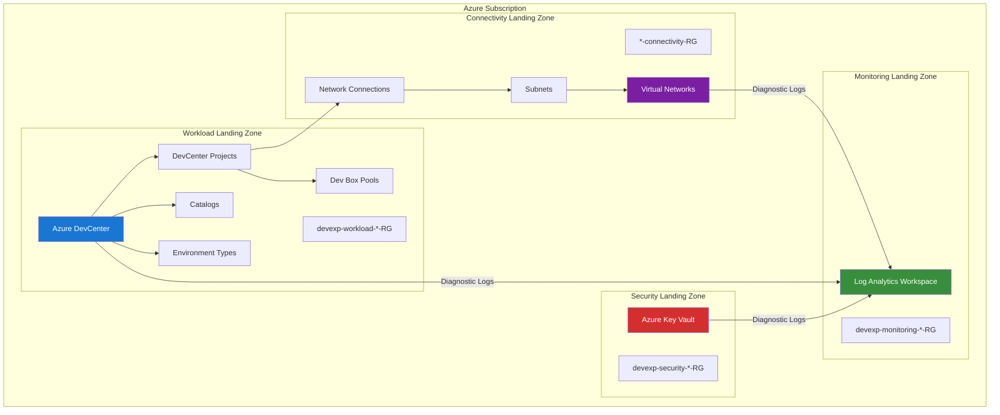
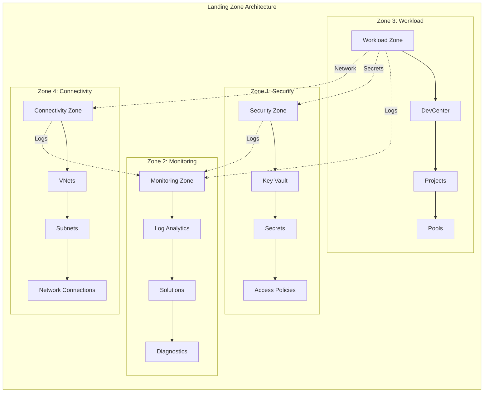
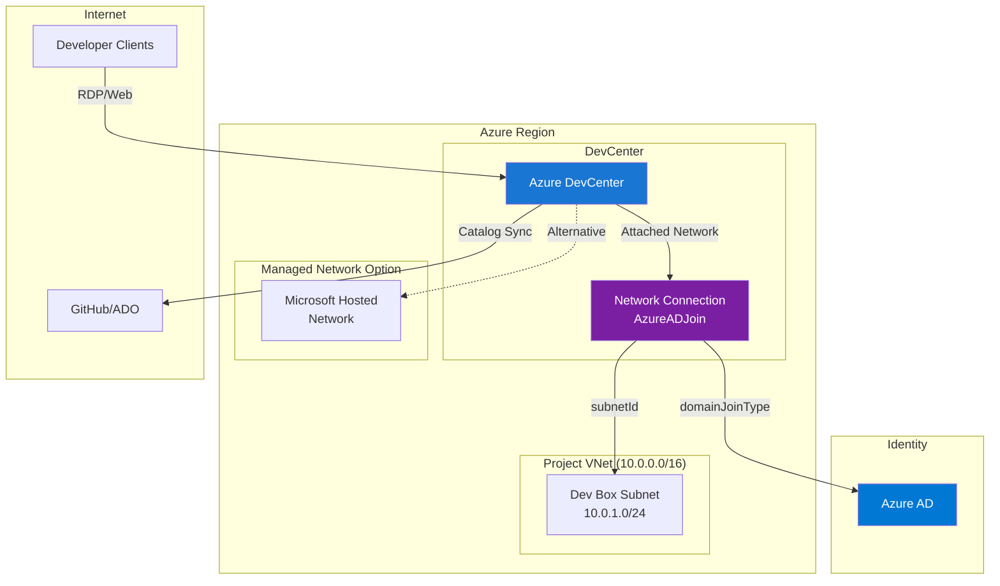
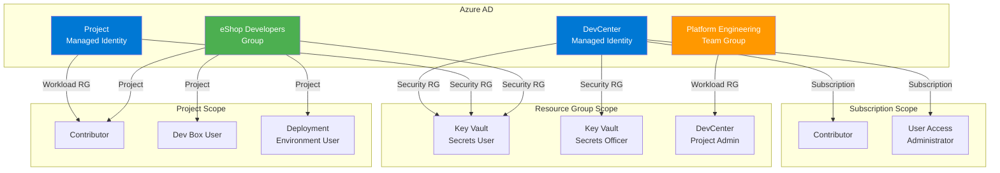
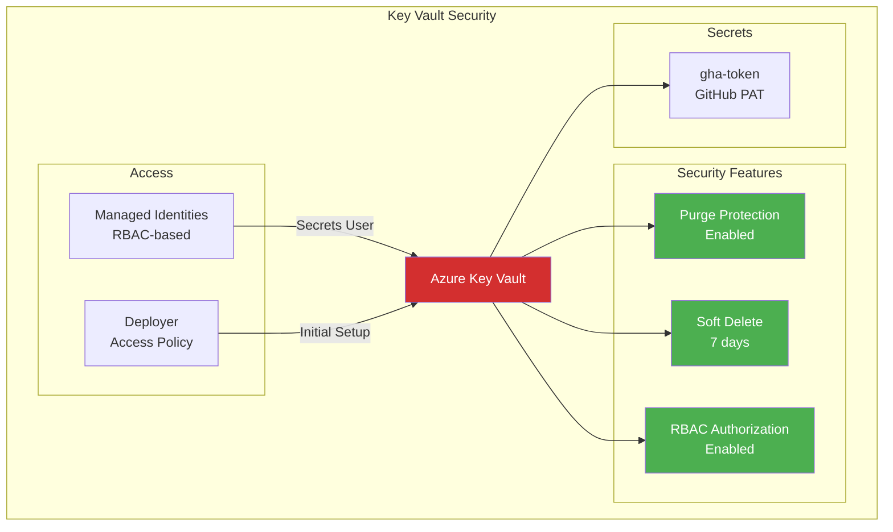
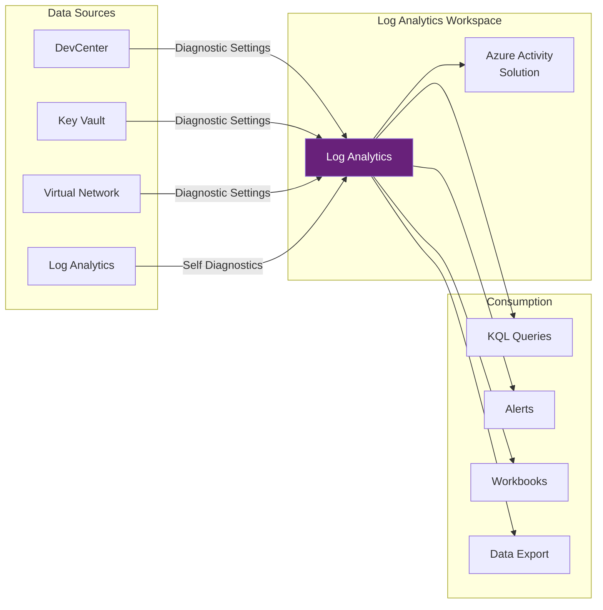
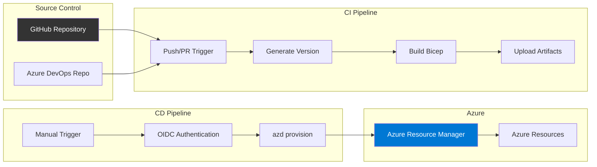
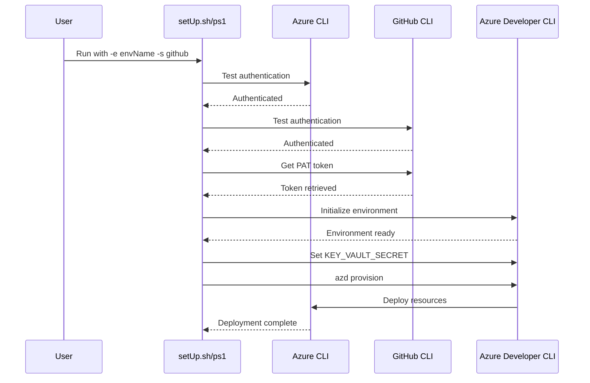
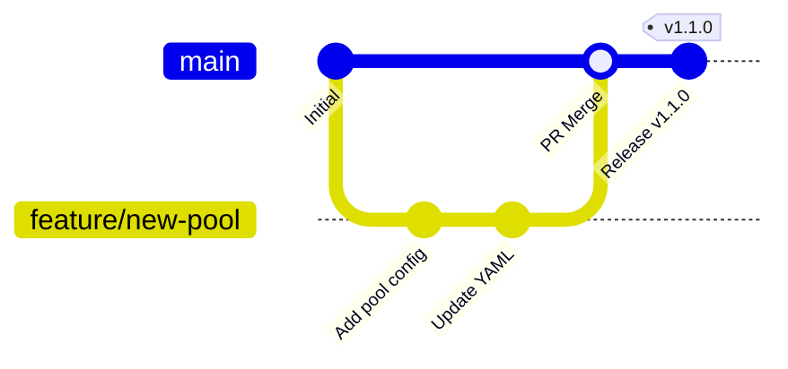

# ⚙️ Technology Architecture

> **TOGAF Layer**: Technology Architecture  
> **Version**: 1.0.0  
> **Last Updated**: January 22, 2026  
> **Author**: DevExp Team

---

## 📑 Table of Contents

- [🏗️ Infrastructure Overview](#️-infrastructure-overview)
- [🏛️ Landing Zone Design](#️-landing-zone-design)
- [🌐 Network Architecture](#-network-architecture)
- [🔑 Identity & Access](#-identity--access)
- [🔒 Security Architecture](#-security-architecture)
- [📊 Monitoring & Observability](#-monitoring--observability)
- [🔄 CI/CD Infrastructure](#-cicd-infrastructure)
- [🛠️ Deployment Tools](#️-deployment-tools)
- [📋 DevOps Practices](#-devops-practices)
- [📚 References](#-references)
- [📖 Glossary](#-glossary)

---

## 🏗️ Infrastructure Overview

The DevExp-DevBox Landing Zone Accelerator deploys a comprehensive Azure infrastructure to support Microsoft Dev Box environments at enterprise scale. The solution leverages Platform-as-a-Service (PaaS) offerings for reduced operational overhead and built-in security.

### Azure Resource Topology



### Azure Services Deployed

| Service | Resource Type | Landing Zone | Purpose |
|:--------|:--------------|:------------:|:--------|
| **Azure DevCenter** | Microsoft.DevCenter/devcenters | Workload | Central management for Dev Box environments |
| **DevCenter Projects** | Microsoft.DevCenter/projects | Workload | Team-level Dev Box organization |
| **Dev Box Pools** | Microsoft.DevCenter/projects/pools | Workload | VM configuration templates |
| **Catalogs** | Microsoft.DevCenter/devcenters/catalogs | Workload | Image/environment definitions |
| **Environment Types** | Microsoft.DevCenter/devcenters/environmentTypes | Workload | Deployment environment stages |
| **Azure Key Vault** | Microsoft.KeyVault/vaults | Security | Secrets and credential management |
| **Log Analytics** | Microsoft.OperationalInsights/workspaces | Monitoring | Centralized logging and analytics |
| **Virtual Networks** | Microsoft.Network/virtualNetworks | Connectivity | Network infrastructure |
| **Network Connections** | Microsoft.DevCenter/networkConnections | Connectivity | Dev Box network attachment |
| **Role Assignments** | Microsoft.Authorization/roleAssignments | Cross-cutting | RBAC permissions |

### Resource Naming Convention

```
{landingZone}-{environmentName}-{location}-{resourceType}
```

| Component | Example | Description |
|-----------|---------|-------------|
| Landing Zone | `devexp-security` | Functional area identifier |
| Environment | `prod` | Deployment environment |
| Location | `eastus2` | Azure region |
| Resource Type | `RG` | Resource type suffix |

**Example**: `devexp-security-prod-eastus2-RG`

### API Versions

| Resource | API Version | Notes |
|:---------|:-----------:|:------|
| Resource Groups | 2025-04-01 | Latest stable |
| DevCenter | 2025-10-01-preview | Preview for latest features |
| Key Vault | 2025-05-01 | Latest stable |
| Log Analytics | 2025-07-01 | Latest stable |
| Virtual Networks | 2025-01-01 | Latest stable |
| Network Connections | 2025-10-01-preview | Aligned with DevCenter |
| Role Assignments | 2022-04-01 | Stable RBAC API |
| Diagnostic Settings | 2021-05-01-preview | Stable diagnostics API |

[↑ Back to Top](#️-technology-architecture)

---

## 🏛️ Landing Zone Design

### Four-Zone Architecture



### Resource Group Isolation

| Landing Zone | Resource Group Pattern | Isolation Benefit |
|--------------|----------------------|-------------------|
| **Security** | devexp-security-{env}-{loc}-RG | Secrets isolated from workloads |
| **Monitoring** | devexp-monitoring-{env}-{loc}-RG | Centralized but segregated logging |
| **Workload** | devexp-workload-{env}-{loc}-RG | Application resources separated |
| **Connectivity** | {project}-connectivity-RG | Per-project network isolation |

### Tagging Strategy

All resources are tagged for governance and cost management:

```yaml
tags:
  environment: dev|test|staging|prod
  division: Platforms
  team: DevExP
  project: Contoso-DevExp-DevBox
  costCenter: IT
  owner: Contoso
  landingZone: Security|Monitoring|Workload|Connectivity
  resources: ResourceType
```

[↑ Back to Top](#️-technology-architecture)

---

## 🌐 Network Architecture

### Network Architecture Diagram



### Network Configuration Options

| Option | Type | Use Case | Configuration |
|:-------|:----:|:---------|:--------------|
| **Microsoft Hosted** | Managed | Simple deployments, no custom networking | `virtualNetworkType: Managed` |
| **Customer Managed** | Unmanaged | Hybrid connectivity, custom DNS, firewall | `virtualNetworkType: Unmanaged` |

### VNet Configuration

```yaml
network:
  name: eShop
  create: true
  resourceGroupName: "eShop-connectivity-RG"
  virtualNetworkType: Managed  # or Unmanaged
  addressPrefixes:
    - 10.0.0.0/16
  subnets:
    - name: eShop-subnet
      properties:
        addressPrefix: 10.0.1.0/24
```

### Network Connection Properties

| Property | Value | Description |
|----------|-------|-------------|
| `domainJoinType` | AzureADJoin | Azure AD-only join (no hybrid) |
| `subnetId` | Resource ID | Target subnet for Dev Boxes |
| `networkingResourceGroupName` | Auto | Microsoft-managed NIC resources |

### Network Security Considerations

- **NSGs**: Not explicitly deployed; rely on Azure DevCenter defaults
- **Private Endpoints**: Can be added for enhanced security
- **DNS**: Azure-provided or custom (for hybrid scenarios)
- **Firewall**: Optional Azure Firewall integration for egress control

[↑ Back to Top](#️-technology-architecture)

---

## 🔑 Identity & Access

### Identity & RBAC Model



### Managed Identities

| Identity | Type | Purpose | Scope |
|----------|------|---------|-------|
| **DevCenter Identity** | SystemAssigned | DevCenter operations, catalog sync | Subscription + Security RG |
| **Project Identity** | SystemAssigned | Project-level operations | Project + Security RG |

### Role Assignments Summary

#### DevCenter Identity Roles

| Role | Role ID | Scope | Purpose |
|------|---------|-------|---------|
| Contributor | b24988ac-6180-42a0-ab88-20f7382dd24c | Subscription | Manage Azure resources |
| User Access Administrator | 18d7d88d-d35e-4fb5-a5c3-7773c20a72d9 | Subscription | Assign RBAC roles |
| Key Vault Secrets User | 4633458b-17de-408a-b874-0445c86b69e6 | Security RG | Read secrets for catalogs |
| Key Vault Secrets Officer | b86a8fe4-44ce-4948-aee5-eccb2c155cd7 | Security RG | Manage secrets |

#### Organization Group Roles

| Group | Role | Scope | Purpose |
|-------|------|-------|---------|
| Platform Engineering Team | DevCenter Project Admin | Workload RG | Manage DevCenter settings |

#### Project User Roles

| Group | Role | Scope | Purpose |
|-------|------|-------|---------|
| {Project} Developers | Contributor | Project | Manage project resources |
| {Project} Developers | Dev Box User | Project | Use Dev Boxes |
| {Project} Developers | Deployment Environment User | Project | Deploy environments |
| {Project} Developers | Key Vault Secrets User | Security RG | Access secrets |

[↑ Back to Top](#️-technology-architecture)

---

## 🔒 Security Architecture

### Key Vault Configuration



### Security Configuration

| Setting | Value | Security Impact |
|---------|-------|-----------------|
| `enablePurgeProtection` | true | Prevents permanent secret deletion |
| `enableSoftDelete` | true | Enables secret recovery |
| `softDeleteRetentionInDays` | 7 | Recovery window |
| `enableRbacAuthorization` | true | RBAC instead of access policies |
| SKU | Standard | Cost-effective for most scenarios |

### Network Security

- **Service Tags**: Azure DevCenter uses service tags for outbound rules
- **Private Link**: Optional for Key Vault and storage
- **Azure AD Join**: No on-premises domain dependency

[↑ Back to Top](#️-technology-architecture)

---

## 📊 Monitoring & Observability

### Log Analytics Integration



### Diagnostic Settings Configuration

All resources are configured with diagnostic settings:

```bicep
resource diagnosticSettings 'Microsoft.Insights/diagnosticSettings@...' = {
  name: '${resourceName}-diagnostics'
  scope: targetResource
  properties: {
    logAnalyticsDestinationType: 'AzureDiagnostics'
    logs: [
      {
        categoryGroup: 'allLogs'
        enabled: true
      }
    ]
    metrics: [
      {
        category: 'AllMetrics'
        enabled: true
      }
    ]
    workspaceId: logAnalyticsWorkspaceId
  }
}
```

### Log Categories

| Resource | Log Category | Contents |
|----------|--------------|----------|
| Key Vault | AuditEvent | Secret access, management operations |
| DevCenter | DataPlaneRequests | API operations |
| DevCenter | DevBoxProvisioning | Dev Box lifecycle |
| Virtual Network | VMProtectionAlerts | Network protection alerts |

### Monitoring Queries

**Key Vault Access Audit**:

```kusto
AzureDiagnostics
| where ResourceProvider == "MICROSOFT.KEYVAULT"
| where OperationName == "SecretGet"
| project TimeGenerated, CallerIPAddress, identity_claim_upn_s, ResultType
```

**DevCenter Operations**:

```kusto
AzureDiagnostics
| where ResourceProvider == "MICROSOFT.DEVCENTER"
| summarize count() by OperationName, ResultType
```

[↑ Back to Top](#️-technology-architecture)

---

## 🔄 CI/CD Infrastructure

### CI/CD Pipeline Flow



### GitHub Actions Workflows

#### CI Workflow (`ci.yml`)

| Job | Steps | Trigger |
|-----|-------|---------|
| `generate-tag-version` | Checkout, Generate Release | Push to feature/*, PR to main |
| `build` | Checkout, Build Bicep, Upload Artifacts | After version generation |

#### Deploy Workflow (`deploy.yml`)

| Job | Steps | Trigger |
|-----|-------|---------|
| `build-and-deploy-to-azure` | Checkout, Install azd, Build, Login (OIDC), Provision | Manual (workflow_dispatch) |

### Azure DevOps Pipeline (`azure-dev.yml`)

| Task | Description |
|------|-------------|
| Install azd | Installs Azure Developer CLI |
| Configure AZD Auth | Sets `auth.useAzCliAuth` |
| Provision Infrastructure | Runs `azd provision` |

### Authentication Methods

| Platform | Method | Details |
|----------|--------|---------|
| **GitHub Actions** | OIDC Federation | Secretless, federated credentials |
| **Azure DevOps** | Service Connection | Azure CLI service principal |

### CI/CD Environment Variables

| Variable | Source | Purpose |
|----------|--------|---------|
| `AZURE_CLIENT_ID` | GitHub/ADO Variable | Service principal client ID |
| `AZURE_TENANT_ID` | GitHub/ADO Variable | Azure AD tenant ID |
| `AZURE_SUBSCRIPTION_ID` | GitHub/ADO Variable | Target subscription |
| `AZURE_ENV_NAME` | Workflow Input | Environment name |
| `AZURE_LOCATION` | Workflow Input | Azure region |
| `KEY_VAULT_SECRET` | GitHub Secret | PAT token value |
| `SOURCE_CONTROL_PLATFORM` | Environment | `github` or `adogit` |

[↑ Back to Top](#️-technology-architecture)

---

## 🛠️ Deployment Tools

### Azure Developer CLI (azd)

> 🛠️ **Prerequisite**: Ensure Azure Developer CLI (`azd`) is installed. See [installation guide](https://learn.microsoft.com/en-us/azure/developer/azure-developer-cli/install-azd).

The primary deployment tool is Azure Developer CLI (`azd`), configured via `azure.yaml`:

```yaml
name: ContosoDevExp

hooks:
  preprovision:
    shell: sh
    continueOnError: false
    interactive: true
    run: |
      ./setup.sh -e ${AZURE_ENV_NAME} -s ${SOURCE_CONTROL_PLATFORM}
```

### azd Commands

| Command | Purpose |
|---------|---------|
| `azd init` | Initialize azd environment |
| `azd auth login` | Authenticate to Azure |
| `azd provision` | Deploy infrastructure |
| `azd env new` | Create new environment |
| `azd env set` | Set environment variables |

### Setup Scripts

#### setUp.sh (Bash)

| Function | Purpose |
|----------|---------|
| `test_azure_authentication` | Verify Azure CLI login |
| `test_github_authentication` | Verify GitHub CLI login |
| `get_secure_github_token` | Retrieve GitHub PAT |
| `initialize_azd_environment` | Configure azd environment |
| `start_azure_provisioning` | Run azd provision |

#### setUp.ps1 (PowerShell)

Equivalent functionality for Windows environments.

### Script Flow



[↑ Back to Top](#️-technology-architecture)

---

## 📋 DevOps Practices

### Release Strategy



### Branching Model

| Branch Pattern | Purpose | Protection |
|----------------|---------|------------|
| `main` | Production-ready code | Required reviews, CI pass |
| `feature/*` | New features | CI validation |
| `fix/*` | Bug fixes | CI validation |
| `docs/*` | Documentation updates | Optional CI |

### Semantic Versioning

The CI pipeline generates semantic versions based on commit messages:

| Commit Prefix | Version Bump | Example |
|---------------|--------------|---------|
| `feat:` | Minor | 1.0.0 → 1.1.0 |
| `fix:` | Patch | 1.0.0 → 1.0.1 |
| `BREAKING CHANGE:` | Major | 1.0.0 → 2.0.0 |

### Artifact Management

| Artifact | Retention | Contents |
|----------|-----------|----------|
| Bicep ARM Templates | 7 days | Compiled JSON templates |
| Release Assets | Permanent | Tagged releases |

### Quality Gates

| Gate | Trigger | Criteria |
|------|---------|----------|
| Bicep Build | PR/Push | Successful compilation |
| Artifact Upload | Build Success | Non-empty artifacts |
| Deploy Approval | Manual | Environment owner approval |

[↑ Back to Top](#️-technology-architecture)

---

## 📚 References

### Internal Documents

- [Business Architecture](01-business-architecture.md) - Business context and stakeholders
- [Data Architecture](02-data-architecture.md) - Configuration schemas and data flows
- [Application Architecture](03-application-architecture.md) - Module design and Bicep structure
- [Security Architecture](05-security-architecture.md) - Security controls and compliance

### External References

- [Microsoft Dev Box Documentation](https://learn.microsoft.com/en-us/azure/dev-box/)
- [Azure DevCenter API Reference](https://learn.microsoft.com/en-us/rest/api/devcenter/)
- [Azure Developer CLI Documentation](https://learn.microsoft.com/en-us/azure/developer/azure-developer-cli/)
- [Azure Landing Zones](https://learn.microsoft.com/en-us/azure/cloud-adoption-framework/ready/landing-zone/)
- [GitHub Actions for Azure](https://learn.microsoft.com/en-us/azure/developer/github/github-actions)
- [Azure DevOps Pipelines](https://learn.microsoft.com/en-us/azure/devops/pipelines/)

[↑ Back to Top](#️-technology-architecture)

---

## 📖 Glossary

| Term | Definition |
|------|------------|
| **Landing Zone** | Pre-configured Azure environment segment for specific workloads |
| **DevCenter** | Azure service for managing developer environments at scale |
| **Dev Box** | Cloud-based developer workstation |
| **Network Connection** | Link between DevCenter and VNet subnet |
| **OIDC Federation** | OpenID Connect-based authentication without stored secrets |
| **azd** | Azure Developer CLI - streamlined Azure development tool |
| **ARM** | Azure Resource Manager - Azure's deployment engine |
| **Diagnostic Settings** | Azure configuration for log/metric routing |

[↑ Back to Top](#️-technology-architecture)

---

*Document generated as part of TOGAF Architecture Documentation for DevExp-DevBox Landing Zone Accelerator*
