# 🏗️ Technology Architecture

> **DevExp-DevBox Landing Zone Accelerator**

> [!NOTE]
>
> **Target Audience:** Cloud Architects, DevOps Engineers, IT Operations
>
> **Reading Time:** ~25 minutes

<details>
<summary><strong>📍 Navigation</strong></summary>

| Previous                                                       |                Index                 | Next |
| :------------------------------------------------------------- | :----------------------------------: | ---: |
| [← Application Architecture](./03-application-architecture.md) | [🏠 Architecture Index](./README.md) |    - |

</details>

| Metadata         | Value                     |
| ---------------- | ------------------------- |
| **Version**      | 1.0.0                     |
| **Last Updated** | January 22, 2026          |
| **Author**       | Platform Engineering Team |
| **Status**       | Active                    |

---

## 📑 Table of Contents

- [🏗️ Infrastructure Overview](#%EF%B8%8F-infrastructure-overview)
- [🏛️ Landing Zone Design](#%EF%B8%8F-landing-zone-design)
- [🌐 Network Architecture](#-network-architecture)
- [👤 Identity & Access](#-identity--access)
- [🔒 Security Architecture](#-security-architecture)
- [📊 Monitoring & Observability](#-monitoring--observability)
- [⚙️ CI/CD Infrastructure](#%EF%B8%8F-cicd-infrastructure)
- [🛠️ Deployment Tools](#%EF%B8%8F-deployment-tools)
- [💻 DevOps Practices](#-devops-practices)
- [📚 References](#-references)
- [📖 Glossary](#-glossary)

---

## 🏗️ Infrastructure Overview

The DevExp-DevBox Landing Zone Accelerator deploys a comprehensive set of Azure
services organized into functional landing zones.

### Azure Services Deployed

```mermaid
---
title: Azure Services Overview
---
flowchart TB
    %% ===== STYLE DEFINITIONS =====
    classDef primary fill:#4F46E5,stroke:#3730A3,color:#FFFFFF
    classDef secondary fill:#10B981,stroke:#059669,color:#FFFFFF
    classDef datastore fill:#F59E0B,stroke:#D97706,color:#000000
    classDef external fill:#6B7280,stroke:#4B5563,color:#FFFFFF,stroke-dasharray:5 5

    %% ===== AZURE CLOUD =====
    subgraph Azure["Azure Cloud"]
        %% ===== MANAGEMENT PLANE =====
        subgraph Management["Management Plane"]
            ARM["Azure Resource Manager"]
            AAD["Microsoft Entra ID"]
            RBAC["Azure RBAC"]
        end

        %% ===== COMPUTE SERVICES =====
        subgraph Compute["Compute Services"]
            DC["Microsoft DevCenter"]
            DEVBOX["Dev Box VMs"]
        end

        %% ===== SECURITY SERVICES =====
        subgraph Security["Security Services"]
            KV["Azure Key Vault"]
        end

        %% ===== NETWORKING SERVICES =====
        subgraph Networking["Networking Services"]
            VNET["Virtual Network"]
            SUBNET["Subnets"]
            NSG["Network Security Groups"]
        end

        %% ===== MONITORING SERVICES =====
        subgraph Monitoring["Monitoring Services"]
            LA["Log Analytics Workspace"]
            DIAG["Diagnostic Settings"]
            SOL["Solutions"]
        end

        %% ===== STORAGE SERVICES =====
        subgraph Storage["Storage Services"]
            BLOB["Blob Storage<br/>Dev Box Images"]
        end
    end

    %% ===== CONNECTIONS =====
    ARM -->|"deploys"| DC
    ARM -->|"deploys"| KV
    ARM -->|"deploys"| VNET
    ARM -->|"deploys"| LA

    AAD -->|"authenticates"| RBAC
    RBAC -->|"authorizes"| DC
    RBAC -->|"authorizes"| KV

    DC -->|"provisions"| DEVBOX
    DEVBOX -->|"connects to"| VNET
    VNET -->|"contains"| SUBNET
    SUBNET -->|"secured by"| NSG

    DC -->|"sends logs"| DIAG
    KV -->|"sends logs"| DIAG
    VNET -->|"sends logs"| DIAG
    DIAG -->|"routes to"| LA
    LA -->|"analyzes"| SOL

    %% ===== APPLY STYLES =====
    class ARM,AAD,RBAC external
    class DC,DEVBOX primary
    class KV primary
    class VNET,SUBNET,NSG secondary
    class LA,DIAG,SOL datastore
    class BLOB datastore

    %% ===== SUBGRAPH STYLING =====
    style Azure fill:#F3F4F6,stroke:#6B7280,stroke-width:2px
    style Management fill:#F3F4F6,stroke:#6B7280,stroke-width:2px
    style Compute fill:#EEF2FF,stroke:#4F46E5,stroke-width:2px
    style Security fill:#FEE2E2,stroke:#F44336,stroke-width:2px
    style Networking fill:#ECFDF5,stroke:#10B981,stroke-width:2px
    style Monitoring fill:#FEF3C7,stroke:#F59E0B,stroke-width:2px
    style Storage fill:#FEF3C7,stroke:#F59E0B,stroke-width:2px
```

### Service Catalog

| Service                 | Azure Resource Type                        | Purpose                        | API Version        |
| ----------------------- | ------------------------------------------ | ------------------------------ | ------------------ |
| **DevCenter**           | `Microsoft.DevCenter/devcenters`           | Central management for Dev Box | 2025-10-01-preview |
| **Projects**            | `Microsoft.DevCenter/projects`             | Team/workstream isolation      | 2025-10-01-preview |
| **Pools**               | `Microsoft.DevCenter/projects/pools`       | Dev Box VM configurations      | 2025-10-01-preview |
| **Catalogs**            | `Microsoft.DevCenter/devcenters/catalogs`  | Image/environment definitions  | 2025-10-01-preview |
| **Key Vault**           | `Microsoft.KeyVault/vaults`                | Secrets management             | 2025-05-01         |
| **Secrets**             | `Microsoft.KeyVault/vaults/secrets`        | Store PAT tokens               | 2025-05-01         |
| **Log Analytics**       | `Microsoft.OperationalInsights/workspaces` | Centralized logging            | 2025-07-01         |
| **Solutions**           | `Microsoft.OperationsManagement/solutions` | Log analysis capabilities      | 2015-11-01-preview |
| **Virtual Network**     | `Microsoft.Network/virtualNetworks`        | Network connectivity           | 2025-01-01         |
| **Resource Groups**     | `Microsoft.Resources/resourceGroups`       | Resource organization          | 2025-04-01         |
| **Role Assignments**    | `Microsoft.Authorization/roleAssignments`  | RBAC permissions               | 2022-04-01         |
| **Diagnostic Settings** | `Microsoft.Insights/diagnosticSettings`    | Telemetry routing              | 2021-05-01-preview |

### Supported Azure Regions

The accelerator supports deployment to the following regions:

| Region               | Location Code        | Availability |
| -------------------- | -------------------- | ------------ |
| East US              | `eastus`             | ✅ Supported |
| East US 2            | `eastus2`            | ✅ Supported |
| West US              | `westus`             | ✅ Supported |
| West US 2            | `westus2`            | ✅ Supported |
| West US 3            | `westus3`            | ✅ Supported |
| Central US           | `centralus`          | ✅ Supported |
| North Europe         | `northeurope`        | ✅ Supported |
| West Europe          | `westeurope`         | ✅ Supported |
| Southeast Asia       | `southeastasia`      | ✅ Supported |
| Australia East       | `australiaeast`      | ✅ Supported |
| Japan East           | `japaneast`          | ✅ Supported |
| UK South             | `uksouth`            | ✅ Supported |
| Canada Central       | `canadacentral`      | ✅ Supported |
| Sweden Central       | `swedencentral`      | ✅ Supported |
| Switzerland North    | `switzerlandnorth`   | ✅ Supported |
| Germany West Central | `germanywestcentral` | ✅ Supported |

---

## 🏛️ Landing Zone Design

### Four-Zone Architecture

```mermaid
---
title: Four-Zone Landing Zone Architecture
---
flowchart TB
    %% ===== STYLE DEFINITIONS =====
    classDef primary fill:#4F46E5,stroke:#3730A3,color:#FFFFFF
    classDef secondary fill:#10B981,stroke:#059669,color:#FFFFFF
    classDef datastore fill:#F59E0B,stroke:#D97706,color:#000000

    %% ===== SUBSCRIPTION =====
    subgraph Subscription["Azure Subscription"]
        %% ===== SECURITY ZONE =====
        subgraph SecurityZone["🔐 Security Landing Zone"]
            SEC_RG["devexp-security-{env}-{region}-RG"]
            KV["Key Vault<br/>contoso-{unique}-kv"]
            SECRET["Secret: gha-token"]
        end

        %% ===== MONITORING ZONE =====
        subgraph MonitoringZone["📊 Monitoring Landing Zone"]
            MON_RG["devexp-monitoring-{env}-{region}-RG"]
            LA["Log Analytics<br/>logAnalytics-{unique}"]
            SOL["Azure Activity Solution"]
        end

        %% ===== CONNECTIVITY ZONE =====
        subgraph ConnectivityZone["🌐 Connectivity Landing Zone"]
            CON_RG["eShop-connectivity-RG"]
            VNET["Virtual Network<br/>eShop"]
            SUBNET["Subnet<br/>eShop-subnet"]
            NC["Network Connection<br/>netconn-eShop"]
        end

        %% ===== WORKLOAD ZONE =====
        subgraph WorkloadZone["💻 Workload Landing Zone"]
            WRK_RG["devexp-workload-{env}-{region}-RG"]
            DC["DevCenter<br/>devexp-devcenter"]
            PROJ["Project: eShop"]
            POOL1["Pool: backend-engineer"]
            POOL2["Pool: frontend-engineer"]
        end
    end

    %% ===== CONNECTIONS =====
    SEC_RG -->|"hosts"| KV
    KV -->|"stores"| SECRET

    MON_RG -->|"hosts"| LA
    LA -->|"installs"| SOL

    CON_RG -->|"hosts"| VNET
    VNET -->|"contains"| SUBNET
    SUBNET -->|"attaches to"| NC

    WRK_RG -->|"hosts"| DC
    DC -->|"manages"| PROJ
    PROJ -->|"contains"| POOL1
    PROJ -->|"contains"| POOL2

    NC -.->|"attaches to"| DC
    SECRET -.->|"authenticates"| DC
    LA -.->|"diagnostics"| KV
    LA -.->|"diagnostics"| DC
    LA -.->|"diagnostics"| VNET

    %% ===== APPLY STYLES =====
    class SEC_RG,MON_RG,CON_RG,WRK_RG primary
    class KV,LA secondary
    class SECRET,SOL,VNET,SUBNET,NC,DC,PROJ,POOL1,POOL2 datastore

    %% ===== SUBGRAPH STYLING =====
    style Subscription fill:#F3F4F6,stroke:#6B7280,stroke-width:2px
    style SecurityZone fill:#FEE2E2,stroke:#F44336,stroke-width:2px
    style MonitoringZone fill:#ECFDF5,stroke:#10B981,stroke-width:2px
    style ConnectivityZone fill:#E0E7FF,stroke:#4F46E5,stroke-width:2px
    style WorkloadZone fill:#FEF3C7,stroke:#F59E0B,stroke-width:2px
```

### Resource Group Naming Convention

| Landing Zone | Pattern                     | Example                             |
| ------------ | --------------------------- | ----------------------------------- |
| Security     | `{name}-{env}-{region}-RG`  | `devexp-security-demo-eastus2-RG`   |
| Monitoring   | `{name}-{env}-{region}-RG`  | `devexp-monitoring-demo-eastus2-RG` |
| Workload     | `{name}-{env}-{region}-RG`  | `devexp-workload-demo-eastus2-RG`   |
| Connectivity | `{project}-connectivity-RG` | `eShop-connectivity-RG`             |

### Resource Naming Patterns

| Resource Type      | Pattern               | Example                   |
| ------------------ | --------------------- | ------------------------- |
| Key Vault          | `{name}-{unique}-kv`  | `contoso-abc123xyz-kv`    |
| Log Analytics      | `{name}-{unique}`     | `logAnalytics-abc123xyz`  |
| DevCenter          | `{name}`              | `devexp-devcenter`        |
| Project            | `{name}`              | `eShop`                   |
| Pool               | `{name}-{index}-pool` | `backend-engineer-0-pool` |
| VNet               | `{project}`           | `eShop`                   |
| Network Connection | `netconn-{vnet}`      | `netconn-eShop`           |

### Tagging Strategy

All resources are tagged with consistent metadata:

| Tag           | Purpose             | Example Values                     |
| ------------- | ------------------- | ---------------------------------- |
| `environment` | Deployment stage    | dev, test, staging, prod           |
| `division`    | Business unit       | Platforms                          |
| `team`        | Owning team         | DevExP                             |
| `project`     | Project name        | Contoso-DevExp-DevBox              |
| `costCenter`  | Cost allocation     | IT                                 |
| `owner`       | Resource owner      | Contoso                            |
| `landingZone` | Zone classification | Security, Monitoring, Workload     |
| `resources`   | Resource type       | ResourceGroup, DevCenter, KeyVault |

---

## 🌐 Network Architecture

### Network Topology

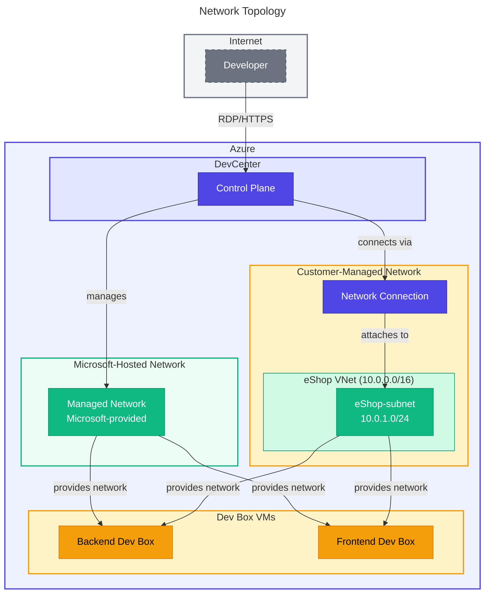

### Network Options

| Network Type  | Description                                         | Use Case                                        |
| ------------- | --------------------------------------------------- | ----------------------------------------------- |
| **Managed**   | Microsoft-hosted network, no customer VNet required | Simplified setup, no hybrid connectivity needed |
| **Unmanaged** | Customer-provided VNet with Network Connection      | Hybrid connectivity, corporate network access   |

### Network Configuration (Unmanaged)

From `devcenter.yaml`:

```yaml
network:
  name: eShop
  create: true
  resourceGroupName: 'eShop-connectivity-RG'
  virtualNetworkType: Unmanaged
  addressPrefixes:
    - 10.0.0.0/16
  subnets:
    - name: eShop-subnet
      properties:
        addressPrefix: 10.0.1.0/24
```

### Network Connection Flow

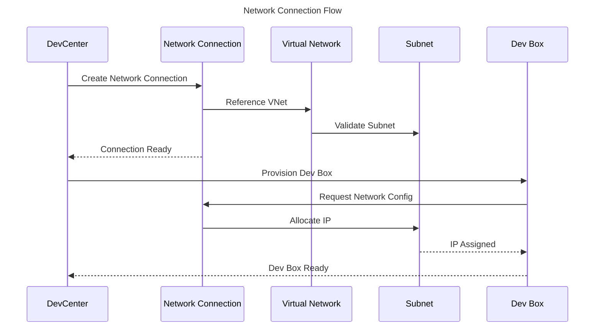

### Network Security

| Control                     | Implementation                 | Purpose                          |
| --------------------------- | ------------------------------ | -------------------------------- |
| **Subnet Delegation**       | DevCenter network connection   | Controlled Dev Box placement     |
| **NSG Rules**               | Applied to subnets             | Traffic filtering                |
| **Private Endpoints**       | Optional for Key Vault         | Secure secret access             |
| **Managed Network Regions** | `managedVirtualNetworkRegions` | Region-specific managed networks |

---

## 👤 Identity & Access

### Identity Model

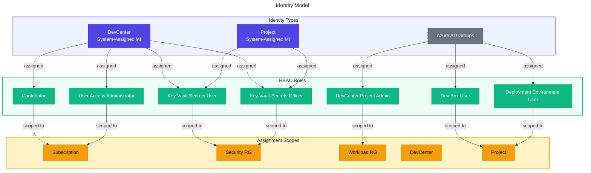

### Role Assignment Matrix

| Identity                      | Role                        | Scope        | Purpose                    |
| ----------------------------- | --------------------------- | ------------ | -------------------------- |
| **DevCenter MI**              | Contributor                 | Subscription | Manage DevCenter resources |
| **DevCenter MI**              | User Access Administrator   | Subscription | Assign roles to projects   |
| **DevCenter MI**              | Key Vault Secrets User      | Security RG  | Read secrets for catalogs  |
| **DevCenter MI**              | Key Vault Secrets Officer   | Security RG  | Manage secrets             |
| **Project MI**                | Key Vault Secrets User      | Security RG  | Read secrets for catalogs  |
| **Project MI**                | Key Vault Secrets Officer   | Security RG  | Manage secrets             |
| **Platform Engineering Team** | DevCenter Project Admin     | Workload RG  | Manage projects            |
| **eShop Developers**          | Contributor                 | Project      | Manage project resources   |
| **eShop Developers**          | Dev Box User                | Project      | Create/manage Dev Boxes    |
| **eShop Developers**          | Deployment Environment User | Project      | Deploy environments        |

### Azure AD Group Configuration

From `devcenter.yaml`:

```yaml
identity:
  roleAssignments:
    orgRoleTypes:
      - type: DevManager
        azureADGroupId: '5a1d1455-e771-4c19-aa03-fb4a08418f22'
        azureADGroupName: 'Platform Engineering Team'
        azureRBACRoles:
          - name: 'DevCenter Project Admin'
            id: '331c37c6-af14-46d9-b9f4-e1909e1b95a0'
            scope: ResourceGroup

projects:
  - name: 'eShop'
    identity:
      roleAssignments:
        - azureADGroupId: '9d42a792-2d74-441d-8bcb-71009371725f'
          azureADGroupName: 'eShop Developers'
          azureRBACRoles:
            - name: 'Dev Box User'
              id: '45d50f46-0b78-4001-a660-4198cbe8cd05'
              scope: Project
```

### Role Hierarchy

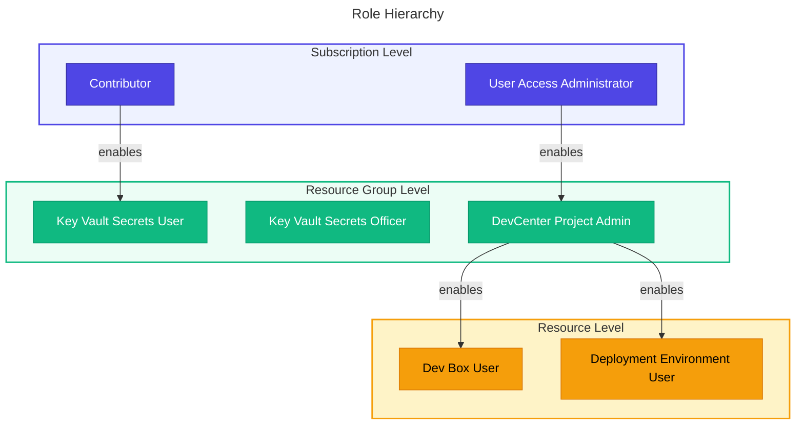

---

## 🔒 Security Architecture

### Key Vault Configuration

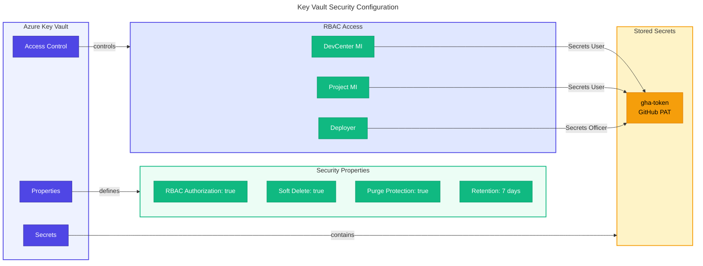

> [!WARNING]
>
> **Security Requirement:** All Key Vault secrets must use RBAC authorization.
> Access policies are not supported in this accelerator for compliance reasons.

### Security Controls

| Control                | Configuration               | Value            | Purpose                                   |
| ---------------------- | --------------------------- | ---------------- | ----------------------------------------- |
| **RBAC Authorization** | `enableRbacAuthorization`   | `true`           | Use Azure RBAC instead of access policies |
| **Soft Delete**        | `enableSoftDelete`          | `true`           | Recover accidentally deleted secrets      |
| **Purge Protection**   | `enablePurgeProtection`     | `true`           | Prevent permanent deletion                |
| **Retention Period**   | `softDeleteRetentionInDays` | `7`              | Recovery window                           |
| **Managed Identities** | `identity.type`             | `SystemAssigned` | No credential management                  |
| **Diagnostic Logging** | `diagnosticSettings`        | All logs         | Audit trail                               |

### Security Data Flow

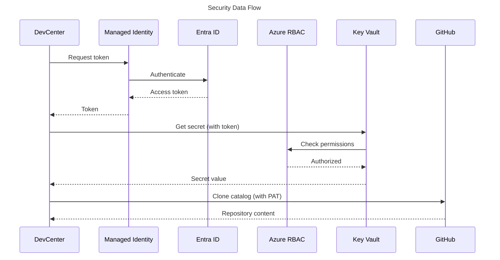

### Compliance Alignment

| Framework                    | Requirement                       | Implementation                       |
| ---------------------------- | --------------------------------- | ------------------------------------ |
| **Azure Security Benchmark** | ASB-DP-1: Data Discovery          | Resource tagging, Log Analytics      |
| **Azure Security Benchmark** | ASB-DP-4: Data at Rest Encryption | Key Vault software keys              |
| **Azure Security Benchmark** | ASB-IM-1: Managed Identities      | SystemAssigned on DevCenter/Projects |
| **Azure Security Benchmark** | ASB-PA-7: Least Privilege         | Scoped RBAC role assignments         |
| **Azure Security Benchmark** | ASB-LT-4: Logging                 | Diagnostic settings on all resources |

---

## 📊 Monitoring & Observability

### Monitoring Architecture

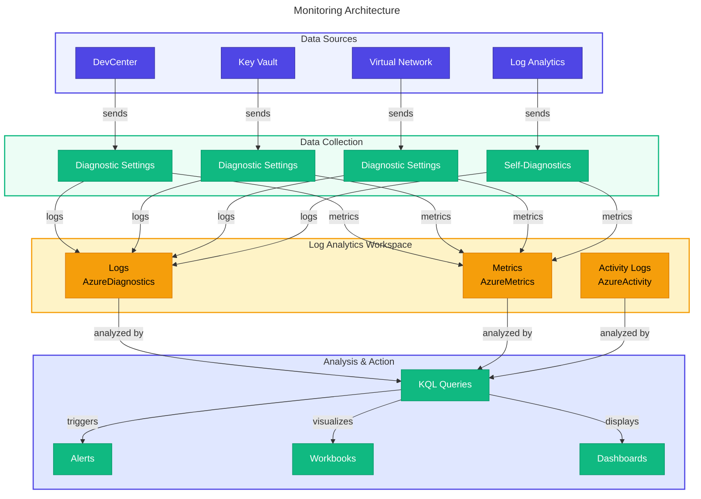

### Log Analytics Configuration

| Setting               | Value            | Purpose                |
| --------------------- | ---------------- | ---------------------- |
| **SKU**               | PerGB2018        | Pay-per-GB pricing     |
| **Solutions**         | AzureActivity    | Activity log analysis  |
| **Log Categories**    | allLogs          | Comprehensive logging  |
| **Metric Categories** | AllMetrics       | Performance monitoring |
| **Destination Type**  | AzureDiagnostics | Standard schema        |

### Diagnostic Settings

All resources deploy with standardized diagnostic settings:

```bicep
resource diagnosticSettings 'Microsoft.Insights/diagnosticSettings@2021-05-01-preview' = {
  name: '${resourceName}-diagnostics'
  scope: targetResource
  properties: {
    logAnalyticsDestinationType: 'AzureDiagnostics'
    logs: [
      {
        categoryGroup: 'allLogs'
        enabled: true
      }
    ]
    metrics: [
      {
        category: 'AllMetrics'
        enabled: true
      }
    ]
    workspaceId: logAnalyticsWorkspaceId
  }
}
```

### Key Metrics

| Resource          | Metric            | Description           | Alert Threshold   |
| ----------------- | ----------------- | --------------------- | ----------------- |
| **Key Vault**     | ServiceApiLatency | API response time     | > 1000ms          |
| **Key Vault**     | Availability      | Service availability  | < 99.9%           |
| **DevCenter**     | PoolUtilization   | Pool usage percentage | > 80%             |
| **VNet**          | BytesDroppedDDoS  | DDoS mitigation       | > 0               |
| **Log Analytics** | IngestionVolume   | Data ingestion rate   | Anomaly detection |

---

## ⚙️ CI/CD Infrastructure

### CI/CD Pipeline Flow

```mermaid
---
title: CI/CD Pipeline Flow
---
flowchart LR
    %% ===== STYLE DEFINITIONS =====
    classDef primary fill:#4F46E5,stroke:#3730A3,color:#FFFFFF
    classDef secondary fill:#10B981,stroke:#059669,color:#FFFFFF
    classDef datastore fill:#F59E0B,stroke:#D97706,color:#000000
    classDef trigger fill:#818CF8,stroke:#4F46E5,color:#FFFFFF

    %% ===== TRIGGERS =====
    subgraph Trigger["Triggers"]
        PUSH["Push to feature/*"]
        PR["Pull Request to main"]
        MANUAL["Manual Dispatch"]
    end

    %% ===== CI =====
    subgraph CI["Continuous Integration"]
        VERSION["Generate Version"]
        BUILD["Build Bicep"]
        ARTIFACT["Upload Artifacts"]
    end

    %% ===== CD =====
    subgraph CD["Continuous Deployment"]
        AUTH["Azure Auth<br/>Federated Credentials"]
        PROVISION["azd provision"]
        DEPLOY["Deploy to Azure"]
    end

    %% ===== RELEASE =====
    subgraph Release["Release"]
        TAG["Create Git Tag"]
        RELEASE["GitHub Release"]
        NOTES["Release Notes"]
    end

    %% ===== CONNECTIONS =====
    PUSH -->|"triggers"| VERSION
    PR -->|"triggers"| VERSION
    MANUAL -->|"triggers"| VERSION

    VERSION -->|"generates"| BUILD
    BUILD -->|"produces"| ARTIFACT

    ARTIFACT -->|"starts"| AUTH
    AUTH -->|"authenticates"| PROVISION
    PROVISION -->|"executes"| DEPLOY

    DEPLOY -->|"completes"| TAG
    TAG -->|"creates"| RELEASE
    RELEASE -->|"generates"| NOTES

    %% ===== APPLY STYLES =====
    class PUSH,PR,MANUAL trigger
    class VERSION,BUILD,ARTIFACT primary
    class AUTH,PROVISION,DEPLOY secondary
    class TAG,RELEASE,NOTES datastore

    %% ===== SUBGRAPH STYLING =====
    style Trigger fill:#EEF2FF,stroke:#4F46E5,stroke-width:2px
    style CI fill:#E0E7FF,stroke:#4F46E5,stroke-width:2px
    style CD fill:#ECFDF5,stroke:#10B981,stroke-width:2px
    style Release fill:#FEF3C7,stroke:#F59E0B,stroke-width:2px
```

### GitHub Actions Workflows

| Workflow                   | File                            | Trigger                        | Purpose                  |
| -------------------------- | ------------------------------- | ------------------------------ | ------------------------ |
| **Continuous Integration** | `.github/workflows/ci.yml`      | Push to feature/\*, PR to main | Build and validate Bicep |
| **Deploy to Azure**        | `.github/workflows/deploy.yml`  | Manual dispatch                | Deploy infrastructure    |
| **Branch-Based Release**   | `.github/workflows/release.yml` | Manual dispatch                | Create releases          |

### CI Workflow Details (`ci.yml`)

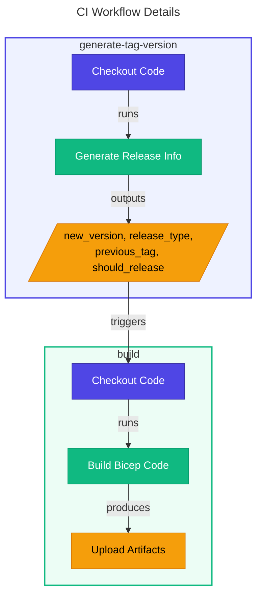

### Deploy Workflow Details (`deploy.yml`)

```yaml
# Key workflow steps
- name: Install azd
  uses: Azure/setup-azd@v2

- name: Build Accelerator Bicep
  run: |
    az bicep build --file ./infra/main.bicep --outdir ./artifacts

- name: Log in with Azure (Federated Credentials)
  run: |
    azd auth login \
      --client-id "$AZURE_CLIENT_ID" \
      --federated-credential-provider "github" \
      --tenant-id "$AZURE_TENANT_ID"

- name: Deploy to Azure
  run: azd provision --no-prompt
  env:
    KEY_VAULT_SECRET: ${{ secrets.KEY_VAULT_SECRET }}
```

### Azure DevOps Pipeline (`azure-dev.yml`)

```yaml
# Key pipeline steps
- task: Bash@3
  displayName: Install azd
  inputs:
    script: curl -fsSL https://aka.ms/install-azd.sh | sudo bash

- pwsh: azd config set auth.useAzCliAuth "true"
  displayName: Configure AZD to Use AZ CLI Authentication

- task: AzureCLI@2
  displayName: Provision Infrastructure
  inputs:
    azureSubscription: azconnection
    scriptType: bash
    inlineScript: azd provision --no-prompt
```

### Authentication Methods

| Platform           | Method                     | Configuration                                                 |
| ------------------ | -------------------------- | ------------------------------------------------------------- |
| **GitHub Actions** | OIDC Federated Credentials | `AZURE_CLIENT_ID`, `AZURE_TENANT_ID`, `AZURE_SUBSCRIPTION_ID` |
| **Azure DevOps**   | Service Connection         | `azconnection` service principal                              |

---

## 🛠️ Deployment Tools

### Azure Developer CLI (azd)

The primary deployment tool for the accelerator.

| Command         | Purpose                   | Usage                     |
| --------------- | ------------------------- | ------------------------- |
| `azd init`      | Initialize environment    | First-time setup          |
| `azd provision` | Deploy infrastructure     | Create Azure resources    |
| `azd env new`   | Create new environment    | Multi-environment support |
| `azd env set`   | Set environment variables | Configure parameters      |

### azd Configuration (`azure.yaml`)

```yaml
name: ContosoDevExp

hooks:
  preprovision:
    shell: sh
    run: |
      # Set default source control platform
      export SOURCE_CONTROL_PLATFORM="${SOURCE_CONTROL_PLATFORM:-github}"
      ./setup.sh -e ${AZURE_ENV_NAME} -s ${SOURCE_CONTROL_PLATFORM}
```

### Setup Scripts

| Script           | Platform   | Purpose                      |
| ---------------- | ---------- | ---------------------------- |
| `setUp.ps1`      | PowerShell | Windows setup automation     |
| `setUp.sh`       | Bash       | Linux/macOS setup automation |
| `cleanSetUp.ps1` | PowerShell | Resource cleanup             |

### Setup Script Flow

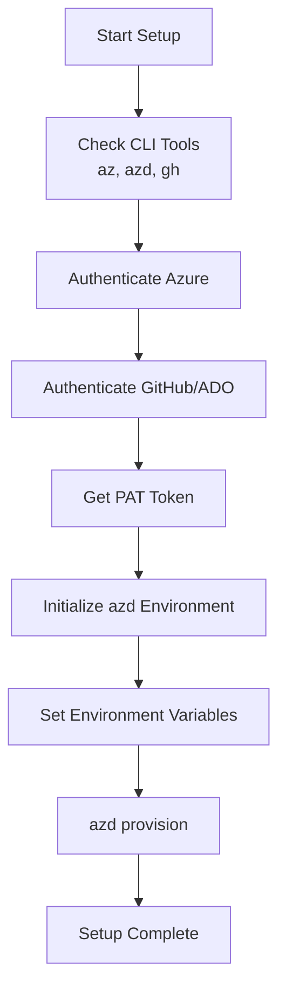

### Environment Variables

| Variable                  | Source            | Purpose                            |
| ------------------------- | ----------------- | ---------------------------------- |
| `AZURE_ENV_NAME`          | User input        | Environment name (dev, test, prod) |
| `AZURE_LOCATION`          | User input        | Azure region                       |
| `AZURE_SUBSCRIPTION_ID`   | Azure CLI         | Target subscription                |
| `AZURE_CLIENT_ID`         | Service principal | Deployment identity                |
| `AZURE_TENANT_ID`         | Azure AD          | Tenant identifier                  |
| `KEY_VAULT_SECRET`        | GitHub Secret     | PAT token for catalogs             |
| `SOURCE_CONTROL_PLATFORM` | User input        | github or adogit                   |

---

## 💻 DevOps Practices

### Branching Strategy

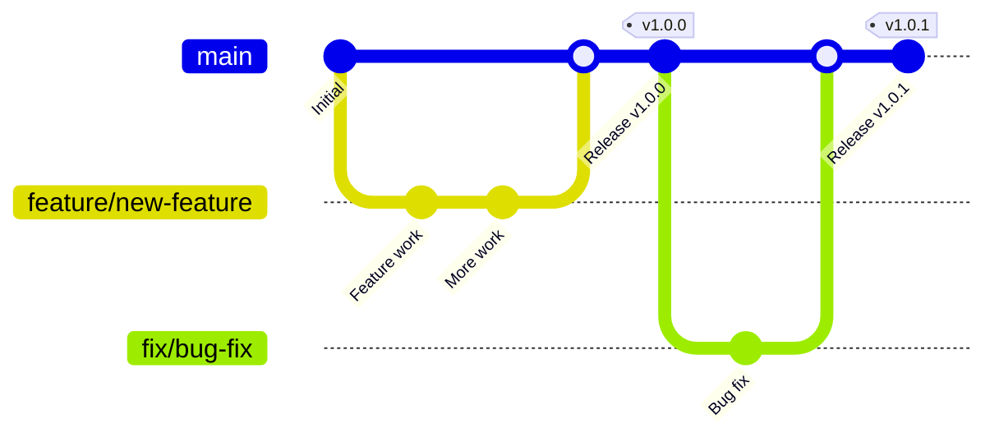

### Branch Types

| Branch Pattern | Purpose               | Version Impact        |
| -------------- | --------------------- | --------------------- |
| `main`         | Production-ready code | Major/Patch increment |
| `feature/*`    | New features          | Minor increment       |
| `fix/*`        | Bug fixes             | Patch increment       |
| `docs/*`       | Documentation         | No version change     |

### Semantic Versioning

The accelerator follows semantic versioning (`MAJOR.MINOR.PATCH`):

| Version Component | Increment Condition                                    | Example       |
| ----------------- | ------------------------------------------------------ | ------------- |
| **MAJOR**         | Breaking changes, main branch with minor=0 AND patch=0 | 1.0.0 → 2.0.0 |
| **MINOR**         | Feature branches                                       | 1.0.0 → 1.1.0 |
| **PATCH**         | Fix branches, main branch with minor≠0 OR patch≠0      | 1.0.0 → 1.0.1 |

### Release Process

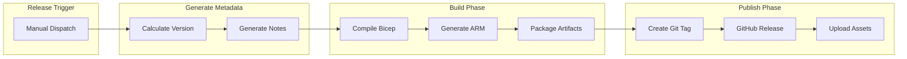

### Infrastructure as Code Practices

| Practice                   | Implementation                   | Benefit                    |
| -------------------------- | -------------------------------- | -------------------------- |
| **Version Control**        | All Bicep/YAML in Git            | Audit trail, collaboration |
| **Code Review**            | Pull requests to main            | Quality assurance          |
| **Automated Testing**      | CI pipeline validation           | Catch errors early         |
| **Idempotent Deployments** | Declarative Bicep                | Safe re-runs               |
| **Environment Parity**     | Same templates, different params | Consistent environments    |
| **Documentation as Code**  | Markdown in repository           | Self-documenting           |

---

## 📚 References

### External References

| Reference                | URL                                                                            | Description           |
| ------------------------ | ------------------------------------------------------------------------------ | --------------------- |
| Microsoft Dev Box        | https://learn.microsoft.com/azure/dev-box/                                     | Dev Box documentation |
| Azure DevCenter API      | https://learn.microsoft.com/azure/templates/microsoft.devcenter/               | Resource reference    |
| Azure Developer CLI      | https://learn.microsoft.com/azure/developer/azure-developer-cli/               | azd documentation     |
| Azure Landing Zones      | https://learn.microsoft.com/azure/cloud-adoption-framework/ready/landing-zone/ | CAF guidance          |
| GitHub Actions for Azure | https://learn.microsoft.com/azure/developer/github/                            | CI/CD integration     |
| Azure RBAC               | https://learn.microsoft.com/azure/role-based-access-control/                   | Access control        |

### Related Architecture Documents

| Document                 | Path                                                               | Description           |
| ------------------------ | ------------------------------------------------------------------ | --------------------- |
| Business Architecture    | [01-business-architecture.md](./01-business-architecture.md)       | Business context      |
| Data Architecture        | [02-data-architecture.md](./02-data-architecture.md)               | Data models and flows |
| Application Architecture | [03-application-architecture.md](./03-application-architecture.md) | Bicep modules         |

---

## 📖 Glossary

| Term                      | Definition                                                   |
| ------------------------- | ------------------------------------------------------------ |
| **azd**                   | Azure Developer CLI - deployment tool for Azure applications |
| **Bicep**                 | Domain-specific language for Azure infrastructure deployment |
| **DevCenter**             | Azure service for managing developer environments            |
| **Dev Box**               | Cloud-powered developer workstation                          |
| **Federated Credentials** | OIDC-based authentication without secrets                    |
| **Landing Zone**          | Pre-configured Azure environment with governance             |
| **Managed Identity**      | Azure AD identity automatically managed by Azure             |
| **Network Connection**    | DevCenter resource linking to customer VNet                  |
| **RBAC**                  | Role-Based Access Control                                    |
| **SKU**                   | Stock Keeping Unit - defines resource size/tier              |
| **System-Assigned MI**    | Managed identity tied to resource lifecycle                  |
| **VNet**                  | Virtual Network - isolated network in Azure                  |

---

_This document follows TOGAF Architecture Development Method (ADM) principles
and aligns with the Technology Architecture domain of the BDAT framework._

---

<div align="center">

**[← Application Architecture](./03-application-architecture.md)** |
**[⬆️ Back to Top](#%EF%B8%8F-technology-architecture)**

</div>
