# ☁️ Technology Architecture

> **DevExp-DevBox Landing Zone Accelerator**

> [!NOTE]
> **Target Audience:** Cloud Architects, Infrastructure Engineers, Platform Teams  
> **Reading Time:** ~20 minutes

<details>
<summary>📍 Navigation</summary>

| Previous | Index | Next |
|:---------|:-----:|-----:|
| [← Application Architecture](03-application-architecture.md) | [Architecture Index](../README.md) | [Security Architecture →](05-security-architecture.md) |

</details>

| Property | Value |
|:---------|:------|
| **Version** | 1.0.0 |
| **Last Updated** | 2026-01-23 |
| **Author** | DevExp Team |
| **Status** | Published |

---

## 📑 Table of Contents

- [📊 Technology Overview](#technology-overview)
- [📦 Azure Service Catalog](#azure-service-catalog)
- [🏗️ Landing Zone Design](#landing-zone-design)
- [🌐 Network Architecture](#network-architecture)
- [💻 Compute Architecture](#compute-architecture)
- [🔄 CI/CD Infrastructure](#cicd-infrastructure)
- [📶 Monitoring Infrastructure](#monitoring-infrastructure)
- [📏 Infrastructure Sizing](#infrastructure-sizing)
- [📜 Technology Standards](#technology-standards)
- [🔗 References](#references)

---

## 📊 Technology Overview

The DevExp-DevBox accelerator leverages Azure's Platform as a Service (PaaS) offerings with a strong emphasis on managed services, security by default, and enterprise governance patterns.

### Technology Stack Overview

```mermaid
---
title: Technology Stack Overview
---
flowchart TB
    %% ===== DEVELOPER TOOLING =====
    subgraph Developer["👨‍💻 Developer Tooling"]
        VSC["💻 VS Code"]
        GH["🐙 GitHub"]
        AZD["🚀 Azure Developer CLI"]
    end
    
    %% ===== INFRASTRUCTURE AS CODE =====
    subgraph IaC["📜 Infrastructure as Code"]
        BICEP["⚙️ Azure Bicep"]
        YAML["📄 YAML Configuration"]
        PS["📝 PowerShell/Bash"]
    end
    
    %% ===== CI/CD PLATFORM =====
    subgraph CI_CD["🔄 CI/CD Platform"]
        GHA["🔄 GitHub Actions"]
        OIDC["🔐 OIDC Federation"]
    end
    
    %% ===== AZURE PLATFORM =====
    subgraph Azure["☁️ Azure Platform"]
        subgraph Compute["💻 Compute Services"]
            DC["🖥️ Azure DevCenter"]
            DB["🖥️ Dev Boxes"]
        end
        
        subgraph Security["🔐 Security Services"]
            KV["🔑 Key Vault"]
            RBAC["🛡️ Azure RBAC"]
            MI["👤 Managed Identities"]
        end
        
        subgraph Network["🌐 Network Services"]
            VNET["🔗 Virtual Network"]
            NC["📶 Network Connections"]
        end
        
        subgraph Monitor["📊 Monitoring Services"]
            LA["📈 Log Analytics"]
            MON["📊 Azure Monitor"]
        end
    end
    
    %% ===== CONNECTIONS =====
    Developer -->|develops| IaC
    IaC -->|deploys via| CI_CD
    CI_CD -->|provisions| Azure
    
    %% ===== STYLES =====
    classDef primary fill:#4F46E5,stroke:#3730A3,color:#FFFFFF
    classDef datastore fill:#F59E0B,stroke:#D97706,color:#000000
    classDef trigger fill:#818CF8,stroke:#4F46E5,color:#FFFFFF
    classDef secondary fill:#10B981,stroke:#059669,color:#FFFFFF
    
    class VSC,GH,AZD primary
    class BICEP,YAML,PS datastore
    class GHA,OIDC trigger
    class DC,DB,KV,RBAC,MI,VNET,NC,LA,MON secondary
    
    style Developer fill:#E0E7FF,stroke:#4F46E5,stroke-width:2px
    style IaC fill:#FEF3C7,stroke:#F59E0B,stroke-width:2px
    style CI_CD fill:#EEF2FF,stroke:#4F46E5,stroke-width:2px
    style Azure fill:#ECFDF5,stroke:#10B981,stroke-width:2px
```



### Technology Decision Matrix

| Category | Technology | Rationale | Alternatives Considered |
|----------|------------|-----------|-------------------------|
| IaC Language | Azure Bicep | Native Azure, type-safe, modular | Terraform, ARM Templates |
| Configuration | YAML | Human-readable, schema validation | JSON, HCL |
| CI/CD | GitHub Actions | Native GitHub integration, OIDC | Azure DevOps, Jenkins |
| Authentication | OIDC Federation | No stored secrets, short-lived tokens | Service Principal + Secret |
| Secrets | Azure Key Vault | Native Azure, RBAC, HSM-backed | GitHub Secrets, HashiCorp Vault |
| Monitoring | Log Analytics | Unified Azure telemetry | Splunk, Datadog |
| Compute | Azure DevCenter | Managed Dev Box service | Azure VMs, AVD |

---

[⬆️ Back to Top](#-table-of-contents)

---

## 📦 Azure Service Catalog

### Primary Azure Services

| Service | Resource Type | Purpose | Tier/SKU |
|---------|--------------|---------|----------|
| **Azure DevCenter** | `Microsoft.DevCenter/devcenters` | Developer workstation management | N/A (PaaS) |
| **Dev Box Projects** | `Microsoft.DevCenter/devcenters/projects` | Project-level Dev Box organization | N/A |
| **Dev Box Pools** | `Microsoft.DevCenter/projects/pools` | Dev Box VM allocation | Variable |
| **Azure Key Vault** | `Microsoft.KeyVault/vaults` | Secrets and credential storage | Standard |
| **Log Analytics** | `Microsoft.OperationalInsights/workspaces` | Centralized logging | PerGB2018 |
| **Virtual Network** | `Microsoft.Network/virtualNetworks` | Network isolation | N/A |
| **Network Connection** | `Microsoft.DevCenter/networkConnections` | Dev Box network config | N/A |

### Service Relationships

```mermaid
---
title: Azure Service Relationships
---
flowchart TB
    %% ===== MANAGEMENT PLANE =====
    subgraph Management["🎯 Management Plane"]
        ARM["☁️ Azure Resource Manager"]
        SUB["📋 Subscription"]
    end
    
    %% ===== RESOURCE GROUPS =====
    subgraph ResourceGroups["📁 Resource Groups"]
        RG_SEC["🔐 rg-security"]
        RG_MON["📊 rg-monitoring"]
        RG_WL["📦 rg-workload"]
    end
    
    %% ===== SECURITY ZONE =====
    subgraph SecurityZone["🔐 Security Landing Zone"]
        KV["🔑 Key Vault"]
        SEC["🔒 Secrets"]
    end
    
    %% ===== MONITORING ZONE =====
    subgraph MonitoringZone["📊 Monitoring Landing Zone"]
        LA["📈 Log Analytics<br/>Workspace"]
        SOL["🔧 Solutions"]
    end
    
    %% ===== WORKLOAD ZONE =====
    subgraph WorkloadZone["📦 Workload Landing Zone"]
        DC["🖥️ DevCenter"]
        PROJ["📁 Projects"]
        POOL["🏊 Pools"]
        CAT["📚 Catalogs"]
    end
    
    %% ===== NETWORK ZONE =====
    subgraph NetworkZone["🌐 Network"]
        VNET["🔗 Virtual Network"]
        SUBNET["📶 Subnets"]
        NC["🔌 Network Connection"]
    end
    
    %% ===== CONNECTIONS =====
    ARM -->|manages| SUB
    SUB -->|contains| ResourceGroups
    
    RG_SEC -->|hosts| SecurityZone
    RG_MON -->|hosts| MonitoringZone
    RG_WL -->|hosts| WorkloadZone
    RG_WL -->|hosts| NetworkZone
    
    KV -.->|secretIdentifier| CAT
    LA -.->|diagnostics| KV
    LA -.->|diagnostics| DC
    LA -.->|diagnostics| VNET
    
    NC -->|connects| VNET
    DC -->|creates| PROJ
    PROJ -->|deploys| POOL
    
    %% ===== STYLES =====
    classDef trigger fill:#818CF8,stroke:#4F46E5,color:#FFFFFF
    classDef failed fill:#F44336,stroke:#C62828,color:#FFFFFF
    classDef secondary fill:#10B981,stroke:#059669,color:#FFFFFF
    classDef primary fill:#4F46E5,stroke:#3730A3,color:#FFFFFF
    classDef datastore fill:#F59E0B,stroke:#D97706,color:#000000
    
    class ARM,SUB trigger
    class RG_SEC,RG_MON,RG_WL trigger
    class KV,SEC failed
    class LA,SOL secondary
    class DC,PROJ,POOL,CAT primary
    class VNET,SUBNET,NC datastore
    
    style Management fill:#EEF2FF,stroke:#4F46E5,stroke-width:2px
    style ResourceGroups fill:#EEF2FF,stroke:#4F46E5,stroke-width:2px
    style SecurityZone fill:#FEE2E2,stroke:#F44336,stroke-width:2px
    style MonitoringZone fill:#ECFDF5,stroke:#10B981,stroke-width:2px
    style WorkloadZone fill:#E0E7FF,stroke:#4F46E5,stroke-width:2px
    style NetworkZone fill:#FEF3C7,stroke:#F59E0B,stroke-width:2px
```



### API Versions Used

| Resource Type | API Version | Preview/GA |
|--------------|-------------|------------|
| `Microsoft.DevCenter/devcenters` | 2024-08-01-preview | Preview |
| `Microsoft.DevCenter/devcenters/catalogs` | 2024-08-01-preview | Preview |
| `Microsoft.DevCenter/devcenters/projects` | 2024-08-01-preview | Preview |
| `Microsoft.DevCenter/projects/pools` | 2024-08-01-preview | Preview |
| `Microsoft.DevCenter/networkConnections` | 2024-08-01-preview | Preview |
| `Microsoft.KeyVault/vaults` | 2023-07-01 | GA |
| `Microsoft.KeyVault/vaults/secrets` | 2023-07-01 | GA |
| `Microsoft.OperationalInsights/workspaces` | 2022-10-01 | GA |
| `Microsoft.Network/virtualNetworks` | 2023-09-01 | GA |
| `Microsoft.Insights/diagnosticSettings` | 2021-05-01-preview | GA |

---

[⬆️ Back to Top](#-table-of-contents)

---

## 🏗️ Landing Zone Design

### Azure Landing Zone Alignment

The accelerator implements a simplified Azure Landing Zone pattern with three primary zones plus networking.


### Resource Group Naming Convention

| Landing Zone | Resource Group Pattern | Example |
|--------------|----------------------|---------|
| Security | `{base}-security-{env}` | `devexp-security-dev` |
| Monitoring | `{base}-monitoring-{env}` | `devexp-monitoring-dev` |
| Workload | `{base}-workload-{env}` | `devexp-workload-dev` |

### Resource Naming Convention

| Resource Type | Pattern | Example |
|--------------|---------|---------|
| DevCenter | `{name}-{uniqueString}` | `devexp-devcenter-abc123` |
| Key Vault | `kv-{name}-{uniqueString}` | `kv-contoso-xyz789` |
| Log Analytics | `law-{name}-{uniqueString}` | `law-devexp-def456` |
| Virtual Network | `vnet-{project}-{env}` | `vnet-eshop-dev` |
| Subnet | `snet-{purpose}` | `snet-devbox` |

---

[⬆️ Back to Top](#-table-of-contents)

---

## 🌐 Network Architecture

### Network Topology

```mermaid
---
title: Network Topology
---
flowchart TB
    %% ===== INTERNET =====
    subgraph Internet["🌍 Internet"]
        DEV["👨‍💻 Developer<br/>(Remote)"]
        GH["🐙 GitHub.com"]
        ADO["🔷 Azure DevOps"]
    end
    
    %% ===== AZURE =====
    subgraph Azure["☁️ Azure"]
        subgraph VNet["🔗 Virtual Network (10.0.0.0/16)"]
            subgraph Subnet["📶 DevBox Subnet (10.0.1.0/24)"]
                DB1["🖥️ Dev Box 1"]
                DB2["🖥️ Dev Box 2"]
                DB3["🖥️ Dev Box N"]
            end
        end
        
        NC["📶 Network Connection<br/>(Managed/Unmanaged)"]
        DC["🖥️ DevCenter"]
    end
    
    %% ===== MS HOSTED =====
    subgraph MSHosted["🏢 Microsoft-Hosted Network"]
        MHN["☁️ Microsoft Managed<br/>Network"]
    end
    
    %% ===== CONNECTIONS =====
    DEV -->|RDP/HTTPS| DB1
    DEV -->|RDP/HTTPS| DB2
    
    DB1 -->|HTTPS| GH
    DB1 -->|HTTPS| ADO
    
    DC -->|networkConnectionId| NC
    NC -->|subnetId| Subnet
    
    DC -.->|Alternative| MHN
    
    %% ===== STYLES =====
    classDef external fill:#6B7280,stroke:#4B5563,color:#FFFFFF,stroke-dasharray:5 5
    classDef primary fill:#4F46E5,stroke:#3730A3,color:#FFFFFF
    classDef trigger fill:#818CF8,stroke:#4F46E5,color:#FFFFFF
    
    class DEV,GH,ADO external
    class DB1,DB2,DB3,NC,DC primary
    class MHN trigger
    
    style Internet fill:#F3F4F6,stroke:#6B7280,stroke-width:2px
    style VNet fill:#E0E7FF,stroke:#4F46E5,stroke-width:2px
    style MSHosted fill:#EEF2FF,stroke:#4F46E5,stroke-width:2px
```



### Network Configuration Options

| Option | Configuration | Use Case |
|--------|--------------|----------|
| **Microsoft-Hosted** | `microsoftHostedNetworkEnableStatus: Enabled` | Quick start, no VNet management |
| **Azure VNet (Managed)** | `virtualNetworkType: Managed` | Organization VNet, auto-provisioned |
| **Azure VNet (Unmanaged)** | `virtualNetworkType: Unmanaged` | Existing VNet, full control |

### VNet Configuration (from devcenter.yaml)

```yaml
network:
  name: eShop
  create: true
  virtualNetworkType: Managed
  addressPrefixes:
    - "10.0.0.0/16"
  subnets:
    - name: eShop-subnet
      properties:
        addressPrefix: 10.0.1.0/24
```

### Network Security Controls

| Control | Implementation | Purpose |
|---------|---------------|---------|
| NSG | Default Azure NSG | Subnet-level filtering |
| Private Endpoints | Optional | Key Vault private access |
| Service Endpoints | Optional | PaaS service access |
| NAT Gateway | Optional | Outbound connectivity |

---

[⬆️ Back to Top](#-table-of-contents)

---

## 💻 Compute Architecture

### Dev Box Architecture

```mermaid
---
title: Dev Box Architecture
---
flowchart TB
    %% ===== DEVCENTER =====
    subgraph DevCenter["🏢 Azure DevCenter"]
        DC["🖥️ DevCenter Resource"]
        
        %% ===== IMAGES =====
        subgraph Images["📦 Image Definitions"]
            IMG1["💻 eShop-backend-engineer"]
            IMG2["🎨 eShop-frontend-engineer"]
        end
        
        %% ===== PROJECTS =====
        subgraph Projects["📁 Projects"]
            PROJ["📋 eShop Project"]
        end
        
        %% ===== POOLS =====
        subgraph Pools["🏊 Dev Box Pools"]
            P1["⚙️ backend-engineer<br/>general_i_32c128gb512ssd_v2"]
            P2["🎨 frontend-engineer<br/>general_i_16c64gb256ssd_v2"]
        end
    end
    
    %% ===== RUNTIME =====
    subgraph Runtime["🚀 Runtime Environment"]
        DB1["🖥️ Dev Box Instance<br/>(Windows 11)"]
        DB2["🖥️ Dev Box Instance<br/>(Windows 11)"]
    end
    
    %% ===== CONNECTIONS =====
    DC -->|manages| Images
    DC -->|contains| Projects
    Projects -->|deploys| Pools
    P1 -->|provisions| DB1
    P2 -->|provisions| DB2
    
    IMG1 -->|imageDefinition| P1
    IMG2 -->|imageDefinition| P2
    
    %% ===== STYLES =====
    classDef primary fill:#4F46E5,stroke:#3730A3,color:#FFFFFF
    classDef secondary fill:#10B981,stroke:#059669,color:#FFFFFF
    
    class DC,PROJ primary
    class IMG1,IMG2,P1,P2,DB1,DB2 secondary
    
    style DevCenter fill:#E0E7FF,stroke:#4F46E5,stroke-width:2px
    style Runtime fill:#ECFDF5,stroke:#10B981,stroke-width:2px
```



### Dev Box SKU Options

| SKU | vCPU | Memory | Storage | Use Case |
|-----|------|--------|---------|----------|
| `general_i_8c32gb256ssd_v2` | 8 | 32 GB | 256 GB | Light development |
| `general_i_16c64gb256ssd_v2` | 16 | 64 GB | 256 GB | Frontend development |
| `general_i_16c64gb512ssd_v2` | 16 | 64 GB | 512 GB | General development |
| `general_i_32c128gb512ssd_v2` | 32 | 128 GB | 512 GB | Backend/heavy workloads |
| `general_i_32c128gb1024ssd_v2` | 32 | 128 GB | 1024 GB | Data/ML development |

### Image Management

Dev Box images are managed through DevCenter catalogs containing image definitions:

```mermaid
---
title: Image Management Flow
---
flowchart LR
    %% ===== CATALOG =====
    subgraph Catalog["📚 DevCenter Catalog"]
        GIT["🐙 Git Repository"]
        IMG_DEF["📄 Image Definitions<br/>(YAML/JSON)"]
        DSC["⚙️ DSC Configurations<br/>(Optional)"]
    end
    
    %% ===== DEVCENTER =====
    subgraph DevCenter["🏢 DevCenter"]
        CAT["🔄 Catalog Sync"]
        IMG["📦 Image Gallery"]
    end
    
    %% ===== POOL =====
    subgraph Pool["🏊 Dev Box Pool"]
        VM["🖥️ Dev Box VMs"]
    end
    
    %% ===== CONNECTIONS =====
    GIT -->|syncs| CAT
    CAT -->|loads| IMG_DEF
    IMG_DEF -->|registers| IMG
    IMG -->|provisions| VM
    DSC -->|configures| IMG
    
    %% ===== STYLES =====
    classDef datastore fill:#F59E0B,stroke:#D97706,color:#000000
    classDef primary fill:#4F46E5,stroke:#3730A3,color:#FFFFFF
    classDef secondary fill:#10B981,stroke:#059669,color:#FFFFFF
    
    class GIT,IMG_DEF,DSC datastore
    class CAT,IMG primary
    class VM secondary
    
    style Catalog fill:#FEF3C7,stroke:#F59E0B,stroke-width:2px
    style DevCenter fill:#E0E7FF,stroke:#4F46E5,stroke-width:2px
    style Pool fill:#ECFDF5,stroke:#10B981,stroke-width:2px
```



---

[⬆️ Back to Top](#-table-of-contents)

---

## 🔄 CI/CD Infrastructure

### GitHub Actions Architecture


### Workflow Pipeline Structure


### Pipeline Components

| Component | Purpose | Configuration |
|-----------|---------|---------------|
| `build.yml` | Provision infrastructure | OIDC auth, azd provision |
| `deploy.yml` | Deploy applications | Artifact download, azd deploy |
| `release.yml` | Create releases | Semantic versioning, release notes |

### OIDC Federation Configuration

```yaml
# GitHub Actions OIDC Configuration
permissions:
  id-token: write    # Required for OIDC
  contents: read     # Required for checkout

steps:
  - uses: azure/login@v2
    with:
      client-id: ${{ vars.AZURE_CLIENT_ID }}
      tenant-id: ${{ vars.AZURE_TENANT_ID }}
      subscription-id: ${{ vars.AZURE_SUBSCRIPTION_ID }}
```

---

[⬆️ Back to Top](#-table-of-contents)

---

## 📶 Monitoring Infrastructure

### Log Analytics Architecture


### Diagnostic Settings Configuration

| Resource | Log Categories | Metrics |
|----------|---------------|---------|
| DevCenter | allLogs | AllMetrics |
| Key Vault | AuditEvent, AzurePolicyEvaluationDetails | AllMetrics |
| Virtual Network | VMProtectionAlerts | AllMetrics |
| Log Analytics | Audit | AllMetrics |

### Retention and Costs

| Data Type | Retention | Cost Model |
|-----------|-----------|------------|
| Logs | 90 days | PerGB2018 |
| Metrics | 93 days | Included |
| Activity | 90 days | Free (first 5GB) |

---

[⬆️ Back to Top](#-table-of-contents)

---

## 📏 Infrastructure Sizing

### Resource Sizing Guidelines

| Resource | Small | Medium | Large |
|----------|-------|--------|-------|
| **DevCenter Projects** | 1-5 | 5-20 | 20+ |
| **Dev Box Pools** | 1-2 per project | 3-5 per project | 5+ per project |
| **Concurrent Dev Boxes** | 10-50 | 50-200 | 200+ |
| **Log Analytics** | 5 GB/day | 10 GB/day | 50+ GB/day |
| **Key Vault Operations** | 1K/month | 10K/month | 100K+/month |

### Scaling Considerations

| Component | Scaling Method | Limits |
|-----------|----------------|--------|
| DevCenter | Horizontal (add projects) | 10 projects/DevCenter |
| Pools | Horizontal (add pools) | 5 pools/project |
| Dev Boxes | Auto (pool settings) | Based on quota |
| Network | VNet peering | Regional |
| Key Vault | Automatic | 25K ops/vault/region |

---

[⬆️ Back to Top](#-table-of-contents)

---

## 📜 Technology Standards

### Bicep Coding Standards

| Standard | Requirement |
|----------|-------------|
| API Versions | Use latest stable or preview as needed |
| Parameters | Use `@description` decorator |
| Secure Values | Use `@secure()` decorator |
| Naming | camelCase for resources, PascalCase for modules |
| Outputs | Document all outputs with descriptions |
| Modules | Single responsibility principle |

### YAML Configuration Standards

| Standard | Requirement |
|----------|-------------|
| Schema | All YAML files must reference JSON schema |
| Comments | Document complex configurations |
| Validation | Schema validation in CI/CD |
| Structure | Consistent property ordering |

### Version Control Standards

| Standard | Requirement |
|----------|-------------|
| Branching | Feature branches from main |
| Commits | Conventional commits |
| PRs | Required reviews |
| CODEOWNERS | Define for all paths |

---

[⬆️ Back to Top](#-table-of-contents)

---

## 🔗 References

### 📚 Internal References

- [Business Architecture](01-business-architecture.md)
- [Data Architecture](02-data-architecture.md)
- [Application Architecture](03-application-architecture.md)
- [Security Architecture](05-security-architecture.md)

### 🌐 External References

- [Azure DevCenter Documentation](https://learn.microsoft.com/en-us/azure/dev-box/)
- [Azure Landing Zones](https://learn.microsoft.com/en-us/azure/cloud-adoption-framework/ready/landing-zone/)
- [Azure Bicep Documentation](https://learn.microsoft.com/en-us/azure/azure-resource-manager/bicep/)
- [GitHub Actions OIDC](https://docs.github.com/en/actions/deployment/security-hardening-your-deployments/about-security-hardening-with-openid-connect)
- [Log Analytics Documentation](https://learn.microsoft.com/en-us/azure/azure-monitor/logs/log-analytics-overview)

---

<div align="center">

[← Application Architecture](03-application-architecture.md) | [⬆️ Back to Top](#-table-of-contents) | [Security Architecture →](05-security-architecture.md)

*DevExp-DevBox Landing Zone Accelerator • Technology Architecture*

</div>
