# 🔐 Security Architecture

> **TOGAF Layer**: Security Architecture  
> **Version**: 1.0.0  
> **Last Updated**: January 22, 2026  
> **Author**: DevExp Team

---

## 📑 Table of Contents

- [🛡️ Security Overview](#️-security-overview)
- [⚠️ Threat Model](#️-threat-model)
- [🔑 Identity & Access Management](#-identity--access-management)
- [✅ Authorization & RBAC](#-authorization--rbac)
- [🔒 Secrets Management](#-secrets-management)
- [🌐 Network Security](#-network-security)
- [📀 Data Protection](#-data-protection)
- [📊 Security Monitoring & Logging](#-security-monitoring--logging)
- [📋 Compliance & Governance](#-compliance--governance)
- [🎯 Security Controls Matrix](#-security-controls-matrix)
- [🚨 Incident Response](#-incident-response)
- [🛠️ Security Hardening](#️-security-hardening)
- [📦 Supply Chain Security](#-supply-chain-security)
- [🔄 CI/CD Security](#-cicd-security)
- [💡 Security Recommendations](#-security-recommendations)
- [📚 References](#-references)
- [📖 Glossary](#-glossary)

---

## 🛡️ Security Overview

The DevExp-DevBox Landing Zone Accelerator implements a **defense-in-depth** security strategy aligned with **Zero Trust** principles. Security controls are embedded at every layer: identity, network, data, and application.

### Security Architecture Overview

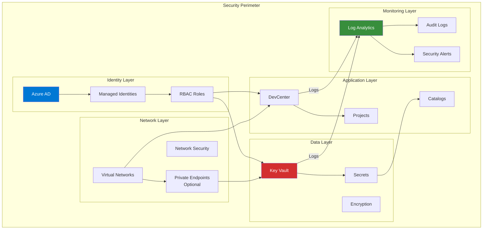

### Security Principles

| Principle | Implementation |
|-----------|----------------|
| **Zero Trust** | No implicit trust; verify explicitly via Azure AD and RBAC |
| **Least Privilege** | Role assignments with minimum necessary permissions |
| **Defense in Depth** | Multiple security layers (identity, network, data, monitoring) |
| **Assume Breach** | Comprehensive logging and monitoring for detection |
| **Secure by Default** | Hardened configurations (purge protection, RBAC authorization) |

### Security Posture Summary

| Area | Status | Key Controls |
|------|--------|--------------|
| **Identity** | ✅ Strong | Managed identities, Azure AD integration, RBAC |
| **Secrets** | ✅ Strong | Key Vault with purge protection, RBAC authorization |
| **Network** | ⚠️ Moderate | VNet isolation available, private endpoints optional |
| **Monitoring** | ✅ Strong | Centralized logging, diagnostic settings |
| **CI/CD** | ✅ Strong | OIDC federation, no stored secrets |

---

## Threat Model

### STRIDE Analysis

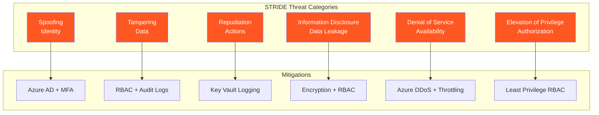

### Threat Assessment

#### Threat: Unauthorized Secret Access

- **STRIDE Category**: Information Disclosure
- **Attack Vector**: Compromised identity attempts to read GitHub PAT from Key Vault
- **Affected Assets**: Key Vault secrets, Git repositories
- **Mitigations**: 
  - RBAC-based Key Vault authorization
  - Managed identities (no stored credentials)
  - Key Vault audit logging
  - Principle of least privilege
- **Residual Risk**: Low

---

#### Threat: Catalog Tampering

- **STRIDE Category**: Tampering
- **Attack Vector**: Attacker modifies Dev Box image definitions in catalog repository
- **Affected Assets**: Dev Box images, developer workstations
- **Mitigations**:
  - Git branch protection rules
  - PAT authentication for private repositories
  - Catalog sync audit logs
- **Residual Risk**: Medium (depends on source control security)

---

#### Threat: Privilege Escalation via DevCenter

- **STRIDE Category**: Elevation of Privilege
- **Attack Vector**: User with Dev Box User role attempts to gain DevCenter Admin access
- **Affected Assets**: DevCenter, all projects
- **Mitigations**:
  - Scoped role assignments (Project vs DevCenter)
  - Azure AD group-based access
  - Role assignment audit logs
- **Residual Risk**: Low

---

#### Threat: Network-based Attacks on Dev Boxes

- **STRIDE Category**: Denial of Service / Information Disclosure
- **Attack Vector**: External attacker targets Dev Box network
- **Affected Assets**: Virtual networks, Dev Boxes
- **Mitigations**:
  - Microsoft-hosted networking (default)
  - Azure DDoS protection
  - Optional NSGs and private endpoints
- **Residual Risk**: Low (Microsoft-hosted) / Medium (customer-managed)

---

#### Threat: CI/CD Pipeline Compromise

- **STRIDE Category**: Spoofing / Tampering
- **Attack Vector**: Attacker injects malicious code via compromised pipeline
- **Affected Assets**: Infrastructure deployment, Azure resources
- **Mitigations**:
  - OIDC federation (no stored secrets)
  - Branch protection rules
  - Manual deployment approval
  - Artifact integrity verification
- **Residual Risk**: Low

---

### Risk Assessment Matrix

| Threat | Likelihood | Impact | Risk Score | Mitigation Status |
|--------|------------|--------|------------|-------------------|
| Unauthorized Secret Access | Low | High | Medium | ✅ Mitigated |
| Catalog Tampering | Medium | High | High | ⚠️ Partial |
| Privilege Escalation | Low | Critical | Medium | ✅ Mitigated |
| Network Attacks | Low | Medium | Low | ✅ Mitigated |
| CI/CD Compromise | Low | Critical | Medium | ✅ Mitigated |

---

## Identity & Access Management

### Identity Architecture

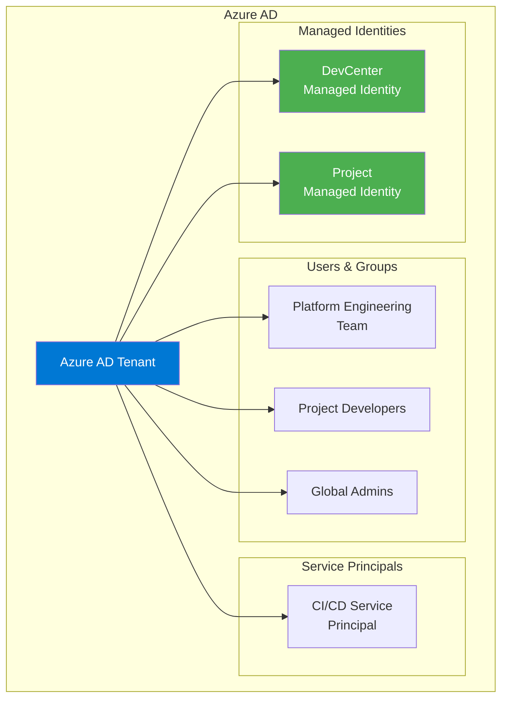

### Identity Types

| Identity Type | Use Case | Lifecycle | Credential Management |
|---------------|----------|-----------|----------------------|
| **Azure AD Users** | Human access to Dev Boxes | HR-managed | Password + MFA |
| **Azure AD Groups** | Role assignment targets | Team-managed | N/A |
| **Managed Identities** | Service-to-service auth | Resource lifecycle | Azure-managed (no credentials) |
| **Service Principals** | CI/CD automation | App registration | OIDC federation |

### Managed Identity Configuration

```yaml
# DevCenter identity (from devcenter.yaml)
identity:
  type: "SystemAssigned"
```

**Benefits**:
- No credential storage required
- Automatic credential rotation
- Azure-managed lifecycle
- Audit trail via Azure AD

### Authentication Flows

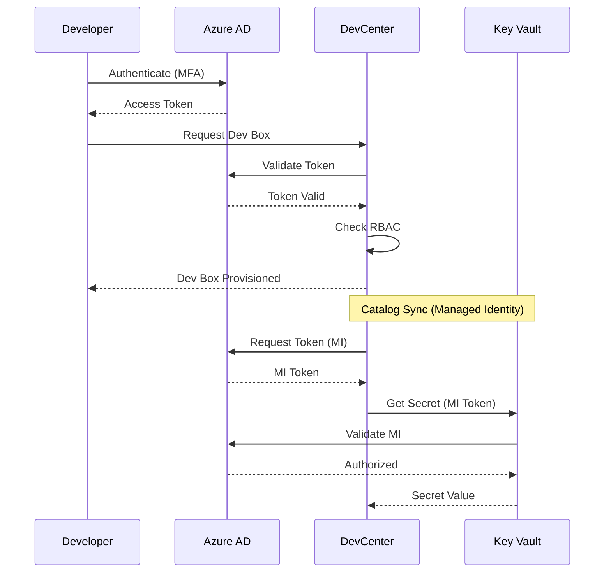

---

## Authorization & RBAC

### RBAC Hierarchy

```mermaid
graph TB
    subgraph "Scope Hierarchy"
        SUB[Subscription]
        RG_SEC[Security RG]
        RG_WRK[Workload RG]
        DC[DevCenter]
        PROJ[Project]
        POOL[Pool]
    end
    
    SUB --> RG_SEC
    SUB --> RG_WRK
    RG_WRK --> DC
    DC --> PROJ
    PROJ --> POOL
    
    subgraph "Role Inheritance"
        R1[Contributor<br/>@ Subscription]
        R2[Key Vault Secrets User<br/>@ Security RG]
        R3[DevCenter Project Admin<br/>@ Workload RG]
        R4[Dev Box User<br/>@ Project]
    end
    
    R1 -.->|Inherits down| RG_WRK
    R2 -.->|Scoped| RG_SEC
    R3 -.->|Scoped| DC
    R4 -.->|Scoped| PROJ
```

### Role Assignments Table

| Principal | Role | Role ID | Scope | Purpose |
|-----------|------|---------|-------|---------|
| DevCenter MI | Contributor | b24988ac-6180-42a0-ab88-20f7382dd24c | Subscription | Resource management |
| DevCenter MI | User Access Administrator | 18d7d88d-d35e-4fb5-a5c3-7773c20a72d9 | Subscription | RBAC assignments |
| DevCenter MI | Key Vault Secrets User | 4633458b-17de-408a-b874-0445c86b69e6 | Security RG | Read catalog secrets |
| DevCenter MI | Key Vault Secrets Officer | b86a8fe4-44ce-4948-aee5-eccb2c155cd7 | Security RG | Manage secrets |
| Platform Engineering Team | DevCenter Project Admin | 331c37c6-af14-46d9-b9f4-e1909e1b95a0 | Workload RG | Manage DevCenter |
| Project Developers | Contributor | b24988ac-6180-42a0-ab88-20f7382dd24c | Project | Project resources |
| Project Developers | Dev Box User | 45d50f46-0b78-4001-a660-4198cbe8cd05 | Project | Use Dev Boxes |
| Project Developers | Deployment Environment User | 18e40d4e-8d2e-438d-97e1-9528336e149c | Project | Deploy environments |
| Project Developers | Key Vault Secrets User | 4633458b-17de-408a-b874-0445c86b69e6 | Security RG | Access secrets |

### Scope Isolation

| Scope Level | Isolation Benefit | Access Control |
|-------------|-------------------|----------------|
| Subscription | Tenant boundary | Subscription owners |
| Resource Group | Workload separation | RG-level RBAC |
| DevCenter | Platform management | DevCenter admins |
| Project | Team isolation | Project-level roles |

---

## Secrets Management

### Key Vault Architecture

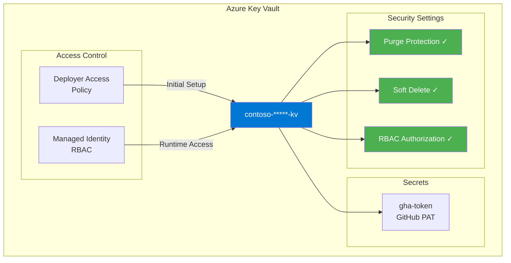

### Secrets Access Flow

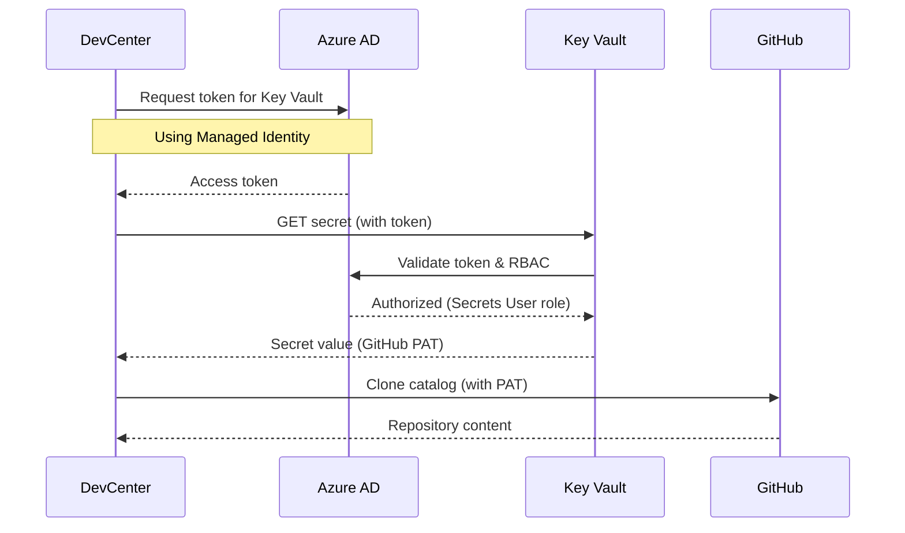

### Key Vault Access Matrix

| Identity | Permission | Justification |
|----------|------------|---------------|
| DevCenter Managed Identity | secrets/get, secrets/list | Catalog authentication |
| Project Managed Identity | secrets/get, secrets/list | Project catalog authentication |
| CI/CD Service Principal | secrets/set | Initial secret provisioning |
| Deployer (azd) | secrets/* | Deployment operations |

### Secret Types

| Secret | Name | Purpose | Rotation |
|--------|------|---------|----------|
| GitHub PAT | gha-token | Private catalog authentication | Manual (90 days recommended) |

### Security Configuration

| Setting | Value | Impact |
|---------|-------|--------|
| `enablePurgeProtection` | `true` | Prevents permanent deletion |
| `enableSoftDelete` | `true` | 7-day recovery window |
| `softDeleteRetentionInDays` | `7` | Minimum retention |
| `enableRbacAuthorization` | `true` | RBAC instead of access policies |

---

## Network Security

### Network Security Topology

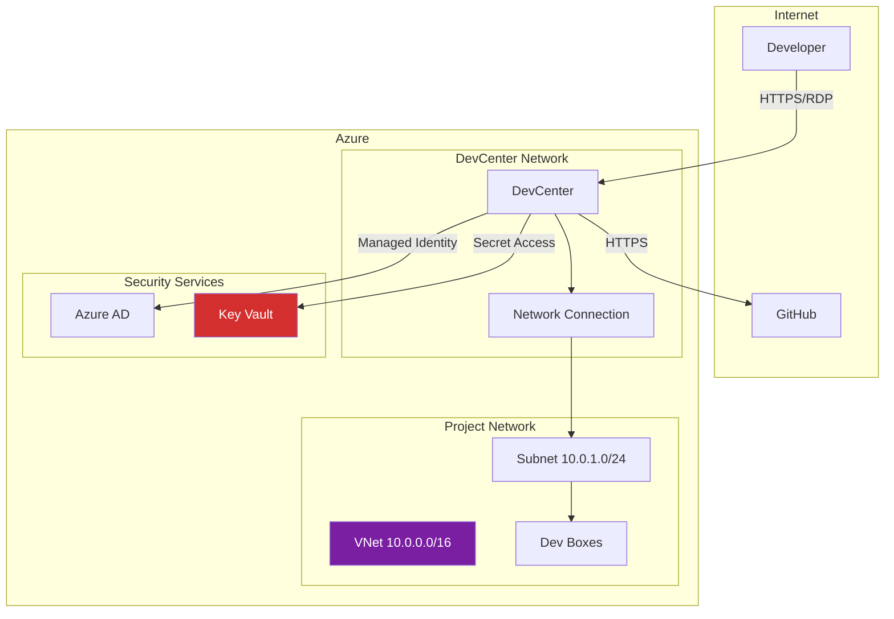

### Network Configuration Options

| Configuration | Type | Security Level | Use Case |
|---------------|------|----------------|----------|
| Microsoft Hosted | Managed | Standard | Simple deployments |
| Customer VNet | Unmanaged | Enhanced | Custom networking, firewall |

### Network Segmentation

| Segment | CIDR | Resources |
|---------|------|-----------|
| Project VNet | 10.0.0.0/16 | All project resources |
| Dev Box Subnet | 10.0.1.0/24 | Dev Box VMs |

### Security Recommendations

1. **Private Endpoints** (Optional): Add private endpoints for Key Vault
2. **NSG Rules**: Restrict inbound traffic to required ports
3. **Azure Firewall**: Add for egress control in enterprise scenarios
4. **Azure Bastion**: Use for secure Dev Box access

---

## Data Protection

### Encryption Matrix

| Data State | Encryption Method | Key Management |
|------------|-------------------|----------------|
| At Rest (Key Vault) | AES-256 | Platform-managed |
| At Rest (Log Analytics) | AES-256 | Platform-managed |
| At Rest (Dev Box Disks) | AES-256 | Platform-managed |
| In Transit | TLS 1.2+ | Azure-managed certificates |

### Data Classification

| Data Type | Classification | Protection |
|-----------|---------------|------------|
| GitHub PAT | Secret | Key Vault encryption + RBAC |
| Configuration YAML | Internal | Git encryption |
| Audit Logs | Confidential | Log Analytics encryption |
| Dev Box Content | Variable | Disk encryption |

### Sensitive Data Handling

- **Secrets**: Never logged, stored only in Key Vault
- **PAT Tokens**: Retrieved at runtime, not embedded in templates
- **User Data**: Managed on Dev Box disks with encryption

---

## Security Monitoring & Logging

### Security Logging Architecture

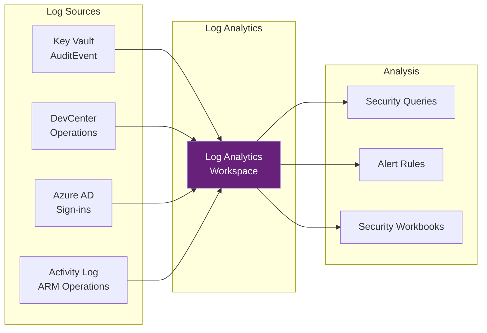

### Security-Relevant Logs

| Log Source | Category | Security Events |
|------------|----------|-----------------|
| Key Vault | AuditEvent | Secret access, management operations |
| DevCenter | DataPlaneRequests | API operations |
| Azure AD | SignInLogs | Authentication attempts |
| Activity Log | Administrative | Resource modifications |

### Security Queries

**Unauthorized Secret Access Attempts**:
```kusto
AzureDiagnostics
| where ResourceProvider == "MICROSOFT.KEYVAULT"
| where ResultType != "Success"
| project TimeGenerated, OperationName, ResultType, CallerIPAddress
| order by TimeGenerated desc
```

**Privilege Escalation Detection**:
```kusto
AzureActivity
| where OperationNameValue contains "roleAssignments/write"
| project TimeGenerated, Caller, ResourceGroup, Properties
```

**Suspicious DevCenter Operations**:
```kusto
AzureDiagnostics
| where ResourceProvider == "MICROSOFT.DEVCENTER"
| where ResultType != "Success"
| summarize FailedOperations = count() by OperationName, bin(TimeGenerated, 1h)
| where FailedOperations > 10
```

### Alert Rules (Recommended)

| Alert | Condition | Severity |
|-------|-----------|----------|
| Key Vault Access Denied | ResultType == "Forbidden" | High |
| Mass Secret Reads | Secret reads > 100/hour | Medium |
| Role Assignment Change | roleAssignments/write | High |
| DevCenter Config Change | DevCenter update operations | Medium |

---

## Compliance & Governance

### Compliance Mapping

| Framework | Control | Implementation | Evidence |
|-----------|---------|----------------|----------|
| **NIST 800-53** | AC-2 (Account Management) | Azure AD groups + RBAC | Role assignment audit |
| **NIST 800-53** | AC-6 (Least Privilege) | Scoped role assignments | RBAC configuration |
| **NIST 800-53** | AU-2 (Audit Events) | Diagnostic settings | Log Analytics |
| **NIST 800-53** | SC-12 (Key Management) | Key Vault | Key Vault audit logs |
| **CIS Azure** | 4.1.1 | RBAC authorization for Key Vault | enableRbacAuthorization: true |
| **CIS Azure** | 4.1.3 | Key Vault soft delete | enableSoftDelete: true |
| **CIS Azure** | 4.1.4 | Key Vault purge protection | enablePurgeProtection: true |

### Tagging for Compliance

```yaml
tags:
  environment: dev|test|staging|prod  # Environment classification
  owner: Contoso                      # Resource accountability
  costCenter: IT                      # Financial tracking
  project: DevExp-DevBox              # Project association
```

### Resource Locks (Recommended)

| Resource | Lock Type | Purpose |
|----------|-----------|---------|
| Key Vault | CanNotDelete | Prevent accidental deletion |
| Log Analytics | CanNotDelete | Preserve audit logs |
| DevCenter | CanNotDelete | Protect platform |

---

## Security Controls Matrix

### Control Inventory

| Control ID | Control Name | Category | Framework | Status | Implementation |
|------------|--------------|----------|-----------|--------|----------------|
| SC-001 | Azure AD Authentication | Identity | NIST AC-14 | ✅ Implemented | All services use Azure AD |
| SC-002 | Managed Identities | Identity | NIST IA-2 | ✅ Implemented | DevCenter + Projects |
| SC-003 | RBAC Authorization | Authorization | NIST AC-3 | ✅ Implemented | All resource access |
| SC-004 | Key Vault Secrets | Data Protection | NIST SC-12 | ✅ Implemented | PAT storage |
| SC-005 | Purge Protection | Data Protection | CIS 4.1.4 | ✅ Implemented | Key Vault config |
| SC-006 | Soft Delete | Data Protection | CIS 4.1.3 | ✅ Implemented | 7-day retention |
| SC-007 | Diagnostic Logging | Monitoring | NIST AU-2 | ✅ Implemented | All resources |
| SC-008 | Network Isolation | Network | NIST SC-7 | ⚠️ Partial | VNet available |
| SC-009 | Encryption at Rest | Data Protection | NIST SC-28 | ✅ Implemented | Platform encryption |
| SC-010 | Encryption in Transit | Data Protection | NIST SC-8 | ✅ Implemented | TLS 1.2+ |

### Control: Azure AD Authentication

- **Category**: Identity
- **Framework Mapping**: NIST 800-53 AC-14, Azure Security Benchmark IM-1
- **Implementation**: Azure AD tenant integration, managed identity authentication
- **Status**: Implemented
- **Evidence**: All Azure resources require Azure AD authentication

### Control: Key Vault RBAC Authorization

- **Category**: Data Protection
- **Framework Mapping**: CIS Azure 4.1.1, NIST 800-53 AC-3
- **Implementation**: `enableRbacAuthorization: true` in Key Vault config
- **Status**: Implemented
- **Evidence**: security.yaml configuration

### Control: Purge Protection

- **Category**: Data Protection
- **Framework Mapping**: CIS Azure 4.1.4, NIST 800-53 SC-12
- **Implementation**: `enablePurgeProtection: true` in Key Vault config
- **Status**: Implemented
- **Evidence**: security.yaml configuration

---

## Incident Response

### Detection Capabilities

| Detection Type | Mechanism | Response |
|----------------|-----------|----------|
| Secret Access Anomaly | Log Analytics query | Alert → Investigate |
| Role Assignment Change | Activity Log alert | Alert → Review |
| DevCenter Config Change | Diagnostic logs | Alert → Verify |
| Authentication Failure | Azure AD logs | Alert → Lock account |

### Response Procedures

#### Secret Compromise Response

1. **Detect**: Alert triggered for unauthorized Key Vault access
2. **Contain**: Disable affected managed identity / rotate secret
3. **Eradicate**: Rotate GitHub PAT, update Key Vault
4. **Recover**: Re-sync catalogs with new credentials
5. **Lessons Learned**: Review access policies, enhance monitoring

#### Escalation Path

| Severity | Initial Response | Escalation |
|----------|-----------------|------------|
| Low | Security Team | N/A |
| Medium | Security Team | Platform Team |
| High | Platform + Security | CISO |
| Critical | All Teams | Incident Commander |

---

## Security Hardening

### Key Vault Hardening

| Setting | Hardened Value | Default | Impact |
|---------|----------------|---------|--------|
| Purge Protection | Enabled | Disabled | Prevents permanent deletion |
| Soft Delete | Enabled | Enabled | Allows recovery |
| Retention Days | 7-90 | 90 | Balance recovery vs. compliance |
| RBAC Authorization | Enabled | Disabled | Modern access control |
| Network Rules | Optional | None | Network-level restriction |

### DevCenter Security Settings

| Setting | Value | Security Impact |
|---------|-------|-----------------|
| `catalogItemSyncEnableStatus` | Enabled | Allows catalog sync |
| `microsoftHostedNetworkEnableStatus` | Enabled | Uses Azure-managed networking |
| `installAzureMonitorAgentEnableStatus` | Enabled | Enables monitoring |

### Secure Defaults

The accelerator implements secure defaults:

- ✅ RBAC authorization for Key Vault (not access policies)
- ✅ Purge protection enabled
- ✅ Soft delete enabled
- ✅ Managed identities (no stored credentials)
- ✅ Diagnostic settings on all resources
- ✅ OIDC federation for CI/CD (no secrets in pipelines)

---

## Supply Chain Security

### Catalog Security

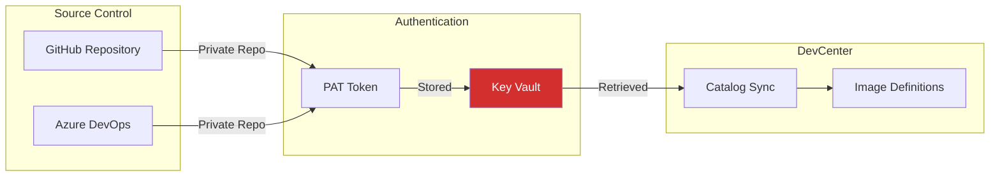

### Image Provenance

| Control | Implementation | Status |
|---------|----------------|--------|
| Source Verification | PAT authentication | ✅ |
| Branch Protection | Git settings (external) | ⚠️ Manual |
| Catalog Sync Logs | DevCenter diagnostics | ✅ |

### Dependency Management

| Component | Version Control | Security Updates |
|-----------|-----------------|------------------|
| Bicep Templates | Git versioned | PR review required |
| YAML Configs | Git versioned | Schema validation |
| CI/CD Actions | Pinned versions | Dependabot alerts |

---

## CI/CD Security

### Pipeline Security Architecture

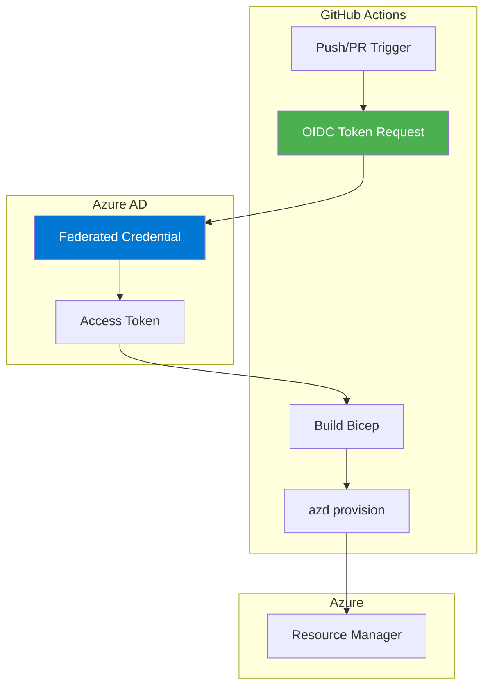

### OIDC Federation (No Stored Secrets)

```yaml
# GitHub Actions workflow
- name: Log in with Azure (Federated Credentials)
  run: |
    azd auth login \
      --client-id "${{ vars.AZURE_CLIENT_ID }}" \
      --federated-credential-provider "github" \
      --tenant-id "${{ vars.AZURE_TENANT_ID }}"
```

**Benefits**:
- No long-lived secrets in repository
- Automatic token rotation
- Auditable via Azure AD logs

### Pipeline Security Controls

| Control | Implementation | Status |
|---------|----------------|--------|
| OIDC Authentication | Federated credentials | ✅ |
| Branch Protection | Main branch rules | ⚠️ External |
| Artifact Integrity | GitHub artifact storage | ✅ |
| Manual Approval | workflow_dispatch | ✅ |
| Environment Secrets | KEY_VAULT_SECRET only | ✅ |

### Security Best Practices

1. **No Hardcoded Secrets**: Use GitHub Secrets for sensitive values
2. **OIDC over Service Principals**: Eliminates secret management
3. **Pinned Action Versions**: Prevent supply chain attacks
4. **Branch Protection**: Require PR reviews for main

---

## Security Recommendations

### Current Gaps

| Gap | Risk Level | Recommendation | Priority |
|-----|------------|----------------|----------|
| No Private Endpoints | Medium | Add PE for Key Vault | Medium |
| No NSG Rules | Low | Add explicit deny rules | Low |
| Manual PAT Rotation | Medium | Implement automated rotation | Medium |
| No Azure Policy | Medium | Add compliance policies | High |

### Security Roadmap

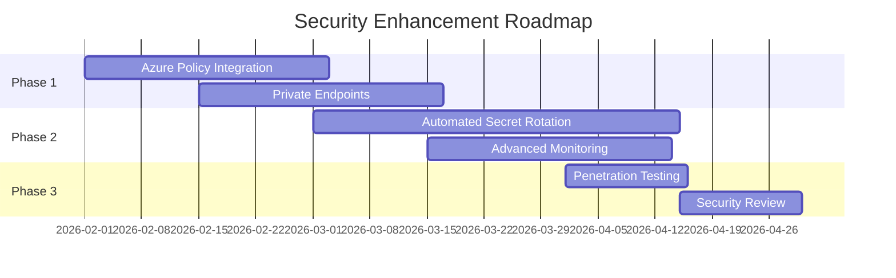

### Recommended Enhancements

1. **Azure Policy**: Enforce Key Vault soft delete, require tags
2. **Private Endpoints**: Key Vault private endpoint for enhanced network security
3. **Secret Rotation**: Azure Automation for PAT rotation
4. **Microsoft Defender**: Enable Defender for Key Vault
5. **Resource Locks**: Prevent accidental deletion

---

## References

### Internal Documents

- [Business Architecture](01-business-architecture.md) - Business context and stakeholders
- [Data Architecture](02-data-architecture.md) - Configuration schemas and data flows
- [Application Architecture](03-application-architecture.md) - Module design and Bicep structure
- [Technology Architecture](04-technology-architecture.md) - Azure services and infrastructure

### External References

- [Azure Security Baseline](https://learn.microsoft.com/en-us/security/benchmark/azure/)
- [Key Vault Security Best Practices](https://learn.microsoft.com/en-us/azure/key-vault/general/best-practices)
- [Azure RBAC Documentation](https://learn.microsoft.com/en-us/azure/role-based-access-control/)
- [Microsoft Cloud Security Benchmark](https://learn.microsoft.com/en-us/security/benchmark/azure/introduction)
- [NIST 800-53 Controls](https://csrc.nist.gov/publications/detail/sp/800-53/rev-5/final)
- [CIS Azure Benchmark](https://www.cisecurity.org/benchmark/azure)

---

## Glossary

| Term | Definition |
|------|------------|
| **Zero Trust** | Security model assuming no implicit trust |
| **RBAC** | Role-Based Access Control |
| **Managed Identity** | Azure-managed service identity |
| **OIDC Federation** | OpenID Connect-based secretless authentication |
| **Purge Protection** | Key Vault feature preventing permanent deletion |
| **Soft Delete** | Key Vault feature allowing secret recovery |
| **STRIDE** | Threat modeling framework (Spoofing, Tampering, Repudiation, Information Disclosure, DoS, Elevation) |
| **Defense in Depth** | Multiple layers of security controls |

---

*Document generated as part of TOGAF Architecture Documentation for DevExp-DevBox Landing Zone Accelerator*
