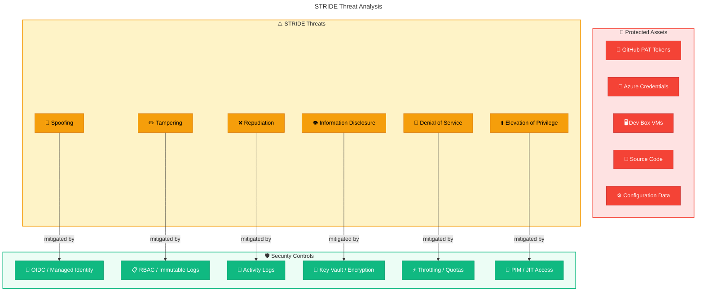
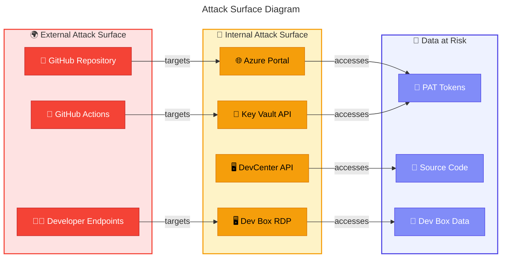
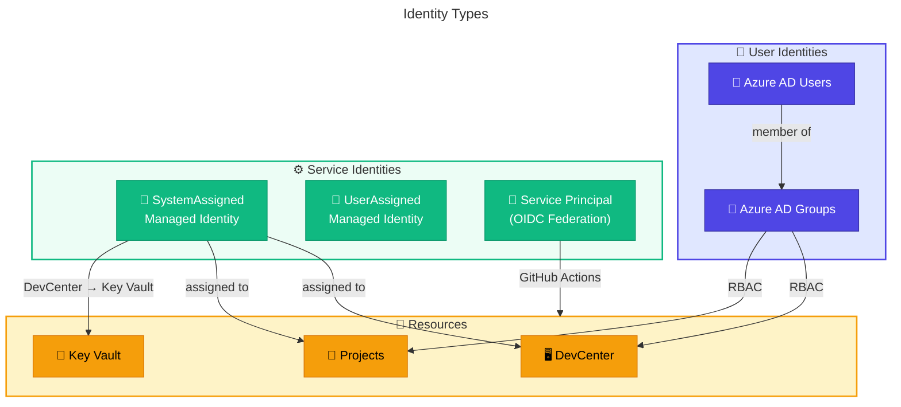
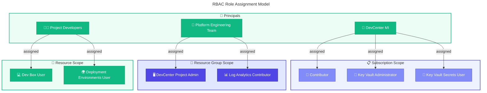
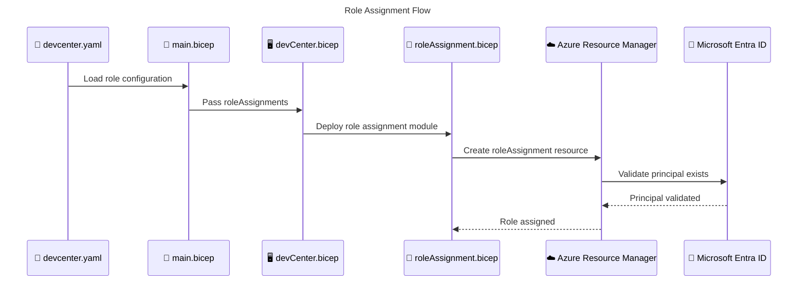
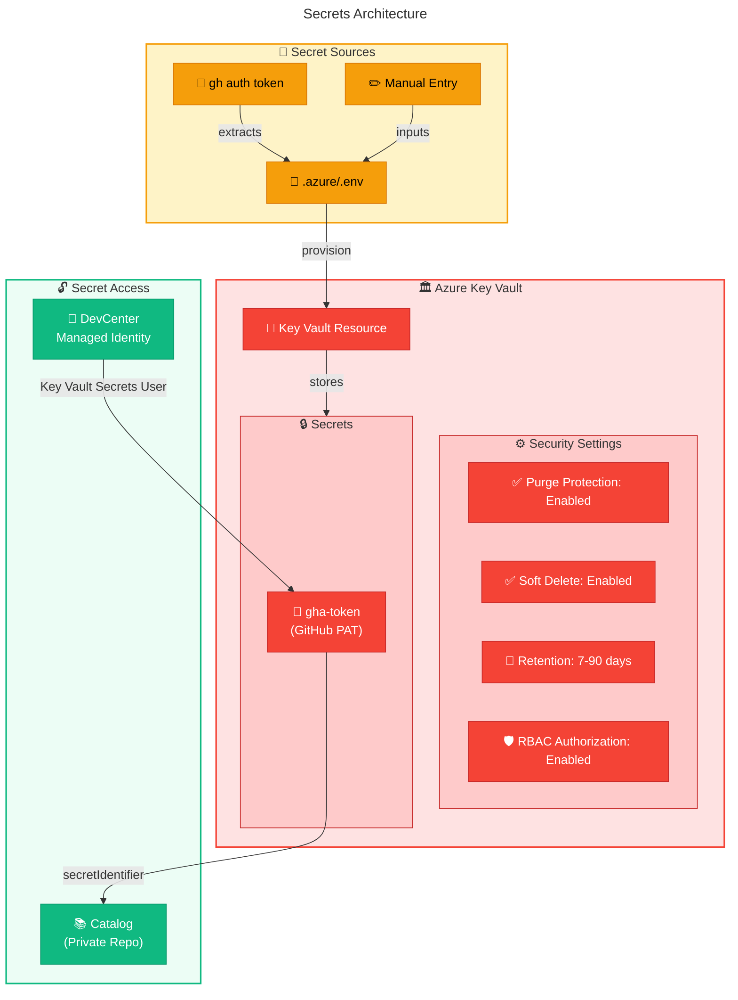
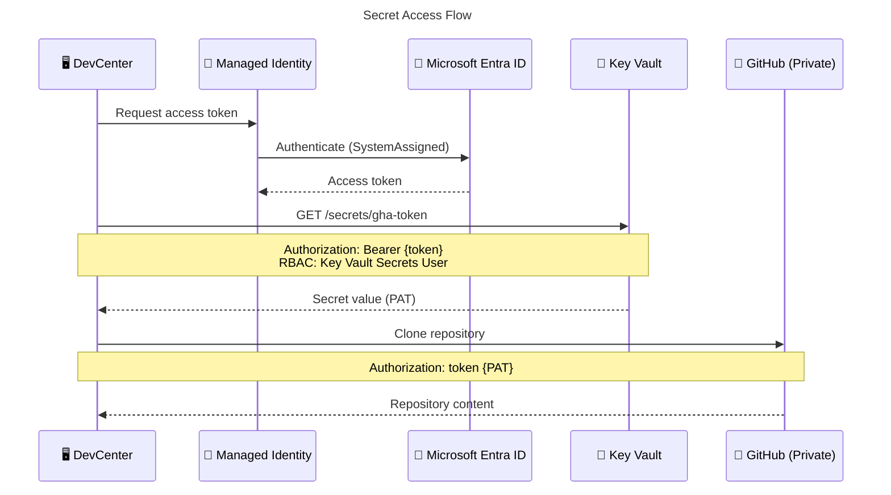
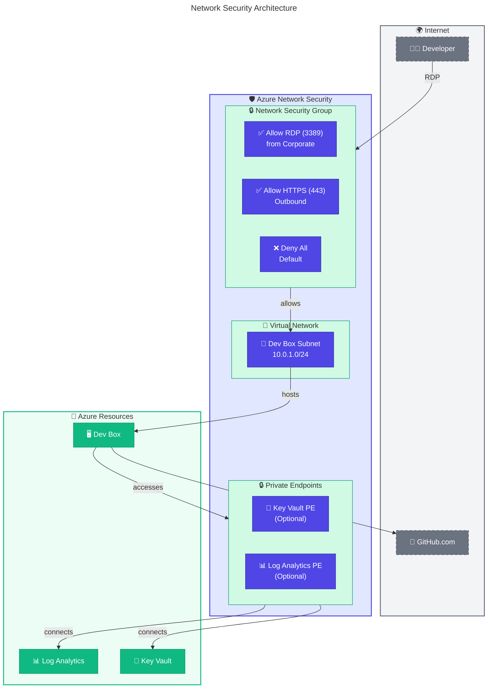
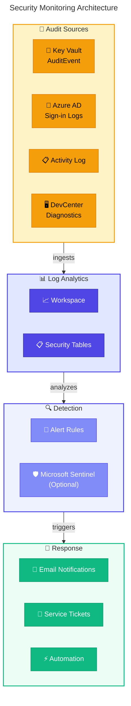

# 🔒 Security Architecture

> **DevExp-DevBox Landing Zone Accelerator**

> [!NOTE]
> **Target Audience:** Security Architects, Compliance Officers, Platform Engineers  
> **Reading Time:** ~25 minutes

<details>
<summary>📍 Navigation</summary>

| Previous | Index | Next |
|:---------|:-----:|-----:|
| [← Technology Architecture](04-technology-architecture.md) | [Architecture Index](../README.md) | [Deployment Architecture →](07-deployment-architecture.md) |

</details>

| Property | Value |
|:---------|:------|
| **Version** | 1.0.0 |
| **Last Updated** | 2026-01-23 |
| **Author** | DevExp Team |
| **Status** | Published |

---

## 📑 Table of Contents

- [📊 Security Overview](#-security-overview)
- [⚠️ Threat Model](#%EF%B8%8F-threat-model)
- [🔑 Identity & Access Management](#-identity--access-management)
- [👥 RBAC Hierarchy](#-rbac-hierarchy)
- [🔐 Secrets Management](#-secrets-management)
- [🌐 Network Security](#-network-security)
- [🛡️ Data Protection](#%EF%B8%8F-data-protection)
- [✅ Compliance & Governance](#-compliance--governance)
- [📶 Security Operations](#-security-operations)
- [📋 Security Controls Matrix](#-security-controls-matrix)
- [🔗 References](#-references)

---

## 📊 Security Overview

The DevExp-DevBox accelerator implements defense-in-depth security principles across all layers: identity, network, data, and application. The security architecture aligns with Azure Security Benchmark and Zero Trust principles.

### Security Architecture Overview

```mermaid
---
title: Security Architecture Overview
---
flowchart TB
    %% ===== EXTERNAL BOUNDARY =====
    subgraph External["🌍 External Boundary"]
        DEV["👨‍💻 Developers"]
        GH["🐙 GitHub"]
        ADO["🔷 Azure DevOps"]
    end
    
    %% ===== IDENTITY LAYER =====
    subgraph Identity["🔐 Identity Layer"]
        AAD["🏢 Microsoft Entra ID"]
        MI["👤 Managed Identities"]
        OIDC["🔗 OIDC Federation"]
    end
    
    %% ===== ACCESS CONTROL LAYER =====
    subgraph Access["🛡️ Access Control Layer"]
        RBAC["📋 Azure RBAC"]
        KVA["🔑 Key Vault Access"]
        DCA["🖥️ DevCenter Access"]
    end
    
    %% ===== NETWORK LAYER =====
    subgraph Network["🌐 Network Layer"]
        NSG["🛡️ Network Security Groups"]
        VNET["🔗 Virtual Network"]
        PE["🔒 Private Endpoints"]
    end
    
    %% ===== DATA LAYER =====
    subgraph Data["💾 Data Layer"]
        KV["🔑 Key Vault<br/>(Secrets)"]
        LA["📊 Log Analytics<br/>(Telemetry)"]
        DC["🖥️ DevCenter<br/>(Workloads)"]
    end
    
    %% ===== CONNECTIONS =====
    External -->|authenticates| Identity
    Identity -->|authorizes| Access
    Access -->|filters| Network
    Network -->|protects| Data
    
    %% ===== STYLES =====
    classDef failed fill:#F44336,stroke:#C62828,color:#FFFFFF
    classDef trigger fill:#818CF8,stroke:#4F46E5,color:#FFFFFF
    classDef datastore fill:#F59E0B,stroke:#D97706,color:#000000
    classDef primary fill:#4F46E5,stroke:#3730A3,color:#FFFFFF
    classDef secondary fill:#10B981,stroke:#059669,color:#FFFFFF
    
    class DEV,GH,ADO failed
    class AAD,MI,OIDC trigger
    class RBAC,KVA,DCA datastore
    class NSG,VNET,PE primary
    class KV,LA,DC secondary
    
    style External fill:#FEE2E2,stroke:#F44336,stroke-width:2px
    style Identity fill:#EEF2FF,stroke:#4F46E5,stroke-width:2px
    style Access fill:#FEF3C7,stroke:#F59E0B,stroke-width:2px
    style Network fill:#E0E7FF,stroke:#4F46E5,stroke-width:2px
    style Data fill:#ECFDF5,stroke:#10B981,stroke-width:2px
```



### Security Principles Applied

| Principle | Implementation |
|-----------|----------------|
| **Least Privilege** | RBAC with minimum required permissions |
| **Defense in Depth** | Multiple security layers |
| **Zero Trust** | Verify explicitly, least privilege access |
| **Separation of Duties** | Distinct landing zones with isolated permissions |
| **Secure by Default** | RBAC authorization, purge protection enabled |
| **Fail Secure** | Soft delete, purge protection on secrets |

---

[⬆️ Back to Top](#-table-of-contents)

---

## ⚠️ Threat Model

### STRIDE Analysis



### Threat Categories and Mitigations

| STRIDE Category | Threat | Risk Level | Mitigation |
|-----------------|--------|------------|------------|
| **Spoofing** | Unauthorized access to DevCenter | High | OIDC federation, no stored secrets |
| **Spoofing** | Impersonation of service principal | High | Managed Identity, certificate auth |
| **Tampering** | Modification of Bicep templates | Medium | Git branch protection, code review |
| **Tampering** | Alteration of Key Vault secrets | High | RBAC, soft delete, purge protection |
| **Repudiation** | Denial of resource changes | Medium | Activity logs, diagnostic settings |
| **Info Disclosure** | PAT token exposure | Critical | Key Vault storage, audit logging |
| **Info Disclosure** | Log data leakage | Medium | RBAC on Log Analytics, retention |
| **DoS** | Resource exhaustion | Medium | Quotas, throttling, monitoring |
| **DoS** | Pipeline disruption | Medium | Retry logic, multiple regions |
| **EoP** | Excessive RBAC permissions | High | Least privilege, regular review |
| **EoP** | DevCenter admin escalation | High | Separate admin/user roles |

### Attack Surface Diagram



---

[⬆️ Back to Top](#-table-of-contents)

---

## 🔑 Identity & Access Management

### Identity Types



### Identity Configuration (from devcenter.yaml)

```yaml
identity:
  type: "SystemAssigned"
  roleAssignments:
    devCenter:
      - id: "b24988ac-6180-42a0-ab88-20f7382dd24c"
        name: "Contributor"
        scope: "Subscription"
      - id: "00482a5a-887f-4fb3-b363-3b7fe8e74483"
        name: "Key Vault Administrator"
        scope: "Subscription"
      - id: "4633458b-17de-408a-b874-0445c86b69e6"
        name: "Key Vault Secrets User"
        scope: "Subscription"
```

### Authentication Methods

| Method | Use Case | Security Level |
|--------|----------|----------------|
| **OIDC Federation** | GitHub Actions → Azure | High (no stored secrets) |
| **SystemAssigned MI** | DevCenter → Key Vault | High (automatic rotation) |
| **Azure AD Groups** | User → DevCenter | High (centralized) |
| **PAT Tokens** | DevCenter → GitHub | Medium (stored in Key Vault) |

---

[⬆️ Back to Top](#-table-of-contents)

---

## 👥 RBAC Hierarchy

### Role Assignment Model



### Built-in Roles Used

| Role Name | Role ID | Scope | Assigned To | Purpose |
|-----------|---------|-------|-------------|---------|
| Contributor | `b24988ac-6180-42a0-ab88-20f7382dd24c` | Subscription | DevCenter MI | Resource management |
| Key Vault Administrator | `00482a5a-887f-4fb3-b363-3b7fe8e74483` | Subscription | DevCenter MI | Vault management |
| Key Vault Secrets User | `4633458b-17de-408a-b874-0445c86b69e6` | Subscription | DevCenter MI | Secret read access |
| DevCenter Project Admin | `331c37c6-af14-46d9-b9f4-e1909e1b95a0` | ResourceGroup | Platform Team | Project administration |
| Dev Box User | `45d50f46-0b78-4001-a660-4198cbe8cd05` | Project | Developers | Dev Box access |
| Deployment Environments User | `18e40d4e-8d2e-438d-97e1-9528336e149c` | Project | Developers | Environment access |

### Organizational Role Types

From `devcenter.yaml`:

```yaml
orgRoleTypes:
  - type: DevManager
    azureADGroupId: "<group-id>"
    azureADGroupName: "Platform Engineering Team"
    azureRBACRoles:
      - name: "DevCenter Project Admin"
        id: "331c37c6-af14-46d9-b9f4-e1909e1b95a0"
        scope: ResourceGroup
```

### Role Assignment Flow



---

[⬆️ Back to Top](#-table-of-contents)

---

## 🔐 Secrets Management

### Secrets Architecture



### Key Vault Configuration

```yaml
# From security.yaml
keyVault:
  name: contoso
  enablePurgeProtection: true
  enableSoftDelete: true
  softDeleteRetentionInDays: 7
  enableRbacAuthorization: true
```

### Secret Lifecycle

| Phase | Action | Security Control |
|-------|--------|------------------|
| **Creation** | Store PAT in Key Vault | RBAC, encryption at rest |
| **Access** | DevCenter reads via MI | Key Vault Secrets User role |
| **Rotation** | Update secret value | Versioned, old versions retained |
| **Deletion** | Soft delete | Recoverable for retention period |
| **Purge** | Permanent deletion | Purge protection delay |

### Secret Access Flow



---

[⬆️ Back to Top](#-table-of-contents)

---

## 🌐 Network Security

### Network Security Architecture



### Network Configuration Options

| Option | Security Level | Configuration |
|--------|---------------|---------------|
| **Microsoft-Hosted** | Medium | No VNet, default Azure network |
| **Managed VNet** | High | Azure-managed VNet with NSG |
| **Unmanaged VNet** | Highest | Customer VNet with full control |

### Network Controls (from devcenter.yaml)

```yaml
network:
  name: eShop
  create: true
  virtualNetworkType: Managed
  addressPrefixes:
    - "10.0.0.0/16"
  subnets:
    - name: eShop-subnet
      properties:
        addressPrefix: 10.0.1.0/24
```

---

[⬆️ Back to Top](#-table-of-contents)

---

## 🛡️ Data Protection

### Encryption Model

| Data State | Encryption | Key Management |
|------------|------------|----------------|
| **At Rest (Key Vault)** | AES-256 | Microsoft-managed |
| **At Rest (Log Analytics)** | AES-256 | Microsoft-managed |
| **At Rest (Dev Box)** | BitLocker | Customer option |
| **In Transit** | TLS 1.2+ | Automatic |
| **Secrets** | AES-256 + HSM | Key Vault |

### Data Classification and Handling

| Data Type | Classification | Handling Requirements |
|-----------|---------------|----------------------|
| PAT Tokens | Confidential | Key Vault only, audit access |
| Configuration | Internal | Git, no secrets in YAML |
| Telemetry | Internal | Log Analytics, 90-day retention |
| Source Code | Confidential | GitHub, branch protection |
| Dev Box Data | Variable | User responsibility |

---

[⬆️ Back to Top](#-table-of-contents)

---

## ✅ Compliance & Governance

### Tagging for Governance

All resources include mandatory tags for compliance:

```yaml
tags:
  environment: dev
  division: Platforms
  team: DevExP
  project: Contoso-DevExp-DevBox
  costCenter: IT
  owner: Contoso
  landingZone: Workload
```

### Compliance Controls

| Control | Implementation | Evidence |
|---------|---------------|----------|
| **Access Control** | Azure RBAC | Role assignments |
| **Audit Logging** | Diagnostic Settings | Activity logs |
| **Data Encryption** | Key Vault, TLS | Configuration |
| **Network Security** | NSG, VNet | Network rules |
| **Secret Management** | Key Vault + RBAC | Vault policies |
| **Change Management** | Git + CI/CD | Commit history |

### Regulatory Alignment

| Framework | Relevant Controls |
|-----------|-------------------|
| Azure Security Benchmark | NS-1, NS-2, IM-1, IM-2, PA-1, PA-7, DP-3, DP-5 |
| CIS Azure Benchmark | 1.x (IAM), 4.x (Storage), 8.x (Key Vault) |
| SOC 2 | CC6 (Logical Access), CC7 (System Operations) |

---

[⬆️ Back to Top](#-table-of-contents)

---

## 📶 Security Operations

### Security Monitoring



### Recommended Alerts

| Alert | Condition | Severity |
|-------|-----------|----------|
| Key Vault Secret Access | Unexpected principal access | High |
| Failed RBAC Assignment | Permission denied | Medium |
| DevCenter Admin Change | Role assignment modification | High |
| Network Rule Change | NSG modification | Medium |
| Resource Deletion | Critical resource deleted | High |

### Incident Response

| Phase | Actions |
|-------|---------|
| **Detection** | Alert triggered, Log Analytics query |
| **Analysis** | Review activity logs, identify scope |
| **Containment** | Revoke access, rotate secrets |
| **Eradication** | Remove threat, patch vulnerability |
| **Recovery** | Restore service, verify security |
| **Lessons Learned** | Update runbooks, improve controls |

---

[⬆️ Back to Top](#-table-of-contents)

---

## 📋 Security Controls Matrix

### Control Implementation Summary

| Domain | Control | Implementation | Status |
|--------|---------|----------------|--------|
| **Identity** | | | |
| | Authentication | OIDC Federation, Managed Identity | ✅ Implemented |
| | Authorization | Azure RBAC | ✅ Implemented |
| | MFA | Azure AD Conditional Access | ⚙️ Configure |
| | PIM | Privileged Identity Management | ⚙️ Configure |
| **Network** | | | |
| | Segmentation | Virtual Network, Subnets | ✅ Implemented |
| | Filtering | NSG Rules | ✅ Implemented |
| | Private Access | Private Endpoints | ⚙️ Optional |
| **Data** | | | |
| | Encryption at Rest | Key Vault, Storage | ✅ Implemented |
| | Encryption in Transit | TLS 1.2 | ✅ Implemented |
| | Key Management | Key Vault | ✅ Implemented |
| **Logging** | | | |
| | Audit Logs | Activity Log | ✅ Implemented |
| | Diagnostic Logs | Log Analytics | ✅ Implemented |
| | Retention | 90 days default | ✅ Implemented |
| **Governance** | | | |
| | Tagging | Mandatory tags | ✅ Implemented |
| | Policy | Azure Policy | ⚙️ Configure |
| | Compliance | ASB alignment | ✅ Documented |

### Legend

| Symbol | Meaning |
|--------|---------|
| ✅ | Fully implemented |
| ⚙️ | Requires additional configuration |
| ❌ | Not implemented |

---

[⬆️ Back to Top](#-table-of-contents)

---

## 🔗 References

### 📚 Internal References

- [Business Architecture](01-business-architecture.md)
- [Data Architecture](02-data-architecture.md)
- [Application Architecture](03-application-architecture.md)
- [Technology Architecture](04-technology-architecture.md)

### 🌐 External References

- [Azure Security Benchmark](https://learn.microsoft.com/en-us/security/benchmark/azure/overview)
- [Azure Key Vault Security](https://learn.microsoft.com/en-us/azure/key-vault/general/security-features)
- [Azure DevCenter Security](https://learn.microsoft.com/en-us/azure/dev-box/concept-dev-box-security)
- [GitHub Actions Security](https://docs.github.com/en/actions/security-guides/security-hardening-for-github-actions)
- [Zero Trust Architecture](https://learn.microsoft.com/en-us/security/zero-trust/)
- [STRIDE Threat Model](https://learn.microsoft.com/en-us/azure/security/develop/threat-modeling-tool-threats)

---

<div align="center">

[← Technology Architecture](04-technology-architecture.md) | [⬆️ Back to Top](#-table-of-contents) | [Deployment Architecture →](07-deployment-architecture.md)

*DevExp-DevBox Landing Zone Accelerator • Security Architecture*

</div>
