# 🔒 Security Architecture

> **DevExp-DevBox Landing Zone Accelerator**

> [!NOTE]
> **Target Audience:** Security Architects, Compliance Officers, Platform Engineers  
> **Reading Time:** ~25 minutes

<details>
<summary>📍 Navigation</summary>

| Previous | Index | Next |
|:---------|:-----:|-----:|
| [← Technology Architecture](04-technology-architecture.md) | [Architecture Index](../README.md) | [Deployment Architecture →](07-deployment-architecture.md) |

</details>

| Property | Value |
|:---------|:------|
| **Version** | 1.0.0 |
| **Last Updated** | 2026-01-23 |
| **Author** | DevExp Team |
| **Status** | Published |

---

## 📑 Table of Contents

- [📊 Security Overview](#security-overview)
- [⚠️ Threat Model](#threat-model)
- [🔑 Identity & Access Management](#identity--access-management)
- [👥 RBAC Hierarchy](#rbac-hierarchy)
- [🔐 Secrets Management](#secrets-management)
- [🌐 Network Security](#network-security)
- [🛡️ Data Protection](#data-protection)
- [✅ Compliance & Governance](#compliance--governance)
- [📶 Security Operations](#security-operations)
- [📋 Security Controls Matrix](#security-controls-matrix)
- [🔗 References](#references)

---

## 📊 Security Overview

The DevExp-DevBox accelerator implements defense-in-depth security principles across all layers: identity, network, data, and application. The security architecture aligns with Azure Security Benchmark and Zero Trust principles.

### Security Architecture Overview

```mermaid
---
title: Security Architecture Overview
---
flowchart TB
    %% ===== EXTERNAL BOUNDARY =====
    subgraph External["🌍 External Boundary"]
        DEV["👨‍💻 Developers"]
        GH["🐙 GitHub"]
        ADO["🔷 Azure DevOps"]
    end
    
    %% ===== IDENTITY LAYER =====
    subgraph Identity["🔐 Identity Layer"]
        AAD["🏢 Microsoft Entra ID"]
        MI["👤 Managed Identities"]
        OIDC["🔗 OIDC Federation"]
    end
    
    %% ===== ACCESS CONTROL LAYER =====
    subgraph Access["🛡️ Access Control Layer"]
        RBAC["📋 Azure RBAC"]
        KVA["🔑 Key Vault Access"]
        DCA["🖥️ DevCenter Access"]
    end
    
    %% ===== NETWORK LAYER =====
    subgraph Network["🌐 Network Layer"]
        NSG["🛡️ Network Security Groups"]
        VNET["🔗 Virtual Network"]
        PE["🔒 Private Endpoints"]
    end
    
    %% ===== DATA LAYER =====
    subgraph Data["💾 Data Layer"]
        KV["🔑 Key Vault<br/>(Secrets)"]
        LA["📊 Log Analytics<br/>(Telemetry)"]
        DC["🖥️ DevCenter<br/>(Workloads)"]
    end
    
    %% ===== CONNECTIONS =====
    External -->|authenticates| Identity
    Identity -->|authorizes| Access
    Access -->|filters| Network
    Network -->|protects| Data
    
    %% ===== STYLES =====
    classDef failed fill:#F44336,stroke:#C62828,color:#FFFFFF
    classDef trigger fill:#818CF8,stroke:#4F46E5,color:#FFFFFF
    classDef datastore fill:#F59E0B,stroke:#D97706,color:#000000
    classDef primary fill:#4F46E5,stroke:#3730A3,color:#FFFFFF
    classDef secondary fill:#10B981,stroke:#059669,color:#FFFFFF
    
    class DEV,GH,ADO failed
    class AAD,MI,OIDC trigger
    class RBAC,KVA,DCA datastore
    class NSG,VNET,PE primary
    class KV,LA,DC secondary
    
    style External fill:#FEE2E2,stroke:#F44336,stroke-width:2px
    style Identity fill:#EEF2FF,stroke:#4F46E5,stroke-width:2px
    style Access fill:#FEF3C7,stroke:#F59E0B,stroke-width:2px
    style Network fill:#E0E7FF,stroke:#4F46E5,stroke-width:2px
    style Data fill:#ECFDF5,stroke:#10B981,stroke-width:2px
```



### Security Principles Applied

| Principle | Implementation |
|-----------|----------------|
| **Least Privilege** | RBAC with minimum required permissions |
| **Defense in Depth** | Multiple security layers |
| **Zero Trust** | Verify explicitly, least privilege access |
| **Separation of Duties** | Distinct landing zones with isolated permissions |
| **Secure by Default** | RBAC authorization, purge protection enabled |
| **Fail Secure** | Soft delete, purge protection on secrets |

---

[⬆️ Back to Top](#-table-of-contents)

---

## ⚠️ Threat Model

### STRIDE Analysis

```mermaid
---
title: STRIDE Threat Analysis
---
flowchart TB
    %% ===== PROTECTED ASSETS =====
    subgraph Assets["🎯 Protected Assets"]
        A1["🔑 GitHub PAT Tokens"]
        A2["🔐 Azure Credentials"]
        A3["🖥️ Dev Box VMs"]
        A4["📂 Source Code"]
        A5["⚙️ Configuration Data"]
    end
    
    %% ===== STRIDE THREATS =====
    subgraph Threats["⚠️ STRIDE Threats"]
        T1["👤 Spoofing"]
        T2["✏️ Tampering"]
        T3["❌ Repudiation"]
        T4["👁️ Information Disclosure"]
        T5["🚫 Denial of Service"]
        T6["⬆️ Elevation of Privilege"]
    end
    
    %% ===== SECURITY CONTROLS =====
    subgraph Mitigations["🛡️ Security Controls"]
        M1["🔐 OIDC / Managed Identity"]
        M2["📋 RBAC / Immutable Logs"]
        M3["📝 Activity Logs"]
        M4["🔑 Key Vault / Encryption"]
        M5["⚡ Throttling / Quotas"]
        M6["👑 PIM / JIT Access"]
    end
    
    %% ===== CONNECTIONS =====
    T1 -->|mitigated by| M1
    T2 -->|mitigated by| M2
    T3 -->|mitigated by| M3
    T4 -->|mitigated by| M4
    T5 -->|mitigated by| M5
    T6 -->|mitigated by| M6
    
    %% ===== STYLES =====
    classDef failed fill:#F44336,stroke:#C62828,color:#FFFFFF
    classDef datastore fill:#F59E0B,stroke:#D97706,color:#000000
    classDef secondary fill:#10B981,stroke:#059669,color:#FFFFFF
    
    class A1,A2,A3,A4,A5 failed
    class T1,T2,T3,T4,T5,T6 datastore
    class M1,M2,M3,M4,M5,M6 secondary
    
    style Assets fill:#FEE2E2,stroke:#F44336,stroke-width:2px
    style Threats fill:#FEF3C7,stroke:#F59E0B,stroke-width:2px
    style Mitigations fill:#ECFDF5,stroke:#10B981,stroke-width:2px
```



### Threat Categories and Mitigations

| STRIDE Category | Threat | Risk Level | Mitigation |
|-----------------|--------|------------|------------|
| **Spoofing** | Unauthorized access to DevCenter | High | OIDC federation, no stored secrets |
| **Spoofing** | Impersonation of service principal | High | Managed Identity, certificate auth |
| **Tampering** | Modification of Bicep templates | Medium | Git branch protection, code review |
| **Tampering** | Alteration of Key Vault secrets | High | RBAC, soft delete, purge protection |
| **Repudiation** | Denial of resource changes | Medium | Activity logs, diagnostic settings |
| **Info Disclosure** | PAT token exposure | Critical | Key Vault storage, audit logging |
| **Info Disclosure** | Log data leakage | Medium | RBAC on Log Analytics, retention |
| **DoS** | Resource exhaustion | Medium | Quotas, throttling, monitoring |
| **DoS** | Pipeline disruption | Medium | Retry logic, multiple regions |
| **EoP** | Excessive RBAC permissions | High | Least privilege, regular review |
| **EoP** | DevCenter admin escalation | High | Separate admin/user roles |

### Attack Surface Diagram

```mermaid
---
title: Attack Surface Diagram
---
flowchart LR
    %% ===== EXTERNAL ATTACK SURFACE =====
    subgraph External["🌍 External Attack Surface"]
        A1["🐙 GitHub Repository"]
        A2["🔄 GitHub Actions"]
        A3["👨‍💻 Developer Endpoints"]
    end
    
    %% ===== INTERNAL ATTACK SURFACE =====
    subgraph Internal["🏢 Internal Attack Surface"]
        B1["🌐 Azure Portal"]
        B2["🔑 Key Vault API"]
        B3["🖥️ DevCenter API"]
        B4["🖥️ Dev Box RDP"]
    end
    
    %% ===== DATA AT RISK =====
    subgraph Data["🎯 Data at Risk"]
        C1["🔑 PAT Tokens"]
        C2["📂 Source Code"]
        C3["💾 Dev Box Data"]
    end
    
    %% ===== CONNECTIONS =====
    A1 -->|targets| B1
    A2 -->|targets| B2
    A3 -->|targets| B4
    
    B1 -->|accesses| C1
    B2 -->|accesses| C1
    B3 -->|accesses| C2
    B4 -->|accesses| C3
    
    %% ===== STYLES =====
    classDef failed fill:#F44336,stroke:#C62828,color:#FFFFFF
    classDef datastore fill:#F59E0B,stroke:#D97706,color:#000000
    classDef trigger fill:#818CF8,stroke:#4F46E5,color:#FFFFFF
    
    class A1,A2,A3 failed
    class B1,B2,B3,B4 datastore
    class C1,C2,C3 trigger
    
    style External fill:#FEE2E2,stroke:#F44336,stroke-width:2px
    style Internal fill:#FEF3C7,stroke:#F59E0B,stroke-width:2px
    style Data fill:#EEF2FF,stroke:#4F46E5,stroke-width:2px
```



---

[⬆️ Back to Top](#-table-of-contents)

---

## 🔑 Identity & Access Management

### Identity Types

```mermaid
---
title: Identity Types
---
flowchart TB
    %% ===== USER IDENTITIES =====
    subgraph UserIdentities["👥 User Identities"]
        AAD_USER["👤 Azure AD Users"]
        AAD_GROUP["👥 Azure AD Groups"]
    end
    
    %% ===== SERVICE IDENTITIES =====
    subgraph ServiceIdentities["⚙️ Service Identities"]
        MI_SYS["🔐 SystemAssigned<br/>Managed Identity"]
        MI_USER["👤 UserAssigned<br/>Managed Identity"]
        SP["🔗 Service Principal<br/>(OIDC Federation)"]
    end
    
    %% ===== RESOURCES =====
    subgraph Resources["🏢 Resources"]
        DC["🖥️ DevCenter"]
        PROJ["📁 Projects"]
        KV["🔑 Key Vault"]
    end
    
    %% ===== CONNECTIONS =====
    AAD_USER -->|member of| AAD_GROUP
    AAD_GROUP -->|RBAC| DC
    AAD_GROUP -->|RBAC| PROJ
    
    MI_SYS -->|assigned to| DC
    MI_SYS -->|assigned to| PROJ
    
    SP -->|GitHub Actions| Resources
    MI_SYS -->|DevCenter → Key Vault| KV
    
    %% ===== STYLES =====
    classDef primary fill:#4F46E5,stroke:#3730A3,color:#FFFFFF
    classDef secondary fill:#10B981,stroke:#059669,color:#FFFFFF
    classDef datastore fill:#F59E0B,stroke:#D97706,color:#000000
    
    class AAD_USER,AAD_GROUP primary
    class MI_SYS,MI_USER,SP secondary
    class DC,PROJ,KV datastore
    
    style UserIdentities fill:#E0E7FF,stroke:#4F46E5,stroke-width:2px
    style ServiceIdentities fill:#ECFDF5,stroke:#10B981,stroke-width:2px
    style Resources fill:#FEF3C7,stroke:#F59E0B,stroke-width:2px
```



### Identity Configuration (from devcenter.yaml)

```yaml
identity:
  type: "SystemAssigned"
  roleAssignments:
    devCenter:
      - id: "b24988ac-6180-42a0-ab88-20f7382dd24c"
        name: "Contributor"
        scope: "Subscription"
      - id: "00482a5a-887f-4fb3-b363-3b7fe8e74483"
        name: "Key Vault Administrator"
        scope: "Subscription"
      - id: "4633458b-17de-408a-b874-0445c86b69e6"
        name: "Key Vault Secrets User"
        scope: "Subscription"
```

### Authentication Methods

| Method | Use Case | Security Level |
|--------|----------|----------------|
| **OIDC Federation** | GitHub Actions → Azure | High (no stored secrets) |
| **SystemAssigned MI** | DevCenter → Key Vault | High (automatic rotation) |
| **Azure AD Groups** | User → DevCenter | High (centralized) |
| **PAT Tokens** | DevCenter → GitHub | Medium (stored in Key Vault) |

---

[⬆️ Back to Top](#-table-of-contents)

---

## 👥 RBAC Hierarchy

### Role Assignment Model

```mermaid
---
title: RBAC Role Assignment Model
---
flowchart TB
    %% ===== SUBSCRIPTION SCOPE =====
    subgraph Subscription["📋 Subscription Scope"]
        R1["🔧 Contributor"]
        R2["🔑 Key Vault Administrator"]
        R3["🔐 Key Vault Secrets User"]
    end
    
    %% ===== RESOURCE GROUP SCOPE =====
    subgraph ResourceGroup["📁 Resource Group Scope"]
        R4["🖥️ DevCenter Project Admin"]
        R5["📊 Log Analytics Contributor"]
    end
    
    %% ===== RESOURCE SCOPE =====
    subgraph Resource["🎯 Resource Scope"]
        R6["💻 Dev Box User"]
        R7["🌍 Deployment Environments User"]
    end
    
    %% ===== PRINCIPALS =====
    subgraph Principals["👥 Principals"]
        P1["🔐 DevCenter MI"]
        P2["👷 Platform Engineering Team"]
        P3["👨‍💻 Project Developers"]
    end
    
    %% ===== CONNECTIONS =====
    P1 -->|assigned| R1
    P1 -->|assigned| R2
    P1 -->|assigned| R3
    
    P2 -->|assigned| R4
    P2 -->|assigned| R5
    
    P3 -->|assigned| R6
    P3 -->|assigned| R7
    
    %% ===== STYLES =====
    classDef trigger fill:#818CF8,stroke:#4F46E5,color:#FFFFFF
    classDef primary fill:#4F46E5,stroke:#3730A3,color:#FFFFFF
    classDef secondary fill:#10B981,stroke:#059669,color:#FFFFFF
    
    class R1,R2,R3 trigger
    class R4,R5 primary
    class R6,R7 secondary
    class P1,P2,P3 secondary
    
    style Subscription fill:#EEF2FF,stroke:#4F46E5,stroke-width:2px
    style ResourceGroup fill:#E0E7FF,stroke:#4F46E5,stroke-width:2px
    style Resource fill:#ECFDF5,stroke:#10B981,stroke-width:2px
    style Principals fill:#ECFDF5,stroke:#10B981,stroke-width:2px
```



### Built-in Roles Used

| Role Name | Role ID | Scope | Assigned To | Purpose |
|-----------|---------|-------|-------------|---------|
| Contributor | `b24988ac-6180-42a0-ab88-20f7382dd24c` | Subscription | DevCenter MI | Resource management |
| Key Vault Administrator | `00482a5a-887f-4fb3-b363-3b7fe8e74483` | Subscription | DevCenter MI | Vault management |
| Key Vault Secrets User | `4633458b-17de-408a-b874-0445c86b69e6` | Subscription | DevCenter MI | Secret read access |
| DevCenter Project Admin | `331c37c6-af14-46d9-b9f4-e1909e1b95a0` | ResourceGroup | Platform Team | Project administration |
| Dev Box User | `45d50f46-0b78-4001-a660-4198cbe8cd05` | Project | Developers | Dev Box access |
| Deployment Environments User | `18e40d4e-8d2e-438d-97e1-9528336e149c` | Project | Developers | Environment access |

### Organizational Role Types

From `devcenter.yaml`:

```yaml
orgRoleTypes:
  - type: DevManager
    azureADGroupId: "<group-id>"
    azureADGroupName: "Platform Engineering Team"
    azureRBACRoles:
      - name: "DevCenter Project Admin"
        id: "331c37c6-af14-46d9-b9f4-e1909e1b95a0"
        scope: ResourceGroup
```

### Role Assignment Flow

```mermaid
---
title: Role Assignment Flow
---
sequenceDiagram
    participant YAML as 📄 devcenter.yaml
    participant MAIN as 📄 main.bicep
    participant DC as 🖥️ devCenter.bicep
    participant RA as 🔐 roleAssignment.bicep
    participant ARM as ☁️ Azure Resource Manager
    participant AAD as 🏢 Microsoft Entra ID
    
    YAML->>MAIN: Load role configuration
    MAIN->>DC: Pass roleAssignments
    DC->>RA: Deploy role assignment module
    RA->>ARM: Create roleAssignment resource
    ARM->>AAD: Validate principal exists
    AAD-->>ARM: Principal validated
    ARM-->>RA: Role assigned
```



---

[⬆️ Back to Top](#-table-of-contents)

---

## 🔐 Secrets Management

### Secrets Architecture


### Key Vault Configuration

```yaml
# From security.yaml
keyVault:
  name: contoso
  enablePurgeProtection: true
  enableSoftDelete: true
  softDeleteRetentionInDays: 7
  enableRbacAuthorization: true
```

### Secret Lifecycle

| Phase | Action | Security Control |
|-------|--------|------------------|
| **Creation** | Store PAT in Key Vault | RBAC, encryption at rest |
| **Access** | DevCenter reads via MI | Key Vault Secrets User role |
| **Rotation** | Update secret value | Versioned, old versions retained |
| **Deletion** | Soft delete | Recoverable for retention period |
| **Purge** | Permanent deletion | Purge protection delay |

### Secret Access Flow


---

[⬆️ Back to Top](#-table-of-contents)

---

## 🌐 Network Security

### Network Security Architecture


### Network Configuration Options

| Option | Security Level | Configuration |
|--------|---------------|---------------|
| **Microsoft-Hosted** | Medium | No VNet, default Azure network |
| **Managed VNet** | High | Azure-managed VNet with NSG |
| **Unmanaged VNet** | Highest | Customer VNet with full control |

### Network Controls (from devcenter.yaml)

```yaml
network:
  name: eShop
  create: true
  virtualNetworkType: Managed
  addressPrefixes:
    - "10.0.0.0/16"
  subnets:
    - name: eShop-subnet
      properties:
        addressPrefix: 10.0.1.0/24
```

---

[⬆️ Back to Top](#-table-of-contents)

---

## 🛡️ Data Protection

### Encryption Model

| Data State | Encryption | Key Management |
|------------|------------|----------------|
| **At Rest (Key Vault)** | AES-256 | Microsoft-managed |
| **At Rest (Log Analytics)** | AES-256 | Microsoft-managed |
| **At Rest (Dev Box)** | BitLocker | Customer option |
| **In Transit** | TLS 1.2+ | Automatic |
| **Secrets** | AES-256 + HSM | Key Vault |

### Data Classification and Handling

| Data Type | Classification | Handling Requirements |
|-----------|---------------|----------------------|
| PAT Tokens | Confidential | Key Vault only, audit access |
| Configuration | Internal | Git, no secrets in YAML |
| Telemetry | Internal | Log Analytics, 90-day retention |
| Source Code | Confidential | GitHub, branch protection |
| Dev Box Data | Variable | User responsibility |

---

[⬆️ Back to Top](#-table-of-contents)

---

## ✅ Compliance & Governance

### Tagging for Governance

All resources include mandatory tags for compliance:

```yaml
tags:
  environment: dev
  division: Platforms
  team: DevExP
  project: Contoso-DevExp-DevBox
  costCenter: IT
  owner: Contoso
  landingZone: Workload
```

### Compliance Controls

| Control | Implementation | Evidence |
|---------|---------------|----------|
| **Access Control** | Azure RBAC | Role assignments |
| **Audit Logging** | Diagnostic Settings | Activity logs |
| **Data Encryption** | Key Vault, TLS | Configuration |
| **Network Security** | NSG, VNet | Network rules |
| **Secret Management** | Key Vault + RBAC | Vault policies |
| **Change Management** | Git + CI/CD | Commit history |

### Regulatory Alignment

| Framework | Relevant Controls |
|-----------|-------------------|
| Azure Security Benchmark | NS-1, NS-2, IM-1, IM-2, PA-1, PA-7, DP-3, DP-5 |
| CIS Azure Benchmark | 1.x (IAM), 4.x (Storage), 8.x (Key Vault) |
| SOC 2 | CC6 (Logical Access), CC7 (System Operations) |

---

[⬆️ Back to Top](#-table-of-contents)

---

## 📶 Security Operations

### Security Monitoring


### Recommended Alerts

| Alert | Condition | Severity |
|-------|-----------|----------|
| Key Vault Secret Access | Unexpected principal access | High |
| Failed RBAC Assignment | Permission denied | Medium |
| DevCenter Admin Change | Role assignment modification | High |
| Network Rule Change | NSG modification | Medium |
| Resource Deletion | Critical resource deleted | High |

### Incident Response

| Phase | Actions |
|-------|---------|
| **Detection** | Alert triggered, Log Analytics query |
| **Analysis** | Review activity logs, identify scope |
| **Containment** | Revoke access, rotate secrets |
| **Eradication** | Remove threat, patch vulnerability |
| **Recovery** | Restore service, verify security |
| **Lessons Learned** | Update runbooks, improve controls |

---

[⬆️ Back to Top](#-table-of-contents)

---

## 📋 Security Controls Matrix

### Control Implementation Summary

| Domain | Control | Implementation | Status |
|--------|---------|----------------|--------|
| **Identity** | | | |
| | Authentication | OIDC Federation, Managed Identity | ✅ Implemented |
| | Authorization | Azure RBAC | ✅ Implemented |
| | MFA | Azure AD Conditional Access | ⚙️ Configure |
| | PIM | Privileged Identity Management | ⚙️ Configure |
| **Network** | | | |
| | Segmentation | Virtual Network, Subnets | ✅ Implemented |
| | Filtering | NSG Rules | ✅ Implemented |
| | Private Access | Private Endpoints | ⚙️ Optional |
| **Data** | | | |
| | Encryption at Rest | Key Vault, Storage | ✅ Implemented |
| | Encryption in Transit | TLS 1.2 | ✅ Implemented |
| | Key Management | Key Vault | ✅ Implemented |
| **Logging** | | | |
| | Audit Logs | Activity Log | ✅ Implemented |
| | Diagnostic Logs | Log Analytics | ✅ Implemented |
| | Retention | 90 days default | ✅ Implemented |
| **Governance** | | | |
| | Tagging | Mandatory tags | ✅ Implemented |
| | Policy | Azure Policy | ⚙️ Configure |
| | Compliance | ASB alignment | ✅ Documented |

### Legend

| Symbol | Meaning |
|--------|---------|
| ✅ | Fully implemented |
| ⚙️ | Requires additional configuration |
| ❌ | Not implemented |

---

[⬆️ Back to Top](#-table-of-contents)

---

## 🔗 References

### 📚 Internal References

- [Business Architecture](01-business-architecture.md)
- [Data Architecture](02-data-architecture.md)
- [Application Architecture](03-application-architecture.md)
- [Technology Architecture](04-technology-architecture.md)

### 🌐 External References

- [Azure Security Benchmark](https://learn.microsoft.com/en-us/security/benchmark/azure/overview)
- [Azure Key Vault Security](https://learn.microsoft.com/en-us/azure/key-vault/general/security-features)
- [Azure DevCenter Security](https://learn.microsoft.com/en-us/azure/dev-box/concept-dev-box-security)
- [GitHub Actions Security](https://docs.github.com/en/actions/security-guides/security-hardening-for-github-actions)
- [Zero Trust Architecture](https://learn.microsoft.com/en-us/security/zero-trust/)
- [STRIDE Threat Model](https://learn.microsoft.com/en-us/azure/security/develop/threat-modeling-tool-threats)

---

<div align="center">

[← Technology Architecture](04-technology-architecture.md) | [⬆️ Back to Top](#-table-of-contents) | [Deployment Architecture →](07-deployment-architecture.md)

*DevExp-DevBox Landing Zone Accelerator • Security Architecture*

</div>
