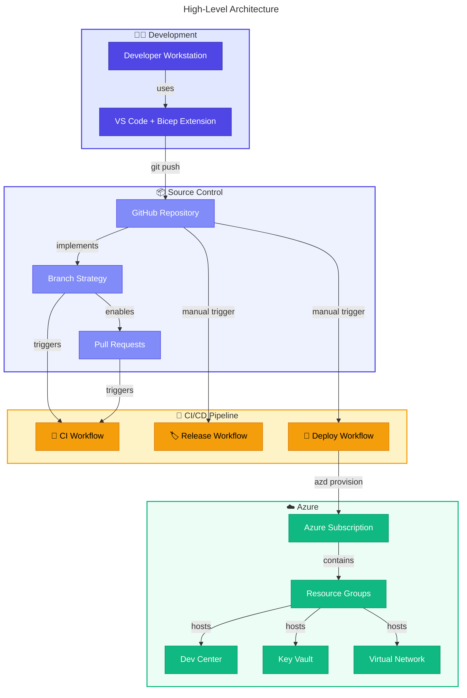
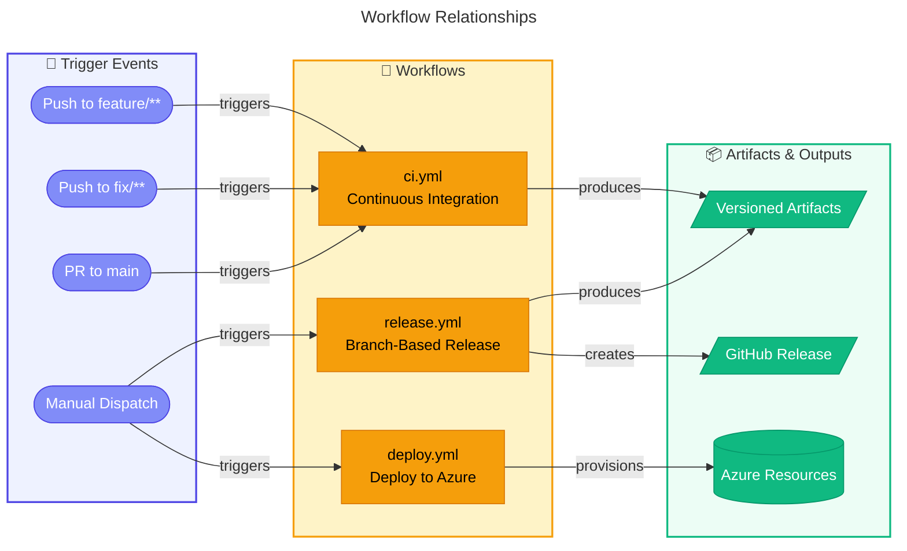
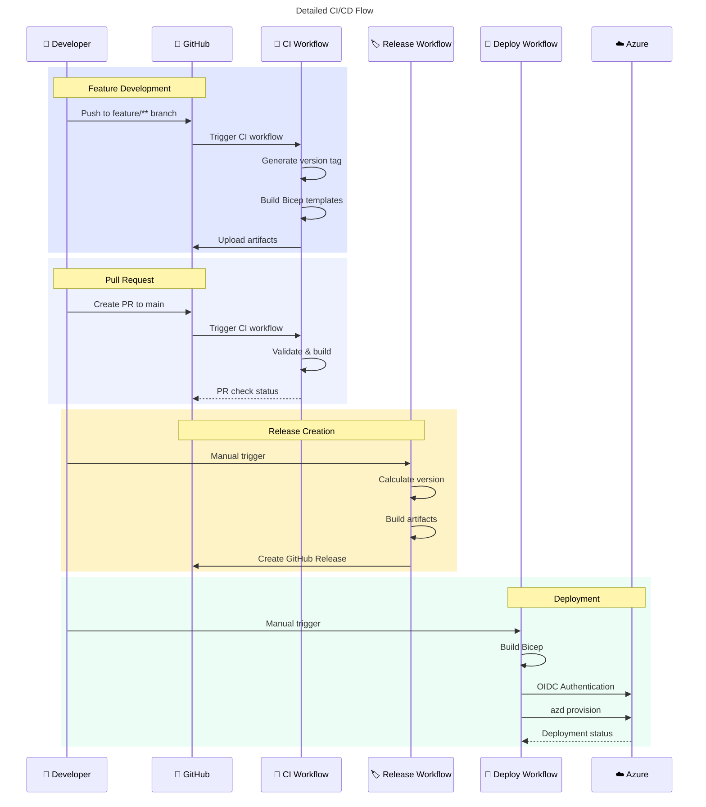
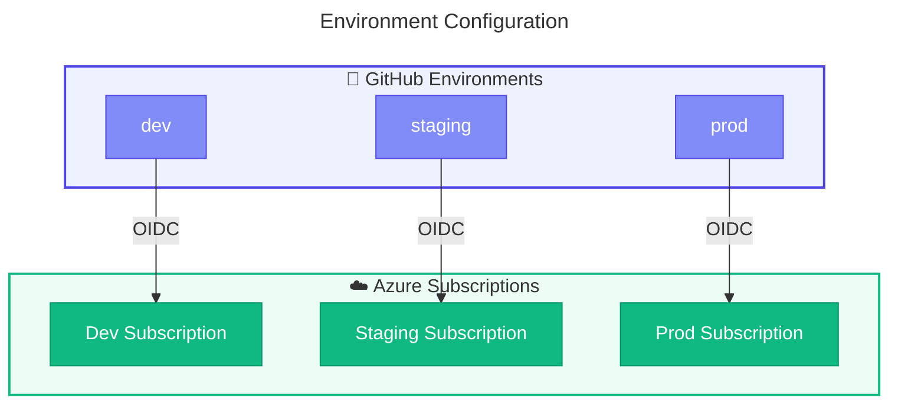
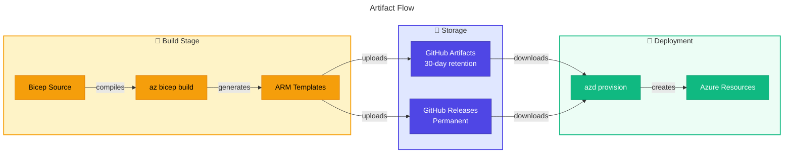

# 🚀 Deployment Architecture

> **DevExp-DevBox Landing Zone Accelerator**

> [!NOTE]
> **Target Audience:** DevOps Engineers, Platform Engineers, Release Managers  
> **Reading Time:** ~15 minutes

📍 Navigation

| Previous | Index | Next |
|:---------|:-----:|-----:|
| [← Security Architecture](05-security-architecture.md) | [Architecture Index](../README.md) | — |

| Property | Value |
|:---------|:------|
| **Version** | 1.0.0 |
| **Last Updated** | 2026-01-23 |
| **Author** | DevExp Team |
| **Status** | Published |

---

## 📑 Table of Contents

- [🎯 Overview](#overview)
- [🏗️ High-Level Architecture](#high-level-architecture)
- [🔄 Pipeline Architecture](#pipeline-architecture)
- [🌍 Deployment Environments](#deployment-environments)
- [🔒 Security Architecture](#security-architecture)
- [📦 Infrastructure Components](#infrastructure-components)
- [💾 Artifact Management](#artifact-management)
- [🛠️ Deployment Process](#deployment-process)
- [📶 Monitoring & Observability](#monitoring--observability)
- [🔗 Related Documentation](#related-documentation)

---

## 🎯 Overview

The Dev Box Accelerator uses a modern GitOps-style deployment approach with GitHub Actions for continuous integration and continuous deployment (CI/CD). The infrastructure is defined as code using Bicep templates and deployed to Azure using the Azure Developer CLI (azd).

---

[⬆️ Back to Top](#-table-of-contents)

---

## 🏗️ High-Level Architecture

---

[⬆️ Back to Top](#-table-of-contents)

---

## 🔄 Pipeline Architecture

### Workflow Relationships

### Detailed CI/CD Flow

---

[⬆️ Back to Top](#-table-of-contents)

---

## 🌍 Deployment Environments

### Environment Strategy

| Environment | Trigger | Purpose | Approval Required |
|-------------|---------|---------|-------------------|
| `dev` | Manual | Development testing | No |
| `staging` | Manual | Pre-production validation | Optional |
| `prod` | Manual | Production deployment | Yes (recommended) |

### Environment Configuration

---

[⬆️ Back to Top](#-table-of-contents)

---

## 🔒 Security Architecture

### Authentication Flow

```mermaid
---
title: Authentication Flow
---
flowchart LR
    %% ===== GITHUB ACTIONS =====
    subgraph GitHub["🐙 GitHub Actions"]
        GH1["Workflow Run"]
        GH2["Request OIDC Token"]
        GH1 -->|initiates| GH2
    end

    %% ===== AZURE AD =====
    subgraph AzureAD["🏢 Azure AD"]
        AD1["Validate Token"]
        AD2["Issue Access Token"]
        AD3["Federated Credential"]
        AD1 -->|checks| AD3
        AD3 -->|authorizes| AD2
    end

    %% ===== AZURE RESOURCES =====
    subgraph AzureRes["☁️ Azure Resources"]
        AZ1["Subscription"]
        AZ2["Resource Group"]
        AZ1 -->|contains| AZ2
    end

    %% ===== CONNECTIONS =====
    GH2 -->|JWT| AD1
    AD2 -->|Bearer Token| AZ1

    %% ===== NODE STYLES =====
    classDef trigger fill:#818CF8,stroke:#4F46E5,color:#FFFFFF
    classDef primary fill:#4F46E5,stroke:#3730A3,color:#FFFFFF
    classDef secondary fill:#10B981,stroke:#059669,color:#FFFFFF

    class GH1,GH2 trigger
    class AD1,AD2,AD3 primary
    class AZ1,AZ2 secondary

    %% ===== SUBGRAPH STYLES =====
    style GitHub fill:#EEF2FF,stroke:#4F46E5,stroke-width:2px
    style AzureAD fill:#E0E7FF,stroke:#4F46E5,stroke-width:2px
    style AzureRes fill:#ECFDF5,stroke:#10B981,stroke-width:2px
```

### Security Controls

| Control | Implementation | Purpose |
|---------|----------------|---------|
| OIDC Authentication | Federated credentials | No stored secrets |
| Action Pinning | SHA commit references | Supply chain security |
| Least Privilege | Minimal permissions | Reduced attack surface |
| Concurrency Control | Job grouping | Prevent race conditions |
| Environment Protection | GitHub Environments | Approval gates |

---

[⬆️ Back to Top](#-table-of-contents)

---

## 📦 Infrastructure Components

### Bicep Module Structure

```mermaid
---
title: Bicep Module Structure
---
flowchart TB
    %% ===== ENTRY POINT =====
    subgraph EntryPoint["🎯 Entry Point"]
        MAIN["main.bicep"]
    end

    %% ===== WORKLOAD MODULES =====
    subgraph Workload["📦 src/workload"]
        W1["workload.bicep"]
        W2["core/devCenter.bicep"]
        W3["core/catalog.bicep"]
        W4["core/environmentType.bicep"]
        W5["project/project.bicep"]
        W6["project/projectPool.bicep"]
    end

    %% ===== CONNECTIVITY MODULES =====
    subgraph Connectivity["🌐 src/connectivity"]
        C1["connectivity.bicep"]
        C2["vnet.bicep"]
        C3["networkConnection.bicep"]
    end

    %% ===== SECURITY MODULES =====
    subgraph Security["🔐 src/security"]
        S1["security.bicep"]
        S2["keyVault.bicep"]
        S3["secret.bicep"]
    end

    %% ===== IDENTITY MODULES =====
    subgraph Identity["👤 src/identity"]
        I1["devCenterRoleAssignment.bicep"]
        I2["projectIdentityRoleAssignment.bicep"]
    end

    %% ===== CONNECTIONS =====
    MAIN -->|deploys| W1
    MAIN -->|deploys| C1
    MAIN -->|deploys| S1
    MAIN -->|deploys| I1
    W1 -->|includes| W2
    W1 -->|includes| W3
    W1 -->|includes| W4
    W1 -->|includes| W5
    W1 -->|includes| W6
    C1 -->|includes| C2
    C1 -->|includes| C3
    S1 -->|includes| S2
    S1 -->|includes| S3

    %% ===== NODE STYLES =====
    classDef trigger fill:#818CF8,stroke:#4F46E5,color:#FFFFFF
    classDef primary fill:#4F46E5,stroke:#3730A3,color:#FFFFFF
    classDef secondary fill:#10B981,stroke:#059669,color:#FFFFFF
    classDef datastore fill:#F59E0B,stroke:#D97706,color:#000000
    classDef failed fill:#F44336,stroke:#C62828,color:#FFFFFF

    class MAIN trigger
    class W1,W2,W3,W4,W5,W6 primary
    class C1,C2,C3 secondary
    class S1,S2,S3 datastore
    class I1,I2 failed

    %% ===== SUBGRAPH STYLES =====
    style EntryPoint fill:#EEF2FF,stroke:#4F46E5,stroke-width:2px
    style Workload fill:#E0E7FF,stroke:#4F46E5,stroke-width:2px
    style Connectivity fill:#ECFDF5,stroke:#10B981,stroke-width:2px
    style Security fill:#FEF3C7,stroke:#F59E0B,stroke-width:2px
    style Identity fill:#FEE2E2,stroke:#F44336,stroke-width:2px
```

---

[⬆️ Back to Top](#-table-of-contents)

---

## 💾 Artifact Management

### Artifact Flow

### Versioning Scheme

| Component | Format | Example |
|-----------|--------|---------|
| Main releases | `v{major}.{minor}.{patch}` | `v1.2.3` |
| Feature builds | `v{major}.{minor}.{patch}-feature.{name}` | `v1.2.4-feature.auth` |
| Fix builds | `v{major}.{minor}.{patch}-fix.{name}` | `v1.3.0-fix.security` |
| PR builds | `v{major}.{minor}.{patch}-{type}-pr{number}` | `v1.2.4-feature.auth-pr123` |

---

[⬆️ Back to Top](#-table-of-contents)

---

## 🛠️ Deployment Process

### Pre-Deployment Checklist

- [ ] Azure subscription configured with OIDC federation
- [ ] GitHub repository variables set (`AZURE_CLIENT_ID`, `AZURE_TENANT_ID`, `AZURE_SUBSCRIPTION_ID`)
- [ ] GitHub secrets configured (`KEY_VAULT_SECRET`)
- [ ] Target region validated for resource availability
- [ ] Environment protection rules configured (optional)

### Deployment Steps

1. **Trigger Deployment**
   - Navigate to Actions → Deploy to Azure
   - Select environment and region
   - Run workflow

2. **Build Phase**
   - Validates Azure configuration
   - Compiles Bicep templates
   - Uploads build artifacts

3. **Authentication**
   - Requests OIDC token from GitHub
   - Exchanges for Azure access token
   - Authenticates with azd CLI

4. **Provision**
   - Runs `azd provision`
   - Creates/updates Azure resources
   - Generates deployment summary

---

[⬆️ Back to Top](#-table-of-contents)

---

## 📶 Monitoring & Observability

### Workflow Monitoring

| Metric | Location | Purpose |
|--------|----------|---------|
| Workflow runs | GitHub Actions | Pipeline execution history |
| Job duration | GitHub Actions | Performance tracking |
| Step summaries | GitHub Actions | Detailed execution logs |
| Deployment status | Azure Portal | Resource provisioning status |

### Recommended Alerts

- Workflow failure notifications
- Long-running deployment alerts
- Azure resource health monitoring

---

[⬆️ Back to Top](#-table-of-contents)

---

## 🔗 Related Documentation

- [DevOps Workflows](../devops/README.md) - Detailed workflow documentation
- [CI Workflow](../devops/ci.md) - Continuous integration details
- [Deploy Workflow](../devops/deploy.md) - Deployment process
- [Release Workflow](../devops/release.md) - Release management

---

[← Security Architecture](05-security-architecture.md) | [⬆️ Back to Top](#-table-of-contents)

*DevExp-DevBox Landing Zone Accelerator • Deployment Architecture*

