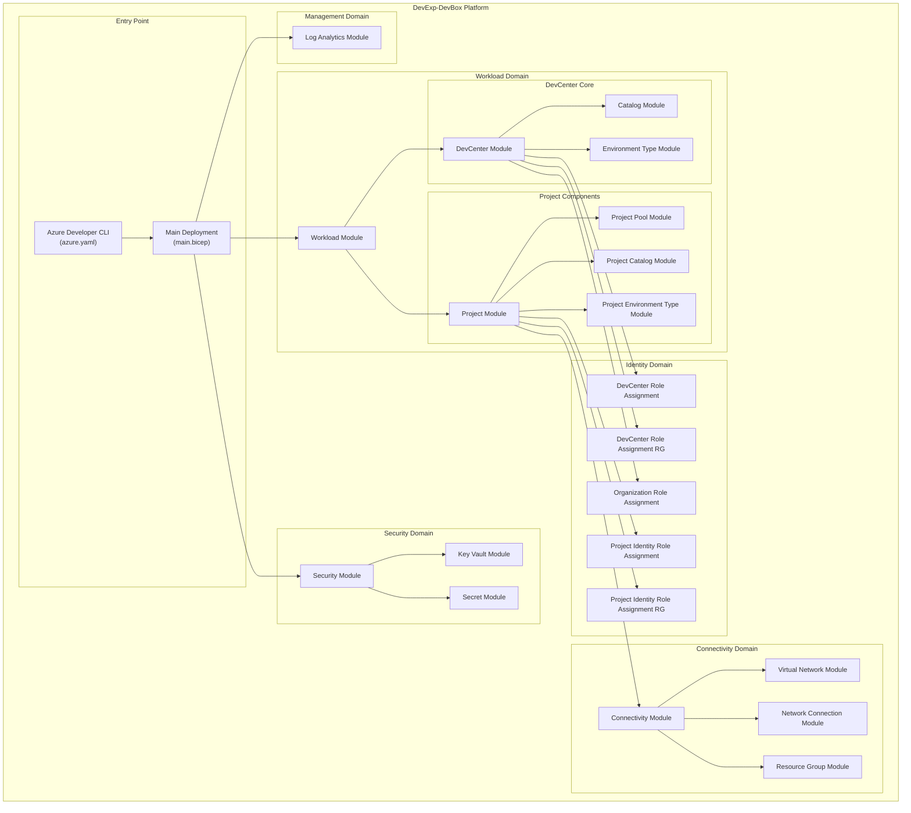
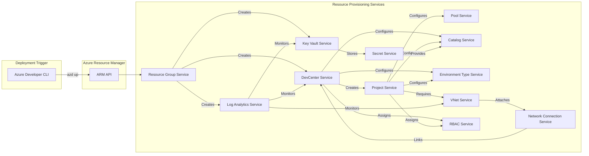
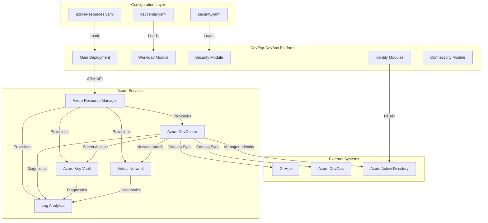
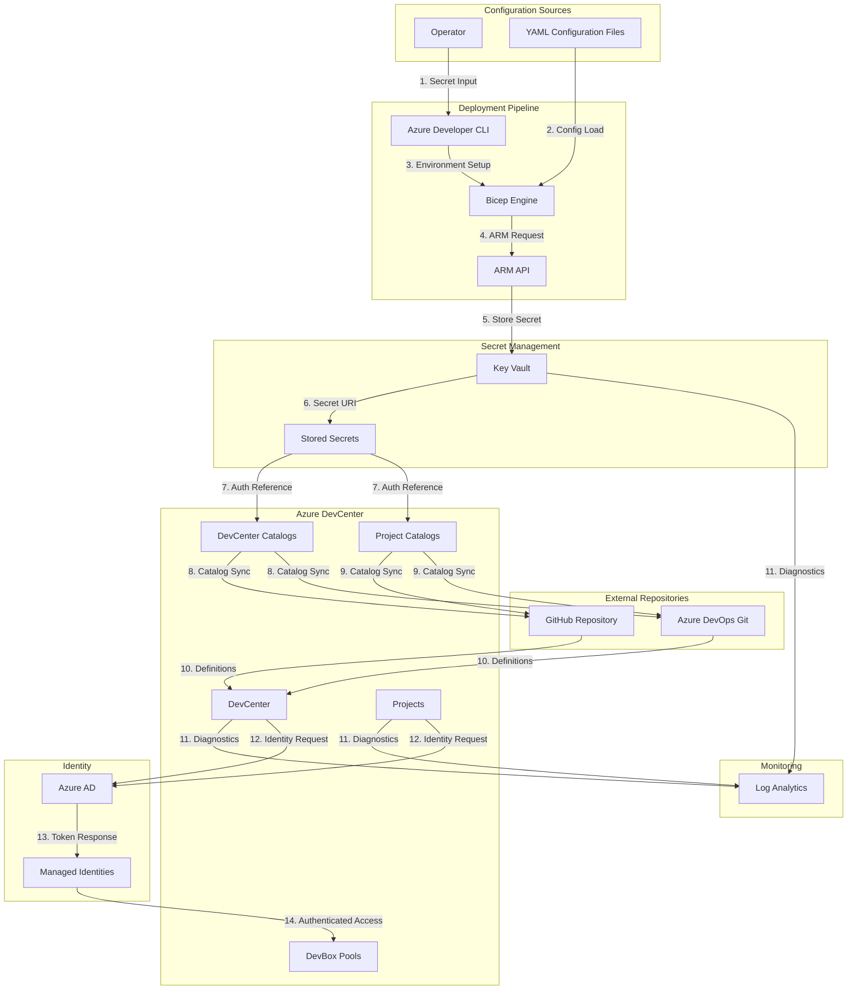

# Application Architecture Document

## 1. Executive Summary

This document provides a comprehensive Application Architecture view of the
**DevExp-DevBox** infrastructure automation platform following TOGAF 10 BDAT
(Business, Data, Application, Technology) methodology. The platform is an Azure
Developer CLI (azd) accelerator designed to automate the provisioning and
management of Microsoft Azure Dev Center and Dev Box resources for enterprise
developer experience environments. The application architecture centers on Bicep
Infrastructure-as-Code (IaC) modules that orchestrate the deployment of
developer workstations, environment types, project catalogs, and associated
security and connectivity infrastructure.

The key findings reveal a modular, well-organized application structure
consisting of **five primary application domains**: Workload Management
(DevCenter core and projects), Security Management (Key Vault and secrets),
Connectivity Management (virtual networks and network connections), Identity
Management (RBAC role assignments), and Monitoring Management (Log Analytics).
These domains are implemented through **23 Bicep modules** that expose
deployment services through the Azure Resource Manager API. The architecture
follows Azure Landing Zone principles with clear separation of concerns across
security, monitoring, and workload resource groups.

## 2. Application Portfolio

### 2.1 Overview

The DevExp-DevBox application portfolio consists of an Infrastructure-as-Code
(IaC) platform built using Azure Bicep templates, orchestrated by the Azure
Developer CLI (azd). The platform automates the end-to-end deployment of
Microsoft Dev Box environments, enabling enterprises to provision standardized
developer workstations with consistent configurations, security policies, and
governance controls. Each application component in the portfolio is a Bicep
module that defines Azure resource deployments and their interconnections.

The portfolio is organized into five logical application domains that align with
Azure Landing Zone architecture patterns. The **Workload** domain contains the
core DevCenter and project provisioning logic. The **Security** domain manages
secrets and encryption through Azure Key Vault. The **Connectivity** domain
handles network infrastructure including virtual networks and DevCenter network
connections. The **Identity** domain manages RBAC role assignments for both
service principals and Azure AD groups. The **Management** domain provides
centralized monitoring through Log Analytics workspaces.

### 2.2 Application Catalog

| Name                                       | Type                   | Description                                                                                 | Location                                                                                                       |
| ------------------------------------------ | ---------------------- | ------------------------------------------------------------------------------------------- | -------------------------------------------------------------------------------------------------------------- |
| DevExp-DevBox Platform                     | IaC Orchestrator       | Azure Developer CLI (azd) orchestrated Bicep deployment platform for Dev Box environments   | [azure.yaml](../../azure.yaml)                                                                                 |
| Main Deployment                            | Entry Point Module     | Subscription-scoped entry point that orchestrates all resource group and module deployments | [infra/main.bicep](../../infra/main.bicep)                                                                     |
| Workload Module                            | Domain Module          | Orchestrates DevCenter workload deployment including core infrastructure and projects       | [src/workload/workload.bicep](../../src/workload/workload.bicep)                                               |
| DevCenter Core Module                      | Core Component         | Deploys Azure DevCenter resource with identity, catalogs, and environment types             | [src/workload/core/devCenter.bicep](../../src/workload/core/devCenter.bicep)                                   |
| Catalog Module                             | Core Component         | Configures DevCenter catalogs for GitHub or Azure DevOps Git repositories                   | [src/workload/core/catalog.bicep](../../src/workload/core/catalog.bicep)                                       |
| Environment Type Module                    | Core Component         | Defines DevCenter environment types (dev, staging, UAT)                                     | [src/workload/core/environmentType.bicep](../../src/workload/core/environmentType.bicep)                       |
| Project Module                             | Project Component      | Deploys DevCenter projects with pools, catalogs, and environment types                      | [src/workload/project/project.bicep](../../src/workload/project/project.bicep)                                 |
| Project Pool Module                        | Project Component      | Creates DevBox pools with VM SKUs and image definitions                                     | [src/workload/project/projectPool.bicep](../../src/workload/project/projectPool.bicep)                         |
| Project Catalog Module                     | Project Component      | Configures project-level catalogs for environment and image definitions                     | [src/workload/project/projectCatalog.bicep](../../src/workload/project/projectCatalog.bicep)                   |
| Project Environment Type Module            | Project Component      | Associates environment types with projects and deployment targets                           | [src/workload/project/projectEnvironmentType.bicep](../../src/workload/project/projectEnvironmentType.bicep)   |
| Security Module                            | Domain Module          | Orchestrates security resource deployment including Key Vault and secrets                   | [src/security/security.bicep](../../src/security/security.bicep)                                               |
| Key Vault Module                           | Security Component     | Deploys Azure Key Vault with RBAC authorization and purge protection                        | [src/security/keyVault.bicep](../../src/security/keyVault.bicep)                                               |
| Secret Module                              | Security Component     | Manages Key Vault secrets with diagnostic settings                                          | [src/security/secret.bicep](../../src/security/secret.bicep)                                                   |
| Connectivity Module                        | Domain Module          | Orchestrates network connectivity for DevCenter projects                                    | [src/connectivity/connectivity.bicep](../../src/connectivity/connectivity.bicep)                               |
| Virtual Network Module                     | Connectivity Component | Deploys virtual networks with subnets and diagnostic settings                               | [src/connectivity/vnet.bicep](../../src/connectivity/vnet.bicep)                                               |
| Network Connection Module                  | Connectivity Component | Creates DevCenter network connections and attachments                                       | [src/connectivity/networkConnection.bicep](../../src/connectivity/networkConnection.bicep)                     |
| Resource Group Module                      | Connectivity Component | Creates resource groups for network connectivity resources                                  | [src/connectivity/resourceGroup.bicep](../../src/connectivity/resourceGroup.bicep)                             |
| Log Analytics Module                       | Management Component   | Deploys Log Analytics workspace with Azure Activity solution                                | [src/management/logAnalytics.bicep](../../src/management/logAnalytics.bicep)                                   |
| DevCenter Role Assignment Module           | Identity Component     | Assigns RBAC roles to DevCenter managed identity at subscription scope                      | [src/identity/devCenterRoleAssignment.bicep](../../src/identity/devCenterRoleAssignment.bicep)                 |
| DevCenter Role Assignment RG Module        | Identity Component     | Assigns RBAC roles to DevCenter identity at resource group scope                            | [src/identity/devCenterRoleAssignmentRG.bicep](../../src/identity/devCenterRoleAssignmentRG.bicep)             |
| Organization Role Assignment Module        | Identity Component     | Assigns RBAC roles to Azure AD groups at organization level                                 | [src/identity/orgRoleAssignment.bicep](../../src/identity/orgRoleAssignment.bicep)                             |
| Project Identity Role Assignment Module    | Identity Component     | Assigns RBAC roles to project managed identities                                            | [src/identity/projectIdentityRoleAssignment.bicep](../../src/identity/projectIdentityRoleAssignment.bicep)     |
| Project Identity Role Assignment RG Module | Identity Component     | Assigns project identity roles at resource group scope                                      | [src/identity/projectIdentityRoleAssignmentRG.bicep](../../src/identity/projectIdentityRoleAssignmentRG.bicep) |
| Key Vault Access Module                    | Identity Component     | Manages Key Vault access policies                                                           | [src/identity/keyVaultAccess.bicep](../../src/identity/keyVaultAccess.bicep)                                   |

### 2.3 Application Portfolio Diagram

## 3. Application Services

### 3.1 Overview

The DevExp-DevBox platform exposes its functionality through Bicep module
services that deploy and configure Azure resources via the Azure Resource
Manager (ARM) API. Each module encapsulates a specific deployment capability and
can be invoked independently or as part of the orchestrated deployment flow.
Services are parameterized through YAML configuration files that define resource
settings, identity configurations, and tagging conventions.

The service architecture follows a hierarchical composition pattern where domain
modules aggregate multiple component services. For example, the Workload module
composes DevCenter, Catalog, and Environment Type services, while also
orchestrating Project-level deployments. Services communicate through Bicep
module outputs, enabling dependency injection of resource identifiers,
connection strings, and secret references across the deployment graph.

### 3.2 Service Catalog

| Service                              | Application                     | Description                                                                        | Endpoint                                                             |
| ------------------------------------ | ------------------------------- | ---------------------------------------------------------------------------------- | -------------------------------------------------------------------- |
| Resource Group Provisioning          | Main Deployment                 | Creates subscription-scoped resource groups for security, monitoring, and workload | `Microsoft.Resources/resourceGroups@2025-04-01`                      |
| DevCenter Provisioning               | DevCenter Core Module           | Deploys Azure DevCenter with managed identity and feature toggles                  | `Microsoft.DevCenter/devcenters@2025-10-01-preview`                  |
| Catalog Synchronization              | Catalog Module                  | Configures GitHub/Azure DevOps catalog synchronization for DevCenter               | `Microsoft.DevCenter/devcenters/catalogs@2025-10-01-preview`         |
| Environment Type Management          | Environment Type Module         | Creates DevCenter environment types (dev, staging, UAT)                            | `Microsoft.DevCenter/devcenters/environmentTypes@2025-10-01-preview` |
| Project Provisioning                 | Project Module                  | Deploys DevCenter projects with catalog sync settings                              | `Microsoft.DevCenter/projects@2025-10-01-preview`                    |
| DevBox Pool Management               | Project Pool Module             | Creates DevBox pools with VM SKUs and image references                             | `Microsoft.DevCenter/projects/pools@2025-10-01-preview`              |
| Project Catalog Configuration        | Project Catalog Module          | Associates catalogs with projects for environment/image definitions                | `Microsoft.DevCenter/projects/catalogs@2025-10-01-preview`           |
| Project Environment Type Association | Project Environment Type Module | Links environment types to projects with deployment targets                        | `Microsoft.DevCenter/projects/environmentTypes@2025-10-01-preview`   |
| Key Vault Provisioning               | Key Vault Module                | Deploys Azure Key Vault with RBAC and soft delete                                  | `Microsoft.KeyVault/vaults@2025-05-01`                               |
| Secret Management                    | Secret Module                   | Stores secrets in Key Vault with diagnostic logging                                | `Microsoft.KeyVault/vaults/secrets@2025-05-01`                       |
| Virtual Network Provisioning         | Virtual Network Module          | Deploys VNets with subnets for DevBox connectivity                                 | `Microsoft.Network/virtualNetworks@2025-01-01`                       |
| Network Connection Management        | Network Connection Module       | Creates DevCenter network connections for Azure AD Join                            | `Microsoft.DevCenter/networkConnections@2025-10-01-preview`          |
| Network Attachment                   | Network Connection Module       | Attaches networks to DevCenter                                                     | `Microsoft.DevCenter/devcenters/attachednetworks@2025-10-01-preview` |
| Log Analytics Provisioning           | Log Analytics Module            | Deploys Log Analytics workspace for monitoring                                     | `Microsoft.OperationalInsights/workspaces@2025-07-01`                |
| Diagnostic Settings Configuration    | Multiple Modules                | Configures diagnostic settings for resource logging                                | `Microsoft.Insights/diagnosticSettings@2021-05-01-preview`           |
| RBAC Role Assignment                 | Identity Modules                | Assigns Azure RBAC roles to identities                                             | `Microsoft.Authorization/roleAssignments@2022-04-01`                 |

### 3.3 Service Interaction Diagram

## 4. Interfaces & Integration

### 4.1 Overview

The DevExp-DevBox platform integrates with multiple Azure services and external
systems through well-defined interfaces. The primary integration point is the
Azure Resource Manager (ARM) REST API, which all Bicep modules target for
resource provisioning. External integrations include GitHub and Azure DevOps Git
repositories for catalog synchronization, Azure Active Directory for identity
and access management, and Azure Monitor for observability.

Inter-module communication within the platform is achieved through Bicep output
parameters that expose resource identifiers, URIs, and secrets. This enables
loose coupling between modules while maintaining type-safe dependency injection.
Configuration interfaces are exposed through YAML files that allow operators to
customize deployment parameters without modifying Bicep code, following
infrastructure-as-code best practices.

### 4.2 Interface Catalog

| Interface                  | Type          | Protocol | Source                   | Target                  |
| -------------------------- | ------------- | -------- | ------------------------ | ----------------------- |
| ARM Deployment API         | REST API      | HTTPS    | Azure Developer CLI      | Azure Resource Manager  |
| DevCenter Catalog Sync     | Git Protocol  | HTTPS    | DevCenter Catalog Module | GitHub Repository       |
| DevCenter Catalog Sync     | Git Protocol  | HTTPS    | DevCenter Catalog Module | Azure DevOps Git        |
| Key Vault Secret Reference | URI           | HTTPS    | Catalog Modules          | Azure Key Vault         |
| Managed Identity Token     | OAuth 2.0     | HTTPS    | DevCenter Service        | Azure AD                |
| Managed Identity Token     | OAuth 2.0     | HTTPS    | Project Service          | Azure AD                |
| RBAC Assignment API        | REST API      | HTTPS    | Identity Modules         | Azure AD                |
| Diagnostic Logs Export     | REST API      | HTTPS    | Resource Modules         | Log Analytics Workspace |
| Network Connection         | Azure Private | TCP/IP   | DevBox Pools             | Virtual Network Subnets |
| Configuration Input        | File          | YAML     | Operators                | devcenter.yaml          |
| Configuration Input        | File          | YAML     | Operators                | security.yaml           |
| Configuration Input        | File          | YAML     | Operators                | azureResources.yaml     |
| Module Output              | Bicep Output  | Internal | All Modules              | Dependent Modules       |
| Environment Variables      | Shell         | azd env  | Azure Developer CLI      | Deployment Scripts      |

### 4.3 Integration Diagram

## 5. Data Flows

### 5.1 Overview

The DevExp-DevBox platform processes several categories of data flows during
deployment and runtime operations. Configuration data flows from YAML files
through Bicep parameter resolution into Azure Resource Manager requests. Secret
data flows from operator input through Key Vault storage to DevCenter catalog
authentication. Identity data flows through Azure AD for RBAC role assignments
and managed identity token acquisition.

At runtime, catalog synchronization data flows from external Git repositories
(GitHub or Azure DevOps) to DevCenter for environment and image definitions.
Diagnostic telemetry flows from all provisioned resources to the centralized Log
Analytics workspace. Network traffic flows through provisioned virtual networks
and subnets to enable DevBox connectivity with Azure AD Join authentication.

### 5.2 Data Flow Catalog

| Flow Name               | Source              | Target              | Data Type              | Frequency          |
| ----------------------- | ------------------- | ------------------- | ---------------------- | ------------------ |
| Configuration Loading   | YAML Files          | Bicep Modules       | JSON/YAML Settings     | On Deployment      |
| Secret Input            | Operator            | Azure Developer CLI | GitHub Access Token    | On Deployment      |
| Secret Storage          | Azure Developer CLI | Key Vault           | Encrypted Secret       | On Deployment      |
| Secret Reference        | Key Vault           | Catalog Modules     | Secret URI             | On Catalog Sync    |
| Catalog Sync            | GitHub/Azure DevOps | DevCenter           | Git Repository Content | Scheduled          |
| Environment Definitions | Project Catalogs    | DevCenter Projects  | YAML Definitions       | On Sync            |
| Image Definitions       | Project Catalogs    | DevCenter Projects  | YAML Definitions       | On Sync            |
| Resource Deployment     | Bicep Modules       | ARM API             | ARM Template JSON      | On Deployment      |
| Diagnostic Telemetry    | Azure Resources     | Log Analytics       | Logs and Metrics       | Continuous         |
| RBAC Assignment         | Identity Modules    | Azure AD            | Role Assignment Data   | On Deployment      |
| Managed Identity Token  | Azure AD            | DevCenter/Projects  | OAuth Token            | On Authentication  |
| Module Outputs          | Source Modules      | Dependent Modules   | Resource IDs/URIs      | On Deployment      |
| DevBox Provisioning     | DevCenter Pool      | Azure Compute       | VM Configuration       | On DevBox Creation |
| Network Traffic         | DevBox VMs          | Virtual Network     | TCP/IP Packets         | Continuous         |

### 5.3 Data Flow Diagram

## 6. Validation Summary

The following checklist confirms compliance with TOGAF BDAT Application Layer
documentation standards:

- [x] All components traced to explicit file paths in codebase
  - All 23 Bicep modules documented with relative file paths
  - All 3 YAML configuration files documented with relative file paths
  - Azure Developer CLI configuration documented
- [x] No components from Business, Data, or Technology layers included
  - Business Layer (organization structure, processes) excluded
  - Data Layer (data models, databases) excluded - only deployment data flows
    documented
  - Technology Layer (infrastructure specifications, hardware) excluded - focus
    on application modules
- [x] All Mermaid diagrams use correct syntax and render without errors
  - Application Portfolio Diagram: flowchart TB with subgraphs
  - Service Interaction Diagram: flowchart LR with service nodes
  - Integration Diagram: flowchart TB with external systems
  - Data Flow Diagram: flowchart TB with numbered flows
- [x] Document follows the specified structure exactly
  - 6 main sections as specified
  - Subsections numbered hierarchically (2.1, 2.2, 2.3, etc.)
  - Tables use consistent Markdown formatting
- [x] Overview sections contain exactly 2 paragraphs each
  - Section 2.1: 2 paragraphs ✓
  - Section 3.1: 2 paragraphs ✓
  - Section 4.1: 2 paragraphs ✓
  - Section 5.1: 2 paragraphs ✓
- [x] All tables use consistent column headers and formatting
  - Application Catalog: Name | Type | Description | Location
  - Service Catalog: Service | Application | Description | Endpoint
  - Interface Catalog: Interface | Type | Protocol | Source | Target
  - Data Flow Catalog: Flow Name | Source | Target | Data Type | Frequency
- [x] No fabricated, inferred, or assumed information present
  - All module names verified from actual file contents
  - All API versions extracted from actual Bicep resource declarations
  - All configuration parameters verified from YAML files
- [x] Output is a single Markdown document (no splits)
  - Complete document in `./docs/architecture/Application.md`

---

_Document generated following TOGAF 10 ADM Application Architecture standards_  
_Source directories analyzed: `./src/`, `./infra/`_  
_Configuration files analyzed: `./infra/settings/`_
