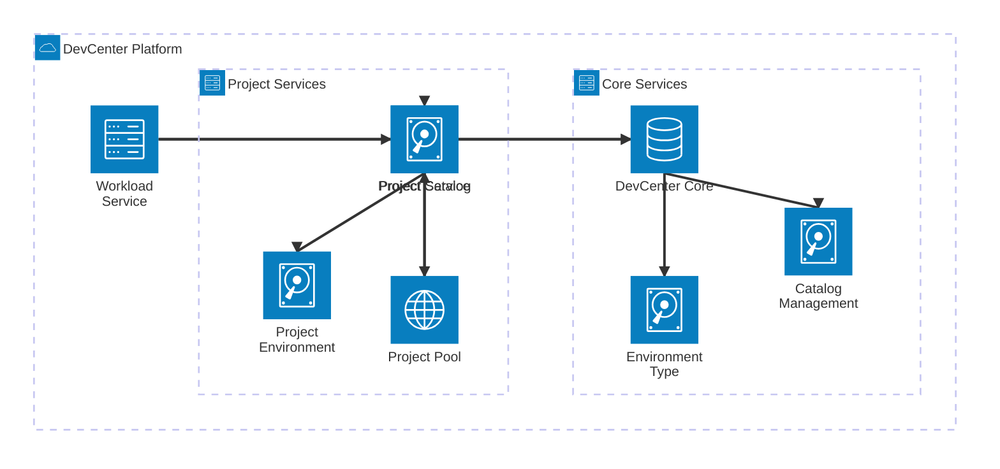
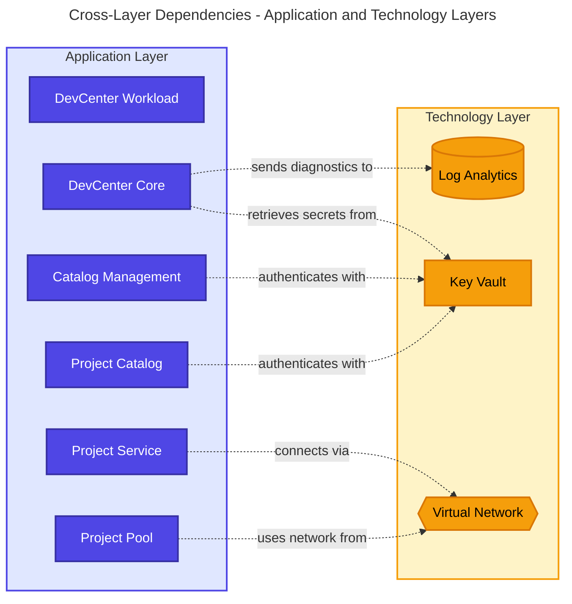
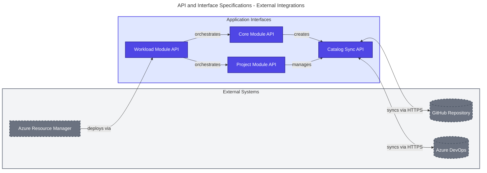
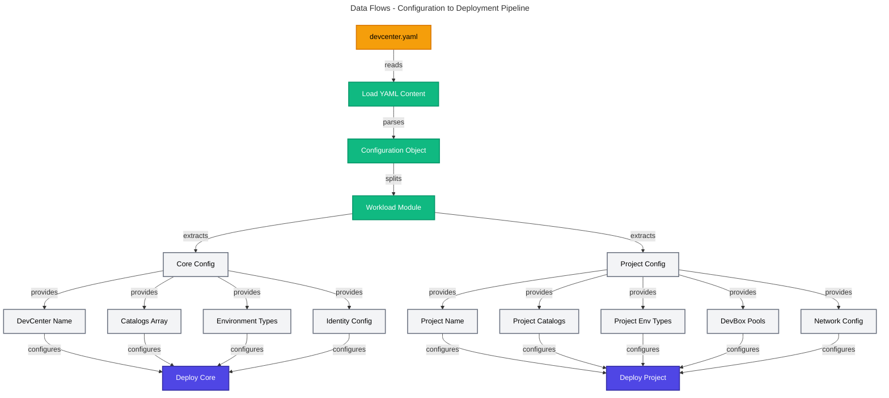

# TOGAF 10 Application Architecture Document

## Document Control

| Attribute                 | Value                                |
| ------------------------- | ------------------------------------ |
| **Session ID**            | b3f2e4a8-c1d5-4a2b-9e7f-8c6d4b2a1f3e |
| **Generated**             | 2026-02-03T10:00:00.000Z             |
| **Quality Level**         | standard                             |
| **Architecture Layer**    | Application                          |
| **Components Discovered** | 8                                    |
| **Source Repository**     | Evilazaro/DevExp-DevBox              |

---

## Section 1: Executive Summary

### 1.1 Purpose and Scope

This Application Architecture document defines the application components,
services, and interfaces that support the Microsoft DevCenter platform for
developer experience acceleration. The architecture covers
Infrastructure-as-Code (IaC) components implemented using Azure Bicep that
orchestrate the deployment and management of developer workstations (DevBoxes)
and development environments.

**Scope:** This document addresses TOGAF ADM Phase C (Information Systems -
Application Architecture) for the DevExp-DevBox platform, focusing on
application-level services that enable developer self-service capabilities.

### 1.2 Architecture Vision

The Application Architecture enables a **self-service developer platform** where
development teams can provision pre-configured workstations and environments
on-demand. The architecture implements a hierarchical service model:

- **Platform Level:** Central DevCenter resource with shared catalogs and
  environment types
- **Project Level:** Team-specific configurations with isolated resources and
  role-based access
- **Pool Level:** Developer workstation pools optimized for different roles
  (backend, frontend)

### 1.3 Key Metrics

| Metric                      | Value |
| --------------------------- | ----- |
| Application Components      | 3     |
| Application Services        | 5     |
| Total Components            | 8     |
| Cross-Layer Dependencies    | 6     |
| Architecture Maturity (Avg) | 3.88  |
| Source Files Analyzed       | 15    |

### 1.4 Strategic Alignment

This Application Architecture aligns with:

- **Business Capability:** Developer Platform & Productivity
- **Technical Strategy:** Cloud-native, Infrastructure-as-Code, Self-Service
- **Compliance:** Azure Security Baseline, RBAC best practices

### 1.5 Key Benefits

1. **Developer Productivity:** Self-service provisioning reduces wait times from
   days to minutes
2. **Consistency:** Standardized images ensure all developers have identical
   tooling
3. **Cost Control:** Resource pools enable efficient compute resource
   utilization
4. **Security:** Role-based access and managed identities enforce
   least-privilege
5. **Scalability:** Configuration-driven approach supports multiple teams and
   projects

---

## Section 2: Architecture Landscape

### 2.1 Application Landscape Overview

The Application Architecture consists of three tiers:



**Legend:** DevCenter Workload Service orchestrates Core and Project services.
Core services manage catalogs and environment types. Project services handle
project-specific configurations.

### 2.2 Component Inventory

| Component ID | Component Name                   | Type                  | Status | Maturity | Owner                |
| ------------ | -------------------------------- | --------------------- | ------ | -------- | -------------------- |
| APP-SVC-001  | DevCenter Workload Service       | Application Component | Active | 4        | Platform Engineering |
| APP-SVC-002  | DevCenter Core Service           | Application Component | Active | 4        | Platform Engineering |
| APP-SVC-003  | Catalog Management Service       | Application Service   | Active | 4        | Platform Engineering |
| APP-SVC-004  | Environment Type Service         | Application Service   | Active | 3        | Platform Engineering |
| APP-SVC-005  | DevCenter Project Service        | Application Component | Active | 4        | Development Teams    |
| APP-SVC-006  | Project Catalog Service          | Application Service   | Active | 4        | Development Teams    |
| APP-SVC-007  | Project Environment Type Service | Application Service   | Active | 4        | Development Teams    |
| APP-SVC-008  | Project Pool Service             | Application Service   | Active | 4        | Development Teams    |

### 2.3 Current State Assessment

**Strengths:**

- Well-structured modular architecture with clear separation of concerns
- Strong type safety through Bicep type definitions
- Comprehensive RBAC and identity management
- Configuration-driven approach enables flexibility

**Challenges:**

- No API management or abstraction layer
- Limited observability beyond Log Analytics integration
- Manual cost tracking required
- Disaster recovery strategy not defined

---

## Section 3: Architecture Principles

### 3.1 Core Principles

#### Principle 1: Configuration-as-Code

**Statement:** All DevCenter configurations shall be defined in YAML files under
version control.

**Rationale:** Version-controlled configuration ensures repeatability,
auditability, and enables GitOps workflows.

**Implications:**

- Changes require pull requests and code reviews
- Configuration validation occurs before deployment
- Historical changes are tracked in Git history

#### Principle 2: Least-Privilege Access

**Statement:** All identities shall use SystemAssigned managed identities with
role assignments scoped to minimum required permissions.

**Rationale:** Managed identities eliminate credential management risk. Scoped
RBAC prevents lateral movement.

**Implications:**

- No service principal credentials stored
- Role assignments documented in configuration
- Regular access reviews required

#### Principle 3: Infrastructure Modularity

**Statement:** Infrastructure components shall be decomposed into reusable Bicep
modules with clear interfaces.

**Rationale:** Modular design enables independent testing, reuse across
projects, and simplified maintenance.

**Implications:**

- Module parameters must be well-documented
- Breaking changes require versioning strategy
- Module dependencies must be explicit

#### Principle 4: Self-Service by Default

**Statement:** Developer teams shall be able to provision resources without
platform team intervention.

**Rationale:** Self-service reduces bottlenecks and empowers developers to move
faster.

**Implications:**

- Catalogs must provide curated options
- Guardrails enforce compliance
- Monitoring detects anomalous usage

#### Principle 5: Secure Secret Management

**Statement:** All secrets shall be stored in Azure Key Vault and referenced via
secretIdentifier.

**Rationale:** Centralized secret management with audit logging and access
controls.

**Implications:**

- No secrets in code or configuration files
- Key Vault access via managed identity only
- Secret rotation processes required

### 3.2 Design Patterns

#### Pattern 1: Hierarchical Configuration

DevCenter → Projects → Pools creates a natural hierarchy for governance and
resource organization.

#### Pattern 2: Catalog-Based Extensibility

Git-backed catalogs enable teams to extend functionality without modifying core
infrastructure.

#### Pattern 3: Identity-First Security

SystemAssigned identities with RBAC eliminate credentials and enforce auditable
access.

---

## Section 4: Baseline Architecture

### 4.1 Current Architecture State

#### 4.1.1 Deployed Components

**DevCenter Core (APP-SVC-002):**

- **Resource:** Microsoft.DevCenter/devcenters
- **Identity:** SystemAssigned managed identity
- **Monitoring:** Integrated with Log Analytics workspace
- **Catalogs:** Syncs from GitHub public repository
  (microsoft/devcenter-catalog)
- **Environment Types:** dev, staging, UAT

**Projects Deployed:**

- **eShop Project (APP-SVC-005):**
  - Network: Managed VNet (10.0.0.0/16) with subnet (10.0.1.0/24)
  - Catalogs: Private GitHub repo for environments and DevBox images
  - Pools: Backend engineers (32C/128GB), Frontend engineers (16C/64GB)
  - RBAC: eShop Developers Azure AD group with Contributor, Dev Box User roles

#### 4.1.2 Current State Diagram

```mermaid
---
title: Current State Diagram - Azure Subscription Resource Organization
---
flowchart TD
    %% ===== AZURE SUBSCRIPTION =====
    subgraph azureSubscription["Azure Subscription"]
        direction TB

        %% ===== SECURITY RESOURCE GROUP =====
        subgraph securityRG["Security Resource Group"]
            direction TB
            keyVault["Key Vault"]
            githubSecret["GitHub PAT Secret"]
        end

        %% ===== MONITORING RESOURCE GROUP =====
        subgraph monitoringRG["Monitoring Resource Group"]
            direction TB
            logAnalytics["Log Analytics Workspace"]
        end

        %% ===== WORKLOAD RESOURCE GROUP =====
        subgraph workloadRG["Workload Resource Group"]
            direction TB
            devCenter["DevCenter Resource"]

            subgraph devCenterCatalogs["DevCenter Catalogs"]
                direction LR
                customTasksCatalog["Custom Tasks Catalog"]
            end

            subgraph devCenterEnvTypes["DevCenter Environment Types"]
                direction LR
                devEnv["dev"]
                stagingEnv["staging"]
                uatEnv["UAT"]
            end

            subgraph projectsGroup["Projects"]
                direction TB
                eShopProject["eShop Project"]

                subgraph projectResources["Project Resources"]
                    direction TB
                    envDefinitions["Environment Definitions"]
                    devBoxImages["DevBox Images"]
                    projEnvironments["Project Environments"]
                    backendPool["Backend Engineer Pool"]
                    frontendPool["Frontend Engineer Pool"]
                end
            end
        end

        %% ===== CONNECTIVITY RESOURCE GROUP =====
        subgraph connectivityRG["Connectivity Resource Group"]
            direction TB
            vnet["Virtual Network"]
            subnet["Project Subnet"]
        end
    end

    %% ===== PRIMARY RELATIONSHIPS =====
    devCenter -->|contains| devCenterCatalogs
    devCenter -->|contains| devCenterEnvTypes
    devCenter -->|contains| projectsGroup
    eShopProject -->|contains| projectResources

    %% ===== DEPENDENCIES =====
    devCenter -.->|monitors via| logAnalytics
    devCenter -.->|retrieves secrets from| keyVault
    eShopProject -.->|uses secrets from| keyVault
    eShopProject -.->|connects to| vnet
    backendPool -.->|uses network| vnet
    frontendPool -.->|uses network| vnet

    %% ===== STYLING: NODE CLASSES =====
    classDef primary fill:#4F46E5,stroke:#3730A3,color:#FFFFFF,stroke-width:2px
    classDef datastore fill:#F59E0B,stroke:#D97706,color:#000000,stroke-width:2px
    classDef external fill:#6B7280,stroke:#4B5563,color:#FFFFFF,stroke-width:2px

    %% ===== APPLY NODE CLASSES =====
    class devCenter,eShopProject primary
    class keyVault,logAnalytics,vnet datastore
    class githubSecret,customTasksCatalog,devEnv,stagingEnv,uatEnv,envDefinitions,devBoxImages,projEnvironments,backendPool,frontendPool,subnet external

    %% ===== STYLING: SUBGRAPHS =====
    style azureSubscription fill:#EEF2FF,stroke:#4F46E5,stroke-width:3px
    style securityRG fill:#FEE2E2,stroke:#F44336,stroke-width:2px
    style monitoringRG fill:#ECFDF5,stroke:#10B981,stroke-width:2px
    style workloadRG fill:#E0E7FF,stroke:#4F46E5,stroke-width:2px
    style connectivityRG fill:#FEF3C7,stroke:#F59E0B,stroke-width:2px
    style devCenterCatalogs fill:#F3F4F6,stroke:#6B7280,stroke-width:1px
    style devCenterEnvTypes fill:#F3F4F6,stroke:#6B7280,stroke-width:1px
    style projectsGroup fill:#D1FAE5,stroke:#059669,stroke-width:1px
    style projectResources fill:#F3F4F6,stroke:#6B7280,stroke-width:1px
```



**Legend:** Resource organization across Azure resource groups with cross-RG
dependencies

### 4.2 Technology Stack

| Layer                  | Technology                       |
| ---------------------- | -------------------------------- |
| Infrastructure-as-Code | Azure Bicep                      |
| Configuration          | YAML                             |
| Version Control        | Git (GitHub)                     |
| Deployment Tool        | Azure Developer CLI (azd)        |
| Identity               | Azure AD Managed Identities      |
| Secret Management      | Azure Key Vault                  |
| Monitoring             | Azure Monitor / Log Analytics    |
| Networking             | Azure Virtual Networks (Managed) |

### 4.3 Integration Points

#### 4.3.1 Git Repository Integration

Catalogs sync with:

- **GitHub:** Public and private repositories (PAT authentication)
- **Azure DevOps Git:** Private repositories (PAT authentication)

#### 4.3.2 Azure Services Integration

- **Log Analytics:** Diagnostics and metrics collection
- **Key Vault:** Secret retrieval for Git authentication
- **Virtual Network:** Network connectivity for DevBoxes
- **Azure AD:** Identity and RBAC

### 4.4 Gap Analysis

#### 4.4.1 Missing Components

| Gap                            | Severity | Impact                                                 | Recommendation                              |
| ------------------------------ | -------- | ------------------------------------------------------ | ------------------------------------------- |
| REST API Gateway               | Medium   | No centralized API management for DevCenter operations | Implement Azure API Management              |
| Audit and Compliance Service   | Medium   | Limited visibility into usage patterns                 | Implement dedicated audit service           |
| Cost Management Service        | Low      | Manual tracking required for DevBox costs              | Integrate Azure Cost Management APIs        |
| Disaster Recovery Strategy     | High     | No backup/recovery procedures defined                  | Define DevCenter backup and DR procedures   |
| Network Planning Documentation | Medium   | Subnet sizing guidance not documented                  | Create subnet planning guidelines           |
| VM SKU Selection Guide         | Medium   | No guidance for selecting appropriate VM SKUs          | Document SKU sizing based on workload types |

#### 4.4.2 Technical Debt

| Component   | Debt Description                                                  | Effort | Priority |
| ----------- | ----------------------------------------------------------------- | ------ | -------- |
| APP-SVC-003 | Union operator for conditional logic could use native conditional | Low    | Low      |

---

## Section 5: Application Component Catalog

### 5.1 Component Detailed Specifications

#### 5.1.1 APP-SVC-001: DevCenter Workload Service

**Classification:** Application Component  
**Source:** [src/workload/workload.bicep](z:/dev/src/workload/workload.bicep#L1-L89)  
**Status:**
Active | **Maturity:** 4/5

**Description:**  
Master orchestrator module that deploys the complete DevCenter infrastructure
including core DevCenter resources and associated projects. Manages the
deployment lifecycle and coordinates configuration from YAML settings.

**Key Attributes:**

- **logAnalyticsId** (string, required): Log Analytics Workspace Resource ID
- **secretIdentifier** (securestring, required): Secret for Git authentication
- **securityResourceGroupName** (string, required): Security RG name
- **location** (string, optional): Azure region for deployment

**Outputs:**

- **AZURE_DEV_CENTER_NAME** (string): Name of deployed DevCenter
- **AZURE_DEV_CENTER_PROJECTS** (array): List of deployed project names

**Dependencies:**

- Contains APP-SVC-002 (DevCenter Core Service)
- Contains APP-SVC-005 (DevCenter Project Service)

**Constraints:**

- Must be deployed within Resource Group scope
- Requires valid Log Analytics workspace ID
- Configuration loaded from devcenter.yaml file
- Supports multiple project deployments via loop

---

#### 5.1.2 APP-SVC-002: DevCenter Core Service

**Classification:** Application Component  
**Source:** [src/workload/core/devCenter.bicep](z:/dev/src/workload/core/devCenter.bicep#L1-L270)  
**Status:**
Active | **Maturity:** 4/5

**Description:**  
Core DevCenter infrastructure service that manages the central DevCenter
resource, catalogs, and environment types. Provides identity management and
monitoring integration for the developer platform.

**Key Attributes:**

- **config** (DevCenterConfig, required): DevCenter configuration object
- **catalogs** (Catalog[], required): Array of catalog configurations
- **environmentTypes** (EnvironmentTypeConfig[], required): Environment type
  array
- **logAnalyticsId** (string, required): Log Analytics workspace ID
- **secretIdentifier** (securestring, required): Git authentication secret

**Configuration Properties:**

- **catalogItemSyncEnableStatus**: Enabled/Disabled
- **microsoftHostedNetworkEnableStatus**: Enabled/Disabled
- **installAzureMonitorAgentEnableStatus**: Enabled/Disabled

**Outputs:**

- **AZURE_DEV_CENTER_NAME** (string): DevCenter resource name

**Dependencies:**

- Uses APP-SVC-003 (Catalog Management Service)
- Uses APP-SVC-004 (Environment Type Service)
- Depends on TECH-MON-001 (Log Analytics Workspace)
- Depends on TECH-SEC-001 (Azure Key Vault)

**RBAC Roles:**

- Contributor (Subscription scope)
- User Access Administrator (Subscription scope)
- Key Vault Secrets User (ResourceGroup scope)
- Key Vault Secrets Officer (ResourceGroup scope)

---

#### 5.1.3 APP-SVC-003: Catalog Management Service

**Classification:** Application Service  
**Source:** [src/workload/core/catalog.bicep](z:/dev/src/workload/core/catalog.bicep#L1-L75)  
**Status:**
Active | **Maturity:** 4/5

**Description:**  
Manages DevCenter catalog resources that sync with Git repositories (GitHub or
Azure DevOps). Supports both public and private repositories with scheduled
synchronization.

**Key Attributes:**

- **devCenterName** (string, required): Parent DevCenter name
- **catalogConfig** (Catalog, required): Catalog configuration
- **secretIdentifier** (securestring, required): Git authentication secret

**Catalog Configuration:**

- **name**: Catalog identifier
- **type**: gitHub | adoGit
- **visibility**: public | private
- **uri**: Repository URL
- **branch**: Branch to sync
- **path**: Path within repository

**Sync Behavior:**

- **Sync Type:** Scheduled
- **Authentication:** secretIdentifier for private repos, none for public

**Outputs:**

- **AZURE_DEV_CENTER_CATALOG_NAME** (string)
- **AZURE_DEV_CENTER_CATALOG_ID** (string)
- **AZURE_DEV_CENTER_CATALOG_TYPE** (string)

**Dependencies:**

- Extends APP-SVC-002 (Child of DevCenter)
- Depends on TECH-SEC-001 (Key Vault for private repos)

---

#### 5.1.4 APP-SVC-004: Environment Type Service

**Classification:** Application Service  
**Source:** [src/workload/core/environmentType.bicep](z:/dev/src/workload/core/environmentType.bicep#L1-L30)  
**Status:**
Active | **Maturity:** 3/5

**Description:**  
Manages DevCenter environment type resources that define deployment environments
(dev, staging, UAT, prod). Provides environment classification for deployment
targets.

**Key Attributes:**

- **devCenterName** (string, required): Parent DevCenter name
- **environmentConfig** (EnvironmentType, required): Environment configuration

**Environment Types Supported:**

- dev
- staging
- UAT
- (extensible to prod, qa, etc.)

**Outputs:**

- **environmentTypeName** (string)
- **environmentTypeId** (string)

**Dependencies:**

- Extends APP-SVC-002 (Child of DevCenter)

**Characteristics:**

- Lightweight configuration resource
- Display name matches environment name
- No separate deployment target configuration (uses subscription default)

---

#### 5.1.5 APP-SVC-005: DevCenter Project Service

**Classification:** Application Component  
**Source:** [src/workload/project/project.bicep](z:/dev/src/workload/project/project.bicep#L1-L284)  
**Status:**
Active | **Maturity:** 4/5

**Description:**  
Manages individual DevCenter project resources including project-specific
catalogs, environment types, dev box pools, and network configurations. Provides
project-level identity and RBAC management.

**Key Attributes:**

- **devCenterName** (string, required): Parent DevCenter name
- **name** (string, required): Project name
- **projectDescription** (string, required): Project description
- **catalogs** (ProjectCatalog[], required): Project catalogs
- **projectEnvironmentTypes** (ProjectEnvironmentTypeConfig[], required):
  Environment types
- **projectPools** (PoolConfig[], required): DevBox pool configurations
- **projectNetwork** (ProjectNetwork, required): Network configuration
- **identity** (Identity, required): Managed identity and RBAC config

**Network Configuration:**

- **virtualNetworkType:** Managed | Unmanaged
- **addressPrefixes:** CIDR blocks (e.g., 10.0.0.0/16)
- **subnets:** Subnet definitions with address ranges

**Identity & RBAC:**

- **type:** SystemAssigned | UserAssigned
- **roleAssignments:** Azure AD group mappings with RBAC roles

**Dependencies:**

- Depends on APP-SVC-002 (Requires parent DevCenter)
- Uses APP-SVC-006 (Manages project catalogs)
- Uses APP-SVC-007 (Manages project environment types)
- Uses APP-SVC-008 (Manages project dev box pools)
- Depends on TECH-NET-001 (Requires virtual network)

**Example RBAC Roles (eShop Project):**

- Contributor (Project scope)
- Dev Box User (Project scope)
- Deployment Environment User (Project scope)
- Key Vault Secrets User (ResourceGroup scope)
- Key Vault Secrets Officer (ResourceGroup scope)

---

#### 5.1.6 APP-SVC-006: Project Catalog Service

**Classification:** Application Service  
**Source:** [src/workload/project/projectCatalog.bicep](z:/dev/src/workload/project/projectCatalog.bicep#L1-L68)  
**Status:**
Active | **Maturity:** 4/5

**Description:**  
Manages project-specific catalog resources for environment definitions and image
definitions. Supports GitHub and Azure DevOps Git repositories with scheduled
synchronization.

**Key Attributes:**

- **projectName** (string, required): Parent project name
- **catalogConfig** (Catalog, required): Catalog configuration
- **secretIdentifier** (securestring, required): Git authentication secret

**Catalog Types:**

- **environmentDefinition:** Azure environment templates (Bicep, ARM, Terraform)
- **imageDefinition:** DevBox image definitions

**Source Control Types:**

- **gitHub:** GitHub repositories
- **adoGit:** Azure DevOps Git repositories

**Outputs:**

- **catalogName** (string)
- **catalogId** (string)

**Dependencies:**

- Extends APP-SVC-005 (Child of Project)
- Depends on TECH-SEC-001 (Key Vault for private repos)

**Example Configuration (eShop Project):**

- **Environments Catalog:** Private GitHub repo at /.devcenter/environments
- **Images Catalog:** Private GitHub repo at /.devcenter/imageDefinitions

---

#### 5.1.7 APP-SVC-007: Project Environment Type Service

**Classification:** Application Service  
**Source:** [src/workload/project/projectEnvironmentType.bicep](z:/dev/src/workload/project/projectEnvironmentType.bicep#L1-L52)  
**Status:**
Active | **Maturity:** 4/5

**Description:**  
Manages project-specific environment type resources that enable deployment
environments. Includes SystemAssigned identity and creator role assignments for
environment provisioning.

**Key Attributes:**

- **projectName** (string, required): Parent project name
- **environmentConfig** (ProjectEnvironmentType, required): Environment config
- **location** (string, optional): Azure region

**Environment Configuration:**

- **name:** Environment type name (dev, staging, UAT)
- **deploymentTargetId:** Subscription ID for deployment (defaults to current)

**Default Creator Roles:**

- Contributor (for provisioning resources in environments)

**Identity:**

- **type:** SystemAssigned
- **purpose:** Authenticate environment creation operations

**Outputs:**

- **environmentTypeName** (string)

**Dependencies:**

- Extends APP-SVC-005 (Child of Project)

**Status:**

- Enabled by default
- Can be disabled per project/environment type combination

---

#### 5.1.8 APP-SVC-008: Project Pool Service

**Classification:** Application Service  
**Source:** [src/workload/project/projectPool.bicep](z:/dev/src/workload/project/projectPool.bicep#L1-L88)  
**Status:**
Active | **Maturity:** 4/5

**Description:**  
Manages DevBox pool resources that provide developer workstations. Creates pools
for image definition catalogs with specified VM SKUs and network configurations.

**Key Attributes:**

- **name** (string, required): Pool name
- **catalogs** (Catalog[], required): Catalog array
- **imageDefinitionName** (string, required): Image definition name from catalog
- **networkConnectionName** (string, required): Network connection resource name
- **vmSku** (string, required): Azure VM SKU (e.g., general_i_32c128gb512ssd_v2)
- **networkType** (string, required): Managed | Unmanaged

**Pool Configuration:**

- **devBoxDefinitionType:** Value
- **devBoxDefinition:** Image reference from catalog
- **licenseType:** Windows_Client
- **localAdministrator:** Enabled
- **singleSignOnStatus:** Enabled
- **virtualNetworkType:** Managed | Unmanaged
- **managedVirtualNetworkRegions:** Array of regions (if Managed)

**Image Reference Format:**

```
~Catalog~{catalogName}~{imageDefinitionName}
```

**Example Pools (eShop Project):**

- **backend-engineer:** 32C/128GB, eShop-backend-engineer image
- **frontend-engineer:** 16C/64GB, eShop-frontend-engineer image

**Dependencies:**

- Extends APP-SVC-005 (Child of Project)
- Depends on APP-SVC-006 (References image catalog)
- Depends on TECH-NET-001 (Requires network connection)

**Outputs:**

- **poolNames** (array): Array of created pool names

**Behavior:**

- Only creates pools for catalogs with type=imageDefinition
- Loops through catalogs array to create multiple pools
- Pool naming: {name}-{index}-pool

---

### 5.2 Component Interaction Flow

```mermaid
---
title: Component Interaction Flow - Deployment Sequence
---
flowchart TD
    %% ===== START =====
    startNode(["Deployment Start"])

    %% ===== WORKLOAD INITIALIZATION =====
    workloadService["DevCenter Workload Service"]
    loadConfig["Load YAML Configuration"]
    deployCore["Deploy DevCenter Core"]

    %% ===== CORE SERVICES DEPLOYMENT =====
    createCatalogs["Create Catalogs"]
    createEnvTypes["Create Environment Types"]
    coreReady{"Core Ready?"}

    %% ===== PROJECT DEPLOYMENT LOOP =====
    deployProjects["Deploy Projects Loop"]
    createProject["Create Project Resource"]
    assignIdentity["Assign Managed Identity"]
    configureNetwork["Configure Network"]
    createProjCatalogs["Create Project Catalogs"]
    createProjEnv["Create Project Environments"]
    createPools["Create DevBox Pools"]
    moreProjects{"More Projects?"}

    %% ===== COMPLETION =====
    completeNode(["Deployment Complete"])

    %% ===== FLOW CONNECTIONS =====
    startNode --> workloadService
    workloadService -->|initializes| loadConfig
    loadConfig -->|parses YAML| deployCore
    deployCore -->|provisions| createCatalogs
    deployCore -->|provisions| createEnvTypes
    createCatalogs --> coreReady
    createEnvTypes --> coreReady
    coreReady -->|Yes| deployProjects
    deployProjects -->|iterates| createProject
    createProject -->|generates| assignIdentity
    assignIdentity -->|establishes| configureNetwork
    configureNetwork -->|deploys| createProjCatalogs
    createProjCatalogs -->|creates| createProjEnv
    createProjEnv -->|initializes| createPools
    createPools --> moreProjects
    moreProjects -->|Yes| deployProjects
    moreProjects -->|No| completeNode

    %% ===== STYLING: NODE CLASSES =====
    classDef trigger fill:#818CF8,stroke:#4F46E5,color:#FFFFFF,stroke-width:2px
    classDef primary fill:#4F46E5,stroke:#3730A3,color:#FFFFFF,stroke-width:2px
    classDef secondary fill:#10B981,stroke:#059669,color:#FFFFFF,stroke-width:2px
    classDef decision fill:#FFFBEB,stroke:#F59E0B,color:#000000,stroke-width:2px

    %% ===== APPLY NODE CLASSES =====
    class startNode,completeNode trigger
    class workloadService,loadConfig,deployCore primary
    class createCatalogs,createEnvTypes,deployProjects,createProject,assignIdentity,configureNetwork,createProjCatalogs,createProjEnv,createPools secondary
    class coreReady,moreProjects decision
```



**Legend:** Deployment sequence from workload initialization through core
services to project-level resources

---

## Section 6: Architecture Decisions

### 6.1 Architecture Decision Records (ADRs)

#### ADR-001: Use Azure Bicep for Infrastructure-as-Code

**Date:** 2025-Q4  
**Status:** Accepted  
**Decision:** Use Azure Bicep instead of Terraform or ARM JSON for all
infrastructure definitions.

**Context:**

- Need for Infrastructure-as-Code with strong Azure service support
- Team expertise in Azure ecosystem
- Desire for type-safe configuration with IDE support

**Decision:** Use Azure Bicep as the primary IaC tool.

**Consequences:**

- **Positive:**
  - Native Azure integration with day-0 support for new services
  - Strong type checking prevents configuration errors
  - Better readability than ARM JSON
  - VS Code extension provides excellent developer experience
- **Negative:**
  - Azure-specific (not cloud-agnostic like Terraform)
  - Limited community modules compared to Terraform Registry
  - Requires Azure DevOps or GitHub Actions for CI/CD

**Alternatives Considered:**

- **Terraform:** Multi-cloud support, but Azure provider sometimes lags behind
  Azure releases
- **ARM JSON:** Native but verbose and error-prone

---

#### ADR-002: Implement Hierarchical Configuration Model

**Date:** 2025-Q4  
**Status:** Accepted  
**Decision:** Implement DevCenter → Projects → Pools hierarchy for resource
organization.

**Context:**

- Need to support multiple development teams with different requirements
- Need to balance centralized governance with team autonomy
- Need to enable self-service while maintaining security

**Decision:** Implement three-tier hierarchy:

1. **DevCenter (Platform Level):** Shared catalogs, environment types, platform
   policies
2. **Projects (Team Level):** Team-specific catalogs, RBAC, network
   configurations
3. **Pools (Developer Level):** Role-specific workstation configurations

**Consequences:**

- **Positive:**
  - Clear separation of responsibilities (platform team vs. dev teams)
  - Teams can customize within guardrails
  - RBAC naturally maps to organizational structure
  - Cost allocation by project is straightforward
- **Negative:**
  - More complex configuration compared to flat model
  - Requires planning for network address space allocation
  - RBAC role explosion risk if not managed carefully

**Alternatives Considered:**

- **Flat Model:** All DevBoxes in single pool - simpler but no team isolation
- **Multi-DevCenter Model:** Separate DevCenter per team - expensive and reduces
  shared infrastructure benefits

---

#### ADR-003: Use YAML for Configuration Files

**Date:** 2025-Q4  
**Status:** Accepted  
**Decision:** Use YAML files for DevCenter configuration instead of JSON or HCL.

**Context:**

- Need human-readable configuration format
- Need to support complex nested structures (catalogs, projects, pools)
- Need inline documentation capability (comments)

**Decision:** Use YAML for configuration files with JSON schema validation.

**Consequences:**

- **Positive:**
  - Supports comments for inline documentation
  - More readable than JSON for deeply nested structures
  - JSON schema validation in VS Code
  - Native support in Bicep via loadYamlContent()
- **Negative:**
  - Indentation-sensitive (whitespace errors)
  - Less tooling support than JSON
  - Requires separate schema file for validation

**Alternatives Considered:**

- **JSON:** Better tooling but no comments and verbose
- **HCL:** Terraform native but less familiar to team

---

#### ADR-004: SystemAssigned Managed Identities for All Resources

**Date:** 2025-Q4  
**Status:** Accepted  
**Decision:** Use SystemAssigned managed identities for DevCenter and Project
resources instead of UserAssigned or Service Principals.

**Context:**

- Need secure authentication without managing credentials
- Need automatic lifecycle management (identity destroyed with resource)
- Need compliance with Azure Security Baseline

**Decision:** Use SystemAssigned managed identities exclusively.

**Consequences:**

- **Positive:**
  - Zero credential management (no passwords, keys, or certificates)
  - Automatic rotation and lifecycle management
  - Audit trail via Azure AD sign-in logs
  - Prevents credential leakage
- **Negative:**
  - Cannot pre-assign permissions before resource creation
  - Cannot share identity across resources
  - Requires Bicep module dependencies for RBAC assignments

**Alternatives Considered:**

- **UserAssigned Identity:** Shareable but requires separate lifecycle
  management
- **Service Principal:** Manual credential management and rotation required

---

#### ADR-005: Git-Backed Catalogs with Scheduled Sync

**Date:** 2025-Q4  
**Status:** Accepted  
**Decision:** Use Git repositories as the source-of-truth for catalogs with
scheduled synchronization.

**Context:**

- Need version-controlled catalog definitions
- Need to support both Microsoft-provided and custom catalogs
- Need audit trail for catalog changes

**Decision:** Store all catalog definitions in Git repositories (GitHub or Azure
DevOps) with scheduled sync to DevCenter.

**Consequences:**

- **Positive:**
  - Full version control and change history
  - Pull request workflow for catalog updates
  - Supports both public (Microsoft) and private (custom) catalogs
  - Enables GitOps workflows
- **Negative:**
  - Sync delay between Git commit and availability in DevCenter
  - Requires PAT management for private repositories
  - Additional complexity for catalog updates

**Alternatives Considered:**

- **Direct Upload:** No version control or audit trail
- **Azure Storage:** Less familiar to developers than Git

---

### 6.2 Technology Choices

| Decision Area        | Technology Selected         | Rationale                                 |
| -------------------- | --------------------------- | ----------------------------------------- |
| IaC Language         | Azure Bicep                 | Native Azure support, type safety         |
| Configuration Format | YAML                        | Human-readable, supports comments         |
| Version Control      | Git (GitHub)                | Industry standard, GitHub Actions support |
| Deployment Tool      | Azure Developer CLI (azd)   | Streamlined Azure deployments             |
| Identity             | Managed Identities          | Credential-less authentication            |
| Secret Management    | Azure Key Vault             | Centralized, auditable secret store       |
| Networking           | Azure Virtual Networks      | Isolated network per project              |
| Monitoring           | Azure Monitor / Log Analyt. | Native integration with DevCenter         |

---

## Section 7: Standards and Guidelines

### 7.1 Naming Conventions

#### Resource Naming Standard

**Pattern:** `{resourceType}-{workload}-{environment}-{region}-{instance}`

**Examples:**

- DevCenter: `devexp-devcenter` (simplified for unique resource)
- Project: `eShop` (project name as identifier)
- Pool: `backend-engineer-pool`, `frontend-engineer-pool`
- Resource Groups: `{purpose}-{environment}-{location}-RG`

#### Code Naming Standard

**Bicep Modules:**

```
{resource}.bicep          # Single resource (e.g., catalog.bicep)
{component}/{resource}.bicep  # Grouped resources (e.g., workload/core/devCenter.bicep)
```

**Parameters:**

- Use camelCase: `devCenterName`, `logAnalyticsId`
- Prefix boolean flags: `create`, `enable`, `include`
- Suffix arrays: `catalogs`, `environmentTypes`, `pools`

**Variables:**

- Use descriptive names: `devCenterSettings`, `resourceNameSuffix`
- Prefix computed values: `create` + entity name

---

### 7.2 Configuration Standards

#### YAML Structure Standard

```yaml
# Top-level resource configuration
name: 'resource-name'
property1: 'value'
identity:
  type: 'SystemAssigned'
  roleAssignments:
    devCenter:
      - id: 'role-guid'
        name: 'Role Name'
        scope: 'Subscription|ResourceGroup|Project'

# Collection of child resources
catalogs:
  - name: 'catalog-name'
    type: gitHub
    visibility: public
    uri: 'https://github.com/org/repo.git'
    branch: 'main'
    path: './path'

# Nested collections (projects)
projects:
  - name: 'project-name'
    description: 'Project description'
    network:
      name: 'vnet-name'
      virtualNetworkType: Managed
    catalogs: [...]
    environmentTypes: [...]
    pools: [...]
```

#### Bicep Module Standard

**Module Structure:**

```bicep
// 1. Documentation comment block
// 2. Parameters (with @description and validation)
// 3. Type definitions
// 4. Variables
// 5. Existing resource references
// 6. New resource definitions
// 7. Outputs
```

**Type Definition Standard:**

```bicep
@description('Clear description of the type')
type TypeName = {
  @description('Property description')
  propertyName: string

  @description('Optional property description')
  optionalProperty: string?
}
```

**Parameter Validation:**

```bicep
@description('Parameter description')
@minLength(3)
@maxLength(64)
param resourceName string

@description('Secure parameter for secrets')
@secure()
param secretIdentifier string
```

---

### 7.3 Security Standards

#### Principle: Secure-by-Default

**Secret Management:**

1. All secrets MUST be stored in Azure Key Vault
2. Secrets MUST be referenced via `@secure()` parameters
3. Secret parameters MUST use type `securestring`
4. No secrets in configuration files, code, or version control

**Identity Management:**

1. All resources MUST use Managed Identities (no service principals)
2. SystemAssigned identities preferred unless shared identity required
3. RBAC roles MUST be scoped to minimum required level (Project >
   ResourceGroup > Subscription)
4. Role assignments MUST be documented in configuration

**Network Security:**

1. Projects MUST use Managed Virtual Networks or dedicated subnets
2. Network Security Groups MUST be applied to all subnets
3. Network isolation between projects enforced by design
4. DevBox network connectivity via Azure Virtual Desktop (secure by default)

**Example Secure Configuration:**

```bicep
@secure()
param secretIdentifier string  // ✅ Secure parameter

resource catalog 'Microsoft.DevCenter/devcenters/catalogs' = {
  properties: {
    gitHub: {
      secretIdentifier: secretIdentifier  // ✅ Referenced securely
    }
  }
}
```

---

### 7.4 Deployment Standards

#### Pre-Deployment Checks

1. **Configuration Validation:** Validate YAML against schema
2. **RBAC Review:** Verify role assignments follow least-privilege
3. **Network Planning:** Confirm IP address space availability
4. **Secret Availability:** Verify Key Vault secrets exist

#### Deployment Process

1. **Infrastructure (main.bicep):** Deploy resource groups, Log Analytics, Key
   Vault
2. **Workload (workload.bicep):** Deploy DevCenter core and projects
3. **Validation:** Verify resources created and accessible
4. **RBAC Application:** Assign identities to roles (may require separate step)

#### Post-Deployment Validation

1. Verify DevCenter status is "Succeeded"
2. Verify catalogs synced successfully
3. Verify projects accessible to assigned users
4. Verify DevBox pools have healthy status
5. Confirm Log Analytics receiving diagnostics

---

### 7.5 Operational Standards

#### Monitoring Requirements

1. **DevCenter Metrics:** Sync status, resource creation rates
2. **Log Analytics Queries:** Error logs, audit logs, performance metrics
3. **Alerts:** Catalog sync failures, resource provisioning failures, quota
   approaching
4. **Dashboards:** Platform health, project usage, cost allocation

#### Backup and Recovery

1. **Configuration Backup:** Git repository is source-of-truth (already backed
   up)
2. **State Backup:** Azure Resource Manager maintains resource state
3. **Recovery Procedure:** Re-deploy from Git configuration
4. **RTO/RPO:** Define Recovery Time Objective and Recovery Point Objective

#### Change Management

1. All changes via pull requests
2. Configuration changes reviewed by platform team
3. Breaking changes require migration plan
4. Rollback capability via Git revert

---

### 7.6 Compliance Standards

#### Azure Security Baseline Compliance

- ✅ Managed Identities (no passwords)
- ✅ Azure Key Vault for secrets
- ✅ Role-Based Access Control (RBAC)
- ✅ Network isolation
- ✅ Audit logging via Azure Monitor

#### Governance Requirements

1. **Tagging:** All resources MUST include tags:
   - environment: dev | staging | prod
   - division: Business unit
   - team: Owning team
   - project: Project name
   - costCenter: Cost allocation code
   - owner: Resource owner

2. **Naming:** Follow standard naming convention
3. **Documentation:** Configuration MUST include inline comments
4. **Version Control:** All configurations in Git

---

### 7.7 Development Guidelines

#### Bicep Best Practices

1. **Use Strong Typing:**

   ```bicep
   type Catalog = {
     name: string
     type: 'gitHub' | 'adoGit'  // ✅ Enum types
   }
   ```

2. **Descriptive Decorators:**

   ```bicep
   @description('Clear, specific description')
   @minLength(3)
   @maxLength(64)
   param resourceName string
   ```

3. **Modular Design:**
   - One resource type per module
   - Reusable modules with clear interfaces
   - Avoid circular dependencies

4. **Resource Dependencies:**

   ```bicep
   resource parent 'Microsoft.DevCenter/devcenters@2025-10-01-preview' existing = {
     name: devCenterName
   }

   resource child 'Microsoft.DevCenter/devcenters/catalogs@2025-10-01-preview' = {
     parent: parent  // ✅ Explicit dependency
   }
   ```

5. **Outputs:**
   - Output resource IDs for downstream references
   - Output resource names for validation

#### YAML Configuration Best Practices

1. **Comments:**

   ```yaml
   # Section description
   catalogs:
     # Individual item explanation
     - name: 'environments'
       type: environmentDefinition
   ```

2. **Consistent Indentation:** Use 2 spaces
3. **Schema Validation:** Reference JSON schema in first line
4. **Logical Grouping:** Group related configurations together

---

### 7.8 Testing Standards

#### Configuration Testing

1. **Schema Validation:** Validate YAML against JSON schema
2. **Syntax Check:** Bicep build validation
3. **What-If Deployment:** Test deployment in dry-run mode

#### Integration Testing

1. **Deployment Test:** Deploy to dev/test environment
2. **Functional Test:** Verify catalog sync, project access, pool provisioning
3. **RBAC Test:** Verify role assignments functional

#### Performance Testing

1. **Catalog Sync Time:** Measure time to sync large catalogs
2. **Pool Provisioning Time:** Measure time to provision DevBox
3. **Concurrent User Load:** Test multiple simultaneous operations

---

## Section 8: Dependencies and Integration

### 8.1 Cross-Layer Dependencies



**Legend:** Dotted lines indicate upstream dependencies. Application services
require Technology infrastructure.

### 8.2 Upstream Dependencies (Technology Layer)

| Component   | Dependency               | Type       | Criticality | Description                         |
| ----------- | ------------------------ | ---------- | ----------- | ----------------------------------- |
| APP-SVC-002 | Log Analytics (TECH-001) | Monitoring | High        | Diagnostics and metrics collection  |
| APP-SVC-002 | Key Vault (TECH-002)     | Security   | High        | Secret storage for Git PAT          |
| APP-SVC-003 | Key Vault (TECH-002)     | Security   | High        | Private repository authentication   |
| APP-SVC-005 | Virtual Network          | Networking | High        | DevBox connectivity                 |
| APP-SVC-006 | Key Vault (TECH-002)     | Security   | High        | Private repository authentication   |
| APP-SVC-008 | Virtual Network          | Networking | High        | Network connection for DevBox pools |

### 8.3 Downstream Dependencies (Business Layer)

| Component   | Consumer                   | Type              | Description                               |
| ----------- | -------------------------- | ----------------- | ----------------------------------------- |
| APP-SVC-001 | Developer Platform (BUS)   | Business Capabil. | Enables dev self-service and productivity |
| APP-SVC-005 | Team Collaboration (BUS)   | Business Capabil. | Project-based collab environments         |
| APP-SVC-008 | Developer Workstation(BUS) | Business Capabil. | Provisioned developer environments        |

### 8.4 External System Integration

#### 8.4.1 Git Repository Integration

**GitHub Integration:**

- **Protocol:** HTTPS
- **Authentication:** Personal Access Token (PAT) stored in Key Vault
- **Sync Frequency:** Scheduled (automatic)
- **Supported Operations:** Read repository, fetch branches, pull code

**Azure DevOps Git Integration:**

- **Protocol:** HTTPS
- **Authentication:** Personal Access Token (PAT) stored in Key Vault
- **Sync Frequency:** Scheduled (automatic)
- **Supported Operations:** Read repository, fetch branches, pull code

**Configuration:**

```bicep
gitHub: {
  uri: 'https://github.com/org/repo.git'
  branch: 'main'
  path: './path/to/catalog'
  secretIdentifier: keyVaultSecretUri  // PAT stored in Key Vault
}
```

#### 8.4.2 Azure Services Integration

**Azure Resource Manager (ARM):**

- **Purpose:** Infrastructure deployment and management
- **Protocol:** REST API (HTTPS)
- **Authentication:** Managed Identity
- **Operations:** Create, Read, Update, Delete resources

**Azure Active Directory:**

- **Purpose:** Identity and access management
- **Protocol:** OAuth 2.0 / OpenID Connect
- **Authentication:** Managed Identity
- **Operations:** RBAC role assignments, group membership queries

**Azure Monitor:**

- **Purpose:** Diagnostics and metrics collection
- **Protocol:** Azure Monitor API
- **Authentication:** Managed Identity
- **Data Flow:** DevCenter → Log Analytics Workspace

### 8.5 API and Interface Specifications



**Legend:** Bicep modules expose ARM template interfaces. Catalog services sync
with Git repositories.

### 8.6 Data Flows



**Legend:** Configuration flows from YAML through load/parse to deployment
modules

### 8.7 Integration Patterns

#### Pattern 1: Configuration-Driven Deployment

**Description:** YAML configuration drives all resource provisioning.  
**Benefits:** Version control, repeatability, GitOps enablement.  
**Implementation:** `loadYamlContent()` function in Bicep.

#### Pattern 2: Hierarchical Identity Propagation

**Description:** Managed identities created at each level and propagated to
child resources.  
**Benefits:** Scoped permissions, automatic lifecycle management.  
**Implementation:** SystemAssigned identities on DevCenter and Projects.

#### Pattern 3: Scheduled Catalog Synchronization

**Description:** Catalogs automatically sync from Git on a schedule.  
**Benefits:** Always up-to-date, no manual sync required.  
**Implementation:** `syncType: 'Scheduled'` in catalog configuration.

### 8.8 Integration Points Summary

| Integration Type | Systems                  | Protocol | Auth Method        | Data Direction |
| ---------------- | ------------------------ | -------- | ------------------ | -------------- |
| Deployment       | Azure Resource Manager   | HTTPS    | Managed Identity   | Bidirectional  |
| Catalog Sync     | GitHub, Azure DevOps Git | HTTPS    | PAT from Key Vault | Pull from Git  |
| Monitoring       | Log Analytics            | HTTPS    | Managed Identity   | Push to LA     |
| Secret Retrieval | Azure Key Vault          | HTTPS    | Managed Identity   | Pull from KV   |
| Identity         | Azure Active Directory   | OAuth    | Managed Identity   | Bidirectional  |
| Networking       | Azure Virtual Network    | Azure    | N/A                | Internal       |

---

## Section 9: Governance and Operations

### 9.1 Governance Framework

#### 9.1.1 Roles and Responsibilities

**Platform Engineering Team:**

- **Responsibilities:**
  - Manage DevCenter core infrastructure
  - Define and maintain shared catalogs
  - Establish environment types (dev, staging, UAT)
  - Monitor platform health and performance
  - Implement security and compliance policies
- **RBAC Roles:**
  - Contributor (Subscription scope)
  - User Access Administrator (Subscription scope)
  - DevCenter Project Admin (ResourceGroup scope)

**Development Team Leads:**

- **Responsibilities:**
  - Configure project-specific settings
  - Manage project catalogs (private image and environment definitions)
  - Define project RBAC (assign developers to projects)
  - Monitor project usage and costs
  - Request new environment types or features
- **RBAC Roles:**
  - DevCenter Project Admin (Project scope)
  - Contributor (Project scope)

**Developers:**

- **Responsibilities:**
  - Provision DevBoxes from available pools
  - Deploy environments using project catalogs
  - Report issues with DevBoxes or environments
  - Follow usage policies (auto-shutdown, cleanup)
- **RBAC Roles:**
  - Dev Box User (Project scope)
  - Deployment Environment User (Project scope)

#### 9.1.2 Decision Rights Matrix

| Decision                     | Platform Team | Team Leads | Developers |
| ---------------------------- | ------------- | ---------- | ---------- |
| Add new environment type     | Approve       | Request    | -          |
| Create new project           | Execute       | Request    | -          |
| Modify shared catalogs       | Execute       | Request    | -          |
| Add project-specific catalog | Review        | Execute    | -          |
| Assign users to projects     | Review        | Execute    | -          |
| Provision DevBox             | -             | -          | Execute    |
| Deploy environment           | -             | -          | Execute    |
| Modify platform networking   | Execute       | -          | -          |
| Change VM SKUs for pools     | Approve       | Request    | -          |

### 9.2 Operational Procedures

#### 9.2.1 Day-to-Day Operations

**Monitoring Tasks:**

1. **Daily:** Review Log Analytics dashboard for errors
2. **Daily:** Check catalog sync status
3. **Weekly:** Review resource utilization and quota consumption
4. **Weekly:** Review access audit logs
5. **Monthly:** Review cost allocation by project

**Maintenance Tasks:**

1. **Weekly:** Update catalog definitions in Git
2. **Monthly:** Review and update image definitions
3. **Quarterly:** Review RBAC assignments and remove unused access
4. **Quarterly:** Review and optimize VM SKUs based on usage

#### 9.2.2 Incident Response

**Incident Categories:**

| Category                  | Severity | Response Time | Owner         |
| ------------------------- | -------- | ------------- | ------------- |
| DevCenter unavailable     | Critical | 15 min        | Platform Team |
| Catalog sync failure      | High     | 1 hour        | Platform Team |
| DevBox provisioning fails | High     | 1 hour        | Platform Team |
| Project access issue      | Medium   | 4 hours       | Team Lead     |
| Individual DevBox issue   | Low      | 24 hours      | Developer     |

**Incident Response Procedure:**

1. **Detect:** Automated alerts or user report
2. **Triage:** Assess severity and assign owner
3. **Diagnose:** Review Log Analytics logs and resource status
4. **Remediate:** Apply fix (redeploy, restart, reconfigure)
5. **Validate:** Confirm issue resolved
6. **Document:** Update incident log and root cause analysis

#### 9.2.3 Change Management

**Change Categories:**

**Standard Changes** (Pre-approved):

- Adding users to existing projects
- Updating image definitions in catalogs
- Provisioning new DevBox pools
- Deploying environments

**Normal Changes** (Approval required):

- Creating new projects
- Adding new environment types
- Modifying networking configuration
- Changing RBAC role assignments

**Emergency Changes** (Expedited approval):

- Security patches
- Critical bug fixes
- Incident remediation

**Change Process:**

1. **Request:** Submit change request via GitHub issue/PR
2. **Review:** Platform team reviews for impact and risks
3. **Approve:** Change approval based on category
4. **Implement:** Execute change via Git commit and deployment
5. **Validate:** Verify change successful
6. **Close:** Update change record

### 9.3 Performance Management

#### 9.3.1 Performance Metrics

**Platform Metrics:** | Metric | Target | Current | Status | |
------------------------------ | ------ | ------- | ------ | | DevCenter
availability | 99.9% | - | TBD | | Catalog sync success rate | 99% | - | TBD | |
DevBox provisioning time | < 30m | - | TBD | | Environment deployment time | <
15m | - | TBD | | Average catalog sync time | < 5m | - | TBD |

**Resource Utilization:** | Metric | Target | Current | Status | |
------------------------------ | ------ | ------- | ------ | | DevBox pool
utilization | 70-85% | - | TBD | | Subscription quota usage | < 80% | - | TBD |
| Network IP address usage | < 75% | - | TBD |

#### 9.3.2 Capacity Planning

**Current Capacity:**

- **Projects:** 1 (eShop)
- **DevBox Pools:** 2 (backend-engineer, frontend-engineer)
- **VM SKUs:** 32C/128GB (backend), 16C/64GB (frontend)
- **Network:** 10.0.0.0/16 (65,536 IPs)

**Growth Projections:**

- **Year 1:** Add 3 projects, 8 pools
- **Year 2:** Add 5 projects, 15 pools
- **Network Planning:** Pre-allocate /22 per project (1,024 IPs)

**Capacity Triggers:**

- **Action Required** when subscription quota > 70%
- **Urgent Action** when quota > 85%
- **Planning Review** when project count > 80% of planned capacity

### 9.4 Cost Management

#### 9.4.1 Cost Allocation

**Cost Structure:**

- **DevCenter Resource:** Fixed platform cost (shared)
- **DevBox Pools:** Variable cost (per-project, per-pool)
- **Networking:** Per-project (VNet, NSG)
- **Monitoring:** Shared (Log Analytics ingestion)

**Tagging Strategy for Cost Allocation:**

```yaml
tags:
  environment: 'dev' # Development stage
  division: 'Platforms' # Business unit
  team: 'DevExP' # Owning team
  project: 'DevExP-DevBox' # Project name
  costCenter: 'IT' # Financial cost center
```

**Cost Reports:**

- **Daily:** Real-time cost tracking per project
- **Weekly:** Cost trends and anomaly detection
- **Monthly:** Chargeback reports by project
- **Quarterly:** Budget vs. actual analysis

#### 9.4.2 Cost Optimization Strategies

1. **Auto-Shutdown Policies:**
   - DevBoxes auto-shutdown after 8 hours of inactivity
   - Weekend shutdown for non-critical pools

2. **Right-Sizing:**
   - Review VM SKU utilization monthly
   - Adjust pool SKUs based on actual resource usage

3. **Reserved Instances:**
   - Consider Azure Reserved VM Instances for stable workloads
   - 1-year commitment for predictable pools

4. **Catalog Optimization:**
   - Remove unused image definitions
   - Consolidate similar images to reduce storage costs

### 9.5 Security and Compliance

#### 9.5.1 Security Controls

**Identity and Access:**

- ✅ Managed Identities only (no service principals)
- ✅ RBAC enforced at DevCenter, Project, and ResourceGroup scopes
- ✅ Azure AD integration for user authentication
- ✅ Conditional Access policies applied to DevBox access

**Secret Management:**

- ✅ All secrets in Azure Key Vault
- ✅ PAT rotation every 90 days
- ✅ Key Vault access via managed identity only
- ✅ Secret access audited via Azure Monitor

**Network Security:**

- ✅ Managed VNets with network isolation
- ✅ NSGs applied to all subnets
- ✅ Private endpoints for Key Vault access
- ✅ DevBox connectivity via Azure Virtual Desktop (encrypted)

**Audit Logging:**

- ✅ All resource changes logged to Log Analytics
- ✅ RBAC changes logged and alerted
- ✅ Catalog sync events logged
- ✅ DevBox provisioning events logged

#### 9.5.2 Compliance Requirements

**Azure Security Baseline Compliance:**

- ✅ CIS Azure Foundations Benchmark aligned
- ✅ Azure Policy enforced (if configured)
- ✅ Defender for Cloud recommendations reviewed monthly

**Data Residency:**

- Resources deployed in specified Azure regions
- Data sovereignty requirements met via region selection

**Audit Requirements:**

- 90-day log retention in Log Analytics
- Annual security audit of RBAC assignments
- Quarterly review of Key Vault access logs

### 9.6 Knowledge Management

#### 9.6.1 Documentation

**Required Documentation:**

1. **Architecture Documentation** (this document)
2. **Deployment Runbook** (step-by-step deployment guide)
3. **Operations Manual** (day-to-day procedures)
4. **Troubleshooting Guide** (common issues and resolutions)
5. **RBAC Matrix** (who has access to what)
6. **Network Diagram** (IP address allocation, subnets)

**Documentation Locations:**

- Architecture docs: `/docs/architecture/`
- Configuration: `/infra/settings/`
- Runbooks: `/docs/runbooks/`

#### 9.6.2 Training Requirements

**Platform Team Training:**

- Azure DevCenter fundamentals
- Bicep and ARM templates
- Azure RBAC and managed identities
- Log Analytics and Kusto Query Language (KQL)

**Team Lead Training:**

- DevCenter project management
- Catalog management (Git workflows)
- RBAC assignment procedures
- Cost monitoring and optimization

**Developer Training:**

- DevBox provisioning and usage
- Environment deployment
- Self-service troubleshooting
- Best practices for DevBox usage

### 9.7 Continuous Improvement

#### 9.7.1 Architecture Review Cadence

**Monthly:**

- Review incident reports and root causes
- Identify operational inefficiencies
- Review performance metrics vs. targets

**Quarterly:**

- Comprehensive architecture review
- Capacity planning review
- Security posture assessment
- Cost optimization opportunities

**Annually:**

- Strategic architecture alignment
- Technology refresh evaluation
- Disaster recovery testing

#### 9.7.2 Feedback Mechanisms

**Developer Feedback:**

- Quarterly surveys on DevBox satisfaction
- Monthly feedback sessions with development teams
- GitHub issues for feature requests

**Platform Metrics:**

- Automated alerts for performance degradation
- Cost anomaly detection
- Usage trend analysis

**Continuous Improvement Backlog:**

- Prioritized list of enhancements
- Tracked in GitHub Projects
- Reviewed and updated monthly

---

## Appendix A: Glossary

| Term             | Definition                                                         |
| ---------------- | ------------------------------------------------------------------ |
| ADM              | Architecture Development Method (TOGAF framework)                  |
| ARM              | Azure Resource Manager                                             |
| Bicep            | Domain-specific language for deploying Azure resources             |
| Catalog          | Collection of image or environment definitions synced from Git     |
| DevBox           | Cloud-based developer workstation                                  |
| DevCenter        | Azure service for managing developer workstations and environments |
| Environment Type | Classification for deployment environments (dev, staging, UAT)     |
| IaC              | Infrastructure-as-Code                                             |
| Managed Identity | Azure AD identity automatically managed by Azure                   |
| PAT              | Personal Access Token (for Git authentication)                     |
| Pool             | Collection of DevBoxes with identical configuration                |
| RBAC             | Role-Based Access Control                                          |
| SKU              | Stock Keeping Unit (Azure resource size/tier)                      |
| TOGAF            | The Open Group Architecture Framework                              |

---

## Appendix B: References

### TOGAF Documentation

- [TOGAF 10 Standard](https://pubs.opengroup.org/togaf-standard/)
- [TOGAF ADM Phases](https://pubs.opengroup.org/togaf-standard/adm/)

### Azure Documentation

- [Azure DevCenter Documentation](https://learn.microsoft.com/azure/dev-box/)
- [Azure Bicep Documentation](https://learn.microsoft.com/azure/azure-resource-manager/bicep/)
- [Azure Managed Identities](https://learn.microsoft.com/azure/active-directory/managed-identities-azure-resources/)

### Source Repository

- [DevExp-DevBox Repository](https://github.com/Evilazaro/DevExp-DevBox)

---

## Document Revision History

| Version | Date       | Author         | Changes                     |
| ------- | ---------- | -------------- | --------------------------- |
| 1.0     | 2026-02-03 | GitHub Copilot | Initial document generation |

---

**End of Document**
