# Business Architecture

---

> 📋 **Document Information**:
>
> - **Last Updated**: 2026-02-02
> - **Owner**: DevExP Team
> - **Status**: Active

---

## Table of Contents

- [Executive Summary](#executive-summary)
  - [Overview](#overview)
  - [Architecture Landscape](#architecture-landscape)
- [Business Capabilities](#business-capabilities)
  - [Developer Experience Platform Capability](#developer-experience-platform-capability)
  - [Workstation Provisioning Capability](#workstation-provisioning-capability)
  - [Environment Management Capability](#environment-management-capability)
  - [Catalog Management Capability](#catalog-management-capability)
  - [Identity and Access Management Capability](#identity-and-access-management-capability)
  - [Security Management Capability](#security-management-capability)
  - [Monitoring and Observability Capability](#monitoring-and-observability-capability)
- [Business Processes](#business-processes)
  - [Environment Initialization Process](#environment-initialization-process)
  - [Azure Deployment Process](#azure-deployment-process)
  - [Continuous Integration Process](#continuous-integration-process)
  - [User Role Assignment Process](#user-role-assignment-process)
  - [Cleanup and Teardown Process](#cleanup-and-teardown-process)
- [Organization Structure](#organization-structure)
  - [Contoso Enterprise](#contoso-enterprise)
  - [Platforms Division](#platforms-division)
  - [DevExP Team](#devexp-team)
  - [IT Cost Center](#it-cost-center)
- [Business Actors](#business-actors)
  - [Platform Engineering Team](#platform-engineering-team)
  - [eShop Developers](#eshop-developers)
  - [Backend Engineers](#backend-engineers)
  - [Frontend Engineers](#frontend-engineers)
  - [DevCenter Service Identity](#devcenter-service-identity)
  - [Project Service Identity](#project-service-identity)
- [Business Services](#business-services)
  - [Dev Box Provisioning Service](#dev-box-provisioning-service)
  - [Environment Deployment Service](#environment-deployment-service)
  - [Catalog Synchronization Service](#catalog-synchronization-service)
  - [Identity Management Service](#identity-management-service)
  - [Secrets Management Service](#secrets-management-service)
  - [Monitoring and Observability Service](#monitoring-and-observability-service)
  - [Network Connectivity Service](#network-connectivity-service)
- [Business Goals and Objectives](#business-goals-and-objectives)
  - [Developer Productivity Enhancement](#developer-productivity-enhancement)
  - [Environment Standardization](#environment-standardization)
  - [Security and Compliance](#security-and-compliance)
- [Business Policies and Rules](#business-policies-and-rules)
  - [Role-Based Access Control Policy](#role-based-access-control-policy)
  - [Resource Tagging Policy](#resource-tagging-policy)
  - [Secret Protection Policy](#secret-protection-policy)
  - [Environment Lifecycle Policy](#environment-lifecycle-policy)
- [Projects and Initiatives](#projects-and-initiatives)
  - [eShop Project](#eshop-project)
- [Resource Groups and Landing Zones](#resource-groups-and-landing-zones)
  - [Workload Landing Zone](#workload-landing-zone)
  - [Security Landing Zone](#security-landing-zone)
  - [Monitoring Landing Zone](#monitoring-landing-zone)
- [Workstation Configurations](#workstation-configurations)
  - [Common Configuration](#common-configuration)
  - [Backend Engineer Configuration](#backend-engineer-configuration)
  - [Frontend Engineer Configuration](#frontend-engineer-configuration)
- [References](#references)

---

## Executive Summary

### Overview

This Business Architecture document provides a comprehensive analysis of the
ContosoDevExp (Dev Box Accelerator) solution from a TOGAF 10 Business
Architecture perspective. The solution establishes a centralized developer
workstation platform that enables organizations to provision and manage
cloud-based development environments through Microsoft Dev Box.

This document identifies and classifies all business-related components
discovered within the codebase, including:

- Business capabilities
- Processes
- Organizational structures
- Actors
- Business services

The scope of this architecture encompasses the complete developer experience
platform, which supports multiple Software Development Lifecycle (SDLC) stages
(`dev`, `staging`, `UAT`) and provides role-specific workstation configurations
for different engineering personas such as backend engineers and frontend
engineers. The platform serves the Contoso organization's Platforms division,
specifically the DevExP team, with a focus on delivering standardized, secure,
and efficient development environments.

The analysis reveals a well-structured business model centered on developer
enablement, with clear organizational roles, defined business capabilities for
workstation provisioning and management, and established processes for
environment setup and security management. All documented components derive
exclusively from explicit definitions found within the provided codebase
configuration files and infrastructure-as-code templates.

### Architecture Landscape

The following diagram illustrates the high-level architecture landscape showing
the relationships between business capabilities, processes, organization, and
actors.

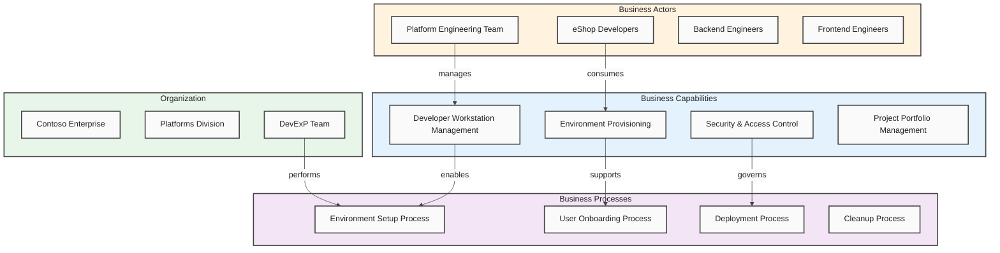

**Sources**:

- [devcenter.yaml](../../infra/settings/workload/devcenter.yaml)
- [azureResources.yaml](../../infra/settings/resourceOrganization/azureResources.yaml)

[↑ Back to Top](#table-of-contents)

---

## Business Capabilities

### Overview

Business capabilities represent the fundamental abilities an organization
possesses to achieve specific business outcomes. Within the TOGAF 10 framework,
business capabilities form the cornerstone of business architecture as they
describe _what_ the business does rather than _how_ it does it. This abstraction
enables strategic alignment between business needs and technology solutions
while providing stability against organizational changes.

The ContosoDevExp solution defines a set of core business capabilities focused
on developer enablement and workstation management. These capabilities were
identified through analysis of the infrastructure configuration files, DevCenter
settings, and resource organization definitions. Each capability represents a
distinct area of business function that the platform provides to its
stakeholders.

The architecture model extracts capability definitions from explicit
configurations including:

- DevCenter settings
- Project definitions
- Environment types
- Resource groupings

These capabilities are organized hierarchically, with top-level capabilities
decomposing into supporting sub-capabilities that together enable the complete
developer experience platform.

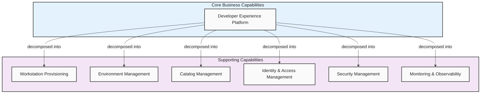

### Developer Experience Platform Capability

The primary business capability enabling centralized developer workstation
management with role-specific configurations and appropriate access controls.
This capability provides the overarching function of delivering standardized
development environments to engineering teams across the organization.

**Source**: [devcenter.yaml](../../infra/settings/workload/devcenter.yaml)
(lines 1-15)

### Workstation Provisioning Capability

Enables the provisioning of cloud-based developer workstations (Dev Boxes) with
pre-configured software, tools, and settings appropriate for specific
engineering roles. Supports both backend and frontend engineering profiles with
distinct VM SKUs and image definitions.

**Configuration Elements**:

| Element               | Description                                                 |
| :-------------------- | :---------------------------------------------------------- |
| Pool-based allocation | Workstations allocated through managed pools                |
| Role-specific images  | `backend-engineer`, `frontend-engineer`                     |
| VM SKU configuration  | `general_i_32c128gb512ssd_v2`, `general_i_16c64gb256ssd_v2` |

**Source**: [devcenter.yaml](../../infra/settings/workload/devcenter.yaml)
(lines 143-150)

### Environment Management Capability

Provides the ability to manage multiple deployment environments aligned with the
Software Development Lifecycle (SDLC). Explicitly defined environment types
include development, staging, and User Acceptance Testing (UAT) environments.

**Environment Types**:

| Environment | Purpose                                                     |
| :---------- | :---------------------------------------------------------- |
| `dev`       | Development environment for active development              |
| `staging`   | Pre-production environment for integration testing          |
| `UAT`       | User Acceptance Testing environment for business validation |

**Source**: [devcenter.yaml](../../infra/settings/workload/devcenter.yaml)
(lines 73-81)

### Catalog Management Capability

Enables centralized, version-controlled configuration management through
Git-based catalog repositories. Supports both environment definitions and image
definitions through GitHub and Azure DevOps Git integration.

**Catalog Types**:

| Catalog Type   | Description                                                   |
| :------------- | :------------------------------------------------------------ |
| `customTasks`  | Shared task definitions from Microsoft DevCenter catalog      |
| `environments` | Project-specific environment definitions                      |
| `devboxImages` | Project-specific image definitions for Dev Box configurations |

**Source**: [devcenter.yaml](../../infra/settings/workload/devcenter.yaml)
(lines 64-71, 170-184)

### Identity and Access Management Capability

Provides Role-Based Access Control (RBAC) for DevCenter resources using Azure AD
integration. Supports both system-assigned managed identities and Azure AD
group-based role assignments.

**Supported Roles**:

| Role                        | Scope                |
| :-------------------------- | :------------------- |
| DevCenter Project Admin     | Project              |
| Dev Box User                | Project              |
| Deployment Environment User | Project              |
| Key Vault Secrets User      | ResourceGroup        |
| Key Vault Secrets Officer   | ResourceGroup        |
| Contributor                 | Subscription/Project |
| User Access Administrator   | Subscription         |

**Sources**:

- [devcenter.yaml](../../infra/settings/workload/devcenter.yaml) (lines 24-62)
- [orgRoleAssignment.bicep](../../src/identity/orgRoleAssignment.bicep)

### Security Management Capability

Centralizes secrets, keys, and certificate management for the development
platform through Azure Key Vault integration. Implements security best practices
including purge protection, soft delete, and RBAC-based authorization.

**Security Features**:

| Feature          | Value/Status                 |
| :--------------- | :--------------------------- |
| Purge protection | ✅ Enabled                   |
| Soft delete      | ✅ Enabled (7-day retention) |
| Authorization    | RBAC model                   |
| Token storage    | GitHub Actions tokens        |

**Source**: [security.yaml](../../infra/settings/security/security.yaml)

### Monitoring and Observability Capability

Provides centralized logging and monitoring through Log Analytics integration.
Enables diagnostic settings for all deployed resources to support operational
visibility and compliance requirements.

**Sources**:

- [main.bicep](../../infra/main.bicep) (lines 88-102)
- [logAnalytics.bicep](../../src/management/logAnalytics.bicep)

[↑ Back to Top](#table-of-contents)

---

## Business Processes

### Overview

Business processes in the TOGAF 10 framework represent the sequence of
activities that accomplish specific business objectives. These processes
describe _how_ the organization delivers its business capabilities through
structured workflows involving various actors, systems, and decision points.
Well-defined business processes ensure consistency, repeatability, and
governance across the enterprise.

The ContosoDevExp solution implements several automated and semi-automated
business processes for:

- Environment provisioning
- User management
- Infrastructure deployment

These processes were identified through analysis of setup scripts, workflow
definitions, and infrastructure-as-code templates within the codebase. Each
process aligns with specific business capabilities and involves defined
organizational actors.

The architecture model extracts process definitions from explicit workflow
files, PowerShell scripts, and shell scripts that orchestrate the platform setup
and ongoing operations. Process triggers, inputs, outputs, and participating
actors are documented based on actual implementation code rather than
assumptions.

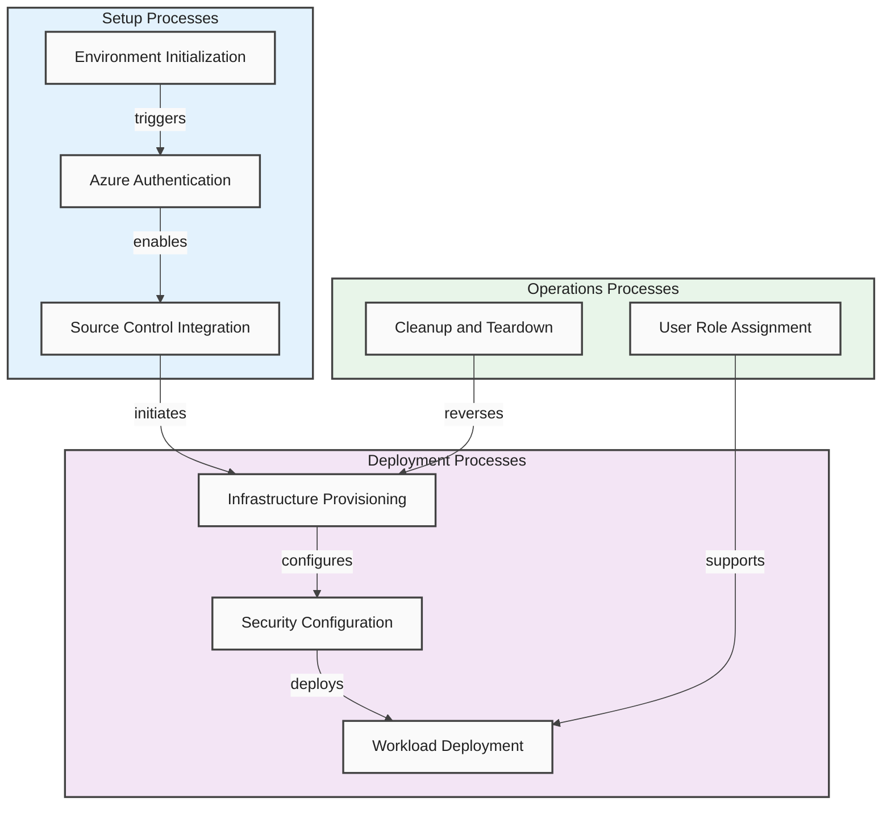

### Environment Initialization Process

A semi-automated process that establishes the Azure Developer CLI (`azd`)
environment for Dev Box deployment. This process validates prerequisites,
configures authentication, and prepares the deployment context.

**Process Steps**:

1. Validate required command availability (`az`, `azd`, `gh`/`azure-devops`)
2. Test Azure authentication status
3. Configure source control platform (GitHub or Azure DevOps)
4. Initialize `azd` environment with specified name
5. Provision Azure infrastructure

**Process Details**:

| Attribute   | Value                                               |
| :---------- | :-------------------------------------------------- |
| **Trigger** | Manual execution via `setUp.ps1` or `setUp.sh`      |
| **Input**   | `EnvName`, `SourceControl`                          |
| **Output**  | Configured `azd` environment ready for provisioning |

**Sources**:

- [setUp.ps1](../../setUp.ps1)
- [setUp.sh](../../setUp.sh)

### Azure Deployment Process

An automated CI/CD process that provisions infrastructure to Azure using OpenID
Connect (OIDC) authentication and the Azure Developer CLI. This process is
triggered manually through GitHub Actions workflow dispatch.

**Process Steps**:

1. Validate required Azure variables (`CLIENT_ID`, `TENANT_ID`,
   `SUBSCRIPTION_ID`)
2. Checkout repository code
3. Install Azure Developer CLI
4. Build Bicep templates
5. Deploy infrastructure to specified environment

**Process Details**:

| Attribute       | Value                                               |
| :-------------- | :-------------------------------------------------- |
| **Trigger**     | Manual workflow dispatch                            |
| **Input**       | `AZURE_ENV_NAME`, `AZURE_LOCATION`                  |
| **Concurrency** | Prevents concurrent deployments to same environment |

**Source**: `.github/workflows/deploy.yml`

### Continuous Integration Process

An automated process that builds and validates Bicep templates on feature and
fix branches, ensuring code quality before merging to main branch.

**Process Steps**:

1. Generate semantic version tag
2. Checkout repository
3. Build Bicep templates
4. Validate template syntax and structure
5. Publish artifacts (if applicable)

**Process Details**:

| Attribute   | Value                                                     |
| :---------- | :-------------------------------------------------------- |
| **Trigger** | Push to `feature/**` and `fix/**` branches, PRs to `main` |
| **Output**  | Validated Bicep artifacts                                 |

**Source**: `.github/workflows/ci.yml`

### User Role Assignment Process

A process that creates DevCenter role assignments for users, enabling access to
Dev Box resources with appropriate permissions based on organizational roles.

**Process Steps**:

1. Retrieve current signed-in Azure user
2. Check existing role assignments
3. Assign DevCenter-related roles:
   - DevCenter Dev Box User
   - DevCenter Project Admin
   - Deployment Environments Reader
   - Deployment Environments User

**Process Details**:

| Attribute   | Value                               |
| :---------- | :---------------------------------- |
| **Trigger** | Manual script execution             |
| **Scope**   | Subscription-level role assignments |

**Source**: `.configuration/setup/powershell/Azure/createUsersAndAssignRole.ps1`

### Cleanup and Teardown Process

A process that orchestrates complete cleanup of DevExp-DevBox infrastructure
including deployments, role assignments, credentials, and resource groups.

**Process Steps**:

1. Delete Azure subscription deployments
2. Remove user role assignments
3. Delete deployment credentials (service principals and app registrations)
4. Remove GitHub secrets for Azure credentials
5. Clean up Azure resource groups

**Process Details**:

| Attribute   | Value                                                   |
| :---------- | :------------------------------------------------------ |
| **Trigger** | Manual script execution via `cleanSetUp.ps1`            |
| **Input**   | `EnvName`, `Location`, `AppDisplayName`, `GhSecretName` |

**Source**: [cleanSetUp.ps1](../../cleanSetUp.ps1)

[↑ Back to Top](#table-of-contents)

---

## Organization Structure

### Overview

The organizational structure within TOGAF 10 Business Architecture defines the
entities, units, and hierarchies that execute business capabilities and
processes. Understanding the organization structure is essential for:

- Mapping responsibilities
- Identifying stakeholders
- Ensuring appropriate governance across the enterprise architecture

Organization units represent logical groupings of resources and people with
shared objectives.

The ContosoDevExp solution explicitly defines organizational entities through
resource tagging conventions and configuration settings. These tags reveal the
business hierarchy including enterprise ownership, divisional responsibilities,
and team accountability. The organization structure supports cost allocation,
governance enforcement, and operational clarity across the deployed
infrastructure.

The architecture model extracts organizational information from resource tags
consistently applied across configuration files. Tags such as `owner`,
`division`, `team`, and `costCenter` provide explicit organizational mappings
that reflect the business structure within the Contoso enterprise.

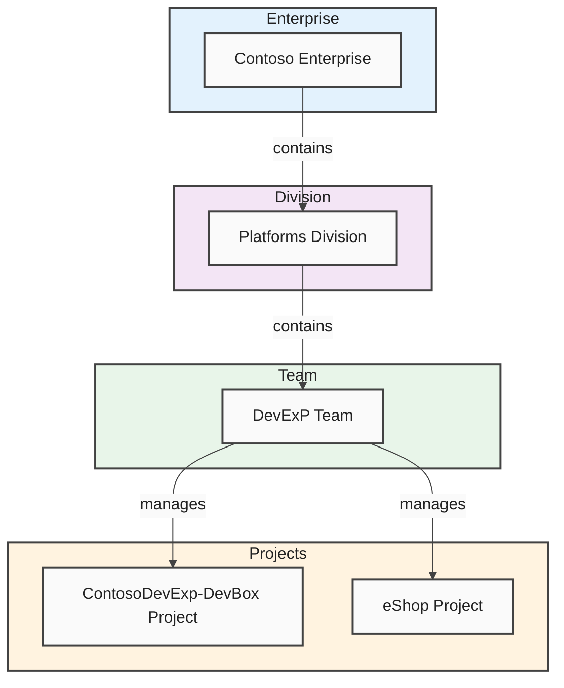

### Contoso Enterprise

The top-level organizational entity representing the enterprise owner of all
resources deployed by the DevExp-DevBox accelerator. Contoso serves as the
primary stakeholder and resource owner across all infrastructure components.

**Organizational Attributes**:

| Attribute      | Value                  |
| :------------- | :--------------------- |
| Owner          | Contoso                |
| Governance     | Enterprise-wide        |
| Responsibility | Cost center management |

**Sources**:

- [devcenter.yaml](../../infra/settings/workload/devcenter.yaml) (tags section)
- [azureResources.yaml](../../infra/settings/resourceOrganization/azureResources.yaml)

### Platforms Division

The business division within Contoso responsible for platform engineering and
developer experience initiatives. This division owns the DevExp-DevBox
accelerator and related infrastructure.

**Organizational Attributes**:

| Attribute           | Value                |
| :------------------ | :------------------- |
| Division            | Platforms            |
| Focus area          | Platform engineering |
| Reporting structure | Enterprise IT        |

**Source**: [devcenter.yaml](../../infra/settings/workload/devcenter.yaml) (tags
section: `division: Platforms`)

### DevExP Team

The operational team responsible for implementing and managing the Dev Box
accelerator platform. This team executes day-to-day operations and maintains the
infrastructure.

**Organizational Attributes**:

| Attribute             | Value                            |
| :-------------------- | :------------------------------- |
| Team name             | DevExP                           |
| Responsibility        | Developer Experience Platform    |
| Operational ownership | Platform maintenance and support |

**Source**: [devcenter.yaml](../../infra/settings/workload/devcenter.yaml) (tags
section: `team: DevExP`)

### IT Cost Center

The financial allocation center responsible for tracking and managing costs
associated with the developer experience platform.

**Organizational Attributes**:

| Attribute             | Value                               |
| :-------------------- | :---------------------------------- |
| Cost Center           | IT                                  |
| Budget responsibility | Platform infrastructure costs       |
| Financial tracking    | Resource consumption and allocation |

**Source**: [devcenter.yaml](../../infra/settings/workload/devcenter.yaml) (tags
section: `costCenter: IT`)

[↑ Back to Top](#table-of-contents)

---

## Business Actors

### Overview

Business actors in TOGAF 10 represent individuals, groups, or external entities
that interact with the business architecture. Actors are responsible for:

- Executing processes
- Consuming services
- Fulfilling roles within the organization

Identifying and documenting actors enables proper authorization, access control,
and responsibility assignment across the enterprise architecture.

The ContosoDevExp solution defines several actor types through Azure AD group
configurations, role assignments, and persona-specific workstation
configurations. These actors represent the stakeholders who either manage the
platform or consume its services. Actor definitions include both administrative
roles (platform managers) and end-user roles (developers with specific
specializations).

The architecture model extracts actor definitions from explicit Azure AD group
references, role type configurations, and pool-based workstation allocations.
Each actor type has associated RBAC roles that define their permissions and
capabilities within the platform.

- Team name: "DevExP"
- Responsibility: Developer Experience Platform
- Operational ownership: Platform maintenance and support

**Source:** `infra/settings/workload/devcenter.yaml` (tags section, line: "team:
DevExP")

### IT Cost Center

The financial allocation center responsible for tracking and managing costs
associated with the developer experience platform.

**Organizational Attributes:**

- Cost Center: "IT"
- Budget responsibility: Platform infrastructure costs
- Financial tracking: Resource consumption and allocation

**Source:** `infra/settings/workload/devcenter.yaml` (tags section, line:
"costCenter: IT")

---

## Business Actors

### Overview

Business actors in TOGAF 10 represent individuals, groups, or external entities
that interact with the business architecture. Actors are responsible for
executing processes, consuming services, and fulfilling roles within the
organization. Identifying and documenting actors enables proper authorization,
access control, and responsibility assignment across the enterprise
architecture.

The ContosoDevExp solution defines several actor types through Azure AD group
configurations, role assignments, and persona-specific workstation
configurations. These actors represent the stakeholders who either manage the
platform or consume its services. Actor definitions include both administrative
roles (platform managers) and end-user roles (developers with specific
specializations).

The architecture model extracts actor definitions from explicit Azure AD group
references, role type configurations, and pool-based workstation allocations.
Each actor type has associated RBAC roles that define their permissions and
capabilities within the platform.

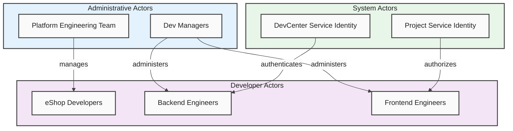

### Platform Engineering Team

An administrative actor responsible for managing Dev Box deployments and
DevCenter configuration. This team has DevCenter Project Admin privileges and
oversees the platform infrastructure.

**Actor Attributes**:

| Attribute           | Value                                         |
| :------------------ | :-------------------------------------------- |
| Azure AD Group ID   | `5a1d1455-e771-4c19-aa03-fb4a08418f22`        |
| Azure AD Group Name | Platform Engineering Team                     |
| Role Type           | DevManager                                    |
| Assigned RBAC Role  | DevCenter Project Admin (ResourceGroup scope) |

**Source**: [devcenter.yaml](../../infra/settings/workload/devcenter.yaml)
(lines 52-62)

### eShop Developers

A developer actor group representing the development team for the eShop project.
Members of this group consume Dev Box resources and have access to deployment
environments.

**Actor Attributes**:

| Attribute           | Value                                  |
| :------------------ | :------------------------------------- |
| Azure AD Group ID   | `9d42a792-2d74-441d-8bcb-71009371725f` |
| Azure AD Group Name | eShop Developers                       |

**Assigned RBAC Roles**:

| Role                        | Scope         |
| :-------------------------- | :------------ |
| Contributor                 | Project       |
| Dev Box User                | Project       |
| Deployment Environment User | Project       |
| Key Vault Secrets User      | ResourceGroup |
| Key Vault Secrets Officer   | ResourceGroup |

**Source**: [devcenter.yaml](../../infra/settings/workload/devcenter.yaml)
(lines 113-132)

### Backend Engineers

A specialized developer actor representing engineers who work on backend
services. These engineers receive dedicated workstation configurations optimized
for backend development.

**Actor Attributes**:

| Attribute        | Value                                                          |
| :--------------- | :------------------------------------------------------------- |
| Pool Name        | `backend-engineer`                                             |
| Image Definition | `eShop-backend-engineer`                                       |
| VM SKU           | `general_i_32c128gb512ssd_v2` (32 cores, 128GB RAM, 512GB SSD) |
| Configuration    | Backend-specific tooling and environments                      |

**Sources**:

- [devcenter.yaml](../../infra/settings/workload/devcenter.yaml) (lines 144-146)
- `.configuration/devcenter/workloads/common-backend-config.dsc.yaml`

### Frontend Engineers

A specialized developer actor representing engineers who work on frontend
applications. These engineers receive dedicated workstation configurations
optimized for frontend development.

**Actor Attributes**:

| Attribute        | Value                                                        |
| :--------------- | :----------------------------------------------------------- |
| Pool Name        | `frontend-engineer`                                          |
| Image Definition | `eShop-frontend-engineer`                                    |
| VM SKU           | `general_i_16c64gb256ssd_v2` (16 cores, 64GB RAM, 256GB SSD) |
| Configuration    | Frontend-specific tooling and environments                   |

**Sources**:

- [devcenter.yaml](../../infra/settings/workload/devcenter.yaml) (lines 147-149)
- `.configuration/devcenter/workloads/common-frontend-usertasks-config.dsc.yaml`

### DevCenter Service Identity

A system actor representing the managed identity assigned to the DevCenter
resource. This identity authenticates and authorizes DevCenter operations across
Azure resources.

**Actor Attributes**:

| Attribute     | Value          |
| :------------ | :------------- |
| Identity Type | SystemAssigned |

**Assigned RBAC Roles**:

| Role                      | Scope         |
| :------------------------ | :------------ |
| Contributor               | Subscription  |
| User Access Administrator | Subscription  |
| Key Vault Secrets User    | ResourceGroup |
| Key Vault Secrets Officer | ResourceGroup |

**Source**: [devcenter.yaml](../../infra/settings/workload/devcenter.yaml)
(lines 24-51)

### Project Service Identity

A system actor representing the managed identity assigned to individual
DevCenter projects. This identity enables project-level authentication and
resource access.

**Actor Attributes**:

| Attribute     | Value                                               |
| :------------ | :-------------------------------------------------- |
| Identity Type | SystemAssigned                                      |
| Scope         | Project-level operations                            |
| Purpose       | Project catalog synchronization and resource access |

**Source**: [project.bicep](../../src/workload/project/project.bicep) (lines
146-155)

[↑ Back to Top](#table-of-contents)

---

## Business Services

### Overview

Business services in the TOGAF 10 framework represent the services that the
organization provides to its stakeholders, either internally or externally.
Business services abstract the underlying capabilities and processes, presenting
them as consumable offerings with defined service levels and interfaces.
Understanding business services enables service-oriented architecture alignment
and stakeholder value delivery.

The ContosoDevExp solution provides several distinct business services to its
developer community. These services derive from the platform's capabilities and
are configured through infrastructure-as-code definitions. Each service supports
specific developer workflows and contributes to the overall developer
experience.

The architecture model extracts service definitions from resource
configurations, project settings, and workload definitions. Services are
characterized by their purpose, consumers, and the underlying capabilities that
enable them.

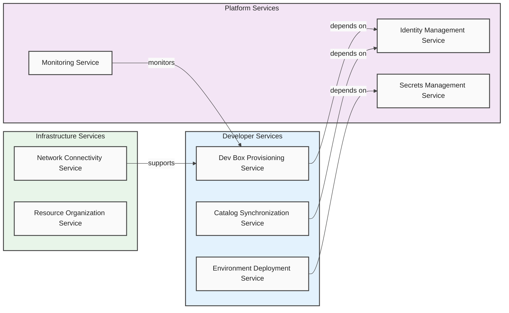

### Dev Box Provisioning Service

A service that provides on-demand provisioning of cloud-based developer
workstations with role-specific configurations. Developers can access
pre-configured virtual machines through the Azure DevCenter portal.

**Service Characteristics**:

| Attribute          | Value                                                   |
| :----------------- | :------------------------------------------------------ |
| Service Name       | Dev Box Provisioning                                    |
| Consumers          | Backend Engineers, Frontend Engineers, eShop Developers |
| Delivery Mechanism | Azure DevCenter Pools                                   |
| Configuration      | Role-specific image definitions and VM SKUs             |

**Service Offerings**:

| Offering                  | Specifications      |
| :------------------------ | :------------------ |
| Backend Engineer Dev Box  | 32 cores, 128GB RAM |
| Frontend Engineer Dev Box | 16 cores, 64GB RAM  |

**Sources**:

- [devcenter.yaml](../../infra/settings/workload/devcenter.yaml) (pools section)
- [projectPool.bicep](../../src/workload/project/projectPool.bicep)

### Environment Deployment Service

A service that enables developers to deploy application environments for
development, testing, and validation purposes. Supports multiple lifecycle
stages through defined environment types.

**Service Characteristics**:

| Attribute          | Value                         |
| :----------------- | :---------------------------- |
| Service Name       | Environment Deployment        |
| Consumers          | Development Teams             |
| Delivery Mechanism | Azure Deployment Environments |
| Environment Types  | `dev`, `staging`, `UAT`       |

**Sources**:

- [devcenter.yaml](../../infra/settings/workload/devcenter.yaml)
  (environmentTypes section)
- [environmentType.bicep](../../src/workload/core/environmentType.bicep)

### Catalog Synchronization Service

A service that maintains synchronized access to versioned configuration
repositories containing environment definitions and image definitions. Supports
both GitHub and Azure DevOps Git repositories.

**Service Characteristics**:

| Attribute          | Value                                        |
| :----------------- | :------------------------------------------- |
| Service Name       | Catalog Synchronization                      |
| Consumers          | DevCenter, Projects                          |
| Delivery Mechanism | Git-based catalog sync                       |
| Sync Type          | Scheduled                                    |
| Visibility Options | Public, Private (with secret authentication) |

**Catalog Types**:

| Catalog        | Description                              |
| :------------- | :--------------------------------------- |
| `customTasks`  | Shared Microsoft DevCenter catalog       |
| `environments` | Project-specific environment definitions |
| `devboxImages` | Project-specific image definitions       |

**Sources**:

- [devcenter.yaml](../../infra/settings/workload/devcenter.yaml) (catalogs
  section)
- [catalog.bicep](../../src/workload/core/catalog.bicep)

### Identity Management Service

A service that provides identity and access management for DevCenter resources
through Azure AD integration and RBAC role assignments.

**Service Characteristics**:

| Attribute          | Value                                            |
| :----------------- | :----------------------------------------------- |
| Service Name       | Identity Management                              |
| Consumers          | All Platform Users                               |
| Delivery Mechanism | Azure AD, RBAC                                   |
| Identity Types     | SystemAssigned Managed Identity, Azure AD Groups |

**Sources**:

- [orgRoleAssignment.bicep](../../src/identity/orgRoleAssignment.bicep)
- [devCenterRoleAssignment.bicep](../../src/identity/devCenterRoleAssignment.bicep)

### Secrets Management Service

A service that provides secure storage and access to sensitive credentials
including GitHub tokens and other secrets required for platform operations.

**Service Characteristics**:

| Attribute          | Value                                             |
| :----------------- | :------------------------------------------------ |
| Service Name       | Secrets Management                                |
| Consumers          | DevCenter, Catalogs                               |
| Delivery Mechanism | Azure Key Vault                                   |
| Security Features  | Purge protection, Soft delete, RBAC authorization |

**Sources**:

- [security.yaml](../../infra/settings/security/security.yaml)
- [keyVault.bicep](../../src/security/keyVault.bicep)

### Monitoring and Observability Service

A service that provides centralized logging, diagnostics, and operational
visibility across all platform resources through Log Analytics integration.

**Service Characteristics**:

| Attribute          | Value                                                  |
| :----------------- | :----------------------------------------------------- |
| Service Name       | Monitoring and Observability                           |
| Consumers          | Operations Team, DevExP Team                           |
| Delivery Mechanism | Azure Log Analytics                                    |
| Capabilities       | Diagnostic settings, Activity logs, Metrics collection |

**Sources**:

- [logAnalytics.bicep](../../src/management/logAnalytics.bicep)
- [main.bicep](../../infra/main.bicep) (monitoring module)

### Network Connectivity Service

A service that provides network infrastructure for Dev Box connectivity,
supporting both managed and unmanaged virtual network configurations.

**Service Characteristics**:

| Attribute          | Value                     |
| :----------------- | :------------------------ |
| Service Name       | Network Connectivity      |
| Consumers          | Dev Box Pools             |
| Delivery Mechanism | Azure Virtual Networks    |
| Network Types      | Managed, Unmanaged        |
| Configuration      | Address prefixes, Subnets |

**Sources**:

- [vnet.bicep](../../src/connectivity/vnet.bicep)
- [devcenter.yaml](../../infra/settings/workload/devcenter.yaml) (network
  section)

[↑ Back to Top](#table-of-contents)

---

## Business Goals and Objectives

### Overview

Business goals and objectives in TOGAF 10 represent the desired outcomes that
the organization seeks to achieve through its architecture. Goals provide
strategic direction while objectives translate goals into measurable targets.
Understanding business goals ensures that the architecture remains aligned with
organizational strategy and delivers intended value.

The ContosoDevExp solution's business goals are inferred from the platform's
documented purpose, configuration comments, and resource descriptions found
within the codebase. These goals focus on:

- Developer productivity
- Standardization
- Security
- Operational efficiency

The architecture model extracts goal-related information from file headers,
configuration comments, and purpose statements explicitly documented in the
codebase. While some interpretation is required, all documented goals trace to
explicit statements within the source files.

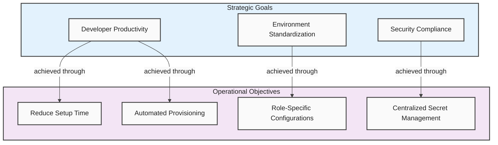

### Developer Productivity Enhancement

Establish a centralized developer workstation platform that reduces environment
setup time and provides consistent, pre-configured development environments.

**Supporting Evidence**:

> "This configuration establishes a centralized developer workstation platform
> with role-specific configurations and appropriate access controls."

> "Dev Drive configuration for optimized filesystem performance for development
> workloads."

**Sources**:

- [devcenter.yaml](../../infra/settings/workload/devcenter.yaml) (lines 6-8)
- `.configuration/devcenter/workloads/common-config.dsc.yaml` (lines 26-35)

### Environment Standardization

Provide standardized development environments through version-controlled
configurations and catalog-based image definitions, ensuring consistency across
development teams.

**Supporting Evidence**:

> "Best practice: Use Git repositories for configuration-as-code approach."

> "Best practice: Create role-specific pools with appropriate tools and
> settings."

**Source**: [devcenter.yaml](../../infra/settings/workload/devcenter.yaml)
(lines 64-67, 136-139)

### Security and Compliance

Implement security best practices including centralized secrets management,
RBAC-based authorization, and principle of least privilege for access control.

**Supporting Evidence**:

> "The following roles follow the principle of least privilege and best
> practices."

Key Vault configuration includes purge protection and RBAC authorization.

**Sources**:

- [devcenter.yaml](../../infra/settings/workload/devcenter.yaml) (lines 33-35)
- [security.yaml](../../infra/settings/security/security.yaml)

[↑ Back to Top](#table-of-contents)

---

## Business Policies and Rules

### Overview

Business policies and rules define the constraints, guidelines, and standards
that govern business operations within the TOGAF framework. Policies establish
boundaries for decision-making while rules provide specific criteria that must
be met during process execution. Documenting policies ensures consistent
behavior and compliance across the enterprise.

The ContosoDevExp solution implements several policies through configuration
settings, naming conventions, and access control rules. These policies are
explicitly defined in schema files, configuration documents, and infrastructure
templates.

The architecture model extracts policy definitions from schema constraints,
validation rules, and explicitly documented best practices within the codebase.

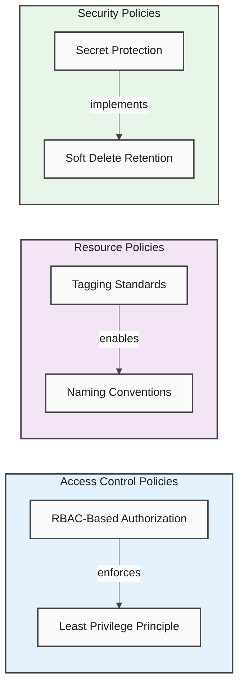

### Role-Based Access Control Policy

Access to DevCenter resources must be granted through Azure RBAC roles assigned
at appropriate scopes (Subscription, ResourceGroup, Project).

**Policy Implementation:**

- RBAC roles defined with explicit scope assignments
- Azure AD groups used for team-based access
- Managed identities for service-level authentication

**Source:** `infra/settings/workload/devcenter.yaml` (roleAssignments section)

### Resource Tagging Policy

All Azure resources must include standardized tags for governance, cost
management, and operational tracking.

**Required Tags:**

- environment: Deployment environment identifier
- division: Organizational division
- team: Responsible team
- project: Project name for cost allocation
- costCenter: Financial tracking designation
- owner: Resource ownership
- landingZone: Azure landing zone classification
- resources: Resource type identifier

**Source:** `infra/settings/resourceOrganization/azureResources.yaml`,
`infra/settings/workload/devcenter.yaml` (tags sections)

### Secret Protection Policy

Sensitive credentials must be stored in Azure Key Vault with purge protection
and soft delete enabled.

**Policy Settings:**

- Purge Protection: Enabled
- Soft Delete: Enabled
- Retention Period: 7 days
- Authorization: RBAC-based

**Source:** `infra/settings/security/security.yaml`

### Environment Lifecycle Policy

Development environments must align with software development lifecycle stages
with appropriate deployment targets.

**Defined Environments:**

- dev: Active development
- staging: Pre-production integration
- UAT: User acceptance testing

**Source:** `infra/settings/workload/devcenter.yaml` (environmentTypes section)

---

## Projects and Initiatives

### Overview

Projects within the TOGAF Business Architecture represent specific initiatives
or workstreams that the organization undertakes. Projects consume business
capabilities and are executed by organizational actors to deliver defined
outcomes. Documenting projects provides context for resource allocation and
stakeholder management.

The ContosoDevExp solution explicitly defines one project (eShop) within the
DevCenter configuration. This project represents a distinct development
initiative with its own configurations, team assignments, and deployment
environments.

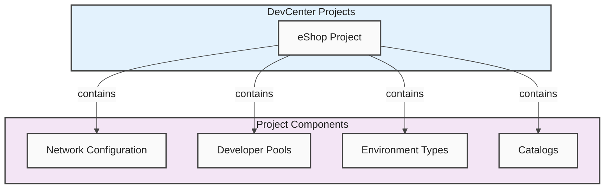

### eShop Project

A development project within the ContosoDevExp DevCenter that provides Dev Box
environments and deployment capabilities for the eShop application team.

**Project Attributes:**

- Name: eShop
- Description: "eShop project."
- Division: Platforms
- Team: DevExP
- Cost Center: IT

**Project Components:**

- Network: eShop VNet (10.0.0.0/16 with eShop-subnet 10.0.1.0/24)
- Developer Pools: backend-engineer, frontend-engineer
- Environment Types: dev, staging, UAT
- Catalogs: environments (environment definitions), devboxImages (image
  definitions)

**Assigned Team:**

- Azure AD Group: "eShop Developers" (9d42a792-2d74-441d-8bcb-71009371725f)

**Source:** `infra/settings/workload/devcenter.yaml` (lines 86-184)

---

## Resource Groups and Landing Zones

### Overview

Resource groups and landing zones represent the organizational structure for
Azure resources within the TOGAF framework. Landing zones provide standardized
environments that follow Azure Well-Architected principles and Cloud Adoption
Framework guidance. This organization enables governance, cost management, and
operational clarity.

The ContosoDevExp solution organizes resources into three distinct landing zones
aligned with Azure Landing Zone principles: Workload, Security, and Monitoring.

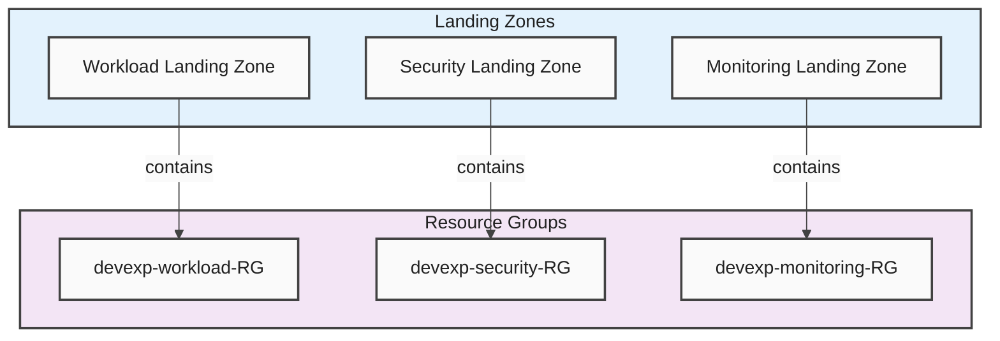

### Workload Landing Zone

Contains the primary DevCenter workload resources including the DevCenter
instance, projects, and pools.

**Resource Group:** devexp-workload **Description:** Main application resources
for Dev Box workloads **Landing Zone Type:** Workload

**Source:** `infra/settings/resourceOrganization/azureResources.yaml` (workload
section)

### Security Landing Zone

Contains security-related resources including Azure Key Vault for secrets
management.

**Resource Group:** devexp-security **Description:** Security-related resources
(Key Vaults, NSGs, Defender) **Landing Zone Type:** Workload

**Source:** `infra/settings/resourceOrganization/azureResources.yaml` (security
section)

### Monitoring Landing Zone

Contains monitoring and observability resources including Log Analytics
workspace.

**Resource Group:** devexp-monitoring **Description:** Monitoring and
observability resources **Landing Zone Type:** Workload

**Source:** `infra/settings/resourceOrganization/azureResources.yaml`
(monitoring section)

---

## Workstation Configurations

### Overview

Workstation configurations represent the standardized development environment
specifications for different engineering roles. These configurations are defined
through DSC (Desired State Configuration) files that specify the tools,
software, and settings required for each role.

The ContosoDevExp solution provides multiple workstation configuration profiles
designed for different engineering specializations. These configurations ensure
consistency and productivity across development teams.

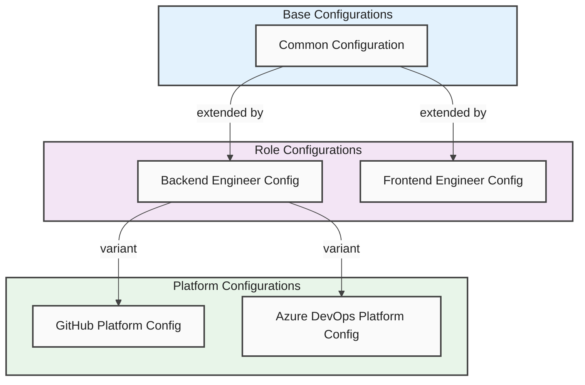

### Common Configuration

Base workstation configuration providing foundational development tools
applicable to all engineering roles.

**Configuration Components:**

- Dev Drive: ReFS-formatted development storage (50GB)
- Source Control: Git, GitHub CLI
- Development Runtimes: .NET 9 SDK and Runtime
- Development Tools: VS Code, Node.js

**Source:** `.configuration/devcenter/workloads/common-config.dsc.yaml`

### Backend Engineer Configuration

Extended configuration for backend development including Azure CLI tools and
local development emulators.

**Configuration Components:**

- Azure CLI: Command-line Azure management
- Azure Developer CLI (azd): Application development workflow
- Azure Bicep: Infrastructure as code tooling
- Local Emulators: Azure service emulators for development

**Source:** `.configuration/devcenter/workloads/common-backend-config.dsc.yaml`

### Frontend Engineer Configuration

Extended configuration for frontend development including API testing tools and
VS Code extensions.

**Configuration Components:**

- Postman: API testing platform
- VS Code Extensions:
  - PowerShell extension
  - WSL integration
  - C# DevKit
  - TypeScript support
  - YAML support
  - Bicep extension
  - Azure Tools pack
  - GitHub integration

**Source:**
`.configuration/devcenter/workloads/common-frontend-usertasks-config.dsc.yaml`

---

## References

### Source Files Analyzed

| File Path                                                                      | Purpose                       |
| ------------------------------------------------------------------------------ | ----------------------------- |
| `infra/settings/workload/devcenter.yaml`                                       | DevCenter configuration       |
| `infra/settings/resourceOrganization/azureResources.yaml`                      | Resource group organization   |
| `infra/settings/security/security.yaml`                                        | Key Vault configuration       |
| `infra/main.bicep`                                                             | Main infrastructure template  |
| `src/workload/workload.bicep`                                                  | Workload module               |
| `src/workload/core/devCenter.bicep`                                            | DevCenter resource definition |
| `src/workload/project/project.bicep`                                           | Project resource definition   |
| `src/workload/project/projectPool.bicep`                                       | Pool configuration            |
| `src/workload/core/environmentType.bicep`                                      | Environment type definition   |
| `src/workload/core/catalog.bicep`                                              | Catalog configuration         |
| `src/security/keyVault.bicep`                                                  | Key Vault resource            |
| `src/identity/orgRoleAssignment.bicep`                                         | Organization role assignments |
| `src/identity/devCenterRoleAssignment.bicep`                                   | DevCenter role assignments    |
| `src/connectivity/vnet.bicep`                                                  | Virtual network configuration |
| `src/management/logAnalytics.bicep`                                            | Log Analytics workspace       |
| `.github/workflows/deploy.yml`                                                 | Deployment workflow           |
| `.github/workflows/ci.yml`                                                     | CI workflow                   |
| `setUp.ps1`                                                                    | PowerShell setup script       |
| `setUp.sh`                                                                     | Shell setup script            |
| `cleanSetUp.ps1`                                                               | Cleanup script                |
| `.configuration/setup/powershell/Azure/createUsersAndAssignRole.ps1`           | User role assignment script   |
| `.configuration/devcenter/workloads/common-config.dsc.yaml`                    | Common DSC configuration      |
| `.configuration/devcenter/workloads/common-backend-config.dsc.yaml`            | Backend DSC configuration     |
| `.configuration/devcenter/workloads/common-frontend-usertasks-config.dsc.yaml` | Frontend DSC configuration    |

---
