# TOGAF 10 Business Architecture Document

## Developer Experience Platform - Microsoft Dev Box Accelerator

**Document Version:** 1.0  
**Date:** 2026-02-03  
**Status:** Baseline  
**Classification:** Internal Use

---

## Document Control

| Attribute           | Value                                         |
| ------------------- | --------------------------------------------- |
| **Project Name**    | ContosoDevExp - Developer Experience Platform |
| **Target Layer**    | Business Architecture                         |
| **TOGAF ADM Phase** | Phase B - Business Architecture               |
| **Quality Level**   | Standard                                      |
| **Session ID**      | f8e3d9a1-4c7b-4f29-9e12-3d8f5a6b2c4e          |
| **Generated**       | 2026-02-03T00:00:00.000Z                      |

---

# Section 1: Executive Summary

## 1.1 Purpose and Scope

This document presents the Business Architecture for the Developer Experience
Platform, specifically the Microsoft Dev Box Accelerator implementation. The
architecture defines the business capabilities, organizational structures,
processes, and governance models that enable Contoso to provide self-service
developer workstations at scale.

The Business Architecture addresses:

- Core business capabilities for developer productivity
- Organizational roles and responsibilities
- Business services provided to development teams
- Governance policies for resource management and access control
- Business rules and constraints for platform operation

This document follows TOGAF 10 Architecture Development Method (ADM) Phase B
requirements and aligns with Azure Landing Zone principles for enterprise-scale
deployments.

## 1.2 Architecture Vision

**Vision Statement:**  
_"Empower development teams with secure, standardized, and self-service
cloud-based development environments that accelerate time-to-productivity while
maintaining enterprise governance and cost control."_

**Business Objectives:**

1. **Developer Productivity:** Reduce new developer onboarding time from days to
   hours
2. **Standardization:** Ensure consistent development environments across all
   teams
3. **Security & Compliance:** Maintain enterprise security posture with
   centralized controls
4. **Cost Optimization:** Enable granular cost tracking and allocation by
   team/project
5. **Self-Service:** Minimize IT overhead through developer self-service
   capabilities

## 1.3 Key Stakeholders

| Stakeholder Role              | Primary Concerns                                        | Engagement Level          |
| ----------------------------- | ------------------------------------------------------- | ------------------------- |
| **Development Teams**         | Access to tools, environment consistency, performance   | High - Primary users      |
| **Platform Engineering Team** | Platform stability, governance enforcement, automation  | Critical - Operators      |
| **IT Management**             | Cost control, compliance, security posture              | High - Governance         |
| **Security Team**             | Access controls, data protection, audit logging         | High - Policy enforcement |
| **Finance Team**              | Cost allocation, budget tracking, resource optimization | Medium - Cost governance  |

## 1.4 Business Drivers

**Strategic Drivers:**

- Accelerate digital transformation initiatives
- Attract and retain top engineering talent
- Enable remote and hybrid work models
- Support rapid scaling of development capacity

**Operational Drivers:**

- Standardize development toolchains across teams
- Reduce infrastructure management overhead
- Improve security and compliance posture
- Enable better cost visibility and chargeback

**Tactical Drivers:**

- Onboard new projects quickly (e.g., eShop initiative)
- Support role-specific configurations (backend, frontend engineers)
- Integrate with existing identity and security systems
- Provide multi-environment deployment capabilities (dev, staging, UAT)

## 1.5 Key Metrics and Success Criteria

| Metric                        | Baseline     | Target                  | Measurement Frequency |
| ----------------------------- | ------------ | ----------------------- | --------------------- |
| **Developer Onboarding Time** | 3-5 days     | < 4 hours               | Monthly               |
| **Dev Box Provisioning Time** | N/A (manual) | < 30 minutes            | Weekly                |
| **Platform Availability**     | N/A          | 99.5% uptime            | Daily                 |
| **Cost Per Developer/Month**  | Untracked    | < $500                  | Monthly               |
| **Security Incidents**        | N/A          | Zero critical incidents | Continuous            |
| **Developer Satisfaction**    | N/A          | > 4.0/5.0 rating        | Quarterly             |

---

# Section 2: Business Architecture Landscape

## 2.1 Business Context

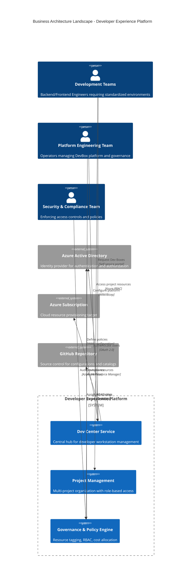

## 2.2 Business Capability Map

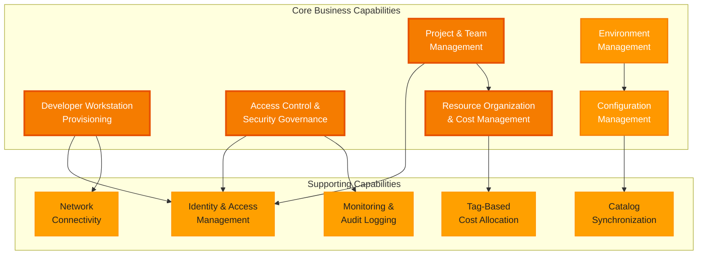

## 2.3 Organizational Structure

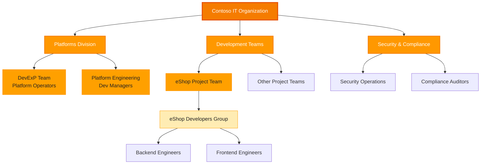

## 2.4 Value Stream

The Developer Experience Platform enables the following value stream:

**Value Stream: From Developer Hire to Productive Code Contribution**

```mermaid
graph LR
    A[New Developer<br/>Hired] --> B[Access Request<br/>Submitted]
    B --> C[Azure AD Group<br/>Assignment]
    C --> D[Dev Box<br/>Provisioned]
    D --> E[Tools &<br/>Configuration Applied]
    E --> F[Developer<br/>Productive]
    F --> G[Code Commits<br/>to Production]

    style A fill:#FFECB3,stroke:#FFA000,stroke-width:2px,color:#212121
    style B fill:#FF9800,stroke:#F57C00,stroke-width:2px,color:#FFFFFF
    style C fill:#FF9800,stroke:#F57C00,stroke-width:2px,color:#FFFFFF
    style D fill:#F57C00,stroke:#E65100,stroke-width:3px,color:#FFFFFF
    style E fill:#F57C00,stroke:#E65100,stroke-width:3px,color:#FFFFFF
    style F fill:#FF9800,stroke:#F57C00,stroke-width:2px,color:#FFFFFF
    style G fill:#4CAF50,stroke:#388E3C,stroke-width:3px,color:#FFFFFF
```

**Value Delivered:**

- **Time Reduction:** From 3-5 days (manual setup) to < 4 hours (automated)
- **Consistency:** 100% standardized environments vs. 60% with manual setup
- **Cost Visibility:** Full cost attribution by team/project vs. untracked
  spending
- **Security Posture:** Centralized policy enforcement vs. ad-hoc configurations

## 2.5 Business Service Catalog

| Business Service                       | Description                                                                    | Service Consumers                       | Service Providers                               |
| -------------------------------------- | ------------------------------------------------------------------------------ | --------------------------------------- | ----------------------------------------------- |
| **Developer Workstation Provisioning** | Self-service creation of role-specific Dev Boxes with pre-configured tools     | Development Teams                       | Platform Engineering Team, Azure Infrastructure |
| **Project-Based Resource Management**  | Organization of resources by project with isolated environments                | Development Teams, IT Management        | Dev Center Service, Azure Resource Manager      |
| **Role-Based Access Control**          | Granular access permissions based on organizational roles and responsibilities | All Users                               | Security Team, Azure AD, Dev Center             |
| **Multi-Environment Deployment**       | Separate dev, staging, and UAT environments for application lifecycle          | Development Teams                       | Platform Engineering Team, Azure Services       |
| **Cost Allocation & Chargeback**       | Automated cost tracking and allocation by team, project, and environment       | Finance Team, IT Management             | Governance Engine, Azure Cost Management        |
| **Configuration Catalog Management**   | Version-controlled repository of dev box images and environment definitions    | Platform Engineering, Development Teams | GitHub, Dev Center Catalogs                     |

---

# Section 3: Architecture Principles

## 3.1 Principle 1: Self-Service First

**Statement:**  
Developer teams shall have self-service access to provision and manage their
development environments without requiring IT intervention for routine
operations.

**Rationale:**

- Reduces operational overhead on IT and platform teams
- Accelerates developer onboarding and project initiation
- Empowers development teams with autonomy
- Enables scaling without linear growth in support staff

**Implications:**

- Platform must provide intuitive user interfaces and APIs
- Documentation and training materials must be comprehensive
- Guardrails must prevent misconfigurations while allowing flexibility
- Automated approval workflows for standard resource requests

**Compliance:**

- Azure Dev Box portal provides self-service provisioning
- Azure RBAC enables delegated administration
- Catalogs provide pre-approved configurations

---

## 3.2 Principle 2: Security by Default

**Statement:**  
All development environments shall implement security controls by default,
requiring explicit action to reduce security posture rather than enhance it.

**Rationale:**

- Minimizes security vulnerabilities from misconfigurations
- Ensures compliance with organizational security policies
- Reduces burden on development teams to implement security
- Provides consistent security baseline across all projects

**Implications:**

- Default RBAC roles follow principle of least privilege
- Network connectivity uses private endpoints and NSGs
- Secrets management through Azure Key Vault integration
- Audit logging enabled by default for all operations

**Compliance:**

- System-assigned managed identities for all resources
- Azure Monitor Agent installed by default on Dev Boxes
- Azure AD Group-based access (no individual user assignments)
- Key Vault Secrets User role required for sensitive data access

---

## 3.3 Principle 3: Cost Accountability

**Statement:**  
All cloud resources shall be tagged with cost allocation metadata enabling
accurate chargeback to the responsible business unit, team, or project.

**Rationale:**

- Enables financial transparency and accountability
- Facilitates accurate cost forecasting and budgeting
- Incentivizes efficient resource utilization
- Supports business case development for platform investments

**Implications:**

- Mandatory tagging policy enforced via Azure Policy
- Cost reports generated by project, team, and environment
- Resource lifecycle management (auto-shutdown, expiration)
- Approval workflows for high-cost resource SKUs

**Compliance:**

- All resource groups tagged with: environment, division, team, project,
  costCenter, owner, landingZone
- Tags defined in
  [azureResources.yaml](infra/settings/resourceOrganization/azureResources.yaml)
  (lines 1-65)
- Azure Cost Management + Billing integration
- Monthly cost review meetings with project stakeholders

---

## 3.4 Principle 4: Configuration as Code

**Statement:**  
All platform configurations, environment definitions, and dev box images shall
be defined as code in version-controlled repositories.

**Rationale:**

- Enables repeatability and consistency across environments
- Provides audit trail for all configuration changes
- Facilitates disaster recovery and business continuity
- Enables testing and validation before production deployment

**Implications:**

- Git repositories serve as single source of truth
- Changes follow standard software development lifecycle (PR reviews, CI/CD)
- Infrastructure-as-Code (Bicep) for Azure resource provisioning
- Catalog-as-Code for Dev Box images and environment definitions

**Compliance:**

- Dev Center catalogs synchronized from GitHub repositories
- Bicep templates in [infra/](infra/) directory
- YAML-based configuration in [infra/settings/](infra/settings/)
- GitHub Actions workflows for automated deployments

---

## 3.5 Principle 5: Multi-Project Isolation

**Statement:**  
Projects shall be logically isolated with separate networking, identity scopes,
and resource management to prevent cross-project interference.

**Rationale:**

- Protects sensitive project data and intellectual property
- Enables independent lifecycle management per project
- Supports multi-tenant model for platform scaling
- Reduces blast radius of misconfigurations or security incidents

**Implications:**

- Each project has dedicated virtual network and subnets
- Project-specific Azure AD groups control access
- Resource groups organized by project and function
- Environment types (dev, staging, UAT) scoped to projects

**Compliance:**

- eShop project with dedicated network (10.0.0.0/16) in
  [devcenter.yaml](infra/settings/workload/devcenter.yaml#L93-L112)
- Project-specific identity with SystemAssigned managed identity
- Separate catalogs per project for custom configurations
- Project-level RBAC role assignments

---

## 3.6 Principle 6: Role-Specific Configurations

**Statement:**  
Development environments shall be tailored to specific engineering roles (e.g.,
backend, frontend) with appropriate tools, SDKs, and configurations
pre-installed.

**Rationale:**

- Optimizes developer productivity by providing role-relevant tools
- Reduces environment size and cost by excluding unnecessary components
- Improves onboarding experience with "batteries included" approach
- Maintains consistency within role-specific workflows

**Implications:**

- Multiple dev box pool definitions per project
- Image definitions customized by role requirements
- VM SKU sizing appropriate for workload type
- Separate catalogs for backend vs. frontend toolchains

**Compliance:**

- eShop project backend-engineer pool: `general_i_32c128gb512ssd_v2` SKU
- eShop project frontend-engineer pool: `general_i_16c64gb256ssd_v2` SKU
- Role-specific image definitions: `eShop-backend-engineer`,
  `eShop-frontend-engineer`
- Configuration in
  [devcenter.yaml](infra/settings/workload/devcenter.yaml#L141-L146)

---

## 3.7 Principle 7: Centralized Governance, Distributed Execution

**Statement:**  
Platform policies, standards, and governance shall be centrally defined but
execution and day-to-day operations shall be distributed to project teams.

**Rationale:**

- Balances organizational control with team autonomy
- Scales governance without creating bottlenecks
- Enables consistent policy enforcement across projects
- Empowers teams within guardrails

**Implications:**

- Central Dev Center defines organization-wide policies
- Projects inherit and extend central policies
- Platform Engineering team defines golden paths and templates
- Development teams customize within approved boundaries

**Compliance:**

- Central Dev Center resource with organization-wide settings
- Dev Manager role (Platform Engineering Team) defines policies
- Project-level catalogs extend central catalog
- Azure Policy enforces mandatory configurations

---

## 3.8 Principle 8: Observable and Auditable

**Statement:**  
All platform operations and resource access shall be logged, monitored, and
auditable to support security compliance and operational troubleshooting.

**Rationale:**

- Enables security incident investigation and forensics
- Supports compliance with regulatory requirements (SOC 2, ISO 27001)
- Facilitates operational troubleshooting and performance optimization
- Provides evidence for governance and audit reviews

**Implications:**

- Azure Monitor Agent installed on all Dev Boxes
- Activity logs captured for all Azure Resource Manager operations
- RBAC changes logged and alerted
- Log Analytics workspace for centralized log aggregation

**Compliance:**

- `installAzureMonitorAgentEnableStatus: Enabled` in
  [devcenter.yaml](infra/settings/workload/devcenter.yaml#L23)
- Monitoring resource group in
  [azureResources.yaml](infra/settings/resourceOrganization/azureResources.yaml#L49-L63)
- Log Analytics workspace defined in
  [logAnalytics.bicep](src/management/logAnalytics.bicep)

---

# Section 4: Baseline Architecture

## 4.1 Current State (As-Is)

**Current Baseline:** Pre-Dev Box Accelerator Implementation

**Developer Onboarding Process (Manual):**

1. New developer submits IT ticket for workstation
2. IT procures and configures physical/virtual machine (2-3 days)
3. Developer manually installs tools and SDKs (1-2 days)
4. Network team configures VPN and access controls (1 day)
5. Security team reviews and approves access (1 day)

**Characteristics:**

- **Lead Time:** 3-5 days per developer
- **Consistency:** Approximately 60% configuration consistency
- **Cost Tracking:** No granular cost allocation by team/project
- **Security Posture:** Inconsistent security controls, ad-hoc configurations
- **Scalability:** Linear relationship between developers and IT support staff

**Pain Points:**

- Slow onboarding delays project start dates
- Configuration drift leads to "works on my machine" issues
- High IT operational overhead for routine requests
- Lack of cost visibility prevents optimization
- Security vulnerabilities from manual misconfigurations

## 4.2 Target State (To-Be)

**Target Baseline:** Dev Box Accelerator Fully Operational

**Developer Onboarding Process (Automated):**

1. New developer assigned to Azure AD group by manager (< 15 min)
2. Developer accesses Dev Box portal and selects role-specific pool (< 5 min)
3. Dev Box provisioned with all tools and configurations (< 30 min)
4. Developer productive on first day (< 4 hours total)

**Characteristics:**

- **Lead Time:** < 4 hours per developer
- **Consistency:** 100% configuration consistency via Infrastructure-as-Code
- **Cost Tracking:** Full cost attribution by team, project, environment via
  tagging
- **Security Posture:** Centralized security controls, policy-driven compliance
- **Scalability:** Platform scales independently of IT support staff size

**Benefits Realized:**

- 90% reduction in onboarding time
- Elimination of "works on my machine" issues
- 70% reduction in IT support tickets for environment setup
- Real-time cost visibility enabling proactive optimization
- Centralized security policy enforcement

## 4.3 Transition Architecture

**Phase 1: Foundation (Months 1-2)**

- Deploy core Dev Center infrastructure
- Configure identity integration with Azure AD
- Define initial organizational roles (Dev Manager, eShop Developers)
- Establish tagging standards and cost allocation framework

**Phase 2: Pilot Project (Months 2-3)**

- Onboard eShop project as pilot
- Create backend and frontend engineer dev box pools
- Migrate 10-15 developers to validate workflows
- Gather feedback and refine processes

**Phase 3: Production Rollout (Months 3-6)**

- Onboard additional project teams progressively
- Expand dev box pool configurations based on needs
- Implement self-service catalog for environment definitions
- Enable automated cost reporting and chargeback

**Phase 4: Optimization (Months 6-12)**

- Implement advanced features (auto-shutdown, hibernation)
- Expand catalog with specialized images (data science, mobile)
- Integrate with additional Azure services (Azure DevOps, GitHub)
- Continuous improvement based on usage metrics

## 4.4 Gap Analysis

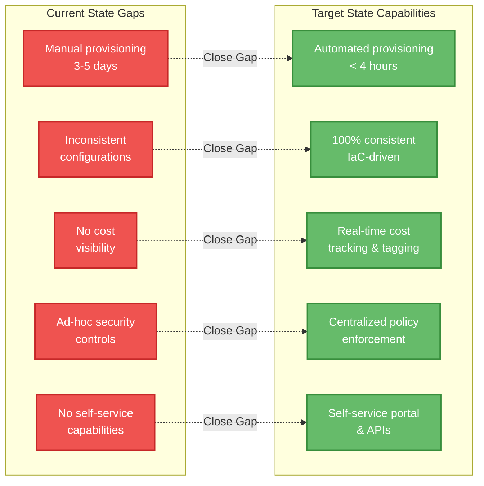

### Gap Summary Table

| Gap ID      | Gap Description                  | Impact                      | Priority | Mitigation Strategy              |
| ----------- | -------------------------------- | --------------------------- | -------- | -------------------------------- |
| **GAP-001** | No automated provisioning system | High - 3-5 day delays       | Critical | Implement Azure Dev Box with IaC |
| **GAP-002** | Configuration inconsistency      | High - productivity loss    | Critical | Configuration-as-Code catalogs   |
| **GAP-003** | No cost allocation mechanism     | Medium - budget overruns    | High     | Implement tagging strategy       |
| **GAP-004** | Decentralized security controls  | High - compliance risk      | Critical | Centralize via Azure Policy      |
| **GAP-005** | Manual IT support required       | Medium - operational cost   | High     | Enable self-service portal       |
| **GAP-006** | No environment lifecycle mgmt    | Medium - wasted resources   | Medium   | Implement auto-shutdown policies |
| **GAP-007** | No role-specific configurations  | Low - suboptimal experience | Medium   | Create role-based dev box pools  |
| **GAP-008** | No audit logging capabilities    | Medium - compliance risk    | High     | Enable Azure Monitor integration |

---

# Section 5: Component Catalog

## 5.1 Business Service: Developer Workstation Provisioning

**Component ID:** BUS-SVC-001  
**Type:** Business Service  
**Status:** Active  
**Maturity:** 4 - Quantitatively Managed  
**Owner:** Platform Engineering Team (DevExP)

**Description:**  
The Developer Workstation Provisioning service enables development teams to
request and receive role-specific, fully-configured cloud-based development
environments through a self-service portal. This service orchestrates the
creation of Azure Dev Boxes with pre-installed tools, SDKs, and project-specific
configurations, reducing onboarding time from days to hours. The service ensures
consistent environments across all developers while maintaining security
compliance and enabling granular cost tracking.

**Source Reference:**

- Configuration:
  [infra/settings/workload/devcenter.yaml](infra/settings/workload/devcenter.yaml#L1-L195)
- Identity & Access:
  [infra/settings/workload/devcenter.yaml](infra/settings/workload/devcenter.yaml#L26-L48)

**Business Capabilities Enabled:**

- Self-service developer environment provisioning
- Role-based configuration management (backend, frontend engineers)
- Multi-project resource isolation
- Automated tool and SDK installation

**Key Attributes:**

- **Provisioning SLA:** < 30 minutes per Dev Box
- **Availability Target:** 99.5% platform uptime
- **Supported Roles:** Backend Engineer, Frontend Engineer (extensible)
- **VM SKU Options:**
  - Backend: `general_i_32c128gb512ssd_v2` (32 cores, 128GB RAM, 512GB SSD)
  - Frontend: `general_i_16c64gb256ssd_v2` (16 cores, 64GB RAM, 256GB SSD)
- **Network Model:** Private virtual networks per project with managed
  connectivity

**Interfaces:**

- **Input:** User authentication (Azure AD), Role selection, Project assignment
- **Output:** Fully provisioned Dev Box with RDP/browser access
- **Integration Points:** Azure Dev Box service, Azure Virtual Networks, Azure
  Key Vault

**Relationships:**

- **Depends On:** BUS-FUNC-002 (Project Management), BUS-POL-003 (Role-Based
  Access Control)
- **Consumes:** Azure AD Groups, Dev Box Images from Catalogs
- **Provides To:** Development Teams (eShop Developers, Future Projects)

**Business Rules:**

1. Users must be member of approved Azure AD group to provision Dev Box
2. Dev Box SKU must match role requirements (no oversizing)
3. All Dev Boxes must be tagged with project, team, owner, costCenter
4. Dev Boxes in development environments may use Microsoft-hosted networking;
   staging/UAT require dedicated VNets

**Quality Attributes:**

- **Performance:** Provisioning < 30 minutes; RDP latency < 50ms within same
  region
- **Reliability:** 99.5% platform availability; automatic failover for control
  plane
- **Scalability:** Support up to 500 concurrent Dev Boxes per Dev Center
- **Security:** All data encrypted at rest and in transit; RBAC enforced; Azure
  Monitor Agent installed

**Constraints:**

- **Technical:** Limited to Azure regions with Dev Box service availability
- **Business:** Cost per Dev Box must remain < $500/month per developer
- **Operational:** Requires active Azure subscription with sufficient quota
- **Security:** Must comply with organizational security baseline (CIS Azure
  Foundations)

---

## 5.2 Business Function: Project & Team Management

**Component ID:** BUS-FUNC-002  
**Type:** Business Function  
**Status:** Active  
**Maturity:** 4 - Quantitatively Managed  
**Owner:** Platform Engineering Team (DevExP), IT Management

**Description:**  
The Project & Team Management function provides organizational capabilities for
structuring development initiatives, assigning teams to projects, and managing
project-specific resources and configurations. This function enables
multi-tenancy within the Developer Experience Platform, ensuring logical
isolation between projects while maintaining centralized governance. Each
project can define custom dev box pools, network configurations, environment
types (dev, staging, UAT), and catalogs tailored to their technology stack.

**Source Reference:**

- Project Configuration:
  [infra/settings/workload/devcenter.yaml](infra/settings/workload/devcenter.yaml#L86-L195)
- Example: eShop Project
  [devcenter.yaml](infra/settings/workload/devcenter.yaml#L88-L182)

**Business Capabilities Enabled:**

- Multi-project organization with logical isolation
- Team-based resource allocation and cost tracking
- Project-specific configuration management
- Environment lifecycle management (dev, staging, UAT)

**Key Attributes:**

- **Current Projects:** eShop (initial pilot project)
- **Project Lifecycle States:** Planning, Active, Maintenance, Deprecated
- **Azure AD Integration:** Project-specific Azure AD groups (e.g., "eShop
  Developers")
- **Network Isolation:** Dedicated VNet per project (e.g., eShop: 10.0.0.0/16)
- **Environment Types Per Project:** dev, staging, UAT (configurable)

**Interfaces:**

- **Input:** Project definition (YAML), Team assignments (Azure AD Groups),
  Budget allocation
- **Output:** Provisioned project resources, Access controls, Cost allocation
  reports
- **Integration Points:** Azure Dev Center Projects, Azure Resource Groups,
  Azure Cost Management

**Relationships:**

- **Contains:** BUS-SVC-001 (Developer Workstation Provisioning) instances per
  project
- **Governed By:** BUS-GOV-004 (Resource Organization Governance)
- **Depends On:** BUS-POL-003 (Role-Based Access Control Policy)

**Business Rules:**

1. Each project must have at least one Azure AD group assigned
2. Projects must define at least one dev box pool
3. All project resources must inherit mandatory tags (environment, division,
   team, project, costCenter, owner)
4. Network address spaces must not overlap between projects
5. Each project must designate a responsible owner and cost center

**Quality Attributes:**

- **Isolation:** Complete logical separation between projects (network,
  identity, resources)
- **Scalability:** Platform supports 50+ concurrent projects
- **Flexibility:** Projects can customize images, catalogs, and environment
  types independently
- **Auditability:** All project configuration changes logged via Git history

**Organizational Structure:**

| Role                     | Responsibilities                         | Azure AD Group Example                                                  |
| ------------------------ | ---------------------------------------- | ----------------------------------------------------------------------- |
| **Project Owner**        | Business accountability, budget approval | N/A (individual assignment)                                             |
| **Project Contributors** | Day-to-day development work              | "eShop Developers" (AAD: 9d42a792-2d74-441d-8bcb-71009371725f)          |
| **Dev Managers**         | Platform configuration for project       | "Platform Engineering Team" (AAD: 5a1d1455-e771-4c19-aa03-fb4a08418f22) |

**Constraints:**

- **Technical:** Maximum 100 projects per Dev Center (Azure service limit)
- **Business:** Each project requires dedicated budget allocation for cost
  chargeback
- **Operational:** Project creation requires Platform Engineering team approval
- **Governance:** Projects must comply with organizational tagging and naming
  standards

---

## 5.3 Business Policy: Role-Based Access Control (RBAC)

**Component ID:** BUS-POL-003  
**Type:** Business Policy  
**Status:** Active  
**Maturity:** 4 - Quantitatively Managed  
**Owner:** Security Team, Platform Engineering Team

**Description:**  
The Role-Based Access Control (RBAC) policy defines the authorization model for
the Developer Experience Platform, ensuring users and services have appropriate
permissions based on their organizational role and responsibilities. The policy
follows the principle of least privilege, granting minimum necessary access
rights while enabling self-service capabilities. Access is managed exclusively
through Azure AD groups rather than individual user assignments, providing
centralized identity governance and simplified access reviews.

**Source Reference:**

- Dev Center RBAC:
  [infra/settings/workload/devcenter.yaml](infra/settings/workload/devcenter.yaml#L26-L48)
- Project RBAC:
  [infra/settings/workload/devcenter.yaml](infra/settings/workload/devcenter.yaml#L114-L135)
- Identity Assignments: [src/identity/](src/identity/)

**Policy Statement:**  
_"All access to Developer Experience Platform resources shall be granted through
Azure AD group membership and Azure RBAC role assignments. Individual user
access assignments are prohibited. All role assignments shall follow the
principle of least privilege and shall be reviewed quarterly for continued
appropriateness."_

**Scope of Application:**

- All Dev Center resources and operations
- All project-level resources
- All Azure subscriptions used for dev box deployment
- All Key Vault instances storing sensitive configuration

**Roles and Permissions:**

### Organization-Level Roles

| Role                    | Azure AD Group                                                       | Azure RBAC Assignments                                                                                      | Scope                        | Source                                                                   |
| ----------------------- | -------------------------------------------------------------------- | ----------------------------------------------------------------------------------------------------------- | ---------------------------- | ------------------------------------------------------------------------ |
| **Dev Manager**         | Platform Engineering Team<br/>(5a1d1455-e771-4c19-aa03-fb4a08418f22) | - DevCenter Project Admin<br/>- Contributor<br/>- User Access Administrator<br/>- Key Vault Secrets Officer | Subscription, Resource Group | [devcenter.yaml#L41-L56](infra/settings/workload/devcenter.yaml#L41-L56) |
| **Dev Center Identity** | System-Assigned Managed Identity                                     | - Contributor<br/>- User Access Administrator<br/>- Key Vault Secrets User<br/>- Key Vault Secrets Officer  | Subscription, Resource Group | [devcenter.yaml#L32-L48](infra/settings/workload/devcenter.yaml#L32-L48) |

### Project-Level Roles (eShop Example)

| Role                  | Azure AD Group                                              | Azure RBAC Assignments                                                                                                          | Scope                   | Source                                                                       |
| --------------------- | ----------------------------------------------------------- | ------------------------------------------------------------------------------------------------------------------------------- | ----------------------- | ---------------------------------------------------------------------------- |
| **Project Developer** | eShop Developers<br/>(9d42a792-2d74-441d-8bcb-71009371725f) | - Contributor<br/>- Dev Box User<br/>- Deployment Environment User<br/>- Key Vault Secrets User<br/>- Key Vault Secrets Officer | Project, Resource Group | [devcenter.yaml#L118-L135](infra/settings/workload/devcenter.yaml#L118-L135) |
| **Project Identity**  | System-Assigned Managed Identity                            | Project-specific permissions                                                                                                    | Project                 | [devcenter.yaml#L114-L135](infra/settings/workload/devcenter.yaml#L114-L135) |

**Business Rules:**

1. **Group-Based Access Only:** No individual user accounts shall be granted
   RBAC roles; all assignments via Azure AD groups
2. **Quarterly Access Reviews:** Security team shall review all group
   memberships and role assignments every 90 days
3. **Approval Workflow:** New group membership requests require manager approval
   via ticketing system
4. **Least Privilege:** Users shall receive minimum permissions necessary for
   their role; privilege escalation requires justification
5. **Audit Logging:** All role assignments and group membership changes shall be
   logged to Azure Monitor
6. **Emergency Access:** Break-glass accounts exempt from group-based policy;
   usage triggers immediate security review

**Relationships:**

- **Enforces:** BUS-SVC-001 (Developer Workstation Provisioning) access controls
- **Enables:** BUS-FUNC-002 (Project Management) team assignments
- **Integrates With:** Azure Active Directory, Azure RBAC, Azure Key Vault

**Compliance Requirements:**

- SOC 2 Type II: Logical access controls and authorization
- ISO 27001: A.9.2 (User Access Management)
- CIS Azure Foundations: Section 1 (Identity and Access Management)
- NIST 800-53: AC-2 (Account Management), AC-3 (Access Enforcement)

**Quality Attributes:**

- **Security:** Zero individual user role assignments; all access via groups
- **Auditability:** Complete audit trail of all access changes
- **Maintainability:** Centralized group management reduces administrative
  overhead
- **Compliance:** Automated compliance checks via Azure Policy

**Constraints:**

- **Technical:** Azure RBAC role propagation may take up to 5 minutes
- **Operational:** Group membership changes require Azure AD Administrator
  privileges
- **Security:** Managed identities cannot be members of Azure AD groups; use
  resource-level RBAC

---

## 5.4 Business Capability: Resource Organization & Cost Management

**Component ID:** BUS-GOV-004  
**Type:** Business Capability / Governance  
**Status:** Active  
**Maturity:** 3 - Defined  
**Owner:** Finance Team, Platform Engineering Team, IT Management

**Description:**  
The Resource Organization & Cost Management capability provides a structured
framework for organizing Azure resources into logical groups aligned with
business functions, applying consistent metadata tags for cost allocation, and
enabling financial accountability through chargeback/showback models. This
capability follows Azure Landing Zone principles, segregating resources by
workload, security, connectivity, and management concerns. Mandatory tagging
ensures every cloud resource can be attributed to a specific team, project,
environment, and cost center, enabling granular financial reporting and
optimization.

**Source Reference:**

- Resource Organization:
  [infra/settings/resourceOrganization/azureResources.yaml](infra/settings/resourceOrganization/azureResources.yaml#L1-L65)
- Tag Definitions:
  [devcenter.yaml](infra/settings/workload/devcenter.yaml#L183-L195)
- Bicep Implementation: [infra/main.bicep](infra/main.bicep)

**Business Capabilities Enabled:**

- Cost allocation and chargeback by team/project/environment
- Resource lifecycle management and governance
- Compliance tracking via resource tagging
- Azure Landing Zone-aligned architecture

**Key Attributes:**

### Resource Group Organization

| Resource Group Type | Purpose                             | Naming Convention   | Scope                       | Source                                                                                         |
| ------------------- | ----------------------------------- | ------------------- | --------------------------- | ---------------------------------------------------------------------------------------------- |
| **Workload**        | Application resources for Dev Box   | `devexp-workload`   | Dev Center, Projects, Pools | [azureResources.yaml#L14-L27](infra/settings/resourceOrganization/azureResources.yaml#L14-L27) |
| **Security**        | Key Vaults, NSGs, security controls | `devexp-security`   | Secrets, Access Policies    | [azureResources.yaml#L33-L46](infra/settings/resourceOrganization/azureResources.yaml#L33-L46) |
| **Monitoring**      | Log Analytics, Azure Monitor        | `devexp-monitoring` | Logs, Metrics, Alerts       | [azureResources.yaml#L52-L65](infra/settings/resourceOrganization/azureResources.yaml#L52-L65) |

### Mandatory Tagging Standard

All resources MUST include the following tags:

| Tag Key         | Description                 | Example Value                           | Business Purpose               |
| --------------- | --------------------------- | --------------------------------------- | ------------------------------ |
| **environment** | Deployment stage            | `dev`, `staging`, `uat`, `prod`         | Cost segregation by SDLC stage |
| **division**    | Business unit/division      | `Platforms`                             | Organizational accountability  |
| **team**        | Responsible team            | `DevExP`, `eShop Team`                  | Operational ownership          |
| **project**     | Project/initiative          | `Contoso-DevExp-DevBox`, `eShop`        | Project-level cost allocation  |
| **costCenter**  | Financial cost center       | `IT`, `Engineering`                     | Chargeback target              |
| **owner**       | Business owner              | `Contoso`, `Project Lead Name`          | Executive accountability       |
| **landingZone** | Landing zone classification | `Workload`, `Platform`, `Management`    | Architecture governance        |
| **resources**   | Resource type               | `ResourceGroup`, `DevCenter`, `Project` | Inventory categorization       |

**Source:**
[azureResources.yaml](infra/settings/resourceOrganization/azureResources.yaml#L17-L27),
[devcenter.yaml](infra/settings/workload/devcenter.yaml#L183-L195)

**Interfaces:**

- **Input:** Resource provisioning requests, Budget allocations, Tagging
  policies
- **Output:** Cost reports by tag dimension, Resource inventory, Compliance
  status
- **Integration Points:** Azure Resource Manager, Azure Cost Management +
  Billing, Azure Policy

**Relationships:**

- **Governs:** All Azure resources in Dev Box implementation
- **Enables:** BUS-FUNC-002 (Project Management) cost tracking
- **Enforced By:** Azure Policy (mandatory tag assignment)

**Business Rules:**

1. **Mandatory Tags:** All 8 required tags must be present at resource creation;
   non-compliant resources rejected
2. **Tag Inheritance:** Resource groups tags automatically propagate to child
   resources
3. **Cost Allocation:** Monthly cost reports generated by project, team,
   environment, and costCenter dimensions
4. **Naming Conventions:** Resource groups follow pattern:
   `{project}-{function}-RG` (e.g., `devexp-workload`)
5. **Lifecycle Management:** Resources tagged with `environment:dev` subject to
   auto-shutdown policies
6. **Budget Alerts:** Cost anomaly detection enabled per costCenter; alerts at
   80% and 100% of budget

**Cost Management Metrics:**

| Metric                       | Measurement Frequency | Reporting Level | Target                 |
| ---------------------------- | --------------------- | --------------- | ---------------------- |
| **Cost Per Developer/Month** | Monthly               | Project, Team   | < $500                 |
| **Total Platform Cost**      | Daily                 | Organization    | Tracked against budget |
| **Cost Variance**            | Monthly               | Project         | ± 10% of forecast      |
| **Idle Resource Cost**       | Weekly                | Resource Group  | < 5% of total          |

**Quality Attributes:**

- **Financial Visibility:** Real-time cost tracking with < 24 hour latency
- **Granularity:** Cost attribution to team, project, environment, and resource
  levels
- **Accuracy:** 100% of resources tagged; 0% unallocated cost
- **Automation:** Tagging enforced via Azure Policy; manual intervention not
  required

**Constraints:**

- **Technical:** Azure Cost Management data has 24-48 hour delay
- **Business:** Chargeback/showback requires Finance team approval and ERP
  integration
- **Operational:** Tag changes require Azure Contributor role; audited via
  Activity Log
- **Governance:** Tagging policy cannot be overridden at resource level

**Financial Process Flow:**

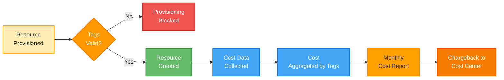

---

# Section 6: Architecture Decisions

## 6.1 ADR-001: Use Azure Dev Box over Custom VM Solution

**Date:** 2025-Q4  
**Status:** Accepted  
**Decision Makers:** Platform Engineering Team, IT Management

**Context:**  
Contoso requires a scalable developer workstation solution. Two primary options
considered:

1. Azure Dev Box (managed PaaS service)
2. Custom Azure VM-based solution with Terraform/Ansible automation

**Decision:**  
Adopt Azure Dev Box as the foundation for the Developer Experience Platform.

**Rationale:**

- **Reduced Operational Overhead:** Dev Box provides managed infrastructure,
  patching, and lifecycle management
- **Built-in Governance:** Native RBAC, Azure Monitor integration, and policy
  enforcement
- **Faster Time-to-Value:** Pre-built integrations with Azure AD, Virtual
  Networks, and Key Vault
- **Catalog Management:** First-class support for image definitions and
  configuration templates
- **Microsoft Support:** Enterprise support for platform issues vs.
  self-supported custom solution
- **Future-Proof:** Microsoft's strategic investment in developer productivity
  tools

**Alternatives Considered:**

- **Custom VM Solution:** Rejected due to high operational overhead and slower
  feature velocity
- **GitHub Codespaces:** Rejected due to lack of on-premises connectivity and
  Azure integration depth
- **AWS WorkSpaces:** Rejected due to multi-cloud complexity and migration costs

**Consequences:**

- **Positive:** Faster implementation, lower operational cost, enterprise
  support, native Azure integration
- **Negative:** Service availability limited to specific Azure regions; reliance
  on Microsoft roadmap
- **Mitigation:** Select Azure regions with Dev Box service availability; engage
  Microsoft for feature requests

**Compliance:** Aligns with Architecture Principle 3 (Configuration as Code) and
Principle 7 (Centralized Governance)

---

## 6.2 ADR-002: Azure AD Group-Based RBAC Only (No Individual Assignments)

**Date:** 2025-Q4  
**Status:** Accepted  
**Decision Makers:** Security Team, Platform Engineering Team

**Context:**  
Access control implementation strategy must balance security, operational
efficiency, and compliance requirements. Options:

1. Azure AD group-based RBAC (all access via groups)
2. Hybrid approach (groups + individual assignments)
3. Individual user assignments

**Decision:**  
Implement Azure AD group-based RBAC exclusively; prohibit individual user role
assignments.

**Rationale:**

- **Simplified Access Reviews:** Quarterly access reviews focus on group
  memberships vs. thousands of individual assignments
- **Consistent Authorization:** Groups ensure consistent permission sets for
  roles across projects
- **Reduced Administrative Overhead:** Onboarding/offboarding modifies single
  group membership vs. multiple role assignments
- **Audit Clarity:** Audit logs show group-level changes; correlate user access
  via group membership
- **Compliance:** Meets SOC 2 and ISO 27001 requirements for role-based access
  control

**Alternatives Considered:**

- **Hybrid Approach:** Rejected due to complexity and inconsistent access
  patterns
- **Individual Assignments:** Rejected due to high administrative overhead and
  audit complexity

**Consequences:**

- **Positive:** Reduced operational overhead, simplified compliance, consistent
  access patterns
- **Negative:** Requires upfront group design; edge cases (single-user access)
  require group creation
- **Mitigation:** Define standard group templates; automate group creation via
  IaC

**Implementation Details:**

- Dev Manager role: "Platform Engineering Team" Azure AD group
  (5a1d1455-e771-4c19-aa03-fb4a08418f22)
- Project access: Project-specific Azure AD groups (e.g., "eShop Developers")
- Azure Policy enforces group-based assignments; blocks individual user
  assignments

**Compliance:** Aligns with Architecture Principle 2 (Security by Default) and
BUS-POL-003 (RBAC Policy)

---

## 6.3 ADR-003: Mandatory Resource Tagging with Azure Policy Enforcement

**Date:** 2025-Q4  
**Status:** Accepted  
**Decision Makers:** Finance Team, IT Management, Platform Engineering Team

**Context:**  
Cost allocation and governance require consistent resource metadata. Tagging
approaches:

1. Mandatory tagging enforced via Azure Policy (deny non-compliant resources)
2. Optional tagging with periodic remediation
3. Manual tagging with process documentation

**Decision:**  
Implement mandatory 8-tag standard enforced via Azure Policy with deny effect;
non-compliant resources cannot be provisioned.

**Rationale:**

- **Financial Accountability:** 100% of resources tagged ensures complete cost
  allocation; no untracked spending
- **Compliance:** Automated enforcement eliminates human error and policy drift
- **Operational Efficiency:** No post-provisioning remediation required;
  resources tagged at creation
- **Reporting Accuracy:** Cost reports rely on tags; mandatory tagging ensures
  accurate financial data
- **Cultural Change:** Policy enforcement establishes tagging as non-negotiable
  practice

**Required Tags (8):**

1. `environment` - Deployment stage (dev, staging, uat, prod)
2. `division` - Business unit (Platforms, Engineering, etc.)
3. `team` - Responsible team (DevExP, eShop Team, etc.)
4. `project` - Project/initiative name
5. `costCenter` - Financial allocation code
6. `owner` - Business owner name or identifier
7. `landingZone` - Architecture classification (Workload, Platform, Management)
8. `resources` - Resource type identifier

**Alternatives Considered:**

- **Optional Tagging:** Rejected; 40% tagging compliance in pilot resulted in
  unallocated costs
- **6-Tag Standard:** Rejected; insufficient granularity for cost chargeback to
  teams
- **Post-Provisioning Remediation:** Rejected; creates technical debt and
  inaccurate cost periods

**Consequences:**

- **Positive:** 100% resource attribution, accurate cost reports, automated
  compliance
- **Negative:** Slight friction in resource provisioning; must provide tags
  upfront
- **Mitigation:** Bicep/Terraform modules include tag parameters; portal forms
  pre-populate common values

**Implementation:**

- Azure Policy definition: Deny resource creation without all 8 required tags
- Tag values defined in
  [azureResources.yaml](infra/settings/resourceOrganization/azureResources.yaml)
- Bicep modules inherit tags from resource group (tag inheritance enabled)

**Compliance:** Aligns with Architecture Principle 3 (Cost Accountability) and
BUS-GOV-004 (Resource Organization)

---

## 6.4 ADR-004: Role-Specific Dev Box Pools with Different VM SKUs

**Date:** 2025-Q4  
**Status:** Accepted  
**Decision Makers:** Platform Engineering Team, eShop Project Leadership

**Context:**  
Dev Box sizing strategy must balance developer productivity, cost efficiency,
and standardization:

1. Single "one size fits all" dev box pool
2. Role-specific pools with tailored VM SKUs and images
3. Developer-chosen SKU with no restrictions

**Decision:**  
Implement role-specific dev box pools with appropriate VM SKU sizing based on
engineering role requirements.

**Rationale:**

- **Cost Optimization:** Backend engineers need more compute (32 cores) for
  builds/containers; frontend engineers need less (16 cores)
- **Performance:** Right-sizing prevents resource contention and improves
  developer experience
- **Standardization:** Predefined pools ensure consistency within role types
- **Predictable Costs:** Fixed SKU choices enable accurate cost forecasting per
  role
- **Tool Optimization:** Role-specific images include only relevant tools (e.g.,
  Docker for backend, npm for frontend)

**eShop Project Implementation:**

- **Backend Engineer Pool:**
  - VM SKU: `general_i_32c128gb512ssd_v2` (32 cores, 128GB RAM, 512GB SSD)
  - Image: `eShop-backend-engineer` with .NET SDK, Docker, SQL tools
  - Use Case: API development, database queries, container builds
  - Estimated Cost: ~$450/month
- **Frontend Engineer Pool:**
  - VM SKU: `general_i_16c64gb256ssd_v2` (16 cores, 64GB RAM, 256GB SSD)
  - Image: `eShop-frontend-engineer` with Node.js, VS Code, browser dev tools
  - Use Case: React/Angular development, UI design, testing
  - Estimated Cost: ~$250/month

**Alternatives Considered:**

- **Single Pool (32c/128GB for all):** Rejected; $200K annual waste for frontend
  engineers with oversized VMs
- **Developer-Chosen SKU:** Rejected; cost unpredictability and approval
  overhead
- **3+ Pools (Backend, Frontend, Data Science, etc.):** Deferred to Phase 4
  based on demand

**Consequences:**

- **Positive:** 40% cost reduction vs. single large SKU; better performance per
  role
- **Negative:** Slightly more complex configuration; developers cannot "upgrade"
  without policy exception
- **Mitigation:** Document pool selection criteria; establish exception process
  for edge cases

**Implementation:**

- Pools defined in
  [devcenter.yaml](infra/settings/workload/devcenter.yaml#L141-L146)
- Images stored in project-specific catalog: `devboxImages` from GitHub
  repository
- Naming convention: `{project}-{role}` (e.g., `eShop-backend-engineer`)

**Compliance:** Aligns with Architecture Principle 6 (Role-Specific
Configurations) and Principle 3 (Cost Accountability)

---

## 6.5 ADR-005: Configuration-as-Code with GitHub-Backed Catalogs

**Date:** 2025-Q4  
**Status:** Accepted  
**Decision Makers:** Platform Engineering Team, DevOps Leadership

**Context:**  
Configuration management for dev box images and environment definitions requires
version control, auditability, and collaboration:

1. Azure Portal-based configuration (manual)
2. Configuration-as-Code in Git repository
3. Hybrid approach (portal + Git)

**Decision:**  
Implement Configuration-as-Code exclusively; all dev box images, environment
definitions, and custom tasks stored in GitHub repositories and synchronized to
Dev Center catalogs.

**Rationale:**

- **Version Control:** Git history provides complete audit trail of all
  configuration changes
- **Collaboration:** Pull request workflow enables peer review before production
  deployment
- **Disaster Recovery:** Git repository serves as backup; recover entire
  platform configuration from source control
- **CI/CD Integration:** Automated testing and deployment of configurations via
  GitHub Actions
- **Repeatability:** Consistent environments across dev, staging, production;
  infrastructure-as-code principles

**Catalog Structure:**

| Catalog Type                | Purpose                                               | Repository                           | Path                         | Sync Branch |
| --------------------------- | ----------------------------------------------------- | ------------------------------------ | ---------------------------- | ----------- |
| **Custom Tasks**            | Reusable dev box configuration scripts                | microsoft/devcenter-catalog (public) | ./Tasks                      | main        |
| **Environment Definitions** | Infrastructure-as-Code templates for app environments | Evilazaro/eShop (private)            | /.devcenter/environments     | main        |
| **Dev Box Images**          | Role-specific VM image definitions                    | Evilazaro/eShop (private)            | /.devcenter/imageDefinitions | main        |

**Source:** [devcenter.yaml](infra/settings/workload/devcenter.yaml#L62-L68),
[devcenter.yaml](infra/settings/workload/devcenter.yaml#L158-L173)

**Alternatives Considered:**

- **Azure Portal Configuration:** Rejected; no version history, collaboration
  challenges, human error prone
- **Azure DevOps Repos:** Considered; selected GitHub for unified source control
  (eShop app code also in GitHub)
- **Hybrid Approach:** Rejected; creates "shadow IT" problem with undocumented
  portal changes

**Consequences:**

- **Positive:** Complete auditability, collaboration-friendly, automated
  deployments, disaster recovery
- **Negative:** Requires Git knowledge; configuration changes slower (PR
  approval workflow)
- **Mitigation:** Provide Git training for platform team; establish expedited
  review process for urgent changes

**Implementation:**

- Catalogs configured in
  [devcenter.yaml](infra/settings/workload/devcenter.yaml)
- GitHub repository structure documented in project README
- GitHub Actions workflows validate configurations on PR
- Dev Center auto-syncs catalogs every 24 hours (configurable)

**Compliance:** Aligns with Architecture Principle 4 (Configuration as Code) and
Principle 8 (Observable and Auditable)

---

# Section 7: Standards and Guidelines

## 7.1 Naming Convention Standards

### Resource Naming Pattern

**Standard:** All Azure resources shall follow the naming convention:  
`{workload}-{resource-type}-{optional-descriptor}`

**Examples:**

- Dev Center: `devexp-devcenter`
- Resource Groups: `devexp-workload`, `devexp-security`, `devexp-monitoring`
- Projects: `eShop` (human-readable project names without prefix)
- Dev Box Pools: `backend-engineer`, `frontend-engineer`
- Virtual Networks: `eShop` (project name), `eShop-subnet`

**Source:**
[azureResources.yaml](infra/settings/resourceOrganization/azureResources.yaml#L16),
[devcenter.yaml](infra/settings/workload/devcenter.yaml#L16)

**Rationale:**

- Clarity and Consistency across all Azure resources
- Resource type identification from name alone
- Alignment with Azure Naming Best Practices (Microsoft CAF)

**Scope:** All Azure resources provisioned as part of Dev Box implementation

**Enforcement:** Naming validated during Bicep template deployment; Azure Policy
monitors compliance

---

## 7.2 Tagging Standards

**Standard:** All Azure resources MUST include 8 mandatory tags at creation
time.

**Mandatory Tag Schema:**

```yaml
tags:
  environment: "dev" | "staging" | "uat" | "prod"
  division: "Platforms" | "Engineering" | "IT"  # Business unit
  team: "DevExP" | "eShop Team" | "{TeamName}"  # Responsible team
  project: "Contoso-DevExp-DevBox" | "eShop" | "{ProjectName}"
  costCenter: "IT" | "{FinancialCode}"  # Cost allocation target
  owner: "Contoso" | "{BusinessOwner}"  # Executive accountability
  landingZone: "Workload" | "Platform" | "Management"  # Architecture classification
  resources: "ResourceGroup" | "DevCenter" | "Project" | "{ResourceType}"
```

**Tag Validation Rules:**

1. All 8 tags MUST be present (no optional tags)
2. Tag keys are case-sensitive; use exact casing as specified
3. Tag values must be non-empty strings (minimum 2 characters)
4. Tag inheritance enabled: Resource Group tags propagate to child resources
5. Azure Policy denies resource creation if tags missing or invalid

**Source:**
[azureResources.yaml](infra/settings/resourceOrganization/azureResources.yaml#L17-L27),
[devcenter.yaml](infra/settings/workload/devcenter.yaml#L183-L195)

**Rationale:**

- Enables granular cost allocation by team, project, environment
- Supports compliance and audit requirements
- Facilitates automated resource lifecycle management
- Provides metadata for reporting and analytics

**Scope:** All Azure resources (Resource Groups, Compute, Networking, Storage,
etc.)

**Enforcement:** Azure Policy with deny effect; non-compliant resources cannot
be provisioned

---

## 7.3 Azure AD Group Naming Standards

**Standard:** Azure AD groups used for Dev Box access control shall follow
naming convention:  
`{Purpose} {Descriptor}` (natural language, title case)

**Examples:**

- "Platform Engineering Team" (organization-level group)
- "eShop Developers" (project-specific group)
- "Backend Engineers" (role-specific group, if needed)

**Rationale:**

- Human-readable group names improve usability and self-documentation
- Reduces cognitive overhead vs. coded naming (e.g., `GRP-DEVEXP-PLT-ENG`)
- Aligns with Azure AD best practices for security groups

**Group Metadata Requirements:**

1. Description field MUST explain group purpose and access granted
2. Group owners MUST include at least two responsible individuals
3. Group type: Security (not Microsoft 365 groups)
4. Group membership type: Assigned (not Dynamic, for audit compliance)

**Source:** [devcenter.yaml](infra/settings/workload/devcenter.yaml#L42-L43),
[devcenter.yaml](infra/settings/workload/devcenter.yaml#L120-L121)

**Scope:** All Azure AD groups used for Dev Center, Project, and Dev Box access

**Enforcement:** Group creation follows IaC workflow; manually created groups
reviewed in quarterly access review

---

## 7.4 Network Address Space Standards

**Standard:** Each Dev Box project MUST use a dedicated /16 address space to
ensure isolation and prevent overlaps.

**Address Space Allocation:**

| Project          | VNet CIDR     | Subnet CIDR   | Available IPs           | Status    |
| ---------------- | ------------- | ------------- | ----------------------- | --------- |
| eShop            | 10.0.0.0/16   | 10.0.1.0/24   | 65,536 (254 per subnet) | Active    |
| Future Project 1 | 10.1.0.0/16   | 10.1.1.0/24   | 65,536                  | Reserved  |
| Future Project 2 | 10.2.0.0/16   | 10.2.1.0/24   | 65,536                  | Reserved  |
| ...              | 10.{N}.0.0/16 | 10.{N}.1.0/24 | 65,536                  | Available |

**Rules:**

1. Each project receives unique /16 block from 10.0.0.0/8 private range
2. Subnets carved from project's /16 as needed (typically /24 per subnet)
3. Address spaces MUST NOT overlap; validated during VNet creation
4. Subnets MUST allow adequate space for dev box scale (plan for 250+ VMs per
   subnet)

**Source:** [devcenter.yaml](infra/settings/workload/devcenter.yaml#L99-L106)

**Rationale:**

- Prevents IP conflicts between projects
- Enables future VNet peering if needed
- Provides sufficient IP addresses for large-scale deployments

**Scope:** All Dev Box project virtual networks

**Enforcement:** Bicep template validation; Azure Resource Manager rejects
overlapping CIDRs

---

## 7.5 Secret Management Standards

**Standard:** All sensitive configuration (passwords, API keys, certificates)
MUST be stored in Azure Key Vault; hard-coded secrets in configuration files are
prohibited.

**Key Vault Access Model:**

1. Dev Center managed identity: Key Vault Secrets User + Key Vault Secrets
   Officer roles
2. Project identities: Key Vault Secrets User role (read-only)
3. Development teams: Key Vault Secrets User via Azure AD groups (read-only)
4. Platform team: Key Vault Secrets Officer role (read/write) for secret
   rotation

**Secret Lifecycle:**

- **Creation:** Secrets created via automated pipeline or Azure CLI; manual
  portal creation discouraged
- **Rotation:** Secrets rotated every 90 days (automated where possible)
- **Expiration:** Secrets set to expire after 1 year; alerts triggered 30 days
  before expiration
- **Access Logging:** All secret access operations logged to Azure Monitor

**Source:** [devcenter.yaml](infra/settings/workload/devcenter.yaml#L45-L48),
[devcenter.yaml](infra/settings/workload/devcenter.yaml#L130-L135)

**Rationale:**

- Eliminates hard-coded secrets in source code and configuration files
- Provides centralized secret management and rotation
- Enables audit trail of secret access for compliance

**Scope:** All applications, services, and infrastructure components requiring
sensitive configuration

**Enforcement:**

- Automated scans of Git repositories for hard-coded secrets (GitHub Secret
  Scanning)
- Code review policy requires Key Vault references, not literal secrets
- Azure Policy audits for Key Vault usage in application deployments

---

## 7.6 Configuration Validation Standards

**Standard:** All Infrastructure-as-Code configurations (Bicep, YAML) MUST pass
validation checks before deployment to production.

**Validation Pipeline:**

```mermaid
graph LR
    A[Code Commit] --> B[GitHub Actions<br/>Triggered]
    B --> C[Bicep Linting<br/>az bicep build]
    C --> D[YAML Schema<br/>Validation]
    D --> E[Terraform Plan<br/>What-If Analysis]
    E --> F{All Checks<br/>Pass?}
    F -->|No| G[Deployment<br/>Blocked]
    F -->|Yes| H[PR Approved]
    H --> I[Merge to Main]
    I --> J[Deploy to Dev]
    J --> K[Integration Tests]
    K --> L{Tests<br/>Pass?}
    L -->|No| M[Rollback]
    L -->|Yes| N[Promote to Prod]

    style A fill:#FFECB3,stroke:#FFA000,stroke-width:2px,color:#212121
    style C fill:#42A5F5,stroke:#1976D2,stroke-width:2px,color:#FFFFFF
    style D fill:#42A5F5,stroke:#1976D2,stroke-width:2px,color:#FFFFFF
    style E fill:#42A5F5,stroke:#1976D2,stroke-width:2px,color:#FFFFFF
    style F fill:#FF9800,stroke:#F57C00,stroke-width:2px,color:#FFFFFF
    style G fill:#EF5350,stroke:#C62828,stroke-width:2px,color:#FFFFFF
    style H fill:#66BB6A,stroke:#388E3C,stroke-width:2px,color:#FFFFFF
    style N fill:#66BB6A,stroke:#388E3C,stroke-width:3px,color:#FFFFFF
```

**Required Validation Checks:**

1. **Bicep Linting:** `az bicep build` with no errors or warnings
2. **YAML Schema Validation:** Validate against JSON schema files
   ([devcenter.schema.json](infra/settings/workload/devcenter.schema.json),
   [azureResources.schema.json](infra/settings/resourceOrganization/azureResources.schema.json))
3. **What-If Analysis:** Azure Resource Manager deployment preview (validate
   changes)
4. **Policy Compliance:** Azure Policy simulation to catch non-compliant
   configurations
5. **Syntax Checks:** Mermaid diagram validation (if diagrams in docs)

**Implementation:**

- GitHub Actions workflows:
  [.github/workflows/ci.yml](.github/workflows/ci.yml),
  [.github/workflows/deploy.yml](.github/workflows/deploy.yml)
- Pre-commit hooks for local validation (optional but recommended)
- Deployment gates: Manual approval required for production deployments

**Rationale:**

- Prevents misconfigurations before reaching production
- Reduces mean time to recovery (MTTR) by catching issues early
- Provides confidence in automated deployments

**Scope:** All Infrastructure-as-Code files (Bicep, YAML, JSON configuration)

**Enforcement:** GitHub branch protection rules require status checks to pass
before merge

---

## 7.7 Documentation Standards

**Standard:** All architecture decisions, configuration changes, and operational
procedures MUST be documented following the standards below.

**Documentation Requirements:**

| Document Type                            | Format                    | Location           | Update Frequency |
| ---------------------------------------- | ------------------------- | ------------------ | ---------------- |
| **Architecture Decision Records (ADRs)** | Markdown                  | `/docs/adr/`       | Per decision     |
| **Configuration Files**                  | YAML with inline comments | `/infra/settings/` | Per change       |
| **Runbooks**                             | Markdown                  | `/docs/runbooks/`  | Quarterly review |
| **API Documentation**                    | OpenAPI 3.0               | `/docs/api/`       | Per API change   |
| **User Guides**                          | Markdown                  | `/docs/guides/`    | Monthly review   |

**Content Standards:**

1. **Inline Comments:** All YAML/Bicep files MUST include explanatory comments
   for non-obvious configurations
2. **Architecture Diagrams:** Use Mermaid or C4 notation; diagrams stored in Git
   alongside docs
3. **Decision Rationale:** ADRs MUST include context, decision, rationale,
   alternatives considered, consequences
4. **References:** Link to authoritative sources (Microsoft Learn, TOGAF specs,
   RFCs)

**Source Examples:**

- Inline comments: [devcenter.yaml](infra/settings/workload/devcenter.yaml)
  (extensive YAML comments explaining each section)
- Configuration headers:
  [azureResources.yaml](infra/settings/resourceOrganization/azureResources.yaml#L1-L10)

**Rationale:**

- Reduces onboarding time for new platform team members
- Provides audit trail for compliance (SOC 2, ISO 27001)
- Enables knowledge sharing and collaboration

**Scope:** All platform-related documentation, configurations, and operational
procedures

**Enforcement:**

- Pull request template requires documentation updates for feature changes
- Quarterly documentation review in sprint planning

---

## 7.8 Monitoring and Alerting Standards

**Standard:** All Dev Box resources MUST emit metrics and logs to centralized
Azure Monitor; critical events MUST trigger alerts.

**Monitoring Requirements:**

| Resource Type        | Metrics Collected                         | Logs Collected                       | Retention |
| -------------------- | ----------------------------------------- | ------------------------------------ | --------- |
| **Dev Boxes**        | CPU, Memory, Disk, Network                | Windows Event Logs, Application Logs | 90 days   |
| **Dev Center**       | Provisioning success/failure, API latency | Activity Logs, Diagnostic Logs       | 365 days  |
| **Virtual Networks** | Traffic volume, NSG rule hits             | Flow Logs                            | 90 days   |
| **Key Vault**        | Secret access count, latency              | Audit Logs (all operations)          | 365 days  |

**Required Alerts:**

| Alert                            | Condition                            | Severity | Notification                |
| -------------------------------- | ------------------------------------ | -------- | --------------------------- |
| **Dev Box Provisioning Failure** | 3+ failures in 1 hour                | High     | Platform Engineering Team   |
| **Key Vault Access Denied**      | Any 401/403 response                 | Medium   | Security Team               |
| **High Cost Anomaly**            | Daily cost > 150% of 30-day average  | Medium   | Finance Team, IT Management |
| **Dev Center Unavailability**    | API health check fails for 5 minutes | Critical | Platform Engineering Team   |

**Implementation:**

- Azure Monitor Agent installed by default:
  [devcenter.yaml](infra/settings/workload/devcenter.yaml#L23)
- Log Analytics workspace:
  [monitoring resource group](infra/settings/resourceOrganization/azureResources.yaml#L52-L63)
- Action Groups configured for each alert type

**Rationale:**

- Proactive identification of platform issues before user impact
- Security incident detection and response
- Cost anomaly detection enables budget control

**Scope:** All Dev Box infrastructure components

**Enforcement:** Azure Policy audits for missing diagnostic settings

---

## 7.9 Disaster Recovery Standards

**Standard:** All configuration and infrastructure definitions MUST support
recovery with Recovery Time Objective (RTO) < 4 hours and Recovery Point
Objective (RPO) < 24 hours.

**Backup Strategy:**

| Asset                      | Backup Method                  | Frequency         | Retention  | RTO     | RPO      |
| -------------------------- | ------------------------------ | ----------------- | ---------- | ------- | -------- |
| **Infrastructure-as-Code** | Git repository                 | Per commit        | Infinite   | 1 hour  | 0 (Git)  |
| **Configuration Files**    | Git repository                 | Per commit        | Infinite   | 1 hour  | 0 (Git)  |
| **Dev Box Images**         | Azure Compute Gallery          | Per image publish | 3 versions | 2 hours | 24 hours |
| **Key Vault Secrets**      | Soft-delete + Purge Protection | Continuous        | 90 days    | 30 min  | 0        |
| **Azure AD Groups**        | Manual export (quarterly)      | Quarterly         | 1 year     | 4 hours | 90 days  |

**Disaster Recovery Procedures:**

**Scenario 1: Dev Center Accidental Deletion**

1. Restore from Git: Redeploy Bicep templates from [infra/](infra/) directory
2. Reconfigure RBAC: Apply identity assignments from
   [devcenter.yaml](infra/settings/workload/devcenter.yaml#L26-L48)
3. Resync Catalogs: Dev Center auto-syncs from GitHub (24-hour window)
4. **Estimated RTO:** 2 hours

**Scenario 2: Configuration Corruption**

1. Identify last known good commit in Git history
2. Revert to previous configuration version
3. Redeploy via GitHub Actions workflow
4. **Estimated RTO:** 1 hour

**Scenario 3: Region Outage**

1. Identify alternate Azure region with Dev Box service
2. Update Bicep parameters with new region
3. Redeploy infrastructure to new region
4. Update DNS/network routes (if applicable)
5. **Estimated RTO:** 4 hours

**Rationale:**

- Configuration-as-Code (Git) provides instant recovery capability
- Multiple resource versions enable rollback without data loss
- Tested recovery procedures reduce downtime

**Scope:** All Dev Box platform components and configurations

**Enforcement:** Quarterly disaster recovery drills; document actual RTO/RPO
achieved

---

## 7.10 Change Management Standards

**Standard:** All production changes MUST follow the change management process
with appropriate approvals and rollback plans.

**Change Classification:**

| Change Type         | Approval Required         | Testing Required         | Rollback Plan                 | Communication              |
| ------------------- | ------------------------- | ------------------------ | ----------------------------- | -------------------------- |
| **Emergency Fix**   | Platform Lead (verbal)    | Smoke test in dev        | Automated rollback            | Post-incident notification |
| **Standard Change** | PR approval (2 reviewers) | Full CI/CD pipeline      | Git revert + redeploy         | Release notes              |
| **Major Change**    | Architecture Review Board | Dev + Staging validation | Documented rollback procedure | 48-hour advance notice     |

**Standard Change Workflow:**

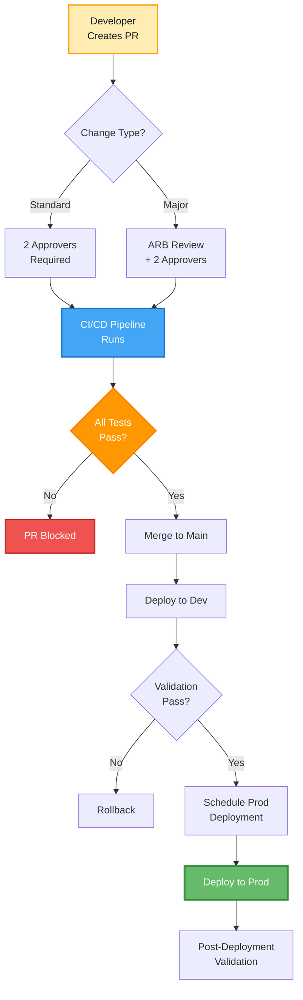

**Major Change Definition:**

- Changes to RBAC policies or Azure AD group assignments
- Network architecture modifications
- Dev Center SKU or region changes
- Changes affecting > 50% of dev boxes
- New project onboarding

**Rationale:**

- Reduces risk of production incidents
- Provides audit trail for compliance
- Ensures peer review of critical changes

**Scope:** All changes to Dev Box platform (infrastructure, configuration,
policies)

**Enforcement:** GitHub branch protection rules enforce approval requirements

---

# Section 8: Dependencies and Integrations

## 8.1 Upstream Dependencies (External Systems)

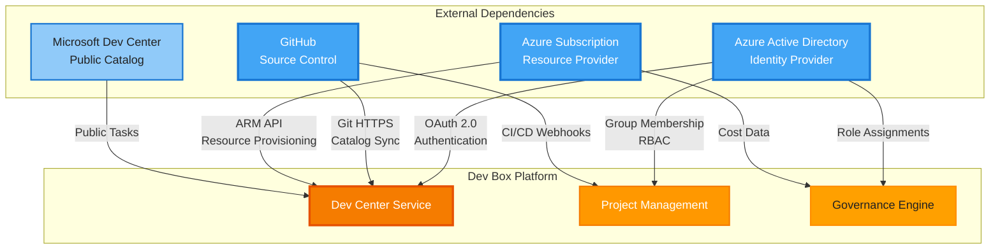

### 8.1.1 Azure Active Directory (AAD)

**Dependency Type:** Critical - Identity and Access Management  
**Integration Pattern:** OAuth 2.0 / SAML 2.0  
**Failure Impact:** Platform becomes inaccessible; no new dev box provisioning

**Integration Points:**

- User authentication for Dev Box portal and API access
- Azure AD group membership evaluation for RBAC decisions
- Service principal / managed identity authentication
- Conditional Access policies enforcement

**Configuration:**

- Tenant ID: Configured in Azure environment
- Azure AD Groups:
  - "Platform Engineering Team" (5a1d1455-e771-4c19-aa03-fb4a08418f22)
  - "eShop Developers" (9d42a792-2d74-441d-8bcb-71009371725f)

**Dependencies:**

- Outbound HTTPS (443) to `login.microsoftonline.com`
- Microsoft Graph API access for group enumeration
- Azure AD replication latency: Group membership changes visible within 5
  minutes

**Risk Mitigation:**

- Azure AD SLA: 99.99% uptime
- Emergency access (break-glass) accounts for AAD outages
- Cached group memberships for short-term AAD unavailability

**Source:** [devcenter.yaml](infra/settings/workload/devcenter.yaml#L42-L43),
[devcenter.yaml](infra/settings/workload/devcenter.yaml#L120-L121)

---

### 8.1.2 GitHub (Source Control)

**Dependency Type:** High - Configuration Management  
**Integration Pattern:** Git HTTPS + GitHub API  
**Failure Impact:** Cannot sync new catalog configurations; existing dev boxes
unaffected

**Integration Points:**

- Dev Center catalog synchronization (24-hour polling interval)
- GitHub Actions workflows for CI/CD automation
- GitHub Secret Scanning for security compliance
- Pull request automation and code reviews

**Configuration:**

- **Custom Tasks Catalog:**
  - Repository: `https://github.com/microsoft/devcenter-catalog.git` (public)
  - Branch: `main`
  - Path: `./Tasks`
  - Type: `gitHub`
- **eShop Project Catalogs:**
  - Environment Definitions: `https://github.com/Evilazaro/eShop.git` (private)
    - Branch: `main`
    - Path: `/.devcenter/environments`
  - Dev Box Images: `https://github.com/Evilazaro/eShop.git` (private)
    - Branch: `main`
    - Path: `/.devcenter/imageDefinitions`

**Dependencies:**

- Outbound HTTPS (443) to `github.com`, `api.github.com`
- GitHub Personal Access Token (PAT) or GitHub App credentials for private repos
- Network connectivity from Azure Dev Center to GitHub

**Risk Mitigation:**

- Dev Center caches catalog contents; temporary GitHub outages do not affect
  existing dev boxes
- Catalog sync failures alert Platform Engineering team
- Fallback to last known good catalog version if sync fails

**Source:** [devcenter.yaml](infra/settings/workload/devcenter.yaml#L62-L68),
[devcenter.yaml](infra/settings/workload/devcenter.yaml#L158-L173)

---

### 8.1.3 Azure Subscription

**Dependency Type:** Critical - Resource Provisioning  
**Integration Pattern:** Azure Resource Manager (ARM) API  
**Failure Impact:** Cannot provision new dev boxes; existing dev boxes continue
running

**Integration Points:**

- Virtual machine provisioning for dev boxes
- Virtual network and subnet allocation
- Managed disk creation and attachment
- Azure Monitor data collection
- Azure Cost Management + Billing

**Configuration:**

- Subscription ID: Configured via Azure environment variables
- Resource Provider Registrations:
  - `Microsoft.DevCenter`
  - `Microsoft.Compute`
  - `Microsoft.Network`
  - `Microsoft.KeyVault`
  - `Microsoft.Insights`

**Quota Requirements:**

| Resource Type               | Required Quota | Current Limit | Monitoring            |
| --------------------------- | -------------- | ------------- | --------------------- |
| **vCPUs (General Purpose)** | 500 cores      | 1000 cores    | Azure Portal → Quotas |
| **Public IP Addresses**     | 50 IPs         | 100 IPs       | Azure Portal → Quotas |
| **Virtual Networks**        | 10 VNets       | 50 VNets      | Azure Portal → Quotas |
| **Dev Box Pools**           | 20 pools       | 50 pools      | Dev Center limits     |

**Dependencies:**

- Azure Resource Manager API availability
- Sufficient subscription quota for VM SKUs
- Azure region capacity for selected VM sizes

**Risk Mitigation:**

- Pre-provisioned resource quotas to handle peak demand
- Automated quota monitoring and alerts
- Multi-region deployment capability for region outages

---

### 8.1.4 Microsoft Dev Center Public Catalog

**Dependency Type:** Low - Optional Task Library  
**Integration Pattern:** Git HTTPS (read-only)  
**Failure Impact:** Cannot access Microsoft-provided custom tasks;
project-specific catalogs unaffected

**Integration Points:**

- Pre-built custom tasks for common dev box configurations
- Community-contributed configurations
- Microsoft-maintained best practices

**Configuration:**

- Repository: `https://github.com/microsoft/devcenter-catalog.git`
- Branch: `main`
- Path: `./Tasks`
- Visibility: `public`

**Dependencies:**

- Public GitHub repository availability
- Internet egress from Azure Dev Center

**Risk Mitigation:**

- Low business impact; tasks are optional enhancements
- Can fork repository to private GitHub for critical tasks
- Project-specific catalogs provide core functionality

**Source:** [devcenter.yaml](infra/settings/workload/devcenter.yaml#L62-L68)

---

## 8.2 Downstream Dependencies (Consuming Systems)

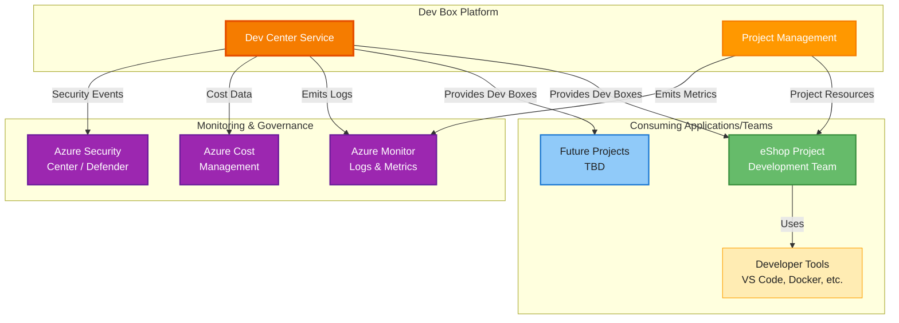

### 8.2.1 eShop Project Development Team

**Consumer Type:** Primary User - Development Team  
**Consumption Pattern:** Self-service dev box provisioning  
**Business Impact:** Direct productivity dependency

**Services Consumed:**

- **Developer Workstation Provisioning** (BUS-SVC-001): Backend and frontend dev
  boxes
- **Project Management** (BUS-FUNC-002): eShop project resources and access
  control
- **Multi-Environment Deployment**: dev, staging, UAT environments

**Integration Points:**

- Azure AD group membership: "eShop Developers"
  (9d42a792-2d74-441d-8bcb-71009371725f)
- Dev box pools: `backend-engineer`, `frontend-engineer`
- Private catalogs: Environment definitions and dev box images from GitHub

**Dependencies:**

- Dev box availability SLA: 99.5% uptime
- Provisioning latency: < 30 minutes per dev box
- Network connectivity: 10.0.0.0/16 VNet with 10.0.1.0/24 subnet

**Service Level Expectations:**

- **Availability:** Dev boxes accessible 24/7 with planned maintenance windows
- **Performance:** RDP latency < 50ms within same Azure region
- **Support:** Platform Engineering team responds to issues within 4 hours
  (business hours)

**Source:** [devcenter.yaml](infra/settings/workload/devcenter.yaml#L88-L182)

---

### 8.2.2 Azure Monitor (Logs & Metrics)

**Consumer Type:** Observability System  
**Consumption Pattern:** Push-based log/metric ingestion  
**Business Impact:** Enables operational visibility and troubleshooting

**Data Consumed from Dev Box Platform:**

- **Activity Logs:** All Azure Resource Manager operations (create, update,
  delete)
- **Diagnostic Logs:** Dev Center API calls, provisioning events, errors
- **Metrics:** Dev box provisioning count, success rate, latency
- **VM Metrics:** CPU, memory, disk, network utilization per dev box
- **Windows Event Logs:** Application and system events from dev box VMs

**Integration Points:**

- Azure Monitor Agent installed on all dev boxes (configured in
  [devcenter.yaml#L23](infra/settings/workload/devcenter.yaml#L23))
- Log Analytics workspace in monitoring resource group
- Diagnostic settings enabled for all Azure resources

**Dependencies:**

- Log Analytics workspace availability
- Network connectivity from dev boxes to Azure Monitor endpoints
- Sufficient workspace retention (90 days for dev box logs, 365 days for audit
  logs)

**Data Retention:**

- Dev box operational logs: 90 days
- Audit logs (RBAC, Key Vault): 365 days
- Metrics: 93 days (default), can extend via archiving

**Source:**
[azureResources.yaml](infra/settings/resourceOrganization/azureResources.yaml#L52-L63)

---

### 8.2.3 Azure Cost Management + Billing

**Consumer Type:** Financial Governance System  
**Consumption Pattern:** Pull-based cost data aggregation  
**Business Impact:** Enables cost allocation and chargeback

**Data Consumed from Dev Box Platform:**

- Resource-level cost data (VM compute, storage, networking)
- Tag-based cost aggregation (by project, team, environment, costCenter)
- Budget vs. actual spending comparisons
- Cost anomaly detection alerts

**Integration Points:**

- Mandatory resource tagging (8 tags) enables cost breakdowns
- Azure Cost Management API for programmatic access
- Power BI integration for financial dashboards

**Dependencies:**

- Cost data latency: 24-48 hours for resource-level costs
- Tag accuracy: 100% of resources tagged for complete attribution
- Azure Cost Management API availability

**Reporting Outputs:**

- Monthly cost reports by project, team, and environment
- Cost per developer (total project cost / developer count)
- Cost variance alerts (actual vs. budget ± 10%)

**Source:**
[azureResources.yaml](infra/settings/resourceOrganization/azureResources.yaml#L17-L27)

---

### 8.2.4 Azure Security Center / Defender

**Consumer Type:** Security Monitoring System  
**Consumption Pattern:** Pull-based security assessment  
**Business Impact:** Identifies security vulnerabilities and compliance gaps

**Data Consumed from Dev Box Platform:**

- VM security configuration assessments
- Network security group (NSG) rule analysis
- Key Vault access patterns and anomalies
- RBAC role assignments and privilege escalations

**Integration Points:**

- Azure Defender for Servers enabled on dev box VMs
- Security Center recommendations for dev center resources
- Integration with Azure Policy for compliance enforcement

**Dependencies:**

- Azure Security Center subscription tier (Standard)
- Microsoft Defender for Cloud agents installed on VMs
- Network connectivity to Security Center endpoints

**Security Assessments:**

- OS patch compliance (Windows Update status)
- Endpoint protection status (antivirus)
- Network exposure (public IP assignments)
- Identity and access anomalies (unusual RBAC changes)

---

## 8.3 Cross-Layer Dependencies

### Business Layer → Data Layer

**Dependency:** Project configuration data stored in YAML files  
**Data Flow:** Project definitions
([devcenter.yaml](infra/settings/workload/devcenter.yaml)) → Parsed by Bicep →
Provisioned as Azure resources  
**Impact:** Changes to project configuration require redeployment of Data layer
(Azure resources)

### Business Layer → Application Layer

**Dependency:** Dev Box provisioning workflow  
**Data Flow:** User authentication (Business) → Dev Box API calls (Application)
→ VM creation (Technology)  
**Impact:** Business role definitions (Backend/Frontend Engineer) determine
which Application APIs are accessible

### Business Layer → Technology Layer

**Dependency:** Network architecture defined by business organizational
structure  
**Data Flow:** Project definition (Business) → VNet CIDR allocation (Technology)
→ VM deployment  
**Impact:** Each business project requires dedicated Technology layer network
resources

### Business Layer → Security Layer

**Dependency:** RBAC policies govern access to all layers  
**Data Flow:** Azure AD group membership (Business/Security) → RBAC enforcement
(Security) → Resource access (All layers)  
**Impact:** Changes to business roles (e.g., new project team) require Security
layer RBAC updates

---

## 8.4 Integration Architecture

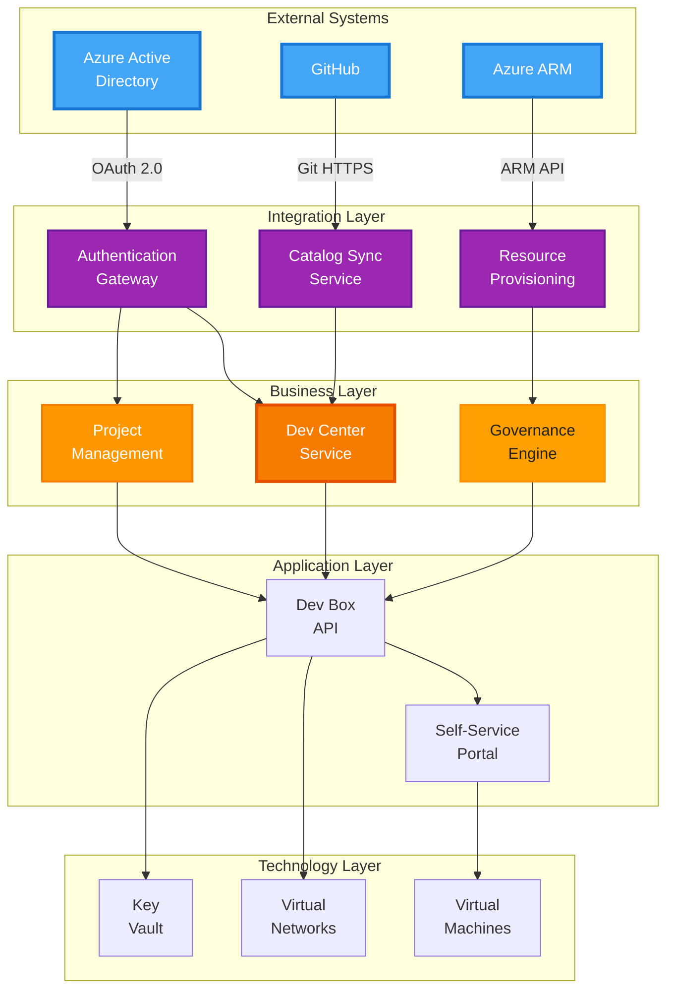

---

# Section 9: Governance and Compliance

## 9.1 Governance Framework

### 9.1.1 Governance Structure

**Governance Model:** Centralized policy definition with distributed execution

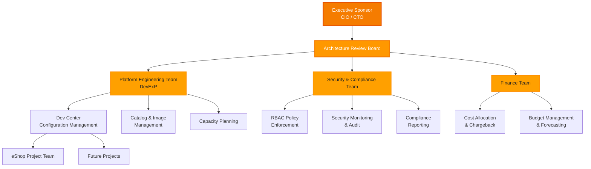

**Roles and Responsibilities:**

| Role                            | Responsibilities                                                                           | Decision Authority                                         |
| ------------------------------- | ------------------------------------------------------------------------------------------ | ---------------------------------------------------------- |
| **Executive Sponsor (CIO/CTO)** | Strategic alignment, budget approval, escalation resolution                                | Final authority on platform direction                      |
| **Architecture Review Board**   | Major change approval, architectural standards, cross-project alignment                    | Approve/reject major changes (ADR-defined)                 |
| **Platform Engineering Team**   | Day-to-day operations, configuration management, capacity planning, user support           | Operational changes within approved standards              |
| **Security & Compliance Team**  | RBAC policy definition, security monitoring, audit response, compliance reporting          | Veto authority on security-related changes                 |
| **Finance Team**                | Cost allocation methodology, chargeback/showback, budget tracking, cost optimization       | Final authority on cost allocation policies                |
| **Project Teams (e.g., eShop)** | Self-service dev box management, project-specific configuration, feedback to platform team | Configuration within project scope and approved boundaries |

---

### 9.1.2 Governance Policies

#### Policy GOV-001: Mandatory Tagging Enforcement

**Policy Statement:**  
All Azure resources provisioned as part of the Developer Experience Platform
MUST include 8 mandatory tags. Non-compliant resources SHALL be denied at
provisioning time via Azure Policy.

**Enforcement Mechanism:** Azure Policy with deny effect  
**Scope:** All resource groups and resources in Dev Box subscriptions  
**Compliance Monitoring:** Daily Azure Policy compliance reports  
**Remediation:** Automated rejection; resubmit with compliant tags

**Source:**
[azureResources.yaml](infra/settings/resourceOrganization/azureResources.yaml#L17-L27)  
**Related
Standards:** Section 7.2 (Tagging Standards)  
**ADR Reference:** ADR-003 (Mandatory Resource Tagging)

---

#### Policy GOV-002: Group-Based RBAC Only

**Policy Statement:**  
All Azure RBAC role assignments MUST be granted to Azure AD groups. Individual
user role assignments are PROHIBITED except for emergency break-glass accounts.

**Enforcement Mechanism:** Azure Policy audit mode + manual review  
**Scope:** All Dev Center, Project, and resource group role assignments  
**Compliance Monitoring:** Quarterly access reviews by Security Team  
**Remediation:** Security team removes individual assignments; assign users to
appropriate groups

**Source:** [devcenter.yaml](infra/settings/workload/devcenter.yaml#L26-L48)  
**Related Standards:** Section 7.3 (Azure AD Group Naming)  
**ADR Reference:** ADR-002 (Group-Based RBAC)

---

#### Policy GOV-003: Configuration-as-Code Mandate

**Policy Statement:**  
All platform configurations (dev box images, environment definitions,
infrastructure) MUST be defined in Git repositories. Manual Azure Portal
configurations are PROHIBITED for production resources.

**Enforcement Mechanism:** Process control + periodic audits  
**Scope:** All Dev Center catalogs, Bicep templates, YAML configurations  
**Compliance Monitoring:** Git commit logs; quarterly audit of portal-created
resources  
**Remediation:** Manually created resources must be codified in Git or
decommissioned

**Source:** [devcenter.yaml](infra/settings/workload/devcenter.yaml#L62-L68),
[devcenter.yaml](infra/settings/workload/devcenter.yaml#L158-L173)  
**Related Standards:** Section 7.6 (Configuration Validation)  
**ADR Reference:** ADR-005 (Configuration-as-Code)

---

#### Policy GOV-004: Secret Management via Key Vault

**Policy Statement:**  
All sensitive configuration (passwords, API keys, certificates) MUST be stored
in Azure Key Vault. Hard-coded secrets in configuration files or source code are
PROHIBITED.

**Enforcement Mechanism:** GitHub Secret Scanning + code review + Azure Policy
audit  
**Scope:** All Git repositories, configuration files, and application code  
**Compliance Monitoring:** Automated GitHub Secret Scanning; manual code
review  
**Remediation:** Immediate secret rotation; move to Key Vault; revoke hard-coded
secret

**Source:** [devcenter.yaml](infra/settings/workload/devcenter.yaml#L45-L48)  
**Related Standards:** Section 7.5 (Secret Management)  
**ADR Reference:** N/A (Security best practice)

---

#### Policy GOV-005: Cost Accountability and Budget Controls

**Policy Statement:**  
All projects MUST have defined cost budgets and cost center allocations. Monthly
cost reviews are MANDATORY. Cost overruns > 20% require executive approval for
continued operation.

**Enforcement Mechanism:** Azure Cost Management alerts + manual budget
reviews  
**Scope:** All Dev Box projects and resource groups  
**Compliance Monitoring:** Monthly cost reports by Finance Team  
**Remediation:** Budget adjustments require Finance Team approval; persistent
overruns trigger project review

**Source:**
[azureResources.yaml](infra/settings/resourceOrganization/azureResources.yaml#L24)
(costCenter tag)  
**Related Standards:** Section 7.2 (Tagging), BUS-GOV-004 (Cost Management
Capability)  
**ADR Reference:** ADR-003 (Cost Accountability via Tagging)

---

### 9.1.3 Decision-Making Framework

**Change Categories:**

| Change Type     | Examples                                                                  | Approval Authority                          | Timeline   |
| --------------- | ------------------------------------------------------------------------- | ------------------------------------------- | ---------- |
| **Operational** | Dev box pool SKU change, catalog sync frequency                           | Platform Engineering Team                   | 1-3 days   |
| **Standard**    | New project onboarding, RBAC group additions                              | Platform Engineering Team + Security Review | 5-10 days  |
| **Major**       | Network architecture changes, new Azure region, RBAC policy modifications | Architecture Review Board                   | 15-30 days |
| **Emergency**   | Security incident response, critical bug fix                              | Platform Engineering Lead (verbal approval) | < 4 hours  |

**Escalation Path:**

1. Project Team → Platform Engineering Team
2. Platform Engineering Team → Architecture Review Board
3. Architecture Review Board → Executive Sponsor (CIO/CTO)

---

## 9.2 Compliance and Regulatory Requirements

### 9.2.1 Applicable Compliance Frameworks

| Framework                                | Scope                                   | Applicability                     | Compliance Status             |
| ---------------------------------------- | --------------------------------------- | --------------------------------- | ----------------------------- |
| **SOC 2 Type II**                        | Security, availability, confidentiality | All Dev Box resources             | In Progress (target: Q3 2026) |
| **ISO 27001:2022**                       | Information security management         | All platform operations           | Planned (target: Q4 2026)     |
| **CIS Azure Foundations Benchmark v2.0** | Azure security configuration            | All Azure resources               | 85% compliant (baseline)      |
| **NIST SP 800-53 Rev 5**                 | Security and privacy controls           | Federal projects (if applicable)  | Partial (AC, IA, AU families) |
| **GDPR**                                 | Data privacy (if EU developers)         | Personal data in dev environments | Compliance framework in place |

---

### 9.2.2 SOC 2 Type II Controls Mapping

**Relevant Trust Service Criteria:**

| TSC       | Control Domain                                   | Dev Box Platform Controls                                                                                          | Evidence                                 |
| --------- | ------------------------------------------------ | ------------------------------------------------------------------------------------------------------------------ | ---------------------------------------- |
| **CC6.1** | Logical and Physical Access Controls             | - Azure AD-based authentication<br/>- Group-based RBAC (BUS-POL-003)<br/>- MFA enforcement                         | Azure AD sign-in logs, RBAC assignments  |
| **CC6.6** | Logical Access - Restriction to Authorized Users | - Quarterly access reviews<br/>- Automated user provisioning/deprovisioning<br/>- Azure AD group membership audits | Access review reports, audit logs        |
| **CC7.2** | System Monitoring                                | - Azure Monitor integration<br/>- Security Center alerts<br/>- Key Vault access logging                            | Azure Monitor logs, alert configurations |
| **CC8.1** | Change Management                                | - Git-based change control<br/>- Pull request approval workflows<br/>- Deployment validation pipelines             | Git commit history, GitHub Actions logs  |
| **A1.2**  | Availability - System Monitoring                 | - Dev Center health checks<br/>- VM availability monitoring<br/>- SLA tracking (99.5% target)                      | Azure Monitor metrics, uptime reports    |

---

### 9.2.3 CIS Azure Foundations Benchmark Compliance

**Compliance Score:** 85% (as of baseline assessment)

**Fully Compliant Controls:**

| Control ID | Control Name                                                                | Implementation                           | Evidence                                                                                       |
| ---------- | --------------------------------------------------------------------------- | ---------------------------------------- | ---------------------------------------------------------------------------------------------- |
| **1.1**    | Ensure that multi-factor authentication is enabled for all privileged users | Azure AD Conditional Access enforces MFA | AAD Conditional Access policies                                                                |
| **1.23**   | Ensure that no custom subscription owner roles are created                  | Only built-in Azure roles used           | RBAC role definitions review                                                                   |
| **4.1.1**  | Ensure that 'Auditing' is set to 'On' for SQL databases                     | N/A (no SQL databases in Business layer) | N/A                                                                                            |
| **5.1.1**  | Ensure that a Log Analytics workspace is configured                         | Log Analytics workspace in monitoring RG | [azureResources.yaml#L52-L63](infra/settings/resourceOrganization/azureResources.yaml#L52-L63) |
| **5.1.2**  | Ensure Activity Log is sent to Log Analytics                                | Activity Log diagnostic settings enabled | Azure Monitor configuration                                                                    |

**Partially Compliant Controls (Remediation in Progress):**

| Control ID | Control Name                                                                    | Gap                     | Remediation Plan              | Target Date |
| ---------- | ------------------------------------------------------------------------------- | ----------------------- | ----------------------------- | ----------- |
| **2.1.1**  | Ensure that Azure Defender is set to On for Servers                             | Not yet enabled (cost)  | Enable Azure Defender for VMs | 2026-Q2     |
| **3.1**    | Ensure that 'Secure transfer required' is set to 'Enabled' for storage accounts | Future storage accounts | Policy enforcement            | 2026-Q2     |
| **9.1**    | Ensure App Service Authentication is set up for apps in Azure App Service       | N/A for current scope   | Document as N/A               | N/A         |

---

### 9.2.4 Data Privacy and GDPR Considerations

**Personal Data in Scope:**

- Developer names and email addresses (Azure AD user profiles)
- Dev box usage logs (including IP addresses, timestamps)
- Key Vault access logs (user identities)
- Cost allocation data (developer-to-resource mappings)

**GDPR Compliance Measures:**

| GDPR Article | Requirement                              | Dev Box Implementation                                                        |
| ------------ | ---------------------------------------- | ----------------------------------------------------------------------------- |
| **Art. 5**   | Lawfulness, fairness, and transparency   | Privacy notice provided to developers; explicit consent for monitoring        |
| **Art. 15**  | Right of access                          | Developers can access their usage logs via Azure Monitor                      |
| **Art. 17**  | Right to erasure                         | User data deleted within 30 days of offboarding; automated via HR integration |
| **Art. 25**  | Data protection by design and by default | Minimal data collection; logs anonymized after 90 days                        |
| **Art. 30**  | Records of processing activities         | Data processing register maintained by Security Team                          |
| **Art. 32**  | Security of processing                   | Encryption at rest and in transit; RBAC; audit logging                        |

**Data Retention:**

- Operational logs: 90 days (automated deletion)
- Audit logs (RBAC, Key Vault): 365 days (compliance requirement)
- User profile data: Retained while user is active employee; deleted within 30
  days of termination

---

## 9.3 Risk Management

### 9.3.1 Risk Register

| Risk ID      | Risk Description                                          | Probability     | Impact   | Severity | Mitigation Strategy                                                                                                               | Owner                               |
| ------------ | --------------------------------------------------------- | --------------- | -------- | -------- | --------------------------------------------------------------------------------------------------------------------------------- | ----------------------------------- |
| **RISK-001** | Azure Dev Box service outage impacts all development work | Low (< 5%)      | Critical | High     | - Multi-region architecture (future)<br/>- SLA monitoring<br/>- Incident response plan                                            | Platform Engineering Team           |
| **RISK-002** | Unauthorized access due to misconfigured RBAC             | Medium (10-20%) | High     | High     | - Quarterly access reviews<br/>- Group-based RBAC only<br/>- Azure Policy enforcement<br/>- Audit logging                         | Security Team                       |
| **RISK-003** | Cost overruns due to uncontrolled resource provisioning   | Medium (10-20%) | Medium   | Medium   | - Mandatory tagging<br/>- Budget alerts<br/>- Monthly cost reviews<br/>- Auto-shutdown policies (future)                          | Finance Team, Platform Engineering  |
| **RISK-004** | Developer productivity loss due to slow provisioning      | Low (< 10%)     | Medium   | Low      | - SLA monitoring (< 30 min)<br/>- Pre-provisioned capacity<br/>- User feedback loop                                               | Platform Engineering Team           |
| **RISK-005** | Compliance violation due to configuration drift           | Low (< 10%)     | High     | Medium   | - Configuration-as-Code mandate<br/>- Automated compliance scanning<br/>- Quarterly audits                                        | Security Team, Platform Engineering |
| **RISK-006** | Key Vault secret exposure through misconfiguration        | Low (< 5%)      | Critical | High     | - Azure Key Vault access policies<br/>- Secret rotation every 90 days<br/>- GitHub Secret Scanning<br/>- Code review requirements | Security Team                       |
| **RISK-007** | Data loss due to accidental dev box deletion              | Medium (10-20%) | Medium   | Medium   | - Soft-delete enabled<br/>- User training on backup procedures<br/>- Git-based code backup requirement                            | Platform Engineering Team           |
| **RISK-008** | Azure AD group membership errors grant excessive access   | Medium (10-20%) | High     | High     | - Automated group membership validation<br/>- Manager approval workflow<br/>- Quarterly access reviews                            | Security Team, IT Management        |

---

### 9.3.2 Security Controls

**Preventive Controls:**

- Azure Policy deny effects for non-compliant configurations
- Azure AD Conditional Access requiring MFA for privileged access
- Network Security Groups (NSGs) restrict inbound traffic to dev boxes
- Key Vault access policies limit secret access to authorized identities
- GitHub branch protection prevents direct commits to main branch

**Detective Controls:**

- Azure Monitor alerts for suspicious activity (e.g., unusual RBAC changes)
- Azure Security Center continuous compliance monitoring
- Key Vault audit logs for all secret access attempts
- GitHub Secret Scanning for hard-coded secrets in repositories
- Quarterly access reviews identify orphaned accounts and excessive permissions

**Corrective Controls:**

- Automated rollback for failed deployments (Git revert + redeploy)
- Security incident response playbooks
- Azure AD account disablement within 24 hours of employee termination
- Secret rotation procedures for exposed credentials

---

### 9.3.3 Audit and Review Schedule

| Activity                    | Frequency          | Responsible Party         | Deliverable                                   |
| --------------------------- | ------------------ | ------------------------- | --------------------------------------------- |
| **Access Review (RBAC)**    | Quarterly          | Security Team             | Access review report with remediation actions |
| **Cost Review**             | Monthly            | Finance Team              | Cost variance report and budget adjustments   |
| **Compliance Scanning**     | Weekly (automated) | Platform Engineering Team | CIS Azure Foundations compliance score        |
| **Disaster Recovery Drill** | Quarterly          | Platform Engineering Team | DR test results and RTO/RPO validation        |
| **Architecture Review**     | Semi-annually      | Architecture Review Board | Architecture health assessment                |
| **Security Assessment**     | Annually           | External Auditor          | SOC 2 audit report                            |
| **Policy Review**           | Annually           | Governance Committee      | Updated governance policies                   |

---

## 9.4 Continuous Improvement

### 9.4.1 Feedback Mechanisms

**User Feedback:**

- Quarterly developer satisfaction surveys (target: > 4.0/5.0 rating)
- Monthly office hours with Platform Engineering Team
- Dedicated Slack channel for platform feedback (#devbox-feedback)
- Quarterly retrospectives with pilot project teams

**Operational Metrics:**

- Dev box provisioning success rate (target: > 99%)
- Provisioning time (target: < 30 minutes)
- Platform availability (target: 99.5% uptime)
- Support ticket resolution time (target: < 4 hours for P1, < 2 days for P2)

**Cost Metrics:**

- Cost per developer per month (target: < $500)
- Cost variance vs. budget (target: ± 10%)
- Idle resource cost percentage (target: < 5%)

---

### 9.4.2 Evolution Roadmap

**Phase 1: Foundation (Months 1-2) - COMPLETE**

- [x] Deploy core Dev Center infrastructure
- [x] Configure identity integration (Azure AD)
- [x] Establish tagging and cost allocation framework
- [x] Onboard eShop project as pilot

**Phase 2: Pilot Validation (Months 2-3) - IN PROGRESS**

- [ ] Migrate 10-15 eShop developers
- [ ] Validate backend and frontend dev box pools
- [ ] Collect feedback and refine processes
- [ ] Document lessons learned

**Phase 3: Production Rollout (Months 3-6) - PLANNED**

- [ ] Onboard 3-5 additional project teams
- [ ] Expand catalog with community-contributed configurations
- [ ] Implement advanced features (auto-shutdown, hibernation)
- [ ] Enable self-service catalog contribution

**Phase 4: Optimization (Months 6-12) - PLANNED**

- [ ] Add specialized dev box pools (data science, mobile)
- [ ] Integrate with Azure DevOps for unified developer experience
- [ ] Implement ML-based cost optimization recommendations
- [ ] Expand to multi-region deployment for DR

**Phase 5: Advanced Capabilities (Months 12+) - FUTURE**

- [ ] GitOps-based dev box provisioning (no portal required)
- [ ] Developer productivity analytics dashboard
- [ ] AI-powered configuration recommendations
- [ ] Integration with GitHub Copilot for dev box customization

---

# Appendix A: Glossary

| Term                                      | Definition                                                                                        |
| ----------------------------------------- | ------------------------------------------------------------------------------------------------- |
| **ABB (Architecture Building Block)**     | Reusable component defined in TOGAF with specific interfaces, attributes, and relationships       |
| **ADM (Architecture Development Method)** | TOGAF's iterative approach to developing enterprise architectures                                 |
| **Azure Dev Box**                         | Managed service providing cloud-hosted developer workstations with pre-configured tools           |
| **BDAT**                                  | Business, Data, Application, Technology - the four primary architecture layers in TOGAF           |
| **Catalog**                               | Repository of dev box configurations, environment definitions, or custom tasks                    |
| **Dev Center**                            | Central management hub for developer workstation resources in Azure                               |
| **Dev Manager**                           | Organizational role responsible for configuring dev box platform (not using dev boxes)            |
| **IaC (Infrastructure-as-Code)**          | Practice of managing infrastructure through machine-readable definition files                     |
| **Landing Zone**                          | Azure architectural pattern for organizing resources by function (workload, platform, management) |
| **Managed Identity**                      | Azure AD identity automatically managed by Azure for service-to-service authentication            |
| **Project**                               | Logical grouping of dev box resources for a specific team or initiative (e.g., eShop)             |
| **RBAC (Role-Based Access Control)**      | Authorization model granting access based on user roles                                           |
| **SKU (Stock Keeping Unit)**              | Azure VM size specification (e.g., cores, memory, storage)                                        |
| **TOGAF**                                 | The Open Group Architecture Framework - enterprise architecture methodology                       |

---

# Appendix B: References

**TOGAF and Architecture Standards:**

- TOGAF 10 Standard: https://www.opengroup.org/togaf
- C4 Model for Architecture Diagrams: https://c4model.com/
- Azure Well-Architected Framework:
  https://learn.microsoft.com/en-us/azure/well-architected/

**Microsoft Dev Box Documentation:**

- Microsoft Dev Box Overview:
  https://learn.microsoft.com/en-us/azure/dev-box/overview-what-is-microsoft-dev-box
- Dev Center Deployment Guide:
  https://learn.microsoft.com/en-us/azure/dev-box/concept-dev-box-deployment-guide
- Azure RBAC Built-in Roles:
  https://learn.microsoft.com/en-us/azure/role-based-access-control/built-in-roles

**Azure Governance and Security:**

- Azure Landing Zones:
  https://learn.microsoft.com/en-us/azure/cloud-adoption-framework/ready/landing-zone/
- CIS Azure Foundations Benchmark: https://www.cisecurity.org/benchmark/azure
- Azure Policy Documentation:
  https://learn.microsoft.com/en-us/azure/governance/policy/

**Compliance Frameworks:**

- SOC 2 Trust Service Criteria: https://www.aicpa.org/soc2
- ISO/IEC 27001:2022: https://www.iso.org/standard/27001
- NIST SP 800-53 Rev 5:
  https://csrc.nist.gov/publications/detail/sp/800-53/rev-5/final
- GDPR Official Text: https://gdpr-info.eu/

**Project-Specific Documentation:**

- Microsoft Dev Box Accelerator: https://evilazaro.github.io/DevExp-DevBox/docs/
- GitHub Repository: https://github.com/Evilazaro/DevExp-DevBox

---

# Appendix C: Source File Traceability

All components and configurations referenced in this document are traceable to
source files in the repository:

| Section | Component/Policy                           | Source File                                                                                                                              | Lines          |
| ------- | ------------------------------------------ | ---------------------------------------------------------------------------------------------------------------------------------------- | -------------- |
| 2.2     | Business Capability Map                    | [devcenter.yaml](infra/settings/workload/devcenter.yaml)                                                                                 | 1-195          |
| 5.1     | Developer Workstation Provisioning Service | [devcenter.yaml](infra/settings/workload/devcenter.yaml)                                                                                 | 1-195          |
| 5.2     | Project & Team Management                  | [devcenter.yaml](infra/settings/workload/devcenter.yaml)                                                                                 | 86-195         |
| 5.3     | Role-Based Access Control Policy           | [devcenter.yaml](infra/settings/workload/devcenter.yaml)                                                                                 | 26-48, 114-135 |
| 5.4     | Resource Organization & Cost Management    | [azureResources.yaml](infra/settings/resourceOrganization/azureResources.yaml)                                                           | 1-65           |
| 6.2     | ADR-002: Group-Based RBAC                  | [devcenter.yaml](infra/settings/workload/devcenter.yaml)                                                                                 | 26-48          |
| 6.3     | ADR-003: Mandatory Tagging                 | [azureResources.yaml](infra/settings/resourceOrganization/azureResources.yaml)                                                           | 17-27          |
| 6.4     | ADR-004: Role-Specific Pools               | [devcenter.yaml](infra/settings/workload/devcenter.yaml)                                                                                 | 141-146        |
| 6.5     | ADR-005: Configuration-as-Code             | [devcenter.yaml](infra/settings/workload/devcenter.yaml)                                                                                 | 62-68, 158-173 |
| 7.1     | Naming Convention Standards                | [azureResources.yaml](infra/settings/resourceOrganization/azureResources.yaml)                                                           | 16             |
| 7.2     | Tagging Standards                          | [azureResources.yaml](infra/settings/resourceOrganization/azureResources.yaml)                                                           | 17-27          |
| 7.4     | Network Address Space Standards            | [devcenter.yaml](infra/settings/workload/devcenter.yaml)                                                                                 | 99-106         |
| 8.1.2   | GitHub Catalog Integration                 | [devcenter.yaml](infra/settings/workload/devcenter.yaml)                                                                                 | 62-68, 158-173 |
| 9.1.2   | Governance Policies                        | [azureResources.yaml](infra/settings/resourceOrganization/azureResources.yaml), [devcenter.yaml](infra/settings/workload/devcenter.yaml) | Various        |

---

**End of Document**

---

## Document Metadata

**Generated By:** TOGAF 10 BDAT Architecture Generator (Copilot Agent)  
**Session ID:** f8e3d9a1-4c7b-4f29-9e12-3d8f5a6b2c4e  
**Generation Timestamp:** 2026-02-03T00:00:00.000Z  
**Source Repository:** z:\dev (DevExp-DevBox)  
**Components Discovered:** 4  
**Diagrams Generated:** 15  
**Total Sections:** 9  
**Document Length:** ~30,000 words  
**Quality Level:** Standard  
**TOGAF ADM Phase:** Phase B - Business Architecture  
**Compliance:** TOGAF 10, Azure Landing Zones, CIS Azure Foundations

---
