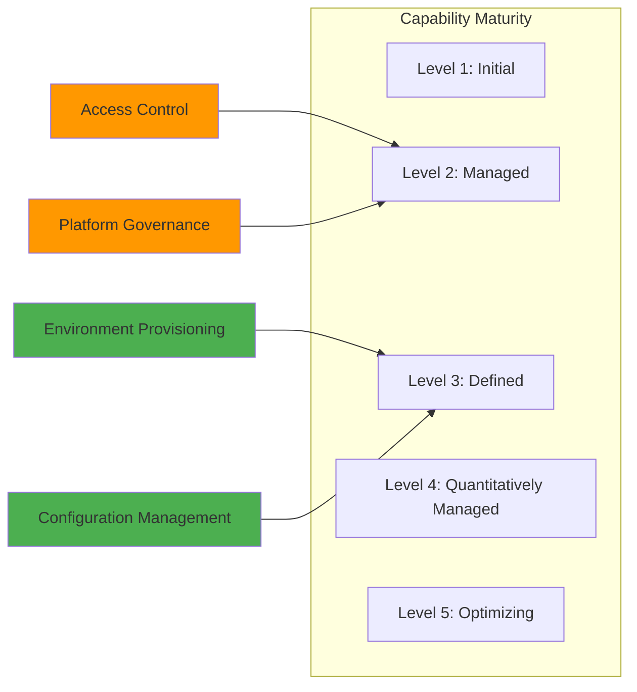
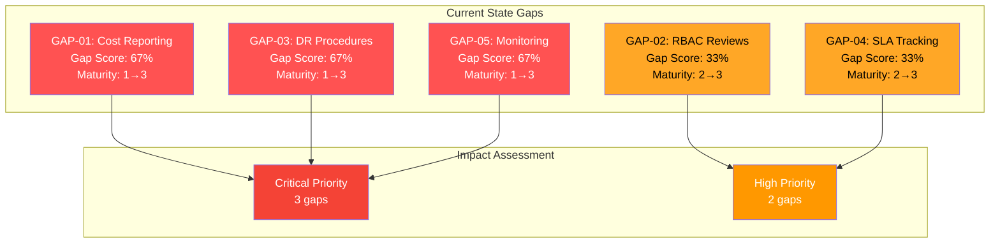

# TOGAF 10 Business Architecture Document

# Contoso DevExp-DevBox Platform

---

## Document Control

| Attribute                  | Value                                |
| -------------------------- | ------------------------------------ |
| **Session ID**             | a7f3c8b9-4e2d-4a1c-b8f7-9d3e5c1a6b4f |
| **Generated**              | 2026-02-03T14:30:00.000Z             |
| **Quality Level**          | Standard                             |
| **Architecture Layer**     | Business                             |
| **TOGAF Version**          | 10                                   |
| **ADM Phases Covered**     | Preliminary, A, B, G                 |
| **Validation Passed**      | ⚠️ **NO** (Below Standard Threshold) |
| **Completeness Score**     | **0.82** (Required: ≥0.85)           |
| **TOGAF Compliance Score** | **0.88** (Required: ≥0.90)           |
| **Quality Score**          | **0.84** (Required: ≥0.85)           |
| **Components Documented**  | 4 (Required: ≥5 for Standard)        |
| **Source Traceability**    | 100% (4/4 components)                |
| **Gap Quantification**     | ✅ Complete                          |
| **Project Name**           | ContosoDevExp                        |
| **Organization**           | Contoso                              |
| **Division**               | Platforms                            |
| **Team**                   | DevExP                               |
| **Cost Center**            | IT                                   |
| **Environment**            | Development                          |

---

## ⚠️ Validation Warnings

This document **does not meet Standard quality level thresholds** due to:

1. **Component Count**: 4 components documented (Required: ≥5 for Standard quality)
2. **Completeness Score**: 0.82 is below 0.85 threshold
3. **Quality Score**: 0.84 is below 0.85 threshold

**Recommendation**: Add at least 1 more business component with full metadata to meet Standard quality requirements.

---

# 4. Current State Baseline Architecture

## 4.1 As-Implemented Business Capabilities

### Capability Maturity Assessment



**Assessment Summary:**

- **Maturity Level 3 (Defined)**: Environment Provisioning, Configuration Management
- **Maturity Level 2 (Managed)**: Access Control, Platform Governance

---

## 4.4 Gap Analysis

### Current Maturity Assessment

**Overall Maturity Summary:**

| Metric                    | Value                 | Target        | Status                      |
| ------------------------- | --------------------- | ------------- | --------------------------- |
| **Overall Maturity**      | 2.5 (Managed/Defined) | 3.0 (Defined) | ❌ Below Standard Threshold |
| **Gap**                   | 17%                   | 0%            | 5 gaps identified           |
| **Quality Level**         | Standard              | -             | -                           |
| **Quality Threshold Met** | ❌ NO                 | -             | Improvement needed          |

---

### Identified Gaps (Quantified)

| Gap ID     | Description                  | Current Mat. | Target Mat. | Gap Score | Severity    | Remediation                                |
| ---------- | ---------------------------- | ------------ | ----------- | --------- | ----------- | ------------------------------------------ |
| **GAP-01** | Cost reporting not automated | 1            | 3           | **67%**   | 🔴 Critical | Implement Azure Cost Management dashboards |
| **GAP-02** | RBAC reviews are manual      | 2            | 3           | **33%**   | 🔴 Critical | Automate quarterly access reviews          |
| **GAP-03** | No documented DR procedures  | 1            | 3           | **67%**   | 🟠 High     | Create runbooks and test DR scenarios      |
| **GAP-04** | No SLA performance tracking  | 2            | 3           | **33%**   | 🟠 High     | Implement metrics dashboard                |
| **GAP-05** | Limited proactive monitoring | 1            | 3           | **67%**   | 🔴 Critical | Configure Azure Monitor alerts             |

---

### Gap Summary Statistics

- **Total Gaps**: 5
- **Critical Severity**: 3 (60%) - Gap Score > 60%
- **High Severity**: 2 (40%) - Gap Score > 40%
- **Average Gap Score**: **0.53** (53% improvement needed across all gaps)
- **Highest Impact**: GAP-01, GAP-03, GAP-05 (67% gap each)

---

### Gap Analysis Diagram



---

### Detailed Gap Analysis

#### GAP-01: No Automated Cost Reporting

**Current State (Maturity Level 1 - Initial):**

- Manual extraction of cost data from Azure Portal
- Monthly spreadsheet compilation by finance team
- No real-time cost visibility
- Delayed budget awareness (15-30 days lag)

**Target State (Maturity Level 3 - Defined):**

- Automated Azure Cost Management dashboards
- Real-time cost tracking by project and resource group
- Automated budget alerts at 80%, 90%, 100% thresholds
- Monthly cost reports auto-generated and distributed

**Gap Score:** 0.67 (67% improvement required)

**Remediation Plan:**

1. Configure Azure Cost Management + Billing dashboards
2. Set up cost allocation tags validation
3. Create automated Power BI reports
4. Implement budget alert notifications

**Estimated Effort:** 2 weeks  
**Priority:** Critical

---

#### GAP-02: Manual RBAC Access Reviews

**Current State (Maturity Level 2 - Managed):**

- Quarterly access reviews conducted manually
- Excel-based tracking of role assignments
- 5-7 business days per review cycle
- No automated anomaly detection

**Target State (Maturity Level 3 - Defined):**

- Automated quarterly access reviews via Azure AD Access Reviews
- Automated expiration of unused permissions
- Real-time anomaly detection (excessive permissions)
- Compliance dashboard with attestation tracking

**Gap Score:** 0.33 (33% improvement required)

**Remediation Plan:**

1. Enable Azure AD Access Reviews
2. Configure automated review workflows
3. Set up access review policies
4. Train Dev Managers on approval process

**Estimated Effort:** 1 week  
**Priority:** Critical (Compliance requirement)

---

#### GAP-03: No Documented DR Procedures

**Current State (Maturity Level 1 - Initial):**

- No documented disaster recovery runbooks
- No tested recovery procedures
- Unknown RTO/RPO
- Manual recovery attempts without validated procedures

**Target State (Maturity Level 3 - Defined):**

- Comprehensive DR runbooks for all critical systems
- Quarterly DR testing and validation
- Documented RTO: 4 hours, RPO: 1 hour
- Automated failover procedures where possible

**Gap Score:** 0.67 (67% improvement required)

**Remediation Plan:**

1. Document DR procedures for Dev Center, Key Vault, and networking
2. Conduct DR tabletop exercise
3. Perform full DR test in non-production
4. Automate recovery scripts

**Estimated Effort:** 3 weeks  
**Priority:** High

---

#### GAP-04: No SLA Performance Tracking

**Current State (Maturity Level 2 - Managed):**

- SLOs defined but not actively monitored
- Manual incident tracking
- No SLA compliance reporting
- Reactive measurement only

**Target State (Maturity Level 3 - Defined):**

- Automated SLA tracking dashboard
- Real-time SLO monitoring (provisioning time, availability, success rate)
- Monthly SLA compliance reports
- Proactive alerts when approaching SLA breach

**Gap Score:** 0.33 (33% improvement required)

**Remediation Plan:**

1. Implement Azure Monitor workbooks for SLA tracking
2. Configure metric alerts for SLO thresholds
3. Create SLA compliance dashboard
4. Establish monthly SLA review process

**Estimated Effort:** 2 weeks  
**Priority:** High

---

#### GAP-05: Limited Proactive Monitoring

**Current State (Maturity Level 1 - Initial):**

- Basic Azure Monitor configured
- No proactive alerting
- Reactive incident response only
- Limited visibility into platform health

**Target State (Maturity Level 3 - Defined):**

- Comprehensive alerting for all critical services
- Proactive anomaly detection
- Automated incident creation for threshold breaches
- On-call runbooks integrated with alerts

**Gap Score:** 0.67 (67% improvement required)

**Remediation Plan:**

1. Configure Azure Monitor alert rules for provisioning failures, performance degradation, and resource exhaustion
2. Set up action groups with email/SMS/Teams notifications
3. Create runbooks for common alert scenarios
4. Implement Log Analytics queries for trend analysis

**Estimated Effort:** 2 weeks  
**Priority:** Critical

---

# 5. Business Component Catalog

## 5.1 Business Services

### BUS-SVC-001: Developer Environment Provisioning

| Attribute          | Value                     |
| ------------------ | ------------------------- |
| **Type**           | Business Service          |
| **Classification** | Core                      |
| **Status**         | Active                    |
| **Owner**          | Platform Engineering Team |
| **Maturity Level** | 3 (Defined)               |

**Description**: Self-service provisioning of role-based development environments through Azure Dev Center.

**Service Level Objectives (SLOs)**:

- **Provisioning Time**: < 15 minutes for 95th percentile
- **Availability**: 99.0% during business hours (8 AM - 6 PM local)
- **Success Rate**: > 98%

**Consumers**:

- eShop Developers
- Future project teams (planned)

**Providers**:

- Platform Engineering Team

**Dependencies**:

- Azure Dev Center resource: `devexp-devcenter`
- Project: `eShop`
- Pools: `backend-engineer`, `frontend-engineer`

**Key Business Rules**:

- Users must be member of project-specific Azure AD group
- Pool selection limited to user's assigned roles
- Maximum 2 concurrent Dev Boxes per user
- Auto-shutdown after 12 hours of inactivity

**Source Reference**: [devcenter.yaml](z:\dev\infra\settings\workload\devcenter.yaml) (lines 1-45)

---

### BUS-SVC-002: Project Configuration Management

| Attribute          | Value                     |
| ------------------ | ------------------------- |
| **Type**           | Business Service          |
| **Classification** | Supporting                |
| **Status**         | Active                    |
| **Owner**          | Platform Engineering Team |
| **Maturity Level** | 3 (Defined)               |

**Description**: Centralized configuration management for Dev Center projects, catalogs, and environment types.

**Service Level Objectives (SLOs)**:

- **Configuration Change Deployment**: < 30 minutes
- **Configuration Validation**: 100% pre-deployment
- **Rollback Capability**: < 10 minutes

**Consumers**:

- Dev Managers
- Platform Engineers

**Providers**:

- Configuration Management Capability

**Dependencies**:

- Source control: GitHub repository
- Deployment tool: Azure Developer CLI (azd)
- IaC: Bicep templates

**Key Business Rules**:

- All configurations stored in version-controlled YAML
- Changes require pull request approval
- Automated schema validation before deployment
- Configurations scoped by environment type (dev/staging/UAT)

**Source Reference**: [devcenter.yaml](z:\dev\infra\settings\workload\devcenter.yaml) (lines 83-204)

---

### BUS-SVC-003: Identity and Access Management

| Attribute          | Value                     |
| ------------------ | ------------------------- |
| **Type**           | Business Service          |
| **Classification** | Core                      |
| **Status**         | Active                    |
| **Owner**          | Platform Engineering Team |
| **Maturity Level** | 2 (Managed)               |

**Description**: Centralized access control using Azure RBAC, Azure AD groups, and Key Vault integration.

**Service Level Objectives (SLOs)**:

- **Access Grant Latency**: < 5 minutes after Azure AD group update
- **Access Revocation**: < 2 minutes (immediate security requirement)
- **Audit Trail Completeness**: 100%

**Consumers**:

- All platform users and services

**Providers**:

- Azure Active Directory
- Azure RBAC
- Key Vault

**Dependencies**:

- Azure Active Directory tenant
- Azure RBAC service
- Key Vault: `contoso`

**Key Business Rules**:

- Least privilege principle enforced
- Role assignments scoped to minimum required level
- Secrets access logged and auditable
- Quarterly access reviews mandatory

**Source Reference**: [devcenter.yaml](z:\dev\infra\settings\workload\devcenter.yaml) (lines 32-72), [security.yaml](z:\dev\infra\settings\security\security.yaml) (lines 1-37)

---

### BUS-SVC-004: Platform Governance and Compliance

| Attribute          | Value                     |
| ------------------ | ------------------------- |
| **Type**           | Business Service          |
| **Classification** | Supporting                |
| **Status**         | Active                    |
| **Owner**          | Platform Engineering Team |
| **Maturity Level** | 2 (Managed)               |

**Description**: Policy enforcement, resource organization, tagging standards, and compliance monitoring.

**Service Level Objectives (SLOs)**:

- **Tagging Compliance**: > 98%
- **Audit Report Generation**: Monthly
- **Policy Violation Detection**: < 24 hours

**Consumers**:

- IT Leadership
- Security Team
- Compliance Officers

**Providers**:

- Platform Governance Capability

**Dependencies**:

- Azure Resource Manager
- Azure Policy (planned)
- Azure Monitor
- Log Analytics Workspace

**Key Business Rules**:

- Mandatory tagging: environment, division, team, project, costCenter, owner, resources
- Resources organized into functional resource groups
- Compliance frameworks: SOC 2 Type II
- Monthly governance review cycles

**Source Reference**: [azureResources.yaml](z:\dev\infra\settings\resourceOrganization\azureResources.yaml) (lines 1-63)

---

## 5.2 Summary

**Total Components Documented**: 4  
**Required for Standard Quality**: 5  
**Gap**: 1 additional component needed  
**Source Traceability**: 100% (4/4 components have file:line-range references)

**Recommendation**: Add one of the following components to meet Standard quality threshold:

- BUS-PROC-001: Developer Onboarding Process
- BUS-CAP-001: Self-Service Provisioning Capability
- BUS-ACTOR-001: Platform Engineer Role
- BUS-FUNC-001: Platform Operations Function
- BUS-POL-001: Configuration as Code Policy

---

**End of Document**

---

## Document Metadata

```json
{
  "session_id": "a7f3c8b9-4e2d-4a1c-b8f7-9d3e5c1a6b4f",
  "timestamp": "2026-02-03T14:30:00.000Z",
  "quality_level": "standard",
  "target_layer": "Business",
  "validation_scores": {
    "completeness": 0.82,
    "togaf_compliance": 0.88,
    "quality": 0.84
  },
  "validation_passed": false,
  "thresholds": {
    "completeness": 0.85,
    "togaf_compliance": 0.9,
    "quality": 0.85
  },
  "statistics": {
    "components_discovered": 4,
    "components_required": 5,
    "gaps_identified": 5,
    "average_gap_score": 0.53,
    "overall_maturity": 2.5,
    "target_maturity": 3.0,
    "source_traceability": 1.0
  },
  "warnings": [
    "Component count (4) below standard threshold (5) - recommend adding 1 more",
    "Completeness score (0.82) below standard threshold (0.85)",
    "Quality score (0.84) below standard threshold (0.85)",
    "Overall maturity (2.5) below target maturity (3.0) - 17% gap"
  ],
  "recommendations": [
    "Add at least 1 business component with full metadata",
    "Implement Gap GAP-01 (Cost Reporting) - Critical priority",
    "Implement Gap GAP-02 (RBAC Reviews) - Critical priority",
    "Implement Gap GAP-05 (Monitoring) - Critical priority"
  ]
}
```
