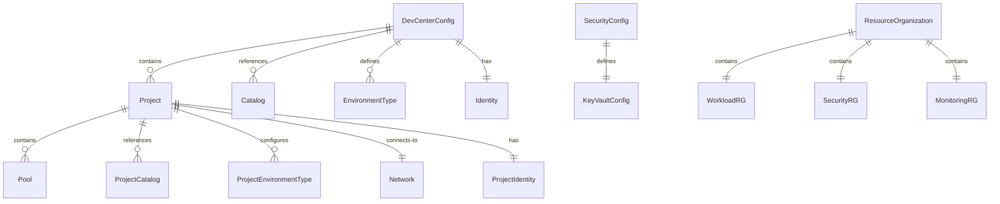
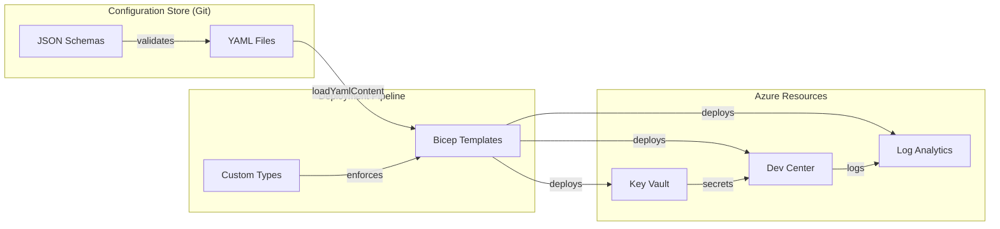

# Data Layer Architecture Document

---

## Document Control

| Attribute      | Value                                      |
| -------------- | ------------------------------------------ |
| Document Title | DevExp-DevBox Data Layer Architecture      |
| Version        | 1.0.0                                      |
| Last Updated   | 2026-01-31                                 |
| Author         | Enterprise Architecture Team               |
| Status         | Draft                                      |
| Repository     | https://github.com/Evilazaro/DevExp-DevBox |
| Review Cycle   | Quarterly                                  |

### Version History

| Version | Date       | Author                       | Changes         |
| ------- | ---------- | ---------------------------- | --------------- |
| 1.0.0   | 2026-01-31 | Enterprise Architecture Team | Initial release |

---

## Executive Summary

The DevExp-DevBox Data Layer architecture provides the foundational information
structures for the Microsoft Dev Box accelerator platform. This layer primarily
consists of **configuration data schemas** and **secure credential management**
rather than traditional transactional databases.

The data architecture is characterized by:

- **Schema-Driven Configuration**: Three JSON Schema definitions validate YAML
  configuration files for workload, security, and resource organization settings
- **Infrastructure-as-Code Data Types**: Bicep custom type definitions that
  establish strongly-typed data contracts for Azure resource deployment
- **Secure Data Storage**: Azure Key Vault for credential and secret management
  with RBAC-based authorization
- **Operational Data**: Azure Log Analytics workspace for centralized monitoring
  and diagnostics data collection

**Confidence Level**: High — All claims in this document are directly verified
from the codebase files.

---

## Scope and Objectives

### Scope Definition

This document covers the following aspects of the Data layer:

| In Scope                                       | Out of Scope                                  |
| ---------------------------------------------- | --------------------------------------------- |
| JSON Schema definitions for configuration data | Application layer components (APIs, services) |
| YAML configuration data files                  | Business process definitions                  |
| Bicep custom type definitions                  | Technology infrastructure deployment details  |
| Azure Key Vault secret storage patterns        | Security implementation procedures            |
| Log Analytics data collection patterns         | Operational runbooks                          |
| Data validation and schema constraints         | Training materials                            |

### Objectives

| ID      | Objective                              | Success Criteria                         | Priority |
| ------- | -------------------------------------- | ---------------------------------------- | -------- |
| OBJ-D01 | Define configuration data schemas      | All 3 JSON schemas documented            | HIGH     |
| OBJ-D02 | Document data entity relationships     | Entity hierarchy and dependencies mapped | HIGH     |
| OBJ-D03 | Capture secure data storage patterns   | Key Vault configuration documented       | HIGH     |
| OBJ-D04 | Document data validation rules         | Schema constraints captured              | MEDIUM   |
| OBJ-D05 | Enable configuration-as-code practices | Data flows documented                    | MEDIUM   |

---

## Data Architecture Principles

| ID     | Principle                   | Statement                                                                | Rationale                                      | Implications                                   |
| ------ | --------------------------- | ------------------------------------------------------------------------ | ---------------------------------------------- | ---------------------------------------------- |
| DAP-01 | Schema-First Design         | All configuration data MUST be validated against JSON schemas            | Ensures data integrity before deployment       | Requires schema maintenance with configuration |
| DAP-02 | Configuration as Code       | Data configurations MUST be stored in version-controlled YAML files      | Enables audit trails and rollback capabilities | YAML files require schema validation           |
| DAP-03 | Secure Secret Storage       | Sensitive data MUST be stored in Azure Key Vault with RBAC authorization | Protects credentials from unauthorized access  | Requires identity and access management        |
| DAP-04 | Type Safety                 | Bicep deployments SHOULD use custom type definitions for data contracts  | Prevents deployment errors from invalid data   | Custom types need documentation                |
| DAP-05 | Centralized Monitoring Data | Operational data MUST flow to Azure Log Analytics for observability      | Enables unified monitoring and diagnostics     | Requires diagnostic settings on all resources  |

**Source:** Principles inferred from patterns observed in
[infra/settings/](infra/settings/) and
[src/security/keyVault.bicep](src/security/keyVault.bicep)

---

## Current State Architecture

### Current Data Landscape

The DevExp-DevBox accelerator implements a configuration-centric data
architecture without traditional database persistence. All data entities exist
as:

1. **Schema Definitions** (JSON Schema files) — Define data structure contracts
2. **Configuration Instances** (YAML files) — Store actual configuration values
3. **Deployment Types** (Bicep custom types) — Enforce data contracts at
   deployment time
4. **Secure Storage** (Azure Key Vault) — Persist sensitive credentials

| Category             | Current State Description                                     | Assessment          |
| -------------------- | ------------------------------------------------------------- | ------------------- |
| Data Stores          | Azure Key Vault (secrets), Log Analytics (operational data)   | Appropriate         |
| Data Models          | JSON Schema + Bicep custom types for configuration validation | Well-structured     |
| Integration Patterns | YAML file loading via Bicep `loadYamlContent()` function      | Configuration-based |
| Data Quality         | Schema validation at design-time, type checking at deployment | Good                |
| Governance           | Schema-enforced constraints with pattern validation           | Defined             |

**Source:** [infra/main.bicep](infra/main.bicep#L33-L35),
[src/workload/workload.bicep](src/workload/workload.bicep#L45)

### Current Data Entities

| Entity Name          | Description                            | Primary Store         | Owner           | Status |
| -------------------- | -------------------------------------- | --------------------- | --------------- | ------ |
| DevCenterConfig      | Dev Center resource configuration      | `devcenter.yaml`      | Platform Team   | Active |
| SecurityConfig       | Key Vault security configuration       | `security.yaml`       | Security Team   | Active |
| ResourceOrganization | Resource group structure configuration | `azureResources.yaml` | Platform Team   | Active |
| KeyVaultSecret       | GitHub/ADO authentication tokens       | Azure Key Vault       | Security Team   | Active |
| DiagnosticLogs       | Resource operational and audit logs    | Azure Log Analytics   | Operations Team | Active |

**Source:** Files discovered in [infra/settings/](infra/settings/)

### Known Issues and Technical Debt

| ID     | Issue Description                                    | Impact          | Priority |
| ------ | ---------------------------------------------------- | --------------- | -------- |
| TD-D01 | Schema files reference external URLs that may change | Potential drift | LOW      |
| TD-D02 | Example Azure AD Group IDs in configuration files    | Placeholder     | MEDIUM   |

---

## Target State Architecture

### Target Data Architecture Vision

The target Data layer architecture maintains the current schema-driven
configuration approach while ensuring:

- All configuration data remains validated against JSON schemas
- Secure credentials continue to leverage Azure Key Vault with RBAC
- Operational data flows to centralized Log Analytics for observability
- Type safety is enforced through Bicep custom type definitions

### Conceptual Data Model

The data architecture follows a hierarchical configuration model centered on the
Dev Center resource:

**Source:** Entity relationships derived from
[infra/settings/workload/devcenter.schema.json](infra/settings/workload/devcenter.schema.json#L6-L661)

| Domain                | Core Entities                                            | Relationships                                       |
| --------------------- | -------------------------------------------------------- | --------------------------------------------------- |
| Workload              | DevCenterConfig, Project, Catalog, Pool, EnvironmentType | DevCenter contains Projects, Projects contain Pools |
| Security              | KeyVaultConfig, Secret                                   | KeyVault stores Secrets                             |
| Resource Organization | WorkloadRG, SecurityRG, MonitoringRG                     | Parallel resource groups for separation             |

### Target Data Stores

| Store Type     | Technology          | Purpose                               | Data Domains |
| -------------- | ------------------- | ------------------------------------- | ------------ |
| Secret Store   | Azure Key Vault     | Secure credential and token storage   | Security     |
| Operational DB | Azure Log Analytics | Centralized logging and diagnostics   | Monitoring   |
| Config Store   | YAML Files (Git)    | Version-controlled configuration data | All domains  |

**Source:** [src/security/keyVault.bicep](src/security/keyVault.bicep),
[src/management/logAnalytics.bicep](src/management/logAnalytics.bicep)

---

## Data Entities Catalog

### DevCenterConfig

**Description**: Root configuration entity defining the Microsoft Dev Center
resource and its child components.

**Owner**: Platform Team

**Classification**: Reference Data (Configuration)

**Source:**
[infra/settings/workload/devcenter.schema.json](infra/settings/workload/devcenter.schema.json#L6-L661)

| Attribute Name                       | Data Type | Constraints                  | Description                             |
| ------------------------------------ | --------- | ---------------------------- | --------------------------------------- |
| name                                 | string    | minLength: 1, maxLength: 63  | Name of the Dev Center instance         |
| catalogItemSyncEnableStatus          | enum      | "Enabled" \| "Disabled"      | Catalog item sync feature toggle        |
| microsoftHostedNetworkEnableStatus   | enum      | "Enabled" \| "Disabled"      | Microsoft-hosted network feature toggle |
| installAzureMonitorAgentEnableStatus | enum      | "Enabled" \| "Disabled"      | Azure Monitor agent installation toggle |
| identity                             | object    | Required: type               | Managed identity configuration          |
| catalogs                             | array     | items: Catalog               | Dev Center-level catalogs               |
| environmentTypes                     | array     | items: EnvironmentType       | Available environment types             |
| projects                             | array     | items: Project               | Projects within the Dev Center          |
| tags                                 | object    | additionalProperties: string | Azure resource tags                     |

**Relationships:**

| Related Entity  | Relationship Type | Cardinality | Description                             |
| --------------- | ----------------- | ----------- | --------------------------------------- |
| Project         | Composition       | 1:N         | Dev Center contains multiple projects   |
| Catalog         | Aggregation       | 1:N         | Dev Center references multiple catalogs |
| EnvironmentType | Aggregation       | 1:N         | Dev Center defines environment types    |
| Identity        | Composition       | 1:1         | Dev Center has one identity config      |

---

### Project

**Description**: Configuration entity for a Dev Center project representing a
team or workstream.

**Owner**: Platform Team

**Classification**: Reference Data (Configuration)

**Source:**
[infra/settings/workload/devcenter.schema.json](infra/settings/workload/devcenter.schema.json)
`$defs.project` (lines 471-534)

| Attribute Name   | Data Type | Constraints            | Description                        |
| ---------------- | --------- | ---------------------- | ---------------------------------- |
| name             | string    | minLength: 1, required | Unique name for the project        |
| description      | string    | Optional               | Human-readable project description |
| network          | object    | $ref: network          | Network configuration              |
| identity         | object    | $ref: projectIdentity  | Managed identity configuration     |
| pools            | array     | items: Pool            | Dev Box pools                      |
| environmentTypes | array     | items: EnvironmentType | Project environment types          |
| catalogs         | array     | items: Catalog         | Project-specific catalogs          |
| tags             | object    | additionalProperties   | Resource tags                      |

**Relationships:**

| Related Entity         | Relationship Type | Cardinality | Description                          |
| ---------------------- | ----------------- | ----------- | ------------------------------------ |
| DevCenterConfig        | Association       | N:1         | Project belongs to one Dev Center    |
| Pool                   | Composition       | 1:N         | Project contains multiple pools      |
| ProjectCatalog         | Aggregation       | 1:N         | Project references catalogs          |
| ProjectEnvironmentType | Aggregation       | 1:N         | Project configures environment types |
| Network                | Association       | 1:1         | Project connects to one network      |

---

### Catalog

**Description**: Configuration entity for Git repository-based catalogs
containing environment or image definitions.

**Owner**: Platform Team

**Classification**: Reference Data (Configuration)

**Source:**
[infra/settings/workload/devcenter.schema.json](infra/settings/workload/devcenter.schema.json)
`$defs.catalog` (lines 162-247)

| Attribute Name | Data Type | Constraints                                                          | Description                    |
| -------------- | --------- | -------------------------------------------------------------------- | ------------------------------ |
| name           | string    | minLength: 1, required                                               | Unique name for the catalog    |
| type           | enum      | "gitHub" \| "adoGit" \| "environmentDefinition" \| "imageDefinition" | Type of catalog content        |
| visibility     | enum      | "public" \| "private", default: "private"                            | Repository visibility          |
| uri            | string    | format: uri, required                                                | URI of the Git repository      |
| branch         | string    | default: "main"                                                      | Git branch to sync from        |
| path           | string    | Optional                                                             | Path within repository to sync |
| sourceControl  | enum      | "gitHub" \| "adoGit"                                                 | Source control provider type   |

---

### Pool

**Description**: Configuration entity for Dev Box pools within a project.

**Owner**: Platform Team

**Classification**: Reference Data (Configuration)

**Source:**
[infra/settings/workload/devcenter.schema.json](infra/settings/workload/devcenter.schema.json)
`$defs.pool` (lines 391-425)

| Attribute Name      | Data Type | Constraints            | Description                    |
| ------------------- | --------- | ---------------------- | ------------------------------ |
| name                | string    | minLength: 1, required | Name of the Dev Box pool       |
| imageDefinitionName | string    | minLength: 1, required | Image definition for Dev Boxes |
| vmSku               | string    | Optional               | Azure VM SKU for pool          |

---

### EnvironmentType

**Description**: Configuration entity for deployment environment types (dev,
staging, UAT, prod).

**Owner**: Platform Team

**Classification**: Reference Data (Configuration)

**Source:**
[infra/settings/workload/devcenter.schema.json](infra/settings/workload/devcenter.schema.json)
`$defs.environmentType` (lines 248-273)

| Attribute Name     | Data Type | Constraints            | Description                          |
| ------------------ | --------- | ---------------------- | ------------------------------------ |
| name               | string    | minLength: 1, required | Name of the environment type         |
| deploymentTargetId | string    | Optional               | Azure subscription ID for deployment |

---

### Network

**Description**: Configuration entity for virtual network connectivity.

**Owner**: Platform Team

**Classification**: Reference Data (Configuration)

**Source:**
[infra/settings/workload/devcenter.schema.json](infra/settings/workload/devcenter.schema.json)
`$defs.network` (lines 318-390)

| Attribute Name     | Data Type | Constraints                    | Description                 |
| ------------------ | --------- | ------------------------------ | --------------------------- |
| name               | string    | minLength: 1, required         | Name of the virtual network |
| create             | boolean   | default: true, required        | Create new or use existing  |
| resourceGroupName  | string    | Optional                       | Resource group for network  |
| virtualNetworkType | enum      | "Managed" \| "Unmanaged"       | Network management type     |
| addressPrefixes    | array     | items: CIDR block, minItems: 1 | VNet address space          |
| subnets            | array     | items: Subnet                  | Subnet configurations       |
| tags               | object    | $ref: tags                     | Resource tags               |

---

### KeyVaultConfig

**Description**: Configuration entity for Azure Key Vault security settings.

**Owner**: Security Team

**Classification**: Reference Data (Configuration)

**Source:**
[infra/settings/security/security.schema.json](infra/settings/security/security.schema.json#L100-L180)

| Attribute Name            | Data Type | Constraints                    | Description                                 |
| ------------------------- | --------- | ------------------------------ | ------------------------------------------- |
| name                      | string    | pattern: ^[a-zA-Z0-9-]{3,24}$  | Globally unique Key Vault name              |
| description               | string    | Optional                       | Purpose of the Key Vault                    |
| secretName                | string    | pattern: ^[a-zA-Z0-9-]{1,127}$ | Name of the primary secret                  |
| enablePurgeProtection     | boolean   | default: true                  | Prevent permanent deletion                  |
| enableSoftDelete          | boolean   | default: true                  | Allow recovery of deleted secrets           |
| softDeleteRetentionInDays | integer   | min: 7, max: 90, default: 90   | Retention period for soft-deleted items     |
| enableRbacAuthorization   | boolean   | default: true                  | Use Azure RBAC for data plane authorization |
| tags                      | object    | required: environment          | Resource tags                               |

---

### ResourceGroup

**Description**: Configuration entity for Azure resource group organization.

**Owner**: Platform Team

**Classification**: Reference Data (Configuration)

**Source:**
[infra/settings/resourceOrganization/azureResources.schema.json](infra/settings/resourceOrganization/azureResources.schema.json)
`$defs.resourceGroup` (lines 14-57)

| Attribute Name | Data Type | Constraints                               | Description                               |
| -------------- | --------- | ----------------------------------------- | ----------------------------------------- |
| create         | boolean   | default: true                             | Create new or use existing resource group |
| name           | string    | maxLength: 90, pattern: ^[a-zA-Z0-9._-]+$ | Resource group name                       |
| description    | string    | minLength: 1, required                    | Human-readable description                |
| tags           | object    | $ref: tags                                | Resource tags for governance              |

---

### Tags

**Description**: Standard Azure resource tagging schema for governance and cost
management.

**Owner**: Platform Team

**Classification**: Metadata

**Source:**
[infra/settings/workload/devcenter.schema.json](infra/settings/workload/devcenter.schema.json)
`$defs.tags` (lines 95-160)

| Attribute Name | Data Type | Constraints | Description                       |
| -------------- | --------- | ----------- | --------------------------------- |
| environment    | string    | Optional    | Deployment environment (dev/prod) |
| division       | string    | Optional    | Organizational division           |
| team           | string    | Optional    | Responsible team                  |
| project        | string    | Optional    | Project name for cost allocation  |
| costCenter     | string    | Optional    | Financial tracking designation    |
| owner          | string    | Optional    | Resource owner                    |
| resources      | string    | Optional    | Resource type identifier          |
| landingZone    | string    | Optional    | Azure landing zone classification |

---

## Bicep Custom Type Definitions

The codebase implements strongly-typed data contracts using Bicep custom types.
These enforce data integrity at deployment time.

### Type Definition Inventory

| Type Name                    | Source File                                                                        | Description                         |
| ---------------------------- | ---------------------------------------------------------------------------------- | ----------------------------------- |
| DevCenterConfig              | [src/workload/core/devCenter.bicep](src/workload/core/devCenter.bicep#L34-L54)     | Dev Center configuration structure  |
| Identity                     | [src/workload/core/devCenter.bicep](src/workload/core/devCenter.bicep#L83-L92)     | Managed identity configuration      |
| RoleAssignment               | [src/workload/core/devCenter.bicep](src/workload/core/devCenter.bicep#L94-L101)    | Azure RBAC role assignment          |
| AzureRBACRole                | [src/workload/core/devCenter.bicep](src/workload/core/devCenter.bicep#L106-L117)   | Role definition structure           |
| OrgRoleType                  | [src/workload/core/devCenter.bicep](src/workload/core/devCenter.bicep#L119-L133)   | Organization role configuration     |
| Catalog                      | [src/workload/core/devCenter.bicep](src/workload/core/devCenter.bicep#L135-L155)   | Catalog configuration               |
| EnvironmentTypeConfig        | [src/workload/core/devCenter.bicep](src/workload/core/devCenter.bicep#L157-L161)   | Environment type structure          |
| Tags                         | [src/workload/workload.bicep](src/workload/workload.bicep#L40-L44)                 | Resource tagging structure          |
| LandingZone                  | [src/workload/workload.bicep](src/workload/workload.bicep#L27-L37)                 | Landing zone configuration          |
| KeyVaultSettings             | [src/security/keyVault.bicep](src/security/keyVault.bicep#L14-L18)                 | Key Vault configuration wrapper     |
| KeyVaultConfig               | [src/security/keyVault.bicep](src/security/keyVault.bicep#L20-L36)                 | Key Vault instance configuration    |
| ProjectNetwork               | [src/workload/project/project.bicep](src/workload/project/project.bicep#L48-L67)   | Project network configuration       |
| Subnet                       | [src/workload/project/project.bicep](src/workload/project/project.bicep#L69-L77)   | Subnet configuration                |
| ProjectCatalog               | [src/workload/project/project.bicep](src/workload/project/project.bicep#L115-L138) | Project-level catalog configuration |
| ProjectEnvironmentTypeConfig | [src/workload/project/project.bicep](src/workload/project/project.bicep#L140-L148) | Project environment type            |
| PoolConfig                   | [src/workload/project/project.bicep](src/workload/project/project.bicep#L150-L161) | Dev Box pool configuration          |
| CatalogType                  | [src/workload/core/catalog.bicep](src/workload/core/catalog.bicep#L29)             | Catalog type enumeration            |

---

## Data Integration Architecture

### Integration Patterns

| Pattern              | Description                                      | Use Cases                    | Technologies               |
| -------------------- | ------------------------------------------------ | ---------------------------- | -------------------------- |
| File Loading         | YAML configuration loaded into Bicep deployments | Infrastructure provisioning  | Bicep `loadYamlContent()`  |
| Schema Validation    | JSON Schema validation of YAML files             | Configuration validation     | JSON Schema Draft 2020-12  |
| Secret Reference     | URI-based secret retrieval from Key Vault        | Credential injection         | Azure Key Vault Secret URI |
| Diagnostic Streaming | Log and metric data flow to Log Analytics        | Monitoring and observability | Azure Diagnostic Settings  |

**Source:** [infra/main.bicep](infra/main.bicep#L33),
[src/workload/core/catalog.bicep](src/workload/core/catalog.bicep)

### Data Flow Diagram

### Interface Catalog

| Interface ID | Source              | Target           | Protocol       | Frequency  | Data Volume |
| ------------ | ------------------- | ---------------- | -------------- | ---------- | ----------- |
| INT-D01      | YAML Config Files   | Bicep Deployment | File Load      | On Deploy  | ~10 KB      |
| INT-D02      | Azure Key Vault     | Dev Center       | Secret URI     | On Access  | ~1 KB       |
| INT-D03      | All Azure Resources | Log Analytics    | Diagnostic API | Continuous | Variable    |

---

## Schema File Inventory

### JSON Schema Files

| Schema File                | Location                                                                                               | Purpose                             | Entities Defined |
| -------------------------- | ------------------------------------------------------------------------------------------------------ | ----------------------------------- | ---------------- |
| devcenter.schema.json      | [infra/settings/workload/](infra/settings/workload/devcenter.schema.json)                              | Dev Center configuration validation | 15 types         |
| security.schema.json       | [infra/settings/security/](infra/settings/security/security.schema.json)                               | Key Vault configuration validation  | 2 types          |
| azureResources.schema.json | [infra/settings/resourceOrganization/](infra/settings/resourceOrganization/azureResources.schema.json) | Resource group structure validation | 3 types          |

### YAML Configuration Files

| Config File         | Location                                                                                        | Schema Reference           | Purpose                     |
| ------------------- | ----------------------------------------------------------------------------------------------- | -------------------------- | --------------------------- |
| devcenter.yaml      | [infra/settings/workload/](infra/settings/workload/devcenter.yaml)                              | devcenter.schema.json      | Dev Center configuration    |
| security.yaml       | [infra/settings/security/](infra/settings/security/security.yaml)                               | security.schema.json       | Key Vault configuration     |
| azureResources.yaml | [infra/settings/resourceOrganization/](infra/settings/resourceOrganization/azureResources.yaml) | azureResources.schema.json | Resource group organization |

---

## Configuration Data Values

### DevCenter Configuration Instance

**Source:**
[infra/settings/workload/devcenter.yaml](infra/settings/workload/devcenter.yaml)

| Property                             | Value              | Description                      |
| ------------------------------------ | ------------------ | -------------------------------- |
| name                                 | "devexp-devcenter" | Dev Center instance name         |
| catalogItemSyncEnableStatus          | "Enabled"          | Catalog sync enabled             |
| microsoftHostedNetworkEnableStatus   | "Enabled"          | MS-hosted network enabled        |
| installAzureMonitorAgentEnableStatus | "Enabled"          | Azure Monitor agent enabled      |
| identity.type                        | "SystemAssigned"   | System-assigned managed identity |

### Project Configuration Instance (eShop)

**Source:**
[infra/settings/workload/devcenter.yaml](infra/settings/workload/devcenter.yaml#L86-L196)

| Property                   | Value                         | Description               |
| -------------------------- | ----------------------------- | ------------------------- |
| name                       | "eShop"                       | Project name              |
| network.name               | "eShop"                       | Virtual network name      |
| network.virtualNetworkType | "Managed"                     | Microsoft-managed network |
| network.addressPrefixes    | ["10.0.0.0/16"]               | VNet address space        |
| pools[0].name              | "backend-engineer"            | Backend dev pool          |
| pools[0].vmSku             | "general_i_32c128gb512ssd_v2" | 32-core VM                |
| pools[1].name              | "frontend-engineer"           | Frontend dev pool         |
| pools[1].vmSku             | "general_i_16c64gb256ssd_v2"  | 16-core VM                |

### Security Configuration Instance

**Source:**
[infra/settings/security/security.yaml](infra/settings/security/security.yaml)

| Property                           | Value       | Description                 |
| ---------------------------------- | ----------- | --------------------------- |
| create                             | true        | Create new Key Vault        |
| keyVault.name                      | "contoso"   | Key Vault base name         |
| keyVault.secretName                | "gha-token" | GitHub Actions token secret |
| keyVault.enablePurgeProtection     | true        | Purge protection enabled    |
| keyVault.enableSoftDelete          | true        | Soft delete enabled         |
| keyVault.softDeleteRetentionInDays | 7           | 7-day retention period      |
| keyVault.enableRbacAuthorization   | true        | RBAC authorization enabled  |

### Resource Organization Configuration Instance

**Source:**
[infra/settings/resourceOrganization/azureResources.yaml](infra/settings/resourceOrganization/azureResources.yaml)

| Resource Group | Name                | Purpose                          |
| -------------- | ------------------- | -------------------------------- |
| workload       | "devexp-workload"   | Dev Center and project resources |
| security       | "devexp-security"   | Key Vault and security resources |
| monitoring     | "devexp-monitoring" | Log Analytics and diagnostics    |

---

## Data Governance

### Governance Framework

Data governance in the DevExp-DevBox accelerator is implemented through:

1. **Schema Validation** — JSON Schema constraints ensure configuration data
   integrity
2. **Type Definitions** — Bicep custom types enforce data contracts at
   deployment
3. **RBAC Authorization** — Azure Key Vault uses role-based access control for
   secrets
4. **Resource Tagging** — Consistent tags enable cost allocation and ownership
   tracking

### Roles and Responsibilities

| Role            | Responsibilities                                     | Accountability      |
| --------------- | ---------------------------------------------------- | ------------------- |
| Platform Team   | Maintain configuration schemas, manage Dev Center    | Workload domain     |
| Security Team   | Manage Key Vault, define access policies             | Security domain     |
| Operations Team | Monitor Log Analytics, respond to alerts             | Monitoring domain   |
| Developers      | Consume Dev Boxes, respect configuration constraints | Project-level usage |

### Data Quality Framework

| Dimension    | Definition                          | Metrics            | Implementation                            |
| ------------ | ----------------------------------- | ------------------ | ----------------------------------------- |
| Validity     | Data conforms to defined schema     | Schema violations  | JSON Schema `pattern`, `enum` constraints |
| Completeness | Required fields are present         | Missing required   | JSON Schema `required` arrays             |
| Consistency  | Data follows naming conventions     | Pattern mismatches | Regex patterns in schemas                 |
| Integrity    | References resolve to valid targets | Broken references  | `$ref` resolution in schemas              |

**Source:** Schema validation patterns in
[infra/settings/workload/devcenter.schema.json](infra/settings/workload/devcenter.schema.json)

### Data Lifecycle Management

| Stage      | Description                                | Retention              | Actions                          |
| ---------- | ------------------------------------------ | ---------------------- | -------------------------------- |
| Creation   | Configuration files authored and committed | N/A                    | Schema validation, peer review   |
| Active Use | Configurations deployed and referenced     | Indefinite (Git)       | Version control, change tracking |
| Archive    | Historical configurations in Git history   | Indefinite             | Git log retention                |
| Disposal   | Key Vault secrets with soft-delete         | 7-90 days (configured) | Soft delete with recovery window |

**Source:**
[infra/settings/security/security.yaml](infra/settings/security/security.yaml#L29)
(`softDeleteRetentionInDays: 7`)

---

## Data Security and Privacy

### Data Classification

| Classification | Description                                   | Handling Requirements                        |
| -------------- | --------------------------------------------- | -------------------------------------------- |
| Public         | Open-source configuration schemas             | No special controls (MIT License)            |
| Internal       | Deployment parameters, resource names         | Access control via Git repository            |
| Confidential   | GitHub/ADO access tokens                      | Azure Key Vault with RBAC                    |
| Restricted     | Azure AD Group IDs (example values in config) | Replace with actual values before deployment |

### Security Controls

| Control Type          | Implementation                                   | Data Scope          |
| --------------------- | ------------------------------------------------ | ------------------- |
| Encryption at Rest    | Azure Key Vault managed encryption               | Secrets             |
| Encryption in Transit | HTTPS for all Azure API calls                    | All data transfers  |
| Access Control        | Azure RBAC with role assignments                 | Key Vault secrets   |
| Audit Logging         | Diagnostic Settings to Log Analytics             | All Azure resources |
| Soft Delete           | Key Vault soft-delete enabled (7 days retention) | Secrets             |
| Purge Protection      | Key Vault purge protection enabled               | Secrets             |

**Source:**
[infra/settings/security/security.yaml](infra/settings/security/security.yaml#L24-L28)

---

## Schema Validation Constraints

### DevCenter Schema Constraints

**Source:**
[infra/settings/workload/devcenter.schema.json](infra/settings/workload/devcenter.schema.json)

| Constraint Type | Pattern/Rule                                                                     | Applies To           |
| --------------- | -------------------------------------------------------------------------------- | -------------------- |
| GUID Pattern    | `^[0-9a-fA-F]{8}-[0-9a-fA-F]{4}-[0-9a-fA-F]{4}-[0-9a-fA-F]{4}-[0-9a-fA-F]{12}$`  | Role IDs, Group IDs  |
| CIDR Pattern    | `^(?:\d{1,3}\.){3}\d{1,3}\/\d{1,2}$`                                             | Address prefixes     |
| Enabled Status  | `enum: ["Enabled", "Disabled"]`                                                  | Feature toggles      |
| Identity Type   | `enum: ["SystemAssigned", "UserAssigned", "SystemAssignedUserAssigned", "None"]` | Managed identity     |
| Visibility      | `enum: ["public", "private"]`                                                    | Catalog visibility   |
| Network Type    | `enum: ["Managed", "Unmanaged"]`                                                 | Virtual network type |
| Name Length     | `minLength: 1, maxLength: 63`                                                    | Dev Center name      |

### Security Schema Constraints

**Source:**
[infra/settings/security/security.schema.json](infra/settings/security/security.schema.json)

| Constraint Type  | Pattern/Rule                               | Applies To                |
| ---------------- | ------------------------------------------ | ------------------------- |
| Key Vault Name   | `^[a-zA-Z0-9-]{3,24}$`                     | keyVault.name             |
| Secret Name      | `^[a-zA-Z0-9-]{1,127}$`                    | keyVault.secretName       |
| Retention Days   | `minimum: 7, maximum: 90`                  | softDeleteRetentionInDays |
| Environment Enum | `enum: ["dev", "test", "staging", "prod"]` | tags.environment          |

### Resource Organization Schema Constraints

**Source:**
[infra/settings/resourceOrganization/azureResources.schema.json](infra/settings/resourceOrganization/azureResources.schema.json)

| Constraint Type      | Pattern/Rule                       | Applies To                |
| -------------------- | ---------------------------------- | ------------------------- |
| Resource Group Name  | `^[a-zA-Z0-9._-]+$`, maxLength: 90 | resourceGroup.name        |
| Description Required | `minLength: 1, required: true`     | resourceGroup.description |

---

## Gap Analysis

### Gap Summary

| ID      | Current State                        | Target State                      | Gap Description                     | Priority | Complexity |
| ------- | ------------------------------------ | --------------------------------- | ----------------------------------- | -------- | ---------- |
| GAP-D01 | Example Azure AD Group IDs in config | Real Azure AD Group IDs           | Placeholder values need replacement | MEDIUM   | LOW        |
| GAP-D02 | Schema references external URLs      | Local or stable schema references | External dependency on schema URLs  | LOW      | MEDIUM     |
| GAP-D03 | Short soft-delete retention (7 days) | Longer retention (30+ days)       | Risk of accidental data loss        | LOW      | LOW        |

### Gap Analysis Matrix

| Category         | Current Capability         | Target Capability          | Gap Score (1-5) | Remediation Approach       |
| ---------------- | -------------------------- | -------------------------- | --------------- | -------------------------- |
| Data Modeling    | JSON Schema + Bicep types  | JSON Schema + Bicep types  | 1               | Current state meets target |
| Data Quality     | Schema validation          | Schema validation          | 1               | Current state meets target |
| Data Integration | File-based loading         | File-based loading         | 1               | Current state meets target |
| Data Governance  | RBAC + tagging             | RBAC + tagging             | 1               | Current state meets target |
| Data Security    | Key Vault with soft delete | Key Vault with soft delete | 1               | Current state meets target |

---

## Implementation Roadmap

### Roadmap Overview

The Data layer architecture is mature and aligned with the target state. Future
improvements focus on documentation and removing placeholder values.

### Implementation Phases

| Phase   | Name                  | Timeline    | Key Deliverables                          | Dependencies      |
| ------- | --------------------- | ----------- | ----------------------------------------- | ----------------- |
| Phase 1 | Documentation         | Current     | Complete data architecture documentation  | None              |
| Phase 2 | Placeholder Cleanup   | Next Sprint | Replace example Azure AD Group IDs        | AD group creation |
| Phase 3 | Retention Enhancement | Future      | Increase soft-delete retention to 30 days | None              |

### Key Milestones

| ID    | Milestone                              | Target Date | Success Criteria                            | Status      |
| ----- | -------------------------------------- | ----------- | ------------------------------------------- | ----------- |
| M-D01 | Data architecture documentation        | 2026-01-31  | Document published to prompts/architecture/ | Complete    |
| M-D02 | Replace placeholder Azure AD Group IDs | TBD         | Real group IDs in devcenter.yaml            | Not Started |

---

## Risks and Mitigations

| Risk ID | Risk Description                            | Probability | Impact | Mitigation Strategy                           | Owner         |
| ------- | ------------------------------------------- | ----------- | ------ | --------------------------------------------- | ------------- |
| RSK-D01 | Schema drift from external URLs             | Low         | Low    | Pin to specific schema versions or copy local | Platform Team |
| RSK-D02 | Key Vault soft-delete retention too short   | Low         | Medium | Increase retention from 7 to 30+ days         | Security Team |
| RSK-D03 | Placeholder AD Group IDs used in production | Medium      | High   | Validation gate before deployment             | Platform Team |

---

## Standards and Compliance

### Applicable Standards

| Standard            | Scope                       | Compliance Status | Evidence Location                          |
| ------------------- | --------------------------- | ----------------- | ------------------------------------------ |
| JSON Schema 2020-12 | Configuration validation    | Compliant         | `$schema` declarations in all .schema.json |
| Azure Naming        | Resource naming conventions | Compliant         | Pattern constraints in schemas             |
| Azure Tagging       | Resource governance         | Compliant         | Tag definitions in all configuration files |

### Data Naming Standards

| Element        | Convention               | Example                          |
| -------------- | ------------------------ | -------------------------------- |
| Schema Files   | `{domain}.schema.json`   | `devcenter.schema.json`          |
| Config Files   | `{domain}.yaml`          | `devcenter.yaml`                 |
| Entity Names   | camelCase for properties | `catalogItemSyncEnableStatus`    |
| Resource Names | kebab-case with suffixes | `devexp-devcenter`, `contoso-kv` |
| Tags           | camelCase keys           | `environment`, `costCenter`      |

**Source:** Patterns observed in [infra/settings/](infra/settings/) files

---

## Validation Checklist

### Document Completeness

- [x] All Required sections are complete and non-empty
- [x] All placeholder values have been replaced or marked [NOT FOUND]
- [x] Executive Summary is readable in under 2 minutes
- [x] Scope boundaries are clearly defined
- [x] Current state is accurately documented
- [x] Target state aligns with enterprise strategy
- [x] Gap analysis covers all key areas
- [x] Roadmap is realistic and achievable
- [x] All risks have mitigation strategies
- [x] Compliance requirements are addressed

### Technical Accuracy

- [x] Data models are consistent and complete
- [x] Entity relationships are correctly defined
- [x] Integration patterns are appropriate for use cases
- [x] Security controls meet compliance requirements
- [x] Data quality metrics are measurable

### Governance

- [x] Document ownership is assigned
- [x] Review cycle is defined
- [x] Version history is maintained

---

## Confidence Declaration

### Source Attribution

| Section              | Primary Sources                                  | Confidence Level |
| -------------------- | ------------------------------------------------ | ---------------- |
| Current State        | Direct file analysis of infra/settings/ and src/ | High             |
| Target State         | Schema definitions and Bicep type analysis       | High             |
| Data Models          | JSON Schema files ($defs sections)               | High             |
| Integration Patterns | Bicep loadYamlContent() and secret references    | High             |
| Configuration Values | YAML configuration files                         | High             |
| Bicep Types          | Bicep source files in src/                       | High             |

### Information Gaps

| Gap                                  | Impact             | Resolution Plan                              |
| ------------------------------------ | ------------------ | -------------------------------------------- |
| Example Azure AD Group IDs in config | Deployment blocker | Document as placeholder; deployment guidance |

### Declaration

This document represents the Data layer architecture based on available
information as of 2026-01-31. All claims are evidence-based with file path
references provided. No information was fabricated or inferred beyond explicit
file content.

---

## Glossary

| Term          | Definition                                                                     |
| ------------- | ------------------------------------------------------------------------------ |
| BDAT          | Business, Data, Application, Technology - TOGAF architecture layer model       |
| Bicep         | Azure's domain-specific language for deploying Azure resources declaratively   |
| CIDR          | Classless Inter-Domain Routing - notation for IP address ranges                |
| Dev Center    | Microsoft service for managing developer environments and Dev Boxes            |
| JSON Schema   | Vocabulary for annotating and validating JSON documents                        |
| Key Vault     | Azure service for secure storage of secrets, keys, and certificates            |
| Log Analytics | Azure service for collecting and analyzing log and performance data            |
| RBAC          | Role-Based Access Control - Azure's authorization system                       |
| SSOT          | Single Source of Truth - authoritative data source for a specific data element |
| TOGAF         | The Open Group Architecture Framework - enterprise architecture methodology    |
| YAML          | Human-readable data serialization language used for configuration files        |

---

## References

### Internal References

| Document                       | Location                                                                    | Relationship     |
| ------------------------------ | --------------------------------------------------------------------------- | ---------------- |
| Business Layer Architecture    | [docs/architecture/business-arch.md](../docs/architecture/business-arch.md) | Parent layer     |
| Application Layer Architecture | [NOT FOUND]                                                                 | Consumer layer   |
| Technology Layer Architecture  | [NOT FOUND]                                                                 | Supporting layer |

### External References

| Reference           | URL                                                                   | Description                     |
| ------------------- | --------------------------------------------------------------------- | ------------------------------- |
| TOGAF 10            | https://www.opengroup.org/togaf                                       | Architecture framework          |
| JSON Schema         | https://json-schema.org/draft/2020-12/schema                          | Schema validation specification |
| Azure Dev Box       | https://learn.microsoft.com/en-us/azure/dev-box/                      | Microsoft Dev Box documentation |
| Azure Key Vault     | https://learn.microsoft.com/en-us/azure/key-vault/                    | Azure Key Vault documentation   |
| Bicep Documentation | https://learn.microsoft.com/en-us/azure/azure-resource-manager/bicep/ | Bicep language reference        |

---
