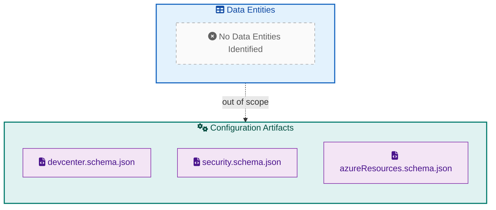
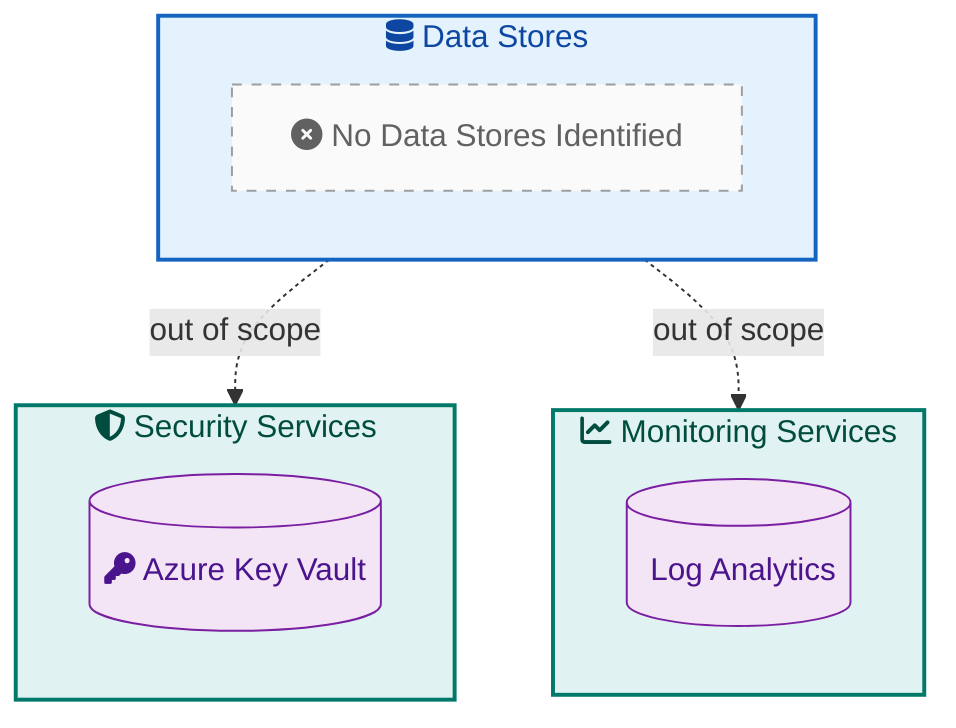
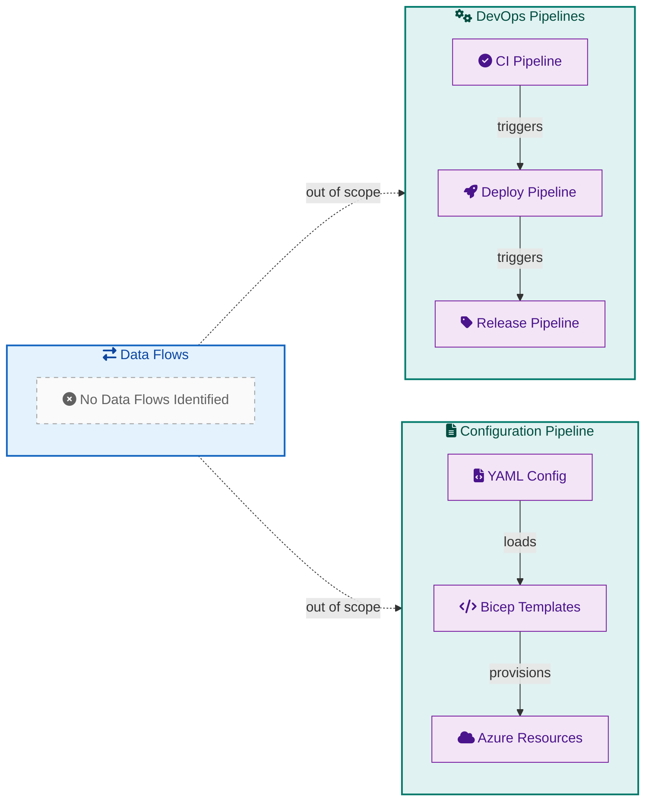
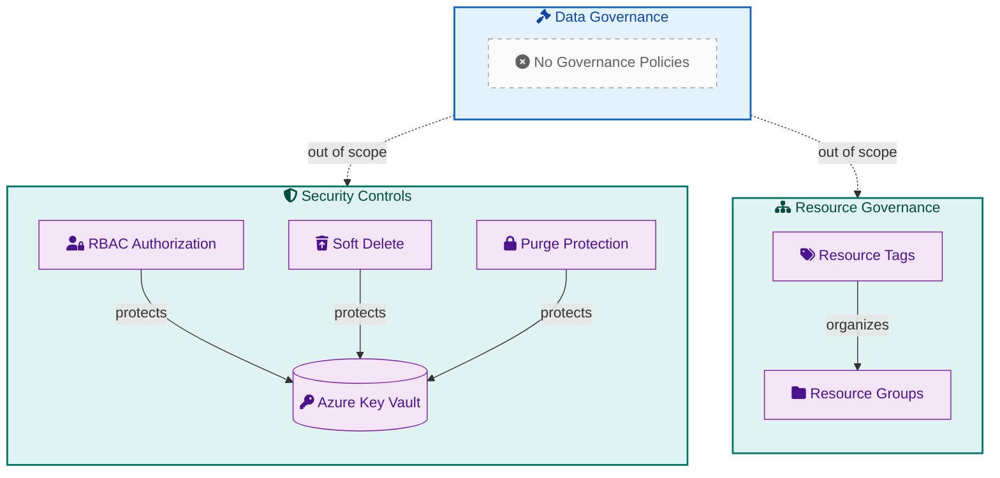

# Data Architecture

## 1. Overview

This document presents the Data Architecture layer analysis for the
DevExp-DevBox accelerator project, following TOGAF 10 BDAT (Business, Data,
Application, Technology) framework principles. The workspace has been
systematically analyzed to identify components belonging to the Data Layer,
including data entities, data stores, data flows, and data governance patterns.

After thorough examination of the codebase, **no traditional Data Layer
components were identified**. The DevExp-DevBox project is an
infrastructure-as-code (IaC) accelerator focused on provisioning Azure Dev
Center resources using Bicep templates and YAML configuration files. The project
does not contain databases, data models, ETL pipelines, or persistent data
storage components typically associated with a Data Architecture layer. The
configuration schemas and YAML files present serve as infrastructure
configuration artifacts rather than data entities or data stores.

## 2. Data Entities

### 2.1 Overview

The DevExp-DevBox workspace was thoroughly scanned for traditional data entity
components including database schemas, ORM models, DTOs (Data Transfer Objects),
entity classes, and data migration files. Common file patterns searched include
`*.sql`, `*.prisma`, `*entity*`, `*model*`, `*schema*`, `*migration*`, and
`*repository*`.

No data entities were identified in the codebase. The JSON Schema files present
(`devcenter.schema.json`, `security.schema.json`, `azureResources.schema.json`)
serve as validation schemas for infrastructure configuration YAML files rather
than database schemas or data models. These schemas define the structure of
infrastructure-as-code configuration parameters and belong to the Application
Layer as configuration validation artifacts.

### 2.2 Entity Catalog

| Entity Name                                   | Location | Description | Relationships |
| --------------------------------------------- | -------- | ----------- | ------------- |
| _No data entities identified in the codebase_ | N/A      | N/A         | N/A           |

### 2.3 Entity Diagram

## 3. Data Stores

### 3.1 Overview

The workspace was analyzed for data storage components including databases,
caches, file storage systems, data lakes, and cloud storage configurations.
Searches were conducted for Azure data services such as `Microsoft.Storage`,
`Microsoft.Sql`, `Microsoft.DocumentDB`, `Microsoft.DBforPostgreSQL`,
`Microsoft.DBforMySQL`, and `Microsoft.Cache` resource definitions in Bicep
templates.

No data store components were found in the codebase. The infrastructure
provisions an Azure Key Vault (`Microsoft.KeyVault/vaults`) for secrets
management, which stores credentials and tokens rather than application data.
Key Vault is classified as a security service rather than a data store in this
context. The Log Analytics Workspace
(`Microsoft.OperationalInsights/workspaces`) is provisioned for monitoring and
telemetry purposes, not as an application data store.

### 3.2 Store Catalog

| Store Name                                  | Type | Location | Purpose |
| ------------------------------------------- | ---- | -------- | ------- |
| _No data stores identified in the codebase_ | N/A  | N/A      | N/A     |

**Note:** The following Azure resources are provisioned but are **not classified
as Data Stores** per TOGAF BDAT definitions:

| Resource                | Type               | Location                                                      | Classification                                                 |
| ----------------------- | ------------------ | ------------------------------------------------------------- | -------------------------------------------------------------- |
| Azure Key Vault         | Secrets Management | [keyVault.bicep](../../src/security/keyVault.bicep)           | Security Layer (stores credentials, not application data)      |
| Log Analytics Workspace | Monitoring         | [logAnalytics.bicep](../../src/management/logAnalytics.bicep) | Technology Layer (operational telemetry, not application data) |

### 3.3 Data Store Diagram

## 4. Data Flows

### 4.1 Overview

The codebase was examined for data movement patterns including ETL (Extract,
Transform, Load) processes, data pipelines, data integration services, message
queues, and event streaming components. Searches included patterns for Azure
Data Factory, Azure Synapse, Azure Event Hubs, Azure Service Bus, and similar
data integration services.

No data flow components were identified in the workspace. The project contains
CI/CD pipeline definitions (GitHub Actions workflows) for infrastructure
deployment, but these are DevOps automation flows rather than data flows. The
configuration loading mechanism using `loadYamlContent()` in Bicep templates
represents build-time configuration injection, not runtime data flows.

### 4.2 Flow Catalog

| Flow Name                                  | Source | Destination | Trigger | Description |
| ------------------------------------------ | ------ | ----------- | ------- | ----------- |
| _No data flows identified in the codebase_ | N/A    | N/A         | N/A     | N/A         |

**Note:** The following processes exist but are **not classified as Data Flows**
per TOGAF BDAT definitions:

| Process                   | Type                 | Location                                         | Classification                           |
| ------------------------- | -------------------- | ------------------------------------------------ | ---------------------------------------- |
| Infrastructure Deployment | CI/CD Pipeline       | [deploy.yml](../../.github/workflows/deploy.yml) | Application Layer (DevOps automation)    |
| Configuration Loading     | Build-time Injection | [main.bicep](../../infra/main.bicep)             | Application Layer (IaC compilation)      |
| Secret Management         | Credential Flow      | [secret.bicep](../../src/security/secret.bicep)  | Security Layer (credential provisioning) |

### 4.3 Data Flow Diagram

## 5. Data Governance

### 5.1 Overview

The workspace was analyzed for data governance artifacts including data quality
rules, data classification policies, data retention policies, data lineage
documentation, and compliance controls. Additionally, patterns for data masking,
encryption policies, and access control mechanisms were examined.

No traditional data governance components were identified since the project does
not manage application data. However, the infrastructure implements security
governance patterns for credentials management through Azure Key Vault with RBAC
authorization, soft delete protection, and purge protection. These are
infrastructure security controls rather than data governance policies.

### 5.2 Governance Policies

| Policy                                                   | Scope | Implementation |
| -------------------------------------------------------- | ----- | -------------- |
| _No data governance policies identified in the codebase_ | N/A   | N/A            |

**Note:** The following security controls exist but are **not classified as Data
Governance** per TOGAF BDAT definitions:

| Control                      | Scope             | Location                                                     | Classification                             |
| ---------------------------- | ----------------- | ------------------------------------------------------------ | ------------------------------------------ |
| Key Vault RBAC Authorization | Secrets Access    | [security.yaml](../../infra/settings/security/security.yaml) | Security Layer (credential access control) |
| Key Vault Soft Delete        | Secret Recovery   | [security.yaml](../../infra/settings/security/security.yaml) | Security Layer (disaster recovery)         |
| Key Vault Purge Protection   | Secret Retention  | [security.yaml](../../infra/settings/security/security.yaml) | Security Layer (compliance control)        |
| Resource Tagging             | Cost & Governance | All configuration files                                      | Technology Layer (resource management)     |

### 5.3 Data Governance Diagram

## 6. Summary

The DevExp-DevBox accelerator workspace has been comprehensively analyzed for
Data Architecture layer components following TOGAF 10 BDAT framework principles.
**No Data Layer components were identified in the codebase.** This is an
expected finding given the project's nature as an infrastructure-as-code (IaC)
accelerator for Azure Dev Center provisioning.

The project's artifacts fall into other BDAT layers:

| Layer                 | Components Found                            | Examples                                                     |
| --------------------- | ------------------------------------------- | ------------------------------------------------------------ |
| **Business Layer**    | Business capabilities, processes            | DevCenter projects, environment types, development workloads |
| **Application Layer** | Configuration schemas, deployment scripts   | JSON schemas, PowerShell/Bash scripts, GitHub Actions        |
| **Technology Layer**  | Infrastructure templates, platform services | Bicep modules, Azure resource definitions                    |
| **Data Layer**        | **None identified**                         | No databases, data models, ETL, or data governance           |

For future expansion of this accelerator to include application workloads that
require data persistence, the following Data Architecture components should be
considered:

- **Data Entities**: Database schemas for application state management
- **Data Stores**: Azure SQL Database, Cosmos DB, or Azure Storage for
  application data
- **Data Flows**: Azure Data Factory or Event Hubs for data integration
- **Data Governance**: Azure Purview for data catalog and governance

---

_Document generated following TOGAF 10 BDAT Architecture Framework_  
_Analysis Date: February 2, 2026_  
_Workspace: DevExp-DevBox_
