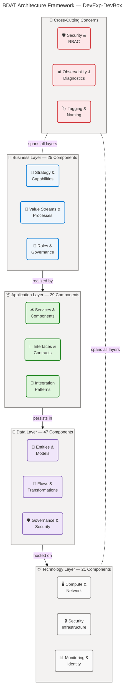

# 🏗️ Architecture Documentation — DevExp-DevBox

This folder contains the complete architecture documentation for the
**DevExp-DevBox** platform — an Azure Dev Box Adoption & Deployment Accelerator
that enables platform engineering teams to deliver self-service developer
workstations at enterprise scale.

The documentation follows the **BDAT framework** (Business, Data, Application,
Technology), providing four complementary architectural views of a single
platform.

---

## 📑 Table of Contents

- [📂 Document Index](#-document-index)
- [🗺️ Architecture Overview](#️-architecture-overview)
  - [🏛️ The BDAT Framework](#️-the-bdat-framework)
  - [📋 Layer Definitions](#-layer-definitions)
  - [📐 Standardized Section Structure](#-standardized-section-structure)
- [🔗 Layer Relationships & Traceability](#-layer-relationships--traceability)
  - [🔄 Traceability Matrix](#-traceability-matrix)
  - [🔀 Cross-Cutting Concerns](#-cross-cutting-concerns)
  - [📖 Reading Order](#-reading-order)
- [📋 Platform Summary](#-platform-summary)
  - [💪 Core Capabilities](#-core-capabilities)
  - [⚡ Deployment Flow](#-deployment-flow)
  - [🔒 Security Posture](#-security-posture)
  - [☁️ Azure Landing Zone Structure](#️-azure-landing-zone-structure)
- [👥 Audience Guide](#-audience-guide)
- [📊 Key Metrics at a Glance](#-key-metrics-at-a-glance)
- [🧭 Architecture Principles](#-architecture-principles)
- [📈 Known Gaps & Improvement Areas](#-known-gaps--improvement-areas)
- [🚀 Getting Started](#-getting-started)
- [🤝 Contributing](#-contributing)

---

## 📂 Document Index

| 📄 Document                                             | 🏷️ Layer    | 🔢 Components | 📝 Description                                                                            |
| ------------------------------------------------------- | ----------- | ------------: | ----------------------------------------------------------------------------------------- |
| [Business Architecture](business-architecture.md)       | Business    |            25 | Strategy, capabilities, value streams, processes, roles, rules, and governance            |
| [Application Architecture](application-architecture.md) | Application |            29 | Services, components, interfaces, collaborations, integration patterns, and contracts     |
| [Data Architecture](data-architecture.md)               | Data        |            47 | Entities, models, stores, flows, governance, quality rules, and security classification   |
| [Technology Architecture](technology-architecture.md)   | Technology  |            21 | Compute, networking, security infrastructure, monitoring, identity, and deployment models |

### 🔍 Topic Quick Reference

Use the table below to jump directly to the most relevant section for a given
topic across the architecture documentation.

| 🔍 Topic                               | 📄 Section                                                                                                                                               | 🏷️ Layer             |
| -------------------------------------- | -------------------------------------------------------------------------------------------------------------------------------------------------------- | -------------------- |
| Business capabilities & value streams  | [Business Capabilities](business-architecture.md#22--business-capabilities-5)                                                                            | Business             |
| Roles, actors & RBAC governance        | [Business Roles](business-architecture.md#27--business-roles--actors-4), [Security Config](technology-architecture.md#-section-4-current-state-baseline) | Business, Technology |
| Deployment model & service topology    | [Current State Baseline](application-architecture.md#-section-4-current-state-baseline)                                                                  | Application          |
| Module composition & Bicep structure   | [Architecture Principles](application-architecture.md#️-section-3-architecture-principles)                                                                | Application          |
| Integration patterns & output chaining | [Dependencies & Integration](application-architecture.md#-section-8-dependencies--integration)                                                           | Application          |
| Configuration schemas & data models    | [Data Models](data-architecture.md#️-section-2-architecture-landscape)                                                                                    | Data                 |
| Data quality & maturity assessment     | [Executive Summary](data-architecture.md#-section-1-executive-summary)                                                                                   | Data                 |
| Data lineage & dependency flows        | [Dependencies & Integration](data-architecture.md#-section-8-dependencies--integration)                                                                  | Data                 |
| Infrastructure components & VM SKUs    | [Compute Resources](technology-architecture.md#️-section-2-architecture-landscape)                                                                        | Technology           |
| Network topology & connectivity        | [Network Baseline](technology-architecture.md#-section-4-current-state-baseline)                                                                         | Technology           |
| External service integrations          | [Dependencies & Integration](technology-architecture.md#-section-8-dependencies--integration)                                                            | Technology           |

---

## 🗺️ Architecture Overview

The **BDAT framework** (Business, Data, Application, Technology) is an
enterprise architecture methodology that decomposes a system into four
interdependent layers. Each layer answers a distinct architectural question and
provides a complete, self-contained view that traces vertically to adjacent
layers.

This documentation set applies BDAT to the DevExp-DevBox platform, producing
**122 total components** across all four layers with full vertical traceability
from business strategy to infrastructure deployment.

### 🏛️ The BDAT Framework

```mermaid
---
title: BDAT Architecture Framework — DevExp-DevBox
config:
  theme: base
  look: classic
  layout: dagre
  themeVariables:
    fontSize: "14px"
  flowchart:
    htmlLabels: true
---
flowchart TB
    accTitle: BDAT Architecture Framework — DevExp-DevBox
    accDescr: Shows the four BDAT architecture layers, their key questions, component types, and vertical traceability relationships for the DevExp-DevBox platform

    %% ═══════════════════════════════════════════════════════════════════════════
    %% AZURE / FLUENT ARCHITECTURE PATTERN v1.1
    %% (Semantic + Structural + Font + Accessibility Governance)
    %% ═══════════════════════════════════════════════════════════════════════════
    %% PHASE 1 - FLUENT UI: All styling uses approved Fluent UI palette only
    %% PHASE 2 - GROUPS: Every subgraph has semantic color via style directive
    %% PHASE 3 - COMPONENTS: Every node has semantic classDef + icon prefix
    %% PHASE 4 - ACCESSIBILITY: accTitle/accDescr present, WCAG AA contrast
    %% PHASE 5 - STANDARD: Governance block present, classDefs centralized
    %% ═══════════════════════════════════════════════════════════════════════════

    subgraph business["🏢 Business Layer — 25 Components"]
        direction LR
        B1("🎯 Strategy &<br/>Capabilities"):::core
        B2("🔄 Value Streams &<br/>Processes"):::core
        B3("👥 Roles &<br/>Governance"):::core
    end

    subgraph application["📦 Application Layer — 29 Components"]
        direction LR
        A1("🛎️ Services &<br/>Components"):::success
        A2("🔌 Interfaces &<br/>Contracts"):::success
        A3("🔗 Integration<br/>Patterns"):::success
    end

    subgraph dataLayer["📐 Data Layer — 47 Components"]
        direction LR
        D1("📄 Entities &<br/>Models"):::data
        D2("🔀 Flows &<br/>Transformations"):::data
        D3("🛡️ Governance &<br/>Security"):::data
    end

    subgraph technology["⚙️ Technology Layer — 21 Components"]
        direction LR
        T1("🖥️ Compute &<br/>Network"):::neutral
        T2("🔒 Security<br/>Infrastructure"):::neutral
        T3("📊 Monitoring &<br/>Identity"):::neutral
    end

    subgraph crosscut["🔀 Cross-Cutting Concerns"]
        direction LR
        CC1("🛡️ Security &<br/>RBAC"):::danger
        CC2("📊 Observability &<br/>Diagnostics"):::danger
        CC3("🏷️ Tagging &<br/>Naming"):::danger
    end

    business -->|"realized by"| application
    application -->|"persists in"| dataLayer
    dataLayer -->|"hosted on"| technology
    crosscut -.-|"spans all layers"| business
    crosscut -.-|"spans all layers"| technology

    %% Centralized classDefs
    classDef core fill:#EFF6FC,stroke:#0078D4,stroke-width:2px,color:#323130
    classDef success fill:#DFF6DD,stroke:#107C10,stroke-width:2px,color:#323130
    classDef data fill:#F0E6FA,stroke:#8764B8,stroke-width:2px,color:#323130
    classDef neutral fill:#FAFAFA,stroke:#8A8886,stroke-width:2px,color:#323130
    classDef danger fill:#FDE7E9,stroke:#D13438,stroke-width:2px,color:#323130

    %% Subgraph styling (5 subgraphs = 5 style directives)
    style business fill:#F3F2F1,stroke:#8A8886,stroke-width:2px,color:#323130
    style application fill:#F3F2F1,stroke:#8A8886,stroke-width:2px,color:#323130
    style dataLayer fill:#F3F2F1,stroke:#8A8886,stroke-width:2px,color:#323130
    style technology fill:#F3F2F1,stroke:#8A8886,stroke-width:2px,color:#323130
    style crosscut fill:#F3F2F1,stroke:#8A8886,stroke-width:2px,color:#323130
```

### 📋 Layer Definitions

Each BDAT layer addresses a specific architectural question. The table below
defines each layer's purpose, scope, the key question it answers, and the
canonical component types it catalogs.

| 🏷️ Layer           | ❓ Key Question                                                    | 🎯 Purpose                                                                                                     | 🧩 Canonical Component Types                                                                                              | 📄 Document                                                |
| ------------------ | ------------------------------------------------------------------ | -------------------------------------------------------------------------------------------------------------- | ------------------------------------------------------------------------------------------------------------------------- | ---------------------------------------------------------- |
| 🏢 **Business**    | _"Why does this platform exist and who benefits?"_                 | Defines strategic intent, organizational capabilities, value delivery, and governance rules                    | Strategy, Capabilities, Value Streams, Processes, Services, Functions, Roles, Rules, Events                               | [business-architecture.md](business-architecture.md)       |
| 📦 **Application** | _"How is the system structured and how do parts interact?"_        | Describes services, components, interfaces, integration patterns, and deployment orchestration                 | Services, Components, Interfaces, Collaborations, Functions, Interactions, Events, Data Objects, Contracts                | [application-architecture.md](application-architecture.md) |
| 📐 **Data**        | _"What information is managed and how is it governed?"_            | Catalogs data entities, models, stores, flows, quality rules, governance policies, and security classification | Entities, Models, Stores, Flows, Services, Governance, Quality Rules, Master Data, Transformations, Contracts, Security   | [data-architecture.md](data-architecture.md)               |
| ⚙️ **Technology**  | _"Where does the system run and what infrastructure supports it?"_ | Documents compute, networking, storage, security infrastructure, identity, monitoring, and deployment models   | Compute, Storage, Network, Containers, Cloud Services, Security, Messaging, Monitoring, Identity, API Management, Caching | [technology-architecture.md](technology-architecture.md)   |

### 📐 Standardized Section Structure

Every BDAT document follows a **consistent internal structure** to ensure
navigability, comparability, and completeness across layers:

| #️⃣ Section | 📌 Title                      | 🎯 Purpose                                                                               |
| ---------: | ----------------------------- | ---------------------------------------------------------------------------------------- |
|          1 | 📋 Executive Summary          | High-level overview, key findings, quality scorecard, and coverage summary               |
|          2 | 🗺️ Architecture Landscape     | Complete inventory of all components organized by canonical type, with overview diagrams |
|          3 | 🧭 Architecture Principles    | Design principles observed in source code with rationale and implications                |
|          4 | 📍 Current State Baseline     | Service topology, deployment state, configuration status, and gap analysis               |
|          5 | 📦 Component Catalog          | Detailed specifications for every component (name, description, relationships)           |
|          8 | 🔗 Dependencies & Integration | External dependencies, service integrations, and data flows across boundaries            |

---

## 🔗 Layer Relationships & Traceability

A core BDAT best practice is **vertical traceability** — every component in a
lower layer should trace upward to a business justification, and every business
capability should trace downward to its technical realization. This ensures no
infrastructure exists without purpose and no business need goes unimplemented.

### 🔄 Traceability Matrix

| 🔷 From            | 🔷 To              | 🔄 Relationship                                       | 💡 DevExp-DevBox Example                                  |
| ------------------ | ------------------ | ----------------------------------------------------- | --------------------------------------------------------- |
| 🏢 **Business**    | 📦 **Application** | Capabilities are **realized by** application services | Developer Workstation Provisioning → Dev Box Pool Service |
| 📦 **Application** | 📐 **Data**        | Services **produce and consume** data assets          | Workload Orchestrator → DevCenterConfig YAML              |
| 📐 **Data**        | ⚙️ **Technology**  | Data stores are **hosted on** infrastructure          | Key Vault secrets → Azure Key Vault (Standard SKU)        |
| 🏢 **Business**    | ⚙️ **Technology**  | Business rules **constrain** infrastructure           | RBAC Least Privilege → Scoped role assignments            |
| 🏢 **Business**    | 📐 **Data**        | Business entities **define** data models              | Project, Pool, Catalog → YAML configuration schemas       |
| 📦 **Application** | ⚙️ **Technology**  | Application services **deploy to** infrastructure     | Bicep modules → Azure Resource Manager                    |

### 🔀 Cross-Cutting Concerns

Three concerns span all four BDAT layers. Each is documented within its **most
relevant layer** but has implications across the entire stack:

| 🔀 Concern              | 📍 Primary Layer        | 🌐 Impact Across Layers                                                                                                              |
| ----------------------- | ----------------------- | ------------------------------------------------------------------------------------------------------------------------------------ |
| 🛡️ **Security & RBAC**  | Data (Governance)       | Business rules define roles → Application enforces via modules → Data classifies sensitivity → Technology deploys Key Vault + RBAC   |
| 📊 **Observability**    | Technology (Monitoring) | Business requires audit trails → Application emits diagnostic events → Data flows to Log Analytics → Technology provisions workspace |
| 🏷️ **Tagging & Naming** | Business (Rules)        | Business mandates tags → Application applies via parameters → Data validates via schema → Technology enforces on resource groups     |

### 📖 Reading Order

- **🔽 Top-down** (recommended for stakeholders): Business → Application → Data
  → Technology
- **🔼 Bottom-up** (recommended for engineers): Technology → Data → Application
  → Business
- **🎯 Targeted**: Jump directly to the layer relevant to your concern

---

## 📋 Platform Summary

**DevExp-DevBox** provisions cloud-hosted developer workstations (Dev Boxes)
through Azure DevCenter, deployed entirely via **Infrastructure-as-Code** (Azure
Bicep) using the Azure Developer CLI (`azd`).

### 💪 Core Capabilities

| 💪 Capability                          | 📝 Description                                                                                             |
| -------------------------------------- | ---------------------------------------------------------------------------------------------------------- |
| **Developer Workstation Provisioning** | On-demand, role-specific Dev Boxes (backend: 32-core/128GB, frontend: 16-core/64GB)                        |
| **Identity & Access Management**       | Azure AD group-based RBAC with least-privilege scoping at subscription, resource group, and project levels |
| **Secrets Management**                 | Azure Key Vault with RBAC authorization, purge protection, and soft delete                                 |
| **Centralized Monitoring**             | Log Analytics workspace with diagnostic telemetry from all provisioned resources                           |
| **Network Isolation**                  | Project-scoped virtual networks with subnet segmentation and Azure AD-joined connections                   |

### ⚡ Deployment Flow

The platform follows a **strict three-phase sequential deployment** orchestrated
by the root Bicep template (`infra/main.bicep`). Each phase produces typed
outputs consumed by subsequent phases, forming a directed acyclic graph (DAG):

1. **Phase 1 — Monitoring**: Provisions the Log Analytics workspace and emits
   `AZURE_LOG_ANALYTICS_WORKSPACE_ID` consumed by all downstream modules
2. **Phase 2 — Security**: Provisions Key Vault, stores secrets, and emits
   `AZURE_KEY_VAULT_SECRET_IDENTIFIER` for catalog authentication
3. **Phase 3 — Workload**: Provisions DevCenter, iterates over project
   definitions to create pools, catalogs, environment types, and RBAC
   assignments

This dependency chain ensures that monitoring and security infrastructure is
always available before workload resources are created. For full deployment
topology details, see the
[Current State Baseline](application-architecture.md#-section-4-current-state-baseline)
in Application Architecture and the
[Data Lineage](data-architecture.md#-section-8-dependencies--integration) in
Data Architecture.

### 🔒 Security Posture

The platform implements defense-in-depth security controls validated across the
[Technology Architecture](technology-architecture.md#-section-4-current-state-baseline)
and [Data Architecture](data-architecture.md#-section-3-architecture-principles)
layers:

| 🔐 Control               | ✅ Status | 📄 Details                                                                                                                   |
| ------------------------ | --------- | ---------------------------------------------------------------------------------------------------------------------------- |
| Secrets at rest          | Active    | Azure Key Vault — HSM-backed, RBAC authorization, soft delete (7d), purge protection                                         |
| Identity & RBAC          | Active    | SystemAssigned managed identities; 12 scoped role assignments across subscription, RG, and project levels                    |
| Diagnostic audit logging | Active    | `allLogs` + `AllMetrics` streamed to Log Analytics from all resources                                                        |
| Network isolation        | Active    | Microsoft-hosted managed VNet (default); customer VNet support available for unmanaged projects                              |
| Schema validation        | Active    | 3 JSON Schema files enforce configuration structure before deployment                                                        |
| Credential rotation      | Gap       | No automated secret rotation detected — see [Security Config](technology-architecture.md#-section-4-current-state-baseline)  |
| Private endpoints        | Gap       | No private endpoint resources detected — see [Security Config](technology-architecture.md#-section-4-current-state-baseline) |

For the full security configuration status and data classification taxonomy, see
[Data Classification](data-architecture.md#-section-3-architecture-principles)
and
[Security Infrastructure](technology-architecture.md#️-section-2-architecture-landscape).

### ☁️ Azure Landing Zone Structure

| 📁 Resource Group      | ⚙️ Function            | 🔑 Key Resources                           |
| ---------------------- | ---------------------- | ------------------------------------------ |
| `devexp-workload-RG`   | Developer Workstations | DevCenter, Projects, Pools, Catalogs       |
| `devexp-security-RG`   | Secrets Management     | Key Vault, Secrets                         |
| `devexp-monitoring-RG` | Observability          | Log Analytics Workspace, Activity Solution |

---

## 👥 Audience Guide

| 👤 Role                        | 📄 Start With                                           | 📌 Key Sections                                                                                                                                                                                                                                      |
| ------------------------------ | ------------------------------------------------------- | ---------------------------------------------------------------------------------------------------------------------------------------------------------------------------------------------------------------------------------------------------- |
| **Executive / Stakeholder**    | [Business Architecture](business-architecture.md)       | [Executive Summary](business-architecture.md#1--executive-summary), [Business Strategy](business-architecture.md#21--business-strategy-1), [Value Streams](business-architecture.md#23--value-streams-1)                                             |
| **Solution Architect**         | [Application Architecture](application-architecture.md) | [Architecture Landscape](application-architecture.md#️-section-2-architecture-landscape), [Principles](application-architecture.md#️-section-3-architecture-principles), [Component Catalog](application-architecture.md#-section-5-component-catalog) |
| **Data Engineer / Analyst**    | [Data Architecture](data-architecture.md)               | [Data Entities](data-architecture.md#️-section-2-architecture-landscape), [Data Flows](data-architecture.md#-section-8-dependencies--integration), [Quality Rules](data-architecture.md#-section-3-architecture-principles)                           |
| **Platform / DevOps Engineer** | [Technology Architecture](technology-architecture.md)   | [Compute Resources](technology-architecture.md#️-section-2-architecture-landscape), [Network Baseline](technology-architecture.md#-section-4-current-state-baseline), [Security Config](technology-architecture.md#-section-4-current-state-baseline) |
| **Security Reviewer**          | [Data Architecture](data-architecture.md)               | [Data Security](data-architecture.md#-section-3-architecture-principles), [RBAC Policies](business-architecture.md#28--business-rules-4), [Classification Taxonomy](data-architecture.md#-section-3-architecture-principles)                         |

---

## 📊 Key Metrics at a Glance

|                         📏 Metric | 🔢 Value                                            |
| --------------------------------: | --------------------------------------------------- |
| **Total Architecture Components** | 122                                                 |
|           **BDAT Layers Covered** | 4 / 4                                               |
|         **Configuration Schemas** | 3 JSON Schema files                                 |
|      **YAML Configuration Files** | 3                                                   |
|                 **Bicep Modules** | 23                                                  |
|         **RBAC Role Assignments** | 12                                                  |
|           **Azure PaaS Services** | 5                                                   |
|              **Deployment Model** | Azure Developer CLI (`azd`) — fully declarative IaC |

---

## 🧭 Architecture Principles

The following cross-cutting principles are observed across all four layers:

| 🧭 Principle                    | 🏷️ Layers | 📝 Description                                                               | 📄 Details                                                                                                                                                                           |
| ------------------------------- | --------- | ---------------------------------------------------------------------------- | ------------------------------------------------------------------------------------------------------------------------------------------------------------------------------------ |
| **Configuration-Driven Design** | B, A, D   | All settings externalized in YAML, validated by JSON Schema                  | [Application Principles](application-architecture.md#️-section-3-architecture-principles), [Data Principles](data-architecture.md#-section-3-architecture-principles)                 |
| **Modular Composition**         | A, T      | Single-responsibility Bicep modules with clear input/output contracts        | [Application Principles](application-architecture.md#️-section-3-architecture-principles), [Technology Principles](technology-architecture.md#-section-3-architecture-principles)     |
| **Least-Privilege Access**      | B, D, T   | RBAC scoped to minimum required level; group-based identity governance       | [Business Rules](business-architecture.md#28--business-rules-4), [Technology Principles](technology-architecture.md#-section-3-architecture-principles)                              |
| **Landing Zone Alignment**      | B, A, T   | Three isolated resource groups (workload, security, monitoring)              | [Technology Baseline](technology-architecture.md#-section-4-current-state-baseline), [Data Principles](data-architecture.md#-section-3-architecture-principles)                      |
| **Diagnostic Observability**    | A, D, T   | All resources emit logs and metrics to centralized Log Analytics             | [Application Dependencies](application-architecture.md#-section-8-dependencies--integration), [Technology Principles](technology-architecture.md#-section-3-architecture-principles) |
| **Immutable Infrastructure**    | D, T      | Declarative IaC with idempotent deployment; config version-controlled in Git | [Technology Principles](technology-architecture.md#-section-3-architecture-principles), [Data Principles](data-architecture.md#-section-3-architecture-principles)                   |
| **Schema-First Validation**     | D         | Every configuration file validated against a companion JSON Schema           | [Data Principles](data-architecture.md#-section-3-architecture-principles)                                                                                                           |

---

## 📈 Known Gaps & Improvement Areas

The following gaps have been identified across the four architecture layers.
Each links to the source section where the gap is documented.

| 🏷️ Area                       | 📝 Gap Description                                                                                                 | 📄 Source                                                                             |
| ----------------------------- | ------------------------------------------------------------------------------------------------------------------ | ------------------------------------------------------------------------------------- |
| **Automated Testing**         | No automated integration tests or formal SLO definitions for the deployment pipeline                               | [Application Baseline](application-architecture.md#-section-4-current-state-baseline) |
| **Credential Rotation**       | No automated secret rotation configuration detected in Key Vault                                                   | [Technology Baseline](technology-architecture.md#-section-4-current-state-baseline)   |
| **Private Endpoints**         | No `Microsoft.Network/privateEndpoints` resources for Key Vault or Log Analytics                                   | [Technology Baseline](technology-architecture.md#-section-4-current-state-baseline)   |
| **Multi-Region / DR**         | Single-region deployment with no availability zone configuration or disaster recovery failover policy              | [Technology Baseline](technology-architecture.md#-section-4-current-state-baseline)   |
| **Business KPIs**             | No explicit business metrics for measuring platform adoption, provisioning latency, or cost efficiency             | [Business Baseline](business-architecture.md#4--current-state-baseline)               |
| **Data Maturity**             | Level 2 (Managed) — gaps in automated drift detection, schema versioning workflows, and data lineage documentation | [Data Executive Summary](data-architecture.md#-section-1-executive-summary)           |
| **Contract Versioning**       | No formal semantic versioning for Bicep module output contracts between producers and consumers                    | [Data Dependencies](data-architecture.md#-section-8-dependencies--integration)        |
| **Catalog Health Monitoring** | No health monitoring for external catalog synchronization; sync failures could block Dev Box provisioning          | [Business Dependencies](business-architecture.md#8--dependencies--integration)        |

---

## 🚀 Getting Started

1. **Understand the business context** — Read the
   [Executive Summary](business-architecture.md#1--executive-summary) in
   Business Architecture to learn the strategic intent, capabilities, and value
   streams driving the platform
2. **Explore the system design** — Review the
   [System Context Diagram](application-architecture.md#️-section-2-architecture-landscape)
   and
   [Component Catalog](application-architecture.md#-section-5-component-catalog)
   in Application Architecture for the full module inventory
3. **Understand the data landscape** — Check the
   [Data Domain Map](data-architecture.md#️-section-2-architecture-landscape) and
   [Data Quality Scorecard](data-architecture.md#-section-1-executive-summary)
   in Data Architecture for entity models and maturity assessment
4. **Review infrastructure** — Examine the
   [Infrastructure Context](technology-architecture.md#️-section-2-architecture-landscape)
   and
   [Security Configuration](technology-architecture.md#-section-4-current-state-baseline)
   in Technology Architecture for resource topology and security controls
5. **Trace dependencies** — Follow the
   [Output Chaining Map](application-architecture.md#-section-8-dependencies--integration)
   and [Data Lineage](data-architecture.md#-section-8-dependencies--integration)
   to understand how modules connect
6. **Deploy the platform** — Follow the instructions in the repository
   [README](../../README.md)

---

## 🤝 Contributing

When updating architecture documentation:

- **Scope**: Each document covers exactly one BDAT layer — do not mix concerns
  across files
- **Diagrams**: Use Mermaid with the Azure/Fluent Architecture Pattern v1.1
  (semantic classDefs, `accTitle`/`accDescr`, Fluent UI palette)
- **Traceability**: Every component **must** be traceable to source files in the
  repository
- **Tables**: Use consistent table formatting with emoji column headers matching
  the existing style
- **Sections**: Follow the established section numbering (1: Executive Summary,
  2: Landscape, 3: Principles, 4: Baseline, 5: Catalog, 8: Dependencies)

See [CONTRIBUTING.md](../../CONTRIBUTING.md) for general repository contribution
guidelines.

---

## Created by

**Evilazaro Alves | Principal Cloud Solution Architect | Cloud Platforms and AI
Apps | Microsoft**
