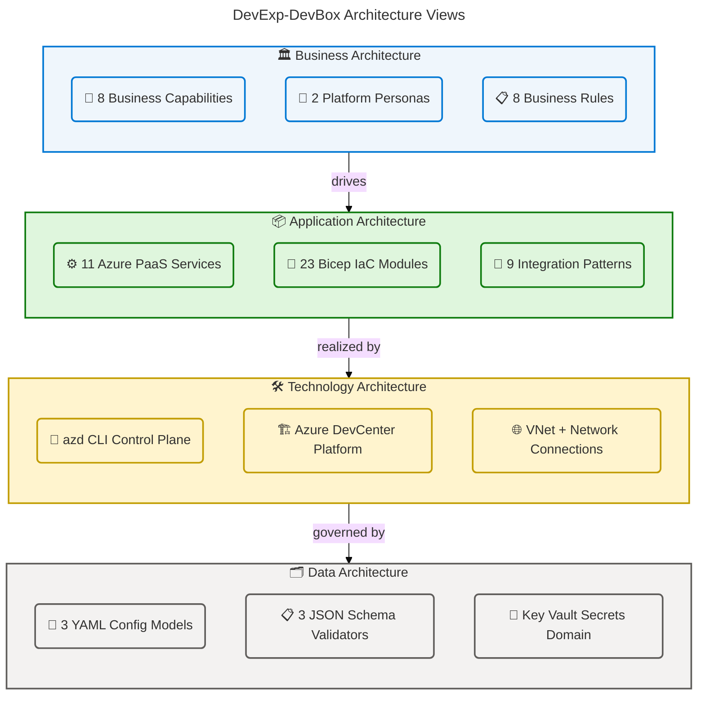

# Architecture Documentation

> [!NOTE]  
> This folder contains the four architecture views for the **DevExp-DevBox — Dev
> Box Adoption & Deployment Accelerator**. Each document covers a distinct
> architectural layer, from business motivation through technology
> implementation and data governance. Start here to understand the full
> architecture before reading individual documents.

## Overview

The DevExp-DevBox architecture is documented across four complementary views
following the 10 Architecture Development Method (ADM). Together they describe a
**configuration-driven Azure Dev Box Deployment Accelerator** that provisions
role-specific cloud developer workstations for enterprise engineering teams
using Azure Bicep Infrastructure as Code, YAML-driven configuration models, and
Azure Developer CLI (`azd`) automation.

The accelerator serves two personas: **Platform Engineering teams** who deploy
and govern the Azure DevCenter infrastructure, and **engineering teams** (e.g.,
eShop Engineers) who self-serve role-specific Dev Box workstations. The solution
achieves **Level 3–4 architecture maturity** (Defined → Managed) across all four
architecture layers.

## Architecture Documents

| Document                                | Layer       | Focus                                                                 |
| --------------------------------------- | ----------- | --------------------------------------------------------------------- |
| [Business Architecture](bus-arch.md)    | Business    | Capabilities, value streams, roles, business rules                    |
| [Application Architecture](app-arch.md) | Application | Services, components, interfaces, integration patterns                |
| [Technology Architecture](tech-arch.md) | Technology  | Azure PaaS stack, IaC modules, deployment pipeline, network topology  |
| [Data Architecture](data-arch.md)       | Data        | Configuration models, schemas, secrets management, observability data |

## Architecture Overview

```mermaid
---
title: DevExp-DevBox Architecture Views
config:
  theme: base
  look: classic
  layout: dagre
  themeVariables:
    fontSize: '16px'
  flowchart:
    htmlLabels: true
---
flowchart TB
    accTitle: DevExp-DevBox Four Architecture Views
    accDescr:  architecture views showing Business, Application, Technology, and Data layers and their relationships for the DevExp-DevBox accelerator.

    subgraph BUS["🏛️ Business Architecture"]
        direction TB
        B1("🎯 8 Business Capabilities"):::biz
        B2("👥 2 Platform Personas"):::biz
        B3("📋 8 Business Rules"):::biz
    end

    subgraph APP["📦 Application Architecture"]
        direction TB
        A1("⚙️ 11 Azure PaaS Services"):::app
        A2("🧩 23 Bicep IaC Modules"):::app
        A3("🔗 9 Integration Patterns"):::app
    end

    subgraph TECH["🛠️ Technology Architecture"]
        direction TB
        T1("🚀 azd CLI Control Plane"):::tech
        T2("🏗️ Azure DevCenter Platform"):::tech
        T3("🌐 VNet + Network Connections"):::tech
    end

    subgraph DATA["🗂️ Data Architecture"]
        direction TB
        D1("📄 3 YAML Config Models"):::data
        D2("📋 3 JSON Schema Validators"):::data
        D3("🔐 Key Vault Secrets Domain"):::data
    end

    BUS -->|"drives"| APP
    APP -->|"realized by"| TECH
    TECH -->|"governed by"| DATA

    style BUS fill:#EFF6FC,stroke:#0078D4,stroke-width:2px,color:#323130
    style APP fill:#DFF6DD,stroke:#107C10,stroke-width:2px,color:#323130
    style TECH fill:#FFF4CE,stroke:#C19C00,stroke-width:2px,color:#323130
    style DATA fill:#F3F2F1,stroke:#605E5C,stroke-width:2px,color:#323130

    classDef biz fill:#EFF6FC,stroke:#0078D4,stroke-width:2px,color:#323130
    classDef app fill:#DFF6DD,stroke:#107C10,stroke-width:2px,color:#323130
    classDef tech fill:#FFF4CE,stroke:#C19C00,stroke-width:2px,color:#323130
    classDef data fill:#F3F2F1,stroke:#605E5C,stroke-width:2px,color:#323130
```

## Key Findings by Layer

### Business Layer

- Configuration-as-Code governs all workload provisioning via validated YAML
  files and JSON Schema
- Role-based Dev Box pools align cloud workstations to engineering personas
  (backend, frontend)
- RBAC and Azure AD groups (Platform Engineering Team `54fd94a1`, eShop
  Engineers `b9968440`) enforce least-privilege access
- Multi-environment lifecycle (`dev`, `staging`, `uat`) supports SDLC alignment
- 7-field tag taxonomy (`environment`, `division`, `team`, `project`,
  `costCenter`, `owner`, `landingZone`) enforces cost governance

### Application Layer

- Azure DevCenter (`devexp`) is the central platform application orchestrating
  dev workstation provisioning
- 23 Bicep IaC modules compose the full application deployment surface across
  five domain hierarchies
- `azd` preprovision hook executes `setUp.sh` / `setUp.ps1` before all
  deployments
- Key Vault secret identifier pattern eliminates credential exposure in IaC
  templates
- Scheduled catalog sync fetches configurations from GitHub repositories
- **Gap:** No runtime REST API layer — all application logic is deployment-time
  IaC

### Technology Layer

- `infra/main.bicep` deploys at Azure subscription scope
  (`targetScope = 'subscription'`)
- Deployment sequence: Log Analytics Workspace → Key Vault → DevCenter workload
- Dev Box pools use `AzureADJoin` domain-join type for cloud-native identity
- Backend pool SKU: `general_i_32c128gb512ssd_v2` | Frontend pool SKU:
  `general_i_16c64gb256ssd_v2`
- Hugo v0.136.2 + Node.js powers the accelerator documentation site
  (`package.json`)
- **Gap:** No runtime compute layer (Azure Functions, App Service, Container
  Apps)

### Data Layer

- All configuration files load via Bicep `loadYamlContent()` at compile time —
  no runtime injection
- JSON Schema 2020-12 validates all three YAML models at authoring time
- `@secure()` parameter decoration on `secretValue` prevents secret logging in
  ARM deployment outputs
- Key Vault enforces `enablePurgeProtection: true` and
  `softDeleteRetentionInDays: 7`
- **Gap:** No automated data lineage tracking between configuration changes and
  deployed resource state

## Architecture Principles Summary

| Principle                      | Layer           | Statement                                                                            |
| ------------------------------ | --------------- | ------------------------------------------------------------------------------------ |
| Configuration-as-Code First    | All             | All behavior expressed through version-controlled YAML validated by JSON Schema      |
| PaaS-First Design              | App / Tech      | All capabilities delivered through Azure-managed PaaS; no custom application servers |
| Least-Privilege RBAC           | Business / App  | All identities granted minimum permissions at narrowest applicable scope             |
| Credential-Free Secret Access  | App / Data      | Secret URI passed as `@secure()` parameter; plaintext value never in IaC templates   |
| Separation of Domain Concerns  | App             | Cross-domain interaction through module output parameters only                       |
| Diagnostic-First Observability | Tech / Data     | `allLogs` + `AllMetrics` configured at provisioning time, not post-deployment        |
| Immutable Infrastructure       | Tech            | Environment changes applied by re-running `azd provision` with updated config files  |
| Tag-Based Resource Governance  | Business / Data | 7-field tag taxonomy propagated via `union()` through entire module hierarchy        |

## Reading Guide

> [!TIP] If you are new to the project, read the documents in the order listed
> below. The Business Architecture establishes the "why", the Application
> Architecture describes the "what", the Technology Architecture explains the
> "how", and the Data Architecture governs the "what data flows where".

**Recommended reading order:**

1. [Business Architecture](bus-arch.md) — Understand organizational goals,
   capabilities, and business rules
2. [Application Architecture](app-arch.md) — Understand application services,
   component map, and integration patterns
3. [Technology Architecture](tech-arch.md) — Understand the Azure PaaS stack,
   Bicep module hierarchy, and deployment pipeline
4. [Data Architecture](data-arch.md) — Understand configuration models, schema
   validation, secrets management, and observability

## Document Structure

Each architecture document follows a consistent three-section structure:

| Section                                | Contents                                                                     |
| -------------------------------------- | ---------------------------------------------------------------------------- |
| **Section 1: Executive Summary**       | Overview narrative and key findings table                                    |
| **Section 2: Architecture Landscape**  | 11 component types cataloged with evidence-based tables and Mermaid diagrams |
| **Section 3: Architecture Principles** | Normative design principles with rationale and source file references        |

## Source References

All findings in these documents are evidence-based and traceable to source
files:

- Configuration models: `infra/settings/workload/devcenter.yaml`,
  `infra/settings/security/security.yaml`,
  `infra/settings/resourceOrganization/azureResources.yaml`
- JSON Schemas: `infra/settings/**/*.schema.json`
- Deployment orchestrator: `infra/main.bicep`, `azure.yaml`
- IaC modules: `src/**/*.bicep` (23 modules across 5 domain hierarchies)
- Pre-provisioning scripts: `setUp.sh`, `setUp.ps1`, `cleanSetUp.ps1`
