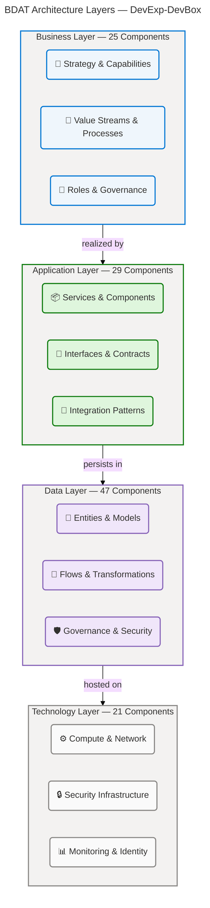

# Architecture Documentation — DevExp-DevBox

This folder contains the complete architecture documentation for the
**DevExp-DevBox** platform — an Azure Dev Box Adoption & Deployment Accelerator
that enables platform engineering teams to deliver self-service developer
workstations at enterprise scale.

The documentation follows the **BDAT framework** (Business, Data, Application,
Technology), providing four complementary architectural views of a single
platform.

---

## Table of Contents

- [Document Index](#document-index)
- [Architecture Overview](#architecture-overview)
- [Layer Relationships](#layer-relationships)
- [Platform Summary](#platform-summary)
- [Audience Guide](#audience-guide)
- [Key Metrics at a Glance](#key-metrics-at-a-glance)
- [Architecture Principles](#architecture-principles)
- [Getting Started](#getting-started)
- [Contributing](#contributing)

---

## Document Index

| Document | Layer | Components | Description |
| --- | --- | ---: | --- |
| [Business Architecture](business-architecture.md) | Business | 25 | Strategy, capabilities, value streams, processes, roles, rules, and governance |
| [Application Architecture](application-architecture.md) | Application | 29 | Services, components, interfaces, collaborations, integration patterns, and contracts |
| [Data Architecture](data-architecture.md) | Data | 47 | Entities, models, stores, flows, governance, quality rules, and security classification |
| [Technology Architecture](technology-architecture.md) | Technology | 21 | Compute, networking, security infrastructure, monitoring, identity, and deployment models |

---

## Architecture Overview

```mermaid
---
title: BDAT Architecture Layers — DevExp-DevBox
config:
  theme: base
  look: classic
  layout: dagre
  themeVariables:
    fontSize: '16px'
  flowchart:
    htmlLabels: true
---
flowchart TB
    accTitle: BDAT Architecture Layers — DevExp-DevBox
    accDescr: Shows the four BDAT architecture layers and their key concerns for the DevExp-DevBox platform

    subgraph business["Business Layer — 25 Components"]
        direction LR
        B1("🎯 Strategy & Capabilities"):::core
        B2("🔄 Value Streams & Processes"):::core
        B3("👥 Roles & Governance"):::core
    end

    subgraph application["Application Layer — 29 Components"]
        direction LR
        A1("📦 Services & Components"):::success
        A2("🔌 Interfaces & Contracts"):::success
        A3("🔗 Integration Patterns"):::success
    end

    subgraph data["Data Layer — 47 Components"]
        direction LR
        D1("📄 Entities & Models"):::data
        D2("🔀 Flows & Transformations"):::data
        D3("🛡️ Governance & Security"):::data
    end

    subgraph technology["Technology Layer — 21 Components"]
        direction LR
        T1("⚙️ Compute & Network"):::neutral
        T2("🔒 Security Infrastructure"):::neutral
        T3("📊 Monitoring & Identity"):::neutral
    end

    business -->|"realized by"| application
    application -->|"persists in"| data
    data -->|"hosted on"| technology

    classDef core fill:#EFF6FC,stroke:#0078D4,stroke-width:2px,color:#323130
    classDef success fill:#DFF6DD,stroke:#107C10,stroke-width:2px,color:#323130
    classDef data fill:#F0E6FA,stroke:#8764B8,stroke-width:2px,color:#323130
    classDef neutral fill:#FAFAFA,stroke:#8A8886,stroke-width:2px,color:#323130

    style business fill:#F3F2F1,stroke:#0078D4,stroke-width:2px,color:#323130
    style application fill:#F3F2F1,stroke:#107C10,stroke-width:2px,color:#323130
    style data fill:#F3F2F1,stroke:#8764B8,stroke-width:2px,color:#323130
    style technology fill:#F3F2F1,stroke:#8A8886,stroke-width:2px,color:#323130
```

---

## Layer Relationships

Each document addresses a distinct architectural concern. Together they provide
full traceability from business intent to infrastructure deployment.

| From | To | Relationship | Example |
| --- | --- | --- | --- |
| **Business** | **Application** | Capabilities are realized by application services | Developer Workstation Provisioning → Dev Box Pool Service |
| **Application** | **Data** | Services produce and consume data assets | Workload Orchestrator → DevCenterConfig YAML |
| **Data** | **Technology** | Data stores are hosted on infrastructure | Key Vault secrets → Azure Key Vault (Standard SKU) |
| **Business** | **Technology** | Business rules constrain infrastructure | RBAC Least Privilege → Scoped role assignments |

### Reading Order

- **Top-down** (recommended for stakeholders): Business → Application → Data → Technology
- **Bottom-up** (recommended for engineers): Technology → Data → Application → Business
- **Targeted**: Jump directly to the layer relevant to your concern

---

## Platform Summary

**DevExp-DevBox** provisions cloud-hosted developer workstations (Dev Boxes)
through Azure DevCenter, deployed entirely via Infrastructure-as-Code (Azure
Bicep) using the Azure Developer CLI (`azd`).

### Core Capabilities

| Capability | Description |
| --- | --- |
| **Developer Workstation Provisioning** | On-demand, role-specific Dev Boxes (backend: 32-core/128GB, frontend: 16-core/64GB) |
| **Identity & Access Management** | Azure AD group-based RBAC with least-privilege scoping at subscription, resource group, and project levels |
| **Secrets Management** | Azure Key Vault with RBAC authorization, purge protection, and soft delete |
| **Centralized Monitoring** | Log Analytics workspace with diagnostic telemetry from all provisioned resources |
| **Network Isolation** | Project-scoped virtual networks with subnet segmentation and Azure AD-joined connections |

### Azure Landing Zone Structure

| Resource Group | Function | Key Resources |
| --- | --- | --- |
| `devexp-workload-RG` | Developer Workstations | DevCenter, Projects, Pools, Catalogs |
| `devexp-security-RG` | Secrets Management | Key Vault, Secrets |
| `devexp-monitoring-RG` | Observability | Log Analytics Workspace, Activity Solution |

---

## Audience Guide

| Role | Start With | Key Sections |
| --- | --- | --- |
| **Executive / Stakeholder** | [Business Architecture](business-architecture.md) | Executive Summary, Business Strategy, Value Streams |
| **Solution Architect** | [Application Architecture](application-architecture.md) | Architecture Landscape, Principles, Component Catalog |
| **Data Engineer / Analyst** | [Data Architecture](data-architecture.md) | Data Entities, Data Flows, Governance, Quality Rules |
| **Platform / DevOps Engineer** | [Technology Architecture](technology-architecture.md) | Compute Resources, Network Baseline, Security Configuration |
| **Security Reviewer** | [Data Architecture](data-architecture.md) | Data Security, RBAC Policies, Classification Taxonomy |

---

## Key Metrics at a Glance

| Metric | Value |
| ---: | --- |
| **Total Architecture Components** | 122 |
| **BDAT Layers Covered** | 4 / 4 |
| **Configuration Schemas** | 3 JSON Schema files |
| **YAML Configuration Files** | 3 |
| **Bicep Modules** | 23 |
| **RBAC Role Assignments** | 12 |
| **Azure PaaS Services** | 5 |
| **Deployment Model** | Azure Developer CLI (`azd`) — fully declarative IaC |

---

## Architecture Principles

The following cross-cutting principles are observed across all four layers:

| Principle | Layers | Description |
| --- | --- | --- |
| **Configuration-Driven Design** | B, A, D | All settings externalized in YAML, validated by JSON Schema |
| **Modular Composition** | A, T | Single-responsibility Bicep modules with clear input/output contracts |
| **Least-Privilege Access** | B, D, T | RBAC scoped to minimum required level; group-based identity governance |
| **Landing Zone Alignment** | B, A, T | Three isolated resource groups (workload, security, monitoring) |
| **Diagnostic Observability** | A, D, T | All resources emit logs and metrics to centralized Log Analytics |
| **Immutable Infrastructure** | D, T | Declarative IaC with idempotent deployment; config version-controlled in Git |
| **Schema-First Validation** | D | Every configuration file validated against a companion JSON Schema |

---

## Getting Started

1. **Understand the business context** — Read the [Executive Summary](business-architecture.md#1--executive-summary) in Business Architecture
2. **Explore the system design** — Review the [System Context Diagram](application-architecture.md#️-section-2-architecture-landscape) in Application Architecture
3. **Understand the data landscape** — Check the [Data Domain Map](data-architecture.md#️-section-2-architecture-landscape) in Data Architecture
4. **Review infrastructure** — Examine the [Infrastructure Context](technology-architecture.md#️-section-2-architecture-landscape) in Technology Architecture
5. **Deploy the platform** — Follow the instructions in the repository [README](../../README.md)

---

## Contributing

When updating architecture documentation:

- **Scope**: Each document covers exactly one BDAT layer — do not mix concerns across files
- **Diagrams**: Use Mermaid with the Azure/Fluent Architecture Pattern v1.1 (semantic classDefs, `accTitle`/`accDescr`, Fluent UI palette)
- **Traceability**: Every component must be traceable to source files in the repository
- **Tables**: Use consistent table formatting with emoji column headers matching the existing style
- **Sections**: Follow the established section numbering (1: Executive Summary, 2: Landscape, 3: Principles, 4: Baseline, 5: Catalog, 8: Dependencies)

See [CONTRIBUTING.md](../../CONTRIBUTING.md) for general repository contribution guidelines.
