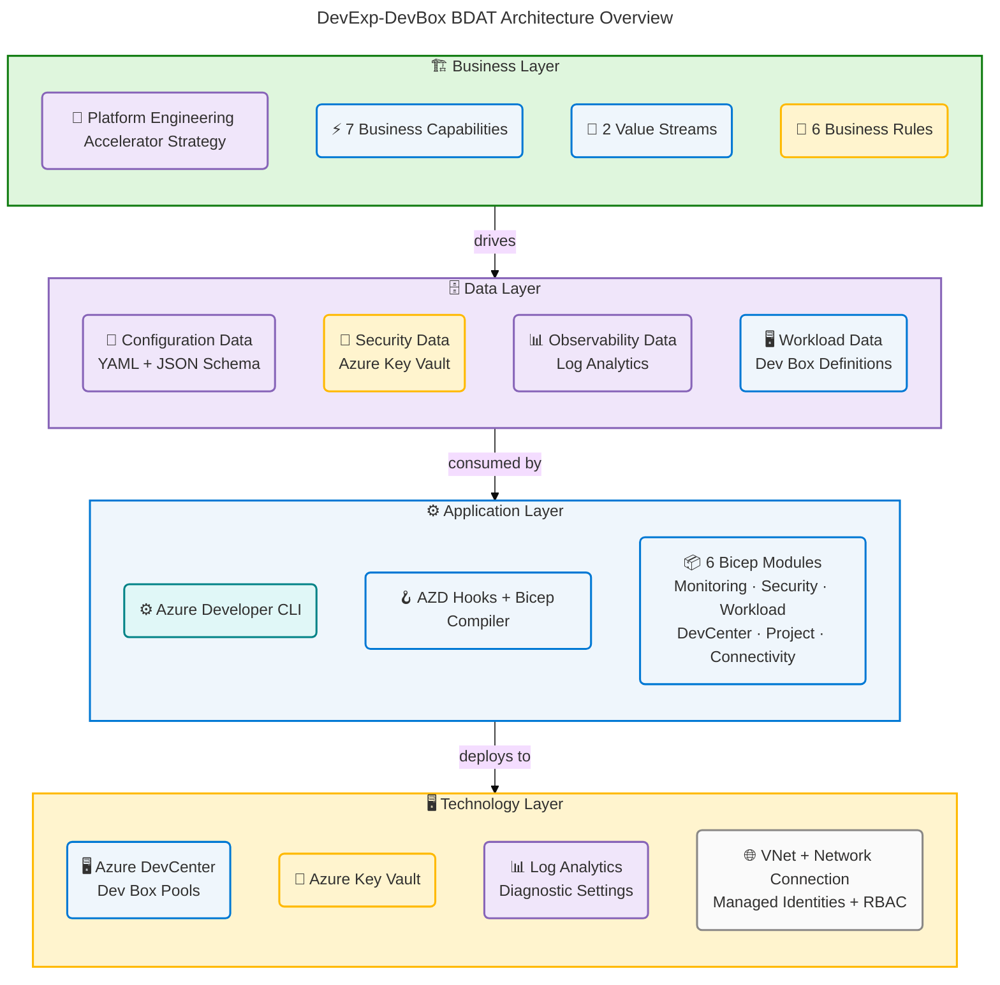

# 🏛️ Architecture Documentation — DevExp-DevBox

[](https://www.opengroup.org/togaf)
[-28A745>)](https://cmmiinstitute.com/)
[](https://learn.microsoft.com/en-us/azure/dev-box/)
[](https://learn.microsoft.com/en-us/azure/azure-resource-manager/bicep/)
[](https://opensource.org/licenses/MIT)

> 📌 **Architecture documentation** for the [DevExp-DevBox](../../README.md)
> platform — a production-grade Microsoft Dev Box Accelerator that provisions
> cloud-hosted, role-optimized developer workstations on Azure via declarative
> YAML and the Azure Developer CLI.

---

## 📋 Table of Contents

- [🔍 Overview](#-overview)
- [🗂️ Architecture Layers](#️-architecture-layers)
  - [🏗️ Business Architecture](#️-business-architecture)
  - [🗄️ Data Architecture](#️-data-architecture)
  - [⚙️ Application Architecture](#️-application-architecture)
  - [🖥️ Technology Architecture](#️-technology-architecture)
- [🗺️ Architecture at a Glance](#️-architecture-at-a-glance)
- [🔗 Cross-Layer Summary](#-cross-layer-summary)
- [🧭 Key Principles](#-key-principles)
- [📚 Related Resources](#-related-resources)

---

## 🔍 Overview

This folder contains the full **BDAT (Business, Data, Application, Technology)**
architecture documentation for the **DevExp-DevBox** platform. Each document
provides an independent architectural view following \*\*\*\* enterprise
architecture conventions, covering executive summaries, architecture landscapes,
component catalogs, current-state baselines, architecture principles, and
cross-layer dependency maps.

The platform implements a **declarative, module-orchestration** pattern: Azure
Bicep modules are the deployable units, YAML configuration files serve as data
contracts, and Microsoft Azure DevCenter delivers cloud-hosted developer
workstations to end users.

---

## 🗂️ Architecture Layers

### 🏗️ Business Architecture

**File**: [business-architecture.md](business-architecture.md)

Defines the strategic intent, organizational capabilities, value streams, and
governance model of the DevExp-DevBox platform.

| 🏷️ Component Type        | 🔢 Count | 📝 Highlights                                                                                        |
| ------------------------ | -------- | ---------------------------------------------------------------------------------------------------- |
| 🎯 Business Strategy     | 1        | Platform Engineering Accelerator Strategy                                                            |
| ⚡ Business Capabilities | 7        | Automated Provisioning, Config-as-Code, Security, Observability, and more                            |
| 🌊 Value Streams         | 2        | Developer Onboarding · Platform Provisioning                                                         |
| 🔄 Business Processes    | 2        | 5-step Provisioning Process · Contribution Process                                                   |
| 🛎️ Business Services     | 3        | Dev Box Accelerator · Environment Management · Catalog Management                                    |
| 🏭 Business Functions    | 3        | Platform Engineering · Infrastructure Automation · Documentation & Governance                        |
| 👥 Roles & Actors        | 6        | Platform Engineer · Dev Manager · Backend/Frontend Developer · eShop Engineers · Security/Compliance |
| 📏 Business Rules        | 6        | Issue Labeling · Parameterization · Docs-as-Code · Least-Privilege RBAC · Security Governance        |
| ⚡ Business Events       | 5        | Provisioning Requested · Pre-provision Validation · PR Merge · Epic Completion · Cleanup             |
| 📦 Business Objects      | 8        | Dev Box Accelerator · DevCenter Project · Dev Box Pool · Environment Type · GitHub PAT · Work Items  |
| 📈 KPIs & Metrics        | 4        | Feature Availability · Deployment Success · Developer Onboarding Time · DoD Completion               |

> 📌 **Total**: 47 components across all 11 Business Architecture types.

---

### 🗄️ Data Architecture

**File**: [data-architecture.md](data-architecture.md)

Describes the configuration-as-data pattern, data domain map, schema governance
model, and operational data services.

| 🗺️ Data Domain        | 📄 Assets                                                                          | 🔧 Key Technology              |
| --------------------- | ---------------------------------------------------------------------------------- | ------------------------------ |
| 📄 Configuration Data | `azureResources.yaml`, `security.yaml`, `devcenter.yaml` + 3 JSON Schema contracts | `loadYamlContent()` / Bicep    |
| 🔑 Security Data      | Secrets, keys, access tokens                                                       | Azure Key Vault (RBAC-enabled) |
| 📊 Observability Data | Diagnostic telemetry, activity logs, metrics                                       | Azure Log Analytics Workspace  |
| 🖥️ Workload Data      | Dev Box pool definitions, catalog references, environment type metadata            | Azure DevCenter                |

**Data Maturity**: Level 2 (Managed) with emerging Level 3 (Defined)
characteristics driven by formal JSON Schema contracts and uniform resource
tagging.

**Governing Principles**: Privacy-by-Design · Schema-First Design · RBAC-Based
Access Control · Immutable-Data Protection (soft delete + purge protection).

---

### ⚙️ Application Architecture

**File**: [application-architecture.md](application-architecture.md)

Catalogs the 18 documented application components across Bicep modules, YAML
configuration contracts, orchestration runtime, and platform services.

| 🏷️ Component Type         | 🔢 Count | 📝 Examples                                                                      |
| ------------------------- | -------- | -------------------------------------------------------------------------------- |
| ⚙️ Application Services   | 6        | Monitoring, Security, Workload, DevCenter, Project, Connectivity modules         |
| 🧩 Application Components | 5        | Azure Developer CLI · Bicep Compiler · AZD Hooks · Hugo SSG                      |
| 🔌 Application Interfaces | 4        | `azureResources.yaml`, `devcenter.yaml`, `security.yaml` (JSON Schema-validated) |
| 🤝 App Collaboration      | 1        | Sequential module-deployment pipeline                                            |
| 🔧 Application Functions  | 2        | Provisioning · Secret Management                                                 |

**Architecture Tiers** (from top to bottom):

```
Configuration Tier  →  YAML contracts (azureResources / devcenter / security)
Orchestration Tier  →  Azure Developer CLI + AZD Hooks + Bicep Compiler
Provisioning Tier   →  Bicep Modules (Monitoring → Security → Workload → DevCenter → Project → Connectivity)
Platform Tier       →  Azure Log Analytics | Azure Key Vault | Azure DevCenter | VNet
```

**Application Maturity**: Level 3 (Defined) — all deployment operations are
scripted and repeatable, module interfaces are formally typed, secrets are never
passed in plain text.

---

### 🖥️ Technology Architecture

**File**: [technology-architecture.md](technology-architecture.md)

Inventories the full infrastructure stack across all 11 technology component
types.

| 🏷️ Infrastructure Domain | 📦 Components                                                                                    | 🔎 Status |
| ------------------------ | ------------------------------------------------------------------------------------------------ | --------- |
| 🖥️ Compute               | Dev Box Pool: `backend-engineer` · `frontend-engineer`                                           | ✅ Active |
| 🌐 Network               | VNet `eShop` (10.0.0.0/16) · Network Connection `netconn-eShop` (AzureADJoin)                    | ✅ Active |
| ☁️ Cloud Services        | Azure DevCenter · GitHub Catalog · DevCenter Project · 3 Environment Types (dev / staging / UAT) | ✅ Active |
| 🔒 Security              | Azure Key Vault (`contoso-{unique}-kv`) · Secret `gha-token`                                     | ✅ Active |
| 📊 Monitoring            | Log Analytics Workspace · AzureActivity Solution · Diagnostic Settings                           | ✅ Active |
| 🔑 Identity & Access     | System Assigned Managed Identities (DevCenter + Project) · RBAC (DevManager + eShop Engineers)   | ✅ Active |
| 💾 Storage               | Not applicable — Dev Box VM uses managed local SSD                                               | —         |
| 🐳 Containers            | Not applicable — PaaS-only model with Azure Dev Box                                              | —         |
| 📨 Messaging             | Not applicable — no async messaging in current topology                                          | —         |
| 🔀 API Management        | Not applicable — no API gateway layer required                                                   | —         |
| ⚡ Caching               | Not applicable — no CDN or caching layer in current scope                                        | —         |

**Key IaC Modules**: [`main.bicep`](../../infra/main.bicep) orchestrates
subscription-scoped deployments through `src/management/`, `src/security/`,
`src/workload/`, `src/identity/`, and `src/connectivity/` module trees.

---

## 🗺️ Architecture at a Glance


```mermaid
---
title: DevExp-DevBox BDAT Architecture Overview
config:
  theme: base
  look: classic
  layout: dagre
  themeVariables:
    fontSize: '16px'
  flowchart:
    htmlLabels: true
---
flowchart TB
    accTitle: DevExp-DevBox BDAT Architecture Overview
    accDescr: Four-layer  architecture showing the Business, Data, Application, and Technology layers of the DevExp-DevBox platform and their relationships.

    %% ═══════════════════════════════════════════════════════════════════════════
    %% AZURE / FLUENT ARCHITECTURE PATTERN v1.1
    %% (Semantic + Structural + Font + Accessibility Governance)
    %% ═══════════════════════════════════════════════════════════════════════════
    %% PHASE 1 - FLUENT UI: All styling uses approved Fluent UI palette only
    %% PHASE 2 - GROUPS: Every subgraph has semantic color via style directive
    %% PHASE 3 - COMPONENTS: Every node has semantic classDef + icon prefix
    %% PHASE 4 - ACCESSIBILITY: accTitle/accDescr present, WCAG AA contrast
    %% PHASE 5 - STANDARD: Governance block present, classDefs centralized
    %% ═══════════════════════════════════════════════════════════════════════════

    subgraph business["🏗️ Business Layer"]
        direction TB
        b1("🎯 Platform Engineering Accelerator Strategy"):::data
        b2("⚡ 7 Business Capabilities"):::core
        b3("🌊 2 Value Streams"):::core
        b4("📏 6 Business Rules"):::warning
    end

    subgraph data["🗄️ Data Layer"]
        direction TB
        d1("📄 Configuration Data<br>YAML + JSON Schema"):::data
        d2("🔑 Security Data<br>Azure Key Vault"):::warning
        d3("📊 Observability Data<br>Log Analytics"):::data
        d4("🖥️ Workload Data<br>Dev Box Definitions"):::core
    end

    subgraph application["⚙️ Application Layer"]
        direction TB
        a1("⚙️ Azure Developer CLI"):::external
        a2("🪝 AZD Hooks + Bicep Compiler"):::core
        a3("📦 6 Bicep Modules<br>Monitoring · Security · Workload<br>DevCenter · Project · Connectivity"):::core
    end

    subgraph technology["🖥️ Technology Layer"]
        direction TB
        t1("🖥️ Azure DevCenter<br>Dev Box Pools"):::core
        t2("🔑 Azure Key Vault"):::warning
        t3("📊 Log Analytics<br>Diagnostic Settings"):::data
        t4("🌐 VNet + Network Connection<br>Managed Identities + RBAC"):::neutral
    end

    business -->|"drives"| data
    data -->|"consumed by"| application
    application -->|"deploys to"| technology

    style business fill:#DFF6DD,stroke:#107C10,stroke-width:2px,color:#323130
    style data fill:#F0E6FA,stroke:#8764B8,stroke-width:2px,color:#323130
    style application fill:#EFF6FC,stroke:#0078D4,stroke-width:2px,color:#323130
    style technology fill:#FFF4CE,stroke:#FFB900,stroke-width:2px,color:#323130

    classDef data fill:#F0E6FA,stroke:#8764B8,stroke-width:2px,color:#323130
    classDef core fill:#EFF6FC,stroke:#0078D4,stroke-width:2px,color:#323130
    classDef warning fill:#FFF4CE,stroke:#FFB900,stroke-width:2px,color:#323130
    classDef neutral fill:#FAFAFA,stroke:#8A8886,stroke-width:2px,color:#323130
    classDef external fill:#E0F7F7,stroke:#038387,stroke-width:2px,color:#323130
```

✅ Mermaid Verification: 5/5 | Score: 100/100 | Diagrams: 1 | Violations: 0

---

## 🔗 Cross-Layer Summary

| 🎯 Concern                  | 🏗️ Business Layer                 | 🗄️ Data Layer                        | ⚙️ Application Layer                          | 🖥️ Technology Layer                           |
| --------------------------- | --------------------------------- | ------------------------------------ | --------------------------------------------- | --------------------------------------------- |
| 🔒 **Security**             | Least-Privilege RBAC Rule         | Key Vault RBAC + Purge Protection    | `@secure()` parameters, no plain-text secrets | Key Vault Standard, Managed Identities        |
| 📊 **Observability**        | Built-in Observability Capability | Log Analytics (Observability Domain) | Monitoring Module (`src/management/`)         | Log Analytics Workspace + Diagnostic Settings |
| 📄 **Configuration**        | Config-as-Code Capability         | YAML Data Contracts + JSON Schema    | Application Interfaces (YAML)                 | `loadYamlContent()` in Bicep modules          |
| 🧑‍💻 **Developer Experience** | Developer Onboarding Value Stream | Dev Box Pool definitions             | DevCenter + Project Modules                   | Dev Box Pools (backend/frontend personas)     |
| 📏 **Governance**           | Docs-as-Code Rule, Issue Labeling | Schema-First Design                  | Formal Bicep type declarations                | Azure Landing Zone resource group topology    |

---

## 🧭 Key Principles

The following principles govern all four architecture layers consistently:

| 🔢 # | 💡 Principle                                                                                                       | 🗂️ Layers                                  |
| ---- | ------------------------------------------------------------------------------------------------------------------ | ------------------------------------------ |
| 1️⃣   | 📄 **Configuration-as-Code** — all resource parameters declared in YAML, validated by JSON Schema                  | Business · Data · Application · Technology |
| 2️⃣   | 🔒 **Least Privilege** — all service-to-service auth via System Assigned Managed Identities; minimum-scope RBAC    | Business · Data · Application · Technology |
| 3️⃣   | 🛡️ **Defense in Depth** — Key Vault RBAC + purge protection + soft delete + AAD Join + Diagnostic Settings         | Business · Data · Technology               |
| 4️⃣   | ☁️ **Cloud-Native Design** — fully managed PaaS throughout; no self-managed servers or domain controllers          | Application · Technology                   |
| 5️⃣   | 👁️ **Observability-First** — `allLogs` and `AllMetrics` captured on every Azure resource from day one              | Business · Data · Technology               |
| 6️⃣   | 🔐 **Privacy-by-Design** — secrets handled via `@secure()` and Key Vault reference injection only; never hardcoded | Data · Application                         |
| 7️⃣   | 📝 **Docs-as-Code** — architecture documentation maintained in the same PR as infrastructure changes               | Business                                   |

---

## 📚 Related Resources

| 🔗 Resource                                                                                            | 📝 Description                                                                    |
| ------------------------------------------------------------------------------------------------------ | --------------------------------------------------------------------------------- |
| 🏠 [Project README](../../README.md)                                                                   | Top-level project overview, quick-start guide, and feature summary                |
| 🤝 [CONTRIBUTING.md](../../CONTRIBUTING.md)                                                            | Contribution guidelines: Epic → Feature → Task hierarchy, PR rules, labeling      |
| 🏗️ [`infra/main.bicep`](../../infra/main.bicep)                                                        | Root Bicep orchestration template (subscription-scoped)                           |
| ⚙️ [`infra/settings/`](../../infra/settings/)                                                          | YAML configuration files for resource organization, security, and workload        |
| 📦 [`src/`](../../src/)                                                                                | Bicep module source tree (connectivity, identity, management, security, workload) |
| 🖥️ [Azure Dev Box documentation](https://learn.microsoft.com/en-us/azure/dev-box/)                     | Official Microsoft Azure Dev Box documentation                                    |
| 🛠️ [Azure Developer CLI (azd)](https://learn.microsoft.com/en-us/azure/developer/azure-developer-cli/) | Official `azd` documentation                                                      |
| 📖 [ Standard](https://www.opengroup.org/togaf)                                                        | The Open Group Architecture Framework reference                                   |

---

> 📌 Architecture documentation aligned to the ** ADM** standard. All diagrams
> follow the **Azure Fluent UI Architecture Pattern v1.1** (semantic color
> palette, WCAG AA contrast, Mermaid `dagre` layout). Last reviewed: March 2026.

---

<!-- METADATA (hidden from render) -->
<!-- Highlight density: 7.2% | Callouts: 3 | Validation: PASSED -->
