# 🏠 DevExp-DevBox Architecture Documentation

> **TOGAF BDAT Architecture Framework**

> [!NOTE]
>
> **Target Audience:** All Stakeholders
>
> **Purpose:** Central navigation hub for architecture documentation

## 📋 Overview

This documentation follows the **TOGAF Architecture Development Method (ADM)**
and implements the **BDAT (Business, Data, Application, Technology)** framework
to provide comprehensive architecture documentation for the DevExp-DevBox
Landing Zone Accelerator.

## 📚 Architecture Documents

|  #  | Document                                                        | Description                                                                       | Audience                            |
| :-: | :-------------------------------------------------------------- | :-------------------------------------------------------------------------------- | :---------------------------------- |
|  1  | [🏢 Business Architecture](./01-business-architecture.md)       | Business context, stakeholders, capabilities, value streams, and requirements     | BDMs, Enterprise Architects         |
|  2  | [📊 Data Architecture](./02-data-architecture.md)               | Configuration data models, secrets management, telemetry, and data governance     | Data Architects, Security Engineers |
|  3  | [🏛️ Application Architecture](./03-application-architecture.md) | Bicep module catalog, dependencies, deployment orchestration, and design patterns | Platform Engineers, DevOps          |
|  4  | [🏗️ Technology Architecture](./04-technology-architecture.md)   | Azure services, networking, identity, security, monitoring, and CI/CD             | Cloud Architects, IT Operations     |

## 🔄 Document Relationships

```mermaid
---
title: TOGAF BDAT Framework Document Relationships
---
flowchart TB
    %% ===== STYLE DEFINITIONS =====
    classDef primary fill:#4F46E5,stroke:#3730A3,color:#FFFFFF
    classDef secondary fill:#10B981,stroke:#059669,color:#FFFFFF
    classDef datastore fill:#F59E0B,stroke:#D97706,color:#000000

    %% ===== FRAMEWORK DOCUMENTS =====
    subgraph TOGAF["TOGAF BDAT Framework"]
        BA["🏢 Business Architecture"]
        DA["📊 Data Architecture"]
        AA["🏛️ Application Architecture"]
        TA["🏗️ Technology Architecture"]
    end

    %% ===== DOCUMENT RELATIONSHIPS =====
    BA -->|"defines requirements"| DA
    BA -->|"defines requirements"| AA
    DA -->|"defines data flows"| AA
    AA -->|"implements"| TA
    DA -->|"defines data flows"| TA

    %% ===== CROSS-DOMAIN RELATIONSHIPS =====
    BA -.->|"Defines Requirements"| AA
    DA -.->|"Defines Data Flows"| TA
    AA -.->|"Implements"| TA

    %% ===== APPLY STYLES =====
    class BA,DA,AA,TA primary

    %% ===== SUBGRAPH STYLING =====
    style TOGAF fill:#EEF2FF,stroke:#4F46E5,stroke-width:2px
```

## 🎯 Quick Start Guide

> [!TIP]
>
> **Recommended Reading Order:**
>
> 1. Start with **Business Architecture** to understand the context and
>    requirements
> 2. Review **Data Architecture** for configuration and data flow patterns
> 3. Explore **Application Architecture** for Bicep module details
> 4. Finish with **Technology Architecture** for infrastructure specifics

## 📖 Framework Reference

| Framework     | Component                               | Purpose                                        |
| :------------ | :-------------------------------------- | :--------------------------------------------- |
| **TOGAF**     | Architecture Development Method (ADM)   | Structured approach to enterprise architecture |
| **BDAT**      | Business, Data, Application, Technology | Four-domain architecture framework             |
| **Azure CAF** | Cloud Adoption Framework                | Azure best practices and landing zones         |

## 🔗 External Resources

| Resource                                                                                              | Description                    |
| :---------------------------------------------------------------------------------------------------- | :----------------------------- |
| [Microsoft Dev Box](https://learn.microsoft.com/azure/dev-box/)                                       | Official Dev Box documentation |
| [Azure Landing Zones](https://learn.microsoft.com/azure/cloud-adoption-framework/ready/landing-zone/) | CAF Landing Zone guidance      |
| [TOGAF Standard](https://www.opengroup.org/togaf)                                                     | TOGAF architecture framework   |
| [DevExp-DevBox Accelerator](https://evilazaro.github.io/DevExp-DevBox/)                               | Project documentation site     |

---

**📅 Last Updated:** January 22, 2026 | **📌 Version:** 1.0.0

