# 📚 Architecture Documentation Index

> [!NOTE]
> **Target Audience**: All Technical Stakeholders  
> **Purpose**: Central navigation hub for TOGAF architecture documentation

---

## 🎯 Overview

This documentation series provides comprehensive **TOGAF Architecture Development Method (ADM)** documentation for the **DevExp-DevBox Landing Zone Accelerator**. The documentation follows the BDAT (Business, Data, Application, Technology) framework with an additional Security Architecture layer.

---

## 📑 Document Series

| # | Document | Description | Audience |
|:-:|:---------|:------------|:---------|
| 1 | [📊 Business Architecture](01-business-architecture.md) | Stakeholder analysis, business capabilities, value streams, success metrics | BDMs, PMs, Enterprise Architects |
| 2 | [🗄️ Data Architecture](02-data-architecture.md) | Configuration schemas, secrets management, telemetry, data governance | Data Architects, Platform Engineers |
| 3 | [🏛️ Application Architecture](03-application-architecture.md) | Bicep module catalog, dependencies, deployment orchestration, design patterns | DevOps Engineers, Platform Engineers |
| 4 | [⚙️ Technology Architecture](04-technology-architecture.md) | Azure infrastructure, landing zones, networking, CI/CD, deployment tools | Cloud Architects, Infrastructure Teams |
| 5 | [🔐 Security Architecture](05-security-architecture.md) | Threat model, identity management, RBAC, compliance, security controls | Security Architects, Compliance Teams |

---

## 🗺️ Reading Path

```mermaid
flowchart LR
    A[📊 Business] --> B[🗄️ Data]
    B --> C[🏛️ Application]
    C --> D[⚙️ Technology]
    D --> E[🔐 Security]
    
    style A fill:#E3F2FD
    style B fill:#FFF3E0
    style C fill:#F3E5F5
    style D fill:#E8F5E9
    style E fill:#FFEBEE
```

> [!TIP]
> **Recommended Reading Order**: Follow the numbered sequence for a comprehensive understanding, or jump directly to specific domains based on your role.

---

## 🏷️ Quick Reference

<strong>By Role</strong>

### For Business Decision Makers

- Start with [📊 Business Architecture](01-business-architecture.md)
- Review success metrics and value propositions

### For Platform Engineers

- Focus on [🏛️ Application Architecture](03-application-architecture.md) and [⚙️ Technology Architecture](04-technology-architecture.md)
- Review module catalog and deployment patterns

### For Security Teams

- Start with [🔐 Security Architecture](05-security-architecture.md)
- Review threat model and compliance controls

### For Data Architects

- Focus on [🗄️ Data Architecture](02-data-architecture.md)
- Review configuration schemas and data flows

<strong>By Topic</strong>

| Topic | Primary Document | Related Sections |
|:------|:-----------------|:-----------------|
| **Azure DevCenter** | [Technology Architecture](04-technology-architecture.md) | Application Architecture |
| **Bicep Modules** | [Application Architecture](03-application-architecture.md) | Technology Architecture |
| **Key Vault & Secrets** | [Data Architecture](02-data-architecture.md) | Security Architecture |
| **RBAC & Identity** | [Security Architecture](05-security-architecture.md) | Technology Architecture |
| **CI/CD Pipelines** | [Technology Architecture](04-technology-architecture.md) | Application Architecture |
| **Compliance** | [Security Architecture](05-security-architecture.md) | Business Architecture |

---

## 📋 Document Standards

All documents in this series follow:

- **TOGAF ADM** methodology
- **GitHub-Flavored Markdown** (GFM) formatting
- **Mermaid** diagrams for visualization
- **YAML frontmatter** for metadata
- **Consistent navigation** with Previous/Next links

---

## 🔗 External Resources

| Resource | Description |
|:---------|:------------|
| [Microsoft Dev Box Documentation](https://learn.microsoft.com/en-us/azure/dev-box/) | Official Azure Dev Box documentation |
| [Azure Landing Zones](https://learn.microsoft.com/en-us/azure/cloud-adoption-framework/ready/landing-zone/) | Cloud Adoption Framework landing zones |
| [TOGAF Standard](https://www.opengroup.org/togaf) | The Open Group Architecture Framework |
| [Azure Bicep](https://learn.microsoft.com/en-us/azure/azure-resource-manager/bicep/) | Infrastructure as Code language |

---

**DevExp-DevBox Landing Zone Accelerator**  
*TOGAF Architecture Documentation v1.0.0*

