# Technology Architecture

## 1. Executive Summary

The DevExp-DevBox accelerator implements a comprehensive Technology Architecture
designed to provision and manage Microsoft Dev Box environments on Azure. This
infrastructure-as-code solution leverages Azure Bicep templates for declarative
resource provisioning, GitHub Actions for CI/CD automation, and YAML-based
configuration files for flexible environment customization. The architecture
follows Azure Landing Zone principles, segregating resources by function into
dedicated resource groups for workload, security, and monitoring concerns.

The technology stack emphasizes automation, security, and observability
throughout the deployment lifecycle. Key infrastructure patterns include
OIDC-based authentication for GitHub Actions, Azure Key Vault for secrets
management with RBAC authorization, Log Analytics for centralized monitoring,
and managed identities for secure service-to-service communication. The solution
supports both managed and unmanaged virtual network configurations, enabling
flexible network connectivity options for Dev Box pools across different project
requirements.

## 2. Technology Architecture Landscape

### 2.1 Landscape Diagram

```mermaid
%%{init: {'theme': 'base', 'themeVariables': {'primaryColor': '#E3F2FD', 'lineColor': '#1976D2'}}}%%
flowchart TB
    classDef azure_root fill:#E3F2FD,stroke:#1565C0,stroke-width:2px,color:#0D47A1
    classDef workload fill:#C8E6C9,stroke:#388E3C,stroke-width:2px,color:#1B5E20
    classDef security fill:#FFCDD2,stroke:#D32F2F,stroke-width:2px,color:#B71C1C
    classDef monitoring fill:#E1BEE7,stroke:#7B1FA2,stroke-width:2px,color:#4A148C
    classDef connectivity fill:#B3E5FC,stroke:#0288D1,stroke-width:2px,color:#01579B
    classDef cicd fill:#FFE0B2,stroke:#F57C00,stroke-width:2px,color:#E65100
    classDef iac fill:#F5F5F5,stroke:#616161,stroke-width:2px,color:#212121

    subgraph Azure["☁️ Azure Cloud Platform"]
        direction TB
        subgraph RG_Workload["📦 Workload Resource Group"]
            devcenter["Azure Dev Center"]:::workload
            project["DevCenter Projects"]:::workload
            pools["Dev Box Pools"]:::workload
            catalog["DevCenter Catalogs"]:::workload
            envtypes["Environment Types"]:::workload
        end
        subgraph RG_Security["🔒 Security Resource Group"]
            keyvault["Azure Key Vault"]:::security
            secrets["Key Vault Secrets"]:::security
        end
        subgraph RG_Monitoring["📊 Monitoring Resource Group"]
            loganalytics["Log Analytics Workspace"]:::monitoring
            solutions["Azure Activity Solution"]:::monitoring
        end
        subgraph RG_Connectivity["🌐 Connectivity Resource Group"]
            vnet["Virtual Network"]:::connectivity
            subnet["Subnet"]:::connectivity
            netconn["Network Connection"]:::connectivity
        end
    end

    subgraph CICD["⚙️ CI/CD Pipeline"]
        ghactions["GitHub Actions"]:::cicd
        bicep_ci["Bicep Build CI"]:::cicd
        deploy_wf["Deploy Workflow"]:::cicd
        release_wf["Release Workflow"]:::cicd
    end

    subgraph IaC["📝 Infrastructure As Code"]
        bicep_main["Main Bicep Template"]:::iac
        bicep_modules["Bicep Modules"]:::iac
        yaml_config["YAML Configuration"]:::iac
    end

    style Azure fill:#E3F2FD,stroke:#1565C0,stroke-width:3px
    style RG_Workload fill:#E8F5E9,stroke:#388E3C,stroke-width:2px
    style RG_Security fill:#FFEBEE,stroke:#D32F2F,stroke-width:2px
    style RG_Monitoring fill:#F3E5F5,stroke:#7B1FA2,stroke-width:2px
    style RG_Connectivity fill:#E1F5FE,stroke:#0288D1,stroke-width:2px
    style CICD fill:#FFF3E0,stroke:#F57C00,stroke-width:2px
    style IaC fill:#FAFAFA,stroke:#616161,stroke-width:2px

    ghactions --> bicep_ci
    bicep_ci --> bicep_main
    deploy_wf --> devcenter
    bicep_main --> RG_Workload
    bicep_main --> RG_Security
    bicep_main --> RG_Monitoring
    devcenter --> project
    project --> pools
    project --> catalog
    devcenter --> envtypes
    devcenter --> keyvault
    devcenter --> loganalytics
    netconn --> devcenter
    vnet --> subnet
    subnet --> netconn
```

## 3. Infrastructure

### 3.1 Overview

The infrastructure architecture follows Azure Landing Zone principles with
segregation by functional domain. Three primary resource groups organize
resources: a workload resource group containing Azure Dev Center and related
compute resources, a security resource group housing Azure Key Vault for secrets
management, and a monitoring resource group with Log Analytics for centralized
observability. This separation enables independent lifecycle management, access
control, and cost allocation for each functional area.

The infrastructure is deployed at the Azure subscription scope using Bicep
templates with a modular design pattern. The main deployment orchestrates
resource group creation and module invocations, while individual Bicep modules
encapsulate specific resource configurations. Configuration is externalized to
YAML files, enabling environment-specific customization without template
modification. The deployment supports multiple Azure regions with location
validation constraints ensuring compatibility with Dev Center regional
availability.

### 3.2 Infrastructure Catalog

| Component Name        | Type           | Location                                                                           | Description                                                           |
| --------------------- | -------------- | ---------------------------------------------------------------------------------- | --------------------------------------------------------------------- |
| devexp-workload       | Resource Group | [infra/main.bicep](../../infra/main.bicep)                                         | Primary workload resource group containing Dev Center resources       |
| devexp-security       | Resource Group | [infra/main.bicep](../../infra/main.bicep)                                         | Security resource group for Key Vault and related security components |
| devexp-monitoring     | Resource Group | [infra/main.bicep](../../infra/main.bicep)                                         | Monitoring resource group for Log Analytics and observability         |
| eShop-connectivity-RG | Resource Group | [src/connectivity/resourceGroup.bicep](../../src/connectivity/resourceGroup.bicep) | Connectivity resource group for network resources                     |

### 3.3 Infrastructure Diagram

```mermaid
%%{init: {'theme': 'base', 'themeVariables': {'primaryColor': '#E3F2FD', 'lineColor': '#1976D2'}}}%%
flowchart TB
    classDef subscription fill:#E3F2FD,stroke:#1565C0,stroke-width:2px,color:#0D47A1
    classDef security fill:#FFCDD2,stroke:#D32F2F,stroke-width:2px,color:#B71C1C
    classDef monitoring fill:#E1BEE7,stroke:#7B1FA2,stroke-width:2px,color:#4A148C
    classDef workload fill:#C8E6C9,stroke:#388E3C,stroke-width:2px,color:#1B5E20
    classDef connectivity fill:#B3E5FC,stroke:#0288D1,stroke-width:2px,color:#01579B

    subgraph Subscription["🏢 Azure Subscription"]
        direction TB
        subgraph SecurityRG["🔒 Security Resource Group"]
            kv["Azure Key Vault"]:::security
            kv_secrets["Secrets Store"]:::security
            kv_diag["Diagnostic Settings"]:::security
        end
        subgraph MonitoringRG["📊 Monitoring Resource Group"]
            la["Log Analytics Workspace"]:::monitoring
            la_sol["Azure Activity Solution"]:::monitoring
            la_diag["Diagnostic Settings"]:::monitoring
        end
        subgraph WorkloadRG["📦 Workload Resource Group"]
            dc["Azure Dev Center"]:::workload
            dc_cat["Catalogs"]:::workload
            dc_env["Environment Types"]:::workload
        end
        subgraph ConnectivityRG["🌐 Connectivity Resource Group"]
            vnet_res["Virtual Network"]:::connectivity
            subnet_res["Subnet"]:::connectivity
            nc["Network Connection"]:::connectivity
        end
    end

    style Subscription fill:#E3F2FD,stroke:#1565C0,stroke-width:3px
    style SecurityRG fill:#FFEBEE,stroke:#D32F2F,stroke-width:2px
    style MonitoringRG fill:#F3E5F5,stroke:#7B1FA2,stroke-width:2px
    style WorkloadRG fill:#E8F5E9,stroke:#388E3C,stroke-width:2px
    style ConnectivityRG fill:#E1F5FE,stroke:#0288D1,stroke-width:2px

    kv --> kv_secrets
    kv --> kv_diag
    kv_diag --> la
    la --> la_sol
    la --> la_diag
    dc --> dc_cat
    dc --> dc_env
    dc --> la
    vnet_res --> subnet_res
    subnet_res --> nc
    nc --> dc
```

## 4. Platforms & Containers

### 4.1 Overview

The platform architecture centers on Microsoft Dev Center as the core developer
workstation provisioning service. Dev Center enables centralized management of
Dev Box definitions, pools, and projects while supporting multiple configuration
catalogs for customization tasks and environment definitions. The platform
leverages Git-based catalogs (GitHub and Azure DevOps) for version-controlled
configuration management, enabling GitOps workflows for Dev Box image
definitions and deployment environment specifications.

Dev Box pools are configured with specific VM SKUs optimized for different
development roles. The architecture supports both backend engineer
configurations with higher compute resources (general_i_32c128gb512ssd_v2) and
frontend engineer configurations with balanced specifications
(general_i_16c64gb256ssd_v2). DSC (Desired State Configuration) YAML files
define workload-specific configurations including development tools, runtimes,
and environment setup. The platform supports Windows Dev Drive optimization for
enhanced Git and development performance.

### 4.2 Platform Catalog

| Platform Name          | Type              | Configuration Path                                                                                                           | Purpose                                                         |
| ---------------------- | ----------------- | ---------------------------------------------------------------------------------------------------------------------------- | --------------------------------------------------------------- |
| devexp-devcenter       | Azure Dev Center  | [infra/settings/workload/devcenter.yaml](../../infra/settings/workload/devcenter.yaml)                                       | Central developer workstation platform for Dev Box provisioning |
| eShop                  | DevCenter Project | [infra/settings/workload/devcenter.yaml](../../infra/settings/workload/devcenter.yaml)                                       | Project configuration for eShop development team                |
| backend-engineer       | Dev Box Pool      | [infra/settings/workload/devcenter.yaml](../../infra/settings/workload/devcenter.yaml)                                       | Dev Box pool for backend engineers with high-compute SKU        |
| frontend-engineer      | Dev Box Pool      | [infra/settings/workload/devcenter.yaml](../../infra/settings/workload/devcenter.yaml)                                       | Dev Box pool for frontend engineers with balanced SKU           |
| customTasks            | DevCenter Catalog | [infra/settings/workload/devcenter.yaml](../../infra/settings/workload/devcenter.yaml)                                       | Microsoft devcenter-catalog repository for common tasks         |
| environments           | Project Catalog   | [infra/settings/workload/devcenter.yaml](../../infra/settings/workload/devcenter.yaml)                                       | Environment definitions catalog for eShop project               |
| devboxImages           | Project Catalog   | [infra/settings/workload/devcenter.yaml](../../infra/settings/workload/devcenter.yaml)                                       | Image definitions catalog for eShop Dev Box customization       |
| common-config.dsc.yaml | DSC Configuration | [.configuration/devcenter/workloads/common-config.dsc.yaml](../../.configuration/devcenter/workloads/common-config.dsc.yaml) | Common DSC configuration for .NET development environment       |

### 4.3 Platform Diagram

## 5. Networks & Connectivity

### 5.1 Overview

The network architecture supports both managed and unmanaged virtual network
configurations for Dev Center connectivity. Unmanaged networks require explicit
Virtual Network and Subnet provisioning with Network Connection resources to
attach to Dev Center. Managed networks leverage Microsoft-hosted networking
infrastructure, simplifying deployment while maintaining security. The
architecture uses Azure AD Join for domain connectivity, eliminating the need
for traditional Active Directory infrastructure.

Network connectivity resources include Virtual Networks with configurable
address spaces, subnets with dedicated address prefixes, and Network Connection
resources that bridge Dev Center to the underlying virtual network
infrastructure. Diagnostic settings on Virtual Networks forward all logs and
metrics to the centralized Log Analytics workspace for network monitoring and
troubleshooting. The network configuration supports the eShop project with a
10.0.0.0/16 address space and a dedicated subnet at 10.0.1.0/24.

### 5.2 Network Catalog

| Network Component       | Type               | Configuration                                                                              | Purpose                                           |
| ----------------------- | ------------------ | ------------------------------------------------------------------------------------------ | ------------------------------------------------- |
| eShop                   | Virtual Network    | [infra/settings/workload/devcenter.yaml](../../infra/settings/workload/devcenter.yaml)     | Virtual network for eShop project connectivity    |
| eShop-subnet            | Subnet             | [infra/settings/workload/devcenter.yaml](../../infra/settings/workload/devcenter.yaml)     | Subnet within eShop VNet for Dev Box connectivity |
| netconn-eShop           | Network Connection | [src/connectivity/networkConnection.bicep](../../src/connectivity/networkConnection.bicep) | Network connection attaching VNet to Dev Center   |
| vnet.bicep              | VNet Module        | [src/connectivity/vnet.bicep](../../src/connectivity/vnet.bicep)                           | Bicep module for Virtual Network provisioning     |
| networkConnection.bicep | NetConn Module     | [src/connectivity/networkConnection.bicep](../../src/connectivity/networkConnection.bicep) | Bicep module for Network Connection resources     |
| connectivity.bicep      | Orchestrator       | [src/connectivity/connectivity.bicep](../../src/connectivity/connectivity.bicep)           | Main connectivity orchestration module            |

### 5.3 Network Topology Diagram

## 6. Cloud Services

### 6.1 Overview

The solution leverages multiple Azure cloud services for developer workstation
provisioning and management. Microsoft.DevCenter resources form the core
workload, providing centralized Dev Box management, project organization, and
catalog integration. Supporting services include Microsoft.KeyVault for secure
secrets storage, Microsoft.OperationalInsights for monitoring, and
Microsoft.Network for virtual network infrastructure. The architecture uses the
latest API versions available for each resource type to ensure access to current
features and capabilities.

Resource provisioning follows a subscription-scoped deployment model with
resource groups created dynamically based on configuration. The deployment
supports conditional resource creation, allowing use of existing resources or
provisioning new ones based on configuration flags. All resources support
tagging for cost management, ownership tracking, and governance compliance.
Azure RBAC provides fine-grained access control with role assignments at
subscription, resource group, and resource scopes.

### 6.2 Cloud Services Catalog

| Service Name                    | Provider                       | Resource Type                                  | Configuration                                                                                  |
| ------------------------------- | ------------------------------ | ---------------------------------------------- | ---------------------------------------------------------------------------------------------- |
| Azure Dev Center                | Microsoft.DevCenter            | devcenters@2025-10-01-preview                  | [src/workload/core/devCenter.bicep](../../src/workload/core/devCenter.bicep)                   |
| DevCenter Projects              | Microsoft.DevCenter            | projects@2025-10-01-preview                    | [src/workload/project/project.bicep](../../src/workload/project/project.bicep)                 |
| Dev Box Pools                   | Microsoft.DevCenter            | projects/pools@2025-10-01-preview              | [src/workload/project/projectPool.bicep](../../src/workload/project/projectPool.bicep)         |
| DevCenter Catalogs              | Microsoft.DevCenter            | devcenters/catalogs@2025-10-01-preview         | [src/workload/core/catalog.bicep](../../src/workload/core/catalog.bicep)                       |
| Environment Types               | Microsoft.DevCenter            | devcenters/environmentTypes@2025-10-01-preview | [src/workload/core/environmentType.bicep](../../src/workload/core/environmentType.bicep)       |
| Network Connections             | Microsoft.DevCenter            | networkConnections@2025-10-01-preview          | [src/connectivity/networkConnection.bicep](../../src/connectivity/networkConnection.bicep)     |
| Attached Networks               | Microsoft.DevCenter            | devcenters/attachednetworks@2025-10-01-preview | [src/connectivity/networkConnection.bicep](../../src/connectivity/networkConnection.bicep)     |
| Azure Key Vault                 | Microsoft.KeyVault             | vaults@2025-05-01                              | [src/security/keyVault.bicep](../../src/security/keyVault.bicep)                               |
| Key Vault Secrets               | Microsoft.KeyVault             | vaults/secrets@2025-05-01                      | [src/security/secret.bicep](../../src/security/secret.bicep)                                   |
| Log Analytics Workspace         | Microsoft.OperationalInsights  | workspaces@2025-07-01                          | [src/management/logAnalytics.bicep](../../src/management/logAnalytics.bicep)                   |
| Operations Management Solutions | Microsoft.OperationsManagement | solutions@2015-11-01-preview                   | [src/management/logAnalytics.bicep](../../src/management/logAnalytics.bicep)                   |
| Virtual Networks                | Microsoft.Network              | virtualNetworks@2025-01-01                     | [src/connectivity/vnet.bicep](../../src/connectivity/vnet.bicep)                               |
| Resource Groups                 | Microsoft.Resources            | resourceGroups@2025-04-01                      | [infra/main.bicep](../../infra/main.bicep)                                                     |
| Diagnostic Settings             | Microsoft.Insights             | diagnosticSettings@2021-05-01-preview          | [src/security/secret.bicep](../../src/security/secret.bicep)                                   |
| Role Assignments                | Microsoft.Authorization        | roleAssignments@2022-04-01                     | [src/identity/devCenterRoleAssignment.bicep](../../src/identity/devCenterRoleAssignment.bicep) |

### 6.3 Cloud Architecture Diagram

```mermaid
%%{init: {'theme': 'base', 'themeVariables': {'primaryColor': '#E3F2FD', 'lineColor': '#1976D2'}}}%%
flowchart TB
    classDef devcenter_svc fill:#C8E6C9,stroke:#388E3C,stroke-width:2px,color:#1B5E20
    classDef security_svc fill:#FFCDD2,stroke:#D32F2F,stroke-width:2px,color:#B71C1C
    classDef monitoring_svc fill:#E1BEE7,stroke:#7B1FA2,stroke-width:2px,color:#4A148C
    classDef network_svc fill:#B3E5FC,stroke:#0288D1,stroke-width:2px,color:#01579B
    classDef mgmt_svc fill:#F5F5F5,stroke:#616161,stroke-width:2px,color:#212121

    subgraph AzureServices["☁️ Azure Cloud Services"]
        direction TB
        subgraph DevCenterServices["Dev Center Resources"]
            devcenter["Microsoft.DevCenter/devcenters"]:::devcenter_svc
            project["Microsoft.DevCenter/projects"]:::devcenter_svc
            pools["Microsoft.DevCenter/projects/pools"]:::devcenter_svc
            catalog["Microsoft.DevCenter/devcenters/catalogs"]:::devcenter_svc
            envtype["Microsoft.DevCenter/devcenters/environmentTypes"]:::devcenter_svc
            netconn["Microsoft.DevCenter/networkConnections"]:::devcenter_svc
            attnet["Microsoft.DevCenter/devcenters/attachednetworks"]:::devcenter_svc
        end
        subgraph SecurityServices["Security Resources"]
            keyvault["Microsoft.KeyVault/vaults"]:::security_svc
            secrets["Microsoft.KeyVault/vaults/secrets"]:::security_svc
        end
        subgraph MonitoringServices["Monitoring Resources"]
            logana["Microsoft.OperationalInsights/workspaces"]:::monitoring_svc
            solution["Microsoft.OperationsManagement/solutions"]:::monitoring_svc
            diag["Microsoft.Insights/diagnosticSettings"]:::monitoring_svc
        end
        subgraph NetworkServices["Network Resources"]
            vnet["Microsoft.Network/virtualNetworks"]:::network_svc
        end
        subgraph ManagementServices["Management Resources"]
            rg["Microsoft.Resources/resourceGroups"]:::mgmt_svc
            roleassign["Microsoft.Authorization/roleAssignments"]:::mgmt_svc
        end
    end

    style AzureServices fill:#E3F2FD,stroke:#1565C0,stroke-width:3px
    style DevCenterServices fill:#E8F5E9,stroke:#388E3C,stroke-width:2px
    style SecurityServices fill:#FFEBEE,stroke:#D32F2F,stroke-width:2px
    style MonitoringServices fill:#F3E5F5,stroke:#7B1FA2,stroke-width:2px
    style NetworkServices fill:#E1F5FE,stroke:#0288D1,stroke-width:2px
    style ManagementServices fill:#FAFAFA,stroke:#616161,stroke-width:2px

    devcenter --> project
    project --> pools
    devcenter --> catalog
    devcenter --> envtype
    devcenter --> attnet
    netconn --> attnet
    keyvault --> secrets
    keyvault --> diag
    vnet --> diag
    logana --> solution
    logana --> diag
```

## 7. Deployment & CI/CD

### 7.1 Overview

The CI/CD architecture implements a branch-based release strategy using GitHub
Actions workflows. Three primary workflows handle different aspects of the
deployment lifecycle: ci.yml for continuous integration on feature and fix
branches, deploy.yml for manual Azure deployments, and release.yml for semantic
versioning and GitHub releases. The workflows leverage composite actions for
reusable build steps, including Bicep template compilation and artifact
management.

Deployment authentication uses OpenID Connect (OIDC) federation with Azure,
eliminating the need for stored credentials. The Azure Developer CLI (azd)
orchestrates infrastructure provisioning through the `azd provision` command,
which executes the Bicep templates with environment-specific parameters. Build
artifacts are versioned and uploaded to GitHub for traceability, with retention
policies ensuring availability for deployment and rollback scenarios.
Concurrency controls prevent parallel deployments to the same environment.

### 7.2 Pipeline Catalog

| Pipeline Name                 | Type                    | Configuration                                                                                            | Purpose                                                  |
| ----------------------------- | ----------------------- | -------------------------------------------------------------------------------------------------------- | -------------------------------------------------------- |
| Continuous Integration        | GitHub Actions Workflow | [.github/workflows/ci.yml](../../.github/workflows/ci.yml)                                               | Build and validate Bicep on feature/fix branches and PRs |
| Deploy to Azure               | GitHub Actions Workflow | [.github/workflows/deploy.yml](../../.github/workflows/deploy.yml)                                       | Manual deployment workflow with OIDC authentication      |
| Branch-Based Release Strategy | GitHub Actions Workflow | [.github/workflows/release.yml](../../.github/workflows/release.yml)                                     | Semantic versioning and GitHub release publishing        |
| Bicep Standard CI             | Composite Action        | [.github/actions/ci/bicep-standard-ci/action.yml](../../.github/actions/ci/bicep-standard-ci/action.yml) | Reusable action for Bicep build and artifact upload      |
| Generate Release              | Composite Action        | [.github/actions/ci/generate-release/action.yml](../../.github/actions/ci/generate-release/action.yml)   | Calculate semantic versions based on branch strategy     |
| azure.yaml                    | AZD Configuration       | [azure.yaml](../../azure.yaml)                                                                           | Azure Developer CLI configuration for Linux/macOS        |
| azure-pwh.yaml                | AZD Configuration       | [azure-pwh.yaml](../../azure-pwh.yaml)                                                                   | Azure Developer CLI configuration for Windows PowerShell |
| setUp.ps1                     | Setup Script            | [setUp.ps1](../../setUp.ps1)                                                                             | PowerShell setup script for environment initialization   |
| setUp.sh                      | Setup Script            | [setUp.sh](../../setUp.sh)                                                                               | Bash setup script for environment initialization         |

### 7.3 Deployment Pipeline Diagram

```mermaid
%%{init: {'theme': 'base', 'themeVariables': {'primaryColor': '#FFF3E0', 'lineColor': '#F57C00'}}}%%
flowchart LR
    classDef trigger fill:#FFECB3,stroke:#FFA000,stroke-width:2px,color:#FF6F00
    classDef ci fill:#BBDEFB,stroke:#1976D2,stroke-width:2px,color:#0D47A1
    classDef deploy fill:#C8E6C9,stroke:#388E3C,stroke-width:2px,color:#1B5E20
    classDef release fill:#E1BEE7,stroke:#7B1FA2,stroke-width:2px,color:#4A148C

    subgraph Trigger["🎯 Workflow Triggers"]
        manual["Manual Dispatch"]:::trigger
        push["Push To Feature/Fix"]:::trigger
        pr["Pull Request To Main"]:::trigger
    end

    subgraph CI["🔄 Continuous Integration"]
        version["Generate Tag Version"]:::ci
        build_ci["Build Bicep Templates"]:::ci
        upload_ci["Upload Artifacts"]:::ci
    end

    subgraph Deploy["🚀 Deployment"]
        validate["Validate Variables"]:::deploy
        checkout["Checkout Repository"]:::deploy
        azd_install["Install Azure Developer CLI"]:::deploy
        bicep_build["Build Bicep"]:::deploy
        azure_auth["OIDC Authentication"]:::deploy
        provision["Azd Provision"]:::deploy
    end

    subgraph Release["📦 Release Strategy"]
        gen_release["Generate Release Metadata"]:::release
        build_rel["Build Artifacts"]:::release
        create_tag["Create Git Tag"]:::release
        publish["Publish GitHub Release"]:::release
    end

    style Trigger fill:#FFF8E1,stroke:#FFA000,stroke-width:2px
    style CI fill:#E3F2FD,stroke:#1976D2,stroke-width:2px
    style Deploy fill:#E8F5E9,stroke:#388E3C,stroke-width:2px
    style Release fill:#F3E5F5,stroke:#7B1FA2,stroke-width:2px

    push --> CI
    pr --> CI
    version --> build_ci
    build_ci --> upload_ci

    manual --> Deploy
    validate --> checkout
    checkout --> azd_install
    azd_install --> bicep_build
    bicep_build --> azure_auth
    azure_auth --> provision

    manual --> Release
    gen_release --> build_rel
    build_rel --> create_tag
    create_tag --> publish
```

## 8. Monitoring & Observability

### 8.1 Overview

The monitoring architecture implements centralized observability using Azure Log
Analytics as the primary data sink. All deployed resources with diagnostic
capabilities forward logs and metrics to the Log Analytics workspace, enabling
unified querying, alerting, and dashboarding. The Azure Activity Solution
provides pre-built analytics for subscription-level activity events, offering
visibility into resource provisioning, access changes, and operational events.

Diagnostic settings are configured at the resource level for Key Vault, Virtual
Networks, and Log Analytics itself. Each diagnostic configuration captures all
log categories (using categoryGroup: allLogs) and all metrics categories,
ensuring comprehensive data collection without manual category selection. The
Log Analytics workspace uses the PerGB2018 pricing tier, providing
cost-effective log ingestion with pay-as-you-go pricing based on data volume.

### 8.2 Monitoring Catalog

| Component                 | Type                                     | Configuration                                                                | Purpose                                                              |
| ------------------------- | ---------------------------------------- | ---------------------------------------------------------------------------- | -------------------------------------------------------------------- |
| Log Analytics Workspace   | Microsoft.OperationalInsights/workspaces | [src/management/logAnalytics.bicep](../../src/management/logAnalytics.bicep) | Centralized log aggregation and query workspace                      |
| Azure Activity Solution   | Microsoft.OperationsManagement/solutions | [src/management/logAnalytics.bicep](../../src/management/logAnalytics.bicep) | Pre-built analytics for Azure Activity logs                          |
| Key Vault Diagnostics     | Microsoft.Insights/diagnosticSettings    | [src/security/secret.bicep](../../src/security/secret.bicep)                 | Diagnostic settings forwarding Key Vault logs to Log Analytics       |
| VNet Diagnostics          | Microsoft.Insights/diagnosticSettings    | [src/connectivity/vnet.bicep](../../src/connectivity/vnet.bicep)             | Diagnostic settings forwarding Virtual Network logs to Log Analytics |
| Log Analytics Diagnostics | Microsoft.Insights/diagnosticSettings    | [src/management/logAnalytics.bicep](../../src/management/logAnalytics.bicep) | Self-diagnostics for Log Analytics workspace                         |

### 8.3 Observability Diagram

## 9. Security Infrastructure

### 9.1 Overview

The security infrastructure implements defense-in-depth principles with Azure
Key Vault as the central secrets management component. Key Vault is configured
with RBAC authorization for fine-grained access control, purge protection to
prevent permanent deletion of secrets, and soft delete with a 7-day retention
period for recovery scenarios. GitHub Actions tokens and catalog authentication
credentials are stored as Key Vault secrets, enabling secure integration with
source control systems.

Identity and access management uses Azure RBAC with role assignments at multiple
scopes. Dev Center receives Contributor and User Access Administrator roles at
the subscription level for resource management, while Key Vault Secrets User and
Key Vault Secrets Officer roles enable secret access at the resource group
scope. System-assigned managed identities are used for both Dev Center and
individual projects, eliminating the need for credential management in
application code.

### 9.2 Security Catalog

| Component                      | Type                                    | Configuration                                                                                  | Purpose                                                |
| ------------------------------ | --------------------------------------- | ---------------------------------------------------------------------------------------------- | ------------------------------------------------------ |
| Azure Key Vault                | Microsoft.KeyVault/vaults               | [src/security/keyVault.bicep](../../src/security/keyVault.bicep)                               | Secure secrets, keys, and certificates management      |
| gha-token Secret               | Microsoft.KeyVault/vaults/secrets       | [infra/settings/security/security.yaml](../../infra/settings/security/security.yaml)           | GitHub Actions token for catalog authentication        |
| RBAC Authorization             | Key Vault Setting                       | [infra/settings/security/security.yaml](../../infra/settings/security/security.yaml)           | Enables RBAC-based access control for Key Vault        |
| Purge Protection               | Key Vault Setting                       | [infra/settings/security/security.yaml](../../infra/settings/security/security.yaml)           | Prevents permanent deletion of Key Vault secrets       |
| Soft Delete                    | Key Vault Setting                       | [infra/settings/security/security.yaml](../../infra/settings/security/security.yaml)           | Enables 7-day recovery period for deleted secrets      |
| DevCenter System Identity      | Managed Identity                        | [infra/settings/workload/devcenter.yaml](../../infra/settings/workload/devcenter.yaml)         | System-assigned identity for Dev Center authentication |
| Contributor Role Assignment    | Microsoft.Authorization/roleAssignments | [src/identity/devCenterRoleAssignment.bicep](../../src/identity/devCenterRoleAssignment.bicep) | Subscription-scoped contributor access for Dev Center  |
| User Access Administrator Role | Microsoft.Authorization/roleAssignments | [infra/settings/workload/devcenter.yaml](../../infra/settings/workload/devcenter.yaml)         | Subscription-scoped UAA role for Dev Center            |
| Key Vault Secrets User Role    | Microsoft.Authorization/roleAssignments | [src/identity/keyVaultAccess.bicep](../../src/identity/keyVaultAccess.bicep)                   | Resource group-scoped secret read access               |
| Key Vault Secrets Officer Role | Microsoft.Authorization/roleAssignments | [infra/settings/workload/devcenter.yaml](../../infra/settings/workload/devcenter.yaml)         | Resource group-scoped secret management access         |
| OIDC Federation                | GitHub Actions Auth                     | [.github/workflows/deploy.yml](../../.github/workflows/deploy.yml)                             | Federated credentials for Azure authentication         |

### 9.3 Security Architecture Diagram

```mermaid
%%{init: {'theme': 'base', 'themeVariables': {'primaryColor': '#FFEBEE', 'lineColor': '#D32F2F'}}}%%
flowchart TB
    classDef keyvault fill:#FFCDD2,stroke:#D32F2F,stroke-width:2px,color:#B71C1C
    classDef secrets fill:#FFE0B2,stroke:#F57C00,stroke-width:2px,color:#E65100
    classDef rbac fill:#BBDEFB,stroke:#1976D2,stroke-width:2px,color:#0D47A1
    classDef identity fill:#C8E6C9,stroke:#388E3C,stroke-width:2px,color:#1B5E20

    subgraph SecurityInfra["🔐 Security Infrastructure"]
        direction TB
        subgraph KeyVault["🗝️ Azure Key Vault"]
            kv_instance["Key Vault Instance"]:::keyvault
            purge_prot["Purge Protection"]:::keyvault
            soft_del["Soft Delete - 7 Days"]:::keyvault
            rbac_auth["RBAC Authorization"]:::keyvault
        end
        subgraph Secrets["🔑 Secrets Management"]
            gha_token["GitHub Actions Token"]:::secrets
            catalog_auth["Catalog Authentication"]:::secrets
        end
        subgraph RBAC["👥 Role-Based Access Control"]
            contributor["Contributor Role"]:::rbac
            user_admin["User Access Administrator"]:::rbac
            kv_user["Key Vault Secrets User"]:::rbac
            kv_officer["Key Vault Secrets Officer"]:::rbac
            devbox_user["Dev Box User"]:::rbac
            project_admin["DevCenter Project Admin"]:::rbac
        end
    end

    subgraph Identity["🪪 Managed Identities"]
        dc_identity["DevCenter System Identity"]:::identity
        proj_identity["Project System Identity"]:::identity
    end

    style SecurityInfra fill:#FFEBEE,stroke:#D32F2F,stroke-width:3px
    style KeyVault fill:#FFCDD2,stroke:#C62828,stroke-width:2px
    style Secrets fill:#FFF3E0,stroke:#F57C00,stroke-width:2px
    style RBAC fill:#E3F2FD,stroke:#1976D2,stroke-width:2px
    style Identity fill:#E8F5E9,stroke:#388E3C,stroke-width:2px

    kv_instance --> purge_prot
    kv_instance --> soft_del
    kv_instance --> rbac_auth
    kv_instance --> Secrets
    dc_identity --> kv_user
    proj_identity --> kv_user
    dc_identity --> contributor
    dc_identity --> user_admin
```

## 10. Traceability Matrix

| Component                    | Source File                                                                                                                  | BDAT Category    |
| ---------------------------- | ---------------------------------------------------------------------------------------------------------------------------- | ---------------- |
| Main Bicep Template          | [infra/main.bicep](../../infra/main.bicep)                                                                                   | Technology Layer |
| Main Parameters              | [infra/main.parameters.json](../../infra/main.parameters.json)                                                               | Technology Layer |
| Dev Center Configuration     | [infra/settings/workload/devcenter.yaml](../../infra/settings/workload/devcenter.yaml)                                       | Technology Layer |
| Resource Organization Config | [infra/settings/resourceOrganization/azureResources.yaml](../../infra/settings/resourceOrganization/azureResources.yaml)     | Technology Layer |
| Security Configuration       | [infra/settings/security/security.yaml](../../infra/settings/security/security.yaml)                                         | Technology Layer |
| Dev Center Module            | [src/workload/core/devCenter.bicep](../../src/workload/core/devCenter.bicep)                                                 | Technology Layer |
| Catalog Module               | [src/workload/core/catalog.bicep](../../src/workload/core/catalog.bicep)                                                     | Technology Layer |
| Environment Type Module      | [src/workload/core/environmentType.bicep](../../src/workload/core/environmentType.bicep)                                     | Technology Layer |
| Project Module               | [src/workload/project/project.bicep](../../src/workload/project/project.bicep)                                               | Technology Layer |
| Project Pool Module          | [src/workload/project/projectPool.bicep](../../src/workload/project/projectPool.bicep)                                       | Technology Layer |
| Workload Orchestrator        | [src/workload/workload.bicep](../../src/workload/workload.bicep)                                                             | Technology Layer |
| Key Vault Module             | [src/security/keyVault.bicep](../../src/security/keyVault.bicep)                                                             | Technology Layer |
| Secret Module                | [src/security/secret.bicep](../../src/security/secret.bicep)                                                                 | Technology Layer |
| Security Orchestrator        | [src/security/security.bicep](../../src/security/security.bicep)                                                             | Technology Layer |
| Log Analytics Module         | [src/management/logAnalytics.bicep](../../src/management/logAnalytics.bicep)                                                 | Technology Layer |
| Virtual Network Module       | [src/connectivity/vnet.bicep](../../src/connectivity/vnet.bicep)                                                             | Technology Layer |
| Network Connection Module    | [src/connectivity/networkConnection.bicep](../../src/connectivity/networkConnection.bicep)                                   | Technology Layer |
| Connectivity Orchestrator    | [src/connectivity/connectivity.bicep](../../src/connectivity/connectivity.bicep)                                             | Technology Layer |
| Resource Group Module        | [src/connectivity/resourceGroup.bicep](../../src/connectivity/resourceGroup.bicep)                                           | Technology Layer |
| DevCenter Role Assignment    | [src/identity/devCenterRoleAssignment.bicep](../../src/identity/devCenterRoleAssignment.bicep)                               | Technology Layer |
| Key Vault Access Module      | [src/identity/keyVaultAccess.bicep](../../src/identity/keyVaultAccess.bicep)                                                 | Technology Layer |
| CI Workflow                  | [.github/workflows/ci.yml](../../.github/workflows/ci.yml)                                                                   | Technology Layer |
| Deploy Workflow              | [.github/workflows/deploy.yml](../../.github/workflows/deploy.yml)                                                           | Technology Layer |
| Release Workflow             | [.github/workflows/release.yml](../../.github/workflows/release.yml)                                                         | Technology Layer |
| Bicep CI Action              | [.github/actions/ci/bicep-standard-ci/action.yml](../../.github/actions/ci/bicep-standard-ci/action.yml)                     | Technology Layer |
| Generate Release Action      | [.github/actions/ci/generate-release/action.yml](../../.github/actions/ci/generate-release/action.yml)                       | Technology Layer |
| AZD Config (Linux)           | [azure.yaml](../../azure.yaml)                                                                                               | Technology Layer |
| AZD Config (Windows)         | [azure-pwh.yaml](../../azure-pwh.yaml)                                                                                       | Technology Layer |
| Setup Script (PowerShell)    | [setUp.ps1](../../setUp.ps1)                                                                                                 | Technology Layer |
| Setup Script (Bash)          | [setUp.sh](../../setUp.sh)                                                                                                   | Technology Layer |
| Cleanup Script               | [cleanSetUp.ps1](../../cleanSetUp.ps1)                                                                                       | Technology Layer |
| Common DSC Config            | [.configuration/devcenter/workloads/common-config.dsc.yaml](../../.configuration/devcenter/workloads/common-config.dsc.yaml) | Technology Layer |

## 11. Validation Summary

| #   | Checkpoint                                                   | Status |
| --- | ------------------------------------------------------------ | ------ |
| 1   | All documented components exist explicitly in codebase       | ✅     |
| 2   | File paths are accurate and verifiable                       | ✅     |
| 3   | No Business/Data/Application layer items included            | ✅     |
| 4   | Technology Landscape diagram appears after Executive Summary | ✅     |
| 5   | All sections have two-paragraph overviews                    | ✅     |
| 6   | All Mermaid diagrams render without errors                   | ✅     |
| 7   | Mermaid diagrams follow stated standards                     | ✅     |
| 8   | No inferred or assumed information included                  | ✅     |
| 9   | Document follows TOGAF BDAT naming conventions               | ✅     |
| 10  | Output is a single, complete Markdown document               | ✅     |
| 11  | Output file path matches specification                       | ✅     |
| 12  | Traceability matrix links all components to source files     | ✅     |
