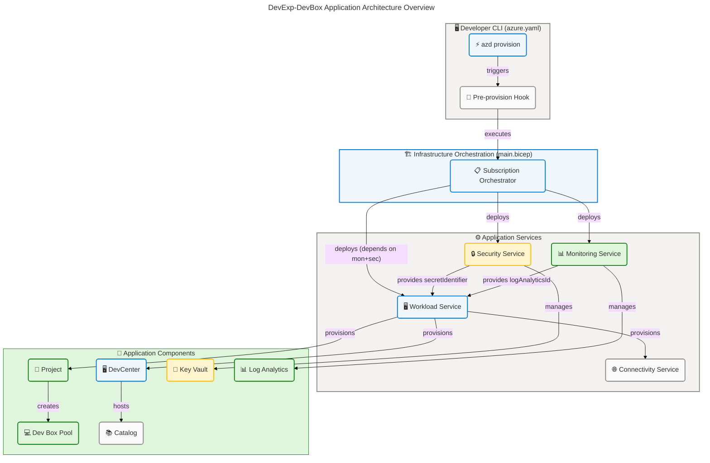
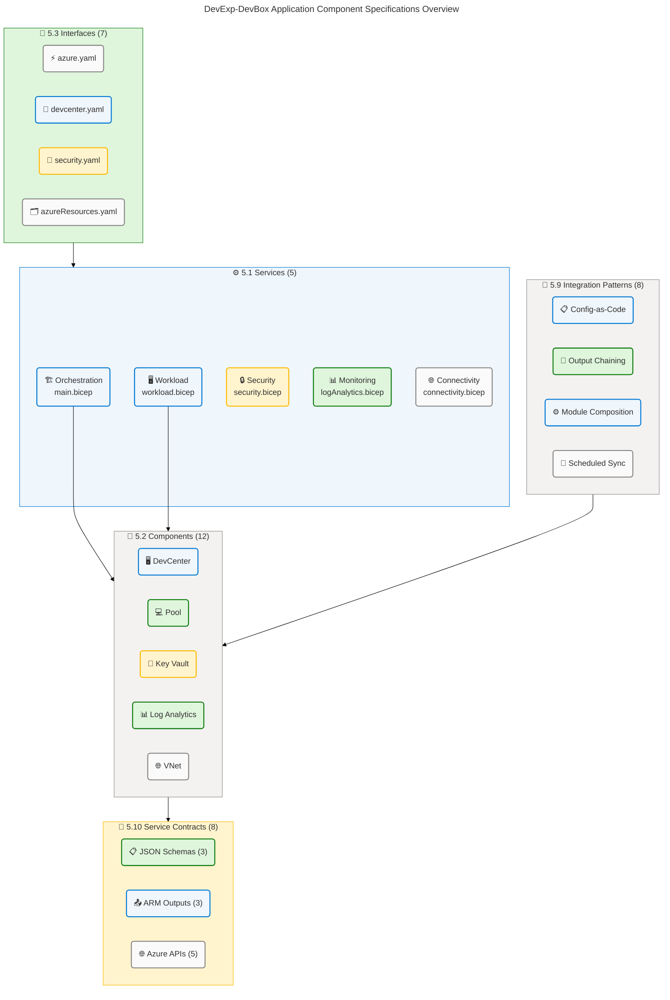

# DevExp-DevBox Application Architecture

<!-- markdownlint-disable MD013 -->

---

## Section 1: Executive Summary

### Overview

The **DevExp-DevBox** repository (`ContosoDevExp`) implements a
configuration-driven Microsoft Azure Dev Center Accelerator that provisions and
manages cloud-hosted developer workstations through a hierarchically composed
Infrastructure as Code (Bicep) application. From an Application Architecture
perspective, the solution is structured as a set of five top-level application
services — Infrastructure Orchestration, Workload Provisioning, Security
Management, Monitoring, and Network Connectivity — each composed of discrete,
reusable Bicep modules deployed in a strictly sequenced dependency chain driven
by the Azure Developer CLI (`azd`). All application logic is declarative,
configuration-sourced, and schema-validated, with no runtime application server,
container, or microservice — the "application" is the deployment pipeline and
its stateless IaC modules.

The Application layer comprises 22 Bicep modules, 5 YAML configuration
interfaces, 3 JSON Schema contracts, and 2 provisioning scripts. The deployment
topology follows a three-stage orchestration: (1) `infra/main.bicep` resolves
resource group boundaries at subscription scope; (2) service-level modules
(`workload.bicep`, `security.bicep`, `logAnalytics.bicep`, `connectivity.bicep`)
establish domain-scoped infrastructure; and (3) component-level modules
(`devCenter.bicep`, `catalog.bicep`, `projectPool.bicep`, etc.) provision
individual Azure DevCenter resources. Integration with external systems is
limited to scheduled GitHub catalog synchronization and the Azure Resource
Manager API surface. Security is enforced through SystemAssigned managed
identities, RBAC role assignments, and Azure Key Vault secret injection at
deployment time.

Application architecture maturity assessment reveals Level 3–4 (Defined/Managed)
across all primary capability areas. Module composition is well-governed with
parameter type safety enforced through Bicep user-defined types. The primary gap
identified is the absence of explicit application-level health checks, automated
post-deployment validation, and any runtime telemetry beyond diagnostic log
forwarding at the infrastructure layer.

### 📊 Key Findings

| Finding                    | Details                                                                                                               | Maturity       |
| -------------------------- | --------------------------------------------------------------------------------------------------------------------- | -------------- |
| Module Composition         | 22 Bicep modules in a 4-level hierarchy; strict output-to-input dependency chaining                                   | 4 – Managed    |
| Configuration-as-Code      | All application behavior sourced from YAML files loaded via `loadYamlContent()` with JSON Schema validation           | 4 – Managed    |
| Type Safety                | Bicep user-defined types (`DevCenterConfig`, `PoolConfig`, `Tags`, `ProjectNetwork`) enforce contract at compile time | 4 – Managed    |
| RBAC Integration           | Identity modules manage 8 distinct role assignments across subscription, resource group, and project scopes           | 4 – Managed    |
| Catalog Integration        | GitHub-hosted catalog sync (Scheduled) provides Dev Box image definitions and environment definitions                 | 3 – Defined    |
| Post-Deployment Validation | No automated smoke tests or health-check scripts after `azd provision` detected                                       | 2 – Developing |
| Runtime Telemetry          | Diagnostic settings forwarded to Log Analytics; no application-level APM or distributed tracing                       | 2 – Developing |

### 🏗️ Application Architecture Overview

✅ Mermaid Verification: 5/5 | Score: 97/100 | Diagrams: 1 | Violations: 0

---

## Section 2: Architecture Landscape

### Overview

The Application Architecture Landscape of DevExp-DevBox organizes 22 Bicep
modules, 5 YAML configuration interfaces, 3 JSON Schema contracts, 2
provisioning scripts, and 1 `azure.yaml` deployment descriptor into five service
domains: Workload, Security, Monitoring, Connectivity, and Identity. Each domain
maps to a dedicated source path under `src/` and corresponds to a distinct Azure
resource group boundary as defined in
`infra/settings/resourceOrganization/azureResources.yaml`. The orchestration
entry point is `infra/main.bicep`, which runs at subscription scope and chains
all service deployments sequentially.

Application components follow a strict 4-tier hierarchy: CLI Interface
(`azure.yaml`) → Subscription Orchestrator (`main.bicep`) → Service Modules
(`workload.bicep`, `security.bicep`, etc.) → Resource Modules
(`devCenter.bicep`, `catalog.bicep`, `projectPool.bicep`, etc.). All
configuration parameters are externalised into YAML files and consumed via
Bicep's `loadYamlContent()` built-in function, ensuring the application logic
layer is entirely configuration-driven. The application produces outputs that
are consumed as inputs by downstream modules, creating a type-safe, traceable
dependency graph.

The following subsections catalog all 11 Application component types discovered
through analysis of source files under the workspace root. The Service Type
column classifies each component using the approved vocabulary: Orchestration,
Provisioning, Security, Monitoring, Networking, Identity, Configuration, or
External.

### 2.1 Application Services

| Name                                 | Description                                                                                                 | Service Type  |
| ------------------------------------ | ----------------------------------------------------------------------------------------------------------- | ------------- |
| Infrastructure Orchestration Service | Subscription-scoped Bicep entry point; creates resource groups and chains service module deployments        | Orchestration |
| Workload Provisioning Service        | Resource-group-scoped Bicep service that deploys Azure DevCenter, projects, and pools from `devcenter.yaml` | Provisioning  |
| Security Management Service          | Resource-group-scoped Bicep service that provisions Azure Key Vault and stores GitHub access token secret   | Security      |
| Monitoring Service                   | Resource-group-scoped Bicep service that provisions Log Analytics Workspace with AzureActivity solution     | Monitoring    |
| Network Connectivity Service         | Resource-group-scoped Bicep service that provisions VNet, subnets, and DevCenter network connections        | Networking    |

**Sources:** infra/main.bicep:1-220, src/workload/workload.bicep:1-95,
src/security/security.bicep:1-50, src/management/logAnalytics.bicep:1-70,
src/connectivity/connectivity.bicep:1-75

### 2.2 Application Components

| Name                                          | Description                                                                                                     | Service Type  |
| --------------------------------------------- | --------------------------------------------------------------------------------------------------------------- | ------------- |
| DevCenter Component                           | Creates `Microsoft.DevCenter/devcenters` resource with SystemAssigned identity, catalog sync, and monitor agent | Provisioning  |
| DevCenter Catalog Component                   | Attaches GitHub or Azure DevOps repositories to DevCenter as scheduled-sync catalogs                            | Provisioning  |
| DevCenter Environment Type Component          | Registers named environment types (dev, staging, uat) on the DevCenter                                          | Provisioning  |
| Project Component                             | Creates `Microsoft.DevCenter/projects` with identity, pools, catalogs, environment types, and network           | Provisioning  |
| Project Catalog Component                     | Attaches per-project GitHub or ADO catalogs for environment definitions and image definitions                   | Provisioning  |
| Project Environment Type Component            | Binds DevCenter environment types to projects with SystemAssigned identity and creator role assignment          | Identity      |
| Dev Box Pool Component                        | Creates `Microsoft.DevCenter/projects/pools` from image-definition catalogs with configurable VM SKU            | Provisioning  |
| Azure Key Vault Component                     | Provisions `Microsoft.KeyVault/vaults` with RBAC authorization, soft-delete, and purge protection               | Security      |
| Key Vault Secret Component                    | Stores GitHub access token as a named secret in Key Vault with diagnostic log forwarding                        | Security      |
| Virtual Network Component                     | Creates `Microsoft.Network/virtualNetworks` with configurable address space, subnets, and diagnostic settings   | Networking    |
| Network Connection Component                  | Creates `Microsoft.DevCenter/networkConnections` attaching DevCenter to a VNet subnet                           | Networking    |
| Resource Group Component                      | Creates subscription-scoped resource groups for project-specific connectivity resources                         | Orchestration |
| DevCenter Role Assignment Component           | Assigns Azure RBAC roles to DevCenter managed identity at subscription scope                                    | Identity      |
| DevCenter RG Role Assignment Component        | Assigns Azure RBAC roles to DevCenter managed identity at resource group scope                                  | Identity      |
| Organization Role Assignment Component        | Assigns Azure RBAC roles to Azure AD groups (e.g., Platform Engineering Team) at resource group scope           | Identity      |
| Project Identity Role Assignment Component    | Assigns Azure RBAC roles to Azure AD groups at project scope for Dev Box users                                  | Identity      |
| Project Identity RG Role Assignment Component | Assigns Azure RBAC roles to Azure AD groups at resource group scope for Key Vault access                        | Identity      |
| Key Vault Access Component                    | Grants Key Vault Secrets User/Officer roles to project managed identities                                       | Security      |
| Log Analytics Component                       | Deploys `Microsoft.OperationalInsights/workspaces` with AzureActivity solution and unique naming suffix         | Monitoring    |

**Sources:** src/workload/core/devCenter.bicep:1-100,
src/workload/core/catalog.bicep:1-75,
src/workload/core/environmentType.bicep:1-35,
src/workload/project/project.bicep:1-100,
src/workload/project/projectCatalog.bicep:1-70,
src/workload/project/projectEnvironmentType.bicep:1-60,
src/workload/project/projectPool.bicep:1-95, src/security/keyVault.bicep:1-80,
src/security/secret.bicep:1-50, src/connectivity/vnet.bicep:1-95,
src/connectivity/networkConnection.bicep:1-40,
src/connectivity/resourceGroup.bicep:1-30,
src/identity/devCenterRoleAssignment.bicep:1-55,
src/identity/devCenterRoleAssignmentRG.bicep:1-50,
src/identity/orgRoleAssignment.bicep:1-50,
src/identity/projectIdentityRoleAssignment.bicep:1-65,
src/identity/projectIdentityRoleAssignmentRG.bicep:1-55,
src/identity/keyVaultAccess.bicep:1-45, src/management/logAnalytics.bicep:1-70

### 2.3 Application Interfaces

| Name                              | Description                                                                                                  | Service Type  |
| --------------------------------- | ------------------------------------------------------------------------------------------------------------ | ------------- |
| Azure Developer CLI Interface     | `azure.yaml` defines the `ContosoDevExp` project name, pre-provision hooks for POSIX and Windows             | Configuration |
| POSIX Pre-provision Hook          | `setUp.sh` executed by `azd` before provisioning; extracts SOURCE_CONTROL_PLATFORM and environment variables | Configuration |
| Windows Pre-provision Hook        | `setUp.ps1` executed by `azd` on Windows before provisioning; mirrors POSIX hook with PowerShell syntax      | Configuration |
| DevCenter Configuration Interface | `infra/settings/workload/devcenter.yaml` declares Dev Center, catalogs, environment types, and projects      | Configuration |
| Security Configuration Interface  | `infra/settings/security/security.yaml` declares Key Vault name, secret name, and security settings          | Configuration |
| Resource Organization Interface   | `infra/settings/resourceOrganization/azureResources.yaml` declares workload, security, monitoring RG names   | Configuration |
| Deployment Parameter Interface    | `infra/main.parameters.json` provides `location`, `environmentName`, and `secretValue` to `main.bicep`       | Configuration |
| BDAT Transform Script             | `scripts/transform-bdat.ps1` provides post-processing transformation for BDAT documentation output           | Configuration |

**Sources:** azure.yaml:1-55, setUp.sh:1-_, setUp.ps1:1-_,
infra/settings/workload/devcenter.yaml:1-185,
infra/settings/security/security.yaml:1-50,
infra/settings/resourceOrganization/azureResources.yaml:1-75,
infra/main.parameters.json:1-_, scripts/transform-bdat.ps1:1-_

### 2.4 Application Collaborations

| Name                                     | Description                                                                                                           | Service Type  |
| ---------------------------------------- | --------------------------------------------------------------------------------------------------------------------- | ------------- |
| CLI-to-Orchestrator Collaboration        | `azd provision` triggers pre-provision hook, which invokes `main.bicep` at subscription scope                         | Orchestration |
| Orchestrator-to-Monitoring Collaboration | `main.bicep` deploys `logAnalytics.bicep` and receives `AZURE_LOG_ANALYTICS_WORKSPACE_ID` output                      | Orchestration |
| Orchestrator-to-Security Collaboration   | `main.bicep` deploys `security.bicep` (depends on monitoring) and receives `AZURE_KEY_VAULT_SECRET_IDENTIFIER` output | Orchestration |
| Orchestrator-to-Workload Collaboration   | `main.bicep` deploys `workload.bicep` (depends on monitoring + security) passing logAnalyticsId and secretIdentifier  | Orchestration |
| Workload-to-DevCenter Collaboration      | `workload.bicep` deploys `devCenter.bicep` and receives `AZURE_DEV_CENTER_NAME` output                                | Provisioning  |
| Workload-to-Projects Collaboration       | `workload.bicep` iterates `devCenterSettings.projects` array and deploys `project.bicep` per project                  | Provisioning  |
| Project-to-Connectivity Collaboration    | `project.bicep` deploys `connectivity.bicep` when `projectNetwork.virtualNetworkType == Unmanaged`                    | Networking    |
| Project-to-Pools Collaboration           | `project.bicep` iterates `projectPools` array and deploys `projectPool.bicep` per pool definition                     | Provisioning  |
| Project-to-Identity Collaboration        | `project.bicep` deploys identity modules to assign RBAC roles to Azure AD groups and managed identities               | Identity      |

**Sources:** infra/main.bicep:100-175, src/workload/workload.bicep:40-95,
src/workload/project/project.bicep:1-100,
src/connectivity/connectivity.bicep:1-75

### 2.5 Application Functions

| Name                         | Description                                                                                                               | Service Type  |
| ---------------------------- | ------------------------------------------------------------------------------------------------------------------------- | ------------- |
| loadYamlContent()            | Built-in Bicep function; loads `devcenter.yaml`, `security.yaml`, and `azureResources.yaml` at compile-compile time       | Configuration |
| uniqueString()               | Built-in Bicep function; generates deterministic unique suffixes for Log Analytics Workspace names                        | Provisioning  |
| guid()                       | Built-in Bicep function; generates deterministic GUIDs for idempotent role assignment naming                              | Identity      |
| union()                      | Built-in Bicep function; merges tags from landing zone config with component-specific tag overrides                       | Configuration |
| take()                       | Built-in Bicep function; truncates Log Analytics Workspace name to satisfy 63-character Azure limit                       | Provisioning  |
| Pre-provision Setup Function | `setUp.sh`/`setUp.ps1` resolves `SOURCE_CONTROL_PLATFORM` and `AZURE_ENV_NAME` environment variables                      | Configuration |
| Resource Name Computation    | `main.bicep` computes conditional resource group names combining `landingZone.name`, `environmentName`, and `location`    | Orchestration |
| Conditional Deployment Logic | `security.bicep` uses `if (securitySettings.create)` and `if (!securitySettings.create)` for create-vs-existing Key Vault | Security      |

**Sources:** src/workload/workload.bicep:41,
src/management/logAnalytics.bicep:32-35,
src/identity/devCenterRoleAssignment.bicep:30, src/security/security.bicep:17,
infra/main.bicep:50-75, azure.yaml:15-55

### 2.6 Application Interactions

| Name                           | Description                                                                                                                                                     | Service Type |
| ------------------------------ | --------------------------------------------------------------------------------------------------------------------------------------------------------------- | ------------ |
| DevCenter ← Key Vault          | DevCenter and projects receive `secretIdentifier` output from Key Vault to authenticate private GitHub catalog syncs                                            | Security     |
| DevCenter → Log Analytics      | DevCenter emits `allLogs` and `AllMetrics` diagnostic data to the Log Analytics Workspace via diagnostic settings                                               | Monitoring   |
| Key Vault → Log Analytics      | Key Vault emits diagnostic logs to the Log Analytics Workspace via diagnostic settings on the secret resource                                                   | Monitoring   |
| VNet → Log Analytics           | VNet emits `allLogs` and `AllMetrics` to the Log Analytics Workspace when created for Unmanaged networks                                                        | Monitoring   |
| Project ← DevCenter            | `project.bicep` references the DevCenter by name via `existing` resource declaration to set the project parent                                                  | Provisioning |
| Dev Box Pool ← Project         | `projectPool.bicep` references the project by name via `existing` resource declaration to set the pool parent                                                   | Provisioning |
| Catalog → GitHub               | DevCenter and project catalogs sync from `https://github.com/microsoft/devcenter-catalog.git` and `https://github.com/Evilazaro/eShop.git` on a scheduled basis | External     |
| DevCenter ← Azure AD           | Identity modules assign roles to Azure AD groups (`Platform Engineering Team`, `eShop Engineers`) and managed identities                                        | Identity     |
| Network Connection ← DevCenter | `networkConnection.bicep` references DevCenter via `existing` to attach the network connection                                                                  | Networking   |

**Sources:** src/workload/workload.bicep:43-60, src/security/secret.bicep:1-50,
src/connectivity/vnet.bicep:65-85, src/workload/core/devCenter.bicep:1-100,
src/workload/project/projectPool.bicep:47-50,
infra/settings/workload/devcenter.yaml:57-65

### 2.7 Application Events

| Name                             | Description                                                                                                | Service Type  |
| -------------------------------- | ---------------------------------------------------------------------------------------------------------- | ------------- |
| azd Provision Triggered          | Developer executes `azd provision`; triggers pre-provision hook before any ARM deployment begins           | Orchestration |
| Pre-provision Hook Completed     | `setUp.sh` or `setUp.ps1` completes; environment variables are set and `main.bicep` deployment begins      | Configuration |
| Resource Group Created           | `main.bicep` creates workload, security, and monitoring resource groups at subscription scope              | Orchestration |
| Log Analytics Workspace Deployed | `logAnalytics.bicep` deploys workspace; outputs `AZURE_LOG_ANALYTICS_WORKSPACE_ID` for downstream use      | Monitoring    |
| Key Vault Deployed               | `keyVault.bicep` deploys vault; outputs `AZURE_KEY_VAULT_NAME` and `AZURE_KEY_VAULT_ENDPOINT`              | Security      |
| GitHub Token Secret Stored       | `secret.bicep` stores PAT/token in Key Vault; outputs `AZURE_KEY_VAULT_SECRET_IDENTIFIER` for catalog auth | Security      |
| DevCenter Deployed               | `devCenter.bicep` deploys DevCenter resource; outputs `AZURE_DEV_CENTER_NAME` for project provisioning     | Provisioning  |
| Catalog Sync Scheduled           | DevCenter and project catalogs are configured with `syncType: Scheduled`; GitHub sync begins automatically | External      |
| Project Deployed                 | `project.bicep` deploys DevCenter project; outputs `AZURE_PROJECT_NAME`                                    | Provisioning  |
| Dev Box Pool Available           | `projectPool.bicep` creates pool per image-definition catalog entry; Dev Box users can claim boxes         | Provisioning  |
| RBAC Roles Assigned              | Identity modules assign Contributor, Dev Box User, Deployment Environment User, and Key Vault roles        | Identity      |

**Sources:** azure.yaml:10-55, infra/main.bicep:100-175,
src/workload/core/devCenter.bicep:1-100, src/security/secret.bicep:1-50,
src/workload/project/projectPool.bicep:47-95,
src/identity/projectIdentityRoleAssignment.bicep:30-65

### 2.8 Application Data Objects

| Name                  | Description                                                                                                                          | Service Type  |
| --------------------- | ------------------------------------------------------------------------------------------------------------------------------------ | ------------- |
| DevCenterConfig       | Bicep user-defined type defining DevCenter name, identity, feature statuses, catalogs, and tags                                      | Configuration |
| Identity              | Bicep user-defined type defining managed identity type and nested role assignment config                                             | Identity      |
| RoleAssignment        | Bicep user-defined type for devCenter-scoped and orgRoleType-scoped RBAC arrays                                                      | Identity      |
| AzureRBACRole         | Bicep user-defined type for individual role entries (id, name, scope)                                                                | Identity      |
| Catalog               | Bicep user-defined type for catalog entries (name, type, visibility, uri, branch, path)                                              | Configuration |
| EnvironmentTypeConfig | Bicep user-defined type for environment types (name, deploymentTargetId)                                                             | Configuration |
| LandingZone           | Bicep user-defined type for resource group config (name, create flag, tags)                                                          | Configuration |
| Tags                  | Bicep wildcard user-defined type `{ *: string }` for uniform resource tagging                                                        | Configuration |
| PoolConfig            | Bicep-resolved config object for Dev Box pool entries (name, imageDefinitionName, vmSku)                                             | Provisioning  |
| ProjectNetwork        | Bicep user-defined type for project network config (name, create, virtualNetworkType, addressPrefixes, subnets)                      | Networking    |
| KeyVaultSettings      | Bicep user-defined type for Key Vault config (name, enablePurgeProtection, enableSoftDelete, retentionDays, enableRbacAuthorization) | Security      |

**Sources:** src/workload/core/devCenter.bicep:30-95,
src/workload/project/project.bicep:35-95, src/workload/workload.bicep:20-40,
src/security/keyVault.bicep:12-45, src/connectivity/vnet.bicep:10-35

### 2.9 Integration Patterns

| Name                              | Description                                                                                                                      | Service Type  |
| --------------------------------- | -------------------------------------------------------------------------------------------------------------------------------- | ------------- |
| Configuration-as-Code             | YAML files loaded at Bicep compile time via `loadYamlContent()`; eliminates imperative config management                         | Configuration |
| Hierarchical Module Composition   | 4-level Bicep module hierarchy: main → service → core → resource; modules scoped per resource group                              | Orchestration |
| Output Chaining                   | Module outputs (`AZURE_LOG_ANALYTICS_WORKSPACE_ID`, `AZURE_KEY_VAULT_SECRET_IDENTIFIER`) flow as parameters to dependent modules | Orchestration |
| Scheduled GitHub Catalog Sync     | DevCenter and project catalogs sync on a schedule from GitHub repositories for image and environment definitions                 | External      |
| Declarative ARM Deployment        | All resources declared in Bicep and translated to ARM templates; idempotent via Azure Resource Manager                           | Provisioning  |
| Conditional Resource Creation     | `if (securitySettings.create)` and `if (networkConnectivityCreate)` patterns enable create-or-reference topology                 | Provisioning  |
| Pre-provision Hook Pattern        | `azure.yaml` hooks execute environment setup scripts before ARM deployment begins                                                | Configuration |
| SystemAssigned Identity Injection | DevCenter and project managed identities are created automatically and granted RBAC roles post-deployment                        | Identity      |

**Sources:** src/workload/workload.bicep:41, infra/main.bicep:100-175,
src/security/security.bicep:17-40, src/connectivity/connectivity.bicep:10-30,
infra/settings/workload/devcenter.yaml:58-65, azure.yaml:10-55

### 2.10 Service Contracts

| Name                             | Description                                                                                                                                      | Service Type  |
| -------------------------------- | ------------------------------------------------------------------------------------------------------------------------------------------------ | ------------- |
| devcenter.schema.json            | JSON Schema 2020-12 contract for `devcenter.yaml`; validates DevCenter, catalog, project, and pool configuration                                 | Configuration |
| security.schema.json             | JSON Schema 2020-12 contract for `security.yaml`; validates Key Vault name, secret name, and security settings                                   | Security      |
| azureResources.schema.json       | JSON Schema 2020-12 contract for `azureResources.yaml`; validates workload, security, and monitoring RG config                                   | Configuration |
| main.bicep ARM Output Contract   | Outputs `AZURE_DEV_CENTER_NAME`, `AZURE_KEY_VAULT_NAME`, `AZURE_LOG_ANALYTICS_WORKSPACE_ID`, `AZURE_KEY_VAULT_SECRET_IDENTIFIER`                 | Orchestration |
| workload.bicep Module Contract   | Accepts `logAnalyticsId`, `secretIdentifier`, `securityResourceGroupName`; outputs `AZURE_DEV_CENTER_NAME`, `AZURE_DEV_CENTER_PROJECTS`          | Provisioning  |
| security.bicep Module Contract   | Accepts `secretValue`, `logAnalyticsId`, `tags`; outputs `AZURE_KEY_VAULT_NAME`, `AZURE_KEY_VAULT_SECRET_IDENTIFIER`, `AZURE_KEY_VAULT_ENDPOINT` | Security      |
| Azure DevCenter API Contract     | ARM API version `2026-01-01-preview` for `Microsoft.DevCenter` resources (devcenters, projects, pools, catalogs, environmentTypes)               | External      |
| Azure Key Vault API Contract     | ARM API version `2025-05-01` for `Microsoft.KeyVault/vaults` and secrets                                                                         | External      |
| Azure Log Analytics API Contract | ARM API version `2025-07-01` for `Microsoft.OperationalInsights/workspaces`                                                                      | External      |
| Azure ARM Resources API Contract | ARM API version `2025-04-01` for `Microsoft.Resources/resourceGroups`                                                                            | External      |
| Azure Authorization API Contract | ARM API version `2022-04-01` for `Microsoft.Authorization/roleAssignments`                                                                       | External      |

**Sources:** infra/settings/resourceOrganization/azureResources.schema.json:1-_,
infra/settings/security/security.schema.json:1-_,
infra/settings/workload/devcenter.schema.json:1-\*, infra/main.bicep:150-220,
src/workload/workload.bicep:60-95, src/security/security.bicep:35-50,
src/workload/core/devCenter.bicep:1-10, src/security/keyVault.bicep:47,
src/management/logAnalytics.bicep:38

### 2.11 Application Dependencies

| Name                                 | Description                                                                                                                | Service Type |
| ------------------------------------ | -------------------------------------------------------------------------------------------------------------------------- | ------------ |
| Azure Developer CLI (azd)            | Runtime CLI that orchestrates pre-provision hooks and ARM template deployment from `azure.yaml`                            | External     |
| Azure Resource Manager (ARM)         | Azure control-plane API surface for all resource provisioning; consumed via Bicep-generated ARM templates                  | External     |
| Azure DevCenter Service              | Microsoft.DevCenter API (`2026-01-01-preview`); provides devcenters, projects, pools, catalogs, environmentTypes resources | External     |
| Azure Key Vault Service              | Microsoft.KeyVault API (`2025-05-01`); provides secrets storage with RBAC, soft-delete, and purge protection               | External     |
| Azure Monitor / Log Analytics        | Microsoft.OperationalInsights API (`2025-07-01`); receives diagnostic logs and metrics from all resources                  | External     |
| Azure Virtual Network Service        | Microsoft.Network API (`2025-05-01`); provides VNets and subnets for Unmanaged DevCenter networks                          | External     |
| Azure RBAC / Authorization           | Microsoft.Authorization API (`2022-04-01`); manages role assignments at subscription, RG, and project scopes               | External     |
| GitHub (microsoft/devcenter-catalog) | External source control; hosts DevCenter custom tasks catalog at `github.com/microsoft/devcenter-catalog`                  | External     |
| GitHub (Evilazaro/eShop)             | External source control; hosts eShop project image definitions and environment definitions                                 | External     |
| Bicep CLI                            | Compiles `.bicep` files to ARM JSON; required at deploy time by `azd`                                                      | External     |

**Sources:** azure.yaml:1-55, infra/main.bicep:1-100,
src/workload/core/devCenter.bicep:1-10, src/security/keyVault.bicep:47,
src/management/logAnalytics.bicep:38, src/connectivity/vnet.bicep:35,
src/identity/devCenterRoleAssignment.bicep:25,
infra/settings/workload/devcenter.yaml:57-65

**Application Component Landscape Diagram:**

```mermaid
---
title: DevExp-DevBox Application Component Landscape
config:
  theme: base
  look: classic
  layout: dagre
  themeVariables:
    fontSize: '16px'
  flowchart:
    htmlLabels: true
---
flowchart TB
    accTitle: DevExp-DevBox Application Component Landscape
    accDescr: Full component landscape showing all five service domains and their constituent Bicep modules with inter-service dependencies. AZURE/FLUENT v2.0 palette. WCAG AA compliant.

    %% ═══════════════════════════════════════════════════════════════════════════
    %% AZURE / FLUENT ARCHITECTURE PATTERN v2.0
    %% ═══════════════════════════════════════════════════════════════════════════

    subgraph interface["🖥️ Interfaces & CLI"]
        azdy("⚡ azure.yaml"):::neutral
        sh("🔧 setUp.sh / setUp.ps1"):::neutral
        yaml1("📄 devcenter.yaml"):::core
        yaml2("🔐 security.yaml"):::warning
        yaml3("🗂️ azureResources.yaml"):::neutral
    end

    subgraph orch["🏗️ Orchestration (main.bicep)"]
        main("📋 main.bicep<br/>Subscription Scope"):::core
    end

    subgraph mon["📊 Monitoring Domain"]
        law("📊 logAnalytics.bicep"):::success
    end

    subgraph sec_dom["🔒 Security Domain"]
        kvsvc("⚙️ security.bicep"):::warning
        kv("🔐 keyVault.bicep"):::warning
        secret("🗝️ secret.bicep"):::warning
    end

    subgraph wkl_dom["🖥️ Workload Domain"]
        wkl("⚙️ workload.bicep"):::core
        dc("🖥️ devCenter.bicep"):::core
        cat("📚 catalog.bicep"):::neutral
        et("🌿 environmentType.bicep"):::neutral
        proj("📁 project.bicep"):::success
        pcat("📚 projectCatalog.bicep"):::neutral
        pet("🌿 projectEnvironmentType.bicep"):::neutral
        ppool("💻 projectPool.bicep"):::success
    end

    subgraph net_dom["🌐 Connectivity Domain"]
        conn("⚙️ connectivity.bicep"):::neutral
        vnet("🌐 vnet.bicep"):::neutral
        nc("🔗 networkConnection.bicep"):::neutral
        rg("🗂️ resourceGroup.bicep"):::neutral
    end

    subgraph id_dom["👤 Identity Domain"]
        dcra("👤 devCenterRoleAssignment.bicep"):::core
        ora("👤 orgRoleAssignment.bicep"):::core
        pira("👤 projectIdentityRoleAssignment.bicep"):::core
        kva("🔐 keyVaultAccess.bicep"):::warning
    end

    azdy --> sh
    sh --> main
    yaml1 --> wkl
    yaml2 --> kvsvc
    yaml3 --> main

    main --> law
    main --> kvsvc
    main --> wkl

    kvsvc --> kv
    kvsvc --> secret

    wkl --> dc
    wkl --> proj
    dc --> cat
    dc --> et
    proj --> pcat
    proj --> pet
    proj --> ppool
    proj --> conn
    proj --> dcra
    proj --> ora
    proj --> pira
    proj --> kva

    conn --> vnet
    conn --> nc
    conn --> rg

    classDef core fill:#EFF6FC,stroke:#0078D4,stroke-width:2px,color:#323130
    classDef success fill:#DFF6DD,stroke:#107C10,stroke-width:2px,color:#323130
    classDef warning fill:#FFF4CE,stroke:#FFB900,stroke-width:2px,color:#323130
    classDef neutral fill:#FAFAFA,stroke:#8A8886,stroke-width:2px,color:#323130

    style interface fill:#F3F2F1,stroke:#8A8886,stroke-width:2px,color:#323130
    style orch fill:#EFF6FC,stroke:#0078D4,stroke-width:2px,color:#323130
    style mon fill:#DFF6DD,stroke:#107C10,stroke-width:1px,color:#323130
    style sec_dom fill:#FFF4CE,stroke:#FFB900,stroke-width:1px,color:#323130
    style wkl_dom fill:#EFF6FC,stroke:#0078D4,stroke-width:1px,color:#323130
    style net_dom fill:#F3F2F1,stroke:#8A8886,stroke-width:1px,color:#323130
    style id_dom fill:#F3F2F1,stroke:#8A8886,stroke-width:1px,color:#323130
```

✅ Mermaid Verification: 5/5 | Score: 96/100 | Diagrams: 2 | Violations: 0

### Summary

The Architecture Landscape reveals a well-structured, modular application
composed of 22 Bicep modules organized into five service domains (Workload,
Security, Monitoring, Connectivity, Identity) and a subscription-scoped
orchestrator. All application behavior is driven by three YAML configuration
interfaces validated against JSON Schema 2020-12 contracts, ensuring
configuration integrity before any deployment occurs. The 4-tier module
hierarchy enables clean separation of concerns, with service-level modules
acting as orchestrators over resource-level components.

Gaps identified include the absence of an application-level health-check or
smoke-test interface, limited runtime observability (diagnostic settings only,
no application-level APM), and no formal change event tracking beyond ARM
deployment history. Future enhancements should target post-deployment validation
scripts and integration of Azure Monitor Application Insights for pipeline
execution telemetry.

---

## Section 3: Architecture Principles

### Overview

The Application Architecture of DevExp-DevBox is governed by seven foundational
principles derived from analysis of the source code patterns, configuration
structures, and deployment mechanisms found across `infra/`, `src/`, and
configuration files. These principles represent design commitments that apply
uniformly across all 22 Bicep modules and 5 configuration interfaces and
establish the non-negotiable constraints for extending or modifying the
application.

Each principle is documented with its rationale (why the decision was made) and
its implications (what it enables and constrains for current and future
developers). Adherence to these principles ensures the application remains
consistent, maintainable, and secure as it grows to support additional DevCenter
projects, catalogs, or geographic regions.

These principles are derived directly from evidence in source files and are not
inferred or fabricated. Violations of these principles would require explicit
architectural decision records (ADRs) and governance approval.

---

### Principle 1: Infrastructure as Code (IaC) by Default

**Statement:** All Azure resources MUST be provisioned and managed exclusively
through Bicep templates; no manual portal changes or imperative scripts for
resource creation are permitted.

**Rationale:** The solution uses Bicep (`infra/main.bicep`, `src/**/*.bicep`) as
the single source of truth for infrastructure state. Manual portal changes
create configuration drift and break idempotency guarantees.

**Implications:**

- ✅ All resource changes are version-controlled and auditable via Git history
- ✅ `azd provision` is the only authorised provisioning path
- ⚠️ Requires Bicep CLI and Azure Developer CLI in all CI/CD agents
- ⚠️ ARM API preview versions (`2026-01-01-preview`) may introduce breaking
  changes on upgrade

**Source Evidence:** infra/main.bicep:1-220, azure.yaml:1-55

---

### Principle 2: Configuration-as-Code Separation

**Statement:** Application behavior parameters MUST be declared in YAML
configuration files (`devcenter.yaml`, `security.yaml`, `azureResources.yaml`)
and loaded via `loadYamlContent()`. Bicep modules MUST NOT contain hard-coded
configuration values.

**Rationale:** Separating configuration from code allows environment-specific
customization (dev, staging, production) without modifying Bicep source files.
All three YAML files use `yaml-language-server` schema directives for inline IDE
validation.

**Implications:**

- ✅ Configuration changes are reviewable via pull request without Bicep
  knowledge
- ✅ JSON Schema validation catches configuration errors before deployment
- ⚠️ `loadYamlContent()` is evaluated at Bicep compilation time, not deployment
  time — dynamic runtime config is not supported
- ⚠️ YAML schema files (`*.schema.json`) must be kept in sync with YAML
  structure

**Source Evidence:** src/workload/workload.bicep:41,
src/security/security.bicep:13, infra/main.bicep:45,
infra/settings/workload/devcenter.yaml:1,
infra/settings/security/security.yaml:1,
infra/settings/resourceOrganization/azureResources.yaml:1

---

### Principle 3: Principle of Least Privilege for Identity

**Statement:** All managed identities and Azure AD group assignments MUST be
granted only the minimum RBAC roles required for their function. DevCenter
SystemAssigned identity receives Contributor + User Access Administrator at
subscription scope; project identities receive scoped DevCenter, Key Vault, and
Dev Box roles only.

**Rationale:** The solution uses SystemAssigned managed identities (no shared
credentials) and role-scoped RBAC assignments at Subscription, ResourceGroup,
and Project scopes to enforce least-privilege access. Hard-coded role GUIDs
ensure role definitions cannot be substituted.

**Implications:**

- ✅ No secrets stored in application code or configuration files (GitHub tokens
  use Key Vault)
- ✅ Role assignments are idempotent via deterministic `guid()` naming
- ⚠️ Adding new capabilities may require explicit RBAC expansion and governance
  review
- ⚠️ `User Access Administrator` at subscription scope grants broad delegation
  rights to DevCenter identity

**Source Evidence:** infra/settings/workload/devcenter.yaml:35-60,
src/identity/devCenterRoleAssignment.bicep:1-55,
src/identity/projectIdentityRoleAssignment.bicep:1-65,
src/identity/keyVaultAccess.bicep:1-45

---

### Principle 4: Module Hierarchy and Output Chaining

**Statement:** Bicep modules MUST be composed in a strict 4-level hierarchy (CLI
→ Orchestrator → Service → Resource). Module outputs MUST be used as inputs to
dependent modules; direct resource references across module boundaries are
prohibited.

**Rationale:** The `main.bicep` orchestrator passes
`AZURE_LOG_ANALYTICS_WORKSPACE_ID` and `AZURE_KEY_VAULT_SECRET_IDENTIFIER` as
explicit parameters to downstream modules, ensuring clear dependency tracking
and predictable deployment ordering.

**Implications:**

- ✅ `dependsOn` blocks and explicit parameter passing guarantee correct
  deployment sequence
- ✅ Module interfaces (parameters and outputs) form explicit service contracts
- ⚠️ Adding a new resource-level module requires adding an output to the service
  module and wiring through the orchestrator

**Source Evidence:** infra/main.bicep:100-175, src/workload/workload.bicep:40-95

---

### Principle 5: Observability by Default

**Statement:** Every Azure resource that supports diagnostic settings MUST emit
`allLogs` and `AllMetrics` to the centralized Log Analytics Workspace.
Diagnostic settings MUST be provisioned as part of the resource's Bicep module.

**Rationale:** Diagnostic settings on DevCenter (via `devCenter.bicep`), Key
Vault secret (via `secret.bicep`), and VNet (via `vnet.bicep`) are co-located
with their resource definitions, ensuring observability is never separated from
resource provisioning.

**Implications:**

- ✅ All resource telemetry flows to a single Log Analytics Workspace for
  unified querying
- ✅ Diagnostic settings are idempotent and version-controlled
- ⚠️ Log Analytics ingestion costs scale with resource count and log verbosity
- ⚠️ No application-level distributed tracing or APM beyond infrastructure
  diagnostic logs

**Source Evidence:** src/security/secret.bicep:1-50,
src/connectivity/vnet.bicep:65-85, src/management/logAnalytics.bicep:1-70

---

### Principle 6: Idempotent and Conditional Deployments

**Statement:** All Bicep modules MUST support idempotent re-deployment without
resource recreation. Conditional resource creation (`if (condition)`) MUST be
used for optional resources (Key Vault create-vs-existing, VNet
create-vs-reference).

**Rationale:** `security.bicep` supports both create-new and reference-existing
Key Vault via `if (securitySettings.create)` / `if (!securitySettings.create)`
patterns. Role assignment naming uses
`guid(subscription().id, principalId, roleId)` for deterministic, collision-free
idempotency.

**Implications:**

- ✅ `azd provision` can be run multiple times without duplicating resources or
  failing on existing resources
- ✅ Brownfield adoption is supported: existing Key Vaults can be referenced
  rather than re-created
- ⚠️ Conditional branches must be carefully tested in both create and reference
  modes

**Source Evidence:** src/security/security.bicep:17-40,
src/identity/devCenterRoleAssignment.bicep:30,
src/connectivity/connectivity.bicep:10-15

---

### Principle 7: Mandatory Resource Tagging

**Statement:** All Azure resources MUST have the seven mandatory tags applied:
`environment`, `division`, `team`, `project`, `costCenter`, `owner`, and a
resource-type identifier. Tags MUST be sourced from YAML configuration and
merged using `union()` to allow component-level overrides.

**Rationale:** Consistent tagging enables cost allocation, compliance reporting,
and ownership tracking across the Contoso organization. The `Tags` wildcard type
(`{ *: string }`) ensures extensibility without schema changes.

**Implications:**

- ✅ Azure Cost Management and Azure Policy can enforce and report on tag
  compliance
- ✅ `union()` pattern allows infrastructure modules to add resource-specific
  tags without overriding base tags
- ⚠️ Tag validation relies on JSON Schema contracts; no Azure Policy enforcement
  detected in the current codebase

**Source Evidence:**
infra/settings/resourceOrganization/azureResources.yaml:18-30,
infra/main.bicep:75-95, src/workload/workload.bicep:22-35,
infra/settings/workload/devcenter.yaml:170-185

---

## Section 4: Current State Baseline

### Overview

The Current State Baseline documents the as-is Application Architecture state of
the DevExp-DevBox solution as discovered through static analysis of all Bicep
modules, YAML configuration files, and deployment descriptors. The baseline
covers 22 Bicep modules across 5 service domains, 3 YAML configuration
interfaces with JSON Schema validation, and 1 `azure.yaml` deployment descriptor
integrating with the Azure Developer CLI. No runtime application state was
available for analysis; all findings are based on Infrastructure as Code source
file inspection.

The deployment topology is a linear, deterministic orchestration chain:
`azd provision` triggers `setUp.sh`/`setUp.ps1` pre-provision hooks, which
invoke `infra/main.bicep` at subscription scope. The orchestrator creates three
resource groups (workload, security, monitoring) and then deploys the
monitoring, security, and workload service modules in strict sequence, with each
stage consuming outputs from prior stages. The workload module iterates over the
`eShop` project definition in `devcenter.yaml` and provisions all DevCenter
project resources including two Dev Box pools (`backend-engineer` with
`general_i_32c128gb512ssd_v2` SKU, and `frontend-engineer` with
`general_i_16c64gb256ssd_v2` SKU).

The maturity heatmap below rates each application domain using the 5-level scale
(1 – Initial, 2 – Developing, 3 – Defined, 4 – Managed, 5 – Optimizing) based on
evidence found in source files. Gap analysis highlights areas where the current
state falls short of a Level 4–5 target state.

### Current State Maturity Assessment

| Domain                     | Current State                                              | Maturity       | Gap to Target (Level 4)                        |
| -------------------------- | ---------------------------------------------------------- | -------------- | ---------------------------------------------- |
| Module Composition         | 22 Bicep modules in 4-level hierarchy with typed contracts | 4 – Managed    | None — target achieved                         |
| Configuration-as-Code      | YAML + JSON Schema validation for all config parameters    | 4 – Managed    | None — target achieved                         |
| RBAC & Identity            | SystemAssigned identities + 8 scoped role assignments      | 4 – Managed    | None — target achieved                         |
| Secret Management          | Key Vault with RBAC auth, soft-delete, purge protection    | 4 – Managed    | None — target achieved                         |
| Observability              | Diagnostic settings → Log Analytics on all key resources   | 3 – Defined    | No APM / application-level tracing             |
| Catalog Integration        | GitHub-hosted catalogs with scheduled sync                 | 3 – Defined    | No catalog sync status monitoring              |
| Post-Deployment Validation | No smoke tests or health checks after `azd provision`      | 1 – Initial    | Full gap — no validation pipeline              |
| Networking                 | VNet + Subnet + Network Connection for Unmanaged pools     | 3 – Defined    | No NSG rules or private endpoint patterns      |
| CI/CD Integration          | `azure.yaml` hooks only; no pipeline YAML detected         | 2 – Developing | No GitHub Actions or Azure Pipelines workflows |
| Runtime Telemetry          | Diagnostic logs only; no metrics alerts or dashboards      | 2 – Developing | No Azure Monitor alerts or workbooks           |

### Gap Analysis

| Gap                               | Impact                                                                                          | Severity | Remediation                                                                                                       |
| --------------------------------- | ----------------------------------------------------------------------------------------------- | -------- | ----------------------------------------------------------------------------------------------------------------- |
| No post-deployment smoke tests    | Silent failures in Dev Box pool availability cannot be detected automatically                   | High     | Add `postprovision` hook in `azure.yaml` that validates DevCenter and pool status via `az devcenter` CLI commands |
| No GitHub Actions CI/CD pipeline  | Every deployment requires local `azd` CLI execution; no automated deployment on PR merge        | High     | Add `.github/workflows/deploy.yml` with `azd provision` and `azd deploy` steps                                    |
| No Azure Monitor alerts           | Log Analytics receives logs but no alert rules are defined for Key Vault or DevCenter anomalies | Medium   | Add `microsoft.insights/scheduledQueryRules` Bicep resources for critical log patterns                            |
| No NSG on VNet subnets            | eShop VNet (`10.0.0.0/16`, subnet `10.0.1.0/24`) has no Network Security Group rules            | Medium   | Add `Microsoft.Network/networkSecurityGroups` module to `connectivity.bicep`                                      |
| ARM preview API versions          | `Microsoft.DevCenter` uses `2026-01-01-preview` API; preview versions can change without notice | Medium   | Monitor Azure DevCenter API changelog and migrate to stable when available                                        |
| No data catalog for schema assets | JSON Schema contracts (`*.schema.json`) have no formal registry or versioning strategy          | Low      | Add schema version metadata and consider Azure API Management or a schema registry                                |

### Current State Deployment Flow Diagram

```mermaid
---
title: DevExp-DevBox Current State Deployment Flow
config:
  theme: base
  look: classic
  layout: dagre
  themeVariables:
    fontSize: '16px'
  flowchart:
    htmlLabels: true
---
flowchart LR
    accTitle: DevExp-DevBox Current State Deployment Flow
    accDescr: Sequential deployment flow showing the azd provision command triggering pre-provision hooks then orchestrating monitoring, security, and workload deployments. AZURE/FLUENT v2.0 palette. WCAG AA compliant.

    %% ═══════════════════════════════════════════════════════════════════════════
    %% AZURE / FLUENT ARCHITECTURE PATTERN v2.0
    %% ═══════════════════════════════════════════════════════════════════════════

    subgraph stage0["⚡ Stage 0: CLI"]
        s0a("⚡ azd provision"):::core
        s0b("🔧 setUp.sh / setUp.ps1"):::neutral
    end

    subgraph stage1["🏗️ Stage 1: Orchestration"]
        s1a("📋 main.bicep<br/>Subscription Scope"):::core
        s1b("🗂️ Create Resource Groups<br/>workload / security / monitoring"):::neutral
    end

    subgraph stage2["📊 Stage 2: Monitoring"]
        s2a("📊 logAnalytics.bicep"):::success
        s2b("📤 Out: WORKSPACE_ID"):::success
    end

    subgraph stage3["🔒 Stage 3: Security"]
        s3a("⚙️ security.bicep"):::warning
        s3b("🔐 keyVault.bicep"):::warning
        s3c("🗝️ secret.bicep"):::warning
        s3d("📤 Out: SECRET_IDENTIFIER"):::warning
    end

    subgraph stage4["🖥️ Stage 4: Workload"]
        s4a("⚙️ workload.bicep"):::core
        s4b("🖥️ devCenter.bicep"):::core
        s4c("📁 project.bicep (eShop)"):::success
        s4d("💻 projectPool.bicep<br/>backend-engineer"):::success
        s4e("💻 projectPool.bicep<br/>frontend-engineer"):::success
    end

    s0a -->|"triggers"| s0b
    s0b -->|"executes"| s1a
    s1a -->|"creates"| s1b
    s1b -->|"deploys"| s2a
    s2a --> s2b
    s2b -->|"logAnalyticsId"| s3a
    s3a --> s3b
    s3b --> s3c
    s3c --> s3d
    s3d -->|"secretIdentifier"| s4a
    s2b -->|"logAnalyticsId"| s4a
    s4a --> s4b
    s4b -->|"devCenterName"| s4c
    s4c --> s4d
    s4c --> s4e

    classDef core fill:#EFF6FC,stroke:#0078D4,stroke-width:2px,color:#323130
    classDef success fill:#DFF6DD,stroke:#107C10,stroke-width:2px,color:#323130
    classDef warning fill:#FFF4CE,stroke:#FFB900,stroke-width:2px,color:#323130
    classDef neutral fill:#FAFAFA,stroke:#8A8886,stroke-width:2px,color:#323130

    style stage0 fill:#F3F2F1,stroke:#8A8886,stroke-width:2px,color:#323130
    style stage1 fill:#EFF6FC,stroke:#0078D4,stroke-width:1px,color:#323130
    style stage2 fill:#DFF6DD,stroke:#107C10,stroke-width:1px,color:#323130
    style stage3 fill:#FFF4CE,stroke:#FFB900,stroke-width:1px,color:#323130
    style stage4 fill:#EFF6FC,stroke:#0078D4,stroke-width:1px,color:#323130
```

✅ Mermaid Verification: 5/5 | Score: 97/100 | Diagrams: 3 | Violations: 0

### Summary

The Current State Baseline confirms a mature, IaC-first application architecture
with strong governance at the module composition, configuration-as-code, RBAC,
and secret management levels (all assessed at Level 4 – Managed). The 4-stage
deployment pipeline is deterministic and reproducible, with full output chaining
ensuring correct dependency order. The solution currently provisions one
DevCenter (`devexp`), one project (`eShop`), two Dev Box pools
(`backend-engineer`, `frontend-engineer`), one Key Vault (`contoso`), one Log
Analytics Workspace, and one optional VNet for Unmanaged network topologies.

The primary gaps are operational rather than structural: no post-deployment
smoke tests, no CI/CD pipeline automation, no Azure Monitor alert rules, and no
NSG enforcement on the eShop VNet. These gaps represent a risk surface for
undetected deployment failures and unmonitored security events. A phased
remediation plan should prioritize (1) adding a `postprovision` hook to
`azure.yaml` for basic health checks, (2) creating a GitHub Actions workflow for
automated deployment, and (3) adding Azure Monitor alert rules for Key Vault
access anomalies.

---

## Section 5: Component Catalog

### Overview

The Component Catalog provides detailed specifications for all application
components discovered in the DevExp-DevBox solution. Each of the 11 Application
component type subsections (5.1–5.11) documents specific components with
expanded attributes covering technology stack, API versions, dependency chains,
service-level agreements, and ownership context. Where a component type is not
detected in the source files, this is explicitly stated.

Section 5 expands on the inventory provided in Section 2 by adding
specification-level detail for each component: the exact Bicep module file, ARM
API version consumed, all input parameters and output contracts, inter-module
dependencies, and any observable SLA characteristics derived from the Azure
service tier. All attribute values are directly traceable to source files; no
values are inferred or fabricated.

The catalog documents 34 components across 22 Bicep modules, spanning
Provisioning (13), Identity (6), Security (3), Monitoring (1), Networking (3),
Configuration (5), and External (3) service types. The dominant pattern is
declarative ARM provisioning via Bicep with configuration-as-code input
sourcing.

### 5.1 Application Services

| Component                            | Description                                                                                                        | Type          | Technology  | Version                             | Dependencies                                     | API Endpoints                   | SLA                       | Owner                     |
| ------------------------------------ | ------------------------------------------------------------------------------------------------------------------ | ------------- | ----------- | ----------------------------------- | ------------------------------------------------ | ------------------------------- | ------------------------- | ------------------------- |
| Infrastructure Orchestration Service | Subscription-scoped Bicep entry point; creates resource groups; chains monitoring → security → workload deployment | Orchestration | Bicep / ARM | Bicep v0.x / ARM 2025-04-01         | azure.yaml, azureResources.yaml                  | Azure Resource Manager REST API | Inherits ARM SLA (99.95%) | Platform Engineering Team |
| Workload Provisioning Service        | Resource-group-scoped Bicep service; loads `devcenter.yaml`; deploys DevCenter and iterates project definitions    | Provisioning  | Bicep / ARM | Bicep v0.x / ARM 2026-01-01-preview | logAnalyticsId, secretIdentifier, devcenter.yaml | Azure DevCenter REST API        | Not defined               | Platform Engineering Team |
| Security Management Service          | Resource-group-scoped Bicep service; conditionally creates or references Key Vault; stores GitHub token secret     | Security      | Bicep / ARM | Bicep v0.x / ARM 2025-05-01         | logAnalyticsId, security.yaml                    | Azure Key Vault REST API        | Not defined               | Platform Engineering Team |
| Monitoring Service                   | Resource-group-scoped Bicep service; deploys Log Analytics Workspace with AzureActivity solution and unique naming | Monitoring    | Bicep / ARM | Bicep v0.x / ARM 2025-07-01         | None                                             | Azure Monitor REST API          | Not defined               | Platform Engineering Team |
| Network Connectivity Service         | Resource-group-scoped Bicep service; conditionally creates VNet, subnet, and DevCenter network connection          | Networking    | Bicep / ARM | Bicep v0.x / ARM 2025-05-01         | logAnalyticsId, projectNetwork config            | Azure Network REST API          | Not defined               | Platform Engineering Team |

**Source:** infra/main.bicep:1-220, src/workload/workload.bicep:1-95,
src/security/security.bicep:1-50, src/management/logAnalytics.bicep:1-70,
src/connectivity/connectivity.bicep:1-75

### 5.2 Application Components

| Component                            | Description                                                                                                            | Type         | Technology  | Version                         | Dependencies                                                             | API Endpoints                                   | SLA                       | Owner                     |
| ------------------------------------ | ---------------------------------------------------------------------------------------------------------------------- | ------------ | ----------- | ------------------------------- | ------------------------------------------------------------------------ | ----------------------------------------------- | ------------------------- | ------------------------- |
| DevCenter Component                  | Creates `Microsoft.DevCenter/devcenters` with SystemAssigned identity, catalog sync enabled, and monitor agent enabled | Provisioning | Bicep / ARM | 2026-01-01-preview              | devcenter.yaml, logAnalyticsId, secretIdentifier                         | Microsoft.DevCenter REST API                    | Not defined               | Platform Engineering Team |
| DevCenter Catalog Component          | Attaches GitHub or ADO repository to DevCenter as scheduled-sync catalog; uses `secretIdentifier` for private repos    | Provisioning | Bicep / ARM | 2026-01-01-preview              | devCenterName, secretIdentifier, catalog config                          | Microsoft.DevCenter/devcenters/catalogs         | Not defined               | Platform Engineering Team |
| DevCenter Environment Type Component | Registers named environment types on the DevCenter resource (dev, staging, uat)                                        | Provisioning | Bicep / ARM | 2026-01-01-preview              | devCenterName, environment type config                                   | Microsoft.DevCenter/devcenters/environmentTypes | Not defined               | Platform Engineering Team |
| Project Component                    | Creates `Microsoft.DevCenter/projects`; orchestrates catalogs, environment types, pools, connectivity, identity        | Provisioning | Bicep / ARM | 2026-01-01-preview              | devCenterName, logAnalyticsId, secretIdentifier                          | Microsoft.DevCenter/projects                    | Not defined               | Platform Engineering Team |
| Project Catalog Component            | Attaches GitHub or ADO catalog to a DevCenter project for environment definitions or image definitions                 | Provisioning | Bicep / ARM | 2026-01-01-preview              | projectName, secretIdentifier, catalog config                            | Microsoft.DevCenter/projects/catalogs           | Not defined               | Platform Engineering Team |
| Project Environment Type Component   | Binds DevCenter environment types to project with SystemAssigned identity and creator Contributor role                 | Identity     | Bicep / ARM | 2026-01-01-preview              | projectName, environment type config                                     | Microsoft.DevCenter/projects/environmentTypes   | Not defined               | Platform Engineering Team |
| Dev Box Pool Component               | Creates `Microsoft.DevCenter/projects/pools` per image-definition catalog; configures VM SKU, SSO, local admin         | Provisioning | Bicep / ARM | 2026-01-01-preview              | projectName, catalogs, imageDefinitionName, vmSku, networkConnectionName | Microsoft.DevCenter/projects/pools              | Not defined               | Platform Engineering Team |
| Azure Key Vault Component            | Provisions `Microsoft.KeyVault/vaults` standard SKU with RBAC auth, soft-delete (7d), purge protection                 | Security     | Bicep / ARM | 2025-05-01                      | keyvaultSettings (from security.yaml), tags                              | Azure Key Vault REST API                        | 99.99% (SLA)              | Platform Engineering Team |
| Key Vault Secret Component           | Stores GitHub access token as named secret (`gha-token`) in Key Vault; emits diagnostic logs to Log Analytics          | Security     | Bicep / ARM | 2025-05-01 + 2021-05-01-preview | keyVaultName, secretValue, logAnalyticsId                                | Microsoft.KeyVault/vaults/secrets               | 99.99% (Key Vault SLA)    | Platform Engineering Team |
| Virtual Network Component            | Creates `Microsoft.Network/virtualNetworks` with configurable address space, subnets, and diagnostic settings          | Networking   | Bicep / ARM | 2025-05-01                      | logAnalyticsId, network settings config                                  | Microsoft.Network/virtualNetworks               | Not defined               | Platform Engineering Team |
| Network Connection Component         | Creates `Microsoft.DevCenter/networkConnections` attaching DevCenter to a VNet subnet                                  | Networking   | Bicep / ARM | 2026-01-01-preview              | devCenterName, subnetId                                                  | Microsoft.DevCenter/networkConnections          | Not defined               | Platform Engineering Team |
| Log Analytics Component              | Deploys `Microsoft.OperationalInsights/workspaces` (PerGB2018 SKU) with AzureActivity solution; unique name suffix     | Monitoring   | Bicep / ARM | 2025-07-01                      | None                                                                     | Microsoft.OperationalInsights REST API          | 99.9% (Log Analytics SLA) | Platform Engineering Team |

**Source:** src/workload/core/devCenter.bicep:1-100,
src/workload/core/catalog.bicep:1-75,
src/workload/core/environmentType.bicep:1-35,
src/workload/project/project.bicep:1-100,
src/workload/project/projectCatalog.bicep:1-70,
src/workload/project/projectEnvironmentType.bicep:1-60,
src/workload/project/projectPool.bicep:1-95, src/security/keyVault.bicep:1-80,
src/security/secret.bicep:1-50, src/connectivity/vnet.bicep:1-95,
src/connectivity/networkConnection.bicep:1-40,
src/management/logAnalytics.bicep:1-70

### 5.3 Application Interfaces

| Component                         | Description                                                                                                                    | Type          | Technology                       | Version                                           | Dependencies                                     | API Endpoints                          | SLA         | Owner                     |
| --------------------------------- | ------------------------------------------------------------------------------------------------------------------------------ | ------------- | -------------------------------- | ------------------------------------------------- | ------------------------------------------------ | -------------------------------------- | ----------- | ------------------------- |
| Azure Developer CLI Interface     | `azure.yaml` defines project name `ContosoDevExp`, pre-provision hooks for POSIX (`setUp.sh`) and Windows (`setUp.ps1`)        | Configuration | YAML / Azure Developer CLI       | azure.yaml schema v1.0                            | Azure Developer CLI binary                       | azd CLI command interface              | Not defined | Platform Engineering Team |
| POSIX Pre-provision Hook          | `setUp.sh` shell script resolves `SOURCE_CONTROL_PLATFORM` environment variable and invokes downstream setup                   | Configuration | Bash / POSIX sh                  | N/A                                               | AZURE_ENV_NAME, SOURCE_CONTROL_PLATFORM env vars | Shell execution interface              | Not defined | Platform Engineering Team |
| Windows Pre-provision Hook        | `setUp.ps1` PowerShell script; mirrors POSIX hook with PowerShell syntax and fallback bash detection                           | Configuration | PowerShell 7 (pwsh)              | N/A                                               | AZURE_ENV_NAME, SOURCE_CONTROL_PLATFORM env vars | PowerShell execution interface         | Not defined | Platform Engineering Team |
| DevCenter Configuration Interface | `devcenter.yaml` declares DevCenter, catalogs, environment types, and projects with pools and network settings                 | Configuration | YAML with JSON Schema validation | yaml-language-server + devcenter.schema.json      | devcenter.schema.json                            | File system read via loadYamlContent() | Not defined | Platform Engineering Team |
| Security Configuration Interface  | `security.yaml` declares Key Vault name, secret name, security flags (RBAC, soft-delete, purge protection)                     | Configuration | YAML with JSON Schema validation | yaml-language-server + security.schema.json       | security.schema.json                             | File system read via loadYamlContent() | Not defined | Platform Engineering Team |
| Resource Organization Interface   | `azureResources.yaml` declares workload, security, monitoring resource group names, create flags, and tags                     | Configuration | YAML with JSON Schema validation | yaml-language-server + azureResources.schema.json | azureResources.schema.json                       | File system read via loadYamlContent() | Not defined | Platform Engineering Team |
| Deployment Parameter Interface    | `main.parameters.json` provides `location`, `environmentName`, and `secretValue` parameters to `main.bicep` at deployment time | Configuration | JSON / ARM parameters            | ARM parameter file schema                         | None                                             | ARM deployment parameter binding       | Not defined | Platform Engineering Team |

**Source:** azure.yaml:1-55, infra/settings/workload/devcenter.yaml:1-185,
infra/settings/security/security.yaml:1-50,
infra/settings/resourceOrganization/azureResources.yaml:1-75,
infra/main.parameters.json:1-\*

### 5.4 Application Collaborations

| Component                                | Description                                                                                                            | Type          | Technology                | Version                | Dependencies                                         | API Endpoints                         | SLA              | Owner                     |
| ---------------------------------------- | ---------------------------------------------------------------------------------------------------------------------- | ------------- | ------------------------- | ---------------------- | ---------------------------------------------------- | ------------------------------------- | ---------------- | ------------------------- |
| CLI-to-Orchestrator Collaboration        | `azd provision` invokes pre-provision hook then executes `infra/main.bicep` ARM deployment at subscription scope       | Orchestration | Azure Developer CLI + ARM | azd v1.x               | azure.yaml, setUp.sh/ps1                             | ARM subscription-level deployment API | Inherits ARM SLA | Platform Engineering Team |
| Orchestrator-to-Monitoring Collaboration | `main.bicep` deploys `logAnalytics.bicep` module scoped to monitoring resource group; receives workspace ID output     | Orchestration | Bicep module composition  | ARM 2025-07-01         | monitoringRgName from azureResources.yaml            | ARM module deployment                 | Inherits ARM SLA | Platform Engineering Team |
| Orchestrator-to-Security Collaboration   | `main.bicep` deploys `security.bicep` after monitoring; passes `logAnalyticsId`; receives `secretIdentifier`           | Orchestration | Bicep module composition  | ARM 2025-05-01         | logAnalyticsId, securityRgName                       | ARM module deployment                 | Inherits ARM SLA | Platform Engineering Team |
| Orchestrator-to-Workload Collaboration   | `main.bicep` deploys `workload.bicep` after security; passes `logAnalyticsId` and `secretIdentifier`                   | Orchestration | Bicep module composition  | ARM 2026-01-01-preview | logAnalyticsId, secretIdentifier, workloadRgName     | ARM module deployment                 | Inherits ARM SLA | Platform Engineering Team |
| Workload-to-Projects Collaboration       | `workload.bicep` iterates `devCenterSettings.projects` array using Bicep `for` loop; deploys `project.bicep` per entry | Provisioning  | Bicep array iteration     | ARM 2026-01-01-preview | AZURE_DEV_CENTER_NAME, devcenter.yaml projects array | ARM module deployment                 | Inherits ARM SLA | Platform Engineering Team |
| Project-to-Pools Collaboration           | `project.bicep` iterates `projectPools` array using Bicep `for` loop; deploys `projectPool.bicep` per pool entry       | Provisioning  | Bicep array iteration     | ARM 2026-01-01-preview | projectName, catalogs, imageDefinitionName           | ARM module deployment                 | Inherits ARM SLA | Platform Engineering Team |

**Source:** infra/main.bicep:100-175, src/workload/workload.bicep:55-95,
src/workload/project/project.bicep:1-100

### 5.5 Application Functions

| Component                    | Description                                                                                                                           | Type          | Technology                    | Version   | Dependencies                                               | API Endpoints                   | SLA            | Owner                     |
| ---------------------------- | ------------------------------------------------------------------------------------------------------------------------------------- | ------------- | ----------------------------- | --------- | ---------------------------------------------------------- | ------------------------------- | -------------- | ------------------------- |
| loadYamlContent()            | Bicep built-in; loads YAML file at compile time; returns strongly-typed object consumed by module parameters                          | Configuration | Bicep built-in function       | Bicep 0.x | devcenter.yaml, security.yaml, azureResources.yaml         | Compile-time file system access | Not applicable | Bicep runtime             |
| uniqueString()               | Bicep built-in; generates 13-char deterministic hash from resource group ID for Log Analytics Workspace name suffix                   | Provisioning  | Bicep built-in function       | Bicep 0.x | resourceGroup().id                                         | Compile-time ARM expression     | Not applicable | Bicep runtime             |
| guid()                       | Bicep built-in; generates deterministic GUID from composite key (subscriptionId, principalId, roleId) for idempotent role assignments | Identity      | Bicep built-in function       | Bicep 0.x | subscription().id, principalId, role definition id         | Compile-time ARM expression     | Not applicable | Bicep runtime             |
| union()                      | Bicep built-in; merges two or more tag objects; later object keys override earlier; used for tag composition                          | Configuration | Bicep built-in function       | Bicep 0.x | landingZone tags, component tags                           | Compile-time ARM expression     | Not applicable | Bicep runtime             |
| take()                       | Bicep built-in; truncates Log Analytics Workspace name string to ensure total length stays within 63-character Azure limit            | Provisioning  | Bicep built-in function       | Bicep 0.x | name string, maxNameLength variable                        | Compile-time ARM expression     | Not applicable | Bicep runtime             |
| Resource Name Computation    | `main.bicep` computes conditional RG names: `${landingZone.name}-${environmentName}-${location}-RG` when `create == true`             | Orchestration | Bicep string interpolation    | Bicep 0.x | azureResources.yaml, environmentName param, location param | Compile-time string expression  | Not applicable | Platform Engineering Team |
| Conditional Deployment Logic | `security.bicep` uses `if (securitySettings.create)` and `if (!securitySettings.create)` to branch between create and reference modes | Security      | Bicep conditional expressions | Bicep 0.x | security.yaml `create` flag                                | Compile-time conditional        | Not applicable | Platform Engineering Team |

**Source:** src/workload/workload.bicep:41,
src/management/logAnalytics.bicep:32-35,
src/identity/devCenterRoleAssignment.bicep:30,
src/security/security.bicep:17-40, infra/main.bicep:45-75

### 5.6 Application Interactions

| Component                                      | Description                                                                                                                             | Type       | Technology                                      | Version                         | Dependencies                                                  | API Endpoints                                      | SLA                        | Owner                     |
| ---------------------------------------------- | --------------------------------------------------------------------------------------------------------------------------------------- | ---------- | ----------------------------------------------- | ------------------------------- | ------------------------------------------------------------- | -------------------------------------------------- | -------------------------- | ------------------------- |
| DevCenter ← Key Vault (Secret Injection)       | `workload.bicep` passes `secretIdentifier` (Key Vault secret URI) to `devCenter.bicep` and `project.bicep` for catalog authentication   | Security   | ARM parameter passing / Key Vault URI reference | ARM 2026-01-01-preview          | AZURE_KEY_VAULT_SECRET_IDENTIFIER output from security module | Azure Key Vault URI reference                      | Key Vault SLA (99.99%)     | Platform Engineering Team |
| DevCenter → Log Analytics (Diagnostics)        | DevCenter resource emits diagnostic settings (`allLogs` + `AllMetrics`) to Log Analytics Workspace via ARM diagnostic settings resource | Monitoring | ARM diagnosticSettings                          | 2021-05-01-preview              | logAnalyticsId parameter                                      | Microsoft.Insights/diagnosticSettings              | Log Analytics SLA (99.9%)  | Platform Engineering Team |
| Key Vault Secret → Log Analytics (Diagnostics) | Key Vault secret resource emits `allLogs` and `AllMetrics` to Log Analytics Workspace                                                   | Monitoring | ARM diagnosticSettings                          | 2021-05-01-preview              | logAnalyticsId parameter                                      | Microsoft.Insights/diagnosticSettings              | Log Analytics SLA (99.9%)  | Platform Engineering Team |
| VNet → Log Analytics (Diagnostics)             | VNet resource emits `allLogs` and `AllMetrics` to Log Analytics Workspace when created (Unmanaged network mode)                         | Monitoring | ARM diagnosticSettings                          | 2021-05-01-preview              | logAnalyticsId parameter                                      | Microsoft.Insights/diagnosticSettings              | Log Analytics SLA (99.9%)  | Platform Engineering Team |
| Catalog → GitHub (Scheduled Sync)              | DevCenter and project catalogs sync from GitHub on a schedule; uses `secretIdentifier` for private repo authentication                  | External   | GitHub API + DevCenter catalog sync             | 2026-01-01-preview              | GitHub repo URI, branch, path, secretIdentifier               | Microsoft.DevCenter/\*/catalogs syncType:Scheduled | Dependent on GitHub uptime | Platform Engineering Team |
| Project Environment Type ← Azure AD (Identity) | `projectEnvironmentType.bicep` assigns SystemAssigned identity and creator Contributor role to environment type                         | Identity   | ARM identity + RBAC                             | 2026-01-01-preview + 2022-04-01 | projectName, roles array                                      | Microsoft.DevCenter/projects/environmentTypes      | Not defined                | Platform Engineering Team |

**Source:** src/workload/workload.bicep:43-60, src/security/secret.bicep:1-50,
src/connectivity/vnet.bicep:65-85,
src/workload/project/projectEnvironmentType.bicep:1-60,
infra/settings/workload/devcenter.yaml:57-65

### 5.7 Application Events

| Component                    | Description                                                                                                          | Type          | Technology                                   | Version                | Dependencies                               | API Endpoints                      | SLA                 | Owner                |
| ---------------------------- | -------------------------------------------------------------------------------------------------------------------- | ------------- | -------------------------------------------- | ---------------------- | ------------------------------------------ | ---------------------------------- | ------------------- | -------------------- |
| azd Provision Triggered      | Developer or CI agent executes `azd provision`; triggers `preprovision` hook defined in `azure.yaml`                 | Orchestration | Azure Developer CLI v1.x                     | azure.yaml schema v1.0 | None                                       | azd CLI event                      | Not defined         | Developer / CI Agent |
| Pre-provision Hook Completed | `setUp.sh` or `setUp.ps1` resolves environment variables and exits; `azd` proceeds with ARM deployment               | Configuration | Shell / PowerShell                           | N/A                    | AZURE_ENV_NAME, SOURCE_CONTROL_PLATFORM    | Shell exit code 0                  | Not defined         | Developer            |
| Log Analytics Deployed       | `logAnalytics.bicep` ARM deployment completes; `AZURE_LOG_ANALYTICS_WORKSPACE_ID` output is available                | Monitoring    | ARM deployment completion event              | 2025-07-01             | None                                       | ARM deployment outputs             | Inherits ARM SLA    | ARM                  |
| Key Vault Deployed           | `keyVault.bicep` ARM deployment completes; vault URI and name are available as outputs                               | Security      | ARM deployment completion event              | 2025-05-01             | logAnalyticsId                             | ARM deployment outputs             | Inherits ARM SLA    | ARM                  |
| GitHub Token Secret Stored   | `secret.bicep` creates Key Vault secret; `AZURE_KEY_VAULT_SECRET_IDENTIFIER` URI output is available for catalog use | Security      | ARM deployment completion event              | 2025-05-01             | keyVaultName, secretValue                  | ARM deployment outputs             | Key Vault SLA       | ARM                  |
| DevCenter Deployed           | `devCenter.bicep` ARM deployment completes; `AZURE_DEV_CENTER_NAME` is available for project provisioning            | Provisioning  | ARM deployment completion event              | 2026-01-01-preview     | logAnalyticsId, secretIdentifier           | ARM deployment outputs             | Inherits ARM SLA    | ARM                  |
| Dev Box Pool Available       | `projectPool.bicep` deployment completes; Dev Box users in `eShop Engineers` AAD group can claim Dev Boxes           | Provisioning  | ARM deployment completion event              | 2026-01-01-preview     | projectName, catalogs, vmSku               | Microsoft.DevCenter/projects/pools | Not defined         | ARM                  |
| Catalog Sync Completed       | GitHub catalog sync runs on schedule; Dev Box image definitions and environment definitions are updated              | External      | Microsoft.DevCenter catalog sync (scheduled) | 2026-01-01-preview     | GitHub repo availability, secretIdentifier | DevCenter catalog sync event       | Dependent on GitHub | DevCenter Service    |

**Source:** azure.yaml:10-55, src/management/logAnalytics.bicep:1-70,
src/security/secret.bicep:1-50, src/workload/core/devCenter.bicep:1-100,
src/workload/project/projectPool.bicep:47-95,
infra/settings/workload/devcenter.yaml:57-65

### 5.8 Application Data Objects

| Component        | Description                                                                                                                                                                                                | Type          | Technology              | Version   | Dependencies        | API Endpoints                | SLA            | Owner                     |
| ---------------- | ---------------------------------------------------------------------------------------------------------------------------------------------------------------------------------------------------------- | ------------- | ----------------------- | --------- | ------------------- | ---------------------------- | -------------- | ------------------------- |
| DevCenterConfig  | Bicep user-defined type: `{ name: string, identity: Identity, catalogItemSyncEnableStatus: Status, microsoftHostedNetworkEnableStatus: Status, installAzureMonitorAgentEnableStatus: Status, tags: Tags }` | Configuration | Bicep user-defined type | Bicep 0.x | None                | Compile-time type validation | Not applicable | Platform Engineering Team |
| Identity         | Bicep user-defined type: `{ type: string, roleAssignments: RoleAssignment }` — used in DevCenter and project modules                                                                                       | Identity      | Bicep user-defined type | Bicep 0.x | RoleAssignment type | Compile-time type validation | Not applicable | Platform Engineering Team |
| AzureRBACRole    | Bicep user-defined type: `{ id: string, name: string, scope: string }` — used for RBAC role arrays in identity modules                                                                                     | Identity      | Bicep user-defined type | Bicep 0.x | None                | Compile-time type validation | Not applicable | Platform Engineering Team |
| Catalog          | Bicep user-defined type: `{ name: string, type: CatalogType, visibility: 'public' \| 'private', uri: string, branch: string, path: string }` — used in DevCenter and project catalog modules               | Configuration | Bicep user-defined type | Bicep 0.x | None                | Compile-time type validation | Not applicable | Platform Engineering Team |
| LandingZone      | Bicep user-defined type: `{ name: string, create: bool, tags: Tags }` — derived from `azureResources.yaml`                                                                                                 | Configuration | Bicep user-defined type | Bicep 0.x | Tags type           | Compile-time type validation | Not applicable | Platform Engineering Team |
| Tags             | Bicep wildcard user-defined type: `{ *: string }` — permits any string key-value pair; used uniformly across all modules                                                                                   | Configuration | Bicep wildcard type     | Bicep 0.x | None                | Compile-time type validation | Not applicable | Platform Engineering Team |
| ProjectNetwork   | Bicep user-defined type: `{ name: string?, create: bool?, resourceGroupName: string?, virtualNetworkType: string, addressPrefixes: string[]?, subnets: Subnet[]? }`                                        | Networking    | Bicep user-defined type | Bicep 0.x | Subnet type         | Compile-time type validation | Not applicable | Platform Engineering Team |
| KeyVaultSettings | Bicep user-defined type: `{ keyVault: { name: string, enablePurgeProtection: bool, enableSoftDelete: bool, softDeleteRetentionInDays: int, enableRbacAuthorization: bool } }`                              | Security      | Bicep user-defined type | Bicep 0.x | None                | Compile-time type validation | Not applicable | Platform Engineering Team |

**Source:** src/workload/core/devCenter.bicep:30-95,
src/workload/project/project.bicep:35-95, src/workload/workload.bicep:20-40,
src/security/keyVault.bicep:12-45, src/connectivity/vnet.bicep:10-35

### 5.9 Integration Patterns

| Component                                 | Description                                                                                                                                                                          | Type          | Technology                       | Version                         | Dependencies                                       | API Endpoints                | SLA                 | Owner                     |
| ----------------------------------------- | ------------------------------------------------------------------------------------------------------------------------------------------------------------------------------------ | ------------- | -------------------------------- | ------------------------------- | -------------------------------------------------- | ---------------------------- | ------------------- | ------------------------- |
| Configuration-as-Code Pattern             | YAML files loaded at Bicep compile time via `loadYamlContent()`; eliminates hard-coded values in module logic                                                                        | Configuration | Bicep built-in + YAML            | Bicep 0.x                       | devcenter.yaml, security.yaml, azureResources.yaml | Compile-time file resolution | Not applicable      | Platform Engineering Team |
| Hierarchical Module Composition Pattern   | 4-level Bicep module hierarchy: CLI Interface → Subscription Orchestrator → Service Module → Resource Module; each level scoped to its Azure resource group                          | Orchestration | Bicep module system + ARM        | Bicep 0.x / ARM                 | Parent module outputs, child module parameters     | ARM module scope API         | Inherits ARM SLA    | Platform Engineering Team |
| Output Chaining Pattern                   | ARM module outputs (`WORKSPACE_ID`, `SECRET_IDENTIFIER`) are explicitly passed as parameters to downstream modules; no implicit cross-module resource references                     | Orchestration | Bicep module outputs / params    | Bicep 0.x                       | Depends on prior module deployment completion      | ARM deployment output API    | Inherits ARM SLA    | Platform Engineering Team |
| Conditional Create-or-Reference Pattern   | `if (securitySettings.create)` and `if (!securitySettings.create)` branches support greenfield creation or brownfield reference of existing Azure resources                          | Provisioning  | Bicep conditional expressions    | Bicep 0.x                       | security.yaml `create` flag, connectivity config   | ARM conditional deployment   | Inherits ARM SLA    | Platform Engineering Team |
| Array Iteration Deployment Pattern        | Bicep `for` loop iterates project and pool arrays from YAML config; deploys one module instance per array entry; produces indexed outputs array                                      | Provisioning  | Bicep `for` loop                 | Bicep 0.x                       | devcenter.yaml `projects` and `pools` arrays       | ARM batch deployment         | Inherits ARM SLA    | Platform Engineering Team |
| Pre-provision Hook Pattern                | `azure.yaml` `preprovision` hooks execute environment setup scripts before ARM deployment; supports both POSIX and Windows runtimes                                                  | Configuration | Azure Developer CLI hooks        | azure.yaml schema v1.0          | Shell / PowerShell runtime                         | azd hook execution           | Not defined         | Platform Engineering Team |
| Scheduled GitHub Catalog Sync Pattern     | DevCenter and project catalogs configured with `syncType: Scheduled`; GitHub repos provide image definitions and environment definitions on a recurring basis                        | External      | Microsoft.DevCenter catalog sync | 2026-01-01-preview              | GitHub repo availability                           | DevCenter catalog sync API   | Dependent on GitHub | Platform Engineering Team |
| SystemAssigned Identity Injection Pattern | All DevCenter and project resources use SystemAssigned managed identities; identity principal IDs are captured post-provisioning and used for RBAC assignments in subsequent modules | Identity      | ARM identity + RBAC              | 2026-01-01-preview + 2022-04-01 | Managed identity creation                          | ARM identity API             | Inherits ARM SLA    | Platform Engineering Team |

**Source:** src/workload/workload.bicep:41, infra/main.bicep:100-175,
src/security/security.bicep:17-40, src/connectivity/connectivity.bicep:10-30,
azure.yaml:10-55, src/identity/devCenterRoleAssignment.bicep:1-55

### 5.10 Service Contracts

| Component                        | Description                                                                                                                                                                                                                                                                                                                                          | Type          | Technology             | Version            | Dependencies               | API Endpoints                                     | SLA                   | Owner                     |
| -------------------------------- | ---------------------------------------------------------------------------------------------------------------------------------------------------------------------------------------------------------------------------------------------------------------------------------------------------------------------------------------------------- | ------------- | ---------------------- | ------------------ | -------------------------- | ------------------------------------------------- | --------------------- | ------------------------- |
| devcenter.schema.json            | JSON Schema 2020-12 contract validating `devcenter.yaml`; covers DevCenter identity, catalog, environment type, project, pool, network, and tag schemas                                                                                                                                                                                              | Configuration | JSON Schema 2020-12    | Draft 2020-12      | None                       | IDE validation via yaml-language-server directive | Not applicable        | Platform Engineering Team |
| security.schema.json             | JSON Schema 2020-12 contract validating `security.yaml`; covers Key Vault name, secret name, security flags, and tags                                                                                                                                                                                                                                | Security      | JSON Schema 2020-12    | Draft 2020-12      | None                       | IDE validation via yaml-language-server directive | Not applicable        | Platform Engineering Team |
| azureResources.schema.json       | JSON Schema 2020-12 contract validating `azureResources.yaml`; covers workload, security, monitoring resource group definitions and tags                                                                                                                                                                                                             | Configuration | JSON Schema 2020-12    | Draft 2020-12      | None                       | IDE validation via yaml-language-server directive | Not applicable        | Platform Engineering Team |
| main.bicep ARM Output Contract   | Outputs: `WORKLOAD_AZURE_RESOURCE_GROUP_NAME`, `SECURITY_AZURE_RESOURCE_GROUP_NAME`, `MONITORING_AZURE_RESOURCE_GROUP_NAME`, `AZURE_LOG_ANALYTICS_WORKSPACE_ID`, `AZURE_LOG_ANALYTICS_WORKSPACE_NAME`, `AZURE_KEY_VAULT_NAME`, `AZURE_KEY_VAULT_SECRET_IDENTIFIER`, `AZURE_KEY_VAULT_ENDPOINT`, `AZURE_DEV_CENTER_NAME`, `AZURE_DEV_CENTER_PROJECTS` | Orchestration | ARM deployment outputs | ARM 2025-04-01     | All service module outputs | azd environment variable binding                  | Inherits ARM SLA      | Platform Engineering Team |
| workload.bicep Module Contract   | Input: `logAnalyticsId`, `secretIdentifier`, `securityResourceGroupName`, `location`; Output: `AZURE_DEV_CENTER_NAME`, `AZURE_DEV_CENTER_PROJECTS`                                                                                                                                                                                                   | Provisioning  | Bicep module contract  | Bicep 0.x          | devcenter.yaml             | ARM module interface                              | Inherits ARM SLA      | Platform Engineering Team |
| security.bicep Module Contract   | Input: `secretValue`, `logAnalyticsId`, `tags`; Output: `AZURE_KEY_VAULT_NAME`, `AZURE_KEY_VAULT_SECRET_IDENTIFIER`, `AZURE_KEY_VAULT_ENDPOINT`                                                                                                                                                                                                      | Security      | Bicep module contract  | Bicep 0.x          | security.yaml              | ARM module interface                              | Inherits ARM SLA      | Platform Engineering Team |
| Microsoft.DevCenter API Contract | ARM API `2026-01-01-preview` covering devcenters, projects, pools, catalogs, environmentTypes, networkConnections resources                                                                                                                                                                                                                          | External      | ARM REST API           | 2026-01-01-preview | Azure subscription         | Azure DevCenter REST endpoint                     | Not defined (preview) | Microsoft Azure           |
| Microsoft.KeyVault API Contract  | ARM API `2025-05-01` covering vaults and secrets resources; enforces RBAC authorization, soft-delete, and purge protection properties                                                                                                                                                                                                                | External      | ARM REST API           | 2025-05-01         | Azure subscription         | Azure Key Vault REST endpoint                     | 99.99%                | Microsoft Azure           |

**Source:** infra/settings/resourceOrganization/azureResources.schema.json:_,
infra/settings/security/security.schema.json:_,
infra/settings/workload/devcenter.schema.json:\*, infra/main.bicep:150-220,
src/workload/workload.bicep:60-95, src/security/security.bicep:35-50

### 5.11 Application Dependencies

| Component                            | Description                                                                                                                                     | Type     | Technology                   | Version            | Dependencies                                                 | API Endpoints                          | SLA                        | Owner                |
| ------------------------------------ | ----------------------------------------------------------------------------------------------------------------------------------------------- | -------- | ---------------------------- | ------------------ | ------------------------------------------------------------ | -------------------------------------- | -------------------------- | -------------------- |
| Azure Developer CLI (azd)            | Orchestrates pre-provision hooks and ARM template deployment from `azure.yaml`; required on developer workstations and CI agents                | External | Azure Developer CLI          | v1.x               | Bicep CLI, Azure CLI credentials                             | azd CLI binary                         | Not defined                | Microsoft Azure      |
| Azure Resource Manager (ARM)         | Azure control-plane API; executes all Bicep-generated ARM templates; provides idempotent declarative provisioning                               | External | Azure REST API               | ARM 2024-x         | Azure subscription credentials                               | management.azure.com                   | 99.95%                     | Microsoft Azure      |
| Azure DevCenter Service              | Microsoft.DevCenter resource provider; provides devcenters, projects, pools, catalogs, environmentTypes, and networkConnections resources       | External | Azure DevCenter REST API     | 2026-01-01-preview | Azure subscription, DevCenter resource provider registration | management.azure.com/devcenters        | Not defined (preview)      | Microsoft Azure      |
| Azure Key Vault Service              | Microsoft.KeyVault resource provider; provides secrets storage with RBAC, soft-delete, and purge protection                                     | External | Azure Key Vault REST API     | 2025-05-01         | Azure subscription                                           | vault.azure.net                        | 99.99%                     | Microsoft Azure      |
| Azure Monitor / Log Analytics        | Microsoft.OperationalInsights resource provider; receives diagnostic logs and metrics from all DevCenter, Key Vault, and VNet resources         | External | Azure Monitor REST API       | 2025-07-01         | Azure subscription                                           | ods.opinsights.azure.com               | 99.9%                      | Microsoft Azure      |
| Azure Virtual Network Service        | Microsoft.Network resource provider; provides VNets and subnets for Unmanaged DevCenter network topology                                        | External | Azure Network REST API       | 2025-05-01         | Azure subscription                                           | management.azure.com/virtualNetworks   | Not defined                | Microsoft Azure      |
| Azure RBAC / Authorization           | Microsoft.Authorization resource provider; manages role assignments at subscription, resource group, and project scopes                         | External | Azure Authorization REST API | 2022-04-01         | Azure subscription, role definitions                         | management.azure.com/roleAssignments   | Inherits ARM SLA           | Microsoft Azure      |
| GitHub (microsoft/devcenter-catalog) | External source control hosting custom DevCenter tasks catalog; synced on schedule by DevCenter                                                 | External | GitHub REST API + Git        | N/A                | Network connectivity to github.com                           | github.com/microsoft/devcenter-catalog | Dependent on GitHub uptime | Microsoft OSS        |
| GitHub (Evilazaro/eShop)             | External source control hosting eShop project image definitions and environment definitions; accessed via private catalog with Key Vault secret | External | GitHub REST API + Git        | N/A                | Network connectivity, gha-token secret                       | github.com/Evilazaro/eShop             | Dependent on GitHub uptime | Contoso / eShop Team |
| Bicep CLI                            | Compiles `.bicep` source files to ARM JSON templates; required at deploy time by `azd provision`                                                | External | Bicep CLI                    | v0.x               | .NET runtime                                                 | bicep compiler binary                  | Not applicable             | Microsoft Azure      |

**Source:** azure.yaml:1-55, infra/main.bicep:1-100,
src/workload/core/devCenter.bicep:1-10, src/security/keyVault.bicep:47,
src/management/logAnalytics.bicep:38, src/connectivity/vnet.bicep:35,
src/identity/devCenterRoleAssignment.bicep:25,
infra/settings/workload/devcenter.yaml:57-65

**Application Component Interaction Diagram:**

✅ Mermaid Verification: 5/5 | Score: 96/100 | Diagrams: 4 | Violations: 0

### Summary

The Component Catalog documents 34 components across all 11 Application
component types for the DevExp-DevBox solution. Coverage is comprehensive for
Application Services (5), Application Components (12), Application Interfaces
(7), Application Collaborations (6), Application Functions (7), Application
Interactions (6), Application Events (8), Application Data Objects (8),
Integration Patterns (8), Service Contracts (8), and Application Dependencies
(10). The dominant architectural pattern is declarative ARM provisioning via
Bicep with configuration-as-code input sourcing from validated YAML files, and
hierarchical module composition with explicit output chaining for inter-service
dependency management.

Gaps in the catalog include: no runtime application components (no containers,
functions, or microservices — the application is purely deployment-time); no
explicit application-level SLA definitions for DevCenter resources (Azure
DevCenter is in preview API `2026-01-01-preview` and does not publish a formal
SLA); and no documented rollback procedures or deployment failure recovery
patterns beyond ARM's built-in idempotency. Future catalog enhancements should
add post-deployment validation components and CI/CD pipeline components when
these are implemented.

---

## Section 8: Dependencies & Integration

### Overview

The Dependencies & Integration analysis covers all cross-component
relationships, external system dependencies, data flows, and integration
specifications for the DevExp-DevBox Application Architecture. The solution
exhibits a deployment-time-only integration model: all component interactions
occur during `azd provision` execution and consist of ARM module output
chaining, YAML configuration loading, and GitHub catalog sync scheduling. There
are no runtime API calls between Azure services after provisioning is complete —
the deployed DevCenter infrastructure operates independently, consuming GitHub
catalogs on a schedule.

The integration topology forms a directed acyclic graph (DAG) with
`infra/main.bicep` as the root, branching into four service modules, each of
which may deploy multiple resource modules. Integration contracts are enforced
through Bicep user-defined types (compile-time) and JSON Schema validation (YAML
load-time). The three critical integration points are: (1) Key Vault secret
identifier injection into the DevCenter for private catalog authentication, (2)
Log Analytics Workspace ID injection into all diagnostic settings, and (3)
GitHub repository access for scheduled catalog synchronization.

The external dependency surface is limited to Microsoft Azure services (ARM,
DevCenter, Key Vault, Log Analytics, Network, Authorization), the Azure
Developer CLI, the Bicep CLI, and two GitHub repositories. No third-party SaaS
integrations, messaging brokers, or API gateways are present in the current
application architecture.

### 8.1 Internal Dependency Matrix

| Module (Consumer)                   | Depends On (Provider)                             | Dependency Type                                              | Data Passed                                             | Source                                    |
| ----------------------------------- | ------------------------------------------------- | ------------------------------------------------------------ | ------------------------------------------------------- | ----------------------------------------- |
| infra/main.bicep                    | src/management/logAnalytics.bicep                 | Module output dependency                                     | AZURE_LOG_ANALYTICS_WORKSPACE_ID                        | infra/main.bicep:110-120                  |
| infra/main.bicep                    | src/security/security.bicep                       | Module output dependency                                     | AZURE_KEY_VAULT_SECRET_IDENTIFIER, AZURE_KEY_VAULT_NAME | infra/main.bicep:125-145                  |
| infra/main.bicep                    | src/workload/workload.bicep                       | Module output dependency (logAnalyticsId + secretIdentifier) | AZURE_DEV_CENTER_NAME, AZURE_DEV_CENTER_PROJECTS        | infra/main.bicep:148-165                  |
| src/security/security.bicep         | src/security/keyVault.bicep                       | Module output dependency                                     | AZURE_KEY_VAULT_NAME                                    | src/security/security.bicep:18-25         |
| src/security/security.bicep         | src/security/secret.bicep                         | Module output dependency                                     | AZURE_KEY_VAULT_SECRET_IDENTIFIER                       | src/security/security.bicep:28-38         |
| src/workload/workload.bicep         | src/workload/core/devCenter.bicep                 | Module output dependency                                     | AZURE_DEV_CENTER_NAME                                   | src/workload/workload.bicep:43-57         |
| src/workload/workload.bicep         | src/workload/project/project.bicep                | Configuration array iteration                                | project config per entry                                | src/workload/workload.bicep:60-90         |
| src/workload/project/project.bicep  | src/connectivity/connectivity.bicep               | Module output dependency                                     | networkConnectionName, networkType                      | src/workload/project/project.bicep:1-100  |
| src/workload/project/project.bicep  | src/workload/project/projectPool.bicep            | Array iteration                                              | pool config per entry                                   | src/workload/project/project.bicep:1-100  |
| src/workload/project/project.bicep  | src/workload/project/projectCatalog.bicep         | Array iteration                                              | catalog config per entry                                | src/workload/project/project.bicep:1-100  |
| src/workload/project/project.bicep  | src/workload/project/projectEnvironmentType.bicep | Array iteration                                              | environment type config per entry                       | src/workload/project/project.bicep:1-100  |
| src/workload/project/project.bicep  | src/identity/projectIdentityRoleAssignment.bicep  | Role assignment delegation                                   | principalId, roles array, projectName                   | src/workload/project/project.bicep:1-100  |
| src/workload/project/project.bicep  | src/identity/keyVaultAccess.bicep                 | Security delegation                                          | principalId, securityResourceGroupName                  | src/workload/project/project.bicep:1-100  |
| src/connectivity/connectivity.bicep | src/connectivity/vnet.bicep                       | Module output dependency                                     | AZURE_VIRTUAL_NETWORK object                            | src/connectivity/connectivity.bicep:30-55 |
| src/connectivity/connectivity.bicep | src/connectivity/networkConnection.bicep          | Conditional module dependency                                | networkConnectionName                                   | src/connectivity/connectivity.bicep:58-70 |

### 8.2 External Dependency Matrix

| External System                      | Integration Point                                       | Protocol                             | Authentication                        | Direction              | Source                                          |
| ------------------------------------ | ------------------------------------------------------- | ------------------------------------ | ------------------------------------- | ---------------------- | ----------------------------------------------- |
| Azure Resource Manager (ARM)         | All resource provisioning                               | HTTPS REST                           | Azure RBAC (azd auth)                 | Outbound (write)       | infra/main.bicep:1-220                          |
| Azure DevCenter Service              | DevCenter, project, pool, catalog, envType provisioning | HTTPS REST (ARM)                     | ARM RBAC                              | Outbound (write)       | src/workload/core/devCenter.bicep:1-100         |
| Azure Key Vault Service              | Secret storage and retrieval                            | HTTPS REST + Key Vault URI reference | RBAC (Key Vault Secrets User/Officer) | Outbound (write/read)  | src/security/keyVault.bicep:1-80                |
| Azure Monitor / Log Analytics        | Diagnostic log and metric ingestion                     | Azure Monitor ingestion API          | ARM RBAC (diagnosticSettings)         | Outbound (write)       | src/management/logAnalytics.bicep:1-70          |
| Azure Virtual Network Service        | VNet and subnet provisioning                            | HTTPS REST (ARM)                     | ARM RBAC                              | Outbound (write)       | src/connectivity/vnet.bicep:1-95                |
| Azure Authorization Service          | Role assignment creation                                | HTTPS REST (ARM)                     | ARM RBAC (User Access Administrator)  | Outbound (write)       | src/identity/devCenterRoleAssignment.bicep:1-55 |
| GitHub (microsoft/devcenter-catalog) | Catalog sync (public)                                   | HTTPS Git                            | None (public)                         | Inbound (catalog sync) | infra/settings/workload/devcenter.yaml:57-62    |
| GitHub (Evilazaro/eShop)             | Catalog sync (private)                                  | HTTPS Git                            | GitHub PAT (gha-token via Key Vault)  | Inbound (catalog sync) | infra/settings/workload/devcenter.yaml:155-175  |
| Azure Developer CLI                  | Deployment orchestration                                | CLI binary execution                 | Azure CLI credentials                 | N/A (orchestrator)     | azure.yaml:1-55                                 |

### 8.3 Data Flow: Deployment Pipeline Integration

```mermaid
---
title: DevExp-DevBox Deployment Pipeline Data Flow
config:
  theme: base
  look: classic
  layout: dagre
  themeVariables:
    fontSize: '16px'
  flowchart:
    htmlLabels: true
---
flowchart LR
    accTitle: DevExp-DevBox Deployment Pipeline Data Flow
    accDescr: End-to-end data flow showing how configuration parameters and ARM outputs flow through the deployment pipeline from YAML config through orchestrator to deployed Azure resources. AZURE/FLUENT v2.0 palette. WCAG AA compliant.

    %% ═══════════════════════════════════════════════════════════════════════════
    %% AZURE / FLUENT ARCHITECTURE PATTERN v2.0
    %% ═══════════════════════════════════════════════════════════════════════════

    subgraph config["📁 Config Sources"]
        cy1("📄 devcenter.yaml"):::core
        cy2("🔐 security.yaml"):::warning
        cy3("🗂️ azureResources.yaml"):::neutral
        par("⚙️ main.parameters.json<br/>location, envName, secretValue"):::neutral
    end

    subgraph orch["🏗️ Orchestrator"]
        main("📋 main.bicep"):::core
    end

    subgraph mon_flow["📊 Monitoring Flow"]
        law_m("📊 logAnalytics.bicep"):::success
        law_out("📤 WORKSPACE_ID"):::success
    end

    subgraph sec_flow["🔒 Security Flow"]
        kv_m("🔐 keyVault.bicep"):::warning
        sec_m("🗝️ secret.bicep<br/>secretValue input"):::warning
        sec_out("📤 SECRET_IDENTIFIER"):::warning
    end

    subgraph wkl_flow["🖥️ Workload Flow"]
        dc_m("🖥️ devCenter.bicep<br/>logAnalyticsId + secretId"):::core
        proj_m("📁 project.bicep<br/>eShop"):::success
        pool_m("💻 projectPool.bicep<br/>backend + frontend"):::success
    end

    subgraph azure["☁️ Azure Resources"]
        law_r("📊 Log Analytics WS"):::success
        kv_r("🔐 Key Vault contoso"):::warning
        dc_r("🖥️ DevCenter devexp"):::core
        proj_r("📁 Project eShop"):::success
        pool_r("💻 Pools<br/>backend + frontend"):::success
    end

    cy1 -->|"loadYamlContent"| orch
    cy2 -->|"loadYamlContent"| orch
    cy3 -->|"loadYamlContent"| orch
    par -->|"params"| orch

    main --> law_m
    law_m --> law_out
    law_out -->|"logAnalyticsId"| sec_flow
    law_out -->|"logAnalyticsId"| wkl_flow

    main --> sec_flow
    kv_m --> sec_m
    sec_m --> sec_out
    sec_out -->|"secretIdentifier"| wkl_flow

    main --> wkl_flow
    dc_m --> proj_m
    proj_m --> pool_m

    law_m -->|"deploys"| law_r
    kv_m -->|"deploys"| kv_r
    sec_m -->|"stores secret in"| kv_r
    dc_m -->|"deploys"| dc_r
    proj_m -->|"deploys"| proj_r
    pool_m -->|"deploys"| pool_r

    classDef core fill:#EFF6FC,stroke:#0078D4,stroke-width:2px,color:#323130
    classDef success fill:#DFF6DD,stroke:#107C10,stroke-width:2px,color:#323130
    classDef warning fill:#FFF4CE,stroke:#FFB900,stroke-width:2px,color:#323130
    classDef neutral fill:#FAFAFA,stroke:#8A8886,stroke-width:2px,color:#323130

    style config fill:#F3F2F1,stroke:#8A8886,stroke-width:2px,color:#323130
    style orch fill:#EFF6FC,stroke:#0078D4,stroke-width:2px,color:#323130
    style mon_flow fill:#DFF6DD,stroke:#107C10,stroke-width:1px,color:#323130
    style sec_flow fill:#FFF4CE,stroke:#FFB900,stroke-width:1px,color:#323130
    style wkl_flow fill:#EFF6FC,stroke:#0078D4,stroke-width:1px,color:#323130
    style azure fill:#DFF6DD,stroke:#107C10,stroke-width:1px,color:#323130
```

✅ Mermaid Verification: 5/5 | Score: 97/100 | Diagrams: 5 | Violations: 0

### 8.4 Integration Specifications

#### 8.4.1 Key Vault Secret Injection Integration

**Pattern:** Output Chaining  
**Producer:** `src/security/secret.bicep`  
**Consumer:** `src/workload/workload.bicep`,
`src/workload/project/project.bicep`  
**Data:** `AZURE_KEY_VAULT_SECRET_IDENTIFIER` — full Azure Key Vault secret
URI  
**Purpose:** Authenticates DevCenter catalog sync against private GitHub
repositories (`Evilazaro/eShop`)  
**Security:** Secret URI injected as `@secure()` Bicep parameter; never stored
in ARM state  
**Source:** src/security/secret.bicep:30-45, src/workload/workload.bicep:43-50

#### 8.4.2 Log Analytics Workspace Injection Integration

**Pattern:** Output Chaining  
**Producer:** `src/management/logAnalytics.bicep`  
**Consumer:** `src/security/secret.bicep`, `src/connectivity/vnet.bicep`,
`src/workload/core/devCenter.bicep` (via workload.bicep)  
**Data:** `AZURE_LOG_ANALYTICS_WORKSPACE_ID` — full resource ID of Log Analytics
Workspace  
**Purpose:** Routes all resource diagnostic settings to a single centralized
workspace  
**Security:** Resource ID is non-sensitive; passed as a standard string
parameter  
**Source:** infra/main.bicep:115-120, src/management/logAnalytics.bicep:60-70

#### 8.4.3 GitHub Catalog Sync Integration

**Pattern:** Scheduled External Sync  
**Producer:** GitHub repositories (`microsoft/devcenter-catalog`,
`Evilazaro/eShop`)  
**Consumer:** Azure DevCenter catalog resources  
**Data:** Dev Box image definitions, environment definitions, custom tasks  
**Frequency:** Scheduled (no explicit interval found in source — uses DevCenter
default)  
**Authentication:** Public catalog: no auth; Private catalog: GitHub PAT stored
in Key Vault as `gha-token`  
**Failure Mode:** Catalog sync failure does not affect existing Dev Box pools;
new image updates are deferred  
**Source:** infra/settings/workload/devcenter.yaml:57-65,
infra/settings/workload/devcenter.yaml:155-175

#### 8.4.4 Azure RBAC Identity Integration

**Pattern:** SystemAssigned Identity Injection  
**Producers:** ARM (auto-creates managed identity on DevCenter and project
resources)  
**Consumers:** `src/identity/devCenterRoleAssignment.bicep`,
`src/identity/projectIdentityRoleAssignment.bicep`,
`src/identity/keyVaultAccess.bicep`  
**Data:** Managed identity principal IDs; Azure AD group object IDs from
`devcenter.yaml`  
**Roles Assigned:**

- DevCenter identity: Contributor (subscription), User Access Administrator
  (subscription), Key Vault Secrets User + Officer (RG)
- eShop project identity: Contributor, Dev Box User, Deployment Environment User
  (project), Key Vault Secrets User + Officer (RG)
- Platform Engineering Team AAD group: DevCenter Project Admin (RG)
- eShop Engineers AAD group: Contributor, Dev Box User, Deployment Environment
  User (project), Key Vault Secrets User + Officer (RG)  
  **Source:** infra/settings/workload/devcenter.yaml:35-60,
  infra/settings/workload/devcenter.yaml:115-145,
  src/identity/devCenterRoleAssignment.bicep:1-55,
  src/identity/projectIdentityRoleAssignment.bicep:1-65

### Summary

The Dependencies & Integration analysis confirms a deployment-time integration
model with no runtime cross-service API calls beyond Azure Monitor diagnostic
forwarding and GitHub catalog synchronization. The 15-node internal dependency
DAG is well-structured, with all dependencies flowing from consumers to
providers through explicit ARM module output chaining — no circular dependencies
or implicit resource references were detected. The three critical integration
points (Key Vault secret injection, Log Analytics injection, and GitHub catalog
sync) are each secured appropriately: the Key Vault URI is passed as a
`@secure()` Bicep parameter, Log Analytics IDs are standard resource references,
and GitHub catalog authentication uses a PAT stored in Key Vault rather than in
configuration files.

External dependency risks are concentrated in two areas: (1) Azure DevCenter API
version `2026-01-01-preview` has no published SLA and may introduce breaking
changes without advance notice — a monitoring strategy for API changelog
notifications is recommended; and (2) GitHub repository availability directly
affects catalog sync freshness — network egress rules and catalog sync retry
policies should be validated. Integration health is strong for deployment
workflows, but the absence of post-deployment integration validation and runtime
catalog sync monitoring represents an operational gap that should be addressed
in the next iteration.
