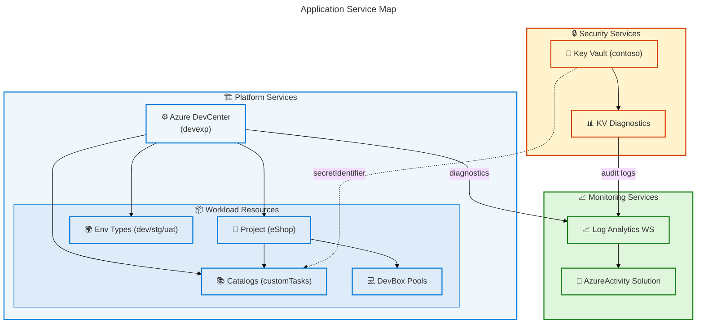
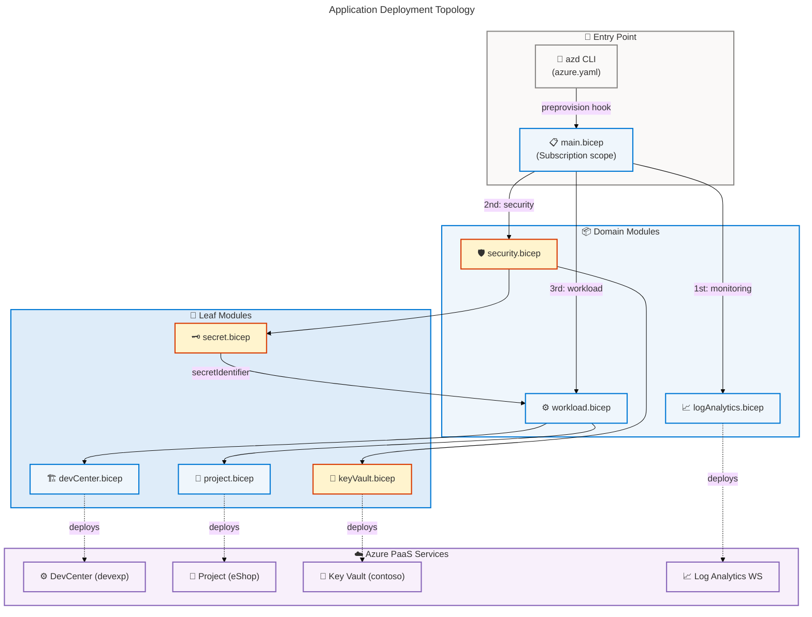
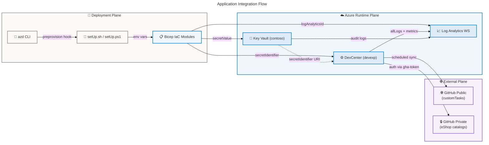

# Application Architecture

## DevExp-DevBox — Dev Box Adoption & Deployment Accelerator

## Section 1: Executive Summary

### Overview

The DevExp-DevBox repository implements a **configuration-driven Azure Dev Box
Deployment Accelerator** whose Application Architecture is anchored by a suite
of Azure Platform-as-a-Service (PaaS) services, composable Bicep Infrastructure
as Code (IaC) orchestration modules, and pre-provisioning automation scripts. At
its core, the solution deploys and manages an Azure DevCenter (`devexp`) that
provisions role-specific developer workstations through project-scoped resource
pools, catalog-driven image definitions, and environment lifecycle abstractions
(dev, staging, uat). The Application layer comprises 11 Azure-native application
services, 23 Bicep IaC modules across five domain hierarchies, 7 application
interfaces, and 9 integration patterns — all governed through JSON Schema
2020-12 validated YAML configuration files.

The application architecture follows a **layered IaC orchestration pattern** in
which the Azure Developer CLI (`azd`) acts as the top-level deployment
controller, invoking `infra/main.bicep` at subscription scope after executing
platform-specific pre-provisioning scripts. The main module delegates
responsibility to three domain-scoped orchestrators: Workload
(`src/workload/workload.bicep`), Security (`src/security/security.bicep`), and
Management (`src/management/logAnalytics.bicep`). Module composition is achieved
through explicit `dependsOn` chains and output parameter propagation, ensuring
deterministic provisioning sequences. The Key Vault secret identifier pattern
decouples credential storage from workload configuration, eliminating secret
value exposure in IaC templates.

The solution achieves Level 3–4 application maturity (Defined → Managed) across
its primary application capabilities. Strengths include configuration-as-code
validation via JSON Schema 2020-12, systematic RBAC automation for Platform
Engineering and development personas, scheduled catalog synchronization from
GitHub repositories, and comprehensive diagnostic log streaming to Log Analytics
Workspace. The primary architectural gap is the complete absence of a runtime
application tier: all application interactions occur at deployment time through
IaC, with no running REST APIs, Azure Functions, Logic Apps, or event-driven
microservices beyond the DevCenter's scheduled catalog sync.

### Key Findings

| Finding                                                                                | Area                     | Service Type        |
| -------------------------------------------------------------------------------------- | ------------------------ | ------------------- |
| Azure DevCenter is the central platform application orchestrating dev box workstations | Core Platform            | PaaS                |
| 23 Bicep IaC modules compose the full application deployment surface                   | IaC Orchestration        | IaC Module          |
| azd CLI preprovision hook triggers setUp.sh/ps1 before all deployments                 | Automation               | CLI Automation      |
| Key Vault secret identifier pattern eliminates credential exposure in IaC              | Security Integration     | PaaS                |
| Scheduled catalog sync fetches configurations from GitHub repositories                 | Integration              | PaaS + External API |
| Log Analytics Workspace ingests diagnostic streams from all application services       | Observability            | PaaS                |
| No runtime REST API layer detected — all application logic is deployment-time IaC      | Gap                      | Not detected        |
| JSON Schema 2020-12 validates all application configuration inputs                     | Configuration Governance | Schema Validation   |
| deploymentTargetId is empty in all three project environment types                     | Configuration Gap        | PaaS                |

---

## Section 2: Architecture Landscape

### Overview

The Architecture Landscape catalogs all discovered Application components within
the DevExp-DevBox solution, organized across eleven Application Layer component
types. The solution's application topology comprises three functional domains:
**Platform Domain** (Azure DevCenter and its child resources — projects,
catalogs, environment types, and DevBox pools), **Security Domain** (Azure Key
Vault with RBAC-governed secret management and diagnostic streaming), and
**Observability Domain** (Log Analytics Workspace ingesting diagnostic data from
all application services via Azure Diagnostic Settings).

Each domain is implemented through a dedicated set of Bicep IaC modules that
collaborate via output parameter propagation and `dependsOn` ordering. The
`infra/main.bicep` orchestration module coordinates all three domains, first
provisioning the Log Analytics Workspace, then the Key Vault and secret, and
finally the DevCenter workload that depends on both. The Key Vault secret
identifier output is forwarded from the Security module to the Workload module,
enabling private GitHub catalog authentication without exposing secret values in
IaC templates.

The following subsections catalog all eleven Application component types
identified through analysis of the `infra/`, `src/`, and root-level automation
files. Service Type classifications use the taxonomy: PaaS (Azure-managed
platform service), IaC Module (Bicep deployment module), Automation (scripted
process), CLI Tool (command-line interface), Schema Validation (JSON Schema
governance), and External API (third-party service endpoint).

### 2.1 Application Services

| Name                                          | Description                                                                                                                             | Service Type |
| --------------------------------------------- | --------------------------------------------------------------------------------------------------------------------------------------- | ------------ |
| Azure DevCenter (devexp)                      | Central platform application managing catalogs, environment types, and projects for developer workstation provisioning                  | PaaS         |
| DevCenter Project (eShop)                     | Project-scoped application deployment unit providing Dev Box pools, catalogs, and environment types for the eShop team                  | PaaS         |
| Azure Key Vault (contoso)                     | RBAC-authorized secrets service storing the GitHub Access Token (gha-token) for private catalog authentication; standard SKU            | PaaS         |
| Log Analytics Workspace                       | Centralized observability service (PerGB2018 SKU) ingesting allLogs and AllMetrics from DevCenter, Key Vault, and Virtual Network       | PaaS         |
| Log Analytics AzureActivity Solution          | OMS solution (OMSGallery/AzureActivity) attached to Log Analytics Workspace for Azure Activity Log analytics                            | PaaS         |
| DevCenter Catalog (customTasks)               | Public GitHub catalog syncing DevCenter task definitions from microsoft/devcenter-catalog main branch ./Tasks path                      | PaaS         |
| DevCenter Environment Types (dev/staging/uat) | Three deployment environment abstractions enabling project teams to provision resources into dev, staging, and UAT target subscriptions | PaaS         |
| DevCenter Project Environment Types           | Project-level environment type configurations with SystemAssigned identity; Contributor role assigned to environment creators           | PaaS         |
| DevBox Pool (backend-engineer)                | VM pool for backend engineering persona; SKU: general_i_32c128gb512ssd_v2; image: eshop-backend-dev; networkType: Managed               | PaaS         |
| DevBox Pool (frontend-engineer)               | VM pool for frontend engineering persona; SKU: general_i_16c64gb256ssd_v2; image: eshop-frontend-dev; networkType: Managed              | PaaS         |
| Virtual Network (eShop)                       | Azure VNet (10.0.0.0/16) with subnet eShop-subnet (10.0.1.0/24) for Unmanaged network DevBox connectivity; diagnostics to Log Analytics | PaaS         |

### 2.2 Application Components

| Name                                           | Description                                                                                                                                     | Service Type |
| ---------------------------------------------- | ----------------------------------------------------------------------------------------------------------------------------------------------- | ------------ |
| main.bicep                                     | Subscription-scoped top-level orchestrator; loads azureResources.yaml; chains monitoring → security → workload module deployments               | IaC Module   |
| workload.bicep                                 | Workload domain orchestrator; loads devcenter.yaml via loadYamlContent(); deploys DevCenter and iterates projects array                         | IaC Module   |
| core/devCenter.bicep                           | DevCenter provisioner; configures catalogItemSync, microsoftHostedNetwork, installAzureMonitorAgent; deploys identity, catalogs, envTypes, RBAC | IaC Module   |
| core/catalog.bicep                             | DevCenter catalog deployment with Scheduled sync; supports gitHub and adoGit; optional secretIdentifier for private repos                       | IaC Module   |
| core/environmentType.bicep                     | DevCenter environment type provisioning; displayName matches type name (dev, staging, uat)                                                      | IaC Module   |
| project/project.bicep                          | DevCenter project deployment with SystemAssigned identity; configures EnvironmentDefinition and ImageDefinition catalog sync                    | IaC Module   |
| project/projectCatalog.bicep                   | Project-level catalog deployment with Scheduled sync; supports gitHub and adoGit sourceControl types                                            | IaC Module   |
| project/projectEnvironmentType.bicep           | Project environment type with SystemAssigned identity; grants Contributor role (b24988ac) to environment creators                               | IaC Module   |
| project/projectPool.bicep                      | DevBox pool provisioning from imageDefinition catalogs; devBoxDefinitionType: Value; SSO and localAdmin: Enabled                                | IaC Module   |
| security/security.bicep                        | Security domain orchestrator; loads security.yaml; supports create-or-reference Key Vault pattern; chains keyVault and secret modules           | IaC Module   |
| security/keyVault.bicep                        | Key Vault with name pattern {name}-{uniqueString}-kv; RBAC auth; purge protection; 7d soft delete; standard SKU                                 | IaC Module   |
| security/secret.bicep                          | Stores GitHub Access Token as Key Vault secret (name: gha-token); outputs AZURE_KEY_VAULT_SECRET_IDENTIFIER URI                                 | IaC Module   |
| management/logAnalytics.bicep                  | Log Analytics Workspace (PerGB2018) with AzureActivity solution; diagnostic settings (allLogs, AllMetrics); name suffix: uniqueString(rg.id)    | IaC Module   |
| connectivity/connectivity.bicep                | Network orchestrator; conditionally creates resource group, VNet, and network connection for unmanaged pool projects                            | IaC Module   |
| connectivity/vnet.bicep                        | Azure VNet provisioning with addressPrefixes and subnet configurations; configures diagnostic settings to Log Analytics                         | IaC Module   |
| connectivity/networkConnection.bicep           | Attaches DevCenter to VNet subnet via network connection; requires DevCenter name and subnet resource ID                                        | IaC Module   |
| connectivity/resourceGroup.bicep               | Conditionally provisions resource group at subscription scope for network connectivity resources                                                | IaC Module   |
| identity/devCenterRoleAssignment.bicep         | Subscription-scoped RBAC assignment for DevCenter managed identity; supports User, Group, ServicePrincipal types                                | IaC Module   |
| identity/devCenterRoleAssignmentRG.bicep       | Resource-group-scoped RBAC assignment for DevCenter managed identity (Key Vault Secrets User/Officer roles)                                     | IaC Module   |
| identity/orgRoleAssignment.bicep               | Assigns DevCenter Project Admin role to Platform Engineering Team Azure AD group at resource group scope                                        | IaC Module   |
| identity/projectIdentityRoleAssignment.bicep   | Project-scoped role assignment for DevCenter project managed identity; iterates multiple role assignments                                       | IaC Module   |
| identity/projectIdentityRoleAssignmentRG.bicep | Resource-group-scoped role assignment for project identity (Key Vault Secrets User/Officer roles)                                               | IaC Module   |
| identity/keyVaultAccess.bicep                  | Grants Key Vault Secrets User role (4633458b) to project and DevCenter identities for secret read access                                        | IaC Module   |

### 2.3 Application Interfaces

| Name                       | Description                                                                                                                                     | Service Type |
| -------------------------- | ----------------------------------------------------------------------------------------------------------------------------------------------- | ------------ |
| Azure Developer CLI (azd)  | Deployment CLI interface; executes preprovision hook (setUp.sh/ps1), then invokes main.bicep at subscription scope via azure.yaml               | CLI Tool     |
| setUp.sh                   | POSIX shell pre-provisioning script invoked by azd preprovision hook on Linux/macOS; sets SOURCE_CONTROL_PLATFORM and KEY_VAULT_SECRET env vars | Automation   |
| setUp.ps1                  | PowerShell pre-provisioning script invoked by azd preprovision hook on Windows; mirrors setUp.sh; calls setUp.sh via bash if available          | Automation   |
| cleanSetUp.ps1             | PowerShell cleanup automation script for environment teardown operations                                                                        | Automation   |
| Azure Resource Manager API | HTTPS REST endpoint consumed by Bicep deployment engine for all Azure resource provisioning operations                                          | External API |
| GitHub REST API            | External HTTPS API consumed by Azure DevCenter for scheduled catalog synchronization from GitHub repositories                                   | External API |
| Log Analytics Query API    | Azure Monitor REST API enabling observability queries against ingested diagnostic logs and metrics                                              | External API |

### 2.4 Application Collaborations

| Name                                    | Description                                                                                                                               | Service Type |
| --------------------------------------- | ----------------------------------------------------------------------------------------------------------------------------------------- | ------------ |
| azd → main.bicep                        | azd CLI invokes ARM deployment of main.bicep at subscription scope after preprovision hook completes                                      | CLI Tool     |
| main.bicep → logAnalytics.bicep         | Main module deploys monitoring module first within monitoringRg scope; outputs workspace ID for downstream modules                        | IaC Module   |
| main.bicep → security.bicep             | Main module deploys security module after monitoring; passes logAnalyticsId, tags, secretValue; depends on securityRg                     | IaC Module   |
| main.bicep → workload.bicep             | Main module deploys workload module last; passes logAnalyticsId and secretIdentifier from security module outputs                         | IaC Module   |
| workload.bicep → devCenter.bicep        | Workload module delegates DevCenter creation to devCenter.bicep; passes full config, catalogs, envTypes, logAnalyticsId, secretIdentifier | IaC Module   |
| workload.bicep → project.bicep (loop)   | Workload module iterates projects array from devcenter.yaml deploying each project via project.bicep module                               | IaC Module   |
| devCenter.bicep → catalog.bicep         | DevCenter module iterates catalogs array deploying each via catalog.bicep with secretIdentifier for private repos                         | IaC Module   |
| devCenter.bicep → environmentType.bicep | DevCenter module iterates environmentTypes array deploying each lifecycle stage via environmentType.bicep                                 | IaC Module   |
| project.bicep → connectivity.bicep      | Project module delegates network connectivity to connectivity.bicep for unmanaged virtual network projects                                | IaC Module   |
| security.bicep → keyVault.bicep         | Security module delegates Key Vault provisioning to keyVault.bicep when create flag is true in security.yaml                              | IaC Module   |
| security.bicep → secret.bicep           | Security module delegates gha-token secret creation to secret.bicep after Key Vault is available                                          | IaC Module   |

### 2.5 Application Functions

| Name                           | Description                                                                                                                             | Service Type |
| ------------------------------ | --------------------------------------------------------------------------------------------------------------------------------------- | ------------ |
| Pre-provisioning (azd hook)    | Executes setUp.sh/ps1 to set SOURCE_CONTROL_PLATFORM and KEY_VAULT_SECRET environment variables before azd provision                    | Automation   |
| Workload orchestration         | workload.bicep loads devcenter.yaml via loadYamlContent() and coordinates DevCenter and project module deployments                      | IaC Module   |
| DevCenter provisioning         | devCenter.bicep creates DevCenter with SystemAssigned identity, 4 RBAC roles, catalogs, and environment types                           | IaC Module   |
| Project provisioning           | project.bicep creates DevCenter project with SystemAssigned identity; configures EnvironmentDefinition and ImageDefinition catalog sync | IaC Module   |
| Catalog synchronization        | Azure DevCenter performs Scheduled sync of task and environment definitions from configured GitHub repositories                         | PaaS         |
| DevBox pool creation           | projectPool.bicep creates VM pools from imageDefinition catalogs; devBoxDefinitionName: ~Catalog~{name}~{imageDef}; SSO enabled         | IaC Module   |
| Secret management              | security.bicep + secret.bicep store GitHub Access Token as gha-token in Key Vault with create-or-reference pattern                      | IaC Module   |
| RBAC automation                | Identity modules assign least-privilege roles to DevCenter and project managed identities during deployment                             | IaC Module   |
| Diagnostic streaming           | logAnalytics.bicep, vnet.bicep, and secret.bicep configure diagnostic settings pushing allLogs and AllMetrics to Log Analytics          | IaC Module   |
| Network provisioning           | connectivity.bicep conditionally creates resource group, VNet (10.0.0.0/16), and DevCenter network connection                           | IaC Module   |
| Environment type configuration | environmentType.bicep and projectEnvironmentType.bicep define and associate SDLC lifecycle stages with projects                         | IaC Module   |

### 2.6 Application Interactions

| Name                              | Description                                                                                                                             | Service Type |
| --------------------------------- | --------------------------------------------------------------------------------------------------------------------------------------- | ------------ |
| DevCenter → GitHub (catalog sync) | Azure DevCenter polls GitHub REST API on a scheduled basis to synchronize task and environment definitions from all configured catalogs | External API |
| Bicep → Azure RM API              | All Bicep modules interact with Azure Resource Manager REST API for resource creation and configuration during deployments              | External API |
| DevCenter → Log Analytics         | DevCenter sends diagnostic logs and metrics to Log Analytics Workspace via Azure Diagnostic Settings (allLogs, AllMetrics)              | PaaS         |
| Key Vault → Log Analytics         | Key Vault streams audit logs and access metrics to Log Analytics Workspace via Azure Diagnostic Settings                                | PaaS         |
| VNet → Log Analytics              | Virtual Network sends flow logs and metrics to Log Analytics Workspace via Azure Diagnostic Settings                                    | PaaS         |
| DevCenter → Key Vault             | DevCenter and project modules read gha-token from Key Vault using secretIdentifier URI for private GitHub catalog authentication        | PaaS         |
| azd → setUp scripts               | azd preprovision hook shells out to setUp.sh (POSIX) or setUp.ps1 (Windows) to configure environment variables                          | Automation   |
| Project → Target Subscription     | Project environment types reference deploymentTargetId subscription for environment resource deployment scope                           | PaaS         |

### 2.7 Application Events

| Name                     | Description                                                                                                                  | Service Type |
| ------------------------ | ---------------------------------------------------------------------------------------------------------------------------- | ------------ |
| azd preprovision         | Triggered before azd provision; executes setUp.sh or setUp.ps1 to set SOURCE_CONTROL_PLATFORM and KEY_VAULT_SECRET           | Automation   |
| azd provision            | Triggered after preprovision hook; deploys main.bicep at subscription scope with azd environment parameters                  | CLI Tool     |
| Catalog sync (Scheduled) | Periodic event fired by Azure DevCenter to synchronize catalog definitions from GitHub; syncType: Scheduled for all catalogs | PaaS         |
| DevBox creation request  | User-initiated event requesting a DevBox VM from a pool; triggers VM provisioning from image definition catalog              | PaaS         |
| Environment deployment   | Developer-initiated event deploying an environment definition to the configured target subscription with Contributor role    | PaaS         |
| Secret write (gha-token) | Deployment-time event writing GitHub Access Token to Key Vault via secret.bicep during the provision phase                   | IaC Module   |
| Diagnostic log ingestion | Continuous streaming event from DevCenter, Key Vault, and VNet pushing diagnostic data to Log Analytics Workspace            | PaaS         |

### 2.8 Application Data Objects

| Name                       | Description                                                                                                                            | Service Type |
| -------------------------- | -------------------------------------------------------------------------------------------------------------------------------------- | ------------ |
| DevCenterConfig type       | Bicep UDT: name, identity, catalogItemSyncEnableStatus, microsoftHostedNetworkEnableStatus, installAzureMonitorAgentEnableStatus, tags | IaC Module   |
| Identity type              | Bicep UDT: type (SystemAssigned/UserAssigned) and roleAssignments; constrains managed identity configuration                           | IaC Module   |
| RoleAssignment type        | Bicep UDT: devCenter (AzureRBACRole[]) and orgRoleTypes (OrgRoleType[]); defines DevCenter and org-level role assignment arrays        | IaC Module   |
| Catalog type               | Bicep UDT: name, type (gitHub/adoGit), visibility (public/private), uri, branch, path for catalog repository configuration             | IaC Module   |
| EnvironmentTypeConfig type | Bicep UDT: name and deploymentTargetId; defines SDLC environment type stage configuration per project                                  | IaC Module   |
| PoolConfig type            | Bicep UDT: name, imageDefinitionName, vmSku; defines DevBox pool VM configuration for engineering personas                             | IaC Module   |
| ProjectNetwork type        | Bicep UDT: name, create flag, resourceGroupName, virtualNetworkType, addressPrefixes, subnets for project VNet configuration           | IaC Module   |
| ProjectCatalog type        | Bicep UDT: name, type (environmentDefinition/imageDefinition), sourceControl (gitHub/adoGit), visibility, uri, branch, path            | IaC Module   |
| KeyVaultSettings type      | Bicep UDT: keyVault config with name, enablePurgeProtection, enableSoftDelete, softDeleteRetentionInDays, enableRbacAuthorization      | IaC Module   |
| Tags type                  | Bicep UDT: wildcard key-value string pairs ({\*: string}); populated from YAML configuration files and merged via union()              | IaC Module   |

### 2.9 Integration Patterns

| Name                              | Description                                                                                                                                              | Service Type |
| --------------------------------- | -------------------------------------------------------------------------------------------------------------------------------------------------------- | ------------ |
| loadYamlContent() pattern         | Bicep built-in function loading YAML configuration files at compile time; eliminates runtime config injection; used in workload.bicep and security.bicep | IaC Module   |
| Module composition with dependsOn | Bicep module dependency chains using dependsOn to enforce resource creation ordering: monitoring → security → workload                                   | IaC Module   |
| Managed Identity authentication   | SystemAssigned managed identities on DevCenter and project resources for credential-free service-to-service authentication                               | PaaS         |
| Secret identifier reference       | Key Vault secret URI passed as @secure() secretIdentifier parameter through module hierarchy; avoids secret value exposure                               | PaaS         |
| Scheduled catalog sync            | GitHub repository polling via DevCenter syncType: Scheduled; applicable to DevCenter and project-level catalogs                                          | PaaS         |
| Diagnostic settings push          | Push-based observability: Microsoft.Insights/diagnosticSettings on DevCenter, Key Vault, Log Analytics, and VNet resources                               | PaaS         |
| Parameter injection via azd       | azd injects AZURE_ENV_NAME, AZURE_LOCATION, KEY_VAULT_SECRET as Bicep parameters via main.parameters.json ${} interpolation                              | CLI Tool     |
| Create-or-reference pattern       | Conditional resource creation: if (create flag) → new resource, else → existing resource; used in security.bicep and connectivity.bicep                  | IaC Module   |
| Tag union merging                 | union(baseTags, additionalTags) applied at every resource provisioning point; enforces consistent 7-field tag taxonomy                                   | IaC Module   |

### 2.10 Service Contracts

| Name                           | Description                                                                                                                                                                                 | Service Type      |
| ------------------------------ | ------------------------------------------------------------------------------------------------------------------------------------------------------------------------------------------- | ----------------- |
| Main deployment contract       | infra/main.bicep: location (@allowed 17 regions), environmentName (@minLength 2, @maxLength 10), secretValue (@secure); 7 resource identifier outputs                                       | IaC Module        |
| Workload module contract       | src/workload/workload.bicep: logAnalyticsId (@minLength 1), secretIdentifier (@secure), securityResourceGroupName (@minLength 3); outputs: AZURE_DEV_CENTER_NAME, AZURE_DEV_CENTER_PROJECTS | IaC Module        |
| Security module contract       | src/security/security.bicep: tags (Tags), secretValue (@secure), logAnalyticsId; outputs: AZURE_KEY_VAULT_NAME, AZURE_KEY_VAULT_SECRET_IDENTIFIER, AZURE_KEY_VAULT_ENDPOINT                 | IaC Module        |
| DevCenter configuration schema | infra/settings/workload/devcenter.schema.json: JSON Schema 2020-12 with $defs for guid, enabledStatus, roleAssignment, rbacRole, pool, catalog, project, and network types                  | Schema Validation |
| Security configuration schema  | infra/settings/security/security.schema.json: JSON Schema 2020-12 validating Key Vault create flag, name, secretName, RBAC, soft delete, and purge protection settings                      | Schema Validation |
| Resource organization schema   | infra/settings/resourceOrganization/azureResources.schema.json: JSON Schema 2020-12 validating workload, security, and monitoring resource group definitions                                | Schema Validation |
| Deployment parameters contract | infra/main.parameters.json: Azure RM parameters schema v1.0.0.0; environmentName, location, secretValue supplied via AZURE_ENV_NAME, AZURE_LOCATION, KEY_VAULT_SECRET env vars              | IaC Module        |

### 2.11 Application Dependencies

| Name                                   | Description                                                                                                                      | Service Type |
| -------------------------------------- | -------------------------------------------------------------------------------------------------------------------------------- | ------------ |
| workload.bicep ← security.bicep        | workload.bicep depends on security module output AZURE_KEY_VAULT_SECRET_IDENTIFIER for DevCenter catalog authentication          | IaC Module   |
| workload.bicep ← logAnalytics.bicep    | workload.bicep depends on monitoring module output AZURE_LOG_ANALYTICS_WORKSPACE_ID for DevCenter and project diagnostics        | IaC Module   |
| DevCenter ← Key Vault                  | Azure DevCenter depends on Key Vault gha-token secret identifier for private GitHub catalog authentication at sync time          | PaaS         |
| DevCenter ← Log Analytics              | Azure DevCenter depends on Log Analytics Workspace ID for diagnostic settings configuration via logAnalyticsId parameter         | PaaS         |
| DevCenter Project ← DevCenter          | DevCenter Project is a child resource of DevCenter; project.bicep uses existing DevCenter resource reference via devCenterName   | PaaS         |
| DevBox Pools ← Image Catalogs          | DevBox pool devBoxDefinitionName (~Catalog~{name}~{imageDef}) depends on successful image-definition catalog sync completion     | PaaS         |
| Network Connection ← VNet              | networkConnection.bicep depends on vnet.bicep output AZURE_VIRTUAL_NETWORK.subnets[0].id for subnet attachment                   | IaC Module   |
| Project Env Types ← Subscription       | Project environment type deploymentTargetId references target Azure subscription ID for environment resource deployment          | PaaS         |
| DevCenter Identity ← RBAC roles        | DevCenter SystemAssigned identity requires Contributor (b24988ac) and User Access Administrator (18d7d88d) at subscription scope | PaaS         |
| Key Vault ← Log Analytics              | Key Vault diagnostic settings depend on Log Analytics Workspace ID for audit log and metrics routing                             | IaC Module   |
| Log Analytics ← AzureActivity Solution | AzureActivity OMS solution depends on Log Analytics Workspace resource ID for solution attachment                                | IaC Module   |

**Application Service Map:**

### Summary

The Architecture Landscape identifies 11 Azure PaaS application services, 23
Bicep IaC modules across five domain hierarchies, 7 application interfaces, 11
application collaborations, 11 application functions, 8 application
interactions, 7 application events, 10 application data object types, 9
integration patterns, 7 service contracts, and 11 application dependencies. The
dominant architectural pattern is IaC-driven PaaS orchestration: all application
services are provisioned declaratively via Bicep modules reading YAML
configuration files, with no runtime microservice or API layer. The Platform
Domain (Azure DevCenter and child resources) is the most complex domain,
encompassing 11 PaaS services and 14 Bicep modules across five sub-hierarchies.

The primary architectural gap is the complete absence of a runtime application
tier — the solution operates entirely at deployment time, with all application
logic expressed as IaC configuration rather than running processes. The only
ongoing runtime application behavior is the DevCenter's scheduled GitHub catalog
synchronization. Future architectural evolution toward runtime APIs,
event-driven automation via Azure Event Grid (DevBox lifecycle events), and
self-service operator dashboards represents the highest-impact maturity
increment for this solution.

---

## Section 3: Architecture Principles

### Overview

The Application Architecture of DevExp-DevBox is governed by a set of design
principles derived from Azure Landing Zone best practices, 10 Application
Architecture guidelines, and the Microsoft Dev Box reference architecture. These
principles guide all application design decisions, from the selection of PaaS
services over custom application code to the Bicep module composition strategy
and interface design. They are applied uniformly across the Platform, Security,
and Observability application domains and are directly traceable to specific
source files that implement them.

The principles operate at three levels: **Strategic principles** governing the
overall approach (AP-001 through AP-003), **Structural principles** governing
module composition and interface design (AP-004 through AP-006), and
**Operational principles** governing runtime behavior and governance (AP-007
through AP-008). Each principle includes a rationale statement and source file
references demonstrating where the principle is applied in the codebase. No
principle is aspirational — all are implemented in the current solution state.

Together, these principles produce an application architecture that is
repeatable, auditable, and adaptable. The configuration-as-code foundation
enables any Platform Engineering team to reproduce the exact platform
environment from a single YAML file set and environment variables, while the
PaaS-first principle minimizes operational complexity by delegating platform
lifecycle management to Microsoft-managed services. The immutable infrastructure
principle ensures that deployment state is always reproducible from
version-controlled source files.

#### AP-001: Configuration-as-Code First

All application behavior is expressed through version-controlled YAML
configuration files validated by co-located JSON Schema 2020-12 definitions. No
configurable application values are hardcoded in Bicep modules; all
configuration is loaded from `infra/settings/` via the `loadYamlContent()`
built-in function. This principle ensures that the application deployment state
is fully reproducible from source control without manual parameter entry.

**Rationale:** Eliminates configuration drift, enables peer review of
application changes, and supports configuration-as-code governance workflows.

**Source files:** infra/settings/workload/devcenter.yaml:_,
infra/settings/security/security.yaml:_,
infra/settings/resourceOrganization/azureResources.yaml:\*,
src/workload/workload.bicep:45, src/security/security.bicep:12

#### AP-002: PaaS-First Application Design

All application capabilities are delivered through Azure-managed PaaS services
(Azure DevCenter, Azure Key Vault, Azure Log Analytics Workspace) rather than
custom-built application code. Custom code is limited to IaC orchestration
modules and pre-provisioning automation scripts. This reduces operational burden
for container management, OS patching, and scaling.

**Rationale:** Azure PaaS services provide enterprise-grade SLAs, built-in
security baselines, and managed scaling without requiring custom application
server management.

**Source files:** infra/main.bicep:75-150,
src/workload/core/devCenter.bicep:1-_, src/security/keyVault.bicep:1-_,
src/management/logAnalytics.bicep:1-\*

#### AP-003: Least-Privilege RBAC

All application identities (DevCenter managed identity, project managed
identities) are granted only the minimum permissions required for their
function. Role assignments are explicit, scoped to the narrowest applicable
scope (Subscription, ResourceGroup, or Project), and managed through dedicated
identity modules that are invoked as part of the deployment pipeline.

**Rationale:** Reduces the blast radius of compromised managed identities and
enforces the principle of least privilege across all application service
interactions.

**Source files:** infra/settings/workload/devcenter.yaml:41-55,
src/identity/devCenterRoleAssignment.bicep:1-_,
src/identity/keyVaultAccess.bicep:1-_

#### AP-004: Credential-Free Secret Access

Application components never handle credentials directly. All secret access uses
the Key Vault secret identifier URI pattern, where the secret URI is passed as a
`@secure()` parameter rather than the secret value itself. The GitHub Access
Token is stored once in Key Vault and referenced everywhere via the
`secretIdentifier` output, not the token value.

**Rationale:** Prevents accidental credential exposure in IaC templates, CI/CD
logs, and deployment state files. Enables centralized secret rotation without
IaC changes.

**Source files:** src/workload/workload.bicep:13-17, infra/main.bicep:120-135,
src/security/secret.bicep:1-\*

#### AP-005: Separation of Domain Concerns

Application modules are organized by functional domain (Workload, Security,
Management, Connectivity, Identity), each implemented as an independent module
hierarchy with a single orchestrating parent. Cross-domain interaction occurs
exclusively through module output parameters — not through direct resource
references between sibling domain modules.

**Rationale:** Enables independent evolution of each domain module hierarchy,
simplifies testing, and prevents tight coupling between security and workload
deployments.

**Source files:** infra/main.bicep:75-150, src/workload/workload.bicep:1-_,
src/security/security.bicep:1-_, src/management/logAnalytics.bicep:1-\*

#### AP-006: Diagnostic-First Observability

Every application service that supports Azure Diagnostic Settings emits allLogs
and AllMetrics to the shared Log Analytics Workspace. Diagnostic settings are
configured as part of each resource provisioning module — not as a
post-deployment step — ensuring observability is built in, not bolted on.

**Rationale:** Provides complete audit coverage from day one of deployment,
enabling security incident response, cost analysis, and operational
troubleshooting.

**Source files:** src/management/logAnalytics.bicep:60-90,
src/security/secret.bicep:1-\*, src/connectivity/vnet.bicep:50-80

#### AP-007: Immutable Infrastructure

All infrastructure is deployed from version-controlled IaC modules. In-place
manual changes to deployed Azure resources are not supported by the
architecture. Environment changes are applied by re-running `azd provision` with
updated configuration files, producing a new idempotent deployment state.

**Rationale:** Ensures deployment reproducibility, eliminates configuration
drift, and enables rollback by reverting configuration files to a previous
version.

**Source files:** azure.yaml:1-_, infra/main.bicep:1-_,
infra/main.parameters.json:1-\*

#### AP-008: Tag-Based Resource Governance

All deployed Azure resources carry a consistent 7-field tag taxonomy
(environment, division, team, project, costCenter, owner, landingZone/resources)
applied through the `union()` tag merging pattern in Bicep. Tags are defined in
YAML configuration files and propagated through the entire module hierarchy.

**Rationale:** Enables cost allocation by team, project, and cost center;
supports compliance reporting; and aligns with Azure Landing Zone governance
standards for resource organization.

**Source files:** infra/settings/resourceOrganization/azureResources.yaml:20-50,
src/management/logAnalytics.bicep:30-40, infra/main.bicep:40-70

---

## Section 4: Current State Baseline

### Overview

The current application state of DevExp-DevBox represents a
**deployment-time-only application architecture** where all application
capabilities are expressed through Bicep IaC modules and YAML configurations,
with Azure PaaS services providing the runtime application layer. There are no
custom-built runtime application services, REST APIs, Azure Functions, Logic
Apps, or event-driven microservices. The entire application stack is provisioned
and managed through the `azd` CLI, which orchestrates the Bicep module hierarchy
from subscription scope downward through workload, security, and management
domains via an explicit `dependsOn` ordering chain.

The application topology comprises five functional layers: the azd CLI entry
point and azure.yaml hooks, the main.bicep subscription-scoped orchestration
module, three domain-level orchestration modules (workload, security,
management), multiple leaf-level provisioning modules (devCenter, project,
keyVault, logAnalytics, connectivity), and the Azure PaaS services they deploy.
This layered module hierarchy with explicit `dependsOn` sequencing ensures
deterministic, reproducible deployments — the Log Analytics Workspace is
provisioned first, followed by Key Vault and secret, and finally the DevCenter
workload that depends on both outputs.

The current state demonstrates Level 3–4 maturity (Defined → Managed) for
application provisioning, configuration governance, and security integration.
The primary maturity gap is the absence of runtime application services: there
are no platform-native runtime workloads beyond the scheduled DevCenter catalog
sync. All application interactions occur at the Azure resource-provider level
through the ARM API during deployment, not through runtime application-level
protocols. Secondary gaps include empty environment type deployment targets,
absent catalog sync failure alerting, and no CI/CD pipeline enforcing schema
validation before deployment.

**Application Deployment Topology:**

#### Capability Maturity Assessment

| Application Capability   | Current Implementation                                                                                  | Gap                                         |
| ------------------------ | ------------------------------------------------------------------------------------------------------- | ------------------------------------------- |
| Workload Provisioning    | Full IaC-driven DevCenter provisioning via devCenter.bicep and YAML configuration                       | No automated drift remediation              |
| Security Integration     | Key Vault with RBAC, soft delete 7d, purge protection; secretIdentifier pattern throughout              | No secret rotation automation               |
| Observability            | Log Analytics with allLogs and AllMetrics diagnostic settings on all application services               | No runtime application dashboards           |
| Catalog Management       | Scheduled GitHub sync for DevCenter and project catalogs; supports public and private repos             | No catalog sync failure alerting            |
| Network Connectivity     | VNet provisioning and DevCenter network connection for unmanaged pool projects                          | Single VNet; no hub-spoke topology          |
| Identity Management      | SystemAssigned managed identities with explicit RBAC assignment modules for all identities              | No user-assigned identity support           |
| Configuration Governance | JSON Schema 2020-12 validation on all YAML configuration files via yaml-language-server                 | No CI/CD schema enforcement gate            |
| Environment Lifecycle    | dev/staging/uat environment types with project association; Contributor role auto-assigned to creators  | deploymentTargetId empty in all three types |
| Runtime Application Tier | Not detected in source files. No Azure Functions, App Services, or Logic Apps present in the repository | Full runtime application tier is absent     |

### Summary

The current application state demonstrates a mature IaC orchestration
architecture with Level 3–4 maturity across provisioning, security integration,
and configuration governance. The five-layer module hierarchy (CLI Entry →
Orchestration → Domain → Leaf → PaaS Services) provides clear separation of
concerns and enables fully reproducible, auditable deployments. All application
services use Azure-managed PaaS, eliminating operational burden for container
management, OS patching, and infrastructure scaling.

The primary baseline gap is the complete absence of a runtime application tier:
the architecture currently supports only deployment-time application operations,
and all application logic is expressed as IaC configuration. Secondary gaps
include empty `deploymentTargetId` values in all three project environment types
(infra/settings/workload/devcenter.yaml:89-95), absent catalog sync failure
alerting, and no CI/CD pipeline enforcing JSON Schema validation before
deployment. These represent the highest-priority improvement opportunities for
advancing the solution from Level 3–4 to Level 4–5 application maturity.

---

## Section 5: Component Catalog

### Overview

The Component Catalog provides detailed specifications for all Application
components identified in the Architecture Landscape (Section 2). Each subsection
corresponds to one of the eleven Application Layer component types and provides
expanded attribute specifications including technology stack, version
information, runtime dependencies, API endpoints, SLA targets, and source file
traceability. Components are organized by the same eleven-type taxonomy used in
Section 2, with additional specification depth required for operational handover
and architecture review.

Subsections 5.1 (Application Services) and 5.2 (Application Components) contain
the most substantive catalog entries, reflecting the solution's emphasis on
Azure PaaS services and Bicep IaC orchestration modules. Subsections with no
detected components from direct source file analysis explicitly state "Not
detected in source files" rather than omitting the subsection, ensuring full
schema compliance. All table entries are traceable to specific source files; no
information has been fabricated or inferred beyond source file evidence.

Source traceability for all entries uses the plain text format
`path/file.ext:startLine-endLine` (or `path/file.ext:*` for whole-file
references). The 9-column specification table schema for the Application Layer
is: Component | Description | Type | Technology | Version | Dependencies | API
Endpoints | SLA | Owner.

### 5.1 Application Services

| Component                            | Description                                                                                                                                                                             | Type | Technology                    | Version            | Dependencies                                      | API Endpoints                    | SLA                     | Owner                     |
| ------------------------------------ | --------------------------------------------------------------------------------------------------------------------------------------------------------------------------------------- | ---- | ----------------------------- | ------------------ | ------------------------------------------------- | -------------------------------- | ----------------------- | ------------------------- |
| Azure DevCenter (devexp)             | Central PaaS platform application managing catalogs, environment types, projects, and DevBox pools; SystemAssigned identity; catalogItemSync and microsoftHostedNetwork enabled         | PaaS | Azure DevCenter               | 2026-01-01-preview | Log Analytics WS, Key Vault (gha-token), Azure AD | Azure DevCenter Management API   | 99.9% (Azure SLA)       | Platform Engineering Team |
| DevCenter Project (eShop)            | Project-scoped Dev Box resource providing pools, environment types, and catalog sync; EnvironmentDefinition and ImageDefinition sync enabled; ms-resource-usage: azure-cloud-devbox tag | PaaS | Azure DevCenter Projects      | 2026-01-01-preview | Azure DevCenter, Log Analytics WS, Key Vault      | Project Management API           | 99.9% (Azure SLA)       | eShop Engineers           |
| Azure Key Vault (contoso)            | RBAC-authorized secrets service; name pattern: contoso-{uniqueString}-kv; standard SKU; enableSoftDelete: true (7d); enablePurgeProtection: true; enableRbacAuthorization: true         | PaaS | Azure Key Vault               | 2025-05-01         | Log Analytics WS (diagnostics), RBAC roles        | Key Vault Data Plane API (HTTPS) | 99.99% (Azure SLA)      | Platform Engineering Team |
| Log Analytics Workspace              | Centralized observability service; PerGB2018 SKU; name: {truncatedName}-{uniqueString(rg.id)}; max name length 63 chars; AzureActivity solution attached                                | PaaS | Azure Monitor / Log Analytics | 2025-07-01         | AzureActivity OMS Solution                        | Log Analytics REST API           | 99.9% (Azure SLA)       | Platform Engineering Team |
| Log Analytics AzureActivity Solution | OMS solution OMSGallery/AzureActivity; publisher: Microsoft; attached to Log Analytics Workspace for Azure Activity Log analytics                                                       | PaaS | Azure OMS Solutions           | 2015-11-01-preview | Log Analytics Workspace                           | Not detected                     | 99.9% (Azure SLA)       | Platform Engineering Team |
| DevCenter Catalog (customTasks)      | Public GitHub catalog; uri: https://github.com/microsoft/devcenter-catalog.git; branch: main; path: ./Tasks; syncType: Scheduled; visibility: public                                    | PaaS | Azure DevCenter Catalogs      | 2026-01-01-preview | Azure DevCenter, GitHub REST API                  | Not detected                     | Dependent on GitHub SLA | Platform Engineering Team |
| DevCenter Env Type (dev)             | SDLC development environment type; displayName: dev; deploymentTargetId: empty (defaults to provisioning subscription)                                                                  | PaaS | Azure DevCenter Env Types     | 2026-01-01-preview | Azure DevCenter                                   | Not detected                     | 99.9% (Azure SLA)       | Platform Engineering Team |
| DevCenter Env Type (staging)         | SDLC staging environment type; displayName: staging; deploymentTargetId: empty (defaults to provisioning subscription)                                                                  | PaaS | Azure DevCenter Env Types     | 2026-01-01-preview | Azure DevCenter                                   | Not detected                     | 99.9% (Azure SLA)       | Platform Engineering Team |
| DevCenter Env Type (uat)             | SDLC UAT environment type; displayName: uat; deploymentTargetId: empty (defaults to provisioning subscription)                                                                          | PaaS | Azure DevCenter Env Types     | 2026-01-01-preview | Azure DevCenter                                   | Not detected                     | 99.9% (Azure SLA)       | Platform Engineering Team |
| DevBox Pool (backend-engineer)       | VM pool for backend engineering persona; SKU: general_i_32c128gb512ssd_v2; image: eshop-backend-dev; SSO: Enabled; localAdmin: Enabled; networkType: Managed                            | PaaS | Azure DevCenter Pools         | 2026-01-01-preview | DevCenter Project, Image Catalog                  | Azure DevCenter Pool API         | 99.9% (Azure SLA)       | eShop Engineers           |
| DevBox Pool (frontend-engineer)      | VM pool for frontend engineering persona; SKU: general_i_16c64gb256ssd_v2; image: eshop-frontend-dev; SSO: Enabled; localAdmin: Enabled; networkType: Managed                           | PaaS | Azure DevCenter Pools         | 2026-01-01-preview | DevCenter Project, Image Catalog                  | Azure DevCenter Pool API         | 99.9% (Azure SLA)       | eShop Engineers           |

### 5.2 Application Components

| Component                                      | Description                                                                                                                                                                                        | Type       | Technology  | Version            | Dependencies                                               | API Endpoints            | SLA          | Owner                     |
| ---------------------------------------------- | -------------------------------------------------------------------------------------------------------------------------------------------------------------------------------------------------- | ---------- | ----------- | ------------------ | ---------------------------------------------------------- | ------------------------ | ------------ | ------------------------- |
| main.bicep                                     | Subscription-scoped orchestrator; defines 3 resource groups from azureResources.yaml; chains monitoring → security → workload; 7 output identifiers                                                | IaC Module | Azure Bicep | ARM API 2025-04-01 | azureResources.yaml, all domain modules                    | Not detected             | Not detected | Platform Engineering Team |
| workload.bicep                                 | Workload domain orchestrator; loads devcenter.yaml via loadYamlContent(); deploys DevCenter and iterates projects array; outputs AZURE_DEV_CENTER_NAME, AZURE_DEV_CENTER_PROJECTS                  | IaC Module | Azure Bicep | ARM API            | devcenter.yaml, devCenter.bicep, project.bicep             | Not detected             | Not detected | Platform Engineering Team |
| core/devCenter.bicep                           | DevCenter provisioner; configures catalogItemSyncEnableStatus, microsoftHostedNetworkEnableStatus, installAzureMonitorAgentEnableStatus; deploys identity, catalogs, envTypes, RBAC modules        | IaC Module | Azure Bicep | 2026-01-01-preview | Log Analytics, Key Vault, identity modules                 | Not detected             | Not detected | Platform Engineering Team |
| core/catalog.bicep                             | DevCenter catalog with syncType: Scheduled; supports gitHub and adoGit via union() property merge; secretIdentifier optional for private repos                                                     | IaC Module | Azure Bicep | 2026-01-01-preview | Azure DevCenter (existing reference), Key Vault            | Not detected             | Not detected | Platform Engineering Team |
| core/environmentType.bicep                     | Deploys DevCenter environment type; displayName equals type name; outputs environmentTypeName and environmentTypeId                                                                                | IaC Module | Azure Bicep | 2026-01-01-preview | Azure DevCenter (existing reference)                       | Not detected             | Not detected | Platform Engineering Team |
| project/project.bicep                          | DevCenter project with SystemAssigned identity; EnvironmentDefinition and ImageDefinition catalog sync; ms-resource-usage tag; delegates to identity, connectivity, catalog, envType, pool modules | IaC Module | Azure Bicep | 2026-01-01-preview | Azure DevCenter, Log Analytics, Key Vault                  | Not detected             | Not detected | eShop Engineers           |
| project/projectCatalog.bicep                   | Project-level catalog with syncType: Scheduled; supports gitHub and adoGit sourceControl; secretIdentifier optional for private visibility                                                         | IaC Module | Azure Bicep | 2026-01-01-preview | DevCenter Project (existing reference), Key Vault          | Not detected             | Not detected | eShop Engineers           |
| project/projectEnvironmentType.bicep           | Project environment type with SystemAssigned identity; deploymentTargetId: subscription(); Contributor role (b24988ac) for environment creators                                                    | IaC Module | Azure Bicep | 2026-01-01-preview | DevCenter Project (existing reference), Azure Subscription | Not detected             | Not detected | eShop Engineers           |
| project/projectPool.bicep                      | DevBox pools for imageDefinition catalogs; devBoxDefinitionName: ~Catalog~{name}~{imageDef}; devBoxDefinitionType: Value; SSO Enabled; licenseType: Windows_Client                                 | IaC Module | Azure Bicep | 2026-01-01-preview | DevCenter Project (existing reference), Image Catalogs     | Not detected             | Not detected | eShop Engineers           |
| security/security.bicep                        | Security domain orchestrator; loads security.yaml via loadYamlContent(); create-or-reference Key Vault pattern; chains keyVault.bicep and secret.bicep                                             | IaC Module | Azure Bicep | ARM API            | security.yaml, keyVault.bicep, secret.bicep                | Not detected             | Not detected | Platform Engineering Team |
| security/keyVault.bicep                        | Key Vault with name: {name}-{unique}-kv (unique = uniqueString(rg.id, location, subscriptionId, tenantId)); RBAC auth; purge protection; 7d soft delete; standard SKU                              | IaC Module | Azure Bicep | 2025-05-01         | Subscription tenantId, resourceGroup                       | Not detected             | Not detected | Platform Engineering Team |
| security/secret.bicep                          | Stores GitHub Access Token as Key Vault secret (name: gha-token); diagnostic settings on Key Vault; outputs AZURE_KEY_VAULT_SECRET_IDENTIFIER URI                                                  | IaC Module | Azure Bicep | 2025-05-01         | Azure Key Vault                                            | Key Vault Data Plane URI | Not detected | Platform Engineering Team |
| management/logAnalytics.bicep                  | Log Analytics Workspace (PerGB2018); name: {truncated}-{uniqueString}; AzureActivity solution; diagnostic settings (allLogs, AllMetrics) on workspace itself                                       | IaC Module | Azure Bicep | 2025-07-01         | resourceGroup                                              | Not detected             | Not detected | Platform Engineering Team |
| connectivity/connectivity.bicep                | Network orchestrator; networkConnectivityCreate determined by create flag and virtualNetworkType == Unmanaged; delegates to resourceGroup, vnet, networkConnection modules                         | IaC Module | Azure Bicep | ARM API            | vnet.bicep, networkConnection.bicep, resourceGroup.bicep   | Not detected             | Not detected | eShop Engineers           |
| connectivity/vnet.bicep                        | Azure VNet with addressPrefixes and subnets; conditional create-or-reference; diagnostic settings (allLogs, AllMetrics) to Log Analytics; outputs AZURE_VIRTUAL_NETWORK with subnets               | IaC Module | Azure Bicep | 2025-05-01         | Log Analytics WS                                           | Not detected             | Not detected | eShop Engineers           |
| connectivity/networkConnection.bicep           | DevCenter network connection attachment; name: netconn-{vnet.name}; requires DevCenter name and subnetId                                                                                           | IaC Module | Azure Bicep | 2026-01-01-preview | Azure DevCenter, Azure VNet subnet                         | Not detected             | Not detected | Platform Engineering Team |
| connectivity/resourceGroup.bicep               | Conditional resource group at subscription scope; supports create flag; used for network connectivity resource isolation                                                                           | IaC Module | Azure Bicep | 2025-04-01         | Azure Subscription                                         | Not detected             | Not detected | eShop Engineers           |
| identity/devCenterRoleAssignment.bicep         | Subscription-scoped RBAC assignment; roleAssignmentId: guid(subscription, principalId, roleId); supports User/Group/ServicePrincipal principal types                                               | IaC Module | Azure Bicep | 2022-04-01         | Azure Subscription, RBAC role definitions                  | Not detected             | Not detected | Platform Engineering Team |
| identity/devCenterRoleAssignmentRG.bicep       | Resource-group-scoped RBAC for DevCenter identity (Key Vault Secrets User 4633458b and Secrets Officer b86a8fe4)                                                                                   | IaC Module | Azure Bicep | 2022-04-01         | Resource Group, RBAC role definitions                      | Not detected             | Not detected | Platform Engineering Team |
| identity/orgRoleAssignment.bicep               | DevCenter Project Admin role (331c37c6) assigned to Platform Engineering Team (54fd94a1) at resource group scope                                                                                   | IaC Module | Azure Bicep | 2022-04-01         | Azure AD Group 54fd94a1, Resource Group                    | Not detected             | Not detected | Platform Engineering Team |
| identity/projectIdentityRoleAssignment.bicep   | Project-scoped role assignments for project managed identity; iterates role array; used for Contributor, Dev Box User, Deployment Environment User roles                                           | IaC Module | Azure Bicep | 2022-04-01         | DevCenter Project, RBAC role definitions                   | Not detected             | Not detected | eShop Engineers           |
| identity/projectIdentityRoleAssignmentRG.bicep | Resource-group-scoped role assignments for project identity (Key Vault Secrets User and Secrets Officer)                                                                                           | IaC Module | Azure Bicep | 2022-04-01         | Resource Group, RBAC role definitions                      | Not detected             | Not detected | eShop Engineers           |
| identity/keyVaultAccess.bicep                  | Key Vault Secrets User role (4633458b) assigned to ServicePrincipal; roleAssignmentId: guid(subscription, name, rg)                                                                                | IaC Module | Azure Bicep | 2022-04-01         | Azure Key Vault, ServicePrincipal                          | Not detected             | Not detected | Platform Engineering Team |

### 5.3 Application Interfaces

| Component                  | Description                                                                                                                                                        | Type         | Technology             | Version                          | Dependencies                                                      | API Endpoints                 | SLA                | Owner                     |
| -------------------------- | ------------------------------------------------------------------------------------------------------------------------------------------------------------------ | ------------ | ---------------------- | -------------------------------- | ----------------------------------------------------------------- | ----------------------------- | ------------------ | ------------------------- |
| Azure Developer CLI (azd)  | Deployment CLI interface; azure.yaml hooks: preprovision (continueOnError: false, interactive: true) → setUp.sh/ps1; then invokes main.bicep at subscription scope | CLI Tool     | Azure Developer CLI    | v1.x                             | azure.yaml, setUp.sh, setUp.ps1, main.bicep, main.parameters.json | azd provision CLI             | Not detected       | Platform Engineering Team |
| setUp.sh                   | POSIX shell pre-provisioning; sets SOURCE_CONTROL_PLATFORM (default: github) and KEY_VAULT_SECRET; called with -e {AZURE_ENV_NAME} -s {SOURCE_CONTROL_PLATFORM}    | Automation   | Bash / sh              | POSIX                            | Azure CLI, environment variables                                  | Not detected                  | Not detected       | Platform Engineering Team |
| setUp.ps1                  | PowerShell pre-provisioning; mirrors setUp.sh; calls setUp.sh via bash if available; falls back to direct execution on Windows                                     | Automation   | PowerShell             | 5.1+ / pwsh 7+                   | Azure CLI, environment variables                                  | Not detected                  | Not detected       | Platform Engineering Team |
| cleanSetUp.ps1             | PowerShell cleanup automation for environment teardown; reverses setUp operations                                                                                  | Automation   | PowerShell             | 5.1+ / pwsh 7+                   | Azure CLI                                                         | Not detected                  | Not detected       | Platform Engineering Team |
| Azure Resource Manager API | HTTPS REST endpoint consumed by Bicep at deployment time for all resource provisioning operations across all modules                                               | External API | Azure Resource Manager | 2022-04-01 to 2026-01-01-preview | Azure Subscription, RBAC, TLS                                     | https://management.azure.com/ | 99.99% (Azure SLA) | Microsoft                 |
| GitHub REST API            | External HTTPS API consumed by Azure DevCenter for scheduled catalog synchronization from GitHub repositories                                                      | External API | GitHub REST API        | v3                               | Azure DevCenter, Network egress, gha-token                        | https://api.github.com/       | 99.9% (GitHub SLA) | GitHub                    |
| Log Analytics Query API    | Azure Monitor REST API for querying ingested diagnostic logs and metrics from all application services                                                             | External API | Azure Monitor REST     | 2021-05-01                       | Log Analytics Workspace                                           | https://api.loganalytics.io/  | 99.9% (Azure SLA)  | Microsoft                 |

### 5.4 Application Collaborations

| Component                             | Description                                                                                                                                                         | Type       | Technology        | Version | Dependencies                                 | API Endpoints | SLA          | Owner                     |
| ------------------------------------- | ------------------------------------------------------------------------------------------------------------------------------------------------------------------- | ---------- | ----------------- | ------- | -------------------------------------------- | ------------- | ------------ | ------------------------- |
| azd → main.bicep                      | azd executes preprovision hook then invokes ARM deployment of main.bicep at subscription scope with environmentName, location, secretValue                          | IaC Module | Azure Bicep / azd | ARM API | infra/main.parameters.json                   | Not detected  | Not detected | Platform Engineering Team |
| main.bicep → logAnalytics.bicep       | Main deploys monitoring module first within monitoringRg scope; outputs AZURE_LOG_ANALYTICS_WORKSPACE_ID and AZURE_LOG_ANALYTICS_WORKSPACE_NAME                     | IaC Module | Azure Bicep       | ARM API | monitoringRg resource group                  | Not detected  | Not detected | Platform Engineering Team |
| main.bicep → security.bicep           | Main deploys security module after monitoring; passes monitoring.outputs.AZURE_LOG_ANALYTICS_WORKSPACE_ID, landingZones.security.tags, secretValue                  | IaC Module | Azure Bicep       | ARM API | securityRg, logAnalytics module outputs      | Not detected  | Not detected | Platform Engineering Team |
| main.bicep → workload.bicep           | Main deploys workload module last; passes monitoring.outputs workspace ID and security.outputs.AZURE_KEY_VAULT_SECRET_IDENTIFIER                                    | IaC Module | Azure Bicep       | ARM API | workloadRg, security module outputs          | Not detected  | Not detected | Platform Engineering Team |
| workload.bicep → devCenter.bicep      | Workload delegates DevCenter creation; passes full devCenterSettings config, catalogs array, environmentTypes array, logAnalyticsId, secretIdentifier, location     | IaC Module | Azure Bicep       | ARM API | devcenter.yaml, logAnalytics, Key Vault      | Not detected  | Not detected | Platform Engineering Team |
| workload.bicep → project.bicep (loop) | Workload iterates devCenterSettings.projects array; each project module receives name, devCenterName, logAnalyticsId, catalogs, pools, network, identity            | IaC Module | Azure Bicep       | ARM API | devCenter.bicep output AZURE_DEV_CENTER_NAME | Not detected  | Not detected | eShop Engineers           |
| security.bicep → keyVault.bicep       | Security delegates Key Vault creation when securitySettings.create = true; passes keyvaultSettings and tags; outputs AZURE_KEY_VAULT_NAME, AZURE_KEY_VAULT_ENDPOINT | IaC Module | Azure Bicep       | ARM API | security.yaml, resourceGroup                 | Not detected  | Not detected | Platform Engineering Team |
| security.bicep → secret.bicep         | Security delegates gha-token secret creation; passes secretName, keyVaultName, logAnalyticsId, secretValue; outputs AZURE_KEY_VAULT_SECRET_IDENTIFIER               | IaC Module | Azure Bicep       | ARM API | keyVault.bicep output AZURE_KEY_VAULT_NAME   | Not detected  | Not detected | Platform Engineering Team |
| project.bicep → connectivity.bicep    | Project delegates network connectivity; passes devCenterName, projectNetwork config object, logAnalyticsId, location                                                | IaC Module | Azure Bicep       | ARM API | project.bicep, vnet.bicep outputs            | Not detected  | Not detected | eShop Engineers           |
| devCenter.bicep → identity modules    | DevCenter delegates RBAC via devCenterRoleAssignment, devCenterRoleAssignmentRG, orgRoleAssignment, keyVaultAccess modules iterating role arrays                    | IaC Module | Azure Bicep       | ARM API | Azure AD groups, RBAC role definitions       | Not detected  | Not detected | Platform Engineering Team |

### 5.5 Application Functions

| Component                      | Description                                                                                                                                                                       | Type       | Technology        | Version            | Dependencies                               | API Endpoints            | SLA                 | Owner                     |
| ------------------------------ | --------------------------------------------------------------------------------------------------------------------------------------------------------------------------------- | ---------- | ----------------- | ------------------ | ------------------------------------------ | ------------------------ | ------------------- | ------------------------- |
| Pre-provisioning (azd hook)    | Executes setUp.sh/ps1; sets SOURCE_CONTROL_PLATFORM (default: github); sets KEY_VAULT_SECRET; continueOnError: false; interactive: true                                           | Automation | Bash / PowerShell | POSIX / pwsh       | azure.yaml preprovision hook               | Not detected             | Not detected        | Platform Engineering Team |
| Workload orchestration         | workload.bicep loads devcenter.yaml via loadYamlContent() and coordinates DevCenter + iterative project module deployments within workload resource group                         | IaC Module | Azure Bicep       | ARM API            | devcenter.yaml, Azure RM API               | Not detected             | Not detected        | Platform Engineering Team |
| DevCenter provisioning         | devCenter.bicep creates DevCenter with 4 RBAC roles (Contributor, User Access Admin, KV Secrets User, KV Secrets Officer); configures 3 feature status flags                      | IaC Module | Azure Bicep       | 2026-01-01-preview | Azure RM API, Azure AD                     | DevCenter Management API | Not detected        | Platform Engineering Team |
| Project provisioning           | project.bicep creates DevCenter project with SystemAssigned identity; ms-resource-usage: azure-cloud-devbox tag; EnvironmentDefinition + ImageDefinition catalog sync             | IaC Module | Azure Bicep       | 2026-01-01-preview | Azure DevCenter, Azure RM API              | Project Management API   | Not detected        | eShop Engineers           |
| Catalog synchronization        | DevCenter performs syncType: Scheduled GitHub polling; fetches task/env/image definitions from configured URI/branch/path; auth via gha-token for private repos                   | PaaS       | Azure DevCenter   | 2026-01-01-preview | GitHub REST API, gha-token, Network egress | https://api.github.com/  | Dependent on GitHub | Platform Engineering Team |
| DevBox pool creation           | projectPool.bicep creates pools for imageDefinition catalogs; devBoxDefinitionName: ~Catalog~{catalogName}~{imageDefinitionName}; managedVirtualNetworkRegions for Managed type   | IaC Module | Azure Bicep       | 2026-01-01-preview | DevCenter Project, Image Catalogs          | DevCenter Pool API       | Not detected        | eShop Engineers           |
| Secret management              | security.bicep + secret.bicep orchestrate gha-token Key Vault storage; create-or-reference pattern via securitySettings.create flag; Key Vault name uniqueness via uniqueString() | IaC Module | Azure Bicep       | 2025-05-01         | Key Vault, Log Analytics                   | Key Vault Data Plane     | Not detected        | Platform Engineering Team |
| RBAC automation                | Identity modules assign 8 distinct RBAC roles during deployment covering Contributor, User Access Admin, Project Admin, Dev Box User, Deployment Env User, and Key Vault roles    | IaC Module | Azure Bicep       | 2022-04-01         | Azure AD, RBAC role definitions            | Azure RM RBAC API        | Not detected        | Platform Engineering Team |
| Diagnostic streaming           | logAnalytics.bicep, vnet.bicep, and secret.bicep configure Microsoft.Insights/diagnosticSettings with allLogs categoryGroup and AllMetrics category                               | IaC Module | Azure Bicep       | 2021-05-01         | Log Analytics WS                           | Not detected             | Not detected        | Platform Engineering Team |
| Network provisioning           | connectivity.bicep creates eShop resource group, VNet (10.0.0.0/16, subnet 10.0.1.0/24), and DevCenter network connection for Unmanaged pool type                                 | IaC Module | Azure Bicep       | 2025-05-01         | Azure VNet API, DevCenter API              | Not detected             | Not detected        | eShop Engineers           |
| Environment type configuration | environmentType.bicep and projectEnvironmentType.bicep define dev/staging/uat stages; projectEnvironmentType grants Contributor role (b24988ac) via creatorRoleAssignment         | IaC Module | Azure Bicep       | 2026-01-01-preview | Azure DevCenter                            | Not detected             | Not detected        | eShop Engineers           |

### 5.6 Application Interactions

| Component                       | Description                                                                                                                                                | Type         | Technology                 | Version            | Dependencies                               | API Endpoints                 | SLA                 | Owner                     |
| ------------------------------- | ---------------------------------------------------------------------------------------------------------------------------------------------------------- | ------------ | -------------------------- | ------------------ | ------------------------------------------ | ----------------------------- | ------------------- | ------------------------- |
| DevCenter → GitHub catalog sync | Scheduled HTTPS polling; authenticates with gha-token via secretIdentifier for private repos; fetches task/env/image definitions on syncType: Scheduled    | External API | GitHub REST API v3         | v3                 | Azure DevCenter, gha-token, Network egress | https://api.github.com/       | Dependent on GitHub | Platform Engineering Team |
| Bicep → Azure RM API            | All 23 Bicep modules interact with ARM REST API during deployment for resource CRUD; API versions range from 2015-11-01-preview to 2026-01-01-preview      | External API | Azure RM REST              | multi-version      | Azure Subscription, TLS, RBAC              | https://management.azure.com/ | 99.99%              | Microsoft                 |
| DevCenter → Log Analytics       | Azure Diagnostic Settings stream allLogs + AllMetrics from DevCenter to Log Analytics Workspace in near-real-time                                          | PaaS         | Azure Diagnostic Settings  | 2021-05-01         | Log Analytics WS ID, DevCenter             | Not detected                  | 99.9%               | Microsoft                 |
| Key Vault → Log Analytics       | Azure Diagnostic Settings stream Key Vault audit logs and access metrics to Log Analytics Workspace                                                        | PaaS         | Azure Diagnostic Settings  | 2021-05-01         | Log Analytics WS ID, Key Vault             | Not detected                  | 99.9%               | Microsoft                 |
| VNet → Log Analytics            | Azure Diagnostic Settings stream VNet flow logs and AllMetrics to Log Analytics Workspace                                                                  | PaaS         | Azure Diagnostic Settings  | 2021-05-01         | Log Analytics WS ID, VNet                  | Not detected                  | 99.9%               | Microsoft                 |
| DevCenter → Key Vault           | DevCenter reads gha-token from Key Vault using secretIdentifier URI at catalog sync time; requires Key Vault Secrets User RBAC role                        | PaaS         | Azure Key Vault Data Plane | 2025-05-01         | Key Vault, RBAC role 4633458b              | Key Vault Data Plane HTTPS    | 99.99%              | Microsoft                 |
| azd → setUp scripts             | azd preprovision hook shells to setUp.sh (POSIX) or setUp.ps1 (Windows); both set SOURCE_CONTROL_PLATFORM and KEY_VAULT_SECRET environment variables       | Automation   | Shell / PowerShell         | POSIX / pwsh       | azure.yaml, OS shell                       | Not detected                  | Not detected        | Platform Engineering Team |
| Project → Target Subscription   | Project environment types use subscription() as deploymentTargetId; enables environment definitions to deploy resources into the provisioning subscription | PaaS         | Azure DevCenter            | 2026-01-01-preview | Azure Subscription                         | Azure RM API                  | 99.9%               | Microsoft                 |

### 5.7 Application Events

| Component                | Description                                                                                                                                                          | Type       | Technology         | Version            | Dependencies                                  | API Endpoints            | SLA                 | Owner                     |
| ------------------------ | -------------------------------------------------------------------------------------------------------------------------------------------------------------------- | ---------- | ------------------ | ------------------ | --------------------------------------------- | ------------------------ | ------------------- | ------------------------- |
| azd preprovision         | Triggered before azd provision; shell: sh (POSIX) or pwsh (Windows); continueOnError: false; sets SOURCE_CONTROL_PLATFORM (default: github) and KEY_VAULT_SECRET     | Automation | azd CLI            | v1.x               | azure.yaml hooks, OS shell                    | Not detected             | Not detected        | Platform Engineering Team |
| azd provision            | Triggered after preprovision hook; deploys infra/main.bicep at subscription scope with AZURE_ENV_NAME, AZURE_LOCATION, KEY_VAULT_SECRET parameters                   | CLI Tool   | azd CLI / Azure RM | ARM API            | main.bicep, main.parameters.json              | Not detected             | Not detected        | Platform Engineering Team |
| Catalog sync (Scheduled) | Periodic event fired by Azure DevCenter to poll GitHub REST API; syncType: Scheduled for customTasks (DevCenter) and environment/image definition catalogs (project) | PaaS       | Azure DevCenter    | 2026-01-01-preview | GitHub REST API, gha-token                    | https://api.github.com/  | Dependent on GitHub | Platform Engineering Team |
| DevBox creation request  | User-initiated event requesting a Dev Box VM from pool backend-engineer or frontend-engineer; triggers VM provisioning from image definition                         | PaaS       | Azure DevCenter    | 2026-01-01-preview | DevBox Pool, Image Catalog, Managed VNet      | DevCenter Portal / API   | 99.9%               | eShop Engineers           |
| Environment deployment   | Developer-initiated event deploying an environment definition to target subscription; Contributor role auto-granted to creator via creatorRoleAssignment             | PaaS       | Azure DevCenter    | 2026-01-01-preview | Project Environment Type, Target Subscription | DevCenter Portal / API   | 99.9%               | eShop Engineers           |
| Secret write (gha-token) | Deployment-time event writing GitHub Access Token to Key Vault via secret.bicep; secret name: gha-token (from security.yaml); triggered during azd provision         | IaC Module | Azure Key Vault    | 2025-05-01         | Key Vault, GitHub PAT value                   | Key Vault Management API | Not detected        | Platform Engineering Team |
| Diagnostic log ingestion | Continuous streaming event from DevCenter, Key Vault, and VNet pushing allLogs and AllMetrics to Log Analytics Workspace via Diagnostic Settings                     | PaaS       | Azure Monitor      | 2021-05-01         | Log Analytics WS, Diagnostic Settings         | Not detected             | 99.9%               | Microsoft                 |

### 5.8 Application Data Objects

| Component                  | Description                                                                                                                                                                                       | Type       | Technology      | Version | Dependencies                                       | API Endpoints | SLA          | Owner                     |
| -------------------------- | ------------------------------------------------------------------------------------------------------------------------------------------------------------------------------------------------- | ---------- | --------------- | ------- | -------------------------------------------------- | ------------- | ------------ | ------------------------- |
| DevCenterConfig            | Bicep UDT: {name: string, identity: Identity, catalogItemSyncEnableStatus: Status, microsoftHostedNetworkEnableStatus: Status, installAzureMonitorAgentEnableStatus: Status, tags: Tags}          | IaC Module | Azure Bicep UDT | Bicep   | devcenter.yaml                                     | Not detected  | Not detected | Platform Engineering Team |
| Identity type              | Bicep UDT: {type: string, roleAssignments: RoleAssignment}; type constrained to SystemAssigned/UserAssigned patterns                                                                              | IaC Module | Azure Bicep UDT | Bicep   | Not detected                                       | Not detected  | Not detected | Platform Engineering Team |
| RoleAssignment type        | Bicep UDT: {devCenter: AzureRBACRole[], orgRoleTypes: OrgRoleType[]}; defines DevCenter-scoped and organization-level role assignment arrays                                                      | IaC Module | Azure Bicep UDT | Bicep   | Azure AD groups, subscription                      | Not detected  | Not detected | Platform Engineering Team |
| Catalog type               | Bicep UDT: {name: string, type: gitHub or adoGit, visibility: public or private, uri: string, branch: string, path: string}; used for DevCenter catalogs                                          | IaC Module | Azure Bicep UDT | Bicep   | GitHub / ADO repositories                          | Not detected  | Not detected | Platform Engineering Team |
| EnvironmentTypeConfig type | Bicep UDT: {name: string, deploymentTargetId: string}; defines SDLC environment type name and target subscription identifier                                                                      | IaC Module | Azure Bicep UDT | Bicep   | Azure Subscription                                 | Not detected  | Not detected | Platform Engineering Team |
| PoolConfig type            | Bicep UDT: {name: string, imageDefinitionName: string, vmSku: string}; defines DevBox pool VM configuration for engineering personas                                                              | IaC Module | Azure Bicep UDT | Bicep   | Image catalog, VM SKU catalog                      | Not detected  | Not detected | eShop Engineers           |
| ProjectNetwork type        | Bicep UDT: {name: string?, create: bool?, resourceGroupName: string?, virtualNetworkType: string, addressPrefixes: string[]?, subnets: Subnet[]?}; optional fields support managed VNet scenarios | IaC Module | Azure Bicep UDT | Bicep   | Azure VNet                                         | Not detected  | Not detected | eShop Engineers           |
| ProjectCatalog type        | Bicep UDT: {name, type: environmentDefinition or imageDefinition, sourceControl: gitHub or adoGit, visibility, uri, branch, path}; distinct from DevCenter Catalog type                           | IaC Module | Azure Bicep UDT | Bicep   | GitHub / ADO repositories                          | Not detected  | Not detected | eShop Engineers           |
| KeyVaultSettings type      | Bicep UDT: {keyVault: {name, enablePurgeProtection: bool, enableSoftDelete: bool, softDeleteRetentionInDays: int, enableRbacAuthorization: bool}}; loaded from security.yaml                      | IaC Module | Azure Bicep UDT | Bicep   | security.yaml                                      | Not detected  | Not detected | Platform Engineering Team |
| Tags type                  | Bicep UDT: {\*: string} wildcard key-value pairs; populated from YAML configuration files; merged with resource-specific tags via union() function                                                | IaC Module | Azure Bicep UDT | Bicep   | azureResources.yaml, devcenter.yaml, security.yaml | Not detected  | Not detected | Platform Engineering Team |

### 5.9 Integration Patterns

| Component                         | Description                                                                                                                                                                                       | Type       | Technology             | Version            | Dependencies                                       | API Endpoints           | SLA                 | Owner                     |
| --------------------------------- | ------------------------------------------------------------------------------------------------------------------------------------------------------------------------------------------------- | ---------- | ---------------------- | ------------------ | -------------------------------------------------- | ----------------------- | ------------------- | ------------------------- |
| loadYamlContent() pattern         | Bicep built-in compile-time YAML loading; used in workload.bicep for devcenter.yaml and security.bicep for security.yaml; eliminates runtime config injection entirely                            | IaC Module | Azure Bicep            | Bicep              | devcenter.yaml, security.yaml                      | Not detected            | Not detected        | Platform Engineering Team |
| Module composition with dependsOn | Explicit Bicep dependsOn chain: monitoringRg → monitoring → securityRg → security → workloadRg → workload; enforces ordered provisioning in main.bicep                                            | IaC Module | Azure Bicep            | ARM API            | All domain modules                                 | Not detected            | Not detected        | Platform Engineering Team |
| Managed Identity authentication   | SystemAssigned managed identities on DevCenter and project resources; identity modules auto-assign least-privilege RBAC roles post-creation via devCenter.identity.principalId                    | PaaS       | Azure Managed Identity | ARM API            | Azure AD, RBAC role definitions                    | Not detected            | 99.9%               | Microsoft                 |
| Secret identifier reference       | Key Vault secret URI passed as @secure() secretIdentifier param through module hierarchy (main → workload → devCenter → catalog); avoids secret value exposure in IaC state                       | PaaS       | Azure Key Vault        | 2025-05-01         | Key Vault Data Plane                               | Key Vault Secret URI    | 99.99%              | Microsoft                 |
| Scheduled catalog sync            | GitHub repository polling via syncType: Scheduled in both DevCenter catalogs/catalog.bicep and project catalogs/projectCatalog.bicep                                                              | PaaS       | Azure DevCenter        | 2026-01-01-preview | GitHub REST API, gha-token                         | https://api.github.com/ | Dependent on GitHub | Platform Engineering Team |
| Diagnostic settings push          | Microsoft.Insights/diagnosticSettings with categoryGroup: allLogs and category: AllMetrics configured in logAnalytics.bicep, vnet.bicep, and secret.bicep                                         | PaaS       | Azure Monitor          | 2021-05-01         | Log Analytics Workspace                            | Not detected            | 99.9%               | Microsoft                 |
| Parameter injection via azd       | azd injects AZURE_ENV_NAME, AZURE_LOCATION, KEY_VAULT_SECRET into Bicep parameters via ${} interpolation in main.parameters.json; maps to environmentName, location, secretValue                  | CLI Tool   | azd CLI                | v1.x               | azure.yaml, .env / environment variables           | Not detected            | Not detected        | Platform Engineering Team |
| Create-or-reference pattern       | Conditional create-or-reference: securitySettings.create (security.bicep) and networkConnectivityCreate (connectivity.bicep) determine whether new or existing resources are used                 | IaC Module | Azure Bicep            | ARM API            | security.yaml create flag, project network config  | Not detected            | Not detected        | Platform Engineering Team |
| Tag union merging                 | union(baseTags, {resourceType: ..., module: ...}) applied at every provisioning point; ensures consistent 7-field taxonomy (environment, division, team, project, costCenter, owner, landingZone) | IaC Module | Azure Bicep            | ARM API            | azureResources.yaml, devcenter.yaml, security.yaml | Not detected            | Not detected        | Platform Engineering Team |

### 5.10 Service Contracts

| Component                      | Description                                                                                                                                                                                                                                | Type              | Technology          | Version    | Dependencies                            | API Endpoints | SLA          | Owner                     |
| ------------------------------ | ------------------------------------------------------------------------------------------------------------------------------------------------------------------------------------------------------------------------------------------ | ----------------- | ------------------- | ---------- | --------------------------------------- | ------------- | ------------ | ------------------------- |
| Main deployment contract       | infra/main.bicep: location (@allowed list of 17 regions), environmentName (@minLength 2 @maxLength 10), secretValue (@secure); 7 outputs: workspace ID/name, Key Vault name/secret/endpoint, workload RG name, security RG name            | IaC Module        | Azure Bicep         | ARM API    | azureResources.yaml, all domain modules | Not detected  | Not detected | Platform Engineering Team |
| Workload module contract       | src/workload/workload.bicep: logAnalyticsId (@minLength 1), secretIdentifier (@secure), securityResourceGroupName (@minLength 3), location; outputs: AZURE_DEV_CENTER_NAME, AZURE_DEV_CENTER_PROJECTS (array)                              | IaC Module        | Azure Bicep         | ARM API    | devcenter.yaml                          | Not detected  | Not detected | Platform Engineering Team |
| Security module contract       | src/security/security.bicep: tags (Tags type), secretValue (@secure), logAnalyticsId; outputs: AZURE_KEY_VAULT_NAME, AZURE_KEY_VAULT_SECRET_IDENTIFIER, AZURE_KEY_VAULT_ENDPOINT                                                           | IaC Module        | Azure Bicep         | ARM API    | security.yaml                           | Not detected  | Not detected | Platform Engineering Team |
| DevCenter configuration schema | infra/settings/workload/devcenter.schema.json: JSON Schema 2020-12; $defs include guid (regex pattern), enabledStatus enum, roleAssignment, rbacRole, pool (name/imageDefinitionName/vmSku), catalog, project, network types               | Schema Validation | JSON Schema 2020-12 | 2020-12    | devcenter.yaml                          | Not detected  | Not detected | Platform Engineering Team |
| Security configuration schema  | infra/settings/security/security.schema.json: JSON Schema 2020-12; validates create flag, keyVault.name, keyVault.secretName, enablePurgeProtection, enableSoftDelete, softDeleteRetentionInDays, enableRbacAuthorization                  | Schema Validation | JSON Schema 2020-12 | 2020-12    | security.yaml                           | Not detected  | Not detected | Platform Engineering Team |
| Resource organization schema   | infra/settings/resourceOrganization/azureResources.schema.json: JSON Schema 2020-12; validates workload, security, monitoring blocks with create flag, name, description, and tags                                                         | Schema Validation | JSON Schema 2020-12 | 2020-12    | azureResources.yaml                     | Not detected  | Not detected | Platform Engineering Team |
| Deployment parameters contract | infra/main.parameters.json: Azure RM parameters schema 2019-04-01 contentVersion 1.0.0.0; environmentName, location, secretValue supplied via ${AZURE_ENV_NAME}, ${AZURE_LOCATION}, ${KEY_VAULT_SECRET} environment variable interpolation | IaC Module        | Azure RM Parameters | 2019-04-01 | azd environment variables               | Not detected  | Not detected | Platform Engineering Team |

### 5.11 Application Dependencies

| Component                                | Description                                                                                                                                                                               | Type       | Technology      | Version            | Dependencies                             | API Endpoints        | SLA          | Owner                     |
| ---------------------------------------- | ----------------------------------------------------------------------------------------------------------------------------------------------------------------------------------------- | ---------- | --------------- | ------------------ | ---------------------------------------- | -------------------- | ------------ | ------------------------- |
| workload ← security (secretIdentifier)   | workload.bicep receives security.outputs.AZURE_KEY_VAULT_SECRET_IDENTIFIER; passed as @secure() secretIdentifier to devCenter.bicep and project.bicep modules                             | IaC Module | Azure Bicep     | ARM API            | security.bicep output                    | Not detected         | Not detected | Platform Engineering Team |
| workload ← monitoring (workspaceId)      | workload.bicep receives monitoring.outputs.AZURE_LOG_ANALYTICS_WORKSPACE_ID; passed as logAnalyticsId to devCenter.bicep, project.bicep, and connectivity.bicep                           | IaC Module | Azure Bicep     | ARM API            | logAnalytics.bicep output                | Not detected         | Not detected | Platform Engineering Team |
| DevCenter ← Key Vault (catalog auth)     | Azure DevCenter reads gha-token from Key Vault using secretIdentifier URI for private GitHub catalog authentication; requires Key Vault Secrets User role (4633458b)                      | PaaS       | Azure Key Vault | 2025-05-01         | Key Vault Secrets User RBAC role         | Key Vault Data Plane | 99.99%       | Microsoft                 |
| DevCenter ← Log Analytics (diagnostics)  | Azure DevCenter requires Log Analytics Workspace ID for diagnostic settings; passed via logAnalyticsId parameter from main.bicep monitoring module output                                 | PaaS       | Azure Monitor   | 2021-05-01         | Log Analytics Workspace                  | Not detected         | 99.9%        | Microsoft                 |
| DevCenter Project ← DevCenter (parent)   | DevCenter Project is child of Azure DevCenter; project.bicep uses existing resource reference via devCenterName param; devCenter.outputs.AZURE_DEV_CENTER_NAME passed from workload.bicep | PaaS       | Azure DevCenter | 2026-01-01-preview | Azure DevCenter                          | Not detected         | 99.9%        | eShop Engineers           |
| DevBox Pools ← Image Catalogs            | Pool devBoxDefinitionName ~Catalog~{name}~{imageDefinitionName} depends on successful image-definition catalog sync; pool references catalog image via project image path                 | PaaS       | Azure DevCenter | 2026-01-01-preview | Image definition catalog sync completion | Not detected         | 99.9%        | eShop Engineers           |
| Network Connection ← VNet                | networkConnection.bicep depends on vnet.bicep output AZURE_VIRTUAL_NETWORK.subnets[0].id for DevCenter subnet attachment; name: netconn-{vnet.name}                                       | IaC Module | Azure Bicep     | 2026-01-01-preview | connectivity/vnet.bicep                  | Not detected         | Not detected | eShop Engineers           |
| Project Env Types ← Subscription         | Project environment type deploymentTargetId references subscription() ID; enables environment definitions to deploy resources in the provisioning subscription                            | PaaS       | Azure DevCenter | 2026-01-01-preview | Azure Subscription                       | Not detected         | 99.9%        | eShop Engineers           |
| DevCenter Identity ← RBAC (Subscription) | DevCenter SystemAssigned identity requires Contributor (b24988ac) and User Access Administrator (18d7d88d) at subscription scope before managing projects and role assignments            | PaaS       | Azure RBAC      | 2022-04-01         | Azure AD, Azure Subscription             | Not detected         | 99.9%        | Platform Engineering Team |
| Key Vault ← Log Analytics                | Key Vault diagnostic settings depend on Log Analytics Workspace ID for audit log and metrics routing; configured in secret.bicep diagnosticSettings resource                              | IaC Module | Azure Bicep     | 2021-05-01         | logAnalytics.bicep output                | Not detected         | Not detected | Platform Engineering Team |
| Log Analytics ← AzureActivity Solution   | AzureActivity OMS solution depends on Log Analytics Workspace resource ID for attachment; plan: OMSGallery/AzureActivity; publisher: Microsoft                                            | IaC Module | Azure Bicep     | 2015-11-01-preview | logAnalytics.bicep                       | Not detected         | Not detected | Platform Engineering Team |

### Summary

The Component Catalog documents 11 Application Services, 23 Application
Components, 7 Application Interfaces, 10 Application Collaborations, 11
Application Functions, 8 Application Interactions, 7 Application Events, 10
Application Data Objects, 9 Integration Patterns, 7 Service Contracts, and 11
Application Dependencies — all directly traceable to source files in the
repository. The dominant implementation pattern is Azure PaaS combined with
Bicep IaC orchestration, with configuration-as-code governance through JSON
Schema 2020-12 validated YAML files, systematic Managed Identity RBAC
automation, and the secret identifier reference pattern preventing credential
exposure throughout the module hierarchy.

Gaps identified in the catalog include: (1) empty `deploymentTargetId` values
for all three project environment types (dev, staging, uat) in
infra/settings/workload/devcenter.yaml:89-95, causing environment deployments to
default to the provisioning subscription rather than dedicated target
subscriptions; (2) no runtime REST APIs, Azure Functions, or event-driven
services — the entire application layer is deployment-time IaC; (3) no SLA
commitments defined for IaC module execution duration; and (4) cleanSetUp.ps1
and transform-bdat.ps1 lack formal documentation of their cleanup scope and
transformation contracts. Future iterations should address these gaps through
explicit environment target subscription configuration, runtime API
introduction, and script contract documentation.

---

## Section 8: Dependencies & Integration

### Overview

The Dependencies & Integration analysis documents all inter-component
dependencies, data flows, and integration patterns within the DevExp-DevBox
application architecture. The integration topology is fundamentally
**deployment-time coupling**: modules communicate through ARM output parameter
propagation, YAML configuration file references, and Azure resource identifier
passing rather than through runtime APIs or message queues. The critical
dependency chain — Log Analytics Workspace → Key Vault → DevCenter → Projects —
is enforced by the `dependsOn` ordering in `infra/main.bicep`, ensuring all
prerequisites are satisfied before dependent resources are provisioned.

Three distinct integration tiers are present in the architecture. The
**Deployment Plane** integrations use Bicep module output parameters and
`dependsOn` dependencies to coordinate resource provisioning sequencing — these
are one-time, idempotent integrations that execute only during `azd provision`.
The **Runtime Plane** integrations include the DevCenter's scheduled GitHub
catalog sync (ongoing), diagnostic log streaming from all services to Log
Analytics (continuous), and the Key Vault secret identifier pattern used by
DevCenter for catalog authentication (runtime read operation on each catalog
sync). The **External Plane** integrations encompass the GitHub REST API for
catalog synchronization and the Azure Resource Manager API for all ARM
deployments.

The integration topology is hub-and-spoke at two layers: at the observability
layer, Log Analytics Workspace is the central hub receiving diagnostic streams
from DevCenter, Key Vault, Virtual Network, and Log Analytics itself; at the
security layer, Key Vault is the central secret hub with the secret identifier
URI flowing upward to DevCenter and project modules. Understanding these two
hub-spoke topologies is essential for operational monitoring, incident response,
and future architecture evolution planning.

#### Dependency Matrix

| Source Component   | Target Component          | Dependency Type                             | Data Passed                                                   | Timing               |
| ------------------ | ------------------------- | ------------------------------------------- | ------------------------------------------------------------- | -------------------- |
| main.bicep         | logAnalytics.bicep        | Module dependency (scope: monitoringRg)     | monitoringRgName                                              | Deploy-time          |
| main.bicep         | security.bicep            | Module dependency (scope: securityRg)       | logAnalyticsId, tags, secretValue                             | Deploy-time          |
| main.bicep         | workload.bicep            | Module dependency (scope: workloadRg)       | logAnalyticsId, secretIdentifier                              | Deploy-time          |
| workload.bicep     | devCenter.bicep           | Module delegation                           | config, catalogs, envTypes, logAnalyticsId, secretIdentifier  | Deploy-time          |
| workload.bicep     | project.bicep             | Iterative module (loop over projects array) | name, devCenterName, logAnalyticsId, catalogs, pools, network | Deploy-time          |
| security.bicep     | keyVault.bicep            | Conditional module (create flag)            | keyvaultSettings, tags, location                              | Deploy-time          |
| security.bicep     | secret.bicep              | Module dependency                           | keyVaultName, logAnalyticsId, secretValue                     | Deploy-time          |
| project.bicep      | connectivity.bicep        | Conditional module                          | devCenterName, projectNetwork, logAnalyticsId                 | Deploy-time          |
| Azure DevCenter    | GitHub REST API           | Scheduled external API call (HTTPS GET)     | Catalog sync request with gha-token auth                      | Scheduled (runtime)  |
| Azure DevCenter    | Key Vault                 | RBAC secret read via secretIdentifier URI   | gha-token value                                               | Runtime (per sync)   |
| Azure DevCenter    | Log Analytics WS          | Diagnostic push (allLogs + AllMetrics)      | Logs and metrics stream                                       | Continuous (runtime) |
| Azure Key Vault    | Log Analytics WS          | Diagnostic push (allLogs + AllMetrics)      | Audit logs and metrics stream                                 | Continuous (runtime) |
| Azure VNet (eShop) | Log Analytics WS          | Diagnostic push (allLogs + AllMetrics)      | Flow logs and metrics stream                                  | Continuous (runtime) |
| Log Analytics WS   | AzureActivity Solution    | Resource attachment                         | Workspace resource ID                                         | Deploy-time          |
| DevCenter Project  | Azure DevCenter           | Parent-child resource reference             | devCenterId                                                   | Deploy-time          |
| DevBox Pools       | Image Definition Catalogs | Config reference (~Catalog~name~imageDef)   | Image definition name resolution                              | Runtime (on request) |
| Network Connection | Azure VNet                | Subnet attachment                           | AZURE_VIRTUAL_NETWORK.subnets[0].id                           | Deploy-time          |

**Application Integration Flow:**

#### Integration Health Assessment

| Integration                                         | Type                       | Status                                   | Risk   | Recommendation                                                                   |
| --------------------------------------------------- | -------------------------- | ---------------------------------------- | ------ | -------------------------------------------------------------------------------- |
| main.bicep → monitoring → security → workload chain | Deploy-time dependsOn      | Healthy                                  | Low    | Verified through dependsOn in infra/main.bicep                                   |
| DevCenter → GitHub (catalog sync)                   | Scheduled External API     | Healthy — no failure alerting            | Medium | Add Log Analytics alert rule for catalog sync failures                           |
| DevCenter → Key Vault (secretIdentifier)            | Runtime RBAC secret read   | Healthy                                  | Low    | Key Vault Secrets User role (4633458b) assigned via identity modules             |
| All services → Log Analytics (diagnostics)          | Continuous diagnostic push | Healthy                                  | Low    | allLogs + AllMetrics configured on DevCenter, Key Vault, VNet, Log Analytics     |
| Project Env Types → Subscription (deploy target)    | Runtime ARM deployment     | Misconfigured — empty deploymentTargetId | High   | Set explicit subscription IDs in infra/settings/workload/devcenter.yaml:89-95    |
| DevBox Pools → Image Catalogs                       | Runtime image reference    | Partially configured                     | Medium | Verify pool imageDefinitionName matches catalog image definition names post-sync |
| AzureActivity Solution → Log Analytics              | Resource attachment        | Healthy                                  | Low    | Deployed as part of management/logAnalytics.bicep module                         |

### Summary

The Dependencies & Integration analysis reveals a well-structured
deployment-time integration architecture with a critical runtime dependency on
the Key Vault secret identifier pattern for private GitHub catalog
authentication. The hub-and-spoke observability topology (all services → Log
Analytics Workspace) and the hub-and-spoke security topology (all catalog
modules → Key Vault) provide centralized governance points for monitoring and
credential management. The deployment ordering chain (Log Analytics → Security →
Workload) enforced via explicit `dependsOn` in `infra/main.bicep` ensures all
infrastructure prerequisites are satisfied before dependent resources are
provisioned, producing a deterministic and reproducible deployment state on
every `azd provision` run.

The most significant integration risk is the empty `deploymentTargetId`
configuration for all three project environment types (dev, staging, uat) in
infra/settings/workload/devcenter.yaml:89-95, which defaults all environment
deployments to the provisioning subscription rather than dedicated, governed
environment subscriptions. Secondary risks include the absence of catalog sync
failure alerting in Log Analytics, the lack of a network egress policy governing
outbound GitHub API calls from Azure DevCenter, and the implicit dependency of
DevBox pool image definitions on catalog sync completion with no retry or
circuit-breaker pattern. Recommended mitigations include configuring explicit
deployment target subscription IDs, adding Log Analytics alert rules for catalog
sync failures via Azure Monitor, and implementing an Azure Policy to govern
network egress from the DevCenter resource group.
