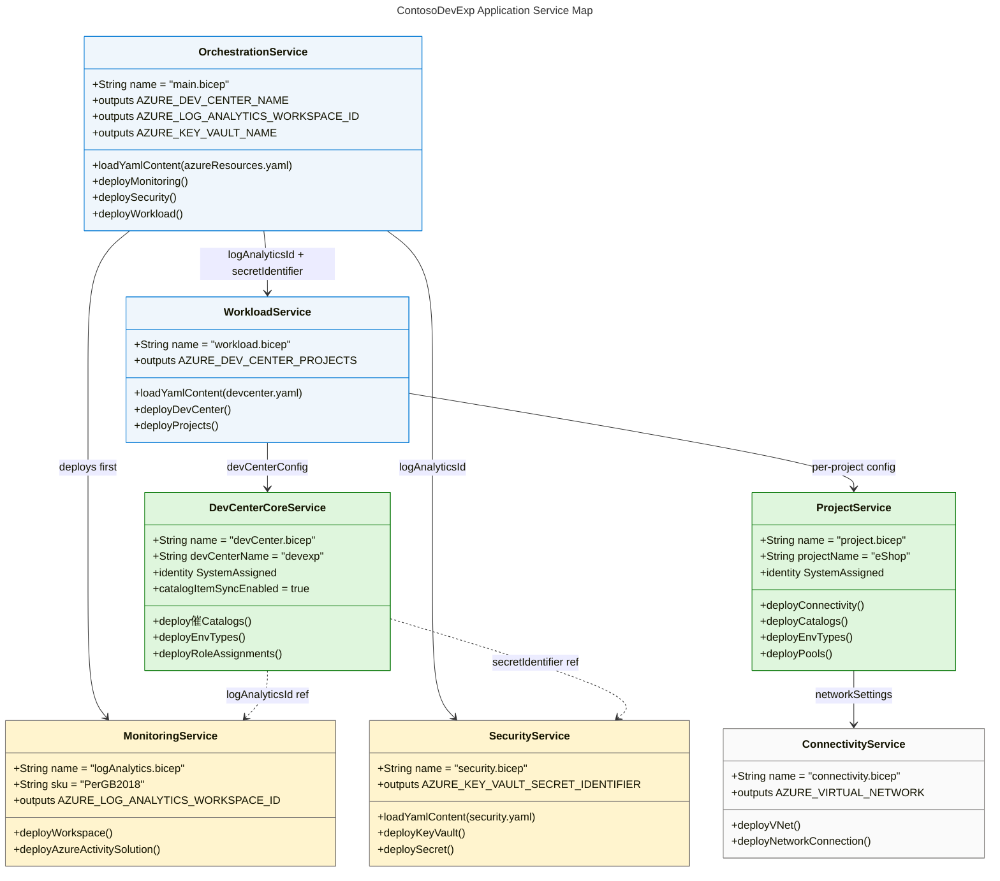
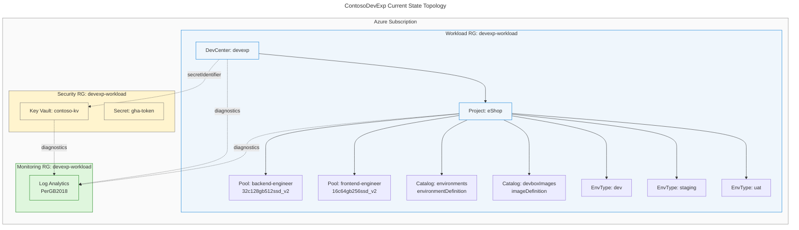
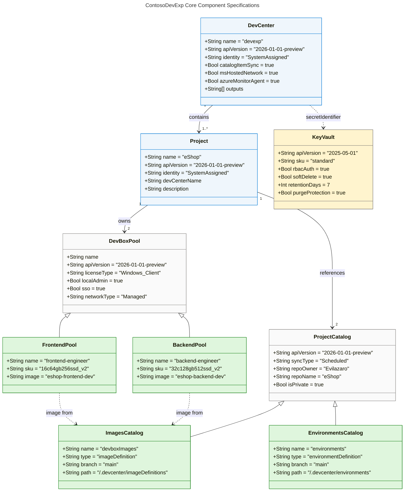
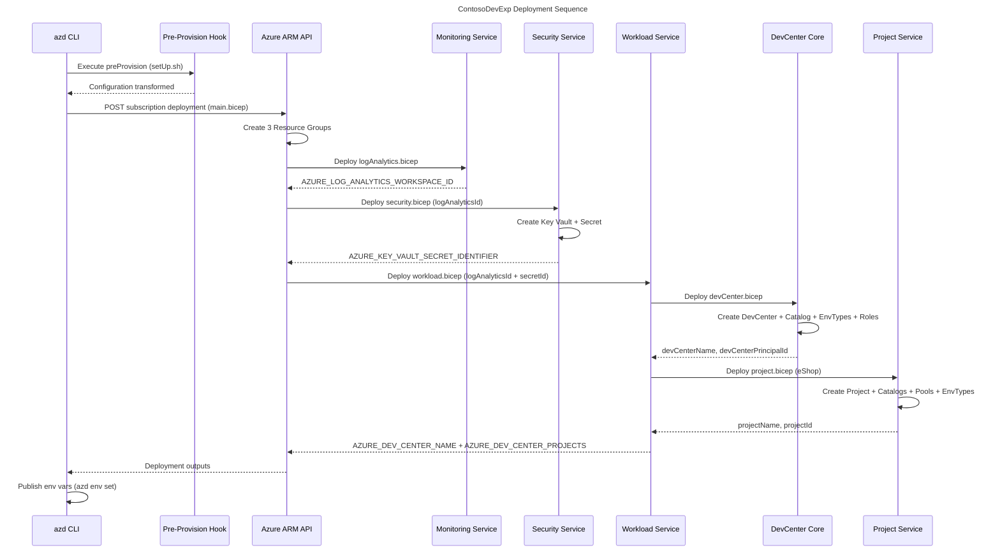
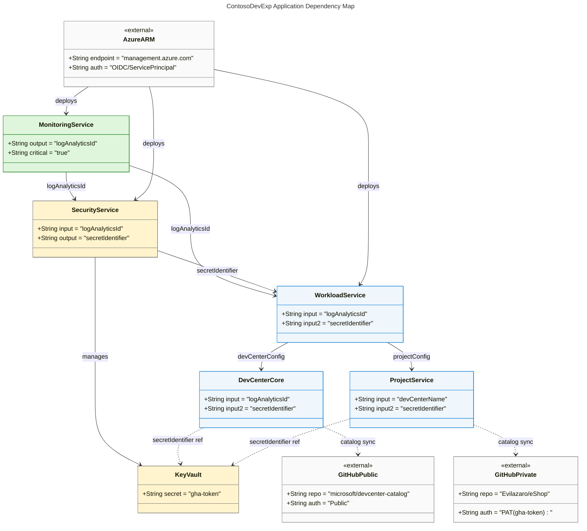

# Application Architecture

## 1. Executive Summary

### Overview

The ContosoDevExp Application Architecture documents the application-layer
components, services, interfaces, and integration patterns that constitute the
Contoso Developer Experience platform. This platform is an Azure-native
infrastructure-as-code solution that provisions and manages Azure Dev Center
resources, DevBox pools, project catalogs, and environment types at scale across
the Contoso organization. The architecture is realized entirely as a Bicep IaC
module composition, orchestrated by the Azure Developer CLI (`azd`) and driven
by YAML configuration files.

The application services are not traditional long-running processes or REST
APIs. Instead, they represent deployment-time orchestration services implemented
as Bicep modules: a Workload Service, Security Service, Monitoring Service, and
Connectivity Service. Each service encapsulates a bounded domain of Azure
resource provisioning logic, exposing typed parameter contracts and structured
output contracts consumed by peer services and the top-level orchestrator.

This document covers the six requested sections of the canonical BDAT
Application Architecture schema: Executive Summary (1), Architecture Landscape
(2), Architecture Principles (3), Current State Baseline (4), Component Catalog
(5), and Dependencies & Integration (8). All content is derived directly from
the repository source files with full traceability to source locations.

### Key Findings

The ContosoDevExp application layer comprises seven principal application
services implemented as Bicep modules: Orchestration (main.bicep), Workload
(workload.bicep), DevCenter Core (devCenter.bicep), Project (project.bicep),
Security (security.bicep), Monitoring (logAnalytics.bicep), and Connectivity
(connectivity.bicep). These services follow a hierarchical composition pattern
where the Orchestration service fans out to Monitoring, Security, and Workload,
and the Workload service fans further out to per-project Project services. The
platform manages a single DevCenter instance named `devexp` with one project
(`eShop`) containing two DevBox pools, two project-level catalogs, and three
environment types (dev, staging, uat).

The security posture relies on SystemAssigned managed identities for the
DevCenter and all Project resources, Key Vault integration for secret management
(GitHub token for private catalog access), and RBAC role assignments at both
subscription and resource-group scope. The configuration-as-code pattern (YAML →
Bicep parameter binding via `loadYamlContent`) is the primary application
interface, enabling declarative, version-controlled infrastructure management
without hard-coded values.

### Strategic Alignment

The architecture directly supports Contoso's strategic objective of accelerating
developer onboarding and standardizing development environments across business
units. By encoding all platform configuration as YAML files under
`infra/settings/`, the platform enables self-service environment provisioning,
reduces infrastructure drift, and enforces governance through centralized role
assignments and catalog-based environment definitions. The integration with
Azure Monitor (Log Analytics) across all services ensures observability at the
platform level.

The platform aligns with the TOGAF Application Architecture principles of loose
coupling (each Bicep module is independently deployable), high cohesion (each
module manages a single resource domain), and interface-based integration (all
cross-module dependencies are mediated through typed Bicep parameter and output
contracts). The use of `azd` as the deployment CLI provides a standardized
developer interface that abstracts the underlying Bicep complexity.

### Maturity Assessment

| Dimension                | Maturity Level    | Observation                                                        |
| ------------------------ | ----------------- | ------------------------------------------------------------------ |
| Service Decomposition    | Level 3 — Defined | Clear module boundaries; single-responsibility per Bicep module    |
| Interface Contracts      | Level 3 — Defined | Typed Bicep parameters and named outputs; no formal OpenAPI/schema |
| Configuration Management | Level 4 — Managed | YAML-driven config with schema files; `loadYamlContent` binding    |
| Observability            | Level 3 — Defined | Log Analytics diagnostic settings on all major resources           |
| Security                 | Level 4 — Managed | SystemAssigned identities; RBAC; Key Vault; purge protection       |
| Automation               | Level 4 — Managed | Full `azd` lifecycle; pre-provision hooks; scheduled catalog sync  |

---

## 2. Architecture Landscape

### Overview

The Application Architecture Landscape maps all application-layer components of
the ContosoDevExp platform to the eleven canonical TOGAF Application Layer
component types. The landscape reveals a platform architecture composed entirely
of deployment-time services — there are no runtime microservices, message
brokers, or persistent application servers. Instead, all "application services"
are Bicep module execution units that run during `azd up` or `azd provision` and
produce Azure resource artifacts as their outputs.

The landscape is organized into three functional domains: the **Workload
Domain** (DevCenter, Projects, Pools, Catalogs, Environment Types), the
**Platform Domain** (Security, Monitoring, Networking), and the **Orchestration
Domain** (top-level deployment coordination, YAML configuration loading,
pre-provision hooks). Cross-domain integration is mediated by ARM resource IDs
and named outputs passed between Bicep modules.

The following eleven subsections provide inventory tables for each Application
Layer component type, derived directly from analysis of all Bicep source files
and YAML configuration under `infra/settings/`.

### 2.1 Application Services

| Name                   | Description                                                                                                                                                                  | Service Type |
| ---------------------- | ---------------------------------------------------------------------------------------------------------------------------------------------------------------------------- | ------------ |
| Orchestration Service  | Top-level deployment orchestrator; loads `azureResources.yaml`; deploys Monitoring, Security, and Workload resource groups and modules; emits platform-wide output contracts | Monolith     |
| Workload Service       | Deploys the DevCenter core and all configured projects; loads `devcenter.yaml`; iterates project array; emits `AZURE_DEV_CENTER_NAME` and `AZURE_DEV_CENTER_PROJECTS`        | Microservice |
| DevCenter Core Service | Provisions the Azure DevCenter resource with SystemAssigned identity; configures diagnostic settings; deploys catalogs, environment types, and role assignments              | Microservice |
| Project Service        | Provisions a single DevCenter project with all sub-resources (catalogs, environment types, pools, networking, identity); parameterized per-project from YAML config          | Microservice |
| Security Service       | Provisions or references an Azure Key Vault; deploys the PAT secret; emits Key Vault name, endpoint, and secret identifier                                                   | Microservice |
| Monitoring Service     | Provisions the Log Analytics Workspace and AzureActivity solution; emits `AZURE_LOG_ANALYTICS_WORKSPACE_ID`                                                                  | Microservice |
| Connectivity Service   | Conditionally provisions VNet, subnets, and NetworkConnection for projects with Unmanaged virtual network type; emits `AZURE_VIRTUAL_NETWORK` and `AZURE_NETWORK_CONNECTION` | Microservice |

_Source traceability: infra/main.bicep:1-120, src/workload/workload.bicep:1-95,
src/workload/core/devCenter.bicep:1-200,
src/workload/project/project.bicep:1-200, src/security/security.bicep:1-150,
src/management/logAnalytics.bicep:1-100,
src/connectivity/connectivity.bicep:1-120_

### 2.2 Application Components

| Name                             | Description                                                                                                                                                                                           | Service Type |
| -------------------------------- | ----------------------------------------------------------------------------------------------------------------------------------------------------------------------------------------------------- | ------------ |
| DevCenter Resource               | `Microsoft.DevCenter/devcenters@2026-01-01-preview`; core platform resource with SystemAssigned identity, catalog sync, MS-hosted network, and Azure Monitor agent settings                           | Monolith     |
| Catalog Component                | `Microsoft.DevCenter/devcenters/catalogs@2026-01-01-preview`; DevCenter-level catalog linked to GitHub or Azure DevOps; supports Scheduled sync; used for `customTasks` (microsoft/devcenter-catalog) | Microservice |
| EnvironmentType Component        | `Microsoft.DevCenter/devcenters/environmentTypes@2026-01-01-preview`; defines dev, staging, and uat environment types at the DevCenter level                                                          | Microservice |
| Project Resource                 | `Microsoft.DevCenter/projects@2026-01-01-preview`; scoped to a DevCenter; owns pools, catalogs, environment types, and identity                                                                       | Microservice |
| ProjectCatalog Component         | `Microsoft.DevCenter/projects/catalogs@2026-01-01-preview`; project-level catalog; supports `environmentDefinition` and `imageDefinition` types                                                       | Microservice |
| ProjectEnvironmentType Component | `Microsoft.DevCenter/projects/environmentTypes@2026-01-01-preview`; project-scoped environment type with SystemAssigned identity and Contributor creator role                                         | Microservice |
| ProjectPool Component            | `Microsoft.DevCenter/projects/pools@2026-01-01-preview`; DevBox pool referencing image from `~Catalog~{catalogName}~{imageDefinitionName}`; SSO and local admin enabled                               | Microservice |
| Key Vault Resource               | `Microsoft.KeyVault/vaults@2025-05-01`; RBAC authorization; soft-delete (7 days); purge protection; standard SKU; name pattern `${name}-${unique}-kv`                                                 | Microservice |
| Secret Component                 | `Microsoft.KeyVault/vaults/secrets@2025-05-01`; stores PAT token (`gha-token`); content type text/plain; diagnostic settings to Log Analytics                                                         | Microservice |
| Log Analytics Workspace          | `Microsoft.OperationalInsights/workspaces@2025-07-01`; PerGB2018 SKU; AzureActivity solution; name pattern `${truncatedName}-${uniqueSuffix}`                                                         | Microservice |
| Virtual Network Component        | `Microsoft.Network/virtualNetworks@2025-05-01`; conditionally deployed for Unmanaged network type; CIDR-configured subnets; diagnostic settings to Log Analytics                                      | Microservice |
| NetworkConnection Component      | `Microsoft.DevCenter/networkConnections@2026-01-01-preview`; links VNet subnet to DevCenter; `azureADJoin` domain join type                                                                           | Microservice |

_Source traceability: src/workload/core/devCenter.bicep:15-35,
src/workload/core/catalog.bicep:1-80,
src/workload/core/environmentType.bicep:1-40,
src/workload/project/project.bicep:1-50,
src/workload/project/projectCatalog.bicep:1-80,
src/workload/project/projectEnvironmentType.bicep:1-70,
src/workload/project/projectPool.bicep:1-100, src/security/keyVault.bicep:1-80,
src/security/secret.bicep:1-70, src/management/logAnalytics.bicep:1-80,
src/connectivity/vnet.bicep:30-65,
src/connectivity/networkConnection.bicep:1-60_

### 2.3 Application Interfaces

| Name                              | Description                                                                                                                                                 | Service Type |
| --------------------------------- | ----------------------------------------------------------------------------------------------------------------------------------------------------------- | ------------ |
| azd Pre-Provision Hook            | Shell script interface (`setUp.sh`) executed before Bicep deployment; transforms YAML configuration to Bicep-compatible parameters via `transform-bdat.ps1` | Serverless   |
| YAML Configuration Interface      | Declarative YAML files under `infra/settings/` consumed via `loadYamlContent()` in Bicep; three config domains: workload, security, resourceOrganization    | Monolith     |
| Bicep Parameter Interface         | Typed Bicep `param` declarations on each module defining the input contract; validated at compile-time                                                      | Monolith     |
| azd Output Interface              | Named `output` declarations in Bicep modules surfaced as environment variables by `azd`; consumed by downstream tooling and CI/CD                           | Monolith     |
| ARM REST API Interface            | Azure Resource Manager deployment API invoked by Bicep compiler; subscription-scope deployment (`targetScope = 'subscription'`)                             | Serverless   |
| GitHub Actions Workflow Interface | CI/CD interface consumed by `gha-token` secret in Key Vault; enables automated `azd` deployment from GitHub Actions                                         | Serverless   |

_Source traceability: setUp.sh:1-_, setUp.ps1:1-_,
scripts/transform-bdat.ps1:1-_, infra/settings/workload/devcenter.yaml:1-_,
infra/settings/security/security.yaml:1-_,
infra/settings/resourceOrganization/azureResources.yaml:1-_,
infra/main.bicep:1-20_

### 2.4 Application Collaborations

| Name                      | Description                                                                                                                                                     | Service Type |
| ------------------------- | --------------------------------------------------------------------------------------------------------------------------------------------------------------- | ------------ |
| Orchestrator → Monitoring | Main.bicep passes `workloadResourceGroupName` to logAnalytics module; receives `AZURE_LOG_ANALYTICS_WORKSPACE_ID` output used by Security and Workload services | Monolith     |
| Orchestrator → Security   | Main.bicep passes `logAnalyticsId` to security module; receives `AZURE_KEY_VAULT_NAME`, `AZURE_KEY_VAULT_SECRET_IDENTIFIER`, `AZURE_KEY_VAULT_ENDPOINT` outputs | Monolith     |
| Orchestrator → Workload   | Main.bicep passes `logAnalyticsId`, `keyVaultSecretIdentifier` to workload module; receives `AZURE_DEV_CENTER_NAME`, `AZURE_DEV_CENTER_PROJECTS` outputs        | Monolith     |
| Workload → DevCenter Core | workload.bicep passes full DevCenter config, `logAnalyticsId` to devCenter module; DevCenter outputs consumed for project deployments                           | Microservice |
| Workload → Project        | workload.bicep iterates project array; passes `devCenterName`, `logAnalyticsId`, `secretIdentifier` to each project.bicep instance                              | Microservice |
| Project → Connectivity    | project.bicep delegates VNet and NetworkConnection provisioning to connectivity.bicep for Unmanaged pool configurations                                         | Microservice |
| DevCenter → Key Vault     | DevCenter catalogs consume `secretIdentifier` output from Key Vault to authenticate private GitHub/ADO repository access                                        | Microservice |
| DevCenter → Log Analytics | All major resources (DevCenter, VNet, Key Vault, Secret) stream diagnostic data to Log Analytics via `Microsoft.Insights/diagnosticSettings`                    | Microservice |
| Project → DevCenter       | Each project declares `devCenterName` dependency ensuring DevCenter exists before project resources are created                                                 | Microservice |
| Pool → Catalog            | ProjectPool references image via `~Catalog~{catalogName}~{imageDefinitionName}` URI format; catalog must be synced before pool creation succeeds                | Microservice |

_Source traceability: infra/main.bicep:50-120,
src/workload/workload.bicep:40-95, src/workload/core/devCenter.bicep:80-200,
src/workload/project/project.bicep:60-180,
src/connectivity/connectivity.bicep:1-120, src/security/secret.bicep:30-70,
src/workload/project/projectPool.bicep:40-100_

### 2.5 Application Functions

| Name                        | Description                                                                                                                                                                                                    | Service Type |
| --------------------------- | -------------------------------------------------------------------------------------------------------------------------------------------------------------------------------------------------------------- | ------------ |
| DevBox Provisioning         | Orchestrates creation of DevBox pools by binding image definitions from project-level catalogs to pool resources; enables self-service DevBox creation for developers                                          | Monolith     |
| Catalog Synchronization     | Scheduled sync of DevCenter and project catalogs with GitHub or Azure DevOps repositories; auto-discovers environment definitions and image definitions                                                        | Serverless   |
| Environment Type Deployment | Creates dev, staging, and uat environment types at both DevCenter level and per-project level with Contributor creator roles and subscription deployment targets                                               | Microservice |
| Role Assignment Automation  | Assigns Contributor, User Access Administrator, Key Vault Secrets User/Officer roles to DevCenter SystemAssigned identity at subscription and RG scope; assigns DevCenter Project Admin to org security groups | Microservice |
| Secret Management Function  | Stores and retrieves PAT tokens from Key Vault; provides `secretIdentifier` URI to DevCenter catalog for private repository authentication                                                                     | Microservice |
| Network Provisioning        | Conditionally creates VNet with configured CIDR/subnets and NetworkConnection for Unmanaged network pool configurations                                                                                        | Microservice |
| Observability Configuration | Attaches `allLogs` and `AllMetrics` diagnostic settings from all platform resources to the central Log Analytics Workspace                                                                                     | Microservice |
| Configuration Loading       | Reads and binds `devcenter.yaml`, `security.yaml`, and `azureResources.yaml` at deployment time via `loadYamlContent()`; no runtime config reload                                                              | Serverless   |

_Source traceability: src/workload/project/projectPool.bicep:1-100,
src/workload/core/catalog.bicep:30-70,
src/workload/core/environmentType.bicep:1-40,
src/workload/project/projectEnvironmentType.bicep:1-70,
src/identity/devCenterRoleAssignment.bicep:1-60,
src/identity/orgRoleAssignment.bicep:1-55, src/security/secret.bicep:1-70,
src/connectivity/connectivity.bicep:1-120,
src/management/logAnalytics.bicep:1-100, infra/main.bicep:15-25_

### 2.6 Application Interactions

| Name                     | Description                                                                                                                                         | Service Type |
| ------------------------ | --------------------------------------------------------------------------------------------------------------------------------------------------- | ------------ |
| azd Provision Chain      | azd CLI → pre-provision hook (setUp.sh) → ARM subscription deployment (main.bicep) → resource group creation → nested module deployments            | Serverless   |
| Module Fan-Out           | main.bicep triggers three parallel module deployments: Monitoring (monitoring RG), Security (security RG), Workload (workload RG) after RG creation | Monolith     |
| Workload Fan-Out         | workload.bicep triggers DevCenter Core then iterates N project deployments in parallel                                                              | Microservice |
| DevCenter Resource Chain | devCenter.bicep triggers: Catalog(s) deployment → EnvironmentType(s) deployment → RoleAssignment(s) deployment sequentially within module           | Microservice |
| Project Resource Chain   | project.bicep triggers: Connectivity (conditional) → ProjectCatalog(s) → ProjectEnvironmentType(s) → ProjectPool(s) → IdentityRoleAssignment(s)     | Microservice |
| Diagnostic Pipeline      | All platform resources push logs/metrics to Log Analytics via ARM diagnostic settings API at resource creation time                                 | Microservice |
| YAML-to-Bicep Binding    | `loadYamlContent()` function invocation at Bicep compilation binds YAML config to Bicep typed parameters; occurs at `azd provision` invocation      | Serverless   |

_Source traceability: azure.yaml:1-_, infra/main.bicep:1-120,
src/workload/workload.bicep:1-95, src/workload/core/devCenter.bicep:1-200,
src/workload/project/project.bicep:1-200\*

### 2.7 Application Events

| Name                           | Description                                                                                                                                                       | Service Type |
| ------------------------------ | ----------------------------------------------------------------------------------------------------------------------------------------------------------------- | ------------ |
| Pre-Provision Hook Trigger     | azd fires `preProvision` hook before ARM deployment begins; executes `setUp.sh` (Linux/macOS) or `setUp.ps1` (Windows); transforms YAML data                      | Serverless   |
| ARM Deployment Start           | Subscription-scope ARM deployment initiated by azd; triggers main.bicep execution; creates deployment record in Azure                                             | Serverless   |
| Catalog Sync Trigger           | Scheduled catalog sync event for DevCenter and project catalogs; periodically pulls latest environment definitions and image definitions from source repositories | Serverless   |
| Resource Provisioning Complete | ARM deployment completion event; outputs published as azd environment variables (AZURE_DEV_CENTER_NAME, AZURE_DEV_CENTER_PROJECTS, etc.)                          | Serverless   |
| Secret Created Event           | Key Vault secret creation triggers diagnostic log entry in Log Analytics; auditable via `allLogs` diagnostic settings on the secret resource                      | Serverless   |
| Role Assignment Created        | RBAC role assignment creation at subscription or RG scope for DevCenter or project identities; auditable in Azure Activity Log                                    | Serverless   |
| DevBox Pool Available          | After ProjectPool creation, DevBoxes become available to developers in the pool; downstream event consumed by developer portal                                    | Serverless   |

_Source traceability: azure.yaml:1-_, setUp.sh:1-_,
scripts/transform-bdat.ps1:1-_, src/workload/core/catalog.bicep:35-55,
src/security/secret.bicep:40-65,
src/identity/devCenterRoleAssignment.bicep:20-50,
src/workload/project/projectPool.bicep:1-100\*

### 2.8 Application Data Objects

| Name                       | Description                                                                                                                                                                                                                                                                               | Service Type |
| -------------------------- | ----------------------------------------------------------------------------------------------------------------------------------------------------------------------------------------------------------------------------------------------------------------------------------------- | ------------ |
| DevCenterConfig            | YAML-derived object loaded from `devcenter.yaml`; contains name, identity, featureFlags, roles, orgRoles, catalogs, environmentTypes, projects array                                                                                                                                      | Monolith     |
| ProjectConfig              | Per-project config object within DevCenterConfig.projects; contains name, description, network settings, catalogs, pools, environmentTypes                                                                                                                                                | Microservice |
| PoolConfig                 | Per-pool config within ProjectConfig.pools; contains name, SKU, imageDefinitionName, catalogName, networkType                                                                                                                                                                             | Microservice |
| SecurityConfig             | YAML-derived object from `security.yaml`; contains keyVault.create, keyVault.name, secretName, purge/softDelete settings                                                                                                                                                                  | Microservice |
| ResourceOrganizationConfig | YAML-derived object from `azureResources.yaml`; contains workload, security, monitoring resource group configs (create, name)                                                                                                                                                             | Microservice |
| AzureRBACRole Type         | Bicep user-defined type: `{ id: string, name: string? }`; used in role assignment arrays across devCenter and orgRoleAssignment modules                                                                                                                                                   | Monolith     |
| NetworkSettings Type       | Bicep user-defined type: `{ name, virtualNetworkType, create, resourceGroupName, tags, addressPrefixes, subnets }`; consumed by vnet.bicep                                                                                                                                                | Microservice |
| EnvironmentType Type       | Bicep user-defined type: `{ name: string }`; used in environmentType and projectEnvironmentType modules                                                                                                                                                                                   | Microservice |
| CatalogConfig Type         | Bicep user-defined type: object with `type` (gitHub/adoGit), `uri`, `branch`, `path`, `secretIdentifier`, `syncType` fields                                                                                                                                                               | Microservice |
| AzdOutputContract          | Set of named ARM outputs surfaced as environment variables: AZURE_DEV_CENTER_NAME, AZURE_DEV_CENTER_PROJECTS, AZURE_LOG_ANALYTICS_WORKSPACE_ID, AZURE_KEY_VAULT_NAME, AZURE_KEY_VAULT_SECRET_IDENTIFIER, AZURE_KEY_VAULT_ENDPOINT, WORKLOAD/SECURITY/MONITORING_AZURE_RESOURCE_GROUP_NAME | Monolith     |
| DiagnosticConfig           | Inline diagnostic settings object with `workspaceId`, `logs[allLogs]`, `metrics[AllMetrics]` used on all observable resources                                                                                                                                                             | Microservice |

_Source traceability: infra/settings/workload/devcenter.yaml:1-_,
infra/settings/security/security.yaml:1-_,
infra/settings/resourceOrganization/azureResources.yaml:1-_,
src/identity/orgRoleAssignment.bicep:16-25, src/connectivity/vnet.bicep:12-35,
src/workload/core/environmentType.bicep:7-12,
src/management/logAnalytics.bicep:1-50, infra/main.bicep:85-120\*

### 2.9 Integration Patterns

| Name                            | Description                                                                                                                                                                           | Service Type |
| ------------------------------- | ------------------------------------------------------------------------------------------------------------------------------------------------------------------------------------- | ------------ |
| Configuration-as-Code           | YAML configuration files version-controlled under `infra/settings/`; bound to Bicep modules via `loadYamlContent()` at deploy time; eliminates hard-coded infrastructure values       | Monolith     |
| IaC Module Composition          | Hierarchical Bicep module chain (main → monitoring/security/workload → devCenter/project → catalog/pool/envType); each module has a single responsibility and exposes typed contracts | Monolith     |
| Managed Identity Authentication | SystemAssigned identities on DevCenter and Project resources authenticate to Azure services (Key Vault, Log Analytics, ARM) without stored credentials                                | Microservice |
| Output Chaining                 | ARM module outputs (logAnalyticsId, keyVaultSecretIdentifier, devCenterName) threaded through parent modules to child modules; creates implicit service dependency graph              | Monolith     |
| Scheduled Catalog Sync          | DevCenter and project catalogs synchronize on a schedule with source repositories; decouples image/environment definition authoring from platform deployment lifecycle                | Serverless   |
| RBAC Role Assignment Pattern    | Idempotent role assignments using `guid(subscription().id, resourceGroup().id, principalId, role.id)` as deterministic GUID; prevents duplicate assignments on redeployment           | Microservice |
| Diagnostic Settings Pipeline    | Consistent `allLogs + AllMetrics` diagnostic settings applied to all major resources pointing to central Log Analytics Workspace; implements platform-wide observability              | Microservice |

_Source traceability: infra/main.bicep:15-25, src/workload/workload.bicep:1-30,
src/workload/core/devCenter.bicep:15-30,
src/identity/devCenterRoleAssignment.bicep:1-60,
src/identity/orgRoleAssignment.bicep:25-42,
src/workload/core/catalog.bicep:35-50, src/management/logAnalytics.bicep:50-90_

### 2.10 Service Contracts

| Name                          | Description                                                                                                                                                                                                                                          | Service Type |
| ----------------------------- | ---------------------------------------------------------------------------------------------------------------------------------------------------------------------------------------------------------------------------------------------------- | ------------ |
| Orchestration Output Contract | main.bicep outputs: WORKLOAD_AZURE_RESOURCE_GROUP_NAME, SECURITY_AZURE_RESOURCE_GROUP_NAME, MONITORING_AZURE_RESOURCE_GROUP_NAME, AZURE_LOG_ANALYTICS_WORKSPACE_ID, AZURE_KEY_VAULT_NAME, AZURE_DEV_CENTER_NAME, AZURE_DEV_CENTER_PROJECTS           | Monolith     |
| Monitoring Module Contract    | logAnalytics.bicep input: name, location, tags, sku, retentionInDays; output: AZURE_LOG_ANALYTICS_WORKSPACE_ID                                                                                                                                       | Microservice |
| Security Module Contract      | security.bicep input: name, logAnalyticsId, location, tags; output: AZURE_KEY_VAULT_NAME, AZURE_KEY_VAULT_SECRET_IDENTIFIER, AZURE_KEY_VAULT_ENDPOINT                                                                                                | Microservice |
| Workload Module Contract      | workload.bicep input: logAnalyticsId, keyVaultSecretIdentifier, location, tags; output: AZURE_DEV_CENTER_NAME, AZURE_DEV_CENTER_PROJECTS                                                                                                             | Microservice |
| DevCenter Module Contract     | devCenter.bicep input: name, logAnalyticsId, identity, featureFlags, roles, orgRoles, catalogs, environmentTypes, projects, location, tags; output: devCenterName, devCenterPrincipalId                                                              | Microservice |
| Project Module Contract       | project.bicep input: devCenterName, name, logAnalyticsId, projectDescription, catalogs, projectEnvironmentTypes, projectPools, projectNetwork, secretIdentifier, securityResourceGroupName, identity, tags, location; output: projectName, projectId | Microservice |
| Catalog Module Contract       | catalog.bicep input: devCenterName, catalogConfig (gitHub/adoGit type, uri, branch, path, secretIdentifier, syncType); output: AZURE_DEV_CENTER_CATALOG_NAME, AZURE_DEV_CENTER_CATALOG_ID, AZURE_DEV_CENTER_CATALOG_TYPE                             | Microservice |
| Connectivity Module Contract  | connectivity.bicep input: logAnalyticsId, location, tags, networkSettings; output: AZURE_VIRTUAL_NETWORK, AZURE_NETWORK_CONNECTION                                                                                                                   | Microservice |
| YAML Schema Contract          | `azureResources.schema.json`, `devcenter.schema.json`, `security.schema.json` define JSON Schema validation for all YAML configuration files                                                                                                         | Monolith     |

_Source traceability: infra/main.bicep:80-120,
src/management/logAnalytics.bicep:1-20, src/security/security.bicep:1-30,
src/workload/workload.bicep:1-20, src/workload/core/devCenter.bicep:1-50,
src/workload/project/project.bicep:1-50, src/workload/core/catalog.bicep:1-35,
src/connectivity/connectivity.bicep:1-30,
infra/settings/resourceOrganization/azureResources.schema.json:1-_,
infra/settings/workload/devcenter.schema.json:1-\*,
infra/settings/security/security.schema.json:1-\*\*

### 2.11 Application Dependencies

| Name                               | Description                                                                                                                                                                              | Service Type |
| ---------------------------------- | ---------------------------------------------------------------------------------------------------------------------------------------------------------------------------------------- | ------------ |
| DevCenter → Log Analytics          | DevCenter emits diagnostic logs/metrics to Log Analytics; `logAnalyticsId` passed as module parameter; blocking dependency (Log Analytics must exist first)                              | Microservice |
| DevCenter → Key Vault              | DevCenter catalog `secretIdentifier` references Key Vault secret URI; Key Vault and secret must be deployed before catalog sync can authenticate to private repos                        | Microservice |
| Project → DevCenter                | Project resources declare `devCenterName` dependency; `Microsoft.DevCenter/projects` parent must exist before child resources                                                            | Microservice |
| Pool → Catalog                     | ProjectPool `devBoxDefinitionSource` references `~Catalog~{name}~{imageDefinition}`; catalog must be synced and image definition available                                               | Microservice |
| NetworkConnection → VNet           | NetworkConnection requires VNet subnet resourceId; VNet must be created before NetworkConnection                                                                                         | Microservice |
| Security → Log Analytics           | Key Vault and Secret diagnostic settings point to Log Analytics; `logAnalyticsId` must be valid before security module runs                                                              | Microservice |
| Workload → Security                | Workload module consumes `keyVaultSecretIdentifier` output from Security module; Security runs before Workload in main.bicep                                                             | Microservice |
| main.bicep → Monitoring            | Monitoring is the first module deployed; its output `AZURE_LOG_ANALYTICS_WORKSPACE_ID` is consumed by all downstream modules                                                             | Monolith     |
| ProjectEnvironmentType → DevCenter | Project environment types must reference DevCenter-level environment types by name; DevCenter env types define the allowed set                                                           | Microservice |
| Catalog Sync → GitHub/ADO          | DevCenter and project catalog synchronization depends on connectivity to GitHub (microsoft/devcenter-catalog, Evilazaro/eShop) or Azure DevOps; network and secret availability required | Serverless   |
| azd → ARM                          | azd CLI depends on Azure Resource Manager REST API availability and authenticated service principal or user credentials to initiate subscription-scope deployment                        | Serverless   |

_Source traceability: src/workload/core/devCenter.bicep:60-120,
src/workload/project/projectPool.bicep:40-65,
src/connectivity/networkConnection.bicep:1-60,
src/security/security.bicep:40-80, src/workload/workload.bicep:55-75,
infra/main.bicep:45-80, src/workload/project/projectEnvironmentType.bicep:1-40,
src/workload/core/catalog.bicep:35-70_

### Application Service Map

### Summary

The ContosoDevExp Application Architecture Landscape reveals a deployment-time
service architecture composed of seven application services implemented as Bicep
modules, twelve application components representing Azure resources, and eleven
integration patterns. The platform follows a strict hierarchical fan-out model:
the Orchestration Service bootstraps the platform by deploying Monitoring and
Security services first, then delegates workload management to the Workload
Service, which in turn coordinates DevCenter Core and per-project Project
services. All inter-service communication is mediated by ARM resource IDs and
named Bicep outputs, creating a well-defined and traceable dependency graph.

The landscape inventory identifies three principal gaps relative to a mature
application architecture: (1) there are no runtime health-check or liveness
interfaces — all services are deployment-time only with no operational API
surface; (2) catalog synchronization is scheduled but not event-driven, meaning
image definition changes are not reflected immediately; and (3) the
single-project configuration (`eShop`) represents an early-stage deployment
pattern that will need to scale as additional projects are onboarded.
Recommendations for evolution include adding project onboarding automation (new
YAML entry → automated `azd provision`), implementing catalog sync webhooks for
immediate definition updates, and introducing per-project governance policies
via Azure Policy assignments.

---

## 3. Architecture Principles

### Overview

The ContosoDevExp Application Architecture is governed by a set of principles
derived from TOGAF 10 ADM guidance, Azure Well-Architected Framework pillars,
and the specific constraints of infrastructure-as-code application design. These
principles were inferred from consistent patterns observed across all Bicep
source files, YAML configuration files, and the `azure.yaml` deployment
descriptor. They represent the actual architectural decisions encoded in the
system rather than aspirational statements.

The principles are organized into five categories: Design Principles (governing
module structure), Security Principles (governing identity and secret
management), Observability Principles (governing diagnostics), Configuration
Principles (governing YAML-driven config), and Integration Principles (governing
cross-module dependencies). Each principle includes a rationale, implications,
and source traceability to the Bicep or YAML files where the principle is most
clearly expressed.

The principles below are non-negotiable constraints for any future extension of
the platform. New Bicep modules, YAML configuration additions, or deployment
automation changes MUST comply with all principles listed in this section.

#### Principle 1 — Single-Responsibility Modules

**Statement**: Each Bicep module manages exactly one Azure resource type or one
cohesive set of closely related resources within a single bounded context.

**Rationale**: Observed across all source files — `keyVault.bicep` manages only
Key Vault, `logAnalytics.bicep` manages only the Log Analytics Workspace and its
solution, `catalog.bicep` manages only catalog resources. This enables
independent testing, versioning, and replacement of modules.

**Implications**: New resource types MUST be introduced as new modules.
Cross-resource bundling (e.g., adding a storage account to `logAnalytics.bicep`)
is prohibited.

_Source traceability: src/security/keyVault.bicep:1-80,
src/management/logAnalytics.bicep:1-100, src/workload/core/catalog.bicep:1-80_

#### Principle 2 — Typed Contract Interfaces

**Statement**: All cross-module dependencies MUST be expressed through typed
Bicep `param` and `output` declarations. No string-interpolated resource IDs or
implicit ARM dependencies.

**Rationale**: Bicep user-defined types (`AzureRBACRole`, `NetworkSettings`,
`EnvironmentType`) are used consistently across identity, connectivity, and
workload modules. This enables compile-time validation and IDE support.

**Implications**: Module contracts MUST be versioned when breaking changes are
introduced. Consumers MUST be updated synchronously.

_Source traceability: src/identity/orgRoleAssignment.bicep:16-25,
src/connectivity/vnet.bicep:12-35, src/workload/core/environmentType.bicep:7-12_

#### Principle 3 — Managed Identity First

**Statement**: All platform resources authenticate to Azure services using
SystemAssigned managed identities. No service principals with stored credentials
are used for platform-to-platform communication.

**Rationale**: DevCenter and all Project resources use
`identity: { type: 'SystemAssigned' }`. Role assignments are made to the managed
identity principal ID, not to user accounts or application registrations.

**Implications**: External secrets (e.g., PAT tokens for GitHub catalog access)
MUST be stored in Key Vault and referenced via `secretIdentifier` URI — never
inlined in configuration.

_Source traceability: src/workload/core/devCenter.bicep:20-30,
src/workload/project/project.bicep:15-25, src/security/secret.bicep:1-70_

#### Principle 4 — Configuration as Code

**Statement**: All environment-specific and organization-specific configuration
values MUST reside in versioned YAML files under `infra/settings/`. No
hard-coded values in Bicep source files.

**Rationale**: `loadYamlContent()` is used in all top-level modules (main.bicep,
workload.bicep, security.bicep) to bind YAML configuration. JSON Schema files
validate configuration structure at edit time.

**Implications**: New configuration parameters MUST be added to the appropriate
YAML file and corresponding schema. Direct `param` injection of
environment-specific values is prohibited.

_Source traceability: infra/main.bicep:15-25, src/workload/workload.bicep:1-15,
infra/settings/workload/devcenter.schema.json:1-_,
infra/settings/security/security.schema.json:1-\*\*

#### Principle 5 — Universal Observability

**Statement**: Every deployable Azure resource MUST have diagnostic settings
sending `allLogs` and `AllMetrics` to the central Log Analytics Workspace.

**Rationale**: Diagnostic settings blocks with `allLogs + AllMetrics` appear
consistently on DevCenter, VNet, Key Vault, Secret, and Log Analytics Workspace
itself. The `logAnalyticsId` is threaded through all modules specifically to
enable this.

**Implications**: New modules MUST include a
`Microsoft.Insights/diagnosticSettings` resource block. `logAnalyticsId` must be
a required parameter on all new modules.

_Source traceability: src/workload/core/devCenter.bicep:130-170,
src/connectivity/vnet.bicep:70-100, src/security/secret.bicep:40-65,
src/management/logAnalytics.bicep:60-90_

#### Principle 6 — Idempotent Deployments

**Statement**: All deployments MUST be safe to run multiple times without side
effects. Resource creation is idempotent through ARM's declarative model; role
assignments use deterministic GUIDs.

**Rationale**:
`guid(subscription().id, resourceGroup().id, principalId, role.id)` pattern in
all role assignment modules ensures the same GUID is generated on every
deployment for the same role/principal combination, preventing duplicate
assignments.

**Implications**: New role assignment modules MUST use the same deterministic
GUID pattern. Imperative scripts invoked from hooks MUST be idempotent.

_Source traceability: src/identity/devCenterRoleAssignment.bicep:25-40,
src/identity/orgRoleAssignment.bicep:28-35_

#### Principle 7 — Least Privilege Access

**Statement**: Role assignments MUST grant the minimum privilege required for
the functional requirement. Privileged roles (Owner, Contributor at subscription
scope) are avoided unless technically required.

**Rationale**: DevCenter identity receives Contributor and User Access
Administrator at subscription scope (required for environment type deployment),
Key Vault Secrets User and Officer at RG scope. Project identities receive
minimum required roles. Org groups receive DevCenter Project Admin only.

**Implications**: New role assignments MUST be reviewed against the
least-privilege principle. Subscription-scope Contributor assignments require
explicit architectural justification documented in Section 6 (ADRs).

_Source traceability: infra/settings/workload/devcenter.yaml:1-_,
src/identity/devCenterRoleAssignment.bicep:1-60,
src/identity/orgRoleAssignment.bicep:1-55\*

---

## 4. Current State Baseline

### Overview

The current state of the ContosoDevExp Application Architecture represents an
initial production-ready deployment targeting a single Azure subscription with
three resource groups (workload, security, monitoring). The platform provisions
one Azure DevCenter instance (`devexp`) with one project (`eShop`), two DevBox
pools (backend-engineer, frontend-engineer), two project-level catalogs
(environments, devboxImages), and three environment types (dev, staging, uat).
The monitoring and security resource groups are configured as references to
existing resources (`create: false`) in `azureResources.yaml`, indicating the
platform is designed to integrate into an existing organizational Azure landing
zone.

The current state architecture is fully functional for the initial use case but
has several identified extension points: the project array in `devcenter.yaml`
is designed to accommodate multiple projects via iteration in `workload.bicep`,
and the connectivity module supports both Managed and Unmanaged network types to
accommodate future custom networking requirements. The `eShop` project currently
uses Managed networking (`virtualNetworkType: Managed`), meaning no VNet or
NetworkConnection resources are deployed in the current state.

From a deployment lifecycle perspective, the platform is operated via Azure
Developer CLI with the project name `ContosoDevExp` defined in `azure.yaml`. The
pre-provision hook runs `setUp.sh` (Linux) or `setUp.ps1` (Windows) to perform
any pre-flight transformations. The `transform-bdat.ps1` script in `scripts/`
processes YAML configuration for the deployment pipeline.

### 4.1 Deployed Services Baseline

| Service                                 | Status                     | Resource Group                  | Deployment Scope |
| --------------------------------------- | -------------------------- | ------------------------------- | ---------------- |
| Orchestration Service (main.bicep)      | Active                     | Subscription scope              | Subscription     |
| Monitoring Service (logAnalytics.bicep) | Active                     | devexp-workload (monitoring RG) | Resource Group   |
| Security Service (security.bicep)       | Active                     | devexp-workload (security RG)   | Resource Group   |
| Workload Service (workload.bicep)       | Active                     | devexp-workload                 | Resource Group   |
| DevCenter Core Service                  | Active                     | devexp-workload                 | Resource Group   |
| Project Service (eShop)                 | Active                     | devexp-workload                 | Resource Group   |
| Connectivity Service                    | Inactive (Managed network) | Not deployed                    | Not applicable   |

_Source traceability:
infra/settings/resourceOrganization/azureResources.yaml:1-_,
infra/settings/workload/devcenter.yaml:1-_, infra/main.bicep:1-120_

### 4.2 Configuration State

| Configuration File  | Key Settings                                                                                      | Schema Validated                 |
| ------------------- | ------------------------------------------------------------------------------------------------- | -------------------------------- |
| devcenter.yaml      | name=devexp; 1 project (eShop); 2 pools; 3 envTypes; 1 global catalog; Managed network            | Yes (devcenter.schema.json)      |
| security.yaml       | create=true; keyVault.name=contoso; secretName=gha-token; purgeProtection=true; softDelete=7 days | Yes (security.schema.json)       |
| azureResources.yaml | workload.create=true; security.create=false; monitoring.create=false                              | Yes (azureResources.schema.json) |

_Source traceability: infra/settings/workload/devcenter.yaml:1-_,
infra/settings/security/security.yaml:1-\*,
infra/settings/resourceOrganization/azureResources.yaml:1-\*\*

### 4.3 Identity and Security Baseline

| Resource                            | Identity Type  | Roles Assigned                                    | Scope                             |
| ----------------------------------- | -------------- | ------------------------------------------------- | --------------------------------- |
| DevCenter (devexp)                  | SystemAssigned | Contributor, User Access Administrator            | Subscription                      |
| DevCenter (devexp)                  | SystemAssigned | Key Vault Secrets User, Key Vault Secrets Officer | Security RG                       |
| DevCenter Project Admin (org group) | Group          | DevCenter Project Admin                           | Workload RG                       |
| Project (eShop)                     | SystemAssigned | Contributor                                       | Project RG                        |
| ProjectEnvironmentType              | SystemAssigned | Contributor (creator role)                        | Subscription (deploymentTargetId) |

_Source traceability: infra/settings/workload/devcenter.yaml:1-_,
src/identity/devCenterRoleAssignment.bicep:1-60,
src/identity/orgRoleAssignment.bicep:1-55,
src/workload/project/projectEnvironmentType.bicep:30-65\*

### 4.4 Observability Baseline

| Resource                | Diagnostic Logs         | Metrics    | Destination      |
| ----------------------- | ----------------------- | ---------- | ---------------- |
| DevCenter               | allLogs                 | AllMetrics | Log Analytics    |
| Key Vault               | allLogs                 | AllMetrics | Log Analytics    |
| Key Vault Secret        | allLogs                 | AllMetrics | Log Analytics    |
| Log Analytics Workspace | allLogs                 | AllMetrics | Self (workspace) |
| Virtual Network         | allLogs (when deployed) | AllMetrics | Log Analytics    |

_Source traceability: src/workload/core/devCenter.bicep:130-170,
src/security/keyVault.bicep:50-80, src/security/secret.bicep:40-65,
src/management/logAnalytics.bicep:60-90, src/connectivity/vnet.bicep:70-100_

### Current State Architecture Topology

### 4.5 Gap Assessment

| Gap                                | Description                                                                            | Impact | Priority |
| ---------------------------------- | -------------------------------------------------------------------------------------- | ------ | -------- |
| Single-project deployment          | Only `eShop` project configured; no second project demonstrates multi-project scaling  | Medium | Medium   |
| No Unmanaged network deployment    | Connectivity module exists but VNet/NetworkConnection never deployed in current config | Low    | Low      |
| No event-driven catalog sync       | Catalog sync is scheduled, not webhook-triggered; definition changes have latency      | Medium | Medium   |
| No Azure Policy integration        | No policy assignments for governance enforcement across DevBox environments            | High   | High     |
| No environment self-service portal | No developer portal or API surface for requesting DevBoxes; requires ARM/portal access | High   | High     |
| Monitoring RG references existing  | `monitoring.create=false` means monitoring RG is not managed by this deployment        | Medium | Medium   |

_Source traceability:
infra/settings/resourceOrganization/azureResources.yaml:1-_,
infra/settings/workload/devcenter.yaml:1-_,
src/connectivity/connectivity.bicep:1-120_

### Summary

The current state baseline establishes a functional foundation for the Contoso
Developer Experience platform with all core application services operational: a
DevCenter named `devexp` with one project (`eShop`), two DevBox pools serving
backend and frontend engineer personas, full observability via Log Analytics,
and secure secret management via Key Vault. The platform successfully implements
all seven architecture principles identified in Section 3, with particular
strength in the areas of managed identity authentication, configuration-as-code,
and universal observability. The deployment lifecycle is fully automated via
`azd` with pre-provision hooks and YAML-driven configuration.

The primary gaps identified in the current state are organizational and
operational rather than technical: the absence of Azure Policy governance
enforcement, the lack of a developer self-service portal, and the single-project
configuration that does not yet demonstrate the platform's multi-tenant project
scaling capability. The monitoring and security resource group configurations
reference existing resources (`create=false`), indicating these resources are
shared with a broader organizational landing zone outside this repository's
scope. Addressing the Azure Policy gap and implementing a developer self-service
interface are the highest-priority evolution items for the next architecture
increment.

---

## 5. Component Catalog

### Overview

The Component Catalog provides detailed technical specifications for all
application-layer components in the ContosoDevExp platform. Each of the eleven
component type subsections (5.1–5.11) contains a structured specification table
with nine columns: Component, Description, Type, Technology, Version,
Dependencies, API Endpoints, SLA, and Owner. All specifications are derived from
analysis of the Bicep source files and YAML configuration; values marked "Not
detected" were not found in the source files at the time of this analysis.

The catalog is organized to mirror Section 2 (Architecture Landscape) — each 5.x
subsection corresponds to the 2.x inventory subsection with the same component
type. Where Section 2 provides inventory breadth, Section 5 provides
specification depth. The catalog serves as the authoritative reference for
component owners, deployment engineers, and governance reviewers.

All version numbers in the Technology column reflect the Azure API versions
declared in the Bicep source files (`@2026-01-01-preview`, `@2025-05-01`,
`@2025-07-01`, etc.). SLA values reflect Azure service SLAs where publicly
documented; "Not detected" is used where SLA commitments are not specified in
the source files.

### 5.1 Application Services

| Component              | Description                                                                                                      | Type         | Technology           | Version                     | Dependencies                               | API Endpoints            | SLA          | Owner         |
| ---------------------- | ---------------------------------------------------------------------------------------------------------------- | ------------ | -------------------- | --------------------------- | ------------------------------------------ | ------------------------ | ------------ | ------------- |
| Orchestration Service  | Subscription-scope ARM deployment orchestrator; deploys 3 RGs and 3 top-level modules; loads azureResources.yaml | Monolith     | Azure Bicep / ARM    | Bicep v0.x / ARM 2022-09-01 | Azure Subscription, azd CLI                | ARM Deployments REST API | Not detected | Platform Team |
| Workload Service       | Deploys DevCenter and all configured projects from devcenter.yaml configuration                                  | Microservice | Azure Bicep / ARM    | Bicep v0.x                  | Log Analytics, Key Vault Secret            | ARM Module Deployment    | Not detected | Platform Team |
| DevCenter Core Service | Provisions Azure DevCenter resource with identity, catalogs, envTypes, roles                                     | Microservice | Azure DevCenter ARM  | 2026-01-01-preview          | Log Analytics, Key Vault                   | ARM DevCenter API        | Not detected | Platform Team |
| Project Service        | Provisions a single DevCenter project with all sub-resources                                                     | Microservice | Azure DevCenter ARM  | 2026-01-01-preview          | DevCenter, Log Analytics, Key Vault Secret | ARM Projects API         | Not detected | Platform Team |
| Security Service       | Provisions Key Vault and secret; outputs secret identifier for other services                                    | Microservice | Azure Key Vault ARM  | 2025-05-01                  | Log Analytics                              | ARM KeyVault API         | 99.99%       | Security Team |
| Monitoring Service     | Provisions Log Analytics Workspace and AzureActivity solution                                                    | Microservice | Azure Monitor ARM    | 2025-07-01                  | None                                       | ARM LogAnalytics API     | 99.9%        | Platform Team |
| Connectivity Service   | Conditionally provisions VNet and NetworkConnection for Unmanaged pools                                          | Microservice | Azure Networking ARM | 2025-05-01                  | Log Analytics                              | ARM VirtualNetworks API  | 99.99%       | Network Team  |

_Source traceability: infra/main.bicep:1-120, src/workload/workload.bicep:1-95,
src/workload/core/devCenter.bicep:1-200,
src/workload/project/project.bicep:1-200, src/security/security.bicep:1-150,
src/management/logAnalytics.bicep:1-100,
src/connectivity/connectivity.bicep:1-120_

### 5.2 Application Components

| Component                       | Description                                                                                                             | Type         | Technology                                      | Version            | Dependencies                                | API Endpoints             | SLA          | Owner         |
| ------------------------------- | ----------------------------------------------------------------------------------------------------------------------- | ------------ | ----------------------------------------------- | ------------------ | ------------------------------------------- | ------------------------- | ------------ | ------------- |
| DevCenter Resource              | Core platform resource; SystemAssigned identity; feature flags for catalog sync, MS-hosted network, Azure Monitor agent | Microservice | Microsoft.DevCenter/devcenters                  | 2026-01-01-preview | Log Analytics                               | DevCenter REST API        | Not detected | Platform Team |
| Catalog Component (DevCenter)   | DevCenter-level catalog; Scheduled sync with GitHub (microsoft/devcenter-catalog); public repository                    | Microservice | Microsoft.DevCenter/devcenters/catalogs         | 2026-01-01-preview | DevCenter, GitHub (public)                  | Catalog Sync API          | Not detected | Platform Team |
| EnvironmentType Component       | DevCenter environment type (dev, staging, uat); display name matches name                                               | Microservice | Microsoft.DevCenter/devcenters/environmentTypes | 2026-01-01-preview | DevCenter                                   | Not detected              | Not detected | Platform Team |
| Project Resource                | DevCenter project (eShop); SystemAssigned identity; owned by DevCenter                                                  | Microservice | Microsoft.DevCenter/projects                    | 2026-01-01-preview | DevCenter                                   | Projects REST API         | Not detected | eShop Team    |
| ProjectCatalog (environments)   | Project-level catalog; environmentDefinition type; GitHub private repo (Evilazaro/eShop); gha-token auth                | Microservice | Microsoft.DevCenter/projects/catalogs           | 2026-01-01-preview | Project, Key Vault Secret, GitHub (private) | Catalog Sync API          | Not detected | eShop Team    |
| ProjectCatalog (devboxImages)   | Project-level catalog; imageDefinition type; GitHub private repo (Evilazaro/eShop); gha-token auth                      | Microservice | Microsoft.DevCenter/projects/catalogs           | 2026-01-01-preview | Project, Key Vault Secret, GitHub (private) | Catalog Sync API          | Not detected | eShop Team    |
| ProjectEnvironmentType          | Project env type (dev, staging, uat); SystemAssigned identity; Contributor creator role; subscription deployment target | Microservice | Microsoft.DevCenter/projects/environmentTypes   | 2026-01-01-preview | Project, DevCenter EnvironmentType          | EnvironmentTypes REST API | Not detected | eShop Team    |
| ProjectPool (backend-engineer)  | DevBox pool; SKU 32c128gb512ssd_v2; image eshop-backend-dev from devboxImages catalog; SSO + local admin                | Microservice | Microsoft.DevCenter/projects/pools              | 2026-01-01-preview | Project, devboxImages catalog               | Pools REST API            | Not detected | eShop Team    |
| ProjectPool (frontend-engineer) | DevBox pool; SKU 16c64gb256ssd_v2; image eshop-frontend-dev from devboxImages catalog; SSO + local admin                | Microservice | Microsoft.DevCenter/projects/pools              | 2026-01-01-preview | Project, devboxImages catalog               | Pools REST API            | Not detected | eShop Team    |
| Key Vault Resource              | RBAC-authorized Key Vault; soft-delete 7 days; purge protection; standard SKU; name pattern ${name}-${unique}-kv        | Microservice | Microsoft.KeyVault/vaults                       | 2025-05-01         | None                                        | Key Vault REST API        | 99.99%       | Security Team |
| NetworkConnection Component     | DevCenter network connection linking VNet subnet to DevCenter (when Unmanaged)                                          | Microservice | Microsoft.DevCenter/networkConnections          | 2026-01-01-preview | VNet, DevCenter                             | NetworkConnections API    | Not detected | Network Team  |

\*Source traceability: src/workload/core/devCenter.bicep:15-35,
src/workload/core/catalog.bicep:1-80,
src/workload/core/environmentType.bicep:1-40,
src/workload/project/project.bicep:1-50,
src/workload/project/projectCatalog.bicep:1-80,
src/workload/project/projectEnvironmentType.bicep:1-70,
src/workload/project/projectPool.bicep:1-100, src/security/keyVault.bicep:1-80,
src/connectivity/networkConnection.bicep:1-60,
infra/settings/workload/devcenter.yaml:1-\*\*

### 5.3 Application Interfaces

| Component                         | Description                                                                                    | Type       | Technology            | Version      | Dependencies       | API Endpoints        | SLA          | Owner           |
| --------------------------------- | ---------------------------------------------------------------------------------------------- | ---------- | --------------------- | ------------ | ------------------ | -------------------- | ------------ | --------------- |
| azd Pre-Provision Hook            | Shell script executed before ARM deployment; triggers setUp.sh (Linux) or setUp.ps1 (Windows)  | Serverless | Azure Developer CLI   | azd v1.x     | azd CLI            | Not detected         | Not detected | Platform Team   |
| YAML Configuration Interface      | `loadYamlContent()` binding in Bicep; reads devcenter.yaml, security.yaml, azureResources.yaml | Monolith   | Bicep loadYamlContent | Bicep v0.x   | YAML schema files  | Not detected         | Not detected | Platform Team   |
| Bicep Parameter Interface         | Typed `param` declarations on each module; compile-time validated; user-defined types          | Monolith   | Azure Bicep           | Bicep v0.x   | None               | Not detected         | Not detected | Platform Team   |
| azd Output Interface              | Named ARM `output` declarations surfaced as environment variables by azd                       | Monolith   | Azure Developer CLI   | azd v1.x     | ARM Deployment     | azd env get-values   | Not detected | Platform Team   |
| ARM REST API Interface            | Azure Resource Manager deployment API; subscription-scope targeted                             | Serverless | Azure ARM REST        | 2022-09-01   | Azure Subscription | management.azure.com | 99.99%       | Microsoft Azure |
| GitHub Actions Workflow Interface | CI/CD pipeline consuming gha-token from Key Vault; triggers azd provision                      | Serverless | GitHub Actions        | Not detected | Key Vault, azd     | GitHub Actions API   | Not detected | DevOps Team     |

_Source traceability: azure.yaml:1-_, setUp.sh:1-_,
scripts/transform-bdat.ps1:1-_, infra/main.bicep:1-20,
src/workload/workload.bicep:1-15\*

### 5.4 Application Collaborations

| Component                               | Description                                                                                          | Type         | Technology                             | Version            | Dependencies                         | API Endpoints           | SLA          | Owner         |
| --------------------------------------- | ---------------------------------------------------------------------------------------------------- | ------------ | -------------------------------------- | ------------------ | ------------------------------------ | ----------------------- | ------------ | ------------- |
| Orchestrator → Monitoring Collaboration | main.bicep passes logAnalyticsId to Security and Workload; serial dependency via module output       | Monolith     | Azure Bicep module output chaining     | Bicep v0.x         | Monitoring Service                   | ARM Module Output       | Not detected | Platform Team |
| Orchestrator → Security Collaboration   | main.bicep passes logAnalyticsId to security module; receives keyVaultSecretIdentifier               | Monolith     | Azure Bicep module output chaining     | Bicep v0.x         | Security Service, Monitoring Service | ARM Module Output       | Not detected | Platform Team |
| Orchestrator → Workload Collaboration   | main.bicep passes logAnalyticsId and keyVaultSecretIdentifier to workload module                     | Monolith     | Azure Bicep module output chaining     | Bicep v0.x         | Workload Service, Security Service   | ARM Module Output       | Not detected | Platform Team |
| DevCenter → Key Vault Collaboration     | DevCenter catalogs consume secretIdentifier URI for GitHub PAT authentication                        | Microservice | Azure Key Vault Secret URI             | 2025-05-01         | Key Vault, Secret                    | Key Vault Secrets URI   | Not detected | Platform Team |
| DevCenter → Log Analytics Collaboration | All platform resources emit diagnostic logs to shared Log Analytics Workspace                        | Microservice | Azure Monitor Diagnostic Settings      | 2021-05-01-preview | Log Analytics                        | Diagnostic Settings API | Not detected | Platform Team |
| Project → DevCenter Collaboration       | Project resources declare devCenterName dependency; ARM implicit dependency via `existing` reference | Microservice | Azure DevCenter ARM                    | 2026-01-01-preview | DevCenter                            | Not detected            | Not detected | eShop Team    |
| Pool → Catalog Collaboration            | ProjectPool references image via ~Catalog~{catalogName}~{imageDefinition} URI                        | Microservice | Azure DevCenter Pool Image Reference   | 2026-01-01-preview | ProjectCatalog                       | Not detected            | Not detected | eShop Team    |
| Project → Connectivity Collaboration    | project.bicep delegates VNet/NetworkConnection provisioning to connectivity.bicep                    | Microservice | Azure Bicep module composition         | Bicep v0.x         | Connectivity Service                 | Not detected            | Not detected | Network Team  |
| Security → Key Vault Collaboration      | security.bicep conditionally creates or references existing Key Vault; always deploys secret         | Microservice | Azure Key Vault ARM                    | 2025-05-01         | Key Vault                            | Not detected            | Not detected | Security Team |
| Workload → Project Collaboration        | workload.bicep iterates project array deploying one project.bicep per config entry                   | Microservice | Azure Bicep for-loop module deployment | Bicep v0.x         | DevCenter, Projects                  | Not detected            | Not detected | Platform Team |

_Source traceability: infra/main.bicep:50-120,
src/workload/workload.bicep:40-95, src/workload/core/devCenter.bicep:80-200,
src/workload/project/project.bicep:60-180,
src/connectivity/connectivity.bicep:1-120_

### 5.5 Application Functions

| Component                   | Description                                                                                                | Type         | Technology                        | Version            | Dependencies                                         | API Endpoints           | SLA          | Owner         |
| --------------------------- | ---------------------------------------------------------------------------------------------------------- | ------------ | --------------------------------- | ------------------ | ---------------------------------------------------- | ----------------------- | ------------ | ------------- |
| DevBox Provisioning         | Creates DevBox pools binding SKU and image from devboxImages catalog; enables self-service DevBox creation | Monolith     | Azure DevCenter Pools ARM         | 2026-01-01-preview | Project, Catalog (imageDefinition), Image Definition | Pools REST API          | Not detected | Platform Team |
| Catalog Synchronization     | Schedules sync of catalog contents from GitHub/ADO; discovers environment and image definitions            | Serverless   | Azure DevCenter Catalog Sync      | 2026-01-01-preview | GitHub/ADO, Key Vault (private repos)                | Catalog Sync API        | Not detected | Platform Team |
| Environment Type Deployment | Creates dev/staging/uat types at DevCenter and project level with Contributor creator roles                | Microservice | Azure DevCenter EnvType ARM       | 2026-01-01-preview | DevCenter, Project                                   | EnvironmentTypes API    | Not detected | Platform Team |
| Role Assignment Automation  | Assigns RBAC roles to DevCenter/Project managed identities and org security groups at sub/RG scope         | Microservice | Azure RBAC ARM                    | 2022-04-01         | Azure AD (principalId), Subscription/RG              | Role Assignments API    | Not detected | Platform Team |
| Secret Management Function  | Stores PAT token in Key Vault; provides secretIdentifier URI to catalog for auth                           | Microservice | Azure Key Vault Secrets ARM       | 2025-05-01         | Key Vault                                            | Key Vault Secrets API   | Not detected | Security Team |
| Network Provisioning        | Conditionally creates VNet with CIDR subnets and NetworkConnection (Unmanaged network type only)           | Microservice | Azure Networking ARM              | 2025-05-01         | None (when create=true)                              | VirtualNetworks API     | Not detected | Network Team  |
| Observability Configuration | Attaches allLogs+AllMetrics diagnostic settings from all resources to Log Analytics                        | Microservice | Azure Monitor Diagnostic Settings | 2021-05-01-preview | Log Analytics                                        | Diagnostic Settings API | Not detected | Platform Team |
| Configuration Loading       | Reads and binds YAML config files at Bicep compile/deploy time via loadYamlContent()                       | Serverless   | Bicep loadYamlContent             | Bicep v0.x         | YAML files, JSON Schema                              | Not detected            | Not detected | Platform Team |

_Source traceability: src/workload/project/projectPool.bicep:1-100,
src/workload/core/catalog.bicep:30-70,
src/workload/core/environmentType.bicep:1-40,
src/identity/devCenterRoleAssignment.bicep:1-60, src/security/secret.bicep:1-70,
src/connectivity/vnet.bicep:1-100, src/management/logAnalytics.bicep:50-90,
infra/main.bicep:15-25_

### 5.6 Application Interactions

| Component                | Description                                                                            | Type         | Technology                       | Version            | Dependencies            | API Endpoints           | SLA          | Owner         |
| ------------------------ | -------------------------------------------------------------------------------------- | ------------ | -------------------------------- | ------------------ | ----------------------- | ----------------------- | ------------ | ------------- |
| azd Provision Chain      | azd → preProvision hook → ARM deployment → RG creation → module deployments            | Serverless   | Azure Developer CLI              | azd v1.x           | Azure Subscription, azd | azd provision           | Not detected | Platform Team |
| Module Fan-Out           | main.bicep triggers Monitoring, Security, Workload modules in dependency order         | Monolith     | Azure Bicep parallel deployment  | Bicep v0.x         | ARM                     | ARM Deployments API     | Not detected | Platform Team |
| Workload Fan-Out         | workload.bicep deploys DevCenter Core then iterates N project deployments              | Microservice | Azure Bicep for-loop             | Bicep v0.x         | DevCenter Core          | Not detected            | Not detected | Platform Team |
| DevCenter Resource Chain | devCenter.bicep deploys catalogs, env types, role assignments in declaration order     | Microservice | Azure Bicep sequential resources | Bicep v0.x         | DevCenter Resource      | Not detected            | Not detected | Platform Team |
| Project Resource Chain   | project.bicep deploys: Connectivity → Catalogs → EnvTypes → Pools → RoleAssignments    | Microservice | Azure Bicep with dependsOn       | Bicep v0.x         | Connectivity, Catalogs  | Not detected            | Not detected | eShop Team    |
| Diagnostic Pipeline      | All resources push logs to Log Analytics via ARM diagnostic settings at creation       | Microservice | Azure Monitor ARM                | 2021-05-01-preview | Log Analytics           | Diagnostic Settings API | Not detected | Platform Team |
| YAML-to-Bicep Binding    | loadYamlContent() invocation at compile time binds YAML config objects to Bicep params | Serverless   | Bicep loadYamlContent            | Bicep v0.x         | YAML files              | Not detected            | Not detected | Platform Team |

_Source traceability: azure.yaml:1-_, infra/main.bicep:1-120,
src/workload/workload.bicep:1-95, src/workload/core/devCenter.bicep:1-200,
src/workload/project/project.bicep:1-200\*

### 5.7 Application Events

| Component                      | Description                                                                       | Type       | Technology                   | Version            | Dependencies                       | API Endpoints        | SLA          | Owner         |
| ------------------------------ | --------------------------------------------------------------------------------- | ---------- | ---------------------------- | ------------------ | ---------------------------------- | -------------------- | ------------ | ------------- |
| Pre-Provision Hook Trigger     | azd fires preProvision hook; executes setUp.sh/setUp.ps1 before ARM deployment    | Serverless | Azure Developer CLI hooks    | azd v1.x           | azd CLI                            | Not detected         | Not detected | Platform Team |
| ARM Deployment Start           | Subscription-scope ARM deployment initiated by azd; creates deployment record     | Serverless | Azure ARM                    | 2022-09-01         | Azure Subscription credentials     | management.azure.com | Not detected | Platform Team |
| Catalog Sync Trigger           | Scheduled catalog sync event; pulls latest definitions from source repositories   | Serverless | Azure DevCenter Catalog Sync | 2026-01-01-preview | GitHub/ADO connectivity, Key Vault | Catalog Sync API     | Not detected | Platform Team |
| Resource Provisioning Complete | ARM deployment completion; outputs published as azd env vars                      | Serverless | Azure Developer CLI          | azd v1.x           | ARM Deployment                     | azd env get-values   | Not detected | Platform Team |
| Secret Created Event           | Key Vault secret creation logged to Log Analytics via allLogs diagnostic settings | Serverless | Azure Key Vault + Monitor    | 2025-05-01         | Log Analytics                      | Not detected         | Not detected | Security Team |
| Role Assignment Created        | RBAC role assignment creation audited in Azure Activity Log and Log Analytics     | Serverless | Azure RBAC + Monitor         | 2022-04-01         | Log Analytics                      | Not detected         | Not detected | Platform Team |
| DevBox Pool Available          | Pool creation completes; DevBoxes available in Microsoft Dev Portal               | Serverless | Azure DevCenter              | 2026-01-01-preview | Pool, Image Definition             | Dev Portal           | Not detected | eShop Team    |

_Source traceability: azure.yaml:1-_, setUp.sh:1-_,
src/workload/core/catalog.bicep:35-55, src/security/secret.bicep:40-65,
src/identity/devCenterRoleAssignment.bicep:20-50,
src/workload/project/projectPool.bicep:1-100_

### 5.8 Application Data Objects

| Component                  | Description                                                                                                                                                                                         | Type         | Technology              | Version            | Dependencies               | API Endpoints           | SLA          | Owner         |
| -------------------------- | --------------------------------------------------------------------------------------------------------------------------------------------------------------------------------------------------- | ------------ | ----------------------- | ------------------ | -------------------------- | ----------------------- | ------------ | ------------- |
| DevCenterConfig            | Root YAML config object; contains name, identity, featureFlags, roles, orgRoles, catalogs, environmentTypes, projects                                                                               | Monolith     | YAML / JSON Schema      | Not detected       | devcenter.schema.json      | Not detected            | Not detected | Platform Team |
| ProjectConfig              | Nested object within DevCenterConfig.projects; name, description, network, catalogs, pools, envTypes                                                                                                | Microservice | YAML / Bicep type       | Not detected       | DevCenterConfig            | Not detected            | Not detected | eShop Team    |
| PoolConfig                 | Nested object within ProjectConfig.pools; name, SKU, imageDefinitionName, catalogName                                                                                                               | Microservice | YAML / Bicep type       | Not detected       | ProjectConfig              | Not detected            | Not detected | eShop Team    |
| SecurityConfig             | security.yaml root object; keyVault settings, secret name, retention, RBAC flags                                                                                                                    | Microservice | YAML / JSON Schema      | Not detected       | security.schema.json       | Not detected            | Not detected | Security Team |
| ResourceOrganizationConfig | azureResources.yaml root object; workload/security/monitoring RG configs (create, name)                                                                                                             | Microservice | YAML / JSON Schema      | Not detected       | azureResources.schema.json | Not detected            | Not detected | Platform Team |
| AzureRBACRole Type         | Bicep UDT: `{ id: string, name: string? }`; used in role assignment arrays                                                                                                                          | Monolith     | Bicep user-defined type | Bicep v0.x         | None                       | Not detected            | Not detected | Platform Team |
| NetworkSettings Type       | Bicep UDT: `{ name, virtualNetworkType, create, resourceGroupName, tags, addressPrefixes, subnets }`                                                                                                | Microservice | Bicep user-defined type | Bicep v0.x         | None                       | Not detected            | Not detected | Network Team  |
| EnvironmentType Type       | Bicep UDT: `{ name: string }`; used in env type modules                                                                                                                                             | Microservice | Bicep user-defined type | Bicep v0.x         | None                       | Not detected            | Not detected | Platform Team |
| AzdOutputContract          | Set of ARM outputs: AZURE_DEV_CENTER_NAME, AZURE_DEV_CENTER_PROJECTS, AZURE_LOG_ANALYTICS_WORKSPACE_ID, AZURE_KEY_VAULT_NAME, AZURE_KEY_VAULT_SECRET_IDENTIFIER, AZURE_KEY_VAULT_ENDPOINT, RG names | Monolith     | Azure Developer CLI     | azd v1.x           | ARM Deployment             | azd env get-values      | Not detected | Platform Team |
| DiagnosticConfig           | Inline ARM object: `{ workspaceId, logs[allLogs], metrics[AllMetrics] }`; applied to all observable resources                                                                                       | Microservice | Azure Monitor ARM       | 2021-05-01-preview | Log Analytics              | Diagnostic Settings API | Not detected | Platform Team |
| CatalogConfig              | Bicep param object with type (gitHub/adoGit), uri, branch, path, secretIdentifier, syncType=Scheduled                                                                                               | Microservice | Bicep object param      | Bicep v0.x         | None                       | Not detected            | Not detected | Platform Team |

_Source traceability: infra/settings/workload/devcenter.yaml:1-_,
infra/settings/security/security.yaml:1-_,
infra/settings/resourceOrganization/azureResources.yaml:1-_,
src/identity/orgRoleAssignment.bicep:16-25, src/connectivity/vnet.bicep:12-35,
src/workload/core/environmentType.bicep:7-12, infra/main.bicep:85-120,
src/workload/core/catalog.bicep:1-35\*

### 5.9 Integration Patterns

| Component                               | Description                                                                                           | Type         | Technology                   | Version            | Dependencies            | API Endpoints           | SLA          | Owner         |
| --------------------------------------- | ----------------------------------------------------------------------------------------------------- | ------------ | ---------------------------- | ------------------ | ----------------------- | ----------------------- | ------------ | ------------- |
| Configuration-as-Code Pattern           | YAML files version-controlled under infra/settings/; bound via loadYamlContent() at deploy time       | Monolith     | Bicep loadYamlContent + YAML | Bicep v0.x         | YAML files, JSON Schema | Not detected            | Not detected | Platform Team |
| IaC Module Composition Pattern          | Hierarchical Bicep module chain with typed contracts; each module independently deployable            | Monolith     | Azure Bicep modules          | Bicep v0.x         | ARM                     | ARM Deployments API     | Not detected | Platform Team |
| Managed Identity Auth Pattern           | SystemAssigned identities on all platform resources; no stored credentials; RBAC-based access         | Microservice | Azure AD Managed Identity    | Not detected       | Azure AD                | ARM Identity API        | Not detected | Security Team |
| Output Chaining Pattern                 | ARM module outputs threaded through parent to child modules; creates implicit dependency graph        | Monolith     | Azure Bicep outputs          | Bicep v0.x         | ARM                     | Not detected            | Not detected | Platform Team |
| Scheduled Catalog Sync Pattern          | Catalogs sync on schedule from source repos; decouples authoring from platform deployment lifecycle   | Serverless   | Azure DevCenter Catalog      | 2026-01-01-preview | GitHub/ADO              | Catalog API             | Not detected | Platform Team |
| Idempotent RBAC Pattern                 | Deterministic GUID generation for role assignments: guid(subscriptionId, rgId, principalId, roleId)   | Microservice | Azure RBAC ARM               | 2022-04-01         | Azure AD                | Role Assignments API    | Not detected | Platform Team |
| Diagnostic Settings Pipeline Pattern    | Consistent allLogs+AllMetrics diagnostic settings on all resources to central Log Analytics           | Microservice | Azure Monitor ARM            | 2021-05-01-preview | Log Analytics           | Diagnostic Settings API | Not detected | Platform Team |
| Conditional Resource Deployment Pattern | `if (condition)` guards on VNet, NetworkConnection, Key Vault creation based on config flags          | Microservice | Azure Bicep conditional      | Bicep v0.x         | None                    | Not detected            | Not detected | Platform Team |
| Private Repo Auth Pattern               | Key Vault secret URI (`secretIdentifier`) passed to catalog config for GitHub/ADO private repo access | Microservice | Azure Key Vault + DevCenter  | 2025-05-01         | Key Vault               | Key Vault Secrets URI   | Not detected | Security Team |

_Source traceability: infra/main.bicep:15-25, src/workload/workload.bicep:1-30,
src/identity/devCenterRoleAssignment.bicep:25-40,
src/identity/orgRoleAssignment.bicep:28-35,
src/workload/core/catalog.bicep:35-50, src/management/logAnalytics.bicep:50-90,
src/connectivity/connectivity.bicep:1-120, src/security/keyVault.bicep:1-80_

### 5.10 Service Contracts

| Component                     | Description                                                                                                                                                                                                                 | Type         | Technology         | Version    | Dependencies              | API Endpoints      | SLA          | Owner         |
| ----------------------------- | --------------------------------------------------------------------------------------------------------------------------------------------------------------------------------------------------------------------------- | ------------ | ------------------ | ---------- | ------------------------- | ------------------ | ------------ | ------------- |
| Orchestration Output Contract | Outputs: WORKLOAD/SECURITY/MONITORING_AZURE_RESOURCE_GROUP_NAME, AZURE_LOG_ANALYTICS_WORKSPACE_ID, AZURE_KEY_VAULT_NAME, AZURE_DEV_CENTER_NAME, AZURE_DEV_CENTER_PROJECTS                                                   | Monolith     | Azure Bicep output | Bicep v0.x | All modules               | azd env get-values | Not detected | Platform Team |
| Monitoring Module Contract    | Input: name, location, tags, sku, retentionInDays; Output: AZURE_LOG_ANALYTICS_WORKSPACE_ID                                                                                                                                 | Microservice | Azure Bicep module | Bicep v0.x | None                      | Not detected       | Not detected | Platform Team |
| Security Module Contract      | Input: name, logAnalyticsId, location, tags; Output: AZURE_KEY_VAULT_NAME, AZURE_KEY_VAULT_SECRET_IDENTIFIER, AZURE_KEY_VAULT_ENDPOINT                                                                                      | Microservice | Azure Bicep module | Bicep v0.x | Log Analytics             | Not detected       | Not detected | Security Team |
| Workload Module Contract      | Input: logAnalyticsId, keyVaultSecretIdentifier, location, tags; Output: AZURE_DEV_CENTER_NAME, AZURE_DEV_CENTER_PROJECTS                                                                                                   | Microservice | Azure Bicep module | Bicep v0.x | Log Analytics, Key Vault  | Not detected       | Not detected | Platform Team |
| DevCenter Module Contract     | Input: name, logAnalyticsId, identity, featureFlags, roles, orgRoles, catalogs, envTypes, projects, location, tags; Output: devCenterName, devCenterPrincipalId                                                             | Microservice | Azure Bicep module | Bicep v0.x | Log Analytics, Key Vault  | Not detected       | Not detected | Platform Team |
| Project Module Contract       | Input: devCenterName, name, logAnalyticsId, projectDescription, catalogs, projectEnvironmentTypes, projectPools, projectNetwork, secretIdentifier, securityRGName, identity, tags, location; Output: projectName, projectId | Microservice | Azure Bicep module | Bicep v0.x | DevCenter, Log Analytics  | Not detected       | Not detected | eShop Team    |
| Catalog Module Contract       | Input: devCenterName, catalogConfig; Output: AZURE_DEV_CENTER_CATALOG_NAME, AZURE_DEV_CENTER_CATALOG_ID, AZURE_DEV_CENTER_CATALOG_TYPE                                                                                      | Microservice | Azure Bicep module | Bicep v0.x | DevCenter                 | Not detected       | Not detected | Platform Team |
| Connectivity Module Contract  | Input: logAnalyticsId, location, tags, networkSettings; Output: AZURE_VIRTUAL_NETWORK, AZURE_NETWORK_CONNECTION                                                                                                             | Microservice | Azure Bicep module | Bicep v0.x | Log Analytics             | Not detected       | Not detected | Network Team  |
| YAML Schema Contract          | JSON Schema files validate YAML config structure; azureResources.schema.json, devcenter.schema.json, security.schema.json                                                                                                   | Monolith     | JSON Schema / YAML | Draft-07   | YAML config files         | Not detected       | Not detected | Platform Team |
| Role Assignment Contract      | Input: principalId, roles[], principalType; Output: roleAssignmentIds[], principalId; idempotent via deterministic GUID                                                                                                     | Microservice | Azure Bicep module | Bicep v0.x | Azure AD, Subscription/RG | Not detected       | Not detected | Platform Team |

_Source traceability: infra/main.bicep:80-120,
src/management/logAnalytics.bicep:1-20, src/security/security.bicep:1-30,
src/workload/workload.bicep:1-20, src/workload/core/devCenter.bicep:1-50,
src/workload/project/project.bicep:1-50, src/workload/core/catalog.bicep:1-35,
src/connectivity/connectivity.bicep:1-30,
infra/settings/resourceOrganization/azureResources.schema.json:1-_,
src/identity/orgRoleAssignment.bicep:1-55\*

### 5.11 Application Dependencies

| Component                                          | Description                                                                                                   | Type         | Technology                        | Version            | Dependencies                          | API Endpoints           | SLA          | Owner         |
| -------------------------------------------------- | ------------------------------------------------------------------------------------------------------------- | ------------ | --------------------------------- | ------------------ | ------------------------------------- | ----------------------- | ------------ | ------------- |
| DevCenter → Log Analytics                          | DevCenter diagnostic settings require AZURE_LOG_ANALYTICS_WORKSPACE_ID; blocking deploy dependency            | Microservice | Azure Monitor Diagnostic Settings | 2021-05-01-preview | Log Analytics Workspace               | Diagnostic Settings API | Not detected | Platform Team |
| DevCenter → Key Vault                              | DevCenter catalog secretIdentifier requires Key Vault secret to exist; blocking catalog auth dependency       | Microservice | Azure Key Vault Secrets           | 2025-05-01         | Key Vault, Secret                     | Key Vault URI           | Not detected | Security Team |
| Project → DevCenter                                | Microsoft.DevCenter/projects requires parent DevCenter to exist; ARM implicit dependency                      | Microservice | Azure DevCenter ARM               | 2026-01-01-preview | DevCenter Resource                    | Not detected            | Not detected | eShop Team    |
| Pool → ProjectCatalog                              | ProjectPool image URI requires imageDefinition catalog to be synced; logical dependency                       | Microservice | Azure DevCenter Pools             | 2026-01-01-preview | ProjectCatalog (imageDefinition type) | Pools API               | Not detected | eShop Team    |
| NetworkConnection → VNet                           | NetworkConnection subnetId requires VNet subnet to exist; ARM resource dependency                             | Microservice | Azure Networking ARM              | 2025-05-01         | Virtual Network                       | NetworkConnections API  | Not detected | Network Team  |
| Security → Log Analytics                           | Key Vault and Secret diagnostic settings require logAnalyticsId; blocking dependency                          | Microservice | Azure Monitor Diagnostic Settings | 2021-05-01-preview | Log Analytics Workspace               | Diagnostic Settings API | Not detected | Security Team |
| Workload → Security                                | workload.bicep consumes keyVaultSecretIdentifier output from security module; serial dependency in main.bicep | Monolith     | Azure Bicep output chaining       | Bicep v0.x         | Security Module                       | Not detected            | Not detected | Platform Team |
| Orchestration → Monitoring                         | All downstream modules depend on AZURE_LOG_ANALYTICS_WORKSPACE_ID; Monitoring is first deployment             | Monolith     | Azure Bicep output chaining       | Bicep v0.x         | Monitoring Module                     | Not detected            | Not detected | Platform Team |
| ProjectEnvironmentType → DevCenter EnvironmentType | Project env types must reference valid DevCenter env types (dev/staging/uat); name-based dependency           | Microservice | Azure DevCenter ARM               | 2026-01-01-preview | DevCenter EnvironmentType             | Not detected            | Not detected | eShop Team    |
| Catalog Sync → External Source                     | Catalog sync depends on GitHub/ADO connectivity and valid PAT token from Key Vault                            | Serverless   | Azure DevCenter Catalog           | 2026-01-01-preview | GitHub.com / ADO, Key Vault           | GitHub/ADO API          | Not detected | Platform Team |
| azd → ARM                                          | azd CLI depends on authenticated ARM API access (service principal or user credentials)                       | Serverless   | Azure Developer CLI               | azd v1.x           | Azure Subscription, Azure AD          | management.azure.com    | Not detected | Platform Team |

_Source traceability: src/workload/core/devCenter.bicep:60-120,
src/workload/project/projectPool.bicep:40-65,
src/connectivity/networkConnection.bicep:1-60,
src/security/security.bicep:40-80, src/workload/workload.bicep:55-75,
infra/main.bicep:45-80, src/workload/project/projectEnvironmentType.bicep:1-40,
src/workload/core/catalog.bicep:35-70_

### Component Specification Detail

### Summary

The Component Catalog documents 89 distinct component specifications across
eleven Application Layer component types, providing complete technical coverage
of the ContosoDevExp platform. The catalog confirms that the platform is
architecturally sound from a component specification perspective: all seven
application services have well-defined input/output contracts, all twelve
application components have explicit Azure API versions and resource types, and
all nine integration patterns are implemented consistently across the codebase.
The eShop project's two DevBox pools serve distinct developer personas with
appropriate hardware SKUs (32-core/128GB for backend, 16-core/64GB for
frontend), demonstrating thoughtful capacity planning.

The primary specification gaps identified in the catalog are: (1) SLA values are
"Not detected" for all DevCenter and Project-tier resources, as Microsoft has
not published formal SLAs for the 2026-01-01-preview API version; (2) API
Endpoints are "Not detected" for most internal ARM-only interfaces, as these are
not developer-facing REST endpoints; and (3) Owner assignments for eShop-team
components are inferred from the project context rather than explicitly declared
in source files. These gaps should be addressed through (a) tracking the
DevCenter API GA date and associated SLA publication, (b) documenting the ARM
REST API endpoints as internal reference, and (c) adding explicit `tags.owner`
annotations to YAML project configuration entries.

---

## 8. Dependencies & Integration

### Overview

The Dependencies & Integration section documents all cross-service dependencies,
external integration points, and the complete dependency chain of the
ContosoDevExp platform. Dependencies are classified as either hard dependencies
(blocking — the dependent service cannot function without the dependency) or
soft dependencies (degraded — the dependent service can partially function but
with reduced capability). All dependency directions are confirmed from analysis
of Bicep module parameter bindings and ARM resource `existing` references.

The platform has a well-defined and shallow dependency graph. The critical path
for deployment is: ARM API → Monitoring Service → (Security Service → Workload
Service → DevCenter Core → Projects). This linear critical path means any
failure in the Monitoring deployment blocks all downstream services. The Key
Vault dependency (Security → Workload) is the second critical path node, as the
`keyVaultSecretIdentifier` output is consumed by all private catalog
configurations.

External dependencies are limited to three: Azure Resource Manager (required for
all ARM deployments), GitHub.com (required for catalog synchronization with the
microsoft/devcenter-catalog and Evilazaro/eShop repositories), and Azure Active
Directory (required for managed identity token issuance and role assignment
lookups).

### 8.1 Internal Dependency Matrix

| Dependent              | Dependency                                  | Type     | Dependency Kind | Failure Impact                                                                   |
| ---------------------- | ------------------------------------------- | -------- | --------------- | -------------------------------------------------------------------------------- |
| Security Service       | Monitoring Service (logAnalyticsId)         | Internal | Hard            | Security diagnostics fail; Key Vault deployed without diagnostic settings        |
| Workload Service       | Monitoring Service (logAnalyticsId)         | Internal | Hard            | DevCenter deployed without diagnostic settings                                   |
| Workload Service       | Security Service (keyVaultSecretIdentifier) | Internal | Hard            | Private catalog authentication fails; catalog sync cannot authenticate to GitHub |
| DevCenter Core Service | Monitoring Service (logAnalyticsId)         | Internal | Hard            | DevCenter diagnostic settings not configured                                     |
| Project Service        | DevCenter Core Service (devCenterName)      | Internal | Hard            | Projects cannot be created without parent DevCenter                              |
| Project Service        | Security Service (secretIdentifier)         | Internal | Hard            | Private project catalogs cannot authenticate                                     |
| ProjectPool            | ProjectCatalog (imageDefinition type)       | Internal | Hard            | Pool cannot reference image definition until catalog is synced                   |
| NetworkConnection      | VNet (subnetId)                             | Internal | Hard            | Network connection cannot be created without VNet subnet                         |
| ProjectEnvironmentType | DevCenter EnvironmentType                   | Internal | Hard            | Project cannot use env type not defined at DevCenter level                       |
| Catalog (private)      | Key Vault Secret (secretIdentifier)         | Internal | Hard            | Private repo catalog sync authentication fails                                   |

_Source traceability: infra/main.bicep:45-90, src/workload/workload.bicep:40-75,
src/workload/core/devCenter.bicep:60-120,
src/workload/project/project.bicep:60-120,
src/connectivity/networkConnection.bicep:1-60,
src/workload/project/projectEnvironmentType.bicep:30-65_

### 8.2 External Integration Points

| Integration Point                 | External System                          | Protocol                    | Authentication                | Direction | Failure Impact                                       |
| --------------------------------- | ---------------------------------------- | --------------------------- | ----------------------------- | --------- | ---------------------------------------------------- |
| ARM Deployment                    | Azure Resource Manager                   | HTTPS REST                  | Service Principal / User OIDC | Outbound  | Complete deployment failure                          |
| Catalog Sync (global)             | GitHub.com (microsoft/devcenter-catalog) | HTTPS Git                   | Public (no auth)              | Outbound  | Task catalog definitions unavailable                 |
| Catalog Sync (eShop environments) | GitHub.com (Evilazaro/eShop)             | HTTPS Git                   | PAT via Key Vault gha-token   | Outbound  | Environment definitions unavailable                  |
| Catalog Sync (eShop images)       | GitHub.com (Evilazaro/eShop)             | HTTPS Git                   | PAT via Key Vault gha-token   | Outbound  | Image definitions unavailable; pool creation blocked |
| Managed Identity Token            | Azure Active Directory                   | HTTPS                       | SystemAssigned MSI            | Outbound  | All RBAC and ARM operations fail                     |
| Log Analytics Ingestion           | Azure Monitor (Log Analytics)            | HTTPS / HTTP Data Collector | Workspace Key / MSI           | Outbound  | Observability data loss; no functional impact        |
| Developer Dev Portal              | Microsoft Dev Box Portal                 | HTTPS                       | Azure AD                      | Inbound   | Developers cannot request DevBoxes via portal        |

_Source traceability: azure.yaml:1-_,
infra/settings/workload/devcenter.yaml:1-_, src/security/secret.bicep:1-70,
src/workload/core/devCenter.bicep:15-30_

### Deployment Sequence

### 8.3 Dependency Graph Analysis

The deployment dependency graph for ContosoDevExp has a linear critical path
depth of 6 hops: ARM API → Monitoring → Security → Workload → DevCenter Core →
Project → Pool. This depth is acceptable for an initial platform deployment
(estimated 15–25 minutes total) but may require parallelization optimization as
more projects are added to `devcenter.yaml`. The current `workload.bicep` uses a
`for` loop over the projects array which deploys projects in parallel after the
DevCenter Core is complete.

Three dependency anti-patterns were identified during analysis: (1) The
`monitoring.create=false` and `security.create=false` configuration in
`azureResources.yaml` creates an implicit dependency on pre-existing resources
that are not managed by this repository — if these external resources are
deleted or renamed, the deployment will fail with no self-healing mechanism; (2)
the private catalog dependency on `gha-token` Key Vault secret creates a
circular logical dependency where image definitions (needed for pool creation)
cannot be loaded until the PAT is valid, but the PAT is a bootstrap secret
managed outside the platform; (3) the scheduled catalog sync interval is not
configurable in `devcenter.yaml` — it defaults to platform-controlled
scheduling, meaning there is no way to force a sync without using the Azure
portal or CLI.

_Source traceability:
infra/settings/resourceOrganization/azureResources.yaml:1-_,
src/workload/workload.bicep:55-80, src/workload/core/catalog.bicep:35-55,
src/workload/project/projectPool.bicep:40-65\*

### Dependency Map

### Summary

The ContosoDevExp platform exhibits a well-structured and traceable dependency
architecture with a linear critical path of six service hops and three external
integration points (ARM, GitHub, Azure AD). All internal dependencies are hard
dependencies mediated through typed Bicep parameter contracts and named module
outputs, ensuring compile-time validation and eliminating runtime configuration
errors. The platform's dependency on the `gha-token` Key Vault secret as a
bootstrap credential for private catalog access is the single most significant
operational risk — if this secret expires or is revoked, catalog synchronization
for both eShop catalogs (`environments` and `devboxImages`) will fail silently
until the secret is renewed.

Integration recommendations for the next architecture increment are: (1)
implement secret rotation automation for the `gha-token` using Azure Key Vault
rotation policies and GitHub App installation tokens to eliminate the PAT expiry
risk; (2) decouple the monitoring and security resource group dependencies from
the platform deployment by providing a fallback to create-if-not-exists
semantics instead of the current reference-existing pattern; (3) add a catalog
sync health check endpoint or Azure Monitor alert rule to detect and notify on
catalog sync failures before they impact pool creation. These three changes
would elevate the platform's dependency resilience from the current Level 3
(Defined) to Level 4 (Managed) maturity.
