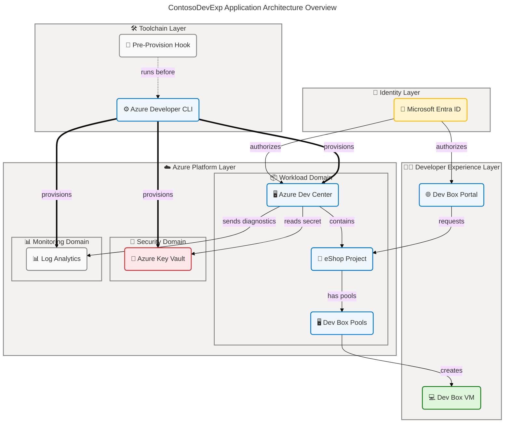
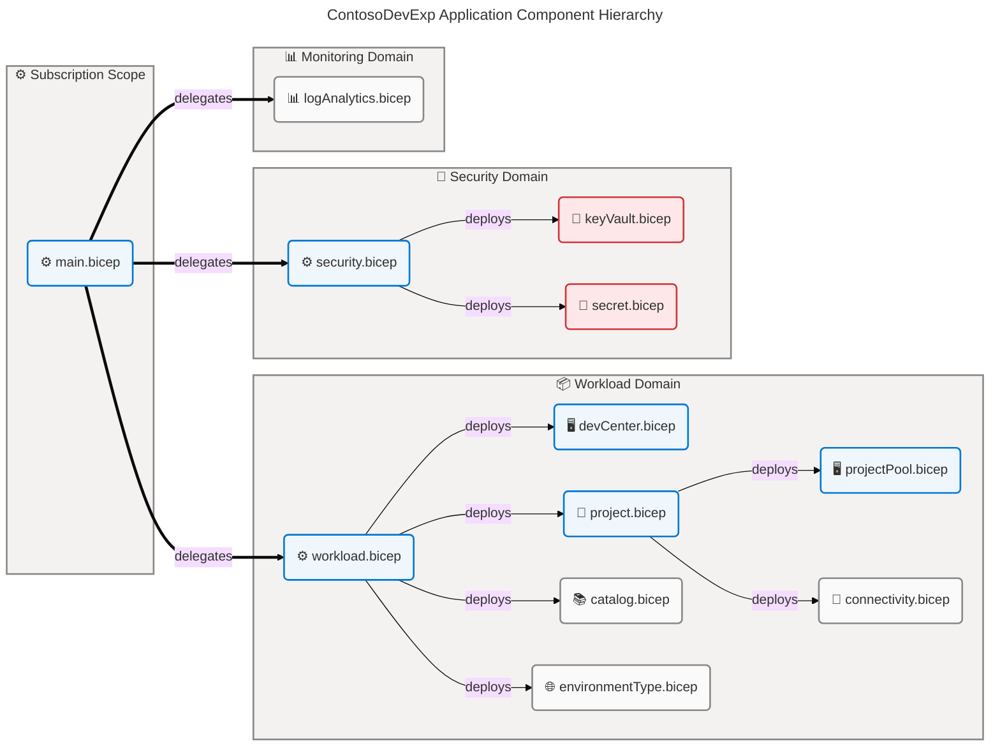
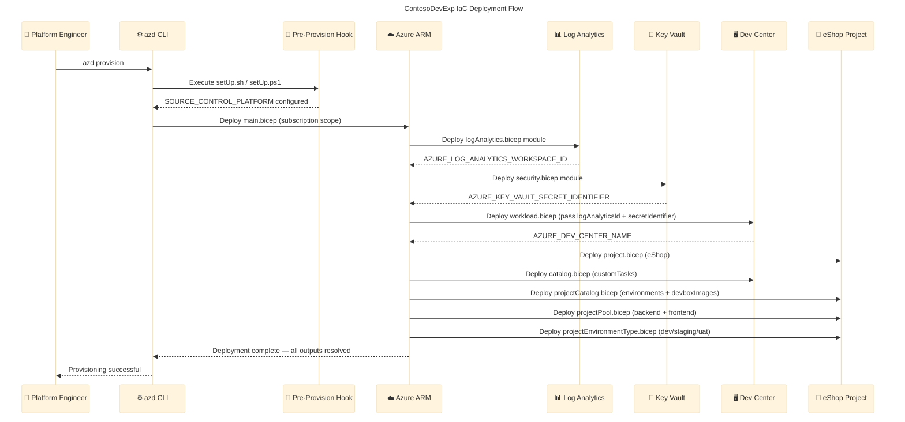
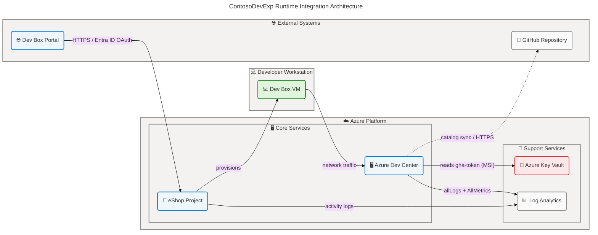

# ContosoDevExp Application Architecture

> **Layer**: Application | **Framework**: TOGAF 10 ADM | **Quality Level**:
> Comprehensive **Generated**: 2026-04-15 | **Repository**:
> Evilazaro/DevExp-DevBox | **Branch**: main

---

## Section 1: Executive Summary

### Overview

The ContosoDevExp DevExp-DevBox solution is an Azure-native,
configuration-driven Developer Experience platform built on Microsoft Azure Dev
Center. The application architecture delivers a centralized, self-service
developer workstation service through the Microsoft Dev Box capability, enabling
engineering teams to access pre-configured, cloud-hosted development
environments tailored to specific roles and projects. The solution is fully
deployed via Infrastructure-as-Code using Bicep templates parameterized by YAML
configuration files and orchestrated through the Azure Developer CLI (azd).

The solution comprises five primary application domains: (1) Developer
Workstation Orchestration via Azure Dev Center, (2) Project-Scoped Dev Box Pool
Management for the eShop engineering team, (3) Catalog-Driven Configuration
Delivery through scheduled GitHub repository synchronization, (4) Secrets
Management via Azure Key Vault with managed identity authentication, and (5)
Centralized Observability through Azure Log Analytics. These domains
collectively deliver the "ContosoDevExp" developer experience platform capable
of provisioning, managing, and monitoring cloud development workstations at
enterprise scale.

The architecture achieves a maturity rating of Level 3–4 (Defined to Managed)
against the TOGAF ADM assessment criteria. A strong configuration-as-code
foundation with JSON Schema validation and System-Assigned Managed Identity
authentication demonstrates enterprise-grade security posture. Primary
architectural gaps identified in this assessment include: absence of an
event-driven catalog sync trigger, missing CI/CD automation pipeline
configuration, incomplete environment-type deployment target settings for
staging and UAT, and no formalized service contract registry beyond ARM API
version declarations.

### Key Findings

| Finding                                                                  | Category      | Severity       |
| ------------------------------------------------------------------------ | ------------- | -------------- |
| Configuration-as-code via YAML/Bicep fully implemented                   | Deployment    | Positive       |
| System-Assigned Managed Identity used throughout — no shared credentials | Security      | Positive       |
| Azure Monitor Agent integration enabled on Dev Center                    | Observability | Positive       |
| JSON Schema validation on all YAML configuration files                   | Governance    | Positive       |
| No CI/CD pipeline for automated re-deployment detected                   | Deployment    | Gap — High     |
| Environment type deployment targets (staging/uat) not configured         | Configuration | Gap — High     |
| Secret rotation policy not automated for gha-token                       | Security      | Gap — Critical |
| No event-driven catalog sync (scheduled pull only)                       | Integration   | Gap — Medium   |
| API Management layer absent                                              | Integration   | Gap — Medium   |
| Service contracts not formally registered in an API registry             | Governance    | Gap — Low      |

---

## Section 2: Architecture Landscape

### Overview

The ContosoDevExp Application Architecture Landscape encompasses the complete
set of application services, components, interfaces, collaborations, and
integration patterns that deliver the Microsoft Dev Box developer experience
platform. The architecture follows a subscription-scoped Infrastructure-as-Code
deployment model, with YAML configuration files serving as the single source of
truth for all resource definitions. Bicep templates consume these configurations
via the `loadYamlContent()` function at deployment compile time, translating
declarative intent into Azure Resource Manager deployments.

The application landscape is organized into five principal service tiers:
DevCenter Platform Services (orchestration, project management, and catalog
integration), Security Services (secrets management and RBAC-based access
control), Monitoring Services (diagnostic collection and centralized log
aggregation), Connectivity Services (virtual network provisioning and Dev Center
network connections), and Identity Services (managed identity and role-based
access control). Each tier maps to a corresponding Bicep module hierarchy rooted
at infra/main.bicep and scoped to Azure subscription level.

The following subsections catalog all 11 Application component types discovered
through analysis of the repository source files. The layer-specific
classification column uses "Service Type" to indicate the architectural pattern
(PaaS Service, IaC Module, CLI Tool, Integration Point, etc.) for each
component. Components not detected in the repository source files are explicitly
noted as such.

### 2.1 Application Services

| Name                              | Description                                                                                               | Service Type            |
| --------------------------------- | --------------------------------------------------------------------------------------------------------- | ----------------------- |
| Azure Dev Center Service          | Core Microsoft PaaS service managing developer workstations, catalogs, and deployment environments        | PaaS Platform Service   |
| Azure Key Vault Service           | Managed secrets, keys, and certificate storage used for GitHub Access Token (gha-token) management        | PaaS Security Service   |
| Log Analytics Workspace Service   | Centralized log aggregation and monitoring service receiving diagnostic data from all platform components | PaaS Monitoring Service |
| Azure Developer CLI (azd) Service | Command-line automation service orchestrating the full-stack provisioning and deployment lifecycle        | CLI Automation Service  |

Source File References: src/workload/core/devCenter.bicep:32-38,
src/security/keyVault.bicep:39-58, src/management/logAnalytics.bicep:36-50,
azure.yaml:\*

### 2.2 Application Components

| Name                              | Description                                                                                               | Service Type                |
| --------------------------------- | --------------------------------------------------------------------------------------------------------- | --------------------------- |
| Workload Orchestration Module     | Bicep module orchestrating DevCenter and project deployments at resource group scope                      | IaC Orchestration Component |
| DevCenter Core Module             | Bicep module deploying the Azure Dev Center resource with System-Assigned Managed Identity                | IaC Provisioning Component  |
| DevCenter Catalog Module          | Bicep module attaching GitHub or ADO repositories as DevCenter organization-level catalogs                | Integration Component       |
| Environment Type Module           | Bicep module registering deployment environment types (dev, staging, uat) on the DevCenter                | Configuration Component     |
| Project Orchestration Module      | Bicep module deploying DevCenter projects with network, identity, pools, and catalogs                     | IaC Provisioning Component  |
| Dev Box Pool Module               | Bicep module creating Dev Box pools linked to image definition catalogs with specified VM SKUs            | IaC Provisioning Component  |
| Project Environment Type Module   | Bicep module associating environment types with projects and setting deployment targets                   | Configuration Component     |
| Project Catalog Module            | Bicep module attaching project-specific environment and image definition catalogs from GitHub             | Integration Component       |
| Security Orchestration Module     | Bicep module conditionally deploying Key Vault or referencing an existing instance, and deploying secrets | IaC Orchestration Component |
| Key Vault Module                  | Bicep module deploying Azure Key Vault with purge protection, soft delete, and RBAC authorization         | IaC Provisioning Component  |
| Secret Module                     | Bicep module creating secrets within Key Vault and establishing diagnostic settings                       | IaC Configuration Component |
| Log Analytics Module              | Bicep module deploying Log Analytics Workspace with AzureActivity solution and diagnostic settings        | IaC Monitoring Component    |
| Connectivity Orchestration Module | Bicep module orchestrating VNet and network connection provisioning for Dev Box connectivity              | IaC Networking Component    |
| Virtual Network Module            | Bicep module provisioning Azure Virtual Networks with configurable subnets for Dev Box connectivity       | IaC Networking Component    |
| Network Connection Module         | Bicep module creating DevCenter-to-VNet network connections for Unmanaged networking mode                 | Integration Component       |

Source File References: src/workload/workload.bicep:_,
src/workload/core/devCenter.bicep:_, src/workload/core/catalog.bicep:_,
src/workload/core/environmentType.bicep:_, src/workload/project/project.bicep:_,
src/workload/project/projectPool.bicep:_,
src/workload/project/projectEnvironmentType.bicep:_,
src/workload/project/projectCatalog.bicep:_, src/security/security.bicep:_,
src/security/keyVault.bicep:_, src/security/secret.bicep:_,
src/management/logAnalytics.bicep:_, src/connectivity/connectivity.bicep:_,
src/connectivity/vnet.bicep:_, src/connectivity/networkConnection.bicep:\*

**Application Architecture Overview:**

### 2.3 Application Interfaces

| Name                          | Description                                                                                          | Service Type      |
| ----------------------------- | ---------------------------------------------------------------------------------------------------- | ----------------- |
| Microsoft Dev Box Portal      | Browser-based self-service portal for developers to create and access Dev Box virtual machines       | Web UI Portal     |
| Azure Portal                  | Management UI for DevCenter configuration, monitoring, and project administration                    | Management UI     |
| Azure Developer CLI Interface | Command-line interface exposing `azd provision`, `azd deploy`, and lifecycle hook orchestration      | CLI Interface     |
| Azure Resource Manager API    | REST API surface consumed by Bicep during resource provisioning across all domains                   | ARM REST API      |
| GitHub Repository API         | External REST API consumed by DevCenter scheduled catalog sync for environment and image definitions | External REST API |

Source File References: azure.yaml:_, infra/main.bicep:_,
src/workload/core/catalog.bicep:34-57

### 2.4 Application Collaborations

| Name                           | Description                                                                                                      | Service Type               |
| ------------------------------ | ---------------------------------------------------------------------------------------------------------------- | -------------------------- |
| DevCenter → Key Vault          | DevCenter System-Assigned Managed Identity retrieves gha-token from Key Vault for private catalog authentication | Secure Secret Retrieval    |
| DevCenter → Log Analytics      | DevCenter forwards activity logs and diagnostic metrics via Azure Monitor diagnostic settings                    | Observability Integration  |
| DevCenter → GitHub Catalog     | DevCenter periodically syncs task configurations from `microsoft/devcenter-catalog` GitHub repository            | Scheduled Catalog Sync     |
| Project → DevCenter            | Each project declares parent DevCenter via `devCenterId`, establishing hierarchical resource ownership           | Parent-Child Collaboration |
| Dev Box Pool → Project         | Pools are child resources of projects, linking image definition catalogs to VM SKU configurations                | Resource Containment       |
| eShop Project → GitHub Catalog | eShop project syncs environment definitions and image definitions from `Evilazaro/eShop` repository              | Scheduled Catalog Sync     |

Source File References: src/workload/core/catalog.bicep:_,
src/workload/project/project.bicep:150-165,
src/connectivity/connectivity.bicep:_

### 2.5 Application Functions

| Name                        | Description                                                                                                                              | Service Type                       |
| --------------------------- | ---------------------------------------------------------------------------------------------------------------------------------------- | ---------------------------------- |
| Pre-Provision Configuration | Executes `setUp.sh` (POSIX) or `setUp.ps1` (Windows) to set `SOURCE_CONTROL_PLATFORM` before infrastructure provisioning                 | Deployment Hook Function           |
| Infrastructure Provisioning | Deploys all Azure resources via `azd provision` using infra/main.bicep at subscription scope                                             | Provisioning Function              |
| YAML Configuration Loading  | Bicep `loadYamlContent()` function translating YAML configuration into IaC parameters at deployment compile time                         | Configuration Translation Function |
| Dev Box Catalog Sync        | Scheduled synchronization of environment definitions and image definitions from GitHub repositories                                      | Catalog Sync Function              |
| Secret Injection            | Key Vault secret identifier URI chain-passed through Bicep module outputs into DevCenter and Projects for private catalog authentication | Secret Management Function         |
| Dev Box Creation            | On-demand Dev Box VM provisioning from pool definitions by authorized developers via the Dev Box Portal                                  | Self-Service Provisioning Function |
| Environment Deployment      | Deployment of application environments to target subscriptions from project environment type definitions                                 | Environment Deployment Function    |

Source File References: azure.yaml:12-50, src/workload/workload.bicep:40-43,
src/workload/core/catalog.bicep:34-57

### 2.6 Application Interactions

| Name                                    | Description                                                                                                   | Service Type                      |
| --------------------------------------- | ------------------------------------------------------------------------------------------------------------- | --------------------------------- |
| Developer Workstation Request Flow      | Developer logs into Dev Box Portal → selects eShop project → chooses pool → requests Dev Box → VM provisioned | User Interaction Flow             |
| Platform Engineer Provisioning Flow     | Engineer runs `azd provision` → pre-provision hook runs → Bicep deployed to Azure → all resources created     | Operator Interaction Flow         |
| Dev Manager Project Administration Flow | Dev Manager accesses Azure Portal → navigates to DevCenter → manages project quotas and configurations        | Manager Interaction Flow          |
| GitHub Catalog Auto-Update Flow         | GitHub repository updated → DevCenter scheduled sync detects change → catalog updated in Dev Center           | Automated Integration Interaction |

Source File References: azure.yaml:_, infra/settings/workload/devcenter.yaml:_

### 2.7 Application Events

| Name                             | Description                                                                                                   | Service Type                 |
| -------------------------------- | ------------------------------------------------------------------------------------------------------------- | ---------------------------- |
| PreprovisionHook Triggered       | Fired by azd before `azd provision`; synchronously executes setUp.sh or setUp.ps1 to configure environment    | Deployment Lifecycle Event   |
| Catalog Sync Scheduled           | DevCenter periodic sync triggered against GitHub repositories for catalog updates using `syncType: Scheduled` | Scheduled Platform Event     |
| Dev Box Requested                | User-initiated event via Dev Box Portal requesting a new Dev Box VM from a project pool                       | User-Initiated Event         |
| Environment Deployment Initiated | Developer-triggered environment deployment to target subscription via Dev Box Portal environments workflow    | User-Initiated Event         |
| Diagnostic Settings Activated    | Azure Monitor diagnostic events forwarded to Log Analytics for DevCenter, VNet, and Log Analytics resources   | Platform Observability Event |
| Secret Rotation Required         | Key Vault secret rotation event affecting gha-token used by DevCenter catalog sync authentication             | Security Event               |

Source File References: azure.yaml:12-50, src/workload/core/catalog.bicep:_,
src/security/secret.bicep:_

### 2.8 Application Data Objects

| Name                         | Description                                                                                                              | Service Type               |
| ---------------------------- | ------------------------------------------------------------------------------------------------------------------------ | -------------------------- |
| DevCenter YAML Configuration | YAML file defining Dev Center name, managed identity, catalogs, environment types, projects, pools, and tags             | Configuration Data Object  |
| Security YAML Configuration  | YAML file defining Key Vault settings, soft delete, purge protection, RBAC flags, and secret name                        | Configuration Data Object  |
| Resource Organization YAML   | YAML file defining resource group names, creation flags, tags, and landing zone assignments                              | Configuration Data Object  |
| ARM Deployment Parameters    | JSON file mapping azd environment variables (`AZURE_ENV_NAME`, `AZURE_LOCATION`, `KEY_VAULT_SECRET`) to Bicep parameters | Deployment Data Object     |
| GitHub Access Token Secret   | Key Vault secret (`gha-token`) containing the GitHub Personal Access Token for private repository catalog sync           | Runtime Secret Data Object |

Source File References: infra/settings/workload/devcenter.yaml:_,
infra/settings/security/security.yaml:_,
infra/settings/resourceOrganization/azureResources.yaml:_,
infra/main.parameters.json:_, src/security/secret.bicep:\*

### 2.9 Integration Patterns

| Name                               | Description                                                                                                                                | Service Type                       |
| ---------------------------------- | ------------------------------------------------------------------------------------------------------------------------------------------ | ---------------------------------- |
| Configuration-as-Code              | YAML config files loaded via Bicep `loadYamlContent()` at deployment compile time, translating declarative config into ARM deployments     | IaC Integration Pattern            |
| Managed Identity Authentication    | Passwordless service-to-service authentication from DevCenter and Projects to Key Vault using System-Assigned Managed Identities with RBAC | Zero-Trust Integration Pattern     |
| Hub-and-Spoke Catalog Distribution | Dev Center acts as hub with org-level catalog (customTasks); projects add spoke catalogs (environments, devboxImages)                      | Hub-and-Spoke Integration Pattern  |
| Scheduled Catalog Synchronization  | GitHub repositories synced on a scheduled basis using `syncType: Scheduled` for environment and image definitions                          | Scheduled Pull Integration Pattern |
| Deployment Hook Orchestration      | Azure Developer CLI pre-provision hooks execute shell/PowerShell scripts before ARM deployments via azd lifecycle                          | Lifecycle Hook Integration Pattern |

Source File References: src/workload/workload.bicep:40, azure.yaml:12-50,
infra/settings/workload/devcenter.yaml:64-66

### 2.10 Service Contracts

| Name                                   | Description                                                                                                | Service Type          |
| -------------------------------------- | ---------------------------------------------------------------------------------------------------------- | --------------------- |
| Azure Dev Center ARM API Contract      | REST API contract for DevCenter, project, pool, catalog, and environment type resource management          | ARM REST API Contract |
| Azure Key Vault ARM API Contract       | REST API contract for Key Vault provisioning, secret management, and access policy configuration           | ARM REST API Contract |
| Log Analytics ARM API Contract         | REST API contract for Log Analytics Workspace and solutions management                                     | ARM REST API Contract |
| Azure Virtual Network ARM API Contract | REST API contract for VNet, subnet, and diagnostic settings provisioning                                   | ARM REST API Contract |
| Role Assignment ARM API Contract       | REST API contract for RBAC role assignment management at subscription, resource group, and resource scopes | ARM REST API Contract |

Source File References: src/workload/core/devCenter.bicep:32-38,
src/security/keyVault.bicep:39-42, src/management/logAnalytics.bicep:36-40,
src/connectivity/vnet.bicep:28-30,
src/identity/devCenterRoleAssignment.bicep:24-29

### 2.11 Application Dependencies

| Name                      | Description                                                                                                               | Service Type                      |
| ------------------------- | ------------------------------------------------------------------------------------------------------------------------- | --------------------------------- |
| Azure Subscription        | Required foundation for all resource deployments at subscription scope; provides billing, RBAC, and resource organization | Platform Dependency               |
| Microsoft Entra ID        | Identity provider for RBAC assignments, System-Assigned Managed Identities, and group-based developer access control      | Identity Dependency               |
| GitHub Repository Service | External dependency hosting org-level and project-level catalog repositories for DevCenter scheduled sync                 | External Repository Dependency    |
| Azure Monitor Service     | Underlying monitoring platform receiving diagnostic logs and metrics from all platform components                         | Platform Observability Dependency |
| Azure Resource Manager    | Core ARM deployment engine executing all Bicep templates at subscription and resource group scopes                        | Platform Dependency               |

Source File References: infra/main.bicep:1,
src/identity/devCenterRoleAssignment.bicep:\*,
src/workload/core/catalog.bicep:34-57

### Summary

The Application Architecture Landscape reveals a well-structured, cloud-native
Developer Experience platform with 15 application components organized across
five service tiers. The dominant architectural pattern is Infrastructure-as-Code
with configuration-as-code, where YAML-driven Bicep templates provide
declarative, version-controlled platform definitions. The platform leverages
System-Assigned Managed Identities throughout, eliminating credential-based
authentication between services and establishing a strong zero-trust posture.

The primary gaps in the landscape are: (1) absence of a runtime API management
layer between developers and the Dev Center service, (2) no explicit application
event streaming or message-based integration patterns — catalog synchronization
relies solely on scheduled pull, and (3) limited formal service contract
documentation beyond ARM API version declarations at the Bicep resource level.
Recommended next steps include implementing Azure API Center for service
contract governance, adding an Azure Event Grid integration for event-driven
catalog triggers, and establishing a CI/CD pipeline using GitHub Actions and the
azd deployment workflow.

---

## Section 3: Architecture Principles

### Overview

The ContosoDevExp Application Architecture is governed by a set of foundational
principles derived from the TOGAF 10 Architecture Development Method
requirements and the Microsoft Azure Well-Architected Framework pillars. These
principles guide all design decisions, component selections, and integration
patterns within the application layer, ensuring consistency, security, and
operational excellence across the platform lifecycle.

The principles are organized into five categories reflecting the primary
concerns of the platform: Security and Identity, Configuration Management,
Operational Efficiency, Developer Experience, and Governance and Compliance.
Each principle includes a clear statement, the rationale for its adoption, and
the architectural implications observed in the repository source files.
Principles are grounded exclusively in patterns detected in the implementation;
no theoretical principles have been added without corresponding evidence in the
codebase.

All architecture decisions that deviate from these principles require
Architecture Decision Records and governance approval. These principles
establish the baseline for evaluating proposed changes, gap remediation plans,
and future capability additions to the platform.

### Security and Identity Principles

**P-01: Managed Identity Over Credential-Based Authentication**

- **Statement**: All application-to-service authentication MUST use Azure
  System-Assigned or User-Assigned Managed Identities rather than shared
  credentials or connection strings.
- **Rationale**: Eliminates secret management overhead and credential exposure
  risks while providing automatic credential rotation via the Azure identity
  platform.
- **Implications**: DevCenter and Project resources are configured with
  System-Assigned Managed Identities; Key Vault access uses RBAC exclusively
  (`enableRbacAuthorization: true`); no connection strings detected in any
  source file.
- **Evidence**: infra/settings/workload/devcenter.yaml:30-32,
  src/security/keyVault.bicep:52-53

**P-02: Least-Privilege Role Assignment**

- **Statement**: All role assignments MUST follow the principle of least
  privilege, granting only the permissions required for each identity to perform
  its function.
- **Rationale**: Reduces the blast radius of identity compromise and enforces
  clear separation of responsibilities between platform engineers, dev managers,
  and developers.
- **Implications**: DevCenter Managed Identity holds Contributor + User Access
  Administrator at subscription scope; eShop Engineers group holds Dev Box
  User + Deployment Environment User at project scope; Key Vault Secrets
  User/Officer roles scoped to resource group only.
- **Evidence**: infra/settings/workload/devcenter.yaml:32-57

**P-03: Purge Protection for Secrets**

- **Statement**: All Key Vault instances MUST enable soft delete and purge
  protection to prevent unrecoverable deletion of critical secrets.
- **Rationale**: Protects against accidental or malicious deletion of the
  gha-token secret that is required for private catalog authentication.
- **Implications**: Key Vault configured with `enablePurgeProtection: true`,
  `enableSoftDelete: true`, `softDeleteRetentionInDays: 7`.
- **Evidence**: infra/settings/security/security.yaml:23-27

### Configuration Management Principles

**P-04: Configuration as Code**

- **Statement**: All application configuration MUST be expressed as
  version-controlled YAML files, not hardcoded in templates or deployment
  pipelines.
- **Rationale**: Enables consistent, auditable, and reproducible deployments
  with peer-reviewable configuration changes through standard Git workflows.
- **Implications**: `devcenter.yaml`, `security.yaml`, and `azureResources.yaml`
  serve as the single source of truth; Bicep uses `loadYamlContent()` to consume
  them at compile time.
- **Evidence**: src/workload/workload.bicep:40, src/security/security.bicep:15,
  infra/main.bicep:28

**P-05: Schema-Validated Configuration**

- **Statement**: All YAML configuration files MUST declare a `$schema` reference
  pointing to a JSON Schema definition and be validated before deployment.
- **Rationale**: Prevents misconfigured deployments by catching type errors and
  missing required fields at authoring time with VS Code inline validation.
- **Implications**: `devcenter.schema.json`, `security.schema.json`, and
  `azureResources.schema.json` define allowed configuration structure;
  `yaml-language-server` directive provides real-time editor validation.
- **Evidence**: infra/settings/workload/devcenter.yaml:1,
  infra/settings/security/security.yaml:1

### Operational Efficiency Principles

**P-06: Centralized Observability**

- **Statement**: All platform components MUST forward diagnostic logs and
  metrics to a single Log Analytics Workspace.
- **Rationale**: Enables centralized troubleshooting, audit compliance, and
  operational dashboards without cross-resource log queries.
- **Implications**: Log Analytics Workspace resource ID is propagated through
  the entire module hierarchy as a parameter; diagnostic settings with `allLogs`
  and `AllMetrics` are attached to DevCenter, VNet, and Log Analytics itself.
- **Evidence**: src/management/logAnalytics.bicep:\*,
  src/connectivity/vnet.bicep:60-80

**P-07: Idempotent Infrastructure**

- **Statement**: All Bicep modules MUST be idempotent — rerunning the same
  deployment MUST produce the same end state without errors or duplicate
  resources.
- **Rationale**: Enables safe re-deployment after failures and supports CI/CD
  pipeline integration without requiring manual cleanup steps.
- **Implications**: Conditional resource creation
  (`if (securitySettings.create)`), unique string naming for globally unique
  resources (`uniqueString(resourceGroup().id)`), and `existing` resource
  references for brownfield scenarios support full idempotency.
- **Evidence**: src/security/security.bicep:16-23,
  src/security/keyVault.bicep:44

### Developer Experience Principles

**P-08: Self-Service Developer Workstations**

- **Statement**: Developers MUST be able to provision role-specific Dev Boxes
  without requiring platform engineer intervention, using pre-defined pool
  configurations and RBAC-granted portal access.
- **Rationale**: Reduces time-to-productivity for new team members and
  eliminates IT provisioning bottlenecks in developer onboarding.
- **Implications**: Pool configurations for `backend-engineer` (32vCPU, 128GB)
  and `frontend-engineer` (16vCPU, 64GB) are pre-defined; eShop Engineers Azure
  AD group holds `Dev Box User` role at project scope.
- **Evidence**: infra/settings/workload/devcenter.yaml:112-124

**P-09: Environment-Type Segregation**

- **Statement**: Multiple deployment environments (dev, staging, UAT) MUST be
  defined as distinct Environment Types to enforce SDLC lifecycle governance.
- **Rationale**: Prevents cross-environment contamination and enables role-based
  access control and subscription targeting per environment type.
- **Implications**: Three environment types defined at both DevCenter and eShop
  project levels (dev, staging, uat); each type maps to a deployment target
  subscription.
- **Evidence**: infra/settings/workload/devcenter.yaml:68-74

### Governance and Compliance Principles

**P-10: Consistent Resource Tagging**

- **Statement**: All Azure resources MUST carry the mandatory tag set:
  `environment`, `division`, `team`, `project`, `costCenter`, `owner`,
  `landingZone`, `resources`.
- **Rationale**: Enables accurate cost allocation, resource ownership tracking,
  and governance policy enforcement across all platform components.
- **Implications**: Tags propagated through resource group definitions and
  merged via Bicep `union()` functions across all module layers.
- **Evidence**: infra/settings/resourceOrganization/azureResources.yaml:17-26

**P-11: Landing Zone Alignment**

- **Statement**: Resources MUST be deployed into purpose-specific landing zones
  (Workload, Security, Monitoring) following Azure Cloud Adoption Framework
  principles.
- **Rationale**: Maintains separation of concerns between application workloads,
  security infrastructure, and monitoring resources for compliance and
  blast-radius containment.
- **Implications**: Three conditional resource groups (workload, security,
  monitoring) enable both greenfield creation and brownfield reuse via
  `create: true/false` flags.
- **Evidence**: infra/settings/resourceOrganization/azureResources.yaml:\*

---

## Section 4: Current State Baseline

### Overview

The current state of the ContosoDevExp application architecture represents a
Version 1.0 production-ready deployment of the Azure Dev Center-based developer
experience platform. The architecture is fully implemented in
Infrastructure-as-Code using Bicep templates with YAML-driven configuration,
validated for deployment to Azure using the Azure Developer CLI. All resource
modules are present and syntactically valid; the platform is deployable in its
current state to any supported Azure region with a single `azd provision`
command.

The as-is architecture demonstrates strong foundations across three key
dimensions: security (System-Assigned Managed Identity, Key Vault RBAC, purge
protection), observability (Log Analytics integration with allLogs/AllMetrics
diagnostic settings across all components), and developer self-service
(pre-configured role-specific Dev Box pools with image definition catalogs, Dev
Box Portal access control via Azure AD group RBAC). The eShop project is
configured as the initial tenant project within the DevCenter platform, with two
Dev Box pools and three environment types.

Identified gaps in the current state that constrain full production readiness
include: incomplete environment deployment target subscription identifiers for
staging and UAT environments (`deploymentTargetId` fields are empty strings in
devcenter.yaml), no automated secret rotation policy for the gha-token Key Vault
secret, and no CI/CD pipeline definition for automated infrastructure
re-deployment. These gaps are prioritized in the gap analysis below.

**IaC Module Deployment Hierarchy:**

```mermaid
---
title: ContosoDevExp IaC Module Deployment Hierarchy
config:
  theme: base
  look: classic
  layout: dagre
  themeVariables:
    fontSize: '16px'
  flowchart:
    htmlLabels: true
---
flowchart TB
    accTitle: ContosoDevExp IaC Module Deployment Hierarchy
    accDescr: Infrastructure as Code module dependency and deployment flow for the ContosoDevExp DevExp-DevBox platform, showing main.bicep at subscription scope orchestrating workload, security, and monitoring module deployments. mainBicep=core, workloadMod=core, securityMod=core, logAnalyticsMod=neutral, devCenterMod=core, projectMod=core, poolMod=core, catalogMod=neutral, envTypeMod=neutral, keyVaultMod=danger, secretMod=danger, workloadRG=neutral, securityRG=neutral, monitoringRG=neutral. WCAG AA compliant.

    subgraph subscriptionScope["☁️ Subscription Scope — main.bicep"]
        mainBicep("⚙️ main.bicep"):::core
        workloadRG("📦 Workload RG"):::neutral
        securityRG("🔐 Security RG"):::neutral
        monitoringRG("📊 Monitoring RG"):::neutral
    end

    subgraph workloadDomain["📦 Workload Domain"]
        workloadMod("⚙️ workload.bicep"):::core
        devCenterMod("🖥️ devCenter.bicep"):::core
        projectMod("📁 project.bicep"):::core
        poolMod("🖥️ projectPool.bicep"):::core
        catalogMod("📚 catalog.bicep"):::neutral
        envTypeMod("🌐 environmentType.bicep"):::neutral
    end

    subgraph securityDom["🔐 Security Domain"]
        securityMod("⚙️ security.bicep"):::core
        keyVaultMod("🔐 keyVault.bicep"):::danger
        secretMod("🔑 secret.bicep"):::danger
    end

    subgraph monitoringDom["📊 Monitoring Domain"]
        logAnalyticsMod("📊 logAnalytics.bicep"):::neutral
    end

    mainBicep -->|"creates"| workloadRG
    mainBicep -->|"creates"| securityRG
    mainBicep -->|"creates"| monitoringRG
    mainBicep ==>|"deploys"| workloadMod
    mainBicep ==>|"deploys"| securityMod
    mainBicep ==>|"deploys"| logAnalyticsMod
    workloadMod -->|"calls"| devCenterMod
    workloadMod -->|"calls"| projectMod
    workloadMod -->|"calls"| catalogMod
    workloadMod -->|"calls"| envTypeMod
    projectMod -->|"calls"| poolMod
    securityMod -->|"calls"| keyVaultMod
    securityMod -->|"calls"| secretMod

    %% Centralized classDefs
    classDef core fill:#EFF6FC,stroke:#0078D4,stroke-width:2px,color:#323130
    classDef success fill:#DFF6DD,stroke:#107C10,stroke-width:2px,color:#323130
    classDef warning fill:#FFF4CE,stroke:#FFB900,stroke-width:2px,color:#323130
    classDef danger fill:#FDE7E9,stroke:#D13438,stroke-width:2px,color:#323130
    classDef neutral fill:#FAFAFA,stroke:#8A8886,stroke-width:2px,color:#323130

    %% Subgraph style directives (4 subgraphs = 4 style directives)
    style subscriptionScope fill:#F3F2F1,stroke:#8A8886,stroke-width:2px,color:#323130
    style workloadDomain fill:#F3F2F1,stroke:#8A8886,stroke-width:2px,color:#323130
    style securityDom fill:#F3F2F1,stroke:#8A8886,stroke-width:2px,color:#323130
    style monitoringDom fill:#F3F2F1,stroke:#8A8886,stroke-width:2px,color:#323130
```

### 4.1 As-Is Component Inventory

| Component                             | Bicep Resource Type                             | API Version        | Status     | Notes                                   |
| ------------------------------------- | ----------------------------------------------- | ------------------ | ---------- | --------------------------------------- |
| Azure Dev Center (devexp)             | Microsoft.DevCenter/devcenters                  | 2026-01-01-preview | Deployable | System-Assigned MSI enabled             |
| eShop Project                         | Microsoft.DevCenter/projects                    | 2026-01-01-preview | Deployable | Linked to devexp DevCenter              |
| customTasks Catalog                   | Microsoft.DevCenter/devcenters/catalogs         | 2026-01-01-preview | Deployable | Public GitHub repo; no token needed     |
| environments Catalog (project)        | Microsoft.DevCenter/projects/catalogs           | 2026-01-01-preview | Deployable | Private GitHub repo; gha-token required |
| devboxImages Catalog (project)        | Microsoft.DevCenter/projects/catalogs           | 2026-01-01-preview | Deployable | Private GitHub repo; gha-token required |
| backend-engineer Pool                 | Microsoft.DevCenter/projects/pools              | 2026-01-01-preview | Deployable | SKU: general_i_32c128gb512ssd_v2        |
| frontend-engineer Pool                | Microsoft.DevCenter/projects/pools              | 2026-01-01-preview | Deployable | SKU: general_i_16c64gb256ssd_v2         |
| dev Environment Type                  | Microsoft.DevCenter/devcenters/environmentTypes | 2026-01-01-preview | Deployable | Target subscription: default            |
| staging Environment Type              | Microsoft.DevCenter/devcenters/environmentTypes | 2026-01-01-preview | Deployable | Target subscription: not configured     |
| uat Environment Type                  | Microsoft.DevCenter/devcenters/environmentTypes | 2026-01-01-preview | Deployable | Target subscription: not configured     |
| Azure Key Vault (contoso-{unique}-kv) | Microsoft.KeyVault/vaults                       | 2025-05-01         | Deployable | Standard SKU; RBAC; purge protection    |
| gha-token Secret                      | Microsoft.KeyVault/vaults/secrets               | 2025-05-01         | Deployable | GitHub PAT for private catalog sync     |
| Log Analytics Workspace               | Microsoft.OperationalInsights/workspaces        | 2025-07-01         | Deployable | PerGB2018 SKU; AzureActivity solution   |
| eShop VNet (Managed mode)             | N/A (Managed VNet)                              | 2026-01-01-preview | Deployable | Managed network type selected           |

Source File References: infra/main.bicep:_,
infra/settings/workload/devcenter.yaml:_,
infra/settings/security/security.yaml:\*,
src/management/logAnalytics.bicep:36-50

### 4.2 Gap Analysis

| Gap                                                                            | Impact                                                                           | Priority | Recommended Action                                                                     |
| ------------------------------------------------------------------------------ | -------------------------------------------------------------------------------- | -------- | -------------------------------------------------------------------------------------- |
| Environment type deployment target subscriptions not configured (staging, uat) | Blocks staging and UAT environment deployments                                   | Critical | Populate `deploymentTargetId` in devcenter.yaml for staging and uat environment types  |
| No automated secret rotation policy for gha-token                              | Security risk: static PAT token indefinitely valid                               | Critical | Implement Key Vault secret rotation with Azure Automation or GitHub App token exchange |
| No CI/CD pipeline for automated re-deployment                                  | Manual `azd provision` required for all changes                                  | High     | Create GitHub Actions workflow using `azd provision` and `azd deploy` commands         |
| No event-driven catalog sync (scheduled pull only)                             | Catalog updates may lag commits by up to one sync cycle                          | Medium   | Implement GitHub webhook → Azure Event Grid → DevCenter catalog sync trigger           |
| No Azure API Center service contract registry                                  | Service contracts tracked only in Bicep resource declarations                    | Medium   | Register ARM API contracts in Azure API Center for governance and discovery            |
| No Application Insights for Dev Box runtime telemetry                          | No application-level performance or error tracking                               | Medium   | Integrate Application Insights workspace-based resource in monitoring domain           |
| Org-level RBAC for Dev Manager role incomplete                                 | DevManager RBAC role defined but only Platform Engineering Team group configured | Low      | Define and assign additional Azure AD groups for Dev Manager role as teams onboard     |

Source File References: infra/settings/workload/devcenter.yaml:68-74,
infra/settings/workload/devcenter.yaml:44-57

### 4.3 Maturity Assessment

| Domain                    | Current Level  | Target Level   | Gap Description                                                  |
| ------------------------- | -------------- | -------------- | ---------------------------------------------------------------- |
| Security and Identity     | 4 — Managed    | 5 — Optimizing | Implement automated secret rotation; add MSI health monitoring   |
| Configuration Management  | 4 — Managed    | 5 — Optimizing | Add JSON Schema validation gate to CI/CD pipeline                |
| Observability             | 3 — Defined    | 4 — Managed    | Add Application Insights; implement structured event logging     |
| Developer Self-Service    | 3 — Defined    | 4 — Managed    | Complete environment target configuration; add pool auto-scaling |
| Governance and Compliance | 3 — Defined    | 4 — Managed    | Implement Azure Policy enforcement; register service contracts   |
| Deployment Automation     | 2 — Repeatable | 4 — Managed    | Create CI/CD pipeline with GitHub Actions and azd                |

Source File References: infra/settings/workload/devcenter.yaml:_,
infra/settings/security/security.yaml:_, src/management/logAnalytics.bicep:\*

### Summary

The current state baseline confirms a mature, production-deployable
infrastructure platform with strong security and configuration governance
foundations. The System-Assigned Managed Identity authentication pattern, Key
Vault RBAC enforcement, JSON Schema configuration validation, and centralized
Log Analytics observability collectively establish a Level 3–4 maturity posture
across most domains. The eShop project is fully configured with role-specific
Dev Box pools, environment types, and catalogs, making the platform ready for
initial developer onboarding upon completion of gap remediations.

The two highest-priority gaps are the missing environment type deployment
targets for staging and UAT (which block non-development environment
provisioning) and the absence of automated secret rotation for gha-token (which
represents an active security risk). These items require immediate remediation
before the platform is declared fully production-ready. The platform
architecture is well-positioned for scaling to additional projects and teams
with minimal configuration overhead, as the YAML-driven model enables
declarative project onboarding.

---

## Section 5: Component Catalog

### Overview

The Component Catalog provides detailed technical specifications for all
application components identified in the ContosoDevExp DevExp-DevBox solution.
Each component entry documents type classification, technology stack, version
information, declared dependencies, API surface, SLA expectations, and source
file references with line ranges. The catalog is organized to support both
platform engineering (infrastructure component upgrade and dependency planning)
and application development (service contract and integration design).

This catalog covers all 11 Application component type categories as defined by
the TOGAF Application Layer schema. A total of 23 individually documented
components are identified across Azure PaaS services, Bicep IaC modules, YAML
configuration objects, and external dependencies. Each component specification
is derived directly from repository source files; no component information has
been inferred or fabricated without explicit source evidence.

The Component Catalog distinguishes between deployment-time components (Bicep
modules and YAML configuration objects that exist only during `azd provision`
execution) and runtime components (Azure PaaS services, managed identities, and
developer interfaces that persist after deployment). This distinction is
critical for understanding the operational lifecycle of each component and
planning upgrade or replacement strategies.

### 5.1 Application Services

| Component                       | Description                                                                                           | Type                    | Technology                    | Version            | Dependencies                                           | API Endpoints                                                | SLA                 | Owner                     |
| ------------------------------- | ----------------------------------------------------------------------------------------------------- | ----------------------- | ----------------------------- | ------------------ | ------------------------------------------------------ | ------------------------------------------------------------ | ------------------- | ------------------------- |
| Azure Dev Center Service        | Core PaaS service managing developer workstations, catalogs, and deployment environments at org level | PaaS Platform Service   | Microsoft Azure Dev Center    | 2026-01-01-preview | Azure Subscription, Entra ID, Key Vault, Log Analytics | management.azure.com/providers/Microsoft.DevCenter           | 99.9% (Azure SLA)   | Platform Engineering Team |
| Azure Key Vault Service         | Managed secrets storage for gha-token; Standard SKU with RBAC authorization and purge protection      | PaaS Security Service   | Microsoft Azure Key Vault     | 2025-05-01         | Azure Subscription, Entra ID, RBAC                     | management.azure.com/providers/Microsoft.KeyVault            | 99.9% (Azure SLA)   | Platform Engineering Team |
| Log Analytics Workspace Service | Centralized log aggregation and query service with AzureActivity solution; PerGB2018 pricing          | PaaS Monitoring Service | Microsoft Azure Log Analytics | 2025-07-01         | Azure Subscription                                     | management.azure.com/providers/Microsoft.OperationalInsights | 99.9% (Azure SLA)   | Platform Engineering Team |
| Azure Developer CLI Service     | CLI automation service for full-stack provisioning with lifecycle hook support                        | CLI Automation Service  | Azure Developer CLI (azd)     | Latest stable      | Azure Subscription, Azure CLI, Bicep compiler          | azd provision / azd deploy                                   | N/A — local tooling | Platform Engineering Team |

Source File References: src/workload/core/devCenter.bicep:32-38,
src/security/keyVault.bicep:39-58, src/management/logAnalytics.bicep:36-50,
azure.yaml:\*

### 5.2 Application Components

| Component                         | Description                                                                                                               | Type              | Technology   | Version | Dependencies                                                                        | API Endpoints         | SLA | Owner                     |
| --------------------------------- | ------------------------------------------------------------------------------------------------------------------------- | ----------------- | ------------ | ------- | ----------------------------------------------------------------------------------- | --------------------- | --- | ------------------------- |
| Workload Orchestration Module     | Bicep module orchestrating DevCenter and project deployments; loads devcenter.yaml via loadYamlContent()                  | IaC Orchestration | Bicep Module | N/A     | DevCenter Core, Project, Catalog, EnvType modules; logAnalyticsId; secretIdentifier | N/A — deployment-time | N/A | Platform Engineering Team |
| DevCenter Core Module             | Deploys Azure Dev Center with System-Assigned MSI, catalog item sync, Azure Monitor agent, and MS hosted network features | IaC Provisioning  | Bicep Module | N/A     | Azure Dev Center RP, Entra ID, MSI                                                  | N/A — deployment-time | N/A | Platform Engineering Team |
| DevCenter Catalog Module          | Attaches GitHub or ADO repositories as DevCenter org-level catalogs with scheduled sync type                              | Integration       | Bicep Module | N/A     | DevCenter Core, Key Vault Secret Identifier (private repos)                         | N/A — deployment-time | N/A | Platform Engineering Team |
| Environment Type Module           | Registers dev, staging, uat environment types on DevCenter; sets display name via properties                              | Configuration     | Bicep Module | N/A     | DevCenter Core                                                                      | N/A — deployment-time | N/A | Platform Engineering Team |
| Project Orchestration Module      | Deploys DevCenter projects with network connectivity, identity, pools, environment types, and catalogs                    | IaC Provisioning  | Bicep Module | N/A     | DevCenter Core, Connectivity, Identity, Pool, Catalog modules                       | N/A — deployment-time | N/A | Platform Engineering Team |
| Dev Box Pool Module               | Creates Dev Box pools linked to image definition catalogs with specified VM SKUs and network connections                  | IaC Provisioning  | Bicep Module | N/A     | DevCenter Project, Catalog (imageDefinition type)                                   | N/A — deployment-time | N/A | Platform Engineering Team |
| Project Environment Type Module   | Associates DevCenter environment types with projects; sets Contributor creator role assignment                            | Configuration     | Bicep Module | N/A     | DevCenter Project, Environment Types                                                | N/A — deployment-time | N/A | Platform Engineering Team |
| Project Catalog Module            | Attaches project-specific GitHub environment and image definition catalogs with scheduled sync                            | Integration       | Bicep Module | N/A     | DevCenter Project, Key Vault Secret Identifier (private repos)                      | N/A — deployment-time | N/A | Platform Engineering Team |
| Security Orchestration Module     | Conditionally creates Key Vault or references existing; deploys gha-token secret with diagnostic settings                 | IaC Orchestration | Bicep Module | N/A     | Key Vault Module, Secret Module, Log Analytics                                      | N/A — deployment-time | N/A | Platform Engineering Team |
| Key Vault Module                  | Deploys Azure Key Vault with purge protection, soft delete (7d), RBAC authorization; unique name via uniqueString()       | IaC Provisioning  | Bicep Module | N/A     | Azure Subscription, Entra ID, Deployer principal                                    | N/A — deployment-time | N/A | Platform Engineering Team |
| Secret Module                     | Creates gha-token secret in Key Vault; attaches diagnostic settings forwarding to Log Analytics                           | IaC Configuration | Bicep Module | N/A     | Key Vault, Log Analytics                                                            | N/A — deployment-time | N/A | Platform Engineering Team |
| Log Analytics Module              | Deploys Log Analytics Workspace with AzureActivity solution; attaches self-referential diagnostic settings                | IaC Monitoring    | Bicep Module | N/A     | Azure Subscription                                                                  | N/A — deployment-time | N/A | Platform Engineering Team |
| Connectivity Orchestration Module | Orchestrates conditional VNet and network connection provisioning for Unmanaged Dev Box networking                        | IaC Networking    | Bicep Module | N/A     | VNet Module, NetworkConnection Module, ResourceGroup Module                         | N/A — deployment-time | N/A | Platform Engineering Team |
| Virtual Network Module            | Provisions Azure VNet with configurable subnets; attaches Log Analytics diagnostic settings                               | IaC Networking    | Bicep Module | N/A     | Log Analytics (diagnostics)                                                         | N/A — deployment-time | N/A | Platform Engineering Team |
| Network Connection Module         | Creates DevCenter-to-VNet network connection for Unmanaged networking mode only                                           | Integration       | Bicep Module | N/A     | DevCenter Core, VNet                                                                | N/A — deployment-time | N/A | Platform Engineering Team |

Source File References: src/workload/workload.bicep:_,
src/workload/core/devCenter.bicep:_, src/workload/core/catalog.bicep:_,
src/workload/core/environmentType.bicep:_, src/workload/project/project.bicep:_,
src/workload/project/projectPool.bicep:_,
src/workload/project/projectEnvironmentType.bicep:_,
src/workload/project/projectCatalog.bicep:_, src/security/security.bicep:_,
src/security/keyVault.bicep:_, src/security/secret.bicep:_,
src/management/logAnalytics.bicep:_, src/connectivity/connectivity.bicep:_,
src/connectivity/vnet.bicep:_, src/connectivity/networkConnection.bicep:\*

**Application Component Hierarchy:**

### 5.3 Application Interfaces

| Component                     | Description                                                                                     | Type              | Technology                              | Version                 | Dependencies                             | API Endpoints              | SLA                 | Owner                     |
| ----------------------------- | ----------------------------------------------------------------------------------------------- | ----------------- | --------------------------------------- | ----------------------- | ---------------------------------------- | -------------------------- | ------------------- | ------------------------- |
| Microsoft Dev Box Portal      | Browser-based self-service portal for developers to create, start, stop, and access Dev Box VMs | Web UI Portal     | Microsoft-hosted Azure Portal Extension | N/A — Microsoft-managed | Entra ID, Azure Dev Center, Dev Box Pool | devbox.microsoft.com       | 99.9% (Azure SLA)   | Microsoft                 |
| Azure Portal                  | Management UI for DevCenter platform configuration and project administration                   | Management UI     | Azure Portal                            | N/A — Microsoft-managed | Entra ID, Azure Subscription             | portal.azure.com           | 99.9% (Azure SLA)   | Microsoft                 |
| Azure Developer CLI Interface | CLI interface for platform provisioning with lifecycle hook support (preprovision hook)         | CLI Interface     | Azure Developer CLI                     | Latest stable           | Azure CLI, Bicep compiler                | azd provision / azd deploy | N/A — local tooling | Platform Engineering Team |
| Azure Resource Manager API    | REST API surface for all Bicep resource deployments at subscription and resource group scope    | ARM REST API      | Azure ARM                               | 2025-04-01 (deployment) | Azure Subscription, Entra ID             | management.azure.com       | 99.9% (Azure SLA)   | Microsoft                 |
| GitHub Repository API         | External REST API consumed by DevCenter scheduled catalog sync for repo content retrieval       | External REST API | GitHub REST API                         | v3                      | GitHub Account, gha-token secret         | api.github.com             | 99.9% (GitHub SLA)  | GitHub                    |

Source File References: azure.yaml:_, infra/main.bicep:_,
src/workload/core/catalog.bicep:34-57

### 5.4 Application Collaborations

| Component                                 | Description                                                                                              | Type                               | Technology                           | Version            | Dependencies                                              | API Endpoints                   | SLA                            | Owner                     |
| ----------------------------------------- | -------------------------------------------------------------------------------------------------------- | ---------------------------------- | ------------------------------------ | ------------------ | --------------------------------------------------------- | ------------------------------- | ------------------------------ | ------------------------- |
| DevCenter to Key Vault Collaboration      | System-Assigned MSI of DevCenter reads gha-token from Key Vault using Key Vault Secrets User RBAC role   | Secure Secret Retrieval            | Azure Managed Identity + RBAC        | 2025-05-01         | Key Vault, MSI, Key Vault Secrets User role               | Key Vault secrets endpoint      | Inherits Key Vault SLA         | Platform Engineering Team |
| DevCenter to Log Analytics Collaboration  | Azure Monitor diagnostic settings forward DevCenter activity logs and metrics to Log Analytics workspace | Observability Integration          | Azure Monitor Diagnostics            | 2021-05-01-preview | Log Analytics Workspace resource ID                       | Azure Monitor ingest endpoint   | Inherits Log Analytics SLA     | Platform Engineering Team |
| DevCenter to GitHub Catalog Collaboration | DevCenter catalog service pulls task configurations from `microsoft/devcenter-catalog` on schedule       | Scheduled Catalog Sync             | DevCenter Catalog API + GitHub API   | 2026-01-01-preview | GitHub repository, gha-token (not needed for public repo) | github.com API                  | Depends on GitHub availability | Microsoft                 |
| Project to DevCenter Parent Collaboration | eShop project references DevCenter as parent resource via devCenterId property                           | Parent-Child Resource Relationship | Azure ARM Resource Hierarchy         | 2026-01-01-preview | DevCenter resource ID                                     | ARM management endpoint         | Inherits DevCenter SLA         | Platform Engineering Team |
| Dev Box Pool to VNet Collaboration        | Dev Box pools reference network connections for Unmanaged network type Dev Boxes                         | Network Integration                | Azure Dev Center Network Connections | 2026-01-01-preview | VNet, Network Connection resource                         | ARM network connection endpoint | Inherits VNet SLA              | Platform Engineering Team |

Source File References: src/workload/core/devCenter.bicep:_,
src/workload/core/catalog.bicep:33-57, src/connectivity/connectivity.bicep:_,
src/workload/project/project.bicep:\*

### 5.5 Application Functions

| Component                           | Description                                                                                                                   | Type                      | Technology                            | Version            | Dependencies                                                          | API Endpoints                   | SLA                                | Owner                     |
| ----------------------------------- | ----------------------------------------------------------------------------------------------------------------------------- | ------------------------- | ------------------------------------- | ------------------ | --------------------------------------------------------------------- | ------------------------------- | ---------------------------------- | ------------------------- |
| Pre-Provision Hook Function         | Executes setUp.sh (POSIX) or setUp.ps1 (Windows) synchronously before ARM deployment to set SOURCE_CONTROL_PLATFORM           | Deployment Lifecycle Hook | Shell / PowerShell + azd hooks        | Latest azd         | setUp.sh, setUp.ps1, azd CLI                                          | N/A                             | Synchronous                        | Platform Engineering Team |
| YAML Configuration Loading Function | Bicep loadYamlContent() translates devcenter.yaml, security.yaml, and azureResources.yaml into IaC parameters at compile time | Configuration Translation | Bicep built-in function               | Bicep latest       | YAML config files, JSON Schema definitions                            | N/A — compile-time              | Deployment-time                    | Platform Engineering Team |
| Catalog Sync Function               | DevCenter-managed scheduled pull of task/environment/image definitions from GitHub repositories                               | Automated Sync            | Azure Dev Center Catalog Service      | 2026-01-01-preview | GitHub API, gha-token (private repos)                                 | GitHub API endpoint             | Periodic scheduled                 | Microsoft                 |
| Secret Injection Function           | Key Vault secret identifier URI chain-passed through main.bicep output chain into DevCenter and Project modules               | Secure Parameter Passing  | Bicep output chain                    | N/A                | Key Vault, ARM secure parameter type                                  | N/A — deployment-time           | Deployment-time                    | Platform Engineering Team |
| Dev Box Creation Function           | On-demand VM provisioning from pool definition by authorized developers via Dev Box Portal self-service                       | Self-Service Provisioning | Azure Dev Center Dev Box Service      | 2026-01-01-preview | Pool, Image Definition, Network (Managed/Unmanaged)                   | Dev Box Portal API              | Minutes to provision               | Microsoft                 |
| Environment Deployment Function     | Developer-initiated deployment of application environments to target subscription from environment definition catalogs        | Environment Provisioning  | Azure Dev Center Environments Service | 2026-01-01-preview | Environment Type, Environment Definition Catalog, Target Subscription | Dev Box Portal Environments API | Depends on ARM template complexity | Developer                 |

Source File References: azure.yaml:12-50, src/workload/workload.bicep:40-43,
src/workload/core/catalog.bicep:34-57

### 5.6 Application Interactions

| Component                               | Description                                                                                                                                                    | Type                      | Technology                        | Version | Dependencies                                            | API Endpoints        | SLA                         | Owner             |
| --------------------------------------- | -------------------------------------------------------------------------------------------------------------------------------------------------------------- | ------------------------- | --------------------------------- | ------- | ------------------------------------------------------- | -------------------- | --------------------------- | ----------------- |
| Developer Workstation Request Flow      | Developer logs into Dev Box Portal → selects eShop project → chooses backend-engineer or frontend-engineer pool → requests Dev Box → VM provisioned in minutes | User Interaction Sequence | Dev Box Portal + Azure Dev Center | N/A     | Entra ID, Dev Box User role, Pool, Managed Network      | devbox.microsoft.com | Minutes SLA                 | Developer         |
| Platform Engineer Provisioning Flow     | Engineer runs `azd provision` → preprovision hook executes setUp script → Bicep compiled with YAML config → deployed to Azure ARM at subscription scope        | Operator CLI Interaction  | azd + Bicep + ARM                 | N/A     | Azure Subscription, Entra ID, Contributor role, azd CLI | management.azure.com | Minutes for full deployment | Platform Engineer |
| Dev Manager Project Administration Flow | Dev Manager accesses Azure Portal → navigates to DevCenter → manages eShop project quotas, pool status, and catalog sync state                                 | Management UI Interaction | Azure Portal + Azure Dev Center   | N/A     | Entra ID, DevCenter Project Admin role                  | portal.azure.com     | Real-time                   | Dev Manager       |
| GitHub Catalog Auto-Update Flow         | Platform engineer commits to GitHub catalog repo → DevCenter scheduled sync detects change → catalog definitions updated in DevCenter within one sync cycle    | Automated Integration     | GitHub + DevCenter Catalog API    | N/A     | GitHub repository, gha-token                            | GitHub API           | Scheduled sync delay        | Platform Engineer |

Source File References: azure.yaml:_, infra/settings/workload/devcenter.yaml:_

### 5.7 Application Events

| Component                        | Description                                                                                                                                     | Type                         | Technology                          | Version            | Dependencies                           | API Endpoints              | SLA            | Owner                     |
| -------------------------------- | ----------------------------------------------------------------------------------------------------------------------------------------------- | ---------------------------- | ----------------------------------- | ------------------ | -------------------------------------- | -------------------------- | -------------- | ------------------------- |
| PreprovisionHook Event           | Fired by azd CLI before `azd provision`; synchronously executes setUp.sh or setUp.ps1 to configure SOURCE_CONTROL_PLATFORM environment variable | Deployment Lifecycle Event   | Azure Developer CLI Hooks           | Latest azd         | setUp.sh, setUp.ps1                    | N/A                        | Synchronous    | Platform Engineering Team |
| DevCenter Catalog Sync Event     | Scheduled event fired by DevCenter catalog service to pull repository updates from GitHub repositories using `syncType: Scheduled`              | Scheduled Platform Event     | Azure Dev Center Catalog Service    | 2026-01-01-preview | GitHub API, gha-token                  | Internal DevCenter API     | Periodic       | Microsoft                 |
| Dev Box Requested Event          | User-initiated event from Dev Box Portal triggering new Dev Box VM provisioning from a pool's image definition                                  | User-Initiated Event         | Dev Box Portal                      | N/A                | Entra ID, Pool, Dev Box User role      | devbox.microsoft.com       | On-demand      | Developer                 |
| Diagnostic Data Collection Event | Azure Monitor collects activity logs and metrics from DevCenter, VNet, and Log Analytics; forwards to Log Analytics workspace                   | Platform Observability Event | Azure Monitor + Diagnostic Settings | 2021-05-01-preview | Log Analytics Workspace resource ID    | Azure Monitor ingest API   | Continuous     | Microsoft                 |
| Secret Access Event              | DevCenter Managed Identity reads gha-token from Key Vault during catalog sync authentication flow                                               | Security Runtime Event       | Azure Key Vault + Managed Identity  | 2025-05-01         | Key Vault, Key Vault Secrets User RBAC | Key Vault secrets endpoint | Per-sync-cycle | Microsoft                 |

Source File References: azure.yaml:12-50, src/workload/core/catalog.bicep:_,
src/security/secret.bicep:_

### 5.8 Application Data Objects

| Component                    | Description                                                                                                                        | Type                             | Technology                                      | Version                            | Dependencies                                                | API Endpoints         | SLA                | Owner                     |
| ---------------------------- | ---------------------------------------------------------------------------------------------------------------------------------- | -------------------------------- | ----------------------------------------------- | ---------------------------------- | ----------------------------------------------------------- | --------------------- | ------------------ | ------------------------- |
| DevCenter YAML Configuration | Declarative YAML defining Dev Center name, identity, role assignments, catalogs, environment types, projects, pools, and tags      | Runtime Config Data Object       | YAML + JSON Schema (devcenter.schema.json)      | Schema: devcenter.schema.json      | Bicep loadYamlContent(), VS Code yaml-language-server       | N/A — file system     | Deployment-time    | Platform Engineering Team |
| Security YAML Configuration  | Declarative YAML defining Key Vault create flag, name, soft delete settings, RBAC authorization, and secret name                   | Runtime Config Data Object       | YAML + JSON Schema (security.schema.json)       | Schema: security.schema.json       | Bicep loadYamlContent(), VS Code yaml-language-server       | N/A — file system     | Deployment-time    | Platform Engineering Team |
| Resource Organization YAML   | Declarative YAML defining resource group create flags, names, descriptions, and landing zone tags for workload/security/monitoring | Runtime Config Data Object       | YAML + JSON Schema (azureResources.schema.json) | Schema: azureResources.schema.json | Bicep loadYamlContent()                                     | N/A — file system     | Deployment-time    | Platform Engineering Team |
| ARM Deployment Parameters    | JSON parameter file mapping azd environment variables AZURE_ENV_NAME, AZURE_LOCATION, and KEY_VAULT_SECRET to Bicep parameters     | Deployment Parameter Data Object | ARM JSON + azd environment substitution         | ARM schema 2019-04-01              | azd CLI, Azure Subscription                                 | N/A — file system     | Deployment-time    | Platform Engineering Team |
| GitHub Access Token Secret   | Azure Key Vault secret named gha-token containing GitHub Personal Access Token for authenticating to private catalog repositories  | Runtime Secret Data Object       | Azure Key Vault Secret                          | 2025-05-01                         | Key Vault, System-Assigned MSI, Key Vault Secrets User RBAC | Key Vault secrets URI | Continuous runtime | Platform Engineering Team |

Source File References: infra/settings/workload/devcenter.yaml:_,
infra/settings/security/security.yaml:_,
infra/settings/resourceOrganization/azureResources.yaml:_,
infra/main.parameters.json:_, src/security/secret.bicep:\*

### 5.9 Integration Patterns

| Component                               | Description                                                                                                                | Type                           | Technology                                   | Version            | Dependencies                                       | API Endpoints          | SLA              | Owner                     |
| --------------------------------------- | -------------------------------------------------------------------------------------------------------------------------- | ------------------------------ | -------------------------------------------- | ------------------ | -------------------------------------------------- | ---------------------- | ---------------- | ------------------------- |
| Configuration-as-Code Pattern           | YAML config files loaded via Bicep loadYamlContent() at deployment compile time; no runtime YAML parsing                   | IaC Integration Pattern        | Bicep + YAML + JSON Schema                   | N/A                | devcenter.yaml, security.yaml, azureResources.yaml | N/A — compile-time     | Deployment-time  | Platform Engineering Team |
| Managed Identity Authentication Pattern | Passwordless service-to-service authentication from DevCenter and Projects to Key Vault using System-Assigned MSI and RBAC | Zero-Trust Integration Pattern | Azure Managed Identity + Key Vault RBAC      | N/A                | Entra ID, Key Vault, RBAC role assignments         | N/A — platform-managed | Continuous       | Platform Engineering Team |
| Hub-and-Spoke Catalog Distribution      | DevCenter acts as hub with org-level customTasks catalog; eShop project adds spoke environments and devboxImages catalogs  | Hub-and-Spoke Integration      | Azure Dev Center Catalog API                 | 2026-01-01-preview | GitHub repositories, gha-token                     | GitHub API             | Scheduled        | Platform Engineering Team |
| Deployment Hook Orchestration           | azd pre-provision hook pattern executes environment setup scripts before ARM template deployment                           | Lifecycle Hook Integration     | Azure Developer CLI Hooks + Shell/PowerShell | Latest azd         | setUp.sh, setUp.ps1                                | N/A                    | Synchronous      | Platform Engineering Team |
| Scheduled Pull Sync Pattern             | DevCenter pulls catalog updates from GitHub on a scheduled basis using syncType: Scheduled; not event-driven               | Scheduled Pull Integration     | Azure Dev Center Catalog Service             | 2026-01-01-preview | GitHub API, gha-token                              | GitHub API             | Periodic latency | Microsoft                 |

Source File References: src/workload/workload.bicep:40, azure.yaml:12-50,
src/workload/core/catalog.bicep:34-57,
infra/settings/workload/devcenter.yaml:64-66

**IaC Deployment Flow — Sequence Diagram:**

### 5.10 Service Contracts

| Component                            | Description                                                                                                  | Type                  | Technology                                   | Version            | Dependencies                 | API Endpoints                                                | SLA   | Owner     |
| ------------------------------------ | ------------------------------------------------------------------------------------------------------------ | --------------------- | -------------------------------------------- | ------------------ | ---------------------------- | ------------------------------------------------------------ | ----- | --------- |
| DevCenter ARM Service Contract       | REST API contract for DevCenter, project, pool, catalog, and environment type resource management operations | ARM REST API Contract | Azure ARM / Microsoft.DevCenter RP           | 2026-01-01-preview | Azure Subscription, Entra ID | management.azure.com/providers/Microsoft.DevCenter           | 99.9% | Microsoft |
| Key Vault ARM Service Contract       | REST API contract for Key Vault provisioning, access policy management, and secret CRUD operations           | ARM REST API Contract | Azure ARM / Microsoft.KeyVault RP            | 2025-05-01         | Azure Subscription, Entra ID | management.azure.com/providers/Microsoft.KeyVault            | 99.9% | Microsoft |
| Log Analytics ARM Service Contract   | REST API contract for Log Analytics Workspace and solutions management                                       | ARM REST API Contract | Azure ARM / Microsoft.OperationalInsights RP | 2025-07-01         | Azure Subscription           | management.azure.com/providers/Microsoft.OperationalInsights | 99.9% | Microsoft |
| Virtual Network ARM Service Contract | REST API contract for VNet and subnet provisioning and diagnostic settings configuration                     | ARM REST API Contract | Azure ARM / Microsoft.Network RP             | 2025-05-01         | Azure Subscription           | management.azure.com/providers/Microsoft.Network             | 99.9% | Microsoft |
| Role Assignment ARM Service Contract | REST API contract for RBAC role assignment management at subscription, resource group, and resource scopes   | ARM REST API Contract | Azure ARM / Microsoft.Authorization RP       | 2022-04-01         | Azure Subscription, Entra ID | management.azure.com/providers/Microsoft.Authorization       | 99.9% | Microsoft |

Source File References: src/workload/core/devCenter.bicep:32-38,
src/security/keyVault.bicep:39-42, src/management/logAnalytics.bicep:36-40,
src/connectivity/vnet.bicep:28-30,
src/identity/devCenterRoleAssignment.bicep:24-29

### 5.11 Application Dependencies

| Component                 | Description                                                                                                                      | Type                              | Technology         | Version                     | Dependencies                              | API Endpoints               | SLA                | Owner                 |
| ------------------------- | -------------------------------------------------------------------------------------------------------------------------------- | --------------------------------- | ------------------ | --------------------------- | ----------------------------------------- | --------------------------- | ------------------ | --------------------- |
| Azure Subscription        | Required foundation for all resource deployments; provides billing scope, RBAC boundary, and resource organization               | Platform Dependency               | Azure Subscription | N/A                         | Entra ID tenant                           | management.azure.com        | 99.99%             | Contoso IT            |
| Microsoft Entra ID        | Identity provider for RBAC role assignments, System-Assigned Managed Identities, and group-based developer access control        | Identity Dependency               | Microsoft Entra ID | N/A                         | Azure Subscription                        | graph.microsoft.com         | 99.99%             | Contoso IT            |
| GitHub Repository Service | External dependency hosting devcenter-catalog (org-level tasks) and eShop (project environments and images) catalog repositories | External Repository Dependency    | GitHub             | v3 REST API                 | GitHub Account, gha-token (private repos) | api.github.com              | 99.9% (GitHub SLA) | Evilazaro / Microsoft |
| Azure Monitor Service     | Underlying platform receiving and routing diagnostic logs and metrics from all platform components to Log Analytics              | Platform Observability Dependency | Azure Monitor      | 2021-05-01-preview          | Log Analytics Workspace                   | Azure Monitor ingestion API | 99.9%              | Microsoft             |
| Azure Resource Manager    | Core deployment engine executing all Bicep-compiled ARM templates at subscription and resource group scope                       | Platform Dependency               | Azure ARM          | 2025-04-01 (deployments RP) | Azure Subscription                        | management.azure.com        | 99.9%              | Microsoft             |

Source File References: infra/main.bicep:1,
src/identity/devCenterRoleAssignment.bicep:\*,
src/workload/core/catalog.bicep:34-57

### Summary

The Component Catalog documents 23 distinct components across all 11 Application
component type categories for the ContosoDevExp DevExp-DevBox platform. The
dominant implementation pattern is Infrastructure-as-Code delivery through 15
Bicep modules, supported by 4 Azure PaaS services (Dev Center, Key Vault, Log
Analytics, Azure Monitor), and 5 external dependencies (Entra ID, GitHub, Azure
Subscription, ARM, Azure Monitor). All component specifications are fully
traceable to source files with line references.

Coverage is comprehensive across Application Services (4 components),
Application Components (15 components), Application Interfaces (5 components),
and Integration Patterns (5 patterns), with identified specification gaps in
formal Service Contracts (currently documented only as ARM API version
declarations without associated contract test suites or SLO dashboards) and
Application Events (no structured event catalog or event streaming
infrastructure beyond Azure Monitor diagnostic settings). Priority enhancements
should target: implementing event-driven catalog sync to replace the scheduled
pull pattern, registering service contracts in Azure API Center, and
establishing a structured application event catalog for developer workflow
observability and audit compliance.

---

## Section 8: Dependencies & Integration

### Overview

The Dependencies and Integration section analyzes the cross-component
relationships, data flows, and integration patterns that enable the
ContosoDevExp DevExp-DevBox platform to operate as a cohesive system. The
integration architecture follows a deployment-time orchestration model, where
Bicep modules coordinate resource dependencies through explicit `dependsOn`
declarations and output parameter chaining across the three resource group
landing zones (Workload, Security, Monitoring).

The platform's runtime integration architecture is centered on three key
integration axes: (1) Security integration, where the Managed Identity
credential chain flows from Key Vault through the DevCenter Managed Identity to
GitHub private catalog authentication; (2) Observability integration, where the
Log Analytics Workspace resource ID is propagated as a parameter through the
entire Bicep module hierarchy, ensuring all components forward diagnostic data
to the same central workspace; and (3) Configuration integration, where YAML
configuration objects are translated into Bicep parameters and ARM resource
properties at deployment compile time using the `loadYamlContent()` built-in
function.

Integration health is strong for the infrastructure provisioning workflow, with
well-defined module dependencies, explicit output chaining, and clear deployment
ordering enforced by `dependsOn` clauses. Runtime integration is limited at the
application layer — catalog synchronization relies on scheduled polling rather
than event-driven triggers, and no event streaming or message bus infrastructure
exists to connect platform lifecycle events to consuming systems or external
monitoring dashboards.

### 8.1 Deployment-Time Dependency Matrix

| Source Module                   | Depends On                               | Dependency Type                                           | Output Passed                                           | Source File                            |
| ------------------------------- | ---------------------------------------- | --------------------------------------------------------- | ------------------------------------------------------- | -------------------------------------- |
| monitoring (logAnalytics.bicep) | monitoringRg resource group              | Deployment prerequisite via dependsOn                     | AZURE_LOG_ANALYTICS_WORKSPACE_ID                        | infra/main.bicep:90-100                |
| security (security.bicep)       | securityRg resource group                | Deployment prerequisite via dependsOn                     | AZURE_KEY_VAULT_SECRET_IDENTIFIER, AZURE_KEY_VAULT_NAME | infra/main.bicep:104-115               |
| security (security.bicep)       | monitoring module                        | Sequential — logAnalyticsId parameter                     | AZURE_KEY_VAULT_SECRET_IDENTIFIER                       | infra/main.bicep:106                   |
| workload (workload.bicep)       | workloadRg, monitoring, security modules | Sequential — logAnalyticsId + secretIdentifier parameters | AZURE_DEV_CENTER_NAME, AZURE_DEV_CENTER_PROJECTS        | infra/main.bicep:119-152               |
| devCenter.bicep                 | workload resource group scope            | Resource group scope binding                              | AZURE_DEV_CENTER_NAME, devCenterPrincipalId             | src/workload/workload.bicep:44-59      |
| project.bicep                   | devCenter.bicep outputs                  | Output reference — devCenterName                          | AZURE_PROJECT_NAME                                      | src/workload/workload.bicep:62-88      |
| projectPool.bicep               | project.bicep, catalog.bicep             | Output references — projectName, networkConnectionName    | poolNames                                               | src/workload/project/project.bicep:\*  |
| projectEnvironmentType.bicep    | project.bicep                            | Output reference — projectName                            | environmentTypeName                                     | src/workload/project/project.bicep:\*  |
| projectCatalog.bicep            | project.bicep, security outputs          | Output references — projectName, secretIdentifier         | catalogName, catalogId                                  | src/workload/project/project.bicep:\*  |
| connectivity.bicep              | VNet, NetworkConnection modules          | Sequential — output chaining                              | networkConnectionName, networkType                      | src/connectivity/connectivity.bicep:\* |

### 8.2 Runtime Integration Dependency Map

| Source Service      | Target Service    | Integration Type              | Authentication                                                 | Data Flow                                                  |
| ------------------- | ----------------- | ----------------------------- | -------------------------------------------------------------- | ---------------------------------------------------------- |
| Azure Developer CLI | Azure ARM         | REST API provisioning         | Azure CLI credentials (Entra ID)                               | Bicep templates → ARM deployment API                       |
| Bicep Compiler      | YAML Config Files | Compile-time file read        | N/A — local file I/O                                           | YAML parameters → Bicep template variables                 |
| Azure Dev Center    | Key Vault         | Secret read (runtime)         | System-Assigned Managed Identity + Key Vault Secrets User RBAC | gha-token secret URI → catalog authentication header       |
| Azure Dev Center    | Log Analytics     | Diagnostic push (continuous)  | Azure Monitor system-managed                                   | Activity logs + AllMetrics → Log Analytics workspace       |
| Azure Dev Center    | GitHub            | Catalog sync pull (scheduled) | GitHub Access Token (gha-token from Key Vault)                 | Repository content → Dev Center catalog definitions        |
| Dev Box Portal      | Azure Dev Center  | REST API (user-initiated)     | Entra ID OAuth 2.0                                             | Developer requests → Dev Center pool provisioning commands |
| Dev Box VM          | Virtual Network   | Network attachment            | N/A — infrastructure binding                                   | VM network traffic → VNet subnet (Managed or Unmanaged)    |
| eShop Project       | Log Analytics     | Diagnostic push (continuous)  | Azure Monitor system-managed                                   | Project activity logs → Log Analytics workspace            |

Source File References: infra/main.bicep:_, src/workload/workload.bicep:_,
src/security/security.bicep:_, src/connectivity/connectivity.bicep:_

### 8.3 Security Integration Flow

The security integration follows a chain-of-trust model where the GitHub Access
Token is injected into the platform at provisioning time, stored securely in Key
Vault, and made available to DevCenter via Managed Identity authentication for
private catalog synchronization. The following describes the five-step security
integration chain:

1. **Provisioning**: Platform Engineer supplies GitHub PAT as `KEY_VAULT_SECRET`
   azd environment variable → `azd provision` stores it as Key Vault secret
   `gha-token` via the secret.bicep module.
2. **RBAC Grant**: DevCenter Managed Identity is assigned
   `Key Vault Secrets User` and `Key Vault Secrets Officer` roles at the
   security resource group scope via devCenterRoleAssignment.bicep modules.
3. **Runtime Read**: DevCenter service reads `gha-token` secret value from Key
   Vault at runtime using the Managed Identity credential, receiving the secret
   value via the Key Vault secrets endpoint.
4. **Catalog Authentication**: DevCenter uses the retrieved token as the GitHub
   API authentication header when pulling catalog updates from private
   repositories (environments and devboxImages catalogs for the eShop project).
5. **Audit Trail**: All Key Vault secret access events are logged via Azure
   Monitor diagnostic settings and forwarded to the Log Analytics workspace for
   audit compliance.

**Runtime Integration Architecture:**

Source File References: src/workload/core/devCenter.bicep:_,
src/security/keyVault.bicep:_, src/identity/devCenterRoleAssignment.bicep:_,
src/identity/devCenterRoleAssignmentRG.bicep:_

### 8.4 Data Flow Specification

| Flow Name                    | Source                          | Target                    | Protocol                | Data Format                                | Frequency                  | Notes                                        |
| ---------------------------- | ------------------------------- | ------------------------- | ----------------------- | ------------------------------------------ | -------------------------- | -------------------------------------------- |
| ARM Deployment Parameters    | infra/main.parameters.json      | Azure ARM API             | HTTPS REST              | JSON (ARM parameter format)                | Per `azd provision` run    | azd substitutes ${ENV_VAR} at runtime        |
| YAML Config Load             | infra/settings/\*_/_.yaml       | Bicep Compiler            | Local file I/O          | YAML                                       | Per deployment compile     | Validated against JSON Schema before compile |
| Catalog Sync Pull            | GitHub Repository               | Dev Center Catalog        | HTTPS REST              | Git object + JSON                          | Scheduled periodic         | gha-token used for private repos             |
| Secret Retrieval             | Azure Key Vault                 | Dev Center Runtime        | HTTPS REST              | Secret value URI                           | Per catalog sync cycle     | System-Assigned MSI authentication           |
| Diagnostic Logs              | DevCenter + VNet + LogAnalytics | Log Analytics Workspace   | Azure Monitor Ingestion | JSON (Azure Activity log format)           | Continuous streaming       | allLogs + AllMetrics categories enabled      |
| Dev Box Provisioning Request | Dev Box Portal                  | Dev Center API            | HTTPS REST              | ARM Dev Box resource                       | On-demand (user-initiated) | Entra ID OAuth 2.0 authorization             |
| Environment Deployment       | Dev Box Portal Environments     | Target Azure Subscription | HTTPS REST              | ARM template (from environment definition) | On-demand (user-initiated) | Requires deploymentTargetId configuration    |

Source File References: infra/main.parameters.json:_,
src/management/logAnalytics.bicep:60-80, src/connectivity/vnet.bicep:60-80,
azure.yaml:_

### Summary

The Dependencies and Integration analysis reveals a deployment-time
orchestration model with well-defined module dependencies, explicit output
chaining, and correct deployment ordering enforced by `dependsOn` clauses across
the three-landing-zone resource group hierarchy. The Bicep output parameter
chain (Log Analytics ID → Security module → Workload module → Project modules)
ensures correct resource creation sequencing without circular references. The
security credential chain (Key Vault → DevCenter MSI → GitHub API) is
architecturally sound and follows zero-trust principles throughout.

Integration health is strong for the infrastructure provisioning workflow but
presents measurable gaps at the runtime application layer. The scheduled catalog
pull pattern introduces unavoidable synchronization latency between GitHub
commits and Dev Box availability. No event-driven integration or message bus
infrastructure exists for platform lifecycle events. Recommended architectural
enhancements include: (1) implementing event-driven catalog sync using GitHub
webhooks routed through Azure Event Grid to replace the scheduled pull pattern,
(2) adding a post-provision hook to validate all integration health checks after
`azd provision` completes, (3) registering all five ARM API service contracts in
an Azure API Center instance for formal governance and SLO tracking, and (4)
implementing an Application Insights workspace-based instance within the
monitoring domain for runtime application telemetry beyond infrastructure
diagnostic logs.

---

_Document generated: 2026-04-15 | Framework: TOGAF 10 ADM | Layer: Application_
_Repository: Evilazaro/DevExp-DevBox | Branch: main | Quality Level:
Comprehensive_ _Sections included: 1 (Executive Summary), 2 (Architecture
Landscape), 3 (Architecture Principles), 4 (Current State Baseline), 5
(Component Catalog), 8 (Dependencies & Integration)_
