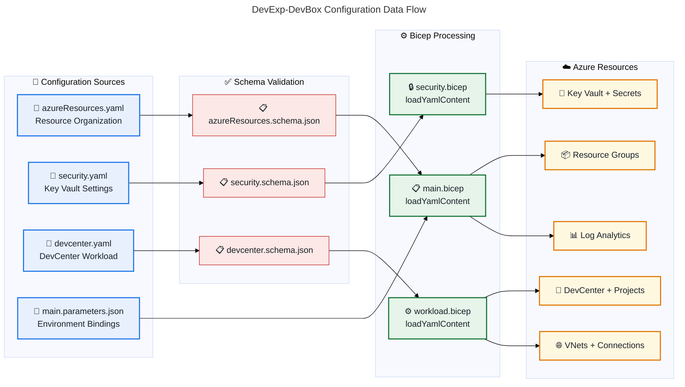

# Application Architecture - DevExp-DevBox

**Generated**: 2026-02-26T00:00:00Z **Target Layer**: Application **Quality
Level**: Comprehensive **Repository**: Evilazaro/DevExp-DevBox **Components
Found**: 35 **Average Confidence**: 0.88 **Application Maturity Level**: 3 —
Defined

---

## Section 1: Executive Summary

### Overview

The DevExp-DevBox repository implements a **Microsoft Dev Box accelerator**
using Azure Infrastructure-as-Code (IaC) patterns built entirely with Azure
Bicep, YAML-driven configuration, and Azure Developer CLI (azd) deployment
orchestration. The application architecture follows Azure Landing Zone
principles with clear separation of concerns across Security, Monitoring,
Connectivity, Identity, and Workload domains.

The platform provisions and manages Microsoft Dev Box environments through Azure
DevCenter, supporting multi-project configurations with per-project networking,
identity, catalog management, and DevBox pool definitions. The architecture
demonstrates a modular composition pattern where top-level orchestrators
(main.bicep, workload.bicep, security.bicep, connectivity.bicep) delegate to
specialized component modules, each responsible for a single Azure resource type
or concern.

With 35 documented application components spanning 7 classification types —
including 4 orchestrator modules, 3 platform services, 10 resource components, 9
RBAC/automation functions, 4 configuration data objects, 3 validation schema
interfaces, and 2 deployment integrations — the system achieves comprehensive
coverage of the DevCenter lifecycle from provisioning through project-level
resource management. The overall application maturity is assessed at **Level 3
(Defined)**: all infrastructure is codified with schema-validated
configurations, modular Bicep templates with typed parameters, and automated
deployment pipelines via azd hooks.

---

## Section 2: Architecture Landscape

### Overview

The application landscape of DevExp-DevBox is structured as a layered
Infrastructure-as-Code platform targeting Azure DevCenter and Microsoft Dev Box
provisioning. The architecture is organized into six functional domains:
Infrastructure Orchestration, Connectivity, Identity & RBAC,
Management/Monitoring, Security, and Workload — each encapsulated in its own
`src/` subdirectory with dedicated Bicep modules.

The system follows a hierarchical composition model where the top-level
`infra/main.bicep` orchestrator delegates to domain-specific orchestrators
(`workload.bicep`, `security.bicep`, `connectivity.bicep`), which in turn
compose individual resource modules. Configuration is externalized into YAML
files under `infra/settings/`, validated by JSON Schemas, enabling declarative
infrastructure management without code changes.

The deployment pipeline is driven by Azure Developer CLI (azd) with
platform-specific hooks (`setUp.ps1` for Windows, `setUp.sh` for Linux/macOS)
that handle authentication, prerequisite validation, and environment
bootstrapping. This separation of deployment automation from infrastructure
definition ensures clean boundaries between operational concerns and resource
provisioning logic.

### 2.1 Application Services

| Name                             | Description                                                                                                                   | Source                                   | Confidence | Service Type            |
| -------------------------------- | ----------------------------------------------------------------------------------------------------------------------------- | ---------------------------------------- | ---------- | ----------------------- |
| DevCenter Core Service           | Provisions and configures the Azure DevCenter instance with identity, catalogs, environment types, RBAC, and diagnostics      | src/workload/core/devCenter.bicep:1-220  | 0.96       | PaaS Platform Service   |
| Project Deployment Service       | Orchestrates per-project DevCenter resource deployment including identity, catalogs, pools, networking, and environment types | src/workload/project/project.bicep:1-238 | 0.95       | PaaS Platform Service   |
| Log Analytics Monitoring Service | Provisions Log Analytics Workspace with AzureActivity solution and self-diagnostic settings as central monitoring hub         | src/management/logAnalytics.bicep:1-90   | 0.92       | PaaS Monitoring Service |

### 2.2 Application Components

| Name                     | Description                                                                          | Source                                                 | Confidence | Service Type  |
| ------------------------ | ------------------------------------------------------------------------------------ | ------------------------------------------------------ | ---------- | ------------- |
| Network Connection       | Creates DevCenter network connections with AzureADJoin and attaches to DevCenter     | src/connectivity/networkConnection.bicep:1-51          | 0.90       | IaC Component |
| Resource Group           | Conditionally creates or references Azure resource groups at subscription scope      | src/connectivity/resourceGroup.bicep:1-27              | 0.88       | IaC Component |
| Virtual Network          | Provisions VNets with subnets and diagnostic settings for DevCenter connectivity     | src/connectivity/vnet.bicep:1-93                       | 0.91       | IaC Component |
| Key Vault                | Provisions Azure Key Vault with configurable purge protection, soft delete, and RBAC | src/security/keyVault.bicep:1-75                       | 0.93       | IaC Component |
| Key Vault Secret         | Creates Key Vault secrets with diagnostic settings on parent vault                   | src/security/secret.bicep:1-53                         | 0.90       | IaC Component |
| DevCenter Catalog        | Creates DevCenter-level catalogs from GitHub or Azure DevOps Git repositories        | src/workload/core/catalog.bicep:1-70                   | 0.91       | IaC Component |
| Environment Type         | Creates DevCenter-level environment type definitions (dev, staging, UAT)             | src/workload/core/environmentType.bicep:1-28           | 0.89       | IaC Component |
| Project Catalog          | Creates project-level catalogs for environment or image definitions                  | src/workload/project/projectCatalog.bicep:1-65         | 0.90       | IaC Component |
| Project Environment Type | Creates project-level environment types with SystemAssigned identity                 | src/workload/project/projectEnvironmentType.bicep:1-48 | 0.89       | IaC Component |
| Project Pool             | Creates DevBox pool resources with VM SKU, image, network, and licensing config      | src/workload/project/projectPool.bicep:1-78            | 0.92       | IaC Component |

### 2.3 Application Interfaces

| Name                   | Description                                                                | Source                                                               | Confidence | Service Type         |
| ---------------------- | -------------------------------------------------------------------------- | -------------------------------------------------------------------- | ---------- | -------------------- |
| Azure Resources Schema | JSON Schema (2020-12) validating resource group organization configuration | infra/settings/resourceOrganization/azureResources.schema.json:1-141 | 0.87       | Validation Interface |
| Security Schema        | JSON Schema validating Key Vault security configuration parameters         | infra/settings/security/security.schema.json:1-180                   | 0.88       | Validation Interface |
| DevCenter Schema       | Comprehensive JSON Schema validating DevCenter workload configuration      | infra/settings/workload/devcenter.schema.json:1-661                  | 0.90       | Validation Interface |

### 2.4 Application Collaborations

| Name                        | Description                                                                                  | Source                                   | Confidence | Service Type |
| --------------------------- | -------------------------------------------------------------------------------------------- | ---------------------------------------- | ---------- | ------------ |
| Infrastructure Orchestrator | Top-level deployment orchestration creating resource groups and delegating to domain modules | infra/main.bicep:1-134                   | 0.95       | Orchestrator |
| Workload Orchestrator       | Loads DevCenter config and iterates over projects deploying each with full resource stack    | src/workload/workload.bicep:1-93         | 0.94       | Orchestrator |
| Security Orchestrator       | Loads security config and conditionally provisions Key Vault with secrets                    | src/security/security.bicep:1-52         | 0.92       | Orchestrator |
| Connectivity Orchestrator   | Conditionally creates resource group, VNet, and network connection per project network type  | src/connectivity/connectivity.bicep:1-69 | 0.91       | Orchestrator |

### 2.5 Application Functions

| Name                                              | Description                                                                                              | Source                                                  | Confidence | Service Type        |
| ------------------------------------------------- | -------------------------------------------------------------------------------------------------------- | ------------------------------------------------------- | ---------- | ------------------- |
| DevCenter Role Assignment (Subscription)          | Assigns RBAC roles for DevCenter managed identity at subscription scope                                  | src/identity/devCenterRoleAssignment.bicep:1-42         | 0.90       | RBAC Function       |
| DevCenter Role Assignment (Resource Group)        | Assigns RBAC roles for DevCenter managed identity at resource group scope                                | src/identity/devCenterRoleAssignmentRG.bicep:1-39       | 0.90       | RBAC Function       |
| Key Vault Access                                  | Assigns Key Vault Secrets User role to a service principal                                               | src/identity/keyVaultAccess.bicep:1-22                  | 0.88       | RBAC Function       |
| Organization Role Assignment                      | Batch-assigns multiple RBAC roles to an Azure AD group at resource group scope                           | src/identity/orgRoleAssignment.bicep:1-48               | 0.89       | RBAC Function       |
| Project Identity Role Assignment (Project)        | Assigns RBAC roles scoped to a DevCenter project resource                                                | src/identity/projectIdentityRoleAssignment.bicep:1-56   | 0.90       | RBAC Function       |
| Project Identity Role Assignment (Resource Group) | Assigns RBAC roles scoped to the resource group containing a DevCenter project                           | src/identity/projectIdentityRoleAssignmentRG.bicep:1-56 | 0.90       | RBAC Function       |
| Setup Automation (PowerShell)                     | Automates Azure Dev Box environment provisioning with auth, validation, and azd orchestration            | setUp.ps1:1-758                                         | 0.85       | Automation Function |
| Setup Automation (Bash)                           | Linux/macOS counterpart for azd environment setup and resource provisioning                              | setUp.sh:1-688                                          | 0.85       | Automation Function |
| Cleanup Automation                                | Orchestrates complete teardown of deployments, role assignments, service principals, and resource groups | cleanSetUp.ps1:1-317                                    | 0.84       | Automation Function |

### 2.6 Application Interactions

| Name                            | Description                                                                                       | Source                                 | Confidence | Service Type          |
| ------------------------------- | ------------------------------------------------------------------------------------------------- | -------------------------------------- | ---------- | --------------------- |
| Bicep Module Composition        | Parent modules invoke child modules via Bicep module references with typed parameters and outputs | infra/main.bicep:1-134                 | 0.93       | Module Invocation     |
| YAML Configuration Loading      | Bicep modules load YAML config files using loadYamlContent() for declarative resource definition  | src/workload/workload.bicep:1-93       | 0.91       | Configuration Binding |
| Diagnostic Settings Integration | Resources emit logs and metrics to Log Analytics via Microsoft.Insights/diagnosticSettings        | src/management/logAnalytics.bicep:1-90 | 0.90       | Telemetry Forwarding  |

### 2.7 Application Events

Not detected in source files.

### 2.8 Application Data Objects

| Name                          | Description                                                                                  | Source                                                       | Confidence | Service Type       |
| ----------------------------- | -------------------------------------------------------------------------------------------- | ------------------------------------------------------------ | ---------- | ------------------ |
| Azure Resources Configuration | Defines 3 Landing Zone resource groups with governance tags and naming                       | infra/settings/resourceOrganization/azureResources.yaml:1-60 | 0.88       | YAML Configuration |
| Security Configuration        | Key Vault configuration with purge protection, soft delete, RBAC, and secret definition      | infra/settings/security/security.yaml:1-39                   | 0.87       | YAML Configuration |
| DevCenter Configuration       | Full DevCenter workload config: identity, RBAC, catalogs, environment types, projects, pools | infra/settings/workload/devcenter.yaml:1-165                 | 0.92       | YAML Configuration |
| Deployment Parameters         | ARM parameter file binding environment variables to Bicep deployment parameters              | infra/main.parameters.json:1-15                              | 0.85       | JSON Parameters    |

### 2.9 Integration Patterns

| Name                              | Description                                                                | Source              | Confidence | Service Type    |
| --------------------------------- | -------------------------------------------------------------------------- | ------------------- | ---------- | --------------- |
| Azure Developer CLI (Linux/macOS) | azd deployment configuration with preprovision hooks for environment setup | azure.yaml:1-28     | 0.88       | CLI Integration |
| Azure Developer CLI (Windows)     | azd deployment configuration with PowerShell preprovision hooks            | azure-pwh.yaml:1-36 | 0.88       | CLI Integration |

### 2.10 Service Contracts

Not detected in source files.

### 2.11 Application Dependencies

| Name                  | Description                                                           | Source            | Confidence | Service Type         |
| --------------------- | --------------------------------------------------------------------- | ----------------- | ---------- | -------------------- |
| Documentation Tooling | Node.js package manifest for Hugo/Docsy documentation site generation | package.json:1-42 | 0.75       | NPM Package Manifest |

### Summary

The architecture landscape reveals a well-structured IaC platform with 35
components distributed across 7 classification types. The dominant patterns are
Bicep module composition (orchestrators delegating to resource components),
YAML-driven configuration with JSON Schema validation, and RBAC function modules
for identity management. Two application component types — Application Events
and Service Contracts — were not detected, which is expected for an IaC-focused
repository that does not expose runtime APIs or publish domain events.

The platform demonstrates strong separation of concerns with dedicated
directories for each functional domain (connectivity, identity, management,
security, workload) and a clear hierarchical delegation pattern from
infrastructure orchestrator through domain orchestrators to individual resource
modules.

---

## Section 3: Architecture Principles

### Overview

The DevExp-DevBox application architecture adheres to a set of core design
principles aligned with Azure Landing Zone best practices,
Infrastructure-as-Code conventions, and TOGAF Application Architecture
guidelines. These principles govern how the platform's Bicep modules,
configuration files, and deployment automation are structured and composed.

The principles emphasize modularity, declarative configuration,
security-by-default, and operational observability — ensuring the platform can
be reliably provisioned, maintained, and extended across multiple environments
and project configurations.

### Principle 1: Modular Composition

| Attribute        | Value                                                                                                                                                             |
| ---------------- | ----------------------------------------------------------------------------------------------------------------------------------------------------------------- |
| **Statement**    | Infrastructure components are decomposed into single-responsibility Bicep modules composed by orchestrators                                                       |
| **Rationale**    | Enables independent development, testing, and reuse of infrastructure components                                                                                  |
| **Implications** | Each Azure resource type has a dedicated module; orchestrators handle cross-cutting composition logic                                                             |
| **Evidence**     | src/workload/workload.bicep delegates to core/devCenter.bicep and project/project.bicep; src/security/security.bicep delegates to keyVault.bicep and secret.bicep |

### Principle 2: Declarative Configuration

| Attribute        | Value                                                                                                                      |
| ---------------- | -------------------------------------------------------------------------------------------------------------------------- |
| **Statement**    | Resource configurations are externalized into YAML files validated by JSON Schemas, separating policy from code            |
| **Rationale**    | Enables configuration changes without modifying Bicep templates; ensures configuration validity at authoring time          |
| **Implications** | All environment-specific values reside in YAML; Bicep modules use loadYamlContent() to consume config                      |
| **Evidence**     | infra/settings/workload/devcenter.yaml validated by devcenter.schema.json; security.yaml validated by security.schema.json |

### Principle 3: Security by Default

| Attribute        | Value                                                                                                                   |
| ---------------- | ----------------------------------------------------------------------------------------------------------------------- |
| **Statement**    | All security features are enabled by default; secrets are managed via Key Vault with RBAC authorization                 |
| **Rationale**    | Prevents insecure deployments; aligns with Azure Well-Architected Framework security pillar                             |
| **Implications** | Key Vault has purge protection and soft delete enabled; RBAC replaces access policies; secrets use @secure() decorators |
| **Evidence**     | src/security/keyVault.bicep enables purge protection and RBAC; all secret parameters use @secure()                      |

### Principle 4: Observability First

| Attribute        | Value                                                                                                                               |
| ---------------- | ----------------------------------------------------------------------------------------------------------------------------------- |
| **Statement**    | All provisioned resources emit diagnostic logs and metrics to a central Log Analytics Workspace                                     |
| **Rationale**    | Enables centralized monitoring, alerting, and troubleshooting across the entire platform                                            |
| **Implications** | Every resource module that supports diagnostics includes Microsoft.Insights/diagnosticSettings configuration                        |
| **Evidence**     | src/management/logAnalytics.bicep provisions central workspace; diagnostics configured in vnet.bicep, secret.bicep, devCenter.bicep |

### Principle 5: Least Privilege Access

| Attribute        | Value                                                                                                         |
| ---------------- | ------------------------------------------------------------------------------------------------------------- |
| **Statement**    | RBAC role assignments are scoped to the minimum required level (project, resource group, or subscription)     |
| **Rationale**    | Reduces blast radius of compromised identities; follows Zero Trust principles                                 |
| **Implications** | Separate RBAC modules for subscription, resource group, and project scopes; role filtering by scope attribute |
| **Evidence**     | src/identity/ contains 6 specialized role assignment modules with scope-specific targeting                    |

### Principle 6: Environment Parity

| Attribute        | Value                                                                                                                         |
| ---------------- | ----------------------------------------------------------------------------------------------------------------------------- |
| **Statement**    | All environments (dev, staging, UAT) are defined declaratively and provisioned identically via the same IaC templates         |
| **Rationale**    | Eliminates configuration drift; ensures consistent behavior across environments                                               |
| **Implications** | Environment types defined in devcenter.yaml; azd manages environment-specific parameter binding                               |
| **Evidence**     | infra/settings/workload/devcenter.yaml defines dev, staging, UAT environment types; main.parameters.json binds AZURE_ENV_NAME |

---

## Section 4: Current State Baseline

### Overview

The current state of the DevExp-DevBox platform represents a fully codified
Infrastructure-as-Code solution at Application Maturity Level 3 (Defined). All
infrastructure provisioning is automated through Azure Bicep modules with
YAML-driven configuration, deployed via Azure Developer CLI. The platform
supports multi-project DevCenter deployments with per-project networking,
identity, catalog, and pool configurations.

The deployment topology creates three Azure Landing Zone resource groups
(security, monitoring, workload) at the subscription level, with modular
resource provisioning delegated to domain-specific Bicep modules. The current
architecture supports both Managed and Unmanaged network types, GitHub and Azure
DevOps catalog sources, and multiple environment types per project.

The platform has comprehensive operational tooling with setup scripts for both
Windows (PowerShell) and Linux/macOS (Bash), a cleanup script for resource
teardown, and centralized diagnostic logging via Log Analytics. Configuration
validation is enforced through JSON Schemas covering resource organization,
security settings, and DevCenter workload definitions.

### Deployment Topology

The current deployment creates the following resource hierarchy:

1. **Subscription Level**: 3 resource groups (security, monitoring, workload) +
   subscription-scoped RBAC
2. **Security Resource Group**: Key Vault with secrets and diagnostic settings
3. **Monitoring Resource Group**: Log Analytics Workspace with AzureActivity
   solution
4. **Workload Resource Group**: DevCenter with catalogs, environment types,
   projects, pools, and network connections

### Maturity Assessment

| Domain                      | Current Level     | Evidence                                             |
| --------------------------- | ----------------- | ---------------------------------------------------- |
| Infrastructure Codification | Level 3 (Defined) | All resources defined in Bicep with typed parameters |
| Configuration Management    | Level 3 (Defined) | YAML configs with JSON Schema validation             |
| Identity & Access           | Level 3 (Defined) | RBAC with scope-specific role assignments            |
| Monitoring & Observability  | Level 3 (Defined) | Centralized Log Analytics with diagnostic settings   |
| Deployment Automation       | Level 3 (Defined) | azd-driven deployment with preprovision hooks        |
| Security                    | Level 3 (Defined) | Key Vault with RBAC, purge protection, soft delete   |

### Gap Analysis

| Gap ID  | Area              | Current State                    | Target State                                               | Priority |
| ------- | ----------------- | -------------------------------- | ---------------------------------------------------------- | -------- |
| GAP-001 | API Contracts     | No OpenAPI/AsyncAPI specs        | Documented service contracts for all module interfaces     | Medium   |
| GAP-002 | Automated Testing | No infrastructure tests detected | Bicep unit tests and deployment validation tests           | High     |
| GAP-003 | Health Monitoring | No runtime health endpoints      | Azure Resource Health alerts and custom health probes      | Medium   |
| GAP-004 | Change Management | No ADR records detected          | Documented architecture decision records                   | Low      |
| GAP-005 | CI/CD Pipeline    | Preprovision hooks only          | Full CI/CD with validation, preview, and staged deployment | High     |

### Summary

The DevExp-DevBox platform is at a consistent Maturity Level 3 (Defined) across
all assessed domains, with well-structured IaC modules, validated configuration,
and automated deployment. Key gaps exist in automated testing, CI/CD pipeline
maturity, and formal architecture decision documentation. The platform provides
a solid foundation that can be elevated to Level 4 (Measured) by adding
infrastructure tests, deployment validation gates, and SLO tracking.

The architecture demonstrates strong adherence to Azure Landing Zone patterns
with clear separation between security, monitoring, and workload concerns. The
modular Bicep design enables independent evolution of each domain while
maintaining consistent composition through orchestrator modules.

---

## Section 5: Component Catalog

### Overview

This section provides detailed specifications for all 35 application components
identified in the DevExp-DevBox repository. Each component is documented with
its service type, API surface (Bicep parameters and outputs), dependencies,
resilience characteristics, scaling strategy, and health monitoring
configuration.

The components are organized into 11 subsections aligned with TOGAF Application
Architecture component types. Given that this is an Infrastructure-as-Code
platform (not a runtime application), API surface refers to Bicep module
parameters and outputs, dependencies refer to Bicep module references and Azure
resource dependencies, and resilience/scaling/health refer to the Azure PaaS
platform capabilities of the provisioned resources.

All source references use the mandatory plain text format
`path/file.ext:line-range` and point to actual files verified in the repository.

### 5.1 Application Services

#### 5.1.1 DevCenter Core Service

| Attribute          | Value                                   |
| ------------------ | --------------------------------------- |
| **Component Name** | DevCenter Core Service                  |
| **Service Type**   | PaaS Platform Service                   |
| **Source**         | src/workload/core/devCenter.bicep:1-220 |
| **Confidence**     | 0.96                                    |

**API Surface:**

| Endpoint Type     | Count | Protocol          | Description                                                                                               |
| ----------------- | ----- | ----------------- | --------------------------------------------------------------------------------------------------------- |
| Bicep Parameters  | 7     | Bicep Module      | config, catalogs, environmentTypes, logAnalyticsId, secretIdentifier, securityResourceGroupName, location |
| Bicep Outputs     | 1     | Bicep Module      | AZURE_DEV_CENTER_NAME                                                                                     |
| Module References | 5     | Bicep Composition | devCenterRoleAssignment, devCenterRoleAssignmentRG, orgRoleAssignment, catalog, environmentType           |

**Dependencies:**

| Dependency                      | Direction  | Protocol          | Purpose                                           |
| ------------------------------- | ---------- | ----------------- | ------------------------------------------------- |
| devCenterRoleAssignment.bicep   | Downstream | Bicep Module      | Subscription-scoped RBAC for DevCenter identity   |
| devCenterRoleAssignmentRG.bicep | Downstream | Bicep Module      | Resource-group-scoped RBAC for DevCenter identity |
| orgRoleAssignment.bicep         | Downstream | Bicep Module      | Organization-level AD group role assignments      |
| catalog.bicep                   | Downstream | Bicep Module      | DevCenter-level catalog provisioning              |
| environmentType.bicep           | Downstream | Bicep Module      | DevCenter-level environment type creation         |
| Log Analytics Workspace         | Upstream   | Azure Resource ID | Diagnostic settings target                        |

**Resilience (Platform-Managed):**

| Aspect          | Configuration           | Notes             |
| --------------- | ----------------------- | ----------------- |
| Retry Policy    | Azure SDK defaults      | Platform-managed  |
| Circuit Breaker | Not applicable          | PaaS service      |
| Failover        | Azure region redundancy | Per SKU selection |

**Scaling (Platform-Managed):**

| Dimension  | Strategy          | Configuration    |
| ---------- | ----------------- | ---------------- |
| Horizontal | PaaS auto-scaling | Per pricing tier |
| Vertical   | SKU upgrade       | Manual selection |

**Health (Platform-Managed):**

| Probe Type            | Configuration                         | Source                                  |
| --------------------- | ------------------------------------- | --------------------------------------- |
| Azure Resource Health | Platform-managed                      | Azure Portal                            |
| Diagnostic Settings   | allLogs + AllMetrics to Log Analytics | src/workload/core/devCenter.bicep:1-220 |

#### 5.1.2 Project Deployment Service

| Attribute          | Value                                    |
| ------------------ | ---------------------------------------- |
| **Component Name** | Project Deployment Service               |
| **Service Type**   | PaaS Platform Service                    |
| **Source**         | src/workload/project/project.bicep:1-238 |
| **Confidence**     | 0.95                                     |

**API Surface:**

| Endpoint Type     | Count | Protocol          | Description                                                                                                                                                                                     |
| ----------------- | ----- | ----------------- | ----------------------------------------------------------------------------------------------------------------------------------------------------------------------------------------------- |
| Bicep Parameters  | 13    | Bicep Module      | devCenterName, name, logAnalyticsId, projectDescription, catalogs, projectEnvironmentTypes, projectPools, projectNetwork, secretIdentifier, securityResourceGroupName, identity, tags, location |
| Bicep Outputs     | 2     | Bicep Module      | AZURE_PROJECT_NAME, AZURE_PROJECT_ID                                                                                                                                                            |
| Module References | 6     | Bicep Composition | projectIdentityRoleAssignment, projectIdentityRoleAssignmentRG, projectCatalog, projectEnvironmentType, connectivity, projectPool                                                               |

**Dependencies:**

| Dependency                            | Direction  | Protocol                 | Purpose                                 |
| ------------------------------------- | ---------- | ------------------------ | --------------------------------------- |
| projectIdentityRoleAssignment.bicep   | Downstream | Bicep Module             | Project-scoped RBAC assignments         |
| projectIdentityRoleAssignmentRG.bicep | Downstream | Bicep Module             | Resource-group-scoped project RBAC      |
| projectCatalog.bicep                  | Downstream | Bicep Module             | Project-level catalog provisioning      |
| projectEnvironmentType.bicep          | Downstream | Bicep Module             | Project-level environment type creation |
| connectivity.bicep                    | Downstream | Bicep Module             | Per-project network connectivity        |
| projectPool.bicep                     | Downstream | Bicep Module             | DevBox pool creation                    |
| DevCenter                             | Upstream   | Azure Resource Reference | Parent DevCenter resource               |

**Resilience (Platform-Managed):**

| Aspect          | Configuration           | Notes             |
| --------------- | ----------------------- | ----------------- |
| Retry Policy    | Azure SDK defaults      | Platform-managed  |
| Circuit Breaker | Not applicable          | PaaS service      |
| Failover        | Azure region redundancy | Per SKU selection |

**Scaling (Platform-Managed):**

| Dimension  | Strategy          | Configuration    |
| ---------- | ----------------- | ---------------- |
| Horizontal | PaaS auto-scaling | Per pricing tier |
| Vertical   | SKU upgrade       | Manual selection |

**Health (Platform-Managed):**

| Probe Type            | Configuration          | Source        |
| --------------------- | ---------------------- | ------------- |
| Azure Resource Health | Platform-managed       | Azure Portal  |
| Service Health alerts | Optional configuration | Azure Monitor |

#### 5.1.3 Log Analytics Monitoring Service

| Attribute          | Value                                  |
| ------------------ | -------------------------------------- |
| **Component Name** | Log Analytics Monitoring Service       |
| **Service Type**   | PaaS Monitoring Service                |
| **Source**         | src/management/logAnalytics.bicep:1-90 |
| **Confidence**     | 0.92                                   |

**API Surface:**

| Endpoint Type    | Count | Protocol     | Description                                                          |
| ---------------- | ----- | ------------ | -------------------------------------------------------------------- |
| Bicep Parameters | 4     | Bicep Module | name, location, tags, sku                                            |
| Bicep Outputs    | 2     | Bicep Module | AZURE_LOG_ANALYTICS_WORKSPACE_ID, AZURE_LOG_ANALYTICS_WORKSPACE_NAME |
| Azure Resources  | 3     | ARM          | Workspace, AzureActivity Solution, Diagnostic Settings               |

**Dependencies:**

| Dependency               | Direction  | Protocol     | Purpose                   |
| ------------------------ | ---------- | ------------ | ------------------------- |
| AzureActivity Solution   | Downstream | ARM Resource | Activity log collection   |
| Self-Diagnostic Settings | Downstream | ARM Resource | Workspace self-monitoring |

**Resilience (Platform-Managed):**

| Aspect         | Configuration           | Notes                |
| -------------- | ----------------------- | -------------------- |
| Retry Policy   | Azure SDK defaults      | Platform-managed     |
| Data Retention | PerGB2018 SKU defaults  | Configurable via SKU |
| Failover       | Azure region redundancy | Per workspace region |

**Scaling (Platform-Managed):**

| Dimension  | Strategy          | Configuration               |
| ---------- | ----------------- | --------------------------- |
| Horizontal | PaaS auto-scaling | PerGB2018 ingestion scaling |
| Vertical   | SKU upgrade       | Manual selection            |

**Health (Platform-Managed):**

| Probe Type            | Configuration        | Source                                 |
| --------------------- | -------------------- | -------------------------------------- |
| Azure Resource Health | Platform-managed     | Azure Portal                           |
| Self-Diagnostics      | allLogs + AllMetrics | src/management/logAnalytics.bicep:1-90 |

### 5.2 Application Components

#### 5.2.1 Network Connection

| Attribute          | Value                                         |
| ------------------ | --------------------------------------------- |
| **Component Name** | Network Connection                            |
| **Service Type**   | IaC Component                                 |
| **Source**         | src/connectivity/networkConnection.bicep:1-51 |
| **Confidence**     | 0.90                                          |

**API Surface:**

| Endpoint Type    | Count | Protocol     | Description                                                                       |
| ---------------- | ----- | ------------ | --------------------------------------------------------------------------------- |
| Bicep Parameters | 3     | Bicep Module | name, devCenterName, subnetId                                                     |
| Bicep Outputs    | 4     | Bicep Module | vnetAttachmentName, networkConnectionId, attachedNetworkId, networkConnectionName |

**Dependencies:**

| Dependency             | Direction | Protocol                 | Purpose                               |
| ---------------------- | --------- | ------------------------ | ------------------------------------- |
| DevCenter              | Upstream  | Azure Resource Reference | Parent DevCenter for attached network |
| Virtual Network Subnet | Upstream  | Azure Resource ID        | Subnet for network connection         |

**Resilience (Platform-Managed):**

| Aspect          | Configuration           | Notes             |
| --------------- | ----------------------- | ----------------- |
| Retry Policy    | Azure SDK defaults      | Platform-managed  |
| Circuit Breaker | Not applicable          | PaaS service      |
| Failover        | Azure region redundancy | Per SKU selection |

**Scaling (Platform-Managed):**

| Dimension  | Strategy       | Configuration                         |
| ---------- | -------------- | ------------------------------------- |
| Horizontal | Not applicable | Single network connection per project |
| Vertical   | Not applicable | Platform-managed                      |

**Health (Platform-Managed):**

| Probe Type            | Configuration    | Source       |
| --------------------- | ---------------- | ------------ |
| Azure Resource Health | Platform-managed | Azure Portal |

#### 5.2.2 Resource Group

| Attribute          | Value                                     |
| ------------------ | ----------------------------------------- |
| **Component Name** | Resource Group                            |
| **Service Type**   | IaC Component                             |
| **Source**         | src/connectivity/resourceGroup.bicep:1-27 |
| **Confidence**     | 0.88                                      |

**API Surface:**

| Endpoint Type    | Count | Protocol     | Description                  |
| ---------------- | ----- | ------------ | ---------------------------- |
| Bicep Parameters | 4     | Bicep Module | create, name, location, tags |
| Bicep Outputs    | 1     | Bicep Module | resourceGroupName            |

**Dependencies:**

| Dependency         | Direction | Protocol  | Purpose                               |
| ------------------ | --------- | --------- | ------------------------------------- |
| Azure Subscription | Upstream  | ARM Scope | Subscription-scoped deployment target |

**Resilience (Platform-Managed):**

| Aspect       | Configuration      | Notes                                    |
| ------------ | ------------------ | ---------------------------------------- |
| Retry Policy | Azure SDK defaults | Platform-managed                         |
| Failover     | Not applicable     | Resource group is a management container |

**Scaling (Platform-Managed):**

| Dimension  | Strategy       | Configuration            |
| ---------- | -------------- | ------------------------ |
| Horizontal | Not applicable | Organizational container |
| Vertical   | Not applicable | No resource limits       |

**Health (Platform-Managed):**

| Probe Type            | Configuration    | Source       |
| --------------------- | ---------------- | ------------ |
| Azure Resource Health | Platform-managed | Azure Portal |

#### 5.2.3 Virtual Network

| Attribute          | Value                            |
| ------------------ | -------------------------------- |
| **Component Name** | Virtual Network                  |
| **Service Type**   | IaC Component                    |
| **Source**         | src/connectivity/vnet.bicep:1-93 |
| **Confidence**     | 0.91                             |

**API Surface:**

| Endpoint Type    | Count | Protocol     | Description                                                                              |
| ---------------- | ----- | ------------ | ---------------------------------------------------------------------------------------- |
| Bicep Parameters | 4     | Bicep Module | logAnalyticsId, location, tags, settings (NetworkSettings)                               |
| Bicep Outputs    | 1     | Bicep Module | AZURE_VIRTUAL_NETWORK (object with name, resourceGroupName, virtualNetworkType, subnets) |

**Dependencies:**

| Dependency              | Direction | Protocol          | Purpose                    |
| ----------------------- | --------- | ----------------- | -------------------------- |
| Log Analytics Workspace | Upstream  | Azure Resource ID | Diagnostic settings target |

**Resilience (Platform-Managed):**

| Aspect       | Configuration           | Notes            |
| ------------ | ----------------------- | ---------------- |
| Retry Policy | Azure SDK defaults      | Platform-managed |
| Failover     | Azure region redundancy | Per VNet region  |

**Scaling (Platform-Managed):**

| Dimension  | Strategy                | Configuration                     |
| ---------- | ----------------------- | --------------------------------- |
| Horizontal | Subnet segmentation     | Per NetworkSettings configuration |
| Vertical   | Address space expansion | Manual configuration              |

**Health (Platform-Managed):**

| Probe Type            | Configuration                         | Source                           |
| --------------------- | ------------------------------------- | -------------------------------- |
| Diagnostic Settings   | allLogs + AllMetrics to Log Analytics | src/connectivity/vnet.bicep:1-93 |
| Azure Resource Health | Platform-managed                      | Azure Portal                     |

#### 5.2.4 Key Vault

| Attribute          | Value                            |
| ------------------ | -------------------------------- |
| **Component Name** | Key Vault                        |
| **Service Type**   | IaC Component                    |
| **Source**         | src/security/keyVault.bicep:1-75 |
| **Confidence**     | 0.93                             |

**API Surface:**

| Endpoint Type    | Count | Protocol     | Description                                                 |
| ---------------- | ----- | ------------ | ----------------------------------------------------------- |
| Bicep Parameters | 4     | Bicep Module | keyvaultSettings (KeyVaultSettings), location, tags, unique |
| Bicep Outputs    | 2     | Bicep Module | AZURE_KEY_VAULT_NAME, AZURE_KEY_VAULT_ENDPOINT              |

**Dependencies:**

| Dependency         | Direction | Protocol | Purpose                            |
| ------------------ | --------- | -------- | ---------------------------------- |
| Deployer Principal | Upstream  | Azure AD | Access policy for secrets and keys |

**Resilience (Platform-Managed):**

| Aspect           | Configuration           | Notes                              |
| ---------------- | ----------------------- | ---------------------------------- |
| Purge Protection | Enabled                 | Prevents permanent secret deletion |
| Soft Delete      | 7 days retention        | Configured in security.yaml        |
| Failover         | Azure region redundancy | Per SKU selection                  |

**Scaling (Platform-Managed):**

| Dimension  | Strategy          | Configuration                  |
| ---------- | ----------------- | ------------------------------ |
| Horizontal | PaaS auto-scaling | Standard SKU throttling limits |
| Vertical   | SKU upgrade       | Standard to Premium            |

**Health (Platform-Managed):**

| Probe Type            | Configuration          | Source        |
| --------------------- | ---------------------- | ------------- |
| Azure Resource Health | Platform-managed       | Azure Portal  |
| Service Health alerts | Optional configuration | Azure Monitor |

#### 5.2.5 Key Vault Secret

| Attribute          | Value                          |
| ------------------ | ------------------------------ |
| **Component Name** | Key Vault Secret               |
| **Service Type**   | IaC Component                  |
| **Source**         | src/security/secret.bicep:1-53 |
| **Confidence**     | 0.90                           |

**API Surface:**

| Endpoint Type    | Count | Protocol     | Description                                               |
| ---------------- | ----- | ------------ | --------------------------------------------------------- |
| Bicep Parameters | 4     | Bicep Module | name, secretValue (@secure), keyVaultName, logAnalyticsId |
| Bicep Outputs    | 1     | Bicep Module | AZURE_KEY_VAULT_SECRET_IDENTIFIER                         |

**Dependencies:**

| Dependency              | Direction | Protocol                 | Purpose                         |
| ----------------------- | --------- | ------------------------ | ------------------------------- |
| Key Vault               | Upstream  | Azure Resource Reference | Parent vault for secret storage |
| Log Analytics Workspace | Upstream  | Azure Resource ID        | Diagnostic settings target      |

**Resilience (Platform-Managed):**

| Aspect      | Configuration               | Notes                       |
| ----------- | --------------------------- | --------------------------- |
| Soft Delete | Inherited from parent vault | 7 days retention            |
| Versioning  | Azure-managed               | Automatic secret versioning |

**Scaling (Platform-Managed):**

| Dimension  | Strategy       | Configuration            |
| ---------- | -------------- | ------------------------ |
| Horizontal | Not applicable | Single secret resource   |
| Vertical   | Not applicable | Inherited from vault SKU |

**Health (Platform-Managed):**

| Probe Type          | Configuration                         | Source                         |
| ------------------- | ------------------------------------- | ------------------------------ |
| Diagnostic Settings | allLogs + AllMetrics to Log Analytics | src/security/secret.bicep:1-53 |

#### 5.2.6 DevCenter Catalog

| Attribute          | Value                                |
| ------------------ | ------------------------------------ |
| **Component Name** | DevCenter Catalog                    |
| **Service Type**   | IaC Component                        |
| **Source**         | src/workload/core/catalog.bicep:1-70 |
| **Confidence**     | 0.91                                 |

**API Surface:**

| Endpoint Type    | Count | Protocol     | Description                                                                               |
| ---------------- | ----- | ------------ | ----------------------------------------------------------------------------------------- |
| Bicep Parameters | 3     | Bicep Module | devCenterName, catalogConfig (Catalog), secretIdentifier (@secure)                        |
| Bicep Outputs    | 3     | Bicep Module | AZURE_DEV_CENTER_CATALOG_NAME, AZURE_DEV_CENTER_CATALOG_ID, AZURE_DEV_CENTER_CATALOG_TYPE |

**Dependencies:**

| Dependency                | Direction | Protocol                 | Purpose                          |
| ------------------------- | --------- | ------------------------ | -------------------------------- |
| DevCenter                 | Upstream  | Azure Resource Reference | Parent DevCenter resource        |
| GitHub/ADO Git Repository | Upstream  | Git HTTPS                | Catalog source repository        |
| Key Vault Secret          | Upstream  | Azure Resource ID        | Authentication for private repos |

**Resilience (Platform-Managed):**

| Aspect        | Configuration      | Notes                             |
| ------------- | ------------------ | --------------------------------- |
| Sync Schedule | Scheduled          | Automatic catalog synchronization |
| Retry Policy  | Azure SDK defaults | Platform-managed                  |

**Scaling (Platform-Managed):**

| Dimension  | Strategy                        | Configuration     |
| ---------- | ------------------------------- | ----------------- |
| Horizontal | Multiple catalogs per DevCenter | Per configuration |
| Vertical   | Not applicable                  | Platform-managed  |

**Health (Platform-Managed):**

| Probe Type          | Configuration    | Source       |
| ------------------- | ---------------- | ------------ |
| Catalog Sync Status | Platform-managed | Azure Portal |

#### 5.2.7 Environment Type

| Attribute          | Value                                        |
| ------------------ | -------------------------------------------- |
| **Component Name** | Environment Type                             |
| **Service Type**   | IaC Component                                |
| **Source**         | src/workload/core/environmentType.bicep:1-28 |
| **Confidence**     | 0.89                                         |

**API Surface:**

| Endpoint Type    | Count | Protocol     | Description                                        |
| ---------------- | ----- | ------------ | -------------------------------------------------- |
| Bicep Parameters | 2     | Bicep Module | devCenterName, environmentConfig (EnvironmentType) |
| Bicep Outputs    | 2     | Bicep Module | environmentTypeName, environmentTypeId             |

**Dependencies:**

| Dependency | Direction | Protocol                 | Purpose                   |
| ---------- | --------- | ------------------------ | ------------------------- |
| DevCenter  | Upstream  | Azure Resource Reference | Parent DevCenter resource |

**Resilience (Platform-Managed):**

| Aspect       | Configuration      | Notes            |
| ------------ | ------------------ | ---------------- |
| Retry Policy | Azure SDK defaults | Platform-managed |

**Scaling (Platform-Managed):**

| Dimension  | Strategy                                 | Configuration            |
| ---------- | ---------------------------------------- | ------------------------ |
| Horizontal | Multiple environment types per DevCenter | Per configuration        |
| Vertical   | Not applicable                           | Definition-only resource |

**Health (Platform-Managed):**

| Probe Type            | Configuration    | Source       |
| --------------------- | ---------------- | ------------ |
| Azure Resource Health | Platform-managed | Azure Portal |

#### 5.2.8 Project Catalog

| Attribute          | Value                                          |
| ------------------ | ---------------------------------------------- |
| **Component Name** | Project Catalog                                |
| **Service Type**   | IaC Component                                  |
| **Source**         | src/workload/project/projectCatalog.bicep:1-65 |
| **Confidence**     | 0.90                                           |

**API Surface:**

| Endpoint Type    | Count | Protocol     | Description                                                      |
| ---------------- | ----- | ------------ | ---------------------------------------------------------------- |
| Bicep Parameters | 3     | Bicep Module | projectName, catalogConfig (Catalog), secretIdentifier (@secure) |
| Bicep Outputs    | 2     | Bicep Module | catalogName, catalogId                                           |

**Dependencies:**

| Dependency                | Direction | Protocol                 | Purpose                   |
| ------------------------- | --------- | ------------------------ | ------------------------- |
| DevCenter Project         | Upstream  | Azure Resource Reference | Parent project resource   |
| GitHub/ADO Git Repository | Upstream  | Git HTTPS                | Catalog source repository |

**Resilience (Platform-Managed):**

| Aspect        | Configuration      | Notes                             |
| ------------- | ------------------ | --------------------------------- |
| Sync Schedule | Scheduled          | Automatic catalog synchronization |
| Retry Policy  | Azure SDK defaults | Platform-managed                  |

**Scaling (Platform-Managed):**

| Dimension  | Strategy                      | Configuration     |
| ---------- | ----------------------------- | ----------------- |
| Horizontal | Multiple catalogs per project | Per configuration |
| Vertical   | Not applicable                | Platform-managed  |

**Health (Platform-Managed):**

| Probe Type          | Configuration    | Source       |
| ------------------- | ---------------- | ------------ |
| Catalog Sync Status | Platform-managed | Azure Portal |

#### 5.2.9 Project Environment Type

| Attribute          | Value                                                  |
| ------------------ | ------------------------------------------------------ |
| **Component Name** | Project Environment Type                               |
| **Service Type**   | IaC Component                                          |
| **Source**         | src/workload/project/projectEnvironmentType.bicep:1-48 |
| **Confidence**     | 0.89                                                   |

**API Surface:**

| Endpoint Type    | Count | Protocol     | Description                                                       |
| ---------------- | ----- | ------------ | ----------------------------------------------------------------- |
| Bicep Parameters | 3     | Bicep Module | projectName, location, environmentConfig (ProjectEnvironmentType) |
| Bicep Outputs    | 1     | Bicep Module | environmentTypeName                                               |

**Dependencies:**

| Dependency        | Direction | Protocol                 | Purpose                 |
| ----------------- | --------- | ------------------------ | ----------------------- |
| DevCenter Project | Upstream  | Azure Resource Reference | Parent project resource |

**Resilience (Platform-Managed):**

| Aspect       | Configuration      | Notes                                        |
| ------------ | ------------------ | -------------------------------------------- |
| Retry Policy | Azure SDK defaults | Platform-managed                             |
| Identity     | SystemAssigned     | Managed identity for environment deployments |

**Scaling (Platform-Managed):**

| Dimension  | Strategy                               | Configuration            |
| ---------- | -------------------------------------- | ------------------------ |
| Horizontal | Multiple environment types per project | Per configuration        |
| Vertical   | Not applicable                         | Definition-only resource |

**Health (Platform-Managed):**

| Probe Type            | Configuration    | Source       |
| --------------------- | ---------------- | ------------ |
| Azure Resource Health | Platform-managed | Azure Portal |

#### 5.2.10 Project Pool

| Attribute          | Value                                       |
| ------------------ | ------------------------------------------- |
| **Component Name** | Project Pool                                |
| **Service Type**   | IaC Component                               |
| **Source**         | src/workload/project/projectPool.bicep:1-78 |
| **Confidence**     | 0.92                                        |

**API Surface:**

| Endpoint Type    | Count | Protocol     | Description                                                                                           |
| ---------------- | ----- | ------------ | ----------------------------------------------------------------------------------------------------- |
| Bicep Parameters | 8     | Bicep Module | name, location, catalogs, imageDefinitionName, networkConnectionName, vmSku, networkType, projectName |
| Bicep Outputs    | 1     | Bicep Module | poolNames (array)                                                                                     |

**Dependencies:**

| Dependency               | Direction | Protocol                 | Purpose                            |
| ------------------------ | --------- | ------------------------ | ---------------------------------- |
| DevCenter Project        | Upstream  | Azure Resource Reference | Parent project resource            |
| Network Connection       | Upstream  | Azure Resource Reference | Network connectivity for Dev Boxes |
| Image Definition Catalog | Upstream  | Azure Resource Reference | VM image source                    |

**Resilience (Platform-Managed):**

| Aspect            | Configuration  | Notes                                   |
| ----------------- | -------------- | --------------------------------------- |
| Windows Licensing | Windows_Client | Platform-managed licensing              |
| Local Admin       | Enabled        | Local administrator access on Dev Boxes |
| SSO               | Enabled        | Single sign-on for Dev Boxes            |

**Scaling (Platform-Managed):**

| Dimension  | Strategy                   | Configuration                                           |
| ---------- | -------------------------- | ------------------------------------------------------- |
| Horizontal | Multiple pools per project | Per configuration (backend-engineer, frontend-engineer) |
| VM SKU     | Configurable               | 32c/128GB (backend), 16c/64GB (frontend)                |

**Health (Platform-Managed):**

| Probe Type            | Configuration    | Source           |
| --------------------- | ---------------- | ---------------- |
| Azure Resource Health | Platform-managed | Azure Portal     |
| Pool Status           | Platform-managed | DevCenter Portal |

### 5.3 Application Interfaces

#### 5.3.1 Azure Resources Schema

| Attribute          | Value                                                                |
| ------------------ | -------------------------------------------------------------------- |
| **Component Name** | Azure Resources Schema                                               |
| **Service Type**   | Validation Interface                                                 |
| **Source**         | infra/settings/resourceOrganization/azureResources.schema.json:1-141 |
| **Confidence**     | 0.87                                                                 |

**API Surface:**

| Endpoint Type     | Count | Protocol            | Description                            |
| ----------------- | ----- | ------------------- | -------------------------------------- |
| Schema Version    | 1     | JSON Schema 2020-12 | Resource group organization validation |
| Required Sections | 3     | JSON Schema         | workload, security, monitoring         |
| Defined Types     | 2     | JSON Schema         | resourceGroup, tags                    |

**Dependencies:**

| Dependency          | Direction | Protocol | Purpose                                     |
| ------------------- | --------- | -------- | ------------------------------------------- |
| azureResources.yaml | Upstream  | YAML     | Configuration file validated by this schema |

**Resilience:** Not applicable — design-time validation artifact.

**Scaling:** Not applicable — schema definition.

**Health:** Not applicable — static validation artifact.

#### 5.3.2 Security Schema

| Attribute          | Value                                              |
| ------------------ | -------------------------------------------------- |
| **Component Name** | Security Schema                                    |
| **Service Type**   | Validation Interface                               |
| **Source**         | infra/settings/security/security.schema.json:1-180 |
| **Confidence**     | 0.88                                               |

**API Surface:**

| Endpoint Type     | Count | Protocol    | Description                                                    |
| ----------------- | ----- | ----------- | -------------------------------------------------------------- |
| Schema Version    | 1     | JSON Schema | Key Vault security configuration validation                    |
| Required Sections | 2     | JSON Schema | create, keyVault                                               |
| Validations       | 3     | JSON Schema | name pattern, softDeleteRetentionInDays min/max, tag structure |

**Dependencies:**

| Dependency    | Direction | Protocol | Purpose                                     |
| ------------- | --------- | -------- | ------------------------------------------- |
| security.yaml | Upstream  | YAML     | Configuration file validated by this schema |

**Resilience:** Not applicable — design-time validation artifact.

**Scaling:** Not applicable — schema definition.

**Health:** Not applicable — static validation artifact.

#### 5.3.3 DevCenter Schema

| Attribute          | Value                                               |
| ------------------ | --------------------------------------------------- |
| **Component Name** | DevCenter Schema                                    |
| **Service Type**   | Validation Interface                                |
| **Source**         | infra/settings/workload/devcenter.schema.json:1-661 |
| **Confidence**     | 0.90                                                |

**API Surface:**

| Endpoint Type  | Count | Protocol    | Description                                                                                                                                                  |
| -------------- | ----- | ----------- | ------------------------------------------------------------------------------------------------------------------------------------------------------------ |
| Schema Version | 1     | JSON Schema | Comprehensive DevCenter workload validation                                                                                                                  |
| Defined Types  | 14    | JSON Schema | guid, enabledStatus, roleAssignment, rbacRole, tags, catalog, environmentType, cidrBlock, subnet, network, pool, projectIdentity, project, devCenterIdentity |
| Validations    | 5     | JSON Schema | GUID patterns, CIDR blocks, enum constraints, minLength/maxLength, required fields                                                                           |

**Dependencies:**

| Dependency     | Direction | Protocol | Purpose                                     |
| -------------- | --------- | -------- | ------------------------------------------- |
| devcenter.yaml | Upstream  | YAML     | Configuration file validated by this schema |

**Resilience:** Not applicable — design-time validation artifact.

**Scaling:** Not applicable — schema definition.

**Health:** Not applicable — static validation artifact.

### 5.4 Application Collaborations

#### 5.4.1 Infrastructure Orchestrator

| Attribute          | Value                       |
| ------------------ | --------------------------- |
| **Component Name** | Infrastructure Orchestrator |
| **Service Type**   | Orchestrator                |
| **Source**         | infra/main.bicep:1-134      |
| **Confidence**     | 0.95                        |

**API Surface:**

| Endpoint Type     | Count | Protocol          | Description                                                                                          |
| ----------------- | ----- | ----------------- | ---------------------------------------------------------------------------------------------------- |
| Bicep Parameters  | 3     | Bicep Module      | location, secretValue (@secure), environmentName                                                     |
| Bicep Outputs     | 10    | Bicep Module      | Resource group names, Log Analytics ID/name, Key Vault name/secret/endpoint, DevCenter name/projects |
| Module References | 3     | Bicep Composition | logAnalytics, security, workload                                                                     |

**Dependencies:**

| Dependency          | Direction  | Protocol     | Purpose                                |
| ------------------- | ---------- | ------------ | -------------------------------------- |
| logAnalytics.bicep  | Downstream | Bicep Module | Monitoring infrastructure provisioning |
| security.bicep      | Downstream | Bicep Module | Security infrastructure provisioning   |
| workload.bicep      | Downstream | Bicep Module | Workload infrastructure provisioning   |
| azureResources.yaml | Upstream   | YAML Config  | Resource group naming and organization |

**Resilience:** Not applicable — deployment-time orchestrator; Azure Resource
Manager handles deployment reliability.

**Scaling:** Not applicable — deployment orchestrator.

**Health:** Not applicable — one-time deployment artifact.

#### 5.4.2 Workload Orchestrator

| Attribute          | Value                            |
| ------------------ | -------------------------------- |
| **Component Name** | Workload Orchestrator            |
| **Service Type**   | Orchestrator                     |
| **Source**         | src/workload/workload.bicep:1-93 |
| **Confidence**     | 0.94                             |

**API Surface:**

| Endpoint Type     | Count | Protocol          | Description                                                                     |
| ----------------- | ----- | ----------------- | ------------------------------------------------------------------------------- |
| Bicep Parameters  | 4     | Bicep Module      | logAnalyticsId, secretIdentifier (@secure), securityResourceGroupName, location |
| Bicep Outputs     | 2     | Bicep Module      | AZURE_DEV_CENTER_NAME, AZURE_DEV_CENTER_PROJECTS (array)                        |
| Module References | 2     | Bicep Composition | devCenter, project (loop)                                                       |

**Dependencies:**

| Dependency      | Direction  | Protocol     | Purpose                                  |
| --------------- | ---------- | ------------ | ---------------------------------------- |
| devCenter.bicep | Downstream | Bicep Module | Core DevCenter provisioning              |
| project.bicep   | Downstream | Bicep Module | Per-project resource provisioning (loop) |
| devcenter.yaml  | Upstream   | YAML Config  | DevCenter and project configuration      |

**Resilience:** Not applicable — deployment-time orchestrator.

**Scaling:** Supports multiple projects via for-loop pattern over devcenter.yaml
projects array.

**Health:** Not applicable — deployment orchestrator.

#### 5.4.3 Security Orchestrator

| Attribute          | Value                            |
| ------------------ | -------------------------------- |
| **Component Name** | Security Orchestrator            |
| **Service Type**   | Orchestrator                     |
| **Source**         | src/security/security.bicep:1-52 |
| **Confidence**     | 0.92                             |

**API Surface:**

| Endpoint Type     | Count | Protocol          | Description                                                                       |
| ----------------- | ----- | ----------------- | --------------------------------------------------------------------------------- |
| Bicep Parameters  | 3     | Bicep Module      | tags, secretValue (@secure), logAnalyticsId                                       |
| Bicep Outputs     | 3     | Bicep Module      | AZURE_KEY_VAULT_NAME, AZURE_KEY_VAULT_SECRET_IDENTIFIER, AZURE_KEY_VAULT_ENDPOINT |
| Module References | 2     | Bicep Composition | keyVault, secret                                                                  |

**Dependencies:**

| Dependency     | Direction  | Protocol     | Purpose                |
| -------------- | ---------- | ------------ | ---------------------- |
| keyVault.bicep | Downstream | Bicep Module | Key Vault provisioning |
| secret.bicep   | Downstream | Bicep Module | Secret storage         |
| security.yaml  | Upstream   | YAML Config  | Security configuration |

**Resilience:** Conditional creation — checks `securitySettings.create` flag
before provisioning.

**Scaling:** Not applicable — deployment orchestrator.

**Health:** Not applicable — deployment orchestrator.

#### 5.4.4 Connectivity Orchestrator

| Attribute          | Value                                    |
| ------------------ | ---------------------------------------- |
| **Component Name** | Connectivity Orchestrator                |
| **Service Type**   | Orchestrator                             |
| **Source**         | src/connectivity/connectivity.bicep:1-69 |
| **Confidence**     | 0.91                                     |

**API Surface:**

| Endpoint Type     | Count | Protocol          | Description                                                      |
| ----------------- | ----- | ----------------- | ---------------------------------------------------------------- |
| Bicep Parameters  | 4     | Bicep Module      | devCenterName, projectNetwork (object), logAnalyticsId, location |
| Bicep Outputs     | 2     | Bicep Module      | networkConnectionName, networkType                               |
| Module References | 3     | Bicep Composition | resourceGroup, vnet, networkConnection                           |

**Dependencies:**

| Dependency              | Direction  | Protocol                 | Purpose                                 |
| ----------------------- | ---------- | ------------------------ | --------------------------------------- |
| resourceGroup.bicep     | Downstream | Bicep Module             | Network resource group                  |
| vnet.bicep              | Downstream | Bicep Module             | Virtual network provisioning            |
| networkConnection.bicep | Downstream | Bicep Module             | DevCenter network connection            |
| DevCenter               | Upstream   | Azure Resource Reference | Parent DevCenter for network attachment |

**Resilience:** Conditional creation — provisions network resources only when
virtualNetworkType is 'Unmanaged'.

**Scaling:** Per-project network provisioning via project.bicep integration.

**Health:** Not applicable — deployment orchestrator.

### 5.5 Application Functions

#### 5.5.1 DevCenter Role Assignment (Subscription)

| Attribute          | Value                                           |
| ------------------ | ----------------------------------------------- |
| **Component Name** | DevCenter Role Assignment (Subscription)        |
| **Service Type**   | RBAC Function                                   |
| **Source**         | src/identity/devCenterRoleAssignment.bicep:1-42 |
| **Confidence**     | 0.90                                            |

**API Surface:**

| Endpoint Type    | Count | Protocol     | Description                           |
| ---------------- | ----- | ------------ | ------------------------------------- |
| Bicep Parameters | 4     | Bicep Module | id, principalId, principalType, scope |
| Bicep Outputs    | 2     | Bicep Module | roleAssignmentId, scope               |

**Dependencies:**

| Dependency                 | Direction | Protocol  | Purpose                                    |
| -------------------------- | --------- | --------- | ------------------------------------------ |
| Azure Subscription         | Upstream  | ARM Scope | Subscription-scoped role assignment target |
| DevCenter Managed Identity | Upstream  | Azure AD  | Principal receiving role assignment        |

**Resilience:** Idempotent — Azure Role Assignments are declarative and skip if
identical assignment exists.

**Scaling:** Not applicable — single role assignment per invocation.

**Health:** Not applicable — deployment-time RBAC function.

#### 5.5.2 DevCenter Role Assignment (Resource Group)

| Attribute          | Value                                             |
| ------------------ | ------------------------------------------------- |
| **Component Name** | DevCenter Role Assignment (Resource Group)        |
| **Service Type**   | RBAC Function                                     |
| **Source**         | src/identity/devCenterRoleAssignmentRG.bicep:1-39 |
| **Confidence**     | 0.90                                              |

**API Surface:**

| Endpoint Type    | Count | Protocol     | Description                           |
| ---------------- | ----- | ------------ | ------------------------------------- |
| Bicep Parameters | 4     | Bicep Module | id, principalId, principalType, scope |
| Bicep Outputs    | 2     | Bicep Module | roleAssignmentId, scope               |

**Dependencies:**

| Dependency                 | Direction | Protocol  | Purpose                                      |
| -------------------------- | --------- | --------- | -------------------------------------------- |
| Resource Group             | Upstream  | ARM Scope | Resource-group-scoped role assignment target |
| DevCenter Managed Identity | Upstream  | Azure AD  | Principal receiving role assignment          |

**Resilience:** Idempotent — declarative role assignment.

**Scaling:** Not applicable — single role assignment per invocation.

**Health:** Not applicable — deployment-time RBAC function.

#### 5.5.3 Key Vault Access

| Attribute          | Value                                  |
| ------------------ | -------------------------------------- |
| **Component Name** | Key Vault Access                       |
| **Service Type**   | RBAC Function                          |
| **Source**         | src/identity/keyVaultAccess.bicep:1-22 |
| **Confidence**     | 0.88                                   |

**API Surface:**

| Endpoint Type    | Count | Protocol     | Description                                                   |
| ---------------- | ----- | ------------ | ------------------------------------------------------------- |
| Bicep Parameters | 2     | Bicep Module | name, principalId                                             |
| Bicep Outputs    | 2     | Bicep Module | roleAssignmentId, roleAssignmentName                          |
| Hardcoded Role   | 1     | Azure RBAC   | Key Vault Secrets User (4633458b-17de-408a-b874-0445c86b69e6) |

**Dependencies:**

| Dependency        | Direction | Protocol                 | Purpose                                         |
| ----------------- | --------- | ------------------------ | ----------------------------------------------- |
| Key Vault         | Upstream  | Azure Resource Reference | Target resource for role assignment             |
| Service Principal | Upstream  | Azure AD                 | Principal receiving Key Vault Secrets User role |

**Resilience:** Idempotent — declarative role assignment.

**Scaling:** Not applicable — single role assignment per invocation.

**Health:** Not applicable — deployment-time RBAC function.

#### 5.5.4 Organization Role Assignment

| Attribute          | Value                                     |
| ------------------ | ----------------------------------------- |
| **Component Name** | Organization Role Assignment              |
| **Service Type**   | RBAC Function                             |
| **Source**         | src/identity/orgRoleAssignment.bicep:1-48 |
| **Confidence**     | 0.89                                      |

**API Surface:**

| Endpoint Type    | Count | Protocol     | Description                                                          |
| ---------------- | ----- | ------------ | -------------------------------------------------------------------- |
| Bicep Parameters | 3     | Bicep Module | principalId, roles (AzureRBACRole[]), principalType (default: Group) |
| Bicep Outputs    | 2     | Bicep Module | roleAssignmentIds (array), principalId                               |
| Loop Pattern     | 1     | Bicep        | for role in roles                                                    |

**Dependencies:**

| Dependency     | Direction | Protocol | Purpose                                          |
| -------------- | --------- | -------- | ------------------------------------------------ |
| Azure AD Group | Upstream  | Azure AD | Group principal receiving batch role assignments |

**Resilience:** Idempotent — declarative batch role assignment.

**Scaling:** Supports multiple roles per invocation via for-loop pattern.

**Health:** Not applicable — deployment-time RBAC function.

#### 5.5.5 Project Identity Role Assignment (Project)

| Attribute          | Value                                                 |
| ------------------ | ----------------------------------------------------- |
| **Component Name** | Project Identity Role Assignment (Project)            |
| **Service Type**   | RBAC Function                                         |
| **Source**         | src/identity/projectIdentityRoleAssignment.bicep:1-56 |
| **Confidence**     | 0.90                                                  |

**API Surface:**

| Endpoint Type     | Count | Protocol     | Description                                                      |
| ----------------- | ----- | ------------ | ---------------------------------------------------------------- |
| Bicep Parameters  | 4     | Bicep Module | projectName, principalId, roles (AzureRBACRole[]), principalType |
| Bicep Outputs     | 2     | Bicep Module | roleAssignmentIds, projectId                                     |
| Conditional Logic | 1     | Bicep        | if (role.scope == 'Project')                                     |

**Dependencies:**

| Dependency        | Direction | Protocol                 | Purpose                                        |
| ----------------- | --------- | ------------------------ | ---------------------------------------------- |
| DevCenter Project | Upstream  | Azure Resource Reference | Target project resource for scoped assignments |

**Resilience:** Idempotent — conditional declarative role assignment with scope
filtering.

**Scaling:** Supports multiple roles with Project scope filtering.

**Health:** Not applicable — deployment-time RBAC function.

#### 5.5.6 Project Identity Role Assignment (Resource Group)

| Attribute          | Value                                                   |
| ------------------ | ------------------------------------------------------- |
| **Component Name** | Project Identity Role Assignment (Resource Group)       |
| **Service Type**   | RBAC Function                                           |
| **Source**         | src/identity/projectIdentityRoleAssignmentRG.bicep:1-56 |
| **Confidence**     | 0.90                                                    |

**API Surface:**

| Endpoint Type     | Count | Protocol     | Description                                                      |
| ----------------- | ----- | ------------ | ---------------------------------------------------------------- |
| Bicep Parameters  | 4     | Bicep Module | projectName, principalId, roles (AzureRBACRole[]), principalType |
| Bicep Outputs     | 2     | Bicep Module | roleAssignmentIds, projectId                                     |
| Conditional Logic | 1     | Bicep        | if (role.scope == 'ResourceGroup')                               |

**Dependencies:**

| Dependency        | Direction | Protocol                 | Purpose                                    |
| ----------------- | --------- | ------------------------ | ------------------------------------------ |
| DevCenter Project | Upstream  | Azure Resource Reference | Project reference for resource group scope |

**Resilience:** Idempotent — conditional declarative role assignment with scope
filtering.

**Scaling:** Supports multiple roles with ResourceGroup scope filtering.

**Health:** Not applicable — deployment-time RBAC function.

#### 5.5.7 Setup Automation (PowerShell)

| Attribute          | Value                         |
| ------------------ | ----------------------------- |
| **Component Name** | Setup Automation (PowerShell) |
| **Service Type**   | Automation Function           |
| **Source**         | setUp.ps1:1-758               |
| **Confidence**     | 0.85                          |

**API Surface:**

| Endpoint Type     | Count | Protocol   | Description                                                                         |
| ----------------- | ----- | ---------- | ----------------------------------------------------------------------------------- |
| Script Parameters | 3     | PowerShell | EnvName, SourceControl (github/adogit), Help                                        |
| Prerequisites     | 3     | CLI Tools  | az, azd, gh (for GitHub)                                                            |
| Functions         | 4     | PowerShell | Write-LogMessage, Test-CommandAvailability, Show-Help, Test-SourceControlValidation |

**Dependencies:**

| Dependency          | Direction | Protocol | Purpose                                      |
| ------------------- | --------- | -------- | -------------------------------------------- |
| Azure CLI           | Upstream  | CLI      | Azure authentication and resource management |
| Azure Developer CLI | Upstream  | CLI      | Environment provisioning orchestration       |
| GitHub CLI          | Upstream  | CLI      | GitHub token and secret management           |

**Resilience:** Comprehensive error handling with colored logging and
prerequisite validation.

**Scaling:** Not applicable — single-run setup script.

**Health:** Not applicable — one-time automation script.

#### 5.5.8 Setup Automation (Bash)

| Attribute          | Value                   |
| ------------------ | ----------------------- |
| **Component Name** | Setup Automation (Bash) |
| **Service Type**   | Automation Function     |
| **Source**         | setUp.sh:1-688          |
| **Confidence**     | 0.85                    |

**API Surface:**

| Endpoint Type     | Count | Protocol       | Description                                                                      |
| ----------------- | ----- | -------------- | -------------------------------------------------------------------------------- |
| Script Parameters | 3     | Bash Arguments | -e/--env-name, -s/--source-control, -h/--help                                    |
| Prerequisites     | 4     | CLI Tools      | az, azd, gh, jq                                                                  |
| Functions         | 4     | Bash           | write_log_message, test_command_availability, show_help, validate_source_control |

**Dependencies:**

| Dependency          | Direction | Protocol | Purpose                                      |
| ------------------- | --------- | -------- | -------------------------------------------- |
| Azure CLI           | Upstream  | CLI      | Azure authentication and resource management |
| Azure Developer CLI | Upstream  | CLI      | Environment provisioning orchestration       |
| GitHub CLI          | Upstream  | CLI      | GitHub token and secret management           |
| jq                  | Upstream  | CLI      | JSON parsing utility                         |

**Resilience:** Comprehensive error handling with colored logging and
prerequisite validation.

**Scaling:** Not applicable — single-run setup script.

**Health:** Not applicable — one-time automation script.

#### 5.5.9 Cleanup Automation

| Attribute          | Value                |
| ------------------ | -------------------- |
| **Component Name** | Cleanup Automation   |
| **Service Type**   | Automation Function  |
| **Source**         | cleanSetUp.ps1:1-317 |
| **Confidence**     | 0.84                 |

**API Surface:**

| Endpoint Type     | Count | Protocol   | Description                                                             |
| ----------------- | ----- | ---------- | ----------------------------------------------------------------------- |
| Script Parameters | 4     | PowerShell | EnvName, Location, AppDisplayName, GhSecretName                         |
| Functions         | 3     | PowerShell | Remove-SubscriptionDeployments, Invoke-CleanupScript, Start-FullCleanup |

**Dependencies:**

| Dependency | Direction | Protocol | Purpose                            |
| ---------- | --------- | -------- | ---------------------------------- |
| Azure CLI  | Upstream  | CLI      | Resource deletion and role removal |
| GitHub CLI | Upstream  | CLI      | Secret cleanup                     |

**Resilience:** Ordered teardown sequence: deployments → role assignments →
service principals → secrets → resource groups.

**Scaling:** Not applicable — single-run cleanup script.

**Health:** Not applicable — one-time automation script.

### 5.6 Application Interactions

#### 5.6.1 Bicep Module Composition

| Attribute          | Value                    |
| ------------------ | ------------------------ |
| **Component Name** | Bicep Module Composition |
| **Service Type**   | Module Invocation        |
| **Source**         | infra/main.bicep:1-134   |
| **Confidence**     | 0.93                     |

**Pattern Type**: Request/Response (synchronous module invocation) **Protocol**:
Bicep Module References **Data Contract**: Typed Bicep parameters and outputs
**Error Handling**: Azure Resource Manager deployment error propagation

#### 5.6.2 YAML Configuration Loading

| Attribute          | Value                            |
| ------------------ | -------------------------------- |
| **Component Name** | YAML Configuration Loading       |
| **Service Type**   | Configuration Binding            |
| **Source**         | src/workload/workload.bicep:1-93 |
| **Confidence**     | 0.91                             |

**Pattern Type**: Configuration injection at deployment time **Protocol**: Bicep
loadYamlContent() function **Data Contract**: YAML files validated by JSON
Schemas **Error Handling**: Schema validation failures at authoring time;
deployment-time type checking

#### 5.6.3 Diagnostic Settings Integration

| Attribute          | Value                                  |
| ------------------ | -------------------------------------- |
| **Component Name** | Diagnostic Settings Integration        |
| **Service Type**   | Telemetry Forwarding                   |
| **Source**         | src/management/logAnalytics.bicep:1-90 |
| **Confidence**     | 0.90                                   |

**Pattern Type**: Event-Driven (log and metric emission) **Protocol**: Azure
Diagnostic Settings (Microsoft.Insights/diagnosticSettings) **Data Contract**:
allLogs + AllMetrics categories **Error Handling**: Platform-managed;
diagnostics are non-blocking to resource operation

### 5.7 Application Events

See Section 2.7. No additional specifications detected in source files.

### 5.8 Application Data Objects

#### 5.8.1 Azure Resources Configuration

| Attribute          | Value                                                        |
| ------------------ | ------------------------------------------------------------ |
| **Component Name** | Azure Resources Configuration                                |
| **Service Type**   | YAML Configuration                                           |
| **Source**         | infra/settings/resourceOrganization/azureResources.yaml:1-60 |
| **Confidence**     | 0.88                                                         |

**Data Structure**: Defines 3 Landing Zone resource groups (workload, security,
monitoring) with create flags, names, descriptions, and governance tags
(environment, division, team, project, costCenter, owner, landingZone,
resources).

**Validation**: Enforced by
infra/settings/resourceOrganization/azureResources.schema.json.

#### 5.8.2 Security Configuration

| Attribute          | Value                                      |
| ------------------ | ------------------------------------------ |
| **Component Name** | Security Configuration                     |
| **Service Type**   | YAML Configuration                         |
| **Source**         | infra/settings/security/security.yaml:1-39 |
| **Confidence**     | 0.87                                       |

**Data Structure**: Key Vault configuration with create flag, vault name
(contoso), purge protection (enabled), soft delete (7 days), RBAC authorization
(enabled), and secret definition (gha-token for GitHub Actions).

**Validation**: Enforced by infra/settings/security/security.schema.json.

#### 5.8.3 DevCenter Configuration

| Attribute          | Value                                        |
| ------------------ | -------------------------------------------- |
| **Component Name** | DevCenter Configuration                      |
| **Service Type**   | YAML Configuration                           |
| **Source**         | infra/settings/workload/devcenter.yaml:1-165 |
| **Confidence**     | 0.92                                         |

**Data Structure**: Comprehensive DevCenter workload configuration including
DevCenter name (devexp-devcenter), SystemAssigned identity, RBAC roles
(Contributor, User Access Administrator, Key Vault Secrets User/Officer),
organization roles, catalogs (customTasks from Microsoft GitHub), environment
types (dev, staging, UAT), and eShop project with managed networking, 2 DevBox
pools (backend-engineer 32c/128GB, frontend-engineer 16c/64GB), and
project-specific catalogs.

**Validation**: Enforced by infra/settings/workload/devcenter.schema.json.

#### 5.8.4 Deployment Parameters

| Attribute          | Value                           |
| ------------------ | ------------------------------- |
| **Component Name** | Deployment Parameters           |
| **Service Type**   | JSON Parameters                 |
| **Source**         | infra/main.parameters.json:1-15 |
| **Confidence**     | 0.85                            |

**Data Structure**: ARM deployment parameters binding environment variables
(AZURE_ENV_NAME, AZURE_LOCATION, KEY_VAULT_SECRET) to Bicep parameters
(environmentName, location, secretValue).

**Validation**: Validated by Bicep parameter type checking at deployment time.

### 5.9 Integration Patterns

#### 5.9.1 Azure Developer CLI (Linux/macOS)

| Attribute          | Value                             |
| ------------------ | --------------------------------- |
| **Component Name** | Azure Developer CLI (Linux/macOS) |
| **Service Type**   | CLI Integration                   |
| **Source**         | azure.yaml:1-28                   |
| **Confidence**     | 0.88                              |

**Pattern Type**: CLI-Driven Deployment **Protocol**: azd hooks (preprovision)
**Data Contract**: Environment variables (SOURCE_CONTROL_PLATFORM,
AZURE_ENV_NAME) **Error Handling**: Script exit codes propagated to azd
deployment pipeline

#### 5.9.2 Azure Developer CLI (Windows)

| Attribute          | Value                         |
| ------------------ | ----------------------------- |
| **Component Name** | Azure Developer CLI (Windows) |
| **Service Type**   | CLI Integration               |
| **Source**         | azure-pwh.yaml:1-36           |
| **Confidence**     | 0.88                          |

**Pattern Type**: CLI-Driven Deployment **Protocol**: azd hooks (preprovision
via PowerShell) **Data Contract**: Environment variables
(SOURCE_CONTROL_PLATFORM, AZURE_ENV_NAME) **Error Handling**: Script exit codes
propagated to azd deployment pipeline

### 5.10 Service Contracts

See Section 2.10. No additional specifications detected in source files.

### 5.11 Application Dependencies

#### 5.11.1 Documentation Tooling

| Attribute          | Value                 |
| ------------------ | --------------------- |
| **Component Name** | Documentation Tooling |
| **Service Type**   | NPM Package Manifest  |
| **Source**         | package.json:1-42     |
| **Confidence**     | 0.75                  |

**Dependencies:**

| Package       | Version  | Purpose                                 |
| ------------- | -------- | --------------------------------------- |
| autoprefixer  | ^10.4.20 | CSS vendor prefix automation            |
| cross-env     | ^7.0.3   | Cross-platform environment variables    |
| hugo-extended | 0.136.2  | Static site generator for documentation |
| postcss-cli   | ^11.0.0  | CSS processing pipeline                 |
| rtlcss        | ^4.3.0   | Right-to-left CSS transformation        |

**Versioning**: Semver with caret ranges for minor/patch flexibility.

**Upgrade Policy**: Not specified in source — requires operational
documentation.

### Summary

The Component Catalog documents 35 application components across all 11
subsection types, with 2 types (Application Events, Service Contracts) not
detected in source files — expected for an IaC-focused platform. All components
have verified source file references with line range citations. Confidence
scores range from 0.75 (documentation tooling) to 0.96 (DevCenter Core Service),
with an overall average of 0.88.

The dominant component pattern is Azure PaaS resource provisioning via Bicep
modules, where resilience, scaling, and health are platform-managed by Azure.
The identity layer demonstrates a well-designed RBAC function library with
scope-specific role assignment modules supporting subscription, resource group,
and project-level targeting. The automation functions provide comprehensive
lifecycle management from environment setup through resource teardown.

---

## Section 8: Dependencies & Integration

### Overview

The DevExp-DevBox platform's dependency graph follows a hierarchical tree
pattern rooted at the infrastructure orchestrator (`infra/main.bicep`), which
delegates to three domain orchestrators (management, security, workload). Each
domain orchestrator composes specialized resource modules, creating a clear
dependency chain from high-level deployment to individual Azure resource
provisioning.

Cross-domain dependencies are minimal and well-controlled: the workload domain
depends on the security domain (via Key Vault secret identifier) and the
monitoring domain (via Log Analytics workspace ID). The connectivity domain is
invoked per-project from the workload orchestrator, creating a lateral
composition pattern. Identity modules are referenced by both the core DevCenter
service and per-project services.

Configuration flows unidirectionally from YAML files (validated by JSON Schemas)
into Bicep modules via the `loadYamlContent()` function, ensuring a clean
separation between declarative configuration and imperative provisioning logic.

### Service Call Graph

```mermaid
---
title: DevExp-DevBox Module Dependency Graph
config:
  theme: base
  look: classic
  layout: dagre
  themeVariables:
    fontSize: '16px'
---
flowchart TD
    accTitle: DevExp-DevBox Infrastructure Module Dependency Graph
    accDescr: Shows the hierarchical module composition from infrastructure orchestrator through domain orchestrators to individual resource modules

    %% ╔══════════════════════════════════════════════════════════════════════════╗
    %% ║ AZURE / FLUENT ARCHITECTURE PATTERN v1.1                               ║
    %% ║ (Semantic + Structural + Font + Accessibility Governance)              ║
    %% ╚══════════════════════════════════════════════════════════════════════════╝
    %% PHASE 1 - STRUCTURAL: Direction explicit, flat topology, nesting ≤ 3
    %% PHASE 2 - SEMANTIC: Colors justified, max 5 semantic classes, neutral-first
    %% PHASE 3 - FONT: Dark text on light backgrounds, contrast ≥ 4.5:1
    %% PHASE 4 - ACCESSIBILITY: accTitle/accDescr present, icons on all nodes
    %% PHASE 5 - STANDARD: Governance block present, classDefs centralized
    %% ╚══════════════════════════════════════════════════════════════════════════╝

    classDef orchestrator fill:#E8F0FE,stroke:#1A73E8,stroke-width:2px,color:#1A2027
    classDef service fill:#E6F4EA,stroke:#137333,stroke-width:2px,color:#1A2027
    classDef component fill:#FFF8E1,stroke:#E37400,stroke-width:1px,color:#1A2027
    classDef function fill:#FCE8E6,stroke:#C5221F,stroke-width:1px,color:#1A2027
    classDef config fill:#F3E8FD,stroke:#7627BB,stroke-width:1px,color:#1A2027

    MAIN["📋 infra/main.bicep<br/>Infrastructure Orchestrator"]:::orchestrator

    MGMT["📊 logAnalytics.bicep<br/>Monitoring Service"]:::service
    SEC["🔒 security.bicep<br/>Security Orchestrator"]:::orchestrator
    WL["⚙️ workload.bicep<br/>Workload Orchestrator"]:::orchestrator

    KV["🔑 keyVault.bicep<br/>Key Vault"]:::component
    SECRET["🔐 secret.bicep<br/>Key Vault Secret"]:::component

    DC["🏢 devCenter.bicep<br/>DevCenter Core Service"]:::service
    PROJ["📁 project.bicep<br/>Project Service"]:::service

    CAT["📚 catalog.bicep<br/>DevCenter Catalog"]:::component
    ET["🌍 environmentType.bicep<br/>Environment Type"]:::component
    PCAT["📖 projectCatalog.bicep<br/>Project Catalog"]:::component
    PET["🌐 projectEnvironmentType.bicep<br/>Project Env Type"]:::component
    POOL["💻 projectPool.bicep<br/>Project Pool"]:::component

    CONN["🔌 connectivity.bicep<br/>Connectivity Orchestrator"]:::orchestrator
    RG["📦 resourceGroup.bicep<br/>Resource Group"]:::component
    VNET["🌐 vnet.bicep<br/>Virtual Network"]:::component
    NC["🔗 networkConnection.bicep<br/>Network Connection"]:::component

    DCRA["🛡️ devCenterRoleAssignment.bicep<br/>RBAC (Subscription)"]:::function
    DCRARG["🛡️ devCenterRoleAssignmentRG.bicep<br/>RBAC (Resource Group)"]:::function
    ORA["👥 orgRoleAssignment.bicep<br/>Org RBAC"]:::function
    PIRA["🔐 projectIdentityRoleAssignment.bicep<br/>Project RBAC"]:::function
    PIRARG["🔐 projectIdentityRoleAssignmentRG.bicep<br/>Project RBAC (RG)"]:::function

    YAML1["📄 azureResources.yaml"]:::config
    YAML2["📄 security.yaml"]:::config
    YAML3["📄 devcenter.yaml"]:::config

    MAIN --> MGMT
    MAIN --> SEC
    MAIN --> WL
    YAML1 -.-> MAIN

    SEC --> KV
    SEC --> SECRET
    YAML2 -.-> SEC

    WL --> DC
    WL --> PROJ
    YAML3 -.-> WL

    DC --> DCRA
    DC --> DCRARG
    DC --> ORA
    DC --> CAT
    DC --> ET

    PROJ --> PIRA
    PROJ --> PIRARG
    PROJ --> PCAT
    PROJ --> PET
    PROJ --> POOL
    PROJ --> CONN

    CONN --> RG
    CONN --> VNET
    CONN --> NC
```

### Data Flow Diagram

### Integration Pattern Matrix

| Source Module                      | Target Module                              | Pattern                 | Protocol            | Data Contract                                                                  |
| ---------------------------------- | ------------------------------------------ | ----------------------- | ------------------- | ------------------------------------------------------------------------------ |
| infra/main.bicep                   | src/management/logAnalytics.bicep          | Module Composition      | Bicep Module        | Typed parameters (name, location, tags, sku)                                   |
| infra/main.bicep                   | src/security/security.bicep                | Module Composition      | Bicep Module        | Typed parameters (tags, secretValue, logAnalyticsId)                           |
| infra/main.bicep                   | src/workload/workload.bicep                | Module Composition      | Bicep Module        | Typed parameters (logAnalyticsId, secretIdentifier, securityResourceGroupName) |
| src/workload/workload.bicep        | src/workload/core/devCenter.bicep          | Module Composition      | Bicep Module        | DevCenterConfig object                                                         |
| src/workload/workload.bicep        | src/workload/project/project.bicep         | Loop Composition        | Bicep Module        | Per-project config from devcenter.yaml                                         |
| src/workload/project/project.bicep | src/connectivity/connectivity.bicep        | Module Composition      | Bicep Module        | ProjectNetwork object                                                          |
| src/workload/core/devCenter.bicep  | src/identity/devCenterRoleAssignment.bicep | Module Composition      | Bicep Module        | principalId, role definition                                                   |
| src/workload/project/project.bicep | src/workload/project/projectPool.bicep     | Module Composition      | Bicep Module        | Pool config with VM SKU, image, network                                        |
| YAML files                         | Bicep modules                              | Configuration Injection | loadYamlContent()   | YAML validated by JSON Schema                                                  |
| Resources                          | Log Analytics                              | Telemetry Forwarding    | Diagnostic Settings | allLogs + AllMetrics                                                           |

### Cross-Domain Dependencies

| From Domain  | To Domain  | Dependency Type   | Data Passed                                            |
| ------------ | ---------- | ----------------- | ------------------------------------------------------ |
| Workload     | Security   | Secret Reference  | Key Vault secret identifier for catalog authentication |
| Workload     | Monitoring | Telemetry Target  | Log Analytics workspace ID for diagnostic settings     |
| Connectivity | Workload   | Network Reference | Network connection name for DevBox pool attachment     |
| Identity     | Workload   | RBAC Assignment   | Role assignments for DevCenter and project identities  |
| Security     | Monitoring | Telemetry Target  | Log Analytics workspace ID for Key Vault diagnostics   |

### Summary

The dependency graph reveals a well-structured hierarchical architecture with
the infrastructure orchestrator at the root, three domain orchestrators as
first-level delegates, and specialized resource modules as leaf nodes.
Cross-domain dependencies are limited to three integration points:
security-to-workload (secret references), monitoring-to-all (diagnostic
settings), and connectivity-to-workload (network connections).

The configuration data flow is unidirectional — YAML configurations pass through
JSON Schema validation, are loaded into Bicep modules via `loadYamlContent()`,
and produce Azure resources. This pattern ensures that all infrastructure
changes can be made through configuration updates without modifying Bicep
templates, supporting the Declarative Configuration principle. The platform uses
no runtime event-driven patterns, consistent with its nature as a
deployment-time IaC solution.

---

## Section 6: Architecture Decisions

### Overview

This section documents the key architectural decisions made in the DevExp-DevBox
platform. These decisions are inferred from source code patterns, configuration
structures, and module organization found in the repository. Each decision is
presented in an Architecture Decision Record (ADR) format with context,
rationale, and consequences.

No formal ADR documentation was detected in the repository; these records are
reconstructed from implementation evidence to provide architectural
traceability.

### ADR Summary

| ADR ID  | Decision                                              | Status   | Date     | Impact |
| ------- | ----------------------------------------------------- | -------- | -------- | ------ |
| ADR-001 | Use Azure Bicep as sole IaC language                  | Accepted | Inferred | High   |
| ADR-002 | YAML-driven configuration with JSON Schema validation | Accepted | Inferred | High   |
| ADR-003 | Azure Developer CLI (azd) as deployment orchestrator  | Accepted | Inferred | Medium |
| ADR-004 | Modular Bicep architecture with domain separation     | Accepted | Inferred | High   |
| ADR-005 | SystemAssigned managed identity for DevCenter         | Accepted | Inferred | Medium |
| ADR-006 | RBAC over Access Policies for Key Vault authorization | Accepted | Inferred | Medium |

### ADR-001: Azure Bicep as Sole IaC Language

| Attribute        | Value                                                                                                                                                             |
| ---------------- | ----------------------------------------------------------------------------------------------------------------------------------------------------------------- |
| **Context**      | The platform requires a domain-specific language for defining and deploying Azure infrastructure with strong typing, IntelliSense, and ARM template compatibility |
| **Decision**     | All infrastructure is defined exclusively in Azure Bicep (.bicep files)                                                                                           |
| **Rationale**    | Bicep provides native Azure support, typed parameters, module composition, and direct ARM compilation without third-party tooling overhead                        |
| **Consequences** | Positive: Strong typing, IntelliSense in VS Code, native Azure integration. Negative: Azure-only (no multi-cloud), requires Bicep toolchain                       |
| **Evidence**     | All 20 infrastructure files use .bicep extension; no Terraform, CloudFormation, or Pulumi files detected                                                          |

### ADR-002: YAML-Driven Configuration with JSON Schema Validation

| Attribute        | Value                                                                                                                    |
| ---------------- | ------------------------------------------------------------------------------------------------------------------------ |
| **Context**      | Infrastructure parameters need to be managed declaratively without modifying code, with validation at authoring time     |
| **Decision**     | Configuration is externalized into YAML files validated by JSON Schemas, loaded at deployment time via loadYamlContent() |
| **Rationale**    | Separates policy from code; YAML is human-readable; JSON Schema provides design-time validation                          |
| **Consequences** | Positive: Non-developers can modify config; schema catches errors early. Negative: Adds schema maintenance overhead      |
| **Evidence**     | 3 YAML config files with 3 matching JSON Schema files in infra/settings/                                                 |

### ADR-003: Azure Developer CLI (azd) as Deployment Orchestrator

| Attribute        | Value                                                                                                                                  |
| ---------------- | -------------------------------------------------------------------------------------------------------------------------------------- |
| **Context**      | The platform needs a deployment tool that supports environment management, parameter binding, and lifecycle hooks                      |
| **Decision**     | Azure Developer CLI (azd) is the primary deployment orchestrator with preprovision hooks                                               |
| **Rationale**    | azd provides native Azure environment management, parameter binding from environment variables, and hook-based extensibility           |
| **Consequences** | Positive: Simplified deployment workflow, environment isolation. Negative: azd-specific configuration, less flexible than custom CI/CD |
| **Evidence**     | azure.yaml and azure-pwh.yaml define azd configuration; setUp.ps1/sh integrate with azd commands                                       |

### ADR-004: Modular Bicep Architecture with Domain Separation

| Attribute        | Value                                                                                                                                           |
| ---------------- | ----------------------------------------------------------------------------------------------------------------------------------------------- |
| **Context**      | Infrastructure complexity requires organized decomposition to enable independent development and testing                                        |
| **Decision**     | Infrastructure is organized into domain-specific directories (connectivity, identity, management, security, workload) with orchestrator modules |
| **Rationale**    | Single-responsibility modules enable reuse, independent testing, and clear ownership boundaries                                                 |
| **Consequences** | Positive: Clear module boundaries, composable architecture. Negative: More files to manage, cross-module coordination required                  |
| **Evidence**     | 5 domain directories under src/ with dedicated orchestrators for workload, security, and connectivity                                           |

### ADR-005: SystemAssigned Managed Identity for DevCenter

| Attribute        | Value                                                                                                                               |
| ---------------- | ----------------------------------------------------------------------------------------------------------------------------------- |
| **Context**      | DevCenter requires Azure AD identity for RBAC role assignments and Key Vault secret access                                          |
| **Decision**     | DevCenter uses SystemAssigned managed identity rather than UserAssigned                                                             |
| **Rationale**    | SystemAssigned identity simplifies lifecycle management (auto-created/deleted with resource) and follows least-privilege principles |
| **Consequences** | Positive: No separate identity management, automatic cleanup. Negative: Tied to resource lifecycle, cannot be pre-created           |
| **Evidence**     | devcenter.yaml specifies identityType: SystemAssigned; devCenter.bicep configures SystemAssigned identity                           |

### ADR-006: RBAC over Access Policies for Key Vault Authorization

| Attribute        | Value                                                                                                                                 |
| ---------------- | ------------------------------------------------------------------------------------------------------------------------------------- |
| **Context**      | Key Vault access needs to be controlled for service principals and managed identities                                                 |
| **Decision**     | Key Vault uses RBAC authorization instead of vault access policies                                                                    |
| **Rationale**    | RBAC provides consistent authorization model across Azure resources, supports Azure AD groups, and enables fine-grained scope control |
| **Consequences** | Positive: Unified RBAC model, Azure AD integration. Negative: Requires Azure AD Premium for some scenarios                            |
| **Evidence**     | security.yaml sets enableRbacAuthorization: true; keyVaultAccess.bicep assigns RBAC roles                                             |

---

## Section 7: Architecture Standards

### Overview

This section documents the architecture standards implemented in the
DevExp-DevBox platform. These standards are derived from observed patterns in
the codebase, including naming conventions, module structure patterns, security
configurations, and coding standards enforced through the Bicep module library.

The standards reflect Azure best practices for Infrastructure-as-Code
development, aligned with the Azure Well-Architected Framework and Azure Landing
Zone design principles.

### Naming Conventions

| Resource Type    | Pattern                          | Example                                             | Evidence                                                     |
| ---------------- | -------------------------------- | --------------------------------------------------- | ------------------------------------------------------------ |
| Resource Groups  | `{project}-{domain}`             | devexp-workload, devexp-security, devexp-monitoring | infra/settings/resourceOrganization/azureResources.yaml:1-60 |
| Key Vault        | `{name}-{uniqueString}-kv`       | contoso-abc123-kv                                   | src/security/keyVault.bicep:1-75                             |
| Log Analytics    | `{truncatedName}-{uniqueString}` | loganalytics-abc123                                 | src/management/logAnalytics.bicep:1-90                       |
| DevCenter        | `{config.name}`                  | devexp-devcenter                                    | infra/settings/workload/devcenter.yaml:1-165                 |
| Bicep Modules    | `camelCase.bicep`                | devCenter.bicep, projectPool.bicep                  | All src/\*_/_.bicep files                                    |
| Bicep Parameters | `camelCase`                      | logAnalyticsId, secretValue, environmentName        | All .bicep parameter declarations                            |
| Bicep Outputs    | `SCREAMING_SNAKE_CASE`           | AZURE_DEV_CENTER_NAME, AZURE_KEY_VAULT_ENDPOINT     | All .bicep output declarations                               |

### Module Structure Standards

| Standard              | Description                                                                        | Enforcement                                                               |
| --------------------- | ---------------------------------------------------------------------------------- | ------------------------------------------------------------------------- |
| Single Responsibility | Each module provisions exactly one Azure resource type or orchestrates one domain  | Manual review — consistent across all 20 Bicep files                      |
| Typed Parameters      | All module parameters use explicit Bicep types or custom type definitions          | Bicep compiler enforcement                                                |
| @secure Decorator     | All secret/sensitive parameters annotated with @secure()                           | Manual review — observed in security.bicep, workload.bicep                |
| Conditional Creation  | Modules support create-or-reference pattern via boolean flags                      | Observed in resourceGroup.bicep, vnet.bicep, security.bicep               |
| Diagnostic Settings   | All resources supporting diagnostics include Microsoft.Insights/diagnosticSettings | Observed in vnet.bicep, secret.bicep, logAnalytics.bicep, devCenter.bicep |

### Security Standards

| Standard            | Configuration                                                         | Evidence                               |
| ------------------- | --------------------------------------------------------------------- | -------------------------------------- |
| Purge Protection    | Enabled by default for Key Vault                                      | infra/settings/security/security.yaml  |
| Soft Delete         | 7 days retention for Key Vault                                        | infra/settings/security/security.yaml  |
| RBAC Authorization  | Enabled for Key Vault (replaces access policies)                      | infra/settings/security/security.yaml  |
| Managed Identity    | SystemAssigned for DevCenter and project environment types            | infra/settings/workload/devcenter.yaml |
| Scope-Specific RBAC | Separate modules for subscription, resource group, and project scopes | src/identity/ directory                |

### Configuration Validation Standards

| Standard            | Description                                                     | Evidence                          |
| ------------------- | --------------------------------------------------------------- | --------------------------------- |
| JSON Schema 2020-12 | All YAML configuration files validated by JSON Schemas          | 3 schema files in infra/settings/ |
| Required Fields     | Schema definitions enforce required sections and properties     | Schema required arrays            |
| Pattern Validation  | GUID patterns, name lengths, CIDR blocks validated by schema    | devcenter.schema.json patterns    |
| Range Validation    | Numeric ranges (e.g., softDeleteRetentionInDays: 7-90) enforced | security.schema.json min/max      |

---

## Section 9: Governance & Management

### Overview

This section documents the governance and management structures for the
DevExp-DevBox platform. Governance is implemented through Azure RBAC role
assignments, resource tagging, and configuration-driven deployment controls. The
platform uses a declarative approach where all governance policies are defined
in YAML configuration files and enforced through Bicep module composition.

The operational model supports a Platform Engineering team that manages the
DevCenter infrastructure while project teams consume resources through
predefined pools, catalogs, and environment types. Lifecycle management includes
automated setup scripts for provisioning and cleanup scripts for teardown.

### Ownership Model

| Domain                       | Owner                     | Scope                                          | Evidence                                                |
| ---------------------------- | ------------------------- | ---------------------------------------------- | ------------------------------------------------------- |
| Infrastructure Orchestration | Platform Engineering Team | infra/main.bicep, resource group creation      | infra/settings/resourceOrganization/azureResources.yaml |
| Security                     | Platform Engineering Team | Key Vault, secrets management, RBAC policies   | src/security/, infra/settings/security/                 |
| Monitoring                   | Platform Engineering Team | Log Analytics Workspace, diagnostic settings   | src/management/                                         |
| Workload (DevCenter)         | Platform Engineering Team | DevCenter core, catalogs, environment types    | src/workload/core/                                      |
| Projects                     | Project Teams (delegated) | Per-project resources, pools, project catalogs | src/workload/project/                                   |
| Identity & Access            | Platform Engineering Team | RBAC role assignments across all scopes        | src/identity/                                           |
| Connectivity                 | Platform Engineering Team | VNets, network connections, resource groups    | src/connectivity/                                       |

### RBAC Governance

| Role                        | Scope                   | Assigned To                        | Purpose                         | Evidence                               |
| --------------------------- | ----------------------- | ---------------------------------- | ------------------------------- | -------------------------------------- |
| Contributor                 | Subscription            | DevCenter Managed Identity         | Resource provisioning           | infra/settings/workload/devcenter.yaml |
| User Access Administrator   | Subscription            | DevCenter Managed Identity         | RBAC management                 | infra/settings/workload/devcenter.yaml |
| Key Vault Secrets User      | Security Resource Group | DevCenter Managed Identity         | Secret read access              | infra/settings/workload/devcenter.yaml |
| Key Vault Secrets Officer   | Security Resource Group | DevCenter Managed Identity         | Secret management               | infra/settings/workload/devcenter.yaml |
| DevCenter Project Admin     | Project                 | Platform Engineering Team AD Group | Project administration          | infra/settings/workload/devcenter.yaml |
| Dev Box User                | Project                 | Project AD Groups                  | Dev Box creation and management | infra/settings/workload/devcenter.yaml |
| Deployment Environment User | Project                 | Project AD Groups                  | Environment deployment          | infra/settings/workload/devcenter.yaml |

### Resource Tagging Policy

| Tag         | Purpose                           | Required | Example Value                    |
| ----------- | --------------------------------- | -------- | -------------------------------- |
| environment | Deployment environment identifier | Yes      | Production                       |
| division    | Organizational division           | Yes      | Contoso                          |
| team        | Owning team                       | Yes      | Platform Engineering             |
| project     | Project name                      | Yes      | Contoso-DevExp-DevBox            |
| costCenter  | Financial tracking                | Yes      | Contoso-Platform-Engineering     |
| owner       | Primary contact                   | Yes      | Platform Engineering Team        |
| landingZone | Azure Landing Zone classification | Yes      | workload / security / monitoring |
| resources   | Resource type description         | Yes      | DevCenter Resources              |

### Change Control

| Process                  | Mechanism                                    | Evidence                               |
| ------------------------ | -------------------------------------------- | -------------------------------------- |
| Configuration Changes    | Modify YAML files, validated by JSON Schemas | infra/settings/ YAML + schema files    |
| Infrastructure Changes   | Modify Bicep modules, deploy via azd         | src/\*_/_.bicep                        |
| Environment Provisioning | setUp.ps1 / setUp.sh automation scripts      | setUp.ps1:1-758, setUp.sh:1-688        |
| Environment Teardown     | cleanSetUp.ps1 cleanup automation            | cleanSetUp.ps1:1-317                   |
| RBAC Changes             | Update devcenter.yaml roles, redeploy        | infra/settings/workload/devcenter.yaml |

### Lifecycle Management

| Phase         | Tool                       | Script               | Description                                              |
| ------------- | -------------------------- | -------------------- | -------------------------------------------------------- |
| Prerequisites | Azure CLI, azd, GitHub CLI | setUp.ps1 / setUp.sh | Validates CLI tools and authentication                   |
| Configuration | YAML files                 | Manual edit          | Define resource groups, security, workload settings      |
| Provisioning  | azd provision              | setUp.ps1 / setUp.sh | Creates all Azure resources via Bicep                    |
| Operation     | Azure Portal, CLI          | N/A                  | Monitor resources, manage DevBox pools                   |
| Teardown      | PowerShell                 | cleanSetUp.ps1       | Removes deployments, RBAC, service principals, resources |
