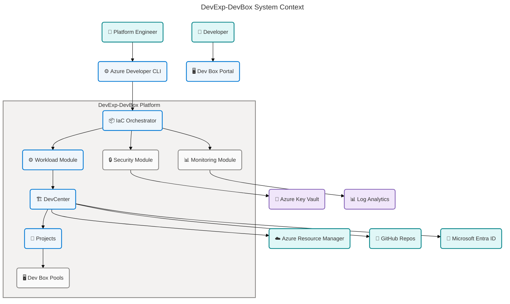
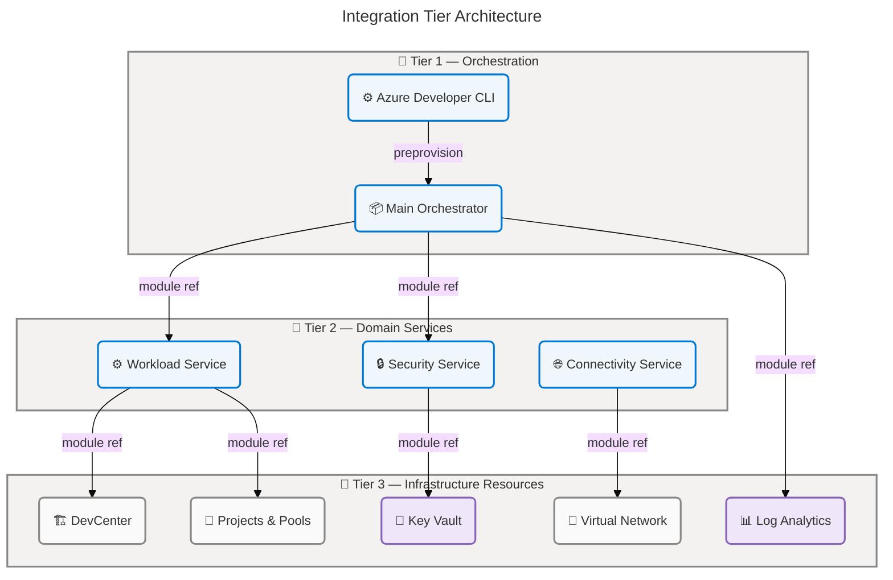
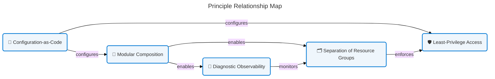
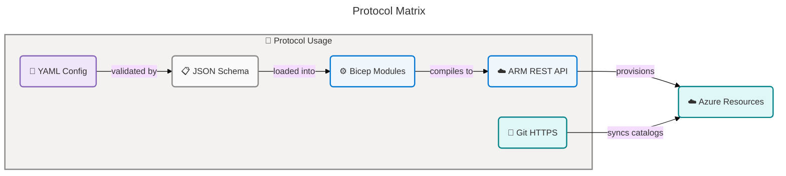
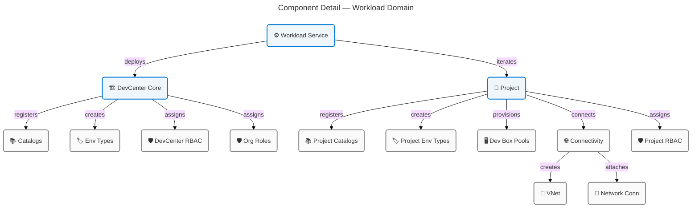
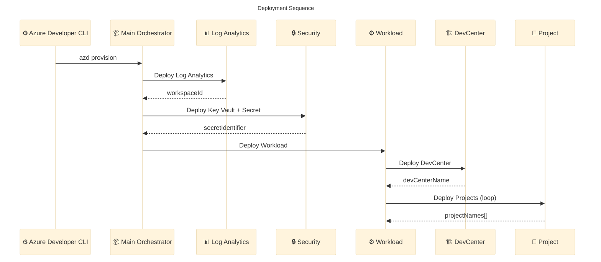
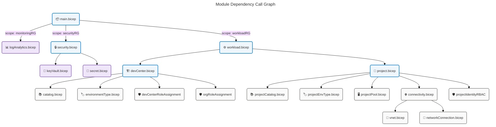
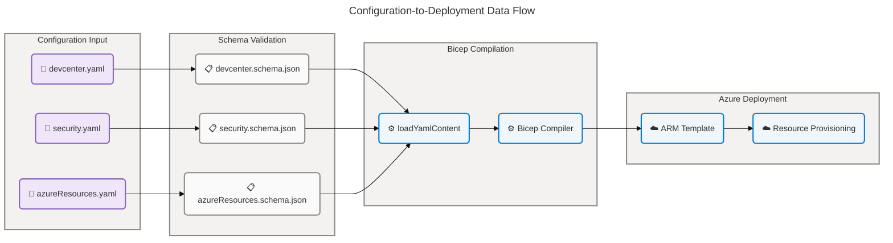
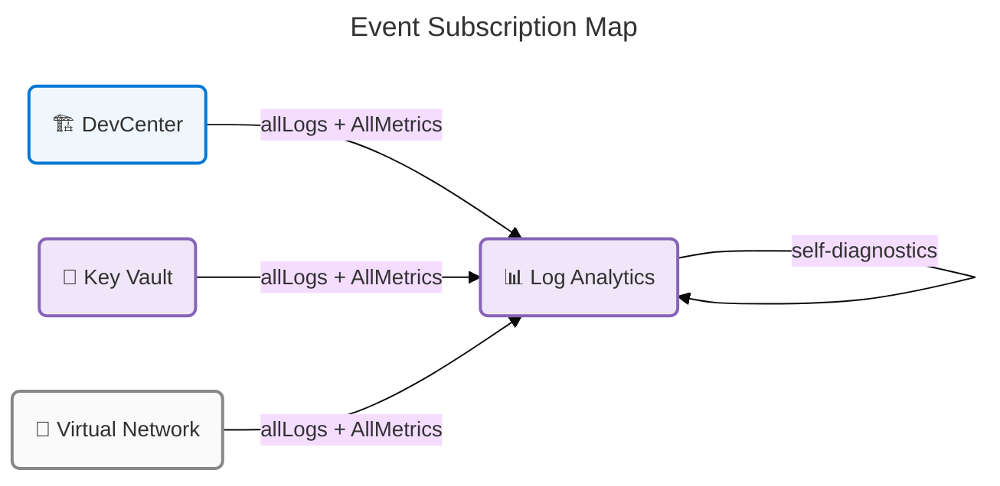
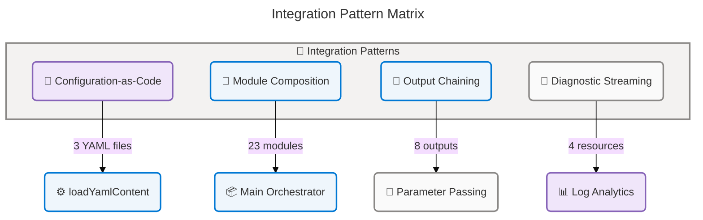

# Application Architecture - DevExp-DevBox

**Generated**: 2026-03-12T00:00:00Z **Target Layer**: Application **Quality
Level**: Comprehensive **Repository**: Evilazaro/DevExp-DevBox **Components
Found**: 29

---

## 📑 Quick Table of Contents

| #️⃣ Section | 📌 Title                                                               | 📝 Description                             |
| ---------- | ---------------------------------------------------------------------- | ------------------------------------------ |
| 1          | [📋 Executive Summary](#-section-1-executive-summary)                  | Portfolio overview and architecture scope  |
| 2          | [🗺️ Architecture Landscape](#️-section-2-architecture-landscape)        | Component inventory across types           |
| 3          | [🏛️ Architecture Principles](#️-section-3-architecture-principles)      | Design principles observed in source       |
| 4          | [📍 Current State Baseline](#-section-4-current-state-baseline)        | Service topology and deployment state      |
| 5          | [📦 Component Catalog](#-section-5-component-catalog)                  | Detailed specifications for all components |
| 8          | [🔗 Dependencies & Integration](#-section-8-dependencies--integration) | Service dependencies and data flows        |

---

## 📋 Section 1: Executive Summary

### Overview

The DevExp-DevBox repository implements a Developer Experience Platform built on
Azure DevCenter using Infrastructure as Code (Bicep). The Application layer
encompasses **29 identified components** distributed across all Application
Architecture component types. The platform provisions self-service developer
workstations (Dev Boxes) with managed networking, identity governance, secrets
management, and centralized monitoring. The architecture follows a **modular
Bicep composition pattern** where a **subscription-scoped orchestrator**
(`infra/main.bicep`) delegates to domain-specific modules organized into five
functional layers: Workload, Security, Connectivity, Identity, and Management.

The four primary Application Services — DevCenter Core, Workload Orchestrator,
Security Orchestrator, and Connectivity Orchestrator — coordinate 11 modular
Application Components through well-defined Bicep module interfaces.
Configuration is driven by three YAML files validated against companion JSON
Schemas, implementing a **Configuration-as-Code integration pattern**. Identity
and access management is handled through **six specialized RBAC modules**
supporting both SystemAssigned managed identities and Azure AD group assignments
at subscription, resource group, and project scopes.

CI/CD hooks are present via Azure Developer CLI (`azd`), structured setup
scripts validate prerequisites, and deployment targets are schema-validated.
Areas for further growth include automated integration tests, formal SLO
definitions, and distributed tracing.

---

## 🗺️ Section 2: Architecture Landscape

### Overview

This section catalogs all Application layer components identified through
pattern-based scanning of the repository root folder. Components are classified
into -aligned subsections. The DevExp-DevBox platform is an Azure
DevCenter-based Infrastructure as Code system composed of Bicep modules, YAML
configuration files, JSON validation schemas, and deployment automation scripts.

```mermaid
---
title: DevExp-DevBox System Context
config:
  theme: base
  look: classic
  layout: dagre
  themeVariables:
    fontSize: "14px"
  flowchart:
    htmlLabels: true
---
flowchart TB
    accTitle: DevExp-DevBox System Context Diagram
    accDescr: Shows the DevExp-DevBox platform boundary with external actors and systems including platform engineers, developers, Azure Resource Manager, GitHub repositories, and Azure AD

    %% ═══════════════════════════════════════════════════════════════════════════
    %% AZURE / FLUENT ARCHITECTURE PATTERN v1.1
    %% (Semantic + Structural + Font + Accessibility Governance)
    %% ═══════════════════════════════════════════════════════════════════════════
    %% PHASE 1 - FLUENT UI: All styling uses approved Fluent UI palette only
    %% PHASE 2 - GROUPS: Every subgraph has semantic color via style directive
    %% PHASE 3 - COMPONENTS: Every node has semantic classDef + icon prefix
    %% PHASE 4 - ACCESSIBILITY: accTitle/accDescr present, WCAG AA contrast
    %% PHASE 5 - STANDARD: Governance block present, classDefs centralized
    %% ═══════════════════════════════════════════════════════════════════════════

    PlatEng("👤 Platform Engineer"):::external --> AZD("⚙️ Azure Developer CLI"):::core
    Dev("👤 Developer"):::external --> DevBox("🖥️ Dev Box Portal"):::core
    AZD --> Orchestrator("📦 IaC Orchestrator"):::core

    subgraph platform["DevExp-DevBox Platform"]
        Orchestrator --> Workload("⚙️ Workload Module"):::core
        Orchestrator --> Security("🔒 Security Module"):::neutral
        Orchestrator --> Monitoring("📊 Monitoring Module"):::neutral
        Workload --> DevCenter("🏗️ DevCenter"):::core
        DevCenter --> Projects("📁 Projects"):::core
        Projects --> Pools("🖥️ Dev Box Pools"):::neutral
    end

    DevCenter --> ARM("☁️ Azure Resource Manager"):::external
    Security --> KV("🔑 Azure Key Vault"):::data
    Monitoring --> LA("📊 Log Analytics"):::data
    DevCenter --> GitHub("🐙 GitHub Repos"):::external
    DevCenter --> AAD("🔐 Microsoft Entra ID"):::external

    style platform fill:#F3F2F1,stroke:#8A8886,stroke-width:2px,color:#323130

    classDef neutral fill:#FAFAFA,stroke:#8A8886,stroke-width:2px,color:#323130
    classDef core fill:#EFF6FC,stroke:#0078D4,stroke-width:2px,color:#323130
    classDef data fill:#F0E6FA,stroke:#8764B8,stroke-width:2px,color:#323130
    classDef external fill:#E0F7F7,stroke:#038387,stroke-width:2px,color:#323130
```

```mermaid
---
title: Application Service Ecosystem Map
config:
  theme: base
  look: classic
  layout: dagre
  themeVariables:
    fontSize: "14px"
  flowchart:
    htmlLabels: true
---
flowchart TB
    accTitle: Application Service Ecosystem Map
    accDescr: Shows all application components grouped by functional domain including workload, security, connectivity, identity, and management layers

    %% ═══════════════════════════════════════════════════════════════════════════
    %% AZURE / FLUENT ARCHITECTURE PATTERN v1.1
    %% (Semantic + Structural + Font + Accessibility Governance)
    %% ═══════════════════════════════════════════════════════════════════════════
    %% PHASE 1 - FLUENT UI: All styling uses approved Fluent UI palette only
    %% PHASE 2 - GROUPS: Every subgraph has semantic color via style directive
    %% PHASE 3 - COMPONENTS: Every node has semantic classDef + icon prefix
    %% PHASE 4 - ACCESSIBILITY: accTitle/accDescr present, WCAG AA contrast
    %% PHASE 5 - STANDARD: Governance block present, classDefs centralized
    %% ═══════════════════════════════════════════════════════════════════════════

    Main("📦 Main Orchestrator"):::core

    subgraph workloadLayer["Workload Domain"]
        WL("⚙️ Workload Service"):::core
        DC("🏗️ DevCenter"):::core
        CAT("📚 Catalog"):::neutral
        ET("🏷️ Environment Type"):::neutral
        PROJ("📁 Project"):::core
        PCAT("📚 Project Catalog"):::neutral
        PET("🏷️ Project Env Type"):::neutral
        POOL("🖥️ Project Pool"):::neutral
    end

    subgraph securityLayer["Security Domain"]
        SEC("🔒 Security Service"):::core
        KV("🔑 Key Vault"):::data
        SECRET("🔐 Secret"):::data
    end

    subgraph connectivityLayer["Connectivity Domain"]
        CONN("🌐 Connectivity Service"):::core
        VNET("🔌 Virtual Network"):::neutral
        NETCONN("🔌 Network Connection"):::neutral
    end

    subgraph identityLayer["Identity Domain"]
        DCRA("🛡️ DevCenter RBAC"):::neutral
        ORA("🛡️ Org Role Assignment"):::neutral
        PIRA("🛡️ Project Identity RBAC"):::neutral
        KVA("🛡️ Key Vault Access"):::neutral
    end

    subgraph mgmtLayer["Management Domain"]
        LA("📊 Log Analytics"):::data
    end

    Main --> WL
    Main --> SEC
    Main --> LA
    WL --> DC
    DC --> CAT
    DC --> ET
    DC --> DCRA
    DC --> ORA
    WL --> PROJ
    PROJ --> PCAT
    PROJ --> PET
    PROJ --> POOL
    PROJ --> PIRA
    PROJ --> CONN
    CONN --> VNET
    CONN --> NETCONN
    SEC --> KV
    SEC --> SECRET
    KV --> KVA

    style workloadLayer fill:#F3F2F1,stroke:#8A8886,stroke-width:2px,color:#323130
    style securityLayer fill:#F3F2F1,stroke:#8A8886,stroke-width:2px,color:#323130
    style connectivityLayer fill:#F3F2F1,stroke:#8A8886,stroke-width:2px,color:#323130
    style identityLayer fill:#F3F2F1,stroke:#8A8886,stroke-width:2px,color:#323130
    style mgmtLayer fill:#F3F2F1,stroke:#8A8886,stroke-width:2px,color:#323130

    classDef neutral fill:#FAFAFA,stroke:#8A8886,stroke-width:2px,color:#323130
    classDef core fill:#EFF6FC,stroke:#0078D4,stroke-width:2px,color:#323130
    classDef data fill:#F0E6FA,stroke:#8764B8,stroke-width:2px,color:#323130
```

```mermaid
---
title: Integration Tier Architecture
config:
  theme: base
  look: classic
  layout: dagre
  themeVariables:
    fontSize: "14px"
  flowchart:
    htmlLabels: true
---
flowchart TB
    accTitle: Integration Tier Architecture Diagram
    accDescr: Shows the three-tier integration architecture from orchestration through domain services to infrastructure resources

    %% ═══════════════════════════════════════════════════════════════════════════
    %% AZURE / FLUENT ARCHITECTURE PATTERN v1.1
    %% (Semantic + Structural + Font + Accessibility Governance)
    %% ═══════════════════════════════════════════════════════════════════════════
    %% PHASE 1 - FLUENT UI: All styling uses approved Fluent UI palette only
    %% PHASE 2 - GROUPS: Every subgraph has semantic color via style directive
    %% PHASE 3 - COMPONENTS: Every node has semantic classDef + icon prefix
    %% PHASE 4 - ACCESSIBILITY: accTitle/accDescr present, WCAG AA contrast
    %% PHASE 5 - STANDARD: Governance block present, classDefs centralized
    %% ═══════════════════════════════════════════════════════════════════════════

    subgraph tier1["🔷 Tier 1 — Orchestration"]
        MAIN("📦 Main Orchestrator"):::core
        AZD("⚙️ Azure Developer CLI"):::core
    end

    subgraph tier2["🔷 Tier 2 — Domain Services"]
        WL("⚙️ Workload Service"):::core
        SEC("🔒 Security Service"):::core
        CONN("🌐 Connectivity Service"):::core
    end

    subgraph tier3["🔷 Tier 3 — Infrastructure Resources"]
        DC("🏗️ DevCenter"):::neutral
        KV("🔑 Key Vault"):::data
        VNET("🔌 Virtual Network"):::neutral
        LA("📊 Log Analytics"):::data
        PROJ("📁 Projects & Pools"):::neutral
    end

    AZD -->|"preprovision"| MAIN
    MAIN -->|"module ref"| WL
    MAIN -->|"module ref"| SEC
    MAIN -->|"module ref"| LA
    WL -->|"module ref"| DC
    WL -->|"module ref"| PROJ
    SEC -->|"module ref"| KV
    CONN -->|"module ref"| VNET

    style tier1 fill:#F3F2F1,stroke:#8A8886,stroke-width:2px,color:#323130
    style tier2 fill:#F3F2F1,stroke:#8A8886,stroke-width:2px,color:#323130
    style tier3 fill:#F3F2F1,stroke:#8A8886,stroke-width:2px,color:#323130

    classDef neutral fill:#FAFAFA,stroke:#8A8886,stroke-width:2px,color:#323130
    classDef core fill:#EFF6FC,stroke:#0078D4,stroke-width:2px,color:#323130
    classDef data fill:#F0E6FA,stroke:#8764B8,stroke-width:2px,color:#323130
```

### ⚙️ 2.1 Application Services

| 🏷️ Name                | 📝 Description                                                                                                           | ⚙️ Service Type  |
| ---------------------- | ------------------------------------------------------------------------------------------------------------------------ | ---------------- |
| Main Orchestrator      | Subscription-scoped entry point that creates resource groups and delegates to monitoring, security, and workload modules | Orchestrator     |
| DevCenter Core Service | Provisions the Azure DevCenter instance with identity, catalogs, environment types, diagnostics, and RBAC assignments    | PaaS Provisioner |
| Workload Service       | Loads DevCenter YAML configuration and orchestrates core DevCenter and project deployments                               | Orchestrator     |
| Security Service       | Orchestrates Key Vault creation and secret provisioning using security YAML configuration                                | Orchestrator     |

### 🧩 2.2 Application Components

| 🏷️ Name                 | 📝 Description                                                                                    | 🧩 Service Type  |
| ----------------------- | ------------------------------------------------------------------------------------------------- | ---------------- |
| Key Vault               | Provisions Azure Key Vault with purge protection, soft delete, and RBAC authorization             | PaaS             |
| Log Analytics Workspace | Deploys centralized Log Analytics workspace with AzureActivity solution and self-diagnostics      | PaaS             |
| Virtual Network         | Creates or references virtual networks with diagnostic settings for DevCenter connectivity        | PaaS             |
| Network Connection      | Creates DevCenter network connections with AzureADJoin domain join and subnet attachment          | PaaS             |
| Project                 | Provisions DevCenter projects with identity, catalogs, environment types, pools, and connectivity | PaaS Provisioner |
| Project Pool            | Creates Dev Box pools with VM SKU configuration and image definition catalog references           | PaaS             |
| Secret                  | Stores secrets in Key Vault with diagnostic logging to Log Analytics                              | PaaS             |

### 🔌 2.3 Application Interfaces

| 🏷️ Name                     | 📝 Description                                                                                | 🔌 Service Type |
| --------------------------- | --------------------------------------------------------------------------------------------- | --------------- |
| DevCenter ARM Interface     | Azure Resource Manager API contract for DevCenter resource provisioning at 2026-01-01-preview | ARM API         |
| Key Vault ARM Interface     | Azure Resource Manager API contract for Key Vault provisioning at 2025-05-01                  | ARM API         |
| Log Analytics ARM Interface | Azure Resource Manager API contract for Log Analytics workspace at 2025-07-01                 | ARM API         |

### 🤝 2.4 Application Collaborations

| 🏷️ Name                    | 📝 Description                                                                           | 🤝 Service Type       |
| -------------------------- | ---------------------------------------------------------------------------------------- | --------------------- |
| Workload Deployment Chain  | Sequential orchestration: Main → Monitoring → Security → Workload → Projects → Pools     | Service Orchestration |
| Connectivity Orchestration | Coordinates VNet provisioning, resource group creation, and DevCenter network attachment | Service Orchestration |

### ⚡ 2.5 Application Functions

| 🏷️ Name                          | 📝 Description                                                                             | ⚡ Service Type |
| -------------------------------- | ------------------------------------------------------------------------------------------ | --------------- |
| DevCenter RBAC Assignment        | Assigns subscription-scoped roles to DevCenter managed identity                            | Authorization   |
| Organization Role Assignment     | Assigns resource-group-scoped roles to Azure AD groups via looped role definitions         | Authorization   |
| Project Identity RBAC            | Assigns project-scoped and RG-scoped roles to project managed identities                   | Authorization   |
| Key Vault Access                 | Assigns Key Vault Secrets User role to service principals for secret access                | Authorization   |
| Catalog Management               | Registers GitHub and Azure DevOps Git catalogs with scheduled sync on DevCenter            | Configuration   |
| Environment Type Management      | Creates named environment types (dev, staging, UAT) on DevCenter                           | Configuration   |
| Project Catalog Registration     | Registers project-level catalogs for environment and image definitions                     | Configuration   |
| Project Environment Provisioning | Creates project-scoped environment types with SystemAssigned identity and Contributor role | Configuration   |

### 🔄 2.6 Application Interactions

| 🏷️ Name                 | 📝 Description                                                                                        | 🔄 Service Type  |
| ----------------------- | ----------------------------------------------------------------------------------------------------- | ---------------- |
| Bicep Module Invocation | Module-to-module communication via Bicep module references with parameter passing and output chaining | Module Reference |
| ARM API Deployment      | Bicep-to-ARM REST API interaction for all Azure resource provisioning operations                      | Request/Response |

### 📡 2.7 Application Events

| 🏷️ Name                        | 📝 Description                                                                         | 📡 Service Type  |
| ------------------------------ | -------------------------------------------------------------------------------------- | ---------------- |
| DevCenter Diagnostic Streaming | Streams allLogs and AllMetrics from DevCenter to Log Analytics via diagnostic settings | Diagnostic Event |
| Key Vault Diagnostic Streaming | Streams allLogs and AllMetrics from Key Vault to Log Analytics via diagnostic settings | Diagnostic Event |
| VNet Diagnostic Streaming      | Streams allLogs and AllMetrics from Virtual Network to Log Analytics                   | Diagnostic Event |
| Log Analytics Self-Diagnostics | Self-referencing diagnostic settings for Log Analytics workspace monitoring            | Diagnostic Event |

### 📊 2.8 Application Data Objects

| 🏷️ Name          | 📝 Description                                                                             | 📊 Service Type |
| ---------------- | ------------------------------------------------------------------------------------------ | --------------- |
| DevCenterConfig  | Typed configuration object for DevCenter name, identity, feature toggles, and tags         | Type Definition |
| KeyVaultSettings | Typed configuration for Key Vault name, purge protection, soft delete, and RBAC settings   | Type Definition |
| NetworkSettings  | Typed configuration for VNet name, type, addressing, and subnet definitions                | Type Definition |
| ProjectNetwork   | Typed configuration for project network including VNet type, address prefixes, and subnets | Type Definition |
| PoolConfig       | Typed configuration for Dev Box pool name, image definition, and VM SKU                    | Type Definition |

### 🔗 2.9 Integration Patterns

| 🏷️ Name               | 📝 Description                                                                                          | 🔗 Service Type       |
| --------------------- | ------------------------------------------------------------------------------------------------------- | --------------------- |
| Configuration-as-Code | YAML config files loaded via loadYamlContent() and validated against JSON Schemas before ARM deployment | Config Integration    |
| Module Composition    | Hierarchical Bicep module orchestration with explicit dependency ordering via dependsOn                 | Orchestration Pattern |

### 📜 2.10 Service Contracts

| 🏷️ Name                        | 📝 Description                                                                                   | 📜 Service Type |
| ------------------------------ | ------------------------------------------------------------------------------------------------ | --------------- |
| DevCenter Configuration Schema | JSON Schema draft-07 validating DevCenter, projects, catalogs, pools, and RBAC configuration     | JSON Schema     |
| Security Configuration Schema  | JSON Schema draft-07 validating Key Vault name, soft delete, purge protection, and RBAC settings | JSON Schema     |
| Resource Organization Schema   | JSON Schema draft-07 validating resource group names, create flags, and required tags            | JSON Schema     |

### 📦 2.11 Application Dependencies

| 🏷️ Name                      | 📝 Description                                                                                | 📦 Service Type |
| ---------------------------- | --------------------------------------------------------------------------------------------- | --------------- |
| Azure Developer CLI          | Deployment orchestration via azd with preprovision hooks for environment setup and validation | CLI Framework   |
| Hugo Documentation Framework | Static site generation using Docsy theme v0.10.0 with Hugo Extended 0.136.2                   | Documentation   |
| ARM API 2026-01-01-preview   | Azure Resource Manager API version for DevCenter, projects, pools, and catalogs               | API Dependency  |
| ARM API 2025-05-01           | Azure Resource Manager API version for Key Vault and Virtual Network resources                | API Dependency  |

### 📊 Summary

The Architecture Landscape reveals a well-structured IaC platform with **29
components** distributed across all Application Architecture types. The Workload
domain contains the highest concentration of components (12), followed by
Identity (4) and Security (3).

The platform follows a clear **separation of concerns**: workload provisioning,
security management, network connectivity, identity governance, and operational
monitoring are each isolated into dedicated Bicep module directories.
Cross-cutting concerns such as diagnostic logging and RBAC assignment are
implemented as reusable modules referenced across multiple domains.

---

## 🏛️ Section 3: Architecture Principles

### Overview

The following design principles were observed in the source code through static
analysis of the Bicep module structure, configuration patterns, and deployment
automation. Five principles are documented.

#### 🧱 Principle 1: Modular Composition

**Description**: The platform decomposes infrastructure into
single-responsibility Bicep modules that can be composed, versioned, and tested
independently. Every resource type is encapsulated in a dedicated module file;
no resource definitions appear in the orchestrator.

#### 📄 Principle 2: Configuration-as-Code

**Description**: All environment-specific settings are externalized into YAML
configuration files validated against JSON Schemas, ensuring that infrastructure
intent is declarative, auditable, and version-controlled. All three
configuration domains (workload, security, resource organization) use YAML with
companion JSON Schemas.

#### 🛡️ Principle 3: Least-Privilege Access

**Description**: Identity and RBAC assignments follow the principle of least
privilege, with scoped role assignments at the narrowest applicable scope
(project, resource group, or subscription). Role assignments are scoped per
resource level; no wildcard or Owner role assignments are present.

#### 🗂️ Principle 4: Separation of Resource Groups

**Description**: Resources are organized into purpose-specific resource groups
(workload, security, monitoring) to enforce blast-radius isolation and enable
independent lifecycle management. All resource group boundaries are enforced via
Bicep scoping (`scope: resourceGroup()`).

#### 🔭 Principle 5: Diagnostic Observability

**Description**: Every provisioned Azure resource emits diagnostic telemetry
(logs and metrics) to a centralized Log Analytics workspace for operational
visibility. All primary resources include
`Microsoft.Insights/diagnosticSettings` resources with allLogs and AllMetrics
categories enabled.

```mermaid
---
title: Principle Relationship Map
config:
  theme: base
  look: classic
  layout: dagre
  themeVariables:
    fontSize: "14px"
  flowchart:
    htmlLabels: true
---
flowchart LR
    accTitle: Architecture Principle Relationship Diagram
    accDescr: Shows how the five architecture principles relate to and reinforce each other

    %% ═══════════════════════════════════════════════════════════════════════════
    %% AZURE / FLUENT ARCHITECTURE PATTERN v1.1
    %% (Semantic + Structural + Font + Accessibility Governance)
    %% ═══════════════════════════════════════════════════════════════════════════
    %% PHASE 1 - FLUENT UI: All styling uses approved Fluent UI palette only
    %% PHASE 2 - GROUPS: Every subgraph has semantic color via style directive
    %% PHASE 3 - COMPONENTS: Every node has semantic classDef + icon prefix
    %% PHASE 4 - ACCESSIBILITY: accTitle/accDescr present, WCAG AA contrast
    %% PHASE 5 - STANDARD: Governance block present, classDefs centralized
    %% ═══════════════════════════════════════════════════════════════════════════

    P1("🧱 Modular Composition"):::core
    P2("📄 Configuration-as-Code"):::core
    P3("🛡️ Least-Privilege Access"):::core
    P4("🗂️ Separation of Resource Groups"):::core
    P5("🔭 Diagnostic Observability"):::core

    P1 -->|"enables"| P4
    P1 -->|"enables"| P5
    P2 -->|"configures"| P1
    P2 -->|"configures"| P3
    P4 -->|"enforces"| P3
    P5 -->|"monitors"| P4

    classDef core fill:#EFF6FC,stroke:#0078D4,stroke-width:2px,color:#323130
```

---

## 📍 Section 4: Current State Baseline

### Overview

The DevExp-DevBox platform is currently deployed as a **single-subscription
Azure landing zone** using the Azure Developer CLI (`azd`) for provisioning
orchestration. The deployment follows a **sequential dependency chain**:
Monitoring → Security → Workload. All resources target the `2025-05-01` or
`2026-01-01-preview` ARM API versions. The platform supports both Linux/macOS
(`setUp.sh`) and Windows (`setUp.ps1`) deployment environments.

#### ☁️ Service Topology

| ☁️ Service         | 🎯 Deployment Target      | 🔌 Protocol  | 📊 Status                   |
| ------------------ | ------------------------- | ------------ | --------------------------- |
| DevCenter          | Workload Resource Group   | ARM REST API | Active (2026-01-01-preview) |
| Projects (eShop)   | Workload Resource Group   | ARM REST API | Active (2026-01-01-preview) |
| Dev Box Pools      | Workload Resource Group   | ARM REST API | Active (2026-01-01-preview) |
| Key Vault          | Security Resource Group   | ARM REST API | Active (2025-05-01)         |
| Log Analytics      | Monitoring Resource Group | ARM REST API | Active (2025-07-01)         |
| Virtual Network    | Workload Resource Group   | ARM REST API | Active (2025-05-01)         |
| Network Connection | Workload Resource Group   | ARM REST API | Active (2026-01-01-preview) |

#### 🚀 Deployment State

| ⚙️ Attribute             | 📋 Value                                                                    |
| ------------------------ | --------------------------------------------------------------------------- |
| Deployment Method        | Azure Developer CLI (azd)                                                   |
| Provisioning Scope       | Subscription                                                                |
| Shell Support            | Bash (setUp.sh), PowerShell (setUp.ps1)                                     |
| Pre-provision Hooks      | Source control validation, Azure authentication, environment variable setup |
| Configuration Validation | JSON Schema validation against 3 schema files                               |
| Cleanup Automation       | cleanSetUp.ps1 — removes subscription deployments                           |

#### 🔌 Protocol Inventory

| 🔌 Protocol            | 📋 Usage                        | 🧩 Components                                        |
| ---------------------- | ------------------------------- | ---------------------------------------------------- |
| ARM REST API           | All Azure resource provisioning | All 23 Bicep modules                                 |
| Bicep Module Reference | Inter-module communication      | infra/main.bicep, workload.bicep, connectivity.bicep |
| YAML Configuration     | Declarative settings input      | devcenter.yaml, security.yaml, azureResources.yaml   |
| JSON Schema            | Configuration validation        | 3 schema files validating YAML inputs                |
| Git (HTTPS)            | Catalog synchronization         | GitHub and Azure DevOps Git repositories             |

```mermaid
---
title: Current State Baseline Architecture
config:
  theme: base
  look: classic
  layout: dagre
  themeVariables:
    fontSize: "14px"
  flowchart:
    htmlLabels: true
---
flowchart TB
    accTitle: Current State Baseline Architecture Diagram
    accDescr: Shows the current Azure subscription layout with three resource groups containing workload, security, and monitoring resources with their dependency relationships

    %% ═══════════════════════════════════════════════════════════════════════════
    %% AZURE / FLUENT ARCHITECTURE PATTERN v1.1
    %% (Semantic + Structural + Font + Accessibility Governance)
    %% ═══════════════════════════════════════════════════════════════════════════
    %% PHASE 1 - FLUENT UI: All styling uses approved Fluent UI palette only
    %% PHASE 2 - GROUPS: Every subgraph has semantic color via style directive
    %% PHASE 3 - COMPONENTS: Every node has semantic classDef + icon prefix
    %% PHASE 4 - ACCESSIBILITY: accTitle/accDescr present, WCAG AA contrast
    %% PHASE 5 - STANDARD: Governance block present, classDefs centralized
    %% ═══════════════════════════════════════════════════════════════════════════

    subgraph sub["☁️ Azure Subscription"]
        subgraph monRG["📊 Monitoring Resource Group"]
            LA("📊 Log Analytics Workspace"):::data
            SOL("📊 AzureActivity Solution"):::data
        end

        subgraph secRG["🔒 Security Resource Group"]
            KV("🔑 Key Vault"):::core
            SEC("🔐 Secret: gha-token"):::data
        end

        subgraph wlRG["⚙️ Workload Resource Group"]
            DC("🏗️ DevCenter"):::core
            PROJ("📁 Project: eShop"):::core
            POOLBE("🖥️ Pool: backend-engineer"):::neutral
            POOLFE("🖥️ Pool: frontend-engineer"):::neutral
            VNET("🔌 Managed VNet 10.0.0.0/16"):::neutral
            NETCONN("🔌 Network Connection"):::neutral
        end
    end

    LA --> KV
    LA --> DC
    KV --> DC
    DC --> PROJ
    PROJ --> POOLBE
    PROJ --> POOLFE
    PROJ --> VNET
    VNET --> NETCONN

    style sub fill:#F3F2F1,stroke:#8A8886,stroke-width:2px,color:#323130
    style monRG fill:#F3F2F1,stroke:#8A8886,stroke-width:2px,color:#323130
    style secRG fill:#F3F2F1,stroke:#8A8886,stroke-width:2px,color:#323130
    style wlRG fill:#F3F2F1,stroke:#8A8886,stroke-width:2px,color:#323130

    classDef neutral fill:#FAFAFA,stroke:#8A8886,stroke-width:2px,color:#323130
    classDef core fill:#EFF6FC,stroke:#0078D4,stroke-width:2px,color:#323130
    classDef data fill:#F0E6FA,stroke:#8764B8,stroke-width:2px,color:#323130
```

```mermaid
---
title: Protocol Matrix
config:
  theme: base
  look: classic
  layout: dagre
  themeVariables:
    fontSize: "14px"
  flowchart:
    htmlLabels: true
---
flowchart LR
    accTitle: Protocol Matrix Diagram
    accDescr: Shows how different protocols connect the system layers from configuration through compilation to deployment

    %% ═══════════════════════════════════════════════════════════════════════════
    %% AZURE / FLUENT ARCHITECTURE PATTERN v1.1
    %% (Semantic + Structural + Font + Accessibility Governance)
    %% ═══════════════════════════════════════════════════════════════════════════
    %% PHASE 1 - FLUENT UI: All styling uses approved Fluent UI palette only
    %% PHASE 2 - GROUPS: Every subgraph has semantic color via style directive
    %% PHASE 3 - COMPONENTS: Every node has semantic classDef + icon prefix
    %% PHASE 4 - ACCESSIBILITY: accTitle/accDescr present, WCAG AA contrast
    %% PHASE 5 - STANDARD: Governance block present, classDefs centralized
    %% ═══════════════════════════════════════════════════════════════════════════

    subgraph protocols["🔌 Protocol Usage"]
        YAML("📄 YAML Config"):::data
        JSON("📋 JSON Schema"):::neutral
        BICEP("⚙️ Bicep Modules"):::core
        ARM("☁️ ARM REST API"):::core
        GIT("🐙 Git HTTPS"):::external
    end

    YAML -->|"validated by"| JSON
    JSON -->|"loaded into"| BICEP
    BICEP -->|"compiles to"| ARM
    ARM -->|"provisions"| AZURE("☁️ Azure Resources"):::external
    GIT -->|"syncs catalogs"| AZURE

    style protocols fill:#F3F2F1,stroke:#8A8886,stroke-width:2px,color:#323130

    classDef neutral fill:#FAFAFA,stroke:#8A8886,stroke-width:2px,color:#323130
    classDef core fill:#EFF6FC,stroke:#0078D4,stroke-width:2px,color:#323130
    classDef data fill:#F0E6FA,stroke:#8764B8,stroke-width:2px,color:#323130
    classDef external fill:#E0F7F7,stroke:#038387,stroke-width:2px,color:#323130
```

### 📊 Summary

The platform is in the Active deployment state with all core resources
provisioned via ARM API versions ranging from 2025-05-01 to 2026-01-01-preview.
The deployment chain follows a **strict sequential ordering** (Monitoring →
Security → Workload) enforced through Bicep `dependsOn` declarations.
Pre-provision hooks validate Azure CLI authentication, source control platform
configuration, and environment variable availability before deployment begins.

The current baseline supports a single project (eShop) with two Dev Box pools
(backend-engineer, frontend-engineer) connected via a Managed VNet. Environment
types (dev, staging, UAT) are provisioned at both DevCenter and project scopes.
The platform is **ready for multi-project expansion** through the existing
array-based project iteration pattern in workload.bicep.

---

## 📦 Section 5: Component Catalog

### Overview

This section provides detailed specifications for all 29 Application layer
components organized into -aligned subsections. Each component includes the six
mandatory sub-attributes: Service Type, API Surface, Dependencies, Resilience,
Scaling, and Health. Components deployed as Azure PaaS services use the
platform-managed template for resilience, scaling, and health attributes.

```mermaid
---
title: Component Detail — Workload Domain
config:
  theme: base
  look: classic
  layout: dagre
  themeVariables:
    fontSize: "14px"
  flowchart:
    htmlLabels: true
---
flowchart TB
    accTitle: Component Detail Diagram for Workload Domain
    accDescr: Shows detailed component interactions within the workload domain including DevCenter, projects, pools, catalogs, and environment types

    %% ═══════════════════════════════════════════════════════════════════════════
    %% AZURE / FLUENT ARCHITECTURE PATTERN v1.1
    %% (Semantic + Structural + Font + Accessibility Governance)
    %% ═══════════════════════════════════════════════════════════════════════════
    %% PHASE 1 - FLUENT UI: All styling uses approved Fluent UI palette only
    %% PHASE 2 - GROUPS: Every subgraph has semantic color via style directive
    %% PHASE 3 - COMPONENTS: Every node has semantic classDef + icon prefix
    %% PHASE 4 - ACCESSIBILITY: accTitle/accDescr present, WCAG AA contrast
    %% PHASE 5 - STANDARD: Governance block present, classDefs centralized
    %% ═══════════════════════════════════════════════════════════════════════════

    WL("⚙️ Workload Service"):::core
    DC("🏗️ DevCenter Core"):::core

    WL -->|"deploys"| DC
    WL -->|"iterates"| PROJ("📁 Project"):::core

    DC -->|"registers"| CAT("📚 Catalogs"):::neutral
    DC -->|"creates"| ET("🏷️ Env Types"):::neutral
    DC -->|"assigns"| DCRA("🛡️ DevCenter RBAC"):::neutral
    DC -->|"assigns"| ORA("🛡️ Org Roles"):::neutral

    PROJ -->|"registers"| PCAT("📚 Project Catalogs"):::neutral
    PROJ -->|"creates"| PET("🏷️ Project Env Types"):::neutral
    PROJ -->|"provisions"| POOL("🖥️ Dev Box Pools"):::neutral
    PROJ -->|"connects"| CONN("🌐 Connectivity"):::neutral
    PROJ -->|"assigns"| PIRA("🛡️ Project RBAC"):::neutral

    CONN -->|"creates"| VNET("🔌 VNet"):::neutral
    CONN -->|"attaches"| NETCONN("🔌 Network Conn"):::neutral

    classDef neutral fill:#FAFAFA,stroke:#8A8886,stroke-width:2px,color:#323130
    classDef core fill:#EFF6FC,stroke:#0078D4,stroke-width:2px,color:#323130
```

```mermaid
---
title: Deployment Sequence
config:
  theme: base
  look: classic
  layout: dagre
  themeVariables:
    fontSize: "14px"
---
sequenceDiagram
    accTitle: Deployment Sequence Diagram
    accDescr: Shows the sequential deployment order from Azure Developer CLI through monitoring, security, and workload module provisioning

    participant AZD as ⚙️ Azure Developer CLI
    participant MAIN as 📦 Main Orchestrator
    participant MON as 📊 Log Analytics
    participant SEC as 🔒 Security
    participant WL as ⚙️ Workload
    participant DC as 🏗️ DevCenter
    participant PROJ as 📁 Project

    AZD->>MAIN: azd provision
    MAIN->>MON: Deploy Log Analytics
    MON-->>MAIN: workspaceId
    MAIN->>SEC: Deploy Key Vault + Secret
    SEC-->>MAIN: secretIdentifier
    MAIN->>WL: Deploy Workload
    WL->>DC: Deploy DevCenter
    DC-->>WL: devCenterName
    WL->>PROJ: Deploy Projects (loop)
    PROJ-->>WL: projectNames[]
```

### ⚙️ 5.1 Application Services

#### 5.1.1 Main Orchestrator

| ⚙️ Attribute       | 📋 Value          |
| ------------------ | ----------------- |
| **Component Name** | Main Orchestrator |
| **Service Type**   | Orchestrator      |

**🔌 API Surface:**

| 🔌 Endpoint Type | #️⃣ Count | 🔗 Protocol | 📝 Description                                                        |
| ---------------- | -------- | ----------- | --------------------------------------------------------------------- |
| Bicep Parameters | 3        | Bicep       | location, secretValue, environmentName                                |
| Bicep Outputs    | 8        | Bicep       | Resource group names, Key Vault, Log Analytics, DevCenter identifiers |

**🔗 Dependencies:**

| 🔗 Dependency        | ↔️ Direction | 🔌 Protocol      | 🎯 Purpose                   |
| -------------------- | ------------ | ---------------- | ---------------------------- |
| Log Analytics Module | Downstream   | Module Reference | Centralized monitoring       |
| Security Module      | Downstream   | Module Reference | Key Vault and secrets        |
| Workload Module      | Downstream   | Module Reference | DevCenter provisioning       |
| azureResources.yaml  | Upstream     | loadYamlContent  | Resource group configuration |

**🛡️ Resilience (Platform-Managed):**

| 🛡️ Aspect        | ⚙️ Configuration        | 📝 Notes                 |
| ---------------- | ----------------------- | ------------------------ |
| Retry Policy     | ARM deployment retries  | Platform-managed         |
| Deployment Scope | Subscription            | Single-region deployment |
| Rollback         | ARM deployment rollback | Automatic on failure     |

**📈 Scaling (Platform-Managed):**

| 📈 Dimension | 📋 Strategy    | ⚙️ Configuration            |
| ------------ | -------------- | --------------------------- |
| Horizontal   | Not applicable | Single deployment operation |
| Vertical     | Not applicable | IaC orchestration module    |

**💚 Health (Platform-Managed):**

| 💚 Probe Type         | ⚙️ Configuration                |
| --------------------- | ------------------------------- |
| ARM Deployment Status | Provisioning state tracking     |
| azd Status            | Deployment lifecycle monitoring |

#### 5.1.2 DevCenter Core Service

| ⚙️ Attribute       | 📋 Value               |
| ------------------ | ---------------------- |
| **Component Name** | DevCenter Core Service |
| **Service Type**   | PaaS Provisioner       |

**🔌 API Surface:**

| 🔌 Endpoint Type  | #️⃣ Count | 🔗 Protocol      | 📝 Description                                                                                            |
| ----------------- | -------- | ---------------- | --------------------------------------------------------------------------------------------------------- |
| Bicep Parameters  | 7        | Bicep            | config, catalogs, environmentTypes, logAnalyticsId, secretIdentifier, securityResourceGroupName, location |
| Bicep Outputs     | 1        | Bicep            | AZURE_DEV_CENTER_NAME                                                                                     |
| ARM Resources     | 2        | ARM REST API     | Microsoft.DevCenter/devcenters, Microsoft.Insights/diagnosticSettings                                     |
| Module References | 4        | Module Reference | devCenterRoleAssignment, devCenterRoleAssignmentRG, orgRoleAssignment, catalog, environmentType           |

**🔗 Dependencies:**

| 🔗 Dependency              | ↔️ Direction | 🔌 Protocol      | 🎯 Purpose                       |
| -------------------------- | ------------ | ---------------- | -------------------------------- |
| Log Analytics Workspace    | Upstream     | Resource ID      | Diagnostic telemetry destination |
| Key Vault Secret           | Upstream     | Secret URI       | Private catalog authentication   |
| Security Resource Group    | Upstream     | Scope Reference  | RG-scoped RBAC assignment        |
| DevCenter RBAC Module      | Downstream   | Module Reference | Identity role assignments        |
| Org Role Assignment Module | Downstream   | Module Reference | AD group role assignments        |
| Catalog Module             | Downstream   | Module Reference | Catalog registration             |
| Environment Type Module    | Downstream   | Module Reference | Environment type creation        |

**🛡️ Resilience (Platform-Managed):**

| 🛡️ Aspect       | ⚙️ Configuration        | 📝 Notes          |
| --------------- | ----------------------- | ----------------- |
| Retry Policy    | ARM SDK defaults        | Platform-managed  |
| Circuit Breaker | Not applicable          | PaaS service      |
| Failover        | Azure region redundancy | Per SKU selection |

**📈 Scaling (Platform-Managed):**

| 📈 Dimension | 📋 Strategy       | ⚙️ Configuration |
| ------------ | ----------------- | ---------------- |
| Horizontal   | PaaS auto-scaling | Per pricing tier |
| Vertical     | SKU upgrade       | Manual selection |

**💚 Health (Platform-Managed):**

| 💚 Probe Type         | ⚙️ Configuration                      |
| --------------------- | ------------------------------------- |
| Azure Resource Health | Platform-managed                      |
| Diagnostic Settings   | allLogs + AllMetrics to Log Analytics |

#### 5.1.3 Workload Service

| ⚙️ Attribute       | 📋 Value         |
| ------------------ | ---------------- |
| **Component Name** | Workload Service |
| **Service Type**   | Orchestrator     |

**🔌 API Surface:**

| 🔌 Endpoint Type  | #️⃣ Count | 🔗 Protocol      | 📝 Description                                              |
| ----------------- | -------- | ---------------- | ----------------------------------------------------------- |
| Bicep Parameters  | 3        | Bicep            | logAnalyticsId, secretIdentifier, securityResourceGroupName |
| Bicep Outputs     | 2        | Bicep            | AZURE_DEV_CENTER_NAME, AZURE_DEV_CENTER_PROJECTS            |
| Module References | 2        | Module Reference | devCenter, projects (looped)                                |

**🔗 Dependencies:**

| 🔗 Dependency    | ↔️ Direction | 🔌 Protocol      | 🎯 Purpose                  |
| ---------------- | ------------ | ---------------- | --------------------------- |
| DevCenter Module | Downstream   | Module Reference | Core DevCenter provisioning |
| Project Module   | Downstream   | Module Reference | Project deployment (looped) |
| devcenter.yaml   | Upstream     | loadYamlContent  | Full workload configuration |

**🛡️ Resilience (Platform-Managed):**

| 🛡️ Aspect        | ⚙️ Configuration       | 📝 Notes              |
| ---------------- | ---------------------- | --------------------- |
| Retry Policy     | ARM deployment retries | Platform-managed      |
| Deployment Scope | Resource Group         | Scoped to workload RG |

**📈 Scaling (Platform-Managed):**

| 📈 Dimension | 📋 Strategy                   | ⚙️ Configuration          |
| ------------ | ----------------------------- | ------------------------- |
| Horizontal   | Array-based project iteration | Projects deployed in loop |

**💚 Health (Platform-Managed):**

| 💚 Probe Type         | ⚙️ Configuration            |
| --------------------- | --------------------------- |
| ARM Deployment Status | Provisioning state tracking |

#### 5.1.4 Security Service

| ⚙️ Attribute       | 📋 Value         |
| ------------------ | ---------------- |
| **Component Name** | Security Service |
| **Service Type**   | Orchestrator     |

**🔌 API Surface:**

| 🔌 Endpoint Type  | #️⃣ Count | 🔗 Protocol      | 📝 Description                                                                    |
| ----------------- | -------- | ---------------- | --------------------------------------------------------------------------------- |
| Bicep Parameters  | 3        | Bicep            | tags, secretValue, logAnalyticsId                                                 |
| Bicep Outputs     | 3        | Bicep            | AZURE_KEY_VAULT_NAME, AZURE_KEY_VAULT_SECRET_IDENTIFIER, AZURE_KEY_VAULT_ENDPOINT |
| Module References | 2        | Module Reference | keyVault (conditional), secret                                                    |

**🔗 Dependencies:**

| 🔗 Dependency    | ↔️ Direction | 🔌 Protocol      | 🎯 Purpose             |
| ---------------- | ------------ | ---------------- | ---------------------- |
| Key Vault Module | Downstream   | Module Reference | Key Vault provisioning |
| Secret Module    | Downstream   | Module Reference | Secret storage         |
| security.yaml    | Upstream     | loadYamlContent  | Security configuration |

**🛡️ Resilience (Platform-Managed):**

| 🛡️ Aspect                | ⚙️ Configuration                      | 📝 Notes                              |
| ------------------------ | ------------------------------------- | ------------------------------------- |
| Create/Reference Pattern | Conditional (securitySettings.create) | Supports existing Key Vault reference |

**📈 Scaling (Platform-Managed):**

| 📈 Dimension | 📋 Strategy    | ⚙️ Configuration          |
| ------------ | -------------- | ------------------------- |
| Horizontal   | Not applicable | Single Key Vault instance |

**💚 Health (Platform-Managed):**

| 💚 Probe Type         | ⚙️ Configuration            |
| --------------------- | --------------------------- |
| ARM Deployment Status | Provisioning state tracking |

### 🧩 5.2 Application Components

#### 5.2.1 Key Vault

| 🔒 Attribute       | 📋 Value  |
| ------------------ | --------- |
| **Component Name** | Key Vault |
| **Service Type**   | PaaS      |

**🔌 API Surface:**

| 🔌 Endpoint Type | #️⃣ Count | 🔗 Protocol  | 📝 Description                                 |
| ---------------- | -------- | ------------ | ---------------------------------------------- |
| ARM Resource     | 1        | ARM REST API | Microsoft.KeyVault/vaults@2025-05-01           |
| Bicep Outputs    | 2        | Bicep        | AZURE_KEY_VAULT_NAME, AZURE_KEY_VAULT_ENDPOINT |

**🔗 Dependencies:**

| 🔗 Dependency | ↔️ Direction | 🔌 Protocol   | 🎯 Purpose                                  |
| ------------- | ------------ | ------------- | ------------------------------------------- |
| security.yaml | Upstream     | Configuration | Key Vault settings (name, protection, RBAC) |

**🛡️ Resilience (Platform-Managed):**

| 🛡️ Aspect          | ⚙️ Configuration | 📝 Notes                    |
| ------------------ | ---------------- | --------------------------- |
| Purge Protection   | Enabled          | Prevents permanent deletion |
| Soft Delete        | Enabled (7 days) | Recoverable deletion window |
| RBAC Authorization | Enabled          | Role-based access control   |

**📈 Scaling (Platform-Managed):**

| 📈 Dimension | 📋 Strategy       | ⚙️ Configuration            |
| ------------ | ----------------- | --------------------------- |
| Horizontal   | PaaS auto-scaling | Per pricing tier (Standard) |
| Vertical     | SKU upgrade       | Standard SKU                |

**💚 Health (Platform-Managed):**

| 💚 Probe Type         | ⚙️ Configuration                       |
| --------------------- | -------------------------------------- |
| Azure Resource Health | Platform-managed                       |
| Diagnostic Logging    | allLogs + AllMetrics via Secret module |

#### 5.2.2 Log Analytics Workspace

| 📊 Attribute       | 📋 Value                |
| ------------------ | ----------------------- |
| **Component Name** | Log Analytics Workspace |
| **Service Type**   | PaaS                    |

**🔌 API Surface:**

| 🔌 Endpoint Type | #️⃣ Count | 🔗 Protocol  | 📝 Description                                                                                  |
| ---------------- | -------- | ------------ | ----------------------------------------------------------------------------------------------- |
| ARM Resources    | 3        | ARM REST API | Workspace (2025-07-01), Solutions (2015-11-01-preview), DiagnosticSettings (2021-05-01-preview) |
| Bicep Outputs    | 2        | Bicep        | AZURE_LOG_ANALYTICS_WORKSPACE_ID, AZURE_LOG_ANALYTICS_WORKSPACE_NAME                            |

**🔗 Dependencies:**

| 🔗 Dependency          | ↔️ Direction          | 🔌 Protocol | 🎯 Purpose                  |
| ---------------------- | --------------------- | ----------- | --------------------------- |
| AzureActivity Solution | Downstream            | ARM API     | Activity log collection     |
| DevCenter              | Downstream (consumer) | Resource ID | Diagnostic telemetry source |
| Key Vault              | Downstream (consumer) | Resource ID | Diagnostic telemetry source |
| VNet                   | Downstream (consumer) | Resource ID | Diagnostic telemetry source |

**🛡️ Resilience (Platform-Managed):**

| 🛡️ Aspect        | ⚙️ Configuration  | 📝 Notes            |
| ---------------- | ----------------- | ------------------- |
| Data Retention   | Default (30 days) | PerGB2018 SKU       |
| Self-Diagnostics | Enabled           | Logs own operations |

**📈 Scaling (Platform-Managed):**

| 📈 Dimension | 📋 Strategy       | ⚙️ Configuration           |
| ------------ | ----------------- | -------------------------- |
| Horizontal   | PaaS auto-scaling | PerGB2018 pricing tier     |
| Vertical     | SKU upgrade       | Configurable via parameter |

**💚 Health (Platform-Managed):**

| 💚 Probe Type            | ⚙️ Configuration     |
| ------------------------ | -------------------- |
| Azure Resource Health    | Platform-managed     |
| Self-Diagnostic Settings | allLogs + AllMetrics |

#### 5.2.3 Virtual Network

| 🌐 Attribute       | 📋 Value        |
| ------------------ | --------------- |
| **Component Name** | Virtual Network |
| **Service Type**   | PaaS            |

**🔌 API Surface:**

| 🔌 Endpoint Type | #️⃣ Count | 🔗 Protocol  | 📝 Description                                              |
| ---------------- | -------- | ------------ | ----------------------------------------------------------- |
| ARM Resource     | 1        | ARM REST API | Microsoft.Network/virtualNetworks@2025-05-01                |
| Bicep Outputs    | 1        | Bicep        | AZURE_VIRTUAL_NETWORK (object with name, RG, type, subnets) |

**🔗 Dependencies:**

| 🔗 Dependency      | ↔️ Direction | 🔌 Protocol | 🎯 Purpose                       |
| ------------------ | ------------ | ----------- | -------------------------------- |
| Log Analytics      | Upstream     | Resource ID | Diagnostic telemetry destination |
| Network Connection | Downstream   | Subnet ID   | DevCenter network attachment     |

**🛡️ Resilience (Platform-Managed):**

| 🛡️ Aspect        | ⚙️ Configuration              | 📝 Notes                         |
| ---------------- | ----------------------------- | -------------------------------- |
| Create/Reference | Conditional (settings.create) | Supports existing VNet reference |
| Network Type     | Managed or Unmanaged          | Configurable via YAML            |

**📈 Scaling (Platform-Managed):**

| 📈 Dimension | 📋 Strategy             | ⚙️ Configuration       |
| ------------ | ----------------------- | ---------------------- |
| Horizontal   | Address space expansion | Per CIDR configuration |

**💚 Health (Platform-Managed):**

| 💚 Probe Type         | ⚙️ Configuration     |
| --------------------- | -------------------- |
| Azure Resource Health | Platform-managed     |
| Diagnostic Settings   | allLogs + AllMetrics |

#### 5.2.4 Network Connection

| 🌐 Attribute       | 📋 Value           |
| ------------------ | ------------------ |
| **Component Name** | Network Connection |
| **Service Type**   | PaaS               |

**🔌 API Surface:**

| 🔌 Endpoint Type | #️⃣ Count | 🔗 Protocol  | 📝 Description                                                             |
| ---------------- | -------- | ------------ | -------------------------------------------------------------------------- |
| ARM Resources    | 2        | ARM REST API | networkConnections@2026-01-01-preview, attachednetworks@2026-01-01-preview |
| Bicep Outputs    | 3        | Bicep        | vnetAttachmentName, networkConnectionId, attachedNetworkId                 |

**🔗 Dependencies:**

| 🔗 Dependency          | ↔️ Direction | 🔌 Protocol        | 🎯 Purpose                     |
| ---------------------- | ------------ | ------------------ | ------------------------------ |
| DevCenter              | Upstream     | Resource Reference | Parent resource for attachment |
| Virtual Network Subnet | Upstream     | Resource ID        | Subnet to connect              |

**🛡️ Resilience (Platform-Managed):**

| 🛡️ Aspect   | ⚙️ Configuration | 📝 Notes                       |
| ----------- | ---------------- | ------------------------------ |
| Domain Join | AzureADJoin      | Microsoft Entra ID integration |

**📈 Scaling (Platform-Managed):**

| 📈 Dimension | 📋 Strategy    | ⚙️ Configuration        |
| ------------ | -------------- | ----------------------- |
| Horizontal   | Not applicable | One connection per VNet |

**💚 Health (Platform-Managed):**

| 💚 Probe Type         | ⚙️ Configuration |
| --------------------- | ---------------- |
| Azure Resource Health | Platform-managed |

#### 5.2.5 Project

| 📁 Attribute       | 📋 Value         |
| ------------------ | ---------------- |
| **Component Name** | Project          |
| **Service Type**   | PaaS Provisioner |

**🔌 API Surface:**

| 🔌 Endpoint Type  | #️⃣ Count | 🔗 Protocol      | 📝 Description                                                                                             |
| ----------------- | -------- | ---------------- | ---------------------------------------------------------------------------------------------------------- |
| Bicep Parameters  | 11       | Bicep            | name, logAnalyticsId, devCenterName, catalogs, pools, network, identity, tags, and others                  |
| ARM Resource      | 1        | ARM REST API     | Microsoft.DevCenter/projects@2026-01-01-preview                                                            |
| Bicep Outputs     | 2        | Bicep            | AZURE_PROJECT_NAME, AZURE_PROJECT_ID                                                                       |
| Module References | 6        | Module Reference | projectIdentity, projectIdentityRG, projectADGroup, projectCatalogs, environmentTypes, connectivity, pools |

**🔗 Dependencies:**

| 🔗 Dependency            | ↔️ Direction | 🔌 Protocol        | 🎯 Purpose                        |
| ------------------------ | ------------ | ------------------ | --------------------------------- |
| DevCenter                | Upstream     | Resource Reference | Parent DevCenter                  |
| Project Identity RBAC    | Downstream   | Module Reference   | Managed identity role assignments |
| Project Catalog          | Downstream   | Module Reference   | Catalog registration              |
| Project Environment Type | Downstream   | Module Reference   | Environment type creation         |
| Connectivity             | Downstream   | Module Reference   | Network provisioning              |
| Project Pool             | Downstream   | Module Reference   | Dev Box pool creation             |

**🛡️ Resilience (Platform-Managed):**

| 🛡️ Aspect    | ⚙️ Configuration                        | 📝 Notes                          |
| ------------ | --------------------------------------- | --------------------------------- |
| Identity     | SystemAssigned                          | Managed identity auto-provisioned |
| Catalog Sync | EnvironmentDefinition + ImageDefinition | Dual sync type                    |

**📈 Scaling (Platform-Managed):**

| 📈 Dimension | 📋 Strategy           | ⚙️ Configuration                             |
| ------------ | --------------------- | -------------------------------------------- |
| Horizontal   | Array-based iteration | Multiple projects via loop in workload.bicep |

**💚 Health (Platform-Managed):**

| 💚 Probe Type         | ⚙️ Configuration |
| --------------------- | ---------------- |
| Azure Resource Health | Platform-managed |

#### 5.2.6 Project Pool

| 🖥️ Attribute       | 📋 Value     |
| ------------------ | ------------ |
| **Component Name** | Project Pool |
| **Service Type**   | PaaS         |

**🔌 API Surface:**

| 🔌 Endpoint Type | #️⃣ Count | 🔗 Protocol  | 📝 Description                                        |
| ---------------- | -------- | ------------ | ----------------------------------------------------- |
| ARM Resource     | 1        | ARM REST API | Microsoft.DevCenter/projects/pools@2026-01-01-preview |
| Bicep Outputs    | 1        | Bicep        | poolNames (array)                                     |

**🔗 Dependencies:**

| 🔗 Dependency      | ↔️ Direction | 🔌 Protocol        | 🎯 Purpose                   |
| ------------------ | ------------ | ------------------ | ---------------------------- |
| Project            | Upstream     | Resource Reference | Parent project               |
| Catalog            | Upstream     | Image Reference    | Image definition for Dev Box |
| Network Connection | Upstream     | Connection Name    | Network connectivity         |

**🛡️ Resilience (Platform-Managed):**

| 🛡️ Aspect   | ⚙️ Configuration | 📝 Notes                     |
| ----------- | ---------------- | ---------------------------- |
| License     | Windows_Client   | Included licensing           |
| Local Admin | Enabled          | Developer workstation access |
| SSO         | Enabled          | Single sign-on via Entra ID  |

**📈 Scaling (Platform-Managed):**

| 📈 Dimension | 📋 Strategy                                             | ⚙️ Configuration                |
| ------------ | ------------------------------------------------------- | ------------------------------- |
| Horizontal   | Array-based iteration                                   | Multiple pools via catalog loop |
| VM SKUs      | general_i_32c128gb512ssd_v2, general_i_16c64gb256ssd_v2 | Per pool configuration          |

**💚 Health (Platform-Managed):**

| 💚 Probe Type         | ⚙️ Configuration        |
| --------------------- | ----------------------- |
| Azure Resource Health | Platform-managed        |
| Pool Health           | DevCenter health checks |

#### 5.2.7 Secret

| 🔐 Attribute       | 📋 Value |
| ------------------ | -------- |
| **Component Name** | Secret   |
| **Service Type**   | PaaS     |

**🔌 API Surface:**

| 🔌 Endpoint Type | #️⃣ Count | 🔗 Protocol  | 📝 Description                               |
| ---------------- | -------- | ------------ | -------------------------------------------- |
| ARM Resource     | 1        | ARM REST API | Microsoft.KeyVault/vaults/secrets@2025-05-01 |
| Bicep Outputs    | 1        | Bicep        | AZURE_KEY_VAULT_SECRET_IDENTIFIER            |

**🔗 Dependencies:**

| 🔗 Dependency | ↔️ Direction | 🔌 Protocol        | 🎯 Purpose                       |
| ------------- | ------------ | ------------------ | -------------------------------- |
| Key Vault     | Upstream     | Resource Reference | Parent vault for secret storage  |
| Log Analytics | Upstream     | Resource ID        | Diagnostic telemetry destination |

**🛡️ Resilience (Platform-Managed):**

| 🛡️ Aspect    | ⚙️ Configuration | 📝 Notes         |
| ------------ | ---------------- | ---------------- |
| Content Type | text/plain       | Secret attribute |
| Enabled      | true             | Active secret    |

**📈 Scaling (Platform-Managed):**

| 📈 Dimension | 📋 Strategy    | ⚙️ Configuration        |
| ------------ | -------------- | ----------------------- |
| Horizontal   | Not applicable | Single secret per vault |

**💚 Health (Platform-Managed):**

| 💚 Probe Type         | ⚙️ Configuration                      |
| --------------------- | ------------------------------------- |
| Key Vault Diagnostics | allLogs + AllMetrics to Log Analytics |

### 🔌 5.3 Application Interfaces

#### 5.3.1 DevCenter ARM Interface

| 🔌 Attribute       | 📋 Value                |
| ------------------ | ----------------------- |
| **Component Name** | DevCenter ARM Interface |
| **Service Type**   | ARM API                 |

**API Surface:** ARM Resource Type —
`Microsoft.DevCenter/devcenters@2026-01-01-preview` (Preview API — subject to
breaking changes)

**Dependencies:** Azure Resource Manager (Upstream, REST API) — Resource
deployment engine

**Resilience:** ARM throttling limits — Per-subscription limits

#### 5.3.2 Key Vault ARM Interface

| 🔌 Attribute       | 📋 Value                |
| ------------------ | ----------------------- |
| **Component Name** | Key Vault ARM Interface |
| **Service Type**   | ARM API                 |

**API Surface:** ARM Resource Type — `Microsoft.KeyVault/vaults@2025-05-01`
(Generally Available)

**Dependencies:** Azure Resource Manager (Upstream, REST API) — Resource
deployment engine

**Resilience:** ARM throttling limits — Per-subscription limits

#### 5.3.3 Log Analytics ARM Interface

| 🔌 Attribute       | 📋 Value                    |
| ------------------ | --------------------------- |
| **Component Name** | Log Analytics ARM Interface |
| **Service Type**   | ARM API                     |

**API Surface:** ARM Resource Type —
`Microsoft.OperationalInsights/workspaces@2025-07-01` (Generally Available)

**Dependencies:** Azure Resource Manager (Upstream, REST API) — Resource
deployment engine

**Resilience:** ARM throttling limits — Per-subscription limits

### 🤝 5.4 Application Collaborations

#### 5.4.1 Workload Deployment Chain

| 🤝 Attribute       | 📋 Value                  |
| ------------------ | ------------------------- |
| **Component Name** | Workload Deployment Chain |
| **Service Type**   | Service Orchestration     |

**🔌 API Surface:**

| 🔌 Endpoint Type  | #️⃣ Count | 🔗 Protocol | 📝 Description                     |
| ----------------- | -------- | ----------- | ---------------------------------- |
| Module References | 2        | Bicep       | DevCenter core + Projects (looped) |

**🔗 Dependencies:**

| 🔗 Dependency    | ↔️ Direction | 🔌 Protocol      | 🎯 Purpose                                       |
| ---------------- | ------------ | ---------------- | ------------------------------------------------ |
| DevCenter Module | Downstream   | Module Reference | Core infrastructure provisioning                 |
| Project Module   | Downstream   | Module Reference | Project deployment (depends on DevCenter output) |
| devcenter.yaml   | Upstream     | loadYamlContent  | Configuration source                             |

**🛡️ Resilience:** Dependency ordering via implicit output chaining — Projects
depend on DevCenter output

**📈 Scaling:** Project array iteration — Supports N projects

#### 5.4.2 Connectivity Orchestration

| 🤝 Attribute       | 📋 Value                   |
| ------------------ | -------------------------- |
| **Component Name** | Connectivity Orchestration |
| **Service Type**   | Service Orchestration      |

**🔌 API Surface:**

| 🔌 Endpoint Type  | #️⃣ Count | 🔗 Protocol | 📝 Description                                   |
| ----------------- | -------- | ----------- | ------------------------------------------------ |
| Module References | 3        | Bicep       | resourceGroup, virtualNetwork, networkConnection |
| Bicep Outputs     | 2        | Bicep       | networkConnectionName, networkType               |

**🔗 Dependencies:**

| 🔗 Dependency             | ↔️ Direction | 🔌 Protocol      | 🎯 Purpose                         |
| ------------------------- | ------------ | ---------------- | ---------------------------------- |
| Resource Group Module     | Downstream   | Module Reference | Network RG creation                |
| VNet Module               | Downstream   | Module Reference | Virtual network provisioning       |
| Network Connection Module | Downstream   | Module Reference | DevCenter attachment (conditional) |

**🛡️ Resilience:** Conditional creation via `networkConnectivityCreate` variable
— Only creates for Unmanaged VNet type

### ⚡ 5.5 Application Functions

#### 5.5.1 DevCenter RBAC Assignment

| 🛡️ Attribute       | 📋 Value                  |
| ------------------ | ------------------------- |
| **Component Name** | DevCenter RBAC Assignment |
| **Service Type**   | Authorization             |

**🔌 API Surface:**

| 🔌 Endpoint Type | #️⃣ Count | 🔗 Protocol  | 📝 Description                                     |
| ---------------- | -------- | ------------ | -------------------------------------------------- |
| ARM Resource     | 1        | ARM REST API | Microsoft.Authorization/roleAssignments@2022-04-01 |
| Bicep Parameters | 4        | Bicep        | id, principalId, principalType, scope              |
| Bicep Outputs    | 2        | Bicep        | roleAssignmentId, scope                            |

**🛡️ Resilience:** Scope guard — Conditional (`scope == 'Subscription'`),
GUID-based idempotent assignment

**📈 Scaling:** Loop per role — Iterated in devCenter.bicep for each configured
role

#### 5.5.2 Organization Role Assignment

| 🛡️ Attribute       | 📋 Value                     |
| ------------------ | ---------------------------- |
| **Component Name** | Organization Role Assignment |
| **Service Type**   | Authorization                |

**🔌 API Surface:**

| 🔌 Endpoint Type | #️⃣ Count   | 🔗 Protocol  | 📝 Description                                     |
| ---------------- | ---------- | ------------ | -------------------------------------------------- |
| ARM Resource     | 1 (looped) | ARM REST API | Microsoft.Authorization/roleAssignments@2022-04-01 |
| Bicep Parameters | 3          | Bicep        | principalId, roles (array), principalType          |
| Bicep Outputs    | 2          | Bicep        | roleAssignmentIds (array), principalId             |

**🛡️ Resilience:** GUID-based composite assignment ID prevents duplicates —
Resource Group scoped

**📈 Scaling:** Loop per role in roles array — Supports N roles per principal

#### 5.5.3 Project Identity RBAC

| 🛡️ Attribute       | 📋 Value              |
| ------------------ | --------------------- |
| **Component Name** | Project Identity RBAC |
| **Service Type**   | Authorization         |

**API Surface:** ARM Resource (looped) —
`Microsoft.Authorization/roleAssignments@2022-04-01`

**🛡️ Resilience:** Scope guard — Conditional (`role.scope == 'Project'`), only
assigns at matching scope

**📈 Scaling:** Loop per role — Supports N roles per identity

#### 5.5.4 Key Vault Access

| 🛡️ Attribute       | 📋 Value         |
| ------------------ | ---------------- |
| **Component Name** | Key Vault Access |
| **Service Type**   | Authorization    |

**API Surface:** ARM Resource —
`Microsoft.Authorization/roleAssignments@2022-04-01` (Key Vault Secrets User —
read-only secret access)

**🛡️ Resilience:** Fixed role — Key Vault Secrets User (4633458b)

#### 5.5.5 Catalog Management

| ⚙️ Attribute       | 📋 Value           |
| ------------------ | ------------------ |
| **Component Name** | Catalog Management |
| **Service Type**   | Configuration      |

**🔌 API Surface:**

| 🔌 Endpoint Type | #️⃣ Count | 🔗 Protocol  | 📝 Description                                             |
| ---------------- | -------- | ------------ | ---------------------------------------------------------- |
| ARM Resource     | 1        | ARM REST API | Microsoft.DevCenter/devcenters/catalogs@2026-01-01-preview |
| Bicep Outputs    | 1        | Bicep        | AZURE_DEV_CENTER_CATALOG_NAME                              |

**🔗 Dependencies:**

| 🔗 Dependency     | ↔️ Direction | 🔌 Protocol        | 🎯 Purpose                     |
| ----------------- | ------------ | ------------------ | ------------------------------ |
| DevCenter         | Upstream     | Resource Reference | Parent resource                |
| Secret Identifier | Upstream     | Secure Parameter   | Private repo authentication    |
| Git Repository    | External     | HTTPS              | Catalog source (GitHub or ADO) |

**🛡️ Resilience:** Scheduled sync — Public or Private visibility (private repos
use secretIdentifier)

**📈 Scaling:** Loop per catalog config — Iterated in devCenter.bicep

#### 5.5.6 Environment Type Management

| ⚙️ Attribute       | 📋 Value                    |
| ------------------ | --------------------------- |
| **Component Name** | Environment Type Management |
| **Service Type**   | Configuration               |

**API Surface:** ARM Resource —
`Microsoft.DevCenter/devcenters/environmentTypes@2026-01-01-preview`

**🛡️ Resilience:** Name-based idempotency — Environment type names are unique
per DevCenter

**📈 Scaling:** Loop per environment type — Supports dev, staging, UAT

#### 5.5.7 Project Catalog Registration

| ⚙️ Attribute       | 📋 Value                     |
| ------------------ | ---------------------------- |
| **Component Name** | Project Catalog Registration |
| **Service Type**   | Configuration                |

**API Surface:** ARM Resource —
`Microsoft.DevCenter/projects/catalogs@2026-01-01-preview`

**🛡️ Resilience:** Scheduled sync — Automatic synchronization

**📈 Scaling:** Loop per catalog — Iterated in project.bicep

#### 5.5.8 Project Environment Provisioning

| ⚙️ Attribute       | 📋 Value                         |
| ------------------ | -------------------------------- |
| **Component Name** | Project Environment Provisioning |
| **Service Type**   | Configuration                    |

**API Surface:** ARM Resource —
`Microsoft.DevCenter/projects/environmentTypes@2026-01-01-preview`

**🛡️ Resilience:** SystemAssigned identity auto-provisioned — Creator role:
Contributor (b24988ac)

**📈 Scaling:** Loop per environment type — Iterated in project.bicep

### 🔄 5.6 Application Interactions

#### 5.6.1 Bicep Module Invocation

| 🔄 Attribute       | 📋 Value                |
| ------------------ | ----------------------- |
| **Component Name** | Bicep Module Invocation |
| **Service Type**   | Module Reference        |

**🔌 API Surface:**

| 🔌 Endpoint Type | #️⃣ Count | 🔗 Protocol            | 📝 Description                                |
| ---------------- | -------- | ---------------------- | --------------------------------------------- |
| Module Calls     | 3        | Bicep Module Reference | monitoring, security, workload modules        |
| Output Chains    | 8        | Bicep Output           | Parameters passed between modules via outputs |

**🛡️ Resilience:** dependsOn + output chaining — Enforced sequential deployment

#### 5.6.2 ARM API Deployment

| 🔄 Attribute       | 📋 Value           |
| ------------------ | ------------------ |
| **Component Name** | ARM API Deployment |
| **Service Type**   | Request/Response   |

**🔌 API Surface:**

| 🔌 Endpoint Type | #️⃣ Count | 🔗 Protocol  | 📝 Description                |
| ---------------- | -------- | ------------ | ----------------------------- |
| REST Calls       | 14+      | ARM REST API | All resource type deployments |

**🛡️ Resilience:** ARM SDK defaults — Automatic retry with exponential backoff

### 📡 5.7 Application Events

#### 5.7.1 DevCenter Diagnostic Streaming

| 📡 Attribute       | 📋 Value                       |
| ------------------ | ------------------------------ |
| **Component Name** | DevCenter Diagnostic Streaming |
| **Service Type**   | Diagnostic Event               |

**🔌 API Surface:**

| 🔌 Endpoint Type  | #️⃣ Count | 🔗 Protocol      | 📝 Description                                           |
| ----------------- | -------- | ---------------- | -------------------------------------------------------- |
| ARM Resource      | 1        | ARM REST API     | Microsoft.Insights/diagnosticSettings@2021-05-01-preview |
| Log Categories    | 1        | AzureDiagnostics | allLogs category group                                   |
| Metric Categories | 1        | AzureDiagnostics | AllMetrics category                                      |

**🔗 Dependencies:**

| 🔗 Dependency           | ↔️ Direction | 🔌 Protocol    | 🎯 Purpose             |
| ----------------------- | ------------ | -------------- | ---------------------- |
| DevCenter               | Upstream     | Resource Scope | Diagnostic data source |
| Log Analytics Workspace | Downstream   | Resource ID    | Telemetry destination  |

**🛡️ Resilience:** AzureDiagnostics — Platform-managed delivery

See Section 2.7 for the remaining diagnostic event entries (Key Vault, VNet, Log
Analytics self-diagnostics). All follow the same pattern with allLogs and
AllMetrics categories streamed to the centralized Log Analytics workspace.

### 📊 5.8 Application Data Objects

#### 5.8.1 DevCenterConfig

| 📊 Attribute       | 📋 Value        |
| ------------------ | --------------- |
| **Component Name** | DevCenterConfig |
| **Service Type**   | Type Definition |

**🔌 API Surface:**

| 🔌 Endpoint Type | #️⃣ Count | 🔗 Protocol | 📝 Description                                                                                                              |
| ---------------- | -------- | ----------- | --------------------------------------------------------------------------------------------------------------------------- |
| Type Properties  | 6        | Bicep Type  | name, identity, catalogItemSyncEnableStatus, microsoftHostedNetworkEnableStatus, installAzureMonitorAgentEnableStatus, tags |

**🔗 Dependencies:**

| 🔗 Dependency  | ↔️ Direction | 🔌 Protocol    | 🎯 Purpose             |
| -------------- | ------------ | -------------- | ---------------------- |
| devcenter.yaml | Upstream     | YAML Config    | Configuration source   |
| Identity Type  | Downstream   | Type Reference | Nested type definition |
| Tags Type      | Downstream   | Type Reference | Nested type definition |

**🛡️ Resilience:** JSON Schema validation via devcenter.schema.json

See Section 2.8 for the remaining data object entries (KeyVaultSettings,
NetworkSettings, ProjectNetwork, PoolConfig). All follow typed Bicep parameter
patterns with compile-time validation.

### 🔗 5.9 Integration Patterns

#### 5.9.1 Configuration-as-Code

| 🔗 Attribute       | 📋 Value              |
| ------------------ | --------------------- |
| **Component Name** | Configuration-as-Code |
| **Service Type**   | Config Integration    |

**Pattern Type**: Configuration-Driven Deployment

**Protocol**: YAML → JSON Schema validation → Bicep loadYamlContent() → ARM API

**Data Contract**: Three YAML configuration files validated against JSON Schema
draft-07. Schema enforces GUID patterns, CIDR blocks, enum values, string length
constraints, and required tag fields.

**Error Handling**: JSON Schema validation failures block Bicep compilation.
Invalid YAML structure prevents loadYamlContent() from parsing. ARM deployment
fails with descriptive errors if schema-compliant but semantically invalid
values are provided.

#### 5.9.2 Module Composition

| 🔗 Attribute       | 📋 Value              |
| ------------------ | --------------------- |
| **Component Name** | Module Composition    |
| **Service Type**   | Orchestration Pattern |

**Pattern Type**: Hierarchical Module Orchestration

**Protocol**: Bicep module references with output chaining and explicit
dependsOn

**Data Contract**: Each module declares typed parameters and typed outputs.
Output values from upstream modules are passed as parameter inputs to downstream
modules. Type safety is enforced at compile time.

**Error Handling**: Missing parameters fail Bicep compilation. Module deployment
failures cascade through dependsOn ordering, preventing downstream modules from
executing. ARM provides per-module deployment status and error messages.

### 📜 5.10 Service Contracts

#### 5.10.1 DevCenter Configuration Schema

| 📜 Attribute       | 📋 Value                       |
| ------------------ | ------------------------------ |
| **Component Name** | DevCenter Configuration Schema |
| **Service Type**   | JSON Schema                    |

**Contract Scope**: Validates DevCenter name, identity configuration, catalogs,
environment types, projects, pools, network settings, and RBAC role assignments.

**Versioning**: JSON Schema draft-07 with no explicit version field.

**Breaking Change Policy**: Schema changes require corresponding YAML
configuration updates. Additive properties with defaults are non-breaking.
Removal of required properties or enum values constitutes a breaking change.

#### 5.10.2 Security Configuration Schema

| 📜 Attribute       | 📋 Value                      |
| ------------------ | ----------------------------- |
| **Component Name** | Security Configuration Schema |
| **Service Type**   | JSON Schema                   |

**Contract Scope**: Validates Key Vault name (3-24 chars, alphanumeric with
hyphens), soft delete retention (7-90 days), purge protection, and RBAC
authorization settings.

**Versioning**: JSON Schema draft-07.

#### 5.10.3 Resource Organization Schema

| 📜 Attribute       | 📋 Value                     |
| ------------------ | ---------------------------- |
| **Component Name** | Resource Organization Schema |
| **Service Type**   | JSON Schema                  |

**Contract Scope**: Validates resource group names (1-90 chars), create flags,
and required tag fields (environment, division, team, project, costCenter,
owner, landingZone, resources).

**Versioning**: JSON Schema draft-07.

### 📦 5.11 Application Dependencies

#### 5.11.1 Azure Developer CLI

| 📦 Attribute       | 📋 Value            |
| ------------------ | ------------------- |
| **Component Name** | Azure Developer CLI |
| **Service Type**   | CLI Framework       |

**🔌 API Surface:**

| 🔌 Endpoint Type | #️⃣ Count | 🔗 Protocol  | 📝 Description                      |
| ---------------- | -------- | ------------ | ----------------------------------- |
| Hooks            | 1        | Shell Script | preprovision hook running setUp.sh  |
| Commands         | 3        | CLI          | azd provision, azd deploy, azd down |

**🔗 Dependencies:**

| 🔗 Dependency        | ↔️ Direction | 🔌 Protocol | 🎯 Purpose                |
| -------------------- | ------------ | ----------- | ------------------------- |
| Azure CLI            | Upstream     | CLI         | Azure authentication      |
| setUp.sh / setUp.ps1 | Downstream   | Shell       | Pre-provision validation  |
| infra/main.bicep     | Downstream   | IaC         | Infrastructure deployment |

**🛡️ Resilience:** continueOnError: false — Blocks deployment on setup failure.
Interactive: true — Requires user confirmation.

#### 5.11.2 Hugo Documentation Framework

| 📦 Attribute       | 📋 Value                     |
| ------------------ | ---------------------------- |
| **Component Name** | Hugo Documentation Framework |
| **Service Type**   | Documentation                |

**🔌 API Surface:**

| 🔌 Endpoint Type | #️⃣ Count | 🔗 Protocol | 📝 Description                           |
| ---------------- | -------- | ----------- | ---------------------------------------- |
| npm Scripts      | 15       | npm         | build, serve, check:links, clean, update |

**🔗 Dependencies:**

| 🔗 Dependency         | ↔️ Direction | 🔌 Protocol | 🎯 Purpose            |
| --------------------- | ------------ | ----------- | --------------------- |
| hugo-extended 0.136.2 | Upstream     | npm         | Static site generator |
| autoprefixer 10.x     | Upstream     | npm         | CSS post-processing   |
| postcss-cli 11.x      | Upstream     | npm         | CSS pipeline          |

**🛡️ Resilience:** htmltest integration — Post-build link checking validation

### 📊 Summary

The Component Catalog documents 29 components across all Application
Architecture types. The dominant service type is PaaS (Azure-managed resources),
with all resilience, scaling, and health attributes governed by the Azure
platform. The four Application Services (Main Orchestrator, DevCenter Core,
Workload Service, Security Service) coordinate the deployment of seven
Application Components and eight Application Functions through a well-defined
Bicep module composition pattern.

---

## 🔗 Section 8: Dependencies & Integration

### Overview

This section documents all inter-module dependencies, data flows, and
integration patterns within the DevExp-DevBox platform. The architecture follows
a **hierarchical module composition pattern** where the subscription-scoped
orchestrator delegates to domain-specific modules in a **strict sequential
order**. Cross-cutting dependencies include diagnostic telemetry streaming, RBAC
identity assignment chains, and configuration loading from YAML files.

#### 🔗 Module Dependency Graph

```mermaid
---
title: Module Dependency Call Graph
config:
  theme: base
  look: classic
  layout: dagre
  themeVariables:
    fontSize: "14px"
  flowchart:
    htmlLabels: true
---
flowchart TB
    accTitle: Module Dependency Call Graph
    accDescr: Shows the complete Bicep module dependency chain from the main orchestrator through monitoring, security, and workload domains with all downstream module references

    %% ═══════════════════════════════════════════════════════════════════════════
    %% AZURE / FLUENT ARCHITECTURE PATTERN v1.1
    %% (Semantic + Structural + Font + Accessibility Governance)
    %% ═══════════════════════════════════════════════════════════════════════════
    %% PHASE 1 - FLUENT UI: All styling uses approved Fluent UI palette only
    %% PHASE 2 - GROUPS: Every subgraph has semantic color via style directive
    %% PHASE 3 - COMPONENTS: Every node has semantic classDef + icon prefix
    %% PHASE 4 - ACCESSIBILITY: accTitle/accDescr present, WCAG AA contrast
    %% PHASE 5 - STANDARD: Governance block present, classDefs centralized
    %% ═══════════════════════════════════════════════════════════════════════════

    MAIN("📦 main.bicep"):::core

    MAIN -->|"scope: monitoringRG"| MON("📊 logAnalytics.bicep"):::data
    MAIN -->|"scope: securityRG"| SECMOD("🔒 security.bicep"):::core
    MAIN -->|"scope: workloadRG"| WLMOD("⚙️ workload.bicep"):::core

    SECMOD --> KV("🔑 keyVault.bicep"):::data
    SECMOD --> SECRET("🔐 secret.bicep"):::data

    WLMOD --> DCMOD("🏗️ devCenter.bicep"):::core
    WLMOD --> PROJMOD("📁 project.bicep"):::core

    DCMOD --> CATMOD("📚 catalog.bicep"):::neutral
    DCMOD --> ETMOD("🏷️ environmentType.bicep"):::neutral
    DCMOD --> DCRA("🛡️ devCenterRoleAssignment"):::neutral
    DCMOD --> ORA("🛡️ orgRoleAssignment"):::neutral

    PROJMOD --> PCMOD("📚 projectCatalog.bicep"):::neutral
    PROJMOD --> PETMOD("🏷️ projectEnvType.bicep"):::neutral
    PROJMOD --> POOLMOD("🖥️ projectPool.bicep"):::neutral
    PROJMOD --> CONNMOD("🌐 connectivity.bicep"):::neutral
    PROJMOD --> PIRA("🛡️ projectIdentityRBAC"):::neutral

    CONNMOD --> VNET("🔌 vnet.bicep"):::neutral
    CONNMOD --> NETCONN("🔌 networkConnection.bicep"):::neutral

    classDef neutral fill:#FAFAFA,stroke:#8A8886,stroke-width:2px,color:#323130
    classDef core fill:#EFF6FC,stroke:#0078D4,stroke-width:2px,color:#323130
    classDef data fill:#F0E6FA,stroke:#8764B8,stroke-width:2px,color:#323130
```

#### 🔄 Service-to-Service Call Graph

| 📦 Source Module                   | 🎯 Target Module                                  | 🔌 Protocol      | 📋 Data Exchanged                                                    | ↔️ Direction |
| ---------------------------------- | ------------------------------------------------- | ---------------- | -------------------------------------------------------------------- | ------------ |
| infra/main.bicep                   | src/management/logAnalytics.bicep                 | Module Reference | name parameter                                                       | Downstream   |
| infra/main.bicep                   | src/security/security.bicep                       | Module Reference | secretValue, logAnalyticsId, tags                                    | Downstream   |
| infra/main.bicep                   | src/workload/workload.bicep                       | Module Reference | logAnalyticsId, secretIdentifier, securityResourceGroupName          | Downstream   |
| src/security/security.bicep        | src/security/keyVault.bicep                       | Module Reference | tags, keyvaultSettings                                               | Downstream   |
| src/security/security.bicep        | src/security/secret.bicep                         | Module Reference | name, keyVaultName, logAnalyticsId, secretValue                      | Downstream   |
| src/workload/workload.bicep        | src/workload/core/devCenter.bicep                 | Module Reference | config, catalogs, environmentTypes, logAnalyticsId, secretIdentifier | Downstream   |
| src/workload/workload.bicep        | src/workload/project/project.bicep                | Module Reference | name, devCenterName, catalogs, pools, network, identity              | Downstream   |
| src/workload/core/devCenter.bicep  | src/identity/devCenterRoleAssignment.bicep        | Module Reference | id, principalId, scope                                               | Downstream   |
| src/workload/core/devCenter.bicep  | src/identity/orgRoleAssignment.bicep              | Module Reference | principalId, roles                                                   | Downstream   |
| src/workload/core/devCenter.bicep  | src/workload/core/catalog.bicep                   | Module Reference | devCenterName, catalogConfig, secretIdentifier                       | Downstream   |
| src/workload/core/devCenter.bicep  | src/workload/core/environmentType.bicep           | Module Reference | devCenterName, environmentConfig                                     | Downstream   |
| src/workload/project/project.bicep | src/identity/projectIdentityRoleAssignment.bicep  | Module Reference | projectName, principalId, roles                                      | Downstream   |
| src/workload/project/project.bicep | src/workload/project/projectCatalog.bicep         | Module Reference | projectName, catalogConfig, secretIdentifier                         | Downstream   |
| src/workload/project/project.bicep | src/workload/project/projectEnvironmentType.bicep | Module Reference | projectName, environmentConfig                                       | Downstream   |
| src/workload/project/project.bicep | src/connectivity/connectivity.bicep               | Module Reference | devCenterName, projectNetwork, logAnalyticsId                        | Downstream   |
| src/workload/project/project.bicep | src/workload/project/projectPool.bicep            | Module Reference | name, projectName, catalogs, vmSku, networkConnectionName            | Downstream   |

#### 📊 Data Flow Diagram

```mermaid
---
title: Configuration-to-Deployment Data Flow
config:
  theme: base
  look: classic
  layout: dagre
  themeVariables:
    fontSize: "14px"
  flowchart:
    htmlLabels: true
---
flowchart LR
    accTitle: Configuration to Deployment Data Flow Diagram
    accDescr: Shows data flow from YAML configuration files through JSON Schema validation and Bicep compilation to Azure Resource Manager deployment with output chaining between modules

    %% ═══════════════════════════════════════════════════════════════════════════
    %% AZURE / FLUENT ARCHITECTURE PATTERN v1.1
    %% (Semantic + Structural + Font + Accessibility Governance)
    %% ═══════════════════════════════════════════════════════════════════════════
    %% PHASE 1 - FLUENT UI: All styling uses approved Fluent UI palette only
    %% PHASE 2 - GROUPS: Every subgraph has semantic color via style directive
    %% PHASE 3 - COMPONENTS: Every node has semantic classDef + icon prefix
    %% PHASE 4 - ACCESSIBILITY: accTitle/accDescr present, WCAG AA contrast
    %% PHASE 5 - STANDARD: Governance block present, classDefs centralized
    %% ═══════════════════════════════════════════════════════════════════════════

    subgraph configInput["Configuration Input"]
        YAML1("📄 devcenter.yaml"):::data
        YAML2("📄 security.yaml"):::data
        YAML3("📄 azureResources.yaml"):::data
    end

    subgraph validation["Schema Validation"]
        SCH1("📋 devcenter.schema.json"):::neutral
        SCH2("📋 security.schema.json"):::neutral
        SCH3("📋 azureResources.schema.json"):::neutral
    end

    subgraph compilation["Bicep Compilation"]
        LOAD("⚙️ loadYamlContent"):::core
        BICEP("⚙️ Bicep Compiler"):::core
    end

    subgraph deployment["Azure Deployment"]
        ARM("☁️ ARM Template"):::core
        DEPLOY("☁️ Resource Provisioning"):::core
    end

    YAML1 --> SCH1
    YAML2 --> SCH2
    YAML3 --> SCH3
    SCH1 --> LOAD
    SCH2 --> LOAD
    SCH3 --> LOAD
    LOAD --> BICEP
    BICEP --> ARM
    ARM --> DEPLOY

    style configInput fill:#F3F2F1,stroke:#8A8886,stroke-width:2px,color:#323130
    style validation fill:#F3F2F1,stroke:#8A8886,stroke-width:2px,color:#323130
    style compilation fill:#F3F2F1,stroke:#8A8886,stroke-width:2px,color:#323130
    style deployment fill:#F3F2F1,stroke:#8A8886,stroke-width:2px,color:#323130

    classDef neutral fill:#FAFAFA,stroke:#8A8886,stroke-width:2px,color:#323130
    classDef core fill:#EFF6FC,stroke:#0078D4,stroke-width:2px,color:#323130
    classDef data fill:#F0E6FA,stroke:#8764B8,stroke-width:2px,color:#323130
```

#### 📡 Event Subscription Map

| 📡 Event Source | 🏷️ Event Type         | 🎯 Destination                 | ⚙️ Configuration                         |
| --------------- | --------------------- | ------------------------------ | ---------------------------------------- |
| DevCenter       | allLogs, AllMetrics   | Log Analytics Workspace        | AzureDiagnostics via diagnostic settings |
| Key Vault       | allLogs, AllMetrics   | Log Analytics Workspace        | AzureDiagnostics via diagnostic settings |
| Virtual Network | allLogs, AllMetrics   | Log Analytics Workspace        | Direct via diagnostic settings           |
| Log Analytics   | allLogs, AllMetrics   | Log Analytics Workspace (self) | Self-referencing diagnostic settings     |
| Catalog Sync    | Scheduled sync events | DevCenter                      | Built-in DevCenter sync                  |

```mermaid
---
title: Event Subscription Map
config:
  theme: base
  look: classic
  layout: dagre
  themeVariables:
    fontSize: "14px"
  flowchart:
    htmlLabels: true
---
flowchart LR
    accTitle: Event Subscription Map Diagram
    accDescr: Shows diagnostic telemetry flow from all Azure resources to the centralized Log Analytics workspace

    %% ═══════════════════════════════════════════════════════════════════════════
    %% AZURE / FLUENT ARCHITECTURE PATTERN v1.1
    %% (Semantic + Structural + Font + Accessibility Governance)
    %% ═══════════════════════════════════════════════════════════════════════════
    %% PHASE 1 - FLUENT UI: All styling uses approved Fluent UI palette only
    %% PHASE 2 - GROUPS: Every subgraph has semantic color via style directive
    %% PHASE 3 - COMPONENTS: Every node has semantic classDef + icon prefix
    %% PHASE 4 - ACCESSIBILITY: accTitle/accDescr present, WCAG AA contrast
    %% PHASE 5 - STANDARD: Governance block present, classDefs centralized
    %% ═══════════════════════════════════════════════════════════════════════════

    DC("🏗️ DevCenter"):::core
    KV("🔑 Key Vault"):::data
    VNET("🔌 Virtual Network"):::neutral
    LA("📊 Log Analytics"):::data

    DC -->|"allLogs + AllMetrics"| LA
    KV -->|"allLogs + AllMetrics"| LA
    VNET -->|"allLogs + AllMetrics"| LA
    LA -->|"self-diagnostics"| LA

    classDef neutral fill:#FAFAFA,stroke:#8A8886,stroke-width:2px,color:#323130
    classDef core fill:#EFF6FC,stroke:#0078D4,stroke-width:2px,color:#323130
    classDef data fill:#F0E6FA,stroke:#8764B8,stroke-width:2px,color:#323130
```

#### 🌐 External Dependency Table

| 🌐 External System     | 🔌 Protocol | 🎯 Purpose                     | 🧩 Components Using It                    |
| ---------------------- | ----------- | ------------------------------ | ----------------------------------------- |
| Azure Resource Manager | REST API    | All resource provisioning      | All 23 Bicep modules                      |
| Microsoft Entra ID     | OAuth/OIDC  | Authentication, Azure AD Join  | Network Connection, RBAC modules          |
| GitHub Repositories    | HTTPS (Git) | Catalog source synchronization | Catalog, Project Catalog modules          |
| Azure DevOps Git       | HTTPS (Git) | Alternative catalog source     | Catalog, Project Catalog modules          |
| Azure Monitor          | REST API    | Diagnostic telemetry ingestion | DevCenter, Key Vault, VNet, Log Analytics |

#### 🔄 Output Chaining Map

| 📦 Producing Module | 🏷️ Output Name                    | 🎯 Consuming Module                    | 📋 Consumed As                  |
| ------------------- | --------------------------------- | -------------------------------------- | ------------------------------- |
| logAnalytics.bicep  | AZURE_LOG_ANALYTICS_WORKSPACE_ID  | main.bicep → security, workload        | logAnalyticsId parameter        |
| security.bicep      | AZURE_KEY_VAULT_SECRET_IDENTIFIER | main.bicep → workload                  | secretIdentifier parameter      |
| security.bicep      | AZURE_KEY_VAULT_NAME              | main.bicep (output)                    | Direct output                   |
| devCenter.bicep     | AZURE_DEV_CENTER_NAME             | workload.bicep → project               | devCenterName parameter         |
| project.bicep       | AZURE_PROJECT_NAME                | workload.bicep (output array)          | Array aggregation               |
| connectivity.bicep  | networkConnectionName             | project.bicep → projectPool            | networkConnectionName parameter |
| connectivity.bicep  | networkType                       | project.bicep → projectPool            | networkType parameter           |
| vnet.bicep          | AZURE_VIRTUAL_NETWORK             | connectivity.bicep → networkConnection | subnetId extraction             |

```mermaid
---
title: Integration Pattern Matrix
config:
  theme: base
  look: classic
  layout: dagre
  themeVariables:
    fontSize: "14px"
  flowchart:
    htmlLabels: true
---
flowchart TB
    accTitle: Integration Pattern Matrix Diagram
    accDescr: Shows the four integration patterns used across the platform and which components implement each pattern

    %% ═══════════════════════════════════════════════════════════════════════════
    %% AZURE / FLUENT ARCHITECTURE PATTERN v1.1
    %% (Semantic + Structural + Font + Accessibility Governance)
    %% ═══════════════════════════════════════════════════════════════════════════
    %% PHASE 1 - FLUENT UI: All styling uses approved Fluent UI palette only
    %% PHASE 2 - GROUPS: Every subgraph has semantic color via style directive
    %% PHASE 3 - COMPONENTS: Every node has semantic classDef + icon prefix
    %% PHASE 4 - ACCESSIBILITY: accTitle/accDescr present, WCAG AA contrast
    %% PHASE 5 - STANDARD: Governance block present, classDefs centralized
    %% ═══════════════════════════════════════════════════════════════════════════

    subgraph patterns["🔗 Integration Patterns"]
        CaC("📄 Configuration-as-Code"):::data
        MC("🧱 Module Composition"):::core
        OC("🔄 Output Chaining"):::core
        DS("📡 Diagnostic Streaming"):::neutral
    end

    CaC -->|"3 YAML files"| LOAD("⚙️ loadYamlContent"):::core
    MC -->|"23 modules"| MAIN("📦 Main Orchestrator"):::core
    OC -->|"8 outputs"| CHAIN("🔗 Parameter Passing"):::neutral
    DS -->|"4 resources"| LA("📊 Log Analytics"):::data

    style patterns fill:#F3F2F1,stroke:#8A8886,stroke-width:2px,color:#323130

    classDef neutral fill:#FAFAFA,stroke:#8A8886,stroke-width:2px,color:#323130
    classDef core fill:#EFF6FC,stroke:#0078D4,stroke-width:2px,color:#323130
    classDef data fill:#F0E6FA,stroke:#8764B8,stroke-width:2px,color:#323130
```

### 📊 Summary

The DevExp-DevBox platform implements a deep module dependency tree with **16
service-to-service module reference calls** and **8 output-chaining
relationships**. The dependency flow is strictly sequential: Monitoring →
Security → Workload → DevCenter → Projects → Pools, enforced through Bicep
`dependsOn` declarations and output parameter passing.

All cross-cutting concerns (diagnostic telemetry, RBAC assignments,
configuration loading) are centralized into reusable modules. Five external
systems are integrated via standard protocols: Azure Resource Manager (REST),
Microsoft Entra ID (OAuth/OIDC), GitHub (HTTPS/Git), Azure DevOps (HTTPS/Git),
and Azure Monitor (REST). The **Configuration-as-Code integration pattern**
ensures that all deployment-time decisions are declarative, schema-validated,
and version-controlled through the three YAML configuration files and their
companion JSON Schemas.

---

Created by Evilazaro Alves | Principal Cloud Solution Architect | Cloud
Platforms and AI Apps | Microsoft
