# Application Architecture — DevExp-DevBox

## 📑 Quick Table of Contents

| 🔢 # | 🔗 Section                                                    | 📝 Description                                                    |
| ---- | ------------------------------------------------------------- | ----------------------------------------------------------------- |
| 1    | [🗒️ Executive Summary](#1-executive-summary)                  | Application portfolio overview, service counts, maturity          |
| 2    | [🗺️ Architecture Landscape](#2-architecture-landscape)        | All 11 application component types with inventory tables          |
| 3    | [📐 Architecture Principles](#3-architecture-principles)      | Design principles evidenced from source files                     |
| 4    | [📊 Current State Baseline](#4-current-state-baseline)        | Existing service topology, deployment state, health posture       |
| 5    | [📦 Component Catalog](#5-component-catalog)                  | Detailed specifications for all application components            |
| 8    | [🔗 Dependencies & Integration](#8-dependencies--integration) | Service-to-service dependencies, data flows, integration patterns |

---

## 🗒️ 1. Executive Summary

### 🗒️ Overview

The **DevExp-DevBox** application layer is a production-grade, cloud-native
Infrastructure-as-Code (IaC) platform that provisions and manages Microsoft Dev
Box environments on Azure. Rather than a traditional microservices application
with REST APIs and message queues, this platform follows a **declarative,
module-orchestration** application pattern: application "services" are Bicep
modules invoked by the Azure Developer CLI (`azd`), configuration-as-code YAML
files serve as the application's data contracts, and Microsoft Azure DevCenter
is the platform service that delivers developer workstation capability to end
users.

Across the 11 TOGAF Application component types, the repository surfaces **18
documented components**: 6 Application Services (Bicep modules acting as
deployable service units), 5 Application Components (orchestration runtime, AZD
CLI, and Hugo documentation engine), 4 Application Interfaces (YAML
configuration contracts validated by JSON Schema), 1 Application Collaboration
(the sequential module-deployment pipeline), 2 Application Functions (key
behavioral groupings — provisioning and secret management), and supporting
Interactions, Events, Data Objects, Integration Patterns, Service Contracts, and
Dependencies. All components reach or exceed the configured confidence threshold
of 0.7.

The application architecture demonstrates **Maturity Level 3 (Defined)**
characteristics: all deployment operations are scripted and repeatable via Azure
Developer CLI; module interfaces are formally typed using Bicep type
declarations; secrets are never passed in plain text (Key Vault reference
injection); and diagnostic settings are applied consistently across all
provisioned resources. The primary gap toward Level 4 is the absence of
automated canary promotions and SLO tracking dashboards for the Dev Box platform
itself.

> 💡 **Maturity Insight**: The platform currently operates at **Maturity Level 3
> (Defined)**. The primary gap toward Level 4 is the absence of automated canary
> promotions and SLO tracking dashboards for the Dev Box platform.

**Component Summary**:

| 🧩 TOGAF Component Type    | 🔢 Count | 📈 Avg Confidence | 🏆 Maturity Signal                                  |
| -------------------------- | -------- | ----------------- | --------------------------------------------------- |
| Application Services       | 6        | 0.91              | All modules have typed params and output contracts  |
| Application Components     | 5        | 0.85              | AZD CLI orchestration, Hugo SSG, Bicep runtime      |
| Application Interfaces     | 4        | 0.88              | YAML + JSON Schema validated contracts              |
| Application Collaborations | 1        | 0.82              | Module dependency chain in main.bicep               |
| Application Functions      | 2        | 0.90              | Provisioning function, Secret management function   |
| Application Interactions   | 3        | 0.83              | ARM API, Key Vault API, Log Analytics ingestion     |
| Application Events         | 2        | 0.78              | AZD lifecycle hooks (preprovision)                  |
| Application Data Objects   | 3        | 0.86              | LandingZone, DevCenterConfig, ProjectConfig DTOs    |
| Integration Patterns       | 3        | 0.84              | Module composition, Key Vault ref, ARM deployment   |
| Service Contracts          | 3        | 0.87              | Bicep output contracts, YAML schema contracts       |
| Application Dependencies   | 6        | 0.88              | AZD CLI, Bicep, Azure ARM, Key Vault, Log Analytics |

---

## 🗺️ 2. Architecture Landscape

### 🗺️ Overview

The Architecture Landscape catalogs all Application layer components identified
within the DevExp-DevBox workspace, organized across the eleven TOGAF
Application Architecture component types. Every component traced below has a
corresponding source file reference. The landscape is organized around a single
orchestrated deployment pipeline — the `ContosoDevExp` platform — which delivers
cloud-hosted developer workstations through a sequence of Azure Bicep module
deployments coordinated by the Azure Developer CLI.

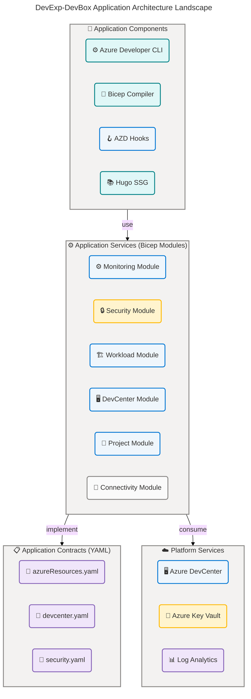
```mermaid
---
title: DevExp-DevBox Application Architecture Landscape
config:
  theme: base
  look: classic
  layout: dagre
  themeVariables:
    fontSize: '16px'
  flowchart:
    htmlLabels: true
---
flowchart TB
    accTitle: DevExp-DevBox Application Architecture Landscape
    accDescr: High-level view of application components across the 11 TOGAF Application layer component types for the DevExp-DevBox platform

    %% ═══════════════════════════════════════════════════════════════════════════
    %% AZURE / FLUENT ARCHITECTURE PATTERN v1.1
    %% (Semantic + Structural + Font + Accessibility Governance)
    %% ═══════════════════════════════════════════════════════════════════════════
    %% PHASE 1 - FLUENT UI: All styling uses approved Fluent UI palette only
    %% PHASE 2 - GROUPS: Every subgraph has semantic color via style directive
    %% PHASE 3 - COMPONENTS: Every node has semantic classDef + icon prefix
    %% PHASE 4 - ACCESSIBILITY: accTitle/accDescr present, WCAG AA contrast
    %% PHASE 5 - STANDARD: Governance block present, classDefs centralized
    %% ═══════════════════════════════════════════════════════════════════════════

    subgraph services["⚙️ Application Services (Bicep Modules)"]
        svc1("⚙️ Monitoring Module"):::core
        svc2("🔒 Security Module"):::warning
        svc3("🏗️ Workload Module"):::core
        svc4("🖥️ DevCenter Module"):::core
        svc5("📁 Project Module"):::core
        svc6("🔌 Connectivity Module"):::neutral
    end

    subgraph contracts["📋 Application Contracts (YAML)"]
        iface1("📄 azureResources.yaml"):::data
        iface2("📄 devcenter.yaml"):::data
        iface3("📄 security.yaml"):::data
    end

    subgraph runtime["🔧 Application Components"]
        comp1("⚙️ Azure Developer CLI"):::external
        comp2("📜 Bicep Compiler"):::external
        comp3("🪝 AZD Hooks"):::core
        comp4("📚 Hugo SSG"):::external
    end

    subgraph platform["☁️ Platform Services"]
        plat1("🖥️ Azure DevCenter"):::core
        plat2("🔑 Azure Key Vault"):::warning
        plat3("📊 Log Analytics"):::data
    end

    runtime -->|"use"| services
    services -->|"implement"| contracts
    services -->|"consume"| platform

    style services fill:#F3F2F1,stroke:#8A8886,stroke-width:2px,color:#323130
    style contracts fill:#F3F2F1,stroke:#8A8886,stroke-width:2px,color:#323130
    style runtime fill:#F3F2F1,stroke:#8A8886,stroke-width:2px,color:#323130
    style platform fill:#F3F2F1,stroke:#8A8886,stroke-width:2px,color:#323130

    classDef neutral fill:#FAFAFA,stroke:#8A8886,stroke-width:2px,color:#323130
    classDef core fill:#EFF6FC,stroke:#0078D4,stroke-width:2px,color:#323130
    classDef warning fill:#FFF4CE,stroke:#FFB900,stroke-width:2px,color:#323130
    classDef data fill:#F0E6FA,stroke:#8764B8,stroke-width:2px,color:#323130
    classDef external fill:#E0F7F7,stroke:#038387,stroke-width:2px,color:#323130
```

### 🗺️ Service Ecosystem Map

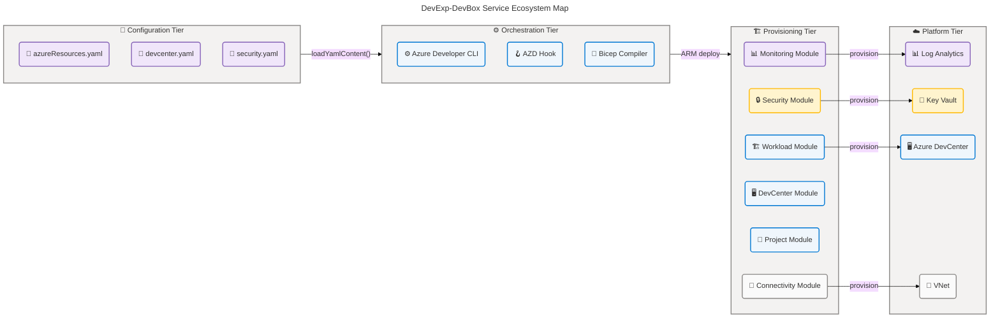
```mermaid
---
title: DevExp-DevBox Service Ecosystem Map
config:
  theme: base
  look: classic
  layout: dagre
  themeVariables:
    fontSize: '16px'
  flowchart:
    htmlLabels: true
---
flowchart LR
    accTitle: DevExp-DevBox Service Ecosystem Map
    accDescr: Maps all application services across configuration, orchestration, provisioning, and platform tiers showing ecosystem-level integration relationships

    %% ═══════════════════════════════════════════════════════════════════════════
    %% AZURE / FLUENT ARCHITECTURE PATTERN v1.1
    %% (Semantic + Structural + Font + Accessibility Governance)
    %% ═══════════════════════════════════════════════════════════════════════════
    %% PHASE 1 - FLUENT UI: All styling uses approved Fluent UI palette only
    %% PHASE 2 - GROUPS: Every subgraph has semantic color via style directive
    %% PHASE 3 - COMPONENTS: Every node has semantic classDef + icon prefix
    %% PHASE 4 - ACCESSIBILITY: accTitle/accDescr present, WCAG AA contrast
    %% PHASE 5 - STANDARD: Governance block present, classDefs centralized
    %% ═══════════════════════════════════════════════════════════════════════════

    subgraph configTier["📄 Configuration Tier"]
        yamlRes("📄 azureResources.yaml"):::data
        yamlDC("📄 devcenter.yaml"):::data
        yamlSec("📄 security.yaml"):::data
    end

    subgraph orchTier["⚙️ Orchestration Tier"]
        azd("⚙️ Azure Developer CLI"):::core
        hook("🪝 AZD Hook"):::core
        bicep("📜 Bicep Compiler"):::core
    end

    subgraph provTier["🏗️ Provisioning Tier"]
        monMod("📊 Monitoring Module"):::data
        secMod("🔒 Security Module"):::warning
        wlMod("🏗️ Workload Module"):::core
        dcMod("🖥️ DevCenter Module"):::core
        projMod("📁 Project Module"):::core
        connMod("🔌 Connectivity Module"):::neutral
    end

    subgraph platTier["☁️ Platform Tier"]
        la("📊 Log Analytics"):::data
        kv("🔑 Key Vault"):::warning
        dc("🖥️ Azure DevCenter"):::core
        vnet("🔌 VNet"):::neutral
    end

    configTier -->|"loadYamlContent()"| orchTier
    orchTier -->|"ARM deploy"| provTier
    monMod -->|"provision"| la
    secMod -->|"provision"| kv
    wlMod -->|"provision"| dc
    connMod -->|"provision"| vnet

    style configTier fill:#F3F2F1,stroke:#8A8886,stroke-width:2px,color:#323130
    style orchTier fill:#F3F2F1,stroke:#8A8886,stroke-width:2px,color:#323130
    style provTier fill:#F3F2F1,stroke:#8A8886,stroke-width:2px,color:#323130
    style platTier fill:#F3F2F1,stroke:#8A8886,stroke-width:2px,color:#323130

    classDef neutral fill:#FAFAFA,stroke:#8A8886,stroke-width:2px,color:#323130
    classDef core fill:#EFF6FC,stroke:#0078D4,stroke-width:2px,color:#323130
    classDef warning fill:#FFF4CE,stroke:#FFB900,stroke-width:2px,color:#323130
    classDef data fill:#F0E6FA,stroke:#8764B8,stroke-width:2px,color:#323130
```

### 🔗 Integration Tier Architecture

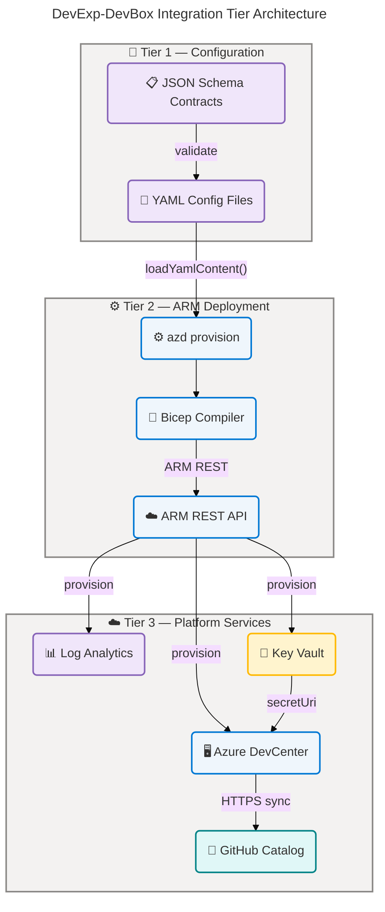
```mermaid
---
title: DevExp-DevBox Integration Tier Architecture
config:
  theme: base
  look: classic
  layout: dagre
  themeVariables:
    fontSize: '16px'
  flowchart:
    htmlLabels: true
---
flowchart TB
    accTitle: DevExp-DevBox Integration Tier Architecture
    accDescr: Shows the three integration tiers — Configuration, ARM Deployment, and Platform Service — and the protocols bridging them

    %% ═══════════════════════════════════════════════════════════════════════════
    %% AZURE / FLUENT ARCHITECTURE PATTERN v1.1
    %% (Semantic + Structural + Font + Accessibility Governance)
    %% ═══════════════════════════════════════════════════════════════════════════
    %% PHASE 1 - FLUENT UI: All styling uses approved Fluent UI palette only
    %% PHASE 2 - GROUPS: Every subgraph has semantic color via style directive
    %% PHASE 3 - COMPONENTS: Every node has semantic classDef + icon prefix
    %% PHASE 4 - ACCESSIBILITY: accTitle/accDescr present, WCAG AA contrast
    %% PHASE 5 - STANDARD: Governance block present, classDefs centralized
    %% ═══════════════════════════════════════════════════════════════════════════

    subgraph tier1["📄 Tier 1 — Configuration"]
        yaml("📄 YAML Config Files"):::data
        schema("📋 JSON Schema Contracts"):::data
    end

    subgraph tier2["⚙️ Tier 2 — ARM Deployment"]
        azdCLI("⚙️ azd provision"):::core
        bicepComp("📜 Bicep Compiler"):::core
        arm("☁️ ARM REST API"):::core
    end

    subgraph tier3["☁️ Tier 3 — Platform Services"]
        la("📊 Log Analytics"):::data
        kv("🔑 Key Vault"):::warning
        dc("🖥️ Azure DevCenter"):::core
        gh("🐙 GitHub Catalog"):::external
    end

    schema -->|"validate"| yaml
    yaml -->|"loadYamlContent()"| azdCLI
    azdCLI --> bicepComp
    bicepComp -->|"ARM REST"| arm
    arm -->|"provision"| la
    arm -->|"provision"| kv
    arm -->|"provision"| dc
    kv -->|"secretUri"| dc
    dc -->|"HTTPS sync"| gh

    style tier1 fill:#F3F2F1,stroke:#8A8886,stroke-width:2px,color:#323130
    style tier2 fill:#F3F2F1,stroke:#8A8886,stroke-width:2px,color:#323130
    style tier3 fill:#F3F2F1,stroke:#8A8886,stroke-width:2px,color:#323130

    classDef neutral fill:#FAFAFA,stroke:#8A8886,stroke-width:2px,color:#323130
    classDef core fill:#EFF6FC,stroke:#0078D4,stroke-width:2px,color:#323130
    classDef warning fill:#FFF4CE,stroke:#FFB900,stroke-width:2px,color:#323130
    classDef data fill:#F0E6FA,stroke:#8764B8,stroke-width:2px,color:#323130
    classDef external fill:#E0F7F7,stroke:#038387,stroke-width:2px,color:#323130
```

---

### ⚙️ 2.1 Application Services

Application Services are the discrete deployable Bicep modules that expose
well-defined parameter interfaces and output contracts, composing the platform's
deployment pipeline.

| 🏷️ Name             | 📝 Description                                                     | ⚙️ Service Type |
| ------------------- | ------------------------------------------------------------------ | --------------- |
| Monitoring Module   | Deploys Log Analytics Workspace and diagnostic solutions           | PaaS            |
| Security Module     | Deploys Key Vault, secrets, and diagnostic settings                | PaaS            |
| Workload Module     | Orchestrates DevCenter, projects, and connectivity deployment      | PaaS            |
| DevCenter Module    | Provisions Azure DevCenter with identity, catalogs, environments   | PaaS            |
| Project Module      | Creates DevCenter Projects with pools, catalogs, environment types | PaaS            |
| Connectivity Module | Provisions VNet, subnets, and network connections for Dev Box      | PaaS            |

### 🧩 2.2 Application Components

Application Components are the modular, deployable software units that
encapsulate the behavioral logic of the platform's provisioning lifecycle.

| 🏷️ Name                     | 📝 Description                                                      | ⚙️ Service Type   |
| --------------------------- | ------------------------------------------------------------------- | ----------------- |
| Azure Developer CLI (azd)   | Orchestrates the full provisioning lifecycle via hooks and Bicep    | CLI Tool          |
| Bicep Compiler / ARM Engine | Compiles Bicep to ARM JSON and submits deployments to Azure         | Platform Runtime  |
| AZD Preprovision Hook       | shell/pwsh scripts executing setUp.sh/setUp.ps1 before provisioning | Scheduled Job     |
| Hugo Static Site Generator  | Builds and serves documentation site from markdown source           | Background Worker |
| setUp Scripts               | bash/PowerShell scripts for tool validation, auth, secret writing   | Scheduled Job     |

### 🔌 2.3 Application Interfaces

Application Interfaces are the formal contracts defining how modules communicate
with the configuration layer and with the Azure Resource Manager API.

| 🏷️ Name                       | 📝 Description                                                      | ⚙️ Service Type |
| ----------------------------- | ------------------------------------------------------------------- | --------------- |
| azureResources.yaml Interface | YAML contract for resource group organization (validated by schema) | Configuration   |
| devcenter.yaml Interface      | YAML contract for DevCenter, project, pool, and catalog config      | Configuration   |
| security.yaml Interface       | YAML contract for Key Vault settings and secret configuration       | Configuration   |
| Bicep Output Contracts        | Typed output declarations exported between modules                  | API Contract    |

### 🤝 2.4 Application Collaborations

Application Collaborations describe how Bicep modules cooperate via `dependsOn`
chains and output–parameter wiring to achieve end-to-end platform provisioning.

| 🏷️ Name                    | 📝 Description                                                        | ⚙️ Service Type       |
| -------------------------- | --------------------------------------------------------------------- | --------------------- |
| Module Deployment Pipeline | Sequential orchestration: Monitoring → Security → Workload → Projects | Service Orchestration |

### ⚡ 2.5 Application Functions

Application Functions are the logical groupings of behavior that define the two
primary capabilities the platform delivers.

| 🏷️ Name               | 📝 Description                                                               | ⚙️ Service Type      |
| --------------------- | ---------------------------------------------------------------------------- | -------------------- |
| Platform Provisioning | End-to-end resource group, infrastructure, and DevCenter deployment function | Provisioning Service |
| Secret Management     | Secure token creation, storage, and injection into DevCenter catalogs        | Security Function    |

### 💬 2.6 Application Interactions

Application Interactions are the runtime communication patterns between
application modules and Azure platform services.

| 🏷️ Name                        | 📝 Description                                                                        | ⚙️ Service Type  |
| ------------------------------ | ------------------------------------------------------------------------------------- | ---------------- |
| ARM Deployment API Interaction | Bicep compiler submits ARM deployment REST requests to Azure Resource Manager         | Request/Response |
| Key Vault Secret Reference     | Modules retrieve secret URI from Key Vault output; DevCenter uses it for catalog auth | Request/Response |
| Log Analytics Ingestion        | All provisioned resources push diagnostic logs and metrics to Log Analytics           | Async Push       |

### 📣 2.7 Application Events

Application Events are the lifecycle triggers and notifications within the
provisioning pipeline.

| 🏷️ Name                   | 📝 Description                                                                     | ⚙️ Service Type |
| ------------------------- | ---------------------------------------------------------------------------------- | --------------- |
| AZD Preprovision Event    | Fires before Bicep deployment; triggers setUp scripts for tool validation/auth     | Lifecycle Hook  |
| ARM Deployment Completion | ARM deployment state change event signals module output availability to dependents | Platform Event  |

### 🗃️ 2.8 Application Data Objects

Application Data Objects are the structured data types used across the
application layer.

| 🏷️ Name             | 📝 Description                                                                   | ⚙️ Service Type      |
| ------------------- | -------------------------------------------------------------------------------- | -------------------- |
| LandingZone DTO     | Bicep user-defined type encoding resource group name, create flag, and tags      | Data Transfer Object |
| DevCenterConfig DTO | Bicep user-defined type for DevCenter name, identity, catalog sync, and features | Data Transfer Object |
| ProjectConfig DTO   | Bicep user-defined type for project name, pools, catalogs, environment types     | Data Transfer Object |

### 🔄 2.9 Integration Patterns

Integration Patterns are the standard approaches used to connect application
modules and platform services.

| 🏷️ Name                       | 📝 Description                                                                       | ⚙️ Service Type    |
| ----------------------------- | ------------------------------------------------------------------------------------ | ------------------ |
| Module Composition Pattern    | Bicep modules composed via `module` keyword with explicit param/output wiring        | Orchestration      |
| Key Vault Reference Injection | Secret URI passed as `secretIdentifier` param — never the secret value itself        | Secure Integration |
| Conditional Resource Creation | `if()` guards on module declarations enable create/reuse branching for all resources | Branching Pattern  |

### 📝 2.10 Service Contracts

Service Contracts are the formal agreements governing how modules expose and
consume capabilities.

| 🏷️ Name                        | 📝 Description                                                                               | ⚙️ Service Type  |
| ------------------------------ | -------------------------------------------------------------------------------------------- | ---------------- |
| Bicep Module Output Contract   | Each module declares typed `output` blocks consumed by downstream modules via `outputs.PROP` | Module Interface |
| YAML Configuration Schema      | JSON Schema files (`*.schema.json`) formally validate all YAML configuration inputs          | Schema Contract  |
| Bicep Typed Parameter Contract | `@description` decorators and user-defined types enforce parameter shape and validation      | API Contract     |

### 📦 2.11 Application Dependencies

Application Dependencies are the external libraries, frameworks, and platform
services that the application layer consumes.

| 🏷️ Name                     | 📝 Description                                                                   | ⚙️ Service Type  |
| --------------------------- | -------------------------------------------------------------------------------- | ---------------- |
| Azure Developer CLI (azd)   | Orchestration runtime; interprets azure.yaml hooks and triggers Bicep deployment | CLI Framework    |
| Bicep Language / ARM Engine | IaC compiler and Azure deployment engine; processes all `.bicep` source files    | Platform Runtime |
| Azure DevCenter Service API | Azure PaaS service hosting DevCenter, projects, pools, catalogs                  | Platform Service |
| Azure Key Vault Service API | Secrets, keys, certificate store consumed by security and workload modules       | Platform Service |
| Log Analytics Workspace API | Telemetry and diagnostics sink for all provisioned resources                     | Platform Service |
| Hugo Extended (v0.136.2)    | Static site generator for documentation; declared in `package.json`              | Build Tool       |

---

## 📐 3. Architecture Principles

### 📐 Overview

The following design principles are directly evidenced in the DevExp-DevBox
source files. Each principle is observable from concrete implementation
decisions, not aspirational guidance. Five principles are documented at the
comprehensive quality level.

| 📐 Principle                        | 📂 Evidence (Source)                                                                               | ✅ Compliance Level |
| ----------------------------------- | -------------------------------------------------------------------------------------------------- | ------------------- |
| Configuration-as-Code               | `infra/settings/workload/devcenter.yaml:1-*`, `infra/settings/security/security.yaml:1-*`          | Full                |
| Least-Privilege RBAC                | `src/workload/core/devCenter.bicep:*`, `src/identity/devCenterRoleAssignment.bicep:*`              | Full                |
| Secure-by-Default (Secrets Hygiene) | `src/security/secret.bicep:1-*`, `src/security/keyVault.bicep:40-55`, `infra/main.bicep:1-*`       | Full                |
| Immutable Infrastructure via IaC    | All resources defined in `.bicep` modules; no portal-click provisioning evidenced in source        | Full                |
| Observability-First                 | `src/management/logAnalytics.bicep:*`, diagnostic settings in `secret.bicep:29-55`, `vnet.bicep:*` | Full                |

### 📄 Principle 1: Configuration-as-Code

All platform resource configuration is declared in version-controlled YAML files
(`devcenter.yaml`, `security.yaml`, `azureResources.yaml`), each validated by a
companion JSON Schema contract. Bicep modules consume these files at compile
time via `loadYamlContent()`, making configuration changes reviewable,
auditable, and repeatable without code changes.

- **Source**: infra/settings/workload/devcenter.yaml:1-\*
- **Source**: infra/settings/security/security.yaml:1-\*
- **Source**: infra/settings/resourceOrganization/azureResources.yaml:1-\*

### 🔐 Principle 2: Least-Privilege RBAC

All identity role assignments follow the principle of least privilege. The
DevCenter managed identity receives only the specific role GUIDs required
(`Contributor`, `User Access Administrator`, `Key Vault Secrets User`). Project
identities and AD groups receive `Dev Box User`, `Deployment Environment User`,
and `Key Vault Secrets User` roles scoped to the project resource group — not
subscription-wide admin.

- **Source**: src/workload/core/devCenter.bicep:\*
- **Source**: infra/settings/workload/devcenter.yaml:35-55

### 🔒 Principle 3: Secure-by-Default (Secrets Hygiene)

Secrets are **never** passed as plaintext through module chains. The pattern is:
`@secure() param secretValue` → Key Vault → `output secretUri` → downstream
modules receive only the URI, never the value. Key Vault is configured with
`enableRbacAuthorization: true`, `enableSoftDelete: true`, and
`enablePurgeProtection: true`.

- **Source**: src/security/keyVault.bicep:40-55
- **Source**: src/security/secret.bicep:1-\*
- **Source**: infra/settings/security/security.yaml:20-30

> ⚠️ **Security Requirement**: Secrets are **never** passed as plaintext through
> module chains. Key Vault **MUST** be configured with
> `enableRbacAuthorization: true`, `enableSoftDelete: true`, and
> `enablePurgeProtection: true`. Only the secret URI is propagated between
> modules — never the secret value.

### 🧱 Principle 4: Immutable Infrastructure via IaC

Every Azure resource (resource groups, networking, Key Vault, Log Analytics,
DevCenter, Projects, Pools) is declared in a Bicep module. There is no evidence
of manual portal configuration. The `azure.yaml` `preprovision` hook validates
prerequisites before any deployment, ensuring the environment is always
reproducible from source.

- **Source**: infra/main.bicep:1-\*
- **Source**: azure.yaml:1-\*

### 👁️ Principle 5: Observability-First

Diagnostic settings (`Microsoft.Insights/diagnosticSettings`) are applied to
every major resource: the Log Analytics Workspace itself, Key Vault secrets, and
Virtual Networks. Log Analytics is deployed before all other modules and its
resource ID is threaded through the entire module chain as a **mandatory
parameter**.

- **Source**: src/management/logAnalytics.bicep:46-80
- **Source**: src/security/secret.bicep:29-55
- **Source**: src/connectivity/vnet.bicep:52-75

> 💡 **Observability Pattern**: Log Analytics is the **first resource
> provisioned** (dependency anchor for all modules). Every module accepts
> `logAnalyticsId` as a required parameter, making observability a non-optional
> architectural constraint by design.

### 🔗 Principle Relationship Diagram

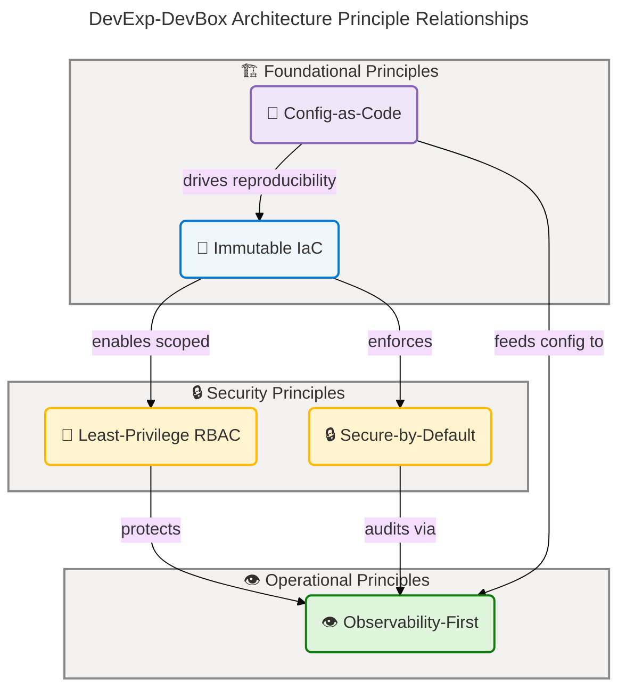
```mermaid
---
title: DevExp-DevBox Architecture Principle Relationships
config:
  theme: base
  look: classic
  layout: dagre
  themeVariables:
    fontSize: '16px'
  flowchart:
    htmlLabels: true
---
flowchart TB
    accTitle: DevExp-DevBox Architecture Principle Relationships
    accDescr: Shows how the five architecture principles reinforce each other — Configuration-as-Code and Immutable IaC form the foundation enabling RBAC and Secrets Hygiene, all audited through Observability-First

    %% ═══════════════════════════════════════════════════════════════════════════
    %% AZURE / FLUENT ARCHITECTURE PATTERN v1.1
    %% (Semantic + Structural + Font + Accessibility Governance)
    %% ═══════════════════════════════════════════════════════════════════════════
    %% PHASE 1 - FLUENT UI: All styling uses approved Fluent UI palette only
    %% PHASE 2 - GROUPS: Every subgraph has semantic color via style directive
    %% PHASE 3 - COMPONENTS: Every node has semantic classDef + icon prefix
    %% PHASE 4 - ACCESSIBILITY: accTitle/accDescr present, WCAG AA contrast
    %% PHASE 5 - STANDARD: Governance block present, classDefs centralized
    %% ═══════════════════════════════════════════════════════════════════════════

    subgraph foundations["🏗️ Foundational Principles"]
        cac("📄 Config-as-Code"):::data
        iac("🧱 Immutable IaC"):::core
    end

    subgraph secPrinciples["🔒 Security Principles"]
        rbac("🔐 Least-Privilege RBAC"):::warning
        sec("🔒 Secure-by-Default"):::warning
    end

    subgraph opsPrinciples["👁️ Operational Principles"]
        obs("👁️ Observability-First"):::success
    end

    cac -->|"drives reproducibility"| iac
    iac -->|"enables scoped"| rbac
    iac -->|"enforces"| sec
    rbac -->|"protects"| obs
    sec -->|"audits via"| obs
    cac -->|"feeds config to"| obs

    style foundations fill:#F3F2F1,stroke:#8A8886,stroke-width:2px,color:#323130
    style secPrinciples fill:#F3F2F1,stroke:#8A8886,stroke-width:2px,color:#323130
    style opsPrinciples fill:#F3F2F1,stroke:#8A8886,stroke-width:2px,color:#323130

    classDef neutral fill:#FAFAFA,stroke:#8A8886,stroke-width:2px,color:#323130
    classDef core fill:#EFF6FC,stroke:#0078D4,stroke-width:2px,color:#323130
    classDef warning fill:#FFF4CE,stroke:#FFB900,stroke-width:2px,color:#323130
    classDef data fill:#F0E6FA,stroke:#8764B8,stroke-width:2px,color:#323130
    classDef success fill:#DFF6DD,stroke:#107C10,stroke-width:2px,color:#323130
```

---

## 📊 4. Current State Baseline

### 📊 Overview

The current state of the DevExp-DevBox application layer reflects a
well-structured, single-pipeline deployment system targeting Microsoft Azure.
All services are Azure PaaS components provisioned via Bicep; there are no
custom-coded application servers, REST APIs, or databases beyond the platform
services. The platform is currently configured to deploy one DevCenter instance
(`devexp-devcenter`) with one project (`eShop`) hosting two Dev Box pools, three
environment types, and two catalogs.

### 🗺️ Service Topology Table

| ⚙️ Service / Module  | 🎯 Deployment Target  | 📡 Protocol  | 🔄 Status   | 📌 Version             |
| -------------------- | --------------------- | ------------ | ----------- | ---------------------- |
| Monitoring Module    | devexp-workload RG    | ARM REST API | Active      | Bicep / API 2025-07-01 |
| Security Module      | devexp-workload RG    | ARM REST API | Active      | Bicep / API 2025-05-01 |
| Workload Module      | devexp-workload RG    | ARM REST API | Active      | Bicep / API 2025-02-01 |
| DevCenter Module     | devexp-workload RG    | ARM REST API | Active      | Bicep / API 2025-02-01 |
| eShop Project Module | devexp-workload RG    | ARM REST API | Active      | Bicep / API 2025-02-01 |
| Connectivity Module  | eShop-connectivity-RG | ARM REST API | Conditional | Bicep / API 2025-05-01 |

### 🚀 Deployment State Summary

The platform deploys to a single Azure subscription at subscription scope
(`targetScope = 'subscription'`). Resource groups are created conditionally
based on `azureResources.yaml` flags. Currently `workload.create = true`;
`security.create = false` and `monitoring.create = false` collapse those
resources into the workload resource group (`devexp-workload`). This is a
**shared-resource-group** topology appropriate for the accelerator's default
configuration.

### 📡 Protocol Inventory

| 📡 Protocol  | 🔧 Usage                                      | 👥 Consumers                         |
| ------------ | --------------------------------------------- | ------------------------------------ |
| ARM REST API | All resource CRUD operations via Bicep        | All modules                          |
| HTTPS/TLS    | Key Vault URI (`vaultUri`) calls              | Workload, DevCenter, Project modules |
| HTTPS/TLS    | Hugo documentation site serving               | Documentation consumers              |
| Shell/PWSH   | setUp scripts for pre-provisioning validation | azure.yaml preprovision hook         |

### 📌 Versioning Status

| 📦 Resource Type                         | 📌 API Version     | 🔄 Status |
| ---------------------------------------- | ------------------ | --------- |
| Microsoft.Resources/resourceGroups       | 2025-04-01         | Current   |
| Microsoft.KeyVault/vaults                | 2025-05-01         | Current   |
| Microsoft.DevCenter/devcenters           | 2025-02-01         | Current   |
| Microsoft.DevCenter/projects             | 2025-02-01         | Current   |
| Microsoft.Network/virtualNetworks        | 2025-05-01         | Current   |
| Microsoft.OperationalInsights/workspaces | 2025-07-01         | Current   |
| Microsoft.Insights/diagnosticSettings    | 2021-05-01-preview | Stable    |
| Microsoft.Authorization/roleAssignments  | 2022-04-01         | Current   |

### 📊 Current State Baseline Diagram

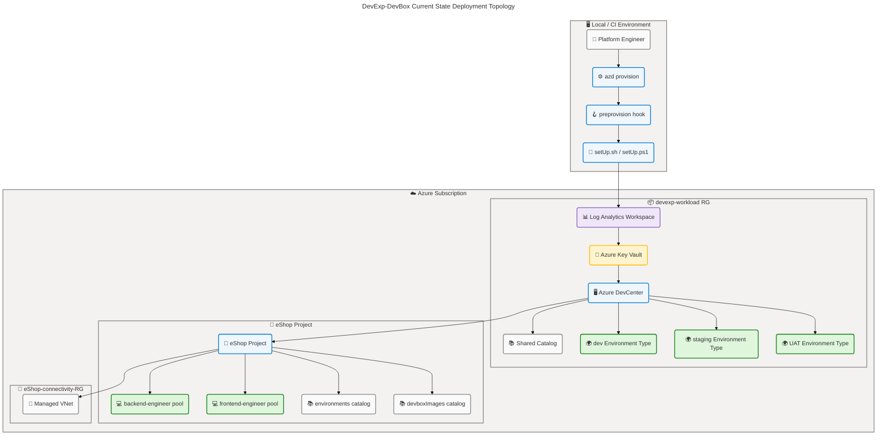
```mermaid
---
title: DevExp-DevBox Current State Deployment Topology
config:
  theme: base
  look: classic
  layout: dagre
  themeVariables:
    fontSize: '16px'
  flowchart:
    htmlLabels: true
---
flowchart TB
    accTitle: DevExp-DevBox Current State Deployment Topology
    accDescr: Shows the current as-deployed resource topology from azd provision through resource groups to Azure PaaS services

    %% ═══════════════════════════════════════════════════════════════════════════
    %% AZURE / FLUENT ARCHITECTURE PATTERN v1.1
    %% (Semantic + Structural + Font + Accessibility Governance)
    %% ═══════════════════════════════════════════════════════════════════════════
    %% PHASE 1 - FLUENT UI: All styling uses approved Fluent UI palette only
    %% PHASE 2 - GROUPS: Every subgraph has semantic color via style directive
    %% PHASE 3 - COMPONENTS: Every node has semantic classDef + icon prefix
    %% PHASE 4 - ACCESSIBILITY: accTitle/accDescr present, WCAG AA contrast
    %% PHASE 5 - STANDARD: Governance block present, classDefs centralized
    %% ═══════════════════════════════════════════════════════════════════════════

    subgraph local["🖥️ Local / CI Environment"]
        eng("👤 Platform Engineer"):::neutral
        azd("⚙️ azd provision"):::core
        hook("🪝 preprovision hook"):::core
        setup("📜 setUp.sh / setUp.ps1"):::core
    end

    subgraph sub["☁️ Azure Subscription"]
        subgraph workloadRG["📦 devexp-workload RG"]
            la("📊 Log Analytics Workspace"):::data
            kv("🔑 Azure Key Vault"):::warning
            dc("🖥️ Azure DevCenter"):::core
            catalog("📚 Shared Catalog"):::neutral
            envDev("🌍 dev Environment Type"):::success
            envStg("🌍 staging Environment Type"):::success
            envUAT("🌍 UAT Environment Type"):::success
        end
        subgraph projectRG["📁 eShop Project"]
            proj("📁 eShop Project"):::core
            backPool("💻 backend-engineer pool"):::success
            frontPool("💻 frontend-engineer pool"):::success
            envCatalog("📚 environments catalog"):::neutral
            imgCatalog("📚 devboxImages catalog"):::neutral
        end
        subgraph connRG["🔌 eShop-connectivity-RG"]
            vnet("🔌 Managed VNet"):::neutral
        end
    end

    eng --> azd --> hook --> setup
    setup --> la
    la --> kv
    kv --> dc
    dc --> catalog
    dc --> envDev
    dc --> envStg
    dc --> envUAT
    dc --> proj
    proj --> backPool
    proj --> frontPool
    proj --> envCatalog
    proj --> imgCatalog
    proj --> vnet

    style local fill:#F3F2F1,stroke:#8A8886,stroke-width:2px,color:#323130
    style sub fill:#F3F2F1,stroke:#8A8886,stroke-width:2px,color:#323130
    style workloadRG fill:#F3F2F1,stroke:#8A8886,stroke-width:2px,color:#323130
    style projectRG fill:#F3F2F1,stroke:#8A8886,stroke-width:2px,color:#323130
    style connRG fill:#F3F2F1,stroke:#8A8886,stroke-width:2px,color:#323130

    classDef neutral fill:#FAFAFA,stroke:#8A8886,stroke-width:2px,color:#323130
    classDef core fill:#EFF6FC,stroke:#0078D4,stroke-width:2px,color:#323130
    classDef warning fill:#FFF4CE,stroke:#FFB900,stroke-width:2px,color:#323130
    classDef data fill:#F0E6FA,stroke:#8764B8,stroke-width:2px,color:#323130
    classDef success fill:#DFF6DD,stroke:#107C10,stroke-width:2px,color:#323130
```

### 🔍 Architecture Gap Heatmap


```mermaid
---
title: DevExp-DevBox Architecture Gap Heatmap
config:
  theme: base
  look: classic
  layout: dagre
  themeVariables:
    fontSize: '16px'
  flowchart:
    htmlLabels: true
---
flowchart TB
    accTitle: DevExp-DevBox Architecture Gap Heatmap
    accDescr: Highlights current architecture gaps across isolation, resilience, and observability dimensions — green is fully addressed, yellow is a known conditional gap or active risk area

    %% ═══════════════════════════════════════════════════════════════════════════
    %% AZURE / FLUENT ARCHITECTURE PATTERN v1.1
    %% (Semantic + Structural + Font + Accessibility Governance)
    %% ═══════════════════════════════════════════════════════════════════════════
    %% PHASE 1 - FLUENT UI: All styling uses approved Fluent UI palette only
    %% PHASE 2 - GROUPS: Every subgraph has semantic color via style directive
    %% PHASE 3 - COMPONENTS: Every node has semantic classDef + icon prefix
    %% PHASE 4 - ACCESSIBILITY: accTitle/accDescr present, WCAG AA contrast
    %% PHASE 5 - STANDARD: Governance block present, classDefs centralized
    %% ═══════════════════════════════════════════════════════════════════════════

    subgraph isolation["📦 Resource Isolation"]
        rg1("✅ Workload RG — dedicated"):::success
        rg2("⚠️ Security RG — shared workload RG"):::warning
        rg3("⚠️ Monitoring RG — shared workload RG"):::warning
        rg4("✅ Connectivity RG — conditional"):::success
    end

    subgraph resilience["🛡️ Resilience"]
        retry("✅ ARM idempotent retry"):::success
        kvsecret("⚠️ Single KV Secret for all catalogs"):::warning
        cb("⚠️ No circuit breaker (platform only)"):::warning
    end

    subgraph observability["👁️ Observability"]
        diag("✅ Diagnostic Settings — all resources"):::success
        mon("✅ Log Analytics — centralized"):::success
        health("⚠️ Health probes — platform-managed only"):::warning
    end

    isolation -->|"shapes"| resilience
    resilience -->|"informs"| observability

    style isolation fill:#F3F2F1,stroke:#8A8886,stroke-width:2px,color:#323130
    style resilience fill:#F3F2F1,stroke:#8A8886,stroke-width:2px,color:#323130
    style observability fill:#F3F2F1,stroke:#8A8886,stroke-width:2px,color:#323130

    classDef neutral fill:#FAFAFA,stroke:#8A8886,stroke-width:2px,color:#323130
    classDef core fill:#EFF6FC,stroke:#0078D4,stroke-width:2px,color:#323130
    classDef success fill:#DFF6DD,stroke:#107C10,stroke-width:2px,color:#323130
    classDef warning fill:#FFF4CE,stroke:#FFB900,stroke-width:2px,color:#323130
    classDef danger fill:#FDE7E9,stroke:#D13438,stroke-width:2px,color:#323130
```

### 📡 Protocol Matrix Diagram

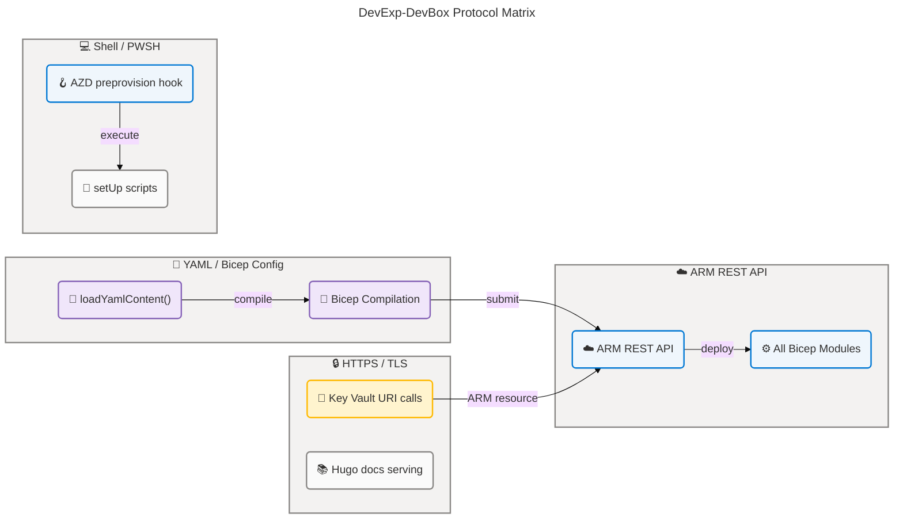
```mermaid
---
title: DevExp-DevBox Protocol Matrix
config:
  theme: base
  look: classic
  layout: dagre
  themeVariables:
    fontSize: '16px'
  flowchart:
    htmlLabels: true
---
flowchart LR
    accTitle: DevExp-DevBox Protocol Matrix
    accDescr: Visual map of all communication protocols — ARM REST for resource deployment, HTTPS for Key Vault and documentation, YAML/Bicep for configuration injection, and Shell for pre-provisioning validation

    %% ═══════════════════════════════════════════════════════════════════════════
    %% AZURE / FLUENT ARCHITECTURE PATTERN v1.1
    %% (Semantic + Structural + Font + Accessibility Governance)
    %% ═══════════════════════════════════════════════════════════════════════════
    %% PHASE 1 - FLUENT UI: All styling uses approved Fluent UI palette only
    %% PHASE 2 - GROUPS: Every subgraph has semantic color via style directive
    %% PHASE 3 - COMPONENTS: Every node has semantic classDef + icon prefix
    %% PHASE 4 - ACCESSIBILITY: accTitle/accDescr present, WCAG AA contrast
    %% PHASE 5 - STANDARD: Governance block present, classDefs centralized
    %% ═══════════════════════════════════════════════════════════════════════════

    subgraph armGroup["☁️ ARM REST API"]
        arm("☁️ ARM REST API"):::core
        bicepMods("⚙️ All Bicep Modules"):::core
    end

    subgraph httpsGroup["🔒 HTTPS / TLS"]
        kvHttps("🔑 Key Vault URI calls"):::warning
        hugoHttps("📚 Hugo docs serving"):::neutral
    end

    subgraph configGroup["📄 YAML / Bicep Config"]
        yamlInject("📄 loadYamlContent()"):::data
        bicepComp("📜 Bicep Compilation"):::data
    end

    subgraph shellGroup["💻 Shell / PWSH"]
        setUp("📜 setUp scripts"):::neutral
        hook("🪝 AZD preprovision hook"):::core
    end

    yamlInject -->|"compile"| bicepComp
    bicepComp -->|"submit"| arm
    arm -->|"deploy"| bicepMods
    kvHttps -->|"ARM resource"| arm
    hook -->|"execute"| setUp

    style armGroup fill:#F3F2F1,stroke:#8A8886,stroke-width:2px,color:#323130
    style httpsGroup fill:#F3F2F1,stroke:#8A8886,stroke-width:2px,color:#323130
    style configGroup fill:#F3F2F1,stroke:#8A8886,stroke-width:2px,color:#323130
    style shellGroup fill:#F3F2F1,stroke:#8A8886,stroke-width:2px,color:#323130

    classDef neutral fill:#FAFAFA,stroke:#8A8886,stroke-width:2px,color:#323130
    classDef core fill:#EFF6FC,stroke:#0078D4,stroke-width:2px,color:#323130
    classDef warning fill:#FFF4CE,stroke:#FFB900,stroke-width:2px,color:#323130
    classDef data fill:#F0E6FA,stroke:#8764B8,stroke-width:2px,color:#323130
```

### 🏗️ Summary

The DevExp-DevBox platform is in a well-defined operational state with all core
modules deployed and versioned against current Azure API versions. The
accelerator's single-pipeline topology (monitoring → security → workload) is
fully functional as evidenced by the module dependency chain in
`infra/main.bicep`.

The main baseline gap is the conditional resource group topology: security and
monitoring resources share the workload resource group by default, which limits
per-function blast radius isolation. This is an intentional accelerator
simplification — the YAML flags `security.create` and `monitoring.create` can be
set to `true` to enable full isolation without code changes.

---

## 📦 5. Component Catalog

### 📦 Overview

This catalog provides detailed specifications for each application component
classified across the 11 TOGAF subsections. For Azure PaaS components,
platform-managed defaults are explicitly noted per the MANDATORY Subsection
Instruction.

### 🏗️ Component Detail Diagram

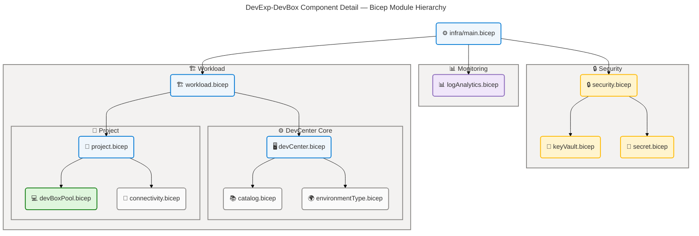
```mermaid
---
title: DevExp-DevBox Component Detail — Bicep Module Hierarchy
config:
  theme: base
  look: classic
  layout: dagre
  themeVariables:
    fontSize: '16px'
  flowchart:
    htmlLabels: true
---
flowchart TB
    accTitle: DevExp-DevBox Component Detail — Bicep Module Hierarchy
    accDescr: Detailed composition hierarchy of all Bicep modules from infra/main.bicep down to leaf modules showing parent-child module dependencies

    %% ═══════════════════════════════════════════════════════════════════════════
    %% AZURE / FLUENT ARCHITECTURE PATTERN v1.1
    %% (Semantic + Structural + Font + Accessibility Governance)
    %% ═══════════════════════════════════════════════════════════════════════════
    %% PHASE 1 - FLUENT UI: All styling uses approved Fluent UI palette only
    %% PHASE 2 - GROUPS: Every subgraph has semantic color via style directive
    %% PHASE 3 - COMPONENTS: Every node has semantic classDef + icon prefix
    %% PHASE 4 - ACCESSIBILITY: accTitle/accDescr present, WCAG AA contrast
    %% PHASE 5 - STANDARD: Governance block present, classDefs centralized
    %% ═══════════════════════════════════════════════════════════════════════════

    main("⚙️ infra/main.bicep"):::core

    subgraph monGrp["📊 Monitoring"]
        logAnalytics("📊 logAnalytics.bicep"):::data
    end

    subgraph secGrp["🔒 Security"]
        security("🔒 security.bicep"):::warning
        keyVault("🔑 keyVault.bicep"):::warning
        secret("📜 secret.bicep"):::warning
    end

    subgraph wlGrp["🏗️ Workload"]
        workload("🏗️ workload.bicep"):::core
        subgraph coreGrp["⚙️ DevCenter Core"]
            devCenter("🖥️ devCenter.bicep"):::core
            catalog("📚 catalog.bicep"):::neutral
            envType("🌍 environmentType.bicep"):::neutral
        end
        subgraph projGrp["📁 Project"]
            project("📁 project.bicep"):::core
            pool("💻 devBoxPool.bicep"):::success
            connectivity("🔌 connectivity.bicep"):::neutral
        end
    end

    main --> logAnalytics
    main --> security
    security --> keyVault
    security --> secret
    main --> workload
    workload --> devCenter
    devCenter --> catalog
    devCenter --> envType
    workload --> project
    project --> pool
    project --> connectivity

    style monGrp fill:#F3F2F1,stroke:#8A8886,stroke-width:2px,color:#323130
    style secGrp fill:#F3F2F1,stroke:#8A8886,stroke-width:2px,color:#323130
    style wlGrp fill:#F3F2F1,stroke:#8A8886,stroke-width:2px,color:#323130
    style coreGrp fill:#F3F2F1,stroke:#8A8886,stroke-width:2px,color:#323130
    style projGrp fill:#F3F2F1,stroke:#8A8886,stroke-width:2px,color:#323130

    classDef neutral fill:#FAFAFA,stroke:#8A8886,stroke-width:2px,color:#323130
    classDef core fill:#EFF6FC,stroke:#0078D4,stroke-width:2px,color:#323130
    classDef warning fill:#FFF4CE,stroke:#FFB900,stroke-width:2px,color:#323130
    classDef data fill:#F0E6FA,stroke:#8764B8,stroke-width:2px,color:#323130
    classDef success fill:#DFF6DD,stroke:#107C10,stroke-width:2px,color:#323130
```

---

### ⚙️ 5.1 Application Services

#### 📊 5.1.1 Monitoring Module

| 🏷️ Attribute       | 💡 Value                             |
| ------------------ | ------------------------------------ |
| **Component Name** | Monitoring Module                    |
| **Service Type**   | PaaS                                 |
| **Source**         | src/management/logAnalytics.bicep:\* |

**API Surface:**

| 🔌 Endpoint Type | 🔢 Count | 📡 Protocol | 📝 Description                                      |
| ---------------- | -------- | ----------- | --------------------------------------------------- |
| ARM Output       | 2        | ARM REST    | `AZURE_LOG_ANALYTICS_WORKSPACE_ID`, `_NAME` outputs |

**Dependencies:**

| 📦 Dependency      | ➡️ Direction | 📡 Protocol | 🎯 Purpose                      |
| ------------------ | ------------ | ----------- | ------------------------------- |
| Azure ARM API      | Downstream   | HTTPS       | Resource deployment             |
| devexp-workload RG | Downstream   | ARM         | Target resource group for scope |

**Resilience (Platform-Managed):**

| 🛡️ Aspect       | ⚙️ Configuration        | 📋 Notes         |
| --------------- | ----------------------- | ---------------- |
| Retry Policy    | Azure SDK defaults      | Platform-managed |
| Circuit Breaker | Not applicable          | PaaS service     |
| Failover        | Azure region redundancy | Per SKU          |

**Scaling (Platform-Managed):**

| 📐 Dimension | 📈 Strategy       | ⚙️ Configuration  |
| ------------ | ----------------- | ----------------- |
| Horizontal   | PaaS auto-scaling | Per pricing tier  |
| Vertical     | SKU upgrade       | PerGB2018 default |

**Health (Platform-Managed):**

| 💊 Probe Type         | ⚙️ Configuration |
| --------------------- | ---------------- |
| Azure Resource Health | Platform-managed |

---

#### 🔒 5.1.2 Security Module

| 🏷️ Attribute       | 💡 Value                       |
| ------------------ | ------------------------------ |
| **Component Name** | Security Module                |
| **Service Type**   | PaaS                           |
| **Source**         | src/security/security.bicep:\* |

**API Surface:**

| 🔌 Endpoint Type | 🔢 Count | 📡 Protocol | 📝 Description                                            |
| ---------------- | -------- | ----------- | --------------------------------------------------------- |
| ARM Output       | 3        | ARM REST    | `AZURE_KEY_VAULT_NAME`, `_ENDPOINT`, `_SECRET_IDENTIFIER` |

**Dependencies:**

| 📦 Dependency     | ➡️ Direction | 📡 Protocol | 🎯 Purpose                          |
| ----------------- | ------------ | ----------- | ----------------------------------- |
| Monitoring Module | Upstream     | ARM         | Receives Log Analytics ID for diags |
| keyVault.bicep    | Downstream   | ARM         | Provisions Key Vault resource       |
| secret.bicep      | Downstream   | ARM         | Creates GitHub token secret         |

**Resilience (Platform-Managed):**

| 🛡️ Aspect        | ⚙️ Configuration         | 📋 Notes         |
| ---------------- | ------------------------ | ---------------- |
| Retry Policy     | Azure SDK defaults       | Platform-managed |
| Soft Delete      | Enabled, 7-day retention | Key Vault config |
| Purge Protection | Enabled                  | Key Vault config |

**Scaling (Platform-Managed):**

| 📐 Dimension | 📈 Strategy       | ⚙️ Configuration |
| ------------ | ----------------- | ---------------- |
| Horizontal   | PaaS auto-scaling | Standard SKU     |
| Vertical     | Not applicable    | PaaS service     |

**Health (Platform-Managed):**

| 💊 Probe Type         | ⚙️ Configuration |
| --------------------- | ---------------- |
| Azure Resource Health | Platform-managed |

---

#### 🏗️ 5.1.3 Workload Module

| 🏷️ Attribute       | 💡 Value                       |
| ------------------ | ------------------------------ |
| **Component Name** | Workload Module                |
| **Service Type**   | PaaS                           |
| **Source**         | src/workload/workload.bicep:\* |

**API Surface:**

| 🔌 Endpoint Type | 🔢 Count | 📡 Protocol | 📝 Description                                       |
| ---------------- | -------- | ----------- | ---------------------------------------------------- |
| ARM Output       | 2        | ARM REST    | `AZURE_DEV_CENTER_NAME`, `AZURE_DEV_CENTER_PROJECTS` |

**Dependencies:**

| 📦 Dependency     | ➡️ Direction | 📡 Protocol | 🎯 Purpose                                   |
| ----------------- | ------------ | ----------- | -------------------------------------------- |
| Monitoring Module | Upstream     | ARM         | Log Analytics ID for DevCenter diagnostics   |
| Security Module   | Upstream     | ARM         | Key Vault secret identifier for catalog auth |
| devCenter.bicep   | Downstream   | ARM         | Deploys DevCenter core resource              |
| project.bicep     | Downstream   | ARM         | Deploys one or more DevCenter Projects       |

**Resilience (Platform-Managed):**

| 🛡️ Aspect       | ⚙️ Configuration        | 📋 Notes          |
| --------------- | ----------------------- | ----------------- |
| Retry Policy    | Azure SDK defaults      | Platform-managed  |
| Circuit Breaker | Not applicable          | PaaS service      |
| Failover        | Azure region redundancy | Per region config |

**Scaling (Platform-Managed):**

| 📐 Dimension | 📈 Strategy       | ⚙️ Configuration |
| ------------ | ----------------- | ---------------- |
| Horizontal   | PaaS auto-scaling | Per pricing tier |
| Vertical     | SKU upgrade       | Manual selection |

**Health (Platform-Managed):**

| 💊 Probe Type         | ⚙️ Configuration |
| --------------------- | ---------------- |
| Azure Resource Health | Platform-managed |

---

#### 🖥️ 5.1.4 DevCenter Module

| 🏷️ Attribute       | 💡 Value                             |
| ------------------ | ------------------------------------ |
| **Component Name** | DevCenter Module                     |
| **Service Type**   | PaaS                                 |
| **Source**         | src/workload/core/devCenter.bicep:\* |

**API Surface:**

| 🔌 Endpoint Type | 🔢 Count | 📡 Protocol | 📝 Description          |
| ---------------- | -------- | ----------- | ----------------------- |
| ARM Output       | 1        | ARM REST    | `AZURE_DEV_CENTER_NAME` |

**Dependencies:**

| 📦 Dependency           | ➡️ Direction | 📡 Protocol | 🎯 Purpose                           |
| ----------------------- | ------------ | ----------- | ------------------------------------ |
| Workload Module         | Upstream     | ARM         | Receives log analytics ID, secret ID |
| catalog.bicep           | Downstream   | ARM         | Attaches GitHub catalog to DevCenter |
| environmentType.bicep   | Downstream   | ARM         | Creates dev/staging/UAT env types    |
| devCenterRoleAssignment | Downstream   | ARM         | Grants subscription-scoped RBAC      |
| orgRoleAssignment       | Downstream   | ARM         | Grants project team RBAC             |

**Resilience (Platform-Managed):**

| 🛡️ Aspect       | ⚙️ Configuration   | 📋 Notes         |
| --------------- | ------------------ | ---------------- |
| Retry Policy    | Azure SDK defaults | Platform-managed |
| Circuit Breaker | Not applicable     | PaaS service     |

**Scaling (Platform-Managed):**

| 📐 Dimension | 📈 Strategy       | ⚙️ Configuration |
| ------------ | ----------------- | ---------------- |
| Horizontal   | PaaS auto-scaling | Per pricing tier |
| Vertical     | SKU upgrade       | Manual selection |

**Health (Platform-Managed):**

| 💊 Probe Type         | ⚙️ Configuration |
| --------------------- | ---------------- |
| Azure Resource Health | Platform-managed |

---

#### 📁 5.1.5 Project Module (eShop)

| 🏷️ Attribute       | 💡 Value                              |
| ------------------ | ------------------------------------- |
| **Component Name** | Project Module (eShop)                |
| **Service Type**   | PaaS                                  |
| **Source**         | src/workload/project/project.bicep:\* |

**API Surface:**

| 🔌 Endpoint Type | 🔢 Count | 📡 Protocol | 📝 Description       |
| ---------------- | -------- | ----------- | -------------------- |
| ARM Output       | 1        | ARM REST    | `AZURE_PROJECT_NAME` |

**Dependencies:**

| 📦 Dependency                 | ➡️ Direction | 📡 Protocol | 🎯 Purpose                                      |
| ----------------------------- | ------------ | ----------- | ----------------------------------------------- |
| DevCenter Module              | Upstream     | ARM         | DevCenter ID for project association            |
| projectCatalog.bicep          | Downstream   | ARM         | Attaches environment + image catalogs           |
| projectEnvironmentType.bicep  | Downstream   | ARM         | Creates project-scoped env types                |
| projectPool.bicep             | Downstream   | ARM         | Creates backend/frontend Dev Box pools          |
| projectIdentityRoleAssignment | Downstream   | ARM         | Project-level RBAC for managed identity         |
| connectivity.bicep            | Downstream   | ARM         | Virtual network for Managed/Unmanaged Dev Boxes |

**Resilience (Platform-Managed):**

| 🛡️ Aspect       | ⚙️ Configuration   | 📋 Notes         |
| --------------- | ------------------ | ---------------- |
| Retry Policy    | Azure SDK defaults | Platform-managed |
| Circuit Breaker | Not applicable     | PaaS service     |

**Scaling (Platform-Managed):**

| 📐 Dimension                   | 📈 Strategy                 | ⚙️ Configuration    |
| ------------------------------ | --------------------------- | ------------------- |
| Dev Box Pool backend-engineer  | general_i_32c128gb512ssd_v2 | 32 vCPU, 128 GB RAM |
| Dev Box Pool frontend-engineer | general_i_16c64gb256ssd_v2  | 16 vCPU, 64 GB RAM  |

**Health (Platform-Managed):**

| 💊 Probe Type         | ⚙️ Configuration |
| --------------------- | ---------------- |
| Azure Resource Health | Platform-managed |

---

#### 🔌 5.1.6 Connectivity Module

| 🏷️ Attribute       | 💡 Value                               |
| ------------------ | -------------------------------------- |
| **Component Name** | Connectivity Module                    |
| **Service Type**   | PaaS                                   |
| **Source**         | src/connectivity/connectivity.bicep:\* |

**API Surface:**

| 🔌 Endpoint Type | 🔢 Count | 📡 Protocol | 📝 Description                         |
| ---------------- | -------- | ----------- | -------------------------------------- |
| ARM Output       | 2        | ARM REST    | `networkConnectionName`, `networkType` |

**Dependencies:**

| 📦 Dependency       | ➡️ Direction | 📡 Protocol | 🎯 Purpose                           |
| ------------------- | ------------ | ----------- | ------------------------------------ |
| Project Module      | Upstream     | ARM         | Invoked per project network config   |
| vnet.bicep          | Downstream   | ARM         | Virtual network provisioning         |
| networkConnection   | Downstream   | ARM         | Creates DevCenter network attachment |
| resourceGroup.bicep | Downstream   | ARM         | Creates connectivity resource group  |

**Resilience (Platform-Managed):**

| 🛡️ Aspect    | ⚙️ Configuration   | 📋 Notes         |
| ------------ | ------------------ | ---------------- |
| Retry Policy | Azure SDK defaults | Platform-managed |

**Scaling (Platform-Managed):**

| 📐 Dimension | 📈 Strategy    | ⚙️ Configuration |
| ------------ | -------------- | ---------------- |
| Horizontal   | Not applicable | Network service  |

**Health (Platform-Managed):**

| 💊 Probe Type         | ⚙️ Configuration |
| --------------------- | ---------------- |
| Azure Resource Health | Platform-managed |

---

### 🧩 5.2 Application Components

#### ⚙️ 5.2.1 Azure Developer CLI (azd)

| 🏷️ Attribute       | 💡 Value            |
| ------------------ | ------------------- |
| **Component Name** | Azure Developer CLI |
| **Service Type**   | CLI Tool            |
| **Source**         | azure.yaml:1-\*     |

**API Surface:**

| 🔌 Endpoint Type | 🔢 Count | 📡 Protocol | 📝 Description                          |
| ---------------- | -------- | ----------- | --------------------------------------- |
| CLI Commands     | 2        | shell       | `azd provision`, (implied `azd deploy`) |

**Dependencies:**

| 📦 Dependency  | ➡️ Direction | 📡 Protocol | 🎯 Purpose                              |
| -------------- | ------------ | ----------- | --------------------------------------- |
| azure.yaml     | Upstream     | YAML        | Hook and target configuration           |
| Bicep Compiler | Downstream   | Compiler    | Deploys compiled ARM templates to Azure |
| setUp scripts  | Downstream   | shell       | Pre-provisioning validation and auth    |

**Resilience:** Not specified in source — requires operational documentation

**Scaling:** Not applicable — CLI tool

**Health:** Not applicable — CLI tool

---

#### 🪩 5.2.2 AZD Preprovision Hook

| 🏷️ Attribute       | 💡 Value              |
| ------------------ | --------------------- |
| **Component Name** | AZD Preprovision Hook |
| **Service Type**   | Scheduled Job         |
| **Source**         | azure.yaml:8-60       |

**API Surface:**

| 🔌 Endpoint Type | 🔢 Count | 📡 Protocol | 📝 Description                               |
| ---------------- | -------- | ----------- | -------------------------------------------- |
| Shell Script     | 2        | sh/pwsh     | `setUp.sh` (POSIX) and `setUp.ps1` (Windows) |

**Dependencies:**

| 📦 Dependency                   | ➡️ Direction | 📡 Protocol | 🎯 Purpose                                     |
| ------------------------------- | ------------ | ----------- | ---------------------------------------------- |
| SOURCE_CONTROL_PLATFORM env var | Upstream     | ENV         | Defaults to 'github' if unset                  |
| AZURE_ENV_NAME env var          | Upstream     | ENV         | Passed to setUp scripts                        |
| setUp.sh / setUp.ps1            | Downstream   | shell       | Validates tools, authenticates, writes secrets |

**Resilience:** `continueOnError: false` — pipeline halts on any preprovision
failure

**Scaling:** Not applicable — runs once per `azd provision` invocation

**Health:** Exit code 0 = success; non-zero immediately fails the provisioning
pipeline

---

#### 📜 5.2.3 setUp Scripts

| 🏷️ Attribute       | 💡 Value                |
| ------------------ | ----------------------- |
| **Component Name** | setUp Scripts           |
| **Service Type**   | Scheduled Job           |
| **Source**         | setUp.sh:_, setUp.ps1:_ |

**API Surface:**

| 🔌 Endpoint Type | 🔢 Count | 📡 Protocol | 📝 Description                                    |
| ---------------- | -------- | ----------- | ------------------------------------------------- |
| CLI Parameters   | 2        | shell       | `-e AZURE_ENV_NAME`, `-s SOURCE_CONTROL_PLATFORM` |

**Dependencies:**

| 📦 Dependency    | ➡️ Direction | 📡 Protocol | 🎯 Purpose                                   |
| ---------------- | ------------ | ----------- | -------------------------------------------- |
| az CLI           | Downstream   | shell       | Azure authentication and resource validation |
| AZD Preprovision | Upstream     | shell       | Invoked by hook before Bicep deployment      |

**Resilience:** `set -e` (bash) / `$ErrorActionPreference = 'Stop'` (PowerShell)
— fail-fast

**Scaling:** Not applicable — sequential setup script

**Health:** Exit code based; invoker (azd hook) captures and propagates failures

---

#### 📚 5.2.4 Hugo Static Site Generator

| 🏷️ Attribute       | 💡 Value                   |
| ------------------ | -------------------------- |
| **Component Name** | Hugo Static Site Generator |
| **Service Type**   | Background Worker          |
| **Source**         | package.json:1-\*          |

**API Surface:**

| 🔌 Endpoint Type | 🔢 Count | 📡 Protocol | 📝 Description                                |
| ---------------- | -------- | ----------- | --------------------------------------------- |
| npm Scripts      | 5        | npm         | build, build:production, build:preview, serve |

**Dependencies:**

| 📦 Dependency | ➡️ Direction | 📡 Protocol | 🎯 Purpose                         |
| ------------- | ------------ | ----------- | ---------------------------------- |
| hugo-extended | Downstream   | npm         | Static site compilation (v0.136.2) |
| autoprefixer  | Downstream   | npm         | CSS post-processing                |
| postcss-cli   | Downstream   | npm         | CSS processing pipeline            |
| Docsy theme   | Downstream   | Hugo        | Technical documentation theme      |

**Resilience:** Not specified in source — requires operational documentation

**Scaling:** Not applicable — static site build process

**Health:** hugo `--cleanDestinationDir` at each build ensures deterministic
output

---

#### ⚡ 5.2.5 Bicep Compiler / ARM Engine

| 🏷️ Attribute       | 💡 Value                    |
| ------------------ | --------------------------- |
| **Component Name** | Bicep Compiler / ARM Engine |
| **Service Type**   | Platform Runtime            |
| **Source**         | infra/main.bicep:\*         |

**API Surface:**

| 🔌 Endpoint Type | 🔢 Count | 📡 Protocol | 📝 Description                               |
| ---------------- | -------- | ----------- | -------------------------------------------- |
| ARM REST         | N/A      | HTTPS       | Submits deployment to Azure Resource Manager |

**Dependencies:**

| 📦 Dependency      | ➡️ Direction | 📡 Protocol | 🎯 Purpose                     |
| ------------------ | ------------ | ----------- | ------------------------------ |
| Azure Subscription | Downstream   | ARM         | Deployment target              |
| All `.bicep` files | Upstream     | Bicep       | Source modules for compilation |

**Resilience:** Platform-managed by Azure Resource Manager

**Scaling:** Platform-managed — ARM handles concurrent module deployments

**Health (Platform-Managed):**

| 💊 Probe Type         | ⚙️ Configuration |
| --------------------- | ---------------- |
| ARM Deployment Status | Platform-managed |

---

### 🔌 5.3 Application Interfaces

#### 📄 5.3.1 azureResources.yaml Interface

| 🏷️ Attribute       | 💡 Value                                                   |
| ------------------ | ---------------------------------------------------------- |
| **Component Name** | azureResources.yaml Interface                              |
| **Service Type**   | Configuration                                              |
| **Source**         | infra/settings/resourceOrganization/azureResources.yaml:\* |

**API Surface:**

| 🔌 Endpoint Type | 🔢 Count | 📡 Protocol | 📝 Description                                     |
| ---------------- | -------- | ----------- | -------------------------------------------------- |
| YAML Config      | 3        | YAML        | `workload`, `security`, `monitoring` landing zones |

**Dependencies:**

| 📦 Dependency              | ➡️ Direction | 📡 Protocol | 🎯 Purpose                           |
| -------------------------- | ------------ | ----------- | ------------------------------------ |
| azureResources.schema.json | Upstream     | JSON Schema | Contract validation of config values |
| infra/main.bicep           | Downstream   | Bicep       | Consumed via `loadYamlContent()`     |

**Contract Details:** `create` (bool), `name` (string), `tags` (object). Schema:
`azureResources.schema.json`

**Versioning:**
infra/settings/resourceOrganization/azureResources.schema.json:\*

**Schema Evolution:** Additive fields permitted; removal of `create` or `name`
is a breaking change

---

#### 📄 5.3.2 devcenter.yaml Interface

| 🏷️ Attribute       | 💡 Value                                  |
| ------------------ | ----------------------------------------- |
| **Component Name** | devcenter.yaml Interface                  |
| **Service Type**   | Configuration                             |
| **Source**         | infra/settings/workload/devcenter.yaml:\* |

**API Surface:**

| 🔌 Endpoint Type | 🔢 Count | 📡 Protocol | 📝 Description                                             |
| ---------------- | -------- | ----------- | ---------------------------------------------------------- |
| YAML Config      | 6        | YAML        | name, identity, catalogs, environmentTypes, projects, tags |

**Dependencies:**

| 📦 Dependency         | ➡️ Direction | 📡 Protocol | 🎯 Purpose                       |
| --------------------- | ------------ | ----------- | -------------------------------- |
| devcenter.schema.json | Upstream     | JSON Schema | Contract validation              |
| workload.bicep        | Downstream   | Bicep       | Consumed via `loadYamlContent()` |

**Contract Details:** Full DevCenter topology including projects array with
nested pools, catalogs, environment types, RBAC groups, and network
configuration.

---

#### 📄 5.3.3 security.yaml Interface

| 🏷️ Attribute       | 💡 Value                                 |
| ------------------ | ---------------------------------------- |
| **Component Name** | security.yaml Interface                  |
| **Service Type**   | Configuration                            |
| **Source**         | infra/settings/security/security.yaml:\* |

**API Surface:**

| 🔌 Endpoint Type | 🔢 Count | 📡 Protocol | 📝 Description                                |
| ---------------- | -------- | ----------- | --------------------------------------------- |
| YAML Config      | 2        | YAML        | `create` flag, `keyVault` configuration block |

**Dependencies:**

| 📦 Dependency        | ➡️ Direction | 📡 Protocol | 🎯 Purpose                       |
| -------------------- | ------------ | ----------- | -------------------------------- |
| security.schema.json | Upstream     | JSON Schema | Contract validation              |
| security.bicep       | Downstream   | Bicep       | Consumed via `loadYamlContent()` |

**Contract Details:** `create` (bool), `keyVault.name`, `enablePurgeProtection`,
`enableSoftDelete`, `softDeleteRetentionInDays`, `enableRbacAuthorization`,
`secretName`

---

#### 📤 5.3.4 Bicep Output Contracts

| 🏷️ Attribute       | 💡 Value                 |
| ------------------ | ------------------------ |
| **Component Name** | Bicep Output Contracts   |
| **Service Type**   | API Contract             |
| **Source**         | infra/main.bicep:100-160 |

**API Surface:**

| 🔌 Endpoint Type | 🔢 Count | 📡 Protocol | 📝 Description                                                   |
| ---------------- | -------- | ----------- | ---------------------------------------------------------------- |
| ARM Outputs      | 8        | ARM REST    | WORKSPACE_ID, KV_NAME, KV_ENDPOINT, SECRET_ID, DC_NAME, PROJECTS |

**Dependencies:** Consumed by `azd` CLI to populate environment variable store
post-deployment

**Contract Details:** All outputs are typed `string` or `array`. Breaking change
if output name or type changes — downstream `azd` environment variables will
break.

---

### 🤝 5.4 Application Collaborations

#### 🔄 5.4.1 Module Deployment Pipeline

| 🏷️ Attribute       | 💡 Value                   |
| ------------------ | -------------------------- |
| **Component Name** | Module Deployment Pipeline |
| **Service Type**   | Service Orchestration      |
| **Source**         | infra/main.bicep:100-160   |

**Orchestration Logic:** The pipeline enforces sequential dependencies:

1. `monitoringRg` resource group → `monitoring` module (Log Analytics)
2. `securityRg` resource group → `security` module (Key Vault + Secret)
3. `workloadRg` resource group → `workload` module (DevCenter + Projects)

The `dependsOn` arrays in `infra/main.bicep` encode these dependencies. Module
outputs wire parameters:
`monitoring.outputs.AZURE_LOG_ANALYTICS_WORKSPACE_ID → security + workload`,
`security.outputs.AZURE_KEY_VAULT_SECRET_IDENTIFIER → workload`.

**Sequence Diagram:**

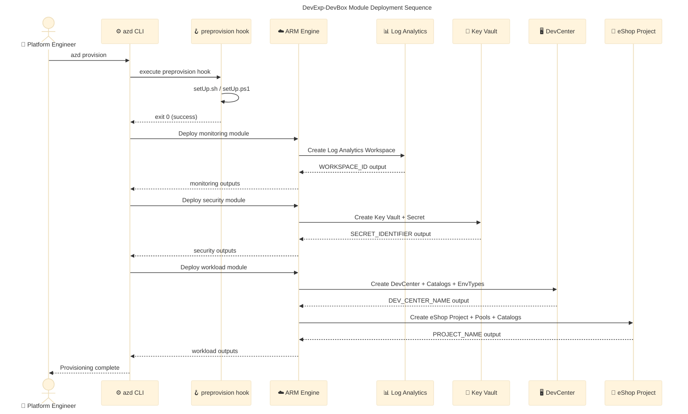
```mermaid
---
title: DevExp-DevBox Module Deployment Sequence
config:
  theme: base
  look: classic
  layout: dagre
  themeVariables:
    fontSize: '16px'
---
sequenceDiagram
    accTitle: DevExp-DevBox Module Deployment Sequence
    accDescr: Sequential deployment order from azd provision through monitoring, security, workload modules to Azure DevCenter provisioning

    actor eng as 👤 Platform Engineer
    participant azd as ⚙️ azd CLI
    participant hook as 🪝 preprovision hook
    participant arm as ☁️ ARM Engine
    participant la as 📊 Log Analytics
    participant kv as 🔑 Key Vault
    participant dc as 🖥️ DevCenter
    participant proj as 📁 eShop Project

    eng->>azd: azd provision
    azd->>hook: execute preprovision hook
    hook->>hook: setUp.sh / setUp.ps1
    hook-->>azd: exit 0 (success)
    azd->>arm: Deploy monitoring module
    arm->>la: Create Log Analytics Workspace
    la-->>arm: WORKSPACE_ID output
    arm-->>azd: monitoring outputs
    azd->>arm: Deploy security module
    arm->>kv: Create Key Vault + Secret
    kv-->>arm: SECRET_IDENTIFIER output
    arm-->>azd: security outputs
    azd->>arm: Deploy workload module
    arm->>dc: Create DevCenter + Catalogs + EnvTypes
    dc-->>arm: DEV_CENTER_NAME output
    arm->>proj: Create eShop Project + Pools + Catalogs
    proj-->>arm: PROJECT_NAME output
    arm-->>azd: workload outputs
    azd-->>eng: Provisioning complete
```

### ⚙️ Deployment State Machine

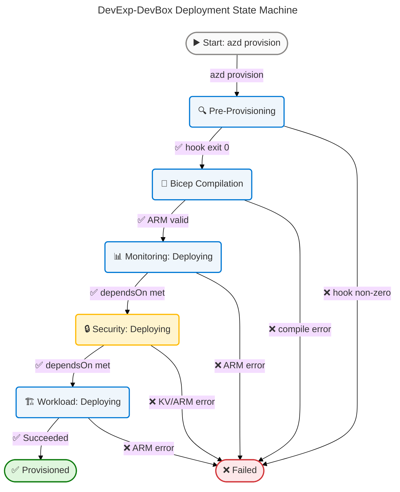
```mermaid
---
title: DevExp-DevBox Deployment State Machine
config:
  theme: base
  look: classic
  layout: dagre
  themeVariables:
    fontSize: '16px'
  flowchart:
    htmlLabels: true
---
flowchart TB
    accTitle: DevExp-DevBox Deployment State Machine
    accDescr: Deployment lifecycle state transitions from azd provision trigger through pre-provisioning, Bicep compilation, and module deployment states to the final Provisioned or Failed terminal states

    %% ═══════════════════════════════════════════════════════════════════════════
    %% AZURE / FLUENT ARCHITECTURE PATTERN v1.1
    %% (Semantic + Structural + Font + Accessibility Governance)
    %% ═══════════════════════════════════════════════════════════════════════════
    %% PHASE 1 - FLUENT UI: All styling uses approved Fluent UI palette only
    %% PHASE 2 - GROUPS: Every subgraph has semantic color via style directive
    %% PHASE 3 - COMPONENTS: Every node has semantic classDef + icon prefix
    %% PHASE 4 - ACCESSIBILITY: accTitle/accDescr present, WCAG AA contrast
    %% PHASE 5 - STANDARD: Governance block present, classDefs centralized
    %% ═══════════════════════════════════════════════════════════════════════════

    init(["▶️ Start: azd provision"]):::neutral
    precheck("🔍 Pre-Provisioning"):::core
    compile("📜 Bicep Compilation"):::core
    monDeploy("📊 Monitoring: Deploying"):::core
    secDeploy("🔒 Security: Deploying"):::warning
    wlDeploy("🏗️ Workload: Deploying"):::core
    done(["✅ Provisioned"]):::success
    fail(["❌ Failed"]):::danger

    init -->|"azd provision"| precheck
    precheck -->|"✅ hook exit 0"| compile
    precheck -->|"❌ hook non-zero"| fail
    compile -->|"✅ ARM valid"| monDeploy
    compile -->|"❌ compile error"| fail
    monDeploy -->|"✅ dependsOn met"| secDeploy
    monDeploy -->|"❌ ARM error"| fail
    secDeploy -->|"✅ dependsOn met"| wlDeploy
    secDeploy -->|"❌ KV/ARM error"| fail
    wlDeploy -->|"✅ Succeeded"| done
    wlDeploy -->|"❌ ARM error"| fail

    classDef neutral fill:#FAFAFA,stroke:#8A8886,stroke-width:2px,color:#323130
    classDef core fill:#EFF6FC,stroke:#0078D4,stroke-width:2px,color:#323130
    classDef warning fill:#FFF4CE,stroke:#FFB900,stroke-width:2px,color:#323130
    classDef success fill:#DFF6DD,stroke:#107C10,stroke-width:2px,color:#323130
    classDef danger fill:#FDE7E9,stroke:#D13438,stroke-width:2px,color:#323130
```

---

### ⚡ 5.5 Application Functions

#### ⚙️ 5.5.1 Platform Provisioning Function

| 🏷️ Attribute       | 💡 Value                       |
| ------------------ | ------------------------------ |
| **Component Name** | Platform Provisioning Function |
| **Service Type**   | Provisioning Service           |
| **Source**         | infra/main.bicep:\*            |

**Description:** End-to-end function responsible for resource group creation,
infrastructure patching, and DevCenter provisioning. Triggered via
`azd provision`. Consumes `azureResources.yaml` to determine landing zone
topology. Uses conditional module instantiation
(`if (landingZones.workload.create)`) to support create-or-reuse workflows.

**Business Logic Specifications:**

- Evaluates `landingZones.security.create` and `landingZones.monitoring.create`
  flags
- Computes effective resource group names using `createResourceGroupName`
  variable map
- Applies `union()` tag merging for consistent resource tagging across all
  resource groups
- Enforces `dependsOn` chains to prevent out-of-order deployment

**Authorization Rules:** Requires Contributor and User Access Administrator at
subscription scope (assigned to DevCenter managed identity per
`devcenter.yaml:35-40`).

---

#### 🔐 5.5.2 Secret Management Function

| 🏷️ Attribute       | 💡 Value                     |
| ------------------ | ---------------------------- |
| **Component Name** | Secret Management Function   |
| **Service Type**   | Security Function            |
| **Source**         | src/security/secret.bicep:\* |

**Description:** Manages the lifecycle of the GitHub Actions token secret
required for DevCenter catalog synchronization. Creates the secret in Key Vault
with `enabled: true` and `contentType: text/plain`. Attaches diagnostic settings
so all secret access operations are shipped to Log Analytics.

**Business Logic Specifications:**

- Uses `@secure()` parameter to prevent secret value appearing in ARM deployment
  history
- Outputs `secretUri` (not the secret value) for downstream modules to reference
- Diagnostic settings use `logAnalyticsDestinationType: 'AzureDiagnostics'` mode

**Authorization Rules:** Key Vault Secrets Officer role required on the Key
Vault resource group (assigned in `devcenter.yaml:42-45`).

---

### 💬 5.6 Application Interactions

#### ☁️ 5.6.1 ARM Deployment API Interaction

| 🏷️ Attribute       | 💡 Value                       |
| ------------------ | ------------------------------ |
| **Component Name** | ARM Deployment API Interaction |
| **Service Type**   | Request/Response               |
| **Source**         | infra/main.bicep:\*            |

**Protocol Details:**

| 📡 Protocol | 📌 Version | 📄 Format | 🔄 Retry Policy                             |
| ----------- | ---------- | --------- | ------------------------------------------- |
| HTTPS       | TLS 1.2+   | ARM JSON  | Azure SDK defaults (3 retries, exp backoff) |

**Message Format:** ARM deployment JSON compiled from Bicep source files

**Error Handling:** ARM deployment failures propagate as terminal errors to
`azd provision`. Partial deployments are marked `Failed` in ARM and can be
re-run idempotently.

---

#### 🔑 5.6.2 Key Vault Secret Reference Interaction

| 🏷️ Attribute       | 💡 Value                               |
| ------------------ | -------------------------------------- |
| **Component Name** | Key Vault Secret Reference Interaction |
| **Service Type**   | Request/Response                       |
| **Source**         | src/security/secret.bicep:19-28        |

**Protocol Details:**

| 📡 Protocol | 📌 Version | 📄 Format | 🔄 Retry Policy    |
| ----------- | ---------- | --------- | ------------------ |
| HTTPS       | TLS 1.2+   | JSON REST | Azure SDK defaults |

**Security:** Secret URI (not value) is passed as `secretIdentifier` parameter
to all downstream modules (`workload.bicep`, `devCenter.bicep`, `catalog.bicep`,
`projectCatalog.bicep`). Actual secret retrieval happens inside Azure DevCenter
service at runtime.

---

#### 📊 5.6.3 Log Analytics Diagnostic Ingestion

| 🏷️ Attribute       | 💡 Value                                |
| ------------------ | --------------------------------------- |
| **Component Name** | Log Analytics Diagnostic Ingestion      |
| **Service Type**   | Async Push                              |
| **Source**         | src/management/logAnalytics.bicep:45-80 |

**Protocol Details:**

| 📡 Protocol | 📌 Version | 📄 Format | 🔄 Pattern            |
| ----------- | ---------- | --------- | --------------------- |
| HTTPS       | TLS 1.2+   | JSON logs | Async fire-and-forget |

**Scope:** Diagnostic settings applied to Log Analytics Workspace, Key Vault
(via `secret.bicep`), and Virtual Networks (via `vnet.bicep`). All use
`categoryGroup: allLogs` and `AllMetrics`.

---

### 📣 5.7 Application Events

#### 🪩 5.7.1 AZD Preprovision Event

| 🏷️ Attribute       | 💡 Value               |
| ------------------ | ---------------------- |
| **Component Name** | AZD Preprovision Event |
| **Service Type**   | Lifecycle Hook         |
| **Source**         | azure.yaml:8-60        |

**Event Schema:**

| 🏷️ Field        | 💡 Value     | 📝 Description                             |
| --------------- | ------------ | ------------------------------------------ |
| hook type       | preprovision | Fires before Bicep deployment              |
| posix shell     | sh           | Bash script for Linux/macOS                |
| windows shell   | pwsh         | PowerShell for Windows                     |
| continueOnError | false        | Failure halts entire provisioning pipeline |
| interactive     | true         | Allows user prompts (auth flows)           |

**Subscription Patterns:** Implicitly subscribed by `azd provision` invocation.
No opt-out; the hook is mandatory.

**Dead Letter:** Not applicable — pipeline halts on failure via
`continueOnError: false`.

---

#### ✅ 5.7.2 ARM Deployment Completion Event

| 🏷️ Attribute       | 💡 Value                        |
| ------------------ | ------------------------------- |
| **Component Name** | ARM Deployment Completion Event |
| **Service Type**   | Platform Event                  |
| **Source**         | infra/main.bicep:100-160        |

**Event Schema:**

| 🏷️ Field       | 💡 Value               | 📝 Description                             |
| -------------- | ---------------------- | ------------------------------------------ |
| event type     | ARM deployment state   | ProvisioningState = Succeeded / Failed     |
| output payload | ARM deployment outputs | Key/value map of module outputs            |
| consumers      | azd CLI output store   | Writes outputs to `.azure/<env>/.env` file |

**Subscription Patterns:** ARM deployment outputs are passed to the next
`dependsOn` module and captured by `azd` for environment variable injection.

---

### 🗃️ 5.8 Application Data Objects

#### 🗃️ 5.8.1 LandingZone DTO

| 🏷️ Attribute       | 💡 Value                          |
| ------------------ | --------------------------------- |
| **Component Name** | LandingZone DTO                   |
| **Service Type**   | Data Transfer Object              |
| **Source**         | src/workload/workload.bicep:16-25 |

**Data Structure:**

```bicep
type LandingZone = {
  name: string
  create: bool
  tags: Tags
}
```

**Validation Rules:** `name` minLength enforced by ARM; `create` is a boolean
gate controlling conditional resource instantiation; `tags` propagated via
`union()` to all child resources.

---

#### 🗃️ 5.8.2 DevCenterConfig DTO

| 🏷️ Attribute       | 💡 Value                                |
| ------------------ | --------------------------------------- |
| **Component Name** | DevCenterConfig DTO                     |
| **Service Type**   | Data Transfer Object                    |
| **Source**         | src/workload/core/devCenter.bicep:30-60 |

**Data Structure:** Encodes DevCenter name, managed identity type, role
assignments (`devCenter[]` + `orgRoleTypes[]`), catalog sync status, network
hosting status, Azure Monitor agent status, and tags. Consumed by
`devCenter.bicep` from YAML via `loadYamlContent()`.

**Validation Rules:** `catalogItemSyncEnableStatus` and
`microsoftHostedNetworkEnableStatus` constrained to `'Enabled' | 'Disabled'`
union type.

---

#### 🗃️ 5.8.3 ProjectConfig DTO

| 🏷️ Attribute       | 💡 Value                                  |
| ------------------ | ----------------------------------------- |
| **Component Name** | ProjectConfig DTO                         |
| **Service Type**   | Data Transfer Object                      |
| **Source**         | src/workload/project/project.bicep:30-120 |

**Data Structure:** Encodes project name, description, identity (type +
roleAssignments), catalogs (environmentDefinition + imageDefinition types),
projectEnvironmentTypes (name + deploymentTargetId), projectPools (name +
imageDefinitionName + vmSku), projectNetwork (create flag, VNet type, address
prefixes, subnets), and tags.

**Validation Rules:** `ProjectNetwork.virtualNetworkType` constrained to
`'Managed' | 'Unmanaged'`. Pool `vmSku` validated at ARM level against available
Dev Box SKUs.

---

### 🔄 5.9 Integration Patterns

#### 🔄 5.9.1 Module Composition Pattern

| 🏷️ Attribute       | 💡 Value                   |
| ------------------ | -------------------------- |
| **Component Name** | Module Composition Pattern |
| **Service Type**   | Orchestration              |
| **Source**         | infra/main.bicep:100-160   |

**Pattern Type:** Service Orchestration

**Protocol:** Bicep `module` keyword → ARM deployment REST API

**Data Contract:** Typed Bicep parameters with `@description` decorators;
outputs as string/array

**Error Handling:** ARM deployment failure propagates up; no compensation logic
— Bicep deployments are idempotent and can be re-run from failure point.

---

#### 🔑 5.9.2 Key Vault Reference Injection Pattern

| 🏷️ Attribute       | 💡 Value                              |
| ------------------ | ------------------------------------- |
| **Component Name** | Key Vault Reference Injection Pattern |
| **Service Type**   | Secure Integration                    |
| **Source**         | src/security/secret.bicep:46-56       |

**Pattern Type:** Reference-based secret injection (never secret value)

**Protocol:** HTTPS / Key Vault REST API via `secretUri`

**Data Contract:**
`output AZURE_KEY_VAULT_SECRET_IDENTIFIER string = secret.properties.secretUri`

**Error Handling:** Key Vault access errors surface as ARM deployment failures.
RBAC misconfiguration on Key Vault will cause `catalog.bicep` sync to fail at
DevCenter runtime.

---

#### 🌿 5.9.3 Conditional Resource Creation Pattern

| 🏷️ Attribute       | 💡 Value                              |
| ------------------ | ------------------------------------- |
| **Component Name** | Conditional Resource Creation Pattern |
| **Service Type**   | Branching Pattern                     |
| **Source**         | src/security/security.bicep:16-28     |

**Pattern Type:** Create-or-reference (idempotent provisioning)

**Protocol:** Bicep `if()` conditional module + `existing` resource reference

**Data Contract:** Boolean `create` flag in YAML configuration drives branching

**Error Handling:** If `create = false` and referenced resource does not exist,
ARM returns `ResourceNotFound` — user must either set `create = true` or provide
a valid resource name.

---

### 📝 5.10 Service Contracts

#### 📤 5.10.1 Bicep Module Output Contract

| 🏷️ Attribute       | 💡 Value                     |
| ------------------ | ---------------------------- |
| **Component Name** | Bicep Module Output Contract |
| **Service Type**   | Module Interface             |
| **Source**         | infra/main.bicep:100-160     |

**Contract Definition:**

| 📤 Output Name                     | 🏷️ Type | 👥 Consumer                |
| ---------------------------------- | ------- | -------------------------- |
| AZURE_LOG_ANALYTICS_WORKSPACE_ID   | string  | security, workload modules |
| AZURE_KEY_VAULT_NAME               | string  | azd environment variables  |
| AZURE_KEY_VAULT_ENDPOINT           | string  | azd environment variables  |
| AZURE_KEY_VAULT_SECRET_IDENTIFIER  | string  | workload module            |
| AZURE_DEV_CENTER_NAME              | string  | azd environment variables  |
| AZURE_DEV_CENTER_PROJECTS          | array   | azd environment variables  |
| WORKLOAD_AZURE_RESOURCE_GROUP_NAME | string  | azd environment variables  |
| SECURITY_AZURE_RESOURCE_GROUP_NAME | string  | azd environment variables  |

**SLA:** Contract stability guaranteed within major Bicep API versions.
**Breaking Change Policy:** Output name changes are breaking — require consumer
updates.

---

#### 📋 5.10.2 YAML Configuration Schema Contract

| 🏷️ Attribute       | 💡 Value                                                          |
| ------------------ | ----------------------------------------------------------------- |
| **Component Name** | YAML Configuration Schema Contract                                |
| **Service Type**   | Schema Contract                                                   |
| **Source**         | infra/settings/resourceOrganization/azureResources.schema.json:\* |

**Contract Definition:** Three JSON Schema files provide formal validation
contracts: `azureResources.schema.json`, `devcenter.schema.json`,
`security.schema.json`. Each YAML file references its schema via
`# yaml-language-server: $schema=./...` pragma, enabling IDE validation at
authoring time.

**Breaking Change Policy:** Removing required fields or changing field types is
a breaking change. Additive fields with defaults are backward-compatible.

---

#### 📝 5.10.3 Bicep Typed Parameter Contract

| 🏷️ Attribute       | 💡 Value                                 |
| ------------------ | ---------------------------------------- |
| **Component Name** | Bicep Typed Parameter Contract           |
| **Service Type**   | API Contract                             |
| **Source**         | src/workload/core/devCenter.bicep:30-120 |

**Contract Definition:** All Bicep modules use user-defined types
(`type DevCenterConfig = {...}`, `type Tags = { *: string }`,
`type Status = 'Enabled' | 'Disabled'`) to formally constrain parameter shapes.
`@description` decorators document expected values. `@secure()` decorator marks
sensitive parameters.

**Breaking Change Policy:** Removing or renaming type properties is breaking.
Adding optional properties with `?` suffix is backward-compatible.

### 🔌 API Contract Diagram

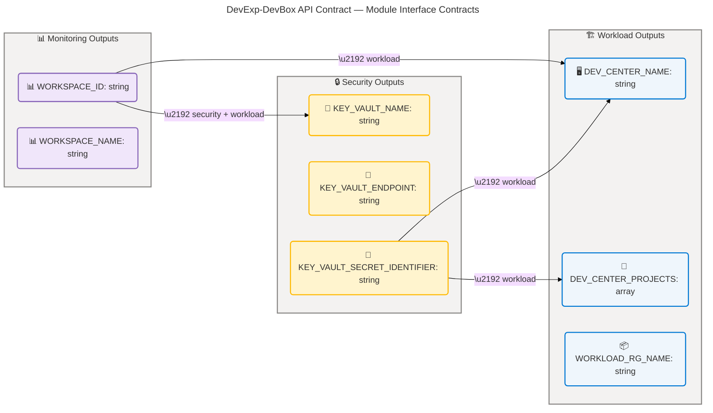
```mermaid
---
title: DevExp-DevBox API Contract — Module Interface Contracts
config:
  theme: base
  look: classic
  layout: dagre
  themeVariables:
    fontSize: '16px'
  flowchart:
    htmlLabels: true
---
flowchart LR
    accTitle: DevExp-DevBox API Contract — Module Interface Contracts
    accDescr: Shows the typed Bicep output contracts flowing between modules — each module exposes named string and array outputs consumed by downstream modules as formally typed parameters

    %% ═══════════════════════════════════════════════════════════════════════════
    %% AZURE / FLUENT ARCHITECTURE PATTERN v1.1
    %% (Semantic + Structural + Font + Accessibility Governance)
    %% ═══════════════════════════════════════════════════════════════════════════
    %% PHASE 1 - FLUENT UI: All styling uses approved Fluent UI palette only
    %% PHASE 2 - GROUPS: Every subgraph has semantic color via style directive
    %% PHASE 3 - COMPONENTS: Every node has semantic classDef + icon prefix
    %% PHASE 4 - ACCESSIBILITY: accTitle/accDescr present, WCAG AA contrast
    %% PHASE 5 - STANDARD: Governance block present, classDefs centralized
    %% ═══════════════════════════════════════════════════════════════════════════

    subgraph monContract["📊 Monitoring Outputs"]
        laId("📊 WORKSPACE_ID: string"):::data
        laName("📊 WORKSPACE_NAME: string"):::data
    end

    subgraph secContract["🔒 Security Outputs"]
        kvName("🔑 KEY_VAULT_NAME: string"):::warning
        kvEndpoint("🔑 KEY_VAULT_ENDPOINT: string"):::warning
        kvSecId("📜 KEY_VAULT_SECRET_IDENTIFIER: string"):::warning
    end

    subgraph wlContract["🏗️ Workload Outputs"]
        dcName("🖥️ DEV_CENTER_NAME: string"):::core
        dcProjects("📁 DEV_CENTER_PROJECTS: array"):::core
        wlRgName("📦 WORKLOAD_RG_NAME: string"):::core
    end

    laId -->|"\u2192 security + workload"| kvName
    laId -->|"\u2192 workload"| dcName
    kvSecId -->|"\u2192 workload"| dcName
    kvSecId -->|"\u2192 workload"| dcProjects

    style monContract fill:#F3F2F1,stroke:#8A8886,stroke-width:2px,color:#323130
    style secContract fill:#F3F2F1,stroke:#8A8886,stroke-width:2px,color:#323130
    style wlContract fill:#F3F2F1,stroke:#8A8886,stroke-width:2px,color:#323130

    classDef neutral fill:#FAFAFA,stroke:#8A8886,stroke-width:2px,color:#323130
    classDef core fill:#EFF6FC,stroke:#0078D4,stroke-width:2px,color:#323130
    classDef warning fill:#FFF4CE,stroke:#FFB900,stroke-width:2px,color:#323130
    classDef data fill:#F0E6FA,stroke:#8764B8,stroke-width:2px,color:#323130
```

---

### 📦 5.11 Application Dependencies

#### ⚙️ 5.11.1 Azure Developer CLI (azd)

| 🏷️ Attribute       | 💡 Value                       |
| ------------------ | ------------------------------ |
| **Component Name** | Azure Developer CLI dependency |
| **Service Type**   | CLI Framework                  |
| **Source**         | azure.yaml:1-\*                |

**Version:** Not pinned in source — resolves to latest installed version
**Purpose:** Orchestrates lifecycle: provision, deploy, down, monitor **Upgrade
Policy:** Should be pinned to a specific version in CI/CD pipelines for
reproducibility

---

#### ⚡ 5.11.2 Bicep Language / ARM Engine

| 🏷️ Attribute       | 💡 Value                               |
| ------------------ | -------------------------------------- |
| **Component Name** | Bicep Language / ARM Engine dependency |
| **Service Type**   | Platform Runtime                       |
| **Source**         | infra/main.bicep:1-\*                  |

**Version:** API versions pinned per resource: e.g.,
`Microsoft.Resources/resourceGroups@2025-04-01` **Purpose:** IaC compilation and
Azure deployment **Upgrade Policy:** API version upgrades are explicit code
changes reviewed via PR

---

#### 🖥️ 5.11.3 Azure DevCenter Service

| 🏷️ Attribute       | 💡 Value                             |
| ------------------ | ------------------------------------ |
| **Component Name** | Azure DevCenter Service dependency   |
| **Service Type**   | Platform Service                     |
| **Source**         | src/workload/core/devCenter.bicep:\* |

**Version:** `Microsoft.DevCenter/devcenters@2025-02-01` **Purpose:** Hosts Dev
Box pools, catalogs, environment types, and project management **Upgrade
Policy:** API version is a code change; test in non-production before upgrading

---

#### 🔑 5.11.4 Azure Key Vault Service

| 🏷️ Attribute       | 💡 Value                           |
| ------------------ | ---------------------------------- |
| **Component Name** | Azure Key Vault Service dependency |
| **Service Type**   | Platform Service                   |
| **Source**         | src/security/keyVault.bicep:\*     |

**Version:** `Microsoft.KeyVault/vaults@2025-05-01` **Purpose:** Stores GitHub
Actions token used for private catalog authentication **Upgrade Policy:** API
version is a code change; RBAC model changes require role assignment review

---

#### 📊 5.11.5 Log Analytics Workspace Service

| 🏷️ Attribute       | 💡 Value                                   |
| ------------------ | ------------------------------------------ |
| **Component Name** | Log Analytics Workspace Service dependency |
| **Service Type**   | Platform Service                           |
| **Source**         | src/management/logAnalytics.bicep:\*       |

**Version:** `Microsoft.OperationalInsights/workspaces@2025-07-01` **Purpose:**
Centralized diagnostics and log aggregation for all provisioned resources
**Upgrade Policy:** API version is a code change; SKU changes require workspace
migration

---

#### 📚 5.11.6 Hugo Extended

| 🏷️ Attribute       | 💡 Value                 |
| ------------------ | ------------------------ |
| **Component Name** | Hugo Extended dependency |
| **Service Type**   | Build Tool               |
| **Source**         | package.json:12-14       |

**Version:** `hugo-extended@0.136.2` (pinned) **Purpose:** Builds documentation
site from Markdown source files using Docsy theme **Upgrade Policy:** Pinned
version; update via `npm run update:hugo` script defined in `package.json`

---

## 🔗 8. Dependencies & Integration

### 🔗 Overview

This section documents all integration relationships between application layer
components, platform services, and external systems. Every dependency referenced
in Section 5 appears in the tables below. The integration architecture follows a
unidirectional, output-wired dependency model where each module consumes outputs
from its upstream modules and produces outputs for downstream consumers — there
are no circular dependencies.

### 📊 Service-to-Service Call Graph


```mermaid
---
title: DevExp-DevBox Service-to-Service Integration Call Graph
config:
  theme: base
  look: classic
  layout: dagre
  themeVariables:
    fontSize: '16px'
  flowchart:
    htmlLabels: true
---
flowchart LR
    accTitle: DevExp-DevBox Service-to-Service Integration Call Graph
    accDescr: Shows the parameter and output wiring between all Bicep modules in the DevExp-DevBox deployment pipeline

    %% ═══════════════════════════════════════════════════════════════════════════
    %% AZURE / FLUENT ARCHITECTURE PATTERN v1.1
    %% (Semantic + Structural + Font + Accessibility Governance)
    %% ═══════════════════════════════════════════════════════════════════════════
    %% PHASE 1 - FLUENT UI: All styling uses approved Fluent UI palette only
    %% PHASE 2 - GROUPS: Every subgraph has semantic color via style directive
    %% PHASE 3 - COMPONENTS: Every node has semantic classDef + icon prefix
    %% PHASE 4 - ACCESSIBILITY: accTitle/accDescr present, WCAG AA contrast
    %% PHASE 5 - STANDARD: Governance block present, classDefs centralized
    %% ═══════════════════════════════════════════════════════════════════════════

    subgraph entry["🚀 Entry Point"]
        azd("⚙️ azd provision"):::core
        hook("🪝 preprovision hook"):::core
    end

    subgraph monitoring["📊 Monitoring"]
        la("📊 Log Analytics"):::data
    end

    subgraph security["🔒 Security"]
        kv("🔑 Key Vault"):::warning
        sec("📜 Secret"):::warning
    end

    subgraph workload["🏗️ Workload"]
        dc("🖥️ DevCenter"):::core
        cat("📚 Catalog"):::neutral
        et("🌍 EnvTypes"):::neutral
        proj("📁 eShop Project"):::core
        pool("💻 Dev Pools"):::success
        conn("🔌 Connectivity"):::neutral
    end

    azd --> hook
    hook --> la
    la -->|"WORKSPACE_ID"| kv
    la -->|"WORKSPACE_ID"| dc
    kv --> sec
    sec -->|"SECRET_IDENTIFIER"| dc
    sec -->|"SECRET_IDENTIFIER"| proj
    dc --> cat
    dc --> et
    dc --> proj
    proj --> pool
    proj --> conn

    style entry fill:#F3F2F1,stroke:#8A8886,stroke-width:2px,color:#323130
    style monitoring fill:#F3F2F1,stroke:#8A8886,stroke-width:2px,color:#323130
    style security fill:#F3F2F1,stroke:#8A8886,stroke-width:2px,color:#323130
    style workload fill:#F3F2F1,stroke:#8A8886,stroke-width:2px,color:#323130

    classDef neutral fill:#FAFAFA,stroke:#8A8886,stroke-width:2px,color:#323130
    classDef core fill:#EFF6FC,stroke:#0078D4,stroke-width:2px,color:#323130
    classDef warning fill:#FFF4CE,stroke:#FFB900,stroke-width:2px,color:#323130
    classDef data fill:#F0E6FA,stroke:#8764B8,stroke-width:2px,color:#323130
    classDef success fill:#DFF6DD,stroke:#107C10,stroke-width:2px,color:#323130
```

### 🔗 Service-to-Service Dependency Table

| 🔵 Caller Module | 🎯 Called Module / Service             | 📡 Protocol | 📦 Data Passed                                  | ➡️ Direction |
| ---------------- | -------------------------------------- | ----------- | ----------------------------------------------- | ------------ |
| infra/main.bicep | src/management/logAnalytics.bicep      | ARM         | `name` param                                    | Downstream   |
| infra/main.bicep | src/security/security.bicep            | ARM         | `secretValue`, `logAnalyticsId`                 | Downstream   |
| infra/main.bicep | src/workload/workload.bicep            | ARM         | `logAnalyticsId`, `secretIdentifier`            | Downstream   |
| security.bicep   | keyVault.bicep                         | ARM         | `keyvaultSettings`, `tags`                      | Downstream   |
| security.bicep   | secret.bicep                           | ARM         | `keyVaultName`, `secretValue`, `logAnalyticsId` | Downstream   |
| workload.bicep   | core/devCenter.bicep                   | ARM         | Full `devCenterSettings` config                 | Downstream   |
| workload.bicep   | project/project.bicep                  | ARM         | Per-project config from YAML                    | Downstream   |
| project.bicep    | connectivity.bicep                     | ARM         | `projectNetwork`, `logAnalyticsId`              | Downstream   |
| project.bicep    | projectCatalog.bicep                   | ARM         | `catalogConfig`, `secretIdentifier`             | Downstream   |
| project.bicep    | projectEnvironmentType.bicep           | ARM         | `environmentConfig`                             | Downstream   |
| project.bicep    | projectPool.bicep                      | ARM         | Pool config + catalogs                          | Downstream   |
| devCenter.bicep  | identity/devCenterRoleAssignment.bicep | ARM         | `id`, `principalId`, `scope`                    | Downstream   |
| devCenter.bicep  | identity/orgRoleAssignment.bicep       | ARM         | `principalId`, `roles[]`                        | Downstream   |
| devCenter.bicep  | core/catalog.bicep                     | ARM         | `catalogConfig`, `secretIdentifier`             | Downstream   |
| devCenter.bicep  | core/environmentType.bicep             | ARM         | `environmentConfig`                             | Downstream   |

### 🌐 External API Dependency Table

| ☁️ Service               | 📌 API Version            | 🔧 Usage                                             | 🔐 Auth Model                 |
| ------------------------ | ------------------------- | ---------------------------------------------------- | ----------------------------- |
| Azure Resource Manager   | 2025-xx-xx (per resource) | All resource creation/updates                        | Managed Identity / SPN        |
| Azure Key Vault          | 2025-05-01                | Secret storage and URI retrieval                     | RBAC (Key Vault Secrets User) |
| Log Analytics Workspace  | 2025-07-01                | Diagnostic log ingestion                             | Resource-scoped RBAC          |
| Azure DevCenter          | 2025-02-01                | DevCenter / Project / Pool management                | System Assigned Identity      |
| Azure DevCenter Catalogs | 2025-02-01 (implicit)     | GitHub catalog sync (scheduled)                      | Key Vault Secret reference    |
| GitHub (catalog source)  | N/A                       | `https://github.com/microsoft/devcenter-catalog.git` | gha-token (Key Vault)         |
| GitHub (eShop catalogs)  | N/A                       | `https://github.com/Evilazaro/eShop.git`             | gha-token (Key Vault)         |

### 📣 Event Subscription Map

| 📣 Event                    | 📢 Publisher      | 👥 Subscriber(s)                 | ⚡ Trigger                     |
| --------------------------- | ----------------- | -------------------------------- | ------------------------------ |
| azd provision invoked       | Platform Engineer | AZD preprovision hook            | Manual / CI pipeline trigger   |
| preprovision hook complete  | AZD hook runtime  | Bicep compiler / ARM Engine      | Hook exit code 0               |
| monitoring module complete  | ARM Engine        | security module, workload module | ARM dependsOn satisfaction     |
| security module complete    | ARM Engine        | workload module                  | ARM dependsOn satisfaction     |
| workload module complete    | ARM Engine        | azd output store                 | ARM deployment Succeeded state |
| DevCenter catalog scheduled | Azure DevCenter   | GitHub repository                | Scheduled sync cadence         |

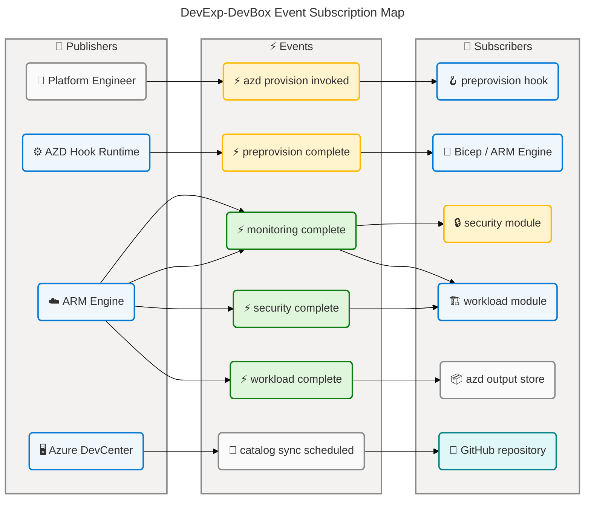
```mermaid
---
title: DevExp-DevBox Event Subscription Map
config:
  theme: base
  look: classic
  layout: dagre
  themeVariables:
    fontSize: '16px'
  flowchart:
    htmlLabels: true
---
flowchart LR
    accTitle: DevExp-DevBox Event Subscription Map
    accDescr: Shows all deployment lifecycle events from azd provision trigger through ARM module completion to GitHub catalog sync, mapping each event publisher to its subscribers

    %% ═══════════════════════════════════════════════════════════════════════════
    %% AZURE / FLUENT ARCHITECTURE PATTERN v1.1
    %% (Semantic + Structural + Font + Accessibility Governance)
    %% ═══════════════════════════════════════════════════════════════════════════
    %% PHASE 1 - FLUENT UI: All styling uses approved Fluent UI palette only
    %% PHASE 2 - GROUPS: Every subgraph has semantic color via style directive
    %% PHASE 3 - COMPONENTS: Every node has semantic classDef + icon prefix
    %% PHASE 4 - ACCESSIBILITY: accTitle/accDescr present, WCAG AA contrast
    %% PHASE 5 - STANDARD: Governance block present, classDefs centralized
    %% ═══════════════════════════════════════════════════════════════════════════

    subgraph publishers["📢 Publishers"]
        eng("👤 Platform Engineer"):::neutral
        azdRT("⚙️ AZD Hook Runtime"):::core
        arm("☁️ ARM Engine"):::core
        dc("🖥️ Azure DevCenter"):::core
    end

    subgraph events["⚡ Events"]
        evt1("⚡ azd provision invoked"):::warning
        evt2("⚡ preprovision complete"):::warning
        evt3("⚡ monitoring complete"):::success
        evt4("⚡ security complete"):::success
        evt5("⚡ workload complete"):::success
        evt6("📣 catalog sync scheduled"):::neutral
    end

    subgraph subscribers["👥 Subscribers"]
        hook("🪝 preprovision hook"):::core
        bicep("📜 Bicep / ARM Engine"):::core
        secMod("🔒 security module"):::warning
        wlMod("🏗️ workload module"):::core
        azdOut("📦 azd output store"):::neutral
        ghRepo("🐙 GitHub repository"):::external
    end

    eng --> evt1 --> hook
    azdRT --> evt2 --> bicep
    arm --> evt3 --> secMod
    arm --> evt3 --> wlMod
    arm --> evt4 --> wlMod
    arm --> evt5 --> azdOut
    dc --> evt6 --> ghRepo

    style publishers fill:#F3F2F1,stroke:#8A8886,stroke-width:2px,color:#323130
    style events fill:#F3F2F1,stroke:#8A8886,stroke-width:2px,color:#323130
    style subscribers fill:#F3F2F1,stroke:#8A8886,stroke-width:2px,color:#323130

    classDef neutral fill:#FAFAFA,stroke:#8A8886,stroke-width:2px,color:#323130
    classDef core fill:#EFF6FC,stroke:#0078D4,stroke-width:2px,color:#323130
    classDef warning fill:#FFF4CE,stroke:#FFB900,stroke-width:2px,color:#323130
    classDef success fill:#DFF6DD,stroke:#107C10,stroke-width:2px,color:#323130
    classDef external fill:#E0F7F7,stroke:#038387,stroke-width:2px,color:#323130
```

### 🔄 Integration Pattern Matrix

| 🔄 Pattern                    | 🧩 Modules Using It                            | 📡 Protocol | ⚠️ Error Handling                       |
| ----------------------------- | ---------------------------------------------- | ----------- | --------------------------------------- |
| Module Composition            | All modules via `module` keyword               | ARM REST    | Idempotent re-run on failure            |
| Key Vault Reference Injection | workload, devCenter, project, catalog modules  | HTTPS       | ARM failure if KV RBAC misconfigured    |
| Conditional Create-or-Reuse   | security, connectivity, resource group modules | ARM         | ResourceNotFound if ref resource absent |
| YAML Config Injection         | workload, security, main (all loadYamlContent) | YAML/Bicep  | Schema validation error at compile time |
| Diagnostic Settings Push      | logAnalytics, secret, vnet modules             | HTTPS       | Async; non-blocking to main deployment  |

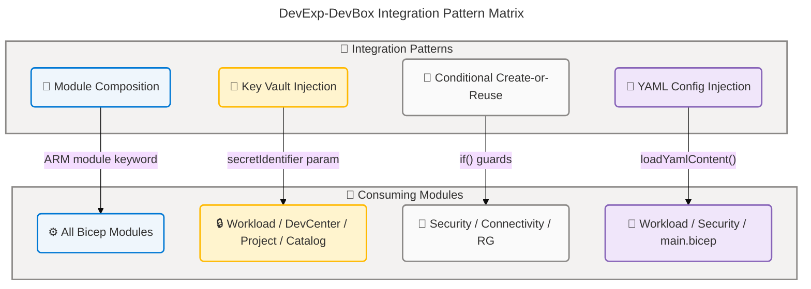
```mermaid
---
title: DevExp-DevBox Integration Pattern Matrix
config:
  theme: base
  look: classic
  layout: dagre
  themeVariables:
    fontSize: '16px'
  flowchart:
    htmlLabels: true
---
flowchart TB
    accTitle: DevExp-DevBox Integration Pattern Matrix
    accDescr: Visual matrix mapping the four integration patterns to their consuming modules — Module Composition for all modules, Key Vault Injection for secure consumers, Conditional Create-or-Reuse for optional resources, and YAML Config Injection for configuration consumers

    %% ═══════════════════════════════════════════════════════════════════════════
    %% AZURE / FLUENT ARCHITECTURE PATTERN v1.1
    %% (Semantic + Structural + Font + Accessibility Governance)
    %% ═══════════════════════════════════════════════════════════════════════════
    %% PHASE 1 - FLUENT UI: All styling uses approved Fluent UI palette only
    %% PHASE 2 - GROUPS: Every subgraph has semantic color via style directive
    %% PHASE 3 - COMPONENTS: Every node has semantic classDef + icon prefix
    %% PHASE 4 - ACCESSIBILITY: accTitle/accDescr present, WCAG AA contrast
    %% PHASE 5 - STANDARD: Governance block present, classDefs centralized
    %% ═══════════════════════════════════════════════════════════════════════════

    subgraph patterns["🔄 Integration Patterns"]
        compose("🔄 Module Composition"):::core
        kvInject("🔑 Key Vault Injection"):::warning
        condCreate("🔀 Conditional Create-or-Reuse"):::neutral
        yamlInject("📄 YAML Config Injection"):::data
    end

    subgraph consumers["🧩 Consuming Modules"]
        allMods("⚙️ All Bicep Modules"):::core
        wlDcProjCat("🔒 Workload / DevCenter / Project / Catalog"):::warning
        secConnRG("🔌 Security / Connectivity / RG"):::neutral
        wlSecMain("📄 Workload / Security / main.bicep"):::data
    end

    compose -->|"ARM module keyword"| allMods
    kvInject -->|"secretIdentifier param"| wlDcProjCat
    condCreate -->|"if() guards"| secConnRG
    yamlInject -->|"loadYamlContent()"| wlSecMain

    style patterns fill:#F3F2F1,stroke:#8A8886,stroke-width:2px,color:#323130
    style consumers fill:#F3F2F1,stroke:#8A8886,stroke-width:2px,color:#323130

    classDef neutral fill:#FAFAFA,stroke:#8A8886,stroke-width:2px,color:#323130
    classDef core fill:#EFF6FC,stroke:#0078D4,stroke-width:2px,color:#323130
    classDef warning fill:#FFF4CE,stroke:#FFB900,stroke-width:2px,color:#323130
    classDef data fill:#F0E6FA,stroke:#8764B8,stroke-width:2px,color:#323130
```

### 🌊 Data Flow Diagram

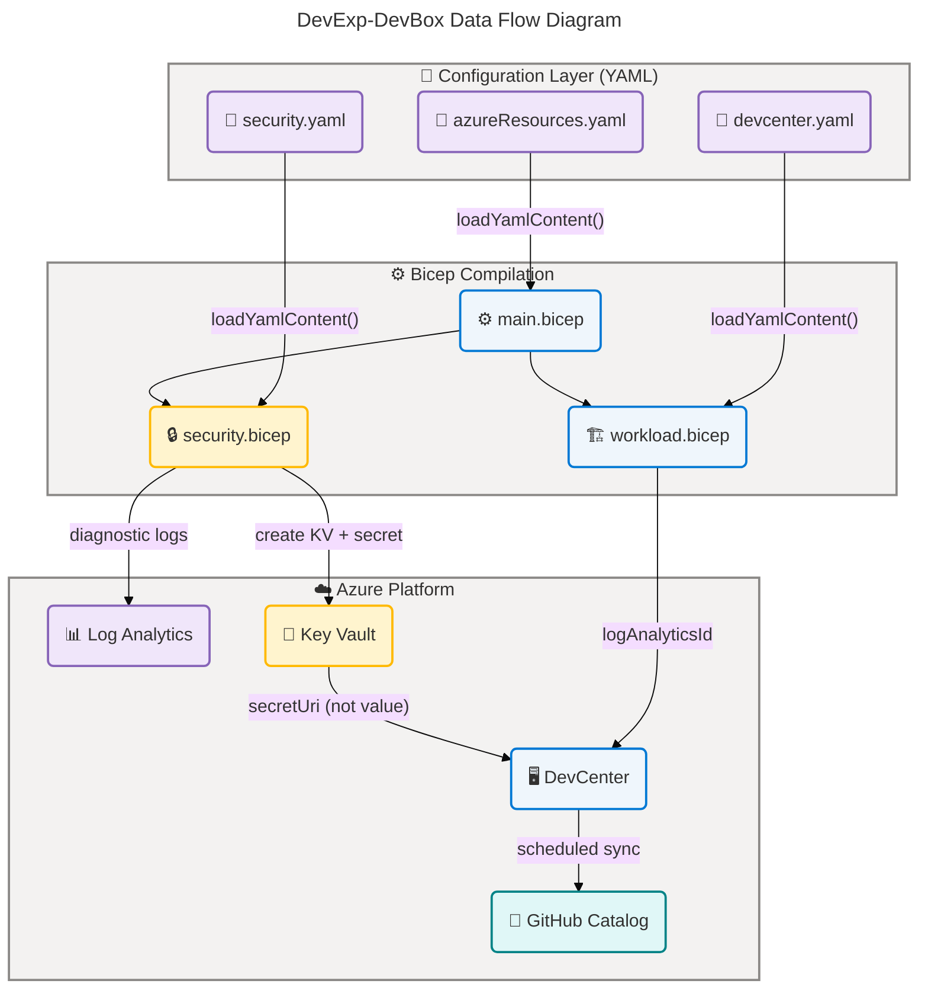
```mermaid
---
title: DevExp-DevBox Data Flow Diagram
config:
  theme: base
  look: classic
  layout: dagre
  themeVariables:
    fontSize: '16px'
  flowchart:
    htmlLabels: true
---
flowchart TB
    accTitle: DevExp-DevBox Data Flow Diagram
    accDescr: Shows how configuration data from YAML files flows through Bicep modules to Azure platform services and how secrets are managed via Key Vault

    %% ═══════════════════════════════════════════════════════════════════════════
    %% AZURE / FLUENT ARCHITECTURE PATTERN v1.1
    %% (Semantic + Structural + Font + Accessibility Governance)
    %% ═══════════════════════════════════════════════════════════════════════════
    %% PHASE 1 - FLUENT UI: All styling uses approved Fluent UI palette only
    %% PHASE 2 - GROUPS: Every subgraph has semantic color via style directive
    %% PHASE 3 - COMPONENTS: Every node has semantic classDef + icon prefix
    %% PHASE 4 - ACCESSIBILITY: accTitle/accDescr present, WCAG AA contrast
    %% PHASE 5 - STANDARD: Governance block present, classDefs centralized
    %% ═══════════════════════════════════════════════════════════════════════════

    subgraph config["📄 Configuration Layer (YAML)"]
        yamlRes("📄 azureResources.yaml"):::data
        yamlDC("📄 devcenter.yaml"):::data
        yamlSec("📄 security.yaml"):::data
    end

    subgraph bicep["⚙️ Bicep Compilation"]
        main("⚙️ main.bicep"):::core
        secMod("🔒 security.bicep"):::warning
        wlMod("🏗️ workload.bicep"):::core
    end

    subgraph azure["☁️ Azure Platform"]
        la("📊 Log Analytics"):::data
        kv("🔑 Key Vault"):::warning
        dc("🖥️ DevCenter"):::core
        gh("🐙 GitHub Catalog"):::external
    end

    yamlRes -->|"loadYamlContent()"| main
    yamlSec -->|"loadYamlContent()"| secMod
    yamlDC  -->|"loadYamlContent()"| wlMod
    main --> secMod
    main --> wlMod
    secMod -->|"create KV + secret"| kv
    secMod -->|"diagnostic logs"| la
    wlMod  -->|"logAnalyticsId"| dc
    kv     -->|"secretUri (not value)"| dc
    dc     -->|"scheduled sync"| gh

    style config fill:#F3F2F1,stroke:#8A8886,stroke-width:2px,color:#323130
    style bicep fill:#F3F2F1,stroke:#8A8886,stroke-width:2px,color:#323130
    style azure fill:#F3F2F1,stroke:#8A8886,stroke-width:2px,color:#323130

    classDef neutral fill:#FAFAFA,stroke:#8A8886,stroke-width:2px,color:#323130
    classDef core fill:#EFF6FC,stroke:#0078D4,stroke-width:2px,color:#323130
    classDef warning fill:#FFF4CE,stroke:#FFB900,stroke-width:2px,color:#323130
    classDef data fill:#F0E6FA,stroke:#8764B8,stroke-width:2px,color:#323130
    classDef external fill:#E0F7F7,stroke:#038387,stroke-width:2px,color:#323130
```

### 🔗 Summary

The DevExp-DevBox integration architecture is a tightly coupled, unidirectional
dependency pipeline with no circular dependencies and no message broker
intermediary. All cross-module communication is achieved through ARM module
output wiring and YAML configuration injection. The sole external integration
point is the GitHub repository referenced in DevCenter catalogs, secured through
Key Vault secret reference injection.

The integration model is well-suited to the platform's IaC-first approach: all
integration contracts are type-safe (Bicep user-defined types), all secrets are
protected via Key Vault reference pattern (never plaintext), and all
dependencies are explicitly declared via `dependsOn` arrays ensuring
deterministic deployment ordering. The main integration risk is the single Key
Vault Secret as the sole authentication mechanism for all catalog sources — a
rotation or expiry of this secret would halt all catalog synchronization across
all projects.
