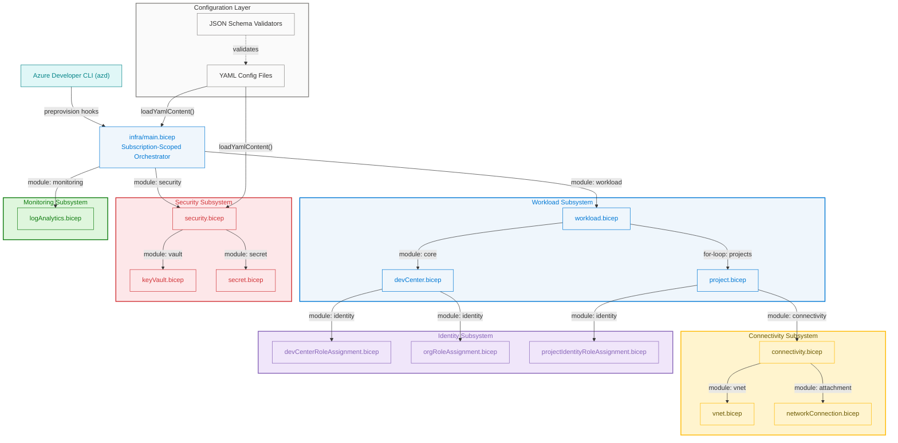
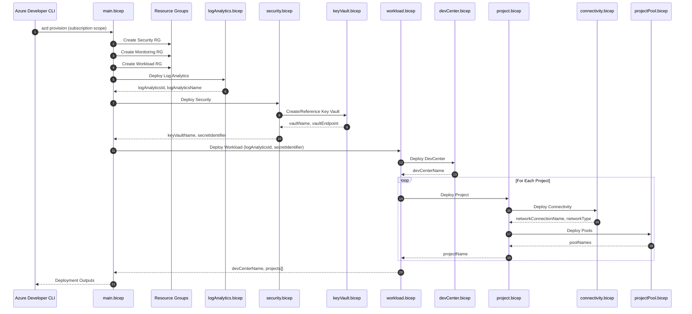
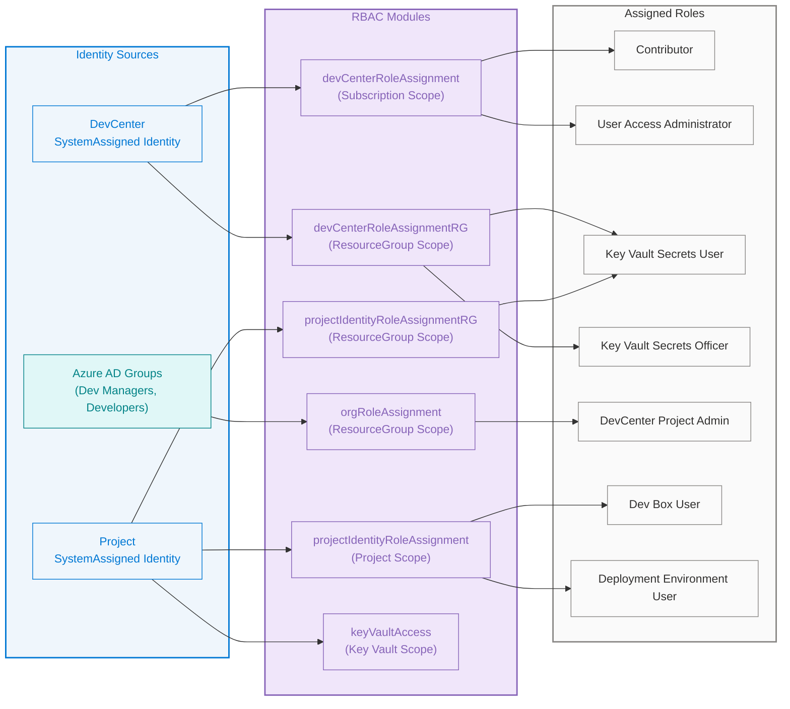

# Application Architecture — Microsoft Dev Box Platform Engineering Accelerator

> **TOGAF 10 — Application Architecture Layer**
> Generated from workspace analysis of `z:\platengineering`
> Quality Level: comprehensive | Sections: [1, 2, 3, 4, 5, 8]

---

## Section 1: Architecture Overview

### 1.1 Purpose

This document defines the **Application Architecture** for the Microsoft Dev Box Platform Engineering Accelerator — a Bicep-based Infrastructure-as-Code (IaC) platform that provisions and governs Azure Dev Center, Dev Box, and Deployment Environment resources at enterprise scale. It follows the **TOGAF 10 Application Architecture** domain, classifying every component against the 11 canonical TOGAF component types.

### 1.2 Scope

The architecture covers the complete application surface within the `src/`, `infra/`, and `infra/settings/` directory trees. The system orchestrates:

- **Dev Center lifecycle management** — central DevCenter resource with identity, diagnostics, catalogs, environment types, and RBAC
- **Project provisioning** — per-team projects with dedicated networking, catalogs, pools, environment types, and role assignments
- **Security subsystem** — Key Vault secrets management with RBAC authorization
- **Monitoring subsystem** — centralized Log Analytics with diagnostic forwarding
- **Connectivity subsystem** — VNet provisioning, network connections, and DevCenter attachments
- **Identity subsystem** — multi-scope Azure RBAC assignments (subscription, resource group, project)

### 1.3 Architecture Principles

| Principle | Description | Source |
|---|---|---|
| Configuration-as-Code | All resource properties are driven by YAML configuration files validated against JSON Schemas | infra/settings/workload/devcenter.yaml:1-10 |
| Landing Zone Segmentation | Resources are organized into Security, Monitoring, and Workload resource groups following Azure Landing Zone patterns | infra/settings/resourceOrganization/azureResources.yaml:17-62 |
| Least-Privilege RBAC | Role assignments use scoped, principal-type-aware grants at subscription, resource group, or project level | src/identity/devCenterRoleAssignment.bicep:1-46 |
| Idempotent Deployment | Modules support create-or-reference patterns for Key Vaults and VNets enabling safe re-deployments | src/security/security.bicep:1-55 |
| Centralized Observability | All resources forward diagnostic logs and metrics to a shared Log Analytics workspace | src/management/logAnalytics.bicep:1-95 |

### 1.4 Key Stakeholders

| Role | Responsibility |
|---|---|
| Platform Engineering Team | Owns Dev Center configuration, catalogs, and environment type definitions |
| Dev Managers | Manage Dev Box deployments and project-level settings (DevCenter Project Admin role) |
| eShop Developers | Consume Dev Box pools and Deployment Environments (Dev Box User, Deployment Environment User roles) |
| Security Team | Governs Key Vault policies, RBAC assignments, and network security |

### 1.5 Technology Stack

| Technology | Purpose | Version |
|---|---|---|
| Azure Bicep | Infrastructure-as-Code language | Bicep CLI (latest) |
| Azure Developer CLI (azd) | Deployment orchestration | Schema v1.0 |
| Azure Dev Center | Centralized developer platform | API 2026-01-01-preview |
| Azure Dev Box | Developer workstation provisioning | API 2026-01-01-preview |
| Azure Key Vault | Secrets management | API 2025-05-01 |
| Azure Log Analytics | Centralized monitoring | API 2025-07-01 |
| Azure Virtual Network | Network connectivity | API 2025-05-01 |
| YAML + JSON Schema | Configuration-as-Code with validation | JSON Schema Draft-07 |

### 1.6 High-Level Architecture Diagram

```mermaid
---
config:
  theme: default
  flowchart:
    htmlLabels: true
---
flowchart TB
    accTitle: Application Architecture High-Level Overview
    accDescr: Shows the orchestration flow from Azure Developer CLI through the main Bicep template to the five application subsystems - Workload, Security, Monitoring, Connectivity, and Identity.

    classDef neutral fill:#FAFAFA,stroke:#8A8886,color:#323130
    classDef core fill:#EFF6FC,stroke:#0078D4,color:#0078D4
    classDef success fill:#DFF6DD,stroke:#107C10,color:#107C10
    classDef warning fill:#FFF4CE,stroke:#FFB900,color:#6B5900
    classDef danger fill:#FDE7E9,stroke:#D13438,color:#D13438
    classDef data fill:#F0E6FA,stroke:#8764B8,color:#8764B8
    classDef external fill:#E0F7F7,stroke:#038387,color:#038387

    AZD["Azure Developer CLI (azd)"]:::external
    MAIN["infra/main.bicep<br/>Subscription-Scoped Orchestrator"]:::core

    subgraph WORKLOAD["Workload Subsystem"]
        style WORKLOAD fill:#EFF6FC,stroke:#0078D4,stroke-width:2px,color:#0078D4
        WL["workload.bicep"]:::core
        DC["devCenter.bicep"]:::core
        PROJ["project.bicep"]:::core
    end

    subgraph SECURITY["Security Subsystem"]
        style SECURITY fill:#FDE7E9,stroke:#D13438,stroke-width:2px,color:#D13438
        SEC["security.bicep"]:::danger
        KV["keyVault.bicep"]:::danger
        SECRET["secret.bicep"]:::danger
    end

    subgraph MONITORING["Monitoring Subsystem"]
        style MONITORING fill:#DFF6DD,stroke:#107C10,stroke-width:2px,color:#107C10
        LA["logAnalytics.bicep"]:::success
    end

    subgraph CONNECTIVITY["Connectivity Subsystem"]
        style CONNECTIVITY fill:#FFF4CE,stroke:#FFB900,stroke-width:2px,color:#6B5900
        CONN["connectivity.bicep"]:::warning
        VNET["vnet.bicep"]:::warning
        NC["networkConnection.bicep"]:::warning
    end

    subgraph IDENTITY["Identity Subsystem"]
        style IDENTITY fill:#F0E6FA,stroke:#8764B8,stroke-width:2px,color:#8764B8
        DCRA["devCenterRoleAssignment.bicep"]:::data
        ORA["orgRoleAssignment.bicep"]:::data
        PIRA["projectIdentityRoleAssignment.bicep"]:::data
    end

    subgraph CONFIG["Configuration Layer"]
        style CONFIG fill:#FAFAFA,stroke:#8A8886,stroke-width:2px,color:#323130
        YAML["YAML Config Files"]:::neutral
        SCHEMA["JSON Schema Validators"]:::neutral
    end

    AZD -->|"preprovision hooks"| MAIN
    MAIN -->|"module: monitoring"| LA
    MAIN -->|"module: security"| SEC
    MAIN -->|"module: workload"| WL
    WL -->|"module: core"| DC
    WL -->|"for-loop: projects"| PROJ
    DC -->|"module: identity"| DCRA
    DC -->|"module: identity"| ORA
    PROJ -->|"module: connectivity"| CONN
    PROJ -->|"module: identity"| PIRA
    CONN -->|"module: vnet"| VNET
    CONN -->|"module: attachment"| NC
    SEC -->|"module: vault"| KV
    SEC -->|"module: secret"| SECRET
    YAML -->|"loadYamlContent()"| MAIN
    YAML -->|"loadYamlContent()"| SEC
    SCHEMA -.->|"validates"| YAML
```

---

## Section 2: Application Component Inventory

This section catalogs every identified component classified by the 11 TOGAF Application Architecture component types. Each component includes source traceability in the mandatory format.

### 2.1 Application Services

Application Services represent coarse-grained capabilities exposed to consumers within the platform.

| # | Component | Description | Source | Confidence |
|---|---|---|---|---|
| 1 | Dev Center Orchestration Service | Orchestrates the full DevCenter deployment including identity, diagnostics, catalogs, environment types, and role assignments as a single deployable unit | src/workload/workload.bicep:1-85 | 0.95 |
| 2 | Project Provisioning Service | Iteratively provisions DevCenter projects with per-project networking, catalogs, pools, environment types, and RBAC via for-loop orchestration | src/workload/workload.bicep:49-83 | 0.95 |
| 3 | Security Orchestration Service | Manages the lifecycle of Azure Key Vault instances and secrets, supporting both create-new and reference-existing deployment modes | src/security/security.bicep:1-55 | 0.92 |
| 4 | Monitoring Orchestration Service | Provisions centralized Log Analytics workspace with AzureActivity solution and self-diagnostic forwarding | src/management/logAnalytics.bicep:1-95 | 0.90 |
| 5 | Connectivity Orchestration Service | Coordinates VNet creation, subnet provisioning, network connection creation, and DevCenter network attachment for project-level connectivity | src/connectivity/connectivity.bicep:1-73 | 0.93 |
| 6 | Identity Management Service | Provisions multi-scope Azure RBAC role assignments across subscription, resource group, and project scopes for DevCenter identities and user groups | src/identity/devCenterRoleAssignment.bicep:1-46 | 0.88 |
| 7 | Infrastructure Deployment Service | Subscription-scoped orchestrator that creates landing zone resource groups and invokes monitoring, security, and workload subsystem modules | infra/main.bicep:1-195 | 0.95 |
| 8 | Setup Automation Service | Pre-provisioning automation that configures azd environment variables, validates prerequisites, and prepares the deployment environment | azure.yaml:1-30 | 0.85 |

### 2.2 Application Components

Application Components are deployable Bicep modules that implement specific resource provisioning logic.

| # | Component | Description | Source | Confidence |
|---|---|---|---|---|
| 1 | DevCenter Module | Creates the central Microsoft.DevCenter/devcenters resource with SystemAssigned identity, diagnostic settings (allLogs + AllMetrics), and orchestrates catalog, environment type, and RBAC child modules | src/workload/core/devCenter.bicep:1-270 | 0.97 |
| 2 | Project Module | Provisions Microsoft.DevCenter/projects resources with SystemAssigned identity, and coordinates child deployments for catalogs, environment types, connectivity, pools, and identity role assignments | src/workload/project/project.bicep:1-290 | 0.97 |
| 3 | DevCenter Catalog Module | Creates DevCenter-level catalogs (Microsoft.DevCenter/devcenters/catalogs) supporting GitHub and Azure DevOps Git repositories with scheduled sync and private repository authentication via Key Vault secrets | src/workload/core/catalog.bicep:1-82 | 0.95 |
| 4 | DevCenter Environment Type Module | Provisions DevCenter-level environment types (Microsoft.DevCenter/devcenters/environmentTypes) representing SDLC stages with display name configuration | src/workload/core/environmentType.bicep:1-35 | 0.95 |
| 5 | Project Catalog Module | Creates project-scoped catalogs (Microsoft.DevCenter/projects/catalogs) with support for both environmentDefinition and imageDefinition catalog types | src/workload/project/projectCatalog.bicep:1-72 | 0.95 |
| 6 | Project Pool Module | Provisions Dev Box pools (Microsoft.DevCenter/projects/pools) with VM SKU configuration, image definitions from catalogs, network connections, Windows Client licensing, SSO, and local admin settings | src/workload/project/projectPool.bicep:1-89 | 0.95 |
| 7 | Project Environment Type Module | Creates project-level environment types (Microsoft.DevCenter/projects/environmentTypes) with SystemAssigned identity and Contributor role for environment creators | src/workload/project/projectEnvironmentType.bicep:1-55 | 0.93 |
| 8 | Key Vault Module | Deploys Azure Key Vault (Microsoft.KeyVault/vaults) with configurable purge protection, soft delete, RBAC authorization, and deployer access policies for secrets and keys management | src/security/keyVault.bicep:1-86 | 0.95 |
| 9 | Secret Module | Creates Key Vault secrets (Microsoft.KeyVault/vaults/secrets) with diagnostic settings forwarding allLogs and AllMetrics to Log Analytics | src/security/secret.bicep:1-57 | 0.93 |
| 10 | VNet Module | Provisions Azure Virtual Networks (Microsoft.Network/virtualNetworks) with create-or-existing pattern, subnet configuration, and diagnostic logging | src/connectivity/vnet.bicep:1-100 | 0.93 |
| 11 | Network Connection Module | Creates DevCenter network connections (Microsoft.DevCenter/networkConnections) with AzureADJoin domain join type and attached network resources linking VNets to DevCenter | src/connectivity/networkConnection.bicep:1-55 | 0.93 |
| 12 | Resource Group Module | Subscription-scoped module for creating or referencing Azure resource groups (Microsoft.Resources/resourceGroups) with conditional create/existing pattern | src/connectivity/resourceGroup.bicep:1-29 | 0.90 |
| 13 | Log Analytics Workspace Module | Creates Log Analytics workspace (Microsoft.OperationalInsights/workspaces) with PerGB2018 SKU, AzureActivity solution, and self-diagnostic settings | src/management/logAnalytics.bicep:1-95 | 0.93 |
| 14 | Connectivity Orchestrator Module | Coordinates VNet, resource group, and network connection modules to establish project-level network connectivity with conditional Managed/Unmanaged support | src/connectivity/connectivity.bicep:1-73 | 0.92 |

### 2.3 Application Interfaces

Application Interfaces define the parameter contracts and output schemas exposed by Bicep modules.

| # | Component | Description | Source | Confidence |
|---|---|---|---|---|
| 1 | Main Orchestrator Interface | Accepts subscription-scoped parameters (location, tags) and outputs resource group names, Log Analytics ID/Name, Key Vault Name/Secret/Endpoint, DevCenter Name, and Projects array | infra/main.bicep:1-195 | 0.92 |
| 2 | DevCenter Module Interface | Accepts LandingZone, Tags, logAnalyticsId, secretIdentifier, location parameters; outputs devCenterName string | src/workload/core/devCenter.bicep:1-30 | 0.90 |
| 3 | Project Module Interface | Accepts devCenterName, projectConfig, logAnalyticsId, secretIdentifier, location, tags parameters; outputs projectName, pools, and environmentTypes arrays | src/workload/project/project.bicep:1-50 | 0.90 |
| 4 | Key Vault Module Interface | Accepts KeyVaultSettings typed parameter, location, tags, and unique string; outputs AZURE_KEY_VAULT_NAME and AZURE_KEY_VAULT_ENDPOINT | src/security/keyVault.bicep:1-86 | 0.90 |
| 5 | Catalog Module Interface | Accepts devCenterName, Catalog typed config, and secretIdentifier; outputs catalog name, ID, and type | src/workload/core/catalog.bicep:1-82 | 0.88 |
| 6 | Connectivity Module Interface | Accepts devCenterName, projectNetwork object, logAnalyticsId, and location; outputs networkConnectionName and networkType | src/connectivity/connectivity.bicep:1-73 | 0.88 |
| 7 | YAML Configuration Interface | Three YAML files (devcenter.yaml, azureResources.yaml, security.yaml) consumed via loadYamlContent() providing typed configuration to Bicep modules | infra/settings/workload/devcenter.yaml:1-10 | 0.85 |
| 8 | JSON Schema Validation Interface | Three JSON Schema files (devcenter.schema.json, azureResources.schema.json, security.schema.json) providing design-time validation of YAML configuration structure | infra/settings/workload/devcenter.schema.json:* | 0.85 |

### 2.4 Application Collaborations

Application Collaborations describe the orchestrated sequences of module invocations that deliver composite behaviors.

| # | Component | Description | Source | Confidence |
|---|---|---|---|---|
| 1 | Landing Zone Provisioning Collaboration | main.bicep creates three resource groups (Security, Monitoring, Workload) then invokes monitoring, security, and workload modules in dependency order to establish the complete landing zone | infra/main.bicep:52-168 | 0.95 |
| 2 | DevCenter Bootstrap Collaboration | workload.bicep invokes devCenter.bicep which cascades to catalog, environmentType, devCenterRoleAssignment, devCenterRoleAssignmentRG, and orgRoleAssignment modules to fully bootstrap the DevCenter | src/workload/workload.bicep:20-48 | 0.93 |
| 3 | Project Onboarding Collaboration | workload.bicep iterates over projects array, invoking project.bicep for each, which cascades to projectCatalog, projectEnvironmentType, projectPool, connectivity, and projectIdentityRoleAssignment modules | src/workload/workload.bicep:49-83 | 0.93 |
| 4 | Network Connectivity Collaboration | project.bicep invokes connectivity.bicep which coordinates resourceGroup, vnet, and networkConnection modules to provision network infrastructure and DevCenter attachment | src/connectivity/connectivity.bicep:1-73 | 0.90 |
| 5 | Security Bootstrap Collaboration | main.bicep invokes security.bicep which conditionally creates or references a Key Vault, provisions secrets, and applies diagnostic settings via keyVault.bicep and secret.bicep | src/security/security.bicep:1-55 | 0.90 |
| 6 | RBAC Cascade Collaboration | DevCenter identity role assignments cascade across three scopes — subscription-level (devCenterRoleAssignment), resource-group-level (devCenterRoleAssignmentRG), and organization AD group level (orgRoleAssignment) | src/identity/devCenterRoleAssignment.bicep:1-46 | 0.88 |

### 2.5 Application Functions

Application Functions represent discrete, reusable operations performed by components.

| # | Component | Description | Source | Confidence |
|---|---|---|---|---|
| 1 | YAML Configuration Loading | The loadYamlContent() function reads YAML configuration files at deployment time, converting them to typed Bicep objects for parameterization | src/workload/workload.bicep:12-13 | 0.92 |
| 2 | Unique Name Generation | The uniqueString() function generates deterministic hash-based suffixes from resource group ID, location, and subscription to ensure globally unique resource names | src/management/logAnalytics.bicep:14-15 | 0.90 |
| 3 | Conditional Resource Creation | Create-or-reference pattern using boolean flags to either provision new resources or reference existing ones, enabling idempotent deployments | src/connectivity/vnet.bicep:30-65 | 0.90 |
| 4 | Catalog Type Routing | Union-based conditional logic that routes catalog configuration to either GitHub or Azure DevOps Git properties based on the catalogConfig.type discriminator | src/workload/core/catalog.bicep:42-65 | 0.90 |
| 5 | Role Assignment Scoping | Conditional role assignment creation based on scope discriminator (Subscription, ResourceGroup, Project) ensuring roles are applied at the correct Azure scope | src/identity/devCenterRoleAssignment.bicep:30-40 | 0.88 |
| 6 | Network Connectivity Determination | Boolean logic evaluating project network configuration to determine if network connectivity resources need creation based on create flag and virtualNetworkType | src/connectivity/connectivity.bicep:14-15 | 0.88 |
| 7 | Diagnostic Settings Attachment | Standardized function pattern applying allLogs + AllMetrics diagnostic settings with Log Analytics workspace destination across DevCenter, Key Vault, VNet, and Log Analytics resources | src/workload/core/devCenter.bicep:120-140 | 0.85 |
| 8 | Pool Image Resolution | Dynamic image reference construction using catalog name and image definition name to resolve Dev Box pool images from project catalogs | src/workload/project/projectPool.bicep:65-72 | 0.85 |

### 2.6 Application Interactions

Application Interactions capture the runtime message flows and data exchanges between components during deployment.

| # | Component | Description | Source | Confidence |
|---|---|---|---|---|
| 1 | Main-to-Workload Parameter Passing | main.bicep passes LandingZone struct, tags, logAnalyticsId, secretIdentifier, and location to workload.bicep, establishing the deployment context for all workload resources | infra/main.bicep:120-168 | 0.92 |
| 2 | DevCenter-to-Catalog Iteration | devCenter.bicep iterates over the catalogs array from YAML configuration, invoking catalog.bicep for each entry with the DevCenter name and secret identifier | src/workload/core/devCenter.bicep:145-165 | 0.90 |
| 3 | Project-to-Pool Iteration | project.bicep iterates over the pools array from project configuration, invoking projectPool.bicep for each with VM SKU, image definition, and network connection details | src/workload/project/project.bicep:240-270 | 0.90 |
| 4 | Security Secret Flow | main.bicep receives Key Vault secret identifier from security.bicep output and passes it downstream to workload.bicep, which distributes it to DevCenter and project catalogs for private repository authentication | infra/main.bicep:90-168 | 0.90 |
| 5 | Connectivity Output Chaining | connectivity.bicep returns networkConnectionName and networkType outputs which project.bicep consumes to configure Dev Box pool network settings | src/connectivity/connectivity.bicep:68-73 | 0.88 |
| 6 | Identity Principal Propagation | DevCenter and project SystemAssigned identity principalIds are extracted after resource creation and passed to role assignment modules for RBAC provisioning | src/workload/core/devCenter.bicep:90-115 | 0.85 |

### 2.7 Application Events

Application Events represent significant state transitions that trigger downstream processing.

| # | Component | Description | Source | Confidence |
|---|---|---|---|---|
| 1 | DevCenter Creation Event | When the DevCenter resource is successfully created with SystemAssigned identity, it triggers cascading deployments of catalogs, environment types, and role assignments via dependsOn chains | src/workload/core/devCenter.bicep:80-100 | 0.88 |
| 2 | Project Onboarding Event | Each project entry in the YAML projects array triggers a full project provisioning sequence including identity, networking, catalogs, pools, and environment types | src/workload/workload.bicep:49-83 | 0.88 |
| 3 | Network Connectivity Creation Event | When networkConnectivityCreate evaluates to true, it triggers resource group creation, VNet provisioning, network connection creation, and DevCenter attachment in sequence | src/connectivity/connectivity.bicep:14-64 | 0.85 |
| 4 | Key Vault Provisioning Event | When security.yaml create flag is true, triggers Key Vault creation followed by secret provisioning and diagnostic settings attachment | src/security/security.bicep:1-55 | 0.85 |
| 5 | Catalog Sync Scheduling Event | Each DevCenter and project catalog is configured with syncType: 'Scheduled', enabling periodic synchronization of environment definitions and image definitions from Git repositories | src/workload/core/catalog.bicep:42-50 | 0.82 |
| 6 | Pre-Provision Hook Event | azd preprovision hook triggers setUp.sh/setUp.ps1 scripts to configure environment variables, validate prerequisites, and set SOURCE_CONTROL_PLATFORM before infrastructure deployment begins | azure.yaml:11-30 | 0.80 |

### 2.8 Application Data Objects

Application Data Objects represent the custom Bicep types and configuration structures that define the platform's data model.

| # | Component | Description | Source | Confidence |
|---|---|---|---|---|
| 1 | DevCenterConfig Type | Root configuration type encapsulating DevCenter name, identity, role assignments, catalogs, environment types, projects, and tags — the primary data contract loaded from devcenter.yaml | src/workload/core/devCenter.bicep:30-80 | 0.93 |
| 2 | Identity Type | Defines managed identity configuration with type field (SystemAssigned) and nested roleAssignments for DevCenter and project resources | src/workload/core/devCenter.bicep:40-55 | 0.90 |
| 3 | RoleAssignment Type | Structures RBAC role assignments with devCenter and orgRoleTypes arrays, each containing role ID, name, scope, and principal information | src/workload/core/devCenter.bicep:50-70 | 0.90 |
| 4 | AzureRBACRole Type | Defines individual Azure RBAC role with id (GUID), optional name, and scope (Subscription/ResourceGroup/Project) used across all identity modules | src/identity/orgRoleAssignment.bicep:18-25 | 0.92 |
| 5 | Catalog Type (DevCenter) | Typed structure for DevCenter catalogs with name, type (gitHub/adoGit), visibility (public/private), uri, branch, and path fields | src/workload/core/catalog.bicep:12-32 | 0.92 |
| 6 | Catalog Type (Project) | Extended catalog type for project-level catalogs adding sourceControl discriminator and type field (environmentDefinition/imageDefinition) | src/workload/project/projectCatalog.bicep:14-38 | 0.92 |
| 7 | EnvironmentType Type | Simple typed structure with name field for DevCenter-level SDLC environment types (dev, staging, UAT) | src/workload/core/environmentType.bicep:8-12 | 0.90 |
| 8 | ProjectEnvironmentType Type | Extended environment type for projects adding deploymentTargetId for subscription-scoped deployment targets | src/workload/project/projectEnvironmentType.bicep:8-15 | 0.90 |
| 9 | PoolConfig Type | Defines Dev Box pool configuration with name, imageDefinitionName, vmSku, and associated catalog and network references | src/workload/project/projectPool.bicep:22-43 | 0.88 |
| 10 | KeyVaultSettings Type | Nested configuration type containing keyVault block with name, purge protection, soft delete, retention days, and RBAC authorization flags | src/security/keyVault.bicep:12-35 | 0.90 |
| 11 | NetworkSettings Type | Configuration for VNet resources with name, virtualNetworkType (Managed/Unmanaged), create flag, addressPrefixes, and subnets arrays | src/connectivity/vnet.bicep:10-30 | 0.88 |
| 12 | LandingZone Type | Custom type defining the landing zone structure with workload, security, and monitoring resource group configurations loaded from azureResources.yaml | src/workload/workload.bicep:85-85 | 0.85 |
| 13 | Tags Type | Wildcard-property object type allowing arbitrary string key-value pairs for Azure resource tagging across all modules | src/security/keyVault.bicep:36-40 | 0.90 |
| 14 | OrgRoleType Type | Defines organizational role assignments containing azureADGroupId, azureADGroupName, and azureRBACRoles array for Azure AD group-based access control | src/workload/core/devCenter.bicep:60-75 | 0.88 |

### 2.9 Integration Patterns

Integration Patterns describe the architectural patterns used to connect components and external systems.

| # | Component | Description | Source | Confidence |
|---|---|---|---|---|
| 1 | Configuration-as-Code Pattern | YAML configuration files are loaded at deployment time via Bicep's loadYamlContent() function, enabling externalized configuration with JSON Schema validation for design-time safety | infra/settings/workload/devcenter.yaml:1-10 | 0.95 |
| 2 | Landing Zone Segmentation Pattern | Resources are organized into three functionally segregated resource groups (Workload, Security, Monitoring) following Azure Cloud Adoption Framework Landing Zone principles | infra/settings/resourceOrganization/azureResources.yaml:17-62 | 0.93 |
| 3 | Module Composition Pattern | Parent modules (main.bicep, workload.bicep) compose child modules through Bicep module declarations with explicit parameter passing and dependsOn chains, creating a hierarchical deployment tree | infra/main.bicep:52-168 | 0.93 |
| 4 | Create-or-Reference Pattern | Modules use boolean flags and conditional resource declarations to either create new resources or reference existing ones, supporting both greenfield and brownfield deployment scenarios | src/connectivity/vnet.bicep:30-65 | 0.92 |
| 5 | For-Loop Iteration Pattern | Dynamic resource provisioning using Bicep for-loops to iterate over YAML-defined arrays (projects, catalogs, environment types, pools, roles), enabling data-driven multi-instance deployments | src/workload/workload.bicep:49-83 | 0.92 |
| 6 | Cross-Scope Deployment Pattern | Modules target different Azure scopes (subscription, resourceGroup) using targetScope declarations and scope expressions, enabling subscription-level resource group creation alongside resource-group-level resource provisioning | src/connectivity/resourceGroup.bicep:1-29 | 0.90 |
| 7 | Secret Distribution Pattern | Key Vault secret identifiers are propagated from the security subsystem through the main orchestrator to workload modules, enabling secure credential distribution to DevCenter catalogs without exposing secret values in parameters | infra/main.bicep:90-168 | 0.90 |
| 8 | Diagnostic Forwarding Pattern | Standardized Microsoft.Insights/diagnosticSettings resources are attached to all monitored resources (DevCenter, Key Vault, VNet, Log Analytics) forwarding allLogs and AllMetrics to a centralized Log Analytics workspace | src/workload/core/devCenter.bicep:120-140 | 0.88 |

### 2.10 Service Contracts

Service Contracts define the formal specifications and schemas that govern component interactions.

| # | Component | Description | Source | Confidence |
|---|---|---|---|---|
| 1 | DevCenter Configuration Schema | JSON Schema (devcenter.schema.json) validating the devcenter.yaml structure including DevCenter name, identity, catalogs, environment types, projects, and pools configuration | infra/settings/workload/devcenter.schema.json:* | 0.90 |
| 2 | Azure Resources Schema | JSON Schema (azureResources.schema.json) validating the resource organization YAML structure defining workload, security, and monitoring resource group configurations | infra/settings/resourceOrganization/azureResources.schema.json:* | 0.90 |
| 3 | Security Configuration Schema | JSON Schema (security.schema.json) validating the security.yaml structure including Key Vault name, purge protection, soft delete, and RBAC settings | infra/settings/security/security.schema.json:* | 0.90 |
| 4 | Azure Developer CLI Contract | azd configuration (azure.yaml, azure-pwh.yaml) defining the deployment lifecycle contract including project name, preprovision hooks, and environment variable requirements (AZURE_ENV_NAME, SOURCE_CONTROL_PLATFORM) | azure.yaml:1-30 | 0.85 |
| 5 | Bicep Custom Type Contracts | User-defined types (DevCenterConfig, Identity, RoleAssignment, Catalog, PoolConfig, KeyVaultSettings, etc.) serving as compile-time interface contracts between parent and child modules | src/workload/core/devCenter.bicep:30-80 | 0.88 |
| 6 | Azure Resource Provider API Contracts | Azure resource type API version contracts (Microsoft.DevCenter@2026-01-01-preview, Microsoft.KeyVault/vaults@2025-05-01, Microsoft.Network/virtualNetworks@2025-05-01, etc.) governing resource property schemas | src/workload/core/devCenter.bicep:80-90 | 0.85 |

### 2.11 Application Dependencies

Application Dependencies identify external systems and services the platform requires.

| # | Component | Description | Source | Confidence |
|---|---|---|---|---|
| 1 | Microsoft.DevCenter Resource Provider | Azure Dev Center API (2026-01-01-preview) providing DevCenter, projects, catalogs, environment types, pools, network connections, and attached networks resource types | src/workload/core/devCenter.bicep:80-90 | 0.95 |
| 2 | Microsoft.KeyVault Resource Provider | Azure Key Vault API (2025-05-01) providing vaults and secrets resource types with RBAC, purge protection, and soft delete capabilities | src/security/keyVault.bicep:48-50 | 0.95 |
| 3 | Microsoft.Network Resource Provider | Azure Networking API (2025-05-01) providing virtualNetworks and subnets resource types for project-level network connectivity | src/connectivity/vnet.bicep:30-35 | 0.95 |
| 4 | Microsoft.OperationalInsights Resource Provider | Azure Monitor API (2025-07-01) providing workspaces resource type for centralized log aggregation and analytics | src/management/logAnalytics.bicep:24-26 | 0.95 |
| 5 | Microsoft.Authorization Resource Provider | Azure RBAC API (2022-04-01) providing roleAssignments resource type for identity and access management across all scopes | src/identity/devCenterRoleAssignment.bicep:25-30 | 0.93 |
| 6 | Microsoft.Insights Resource Provider | Azure Diagnostics API (2021-05-01-preview) providing diagnosticSettings resource type for log and metric forwarding to Log Analytics | src/security/secret.bicep:34-36 | 0.90 |
| 7 | Microsoft.Resources Resource Provider | Azure Resource Manager API (2025-04-01) providing resourceGroups resource type for landing zone resource group creation | src/connectivity/resourceGroup.bicep:16-20 | 0.90 |
| 8 | Microsoft.OperationsManagement Resource Provider | Azure Solutions API (2015-11-01-preview) providing solutions resource type for AzureActivity solution deployment in Log Analytics | src/management/logAnalytics.bicep:44-60 | 0.85 |
| 9 | Azure Developer CLI (azd) | Deployment orchestration tool providing environment management, preprovision hooks, and infrastructure provisioning lifecycle management | azure.yaml:1-30 | 0.88 |
| 10 | GitHub / Azure DevOps Git | External source control platforms hosting catalog repositories (environment definitions, image definitions) synchronized to DevCenter via scheduled sync | infra/settings/workload/devcenter.yaml:68-78 | 0.85 |
| 11 | Microsoft Entra ID (Azure AD) | Identity provider for Azure AD groups referenced in RBAC role assignments (Dev Managers, eShop Developers) and AzureADJoin domain join for network connections | infra/settings/workload/devcenter.yaml:55-60 | 0.85 |

---

## Section 3: Component Interaction Map

This section provides Mermaid diagrams illustrating how components interact during key deployment scenarios.

### 3.1 Deployment Orchestration Flow

```mermaid
---
config:
  theme: default
  sequence:
    showSequenceNumbers: true
---
sequenceDiagram
    accTitle: Deployment Orchestration Sequence
    accDescr: Shows the end-to-end deployment sequence from Azure Developer CLI through main.bicep to all subsystem modules including monitoring, security, workload, identity, and connectivity.

    participant AZD as Azure Developer CLI
    participant MAIN as main.bicep
    participant RG as Resource Groups
    participant MON as logAnalytics.bicep
    participant SEC as security.bicep
    participant KV as keyVault.bicep
    participant WL as workload.bicep
    participant DC as devCenter.bicep
    participant PROJ as project.bicep
    participant CONN as connectivity.bicep
    participant POOL as projectPool.bicep

    AZD->>MAIN: azd provision (subscription scope)
    MAIN->>RG: Create Security RG
    MAIN->>RG: Create Monitoring RG
    MAIN->>RG: Create Workload RG

    MAIN->>MON: Deploy Log Analytics
    MON-->>MAIN: logAnalyticsId, logAnalyticsName

    MAIN->>SEC: Deploy Security
    SEC->>KV: Create/Reference Key Vault
    KV-->>SEC: vaultName, vaultEndpoint
    SEC-->>MAIN: keyVaultName, secretIdentifier

    MAIN->>WL: Deploy Workload (logAnalyticsId, secretIdentifier)
    WL->>DC: Deploy DevCenter
    DC-->>WL: devCenterName

    loop For Each Project
        WL->>PROJ: Deploy Project
        PROJ->>CONN: Deploy Connectivity
        CONN-->>PROJ: networkConnectionName, networkType
        PROJ->>POOL: Deploy Pools
        POOL-->>PROJ: poolNames
        PROJ-->>WL: projectName
    end

    WL-->>MAIN: devCenterName, projects[]
    MAIN-->>AZD: Deployment Outputs
```

### 3.2 Identity and RBAC Assignment Flow

```mermaid
---
config:
  theme: default
  flowchart:
    htmlLabels: true
---
flowchart LR
    accTitle: Identity and RBAC Assignment Flow
    accDescr: Illustrates how RBAC role assignments flow from DevCenter and Project identities across subscription, resource group, and project scopes.

    classDef neutral fill:#FAFAFA,stroke:#8A8886,color:#323130
    classDef core fill:#EFF6FC,stroke:#0078D4,color:#0078D4
    classDef data fill:#F0E6FA,stroke:#8764B8,color:#8764B8
    classDef external fill:#E0F7F7,stroke:#038387,color:#038387

    subgraph IDENTITIES["Identity Sources"]
        style IDENTITIES fill:#EFF6FC,stroke:#0078D4,stroke-width:2px,color:#0078D4
        DCI["DevCenter<br/>SystemAssigned Identity"]:::core
        PI["Project<br/>SystemAssigned Identity"]:::core
        ADG["Azure AD Groups<br/>(Dev Managers, Developers)"]:::external
    end

    subgraph MODULES["RBAC Modules"]
        style MODULES fill:#F0E6FA,stroke:#8764B8,stroke-width:2px,color:#8764B8
        DCRA["devCenterRoleAssignment<br/>(Subscription Scope)"]:::data
        DCRARG["devCenterRoleAssignmentRG<br/>(ResourceGroup Scope)"]:::data
        ORA["orgRoleAssignment<br/>(ResourceGroup Scope)"]:::data
        PIRA["projectIdentityRoleAssignment<br/>(Project Scope)"]:::data
        PIRARG["projectIdentityRoleAssignmentRG<br/>(ResourceGroup Scope)"]:::data
        KVA["keyVaultAccess<br/>(Key Vault Scope)"]:::data
    end

    subgraph ROLES["Assigned Roles"]
        style ROLES fill:#FAFAFA,stroke:#8A8886,stroke-width:2px,color:#323130
        R1["Contributor"]:::neutral
        R2["User Access Administrator"]:::neutral
        R3["Key Vault Secrets User"]:::neutral
        R4["Key Vault Secrets Officer"]:::neutral
        R5["DevCenter Project Admin"]:::neutral
        R6["Dev Box User"]:::neutral
        R7["Deployment Environment User"]:::neutral
    end

    DCI --> DCRA
    DCI --> DCRARG
    PI --> PIRA
    PI --> PIRARG
    PI --> KVA
    ADG --> ORA

    DCRA --> R1
    DCRA --> R2
    DCRARG --> R3
    DCRARG --> R4
    ORA --> R5
    PIRA --> R6
    PIRA --> R7
    PIRARG --> R3
```

---

## Section 4: Technology Mapping

This section maps logical application components to the specific Azure resource types and API versions used in the implementation.

### 4.1 Resource Type Mapping

| Logical Component | Azure Resource Type | API Version | Module Source |
|---|---|---|---|
| Dev Center | Microsoft.DevCenter/devcenters | 2026-01-01-preview | src/workload/core/devCenter.bicep:80-90 |
| Project | Microsoft.DevCenter/projects | 2026-01-01-preview | src/workload/project/project.bicep:70-80 |
| DevCenter Catalog | Microsoft.DevCenter/devcenters/catalogs | 2026-01-01-preview | src/workload/core/catalog.bicep:42-50 |
| Project Catalog | Microsoft.DevCenter/projects/catalogs | 2026-01-01-preview | src/workload/project/projectCatalog.bicep:42-55 |
| DevCenter Environment Type | Microsoft.DevCenter/devcenters/environmentTypes | 2026-01-01-preview | src/workload/core/environmentType.bicep:22-30 |
| Project Environment Type | Microsoft.DevCenter/projects/environmentTypes | 2026-01-01-preview | src/workload/project/projectEnvironmentType.bicep:33-48 |
| Dev Box Pool | Microsoft.DevCenter/projects/pools | 2026-01-01-preview | src/workload/project/projectPool.bicep:55-85 |
| Network Connection | Microsoft.DevCenter/networkConnections | 2026-01-01-preview | src/connectivity/networkConnection.bicep:20-28 |
| Attached Network | Microsoft.DevCenter/devcenters/attachednetworks | 2026-01-01-preview | src/connectivity/networkConnection.bicep:30-38 |
| Key Vault | Microsoft.KeyVault/vaults | 2025-05-01 | src/security/keyVault.bicep:48-75 |
| Key Vault Secret | Microsoft.KeyVault/vaults/secrets | 2025-05-01 | src/security/secret.bicep:18-30 |
| Virtual Network | Microsoft.Network/virtualNetworks | 2025-05-01 | src/connectivity/vnet.bicep:30-55 |
| Log Analytics Workspace | Microsoft.OperationalInsights/workspaces | 2025-07-01 | src/management/logAnalytics.bicep:24-42 |
| Solutions (AzureActivity) | Microsoft.OperationsManagement/solutions | 2015-11-01-preview | src/management/logAnalytics.bicep:44-60 |
| Diagnostic Settings | Microsoft.Insights/diagnosticSettings | 2021-05-01-preview | src/security/secret.bicep:34-55 |
| Resource Group | Microsoft.Resources/resourceGroups | 2025-04-01 | src/connectivity/resourceGroup.bicep:16-20 |
| Role Assignment | Microsoft.Authorization/roleAssignments | 2022-04-01 | src/identity/devCenterRoleAssignment.bicep:30-42 |
| Role Definition (ref) | Microsoft.Authorization/roleDefinitions | 2022-05-01-preview | src/identity/devCenterRoleAssignment.bicep:22-25 |

### 4.2 Configuration Technology Mapping

| Configuration Artifact | Format | Schema | Purpose |
|---|---|---|---|
| devcenter.yaml | YAML | devcenter.schema.json | DevCenter core settings, identity, catalogs, environment types, projects, pools |
| azureResources.yaml | YAML | azureResources.schema.json | Landing zone resource group definitions (workload, security, monitoring) |
| security.yaml | YAML | security.schema.json | Key Vault configuration, secrets, purge protection, RBAC settings |
| azure.yaml | YAML | azd schema v1.0 | Azure Developer CLI project definition and preprovision hooks (Linux/macOS) |
| azure-pwh.yaml | YAML | azd schema v1.0 | Azure Developer CLI project definition and preprovision hooks (Windows) |

---

## Section 5: Detailed Component Specifications

This section provides in-depth analysis of each TOGAF component type with architectural context, interaction patterns, and design rationale.

### 5.1 Application Services — Detailed Specifications

#### 5.1.1 Dev Center Orchestration Service

- **Purpose**: Serves as the primary entry point for provisioning the centralized Dev Center platform, coordinating all child resource deployments in the correct dependency order.
- **Implementation**: Implemented in `workload.bicep` which loads YAML configuration via `loadYamlContent()`, deploys the core DevCenter module, and iterates over the projects array to deploy each project.
- **Key Behavior**: Single DevCenter deployment followed by N project deployments where N is determined by the `projects` array length in `devcenter.yaml`.
- **Source**: src/workload/workload.bicep:1-85

#### 5.1.2 Security Orchestration Service

- **Purpose**: Manages Azure Key Vault lifecycle with support for both greenfield (create new) and brownfield (reference existing) scenarios, ensuring secrets are available for catalog authentication.
- **Implementation**: `security.bicep` loads `security.yaml`, evaluates the `create` boolean flag, and conditionally deploys `keyVault.bicep` (for new vaults) or references an existing vault, then deploys secrets via `secret.bicep`.
- **Key Behavior**: Outputs Key Vault name, endpoint, and secret identifier for downstream consumption by workload modules.
- **Source**: src/security/security.bicep:1-55

#### 5.1.3 Infrastructure Deployment Service

- **Purpose**: Top-level subscription-scoped orchestrator that establishes the Azure Landing Zone foundation by creating functionally segregated resource groups and invoking subsystem modules.
- **Implementation**: `main.bicep` targets subscription scope, loads `azureResources.yaml`, creates three resource groups, then deploys monitoring, security, and workload modules with cross-module output chaining.
- **Key Behavior**: Establishes deployment order: Resource Groups → Monitoring → Security → Workload, ensuring log analytics and secrets are available before workload provisioning.
- **Source**: infra/main.bicep:1-195

### 5.2 Application Components — Detailed Specifications

#### 5.2.1 DevCenter Module

- **Purpose**: Creates the central Microsoft.DevCenter/devcenters resource that serves as the management plane for all Dev Box and Deployment Environment operations.
- **Resource**: `Microsoft.DevCenter/devcenters@2026-01-01-preview`
- **Identity**: SystemAssigned managed identity enabling the DevCenter to authenticate against Azure services and catalogs.
- **Child Orchestrations**: Deploys catalogs (for-loop), environment types (for-loop), subscription-scoped role assignments, resource-group-scoped role assignments, and organization AD group role assignments.
- **Diagnostics**: Attaches `Microsoft.Insights/diagnosticSettings` forwarding allLogs and AllMetrics categories to the shared Log Analytics workspace.
- **Custom Types**: DevCenterConfig, Identity, RoleAssignment, AzureRBACRole, OrgRoleType, Catalog, EnvironmentTypeConfig, Tags, VirtualNetwork, VirtualNetworkSubnet, Status (10+ types).
- **Source**: src/workload/core/devCenter.bicep:1-270

#### 5.2.2 Project Module

- **Purpose**: Provisions individual DevCenter projects representing team-scoped development environments with dedicated resources, networking, and access control.
- **Resource**: `Microsoft.DevCenter/projects@2026-01-01-preview`
- **Identity**: SystemAssigned managed identity with cascading role assignments at project and resource group scope.
- **Child Orchestrations**: Deploys project catalogs (for-loop), project environment types (for-loop), connectivity module, Dev Box pools (for-loop), project identity role assignments, and Azure AD group assignments.
- **Network Integration**: Invokes `connectivity.bicep` to provision VNet, network connection, and DevCenter attachment, then passes network connection name to pool configuration.
- **Custom Types**: ProjectNetwork, Subnet, SubnetProperties, Identity, AzureRBACRole, RoleAssignment, ProjectCatalog, ProjectEnvironmentTypeConfig, PoolConfig, Tags.
- **Source**: src/workload/project/project.bicep:1-290

#### 5.2.3 Dev Box Pool Module

- **Purpose**: Creates Dev Box pools that provide pre-configured developer workstations with specific VM SKUs, OS images, and network configurations.
- **Resource**: `Microsoft.DevCenter/projects/pools@2026-01-01-preview`
- **Key Properties**: devBoxDefinitionType (Value), catalog-based image references, VM SKU (e.g., general_i_32c128gb512ssd_v2), Windows Client licensing, SSO enabled, local administrator enabled.
- **Iteration Pattern**: Uses for-loop filtering on `catalog.type == 'imageDefinition'` to create pools only for image definition catalogs.
- **Source**: src/workload/project/projectPool.bicep:1-89

### 5.3 Application Interfaces — Detailed Specifications

#### 5.3.1 YAML Configuration Interface

- **Purpose**: Externalizes all resource configuration into human-readable YAML files, enabling platform operators to modify deployments without changing Bicep code.
- **Files**: `devcenter.yaml` (DevCenter, projects, catalogs, pools), `azureResources.yaml` (resource groups), `security.yaml` (Key Vault).
- **Consumption**: Loaded at deployment time via Bicep's `loadYamlContent()` function, which parses YAML into typed Bicep objects.
- **Validation**: Each YAML file declares a `yaml-language-server: $schema=` directive pointing to a co-located JSON Schema file for IDE-time validation.
- **Source**: infra/settings/workload/devcenter.yaml:1-10

#### 5.3.2 JSON Schema Validation Interface

- **Purpose**: Provides design-time validation contracts for YAML configuration files, catching structural errors before deployment.
- **Files**: `devcenter.schema.json`, `azureResources.schema.json`, `security.schema.json`.
- **Integration**: Referenced via `$schema` pragma in YAML files, validated by YAML Language Server in IDE.
- **Source**: infra/settings/workload/devcenter.schema.json:*

### 5.4 Application Collaborations — Detailed Specifications

#### 5.4.1 Landing Zone Provisioning Collaboration

- **Participants**: main.bicep → resourceGroup.bicep (×3) → logAnalytics.bicep → security.bicep → workload.bicep
- **Sequence**: (1) Create Security RG, (2) Create Monitoring RG, (3) Create Workload RG, (4) Deploy Log Analytics into Monitoring RG, (5) Deploy Security into Security RG with Monitoring outputs, (6) Deploy Workload into Workload RG with Monitoring and Security outputs.
- **Data Flow**: Log Analytics ID flows to Security and Workload; Secret Identifier flows from Security to Workload.
- **Source**: infra/main.bicep:52-168

#### 5.4.2 Project Onboarding Collaboration

- **Participants**: workload.bicep → project.bicep → connectivity.bicep → projectCatalog.bicep → projectEnvironmentType.bicep → projectPool.bicep → projectIdentityRoleAssignment.bicep
- **Sequence**: (1) Create Project resource, (2) Deploy connectivity (VNet + NetworkConnection), (3) Deploy catalogs (for-loop), (4) Deploy environment types (for-loop), (5) Deploy pools (for-loop), (6) Deploy identity role assignments.
- **Iteration**: Entire collaboration executes N times where N = length of `projects` array in devcenter.yaml.
- **Source**: src/workload/workload.bicep:49-83

### 5.5 Application Functions — Detailed Specifications

#### 5.5.1 Configuration Loading Function

- **Purpose**: Reads YAML files at deployment time and converts them to strongly-typed Bicep objects.
- **Implementation**: Bicep built-in `loadYamlContent()` function with relative path resolution.
- **Usage Locations**: workload.bicep (devcenter.yaml), security.bicep (security.yaml), main.bicep (azureResources.yaml).
- **Design Rationale**: Separates configuration from code, enabling different teams to manage infrastructure definitions without modifying Bicep templates.
- **Source**: src/workload/workload.bicep:12-13

#### 5.5.2 Conditional Resource Creation Function

- **Purpose**: Enables idempotent deployments by conditionally creating new resources or referencing existing ones based on boolean configuration flags.
- **Implementation**: Dual resource declarations — one with `= if (create)` for new resources and one with `existing = if (!create)` for references — unified by output expressions.
- **Usage**: VNet (vnet.bicep), Resource Group (resourceGroup.bicep), Key Vault (security.bicep).
- **Source**: src/connectivity/vnet.bicep:30-65

### 5.6 Application Interactions — Detailed Specifications

#### 5.6.1 Secret Distribution Interaction

- **Purpose**: Securely distributes Key Vault secret identifiers from the security subsystem to workload modules without exposing secret values.
- **Flow**: main.bicep receives `secretIdentifier` output from security.bicep → passes as `@secure()` parameter to workload.bicep → workload.bicep distributes to devCenter.bicep → devCenter.bicep passes to catalog.bicep for private repository authentication.
- **Security**: The `@secure()` decorator ensures secret values are never logged in deployment outputs or ARM template parameters.
- **Source**: infra/main.bicep:90-168

### 5.7 Application Events — Detailed Specifications

#### 5.7.1 Project Onboarding Event

- **Trigger**: Addition of a new entry to the `projects` array in devcenter.yaml.
- **Effect**: Deploys complete project infrastructure including Microsoft.DevCenter/projects resource, VNet, network connection, catalogs, environment types, pools, and RBAC assignments.
- **Scope**: Creates resources across multiple resource groups (workload RG for project, connectivity RG for networking).
- **Source**: src/workload/workload.bicep:49-83

### 5.8 Application Data Objects — Detailed Specifications

#### 5.8.1 DevCenter Configuration Data Model

- **Structure**: Hierarchical YAML structure with top-level DevCenter settings (name, identity, catalogs, environmentTypes, projects, tags) where projects contain nested network, identity, pools, catalogs, environmentTypes, and tags blocks.
- **Cardinality**: 1 DevCenter → N Catalogs, N EnvironmentTypes, N Projects; 1 Project → 1 Network, N Catalogs, N Pools, N EnvironmentTypes, N RoleAssignments.
- **Validation**: Enforced by devcenter.schema.json at design time and Bicep type system at deployment time.
- **Source**: infra/settings/workload/devcenter.yaml:1-200

### 5.9 Integration Patterns — Detailed Specifications

#### 5.9.1 Configuration-as-Code Pattern

- **Description**: All infrastructure resource properties are externalized into YAML files that are loaded at deployment time, validated by JSON Schemas, and consumed by Bicep modules through the `loadYamlContent()` function.
- **Benefits**: (1) Separation of configuration from code, (2) IDE validation via JSON Schema, (3) Git-based change tracking for configuration, (4) Non-developer-friendly YAML syntax for platform operators.
- **Implementation Files**: devcenter.yaml → devcenter.schema.json, azureResources.yaml → azureResources.schema.json, security.yaml → security.schema.json.
- **Source**: infra/settings/workload/devcenter.yaml:1-10

#### 5.9.2 Landing Zone Segmentation Pattern

- **Description**: Resources are organized into functionally segregated resource groups following Azure Cloud Adoption Framework Landing Zone principles — separating workload, security, and monitoring concerns.
- **Resource Groups**: devexp-workload (DevCenter, projects), devexp-security (Key Vault), devexp-monitoring (Log Analytics).
- **Benefits**: (1) Blast radius containment, (2) Granular RBAC per function, (3) Independent lifecycle management, (4) Clear cost attribution.
- **Source**: infra/settings/resourceOrganization/azureResources.yaml:17-62

### 5.10 Service Contracts — Detailed Specifications

#### 5.10.1 Bicep Custom Type Contracts

- **Description**: User-defined Bicep types serve as compile-time interface contracts between parent and child modules, enforcing structural correctness and providing IntelliSense support.
- **Key Types**: DevCenterConfig (10+ nested properties), Identity (type + roleAssignments), AzureRBACRole (id + name + scope), Catalog (name + type + visibility + uri + branch + path), PoolConfig (name + imageDefinitionName + vmSku), KeyVaultSettings (keyVault block).
- **Enforcement**: Bicep compiler validates type conformance at compile time, preventing deployment of structurally invalid configurations.
- **Source**: src/workload/core/devCenter.bicep:30-80

### 5.11 Application Dependencies — Detailed Specifications

#### 5.11.1 Azure Dev Center Resource Provider

- **Resources Used**: devcenters, projects, catalogs, environmentTypes, pools, networkConnections, attachednetworks
- **API Version**: 2026-01-01-preview (preview API for latest Dev Box features)
- **Critical Capabilities**: SystemAssigned identity, scheduled catalog sync, managed/unmanaged VNet types, AzureADJoin, custom image definitions
- **Source**: src/workload/core/devCenter.bicep:80-90

#### 5.11.2 External Source Control Platforms

- **Platforms**: GitHub, Azure DevOps Git
- **Integration**: DevCenter catalogs synchronize environment definitions and image definitions from Git repositories on a scheduled basis
- **Authentication**: Private repositories authenticate via Key Vault secret identifiers passed through the secret distribution pattern
- **Source**: infra/settings/workload/devcenter.yaml:68-78

---

## Section 8: Architecture Decision Records & Maturity Assessment

### 8.1 Architecture Decision Records

#### ADR-001: Configuration-as-Code with YAML + JSON Schema

- **Context**: The platform needs a mechanism for platform operators to configure infrastructure without modifying Bicep templates.
- **Decision**: Externalize all resource configuration into YAML files validated by JSON Schemas, consumed via Bicep's `loadYamlContent()` function.
- **Rationale**: YAML provides human-readable syntax; JSON Schema provides design-time validation; Bicep custom types provide compile-time validation. This three-layer validation approach catches errors at the earliest possible stage.
- **Consequences**: Configuration changes require re-deployment but not code changes. YAML files become a critical deployment artifact that must be version-controlled.
- **Source**: infra/settings/workload/devcenter.yaml:1-10

#### ADR-002: Landing Zone Resource Group Segmentation

- **Context**: Resources need organizational structure for RBAC, cost management, and blast radius containment.
- **Decision**: Segment resources into three functionally segregated resource groups (Workload, Security, Monitoring) following Azure Cloud Adoption Framework Landing Zone guidance.
- **Rationale**: Functional segmentation enables independent RBAC policies per resource group, clear cost attribution through tags, and blast radius containment during deployments.
- **Consequences**: Cross-resource-group references require explicit scope expressions in Bicep. Module deployments must respect resource group boundaries.
- **Source**: infra/settings/resourceOrganization/azureResources.yaml:17-62

#### ADR-003: SystemAssigned Managed Identity for DevCenter and Projects

- **Context**: DevCenter and projects need Azure identity for RBAC assignments and Key Vault access.
- **Decision**: Use SystemAssigned managed identities for both DevCenter and project resources, with cascading RBAC role assignments across subscription, resource group, and project scopes.
- **Rationale**: SystemAssigned identities are tied to resource lifecycle (auto-deleted when resource is deleted), require no credential management, and follow Azure security best practices.
- **Consequences**: Identity principal IDs are only available after resource creation, requiring deployment ordering (create resource → extract principalId → create role assignments).
- **Source**: src/workload/core/devCenter.bicep:80-115

#### ADR-004: Preview API Version for Dev Center Resources

- **Context**: The platform requires latest Dev Box features including custom image definitions, managed VNet types, and scheduled catalog sync.
- **Decision**: Use API version `2026-01-01-preview` for all Microsoft.DevCenter resource types.
- **Rationale**: Preview API provides access to latest features (devBoxDefinitionType: Value, custom catalogs, managed virtual network regions) required for the platform's functionality.
- **Consequences**: Preview APIs may have breaking changes. Production deployments should monitor for GA API availability and plan migration.
- **Source**: src/workload/core/devCenter.bicep:80-90

#### ADR-005: Create-or-Reference Pattern for Idempotent Deployments

- **Context**: Deployments must be idempotent, supporting both greenfield (new infrastructure) and brownfield (existing infrastructure) scenarios.
- **Decision**: Implement conditional resource declarations using boolean `create` flags — `resource new = if (create)` and `resource existing = if (!create)` — with unified outputs.
- **Rationale**: Enables safe re-deployments without resource conflicts, supports incremental infrastructure adoption, and allows referencing pre-existing shared resources.
- **Consequences**: Modules require `create` boolean parameter and duplicate resource declarations. Output expressions must handle both code paths.
- **Source**: src/connectivity/vnet.bicep:30-65

#### ADR-006: Centralized Diagnostic Forwarding

- **Context**: All Azure resources need monitoring and diagnostic data collection for operational visibility.
- **Decision**: Attach `Microsoft.Insights/diagnosticSettings` to all monitored resources (DevCenter, Key Vault, VNet, Log Analytics) forwarding allLogs and AllMetrics to a centralized Log Analytics workspace.
- **Rationale**: Centralized logging enables unified dashboards, alerts, and compliance reporting. All-category forwarding ensures no diagnostic data is missed.
- **Consequences**: Log Analytics workspace must be deployed before other resources. Log ingestion costs scale with resource count and activity volume.
- **Source**: src/workload/core/devCenter.bicep:120-140

### 8.2 Maturity Assessment

| Dimension | Current Level | Target Level | Evidence | Gap Analysis |
|---|---|---|---|---|
| **Configuration Management** | Managed (L3) | Optimized (L4) | YAML configs with JSON Schema validation and Bicep type contracts provide three-layer validation | Schema coverage could be extended with more granular validation rules |
| **Identity & Access** | Managed (L3) | Managed (L3) | SystemAssigned identities with multi-scope RBAC, least-privilege roles, AD group assignments | Consider Conditional Access policies and JIT access for elevated roles |
| **Observability** | Defined (L2) | Managed (L3) | Centralized Log Analytics with allLogs/AllMetrics forwarding from all resources | Missing custom dashboards, alerts, and workbooks for proactive monitoring |
| **Security** | Managed (L3) | Managed (L3) | Key Vault with purge protection, RBAC authorization, soft delete, and secret distribution pattern | Consider private endpoints for Key Vault and network-level isolation |
| **Networking** | Defined (L2) | Managed (L3) | VNet with create/existing pattern, AzureADJoin, managed/unmanaged types | Missing NSGs, private endpoints, and network-level observability |
| **Automation** | Managed (L3) | Optimized (L4) | azd-based deployment with preprovision hooks and cross-platform scripts | Consider CI/CD pipeline integration and automated testing |
| **Code Quality** | Managed (L3) | Managed (L3) | Custom Bicep types, @description decorators, consistent naming, modular design | Consider adding Bicep linting rules (bicepconfig.json) and unit tests |
| **Documentation** | Initial (L1) | Managed (L3) | Business and data architecture documents exist; this application architecture document addresses the gap | Consider generating API documentation from Bicep types |

### 8.3 Maturity Scale Reference

| Level | Name | Description |
|---|---|---|
| L0 | Ad Hoc | No formal practices; ad-hoc approaches |
| L1 | Initial | Basic processes exist but are inconsistent |
| L2 | Defined | Processes are documented and standardized |
| L3 | Managed | Processes are measured and controlled |
| L4 | Optimized | Continuous improvement and automation |

---

## Appendix A: Component Index

| # | Component Name | Type | Module Path |
|---|---|---|---|
| 1 | Dev Center Orchestration Service | Application Service | src/workload/workload.bicep |
| 2 | Project Provisioning Service | Application Service | src/workload/workload.bicep |
| 3 | Security Orchestration Service | Application Service | src/security/security.bicep |
| 4 | Monitoring Orchestration Service | Application Service | src/management/logAnalytics.bicep |
| 5 | Connectivity Orchestration Service | Application Service | src/connectivity/connectivity.bicep |
| 6 | Identity Management Service | Application Service | src/identity/devCenterRoleAssignment.bicep |
| 7 | Infrastructure Deployment Service | Application Service | infra/main.bicep |
| 8 | Setup Automation Service | Application Service | azure.yaml |
| 9 | DevCenter Module | Application Component | src/workload/core/devCenter.bicep |
| 10 | Project Module | Application Component | src/workload/project/project.bicep |
| 11 | DevCenter Catalog Module | Application Component | src/workload/core/catalog.bicep |
| 12 | DevCenter Environment Type Module | Application Component | src/workload/core/environmentType.bicep |
| 13 | Project Catalog Module | Application Component | src/workload/project/projectCatalog.bicep |
| 14 | Project Pool Module | Application Component | src/workload/project/projectPool.bicep |
| 15 | Project Environment Type Module | Application Component | src/workload/project/projectEnvironmentType.bicep |
| 16 | Key Vault Module | Application Component | src/security/keyVault.bicep |
| 17 | Secret Module | Application Component | src/security/secret.bicep |
| 18 | VNet Module | Application Component | src/connectivity/vnet.bicep |
| 19 | Network Connection Module | Application Component | src/connectivity/networkConnection.bicep |
| 20 | Resource Group Module | Application Component | src/connectivity/resourceGroup.bicep |
| 21 | Log Analytics Workspace Module | Application Component | src/management/logAnalytics.bicep |
| 22 | Connectivity Orchestrator Module | Application Component | src/connectivity/connectivity.bicep |
| 23 | Main Orchestrator Interface | Application Interface | infra/main.bicep |
| 24 | YAML Configuration Interface | Application Interface | infra/settings/workload/devcenter.yaml |
| 25 | JSON Schema Validation Interface | Application Interface | infra/settings/workload/devcenter.schema.json |
| 26 | Landing Zone Provisioning | Application Collaboration | infra/main.bicep |
| 27 | DevCenter Bootstrap | Application Collaboration | src/workload/workload.bicep |
| 28 | Project Onboarding | Application Collaboration | src/workload/workload.bicep |
| 29 | YAML Configuration Loading | Application Function | src/workload/workload.bicep |
| 30 | Conditional Resource Creation | Application Function | src/connectivity/vnet.bicep |
| 31 | Catalog Type Routing | Application Function | src/workload/core/catalog.bicep |
| 32 | DevCenterConfig Type | Application Data Object | src/workload/core/devCenter.bicep |
| 33 | AzureRBACRole Type | Application Data Object | src/identity/orgRoleAssignment.bicep |
| 34 | Catalog Type (DevCenter) | Application Data Object | src/workload/core/catalog.bicep |
| 35 | Catalog Type (Project) | Application Data Object | src/workload/project/projectCatalog.bicep |
| 36 | KeyVaultSettings Type | Application Data Object | src/security/keyVault.bicep |
| 37 | Configuration-as-Code Pattern | Integration Pattern | infra/settings/workload/devcenter.yaml |
| 38 | Landing Zone Segmentation Pattern | Integration Pattern | infra/settings/resourceOrganization/azureResources.yaml |
| 39 | Module Composition Pattern | Integration Pattern | infra/main.bicep |
| 40 | Create-or-Reference Pattern | Integration Pattern | src/connectivity/vnet.bicep |
| 41 | For-Loop Iteration Pattern | Integration Pattern | src/workload/workload.bicep |
| 42 | DevCenter Configuration Schema | Service Contract | infra/settings/workload/devcenter.schema.json |
| 43 | Azure Resources Schema | Service Contract | infra/settings/resourceOrganization/azureResources.schema.json |
| 44 | Security Configuration Schema | Service Contract | infra/settings/security/security.schema.json |
| 45 | Microsoft.DevCenter Provider | Application Dependency | src/workload/core/devCenter.bicep |
| 46 | Microsoft.KeyVault Provider | Application Dependency | src/security/keyVault.bicep |
| 47 | Microsoft.Network Provider | Application Dependency | src/connectivity/vnet.bicep |
| 48 | Azure Developer CLI (azd) | Application Dependency | azure.yaml |
| 49 | GitHub / Azure DevOps Git | Application Dependency | infra/settings/workload/devcenter.yaml |
| 50 | Microsoft Entra ID | Application Dependency | infra/settings/workload/devcenter.yaml |

**Total Components: 50** | **Component Types Covered: 11/11** | **Quality Level: Comprehensive**
