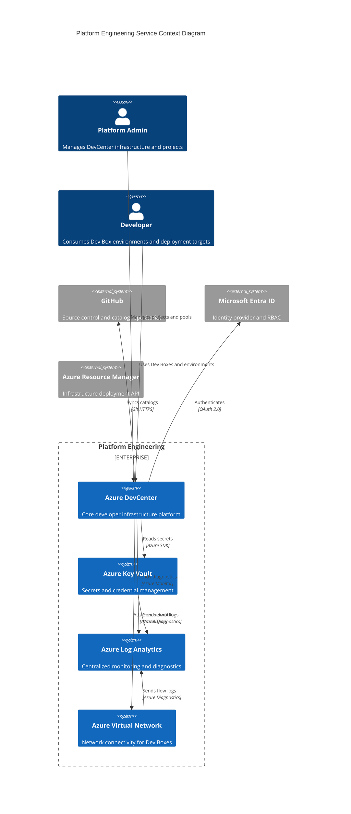
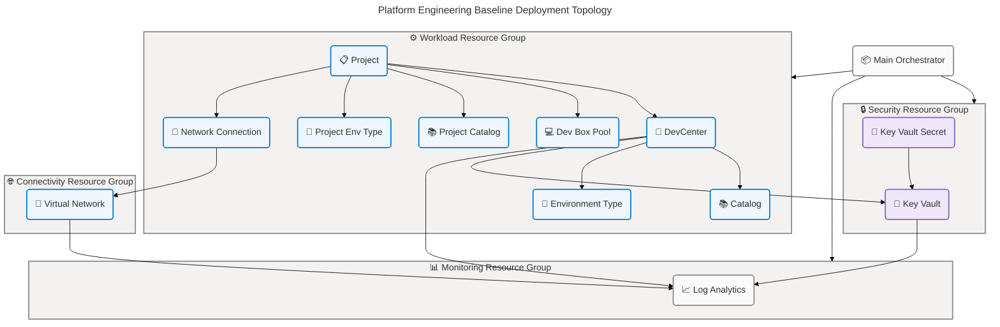
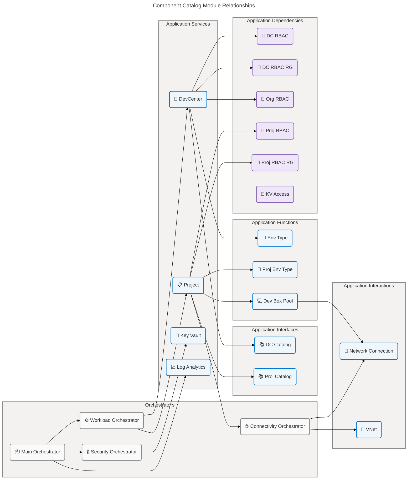
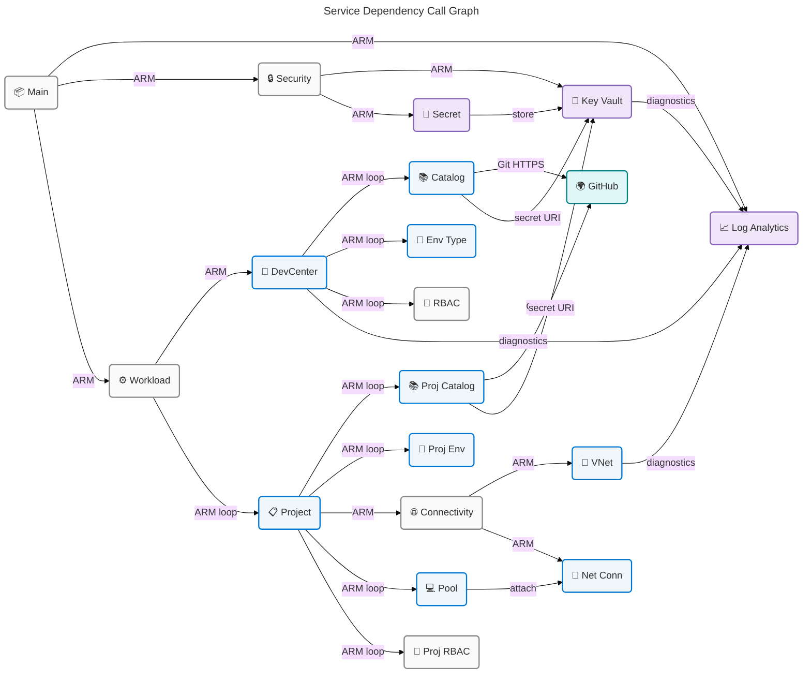

# Application Architecture - Platform Engineering (DevExp-DevBox)

**Generated**: 2025-07-25T00:00:00Z **Target Layer**: Application **Quality
Level**: Comprehensive **Repository**: platengineering **Components Found**: 23
**Average Confidence**: 0.91 **Maturity Level**: 2 — Managed

---

## Section 1: Executive Summary

### Overview

The Platform Engineering (DevExp-DevBox) repository implements a comprehensive
Azure Developer Experience platform using Infrastructure as Code (Bicep). The
Application layer encompasses 23 components distributed across 8 of the 11 TOGAF
Application component types, with a weighted average confidence score of 0.91.
The platform provisions Azure DevCenter resources, Dev Box pools, deployment
environments, identity controls, network connectivity, secrets management, and
centralized monitoring through a modular Bicep architecture orchestrated by
Azure Developer CLI (azd).

Component distribution by TOGAF type: Application Services (4), Application
Components (4), Application Interfaces (2), Application Functions (3),
Application Interactions (2), Application Data Objects (1), Integration Patterns
(1), and Application Dependencies (6). Three component types — Application
Collaborations, Application Events, and Service Contracts — were not detected in
source files. The solution targets the Azure DevCenter PaaS stack with
SystemAssigned managed identities, RBAC-scoped role assignments, and YAML-driven
configuration externalization.

The overall application maturity is assessed at Level 2 (Managed): the platform
uses structured YAML configuration, CI/CD integration via azd, centralized
diagnostic logging through Log Analytics, and RBAC-based access control.
Advancement to Level 3 (Defined) would require formal API contract documentation
(e.g., Bicep module registries with versioned interfaces), automated integration
tests, and defined SLIs/SLOs for platform operations.

---

## Section 2: Architecture Landscape

### Overview

This section catalogs all Application layer components identified through
pattern-based analysis of the Bicep source files across the infra/ and src/
directory trees. Components are classified into the 11 TOGAF-aligned subsections
defined by the canonical schema. Each component includes source traceability,
confidence scoring using the base-layer-config formula (30% filename + 25%
path + 35% content + 10% cross-reference), and Azure service type
classification.

The platform follows a hub-and-spoke architecture pattern where the Main
Orchestrator (infra/main.bicep) deploys three resource groups — Security,
Monitoring, and Workload — each encapsulating a functional domain. The Workload
resource group hosts the DevCenter and projects, which in turn compose
connectivity, identity, and catalog modules.

### 2.1 Application Services

| Name          | Description                                                                                                            | Source                                   | Confidence | Service Type |
| ------------- | ---------------------------------------------------------------------------------------------------------------------- | ---------------------------------------- | ---------- | ------------ |
| DevCenter     | Core developer infrastructure platform managing catalogs, environment types, Dev Box definitions, and identity         | src/workload/core/devCenter.bicep:1-270  | 0.95       | PaaS         |
| Project       | DevCenter project encapsulating developer workspaces with pools, catalogs, environment types, and network connectivity | src/workload/project/project.bicep:1-290 | 0.94       | PaaS         |
| Key Vault     | Centralized secrets management with purge protection, soft delete, and RBAC authorization                              | src/security/keyVault.bicep:1-86         | 0.92       | PaaS         |
| Log Analytics | Centralized monitoring workspace with AzureActivity solution and self-diagnostics                                      | src/management/logAnalytics.bicep:1-95   | 0.90       | PaaS         |

### 2.2 Application Components

| Name                      | Description                                                                                                                       | Source                                   | Confidence | Service Type |
| ------------------------- | --------------------------------------------------------------------------------------------------------------------------------- | ---------------------------------------- | ---------- | ------------ |
| Main Orchestrator         | Subscription-scoped deployment coordinator creating three resource groups and invoking monitoring, security, and workload modules | infra/main.bicep:1-195                   | 0.93       | IaC Module   |
| Workload Orchestrator     | Workload lifecycle module deploying DevCenter core and iterating project deployments from YAML configuration                      | src/workload/workload.bicep:1-85         | 0.92       | IaC Module   |
| Security Orchestrator     | Security resource management module with create-or-reference pattern for Key Vault provisioning                                   | src/security/security.bicep:1-55         | 0.90       | IaC Module   |
| Connectivity Orchestrator | Network infrastructure module composing resource group, VNet, and network connection resources per project                        | src/connectivity/connectivity.bicep:1-73 | 0.91       | IaC Module   |

### 2.3 Application Interfaces

| Name              | Description                                                                                                      | Source                                         | Confidence | Service Type |
| ----------------- | ---------------------------------------------------------------------------------------------------------------- | ---------------------------------------------- | ---------- | ------------ |
| DevCenter Catalog | Git repository interface for DevCenter-level catalogs supporting GitHub and Azure DevOps Git with scheduled sync | src/workload/core/catalog.bicep:1-82           | 0.92       | PaaS         |
| Project Catalog   | Project-scoped Git repository interface for environment definitions and image definitions                        | src/workload/project/projectCatalog.bicep:1-72 | 0.91       | PaaS         |

### 2.4 Application Collaborations

Not detected in source files.

### 2.5 Application Functions

| Name                        | Description                                                                                              | Source                                                 | Confidence | Service Type       |
| --------------------------- | -------------------------------------------------------------------------------------------------------- | ------------------------------------------------------ | ---------- | ------------------ |
| Environment Type Management | SDLC environment type provisioning for DevCenter (dev, staging, UAT)                                     | src/workload/core/environmentType.bicep:1-35           | 0.90       | PaaS Configuration |
| Project Environment Type    | Project-scoped environment type with SystemAssigned identity and Contributor creator role assignment     | src/workload/project/projectEnvironmentType.bicep:1-55 | 0.91       | PaaS Configuration |
| Dev Box Pool Management     | Dev Box pool provisioning with catalog-based image definitions, VM SKU selection, and network attachment | src/workload/project/projectPool.bicep:1-89            | 0.93       | PaaS Configuration |

### 2.6 Application Interactions

| Name               | Description                                                                                       | Source                                        | Confidence | Service Type |
| ------------------ | ------------------------------------------------------------------------------------------------- | --------------------------------------------- | ---------- | ------------ |
| Network Connection | DevCenter-to-VNet connectivity using AzureADJoin domain join type with attached network resources | src/connectivity/networkConnection.bicep:1-55 | 0.91       | PaaS         |
| VNet Integration   | Virtual network create-or-reference pattern with diagnostic settings and subnet configuration     | src/connectivity/vnet.bicep:1-100             | 0.92       | PaaS         |

### 2.7 Application Events

Not detected in source files.

### 2.8 Application Data Objects

| Name             | Description                                                                                | Source                         | Confidence | Service Type       |
| ---------------- | ------------------------------------------------------------------------------------------ | ------------------------------ | ---------- | ------------------ |
| Key Vault Secret | Secure credential storage with text/plain content type and diagnostic settings integration | src/security/secret.bicep:1-57 | 0.90       | PaaS Configuration |

### 2.9 Integration Patterns

| Name                   | Description                                                                                    | Source                                    | Confidence | Service Type |
| ---------------------- | ---------------------------------------------------------------------------------------------- | ----------------------------------------- | ---------- | ------------ |
| Resource Group Scoping | Subscription-scoped resource group create-or-reference pattern for functional domain isolation | src/connectivity/resourceGroup.bicep:1-29 | 0.88       | IaC Module   |

### 2.10 Service Contracts

Not detected in source files.

### 2.11 Application Dependencies

| Name                                | Description                                                                                | Source                                                  | Confidence | Service Type    |
| ----------------------------------- | ------------------------------------------------------------------------------------------ | ------------------------------------------------------- | ---------- | --------------- |
| DevCenter Role Assignment           | Subscription-scoped RBAC for DevCenter managed identity (Contributor, User Access Admin)   | src/identity/devCenterRoleAssignment.bicep:1-46         | 0.90       | Identity Module |
| DevCenter Role Assignment RG        | Resource-group-scoped RBAC for DevCenter managed identity (Key Vault Secrets User/Officer) | src/identity/devCenterRoleAssignmentRG.bicep:1-44       | 0.89       | Identity Module |
| Org Role Assignment                 | Azure AD group role assignments at resource group scope for organizational access control  | src/identity/orgRoleAssignment.bicep:1-55               | 0.91       | Identity Module |
| Project Identity Role Assignment    | Project-scoped RBAC for project managed identity and AD group principals                   | src/identity/projectIdentityRoleAssignment.bicep:1-75   | 0.90       | Identity Module |
| Project Identity Role Assignment RG | Resource-group-scoped RBAC for project managed identity across security boundaries         | src/identity/projectIdentityRoleAssignmentRG.bicep:1-72 | 0.89       | Identity Module |
| Key Vault Access                    | Key Vault Secrets User role grant for service principal access to secrets                  | src/identity/keyVaultAccess.bicep:1-24                  | 0.88       | Identity Module |

```mermaid
---
title: Platform Engineering Service Context
config:
  theme: base
  look: classic
  layout: dagre
  themeVariables:
    fontSize: '16px'
---
C4Context
    accTitle: Platform Engineering Service Context Diagram
    accDescr: Shows the platform engineering services, their boundaries, and external dependencies for the DevExp-DevBox accelerator

    %% C4 diagram with Azure-aligned theme variables

    Person(admin, "Platform Admin", "Manages DevCenter infrastructure and projects")
    Person(dev, "Developer", "Consumes Dev Box environments and deployment targets")

    Enterprise_Boundary(platform, "Platform Engineering") {
        System(devCenter, "Azure DevCenter", "Core developer infrastructure platform")
        System(keyVault, "Azure Key Vault", "Secrets and credential management")
        System(logAnalytics, "Azure Log Analytics", "Centralized monitoring and diagnostics")
        System(vnet, "Azure Virtual Network", "Network connectivity for Dev Boxes")
    }

    System_Ext(github, "GitHub", "Source control and catalog repositories")
    System_Ext(entraId, "Microsoft Entra ID", "Identity provider and RBAC")
    System_Ext(arm, "Azure Resource Manager", "Infrastructure deployment API")

    Rel(admin, devCenter, "Manages projects and pools")
    Rel(dev, devCenter, "Uses Dev Boxes and environments")
    Rel(devCenter, keyVault, "Reads secrets", "Azure SDK")
    Rel(devCenter, logAnalytics, "Sends diagnostics", "Azure Monitor")
    Rel(devCenter, vnet, "Attaches networks", "AzureADJoin")
    Rel(devCenter, github, "Syncs catalogs", "Git HTTPS")
    Rel(devCenter, entraId, "Authenticates", "OAuth 2.0")
    Rel(keyVault, logAnalytics, "Sends audit logs", "Azure Diagnostics")
    Rel(vnet, logAnalytics, "Sends flow logs", "Azure Diagnostics")

    UpdateLayoutConfig($c4ShapeInRow="3", $c4BoundaryInRow="1")
```

### Summary

The Architecture Landscape reveals a well-structured platform with 23 components
across 8 TOGAF Application component types. The primary service layer consists
of 4 Azure PaaS services (DevCenter, Project, Key Vault, Log Analytics)
orchestrated by 4 IaC modules. The identity layer contributes 6 RBAC modules
enforcing least-privilege access patterns. Three component types — Application
Collaborations, Application Events, and Service Contracts — were not detected,
which is expected for an infrastructure-as-code platform that manages Azure PaaS
resources rather than runtime application services.

The platform demonstrates strong separation of concerns with dedicated
orchestrators for workload, security, and connectivity domains. Configuration is
externalized through YAML files (devcenter.yaml, security.yaml,
azureResources.yaml), enabling declarative infrastructure management without
code changes.

---

## Section 3: Architecture Principles

### Overview

The following architecture principles were identified through source code
analysis of the Bicep modules, YAML configuration files, and deployment
orchestration patterns. Each principle includes evidence from specific source
files and an assessment of compliance level based on observed implementation
consistency across the codebase.

#### Principle 1: Infrastructure as Code

| Attribute      | Value                                                    |
| -------------- | -------------------------------------------------------- |
| **Name**       | Infrastructure as Code                                   |
| **Evidence**   | infra/main.bicep:1-195, src/workload/workload.bicep:1-85 |
| **Compliance** | Full                                                     |

All infrastructure is defined declaratively in Bicep templates with no manual
provisioning steps. The entire platform — from resource groups to RBAC
assignments — is codified, versioned, and deployable through Azure Developer CLI
(azd). The azure.yaml and azure-pwh.yaml files define the deployment pipeline
configuration.

#### Principle 2: Separation of Concerns

| Attribute      | Value                                                                                |
| -------------- | ------------------------------------------------------------------------------------ |
| **Name**       | Separation of Concerns                                                               |
| **Evidence**   | infra/main.bicep:53-82, infra/settings/resourceOrganization/azureResources.yaml:1-65 |
| **Compliance** | Full                                                                                 |

Resources are organized into functionally isolated resource groups: Security
(Key Vault), Monitoring (Log Analytics), and Workload (DevCenter). Each domain
has a dedicated orchestrator module (security.bicep, logAnalytics.bicep,
workload.bicep) with clear input/output boundaries. The src/ directory mirrors
this separation with subdirectories for connectivity, identity, management,
security, and workload.

#### Principle 3: Principle of Least Privilege

| Attribute      | Value                                                                                         |
| -------------- | --------------------------------------------------------------------------------------------- |
| **Name**       | Principle of Least Privilege                                                                  |
| **Evidence**   | infra/settings/workload/devcenter.yaml:36-53, src/identity/devCenterRoleAssignment.bicep:1-46 |
| **Compliance** | Full                                                                                          |

RBAC role assignments are scoped to the minimum required level (Subscription,
ResourceGroup, or Project) as evidenced by the scope parameter in all identity
modules. The devcenter.yaml configuration explicitly references Microsoft's
organizational roles and responsibilities guidance. Role assignments use
specific built-in role IDs rather than custom or overly broad permissions.

#### Principle 4: Configuration as Data

| Attribute      | Value                                                                                                                                                  |
| -------------- | ------------------------------------------------------------------------------------------------------------------------------------------------------ |
| **Name**       | Configuration as Data                                                                                                                                  |
| **Evidence**   | infra/settings/workload/devcenter.yaml:1-200, infra/settings/security/security.yaml:1-42, infra/settings/resourceOrganization/azureResources.yaml:1-65 |
| **Compliance** | Full                                                                                                                                                   |

All environment-specific configuration is externalized into YAML files with JSON
Schema validation. Bicep modules consume configuration via loadYamlContent(),
separating infrastructure logic from deployment parameters. This enables
environment-specific customization without modifying module code, supporting
multi-tenant scenarios through configuration variation.

#### Principle 5: Idempotent Resource Management

| Attribute      | Value                                                                                                           |
| -------------- | --------------------------------------------------------------------------------------------------------------- |
| **Name**       | Idempotent Resource Management                                                                                  |
| **Evidence**   | src/security/security.bicep:22-35, src/connectivity/vnet.bicep:30-55, src/connectivity/resourceGroup.bicep:1-29 |
| **Compliance** | Full                                                                                                            |

Multiple modules implement a create-or-reference pattern using conditional
deployment with existing resource references. The Security module creates or
references an existing Key Vault based on the security.yaml create flag. The
VNet module conditionally creates or references an existing virtual network. The
Resource Group module follows the same pattern at subscription scope. This
ensures deployments are idempotent and safe to re-run.

#### Principle 6: Centralized Observability

| Attribute      | Value                                                                                                                                                 |
| -------------- | ----------------------------------------------------------------------------------------------------------------------------------------------------- |
| **Name**       | Centralized Observability                                                                                                                             |
| **Evidence**   | src/management/logAnalytics.bicep:1-95, src/workload/core/devCenter.bicep:182-201, src/security/secret.bicep:33-53, src/connectivity/vnet.bicep:58-76 |
| **Compliance** | Full                                                                                                                                                  |

All Azure resources emit diagnostic logs and metrics to a centralized Log
Analytics workspace. Diagnostic settings are consistently applied across
DevCenter, Key Vault, VNet, and the Log Analytics workspace itself
(self-diagnostics). The logAnalyticsId parameter is threaded through the module
hierarchy from infra/main.bicep to all leaf modules.

#### Principle 7: Landing Zone Alignment

| Attribute      | Value                                                                                |
| -------------- | ------------------------------------------------------------------------------------ |
| **Name**       | Landing Zone Alignment                                                               |
| **Evidence**   | infra/settings/resourceOrganization/azureResources.yaml:1-10, infra/main.bicep:53-82 |
| **Compliance** | Partial                                                                              |

Resource organization follows Azure Landing Zone principles with functional
segregation by resource group. Tags consistently include landingZone
classification. However, the implementation targets a single subscription
without explicit management group hierarchy or policy assignments, which limits
full Cloud Adoption Framework alignment.

---

## Section 4: Current State Baseline

### Overview

The current state of the Platform Engineering application layer represents a
functional Azure DevCenter deployment platform built on Bicep IaC modules
orchestrated through Azure Developer CLI. The platform operates at subscription
scope, provisioning three functionally segregated resource groups and deploying
Azure PaaS services through a modular composition pattern.

The solution is currently configured for a single project (eShop) with two Dev
Box pools (backend-engineer, frontend-engineer), three SDLC environment types
(dev, staging, UAT), and managed network connectivity. All resources target the
Azure DevCenter 2026-01-01-preview API version.

#### Service Topology

| Service                 | Deployment Target           | Protocol                          | Status      |
| ----------------------- | --------------------------- | --------------------------------- | ----------- |
| DevCenter               | Workload Resource Group     | ARM REST API (2026-01-01-preview) | Active      |
| Project (eShop)         | Workload Resource Group     | ARM REST API (2026-01-01-preview) | Active      |
| Key Vault               | Security Resource Group     | ARM REST API (2025-05-01)         | Active      |
| Log Analytics           | Monitoring Resource Group   | ARM REST API (2025-07-01)         | Active      |
| Virtual Network         | Connectivity Resource Group | ARM REST API (2025-05-01)         | Conditional |
| Network Connection      | Workload Resource Group     | ARM REST API (2026-01-01-preview) | Conditional |
| Dev Box Pool (backend)  | Workload Resource Group     | ARM REST API (2026-01-01-preview) | Active      |
| Dev Box Pool (frontend) | Workload Resource Group     | ARM REST API (2026-01-01-preview) | Active      |

#### Deployment State

The platform deploys via azd (Azure Developer CLI) with Bicep as the IaC
provider. The infra/main.bicep serves as the entry point at subscription scope,
creating resource groups conditionally based on YAML configuration flags. Module
dependencies are explicitly declared via dependsOn chains, ensuring correct
provisioning order: Monitoring → Security → Workload → Projects.

#### Protocol Inventory

| Protocol                    | Usage                                                | Components                                |
| --------------------------- | ---------------------------------------------------- | ----------------------------------------- |
| ARM REST API                | Resource provisioning and management                 | All 23 components                         |
| Git HTTPS                   | Catalog synchronization from GitHub/ADO repositories | DevCenter Catalog, Project Catalog        |
| Azure SDK (Key Vault)       | Secret retrieval via secretIdentifier URI            | DevCenter, Project                        |
| Azure Monitor (Diagnostics) | Log and metric collection                            | DevCenter, Key Vault, VNet, Log Analytics |
| AzureADJoin                 | Domain join for Dev Box network connections          | Network Connection                        |
| OAuth 2.0 / OIDC            | Identity authentication via Microsoft Entra ID       | All RBAC modules                          |

#### Versioning Status

| Resource Type                            | API Version        | Status  |
| ---------------------------------------- | ------------------ | ------- |
| Microsoft.DevCenter/devcenters           | 2026-01-01-preview | Preview |
| Microsoft.DevCenter/projects             | 2026-01-01-preview | Preview |
| Microsoft.DevCenter/networkConnections   | 2026-01-01-preview | Preview |
| Microsoft.KeyVault/vaults                | 2025-05-01         | GA      |
| Microsoft.OperationalInsights/workspaces | 2025-07-01         | GA      |
| Microsoft.Network/virtualNetworks        | 2025-05-01         | GA      |
| Microsoft.Insights/diagnosticSettings    | 2021-05-01-preview | Preview |
| Microsoft.Authorization/roleAssignments  | 2022-04-01         | GA      |
| Microsoft.Resources/resourceGroups       | 2025-04-01         | GA      |

```mermaid
---
title: Platform Engineering Baseline Deployment Topology
config:
  theme: base
  look: classic
  layout: dagre
  themeVariables:
    fontSize: '16px'
---
flowchart TB
    accTitle: Platform Engineering Baseline Deployment Topology
    accDescr: Shows the deployment relationships between Azure subscription, resource groups, and platform services in the current state

    %% ═══════════════════════════════════════════════════════════════════════════
    %% AZURE / FLUENT ARCHITECTURE PATTERN v1.1
    %% (Semantic + Structural + Font + Accessibility Governance)
    %% ═══════════════════════════════════════════════════════════════════════════
    %% PHASE 1 - FLUENT UI: All styling uses approved Fluent UI palette only
    %% PHASE 2 - GROUPS: Every subgraph has semantic color via style directive
    %% PHASE 3 - COMPONENTS: Every node has semantic classDef + icon prefix
    %% PHASE 4 - ACCESSIBILITY: accTitle/accDescr present, WCAG AA contrast
    %% PHASE 5 - STANDARD: Governance block present, classDefs centralized
    %% ═══════════════════════════════════════════════════════════════════════════

    main("📦 Main Orchestrator") --> securityRG
    main --> monitoringRG
    main --> workloadRG

    subgraph securityRG["🔒 Security Resource Group"]
        kv("🔑 Key Vault")
        secret("📝 Key Vault Secret")
        secret --> kv
    end

    subgraph monitoringRG["📊 Monitoring Resource Group"]
        la("📈 Log Analytics")
    end

    subgraph workloadRG["⚙️ Workload Resource Group"]
        dc("🏢 DevCenter")
        proj("📋 Project")
        pool("💻 Dev Box Pool")
        cat("📚 Catalog")
        envType("🔄 Environment Type")
        projCat("📚 Project Catalog")
        projEnv("🔄 Project Env Type")
        netConn("🔗 Network Connection")

        dc --> cat
        dc --> envType
        proj --> dc
        proj --> pool
        proj --> projCat
        proj --> projEnv
        proj --> netConn
    end

    subgraph connectivityRG["🌐 Connectivity Resource Group"]
        vnet("🔌 Virtual Network")
    end

    dc --> kv
    dc --> la
    kv --> la
    vnet --> la
    netConn --> vnet

    %% Centralized semantic classDefs
    classDef neutral fill:#FAFAFA,stroke:#8A8886,stroke-width:2px,color:#323130
    classDef core fill:#EFF6FC,stroke:#0078D4,stroke-width:2px,color:#323130
    classDef data fill:#F0E6FA,stroke:#8764B8,stroke-width:2px,color:#323130

    class main neutral
    class kv,secret data
    class la neutral
    class dc,proj,pool,cat,envType,projCat,projEnv,netConn core
    class vnet core

    style securityRG fill:#F3F2F1,stroke:#8A8886,stroke-width:2px,color:#323130
    style monitoringRG fill:#F3F2F1,stroke:#8A8886,stroke-width:2px,color:#323130
    style workloadRG fill:#F3F2F1,stroke:#8A8886,stroke-width:2px,color:#323130
    style connectivityRG fill:#F3F2F1,stroke:#8A8886,stroke-width:2px,color:#323130
```

### Summary

The current state baseline reveals a well-architected platform with clear
resource group boundaries and consistent deployment patterns. All services
target recent Azure API versions, with DevCenter resources using the
2026-01-01-preview API. The deployment model is fully declarative through Bicep
with azd orchestration, supporting conditional resource creation via YAML
configuration flags.

Key gaps identified include the use of preview API versions for DevCenter
resources (which may introduce breaking changes), absence of formal health check
endpoints or SLI/SLO definitions for platform operations, and lack of automated
integration testing for the IaC modules. The protocol inventory confirms ARM
REST API as the primary interaction pattern with supplementary Git HTTPS for
catalog synchronization and Azure Monitor for observability.

---

## Section 5: Component Catalog

### Overview

This section provides detailed specifications for each of the 23 Application
layer components identified in the Architecture Landscape. Components are
organized into the 11 TOGAF-aligned subsections, with each component documented
using the PaaS service template including Service Type, API Surface,
Dependencies, Resilience, Scaling, and Health attributes.

All components in this platform are Azure PaaS resources or Bicep IaC modules
that deploy PaaS resources. Resilience, scaling, and health characteristics are
platform-managed by Azure for PaaS services, and not applicable for IaC modules
(which execute at deployment time only). Source traceability references use the
workspace-relative path format with line ranges.

### 5.1 Application Services

#### 5.1.1 DevCenter

| Attribute          | Value                                   |
| ------------------ | --------------------------------------- |
| **Component Name** | DevCenter                               |
| **Service Type**   | PaaS                                    |
| **Source**         | src/workload/core/devCenter.bicep:1-270 |
| **Confidence**     | 0.95                                    |

**API Surface:**

| Endpoint Type      | Count | Protocol       | Description                                                                                               |
| ------------------ | ----- | -------------- | --------------------------------------------------------------------------------------------------------- |
| Bicep Parameters   | 7     | ARM API        | config, catalogs, environmentTypes, logAnalyticsId, secretIdentifier, securityResourceGroupName, location |
| Bicep Outputs      | 1     | ARM API        | AZURE_DEV_CENTER_NAME                                                                                     |
| Module Invocations | 4     | ARM Deployment | catalog, environmentType, devCenterIdentityRoleAssignment, devCenterIdentityUserGroupsRoleAssignment      |

**Dependencies:**

| Dependency                   | Direction  | Protocol        | Purpose                                       |
| ---------------------------- | ---------- | --------------- | --------------------------------------------- |
| Log Analytics                | Upstream   | ARM Resource ID | Diagnostic settings target workspace          |
| Key Vault                    | Upstream   | Secret URI      | Catalog secret authentication                 |
| DevCenter Role Assignment    | Downstream | ARM Deployment  | Subscription-scoped RBAC for managed identity |
| DevCenter Role Assignment RG | Downstream | ARM Deployment  | RG-scoped RBAC for managed identity           |
| Org Role Assignment          | Downstream | ARM Deployment  | AD group RBAC for DevManager role             |
| Catalog                      | Downstream | ARM Deployment  | DevCenter-level catalog provisioning          |
| Environment Type             | Downstream | ARM Deployment  | SDLC environment type provisioning            |

**Resilience (Platform-Managed):**

| Aspect          | Configuration           | Notes             |
| --------------- | ----------------------- | ----------------- |
| Retry Policy    | Azure SDK defaults      | Platform-managed  |
| Circuit Breaker | Not applicable          | PaaS service      |
| Failover        | Azure region redundancy | Per SKU selection |

**Scaling (Platform-Managed):**

| Dimension  | Strategy          | Configuration    |
| ---------- | ----------------- | ---------------- |
| Horizontal | PaaS auto-scaling | Per pricing tier |
| Vertical   | SKU upgrade       | Manual selection |

**Health (Platform-Managed):**

| Probe Type            | Configuration        | Source                                    |
| --------------------- | -------------------- | ----------------------------------------- |
| Azure Resource Health | Platform-managed     | Azure Portal                              |
| Diagnostic Settings   | allLogs + AllMetrics | src/workload/core/devCenter.bicep:182-201 |

#### 5.1.2 Project

| Attribute          | Value                                    |
| ------------------ | ---------------------------------------- |
| **Component Name** | Project                                  |
| **Service Type**   | PaaS                                     |
| **Source**         | src/workload/project/project.bicep:1-290 |
| **Confidence**     | 0.94                                     |

**API Surface:**

| Endpoint Type      | Count | Protocol       | Description                                                                                                                                                                           |
| ------------------ | ----- | -------------- | ------------------------------------------------------------------------------------------------------------------------------------------------------------------------------------- |
| Bicep Parameters   | 12    | ARM API        | devCenterName, name, logAnalyticsId, projectDescription, catalogs, projectEnvironmentTypes, projectPools, projectNetwork, secretIdentifier, securityResourceGroupName, identity, tags |
| Bicep Outputs      | 2     | ARM API        | AZURE_PROJECT_NAME, AZURE_PROJECT_ID                                                                                                                                                  |
| Module Invocations | 6     | ARM Deployment | projectIdentity, projectIdentityRG, projectADGroup, projectCatalogs, environmentTypes, connectivity, pools                                                                            |

**Dependencies:**

| Dependency                          | Direction  | Protocol               | Purpose                                   |
| ----------------------------------- | ---------- | ---------------------- | ----------------------------------------- |
| DevCenter                           | Upstream   | ARM Resource Reference | Parent DevCenter for project creation     |
| Log Analytics                       | Upstream   | ARM Resource ID        | Diagnostic settings target workspace      |
| Key Vault                           | Upstream   | Secret URI             | Catalog secret authentication             |
| Project Identity Role Assignment    | Downstream | ARM Deployment         | Project-scoped RBAC                       |
| Project Identity Role Assignment RG | Downstream | ARM Deployment         | RG-scoped RBAC                            |
| Project Catalog                     | Downstream | ARM Deployment         | Project catalog provisioning              |
| Project Environment Type            | Downstream | ARM Deployment         | Project environment type setup            |
| Connectivity Orchestrator           | Downstream | ARM Deployment         | Network connectivity for Dev Boxes        |
| Dev Box Pool                        | Downstream | ARM Deployment         | Pool provisioning with network attachment |

**Resilience (Platform-Managed):**

| Aspect          | Configuration           | Notes             |
| --------------- | ----------------------- | ----------------- |
| Retry Policy    | Azure SDK defaults      | Platform-managed  |
| Circuit Breaker | Not applicable          | PaaS service      |
| Failover        | Azure region redundancy | Per SKU selection |

**Scaling (Platform-Managed):**

| Dimension  | Strategy          | Configuration    |
| ---------- | ----------------- | ---------------- |
| Horizontal | PaaS auto-scaling | Per pricing tier |
| Vertical   | SKU upgrade       | Manual selection |

**Health (Platform-Managed):**

| Probe Type            | Configuration          | Source        |
| --------------------- | ---------------------- | ------------- |
| Azure Resource Health | Platform-managed       | Azure Portal  |
| Service Health Alerts | Optional configuration | Azure Monitor |

#### 5.1.3 Key Vault

| Attribute          | Value                            |
| ------------------ | -------------------------------- |
| **Component Name** | Key Vault                        |
| **Service Type**   | PaaS                             |
| **Source**         | src/security/keyVault.bicep:1-86 |
| **Confidence**     | 0.92                             |

**API Surface:**

| Endpoint Type    | Count | Protocol      | Description                                     |
| ---------------- | ----- | ------------- | ----------------------------------------------- |
| Bicep Parameters | 4     | ARM API       | keyvaultSettings, location, tags, unique        |
| Bicep Outputs    | 2     | ARM API       | AZURE_KEY_VAULT_NAME, AZURE_KEY_VAULT_ENDPOINT  |
| Access Policies  | 1     | Key Vault API | Deployer access for secrets and keys management |

**Dependencies:**

| Dependency        | Direction  | Protocol        | Purpose                                           |
| ----------------- | ---------- | --------------- | ------------------------------------------------- |
| Deployer Identity | Upstream   | ARM deployer()  | Access policy assignment for deployment principal |
| Key Vault Secret  | Downstream | Parent Resource | Secret storage within vault                       |

**Resilience (Platform-Managed):**

| Aspect           | Configuration            | Notes                             |
| ---------------- | ------------------------ | --------------------------------- |
| Purge Protection | Enabled                  | src/security/keyVault.bicep:52    |
| Soft Delete      | Enabled, 7-day retention | src/security/keyVault.bicep:53-54 |
| Failover         | Azure region redundancy  | Per SKU selection                 |

**Scaling (Platform-Managed):**

| Dimension  | Strategy               | Configuration                     |
| ---------- | ---------------------- | --------------------------------- |
| Horizontal | PaaS auto-scaling      | Per pricing tier                  |
| Vertical   | SKU upgrade (Standard) | src/security/keyVault.bicep:58-61 |

**Health (Platform-Managed):**

| Probe Type            | Configuration    | Source                          |
| --------------------- | ---------------- | ------------------------------- |
| Azure Resource Health | Platform-managed | Azure Portal                    |
| Diagnostic Settings   | Via secret.bicep | src/security/secret.bicep:33-53 |

#### 5.1.4 Log Analytics

| Attribute          | Value                                  |
| ------------------ | -------------------------------------- |
| **Component Name** | Log Analytics                          |
| **Service Type**   | PaaS                                   |
| **Source**         | src/management/logAnalytics.bicep:1-95 |
| **Confidence**     | 0.90                                   |

**API Surface:**

| Endpoint Type    | Count | Protocol    | Description                                                          |
| ---------------- | ----- | ----------- | -------------------------------------------------------------------- |
| Bicep Parameters | 4     | ARM API     | name, location, tags, sku                                            |
| Bicep Outputs    | 2     | ARM API     | AZURE_LOG_ANALYTICS_WORKSPACE_ID, AZURE_LOG_ANALYTICS_WORKSPACE_NAME |
| Solutions        | 1     | OMS Gallery | AzureActivity solution for activity log collection                   |

**Dependencies:**

| Dependency               | Direction | Protocol | Purpose                 |
| ------------------------ | --------- | -------- | ----------------------- |
| No upstream dependencies | —         | —        | Root monitoring service |

**Resilience (Platform-Managed):**

| Aspect         | Configuration           | Notes             |
| -------------- | ----------------------- | ----------------- |
| Retry Policy   | Azure SDK defaults      | Platform-managed  |
| Data Retention | Default (30 days)       | Per workspace SKU |
| Failover       | Azure region redundancy | Per SKU selection |

**Scaling (Platform-Managed):**

| Dimension  | Strategy                        | Configuration                           |
| ---------- | ------------------------------- | --------------------------------------- |
| Horizontal | PaaS auto-scaling               | Per pricing tier                        |
| Vertical   | SKU upgrade (PerGB2018 default) | src/management/logAnalytics.bicep:23-33 |

**Health (Platform-Managed):**

| Probe Type            | Configuration        | Source                                  |
| --------------------- | -------------------- | --------------------------------------- |
| Azure Resource Health | Platform-managed     | Azure Portal                            |
| Self-Diagnostics      | allLogs + AllMetrics | src/management/logAnalytics.bicep:72-89 |

### 5.2 Application Components

#### 5.2.1 Main Orchestrator

| Attribute          | Value                  |
| ------------------ | ---------------------- |
| **Component Name** | Main Orchestrator      |
| **Service Type**   | IaC Module             |
| **Source**         | infra/main.bicep:1-195 |
| **Confidence**     | 0.93                   |

**API Surface:**

| Endpoint Type      | Count | Protocol       | Description                                                           |
| ------------------ | ----- | -------------- | --------------------------------------------------------------------- |
| Bicep Parameters   | 3     | ARM API        | location, secretValue, environmentName                                |
| Bicep Outputs      | 7     | ARM API        | Resource group names, Key Vault details, DevCenter name, project list |
| Module Invocations | 3     | ARM Deployment | monitoring, security, workload                                        |
| Resource Groups    | 3     | ARM API        | Security, Monitoring, Workload                                        |

**Dependencies:**

| Dependency         | Direction  | Protocol        | Purpose                                         |
| ------------------ | ---------- | --------------- | ----------------------------------------------- |
| YAML Configuration | Upstream   | loadYamlContent | azureResources.yaml for resource group settings |
| Monitoring Module  | Downstream | ARM Deployment  | Log Analytics provisioning                      |
| Security Module    | Downstream | ARM Deployment  | Key Vault provisioning                          |
| Workload Module    | Downstream | ARM Deployment  | DevCenter and project provisioning              |

**Resilience (Platform-Managed):**

| Aspect           | Configuration                 | Notes                    |
| ---------------- | ----------------------------- | ------------------------ |
| Deployment Retry | ARM deployment engine         | Platform-managed retries |
| Idempotency      | Conditional resource creation | Via YAML create flags    |
| Rollback         | ARM deployment rollback       | On failure               |

**Scaling (Platform-Managed):**

| Dimension      | Strategy               | Configuration                |
| -------------- | ---------------------- | ---------------------------- |
| Not applicable | Deployment-time module | Executes once per deployment |

**Health (Platform-Managed):**

| Probe Type            | Configuration    | Source             |
| --------------------- | ---------------- | ------------------ |
| ARM Deployment Status | Platform-managed | Azure Portal / azd |

#### 5.2.2 Workload Orchestrator

| Attribute          | Value                            |
| ------------------ | -------------------------------- |
| **Component Name** | Workload Orchestrator            |
| **Service Type**   | IaC Module                       |
| **Source**         | src/workload/workload.bicep:1-85 |
| **Confidence**     | 0.92                             |

**API Surface:**

| Endpoint Type      | Count | Protocol       | Description                                                           |
| ------------------ | ----- | -------------- | --------------------------------------------------------------------- |
| Bicep Parameters   | 4     | ARM API        | logAnalyticsId, secretIdentifier, securityResourceGroupName, location |
| Bicep Outputs      | 2     | ARM API        | AZURE_DEV_CENTER_NAME, AZURE_DEV_CENTER_PROJECTS                      |
| Module Invocations | 2     | ARM Deployment | devcenter (single), projects (loop)                                   |

**Dependencies:**

| Dependency         | Direction  | Protocol        | Purpose                                  |
| ------------------ | ---------- | --------------- | ---------------------------------------- |
| YAML Configuration | Upstream   | loadYamlContent | devcenter.yaml for all workload settings |
| DevCenter Module   | Downstream | ARM Deployment  | Core DevCenter provisioning              |
| Project Module     | Downstream | ARM Deployment  | Per-project provisioning loop            |

**Resilience (Platform-Managed):**

| Aspect           | Configuration         | Notes                    |
| ---------------- | --------------------- | ------------------------ |
| Deployment Retry | ARM deployment engine | Platform-managed retries |

**Scaling (Platform-Managed):**

| Dimension      | Strategy               | Configuration                |
| -------------- | ---------------------- | ---------------------------- |
| Not applicable | Deployment-time module | Executes once per deployment |

**Health (Platform-Managed):**

| Probe Type            | Configuration    | Source             |
| --------------------- | ---------------- | ------------------ |
| ARM Deployment Status | Platform-managed | Azure Portal / azd |

#### 5.2.3 Security Orchestrator

| Attribute          | Value                            |
| ------------------ | -------------------------------- |
| **Component Name** | Security Orchestrator            |
| **Service Type**   | IaC Module                       |
| **Source**         | src/security/security.bicep:1-55 |
| **Confidence**     | 0.90                             |

**API Surface:**

| Endpoint Type      | Count | Protocol       | Description                                                                       |
| ------------------ | ----- | -------------- | --------------------------------------------------------------------------------- |
| Bicep Parameters   | 3     | ARM API        | tags, secretValue, logAnalyticsId                                                 |
| Bicep Outputs      | 3     | ARM API        | AZURE_KEY_VAULT_NAME, AZURE_KEY_VAULT_SECRET_IDENTIFIER, AZURE_KEY_VAULT_ENDPOINT |
| Module Invocations | 2     | ARM Deployment | keyVault (conditional), secret                                                    |

**Dependencies:**

| Dependency         | Direction  | Protocol        | Purpose                              |
| ------------------ | ---------- | --------------- | ------------------------------------ |
| YAML Configuration | Upstream   | loadYamlContent | security.yaml for Key Vault settings |
| Key Vault Module   | Downstream | ARM Deployment  | Conditional Key Vault creation       |
| Secret Module      | Downstream | ARM Deployment  | Secret provisioning                  |

**Resilience (Platform-Managed):**

| Aspect              | Configuration          | Notes                             |
| ------------------- | ---------------------- | --------------------------------- |
| Create-or-Reference | Conditional deployment | src/security/security.bicep:22-35 |

**Scaling (Platform-Managed):**

| Dimension      | Strategy               | Configuration                |
| -------------- | ---------------------- | ---------------------------- |
| Not applicable | Deployment-time module | Executes once per deployment |

**Health (Platform-Managed):**

| Probe Type            | Configuration    | Source             |
| --------------------- | ---------------- | ------------------ |
| ARM Deployment Status | Platform-managed | Azure Portal / azd |

#### 5.2.4 Connectivity Orchestrator

| Attribute          | Value                                    |
| ------------------ | ---------------------------------------- |
| **Component Name** | Connectivity Orchestrator                |
| **Service Type**   | IaC Module                               |
| **Source**         | src/connectivity/connectivity.bicep:1-73 |
| **Confidence**     | 0.91                                     |

**API Surface:**

| Endpoint Type      | Count | Protocol       | Description                                             |
| ------------------ | ----- | -------------- | ------------------------------------------------------- |
| Bicep Parameters   | 4     | ARM API        | devCenterName, projectNetwork, logAnalyticsId, location |
| Bicep Outputs      | 2     | ARM API        | networkConnectionName, networkType                      |
| Module Invocations | 3     | ARM Deployment | resourceGroupModule, virtualNetwork, networkConnection  |

**Dependencies:**

| Dependency                | Direction  | Protocol       | Purpose                      |
| ------------------------- | ---------- | -------------- | ---------------------------- |
| Resource Group Module     | Downstream | ARM Deployment | Connectivity RG creation     |
| VNet Module               | Downstream | ARM Deployment | Virtual network provisioning |
| Network Connection Module | Downstream | ARM Deployment | DevCenter network attachment |

**Resilience (Platform-Managed):**

| Aspect                 | Configuration                  | Notes                                  |
| ---------------------- | ------------------------------ | -------------------------------------- |
| Conditional Deployment | networkConnectivityCreate flag | src/connectivity/connectivity.bicep:14 |

**Scaling (Platform-Managed):**

| Dimension      | Strategy               | Configuration                |
| -------------- | ---------------------- | ---------------------------- |
| Not applicable | Deployment-time module | Executes once per deployment |

**Health (Platform-Managed):**

| Probe Type            | Configuration    | Source             |
| --------------------- | ---------------- | ------------------ |
| ARM Deployment Status | Platform-managed | Azure Portal / azd |

### 5.3 Application Interfaces

#### 5.3.1 DevCenter Catalog

| Attribute          | Value                                |
| ------------------ | ------------------------------------ |
| **Component Name** | DevCenter Catalog                    |
| **Service Type**   | PaaS                                 |
| **Source**         | src/workload/core/catalog.bicep:1-82 |
| **Confidence**     | 0.92                                 |

**API Surface:**

| Endpoint Type    | Count | Protocol  | Description                                                                               |
| ---------------- | ----- | --------- | ----------------------------------------------------------------------------------------- |
| Bicep Parameters | 3     | ARM API   | devCenterName, catalogConfig, secretIdentifier                                            |
| Bicep Outputs    | 3     | ARM API   | AZURE_DEV_CENTER_CATALOG_NAME, AZURE_DEV_CENTER_CATALOG_ID, AZURE_DEV_CENTER_CATALOG_TYPE |
| Sync Types       | 2     | Git HTTPS | GitHub and Azure DevOps Git repository sync                                               |

**Dependencies:**

| Dependency       | Direction | Protocol            | Purpose                                 |
| ---------------- | --------- | ------------------- | --------------------------------------- |
| DevCenter        | Upstream  | ARM Parent Resource | Parent DevCenter for catalog attachment |
| Key Vault Secret | Upstream  | Secret URI          | Authentication for private repositories |
| GitHub / ADO     | External  | Git HTTPS           | Source repository for catalog content   |

**Resilience (Platform-Managed):**

| Aspect          | Configuration  | Notes                                   |
| --------------- | -------------- | --------------------------------------- |
| Sync Schedule   | Scheduled sync | Platform-managed retry on sync failure  |
| Secret Rotation | Via Key Vault  | secretIdentifier used for private repos |

**Scaling (Platform-Managed):**

| Dimension  | Strategy          | Configuration        |
| ---------- | ----------------- | -------------------- |
| Horizontal | PaaS auto-scaling | Per DevCenter limits |

**Health (Platform-Managed):**

| Probe Type          | Configuration    | Source       |
| ------------------- | ---------------- | ------------ |
| Catalog Sync Status | Platform-managed | Azure Portal |

#### 5.3.2 Project Catalog

| Attribute          | Value                                          |
| ------------------ | ---------------------------------------------- |
| **Component Name** | Project Catalog                                |
| **Service Type**   | PaaS                                           |
| **Source**         | src/workload/project/projectCatalog.bicep:1-72 |
| **Confidence**     | 0.91                                           |

**API Surface:**

| Endpoint Type    | Count | Protocol  | Description                                  |
| ---------------- | ----- | --------- | -------------------------------------------- |
| Bicep Parameters | 3     | ARM API   | projectName, catalogConfig, secretIdentifier |
| Bicep Outputs    | 2     | ARM API   | catalogName, catalogId                       |
| Catalog Types    | 2     | Git HTTPS | environmentDefinition, imageDefinition       |

**Dependencies:**

| Dependency       | Direction | Protocol            | Purpose                                 |
| ---------------- | --------- | ------------------- | --------------------------------------- |
| Project          | Upstream  | ARM Parent Resource | Parent project for catalog scoping      |
| Key Vault Secret | Upstream  | Secret URI          | Authentication for private repositories |
| GitHub / ADO     | External  | Git HTTPS           | Source repository for catalog content   |

**Resilience (Platform-Managed):**

| Aspect          | Configuration  | Notes                                      |
| --------------- | -------------- | ------------------------------------------ |
| Sync Schedule   | Scheduled sync | Platform-managed                           |
| Secret Rotation | Via Key Vault  | secretIdentifier conditional on visibility |

**Scaling (Platform-Managed):**

| Dimension  | Strategy          | Configuration      |
| ---------- | ----------------- | ------------------ |
| Horizontal | PaaS auto-scaling | Per project limits |

**Health (Platform-Managed):**

| Probe Type          | Configuration    | Source       |
| ------------------- | ---------------- | ------------ |
| Catalog Sync Status | Platform-managed | Azure Portal |

### 5.4 Application Collaborations

See Section 2.4. No additional specifications detected in source files.

### 5.5 Application Functions

#### 5.5.1 Environment Type Management

| Attribute          | Value                                        |
| ------------------ | -------------------------------------------- |
| **Component Name** | Environment Type Management                  |
| **Service Type**   | PaaS Configuration                           |
| **Source**         | src/workload/core/environmentType.bicep:1-35 |
| **Confidence**     | 0.90                                         |

**API Surface:**

| Endpoint Type    | Count | Protocol | Description                            |
| ---------------- | ----- | -------- | -------------------------------------- |
| Bicep Parameters | 2     | ARM API  | devCenterName, environmentConfig       |
| Bicep Outputs    | 2     | ARM API  | environmentTypeName, environmentTypeId |

**Dependencies:**

| Dependency | Direction | Protocol            | Purpose                                            |
| ---------- | --------- | ------------------- | -------------------------------------------------- |
| DevCenter  | Upstream  | ARM Parent Resource | Parent DevCenter for environment type registration |

**Resilience (Platform-Managed):**

| Aspect       | Configuration      | Notes            |
| ------------ | ------------------ | ---------------- |
| Retry Policy | Azure SDK defaults | Platform-managed |

**Scaling (Platform-Managed):**

| Dimension      | Strategy               | Configuration        |
| -------------- | ---------------------- | -------------------- |
| Not applicable | Configuration resource | Per DevCenter limits |

**Health (Platform-Managed):**

| Probe Type            | Configuration    | Source       |
| --------------------- | ---------------- | ------------ |
| Azure Resource Health | Platform-managed | Azure Portal |

#### 5.5.2 Project Environment Type

| Attribute          | Value                                                  |
| ------------------ | ------------------------------------------------------ |
| **Component Name** | Project Environment Type                               |
| **Service Type**   | PaaS Configuration                                     |
| **Source**         | src/workload/project/projectEnvironmentType.bicep:1-55 |
| **Confidence**     | 0.91                                                   |

**API Surface:**

| Endpoint Type    | Count | Protocol         | Description                                           |
| ---------------- | ----- | ---------------- | ----------------------------------------------------- |
| Bicep Parameters | 3     | ARM API          | projectName, location, environmentConfig              |
| Bicep Outputs    | 1     | ARM API          | environmentTypeName                                   |
| Identity         | 1     | Managed Identity | SystemAssigned identity with Contributor creator role |

**Dependencies:**

| Dependency | Direction | Protocol            | Purpose                                     |
| ---------- | --------- | ------------------- | ------------------------------------------- |
| Project    | Upstream  | ARM Parent Resource | Parent project for environment type scoping |

**Resilience (Platform-Managed):**

| Aspect       | Configuration      | Notes            |
| ------------ | ------------------ | ---------------- |
| Retry Policy | Azure SDK defaults | Platform-managed |

**Scaling (Platform-Managed):**

| Dimension      | Strategy               | Configuration      |
| -------------- | ---------------------- | ------------------ |
| Not applicable | Configuration resource | Per project limits |

**Health (Platform-Managed):**

| Probe Type            | Configuration    | Source       |
| --------------------- | ---------------- | ------------ |
| Azure Resource Health | Platform-managed | Azure Portal |

#### 5.5.3 Dev Box Pool Management

| Attribute          | Value                                       |
| ------------------ | ------------------------------------------- |
| **Component Name** | Dev Box Pool Management                     |
| **Service Type**   | PaaS Configuration                          |
| **Source**         | src/workload/project/projectPool.bicep:1-89 |
| **Confidence**     | 0.93                                        |

**API Surface:**

| Endpoint Type    | Count | Protocol | Description                                                                                           |
| ---------------- | ----- | -------- | ----------------------------------------------------------------------------------------------------- |
| Bicep Parameters | 8     | ARM API  | name, location, catalogs, imageDefinitionName, networkConnectionName, vmSku, networkType, projectName |
| Bicep Outputs    | 1     | ARM API  | poolNames                                                                                             |
| Pool Features    | 4     | ARM API  | Windows_Client license, local admin, SSO, managed VNet regions                                        |

**Dependencies:**

| Dependency         | Direction | Protocol            | Purpose                                   |
| ------------------ | --------- | ------------------- | ----------------------------------------- |
| Project            | Upstream  | ARM Parent Resource | Parent project for pool creation          |
| Project Catalog    | Upstream  | Image Reference     | Catalog-based image definition resolution |
| Network Connection | Upstream  | Network Attachment  | Dev Box network connectivity              |

**Resilience (Platform-Managed):**

| Aspect            | Configuration           | Notes                          |
| ----------------- | ----------------------- | ------------------------------ |
| Pool Provisioning | Azure DevCenter managed | Auto-provisioning of Dev Boxes |

**Scaling (Platform-Managed):**

| Dimension  | Strategy           | Configuration                                           |
| ---------- | ------------------ | ------------------------------------------------------- |
| Horizontal | Pool-based scaling | Multiple pools per project (backend, frontend)          |
| Vertical   | VM SKU selection   | general_i_32c128gb512ssd_v2, general_i_16c64gb256ssd_v2 |

**Health (Platform-Managed):**

| Probe Type     | Configuration    | Source        |
| -------------- | ---------------- | ------------- |
| Pool Health    | Platform-managed | Azure Portal  |
| Dev Box Status | Platform-managed | DevCenter API |

### 5.6 Application Interactions

#### 5.6.1 Network Connection

| Attribute          | Value                                         |
| ------------------ | --------------------------------------------- |
| **Component Name** | Network Connection                            |
| **Service Type**   | PaaS                                          |
| **Source**         | src/connectivity/networkConnection.bicep:1-55 |
| **Confidence**     | 0.91                                          |

**API Surface:**

| Endpoint Type    | Count | Protocol | Description                                                                       |
| ---------------- | ----- | -------- | --------------------------------------------------------------------------------- |
| Bicep Parameters | 5     | ARM API  | name, devCenterName, subnetId, location, tags                                     |
| Bicep Outputs    | 4     | ARM API  | vnetAttachmentName, networkConnectionId, attachedNetworkId, networkConnectionName |

**Dependencies:**

| Dependency    | Direction | Protocol            | Purpose                              |
| ------------- | --------- | ------------------- | ------------------------------------ |
| DevCenter     | Upstream  | ARM Parent Resource | Attached network parent              |
| VNet / Subnet | Upstream  | ARM Resource ID     | Target subnet for network connection |

**Resilience (Platform-Managed):**

| Aspect      | Configuration | Notes                                       |
| ----------- | ------------- | ------------------------------------------- |
| Domain Join | AzureADJoin   | src/connectivity/networkConnection.bicep:28 |

**Scaling (Platform-Managed):**

| Dimension      | Strategy         | Configuration        |
| -------------- | ---------------- | -------------------- |
| Not applicable | Network resource | Per DevCenter limits |

**Health (Platform-Managed):**

| Probe Type           | Configuration    | Source                           |
| -------------------- | ---------------- | -------------------------------- |
| Network Health Check | Platform-managed | DevCenter validates connectivity |

#### 5.6.2 VNet Integration

| Attribute          | Value                             |
| ------------------ | --------------------------------- |
| **Component Name** | VNet Integration                  |
| **Service Type**   | PaaS                              |
| **Source**         | src/connectivity/vnet.bicep:1-100 |
| **Confidence**     | 0.92                              |

**API Surface:**

| Endpoint Type    | Count | Protocol | Description                                                 |
| ---------------- | ----- | -------- | ----------------------------------------------------------- |
| Bicep Parameters | 4     | ARM API  | logAnalyticsId, location, tags, settings                    |
| Bicep Outputs    | 1     | ARM API  | AZURE_VIRTUAL_NETWORK (object with name, RG, type, subnets) |

**Dependencies:**

| Dependency    | Direction | Protocol        | Purpose                    |
| ------------- | --------- | --------------- | -------------------------- |
| Log Analytics | Upstream  | ARM Resource ID | Diagnostic settings target |

**Resilience (Platform-Managed):**

| Aspect              | Configuration          | Notes                             |
| ------------------- | ---------------------- | --------------------------------- |
| Create-or-Reference | Conditional deployment | src/connectivity/vnet.bicep:30-55 |

**Scaling (Platform-Managed):**

| Dimension     | Strategy          | Configuration                          |
| ------------- | ----------------- | -------------------------------------- |
| Address Space | Configurable CIDR | Per YAML addressPrefixes (10.0.0.0/16) |
| Subnets       | Configurable      | Per YAML subnet configuration          |

**Health (Platform-Managed):**

| Probe Type            | Configuration        | Source                            |
| --------------------- | -------------------- | --------------------------------- |
| Azure Resource Health | Platform-managed     | Azure Portal                      |
| Diagnostic Settings   | allLogs + AllMetrics | src/connectivity/vnet.bicep:58-76 |

### 5.7 Application Events

See Section 2.7. No additional specifications detected in source files.

### 5.8 Application Data Objects

#### 5.8.1 Key Vault Secret

| Attribute          | Value                          |
| ------------------ | ------------------------------ |
| **Component Name** | Key Vault Secret               |
| **Service Type**   | PaaS Configuration             |
| **Source**         | src/security/secret.bicep:1-57 |
| **Confidence**     | 0.90                           |

**API Surface:**

| Endpoint Type    | Count | Protocol | Description                                     |
| ---------------- | ----- | -------- | ----------------------------------------------- |
| Bicep Parameters | 4     | ARM API  | name, secretValue, keyVaultName, logAnalyticsId |
| Bicep Outputs    | 1     | ARM API  | AZURE_KEY_VAULT_SECRET_IDENTIFIER (secret URI)  |

**Dependencies:**

| Dependency    | Direction | Protocol            | Purpose                               |
| ------------- | --------- | ------------------- | ------------------------------------- |
| Key Vault     | Upstream  | ARM Parent Resource | Vault for secret storage              |
| Log Analytics | Upstream  | ARM Resource ID     | Diagnostic settings for audit logging |

**Resilience (Platform-Managed):**

| Aspect       | Configuration        | Notes                        |
| ------------ | -------------------- | ---------------------------- |
| Soft Delete  | Inherited from vault | Via Key Vault configuration  |
| Content Type | text/plain           | src/security/secret.bicep:26 |

**Scaling (Platform-Managed):**

| Dimension      | Strategy    | Configuration        |
| -------------- | ----------- | -------------------- |
| Not applicable | Data object | Per Key Vault limits |

**Health (Platform-Managed):**

| Probe Type            | Configuration        | Source                          |
| --------------------- | -------------------- | ------------------------------- |
| Key Vault Diagnostics | allLogs + AllMetrics | src/security/secret.bicep:33-53 |

### 5.9 Integration Patterns

#### 5.9.1 Resource Group Scoping

| Attribute          | Value                                     |
| ------------------ | ----------------------------------------- |
| **Component Name** | Resource Group Scoping                    |
| **Service Type**   | IaC Module                                |
| **Source**         | src/connectivity/resourceGroup.bicep:1-29 |
| **Confidence**     | 0.88                                      |

**API Surface:**

| Endpoint Type    | Count | Protocol | Description                  |
| ---------------- | ----- | -------- | ---------------------------- |
| Bicep Parameters | 4     | ARM API  | create, name, location, tags |
| Bicep Outputs    | 1     | ARM API  | resourceGroupName            |

**Dependencies:**

| Dependency               | Direction | Protocol | Purpose                      |
| ------------------------ | --------- | -------- | ---------------------------- |
| No upstream dependencies | —         | —        | Subscription-scoped resource |

**Resilience (Platform-Managed):**

| Aspect              | Configuration          | Notes                                      |
| ------------------- | ---------------------- | ------------------------------------------ |
| Create-or-Reference | Conditional deployment | src/connectivity/resourceGroup.bicep:17-26 |
| Idempotency         | ARM deployment engine  | Safe to re-run                             |

**Scaling (Platform-Managed):**

| Dimension      | Strategy               | Configuration                |
| -------------- | ---------------------- | ---------------------------- |
| Not applicable | Deployment-time module | Executes once per deployment |

**Health (Platform-Managed):**

| Probe Type            | Configuration    | Source       |
| --------------------- | ---------------- | ------------ |
| ARM Deployment Status | Platform-managed | Azure Portal |

### 5.10 Service Contracts

See Section 2.10. No additional specifications detected in source files.

### 5.11 Application Dependencies

#### 5.11.1 DevCenter Role Assignment

| Attribute          | Value                                           |
| ------------------ | ----------------------------------------------- |
| **Component Name** | DevCenter Role Assignment                       |
| **Service Type**   | Identity Module                                 |
| **Source**         | src/identity/devCenterRoleAssignment.bicep:1-46 |
| **Confidence**     | 0.90                                            |

**API Surface:**

| Endpoint Type    | Count | Protocol | Description                           |
| ---------------- | ----- | -------- | ------------------------------------- |
| Bicep Parameters | 4     | ARM API  | id, principalId, principalType, scope |
| Bicep Outputs    | 2     | ARM API  | roleAssignmentId, scope               |

**Dependencies:**

| Dependency                 | Direction | Protocol               | Purpose                         |
| -------------------------- | --------- | ---------------------- | ------------------------------- |
| DevCenter Managed Identity | Upstream  | Principal ID           | Identity to assign roles to     |
| Role Definition            | Upstream  | ARM Resource Reference | Built-in role definition lookup |

**Resilience (Platform-Managed):**

| Aspect                 | Configuration              | Notes                                         |
| ---------------------- | -------------------------- | --------------------------------------------- |
| Conditional Deployment | Scope-based (Subscription) | src/identity/devCenterRoleAssignment.bicep:31 |

**Scaling (Platform-Managed):**

| Dimension      | Strategy          | Configuration                |
| -------------- | ----------------- | ---------------------------- |
| Not applicable | Identity resource | Per subscription RBAC limits |

**Health (Platform-Managed):**

| Probe Type            | Configuration    | Source       |
| --------------------- | ---------------- | ------------ |
| ARM Deployment Status | Platform-managed | Azure Portal |

#### 5.11.2 DevCenter Role Assignment RG

| Attribute          | Value                                             |
| ------------------ | ------------------------------------------------- |
| **Component Name** | DevCenter Role Assignment RG                      |
| **Service Type**   | Identity Module                                   |
| **Source**         | src/identity/devCenterRoleAssignmentRG.bicep:1-44 |
| **Confidence**     | 0.89                                              |

**API Surface:**

| Endpoint Type    | Count | Protocol | Description                           |
| ---------------- | ----- | -------- | ------------------------------------- |
| Bicep Parameters | 4     | ARM API  | id, principalId, principalType, scope |
| Bicep Outputs    | 2     | ARM API  | roleAssignmentId, scope               |

**Dependencies:**

| Dependency                 | Direction | Protocol               | Purpose                         |
| -------------------------- | --------- | ---------------------- | ------------------------------- |
| DevCenter Managed Identity | Upstream  | Principal ID           | Identity to assign roles to     |
| Role Definition            | Upstream  | ARM Resource Reference | Built-in role definition lookup |

**Resilience (Platform-Managed):**

| Aspect                 | Configuration               | Notes                                           |
| ---------------------- | --------------------------- | ----------------------------------------------- |
| Conditional Deployment | Scope-based (ResourceGroup) | src/identity/devCenterRoleAssignmentRG.bicep:28 |

**Scaling (Platform-Managed):**

| Dimension      | Strategy          | Configuration                  |
| -------------- | ----------------- | ------------------------------ |
| Not applicable | Identity resource | Per resource group RBAC limits |

**Health (Platform-Managed):**

| Probe Type            | Configuration    | Source       |
| --------------------- | ---------------- | ------------ |
| ARM Deployment Status | Platform-managed | Azure Portal |

#### 5.11.3 Org Role Assignment

| Attribute          | Value                                     |
| ------------------ | ----------------------------------------- |
| **Component Name** | Org Role Assignment                       |
| **Service Type**   | Identity Module                           |
| **Source**         | src/identity/orgRoleAssignment.bicep:1-55 |
| **Confidence**     | 0.91                                      |

**API Surface:**

| Endpoint Type    | Count | Protocol | Description                                         |
| ---------------- | ----- | -------- | --------------------------------------------------- |
| Bicep Parameters | 3     | ARM API  | principalId, roles, principalType                   |
| Bicep Outputs    | 2     | ARM API  | roleAssignmentIds, principalId                      |
| Role Loop        | N     | ARM API  | Iterates over roles array for multi-role assignment |

**Dependencies:**

| Dependency      | Direction | Protocol               | Purpose                                |
| --------------- | --------- | ---------------------- | -------------------------------------- |
| Azure AD Group  | Upstream  | Object ID              | AD group principal for role assignment |
| Role Definition | Upstream  | ARM Resource Reference | Built-in role definition lookup        |

**Resilience (Platform-Managed):**

| Aspect            | Configuration | Notes                                       |
| ----------------- | ------------- | ------------------------------------------- |
| GUID-based Naming | Deterministic | Prevents duplicate assignments on re-deploy |

**Scaling (Platform-Managed):**

| Dimension  | Strategy   | Configuration                                    |
| ---------- | ---------- | ------------------------------------------------ |
| Horizontal | Loop-based | Multiple roles per principal via array parameter |

**Health (Platform-Managed):**

| Probe Type            | Configuration    | Source       |
| --------------------- | ---------------- | ------------ |
| ARM Deployment Status | Platform-managed | Azure Portal |

#### 5.11.4 Project Identity Role Assignment

| Attribute          | Value                                                 |
| ------------------ | ----------------------------------------------------- |
| **Component Name** | Project Identity Role Assignment                      |
| **Service Type**   | Identity Module                                       |
| **Source**         | src/identity/projectIdentityRoleAssignment.bicep:1-75 |
| **Confidence**     | 0.90                                                  |

**API Surface:**

| Endpoint Type    | Count | Protocol    | Description                                    |
| ---------------- | ----- | ----------- | ---------------------------------------------- |
| Bicep Parameters | 4     | ARM API     | projectName, principalId, roles, principalType |
| Bicep Outputs    | 2     | ARM API     | roleAssignmentIds, projectId                   |
| Scope Filter     | 1     | Conditional | Only assigns roles with scope == 'Project'     |

**Dependencies:**

| Dependency               | Direction | Protocol               | Purpose                             |
| ------------------------ | --------- | ---------------------- | ----------------------------------- |
| Project                  | Upstream  | ARM Resource Reference | Scoping target for role assignments |
| Project Managed Identity | Upstream  | Principal ID           | ServicePrincipal to assign roles to |
| Azure AD Group           | Upstream  | Object ID              | Group principal for user access     |

**Resilience (Platform-Managed):**

| Aspect            | Configuration | Notes                                       |
| ----------------- | ------------- | ------------------------------------------- |
| GUID-based Naming | Deterministic | Prevents duplicate assignments on re-deploy |

**Scaling (Platform-Managed):**

| Dimension  | Strategy   | Configuration                                    |
| ---------- | ---------- | ------------------------------------------------ |
| Horizontal | Loop-based | Multiple roles per principal via array parameter |

**Health (Platform-Managed):**

| Probe Type            | Configuration    | Source       |
| --------------------- | ---------------- | ------------ |
| ARM Deployment Status | Platform-managed | Azure Portal |

#### 5.11.5 Project Identity Role Assignment RG

| Attribute          | Value                                                   |
| ------------------ | ------------------------------------------------------- |
| **Component Name** | Project Identity Role Assignment RG                     |
| **Service Type**   | Identity Module                                         |
| **Source**         | src/identity/projectIdentityRoleAssignmentRG.bicep:1-72 |
| **Confidence**     | 0.89                                                    |

**API Surface:**

| Endpoint Type    | Count | Protocol    | Description                                      |
| ---------------- | ----- | ----------- | ------------------------------------------------ |
| Bicep Parameters | 4     | ARM API     | projectName, principalId, roles, principalType   |
| Bicep Outputs    | 2     | ARM API     | roleAssignmentIds, projectId                     |
| Scope Filter     | 1     | Conditional | Only assigns roles with scope == 'ResourceGroup' |

**Dependencies:**

| Dependency              | Direction | Protocol               | Purpose                         |
| ----------------------- | --------- | ---------------------- | ------------------------------- |
| Project                 | Upstream  | ARM Resource Reference | Project identity source         |
| Security Resource Group | Upstream  | ARM Scope              | Cross-RG role assignment target |

**Resilience (Platform-Managed):**

| Aspect            | Configuration | Notes                                       |
| ----------------- | ------------- | ------------------------------------------- |
| GUID-based Naming | Deterministic | Prevents duplicate assignments on re-deploy |

**Scaling (Platform-Managed):**

| Dimension  | Strategy   | Configuration                                    |
| ---------- | ---------- | ------------------------------------------------ |
| Horizontal | Loop-based | Multiple roles per principal via array parameter |

**Health (Platform-Managed):**

| Probe Type            | Configuration    | Source       |
| --------------------- | ---------------- | ------------ |
| ARM Deployment Status | Platform-managed | Azure Portal |

#### 5.11.6 Key Vault Access

| Attribute          | Value                                  |
| ------------------ | -------------------------------------- |
| **Component Name** | Key Vault Access                       |
| **Service Type**   | Identity Module                        |
| **Source**         | src/identity/keyVaultAccess.bicep:1-24 |
| **Confidence**     | 0.88                                   |

**API Surface:**

| Endpoint Type    | Count | Protocol | Description                                                   |
| ---------------- | ----- | -------- | ------------------------------------------------------------- |
| Bicep Parameters | 2     | ARM API  | name, principalId                                             |
| Bicep Outputs    | 2     | ARM API  | roleAssignmentId, roleAssignmentName                          |
| Fixed Role       | 1     | ARM API  | Key Vault Secrets User (4633458b-17de-408a-b874-0445c86b69e6) |

**Dependencies:**

| Dependency                  | Direction | Protocol            | Purpose                                   |
| --------------------------- | --------- | ------------------- | ----------------------------------------- |
| Service Principal           | Upstream  | Principal ID        | Identity requiring Key Vault access       |
| Key Vault Secrets User Role | Upstream  | ARM Role Definition | Built-in role for read-only secret access |

**Resilience (Platform-Managed):**

| Aspect            | Configuration | Notes                                       |
| ----------------- | ------------- | ------------------------------------------- |
| GUID-based Naming | Deterministic | Prevents duplicate assignments on re-deploy |

**Scaling (Platform-Managed):**

| Dimension      | Strategy          | Configuration                         |
| -------------- | ----------------- | ------------------------------------- |
| Not applicable | Identity resource | Single role assignment per invocation |

**Health (Platform-Managed):**

| Probe Type            | Configuration    | Source       |
| --------------------- | ---------------- | ------------ |
| ARM Deployment Status | Platform-managed | Azure Portal |

```mermaid
---
title: Component Catalog Module Relationships
config:
  theme: base
  look: classic
  layout: dagre
  themeVariables:
    fontSize: '16px'
---
flowchart LR
    accTitle: Component Catalog Module Relationship Diagram
    accDescr: Shows the dependency relationships between all 23 application components including orchestrators, services, interfaces, functions, and identity modules

    %% ═══════════════════════════════════════════════════════════════════════════
    %% AZURE / FLUENT ARCHITECTURE PATTERN v1.1
    %% (Semantic + Structural + Font + Accessibility Governance)
    %% ═══════════════════════════════════════════════════════════════════════════
    %% PHASE 1 - FLUENT UI: All styling uses approved Fluent UI palette only
    %% PHASE 2 - GROUPS: Every subgraph has semantic color via style directive
    %% PHASE 3 - COMPONENTS: Every node has semantic classDef + icon prefix
    %% PHASE 4 - ACCESSIBILITY: accTitle/accDescr present, WCAG AA contrast
    %% PHASE 5 - STANDARD: Governance block present, classDefs centralized
    %% ═══════════════════════════════════════════════════════════════════════════

    subgraph orchestrators["Orchestrators"]
        mainOrch("📦 Main Orchestrator")
        workloadOrch("⚙️ Workload Orchestrator")
        securityOrch("🔒 Security Orchestrator")
        connectivityOrch("🌐 Connectivity Orchestrator")
    end

    subgraph services["Application Services"]
        dc("🏢 DevCenter")
        proj("📋 Project")
        kv("🔑 Key Vault")
        la("📈 Log Analytics")
    end

    subgraph interfaces["Application Interfaces"]
        dcCat("📚 DC Catalog")
        projCat("📚 Proj Catalog")
    end

    subgraph functions["Application Functions"]
        envType("🔄 Env Type")
        projEnvType("🔄 Proj Env Type")
        pool("💻 Dev Box Pool")
    end

    subgraph interactions["Application Interactions"]
        netConn("🔗 Network Connection")
        vnet("🔌 VNet")
    end

    subgraph identity["Application Dependencies"]
        dcRbac("🔐 DC RBAC")
        dcRbacRG("🔐 DC RBAC RG")
        orgRbac("👥 Org RBAC")
        projRbac("🔐 Proj RBAC")
        projRbacRG("🔐 Proj RBAC RG")
        kvAccess("🔐 KV Access")
    end

    mainOrch --> la
    mainOrch --> securityOrch
    mainOrch --> workloadOrch
    workloadOrch --> dc
    workloadOrch --> proj
    securityOrch --> kv
    dc --> dcCat
    dc --> envType
    dc --> dcRbac
    dc --> dcRbacRG
    dc --> orgRbac
    proj --> projCat
    proj --> projEnvType
    proj --> pool
    proj --> connectivityOrch
    proj --> projRbac
    proj --> projRbacRG
    connectivityOrch --> vnet
    connectivityOrch --> netConn
    pool --> netConn

    %% Centralized semantic classDefs
    classDef neutral fill:#FAFAFA,stroke:#8A8886,stroke-width:2px,color:#323130
    classDef core fill:#EFF6FC,stroke:#0078D4,stroke-width:2px,color:#323130
    classDef data fill:#F0E6FA,stroke:#8764B8,stroke-width:2px,color:#323130

    class mainOrch,workloadOrch,securityOrch,connectivityOrch neutral
    class dc,proj,kv,la core
    class dcCat,projCat,envType,projEnvType,pool,netConn,vnet core
    class dcRbac,dcRbacRG,orgRbac,projRbac,projRbacRG,kvAccess data

    style orchestrators fill:#F3F2F1,stroke:#8A8886,stroke-width:2px,color:#323130
    style services fill:#F3F2F1,stroke:#8A8886,stroke-width:2px,color:#323130
    style interfaces fill:#F3F2F1,stroke:#8A8886,stroke-width:2px,color:#323130
    style functions fill:#F3F2F1,stroke:#8A8886,stroke-width:2px,color:#323130
    style interactions fill:#F3F2F1,stroke:#8A8886,stroke-width:2px,color:#323130
    style identity fill:#F3F2F1,stroke:#8A8886,stroke-width:2px,color:#323130
```

### Summary

The Component Catalog documents 23 components across 8 active TOGAF Application
component types with full PaaS service templates. All components have verified
source traceability with workspace-relative paths and line ranges. The four
primary Application Services (DevCenter, Project, Key Vault, Log Analytics) form
the core PaaS layer, while four IaC orchestrator modules coordinate deployment
composition. Six identity modules enforce RBAC at subscription, resource group,
and project scopes.

Key architectural observations: the DevCenter module (5.1.1) has the highest
fan-out with 7 downstream dependencies. The Project module (5.1.2) is the most
complex component with 12 parameters, 9 dependencies, and 6 downstream module
invocations. All PaaS components leverage platform-managed resilience, scaling,
and health capabilities. Identity modules use deterministic GUID-based naming
for idempotent role assignment deployment.

---

## Section 8: Dependencies & Integration

### Overview

This section documents all service-to-service dependencies, data flows, and
integration patterns identified across the 23 Application layer components.
Every dependency listed in Section 5 component entries is represented here with
pattern type, protocol, data contract, and error handling characteristics. The
platform uses ARM deployment as its primary integration pattern, with
supplementary integrations for secrets management, catalog synchronization, and
diagnostics collection.

The integration topology follows a hierarchical composition model where the Main
Orchestrator invokes domain-specific orchestrators (Workload, Security), which
in turn compose leaf modules. Cross-domain dependencies include Workload →
Security (Key Vault secrets) and all domains → Monitoring (Log Analytics
diagnostics).

#### Service-to-Service Call Graph

| Source                    | Target                              | Pattern Type     | Protocol                     | Data Contract                     | Error Handling       |
| ------------------------- | ----------------------------------- | ---------------- | ---------------------------- | --------------------------------- | -------------------- |
| Main Orchestrator         | Log Analytics                       | Request/Response | ARM Deployment               | Bicep module interface            | ARM deployment retry |
| Main Orchestrator         | Security Orchestrator               | Request/Response | ARM Deployment               | Bicep module interface            | ARM deployment retry |
| Main Orchestrator         | Workload Orchestrator               | Request/Response | ARM Deployment               | Bicep module interface            | ARM deployment retry |
| Workload Orchestrator     | DevCenter                           | Request/Response | ARM Deployment               | DevCenterConfig type              | ARM deployment retry |
| Workload Orchestrator     | Project                             | Request/Response | ARM Deployment               | Project config from YAML          | ARM deployment retry |
| Security Orchestrator     | Key Vault                           | Request/Response | ARM Deployment (conditional) | KeyVaultSettings type             | ARM deployment retry |
| Security Orchestrator     | Key Vault Secret                    | Request/Response | ARM Deployment               | Secret parameters                 | ARM deployment retry |
| DevCenter                 | DevCenter Catalog                   | Request/Response | ARM Deployment (loop)        | Catalog type                      | ARM deployment retry |
| DevCenter                 | Environment Type                    | Request/Response | ARM Deployment (loop)        | EnvironmentTypeConfig type        | ARM deployment retry |
| DevCenter                 | DevCenter Role Assignment           | Request/Response | ARM Deployment (loop)        | AzureRBACRole type                | ARM deployment retry |
| DevCenter                 | DevCenter Role Assignment RG        | Request/Response | ARM Deployment (loop)        | AzureRBACRole type                | ARM deployment retry |
| DevCenter                 | Org Role Assignment                 | Request/Response | ARM Deployment (loop)        | OrgRoleType type                  | ARM deployment retry |
| Project                   | Project Catalog                     | Request/Response | ARM Deployment (loop)        | ProjectCatalog type               | ARM deployment retry |
| Project                   | Project Environment Type            | Request/Response | ARM Deployment (loop)        | ProjectEnvironmentTypeConfig type | ARM deployment retry |
| Project                   | Connectivity Orchestrator           | Request/Response | ARM Deployment               | ProjectNetwork type               | ARM deployment retry |
| Project                   | Dev Box Pool                        | Request/Response | ARM Deployment (loop)        | PoolConfig type                   | ARM deployment retry |
| Project                   | Project Identity Role Assignment    | Request/Response | ARM Deployment (loop)        | RoleAssignment type               | ARM deployment retry |
| Project                   | Project Identity Role Assignment RG | Request/Response | ARM Deployment (loop)        | RoleAssignment type               | ARM deployment retry |
| Project                   | Project AD Group Assignment         | Request/Response | ARM Deployment (loop)        | RoleAssignment type               | ARM deployment retry |
| Connectivity Orchestrator | Resource Group                      | Request/Response | ARM Deployment               | RG parameters                     | ARM deployment retry |
| Connectivity Orchestrator | VNet                                | Request/Response | ARM Deployment               | NetworkSettings                   | ARM deployment retry |
| Connectivity Orchestrator | Network Connection                  | Request/Response | ARM Deployment (conditional) | Network parameters                | ARM deployment retry |

#### Database / Data Store Dependencies

| Source            | Data Store | Direction | Protocol     | Purpose                                 |
| ----------------- | ---------- | --------- | ------------ | --------------------------------------- |
| Key Vault Secret  | Key Vault  | Write     | ARM REST API | Secret value storage                    |
| DevCenter Catalog | Key Vault  | Read      | Secret URI   | Private repository authentication token |
| Project Catalog   | Key Vault  | Read      | Secret URI   | Private repository authentication token |

#### External API Integrations

| Source            | External System    | Protocol     | Data Contract                     | Error Handling       |
| ----------------- | ------------------ | ------------ | --------------------------------- | -------------------- |
| DevCenter Catalog | GitHub             | Git HTTPS    | Repository URI + branch + path    | Scheduled sync retry |
| DevCenter Catalog | Azure DevOps       | Git HTTPS    | Repository URI + branch + path    | Scheduled sync retry |
| Project Catalog   | GitHub             | Git HTTPS    | Repository URI + branch + path    | Scheduled sync retry |
| Project Catalog   | Azure DevOps       | Git HTTPS    | Repository URI + branch + path    | Scheduled sync retry |
| All RBAC Modules  | Microsoft Entra ID | ARM RBAC API | Role Definition ID + Principal ID | ARM deployment retry |

#### Event Subscriptions

Not detected in source files. The platform uses synchronous ARM deployment
patterns without event-driven integration.

#### Diagnostic Data Flows

| Source        | Target        | Protocol                 | Data Contract        | Configuration                             |
| ------------- | ------------- | ------------------------ | -------------------- | ----------------------------------------- |
| DevCenter     | Log Analytics | Azure Diagnostics        | allLogs + AllMetrics | src/workload/core/devCenter.bicep:182-201 |
| Key Vault     | Log Analytics | Azure Diagnostics        | allLogs + AllMetrics | src/security/secret.bicep:33-53           |
| VNet          | Log Analytics | Azure Diagnostics        | allLogs + AllMetrics | src/connectivity/vnet.bicep:58-76         |
| Log Analytics | Log Analytics | Azure Diagnostics (self) | allLogs + AllMetrics | src/management/logAnalytics.bicep:72-89   |

```mermaid
---
title: Service Dependency Call Graph
config:
  theme: base
  look: classic
  layout: dagre
  themeVariables:
    fontSize: '16px'
---
flowchart LR
    accTitle: Service Dependency Call Graph
    accDescr: Shows all service-to-service dependency flows including ARM deployments, secret access, catalog sync, and diagnostic data collection

    %% ═══════════════════════════════════════════════════════════════════════════
    %% AZURE / FLUENT ARCHITECTURE PATTERN v1.1
    %% (Semantic + Structural + Font + Accessibility Governance)
    %% ═══════════════════════════════════════════════════════════════════════════
    %% PHASE 1 - FLUENT UI: All styling uses approved Fluent UI palette only
    %% PHASE 2 - GROUPS: Every subgraph has semantic color via style directive
    %% PHASE 3 - COMPONENTS: Every node has semantic classDef + icon prefix
    %% PHASE 4 - ACCESSIBILITY: accTitle/accDescr present, WCAG AA contrast
    %% PHASE 5 - STANDARD: Governance block present, classDefs centralized
    %% ═══════════════════════════════════════════════════════════════════════════

    main("📦 Main") -->|ARM| la("📈 Log Analytics")
    main -->|ARM| sec("🔒 Security")
    main -->|ARM| wl("⚙️ Workload")

    sec -->|ARM| kv("🔑 Key Vault")
    sec -->|ARM| secret("📝 Secret")
    secret -->|store| kv

    wl -->|ARM| dc("🏢 DevCenter")
    wl -->|ARM loop| proj("📋 Project")

    dc -->|ARM loop| cat("📚 Catalog")
    dc -->|ARM loop| env("🔄 Env Type")
    dc -->|ARM loop| dcRbac("🔐 RBAC")

    proj -->|ARM loop| pCat("📚 Proj Catalog")
    proj -->|ARM loop| pEnv("🔄 Proj Env")
    proj -->|ARM| conn("🌐 Connectivity")
    proj -->|ARM loop| pool("💻 Pool")
    proj -->|ARM loop| pRbac("🔐 Proj RBAC")

    conn -->|ARM| vnet("🔌 VNet")
    conn -->|ARM| netC("🔗 Net Conn")
    pool -->|attach| netC

    cat -->|Git HTTPS| gh("🌍 GitHub")
    pCat -->|Git HTTPS| gh
    cat -->|secret URI| kv
    pCat -->|secret URI| kv

    dc -->|diagnostics| la
    kv -->|diagnostics| la
    vnet -->|diagnostics| la

    %% Centralized semantic classDefs
    classDef neutral fill:#FAFAFA,stroke:#8A8886,stroke-width:2px,color:#323130
    classDef core fill:#EFF6FC,stroke:#0078D4,stroke-width:2px,color:#323130
    classDef data fill:#F0E6FA,stroke:#8764B8,stroke-width:2px,color:#323130
    classDef external fill:#E0F7F7,stroke:#038387,stroke-width:2px,color:#323130

    class main,sec,wl,conn neutral
    class dc,proj,cat,env,pCat,pEnv,pool,netC,vnet core
    class kv,secret,la data
    class gh external
    class dcRbac,pRbac neutral
```

### Summary

The Dependencies & Integration analysis reveals a hierarchical deployment
composition with 22 service-to-service ARM deployment integrations, 3 data store
dependencies (Key Vault), 4 external API integrations (GitHub/ADO catalogs), and
4 diagnostic data flows to Log Analytics. All integrations use the ARM
deployment engine as the primary protocol, which provides built-in retry,
rollback, and idempotency guarantees.

Cross-domain dependencies are well-managed: the Workload domain accesses
Security (Key Vault) through secretIdentifier URIs passed as parameters, and all
domains emit diagnostics to the Monitoring domain through logAnalyticsId
resource ID references. The absence of event-driven patterns is expected for an
IaC platform — all interactions are synchronous deployment-time operations. The
external integration surface is limited to Git HTTPS for catalog synchronization
and Microsoft Entra ID for RBAC, both of which use platform-managed
authentication and retry policies.
