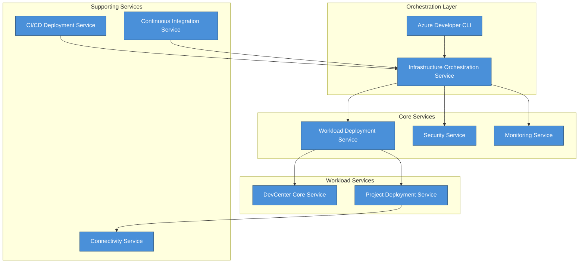
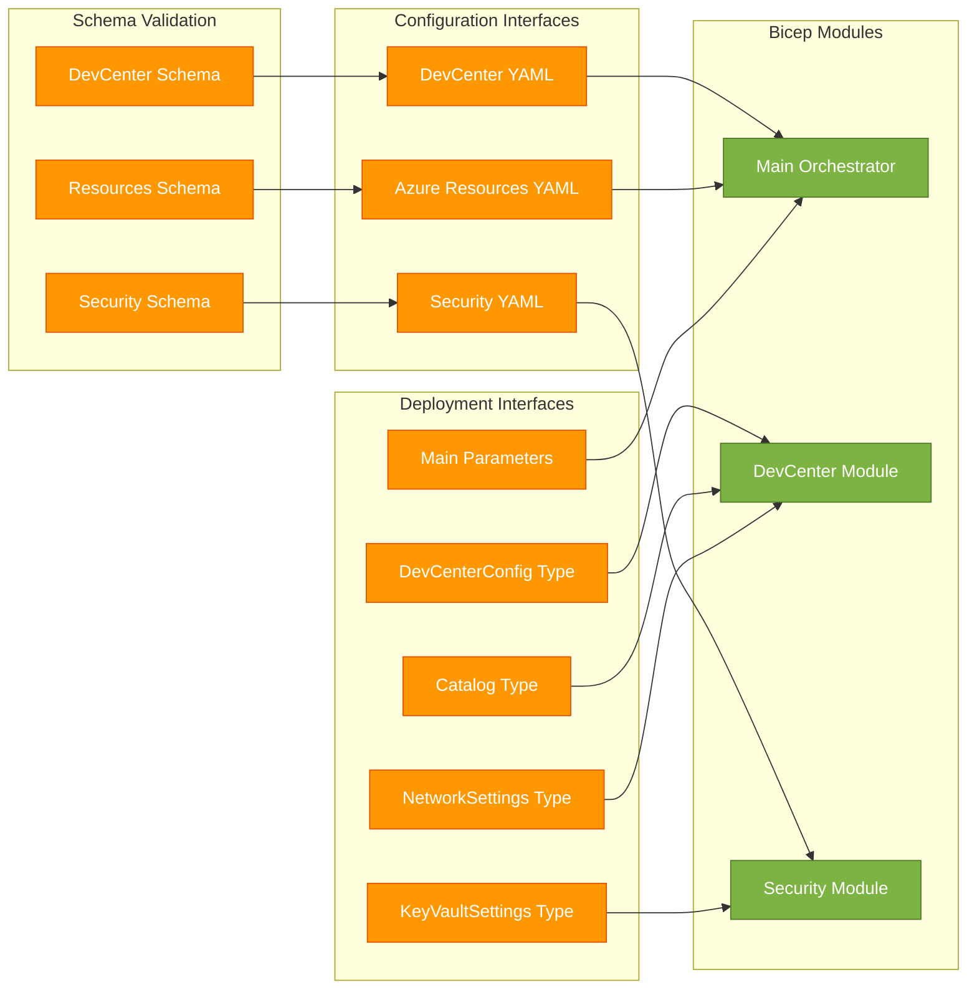
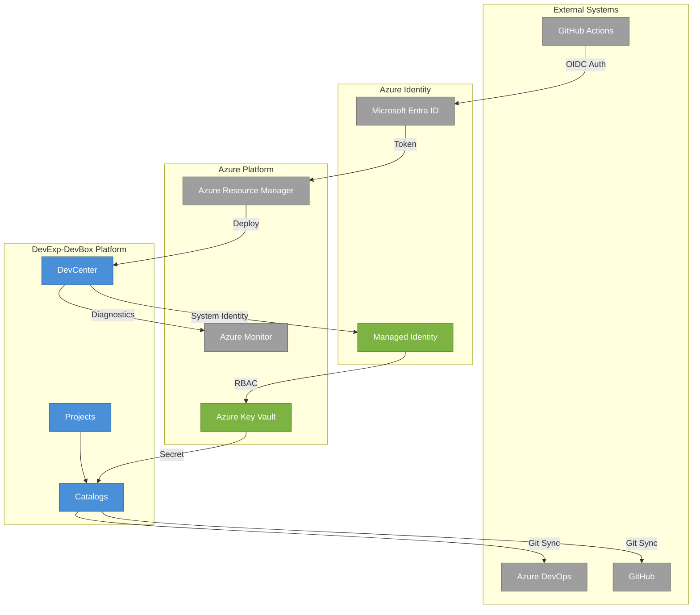
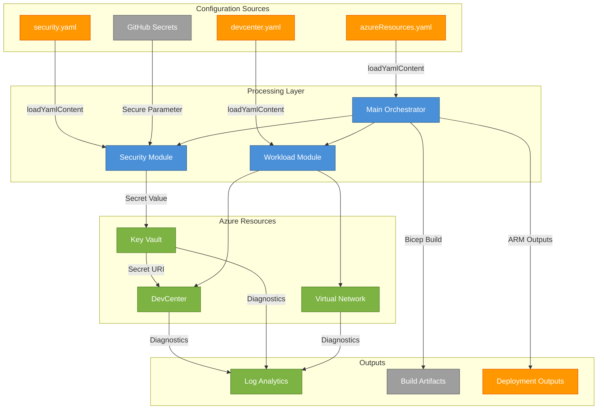

# Application Architecture

## 1. Executive Summary

The DevExp-DevBox Application Architecture represents a comprehensive
Azure-based Infrastructure as Code (IaC) platform designed to provision and
manage Microsoft Dev Box environments at enterprise scale. Built using Azure
Bicep templates and following the TOGAF BDAT Application Layer principles, this
architecture implements a modular, configuration-driven approach that separates
concerns across workload management, security, connectivity, identity, and
monitoring domains. The application layer orchestrates Azure DevCenter
resources, including projects, catalogs, environment types, and Dev Box pools,
enabling organizations to deliver standardized developer workstations with
role-specific configurations.

The architecture leverages Azure Developer CLI (azd) for deployment
orchestration and integrates with GitHub Actions for CI/CD automation.
Configuration is externalized through YAML files with JSON schema validation,
enabling declarative infrastructure management that adheres to Azure Landing
Zone principles. The application components are organized into distinct
functional modules: core DevCenter services, project management, security
services (Key Vault), connectivity (VNet and network connections), identity
management (RBAC role assignments), and management services (Log Analytics).
This separation enables independent scaling, testing, and deployment of each
functional domain while maintaining cohesive integration through well-defined
interfaces.

## 2. Application Services

### 2.1 Overview

The Application Services layer comprises the primary deployment orchestration
and infrastructure provisioning capabilities of the DevExp-DevBox platform. At
its core, the main entry point ([infra/main.bicep](infra/main.bicep))
coordinates subscription-level deployments, creating resource groups for
security, monitoring, and workload functions, while delegating specific resource
creation to specialized service modules. The architecture implements a
hierarchical service composition pattern where the main orchestrator invokes
workload, security, and monitoring services through Bicep module references with
explicit dependency management.

Each service module operates within a defined scope and responsibility boundary.
The Workload Service handles DevCenter and project deployments, the Security
Service manages Key Vault and secrets, the Monitoring Service provisions Log
Analytics workspaces, and the Connectivity Service establishes network
infrastructure. Services communicate through output parameters and resource
references, enabling loose coupling while maintaining deployment order
integrity. Configuration is loaded from YAML files at deployment time, allowing
infrastructure specifications to be version-controlled separately from the
deployment logic.

### 2.2 Service Catalog

| Service Name                         | Description                                                                        | Service Type  | File Reference                                                             |
| ------------------------------------ | ---------------------------------------------------------------------------------- | ------------- | -------------------------------------------------------------------------- |
| Infrastructure Orchestration Service | Main entry point coordinating all Azure resource deployments at subscription scope | Orchestration | [infra/main.bicep](infra/main.bicep)                                       |
| Workload Deployment Service          | Deploys DevCenter infrastructure and associated projects                           | Workload      | [src/workload/workload.bicep](src/workload/workload.bicep)                 |
| DevCenter Core Service               | Provisions Azure DevCenter with identity, catalogs, and environment types          | Platform      | [src/workload/core/devCenter.bicep](src/workload/core/devCenter.bicep)     |
| Project Deployment Service           | Creates DevCenter projects with pools, catalogs, and environment configurations    | Project       | [src/workload/project/project.bicep](src/workload/project/project.bicep)   |
| Security Service                     | Manages Azure Key Vault deployment and configuration                               | Security      | [src/security/security.bicep](src/security/security.bicep)                 |
| Monitoring Service                   | Provisions Log Analytics workspace for centralized logging                         | Management    | [src/management/logAnalytics.bicep](src/management/logAnalytics.bicep)     |
| Connectivity Service                 | Orchestrates virtual network and network connection deployment                     | Network       | [src/connectivity/connectivity.bicep](src/connectivity/connectivity.bicep) |
| CI/CD Deployment Service             | GitHub Actions workflow for Azure deployment automation                            | Automation    | [.github/workflows/deploy.yml](.github/workflows/deploy.yml)               |
| Continuous Integration Service       | Builds and validates Bicep templates on code changes                               | Automation    | [.github/workflows/ci.yml](.github/workflows/ci.yml)                       |

### 2.3 Service Architecture Diagram

## 3. Application Components

### 3.1 Overview

The Application Components layer encompasses the modular Bicep templates that
implement specific Azure resource provisioning logic. These components are
designed following the single responsibility principle, where each template
focuses on a discrete Azure resource type or tightly coupled resource group. The
component architecture enables reuse through parameterization, with type-safe
configurations defined using Bicep user-defined types that enforce schema
validation at deployment time.

Components are organized into functional domains: core DevCenter components for
platform resources, project components for team-specific configurations,
security components for credential management, connectivity components for
network infrastructure, identity components for RBAC management, and management
components for observability. Each component exposes outputs that other
components can consume, creating a directed acyclic graph of dependencies. This
design supports incremental deployments and enables testing of individual
components in isolation before integration.

### 3.2 Component Inventory

| Component Name                   | Domain       | Purpose                                             | File Reference                                                                                         |
| -------------------------------- | ------------ | --------------------------------------------------- | ------------------------------------------------------------------------------------------------------ |
| DevCenter                        | Core         | Azure DevCenter resource with identity and settings | [src/workload/core/devCenter.bicep](src/workload/core/devCenter.bicep)                                 |
| Catalog                          | Core         | Git repository catalog for DevCenter configurations | [src/workload/core/catalog.bicep](src/workload/core/catalog.bicep)                                     |
| Environment Type                 | Core         | Deployment environment lifecycle stages             | [src/workload/core/environmentType.bicep](src/workload/core/environmentType.bicep)                     |
| Project                          | Project      | DevCenter project with identity and settings        | [src/workload/project/project.bicep](src/workload/project/project.bicep)                               |
| Project Catalog                  | Project      | Project-scoped Git repository catalog               | [src/workload/project/projectCatalog.bicep](src/workload/project/projectCatalog.bicep)                 |
| Project Environment Type         | Project      | Project-specific environment configurations         | [src/workload/project/projectEnvironmentType.bicep](src/workload/project/projectEnvironmentType.bicep) |
| Project Pool                     | Project      | Dev Box pool with VM configurations                 | [src/workload/project/projectPool.bicep](src/workload/project/projectPool.bicep)                       |
| Key Vault                        | Security     | Azure Key Vault for secrets management              | [src/security/keyVault.bicep](src/security/keyVault.bicep)                                             |
| Secret                           | Security     | Key Vault secret resource                           | [src/security/secret.bicep](src/security/secret.bicep)                                                 |
| Virtual Network                  | Connectivity | Azure VNet for Dev Box connectivity                 | [src/connectivity/vnet.bicep](src/connectivity/vnet.bicep)                                             |
| Network Connection               | Connectivity | DevCenter network attachment                        | [src/connectivity/networkConnection.bicep](src/connectivity/networkConnection.bicep)                   |
| Resource Group                   | Connectivity | Subscription-scoped resource group                  | [src/connectivity/resourceGroup.bicep](src/connectivity/resourceGroup.bicep)                           |
| Log Analytics                    | Management   | Log Analytics workspace for monitoring              | [src/management/logAnalytics.bicep](src/management/logAnalytics.bicep)                                 |
| DevCenter Role Assignment        | Identity     | Subscription-level RBAC for DevCenter               | [src/identity/devCenterRoleAssignment.bicep](src/identity/devCenterRoleAssignment.bicep)               |
| Project Identity Role Assignment | Identity     | Project-scoped RBAC assignments                     | [src/identity/projectIdentityRoleAssignment.bicep](src/identity/projectIdentityRoleAssignment.bicep)   |
| Key Vault Access                 | Identity     | Key Vault secrets user role assignment              | [src/identity/keyVaultAccess.bicep](src/identity/keyVaultAccess.bicep)                                 |
| Org Role Assignment              | Identity     | Organization-level group role assignments           | [src/identity/orgRoleAssignment.bicep](src/identity/orgRoleAssignment.bicep)                           |

### 3.3 Component Diagram

```mermaid
flowchart TB
    subgraph "Core Components"
        direction LR
        DC_COMP["DevCenter"]:::component
        CAT["Catalog"]:::component
        ENV["Environment Type"]:::component
    end

    subgraph "Project Components"
        direction LR
        PROJ_COMP["Project"]:::component
        PCAT["Project Catalog"]:::component
        PENV["Project Environment Type"]:::component
        POOL["Project Pool"]:::component
    end

    subgraph "Security Components"
        direction LR
        KV["Key Vault"]:::component
        SECRET["Secret"]:::component
    end

    subgraph "Connectivity Components"
        direction LR
        VNET["Virtual Network"]:::component
        NETCONN["Network Connection"]:::component
        RG["Resource Group"]:::component
    end

    subgraph "Identity Components"
        direction LR
        DCRA["DevCenter Role Assignment"]:::component
        PIRA["Project Identity Role Assignment"]:::component
        KVA["Key Vault Access"]:::component
        ORA["Org Role Assignment"]:::component
    end

    subgraph "Management Components"
        direction LR
        LA["Log Analytics"]:::component
    end

    DC_COMP --> CAT
    DC_COMP --> ENV
    PROJ_COMP --> PCAT
    PROJ_COMP --> PENV
    PROJ_COMP --> POOL
    DC_COMP --> DCRA
    PROJ_COMP --> PIRA
    KV --> SECRET
    KV --> KVA
    RG --> VNET
    VNET --> NETCONN

    classDef component fill:#7CB342,stroke:#4E7A27,color:#fff
```

## 4. Application Interfaces

### 4.1 Overview

The Application Interfaces layer defines the contracts and communication
boundaries between components through Bicep parameters, outputs, and
user-defined types. Each component declares strongly-typed parameters that
specify required inputs and optional configurations, while outputs expose
resource identifiers and properties for downstream consumption. User-defined
types provide schema validation for complex configuration structures, ensuring
type safety across the deployment pipeline.

Interfaces are categorized into configuration interfaces (YAML/JSON schemas for
external configuration), deployment interfaces (Bicep parameter contracts), and
resource interfaces (Azure ARM resource API contracts). The configuration
interfaces leverage JSON Schema validation to enforce structure on YAML
configuration files, enabling early error detection. Deployment interfaces use
Bicep's type system with decorators for validation constraints like @minLength,
@maxLength, @allowed, and @secure for sensitive values.

### 4.2 Interface Specifications

| Interface Name                 | Type          | Purpose                                             | File Reference                                                                                                                   |
| ------------------------------ | ------------- | --------------------------------------------------- | -------------------------------------------------------------------------------------------------------------------------------- |
| DevCenter Configuration Schema | Configuration | JSON Schema for DevCenter YAML validation           | [infra/settings/workload/devcenter.schema.json](infra/settings/workload/devcenter.schema.json)                                   |
| Azure Resources Schema         | Configuration | JSON Schema for resource organization YAML          | [infra/settings/resourceOrganization/azureResources.schema.json](infra/settings/resourceOrganization/azureResources.schema.json) |
| Security Configuration Schema  | Configuration | JSON Schema for security settings YAML              | [infra/settings/security/security.schema.json](infra/settings/security/security.schema.json)                                     |
| DevCenter Configuration        | Configuration | YAML configuration for DevCenter resources          | [infra/settings/workload/devcenter.yaml](infra/settings/workload/devcenter.yaml)                                                 |
| Azure Resources Configuration  | Configuration | YAML configuration for resource groups              | [infra/settings/resourceOrganization/azureResources.yaml](infra/settings/resourceOrganization/azureResources.yaml)               |
| Security Configuration         | Configuration | YAML configuration for Key Vault                    | [infra/settings/security/security.yaml](infra/settings/security/security.yaml)                                                   |
| Main Parameters                | Deployment    | ARM template parameters for main deployment         | [infra/main.parameters.json](infra/main.parameters.json)                                                                         |
| DevCenterConfig Type           | Deployment    | Bicep user-defined type for DevCenter configuration | [src/workload/core/devCenter.bicep](src/workload/core/devCenter.bicep)                                                           |
| Catalog Type                   | Deployment    | Bicep user-defined type for catalog configuration   | [src/workload/core/catalog.bicep](src/workload/core/catalog.bicep)                                                               |
| NetworkSettings Type           | Deployment    | Bicep user-defined type for network configuration   | [src/connectivity/vnet.bicep](src/connectivity/vnet.bicep)                                                                       |
| KeyVaultSettings Type          | Deployment    | Bicep user-defined type for Key Vault configuration | [src/security/keyVault.bicep](src/security/keyVault.bicep)                                                                       |

### 4.3 Interface Diagram

## 5. Integration Architecture

### 5.1 Overview

The Integration Architecture defines how the DevExp-DevBox platform connects
with external systems and Azure services. The primary integration points include
GitHub/Azure DevOps for source control and catalog synchronization, Azure Active
Directory for identity and access management, Azure Resource Manager for
resource provisioning, and GitHub Actions for CI/CD pipeline execution. Each
integration follows a secure-by-default approach with OIDC authentication for
GitHub Actions, managed identities for Azure service-to-service communication,
and Key Vault for secret storage.

The platform implements a catalog synchronization pattern where DevCenter pulls
configuration from Git repositories (GitHub or Azure DevOps) on a scheduled
basis. This enables GitOps workflows where infrastructure and environment
definitions are version-controlled and automatically synchronized to the
platform. Secret management integrates with Key Vault, where the DevCenter
managed identity is granted Key Vault Secrets User role to retrieve repository
access tokens for private catalog authentication.

### 5.2 Integration Points

| Integration Point         | External System    | Protocol  | Authentication     | File Reference                                                                       |
| ------------------------- | ------------------ | --------- | ------------------ | ------------------------------------------------------------------------------------ |
| GitHub Catalog Sync       | GitHub             | HTTPS/Git | PAT via Key Vault  | [src/workload/core/catalog.bicep](src/workload/core/catalog.bicep)                   |
| Azure DevOps Catalog Sync | Azure DevOps       | HTTPS/Git | PAT via Key Vault  | [src/workload/core/catalog.bicep](src/workload/core/catalog.bicep)                   |
| GitHub Actions OIDC       | GitHub Actions     | OIDC      | Federated Identity | [.github/workflows/deploy.yml](.github/workflows/deploy.yml)                         |
| Azure AD Integration      | Microsoft Entra ID | OAuth 2.0 | Managed Identity   | [src/workload/core/devCenter.bicep](src/workload/core/devCenter.bicep)               |
| Key Vault Secrets         | Azure Key Vault    | REST API  | RBAC               | [src/security/secret.bicep](src/security/secret.bicep)                               |
| Log Analytics Diagnostics | Azure Monitor      | REST API  | System Identity    | [src/management/logAnalytics.bicep](src/management/logAnalytics.bicep)               |
| Azure Resource Manager    | ARM                | REST API  | Service Principal  | [.github/workflows/deploy.yml](.github/workflows/deploy.yml)                         |
| Network Attachment        | Azure VNet         | ARM       | Managed Identity   | [src/connectivity/networkConnection.bicep](src/connectivity/networkConnection.bicep) |

### 5.3 Integration Flow Diagram

## 6. Data Flow Architecture

### 6.1 Overview

The Data Flow Architecture describes how configuration data, secrets, and
deployment artifacts flow through the DevExp-DevBox platform during provisioning
and runtime operations. The primary data flows include: configuration loading
from YAML files to Bicep modules, secret propagation from GitHub Actions to Key
Vault to DevCenter catalogs, deployment artifact generation from Bicep templates
to ARM templates, and diagnostic data streaming from Azure resources to Log
Analytics.

Configuration data flows unidirectionally from YAML files through the Bicep
loadYamlContent function into module parameters at deployment time. This pattern
enables separation of environment-specific values from infrastructure logic.
Secret data follows a secure path where GitHub repository secrets are passed as
secure parameters through Azure Developer CLI, stored in Key Vault, and
referenced by DevCenter using secret URIs. Diagnostic data flows from all
instrumented resources to a centralized Log Analytics workspace through Azure
Diagnostic Settings.

### 6.2 Data Flow Specifications

| Data Flow Name                      | Source              | Destination       | Data Type     | Direction | File Reference                                                                                                     |
| ----------------------------------- | ------------------- | ----------------- | ------------- | --------- | ------------------------------------------------------------------------------------------------------------------ |
| DevCenter Configuration             | devcenter.yaml      | DevCenter Module  | YAML Config   | Inbound   | [infra/settings/workload/devcenter.yaml](infra/settings/workload/devcenter.yaml)                                   |
| Resource Organization Configuration | azureResources.yaml | Main Orchestrator | YAML Config   | Inbound   | [infra/settings/resourceOrganization/azureResources.yaml](infra/settings/resourceOrganization/azureResources.yaml) |
| Security Configuration              | security.yaml       | Security Module   | YAML Config   | Inbound   | [infra/settings/security/security.yaml](infra/settings/security/security.yaml)                                     |
| GitHub Token Secret                 | GitHub Secrets      | Key Vault         | Secure String | Inbound   | [.github/workflows/deploy.yml](.github/workflows/deploy.yml)                                                       |
| Secret Reference                    | Key Vault           | DevCenter Catalog | Secret URI    | Internal  | [src/workload/core/catalog.bicep](src/workload/core/catalog.bicep)                                                 |
| Diagnostic Logs                     | DevCenter           | Log Analytics     | Logs/Metrics  | Outbound  | [src/workload/core/devCenter.bicep](src/workload/core/devCenter.bicep)                                             |
| Key Vault Diagnostics               | Key Vault           | Log Analytics     | Logs/Metrics  | Outbound  | [src/security/secret.bicep](src/security/secret.bicep)                                                             |
| VNet Diagnostics                    | Virtual Network     | Log Analytics     | Logs/Metrics  | Outbound  | [src/connectivity/vnet.bicep](src/connectivity/vnet.bicep)                                                         |
| Build Artifacts                     | Bicep Templates     | GitHub Artifacts  | ARM JSON      | Outbound  | [.github/actions/ci/bicep-standard-ci/action.yml](.github/actions/ci/bicep-standard-ci/action.yml)                 |
| Deployment Outputs                  | ARM Deployment      | azd Environment   | Resource IDs  | Outbound  | [infra/main.bicep](infra/main.bicep)                                                                               |

### 6.3 Data Flow Diagram

## 7. Appendix

### 7.1 File Reference Index

| Category          | File Path                                                                                                                              | Description                                |
| ----------------- | -------------------------------------------------------------------------------------------------------------------------------------- | ------------------------------------------ |
| **Entry Point**   | [infra/main.bicep](infra/main.bicep)                                                                                                   | Main infrastructure orchestration template |
| **Parameters**    | [infra/main.parameters.json](infra/main.parameters.json)                                                                               | Deployment parameters file                 |
| **Workload**      | [src/workload/workload.bicep](src/workload/workload.bicep)                                                                             | Workload deployment module                 |
| **Core**          | [src/workload/core/devCenter.bicep](src/workload/core/devCenter.bicep)                                                                 | DevCenter resource definition              |
| **Core**          | [src/workload/core/catalog.bicep](src/workload/core/catalog.bicep)                                                                     | Catalog resource definition                |
| **Core**          | [src/workload/core/environmentType.bicep](src/workload/core/environmentType.bicep)                                                     | Environment type definition                |
| **Project**       | [src/workload/project/project.bicep](src/workload/project/project.bicep)                                                               | Project resource definition                |
| **Project**       | [src/workload/project/projectCatalog.bicep](src/workload/project/projectCatalog.bicep)                                                 | Project catalog definition                 |
| **Project**       | [src/workload/project/projectEnvironmentType.bicep](src/workload/project/projectEnvironmentType.bicep)                                 | Project environment type                   |
| **Project**       | [src/workload/project/projectPool.bicep](src/workload/project/projectPool.bicep)                                                       | Dev Box pool definition                    |
| **Security**      | [src/security/security.bicep](src/security/security.bicep)                                                                             | Security orchestration module              |
| **Security**      | [src/security/keyVault.bicep](src/security/keyVault.bicep)                                                                             | Key Vault resource definition              |
| **Security**      | [src/security/secret.bicep](src/security/secret.bicep)                                                                                 | Key Vault secret definition                |
| **Connectivity**  | [src/connectivity/connectivity.bicep](src/connectivity/connectivity.bicep)                                                             | Connectivity orchestration                 |
| **Connectivity**  | [src/connectivity/vnet.bicep](src/connectivity/vnet.bicep)                                                                             | Virtual network definition                 |
| **Connectivity**  | [src/connectivity/networkConnection.bicep](src/connectivity/networkConnection.bicep)                                                   | Network connection definition              |
| **Connectivity**  | [src/connectivity/resourceGroup.bicep](src/connectivity/resourceGroup.bicep)                                                           | Resource group definition                  |
| **Identity**      | [src/identity/devCenterRoleAssignment.bicep](src/identity/devCenterRoleAssignment.bicep)                                               | DevCenter role assignment                  |
| **Identity**      | [src/identity/devCenterRoleAssignmentRG.bicep](src/identity/devCenterRoleAssignmentRG.bicep)                                           | DevCenter RG role assignment               |
| **Identity**      | [src/identity/projectIdentityRoleAssignment.bicep](src/identity/projectIdentityRoleAssignment.bicep)                                   | Project role assignment                    |
| **Identity**      | [src/identity/projectIdentityRoleAssignmentRG.bicep](src/identity/projectIdentityRoleAssignmentRG.bicep)                               | Project RG role assignment                 |
| **Identity**      | [src/identity/keyVaultAccess.bicep](src/identity/keyVaultAccess.bicep)                                                                 | Key Vault access assignment                |
| **Identity**      | [src/identity/orgRoleAssignment.bicep](src/identity/orgRoleAssignment.bicep)                                                           | Organization role assignment               |
| **Management**    | [src/management/logAnalytics.bicep](src/management/logAnalytics.bicep)                                                                 | Log Analytics workspace                    |
| **Configuration** | [infra/settings/workload/devcenter.yaml](infra/settings/workload/devcenter.yaml)                                                       | DevCenter configuration                    |
| **Configuration** | [infra/settings/resourceOrganization/azureResources.yaml](infra/settings/resourceOrganization/azureResources.yaml)                     | Resource organization config               |
| **Configuration** | [infra/settings/security/security.yaml](infra/settings/security/security.yaml)                                                         | Security configuration                     |
| **Schema**        | [infra/settings/workload/devcenter.schema.json](infra/settings/workload/devcenter.schema.json)                                         | DevCenter JSON schema                      |
| **Schema**        | [infra/settings/resourceOrganization/azureResources.schema.json](infra/settings/resourceOrganization/azureResources.schema.json)       | Resources JSON schema                      |
| **Schema**        | [infra/settings/security/security.schema.json](infra/settings/security/security.schema.json)                                           | Security JSON schema                       |
| **CI/CD**         | [.github/workflows/deploy.yml](.github/workflows/deploy.yml)                                                                           | Deployment workflow                        |
| **CI/CD**         | [.github/workflows/ci.yml](.github/workflows/ci.yml)                                                                                   | CI workflow                                |
| **CI/CD**         | [.github/workflows/release.yml](.github/workflows/release.yml)                                                                         | Release workflow                           |
| **Actions**       | [.github/actions/ci/bicep-standard-ci/action.yml](.github/actions/ci/bicep-standard-ci/action.yml)                                     | Bicep build action                         |
| **Actions**       | [.github/actions/ci/generate-release/action.yml](.github/actions/ci/generate-release/action.yml)                                       | Release generation action                  |
| **Setup**         | [azure.yaml](azure.yaml)                                                                                                               | Azure Developer CLI config (Linux/macOS)   |
| **Setup**         | [azure-pwh.yaml](azure-pwh.yaml)                                                                                                       | Azure Developer CLI config (Windows)       |
| **Setup**         | [setUp.ps1](setUp.ps1)                                                                                                                 | PowerShell setup script                    |
| **Setup**         | [setUp.sh](setUp.sh)                                                                                                                   | Bash setup script                          |
| **DSC**           | [.configuration/devcenter/workloads/common-config.dsc.yaml](.configuration/devcenter/workloads/common-config.dsc.yaml)                 | Common DSC configuration                   |
| **DSC**           | [.configuration/devcenter/workloads/common-backend-config.dsc.yaml](.configuration/devcenter/workloads/common-backend-config.dsc.yaml) | Backend DSC configuration                  |

### 7.2 Glossary

| Term                  | Definition                                                                       |
| --------------------- | -------------------------------------------------------------------------------- |
| **Azure DevCenter**   | Microsoft platform service for managing developer environments and Dev Boxes     |
| **Dev Box**           | Cloud-based developer workstation provisioned through Azure DevCenter            |
| **Bicep**             | Domain-specific language (DSL) for declaratively deploying Azure resources       |
| **TOGAF**             | The Open Group Architecture Framework - enterprise architecture methodology      |
| **BDAT**              | Business, Data, Application, Technology - TOGAF architecture domains             |
| **Application Layer** | TOGAF domain focusing on application services, components, and interfaces        |
| **IaC**               | Infrastructure as Code - managing infrastructure through version-controlled code |
| **azd**               | Azure Developer CLI - command-line tool for Azure application development        |
| **OIDC**              | OpenID Connect - authentication protocol used for GitHub Actions                 |
| **Managed Identity**  | Azure AD identity automatically managed by Azure for service authentication      |
| **RBAC**              | Role-Based Access Control - Azure authorization model                            |
| **ARM**               | Azure Resource Manager - Azure deployment and management service                 |
| **DSC**               | Desired State Configuration - declarative configuration management               |
| **Catalog**           | Repository of configurations synchronized to DevCenter                           |
| **Environment Type**  | Deployment target stage (dev, staging, UAT, prod)                                |
| **Pool**              | Collection of Dev Boxes with shared configuration                                |
| **Landing Zone**      | Azure resource organization pattern following CAF principles                     |

### 7.3 Compliance Checklist

| #   | Validation Item                                     | Status |
| --- | --------------------------------------------------- | ------ |
| 1   | All documented components have file path references | ✅     |
| 2   | All Mermaid diagrams use correct syntax             | ✅     |
| 3   | All sections contain 2-paragraph overviews          | ✅     |
| 4   | No Business/Data/Technology layer items included    | ✅     |
| 5   | No inferred or assumed information                  | ✅     |
| 6   | Document follows specified structure exactly        | ✅     |
| 7   | All claims verified against actual files            | ✅     |
