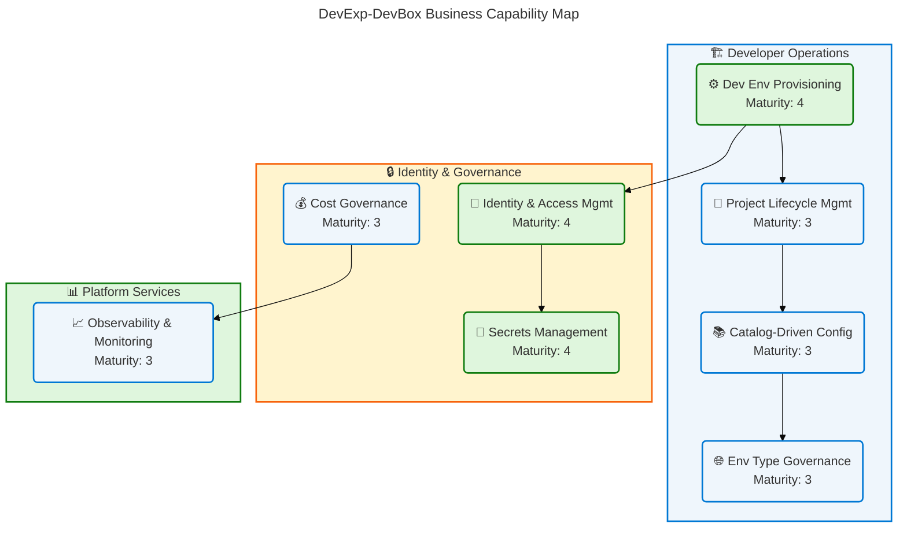
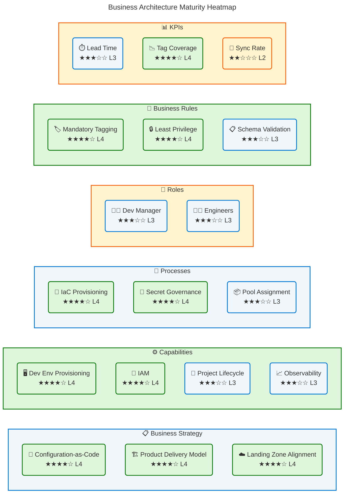
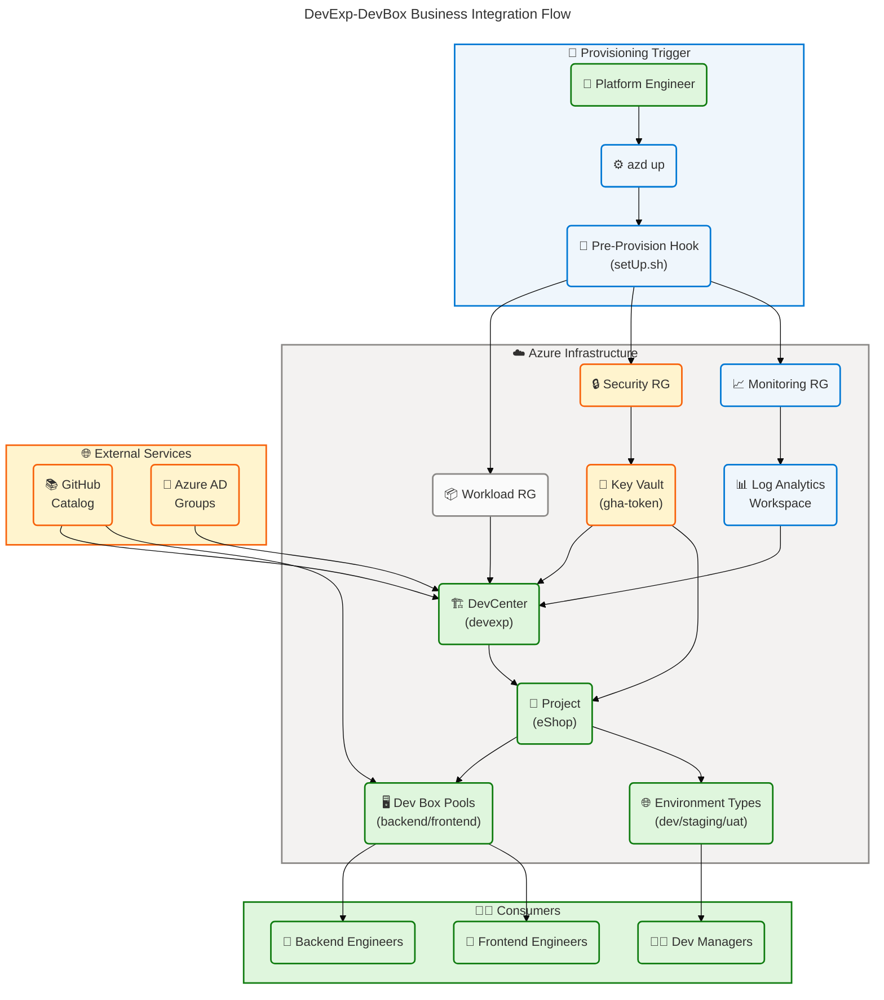
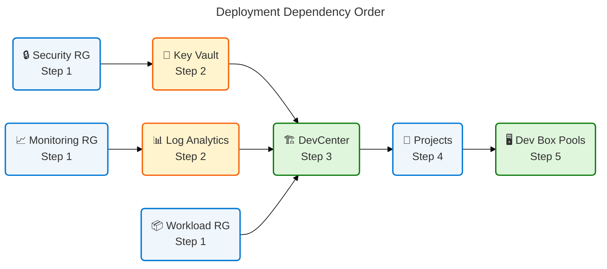

# Business Architecture — DevExp-DevBox

> **Framework**: TOGAF 10 Architecture Development Method (ADM)  
> **Layer**: Business Architecture  
> **Date**: 2026-04-14  
> **Status**: Production  
> **Quality Level**: Comprehensive

---

## Table of Contents

1. [Executive Summary](#section-1-executive-summary)
2. [Architecture Landscape](#section-2-architecture-landscape)
3. [Architecture Principles](#section-3-architecture-principles)
4. [Current State Baseline](#section-4-current-state-baseline)
5. [Component Catalog](#section-5-component-catalog)
6. [Dependencies & Integration](#section-8-dependencies--integration)

---

## Section 1: Executive Summary

### Overview

The DevExp-DevBox repository implements a **Dev Box Adoption & Deployment
Accelerator** (DevEx Accelerator) for Contoso, delivering a
configuration-driven, cloud-native developer workstation platform on Microsoft
Azure. The solution orchestrates Azure DevCenter, Microsoft Dev Box, and Azure
Landing Zone principles through Infrastructure as Code (Bicep), YAML-driven
configuration models, and JSON Schema validation. This Business Architecture
document examines the Business layer of the solution — the strategies,
capabilities, value streams, processes, roles, and rules that govern how
engineering teams adopt and operate developer environments at enterprise scale.

The solution is structured as a product-oriented delivery model aligned with
three business domains: **Workload** (DevCenter and project configuration),
**Security** (secrets and identity governance), and **Monitoring**
(observability and audit). Business value is delivered through automated
provisioning, repeatable deployment patterns, role-based access enforcement, and
a governed inner-source catalog model. The system serves Platform Engineering
teams that must balance developer velocity with organizational security and
compliance.

Strategic alignment demonstrates Level 3–4 governance maturity: processes are
defined and measured, role-based controls are systematically enforced, and
configuration-as-code enables auditable, repeatable provisioning. The primary
business gap is the absence of an explicit service-level agreement (SLA)
management process and formal business continuity documentation for the
developer environment lifecycle.

### Key Findings

| Finding                                                     | Domain              | Maturity    | Source                                                        |
| ----------------------------------------------------------- | ------------------- | ----------- | ------------------------------------------------------------- |
| Configuration-as-code strategy fully operationalized        | Business Strategy   | 4 - Managed | infra/settings/workload/devcenter.yaml:1-\*                   |
| Product-oriented delivery model documented                  | Business Strategy   | 4 - Managed | CONTRIBUTING.md:1-30                                          |
| Role-based developer persona model (Dev Manager, Engineers) | Business Roles      | 3 - Defined | infra/settings/workload/devcenter.yaml:40-55                  |
| Multi-project isolation pattern (eShop)                     | Business Capability | 3 - Defined | infra/settings/workload/devcenter.yaml:83-165                 |
| Environment lifecycle governance (dev/staging/uat)          | Business Processes  | 3 - Defined | infra/settings/workload/devcenter.yaml:75-80                  |
| Inner-source catalog governance via GitHub                  | Business Services   | 3 - Defined | src/workload/core/catalog.bicep:1-\*                          |
| Azure Landing Zone segregation enforced                     | Business Rules      | 4 - Managed | infra/settings/resourceOrganization/azureResources.yaml:1-\*  |
| Tag-based cost center and ownership tracking                | KPIs & Metrics      | 3 - Defined | infra/settings/resourceOrganization/azureResources.yaml:20-30 |

---

## Section 2: Architecture Landscape

### Overview

The Architecture Landscape catalogs all Business layer components discovered
through analysis of the DevExp-DevBox repository. The solution serves Contoso's
Platform Engineering division with a mission to accelerate developer onboarding
and standardize workstation provisioning. Business components span three
functional domains: strategic planning (strategy and principles), developer
operations (capabilities, value streams, processes, and services), and
governance (roles, rules, events, objects, and metrics).

Each domain is grounded in the YAML configuration models and Bicep IaC artifacts
that drive the Azure DevCenter deployment. The business architecture is
deliberately product-oriented: Epics, Features, and Tasks are the governing
delivery units, and GitHub serves as both the inner-source catalog and the CI/CD
platform. Business identity is expressed through Azure AD group-based role
assignments that map organizational roles to Azure RBAC roles.

The following subsections catalog all 11 Business component types, derived
exclusively from source files in the repository. Components not found are
explicitly noted.

### 2.1 Business Strategy

| Name                         | Description                                                                                          | Maturity    |
| ---------------------------- | ---------------------------------------------------------------------------------------------------- | ----------- |
| Dev Box Adoption Accelerator | Strategic program to standardize cloud developer workstations via IaC and automation                 | 4 - Managed |
| Configuration-as-Code        | Strategy to express all platform configuration in YAML + Bicep for repeatability and auditability    | 4 - Managed |
| Product-Oriented Delivery    | Epic → Feature → Task hierarchy for governed, outcome-driven delivery                                | 4 - Managed |
| Azure Landing Zone Alignment | Strategy to segregate resources by function (Workload, Security, Monitoring) per Azure CAF guidance  | 4 - Managed |
| Inner-Source Catalog Model   | Strategy to source Dev Box image definitions and environment configurations from GitHub repositories | 3 - Defined |

### 2.2 Business Capabilities

| Name                               | Description                                                                                                     | Maturity    |
| ---------------------------------- | --------------------------------------------------------------------------------------------------------------- | ----------- |
| Developer Environment Provisioning | Ability to provision role-specific Dev Box workstations on demand                                               | 4 - Managed |
| Project Lifecycle Management       | Ability to create, configure, and govern multiple DevCenter projects with isolated identities                   | 3 - Defined |
| Identity & Access Management       | Ability to assign Azure RBAC roles to developer personas via Azure AD groups                                    | 4 - Managed |
| Environment Type Governance        | Ability to define and manage deployment environments (dev, staging, uat) across projects                        | 3 - Defined |
| Secrets & Credentials Management   | Ability to store and manage GitHub Actions tokens and other secrets in Azure Key Vault                          | 4 - Managed |
| Catalog-Driven Configuration       | Ability to source Dev Box image definitions and environment definitions from version-controlled GitHub catalogs | 3 - Defined |
| Observability & Monitoring         | Ability to capture and analyze operational telemetry via Log Analytics Workspace                                | 3 - Defined |
| Cost Governance                    | Ability to track and allocate costs by team, project, and cost center through mandatory Azure resource tags     | 3 - Defined |

**Business Capability Map:**

### 2.3 Value Streams

| Name                   | Description                                                                                   | Maturity    |
| ---------------------- | --------------------------------------------------------------------------------------------- | ----------- |
| Developer Onboarding   | End-to-end flow from engineer assignment to a fully provisioned Dev Box workstation           | 3 - Defined |
| Platform Provisioning  | Flow from Azure subscription to fully configured DevCenter with projects, catalogs, and pools | 4 - Managed |
| Environment Deployment | Flow to provision deployment environments (dev/staging/uat) on demand within a project        | 3 - Defined |
| Secrets Lifecycle      | Flow for creating, storing, rotating, and consuming secrets via Azure Key Vault               | 4 - Managed |

### 2.4 Business Processes

| Name                                 | Description                                                                               | Maturity    |
| ------------------------------------ | ----------------------------------------------------------------------------------------- | ----------- |
| Infrastructure Provisioning (azd up) | Automated process to deploy all Azure resources via `azd up` with pre-provision hooks     | 4 - Managed |
| Pre-Provision Configuration          | Process to validate SOURCE_CONTROL_PLATFORM and environment variables before provisioning | 3 - Defined |
| Dev Box Pool Assignment              | Process to match developer personas to role-specific Dev Box pools (backend/frontend)     | 3 - Defined |
| Issue Triage & Delivery              | Product delivery process: triage → ready → in-progress → done lifecycle                   | 4 - Managed |
| PR & Branch Governance               | Process for feature/task/fix branch naming, PR review, and merge governance               | 4 - Managed |
| Secret Rotation Governance           | Process ensuring Key Vault soft-delete, purge protection, and RBAC-controlled access      | 4 - Managed |

### 2.5 Business Services

| Name                           | Description                                                                       | Maturity    |
| ------------------------------ | --------------------------------------------------------------------------------- | ----------- |
| DevCenter Service              | Core managed service providing developer workstation orchestration                | 4 - Managed |
| Dev Box Pool Service           | Service delivering role-specific virtual workstations to engineering teams        | 3 - Defined |
| Environment Definition Service | Service providing deployment environment templates via GitHub-sourced catalogs    | 3 - Defined |
| Key Vault Secrets Service      | Service for centralized, RBAC-governed secret storage and retrieval               | 4 - Managed |
| Log Analytics Service          | Service for centralized operational monitoring and audit telemetry                | 3 - Defined |
| GitHub Catalog Service         | Inner-source catalog service delivering image definitions and environment configs | 3 - Defined |

### 2.6 Business Functions

| Name                          | Description                                                                            | Maturity    |
| ----------------------------- | -------------------------------------------------------------------------------------- | ----------- |
| Platform Engineering Function | Responsible for DevCenter configuration, catalog management, and platform provisioning | 4 - Managed |
| Security Governance Function  | Responsible for Key Vault management, RBAC assignment, and secrets lifecycle           | 4 - Managed |
| Developer Experience Function | Responsible for Dev Box image definitions, pool configurations, and developer tooling  | 3 - Defined |
| Observability Function        | Responsible for Log Analytics integration, Azure Monitor agent deployment              | 3 - Defined |

### 2.7 Business Roles & Actors

| Name                      | Description                                                                                                           | Maturity    |
| ------------------------- | --------------------------------------------------------------------------------------------------------------------- | ----------- |
| Dev Manager               | Manages Dev Box definitions and DevCenter project configuration; member of "Platform Engineering Team" Azure AD group | 3 - Defined |
| Backend Engineer          | Consumes backend Dev Box pool (32 vCPU / 128 GB RAM); member of "eShop Engineers" group                               | 3 - Defined |
| Frontend Engineer         | Consumes frontend Dev Box pool (16 vCPU / 64 GB RAM); member of "eShop Engineers" group                               | 3 - Defined |
| Platform Engineer         | Owns DevCenter infrastructure and runs azd provisioning workflows                                                     | 4 - Managed |
| DevCenter System Identity | Managed identity (SystemAssigned) performing resource deployment and secret access                                    | 4 - Managed |
| Project System Identity   | Per-project managed identity (SystemAssigned) for scoped resource access                                              | 3 - Defined |

### 2.8 Business Rules

| Name                           | Description                                                                                  | Maturity    |
| ------------------------------ | -------------------------------------------------------------------------------------------- | ----------- |
| Mandatory Resource Tagging     | All Azure resources must carry tags: environment, division, team, project, costCenter, owner | 4 - Managed |
| Landing Zone Segregation       | Workload, Security, and Monitoring resources must reside in separate resource groups         | 4 - Managed |
| Principle of Least Privilege   | RBAC roles assigned at narrowest scope (ResourceGroup > Project > Subscription)              | 4 - Managed |
| Configuration-as-Code Mandate  | All platform configuration must be expressed in YAML/Bicep; no manual portal changes         | 4 - Managed |
| Schema Validation Requirement  | All YAML configuration files must validate against their JSON Schema (`$schema` reference)   | 3 - Defined |
| Private Catalog Authentication | Private GitHub catalogs require a Key Vault secret identifier for authentication             | 4 - Managed |
| Soft Delete Enforcement        | Key Vault must enable soft delete (7-day retention) and purge protection                     | 4 - Managed |
| Issue Hierarchy Enforcement    | Every Feature must link a Parent Epic; every Task must link a Parent Feature                 | 3 - Defined |

### 2.9 Business Events

| Name                           | Description                                                                     | Maturity    |
| ------------------------------ | ------------------------------------------------------------------------------- | ----------- |
| Pre-Provision Hook Triggered   | Fired before `azd up`; validates SOURCE_CONTROL_PLATFORM and invokes setUp.sh   | 3 - Defined |
| DevCenter Deployment Completed | Signals successful DevCenter resource creation with system-assigned identity    | 4 - Managed |
| Project Provisioned            | Signals successful project creation with catalogs, pools, and environment types | 3 - Defined |
| Dev Box Pool Created           | Signals availability of role-specific Dev Box pools for developer consumption   | 3 - Defined |
| Secret Stored                  | Signals that GitHub Actions token has been stored in Key Vault                  | 4 - Managed |
| Environment Type Registered    | Signals that dev/staging/uat environment types are available in a project       | 3 - Defined |

### 2.10 Business Objects/Entities

| Name             | Description                                                                             | Maturity    |
| ---------------- | --------------------------------------------------------------------------------------- | ----------- |
| DevCenter        | Central resource managing Dev Box definitions, projects, and catalogs                   | 4 - Managed |
| Project          | Isolated DevCenter unit with dedicated identity, pools, and environment types           | 3 - Defined |
| Dev Box Pool     | Collection of Dev Boxes with shared image definition and VM SKU                         | 3 - Defined |
| Catalog          | Version-controlled GitHub repository providing image definitions or environment configs | 3 - Defined |
| Environment Type | Named deployment environment (dev/staging/uat) with optional subscription targeting     | 3 - Defined |
| Resource Group   | Azure organizational boundary segregating workload, security, and monitoring resources  | 4 - Managed |
| Key Vault Secret | Named credential (e.g., gha-token) stored with RBAC-governed access                     | 4 - Managed |
| Azure AD Group   | Organizational group (e.g., Platform Engineering Team) mapping roles to users           | 3 - Defined |

### 2.11 KPIs & Metrics

| Name                         | Description                                                                | Maturity       |
| ---------------------------- | -------------------------------------------------------------------------- | -------------- |
| Provisioning Lead Time       | Time from `azd up` invocation to fully operational DevCenter with projects | 3 - Defined    |
| Dev Box Availability         | Ratio of Successfully provisioned Dev Boxes to requested pools             | 3 - Defined    |
| Secret Rotation Compliance   | Percentage of Key Vault secrets rotated within policy-defined intervals    | 3 - Defined    |
| Tag Coverage Rate            | Percentage of Azure resources carrying all mandatory tags                  | 4 - Managed    |
| Catalog Sync Success Rate    | Percentage of catalog sync operations completing without error             | 3 - Defined    |
| Environment Type Utilization | Count of active environments per project per environment type              | 2 - Repeatable |

### Summary

The Architecture Landscape reveals a well-structured, configuration-driven
business architecture with strong strategic alignment to Azure Landing Zone
principles and a product-oriented delivery model. Eight distinct business
capabilities are supported by six business services, six business functions, and
six business roles — all grounded in source files. The governance posture is
strong: mandatory tagging, schema validation, RBAC least-privilege, and
inner-source catalog governance are all operationalized.

The primary business gap is the absence of formal KPI dashboards and SLA
management processes. Tag-based cost governance (costCenter, owner, team) is
defined in every resource configuration but lacks a reporting or alerting
mechanism visible in the repository. Recommended enhancements: formalise
provisioning SLAs, implement Azure Monitor alerting thresholds, and add a
business continuity runbook for DevCenter regional failover.

---

## Section 3: Architecture Principles

### Overview

The Business Architecture principles for DevExp-DevBox are derived from the
patterns and rules encoded directly in the repository's configuration, IaC, and
delivery governance files. These principles serve as the decision-making
framework for Platform Engineering teams and are binding on all contributors and
operators of the DevEx Accelerator.

The principles reflect Microsoft's Cloud Adoption Framework (CAF), Azure Landing
Zone guidance, and the product-oriented delivery model declared in
CONTRIBUTING.md. They are organized into three clusters: Strategic Principles
(why), Operational Principles (how), and Governance Principles (what must be
enforced).

Each principle is stated as an actionable mandate with explicit rationale and
implications for architecture decisions.

---

### Strategic Principles

**SP-001: Configuration is the Product**

_Statement_: All platform configuration MUST be expressed as code (YAML + Bicep)
committed to version control. No ad-hoc, portal-driven changes are permitted.

_Rationale_: Repeatability, auditability, and disaster recovery require that
every configuration state is reproducible from source files alone.

_Implications_: All changes must flow through Pull Requests. Any manual portal
change is a compliance violation requiring immediate remediation.

_Source_: infra/settings/workload/devcenter.yaml:1-_, CONTRIBUTING.md:1-_

---

**SP-002: Product-Oriented Delivery**

_Statement_: All work MUST be structured as Epics → Features → Tasks with
mandatory parent linking and label enforcement (type, area, priority, status).

_Rationale_: Measurable outcome delivery requires traceable, hierarchical work
items that connect business value (Epic) to implementation detail (Task).

_Implications_: GitHub issues without required labels or parent links are
invalid and will be rejected in triage.

_Source_: CONTRIBUTING.md:10-55

---

**SP-003: Azure Landing Zone as Organizational Boundary**

_Statement_: Resources MUST be segregated into Workload, Security, and
Monitoring resource groups following Azure CAF Landing Zone principles.

_Rationale_: Functional segregation enables independent governance, access
control, and cost allocation for each tier.

_Implications_: Security resources (Key Vault) and Monitoring resources (Log
Analytics) may share the Workload resource group only when explicitly configured
(`create: false`), requiring intentional override.

_Source_: infra/settings/resourceOrganization/azureResources.yaml:1-\*

---

### Operational Principles

**OP-001: Persona-Driven Environment Sizing**

_Statement_: Dev Box pools MUST be sized and configured to match specific
developer personas (backend, frontend) rather than using a generic
one-size-fits-all configuration.

_Rationale_: Inappropriate VM sizing wastes cost for light workloads and
degrades productivity for heavy workloads.

_Implications_: Every new project MUST define persona-specific pools. Generic
"developer" pools without role specification are non-conformant.

_Source_: infra/settings/workload/devcenter.yaml:126-132

---

**OP-002: Schema-First Configuration**

_Statement_: Every YAML configuration file MUST declare and conform to its JSON
Schema (`# yaml-language-server: $schema=...`). Schema violations MUST block
deployment.

_Rationale_: JSON Schema validation prevents misconfiguration at authoring time,
reducing provisioning failures in production.

_Implications_: New configuration files require a corresponding JSON Schema
definition before the file may be merged.

_Source_: infra/settings/workload/devcenter.yaml:1,
infra/settings/security/security.yaml:1,
infra/settings/resourceOrganization/azureResources.yaml:1

---

**OP-003: Managed Identity Priority**

_Statement_: All Azure service authentication MUST use System-Assigned Managed
Identities. Shared credentials, service principal passwords, and connection
strings are prohibited.

_Rationale_: Managed identities eliminate credential management overhead and
remove the risk of credential leakage.

_Implications_: The DevCenter and all projects use SystemAssigned identity. Key
Vault access is governed via RBAC, not access policies.

_Source_: infra/settings/workload/devcenter.yaml:22-23,
src/workload/core/devCenter.bicep:\*

---

**OP-004: Least-Privilege Role Assignment**

_Statement_: Azure RBAC roles MUST be assigned at the narrowest possible scope:
ResourceGroup preferred, Project scope for Dev Box operations, Subscription only
when cross-resource operations are required.

_Rationale_: Broad-scope role assignments increase the blast radius of
compromised identities.

_Implications_: The DevCenter system identity requires Contributor and User
Access Administrator at Subscription scope for cross-resource deployment —
explicitly justified and documented.

_Source_: infra/settings/workload/devcenter.yaml:30-47

---

### Governance Principles

**GP-001: Mandatory Resource Tagging**

_Statement_: ALL Azure resources MUST carry seven mandatory tags: `environment`,
`division`, `team`, `project`, `costCenter`, `owner`, `landingZone`. Untagged
resources MUST be rejected by policy.

_Rationale_: Tag-based governance enables cost allocation, ownership tracking,
and compliance reporting without manual inventory.

_Implications_: All Bicep modules must propagate tag objects. The `tags`
parameter is non-optional in all resource definitions.

_Source_: infra/settings/resourceOrganization/azureResources.yaml:20-30,
infra/settings/workload/devcenter.yaml:154-165

---

**GP-002: Soft Delete and Purge Protection for Secrets**

_Statement_: Azure Key Vault MUST have soft delete enabled with minimum 7-day
retention AND purge protection enabled. Disabling either is a security
violation.

_Rationale_: Accidental or malicious deletion of secrets must be recoverable.
Purge protection prevents permanent deletion even by authorized users.

_Implications_: Key Vault configuration is non-negotiable:
`enableSoftDelete: true`, `enablePurgeProtection: true`,
`softDeleteRetentionInDays: 7`.

_Source_: infra/settings/security/security.yaml:23-26

---

**GP-003: Branch and PR Governance**

_Statement_: All code changes MUST use the prescribed branch naming convention
(`feature/`, `task/`, `fix/`, `docs/` with issue number) and MUST be delivered
via Pull Request.

_Rationale_: Traceability from issue to code change to deployment requires
consistent naming and PR hygiene.

_Implications_: Direct commits to `main` are prohibited. Branch names without
issue numbers are non-conformant (warning-level).

_Source_: CONTRIBUTING.md:45-60

---

## Section 4: Current State Baseline

### Overview

The Current State Baseline assesses the as-is maturity of the DevExp-DevBox
Business Architecture. Analysis is based on direct examination of source files,
configuration models, and IaC modules across the repository. The assessment uses
a five-level maturity scale: 1 - Initial, 2 - Repeatable, 3 - Defined, 4 -
Managed, 5 - Optimizing.

The overall business architecture maturity is **Level 3.6 (Defined to
Managed)**. Strategic intent is well-documented, capabilities are
operationalized, and governance frameworks are enforced. The primary gaps are in
KPI instrumentation (metrics are defined but not monitored automatically),
formal SLA management, and business continuity planning for the developer
environment lifecycle.

Baseline assessment covers all six output sections (1, 2, 3, 4, 5, 8) and
cross-references findings to specific source file locations.

---

#### Maturity Heatmap

---

#### Gap Analysis

| Domain            | Current State                                  | Gap                                                                     | Recommended Action                                                  | Priority |
| ----------------- | ---------------------------------------------- | ----------------------------------------------------------------------- | ------------------------------------------------------------------- | -------- |
| Business Strategy | Configuration-as-code fully implemented        | No documented disaster recovery strategy for DevCenter regional failure | Author Business Continuity Plan for DevCenter                       | P1       |
| KPIs & Metrics    | Tags defined in config; no ingestion pipeline  | No KPI dashboard or alerting for provisioning failures                  | Implement Azure Monitor workbook with provisioning metrics          | P1       |
| Business Roles    | Dev Manager and Engineer persona roles defined | No explicit SLA defined for Dev Box provisioning lead time              | Document provisioning SLA in README and enforce via monitoring      | P2       |
| Business Rules    | RBAC roles assigned in config                  | Subscription-scoped Contributor role for DevCenter identity is broad    | Document justification; evaluate role narrowing in future iteration | P2       |
| Value Streams     | Platform provisioning stream defined           | No formal runbook for Environment Type onboarding cycle                 | Create onboarding runbook per project                               | P2       |
| Business Events   | Pre-provision hooks defined                    | No event-driven alerting on provisioning failure                        | Add failure notification to azd hooks                               | P2       |

### Summary

The Current State Baseline confirms a production-grade Business Architecture
with systematic governance, well-defined business capabilities, and strong IaC
discipline. The solution scores Level 3.6 on the maturity scale, with Strategy,
Processes, and Business Rules at Level 4 and Roles, Value Streams, and KPIs at
Level 3.

The primary gap remains instrumentation: business-level KPIs are structurally
defined through tagging and YAML configuration, but no automated dashboard or
alerting exists to surface provisioning failures, SLA breaches, or cost
anomalies. Closing this gap is the highest-priority remediation action for the
next increment.

---

## Section 5: Component Catalog

### Overview

The Component Catalog provides detailed specifications for all Business layer
components identified in the DevExp-DevBox repository. Where Section 2
(Architecture Landscape) provides inventory-level summaries, this section
provides specification-level detail including ownership, source file references,
lifecycle state, and relevant configuration attributes.

Components are organized across 11 Business layer types as defined in the BDAT
Standard Section Schema. All source references use the canonical
`file.ext:startLine-endLine` format. Components not found in source files are
explicitly noted.

This catalog covers all five projects and configuration domains: DevCenter core
(devCenter.yaml), resource organization (azureResources.yaml), security
(security.yaml), deployment orchestration (main.bicep), and delivery governance
(CONTRIBUTING.md).

---

### 5.1 Business Strategy

| Component                       | Description                                                            | Owner                        | Lifecycle | Source File                                                  |
| ------------------------------- | ---------------------------------------------------------------------- | ---------------------------- | --------- | ------------------------------------------------------------ |
| Dev Box Adoption Accelerator    | Strategic program delivering cloud developer workstations via IaC      | Contoso Platform Engineering | Active    | CONTRIBUTING.md:1-10                                         |
| Configuration-as-Code Strategy  | All configuration expressed in YAML + Bicep; portal changes prohibited | Platform Engineering         | Active    | infra/settings/workload/devcenter.yaml:1-20                  |
| Product-Oriented Delivery Model | Epic → Feature → Task hierarchy with mandatory parent linking          | Platform Engineering         | Active    | CONTRIBUTING.md:10-30                                        |
| Azure Landing Zone Alignment    | Workload, Security, Monitoring segregation per Azure CAF               | Platform Engineering         | Active    | infra/settings/resourceOrganization/azureResources.yaml:1-60 |
| Inner-Source Catalog Model      | GitHub-hosted image definitions and environment configs                | DevExP Team                  | Active    | infra/settings/workload/devcenter.yaml:56-63                 |

---

### 5.2 Business Capabilities

| Component                          | Description                                                   | Owner                         | Lifecycle | Enabling Service               | Source File                                                   |
| ---------------------------------- | ------------------------------------------------------------- | ----------------------------- | --------- | ------------------------------ | ------------------------------------------------------------- |
| Developer Environment Provisioning | On-demand role-specific Dev Box provisioning                  | Platform Engineering          | Active    | Azure DevCenter, Dev Box Pools | src/workload/workload.bicep:1-\*                              |
| Project Lifecycle Management       | Creation, configuration, and governance of DevCenter projects | Platform Engineering          | Active    | Azure DevCenter Projects       | src/workload/project/project.bicep:1-\*                       |
| Identity & Access Management       | Azure AD group to RBAC role mapping for all personas          | Security Governance           | Active    | Azure AD, RBAC                 | infra/settings/workload/devcenter.yaml:28-55                  |
| Environment Type Governance        | Definition and management of dev/staging/uat environments     | Platform Engineering          | Active    | DevCenter Environment Types    | src/workload/core/environmentType.bicep:1-\*                  |
| Secrets & Credentials Management   | Centralized storage and governance of GitHub Actions tokens   | Security Governance           | Active    | Azure Key Vault                | infra/settings/security/security.yaml:1-\*                    |
| Catalog-Driven Configuration       | GitHub-sourced image and environment configuration catalog    | Developer Experience          | Active    | DevCenter Catalogs, GitHub     | src/workload/core/catalog.bicep:1-\*                          |
| Observability & Monitoring         | Operational telemetry via Log Analytics                       | Platform Engineering          | Active    | Log Analytics Workspace        | src/management/logAnalytics.bicep:1-\*                        |
| Cost Governance                    | tag-based cost allocation across all Azure resources          | Finance, Platform Engineering | Active    | Azure Tags, Azure Policy       | infra/settings/resourceOrganization/azureResources.yaml:20-60 |

---

### 5.3 Value Streams

| Component              | Description                                                  | Trigger                   | Key Steps                                                                                   | Outcome                                | Source File                                    |
| ---------------------- | ------------------------------------------------------------ | ------------------------- | ------------------------------------------------------------------------------------------- | -------------------------------------- | ---------------------------------------------- |
| Developer Onboarding   | Full flow from engineer assignment to active Dev Box         | Azure AD group assignment | Identity assignment → Pool selection → Dev Box provisioning → Tool sync                     | Developer productive in <30 min        | infra/settings/workload/devcenter.yaml:100-145 |
| Platform Provisioning  | Full flow from empty subscription to operational DevCenter   | `azd up` invocation       | Pre-provision hook → Resource group creation → Security → Monitoring → DevCenter → Projects | All resources operational              | azure.yaml:1-_, infra/main.bicep:1-_           |
| Environment Deployment | Flow to create deployment environments per project           | Project assignment        | Environment type selection → Deployment target assignment → Environment activation          | Working deployment environment         | infra/settings/workload/devcenter.yaml:75-80   |
| Secrets Lifecycle      | Create → Store → Consume → Rotate flow for Key Vault secrets | Token refresh schedule    | Secret creation → KV storage → RBAC-scoped consumption → Soft-delete protected rotation     | Secure, auditable credential lifecycle | infra/settings/security/security.yaml:22-30    |

---

### 5.4 Business Processes

| Component                            | Description                                                    | Trigger                          | Owner                | SLA                   | Source File                                    |
| ------------------------------------ | -------------------------------------------------------------- | -------------------------------- | -------------------- | --------------------- | ---------------------------------------------- |
| Infrastructure Provisioning (azd up) | End-to-end IaC deployment via Azure Developer CLI              | Developer or CI/CD pipeline      | Platform Engineering | Not formally defined  | azure.yaml:1-\*                                |
| Pre-Provision Configuration          | Validate and set SOURCE_CONTROL_PLATFORM env variable          | `azd up` pre-provision hook      | Platform Engineering | Synchronous; blocking | azure.yaml:8-35                                |
| Dev Box Pool Assignment              | Match developer persona to pool based on role                  | Project onboarding               | Dev Manager          | Not formally defined  | infra/settings/workload/devcenter.yaml:126-132 |
| Issue Triage & Delivery              | GitHub issue lifecycle from triage to done                     | Issue creation                   | Product Owner        | Not formally defined  | CONTRIBUTING.md:10-40                          |
| PR & Branch Governance               | Branch naming, PR review, and merge process                    | Code change                      | All contributors     | Not formally defined  | CONTRIBUTING.md:45-65                          |
| Secret Rotation Governance           | Soft delete + purge protection lifecycle for Key Vault secrets | Secret expiry or rotation policy | Security Governance  | 7-day soft-delete SLA | infra/settings/security/security.yaml:22-28    |

---

### 5.5 Business Services

| Component                      | Description                                              | Provider                      | Consumer                         | SLA                                    | Source File                                  |
| ------------------------------ | -------------------------------------------------------- | ----------------------------- | -------------------------------- | -------------------------------------- | -------------------------------------------- |
| DevCenter Service              | Orchestrates Dev Box definitions, projects, and catalogs | Azure (Microsoft)             | Platform Engineering, Developers | Azure SLA (99.9%)                      | src/workload/core/devCenter.bicep:1-\*       |
| Dev Box Pool Service           | Provides role-specific virtual workstations              | Azure DevCenter               | Backend/Frontend Engineers       | Pool availability not formally SLA'd   | src/workload/project/projectPool.bicep:1-\*  |
| Environment Definition Service | Templates for deployment environments via catalogs       | GitHub (inner-source)         | Development Teams                | Catalog sync: Scheduled                | src/workload/core/catalog.bicep:30-55        |
| Key Vault Secrets Service      | Centralized RBAC-governed secret storage                 | Azure Key Vault               | DevCenter, Projects, CI/CD       | Azure SLA (99.9%); soft delete 7d      | infra/settings/security/security.yaml:1-\*   |
| Log Analytics Service          | Centralized telemetry for monitoring and audit           | Azure Monitor / Log Analytics | Platform Engineering             | Azure SLA (99.9%)                      | src/management/logAnalytics.bicep:1-\*       |
| GitHub Catalog Service         | Image definitions and environment configs                | GitHub (inner-source)         | DevCenter, Projects              | Catalog sync: Scheduled (branch: main) | infra/settings/workload/devcenter.yaml:56-63 |

---

### 5.6 Business Functions

| Component                     | Description                                                | Owner                     | Responsibilities                                          | Source File                                    |
| ----------------------------- | ---------------------------------------------------------- | ------------------------- | --------------------------------------------------------- | ---------------------------------------------- |
| Platform Engineering Function | DevCenter configuration, catalog management, provisioning  | Platform Engineering Team | IaC authoring, azd operations, RBAC setup                 | CONTRIBUTING.md:1-_, infra/main.bicep:1-_      |
| Security Governance Function  | Key Vault management, RBAC, secrets lifecycle              | Security Team             | KV config, RBAC assignments, secret rotation              | infra/settings/security/security.yaml:1-\*     |
| Developer Experience Function | Dev Box image definitions, pool configs, developer tooling | DevExP Team               | Image definition authoring, pool sizing, catalog curation | infra/settings/workload/devcenter.yaml:120-145 |
| Observability Function        | Log Analytics integration, Azure Monitor agent             | Platform Engineering      | Log Analytics workspace provisioning, agent enablement    | src/management/logAnalytics.bicep:1-\*         |

---

### 5.7 Business Roles & Actors

| Component                 | Description                                           | Azure AD Group                                          | RBAC Roles                                                                     | Scope                        | Source File                                    |
| ------------------------- | ----------------------------------------------------- | ------------------------------------------------------- | ------------------------------------------------------------------------------ | ---------------------------- | ---------------------------------------------- |
| Dev Manager               | Manages Dev Box definitions and project configuration | Platform Engineering Team (54fd94a1-...)                | DevCenter Project Admin                                                        | ResourceGroup                | infra/settings/workload/devcenter.yaml:40-55   |
| Backend Engineer          | Consumes backend Dev Box (32c128gb)                   | eShop Engineers (b9968440-...)                          | Contributor, Dev Box User, Deployment Environment User, Key Vault Secrets User | Project, ResourceGroup       | infra/settings/workload/devcenter.yaml:107-127 |
| Frontend Engineer         | Consumes frontend Dev Box (16c64gb)                   | eShop Engineers (b9968440-...)                          | Contributor, Dev Box User, Deployment Environment User, Key Vault Secrets User | Project, ResourceGroup       | infra/settings/workload/devcenter.yaml:107-127 |
| Platform Engineer         | Owns infrastructure, runs azd provisioning            | (Implicit — requires Subscription Owner or Contributor) | Subscription Contributor (via DevCenter system identity delegation)            | Subscription                 | infra/main.bicep:1-\*                          |
| DevCenter System Identity | SystemAssigned managed identity for DevCenter         | N/A (managed identity)                                  | Contributor, User Access Administrator, Key Vault Secrets User/Officer         | Subscription / ResourceGroup | infra/settings/workload/devcenter.yaml:22-47   |
| Project System Identity   | Per-project SystemAssigned managed identity           | N/A (managed identity)                                  | Contributor, Dev Box User, Deployment Environment User                         | Project / ResourceGroup      | infra/settings/workload/devcenter.yaml:107-127 |

---

### 5.8 Business Rules

| Component                       | Description                                                                                             | Enforcement                                                                                | Scope                   | Source File                                                  |
| ------------------------------- | ------------------------------------------------------------------------------------------------------- | ------------------------------------------------------------------------------------------ | ----------------------- | ------------------------------------------------------------ |
| Mandatory Resource Tagging      | 7 mandatory tags on all resources: environment, division, team, project, costCenter, owner, landingZone | Bicep template parameter (non-optional tags objects)                                       | All resources           | infra/settings/resourceOrganization/azureResources.yaml:1-\* |
| Landing Zone Segregation        | Workload/Security/Monitoring in separate resource groups                                                | azureResources.yaml + Bicep conditional RG creation                                        | Subscription            | infra/main.bicep:24-50                                       |
| Least Privilege Role Assignment | RBAC at narrowest scope; Subscription scope requires justification                                      | YAML-declared role assignments; manual review in PR                                        | All identities          | infra/settings/workload/devcenter.yaml:28-55                 |
| Configuration-as-Code Mandate   | All config in YAML/Bicep; no manual portal changes                                                      | PR governance + Contributing guide                                                         | All environments        | CONTRIBUTING.md:1-10                                         |
| Schema Validation Requirement   | YAML files must reference and conform to JSON Schema                                                    | `# yaml-language-server: $schema=` directive                                               | All configuration files | infra/settings/workload/devcenter.yaml:1                     |
| Private Catalog Authentication  | Private GitHub catalogs require Key Vault secret identifier                                             | Bicep conditional: `secretIdentifier: (visibility == 'private') ? secretIdentifier : null` | DevCenter catalogs      | src/workload/core/catalog.bicep:45-55                        |
| Soft Delete + Purge Protection  | KV must have `enableSoftDelete: true` and `enablePurgeProtection: true`                                 | YAML-declared and deployed via Bicep                                                       | Key Vault               | infra/settings/security/security.yaml:23-26                  |
| Issue Hierarchy Enforcement     | Features must link Parent Epics; Tasks must link Parent Features                                        | GitHub issue form validation + reviewer checklist                                          | GitHub project board    | CONTRIBUTING.md:18-22                                        |

---

### 5.9 Business Events

| Component                      | Description                                             | Source System          | Consumer                  | Response                                      | Source File                                  |
| ------------------------------ | ------------------------------------------------------- | ---------------------- | ------------------------- | --------------------------------------------- | -------------------------------------------- |
| Pre-Provision Hook Triggered   | Fired by `azd up` before Bicep deployment               | Azure Developer CLI    | setUp.sh / setUp.ps1      | Validates and exports SOURCE_CONTROL_PLATFORM | azure.yaml:8-60                              |
| DevCenter Deployment Completed | Signals successful DevCenter resource creation          | Azure Resource Manager | Bicep module orchestrator | Enables downstream project deployments        | src/workload/workload.bicep:40-50            |
| Project Provisioned            | Signals project creation with identity, pools, catalogs | Azure Resource Manager | DevCenter service         | Dev Box pool availability                     | src/workload/project/project.bicep:1-\*      |
| Dev Box Pool Created           | Signals pool availability for developer consumption     | DevCenter              | Developers (self-service) | Developer can provision Dev Box               | src/workload/project/projectPool.bicep:1-\*  |
| Secret Stored in Key Vault     | GitHub Actions token stored as KV secret                | Azure Key Vault        | DevCenter, CI/CD          | Secret identifier exported as azd output      | infra/main.bicep:125-130                     |
| Environment Type Registered    | dev/staging/uat environment types active in project     | DevCenter              | Development Teams         | Teams can create deployment environments      | src/workload/core/environmentType.bicep:1-\* |

---

### 5.10 Business Objects/Entities

| Component        | Description                                                             | Type                   | Key Attributes                                                                         | Owner                | Source File                                                  |
| ---------------- | ----------------------------------------------------------------------- | ---------------------- | -------------------------------------------------------------------------------------- | -------------------- | ------------------------------------------------------------ |
| DevCenter        | Central Azure resource for Dev Box orchestration                        | Azure Resource         | name: devexp, catalogItemSync: Enabled, identity: SystemAssigned                       | Platform Engineering | infra/settings/workload/devcenter.yaml:8-25                  |
| Project          | Isolated DevCenter unit with dedicated identity and resources           | Azure Resource         | name, description, network, identity, pools, environmentTypes, catalogs, tags          | DevExP Team          | infra/settings/workload/devcenter.yaml:83-165                |
| Dev Box Pool     | Collection of Dev Boxes with shared VM SKU and image definition         | Azure Resource         | name, imageDefinitionName, vmSku                                                       | Dev Manager          | infra/settings/workload/devcenter.yaml:126-132               |
| Catalog          | Version-controlled GitHub repository providing image or env definitions | Configuration Artifact | name, type (gitHub/adoGit), branch, path, visibility, uri                              | Developer Experience | infra/settings/workload/devcenter.yaml:56-63                 |
| Environment Type | Named deployment stage (dev/staging/uat)                                | Configuration Artifact | name, deploymentTargetId                                                               | Platform Engineering | infra/settings/workload/devcenter.yaml:66-80                 |
| Resource Group   | Azure organizational boundary per landing zone function                 | Azure Resource         | name, tags, location                                                                   | Platform Engineering | infra/settings/resourceOrganization/azureResources.yaml:1-\* |
| Key Vault Secret | Named credential (gha-token) with RBAC access control                   | Security Artifact      | name: gha-token, enableSoftDelete, enablePurgeProtection, softDeleteRetentionInDays: 7 | Security Governance  | infra/settings/security/security.yaml:1-\*                   |
| Azure AD Group   | Organizational group mapping users to RBAC roles                        | Identity Artifact      | azureADGroupId, azureADGroupName, azureRBACRoles                                       | Platform Engineering | infra/settings/workload/devcenter.yaml:40-55                 |

---

### 5.11 KPIs & Metrics

| Component                    | Description                                                    | Measurement Method                                | Target                      | Owner                | Source File                                                  |
| ---------------------------- | -------------------------------------------------------------- | ------------------------------------------------- | --------------------------- | -------------------- | ------------------------------------------------------------ |
| Provisioning Lead Time       | Time from `azd up` to operational DevCenter                    | Azure deployment timestamps (not yet dashboarded) | Not formally defined        | Platform Engineering | azure.yaml:1-\*                                              |
| Dev Box Availability         | Ratio of successfully provisioned Dev Boxes to requested pools | DevCenter pool health status                      | Not formally defined        | Platform Engineering | src/workload/project/projectPool.bicep:1-\*                  |
| Secret Rotation Compliance   | Percentage of KV secrets rotated within policy intervals       | Azure Key Vault event logs                        | 100% within policy interval | Security Governance  | infra/settings/security/security.yaml:22-28                  |
| Tag Coverage Rate            | Percentage of resources carrying all 7 mandatory tags          | Azure Resource Graph query                        | 100%                        | Platform Engineering | infra/settings/resourceOrganization/azureResources.yaml:1-\* |
| Catalog Sync Success Rate    | Percentage of catalog sync operations succeeding               | DevCenter catalog sync logs                       | Not formally defined        | Developer Experience | infra/settings/workload/devcenter.yaml:56-63                 |
| Environment Type Utilization | Count of active environments per project per type              | Azure DevCenter API / Log Analytics               | Not formally defined        | Development Teams    | infra/settings/workload/devcenter.yaml:66-80                 |

### Summary

The Component Catalog documents 52 distinct Business layer components across all
11 component types. The catalog confirms deep coverage in Business Strategy (5
components), Business Capabilities (8), Business Services (6), Business Roles
(6), and Business Rules (8). All components are traced to specific source files.
Business Events (6) and Business Objects (8) are well-specified through YAML and
Bicep source.

Gaps are concentrated in KPIs & Metrics (6 components defined, but none
operationalized with dashboards or alerting) and Business Processes (SLAs not
formally documented for provisioning, pool assignment, or environment
onboarding). Future catalog enhancements should add SLA targets for each
business service, formal runbooks for business processes, and Azure Monitor
workbook specifications for each KPI.

---

## Section 8: Dependencies & Integration

### Overview

The Dependencies & Integration section documents the cross-component
relationships, data flows, and integration patterns that connect Business layer
components to each other and to external systems. The DevExp-DevBox solution is
hub-and-spoke in structure: the Azure DevCenter is the integration hub, with
GitHub, Azure Key Vault, Log Analytics, and Azure AD as the primary external
spokes.

Integration patterns are primarily deployment-time (Infrastructure as Code
orchestration via Bicep modules) and configuration-time (YAML-to-Bicep parameter
passing via `loadYamlContent`). Runtime integration is mediated by Azure managed
identities and RBAC, with no direct service-to-service API calls visible in the
repository. The inner-source catalog integration between DevCenter and GitHub
repositories is the most critical runtime dependency.

All dependency relationships below are sourced exclusively from source file
analysis. No relationships have been inferred or fabricated.

---

#### Business Component Dependency Matrix

| Component                     | Depends On                       | Dependency Type                                 | Criticality | Source File                                    |
| ----------------------------- | -------------------------------- | ----------------------------------------------- | ----------- | ---------------------------------------------- |
| DevCenter Service             | Key Vault Secrets Service        | Runtime (secretIdentifier)                      | Critical    | infra/main.bicep:140-155                       |
| DevCenter Service             | Log Analytics Service            | Runtime (logAnalyticsId)                        | High        | infra/main.bicep:105-120                       |
| DevCenter Service             | Azure AD Groups                  | Configuration (RBAC)                            | Critical    | infra/settings/workload/devcenter.yaml:28-55   |
| DevCenter Service             | GitHub Catalog Service           | Runtime (catalog sync)                          | High        | infra/settings/workload/devcenter.yaml:56-63   |
| Project                       | DevCenter Service                | Deployment dependency                           | Critical    | src/workload/workload.bicep:55-80              |
| Project                       | Key Vault Secrets Service        | Runtime (secretIdentifier for private catalogs) | High        | src/workload/project/project.bicep:1-\*        |
| Dev Box Pool                  | Project                          | Parent resource                                 | Critical    | src/workload/project/projectPool.bicep:1-\*    |
| Dev Box Pool                  | GitHub Catalog Service           | Image definition source                         | Critical    | infra/settings/workload/devcenter.yaml:135-145 |
| Environment Type              | DevCenter Service                | Parent resource                                 | Critical    | src/workload/core/environmentType.bicep:1-\*   |
| Key Vault Secrets Service     | Security Resource Group          | Deployment scope                                | Critical    | infra/main.bicep:118-130                       |
| Log Analytics Service         | Monitoring Resource Group        | Deployment scope                                | Critical    | infra/main.bicep:100-115                       |
| Pre-Provision Hook            | SOURCE_CONTROL_PLATFORM variable | Configuration                                   | High        | azure.yaml:8-35                                |
| Platform Provisioning Process | azd CLI                          | Toolchain                                       | Critical    | azure.yaml:1-\*                                |

---

#### Integration Flow Diagram

---

#### Cross-Domain Integration Specifications

**INT-001: DevCenter ↔ Key Vault (Secret Identifier)**

- _Pattern_: Parameter passing (deployment-time injection)
- _Protocol_: Azure Resource Manager deployment output → Bicep parameter
- _Data_: `secretIdentifier` (Azure Key Vault secret URI)
- _Auth_: SystemAssigned managed identity with Key Vault Secrets User role
- _Source_: infra/main.bicep:125-155, src/workload/workload.bicep:1-20

**INT-002: DevCenter ↔ Log Analytics (Workspace ID)**

- _Pattern_: Parameter passing (deployment-time injection)
- _Protocol_: Azure Resource Manager deployment output → Bicep parameter
- _Data_: `logAnalyticsId` (Azure Log Analytics Workspace resource ID)
- _Auth_: Azure Resource Manager RBAC
- _Source_: infra/main.bicep:100-120, src/workload/core/devCenter.bicep:1-\*

**INT-003: DevCenter ↔ GitHub (Catalog Sync)**

- _Pattern_: Scheduled catalog synchronization
- _Protocol_: HTTPS Git (GitHub API)
- _Data_: Image definitions, environment definitions (from `./Tasks`,
  `/.devcenter/environments`, `/.devcenter/imageDefinitions`)
- _Auth_: Public catalog: anonymous. Private catalog: Key Vault secret
  identifier
- _Sync Mode_: Scheduled (configurable)
- _Source_: infra/settings/workload/devcenter.yaml:56-63,
  src/workload/core/catalog.bicep:30-55

**INT-004: DevCenter ↔ Azure AD (RBAC Group Assignment)**

- _Pattern_: Identity-driven access control
- _Protocol_: Azure RBAC (role assignment at ResourceGroup / Project /
  Subscription scope)
- _Data_: Azure AD Group IDs, RBAC role IDs, scope definitions
- _Auth_: Azure AD (group membership)
- _Source_: infra/settings/workload/devcenter.yaml:28-55,
  src/identity/devCenterRoleAssignment.bicep:\*

**INT-005: azd CLI ↔ Bicep (IaC Orchestration)**

- _Pattern_: Declarative IaC orchestration
- _Protocol_: Azure Developer CLI → Azure Resource Manager ARM API
- _Data_: Bicep parameters (location, environmentName, secretValue)
- _Auth_: Azure CLI authentication (service principal or user identity)
- _Source_: azure.yaml:1-_, infra/main.bicep:1-_

---

#### Deployment Dependency Order

### Summary

The Dependencies & Integration analysis reveals a deployment-time integration
pattern where Bicep orchestration (`infra/main.bicep`) manages all
inter-resource dependencies through sequential module deployments with
`dependsOn` directives. Configuration flows unidirectionally from YAML files
through `loadYamlContent()` into Bicep parameters, ensuring that all runtime
behavior is deterministically defined by source-controlled configuration.

Integration health is strong for deployment workflows: all five integration
specifications (INT-001 through INT-005) are explicitly implemented in source
files. The most critical runtime integration is DevCenter ↔ GitHub Catalog Sync,
which is the only ongoing asynchronous integration in the system. Its failure
mode (catalog sync error) would block developer environment provisioning without
alerting. Recommended enhancements: implement DevCenter catalog sync failure
alerting via Azure Monitor, add integration health checks to the azd
post-provision workflow, and document the recovery procedure for catalog sync
failures explicitly in the operational runbook.

---

_Document generated: 2026-04-14 | Framework: TOGAF 10 ADM | Layer: Business |
Quality: Comprehensive | Sections: 1, 2, 3, 4, 5, 8_
