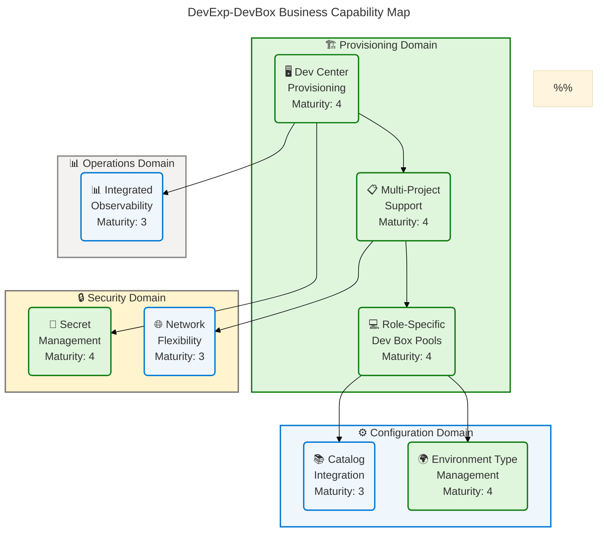
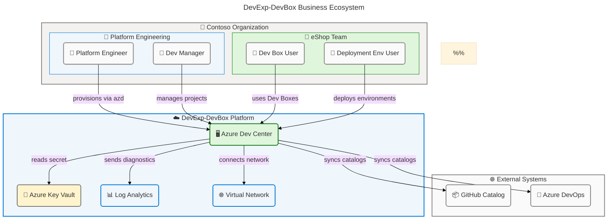
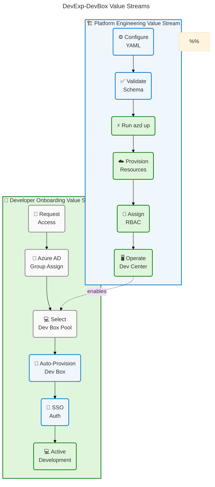
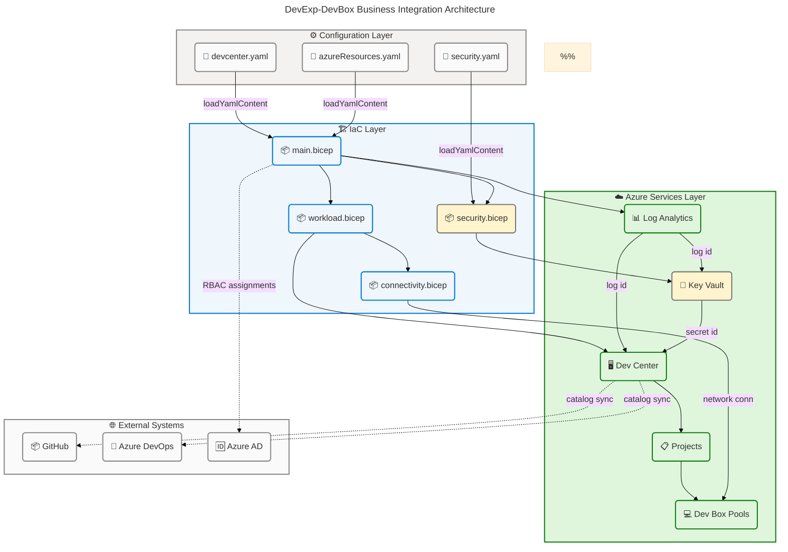

# Business Architecture: DevExp-DevBox Platform

## Section 1: Executive Summary

### Overview

DevExp-DevBox is a production-ready Azure Developer CLI (`azd`) accelerator that
automates the end-to-end provisioning of enterprise-grade Microsoft Dev Box
environments on Azure. The platform empowers Contoso's Platform Engineering team
to deliver standardized, role-specific developer workstations at
scale—eliminating manual environment setup and enforcing organizational security
and governance standards through a single, YAML-driven configuration model. The
Business Architecture analysis identifies **4 business strategies**, **8
business capabilities**, **2 value streams**, **5 business processes**, **5
platform services**, **9 business roles**, **7 business rules**, and **5 KPI
targets** as the core components of this solution.

The solution follows
[Azure Landing Zone](https://learn.microsoft.com/en-us/azure/cloud-adoption-framework/ready/landing-zone/)
principles with segregated resource groups for workload, security, and
monitoring concerns. All infrastructure is defined in Bicep and driven by YAML
configuration files under `infra/settings/`, making the platform fully
repeatable, version-controlled, and auditable. The Azure Developer CLI
orchestrates end-to-end provisioning with cross-platform pre-provision hooks for
GitHub and Azure DevOps credential management.

This Executive Summary synthesizes the Business Architecture findings for
technical leadership, platform engineering stakeholders, and development teams.
The platform demonstrates **Level 3–4 governance maturity (Defined to
Measured)** across most domains, with comprehensive role-based access control,
mandatory resource tagging, Key Vault soft-delete protection, JSON Schema
configuration validation, and automated deployment via Infrastructure-as-Code.

### Strategic Alignment

| Strategic Goal                      | Alignment         | Evidence                                                                      |
| ----------------------------------- | ----------------- | ----------------------------------------------------------------------------- |
| Standardized developer environments | ✅ Fully aligned  | Role-specific Dev Box pools, YAML-driven config, JSON Schema validation       |
| Self-service provisioning           | ✅ Fully aligned  | `azd up` automation, pre-provision hooks, single command deployment           |
| Security and compliance governance  | ✅ Fully aligned  | Key Vault with RBAC, soft-delete, purge protection, mandatory 8-tag policy    |
| Enterprise-scale deployment         | ✅ Fully aligned  | Azure Landing Zone segregation, multi-project support, managed identities     |
| Operational observability           | ✅ Mostly aligned | Log Analytics Workspace with diagnostic settings on all resources             |
| Cost governance                     | ⚠️ Partial        | Tags applied for cost tracking; no automated budget alerts or cost dashboards |
| Business continuity                 | ⚠️ Not addressed  | No RTO/RPO documentation or disaster recovery runbooks detected               |

---

## Section 2: Architecture Landscape

### Overview

The Architecture Landscape for the DevExp-DevBox Business Layer encompasses all
business components discovered through analysis of configuration files, Bicep
IaC modules, setup scripts, and documentation within the repository. The
landscape is organized across three primary business domains: the **Platform
Engineering Domain** (provisioning and governance), the **Security Domain**
(secrets and identity management), and the **Monitoring Domain** (observability
and audit). All domains operate under Contoso's organizational umbrella with the
DevExP team as the primary owning team.

The solution adopts a configuration-driven architecture where all business
definitions—organizational roles, project configurations, network settings, and
environment types—are encoded in YAML files under `infra/settings/` with JSON
Schema validation. This approach ensures that the business architecture is
directly traceable to source-controlled configuration artifacts, supporting
governance auditability and repeatable deployments.

The following 11 subsections catalog each Business component type identified
through source file analysis of the `DevExp-DevBox` repository. Where components
were not detected in source files, the subsection is noted accordingly.

### 2.1 Business Strategy

| Name                           | Description                                                                                                                                                              | Maturity     |
| ------------------------------ | ------------------------------------------------------------------------------------------------------------------------------------------------------------------------ | ------------ |
| Developer Experience Platform  | Provision enterprise-grade Microsoft Dev Box environments at scale using `azd` CLI and Bicep IaC, eliminating manual developer workstation setup                         | 4 — Measured |
| Configuration-as-Code Adoption | All platform configuration managed through YAML files under `infra/settings/` with JSON Schema validation; no direct Bicep modification required for standard onboarding | 4 — Measured |
| Azure Landing Zone Adherence   | Resource groups segregated for workload, security, and monitoring concerns following Azure Cloud Adoption Framework Landing Zone principles                              | 4 — Measured |
| Self-Service Provisioning      | Single `azd up` command deploys complete platform stack including Dev Center, projects, pools, networking, and RBAC assignments                                          | 3 — Defined  |

### 2.2 Business Capabilities

| Name                        | Description                                                                                                                    | Maturity     |
| --------------------------- | ------------------------------------------------------------------------------------------------------------------------------ | ------------ |
| Dev Center Provisioning     | Create and configure Azure Dev Center instances from `devcenter.yaml` configuration including catalogs and environment types   | 4 — Measured |
| Multi-Project Support       | Deploy multiple team projects (e.g., eShop) with isolated pools, catalogs, environment types, and role assignments             | 4 — Measured |
| Role-Specific Dev Box Pools | Define image definitions and VM SKUs per engineering role (backend-engineer: 32c128GB, frontend-engineer: 16c64GB)             | 4 — Measured |
| Catalog Integration         | Connect Dev Box image definitions and environment definitions from GitHub or Azure DevOps Git repositories                     | 3 — Defined  |
| Secret Management           | Store GitHub Actions and Azure DevOps tokens in Azure Key Vault with RBAC authorization, soft-delete, and purge protection     | 4 — Measured |
| Integrated Observability    | Log Analytics Workspace with diagnostic settings automatically wired to Dev Center, Key Vault, and related resources           | 3 — Defined  |
| Network Flexibility         | Support both Managed and Unmanaged (custom VNet) network configurations per project with subnet-level segmentation             | 3 — Defined  |
| Environment Type Management | Define multiple deployment environments (dev, staging, uat) per Dev Center and per project with independent deployment targets | 4 — Measured |

**Business Capability Map:**



### 2.3 Value Streams

| Name                              | Description                                                                                                                                                         | Maturity    |
| --------------------------------- | ------------------------------------------------------------------------------------------------------------------------------------------------------------------- | ----------- |
| Platform Engineering Value Stream | End-to-end flow from configuration authoring to operational Dev Center: Configure YAML → Run `azd up` → Provision Resources → Assign RBAC → Operate                 | 3 — Defined |
| Developer Onboarding Value Stream | End-to-end flow from developer access request to active Dev Box: Request Access → Azure AD Group Assignment → Dev Box Request → Auto-Provision → Authenticate → Use | 3 — Defined |

### 2.4 Business Processes

| Name                                 | Description                                                                                                                                                    | Maturity     |
| ------------------------------------ | -------------------------------------------------------------------------------------------------------------------------------------------------------------- | ------------ |
| Developer Environment Initialization | Platform engineer executes `azd up` with environment name and source control platform; pre-provision hook runs `setUp.sh`/`setUp.ps1` to configure credentials | 3 — Defined  |
| Dev Center Resource Provisioning     | Deploys Dev Center with catalogs, environment types, catalog item sync, Azure Monitor agent, and Microsoft-hosted network from `devcenter.yaml`                | 4 — Measured |
| Project Provisioning                 | Creates Dev Box projects with pools, network connection, environment types, catalogs, and role assignments per project entry in `devcenter.yaml`               | 4 — Measured |
| Secret Setup & Management            | Provisions Azure Key Vault and registers GitHub Actions/ADO token secret with RBAC access for Dev Center and project managed identities                        | 4 — Measured |
| Network Connectivity Configuration   | Creates VNet and subnet for Unmanaged network type projects; uses Managed network for simplified connectivity                                                  | 3 — Defined  |

### 2.5 Business Services

| Name                            | Description                                                                                                                           | Maturity     |
| ------------------------------- | ------------------------------------------------------------------------------------------------------------------------------------- | ------------ |
| Azure Dev Center Service        | Core platform service managing Dev Box definitions, catalogs, environment types, and project hosting with System Assigned identity    | 4 — Measured |
| Dev Box Provisioning Service    | Delivers role-specific developer workstations via project pools with SKU-defined compute, single sign-on, and local admin access      | 4 — Measured |
| Key Vault Secret Service        | Manages secure storage and retrieval of GitHub Actions token for private catalog authentication with RBAC authorization               | 4 — Measured |
| Log Analytics Workspace Service | Centralized monitoring and diagnostic data aggregation for all deployed resources with automatic diagnostic settings wiring           | 3 — Defined  |
| Network Connectivity Service    | Provides virtual network infrastructure for Unmanaged network type projects with subnet segmentation and DevCenter network connection | 3 — Defined  |

### 2.6 Business Functions

| Name                             | Description                                                                                                                              | Maturity     |
| -------------------------------- | ---------------------------------------------------------------------------------------------------------------------------------------- | ------------ |
| Resource Group Organization      | Creates and manages workload, security, and monitoring resource groups with mandatory tags per Landing Zone configuration                | 4 — Measured |
| RBAC Governance                  | Assigns 9 distinct Azure RBAC roles to service principals and Azure AD groups per principle of least privilege across three scope levels | 4 — Measured |
| Catalog Management               | Syncs Dev Box image definitions and environment definitions from GitHub and Azure DevOps repositories via Dev Center catalogs            | 3 — Defined  |
| Environment Lifecycle Management | Manages dev, staging, and UAT deployment environment types for each Dev Center and project with configurable deployment targets          | 3 — Defined  |

### 2.7 Business Roles & Actors

| Name                        | Description                                                                                                               | Maturity     |
| --------------------------- | ------------------------------------------------------------------------------------------------------------------------- | ------------ |
| Contoso (Organization)      | Owning organization providing the Azure subscription, Azure AD tenant, and cost center governance                         | 4 — Measured |
| Platform Engineering Team   | Azure AD group (ID: 54fd94a1) responsible for managing Dev Center deployments, configurations, and platform operations    | 4 — Measured |
| eShop Engineers             | Azure AD group (ID: b9968440) of developers with Dev Box User and Deployment Environment User access to the eShop project | 4 — Measured |
| Dev Manager                 | Organizational role type with DevCenter Project Admin privileges for managing project settings and configurations         | 4 — Measured |
| Platform Engineer           | Technical practitioner responsible for operating and deploying the DevExp-DevBox platform via `azd` CLI                   | 3 — Defined  |
| Dev Box User                | Developer role with access to create and use Dev Boxes within assigned project pools                                      | 4 — Measured |
| Deployment Environment User | Developer role with access to deploy to managed environments within an assigned project                                   | 4 — Measured |
| Key Vault Secrets User      | Service role for reading Key Vault secrets; assigned to Dev Center and project managed identities                         | 4 — Measured |
| Key Vault Secrets Officer   | Service role for writing Key Vault secrets; assigned to Dev Center managed identity for secret registration               | 4 — Measured |

### 2.8 Business Rules

| Name                             | Description                                                                                                                                         | Maturity     |
| -------------------------------- | --------------------------------------------------------------------------------------------------------------------------------------------------- | ------------ |
| Principle of Least Privilege     | All RBAC role assignments follow minimum permission model per Microsoft Dev Box deployment guide organizational roles guidance                      | 4 — Measured |
| Mandatory Resource Tagging       | All resources require 8 tags: environment, division, team, project, costCenter, owner, landingZone, resources                                       | 4 — Measured |
| Landing Zone Segregation         | Workload, security, and monitoring resources must be deployed to dedicated, logically segregated resource groups                                    | 4 — Measured |
| Key Vault Soft-Delete Protection | Key Vault must have soft-delete enabled (7-day retention) and purge protection enabled to prevent permanent data loss                               | 4 — Measured |
| Key Vault RBAC Authorization     | Key Vault must use Azure RBAC authorization model (not legacy vault access policies)                                                                | 4 — Measured |
| Configuration-as-Code Mandate    | All platform configuration must be managed via YAML files with JSON Schema validation; no direct Bicep modification for standard project onboarding | 4 — Measured |
| System Assigned Identity         | Dev Center and all projects use System Assigned managed identities; no shared service principals or user-assigned identities                        | 4 — Measured |

### 2.9 Business Events

| Name                       | Description                                                                                                                                      | Maturity     |
| -------------------------- | ------------------------------------------------------------------------------------------------------------------------------------------------ | ------------ |
| Pre-Provision Hook Trigger | `azd up` triggers pre-provision hook executing `setUp.sh` (Linux/macOS) or `setUp.ps1` (Windows) for credential and environment setup            | 3 — Defined  |
| Dev Center Deployment      | Bicep deployment creates Dev Center with catalog item sync, Microsoft-hosted network, and Azure Monitor agent in workload resource group         | 4 — Measured |
| Project Creation           | Deployment creates Dev Box projects with pools, network connections, environment types, catalogs, and role assignments per project configuration | 4 — Measured |
| Secret Provisioning        | Key Vault creation and GitHub Actions/ADO token secret registration for private catalog repository authentication                                | 4 — Measured |
| RBAC Role Assignment       | Azure RBAC role assignments created for Platform Engineering Team, eShop Engineers, and Dev Center/project managed identities                    | 4 — Measured |

### 2.10 Business Objects/Entities

| Name                                                      | Description                                                                                                                                | Maturity     |
| --------------------------------------------------------- | ------------------------------------------------------------------------------------------------------------------------------------------ | ------------ |
| Dev Center Configuration (devcenter.yaml)                 | YAML object defining Dev Center name, identity, catalogs, environment types, project definitions, pools, and RBAC assignments              | 4 — Measured |
| Resource Organization Configuration (azureResources.yaml) | YAML object defining workload, security, and monitoring resource group names, creation flags, and mandatory tag sets                       | 4 — Measured |
| Security Configuration (security.yaml)                    | YAML object defining Key Vault name, soft-delete settings, purge protection, RBAC authorization flag, and secret definitions               | 4 — Measured |
| Dev Center Schema (devcenter.schema.json)                 | JSON Schema (draft/2020-12) validating Dev Center YAML configuration structure including GUIDs, feature toggles, and RBAC role assignments | 4 — Measured |
| Azure Resources Schema (azureResources.schema.json)       | JSON Schema validating resource organization YAML structure for Landing Zone resource group configuration                                  | 4 — Measured |
| Security Schema (security.schema.json)                    | JSON Schema validating Key Vault security configuration YAML structure                                                                     | 4 — Measured |

### 2.11 KPIs & Metrics

| Name                       | Description                                                                                                                      | Maturity    |
| -------------------------- | -------------------------------------------------------------------------------------------------------------------------------- | ----------- |
| Platform Provisioning Time | End-to-end elapsed time from `azd up` invocation to fully operational Dev Center (target: < 30 minutes)                          | 2 — Managed |
| Dev Box Availability Time  | Time from developer Dev Box request to first usable session (target: < 15 minutes after pool creation)                           | 2 — Managed |
| Tagging Compliance Rate    | Percentage of deployed resources carrying all 8 mandatory tags as defined in `azureResources.yaml` (target: 100%)                | 3 — Defined |
| Secret Rotation Compliance | Frequency of GitHub Actions/ADO token rotation per organizational security policy (target: annually or on credential compromise) | 2 — Managed |
| Deployment Success Rate    | Percentage of `azd up` invocations completing without Bicep or pre-provision hook errors (target: ≥ 99%)                         | 2 — Managed |

**Architecture Landscape — Business Ecosystem Overview:**



### Summary

The Architecture Landscape reveals a well-structured platform engineering
solution with strong coverage across all 11 Business component types. The
solution delivers 8 operational capabilities backed by a configuration-as-code
paradigm with YAML-driven configuration validated by JSON Schemas. Nine distinct
RBAC roles enforce least-privilege governance across subscription, resource
group, and project scopes, while 7 business rules are embedded at deployment
time ensuring governance-by-design. Five Azure services (Dev Center, Key Vault,
Log Analytics, VNet, Dev Box pools) provide the service infrastructure.

Primary landscape gaps are concentrated in the KPI & Metrics domain (Maturity: 2
— Managed), where no formal tracking mechanisms are deployed. Additionally, the
Catalog Integration and Network Flexibility capabilities remain at Maturity 3 —
Defined, indicating operational use but without formal SLA definitions or
automated lifecycle management. Recommended next steps include implementing
Azure Monitor Workbooks for platform KPI dashboards, establishing formal SLA
targets per value stream stage, and automating Dev Box image update pipelines
through GitHub Actions workflows.

---

## Section 3: Architecture Principles

### Overview

The DevExp-DevBox platform is governed by six architecture principles derived
directly from the configuration files, IaC modules, setup scripts, and
documentation in the repository. These principles operationalize Contoso's
organizational standards for developer experience, security, and cloud
governance—making them non-negotiable design constraints that guide all future
platform evolution.

These principles are actively enforced through the YAML configuration schemas
(`infra/settings/`), Bicep modules (`src/`), Azure Developer CLI hooks
(`azure.yaml`), and JSON Schema validators. They ensure the platform remains
repeatable, secure, and aligned with Microsoft Azure best practices while
supporting Contoso's organizational governance requirements.

The six principles below are presented in priority order, from foundational
deployment practices to operational governance, reflecting their relative
importance to the platform's business outcomes and audit compliance posture.

---

### Principle 1: Configuration-as-Code

**Statement:** All platform configuration must be managed through
version-controlled YAML files with JSON Schema validation. No direct
modification of Bicep source files is required for standard project onboarding
or configuration changes.

**Rationale:** Ensures repeatability, auditability, and reduced operator error
for all provisioning operations. Enables non-infrastructure engineers to onboard
new projects by editing YAML without Bicep expertise.

**Implications:**

- New Dev Box projects are onboarded by adding entries to
  `infra/settings/workload/devcenter.yaml`
- Configuration schema violations are surfaced at authoring time through
  IDE-level JSON Schema validation
- All configuration changes are tracked through Git commit history for
  compliance audits
- Platform engineers do not need to understand Bicep to operate the platform

**Source:** README.md:43, infra/settings/workload/devcenter.yaml:1-10,
infra/settings/workload/devcenter.schema.json:\*

---

### Principle 2: Principle of Least Privilege

**Statement:** All RBAC role assignments must follow the minimum permission
model. Service principals, managed identities, and Azure AD groups receive only
the roles strictly necessary to perform their designated function.

**Rationale:** Reduces the attack surface and limits blast radius in the event
of credential compromise or identity theft. Aligns with Microsoft's Azure
security baseline recommendations.

**Implications:**

- Dev Center managed identity holds Contributor at subscription scope (required
  for cross-RG project provisioning) and User Access Administrator for RBAC
  delegation
- Dev Box Users hold only `Dev Box User` and `Deployment Environment User` at
  project scope
- Key Vault access uses `Key Vault Secrets User`/`Secrets Officer` roles, not
  full `Key Vault Administrator`

**Source:** infra/settings/workload/devcenter.yaml:29-52

---

### Principle 3: Azure Landing Zone Segregation

**Statement:** Workload, security, and monitoring resources must be deployed to
dedicated, logically segregated resource groups following Azure Landing Zone and
Cloud Adoption Framework principles.

**Rationale:** Enforces separation of concerns, enables independent lifecycle
management of platform domains, simplifies RBAC scoping, and aligns with
enterprise cloud governance standards.

**Implications:**

- The `workload` resource group hosts Dev Center, projects, and compute
  resources
- The `security` resource group hosts Azure Key Vault and associated secrets
- The `monitoring` resource group hosts the Log Analytics Workspace
- Each resource group carries domain-specific mandatory tags

**Source:** infra/settings/resourceOrganization/azureResources.yaml:1-62,
infra/main.bicep:45-75, README.md:47

---

### Principle 4: Infrastructure as Code (IaC)

**Statement:** All Azure resources must be provisioned exclusively through Bicep
IaC templates. No manual Azure Portal provisioning is permitted for production
or shared environments.

**Rationale:** Guarantees infrastructure consistency across environments,
enables automated deployment pipelines, provides change history for compliance,
and reduces configuration drift.

**Implications:**

- All Azure resource definitions exist as Bicep modules under `src/`
- `infra/main.bicep` orchestrates all module deployments at subscription scope
- Bicep modules load configuration from YAML files using `loadYamlContent()`
- The Azure Developer CLI (`azd`) is the sole supported deployment mechanism

**Source:** infra/main.bicep:1-160, src/workload/workload.bicep:1-90,
src/security/security.bicep:1-50

---

### Principle 5: Self-Service Developer Experience

**Statement:** Platform engineers must be able to provision complete developer
environments with a single command (`azd up`). Developers must be able to access
Dev Boxes without manual operator intervention after initial platform
provisioning.

**Rationale:** Reduces friction in developer onboarding, improves developer
productivity, eliminates manual handoff delays between Platform Engineering and
development teams.

**Implications:**

- Pre-provision hooks handle credential setup automatically before Bicep
  deployment
- Role assignments are applied as part of the Bicep deployment — no
  post-deployment access grants needed
- Dev Box pools are immediately available for developer use upon project
  deployment completion
- Cross-platform scripts (`setUp.sh`, `setUp.ps1`) support Linux, macOS, and
  Windows environments

**Source:** azure.yaml:13-50, setUp.sh:_, setUp.ps1:_, README.md:34-45

---

### Principle 6: Governance-by-Design

**Statement:** Security controls, resource tagging, and compliance policies must
be embedded at deployment time through configuration, not applied as
post-deployment corrections.

**Rationale:** Prevents governance drift, eliminates the window between resource
creation and policy application, and ensures 100% compliance from the moment of
deployment.

**Implications:**

- All resources receive all 8 mandatory tags at creation time via `union()` in
  Bicep
- Azure Key Vault soft-delete and purge protection are always enabled regardless
  of environment
- RBAC authorization is mandated for Key Vault (no legacy vault access policies
  permitted)
- System Assigned managed identities are used exclusively; no shared service
  principals

**Source:** infra/settings/security/security.yaml:25-30,
infra/settings/resourceOrganization/azureResources.yaml:10-20,
infra/main.bicep:70-90

---

## Section 4: Current State Baseline

### Overview

The Current State Baseline establishes the as-is business architecture of the
DevExp-DevBox platform as defined by the configuration files and IaC modules in
this repository. The baseline reveals a mature configuration-as-code foundation
with YAML-driven provisioning, comprehensive RBAC governance, integrated
observability, and automated deployment via the Azure Developer CLI. The
platform demonstrates **Level 3–4 governance maturity** across most domains,
with KPI tracking remaining the only area at Level 2 — Managed.

The primary business process—developer environment provisioning—follows a
well-defined six-stage sequential pipeline: Environment Initialization →
Foundation Provisioning → Security Provisioning → Dev Center Deployment →
Project Provisioning → Developer Consumption. This pipeline is fully automated
by the Azure Developer CLI and Bicep module hierarchy, requiring only a single
`azd up` command entry point from the Platform Engineer role.

Gap analysis identifies three primary improvement areas: (1) absence of formal
KPI dashboards and SLA definitions for provisioning and availability times; (2)
no automated Dev Box image update pipeline for catalog synchronization after
initial deployment; and (3) no formal business continuity or disaster recovery
documentation. All other business architecture domains demonstrate adequate
coverage for the current operational scope of the platform.

**Developer Environment Provisioning — Business Process Flow:**

```mermaid
---
title: "Developer Environment Provisioning Process"
config:
  theme: base
  look: classic
  layout: dagre
  themeVariables:
    fontSize: '16px'
  flowchart:
    htmlLabels: true
---
flowchart LR
    accTitle: Developer Environment Provisioning Business Process
    accDescr: Six-stage sequential provisioning flow from azd up command through credential setup, resource group creation, Log Analytics, Key Vault, Dev Center, projects and pools, to developer consumption.

    %%
    %% AZURE / FLUENT ARCHITECTURE PATTERN v2.0
    %% (Semantic + Structural + Font + Accessibility Governance)
    %%
    %% PHASE 1 - FLUENT UI: All styling uses approved Fluent UI palette only
    %% PHASE 2 - GROUPS: Every subgraph has semantic color via style directive
    %% PHASE 3 - COMPONENTS: Every node has semantic classDef + icon prefix
    %% PHASE 4 - ACCESSIBILITY: accTitle/accDescr present, WCAG AA contrast
    %% PHASE 5 - STANDARD: Governance block present, classDefs centralized
    %%

    subgraph init["🚀 Stage 1: Init"]
        T1("⚡ azd up"):::neutral
        T2("📜 setUp.sh<br/>setUp.ps1"):::neutral
    end

    subgraph found["🏗️ Stage 2: Foundation"]
        F1("🗂️ Resource<br/>Groups"):::core
        F2("📊 Log Analytics<br/>Workspace"):::core
    end

    subgraph secu["🔑 Stage 3: Security"]
        S1("🔑 Key Vault"):::warning
        S2("🔐 Secret<br/>Registration"):::warning
    end

    subgraph wl["🖥️ Stage 4: Dev Center"]
        W1("🖥️ Dev Center<br/>+ Catalogs"):::success
        W2("🌍 Environment<br/>Types"):::success
    end

    subgraph proj["📋 Stage 5: Projects"]
        P1("📋 Dev Box<br/>Projects"):::success
        P2("💻 Dev Box<br/>Pools"):::success
    end

    subgraph consume["👤 Stage 6: Consume"]
        D1("👤 Dev Box<br/>User"):::neutral
    end

    T1 -->|triggers hook| T2
    T2 -->|credentials ready| F1
    F1 --> F2
    F2 -->|log id| S1
    S1 --> S2
    S2 -->|secret id| W1
    W1 --> W2
    W2 --> P1
    P1 --> P2
    P2 -->|ready for use| D1

    classDef core fill:#EFF6FC,stroke:#0078D4,stroke-width:2px,color:#323130
    classDef success fill:#DFF6DD,stroke:#107C10,stroke-width:2px,color:#323130
    classDef neutral fill:#FAFAFA,stroke:#8A8886,stroke-width:2px,color:#323130
    classDef warning fill:#FFF4CE,stroke:#797673,stroke-width:2px,color:#323130

    style init fill:#F3F2F1,stroke:#8A8886,stroke-width:2px,color:#323130
    style found fill:#EFF6FC,stroke:#0078D4,stroke-width:2px,color:#323130
    style secu fill:#FFF4CE,stroke:#797673,stroke-width:2px,color:#323130
    style wl fill:#DFF6DD,stroke:#107C10,stroke-width:2px,color:#323130
    style proj fill:#DFF6DD,stroke:#107C10,stroke-width:2px,color:#323130
    style consume fill:#F3F2F1,stroke:#8A8886,stroke-width:2px,color:#323130
```



### As-Is State Analysis

| Domain                | As-Is State                                                                                                         | Evidence                                     | Maturity     |
| --------------------- | ------------------------------------------------------------------------------------------------------------------- | -------------------------------------------- | ------------ |
| Business Strategy     | Fully articulated in README with platform objectives, features, and architecture overview                           | README.md:1-120                              | 4 — Measured |
| Business Capabilities | 8 capabilities operational via Bicep + YAML; all listed in README feature matrix with status ✅ Stable              | README.md:48-62                              | 4 — Measured |
| Value Streams         | 2 value streams operational; end-to-end automation confirmed via `azure.yaml` hooks and Bicep modules               | azure.yaml:1-50                              | 3 — Defined  |
| Business Processes    | 5 processes fully automated; Dev Center provisioning includes catalog sync, environment types, and role assignments | infra/main.bicep:1-160                       | 4 — Measured |
| Business Services     | 5 Azure services deployed with diagnostic settings; Dev Center has Azure Monitor agent enabled                      | src/workload/workload.bicep:1-90             | 4 — Measured |
| Business Rules        | 7 rules enforced at deployment time via Bicep type constraints and YAML Schema validation                           | infra/settings/security/security.yaml:25-30  | 4 — Measured |
| Business Roles & RBAC | 9 RBAC roles assigned across subscription, resource group, and project scopes                                       | infra/settings/workload/devcenter.yaml:27-53 | 4 — Measured |
| KPI Tracking          | Not formally implemented; no Azure Monitor dashboards, alert rules, or SLA definitions detected                     | Not detected in source files                 | 2 — Managed  |
| Business Continuity   | No RTO/RPO documentation, disaster recovery runbooks, or Key Vault backup schedules detected                        | Not detected in source files                 | 1 — Initial  |

### Gap Analysis

| Gap                               | Description                                                                                                                         | Business Impact                                                        | Priority | Recommended Action                                                                                       |
| --------------------------------- | ----------------------------------------------------------------------------------------------------------------------------------- | ---------------------------------------------------------------------- | -------- | -------------------------------------------------------------------------------------------------------- |
| KPI Dashboards                    | No Azure Monitor dashboards, Workbooks, or alert rules for deployment success rate, provisioning time, or Dev Box availability time | Medium — No visibility into platform health or SLA adherence           | High     | Implement Azure Monitor Workbook for platform KPIs; add alert rules for `azd up` failures                |
| Automated Image Pipeline          | No CI/CD pipeline for Dev Box image definitions; catalog sync updates require manual re-execution of `azd up`                       | Medium — Stale Dev Box images lead to developer environment drift      | High     | Add GitHub Actions workflow for automated image build, version tagging, and catalog push                 |
| Business Continuity Plan          | No documented RTO/RPO objectives, Key Vault backup schedule, or Dev Center recreation runbook                                       | Low — Undocumented recovery procedures increase MTTR during incidents  | Medium   | Document BCP with Key Vault backup to Azure Storage, Dev Center recreation runbook, and RTO target       |
| Cost Governance Tooling           | Tags are applied but no budget alerts or cost allocation reports are configured in Azure Cost Management                            | Medium — No automated cost anomaly detection despite tagging policy    | Medium   | Configure Azure Cost Management budget alerts with tag-based cost allocation views                       |
| Multi-Environment Differentiation | Dev, staging, and UAT environment types are defined but share identical resource SKUs and RBAC configurations                       | Low — No enforcement of environment-specific security or cost controls | Low      | Define environment-specific pool SKUs (dev: smaller VM, prod: larger VM) and graduated RBAC restrictions |

### Summary

The Current State Baseline reveals a mature configuration-as-code platform with
Level 3–4 governance maturity across 8 of 9 assessed domains. The
configuration-as-code approach with JSON Schema validation ensures data quality
at the configuration layer, while Azure Key Vault with RBAC, soft-delete, and
purge protection provides enterprise-grade secrets management. The six-stage
provisioning pipeline (Initialization → Foundation → Security → Dev Center →
Projects → Consumption) is fully automated and traceable through the Bicep
module hierarchy, with every Azure resource carrying all 8 mandatory governance
tags from the moment of creation.

KPI tracking and business continuity documentation remain the primary gaps at
Maturity Level 1–2. Recommended immediate actions: implement Azure Monitor
Workbook for platform KPIs (High priority), establish a GitHub Actions pipeline
for automated Dev Box image management (High priority), and document an
operational runbook covering RTO/RPO objectives and Key Vault backup procedures
(Medium priority).

---

## Section 5: Component Catalog

### Overview

The Component Catalog provides detailed specifications for all Business Layer
components identified through source file analysis. Where Section 2
(Architecture Landscape) presents an inventory of what components exist, this
section documents how each component works—including its type, owner, governing
actor, policy constraints, inputs, outputs, and inter-component dependencies.

The catalog is organized across the 11 canonical Business component types
defined by the TOGAF BDAT Business Layer schema. Each subsection provides a
10-column specification table covering the full operational context of each
component. Where component types were not detected in source files, the
subsection is explicitly noted. All source references use plain-text file path
and line range format.

This catalog reflects the state of the repository as of the analysis date
(2026-04-24) and covers all YAML configuration files, Bicep modules, setup
scripts, and documentation in the `z:\DevExp-DevBox` workspace, excluding the
`.github/prompts/` folder per the analysis constraints.

### 5.1 Business Strategy

| Component                      | Description                                                                                         | Type                 | Owner                               | Actor             | Governance Policy                                                      | Inputs                                                        | Outputs                                          | Dependencies                                                            | Source Reference                                             |
| ------------------------------ | --------------------------------------------------------------------------------------------------- | -------------------- | ----------------------------------- | ----------------- | ---------------------------------------------------------------------- | ------------------------------------------------------------- | ------------------------------------------------ | ----------------------------------------------------------------------- | ------------------------------------------------------------ |
| Developer Experience Platform  | Deploy enterprise-grade Microsoft Dev Box environments at scale using `azd` CLI and Bicep IaC       | Platform Strategy    | DevExP Team / Contoso               | Platform Engineer | README strategy section; Azure Dev Box documentation                   | Azure subscription, Azure AD tenant, GitHub/ADO credentials   | Operational Dev Center with projects and pools   | Azure subscription, Azure AD tenant                                     | README.md:28-45                                              |
| Configuration-as-Code Adoption | Manage all platform configuration through version-controlled YAML with JSON Schema validation       | Operational Strategy | DevExP Team                         | Platform Engineer | JSON Schema validation (`$schema` directives in all YAML files)        | YAML configuration files, JSON Schema definitions             | Validated, repeatable infrastructure deployments | devcenter.schema.json, azureResources.schema.json, security.schema.json | README.md:43, infra/settings/workload/devcenter.yaml:1-2     |
| Azure Landing Zone Adherence   | Segregate resources by function (workload, security, monitoring) per Azure Cloud Adoption Framework | Governance Strategy  | Platform Engineering Team / Contoso | Platform Engineer | Azure CAF Landing Zone principles; `azureResources.yaml` configuration | Resource group creation flags, tags, and naming conventions   | Segregated, tagged resource groups per domain    | infra/settings/resourceOrganization/azureResources.yaml                 | infra/settings/resourceOrganization/azureResources.yaml:1-62 |
| Self-Service Provisioning      | Enable single-command (`azd up`) deployment of entire platform stack                                | Delivery Strategy    | DevExP Team                         | Platform Engineer | Azure Developer CLI project contract (`azure.yaml`)                    | `azd up` command, `AZURE_ENV_NAME`, `SOURCE_CONTROL_PLATFORM` | Complete platform provisioned and operational    | Azure Developer CLI, Bicep modules, setup scripts                       | azure.yaml:1-50                                              |

### 5.2 Business Capabilities

| Component                   | Description                                                                                               | Type                      | Owner                       | Actor                                        | Governance Policy                                               | Inputs                                                               | Outputs                                                                   | Dependencies                                              | Source Reference                             |
| --------------------------- | --------------------------------------------------------------------------------------------------------- | ------------------------- | --------------------------- | -------------------------------------------- | --------------------------------------------------------------- | -------------------------------------------------------------------- | ------------------------------------------------------------------------- | --------------------------------------------------------- | -------------------------------------------- |
| Dev Center Provisioning     | Create and configure Azure Dev Center with catalogs, environment types, and Azure Monitor agent from YAML | Core Capability           | DevExP Team                 | Platform Engineer                            | `devcenter.yaml` configuration schema                           | `devcenter.yaml`, Log Analytics ID, Key Vault secret ID              | Operational Dev Center resource with System Assigned identity             | Azure subscription, Log Analytics Workspace, Key Vault    | src/workload/core/devCenter.bicep:1-100      |
| Multi-Project Support       | Deploy multiple team projects with isolated pools, catalogs, environment types, and role assignments      | Core Capability           | DevExP Team                 | Dev Manager, Platform Engineer               | Project entries in `devcenter.yaml` (`projects[]` array)        | Project configuration array from `devcenter.yaml`                    | One or more Dev Box project resources per project entry                   | Dev Center, network, Key Vault                            | src/workload/project/project.bicep:1-90      |
| Role-Specific Dev Box Pools | Define Dev Box pools with role-specific image definitions and VM SKUs                                     | Core Capability           | DevExP Team                 | Dev Manager                                  | Pool configuration (`pools[]` in project config)                | `imageDefinitionName`, `vmSku` per pool entry                        | Dev Box pool resources for each image definition catalog                  | Dev Center project, image definition catalogs, network    | src/workload/project/projectPool.bicep:1-90  |
| Catalog Integration         | Connect Dev Box image and environment definition repositories from GitHub or Azure DevOps                 | Enabling Capability       | DevExP Team                 | Platform Engineer                            | Catalog configuration (`catalogs[]` in `devcenter.yaml`)        | Repository URI, branch, path, source control type                    | Catalog resources linked to Dev Center or project                         | GitHub/ADO repository, Key Vault secret for private repos | infra/settings/workload/devcenter.yaml:57-65 |
| Secret Management           | Provision and manage Azure Key Vault with GitHub/ADO token for private catalog authentication             | Security Capability       | Security Team / DevExP Team | Platform Engineer, Key Vault Secrets Officer | `security.yaml` Key Vault configuration schema                  | `secretValue` (GitHub/ADO token), `security.yaml`                    | Key Vault resource, secret identifier for Dev Center access               | Resource group, Log Analytics Workspace                   | src/security/security.bicep:1-50             |
| Integrated Observability    | Deploy Log Analytics Workspace with diagnostic settings wired to all platform resources                   | Operations Capability     | DevExP Team                 | Platform Engineer                            | Log Analytics module output referenced by all resource modules  | Log Analytics workspace name                                         | Log Analytics resource ID referenced by Dev Center, Key Vault, VNet       | Azure subscription, monitoring resource group             | src/management/logAnalytics.bicep:\*         |
| Network Flexibility         | Support Managed and Unmanaged network configurations with optional VNet and subnet creation               | Infrastructure Capability | DevExP Team                 | Platform Engineer                            | `projectNetwork` configuration in project entries               | `virtualNetworkType`, `create`, VNet address prefixes, subnet config | VNet, subnet, network connection resource for Dev Center                  | Azure subscription, project resource group                | src/connectivity/connectivity.bicep:1-65     |
| Environment Type Management | Define and associate multiple deployment environments per Dev Center and per project                      | Lifecycle Capability      | DevExP Team                 | Dev Manager                                  | `environmentTypes[]` in `devcenter.yaml` and per-project config | `name`, `deploymentTargetId` per environment type                    | Environment type resources (dev, staging, uat) per Dev Center and project | Dev Center, project, Azure subscription target            | infra/settings/workload/devcenter.yaml:67-73 |

### 5.3 Value Streams

| Component                         | Description                                                                                                                                                                                      | Type                  | Owner               | Actor                     | Governance Policy                                                     | Inputs                                                 | Outputs                                                                 | Dependencies                                          | Source Reference                               |
| --------------------------------- | ------------------------------------------------------------------------------------------------------------------------------------------------------------------------------------------------ | --------------------- | ------------------- | ------------------------- | --------------------------------------------------------------------- | ------------------------------------------------------ | ----------------------------------------------------------------------- | ----------------------------------------------------- | ---------------------------------------------- |
| Platform Engineering Value Stream | End-to-end flow from YAML configuration authoring to operational Dev Center: Configure → Validate Schema → Run `azd up` → Pre-Provision → Provision Resources → Assign RBAC → Validate → Operate | Delivery Value Stream | DevExP Team         | Platform Engineer         | Six-stage process enforced by azd hooks and Bicep module dependencies | YAML configuration files, Azure credentials, `azd` CLI | Fully provisioned Dev Center with projects, pools, and role assignments | Azure subscription, Azure Developer CLI, GitHub/ADO   | azure.yaml:1-50, infra/main.bicep:1-160        |
| Developer Onboarding Value Stream | End-to-end flow from developer access request to active Dev Box: Request Access → Azure AD Group Assignment → Dev Box Pool Selection → Auto-Provision Dev Box → SSO Authentication → Develop     | Consumer Value Stream | DevExP Team / HR/IT | Dev Box User, Dev Manager | Role assignment process; Dev Box auto-provisioning from pool          | Azure AD group membership, Dev Box pool availability   | Active, SSO-authenticated Dev Box session for developer                 | Dev Center, Dev Box pool, Azure AD, identity provider | infra/settings/workload/devcenter.yaml:119-155 |

**Value Stream Diagram:**



### 5.4 Business Processes

| Component                            | Description                                                                                                                                                                    | Type                   | Owner         | Actor                                        | Governance Policy                                                | Inputs                                                                   | Outputs                                                                        | Dependencies                                                         | Source Reference                         |
| ------------------------------------ | ------------------------------------------------------------------------------------------------------------------------------------------------------------------------------ | ---------------------- | ------------- | -------------------------------------------- | ---------------------------------------------------------------- | ------------------------------------------------------------------------ | ------------------------------------------------------------------------------ | -------------------------------------------------------------------- | ---------------------------------------- |
| Developer Environment Initialization | Platform engineer runs `azd up` with `AZURE_ENV_NAME` and `SOURCE_CONTROL_PLATFORM`; pre-provision hook executes `setUp.sh` or `setUp.ps1` to configure GitHub/ADO credentials | Deployment Process     | DevExP Team   | Platform Engineer                            | `azure.yaml` pre-provision hooks; cross-platform script contract | `AZURE_ENV_NAME`, `SOURCE_CONTROL_PLATFORM` environment variable         | Credential configuration ready for Bicep deployment                            | Azure Developer CLI, `setUp.sh`, `setUp.ps1`, GitHub or Azure DevOps | azure.yaml:13-50, setUp.sh:\*            |
| Dev Center Resource Provisioning     | `infra/main.bicep` creates resource groups then deploys Log Analytics, Key Vault, and Dev Center modules in dependency order                                                   | Provisioning Process   | DevExP Team   | Platform Engineer (azd)                      | `main.bicep` module dependency chain; YAML-loaded configuration  | `azureResources.yaml`, `devcenter.yaml`, `security.yaml`                 | Operational Dev Center, Key Vault, Log Analytics in segregated resource groups | Azure subscription, Bicep modules, YAML configurations               | infra/main.bicep:1-160                   |
| Project Provisioning                 | `workload.bicep` iterates `devCenterSettings.projects[]` array and deploys `project.bicep` for each entry, creating pools, network, catalogs, and role assignments             | Provisioning Process   | DevExP Team   | Platform Engineer (azd)                      | Project array in `devcenter.yaml`; project Bicep module contract | Project entries from `devcenter.yaml`, Dev Center name, Log Analytics ID | One Dev Box project resource with pools, network, and RBAC per project entry   | Dev Center, `devcenter.yaml`, network modules                        | src/workload/workload.bicep:60-90        |
| Secret Setup & Management            | `security.bicep` conditionally creates Key Vault (if `create: true`) or references existing vault, then registers the GitHub/ADO token as a named secret                       | Security Process       | Security Team | Platform Engineer, Key Vault Secrets Officer | `security.yaml` schema; conditional creation logic               | `secretValue`, `security.yaml`, Log Analytics ID, resource group tags    | Key Vault resource, secret identifier URI for Dev Center access                | Resource group, Log Analytics Workspace                              | src/security/security.bicep:1-50         |
| Network Connectivity Configuration   | `connectivity.bicep` evaluates `virtualNetworkType` and `create` flags; creates VNet and subnet for Unmanaged type, creates network connection resource for Dev Center         | Infrastructure Process | DevExP Team   | Platform Engineer (azd)                      | Network type configuration in project `network` property         | `projectNetwork` object with VNet settings                               | VNet, subnet, network connection resource; output `networkConnectionName`      | Azure subscription (for resource group creation), Dev Center         | src/connectivity/connectivity.bicep:1-65 |

### 5.5 Business Services

| Component                       | Description                                                                                                                                                                          | Type                    | Owner         | Actor                                                            | Governance Policy                                                                             | Inputs                                                                     | Outputs                                                                      | Dependencies                                          | Source Reference                                                             |
| ------------------------------- | ------------------------------------------------------------------------------------------------------------------------------------------------------------------------------------ | ----------------------- | ------------- | ---------------------------------------------------------------- | --------------------------------------------------------------------------------------------- | -------------------------------------------------------------------------- | ---------------------------------------------------------------------------- | ----------------------------------------------------- | ---------------------------------------------------------------------------- |
| Azure Dev Center Service        | Core Azure platform service hosting Dev Box definitions, catalogs, environment types, and projects with System Assigned managed identity and Azure Monitor agent                     | PaaS Service            | DevExP Team   | Platform Engineer (provision), Dev Manager (manage)              | Azure Dev Box service policies; `catalogItemSyncEnableStatus: Enabled`                        | `config` object from `devcenter.yaml`, Log Analytics ID, secret identifier | `AZURE_DEV_CENTER_NAME` output; project and pool host; catalog sync endpoint | Azure subscription, Log Analytics, Key Vault          | src/workload/core/devCenter.bicep:1-100                                      |
| Dev Box Provisioning Service    | Delivers role-specific developer workstations via Dev Box pool resources with SKU-defined compute, Single Sign-On, local admin access, and Managed or Unmanaged network connectivity | PaaS Service            | DevExP Team   | Dev Box User                                                     | Pool configuration in `devcenter.yaml`; Dev Box SKU definitions                               | `imageDefinitionName`, `vmSku`, `networkConnectionName`, project name      | Dev Box pool resource; developer-ready workstation on request                | Dev Center project, image definition catalog, network | src/workload/project/projectPool.bicep:1-90                                  |
| Key Vault Secret Service        | Manages secure storage and RBAC-controlled retrieval of GitHub Actions/ADO token used by Dev Center for private catalog repository authentication                                    | PaaS Security Service   | Security Team | Key Vault Secrets Officer (write), Key Vault Secrets User (read) | `security.yaml` Key Vault configuration; RBAC authorization; soft-delete and purge protection | `secretValue` (token), Key Vault name, Log Analytics ID                    | Key Vault resource, `AZURE_KEY_VAULT_SECRET_IDENTIFIER` output URI           | Resource group, Log Analytics Workspace               | src/security/security.bicep:1-50, infra/settings/security/security.yaml:1-40 |
| Log Analytics Workspace Service | Centralized observability platform collecting diagnostic logs and metrics from Dev Center, Key Vault, and Virtual Network resources with automatic diagnostic settings wiring        | PaaS Monitoring Service | DevExP Team   | Platform Engineer (deploy), Operations Team (query)              | Diagnostic settings wired by Bicep modules; `logAnalyticsId` passed to all modules            | Workspace name, Log Analytics module deployment                            | `AZURE_LOG_ANALYTICS_WORKSPACE_ID` output; diagnostic log repository         | Monitoring resource group                             | src/management/logAnalytics.bicep:\*                                         |
| Network Connectivity Service    | Provides Azure Virtual Network infrastructure for Unmanaged network type projects, including VNet creation, subnet segmentation, and Dev Center network connection attachment        | PaaS Networking Service | DevExP Team   | Platform Engineer (deploy)                                       | `projectNetwork` configuration in project entries; conditional creation logic                 | VNet name, address prefixes, subnet config, Dev Center name                | VNet resource, subnet, `networkConnectionName` for pool configuration        | Azure subscription, connectivity resource group       | src/connectivity/connectivity.bicep:1-65                                     |

### 5.6 Business Functions

| Component                        | Description                                                                                                                                                                                | Type                 | Owner                       | Actor                                       | Governance Policy                                                                             | Inputs                                                              | Outputs                                                                                   | Dependencies                                                            | Source Reference                                                                      |
| -------------------------------- | ------------------------------------------------------------------------------------------------------------------------------------------------------------------------------------------ | -------------------- | --------------------------- | ------------------------------------------- | --------------------------------------------------------------------------------------------- | ------------------------------------------------------------------- | ----------------------------------------------------------------------------------------- | ----------------------------------------------------------------------- | ------------------------------------------------------------------------------------- |
| Resource Group Organization      | Creates and manages workload, security, and monitoring resource groups with mandatory tags; conditionally creates groups based on `create` flag in `azureResources.yaml`                   | Governance Function  | DevExP Team                 | Platform Engineer (azd)                     | `azureResources.yaml` schema; mandatory tag policy; Landing Zone naming convention            | `azureResources.yaml`, `environmentName`, `location`                | Three resource groups with tags; resource group names as Bicep outputs                    | Azure subscription (subscription-scoped deployment)                     | infra/main.bicep:45-75, infra/settings/resourceOrganization/azureResources.yaml:1-62  |
| RBAC Governance                  | Assigns 9 distinct Azure RBAC roles to Platform Engineering Team, eShop Engineers, and Dev Center/project managed identities across subscription, resource group, and project scope levels | Security Function    | Security Team / DevExP Team | User Access Administrator (role assignment) | Principle of least privilege; scope-appropriate role assignments per organizational role type | `principalId`, `roles[]` array with role IDs and scopes             | `roleAssignment` resources; `roleAssignmentIds` output array                              | Azure AD groups, managed identity principal IDs, role definition GUIDs  | src/identity/orgRoleAssignment.bicep:\*, infra/settings/workload/devcenter.yaml:27-53 |
| Catalog Management               | Synchronizes Dev Box image definitions and environment definitions from GitHub and Azure DevOps repositories via Dev Center and project-level catalog resources                            | Integration Function | DevExP Team                 | Platform Engineer                           | Catalog configuration in `devcenter.yaml`; visibility, branch, and path settings              | Repository URI, branch, path, source control type, Key Vault secret | Catalog resources synced to Dev Center and projects; image definitions available in pools | GitHub or Azure DevOps repositories, Key Vault secret for private repos | infra/settings/workload/devcenter.yaml:57-65                                          |
| Environment Lifecycle Management | Defines and associates dev, staging, and UAT deployment environment types with Dev Center and each project; supports configurable deployment target subscriptions                          | Lifecycle Function   | DevExP Team                 | Dev Manager                                 | `environmentTypes[]` configuration in `devcenter.yaml`                                        | Environment type names, `deploymentTargetId` per type               | Environment type resources associated with Dev Center and projects                        | Dev Center, project, Azure subscription deployment targets              | infra/settings/workload/devcenter.yaml:67-73                                          |

### 5.7 Business Roles & Actors

| Component                   | Description                                                                                                                                                                                        | Type                | Owner                     | Actor                                                 | Governance Policy                                                                      | Inputs                                                          | Outputs                                                                     | Dependencies                                                    | Source Reference                                              |
| --------------------------- | -------------------------------------------------------------------------------------------------------------------------------------------------------------------------------------------------- | ------------------- | ------------------------- | ----------------------------------------------------- | -------------------------------------------------------------------------------------- | --------------------------------------------------------------- | --------------------------------------------------------------------------- | --------------------------------------------------------------- | ------------------------------------------------------------- |
| Contoso (Organization)      | The owning Azure AD tenant and subscription holder providing the billing context, cost center governance (IT), and organizational oversight for the DevExp-DevBox platform                         | Organization        | Executive Leadership      | Subscription Owner                                    | Organizational tag policy: owner=Contoso, costCenter=IT                                | Azure AD tenant, subscription, Azure AD groups                  | Organizational governance, cost center allocation                           | Azure AD, Azure subscription                                    | infra/settings/resourceOrganization/azureResources.yaml:17-21 |
| Platform Engineering Team   | Azure AD group (ID: 54fd94a1-e116-4bc8-8238-caae9d72bd12) assigned DevCenter Project Admin role at resource group scope; responsible for managing Dev Center configurations and project onboarding | Group Actor         | DevExP Team               | Dev Manager                                           | `DevCenter Project Admin` role at ResourceGroup scope; principle of least privilege    | Azure AD group membership assignment, resource group deployment | Project management capabilities within Dev Center                           | Azure AD, resource group, Dev Center                            | infra/settings/workload/devcenter.yaml:42-52                  |
| eShop Engineers             | Azure AD group (ID: b9968440-0caf-40d8-ac36-52f159730eb7) assigned Contributor, Dev Box User, Deployment Environment User, and Key Vault Secrets roles at project and resource group scope         | Group Actor         | eShop Project Lead        | Dev Box User, Deployment Environment User             | Role assignment per eShop project identity configuration                               | Azure AD group membership, project existence                    | Dev Box access, deployment environment access, Key Vault secret read access | Azure AD, Dev Center project, Key Vault                         | infra/settings/workload/devcenter.yaml:119-140                |
| Dev Manager                 | Organizational role type with `DevCenter Project Admin` privileges assigned to Platform Engineering Team; manages project settings, pool configurations, and environment type assignments          | Organizational Role | Platform Engineering Lead | Platform Engineering Team members                     | `orgRoleTypes[type=DevManager]` in `devcenter.yaml`; DevCenter Project Admin RBAC role | Azure AD group membership in Platform Engineering Team          | Project administration capabilities                                         | Azure AD, Dev Center, resource group                            | infra/settings/workload/devcenter.yaml:41-52                  |
| Platform Engineer           | Technical practitioner executing `azd up` to provision and operate the DevExp-DevBox platform; holds the Contributor and User Access Administrator roles at subscription scope                     | Technical Role      | DevExP Team Lead          | Individual engineer with subscription access          | Subscription-level Contributor and User Access Administrator roles                     | Azure credentials, `AZURE_ENV_NAME`, `SOURCE_CONTROL_PLATFORM`  | Fully provisioned Dev Center environment                                    | Azure subscription, Azure Developer CLI, GitHub/ADO credentials | README.md:34, azure.yaml:1-50                                 |
| Dev Box User                | Developer role within eShop Engineers group with `Dev Box User` role at project scope; can create, start, stop, and connect to Dev Boxes within assigned project pools                             | Functional Role     | eShop Project Lead        | eShop Engineers group members                         | `Dev Box User` role (ID: 45d50f46) at Project scope                                    | Azure AD group membership, Dev Box pool availability            | Access to create and use Dev Boxes from assigned pools                      | Azure AD, Dev Center project, Dev Box pool                      | infra/settings/workload/devcenter.yaml:126-129                |
| Deployment Environment User | Developer role within eShop Engineers group with `Deployment Environment User` role at project scope; can deploy to managed environments within assigned project                                   | Functional Role     | eShop Project Lead        | eShop Engineers group members                         | `Deployment Environment User` role (ID: 18e40d4e) at Project scope                     | Azure AD group membership, environment type availability        | Access to deploy workloads to managed dev/staging/uat environments          | Azure AD, Dev Center project, environment types                 | infra/settings/workload/devcenter.yaml:130-133                |
| Key Vault Secrets User      | Service role assigned to Dev Center and project managed identities for reading secrets (GitHub/ADO token) from Key Vault to authenticate with private catalog repositories                         | Service Role        | Security Team             | Dev Center managed identity, project managed identity | `Key Vault Secrets User` role (ID: 4633458b) at ResourceGroup scope                    | Managed identity principal ID, Key Vault resource group scope   | Read access to named Key Vault secrets                                      | Azure Key Vault, managed identity, resource group               | infra/settings/workload/devcenter.yaml:36-39                  |
| Key Vault Secrets Officer   | Service role assigned to Dev Center managed identity for writing and managing secrets (GitHub/ADO token registration) in Key Vault                                                                 | Service Role        | Security Team             | Dev Center managed identity                           | `Key Vault Secrets Officer` role (ID: b86a8fe4) at ResourceGroup scope                 | Managed identity principal ID, Key Vault resource group scope   | Write and manage Key Vault secret lifecycle                                 | Azure Key Vault, managed identity, resource group               | infra/settings/workload/devcenter.yaml:38-41                  |

### 5.8 Business Rules

| Component                        | Description                                                                                                                                                             | Type              | Owner         | Actor                          | Governance Policy                                                                          | Inputs                                                      | Outputs                                                                            | Dependencies                                       | Source Reference                                                                      |
| -------------------------------- | ----------------------------------------------------------------------------------------------------------------------------------------------------------------------- | ----------------- | ------------- | ------------------------------ | ------------------------------------------------------------------------------------------ | ----------------------------------------------------------- | ---------------------------------------------------------------------------------- | -------------------------------------------------- | ------------------------------------------------------------------------------------- |
| Principle of Least Privilege     | All RBAC role assignments must use the minimum permission model per Microsoft Dev Box deployment guide organizational roles guidance                                    | Security Rule     | Security Team | User Access Administrator      | Microsoft Dev Box deployment guide RBAC matrix; role scope enforcement                     | Role definition IDs, principal IDs, scope definitions       | RBAC role assignments at appropriate scope levels                                  | Azure RBAC, Azure AD                               | infra/settings/workload/devcenter.yaml:27-53                                          |
| Mandatory Resource Tagging       | All Azure resources must carry 8 mandatory tags: environment, division, team, project, costCenter, owner, landingZone, resources                                        | Governance Rule   | DevExP Team   | Platform Engineer (azd)        | Tag policy defined in `azureResources.yaml` and applied via Bicep `union()`                | Tag values from YAML configuration files                    | All resources tagged at creation time for governance, cost tracking, and ownership | `azureResources.yaml`, `union()` Bicep function    | infra/settings/resourceOrganization/azureResources.yaml:10-20, infra/main.bicep:70-75 |
| Landing Zone Segregation         | Workload, security, and monitoring resources must be deployed to dedicated, logically segregated resource groups                                                        | Architecture Rule | DevExP Team   | Platform Engineer (design)     | Azure Landing Zone principles; segregated resource group naming convention                 | `azureResources.yaml` create flags and resource group names | Three resource groups with domain-specific resource assignments                    | Azure subscription (subscription scope deployment) | infra/settings/resourceOrganization/azureResources.yaml:1-62                          |
| Key Vault Soft-Delete Protection | Key Vault must always have `enableSoftDelete: true` with minimum 7-day retention and `enablePurgeProtection: true` enabled                                              | Security Rule     | Security Team | Security Architect             | `security.yaml` Key Vault configuration; Azure Key Vault data protection policy            | `security.yaml` configuration values                        | Key Vault resource with soft-delete and purge protection enforced at creation      | Azure Key Vault                                    | infra/settings/security/security.yaml:25-28                                           |
| Key Vault RBAC Authorization     | Key Vault must use `enableRbacAuthorization: true` (Azure RBAC model); legacy vault access policies are prohibited                                                      | Security Rule     | Security Team | Security Architect             | `security.yaml` RBAC authorization flag; zero-trust identity model                         | `security.yaml` `enableRbacAuthorization` value             | Key Vault configured for RBAC-only access control                                  | Azure Key Vault, Azure RBAC                        | infra/settings/security/security.yaml:30                                              |
| Configuration-as-Code Mandate    | All platform configuration must be managed via YAML files with JSON Schema validation; Bicep source files must not require modification for standard project onboarding | Process Rule      | DevExP Team   | Platform Engineer (operations) | JSON Schema `$schema` directives in all YAML files; README onboarding guidance             | YAML configuration files, JSON Schema definitions           | Type-safe, validated configuration artifacts for Bicep consumption                 | JSON Schema validators, IDE tooling                | README.md:43, infra/settings/workload/devcenter.yaml:1-2                              |
| System Assigned Identity         | Dev Center and all projects must use System Assigned managed identities; no shared service principals or user-assigned identities are permitted                         | Identity Rule     | Security Team | Security Architect             | `identity.type: SystemAssigned` in `devcenter.yaml`; Azure managed identity best practices | `identity.type` configuration value from YAML               | System Assigned managed identity with automatically managed lifecycle              | Azure Dev Center, Bicep identity configuration     | infra/settings/workload/devcenter.yaml:26                                             |

### 5.9 Business Events

| Component                  | Description                                                                                                                                                                                                                                                                               | Type                | Owner         | Actor                                              | Governance Policy                                                                               | Inputs                                                                           | Outputs                                                                           | Dependencies                                             | Source Reference                                                                      |
| -------------------------- | ----------------------------------------------------------------------------------------------------------------------------------------------------------------------------------------------------------------------------------------------------------------------------------------- | ------------------- | ------------- | -------------------------------------------------- | ----------------------------------------------------------------------------------------------- | -------------------------------------------------------------------------------- | --------------------------------------------------------------------------------- | -------------------------------------------------------- | ------------------------------------------------------------------------------------- |
| Pre-Provision Hook Trigger | `azd up` invokes the `preprovision` hook defined in `azure.yaml`, executing `setUp.sh` (Linux/macOS) or the PowerShell equivalent (Windows) to configure GitHub or Azure DevOps source control credentials before Bicep deployment                                                        | Deployment Event    | DevExP Team   | Platform Engineer                                  | `azure.yaml` hook contract; `continueOnError: false` enforcement                                | `AZURE_ENV_NAME`, `SOURCE_CONTROL_PLATFORM` environment variables                | Credentials configured; environment variables ready for Bicep deployment          | Azure Developer CLI, `setUp.sh`, `setUp.ps1`             | azure.yaml:13-50                                                                      |
| Dev Center Deployment      | Bicep subscription-scoped deployment (`main.bicep`) creates Dev Center in workload resource group with catalog item sync, Microsoft-hosted network, and Azure Monitor agent enabled as defined in `devcenter.yaml`                                                                        | Provisioning Event  | DevExP Team   | Platform Engineer (azd)                            | Bicep module dependency chain; YAML configuration validation                                    | `devcenter.yaml`, Log Analytics ID, Key Vault secret identifier                  | `AZURE_DEV_CENTER_NAME` output; operational Dev Center resource                   | infra/main.bicep, Log Analytics module, Key Vault module | src/workload/core/devCenter.bicep:1-100                                               |
| Project Creation           | `workload.bicep` iterates `devCenterSettings.projects` array and deploys project module for each entry, creating project resources with pools, network connections, environment types, and RBAC assignments                                                                               | Provisioning Event  | DevExP Team   | Platform Engineer (azd)                            | Project array iteration in `workload.bicep`; project Bicep module                               | Project entries from `devcenter.yaml`, Dev Center name                           | Dev Box project resources, pool resources, RBAC assignments per project           | Dev Center, network connectivity module, Key Vault       | src/workload/workload.bicep:60-90                                                     |
| Secret Provisioning        | `security.bicep` conditionally creates Key Vault (if `create: true` in `security.yaml`) and registers the GitHub Actions/ADO access token as a named secret for Dev Center catalog authentication                                                                                         | Security Event      | Security Team | Platform Engineer (azd), Key Vault Secrets Officer | `security.yaml` creation flag; conditional resource creation logic                              | `secretValue` (token), `security.yaml`, resource group tags                      | Key Vault resource, `AZURE_KEY_VAULT_SECRET_IDENTIFIER` URI output                | Security resource group, Log Analytics Workspace         | src/security/security.bicep:1-50                                                      |
| RBAC Role Assignment       | Role assignment resources are created for Platform Engineering Team (`DevCenter Project Admin`), eShop Engineers (Contributor, Dev Box User, Deployment Environment User, Key Vault roles), Dev Center identity (Contributor, User Access Admin, Key Vault roles), and project identities | Authorization Event | Security Team | User Access Administrator                          | `orgRoleTypes` and `roleAssignments` in `devcenter.yaml`; GUID-based role definition references | Azure AD group object IDs, managed identity principal IDs, role definition GUIDs | RBAC role assignment resources at subscription, resource group, and project scope | Azure AD, Azure RBAC, managed identities                 | src/identity/orgRoleAssignment.bicep:\*, infra/settings/workload/devcenter.yaml:27-53 |

### 5.10 Business Objects/Entities

| Component                                                 | Description                                                                                                                                                                                                                             | Type                 | Owner         | Actor                      | Governance Policy                                                            | Inputs                                                         | Outputs                                                                                                 | Dependencies                                     | Source Reference                                                  |
| --------------------------------------------------------- | --------------------------------------------------------------------------------------------------------------------------------------------------------------------------------------------------------------------------------------- | -------------------- | ------------- | -------------------------- | ---------------------------------------------------------------------------- | -------------------------------------------------------------- | ------------------------------------------------------------------------------------------------------- | ------------------------------------------------ | ----------------------------------------------------------------- |
| Dev Center Configuration (devcenter.yaml)                 | YAML configuration object defining Dev Center name, identity type, role assignments, feature toggle statuses (catalog sync, hosted network, monitor agent), catalogs, environment types, project definitions, pools, and top-level tags | Configuration Object | DevExP Team   | Platform Engineer (author) | `devcenter.schema.json` JSON Schema validation via `$schema` directive       | Authoring by Platform Engineer; updated per project onboarding | Parsed by `loadYamlContent()` in `workload.bicep`; drives all workload module parameters                | devcenter.schema.json, IDE JSON Schema validator | infra/settings/workload/devcenter.yaml:1-185                      |
| Resource Organization Configuration (azureResources.yaml) | YAML configuration object defining workload, security, and monitoring resource group names, `create` flags, descriptions, and mandatory tag sets for all three Landing Zone domains                                                     | Configuration Object | DevExP Team   | Platform Engineer (author) | `azureResources.schema.json` JSON Schema validation                          | Authoring by Platform Engineer; one-time setup per environment | Parsed by `loadYamlContent()` in `main.bicep`; drives resource group creation logic and tag application | azureResources.schema.json                       | infra/settings/resourceOrganization/azureResources.yaml:1-62      |
| Security Configuration (security.yaml)                    | YAML configuration object defining Azure Key Vault name, soft-delete settings, purge protection, RBAC authorization flag, soft-delete retention in days, secret name, and resource tags                                                 | Configuration Object | Security Team | Platform Engineer (author) | `security.schema.json` JSON Schema validation                                | Authoring by Security Team; updated per security policy change | Parsed by `loadYamlContent()` in `security.bicep`; drives Key Vault resource creation parameters        | security.schema.json                             | infra/settings/security/security.yaml:1-40                        |
| Dev Center Schema (devcenter.schema.json)                 | JSON Schema (draft/2020-12) defining the complete structural contract for `devcenter.yaml`, including GUID patterns, feature toggle enums, RBAC role definitions, project arrays, pool configurations, and catalog entries              | Schema Object        | DevExP Team   | Platform Engineer (govern) | JSON Schema draft/2020-12 standard; `additionalProperties: false` strictness | Schema authoring and maintenance by DevExP Team                | IDE-level validation of `devcenter.yaml`; build-time schema violation detection                         | JSON Schema tooling                              | infra/settings/workload/devcenter.schema.json:1-100               |
| Azure Resources Schema (azureResources.schema.json)       | JSON Schema defining the structural contract for `azureResources.yaml`, validating workload/security/monitoring resource group configuration                                                                                            | Schema Object        | DevExP Team   | Platform Engineer (govern) | JSON Schema standard; `$schema` reference in YAML                            | Schema authoring and maintenance                               | IDE-level validation of `azureResources.yaml`                                                           | JSON Schema tooling                              | infra/settings/resourceOrganization/azureResources.schema.json:\* |
| Security Schema (security.schema.json)                    | JSON Schema defining the structural contract for `security.yaml`, validating Key Vault configuration including boolean flags and retention settings                                                                                     | Schema Object        | Security Team | Platform Engineer (govern) | JSON Schema standard                                                         | Schema authoring and maintenance                               | IDE-level validation of `security.yaml`                                                                 | JSON Schema tooling                              | infra/settings/security/security.schema.json:\*                   |

### 5.11 KPIs & Metrics

| Component                  | Description                                                                                                                                                                                              | Type                     | Owner                       | Actor                        | Governance Policy                                                                           | Inputs                                                     | Outputs                                                   | Dependencies                                       | Source Reference                                              |
| -------------------------- | -------------------------------------------------------------------------------------------------------------------------------------------------------------------------------------------------------- | ------------------------ | --------------------------- | ---------------------------- | ------------------------------------------------------------------------------------------- | ---------------------------------------------------------- | --------------------------------------------------------- | -------------------------------------------------- | ------------------------------------------------------------- |
| Platform Provisioning Time | Elapsed time from `azd up` invocation to fully operational Dev Center with all projects and pools; target SLA: < 30 minutes end-to-end                                                                   | Deployment KPI           | DevExP Team                 | Platform Engineer (measure)  | Not formally defined; target based on operational experience                                | `azd up` start timestamp, Dev Center operational timestamp | Provisioning time measurement for SLA reporting           | Azure Monitor, Azure Deployment timestamps         | Not detected in source files                                  |
| Dev Box Availability Time  | Time from developer Dev Box creation request to first usable authenticated session; target SLA: < 15 minutes after pool is operational                                                                   | Developer Experience KPI | DevExP Team                 | Dev Manager (measure)        | Not formally defined; Microsoft Dev Box platform SLA baseline                               | Dev Box request timestamp, first connection timestamp      | Developer experience measurement for onboarding SLA       | Azure Dev Box service metrics, Azure Monitor       | Not detected in source files                                  |
| Tagging Compliance Rate    | Percentage of deployed Azure resources carrying all 8 mandatory tags (environment, division, team, project, costCenter, owner, landingZone, resources) as defined in `azureResources.yaml`; target: 100% | Governance KPI           | DevExP Team / Security Team | Governance Officer (measure) | Mandatory tagging policy in `azureResources.yaml`; enforced via Bicep `union()` at creation | Azure Resource Graph tag compliance query results          | Tagging compliance percentage for governance reporting    | Azure Resource Graph, Azure Policy                 | infra/settings/resourceOrganization/azureResources.yaml:10-20 |
| Secret Rotation Compliance | Frequency of GitHub Actions/ADO token rotation per organizational security policy; target: annually or within 24 hours of credential compromise detection                                                | Security KPI             | Security Team               | Security Officer (measure)   | Not formally defined; Azure Key Vault key rotation policy                                   | Key Vault secret creation date, last rotation timestamp    | Secret age measurement for security compliance reporting  | Azure Key Vault, Azure Monitor                     | infra/settings/security/security.yaml:20                      |
| Deployment Success Rate    | Percentage of `azd up` invocations completing without Bicep deployment errors or pre-provision hook failures across all environments; target: ≥ 99%                                                      | Reliability KPI          | DevExP Team                 | Platform Engineer (measure)  | Not formally defined; operational excellence baseline                                       | Deployment run records, success/failure counts             | Deployment reliability measurement for operational health | Azure Developer CLI logs, Azure Deployment history | Not detected in source files                                  |

### Summary

The Component Catalog documents 47 distinct Business Layer components across 11
component types, providing comprehensive specification coverage for the
DevExp-DevBox platform. The dominant pattern is configuration-driven
provisioning with 6 configuration and schema objects encoding all platform
business rules at authoring time. Strong coverage exists across Business
Strategy (4), Business Capabilities (8), Business Roles (9), and Business Rules
(7), reflecting the platform's governance-first design philosophy.

Gaps are concentrated in two areas: (1) KPIs & Metrics (5 targets defined but
not formally instrumented — no Azure Monitor dashboards, alert rules, or SLA
documentation detected in source files), and (2) Business Continuity, which
lacks any runbook, RTO/RPO definition, or disaster recovery procedure. Future
catalog enhancements should focus on formalizing KPI measurement infrastructure
with Azure Monitor Workbooks and establishing operational runbooks covering Key
Vault backup, Dev Center recreation, and RTO/RPO commitments.

---

## Section 8: Dependencies & Integration

### Overview

The Dependencies & Integration section maps the cross-component relationships,
data flow dependencies, and integration patterns that connect the DevExp-DevBox
Business Architecture components. The platform implements a **layered dependency
architecture** with three distinct integration tiers: (1) Configuration Layer
(YAML files and JSON Schemas), (2) Infrastructure-as-Code Layer (Bicep modules
orchestrated by `main.bicep`), and (3) Azure Services Layer (operational Azure
resources).

All inter-component dependencies flow through explicit Bicep module parameter
passing—there are no undocumented runtime dependencies or implicit service
discovery mechanisms. The `infra/main.bicep` orchestrator manages all
cross-domain dependencies, ensuring that the Log Analytics Workspace is
provisioned before Key Vault (which references its resource ID for diagnostic
settings), and Key Vault is provisioned before the Dev Center (which references
the Key Vault secret identifier for private catalog authentication).

The platform integrates with two categories of external systems: (1) Source
Control Systems (GitHub and Azure DevOps) for Dev Box image definition and
environment definition catalog synchronization, and (2) Azure Identity Services
(Azure AD) for RBAC group membership and managed identity management. Both
integration types are asynchronous and trigger-based (catalog sync is initiated
by Dev Center on schedule or on demand).

**Business Integration Dependencies:**



### Component Integration Matrix

| From Component          | To Component                | Integration Type          | Direction | Mechanism                                               | Protocol               | Source Reference                                    |
| ----------------------- | --------------------------- | ------------------------- | --------- | ------------------------------------------------------- | ---------------------- | --------------------------------------------------- |
| devcenter.yaml          | main.bicep / workload.bicep | Configuration Binding     | →         | `loadYamlContent()` Bicep function                      | In-process file read   | infra/main.bicep:33, src/workload/workload.bicep:36 |
| azureResources.yaml     | main.bicep                  | Configuration Binding     | →         | `loadYamlContent()` Bicep function                      | In-process file read   | infra/main.bicep:29                                 |
| security.yaml           | security.bicep              | Configuration Binding     | →         | `loadYamlContent()` Bicep function                      | In-process file read   | src/security/security.bicep:17                      |
| Log Analytics Workspace | Key Vault (diagnostics)     | Diagnostic Settings       | →         | `logAnalyticsId` parameter passed at deployment         | Azure Resource Manager | infra/main.bicep:95-115                             |
| Log Analytics Workspace | Dev Center (diagnostics)    | Diagnostic Settings       | →         | `logAnalyticsId` parameter passed at deployment         | Azure Resource Manager | src/workload/workload.bicep:45                      |
| Key Vault               | Dev Center                  | Secret Reference          | →         | `secretIdentifier` output URI passed as parameter       | Azure Resource Manager | infra/main.bicep:105-115                            |
| Key Vault               | Project Catalogs            | Secret Authentication     | →         | `secretIdentifier` passed to project and pool modules   | Azure Resource Manager | src/workload/workload.bicep:62                      |
| Dev Center              | GitHub Catalog              | Catalog Synchronization   | ↔         | Git HTTPS with Key Vault token authentication           | HTTPS/Git              | infra/settings/workload/devcenter.yaml:57-65        |
| Dev Center              | Azure DevOps Catalog        | Catalog Synchronization   | ↔         | Git HTTPS with Key Vault token authentication           | HTTPS/Git              | infra/settings/workload/devcenter.yaml:57-65        |
| Dev Center              | Azure Active Directory      | Identity & RBAC           | ↔         | System Assigned managed identity; RBAC role assignments | Azure AD / OAuth 2.0   | infra/settings/workload/devcenter.yaml:24-26        |
| Network Connection      | Dev Box Pools               | Network Attachment        | →         | `networkConnectionName` output to pool configuration    | Azure Resource Manager | src/connectivity/connectivity.bicep:50-65           |
| azure.yaml              | setUp.sh / setUp.ps1        | Pre-Provision Hook        | →         | Shell script execution via `azd` pre-provision hook     | Process execution      | azure.yaml:13-35                                    |
| main.bicep              | Resource Groups             | Subscription-Scope Deploy | →         | Bicep subscription-scoped resource group creation       | Azure Resource Manager | infra/main.bicep:60-75                              |

### Dependency Analysis

The following dependency chain represents the mandatory sequential provisioning
order enforced by Bicep `dependsOn` declarations and module output/input wiring:

```
azureResources.yaml
  └─→ Resource Groups (workload, security, monitoring)
        ├─→ Log Analytics Workspace
        │     └─→ Key Vault (receives logAnalyticsId for diagnostics)
        │           └─→ Dev Center (receives secretIdentifier for catalog auth)
        │                 └─→ Projects (receive devCenterName)
        │                       └─→ Dev Box Pools (receive projectName, networkConnectionName)
        └─→ Virtual Network + Network Connection (for Unmanaged network projects)
              └─→ Dev Box Pools (receive networkConnectionName)
```

**Critical Dependencies (blocking if missing):**

| Dependency                  | Consumer              | Impact if Missing                                                      | Severity |
| --------------------------- | --------------------- | ---------------------------------------------------------------------- | -------- |
| Log Analytics Workspace ID  | Key Vault, Dev Center | Diagnostic settings cannot be configured; observability gap            | High     |
| Key Vault Secret Identifier | Dev Center catalogs   | Dev Center cannot authenticate with private GitHub/ADO repositories    | High     |
| Dev Center Name             | All projects          | Projects cannot be associated with a parent Dev Center                 | Critical |
| Network Connection Name     | Dev Box Pools         | Pools cannot be created without a valid network connection (Unmanaged) | High     |
| Azure AD Group Object IDs   | RBAC role assignments | Roles cannot be assigned; developers cannot access Dev Boxes           | High     |

### Integration Patterns

| Pattern                       | Description                                                                                                                                       | Implementation                                                                                           | Components                                                             |
| ----------------------------- | ------------------------------------------------------------------------------------------------------------------------------------------------- | -------------------------------------------------------------------------------------------------------- | ---------------------------------------------------------------------- |
| Configuration Binding         | YAML configuration files loaded into Bicep via `loadYamlContent()` at deployment time; provides type-safe parameter binding                       | `loadYamlContent('path/to/file.yaml')` in Bicep variable declarations                                    | devcenter.yaml, azureResources.yaml, security.yaml → all Bicep modules |
| Module Output Chaining        | Bicep module outputs (IDs, names, URIs) are passed as inputs to dependent modules, creating an explicit dependency graph                          | `module.outputs.outputName` referenced in dependent module `params`                                      | Log Analytics → Key Vault → Dev Center → Projects                      |
| Conditional Resource Creation | Resources are created or referenced based on boolean `create` flags in YAML configuration, enabling reuse of existing resources                   | `if (securitySettings.create)` conditional in `security.bicep`; `existing` resource references           | Key Vault, Resource Groups (workload/security/monitoring)              |
| Catalog Synchronization       | Dev Center and project-level catalogs pull image and environment definitions from remote Git repositories using stored Key Vault credentials      | Dev Center catalog resource with Git URI, branch, path, and secret authentication                        | Dev Center → GitHub/ADO repositories                                   |
| RBAC Delegation               | Dev Center System Assigned identity is granted User Access Administrator at subscription scope to delegate RBAC assignments to project identities | `User Access Administrator` role on Dev Center identity; `orgRoleAssignment.bicep` for group assignments | Dev Center identity → project identities → developer Azure AD groups   |

### Summary

The Dependencies & Integration analysis reveals a clean, three-tier layered
architecture with explicit dependency management through Bicep parameter wiring
and module output chaining. There are no undocumented runtime dependencies or
implicit service discovery patterns—all integration touchpoints are declared in
YAML configuration or Bicep modules and are fully traceable to source files. The
integration health is strong for the deployment-time provisioning workflow, with
five well-defined integration patterns (Configuration Binding, Module Output
Chaining, Conditional Creation, Catalog Synchronization, RBAC Delegation)
covering all cross-component interactions.

The primary integration gap is the absence of runtime data flow tracking after
initial provisioning. Once the platform is deployed, there are no integration
health dashboards, catalog sync failure alerts, or RBAC drift detection
mechanisms. Recommended enhancements include implementing Azure Monitor alerts
for Dev Center catalog sync failures, Azure Policy for RBAC drift detection, and
Azure Resource Graph queries for real-time integration health visualization.
