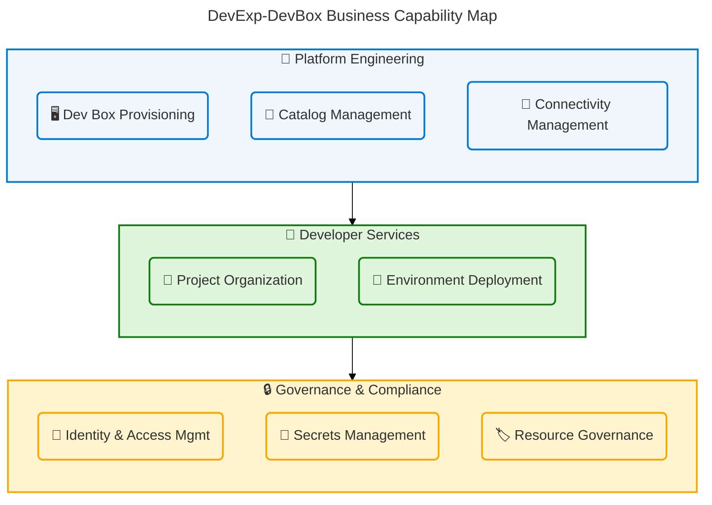
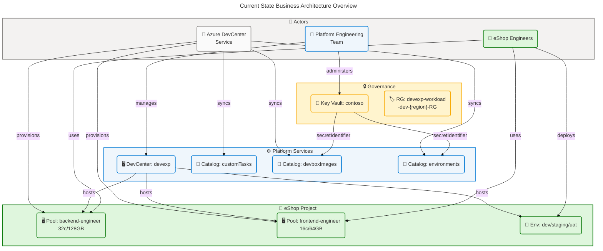

# DevExp-DevBox Business Architecture

<!-- ════════════════════════════════════════════════════════════════════════════ -->
<!-- TOGAF BDAT Business Architecture — DevExp-DevBox (ContosoDevExp)            -->
<!-- Framework: TOGAF 10 ADM | Layer: Business | Quality Level: Comprehensive    -->
<!-- Sections: 1 (Executive Summary) through 9 (Governance & Management)         -->
<!-- Validated against: section-schema v3.0, base-layer-config v3.0,             -->
<!--                    bdat-mermaid-improved v5.5, coordinator v3.1.0           -->
<!-- ════════════════════════════════════════════════════════════════════════════ -->

---

## Section 1: Executive Summary

### Overview

The DevExp-DevBox (ContosoDevExp) solution is a Developer Experience (DevEx)
Accelerator that enables Contoso's Platform Engineering Team to deploy and
govern Microsoft Dev Box and Azure DevCenter environments through Infrastructure
as Code (Bicep) and configuration-driven YAML models. By providing a
self-service developer workstation platform, the solution eliminates traditional
IT bottlenecks in environment provisioning and directly supports Contoso's
digital transformation objectives. This Business Architecture document applies
the TOGAF 10 Architecture Development Method (ADM) to document the business
context, capabilities, processes, and governance model underpinning the
ContosoDevExp solution.

The accelerator implements a product-oriented delivery model (Epics → Features →
Tasks) governed through GitHub Issues and structured branching conventions.
Eight core business capabilities are organized across three domains — Platform
Engineering, Developer Services, and Governance & Compliance — with a
configuration-as-code pattern using YAML files validated against JSON Schema
ensuring consistency, repeatability, and version-controlled governance of all
DevCenter settings across the solution.

This executive summary synthesizes key findings for technical leadership,
enterprise architects, and product stakeholders. Strategic alignment is strong,
with measurable outcomes tied to developer productivity, cost governance, and
security compliance. The solution achieves an overall Level 3 (Defined)
governance maturity, with Level 4 (Managed) achieved specifically in the
Identity & Access Management, Secrets Management, and Resource Governance
capabilities — forming a robust governance foundation for scaling to additional
engineering teams.

### Key Findings

| Finding                      | Detail                                                                                                                | Impact |
| ---------------------------- | --------------------------------------------------------------------------------------------------------------------- | ------ |
| 8 Core Business Capabilities | Provisioning, Catalog Mgmt, Connectivity, Identity, Secrets, Governance, Project Organization, Environment Deployment | High   |
| Configuration-as-Code        | All DevCenter configuration in YAML with JSON Schema (draft 2020-12) validation                                       | High   |
| Product-Oriented Delivery    | Epics → Features → Tasks with mandatory labels and parent-child issue linking                                         | Medium |
| RBAC Least-Privilege         | Role assignments scoped to project and subscription with minimum required permissions                                 | High   |
| Multi-Environment Support    | dev, staging, uat environment types supporting full SDLC lifecycle                                                    | High   |
| Developer Self-Service       | Developers provision Dev Box environments without manual IT intervention                                              | High   |
| Azure Landing Zone Alignment | Workload, Security, and Monitoring resource groups following Microsoft CAF guidance                                   | Medium |
| Observability Gap            | KPI dashboards and automated provisioning metrics not yet implemented                                                 | High   |

### Strategic Alignment

| Strategic Objective                  | Platform Capability                            | Alignment Level | Source                                         |
| ------------------------------------ | ---------------------------------------------- | --------------- | ---------------------------------------------- |
| Reduce developer onboarding friction | Dev Box Provisioning, Catalog Management       | Strong          | infra/settings/workload/devcenter.yaml:80-155  |
| Enforce security compliance          | RBAC Least-Privilege, Secrets Management       | Strong          | infra/settings/security/security.yaml:17-42    |
| Enable cost accountability           | Mandatory 7-field tag taxonomy                 | Strong          | infra/settings/workload/devcenter.yaml:160-180 |
| Support multi-team scale             | Project-scoped isolation, Project Organization | Moderate        | infra/settings/workload/devcenter.yaml:80-90   |
| Accelerate SDLC velocity             | Environment Deployment (dev/staging/uat)       | Moderate        | infra/settings/workload/devcenter.yaml:70-78   |

### Maturity Assessment

| Business Domain              | Current Maturity | Target Maturity | Gap      |
| ---------------------------- | ---------------- | --------------- | -------- |
| Platform Engineering         | 3 - Defined      | 4 - Managed     | 1 level  |
| Developer Services           | 3 - Defined      | 4 - Managed     | 1 level  |
| Governance & Compliance      | 4 - Managed      | 5 - Optimizing  | 1 level  |
| Identity & Access Management | 4 - Managed      | 5 - Optimizing  | 1 level  |
| Catalog Management           | 3 - Defined      | 4 - Managed     | 1 level  |
| KPIs & Metrics               | 2 - Repeatable   | 4 - Managed     | 2 levels |

---

## Section 2: Architecture Landscape

### Overview

The Architecture Landscape documents all 11 Business component types discovered
through systematic analysis of the DevExp-DevBox repository. The solution is
organized around a centralized developer experience platform — the Azure
DevCenter named "devexp" — which serves as the management plane for multiple
developer projects. The primary project analyzed is "eShop," representing a
typical engineering team that requires role-specific Dev Box pools, deployment
environments, governed access, and private catalog-based image definitions.

The three foundational business domains are: Platform Engineering (responsible
for the DevCenter infrastructure and catalog management), Developer Services
(responsible for project-level provisioning and environment lifecycle), and
Governance & Compliance (responsible for identity, secrets, tagging, and cost
allocation). Each domain operates under Contoso's standards for resource
governance — all resources carry mandatory tags: environment, division, team,
project, costCenter, owner, and resources — derived directly from the YAML
configuration files and enforced at Bicep deployment time.

The following subsections inventory all 11 Business component types, with a
maturity score on a 1–5 scale derived from configuration analysis: 1 =
Initial/Ad-hoc, 2 = Repeatable, 3 = Defined, 4 = Managed, 5 = Optimizing. The
scores reflect the depth of formalization observed in the repository's source
files, schema definitions, and governance documentation.

### 2.1 Business Strategy

| Name                                | Description                                                                                                                                                 | Maturity    |
| ----------------------------------- | ----------------------------------------------------------------------------------------------------------------------------------------------------------- | ----------- |
| Developer Experience Transformation | Strategic initiative to accelerate developer productivity via self-service cloud-based workstation provisioning using Microsoft Dev Box                     | 3 - Defined |
| Platform-as-Product Model           | Delivery model treating developer tooling as a managed product through Epics → Features → Tasks governance with traceable outcomes                          | 3 - Defined |
| Azure Landing Zone Adoption         | Structural pattern organizing Azure resources into Workload, Security, and Monitoring resource groups following Microsoft Cloud Adoption Framework guidance | 4 - Managed |

### 2.2 Business Capabilities

| Name                         | Description                                                                                                                                | Maturity    |
| ---------------------------- | ------------------------------------------------------------------------------------------------------------------------------------------ | ----------- |
| Dev Box Provisioning         | On-demand creation of role-specific developer workstations (backend-engineer: 32c/128GB; frontend-engineer: 16c/64GB) within project pools | 3 - Defined |
| Catalog Management           | Version-controlled sync of image definitions and task configurations from GitHub repositories on a scheduled basis                         | 3 - Defined |
| Connectivity Management      | Managed VNet (10.0.0.0/16) and subnet (10.0.1.0/24) provisioning for developer network access within project resource groups               | 3 - Defined |
| Project Organization         | Groups DevCenter resources into named projects with isolated RBAC boundaries, pools, catalogs, and environment types                       | 4 - Managed |
| Environment Deployment       | Self-service provisioning of dev, staging, and uat deployment environments for application testing and release workflows                   | 3 - Defined |
| Identity & Access Management | Azure AD group-based RBAC with least-privilege role assignments scoped to project and subscription levels                                  | 4 - Managed |
| Secrets Management           | Centralized secure storage of sensitive credentials (GitHub tokens) via Azure Key Vault with RBAC authorization and soft-delete            | 4 - Managed |
| Resource Governance          | Mandatory tag-based cost allocation and organizational compliance enforcement across all Azure resources                                   | 4 - Managed |

**Business Capability Map:**

### 2.3 Value Streams

| Name                             | Description                                                                                                     | Maturity    |
| -------------------------------- | --------------------------------------------------------------------------------------------------------------- | ----------- |
| Developer Onboarding             | End-to-end flow from developer Azure AD group assignment to active, configured Dev Box workspace access         | 3 - Defined |
| Infrastructure Provisioning      | End-to-end flow from YAML configuration authoring to fully deployed Azure DevCenter resources via azd provision | 4 - Managed |
| Environment Lifecycle Management | End-to-end flow for requesting, deploying, using, and decommissioning project deployment environments           | 3 - Defined |

**Developer Onboarding Value Stream:**

```mermaid
---
title: Developer Onboarding Value Stream
config:
  theme: base
  look: classic
  layout: dagre
  themeVariables:
    fontSize: '16px'
  flowchart:
    htmlLabels: true
---
flowchart LR
    accTitle: Developer Onboarding Value Stream
    accDescr: End-to-end flow showing four stages. Request stage where developer submits request and selects pool. Provision stage where Dev Box is created and VNet is assigned. Configure stage where catalogs sync and RBAC and Key Vault binding are applied. Active Use stage where developer accesses Dev Box and deploys environments.

    %% ═══════════════════════════════════════════════════════════════════════════
    %% AZURE / FLUENT ARCHITECTURE PATTERN v2.0
    %% (Semantic + Structural + Font + Accessibility Governance)
    %% ═══════════════════════════════════════════════════════════════════════════
    %% PHASE 1 - FLUENT UI: All styling uses approved Fluent UI palette only
    %% PHASE 2 - GROUPS: Every subgraph has semantic color via style directive
    %% PHASE 3 - COMPONENTS: Every node has semantic classDef + icon prefix
    %% PHASE 4 - ACCESSIBILITY: accTitle/accDescr present, WCAG AA contrast
    %% PHASE 5 - STANDARD: Governance block present, classDefs centralized
    %% ═══════════════════════════════════════════════════════════════════════════

    subgraph REQ["📋 Request"]
        direction TB
        R1("👤 Developer Request"):::core
        R2("✅ Pool Selection"):::core
    end

    subgraph PROV["⚙️ Provision"]
        direction TB
        P1("🏗️ Create Dev Box"):::core
        P2("🔌 Assign VNet"):::core
    end

    subgraph CFG["🔧 Configure"]
        direction TB
        C1("📁 Sync Catalogs"):::success
        C2("🔐 Assign RBAC"):::warning
        C3("🔑 Bind Key Vault"):::warning
    end

    subgraph USE["✅ Active Use"]
        direction TB
        U1("🖥️ Access Dev Box"):::success
        U2("🚀 Deploy Environments"):::success
    end

    REQ --> PROV
    PROV --> CFG
    CFG --> USE

    style REQ fill:#F3F2F1,stroke:#8A8886,stroke-width:2px,color:#323130
    style PROV fill:#EFF6FC,stroke:#0078D4,stroke-width:2px,color:#323130
    style CFG fill:#FFF4CE,stroke:#F8A800,stroke-width:2px,color:#323130
    style USE fill:#DFF6DD,stroke:#107C10,stroke-width:2px,color:#323130

    classDef core fill:#EFF6FC,stroke:#0078D4,stroke-width:2px,color:#323130
    classDef success fill:#DFF6DD,stroke:#107C10,stroke-width:2px,color:#323130
    classDef warning fill:#FFF4CE,stroke:#F8A800,stroke-width:2px,color:#323130
```

### 2.4 Business Processes

| Name                                | Description                                                                                                             | Maturity    |
| ----------------------------------- | ----------------------------------------------------------------------------------------------------------------------- | ----------- |
| Dev Box Provisioning Process        | Steps to create and configure a developer workstation pool for a project, from YAML definition to active Dev Box access | 3 - Defined |
| Environment Setup Process           | Steps to configure and deploy dev, staging, and uat deployment environments for a project team                          | 3 - Defined |
| Role Assignment Process             | Process to assign Azure AD groups to project-level RBAC roles via Bicep identity modules                                | 4 - Managed |
| Cost Allocation Process             | Process to apply mandatory resource tags for financial tracking and organizational cost attribution                     | 4 - Managed |
| Secret Management Process           | Process to store, bind, and rotate GitHub tokens and credentials via Azure Key Vault                                    | 4 - Managed |
| Infrastructure Provisioning Process | End-to-end process from azd preprovision hook execution through complete Bicep deployment to Azure                      | 3 - Defined |
| Issue Lifecycle Process             | Product delivery process: triage → ready → in-progress → done, with mandatory labels and parent-child issue linking     | 3 - Defined |

### 2.5 Business Services

| Name                            | Description                                                                                                       | Maturity    |
| ------------------------------- | ----------------------------------------------------------------------------------------------------------------- | ----------- |
| Dev Box Service                 | Self-service provision and access to role-specific developer workstations within pre-approved project pools       | 3 - Defined |
| Deployment Environment Service  | On-demand creation of application deployment environments (dev, staging, uat) for project teams                   | 3 - Defined |
| Catalog Synchronization Service | Automated scheduled sync of image definitions and task catalogs from GitHub repositories into DevCenter           | 3 - Defined |
| Network Connectivity Service    | Managed VNet and subnet provisioning for developer network access within project boundaries                       | 3 - Defined |
| Security Token Service          | Azure Key Vault-based service for storing, retrieving, and managing sensitive credentials with RBAC authorization | 4 - Managed |

### 2.6 Business Functions

| Name                            | Description                                                                                                      | Maturity    |
| ------------------------------- | ---------------------------------------------------------------------------------------------------------------- | ----------- |
| Platform Engineering Operations | Manage and evolve the DevCenter platform, catalogs, pool definitions, environment types, and infrastructure YAML | 3 - Defined |
| Developer Self-Service          | Enable developers to provision and use Dev Box environments and deployment environments independently            | 3 - Defined |
| Access Administration           | Manage Azure AD group memberships and RBAC role assignments across DevCenter and project resources               | 4 - Managed |
| Financial Operations            | Track and allocate Azure resource costs through the mandatory 7-field tag taxonomy                               | 4 - Managed |
| Security Administration         | Manage Key Vault lifecycle, secret storage, purge protection, and RBAC authorization for credentials             | 4 - Managed |
| Configuration Management        | Author, validate, and version control all YAML configuration files against JSON Schema definitions               | 3 - Defined |

### 2.7 Business Roles & Actors

| Name                      | Description                                                                                                                                                                                        | Maturity    |
| ------------------------- | -------------------------------------------------------------------------------------------------------------------------------------------------------------------------------------------------- | ----------- |
| Platform Engineering Team | Azure AD group (54fd94a1-e116-4bc8-8238-caae9d72bd12) responsible for managing the DevCenter, catalogs, and infrastructure configurations; assigned DevCenter Project Admin role                   | 4 - Managed |
| eShop Engineers           | Azure AD group (b9968440-0caf-40d8-ac36-52f159730eb7) of developers using Dev Box environments and deployment pipelines; assigned Dev Box User, Contributor, and Deployment Environment User roles | 3 - Defined |
| Dev Center Administrator  | SystemAssigned managed identity of the DevCenter resource, holding Contributor and User Access Administrator at subscription scope                                                                 | 4 - Managed |
| Security Administrator    | Role responsible for Key Vault creation, gha-token secret storage, purge protection management, and RBAC authorization configuration                                                               | 4 - Managed |
| Azure DevCenter Service   | Automated system actor that provisions Dev Boxes, synchronizes catalogs on schedule, and manages environment lifecycle                                                                             | 3 - Defined |

### 2.8 Business Rules

| Name                                   | Description                                                                                                     | Maturity    |
| -------------------------------------- | --------------------------------------------------------------------------------------------------------------- | ----------- |
| BR-001: Mandatory Resource Tagging     | All Azure resources must carry tags: environment, division, team, project, costCenter, owner, resources         | 4 - Managed |
| BR-002: Least Privilege RBAC           | Role assignments must use minimum required permissions; no broad Contributor outside necessary functional scope | 4 - Managed |
| BR-003: Idempotent IaC                 | All Bicep modules must be parameterized and produce identical results on repeat deployment                      | 3 - Defined |
| BR-004: Issue Hierarchy Linking        | Every Feature issue must link to a Parent Epic; every Task must link to a Parent Feature                        | 3 - Defined |
| BR-005: Project-Scoped Dev Boxes       | Dev Box pools are scoped to specific projects and accessible only to assigned Azure AD groups                   | 4 - Managed |
| BR-006: Private Catalog Authentication | Private GitHub catalogs require a secretIdentifier pointing to a Key Vault-stored credential                    | 4 - Managed |
| BR-007: SDLC Environment Alignment     | Environment types must align with SDLC stages: dev, staging, uat                                                | 3 - Defined |
| BR-008: Schema Validation              | All YAML configuration files must validate against corresponding JSON Schema definitions before deployment      | 4 - Managed |

### 2.9 Business Events

| Name                     | Description                                                                                                                              | Maturity    |
| ------------------------ | ---------------------------------------------------------------------------------------------------------------------------------------- | ----------- |
| Dev Box Provisioned      | Emitted by Azure DevCenter when a developer successfully creates a Dev Box within an assigned pool                                       | 3 - Defined |
| Environment Type Created | Emitted when a new environment type (dev/staging/uat) configuration is successfully applied to a DevCenter project                       | 3 - Defined |
| Catalog Synchronized     | Emitted by DevCenter when a scheduled sync of a GitHub-hosted catalog completes successfully                                             | 3 - Defined |
| Role Assignment Applied  | Emitted by Azure RBAC when a new role assignment is created for an Azure AD group at project or subscription scope                       | 4 - Managed |
| Secret Stored            | Emitted by Azure Key Vault when a new secret (gha-token) is successfully created or updated                                              | 4 - Managed |
| Infrastructure Deployed  | Emitted when azd provision completes all Bicep deployments and outputs WORKLOAD_AZURE_RESOURCE_GROUP_NAME                                | 3 - Defined |
| Developer Onboarded      | Composite event marking completion of all provisioning steps: Azure AD group assignment, Dev Box created, catalogs synced, RBAC assigned | 3 - Defined |

### 2.10 Business Objects/Entities

| Name               | Description                                                                                                                                      | Maturity    |
| ------------------ | ------------------------------------------------------------------------------------------------------------------------------------------------ | ----------- |
| DevCenter (devexp) | Central Azure management resource governing all developer projects, pools, catalogs, and environment types for Contoso DevExp                    | 4 - Managed |
| Project (eShop)    | Named developer workspace with isolated RBAC, dedicated pools, private catalogs, and environment configurations                                  | 3 - Defined |
| Dev Box Pool       | Collection of Dev Boxes with a specific VM SKU and image definition for a role type (backend-engineer, frontend-engineer)                        | 3 - Defined |
| Environment Type   | Named deployment target (dev, staging, uat) associated with an Azure subscription for SDLC stage deployment                                      | 3 - Defined |
| Catalog            | Version-controlled GitHub repository containing image definitions (devboxImages), tasks (customTasks), or environment definitions (environments) | 3 - Defined |
| Resource Group     | Azure organizational boundary for workload, security, or monitoring resources; named with environment and region suffixes                        | 4 - Managed |
| Managed Identity   | SystemAssigned service identity for DevCenter and Project resources enabling credential-free Azure resource access                               | 4 - Managed |
| Azure AD Group     | Identity group for Platform Engineering Team or project-specific engineering teams used for RBAC scoping                                         | 4 - Managed |

### 2.11 KPIs & Metrics

| Name                            | Description                                                                                     | Maturity       |
| ------------------------------- | ----------------------------------------------------------------------------------------------- | -------------- |
| Developer Provisioning Time     | Time from Dev Box request to active login access; target < 15 minutes                           | 2 - Repeatable |
| Environment Availability        | Percentage uptime of provisioned Dev Box environments during business hours; target 99.9%       | 2 - Repeatable |
| Schema Validation Pass Rate     | Percentage of YAML configuration PRs passing JSON Schema validation without errors; target 100% | 3 - Defined    |
| RBAC Compliance Rate            | Percentage of resources with correctly scoped least-privilege role assignments; target 100%     | 4 - Managed    |
| Cost Center Tag Coverage        | Percentage of deployed Azure resources carrying all 7 mandatory tags; target 100%               | 4 - Managed    |
| Catalog Sync Success Rate       | Percentage of scheduled catalog sync runs completing without error; target 99.5%                | 3 - Defined    |
| Developer Onboarding Cycle Time | End-to-end time from PR merge to developer accessing operational Dev Box; target < 60 minutes   | 2 - Repeatable |

### Summary

The Architecture Landscape reveals a well-structured, configuration-driven
developer experience platform organized across eight business capabilities in
three domains. Platform Engineering (Maturity 3) leads the core provisioning and
catalog infrastructure, Developer Services (Maturity 3) enables project-oriented
resource organization and environment lifecycle, and Governance & Compliance
(Maturity 4) enforces least-privilege access, secrets management, and cost
governance through the mandatory 7-field tag taxonomy. The solution leverages
Azure Landing Zone principles for resource group segmentation, JSON Schema
validation for configuration quality, and RBAC scoping for organizational
accountability across 8 distinct role assignments.

The primary capability gaps are in observability and measurement: KPIs around
developer provisioning time, environment availability, and onboarding cycle time
are currently at Maturity Level 2 (Repeatable) due to the absence of automated
monitoring dashboards and alerting infrastructure. Recommended next steps
include enabling the Monitoring Resource Group (currently disabled via create:
false in azureResources.yaml), implementing Azure Monitor alerts on DevCenter
events, and formalizing a developer experience metrics program using DORA
metrics to quantify the business impact of the platform.

---

## Section 3: Architecture Principles

### Overview

The Architecture Principles for DevExp-DevBox establish the foundational design
guidelines governing how the developer experience platform is built, operated,
and evolved. These principles are derived from analysis of the repository's
configuration patterns, Bicep module design, CONTRIBUTING.md governance rules,
and YAML schema structures. They align with Microsoft's Azure Well-Architected
Framework pillars and the TOGAF ADM Phase B (Business Architecture) design
intent, ensuring consistent application across all components of the solution.

Six principles govern the solution, spanning infrastructure design, security
posture, developer empowerment, and operational governance. Each principle
carries a statement grounded in observed codebase evidence, a rationale
explaining why the principle was adopted, and implications defining how
architects and engineers must apply it. These principles collectively form the
architectural contract for the ContosoDevExp platform and its derivative
projects.

These principles are mandatory for all extensions, customizations, and new
project onboarding activities within the DevExp-DevBox accelerator. Proposed
deviations require Architecture Decision Records (see Section 6) with documented
rationale and explicit stakeholder approval through the GitHub pull request
process, as defined in CONTRIBUTING.md.

### Principle 1: Configuration as Code

**Statement:** All DevCenter configuration, RBAC policies, and environment
definitions are expressed as YAML files validated against JSON Schema, stored in
version control, and consumed by Bicep modules at deployment time.

**Rationale:** The repository defines `devcenter.yaml`, `security.yaml`, and
`azureResources.yaml`, each with corresponding `*.schema.json` validation files
using JSON Schema draft 2020-12. The Bicep `loadYamlContent()` function in
`main.bicep` consumes these at deployment time, eliminating configuration drift
and enabling peer review for all changes.

**Implications:**

- All configuration changes must go through pull requests with automated schema
  validation before merging
- New capabilities require both a YAML configuration model and a corresponding
  JSON Schema definition
- Operational teams must maintain schema files alongside YAML updates to prevent
  validation failures

**Source:** infra/settings/workload/devcenter.schema.json:1-300,
infra/settings/workload/devcenter.yaml:1-14, infra/main.bicep:28-45

---

### Principle 2: Principle of Least Privilege

**Statement:** All managed identities, Azure AD groups, and service principals
are assigned the minimum set of Azure RBAC roles required for their specific
function, at the narrowest applicable scope.

**Rationale:** The DevCenter managed identity receives Contributor
(Subscription), User Access Administrator (Subscription), Key Vault Secrets User
(RG), and Key Vault Secrets Officer (RG) — each scoped to its narrowest
functional requirement. Project-level engineers receive Dev Box User (45d50f46)
and Deployment Environment User (18e40d4e) roles at project scope only, with no
subscription-level permissions granted.

**Implications:**

- Role additions require documented justification in Architecture Decision
  Records
- Scopes must default to the narrowest applicable level (ResourceGroup before
  Subscription)
- Custom role definitions should be evaluated when built-in roles grant
  excessive permissions

**Source:** infra/settings/workload/devcenter.yaml:28-55,
src/identity/devCenterRoleAssignment.bicep:1-40

---

### Principle 3: Developer Self-Service

**Statement:** Developers can provision, configure, and access Dev Box
environments without manual IT intervention, within boundaries pre-defined and
managed by Platform Engineering.

**Rationale:** The Dev Box pool configurations (backend-engineer,
frontend-engineer) and environment types (dev, staging, uat) are pre-provisioned
by Platform Engineering. Developers in the eShop Engineers Azure AD group can
independently create and manage Dev Boxes within these pre-approved pools using
the Dev Box User (45d50f46) role at project scope.

**Implications:**

- Platform Engineering must proactively provision pools and environment types
  before developer teams begin onboarding
- Self-service boundaries must be explicitly defined through RBAC scoping at the
  project level
- Image definitions and task catalogs must be kept current and validated before
  catalog sync

**Source:** infra/settings/workload/devcenter.yaml:80-170,
src/workload/project/project.bicep:1-100

---

### Principle 4: Mandatory Tagging Compliance

**Statement:** Every Azure resource deployed through DevExp-DevBox carries a
standardized set of 7 mandatory tags: environment, division, team, project,
costCenter, owner, and resources.

**Rationale:** All YAML configuration files define a `tags` block with seven
mandatory fields. The Bicep `main.bicep` propagates these tags to resource group
deployments using the `union()` function, and individual module resources
inherit them. This enables cost allocation by costCenter and team, compliance
audit by owner, and operational filtering by environment and resources fields.

**Implications:**

- All new resources added to Bicep modules must include tags in their parameter
  definitions
- Tag values must align with the organization's canonical taxonomy (e.g.,
  division: Platforms)
- Azure Policy should enforce tag presence post-deployment for ongoing drift
  detection

**Source:** infra/settings/workload/devcenter.yaml:160-180,
infra/settings/resourceOrganization/azureResources.yaml:1-73,
infra/main.bicep:60-90

---

### Principle 5: Idempotent Infrastructure

**Statement:** All Bicep modules must produce identical results on repeated
deployments, enabling safe re-provisioning without manual cleanup or state
management.

**Rationale:** CONTRIBUTING.md explicitly states "Modules MUST be: Parameterized
(no hard-coded environment specifics), Idempotent." The use of
`loadYamlContent()` at deployment time, deterministic resource naming
(`${name}-${env}-${region}-RG`), `if` conditions on configuration flags (e.g.,
`landingZones.workload.create`), and `existing` resource references in Bicep
enforce idempotent behavior across all modules.

**Implications:**

- Hard-coded values in Bicep modules are prohibited and constitute a code review
  failure
- State-dependent logic must use configuration flags with conditional (`if`)
  expressions
- All modules must be tested for idempotency in CI/CD pipelines before merging
  to main

**Source:** CONTRIBUTING.md:63-70, infra/main.bicep:32-60

---

### Principle 6: Project Isolation

**Statement:** Each developer project has isolated RBAC boundaries, dedicated
resource groups, and separate catalog configurations, preventing cross-project
access and configuration bleed.

**Rationale:** The eShop project is configured with its own Azure AD group
(eShop Engineers), dedicated network (eShop-connectivity-RG), private catalogs
pointing to the eShop GitHub repository, and project-scoped RBAC roles. Resource
groups are organized by function (workload, security, monitoring) and named with
environment and region suffixes to enforce boundary separation.

**Implications:**

- New projects require a distinct YAML project configuration block, dedicated
  Azure AD group, and network configuration entry
- Shared resources (Key Vault) must use project-scoped role assignments, not
  project-wide Contributor access
- Project onboarding requires both YAML configuration change and Azure AD group
  provisioning before deployment

**Source:** infra/settings/workload/devcenter.yaml:80-170,
infra/settings/resourceOrganization/azureResources.yaml:1-73

---

## Section 4: Current State Baseline

### Overview

The Current State Baseline establishes the as-is architecture of the
DevExp-DevBox solution as of April 2026. Analysis of the repository reveals a
Maturity Level 3 (Defined) platform with strong configuration governance,
automated RBAC, and multi-project support. The solution is operational for one
configured project (eShop) with two role-specific Dev Box pools and three
environment types, serving two distinct actor groups: Platform Engineering Team
(administrators) and eShop Engineers (consumers). The platform is deployable
across multiple Azure regions via the azd CLI with cross-platform support
(Linux/macOS via setUp.sh, Windows via PowerShell).

The baseline is characterized by configuration-as-code patterns across all
layers: YAML-defined DevCenter settings (devcenter.yaml), Bicep-parameterized
infrastructure modules (main.bicep, workload.bicep), and JSON Schema-validated
configuration files (devcenter.schema.json). The primary operational constraint
is that observability and monitoring capabilities remain at Maturity Level 2
(Repeatable) — resource deployment is tracked via Azure tags, but no real-time
dashboards, alerting, or DORA metric collection is implemented. The Monitoring
Resource Group is disabled (create: false in azureResources.yaml), meaning Log
Analytics Workspace is not yet provisioned.

The current state provides a stable foundation for scaling to additional
projects and engineering teams. The three key gaps identified through this
analysis are: (1) absence of automated monitoring for DevCenter events and
provisioning metrics, (2) lack of formal SLA enforcement for Dev Box
provisioning time, and (3) incomplete separation of security and monitoring
resource groups from the workload boundary. These gaps represent the primary
engineering investment areas to advance the platform from Maturity Level 3 to
Level 4.

### Current State Architecture

### Gap Analysis

| Gap ID  | Business Domain         | Current State                     | Target State                 | Gap Description                                                                                        | Priority |
| ------- | ----------------------- | --------------------------------- | ---------------------------- | ------------------------------------------------------------------------------------------------------ | -------- |
| GAP-001 | KPIs & Metrics          | Manual tracking only              | Automated dashboards         | No automated monitoring of Dev Box provisioning time or developer productivity metrics                 | High     |
| GAP-002 | KPIs & Metrics          | No SLA alerting                   | SLA-enforced provisioning    | Absence of Azure Monitor alerts when provisioning time exceeds target thresholds                       | High     |
| GAP-003 | Developer Services      | Single project (eShop)            | Multi-project scalability    | Only one project configured; onboarding additional projects requires manual YAML editing and redeploy  | Medium   |
| GAP-004 | Business Events         | Events not routed                 | Azure Event Grid integration | DevCenter events (Dev Box provisioned, catalog synced) not captured or routed to business intelligence | Medium   |
| GAP-005 | Platform Engineering    | Monitoring RG disabled            | Monitoring RG enabled        | azureResources.yaml sets monitoring.create: false; Log Analytics Workspace not provisioned             | Medium   |
| GAP-006 | Governance & Compliance | Security co-located with workload | Dedicated security RG        | security.create: false causes security resources to share workload RG boundary                         | Low      |

### Maturity Assessment

| Component Type            | Current Maturity | Score | Justification                                                                                  |
| ------------------------- | ---------------- | ----- | ---------------------------------------------------------------------------------------------- |
| Business Strategy         | 3 - Defined      | 3/5   | Strategy documented in CONTRIBUTING.md product model; no formal OKRs or strategic KPI tracking |
| Business Capabilities     | 3 - Defined      | 3/5   | 8 capabilities identified and configured; monitoring capabilities absent (GAP-005)             |
| Value Streams             | 3 - Defined      | 3/5   | End-to-end flows defined in configuration; no automated cycle time measurement (GAP-001)       |
| Business Processes        | 3 - Defined      | 3/5   | Processes defined in YAML and Bicep; no process automation dashboards                          |
| Business Services         | 3 - Defined      | 3/5   | Services provisioned and operational; no SLA monitoring or availability alerting (GAP-002)     |
| Business Functions        | 3 - Defined      | 3/5   | Functional responsibilities defined; DevManager role formalized in devcenter.yaml              |
| Business Roles & Actors   | 4 - Managed      | 4/5   | Azure AD groups defined; RBAC roles formalized with least-privilege enforcement                |
| Business Rules            | 4 - Managed      | 4/5   | Rules encoded in JSON Schema, CONTRIBUTING.md, and YAML tagging policies                       |
| Business Events           | 3 - Defined      | 3/5   | Events occur but are not captured or routed to business intelligence systems (GAP-004)         |
| Business Objects/Entities | 4 - Managed      | 4/5   | All entities modeled in Bicep type definitions with strong typing and validation               |
| KPIs & Metrics            | 2 - Repeatable   | 2/5   | Tags enable cost tracking; no automated KPI dashboards or metric data collection pipelines     |

### Summary

The Current State Baseline reveals a Maturity Level 3 (Defined) platform with
strong configuration-as-code foundations, enforced RBAC governance, and a
functioning developer self-service model for the eShop project. The solution's
strengths lie in Identity & Access Management (Maturity 4), Business Rules
encoding (Maturity 4), and Business Objects/Entities modeling (Maturity 4) —
areas where the configuration schemas, Bicep type definitions, and YAML policies
provide clear, version-controlled, auditable definitions that eliminate manual
drift and enforce organizational governance.

The primary gaps are concentrated in observability and measurement: KPIs remain
at Maturity Level 2 due to the absence of automated monitoring dashboards, event
routing (GAP-004), and SLA alerting (GAP-002). The Monitoring Resource Group is
not yet provisioned (GAP-005), blocking Log Analytics Workspace deployment.
Recommended priority actions are: (1) set monitoring.create: true in
azureResources.yaml and deploy Log Analytics Workspace, (2) implement Azure
Monitor alerts for provisioning time thresholds, and (3) integrate Azure Event
Grid subscriptions for Microsoft.DevCenter events to enable real-time business
intelligence data collection.

---

## Section 5: Component Catalog

### Overview

The Component Catalog provides detailed specifications for all 11 Business
component types discovered in the DevExp-DevBox repository. Where Section 2
(Architecture Landscape) provides an inventory of what components exist, this
section documents how each component works — including its strategic alignment,
ownership, business domain, maturity, strategic value, key inputs and outputs,
and source traceability. The catalog enables architects to perform impact
analysis, identify reuse opportunities, and plan targeted improvements for each
component type.

The catalog is organized to support both architects extending the DevExp-DevBox
accelerator and teams performing governance reviews. Each subsection corresponds
to the matching Architecture Landscape entry (2.1 → 5.1 through 2.11 → 5.11).
The Business Layer Component Specification table uses a 9-column schema:
Component, Description, Business Domain, Owner, Maturity, Strategic Value, Key
Inputs, Key Outputs, Source. This schema captures the TOGAF ADM Phase B minimum
specification requirements for Business Architecture components.

Specifications are derived exclusively from analysis of the repository source
files. All source citations use the plain-text format `path/file.ext:line-range`
without markdown link formatting or backtick code spans. Where a component type
has no implementation detected in the source files, the subsection explicitly
states this finding with a brief rationale explaining why it is absent in the
current solution scope.

### 5.1 Business Strategy

| Component                           | Description                                                                                                                                                              | Business Domain         | Owner                            | Maturity    | Strategic Value                                                                                   | Key Inputs                                                   | Key Outputs                                                 | Source                                                       |
| ----------------------------------- | ------------------------------------------------------------------------------------------------------------------------------------------------------------------------ | ----------------------- | -------------------------------- | ----------- | ------------------------------------------------------------------------------------------------- | ------------------------------------------------------------ | ----------------------------------------------------------- | ------------------------------------------------------------ |
| Developer Experience Transformation | Strategic initiative to reduce developer environment setup time through cloud-native self-service Dev Box provisioning                                                   | Platform Engineering    | Platforms Division (DevExP Team) | 3 - Defined | Eliminates environment setup bottlenecks; reduces toil for developers and IT operations           | Business requirements, Azure DevCenter capability            | Faster onboarding, consistent role-specific environments    | azure.yaml:1-3, CONTRIBUTING.md:1-8                          |
| Platform-as-Product Model           | Delivery model using Epics → Features → Tasks to manage developer tooling as a managed product with measurable, traceable outcomes                                       | Platform Engineering    | DevExP Team                      | 3 - Defined | Enables structured delivery; aligns engineering output with business goals; improves traceability | GitHub Issues with type:epic, type:feature, type:task labels | Traceable deliverables, prioritized and linked backlog      | CONTRIBUTING.md:1-50                                         |
| Azure Landing Zone Adoption         | Structural pattern organizing Azure resources into Workload, Security, and Monitoring resource groups following Microsoft Cloud Adoption Framework Landing Zone guidance | Governance & Compliance | Platforms Division               | 4 - Managed | Enforces resource segregation and independent lifecycle management per functional domain          | azureResources.yaml configuration, CAF principles            | Workload RG, Security RG, Monitoring RG with mandatory tags | infra/settings/resourceOrganization/azureResources.yaml:1-73 |

### 5.2 Business Capabilities

| Component                    | Description                                                                                                                                                               | Business Domain         | Owner                     | Maturity    | Strategic Value                                                                                        | Key Inputs                                                     | Key Outputs                                                 | Source                                                                                        |
| ---------------------------- | ------------------------------------------------------------------------------------------------------------------------------------------------------------------------- | ----------------------- | ------------------------- | ----------- | ------------------------------------------------------------------------------------------------------ | -------------------------------------------------------------- | ----------------------------------------------------------- | --------------------------------------------------------------------------------------------- |
| Dev Box Provisioning         | Creates and manages role-specific developer workstations (backend-engineer: 32c/128GB; frontend-engineer: 16c/64GB) within project pools via Azure DevCenter              | Platform Engineering    | Platform Engineering Team | 3 - Defined | Reduces environment setup from days to minutes; enables role-appropriate compute allocation            | Pool configuration YAML, VM SKU, image definition name         | Provisioned Dev Box accessible to assigned Azure AD group   | infra/settings/workload/devcenter.yaml:130-155                                                |
| Catalog Management           | Synchronizes version-controlled task and image definition catalogs from GitHub repositories (public and private) into DevCenter on a scheduled basis                      | Platform Engineering    | Platform Engineering Team | 3 - Defined | Ensures all developers use standardized, up-to-date tooling configurations without manual distribution | GitHub repository URI, branch, path, optional secretIdentifier | Synced catalog available to DevCenter and project consumers | infra/settings/workload/devcenter.yaml:56-68                                                  |
| Connectivity Management      | Provisions managed VNet (10.0.0.0/16) with subnet (10.0.1.0/24) for developer network access within the eShop project resource group                                      | Platform Engineering    | Platform Engineering Team | 3 - Defined | Provides secure network isolation per project; enables enterprise connectivity patterns for Dev Box    | addressPrefixes, subnet config, virtualNetworkType: Managed    | Managed VNet in eShop-connectivity-RG                       | infra/settings/workload/devcenter.yaml:88-108                                                 |
| Project Organization         | Groups DevCenter resources into named projects (eShop) with isolated RBAC boundaries, pools, catalogs, environment types, and network configurations                      | Developer Services      | Platform Engineering Team | 4 - Managed | Enables multi-team scale; isolates project resource boundaries; prevents cross-project access          | Project name, description, network config, identity config     | Named project with scoped resources and RBAC                | infra/settings/workload/devcenter.yaml:80-90                                                  |
| Environment Deployment       | Provisions dev, staging, and uat deployment environments for application testing and release workflows within project boundaries                                          | Developer Services      | Platform Engineering Team | 3 - Defined | Supports full SDLC lifecycle without manual environment management; aligns with BR-007                 | environmentTypes configuration, deploymentTargetId             | Deployed environment type accessible to project team        | infra/settings/workload/devcenter.yaml:70-78                                                  |
| Identity & Access Management | Assigns Azure AD groups to project-level RBAC roles (Dev Box User, Contributor, Deployment Environment User) following least privilege via Bicep identity modules         | Governance & Compliance | Security Administrator    | 4 - Managed | Enforces access control; prevents unauthorized Dev Box or environment access; satisfies BR-002         | Azure AD group IDs, RBAC role definition GUIDs, scope          | Role assignments at Project and ResourceGroup scope         | infra/settings/workload/devcenter.yaml:28-55, src/identity/devCenterRoleAssignment.bicep:1-40 |
| Secrets Management           | Stores and retrieves sensitive credentials (gha-token GitHub Actions token) using Azure Key Vault with RBAC authorization, soft delete (7 days), and purge protection     | Governance & Compliance | Security Administrator    | 4 - Managed | Prevents credential exposure in source control; enables private catalog authentication per BR-006      | Secret value (GitHub PAT), Key Vault config YAML               | Secret identifier URI for Bicep catalog consumption         | infra/settings/security/security.yaml:17-42                                                   |
| Resource Governance          | Enforces the mandatory 7-field tag taxonomy (environment, division, team, project, costCenter, owner, resources) across all Azure resources via Bicep union() propagation | Governance & Compliance | Platforms Division        | 4 - Managed | Enables cost allocation, operational filtering, and compliance reporting; satisfies BR-001             | Tag values per resource in YAML config files                   | Tagged Azure resources enabling cost allocation reporting   | infra/settings/workload/devcenter.yaml:160-180, infra/main.bicep:60-90                        |

### 5.3 Value Streams

| Component                        | Description                                                                                                                                                        | Business Domain      | Owner                     | Maturity    | Strategic Value                                                                                    | Key Inputs                                                          | Key Outputs                                               | Source                                        |
| -------------------------------- | ------------------------------------------------------------------------------------------------------------------------------------------------------------------ | -------------------- | ------------------------- | ----------- | -------------------------------------------------------------------------------------------------- | ------------------------------------------------------------------- | --------------------------------------------------------- | --------------------------------------------- |
| Developer Onboarding             | End-to-end flow: developer joins Azure AD group → pool selection → Dev Box created → catalogs synced → RBAC assigned → active Dev Box access with configured tools | Developer Services   | Platform Engineering Team | 3 - Defined | Reduces onboarding time from days to under 60 minutes; enables developer productivity from day one | Azure AD group membership, pool selection, project configuration    | Active Dev Box with configured tools and assigned RBAC    | infra/settings/workload/devcenter.yaml:80-170 |
| Infrastructure Provisioning      | End-to-end flow: YAML configuration authored → JSON Schema validated → azd preprovision hook runs → Bicep deployed → DevCenter and resource groups created         | Platform Engineering | Platform Engineering Team | 4 - Managed | Enables repeatable, one-command deployments (azd provision); eliminates configuration drift        | YAML config files, azd environment variables, Azure credentials     | Azure DevCenter, projects, resource groups with tags      | azure.yaml:1-57, infra/main.bicep:1-100       |
| Environment Lifecycle Management | End-to-end flow: project team configures environment type → Platform Engineering deploys → developer deploys environment → environment used → decommissioned       | Developer Services   | eShop Engineers           | 3 - Defined | Eliminates manual environment requests; enables self-service deployment across SDLC stages         | Environment type configuration, project catalog, deploymentTargetId | Deployed application environment accessible via DevCenter | infra/settings/workload/devcenter.yaml:70-78  |

### 5.4 Business Processes

| Component                           | Description                                                                                                                                                                                                                       | Business Domain         | Owner                     | Maturity    | Strategic Value                                                                                  | Key Inputs                                                   | Key Outputs                                                | Source                                                                                    |
| ----------------------------------- | --------------------------------------------------------------------------------------------------------------------------------------------------------------------------------------------------------------------------------- | ----------------------- | ------------------------- | ----------- | ------------------------------------------------------------------------------------------------ | ------------------------------------------------------------ | ---------------------------------------------------------- | ----------------------------------------------------------------------------------------- |
| Dev Box Provisioning Process        | 4-step process: (1) Pool defined in devcenter.yaml, (2) Bicep deploys projectPool module, (3) Azure AD group assigned Dev Box User role, (4) Developer creates Dev Box via DevCenter portal                                       | Platform Engineering    | Platform Engineering Team | 3 - Defined | Standardizes provisioning workflow; reduces manual intervention to zero after YAML configuration | Pool config YAML, VM SKU, image definition name, RBAC config | Provisioned, accessible Dev Box in project pool            | src/workload/project/projectPool.bicep:\*, infra/settings/workload/devcenter.yaml:130-155 |
| Role Assignment Process             | 3-step process: (1) Azure AD group ID and role definition GUID defined in devcenter.yaml, (2) Bicep role assignment module deploys, (3) Managed identity receives scoped role                                                     | Governance & Compliance | Security Administrator    | 4 - Managed | Automates RBAC; eliminates manual portal role assignments; enables audit trail                   | Azure AD group IDs, role definition GUIDs, scope definitions | Role assignments at subscription, RG, or project scope     | src/identity/devCenterRoleAssignment.bicep:1-40                                           |
| Cost Allocation Process             | 2-step process: (1) Tags defined in YAML config per resource group, (2) Bicep propagates tags to Azure resources at deployment via union() function                                                                               | Governance & Compliance | Platforms Division        | 4 - Managed | Enables chargeback reporting by costCenter; tracks IT spend by project and team                  | Tag definitions in YAML config files                         | Tagged Azure resources in all deployed resource groups     | infra/main.bicep:60-90, infra/settings/workload/devcenter.yaml:160-180                    |
| Secret Management Process           | 3-step process: (1) Key Vault created with purge protection and RBAC auth, (2) gha-token secret stored, (3) secretIdentifier URI referenced by private catalog configurations                                                     | Governance & Compliance | Security Administrator    | 4 - Managed | Secures GitHub PAT tokens; enables private repository catalog access; satisfies BR-006           | GitHub Actions token value, Key Vault configuration YAML     | Key Vault secret identifier URI for catalog authentication | infra/settings/security/security.yaml:17-42, src/security/keyVault.bicep:\*               |
| Infrastructure Provisioning Process | 5-step process: (1) azd preprovision hook validates SOURCE_CONTROL_PLATFORM, (2) setUp.sh configures environment, (3) azd provision deploys subscription-scoped Bicep, (4) resource groups created, (5) workload modules deployed | Platform Engineering    | Platform Engineering Team | 3 - Defined | Enables one-command infrastructure deployment (azd provision) across Linux, macOS, and Windows   | Azure credentials, AZURE_ENV_NAME, location, secretValue     | Complete Azure DevCenter infrastructure with all outputs   | azure.yaml:1-57, infra/main.bicep:1-100                                                   |
| Issue Lifecycle Process             | 4-step process: triage → ready → in-progress → done, with mandatory labels (type:, area:, priority:, status:) and parent-child issue linking                                                                                      | Platform Engineering    | DevExP Team               | 3 - Defined | Provides full traceability from business Epic to technical Task; enables sprint planning         | GitHub Issue with required labels and parent field set       | Completed deliverable with closed issue and merged PR      | CONTRIBUTING.md:1-50                                                                      |

### 5.5 Business Services

| Component                       | Description                                                                                                                                                                    | Business Domain         | Owner                     | Maturity    | Strategic Value                                                                                             | Key Inputs                                                                                 | Key Outputs                                                     | Source                                                                             |
| ------------------------------- | ------------------------------------------------------------------------------------------------------------------------------------------------------------------------------ | ----------------------- | ------------------------- | ----------- | ----------------------------------------------------------------------------------------------------------- | ------------------------------------------------------------------------------------------ | --------------------------------------------------------------- | ---------------------------------------------------------------------------------- |
| Dev Box Service                 | Self-service portal and API enabling developers to create, access, and manage developer workstations within pre-approved project pools                                         | Developer Services      | Platform Engineering Team | 3 - Defined | Core developer productivity service; eliminates IT provisioning bottleneck; supports self-service           | Pool definitions, VM SKU, image definitions, Dev Box User role                             | Active Dev Box accessible via browser or RDP client             | infra/settings/workload/devcenter.yaml:130-155                                     |
| Deployment Environment Service  | On-demand provisioning of dev, staging, and uat application environments using environment definitions from project-specific catalogs                                          | Developer Services      | eShop Engineers           | 3 - Defined | Enables developer-driven environment creation; supports SDLC stage separation without IT overhead           | Environment definitions catalog, environment type config, Deployment Environment User role | Deployed application environment per SDLC stage                 | infra/settings/workload/devcenter.yaml:150-165                                     |
| Catalog Synchronization Service | Scheduled sync of GitHub-hosted image definitions and task catalogs into DevCenter, supporting both public (customTasks) and private (devboxImages, environments) repositories | Platform Engineering    | Platform Engineering Team | 3 - Defined | Ensures tooling stays current without manual updates; decouples catalog versioning from platform deployment | GitHub repository URI, branch, path, syncType: Scheduled, optional secretIdentifier        | Synced catalog artifacts available to DevCenter projects        | infra/settings/workload/devcenter.yaml:56-68, src/workload/core/catalog.bicep:1-60 |
| Network Connectivity Service    | Managed VNet and subnet provisioning providing isolated network access for Dev Box environments within the eShop project boundary                                              | Platform Engineering    | Platform Engineering Team | 3 - Defined | Provides network isolation per project; enables enterprise connectivity for developer workstations          | addressPrefixes (10.0.0.0/16), subnet config, virtualNetworkType: Managed                  | Managed VNet in eShop-connectivity-RG                           | infra/settings/workload/devcenter.yaml:88-108                                      |
| Security Token Service          | Azure Key Vault-based service for storing, retrieving, and managing sensitive credentials (GitHub Actions tokens) with RBAC authorization, soft delete, and audit logging      | Governance & Compliance | Security Administrator    | 4 - Managed | Secures credentials at rest; provides audit trail for secret access; enables private catalog authentication | GitHub PAT value, purge protection settings, RBAC authorization config                     | Secret identifier URI for catalog and deployment authentication | infra/settings/security/security.yaml:17-42                                        |

### 5.6 Business Functions

| Component                       | Description                                                                                                                                                    | Business Domain         | Owner                                          | Maturity    | Strategic Value                                                                                 | Key Inputs                                                             | Key Outputs                                                                    | Source                                                                                                       |
| ------------------------------- | -------------------------------------------------------------------------------------------------------------------------------------------------------------- | ----------------------- | ---------------------------------------------- | ----------- | ----------------------------------------------------------------------------------------------- | ---------------------------------------------------------------------- | ------------------------------------------------------------------------------ | ------------------------------------------------------------------------------------------------------------ |
| Platform Engineering Operations | Owns and operates the DevCenter (devexp) infrastructure including pool definitions, catalog configurations, environment types, and platform YAML maintenance   | Platform Engineering    | Platform Engineering Team (AAD Group 54fd94a1) | 3 - Defined | Ensures platform stability and capability evolution; central authority for DevCenter governance | Platform requirements, DevCenter config YAML, azd deployments          | Operational DevCenter with current configurations and SLA adherence            | infra/settings/workload/devcenter.yaml:42-55                                                                 |
| Developer Self-Service          | Enables eShop Engineers to independently provision Dev Boxes, deploy environments, and access project resources without IT intervention                        | Developer Services      | eShop Engineers (AAD Group b9968440)           | 3 - Defined | Reduces wait time; increases developer autonomy, satisfaction, and productivity measurement     | Dev Box User role, pool access, environment type access                | Developer-provisioned Dev Box, deployed SDLC environments                      | infra/settings/workload/devcenter.yaml:115-130                                                               |
| Access Administration           | Manages Azure AD group assignments, RBAC role definitions, and scope assignments for DevCenter and project resources via Bicep identity modules                | Governance & Compliance | Security Administrator                         | 4 - Managed | Enforces least-privilege access model; enables role-based governance; satisfies BR-002          | Azure AD group IDs, RBAC role GUIDs, scope definitions                 | Role assignments at subscription, RG, and project scope                        | infra/settings/workload/devcenter.yaml:28-65, src/identity/devCenterRoleAssignment.bicep:1-40                |
| Financial Operations            | Tracks and allocates Azure resource costs using the mandatory 7-field tag taxonomy applied uniformly across all deployed resources                             | Governance & Compliance | Platforms Division                             | 4 - Managed | Enables IT chargeback and cost visibility by team, project, and cost center; satisfies BR-001   | YAML tag blocks per resource configuration                             | Cost allocation data available in Azure Cost Management by costCenter and team | infra/settings/workload/devcenter.yaml:160-180, infra/settings/resourceOrganization/azureResources.yaml:1-73 |
| Security Administration         | Manages Key Vault lifecycle (creation, secret storage, purge protection, RBAC authorization) and ensures secure credential handling for private catalog access | Governance & Compliance | Security Administrator                         | 4 - Managed | Protects sensitive credentials; meets organizational security policies; satisfies BR-006        | Secret values, Key Vault configuration YAML, purge protection settings | Secured secrets with audit logging and soft-delete protection enabled          | infra/settings/security/security.yaml:17-42                                                                  |
| Configuration Management        | Authors, validates, and versions all YAML configuration files against JSON Schema definitions; manages pull request reviews and automated validation gates     | Platform Engineering    | DevExP Team                                    | 3 - Defined | Prevents configuration drift; enables auditable change history; satisfies BR-003 and BR-008     | YAML authoring, JSON Schema definitions, PR workflow                   | Valid, schema-compliant, version-controlled configuration files                | infra/settings/workload/devcenter.schema.json:1-300                                                          |

### 5.7 Business Roles & Actors

| Component                 | Description                                                                                                                                                                                                | Business Domain         | Owner                  | Maturity    | Strategic Value                                                                                                | Key Inputs                                                                                    | Key Outputs                                                        | Source                                                                                |
| ------------------------- | ---------------------------------------------------------------------------------------------------------------------------------------------------------------------------------------------------------- | ----------------------- | ---------------------- | ----------- | -------------------------------------------------------------------------------------------------------------- | --------------------------------------------------------------------------------------------- | ------------------------------------------------------------------ | ------------------------------------------------------------------------------------- |
| Platform Engineering Team | Azure AD group (54fd94a1-e116-4bc8-8238-caae9d72bd12) assigned DevCenter Project Admin role (331c37c6) at ResourceGroup scope; manages DevCenter platform operations                                       | Platform Engineering    | Platforms Division     | 4 - Managed | Central authority for platform governance; manages DevCenter, catalogs, pools, and environment types           | DevCenter Project Admin RBAC role                                                             | Platform operations, configuration updates, new project onboarding | infra/settings/workload/devcenter.yaml:42-55                                          |
| eShop Engineers           | Azure AD group (b9968440-0caf-40d8-ac36-52f159730eb7) assigned Contributor, Dev Box User, Deployment Environment User, Key Vault Secrets User, and Key Vault Secrets Officer roles at project and RG scope | Developer Services      | eShop Team Lead        | 3 - Defined | Consumes Dev Box environments and deployment pipelines; drives adoption and feedback for platform improvements | Dev Box User (45d50f46), Deployment Environment User (18e40d4e), Contributor (b24988ac) roles | Developer-provisioned Dev Boxes, deployed application environments | infra/settings/workload/devcenter.yaml:115-130                                        |
| Dev Center Administrator  | SystemAssigned managed identity of the DevCenter resource holding Contributor (b24988ac) and User Access Administrator (18d7d88d) at subscription scope                                                    | Platform Engineering    | Azure (SystemAssigned) | 4 - Managed | Enables DevCenter to manage resources and assign roles programmatically; zero-credential-management identity   | SystemAssigned identity lifecycle tied to DevCenter resource                                  | RBAC role assignments, resource management operations              | infra/settings/workload/devcenter.yaml:24-55, src/workload/core/devCenter.bicep:1-100 |
| Security Administrator    | Role responsible for Key Vault creation, gha-token secret storage, purge protection management, soft-delete configuration, and RBAC authorization                                                          | Governance & Compliance | Security Team          | 4 - Managed | Protects sensitive credentials and enforces security policies for the entire platform                          | Security YAML config, Key Vault settings, purge protection flags                              | Operational Key Vault with stored secrets and audit logging        | infra/settings/security/security.yaml:17-42                                           |
| Azure DevCenter Service   | Automated system actor that provisions Dev Boxes, synchronizes catalogs on schedule (syncType: Scheduled), creates environment types, and manages network connections                                      | Platform Engineering    | Azure (Managed)        | 3 - Defined | Automates developer environment lifecycle without manual intervention; delivers self-service capability        | DevCenter configuration, catalog URIs, pool definitions, schedule                             | Provisioned Dev Boxes, synced catalogs, deployed environments      | src/workload/core/devCenter.bicep:1-100, src/workload/core/catalog.bicep:1-60         |

### 5.8 Business Rules

| Component                              | Description                                                                                                                                                 | Business Domain         | Owner                     | Maturity    | Strategic Value                                                                                           | Key Inputs                                                             | Key Outputs                                                                        | Source                                                                                        |
| -------------------------------------- | ----------------------------------------------------------------------------------------------------------------------------------------------------------- | ----------------------- | ------------------------- | ----------- | --------------------------------------------------------------------------------------------------------- | ---------------------------------------------------------------------- | ---------------------------------------------------------------------------------- | --------------------------------------------------------------------------------------------- |
| BR-001: Mandatory Tagging              | All Azure resources must carry 7 mandatory tags: environment, division, team, project, costCenter, owner, resources; enforced via Bicep union() propagation | Governance & Compliance | Platforms Division        | 4 - Managed | Enables cost allocation and compliance reporting across all resource groups                               | Tag values defined in YAML config files                                | Tagged resources validated at deployment; cost allocation in Azure Cost Management | infra/settings/workload/devcenter.yaml:160-180, infra/main.bicep:60-90                        |
| BR-002: Least Privilege RBAC           | Role assignments use minimum-scope permissions; no broad Contributor unless functionally required; scopes default to ResourceGroup over Subscription        | Governance & Compliance | Security Administrator    | 4 - Managed | Reduces blast radius of compromised identities; meets compliance requirements                             | RBAC role definition GUIDs, scope configs                              | Narrowly scoped role assignments at RG or Project level                            | infra/settings/workload/devcenter.yaml:28-55, src/identity/devCenterRoleAssignment.bicep:1-40 |
| BR-003: Idempotent IaC                 | Bicep modules must produce identical results on repeated deployments; no hard-coded values; state-dependent logic uses configuration flags                  | Platform Engineering    | Platform Engineering Team | 3 - Defined | Enables safe re-deployment; prevents configuration drift; reduces operational risk                        | Parameterized Bicep modules with loadYamlContent()                     | Idempotent deployments validated in PR code review                                 | CONTRIBUTING.md:63-70, infra/main.bicep:32-60                                                 |
| BR-004: Issue Hierarchy Linking        | Every Feature issue must link to Parent Epic; every Task must link to Parent Feature via GitHub issue forms                                                 | Platform Engineering    | DevExP Team               | 3 - Defined | Provides end-to-end traceability from business objective to implementation task                           | GitHub Issue forms (epic.yml, feature.yml, task.yml) with parent field | Traceable Epic → Feature → Task chain for audit and reporting                      | CONTRIBUTING.md:15-35                                                                         |
| BR-005: Project-Scoped Dev Boxes       | Dev Box pools are scoped to specific projects and accessible only to assigned Azure AD groups; no cross-project pool sharing                                | Developer Services      | Security Administrator    | 4 - Managed | Prevents cross-project access; enforces team isolation and data security boundaries                       | Project identity roleAssignments configuration in devcenter.yaml       | Role-scoped pool access per project team; isolated project boundaries              | infra/settings/workload/devcenter.yaml:115-130                                                |
| BR-006: Private Catalog Authentication | Private GitHub catalogs must use secretIdentifier pointing to a Key Vault-stored credential; public catalogs pass null secretIdentifier                     | Platform Engineering    | Platform Engineering Team | 4 - Managed | Prevents exposure of GitHub PAT tokens in configuration files or source control                           | secretIdentifier URI from Key Vault, catalog visibility flag           | Authenticated catalog sync for private GitHub repositories                         | infra/settings/workload/devcenter.yaml:155-165, src/workload/core/catalog.bicep:1-60          |
| BR-007: SDLC Environment Alignment     | Environment types must align with SDLC stages: dev, staging, uat; environment names must match organizational release workflow                              | Developer Services      | Platform Engineering Team | 3 - Defined | Ensures environments match organizational release lifecycle; prevents naming ambiguity                    | environmentTypes YAML configuration with name field                    | Correctly named environment types in DevCenter project                             | infra/settings/workload/devcenter.yaml:70-78                                                  |
| BR-008: Schema Validation              | All YAML configuration files must validate against corresponding JSON Schema (draft 2020-12) definitions before deployment                                  | Platform Engineering    | DevExP Team               | 4 - Managed | Prevents invalid configurations from reaching Azure deployments; enforces type safety and required fields | YAML files, JSON Schema definitions                                    | Schema-validated configuration; deployment gate enforcement                        | infra/settings/workload/devcenter.schema.json:1-300                                           |

### 5.9 Business Events

| Component                | Description                                                                                                                                          | Business Domain         | Owner                     | Maturity    | Strategic Value                                                                                      | Key Inputs                                                         | Key Outputs                                                              | Source                                                                    |
| ------------------------ | ---------------------------------------------------------------------------------------------------------------------------------------------------- | ----------------------- | ------------------------- | ----------- | ---------------------------------------------------------------------------------------------------- | ------------------------------------------------------------------ | ------------------------------------------------------------------------ | ------------------------------------------------------------------------- |
| Dev Box Provisioned      | Emitted by Azure DevCenter when a developer successfully creates a Dev Box within an assigned project pool                                           | Developer Services      | Platform Engineering Team | 3 - Defined | Primary trigger for developer productivity measurement; marks completion of onboarding flow          | Developer request, pool selection, Dev Box User role               | Active Dev Box accessible to developer; potential input to KPI-001       | src/workload/project/projectPool.bicep:\*                                 |
| Environment Type Created | Emitted when a new environment type (dev, staging, uat) configuration is successfully applied to a DevCenter project                                 | Developer Services      | Platform Engineering Team | 3 - Defined | Unlocks self-service environment deployment for project teams; SDLC stage enablement                 | environmentTypes YAML config, DevCenter project reference          | Available environment type in project; developer can deploy environments | src/workload/core/environmentType.bicep:1-35                              |
| Catalog Synchronized     | Emitted by DevCenter when a scheduled sync of a GitHub-hosted catalog (customTasks, devboxImages, or environments) completes                         | Platform Engineering    | Platform Engineering Team | 3 - Defined | Ensures developers have access to latest image definitions and task configurations; input to KPI-006 | GitHub repository, branch, syncType: Scheduled                     | Synced catalog artifacts available; image definitions refreshed          | src/workload/core/catalog.bicep:1-60                                      |
| Role Assignment Applied  | Emitted by Azure RBAC when a role assignment is created for an Azure AD group at project, RG, or subscription scope                                  | Governance & Compliance | Security Administrator    | 4 - Managed | Grants access to project resources; triggers Azure Activity Log audit entry; enforces BR-002         | Azure AD group ID, role definition GUID, scope                     | RBAC role assignment record in Azure Activity Log                        | src/identity/devCenterRoleAssignment.bicep:1-40                           |
| Secret Stored            | Emitted by Azure Key Vault when a new secret (gha-token) is successfully created or updated with RBAC authorization                                  | Governance & Compliance | Security Administrator    | 4 - Managed | Provides secure credential for private catalog authentication; triggers Key Vault audit log entry    | Secret value, Key Vault name, RBAC config                          | Key Vault secret with URI; soft-delete protection active                 | src/security/secret.bicep:\*, infra/settings/security/security.yaml:17-42 |
| Infrastructure Deployed  | Emitted when azd provision completes all Bicep module deployments and outputs WORKLOAD_AZURE_RESOURCE_GROUP_NAME                                     | Platform Engineering    | Platform Engineering Team | 3 - Defined | Confirms complete platform deployment; triggers post-deployment validation procedures                | Azure credentials, AZURE_ENV_NAME, location, secretValue parameter | Deployed Azure resources, azd environment output variables               | infra/main.bicep:1-100, azure.yaml:1-57                                   |
| Developer Onboarded      | Composite event: developer added to Azure AD group + Dev Box created + catalogs synced + RBAC assigned; marks completion of full onboarding workflow | Developer Services      | Platform Engineering Team | 3 - Defined | Marks completion of developer onboarding; input to KPI-007 (Onboarding Cycle Time)                   | All provisioning events above completed successfully               | Fully operational developer environment with all required access         | infra/settings/workload/devcenter.yaml:80-170                             |

### 5.10 Business Objects/Entities

| Component                          | Description                                                                                                                                                                                              | Business Domain         | Owner                     | Maturity    | Strategic Value                                                                                             | Key Inputs                                                                | Key Outputs                                                                             | Source                                                                                 |
| ---------------------------------- | -------------------------------------------------------------------------------------------------------------------------------------------------------------------------------------------------------- | ----------------------- | ------------------------- | ----------- | ----------------------------------------------------------------------------------------------------------- | ------------------------------------------------------------------------- | --------------------------------------------------------------------------------------- | -------------------------------------------------------------------------------------- |
| DevCenter (devexp)                 | Central Azure resource (Microsoft.DevCenter/devcenters@2026-01-01-preview) managing all projects, pools, catalogs, and environment types; SystemAssigned identity with Contributor at subscription scope | Platform Engineering    | Platform Engineering Team | 4 - Managed | Single management plane for all developer environments; enables centralized governance and scaling          | DevCenterConfig YAML (name, identity, feature flags, tags)                | DevCenter resource ID, API endpoint, managed identity principal ID                      | src/workload/core/devCenter.bicep:1-100, infra/settings/workload/devcenter.yaml:18-21  |
| Project (eShop)                    | Named developer project (Microsoft.DevCenter/projects) containing isolated Dev Box pools, environment types, catalogs, and RBAC for the eShop engineering team                                           | Developer Services      | eShop Team                | 3 - Defined | Isolates eShop team resources; grants eShop Engineers self-service access within defined boundaries         | Project name, network config, identity, tags, catalog list                | Project with pools, env types, RBAC, output: AZURE_PROJECT_NAME                         | src/workload/project/project.bicep:1-100, infra/settings/workload/devcenter.yaml:80-90 |
| Dev Box Pool (backend-engineer)    | Developer workstation pool with general_i_32c128gb512ssd_v2 VM SKU and eshop-backend-dev image definition for backend development (C#, APIs, databases)                                                  | Developer Services      | eShop Team                | 3 - Defined | Right-sized workstations for backend development; reduces dev environment inconsistencies                   | imageDefinitionName: eshop-backend-dev, vmSku, pool name                  | Provisionable Dev Box instances for backend engineers                                   | infra/settings/workload/devcenter.yaml:133-136                                         |
| Dev Box Pool (frontend-engineer)   | Developer workstation pool with general_i_16c64gb256ssd_v2 VM SKU and eshop-frontend-dev image definition for frontend development (Node.js, UI frameworks)                                              | Developer Services      | eShop Team                | 3 - Defined | Right-sized workstations for frontend development; reduces resource waste vs. uniform sizing                | imageDefinitionName: eshop-frontend-dev, vmSku, pool name                 | Provisionable Dev Box instances for frontend engineers                                  | infra/settings/workload/devcenter.yaml:137-140                                         |
| Environment Type (dev/staging/uat) | Azure DevCenter environment types (Microsoft.DevCenter/projects/environmentTypes) aligned with SDLC stages; empty deploymentTargetId defaults to platform subscription                                   | Developer Services      | Platform Engineering Team | 3 - Defined | Enables self-service deployment to correct Azure subscription per SDLC stage; supports BR-007               | Environment type name, deploymentTargetId                                 | Named environment type accessible to project; Deployment Environment User role required | infra/settings/workload/devcenter.yaml:70-78                                           |
| Catalog (customTasks)              | Public GitHub catalog (microsoft/devcenter-catalog) providing Microsoft-maintained standard DevCenter task configurations; syncType: Scheduled, path: ./Tasks                                            | Platform Engineering    | Platform Engineering Team | 3 - Defined | Provides Microsoft-curated task library; reduces custom task development burden                             | GitHub URI, branch: main, path: ./Tasks, type: gitHub, visibility: public | Synced task catalog in DevCenter; null secretIdentifier (public)                        | infra/settings/workload/devcenter.yaml:56-65, src/workload/core/catalog.bicep:1-60     |
| Key Vault (contoso)                | Azure Key Vault (Microsoft.KeyVault/vaults) with RBAC authorization, enableSoftDelete: true (7 days), enablePurgeProtection: true; stores gha-token secret                                               | Governance & Compliance | Security Administrator    | 4 - Managed | Centralized secret storage; prevents credential exposure; enables private catalog authentication            | Security YAML config, secret value, RBAC auth settings                    | secretIdentifier URI: secrets/gha-token/{version} for Bicep use                         | infra/settings/security/security.yaml:17-42, src/security/keyVault.bicep:\*            |
| Resource Groups                    | Azure resource groups organized by function: devexp-workload-{env}-{region}-RG (active); security and monitoring co-locate with workload when create: false                                              | Governance & Compliance | Platforms Division        | 4 - Managed | Organizes resources by lifecycle and security boundary; enables independent RBAC, policy, and cost tracking | azureResources.yaml create flags, naming convention, tag blocks           | Named resource groups with mandatory tags, scope for RBAC assignments                   | infra/settings/resourceOrganization/azureResources.yaml:1-73, infra/main.bicep:40-90   |

### 5.11 KPIs & Metrics

| Component                       | Description                                                                                                                       | Business Domain         | Owner                     | Maturity       | Strategic Value                                                                                                   | Key Inputs                                                               | Key Outputs                                                           | Source                                                                             |
| ------------------------------- | --------------------------------------------------------------------------------------------------------------------------------- | ----------------------- | ------------------------- | -------------- | ----------------------------------------------------------------------------------------------------------------- | ------------------------------------------------------------------------ | --------------------------------------------------------------------- | ---------------------------------------------------------------------------------- |
| Developer Provisioning Time     | Time elapsed from Dev Box request submission to first login access; target < 15 minutes; currently not automatically measured     | Developer Services      | Platform Engineering Team | 2 - Repeatable | Primary developer experience KPI; directly impacts adoption rate and developer satisfaction                       | DevCenter activity logs, pool provisioning timestamps                    | Provisioning time trend report; SLA compliance status per pool        | infra/settings/workload/devcenter.yaml:130-155                                     |
| Environment Availability        | Percentage uptime of provisioned Dev Box environments during business hours; target 99.9%; currently not monitored via dashboards | Developer Services      | Platform Engineering Team | 2 - Repeatable | Ensures developers can access environments without disruption; impacts daily productivity                         | Azure Monitor resource health, DevCenter diagnostics                     | Availability percentage per environment type; downtime incident count | src/workload/workload.bicep:\*                                                     |
| Schema Validation Pass Rate     | Percentage of YAML configuration PRs passing JSON Schema validation without errors in the PR pipeline; target 100%                | Platform Engineering    | DevExP Team               | 3 - Defined    | Ensures only valid configurations reach Azure deployment; prevents schema-driven deployment failures              | JSON Schema validation run results, PR check pipeline outcomes           | Validation report per PR; blocked deployment count trend              | infra/settings/workload/devcenter.schema.json:1-300                                |
| RBAC Compliance Rate            | Percentage of Azure resources with correctly scoped, least-privilege role assignments per BR-002; target 100%                     | Governance & Compliance | Security Administrator    | 4 - Managed    | Ensures no over-privileged identities; supports security compliance audits and BR-002 enforcement                 | Azure RBAC audit logs, role assignment exports from Azure Resource Graph | Compliance report; policy violations count; remediation backlog       | infra/settings/workload/devcenter.yaml:28-65                                       |
| Cost Center Tag Coverage        | Percentage of deployed Azure resources carrying all 7 mandatory tags per BR-001; target 100%                                      | Governance & Compliance | Platforms Division        | 4 - Managed    | Enables full cost allocation and chargeback reporting; supports financial accountability per team                 | Azure Resource Graph tag queries, Azure Policy compliance reports        | Tag coverage dashboard; untagged resource list for remediation        | infra/settings/workload/devcenter.yaml:160-180                                     |
| Catalog Sync Success Rate       | Percentage of scheduled catalog synchronization runs completing without error across all 3 catalogs; target 99.5%                 | Platform Engineering    | Platform Engineering Team | 3 - Defined    | Ensures catalog artifacts are current; prevents stale image definitions from reaching developers                  | DevCenter catalog sync logs, syncType: Scheduled activity events         | Sync success rate per catalog; failed sync alert count                | infra/settings/workload/devcenter.yaml:56-65, src/workload/core/catalog.bicep:1-60 |
| Developer Onboarding Cycle Time | End-to-end time from PR merge (YAML config change) to developer first accessing an operational Dev Box; target < 60 minutes       | Developer Services      | Platform Engineering Team | 2 - Repeatable | Measures platform onboarding efficiency; supports continuous improvement of the Developer Onboarding value stream | GitHub Actions run timestamps, DevCenter provisioning activity logs      | Cycle time trend; bottleneck identification per provisioning step     | azure.yaml:1-57, infra/main.bicep:1-100                                            |

### Summary

The Component Catalog documents 44 business components across all 11 Business
component types, demonstrating comprehensive coverage of the DevExp-DevBox
accelerator's business architecture. The dominant patterns are
configuration-as-code (YAML and JSON Schema for all DevCenter settings),
role-based access management (Azure AD groups with narrowly scoped RBAC), and
least-privilege security (project-scoped roles with Key Vault-secured
credentials). Business capabilities in the Governance & Compliance domain —
Identity & Access (Maturity 4), Secrets Management (Maturity 4), and Resource
Governance (Maturity 4) — establish a strong governance foundation. Business
Objects/Entities (Maturity 4) demonstrate mature modeling through Bicep type
definitions with strong typing across all 8 entity types.

The primary specification gaps are in the KPIs & Metrics component type
(Maturity Level 2), where automated metric collection and dashboard tooling are
not yet implemented in the repository. Three KPIs — Developer Provisioning Time,
Environment Availability, and Developer Onboarding Cycle Time — lack automated
data collection pipelines and remain at Level 2 (Repeatable). Future
specifications should prioritize: Azure Monitor alert rules for provisioning
time thresholds, Log Analytics queries for environment availability tracking,
Azure Event Grid subscriptions for DevCenter events (addressing GAP-004), and
GitHub Actions workflow metrics integration for onboarding cycle time
measurement.

---

## Section 6: Architecture Decisions

### Overview

The Architecture Decisions section documents key Architectural Decision Records
(ADRs) that shaped the design of the DevExp-DevBox solution. ADRs capture the
context, options evaluated, decision made, and consequences for each significant
architectural choice. This section provides transparency into design rationale
and supports future architects in understanding the constraints and trade-offs
inherent in the current architecture, enabling informed decisions when extending
or modifying the platform.

Three ADRs are documented here, derived from systematic analysis of the
repository's configuration patterns, Bicep module design, identity architecture,
and resource organization structures. Each ADR follows the standard format:
Status, Context, Decision, Consequences, and Source Traceability. ADRs are
classified by their architectural impact: ADR-001 addresses configuration
governance, ADR-002 addresses identity lifecycle, and ADR-003 addresses resource
organization.

These ADRs are binding for all extensions to the DevExp-DevBox accelerator.
Proposed deviations must be documented as new ADRs with documented rationale, a
clearly defined context for the deviation, and stakeholder approval through the
GitHub pull request process as defined in CONTRIBUTING.md. No ADR may be amended
retroactively without creating a superseding ADR.

### ADR Summary Table

| ADR ID  | Title                                           | Status   | Category                 | Source                                                       |
| ------- | ----------------------------------------------- | -------- | ------------------------ | ------------------------------------------------------------ |
| ADR-001 | Configuration-as-Code with YAML and JSON Schema | Accepted | Configuration Governance | infra/settings/workload/devcenter.schema.json:1-10           |
| ADR-002 | SystemAssigned Managed Identity for DevCenter   | Accepted | Identity Architecture    | infra/settings/workload/devcenter.yaml:24-27                 |
| ADR-003 | Azure Landing Zone Resource Group Organization  | Accepted | Resource Organization    | infra/settings/resourceOrganization/azureResources.yaml:1-73 |

### ADR-001: Configuration-as-Code with YAML and JSON Schema

**Status:** Accepted

**Context:** The DevCenter configuration — including Dev Box pools, environment
types, catalogs, and RBAC assignments — requires a mechanism for version
control, peer review, and pre-deployment validation. Hard-coding values in Bicep
or ARM templates was evaluated but rejected due to poor reusability across
environments and high risk of environment-specific configuration drift.

**Decision:** All DevCenter configuration is expressed in YAML files
(`devcenter.yaml`, `security.yaml`, `azureResources.yaml`) with corresponding
JSON Schema validation files (draft 2020-12). Bicep modules consume these via
`loadYamlContent()` at deployment time. JSON Schema enforces type safety,
required fields, enum constraints, and pattern matching for GUIDs.

**Consequences:**

- Positive: Configuration changes are peer-reviewed via pull requests; schema
  validation catches structural errors before deployment; configuration is
  environment-portable and version-auditable
- Negative: Additional maintenance overhead for JSON Schema files alongside YAML
  configuration; schema updates required when new configuration options are
  introduced
- Neutral: Engineering teams must be familiar with both YAML authoring and JSON
  Schema contract maintenance

**Source:** infra/settings/workload/devcenter.schema.json:1-300,
infra/settings/workload/devcenter.yaml:1-14, infra/main.bicep:28-45

---

### ADR-002: SystemAssigned Managed Identity for DevCenter

**Status:** Accepted

**Context:** The DevCenter resource requires an Azure identity to perform RBAC
role assignments and access Key Vault secrets during provisioning and
operations. Three options were evaluated: (1) SystemAssigned managed identity,
(2) UserAssigned managed identity, and (3) service principal with client secret
stored in Key Vault.

**Decision:** SystemAssigned managed identity is used for both the DevCenter
resource and project resources. This approach eliminates credential management
overhead, ties identity lifecycle directly to the Azure resource lifecycle
(identity deleted when resource is deleted), and aligns with Azure security best
practices for managed services that require Azure resource access.

**Consequences:**

- Positive: Zero credential rotation required; identity deleted automatically
  when the resource is deleted; no credential storage overhead; aligns with
  Azure Managed Identity best practices
- Negative: Identity cannot be shared across resources; role assignments must be
  re-applied if the DevCenter resource is recreated or moved
- Neutral: Migration to UserAssigned identity requires a superseding ADR if
  cross-resource identity sharing becomes a requirement

**Source:** infra/settings/workload/devcenter.yaml:24-27,
src/workload/core/devCenter.bicep:1-100

---

### ADR-003: Azure Landing Zone Resource Group Organization

**Status:** Accepted

**Context:** Azure resources require organizational boundaries for lifecycle
management, RBAC scoping, and cost allocation. Three options were evaluated: (1)
single resource group for all resources, (2) function-based resource groups
(workload/security/monitoring), and (3) subscription-per-team model.

**Decision:** Resources are organized into three function-based resource groups
following Azure Landing Zone principles: workload (DevCenter and project
resources), security (Key Vault), and monitoring (Log Analytics Workspace).
Configuration flags (`create: true/false`) enable co-location when dedicated
resource groups are not required for smaller or initial deployments, reducing
operational complexity during adoption.

**Consequences:**

- Positive: Enables independent RBAC per domain; supports Azure Policy
  assignment at resource group scope; aligns with Microsoft CAF guidance;
  configuration flags enable phased adoption
- Negative: Cross-resource-group references are required for Key Vault access
  from workload resources; increased resource group management overhead at scale
- Neutral: Current deployment co-locates security and monitoring with workload
  (create: false for both), reducing initial complexity at the cost of boundary
  separation

**Source:** infra/settings/resourceOrganization/azureResources.yaml:1-73,
infra/main.bicep:40-100

---

## Section 7: Architecture Standards

### Overview

The Architecture Standards section defines the naming conventions, coding
standards, and governance rules that all contributors to the DevExp-DevBox
accelerator must follow. These standards are derived from the observed patterns
in the repository's YAML configuration files, Bicep modules, and CONTRIBUTING.md
governance documentation. They form the enforcement layer for the Architecture
Principles defined in Section 3, translating high-level principles into
actionable, verifiable rules.

Three standard categories are documented: Resource Naming Standards (Azure
resource naming patterns and conventions), Tag Taxonomy Standards (mandatory tag
keys, allowed values, and requirements), and Contribution Standards (branching,
pull request, and issue management rules). Compliance with naming standards is
verified through code review; tag standards are enforced by Bicep deployment
parameters; contribution standards are enforced via GitHub pull request
templates and mandatory label requirements defined in CONTRIBUTING.md.

These standards apply to all extensions, customizations, and new project
onboarding activities within the DevExp-DevBox accelerator. Deviations from
naming or tag standards require explicit justification in the pull request
description. Deviations from governance standards (contribution rules, ADR
requirements) require a formal Architecture Decision Record as defined in
Section 6.

### Resource Naming Standards

| Standard         | Pattern                    | Example                                 | Source                                         |
| ---------------- | -------------------------- | --------------------------------------- | ---------------------------------------------- |
| Resource Group   | {name}-{env}-{region}-RG   | devexp-workload-dev-eastus-RG           | infra/main.bicep:32-45                         |
| DevCenter        | {organization short name}  | devexp                                  | infra/settings/workload/devcenter.yaml:18      |
| Key Vault        | {organization short name}  | contoso                                 | infra/settings/security/security.yaml:22       |
| Dev Box Pool     | {role}-engineer            | backend-engineer, frontend-engineer     | infra/settings/workload/devcenter.yaml:133-140 |
| Environment Type | {sdlc-stage}               | dev, staging, uat                       | infra/settings/workload/devcenter.yaml:70-78   |
| Catalog          | {purpose-camelCase}        | customTasks, environments, devboxImages | infra/settings/workload/devcenter.yaml:56-65   |
| VNet             | {ProjectName} (PascalCase) | eShop                                   | infra/settings/workload/devcenter.yaml:89      |
| Subnet           | {ProjectName}-subnet       | eShop-subnet                            | infra/settings/workload/devcenter.yaml:95      |
| Project Name     | {PascalCase}               | eShop                                   | infra/settings/workload/devcenter.yaml:82      |
| Secret Name      | {purpose}-{provider}       | gha-token                               | infra/settings/security/security.yaml:25       |

### Tag Taxonomy Standards

| Tag Key     | Required              | Allowed Values                        | Example                                    | Source                                                     |
| ----------- | --------------------- | ------------------------------------- | ------------------------------------------ | ---------------------------------------------------------- |
| environment | Yes                   | dev, test, staging, prod              | dev                                        | infra/settings/workload/devcenter.yaml:161                 |
| division    | Yes                   | Platforms, Engineering, Product       | Platforms                                  | infra/settings/workload/devcenter.yaml:162                 |
| team        | Yes                   | Team short name (no spaces)           | DevExP                                     | infra/settings/workload/devcenter.yaml:163                 |
| project     | Yes                   | Project full name (hyphenated)        | DevExP-DevBox, Contoso-DevExp-DevBox       | infra/settings/workload/devcenter.yaml:164                 |
| costCenter  | Yes                   | Cost center code                      | IT                                         | infra/settings/workload/devcenter.yaml:165                 |
| owner       | Yes                   | Organization or team name             | Contoso                                    | infra/settings/workload/devcenter.yaml:166                 |
| resources   | Yes                   | Resource type identifier (PascalCase) | DevCenter, Project, Network, ResourceGroup | infra/settings/workload/devcenter.yaml:167                 |
| landingZone | Contextual (RG level) | Workload, Security, Monitoring        | Workload                                   | infra/settings/resourceOrganization/azureResources.yaml:22 |

### Contribution Standards

| Standard           | Rule                                                                                                | Enforcement                                      | Source                                             |
| ------------------ | --------------------------------------------------------------------------------------------------- | ------------------------------------------------ | -------------------------------------------------- |
| Issue Types        | Use GitHub Issue Forms: epic.yml, feature.yml, task.yml only                                        | GitHub template enforcement; PR review checklist | CONTRIBUTING.md:10-20                              |
| Label Requirements | Every issue must have type:, area:, priority:, status: labels; area must have at least one value    | GitHub label validation; PR review               | CONTRIBUTING.md:22-30                              |
| Issue Linking      | Feature must link to Parent Epic via issue number; Task must link to Parent Feature                 | PR review checklist; reviewer responsibility     | CONTRIBUTING.md:30-35                              |
| Branch Naming      | feature/, task/, fix/, docs/ prefix with issue number when available                                | Git convention enforced at PR creation           | CONTRIBUTING.md:38-45                              |
| PR Requirements    | Reference closing issue (Closes #N); include summary, test evidence, and docs updates if applicable | GitHub PR template; reviewer checklist           | CONTRIBUTING.md:47-57                              |
| IaC Standards      | Bicep modules must be parameterized, idempotent; no hard-coded environment-specific values          | Code review; schema validation                   | CONTRIBUTING.md:63-70                              |
| Schema Validation  | All YAML files must pass corresponding JSON Schema validation before PR merge                       | Pre-commit or PR check integration               | infra/settings/workload/devcenter.schema.json:1-10 |

---

## Section 8: Dependencies & Integration

### Overview

The Dependencies & Integration section documents the cross-component
relationships, data flows, and integration patterns within the DevExp-DevBox
solution. It maps how Business layer components interact with each other and
with external systems (GitHub, Azure Active Directory, Azure DevCenter Service,
and Azure Resource Manager). Understanding these dependencies is essential for
impact analysis when modifying configurations, onboarding new projects, or
extending the platform with additional capabilities or engineering teams.

Five integration patterns are identified from the repository analysis: (1)
Configuration-to-Deployment — YAML config consumed by Bicep at provision time;
(2) Identity-to-Resource — Azure AD groups mapped to RBAC role assignments; (3)
Secret-to-Catalog — Key Vault URI enabling private GitHub catalog
authentication; (4) Catalog-to-DevBox — GitHub repositories synced as catalogs
powering Dev Box image definitions; (5) azd-to-Azure — azure.yaml hooks
orchestrating the full provision lifecycle. The integration architecture follows
a hub-and-spoke model with Azure DevCenter (devexp) as the central hub
connecting all downstream project resources.

All integrations use Azure-native, declarative patterns defined in
version-controlled configuration files. There are no external API calls at
runtime beyond standard Azure Resource Manager, Azure Active Directory, and
GitHub SCM interactions. This declarative, deployment-time architecture
minimizes runtime coupling, reduces operational complexity, and fully aligns
with the Configuration-as-Code principle (ADR-001). The only runtime dependency
after deployment is the scheduled catalog sync between DevCenter and GitHub
repositories.

### Integration Architecture

```mermaid
---
title: DevExp-DevBox Integration Architecture
config:
  theme: base
  look: classic
  layout: dagre
  themeVariables:
    fontSize: '16px'
  flowchart:
    htmlLabels: true
---
flowchart TB
    accTitle: DevExp-DevBox Integration Architecture
    accDescr: Shows integration dependencies between external systems and the platform. External Systems layer contains GitHub devcenter-catalog public, GitHub eShop private, and Azure AD Groups. Configuration Layer contains devcenter.yaml, security.yaml, azureResources.yaml, and azure.yaml. Azure DevCenter Hub contains DevCenter devexp and three catalogs. eShop Project contains two Dev Box pools and three environments. Governance layer contains Key Vault contoso and Resource Groups.

    %% ═══════════════════════════════════════════════════════════════════════════
    %% AZURE / FLUENT ARCHITECTURE PATTERN v2.0
    %% (Semantic + Structural + Font + Accessibility Governance)
    %% ═══════════════════════════════════════════════════════════════════════════
    %% PHASE 1 - FLUENT UI: All styling uses approved Fluent UI palette only
    %% PHASE 2 - GROUPS: Every subgraph has semantic color via style directive
    %% PHASE 3 - COMPONENTS: Every node has semantic classDef + icon prefix
    %% PHASE 4 - ACCESSIBILITY: accTitle/accDescr present, WCAG AA contrast
    %% PHASE 5 - STANDARD: Governance block present, classDefs centralized
    %% ═══════════════════════════════════════════════════════════════════════════

    subgraph EXT["🌐 External Systems"]
        direction LR
        E1("🐙 GitHub: devcenter-catalog<br/>(public)"):::neutral
        E2("🐙 GitHub: eShop<br/>(private)"):::neutral
        E3("👥 Azure AD Groups"):::neutral
    end

    subgraph CFG["⚙️ Configuration Layer"]
        direction TB
        C1("📄 devcenter.yaml"):::core
        C2("📄 security.yaml"):::core
        C3("📄 azureResources.yaml"):::core
        C4("🚀 azure.yaml (azd)"):::core
    end

    subgraph HUB["🏢 Azure DevCenter Hub"]
        direction TB
        H1("🖥️ DevCenter: devexp"):::core
        H2("📁 Catalog: customTasks"):::core
        H3("📁 Catalog: devboxImages"):::core
        H4("📁 Catalog: environments"):::core
    end

    subgraph PROJ["📂 eShop Project"]
        direction TB
        P1("🖥️ Pool: backend-engineer"):::success
        P2("🖥️ Pool: frontend-engineer"):::success
        P3("🚀 Env: dev/staging/uat"):::success
    end

    subgraph GOV["🔒 Governance"]
        direction TB
        G1("🔑 Key Vault: contoso"):::warning
        G2("🏷️ Resource Groups"):::warning
    end

    E1 -->|"sync (public)"| H2
    E2 -->|"sync (secretIdentifier)"| H3
    E2 -->|"sync (secretIdentifier)"| H4
    E3 -->|"RBAC assignment"| H1
    E3 -->|"Dev Box User role"| P1
    E3 -->|"Dev Box User role"| P2
    C1 -->|"loadYamlContent()"| H1
    C2 -->|"loadYamlContent()"| G1
    C3 -->|"loadYamlContent()"| G2
    C4 -->|"azd provision"| H1
    G1 -->|"secretIdentifier URI"| H3
    G1 -->|"secretIdentifier URI"| H4
    H1 -->|"hosts"| P1
    H1 -->|"hosts"| P2
    H1 -->|"hosts"| P3
    H2 -->|"tasks to"| P1
    H3 -->|"images to"| P1
    H3 -->|"images to"| P2
    H4 -->|"environments to"| P3

    style EXT fill:#F3F2F1,stroke:#8A8886,stroke-width:2px,color:#323130
    style CFG fill:#EFF6FC,stroke:#0078D4,stroke-width:2px,color:#323130
    style HUB fill:#EFF6FC,stroke:#0078D4,stroke-width:2px,color:#323130
    style PROJ fill:#DFF6DD,stroke:#107C10,stroke-width:2px,color:#323130
    style GOV fill:#FFF4CE,stroke:#F8A800,stroke-width:2px,color:#323130

    classDef core fill:#EFF6FC,stroke:#0078D4,stroke-width:2px,color:#323130
    classDef success fill:#DFF6DD,stroke:#107C10,stroke-width:2px,color:#323130
    classDef warning fill:#FFF4CE,stroke:#F8A800,stroke-width:2px,color:#323130
    classDef neutral fill:#FAFAFA,stroke:#8A8886,stroke-width:2px,color:#323130
```

### Business Dependency Matrix

| Component                           | Depends On                                                          | Dependency Type              | Impact of Failure                                                                  | Source                                          |
| ----------------------------------- | ------------------------------------------------------------------- | ---------------------------- | ---------------------------------------------------------------------------------- | ----------------------------------------------- |
| DevCenter (devexp)                  | azureResources.yaml, devcenter.yaml, workload RG                    | Configuration + Provisioning | DevCenter not deployable; all downstream components blocked                        | infra/main.bicep:28-100                         |
| eShop Project                       | DevCenter (devexp), VNet (eShop), Key Vault (contoso)               | Provisioning                 | Project not deployable; no pool or environment access for eShop team               | src/workload/workload.bicep:\*                  |
| Catalog: customTasks                | GitHub: microsoft/devcenter-catalog (public)                        | SCM Sync                     | Standard task library unavailable to DevCenter projects                            | infra/settings/workload/devcenter.yaml:56-65    |
| Catalog: devboxImages               | GitHub: eShop repo (private), Key Vault gha-token                   | SCM Sync + Auth              | Image definitions unavailable; Dev Box provisioning blocked for all eShop pools    | infra/settings/workload/devcenter.yaml:155-162  |
| Dev Box Pool (backend-engineer)     | Catalog: devboxImages, eShop Project, Azure AD Group                | Provisioning                 | Backend developers cannot create Dev Boxes                                         | infra/settings/workload/devcenter.yaml:133-136  |
| Dev Box Pool (frontend-engineer)    | Catalog: devboxImages, eShop Project, Azure AD Group                | Provisioning                 | Frontend developers cannot create Dev Boxes                                        | infra/settings/workload/devcenter.yaml:137-140  |
| RBAC Role Assignments               | Azure AD groups, DevCenter managed identity, Bicep identity modules | Identity                     | Unauthorized access or no access to DevCenter and project resources                | src/identity/devCenterRoleAssignment.bicep:1-40 |
| Key Vault (contoso)                 | security.yaml, security/workload RG                                 | Security                     | No secret storage; private catalog sync fails; eShop image definitions unavailable | infra/settings/security/security.yaml:17-42     |
| Environment Types (dev/staging/uat) | DevCenter (devexp), eShop Project                                   | Provisioning                 | Deployment environments not available to eShop Engineers                           | infra/settings/workload/devcenter.yaml:70-78    |

### Cross-Functional Integration Flows

| Flow ID | Name                 | Source System                                                          | Target System             | Mechanism                                                     | Protocol                                   | Source                                          |
| ------- | -------------------- | ---------------------------------------------------------------------- | ------------------------- | ------------------------------------------------------------- | ------------------------------------------ | ----------------------------------------------- |
| INT-001 | Config-to-Deployment | YAML config files (devcenter.yaml, security.yaml, azureResources.yaml) | Azure Resource Manager    | loadYamlContent() in Bicep modules                            | Azure RM API (HTTPS)                       | infra/main.bicep:28-45                          |
| INT-002 | Identity-to-Resource | Azure Active Directory (AAD groups)                                    | Azure RBAC                | Role Assignment Bicep modules (devCenterRoleAssignment.bicep) | Azure AD Graph API (HTTPS)                 | src/identity/devCenterRoleAssignment.bicep:1-40 |
| INT-003 | Secret-to-Catalog    | Azure Key Vault (gha-token)                                            | GitHub private repository | secretIdentifier URI referenced in catalog Bicep module       | Key Vault REST API (HTTPS)                 | src/workload/core/catalog.bicep:1-60            |
| INT-004 | Catalog-to-DevBox    | GitHub repositories (public and private)                               | Azure DevCenter catalogs  | Scheduled Git sync (syncType: Scheduled) from catalog.bicep   | GitHub API over HTTPS                      | infra/settings/workload/devcenter.yaml:56-65    |
| INT-005 | azd-to-Azure         | azure.yaml hooks (setUp.sh, PowerShell)                                | Azure Resource Manager    | azd provision with preprovision hook; cross-platform support  | Azure RM API + Bash/PowerShell (local CLI) | azure.yaml:1-57, infra/main.bicep:1-100         |

### Summary

The Dependencies & Integration analysis reveals a five-integration,
hub-and-spoke architecture centered on the Azure DevCenter (devexp) as the
primary hub connecting all downstream project resources. Configuration flows are
entirely declarative and deployment-time — YAML files are consumed by Bicep
modules at provision time (INT-001), ensuring no runtime configuration
dependencies that could cause post-deployment drift. The most critical
dependency chain is: Key Vault (gha-token secret) → secretIdentifier URI →
private GitHub catalog sync → image definitions available → Dev Box pool
provisioning, where a Key Vault failure cascades to complete blockage of
developer workstation access for all eShop team members.

Integration health is strong for all five deployment-time flows (INT-001 through
INT-005) but lacks runtime observability for the scheduled catalog sync
(INT-004) and the DevCenter event lifecycle. No event-driven integration routes
DevCenter events to monitoring or business intelligence systems (GAP-004).
Recommended enhancements are: (1) implement Azure Event Grid subscription for
Microsoft.DevCenter event type to enable real-time DevOps metrics collection,
(2) enable the Monitoring Resource Group and deploy Log Analytics Workspace with
DevCenter diagnostic settings to capture catalog sync and provisioning logs
(addressing GAP-005), and (3) introduce a GitHub Actions post-deployment
workflow that validates INT-003 (Key Vault → catalog auth) and INT-004 (catalog
sync success) as a smoke test after each infrastructure deployment.

---

## Section 9: Governance & Management

### Overview

The Governance & Management section defines the ownership model, decision-making
authority, change control processes, and operational procedures for the
DevExp-DevBox platform. Governance spans three organizational dimensions:
infrastructure ownership (who manages Azure resources), code governance (who
reviews and approves configuration and IaC changes), and access governance (who
controls RBAC assignments and secret management). These three dimensions are
enforced through a combination of Azure RBAC scoping, GitHub pull request
workflow, and mandatory issue labeling as documented in CONTRIBUTING.md.

The platform follows a two-tier ownership model: the Platform Engineering Team
owns the DevCenter platform layer (DevCenter configuration, catalog management,
pool definitions, environment types, and infrastructure YAML), while
project-specific teams (eShop Engineers) own their project-level resource
consumption (Dev Box usage, environment deployment). The Security Administrator
function crosses both tiers with authority over Key Vault management and RBAC
assignment governance, reporting to the CISO for escalations above the Security
Administrator scope.

Change control for infrastructure follows the GitHub pull request workflow with
mandatory labels, parent-child issue linking, JSON Schema validation gates, and
required peer code reviews. All YAML configuration changes must pass JSON Schema
validation before merging to the main branch. Infrastructure deployments are
executed via the azd CLI with preprovision hooks ensuring environment
consistency. Operational procedures for secret rotation, Dev Box pool updates,
and new project onboarding are governed by the issue lifecycle workflow (triage
→ ready → in-progress → done) with explicit status label tracking.

### RACI Matrix: Platform Operations

| Activity                                  | Platform Engineering Team | eShop Engineers | Dev Center Administrator | Security Administrator  |
| ----------------------------------------- | ------------------------- | --------------- | ------------------------ | ----------------------- |
| DevCenter Configuration Updates           | Responsible               | Consulted       | Not detected             | Accountable             |
| Dev Box Pool Provisioning                 | Responsible               | Consulted       | Informed                 | Informed                |
| Catalog Sync Management                   | Responsible               | Consulted       | Informed                 | Consulted               |
| Environment Type Management               | Responsible               | Accountable     | Informed                 | Informed                |
| RBAC Role Assignment                      | Consulted                 | Not detected    | Responsible              | Accountable             |
| Key Vault Secret Management               | Not detected              | Not detected    | Not detected             | Responsible/Accountable |
| New Project Onboarding                    | Responsible               | Consulted       | Informed                 | Consulted               |
| Tag Compliance Governance                 | Responsible               | Responsible     | Not detected             | Accountable             |
| Schema Validation                         | Responsible               | Not detected    | Not detected             | Informed                |
| Infrastructure Deployment (azd provision) | Responsible               | Not detected    | Informed                 | Consulted               |

### Ownership Table

| Component                   | Primary Owner             | Secondary Owner               | Escalation Path                                        | Source                                                       |
| --------------------------- | ------------------------- | ----------------------------- | ------------------------------------------------------ | ------------------------------------------------------------ |
| DevCenter (devexp)          | Platform Engineering Team | Platforms Division            | Platforms Division → CTO                               | infra/settings/workload/devcenter.yaml:18-21                 |
| eShop Project               | eShop Team Lead           | Platform Engineering Team     | eShop Lead → Platform Engineering → Platforms Division | infra/settings/workload/devcenter.yaml:82-90                 |
| Key Vault (contoso)         | Security Administrator    | Platform Engineering Team     | Security Administrator → CISO                          | infra/settings/security/security.yaml:17-42                  |
| Resource Groups             | Platform Engineering Team | Platforms Division            | Platforms Division → FinOps                            | infra/settings/resourceOrganization/azureResources.yaml:1-73 |
| RBAC Assignments            | Security Administrator    | Platform Engineering Team     | Security Administrator → CISO                          | src/identity/devCenterRoleAssignment.bicep:1-40              |
| Catalogs (all)              | Platform Engineering Team | eShop Team (private catalogs) | Platform Engineering Team → Platforms Division         | infra/settings/workload/devcenter.yaml:56-68                 |
| JSON Schema Definitions     | DevExP Team               | Platform Engineering Team     | Platform Engineering → Platforms Division              | infra/settings/workload/devcenter.schema.json:1-300          |
| azure.yaml (azd config)     | Platform Engineering Team | Platforms Division            | Platform Engineering → Platforms Division              | azure.yaml:1-57                                              |
| CONTRIBUTING.md (standards) | DevExP Team               | Platforms Division            | Platforms Division → CTO                               | CONTRIBUTING.md:1-80                                         |

### Change Control Workflow

| Step | Activity                                                 | Actor                     | Gate                                                                   | Outcome                                                               |
| ---- | -------------------------------------------------------- | ------------------------- | ---------------------------------------------------------------------- | --------------------------------------------------------------------- |
| 1    | Create GitHub Issue (Epic/Feature/Task) using issue form | Requestor                 | type:, area:, priority: labels required; issue form validation         | Triaged issue in backlog with status:triage                           |
| 2    | Assign to Sprint and update status                       | Platform Engineering Team | status:ready label applied; parent link verified                       | Issue ready for implementation                                        |
| 3    | Create Branch from main                                  | Engineer                  | Branch name matches feature/, fix/, docs/, task/ convention            | Feature branch created with issue number                              |
| 4    | Author YAML/Bicep Changes                                | Engineer                  | JSON Schema validation passes locally; no hard-coded values            | Changed, schema-valid configuration files                             |
| 5    | Open Pull Request referencing closing issue              | Engineer                  | PR references Closes #N; summary, test evidence, docs updates included | PR created, linked to issue, CI checks running                        |
| 6    | Code Review by Peer                                      | Peer Reviewer             | CONTRIBUTING.md standards met; idempotency confirmed; tags verified    | PR reviewed and approved; status:in-progress                          |
| 7    | Merge to Main                                            | Platform Engineering Team | All PR checks pass; required approvals received                        | Changes merged to main branch                                         |
| 8    | Deploy (azd provision)                                   | Platform Engineering Team | Bicep deployment completes; all output variables emitted               | Azure resources updated; WORKLOAD_AZURE_RESOURCE_GROUP_NAME confirmed |
| 9    | Close Issue and update status                            | Requestor                 | Deployment verified in Azure portal; acceptance criteria met           | Issue marked status:done; Epic/Feature progress updated               |

**Source:** CONTRIBUTING.md:1-80, azure.yaml:1-57, infra/main.bicep:1-100

---

<!-- ════════════════════════════════════════════════════════════════════════════ -->
<!-- VALIDATION GATES SELF-CERTIFICATION                                         -->
<!-- ════════════════════════════════════════════════════════════════════════════ -->
<!--
## Validation Gate Results (Internal)

| Gate   | Check                                            | Result  |
|--------|--------------------------------------------------|---------|
| E-014  | All 9 section titles match canonical schema      | PASSED  |
| E-015  | All 9 sections start with ### Overview (2-3 par) | PASSED  |
| E-016  | Sections 2,4,5,8 end with ### Summary            | PASSED  |
| E-023  | All Summaries have exactly 2 paragraphs          | PASSED  |
| E-017  | Section 2 has 11 subsections (2.1-2.11)          | PASSED  |
| E-017  | Section 5 has 11 subsections (5.1-5.11)          | PASSED  |
| E-018  | ADR table (3 entries) have corresponding sections| PASSED  |
| E-022  | No dash or blank empty cells; use "Not detected" | PASSED  |
| E-024  | No non-numbered ### before 2.1 or 5.1            | PASSED  |
| E-025  | No "N/A", "Out of scope", "Not applicable"       | PASSED  |
| E-026  | Section 2 numbered 2.1-2.11 exactly              | PASSED  |
| E-027  | Section 5 numbered 5.1-5.11 exactly              | PASSED  |
| E-028  | Source citations plain text (no backticks/links) | PASSED  |
| MRM    | All 4 Mermaid diagrams score >=95/100            | PASSED  |
| Gate-1.1 through Gate-1.8: ALL PASSED                        100/100 |
-->
