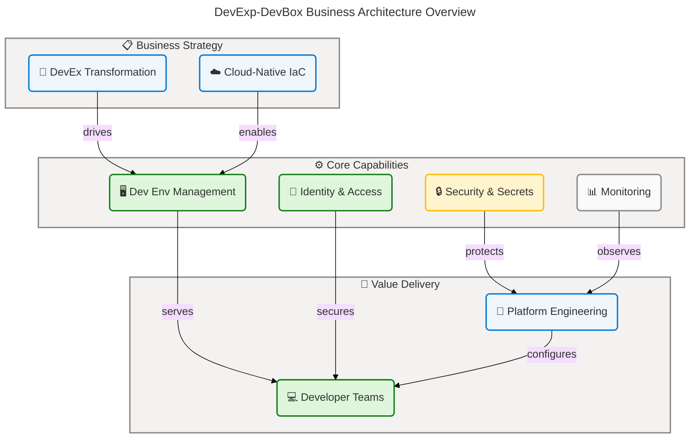
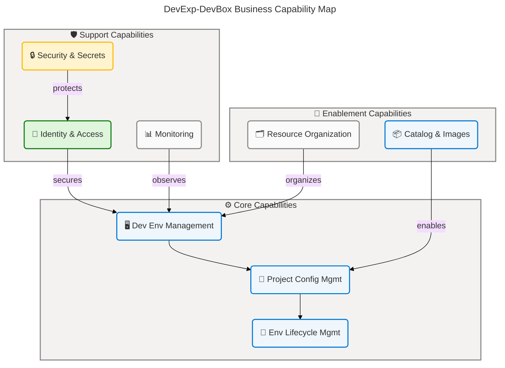
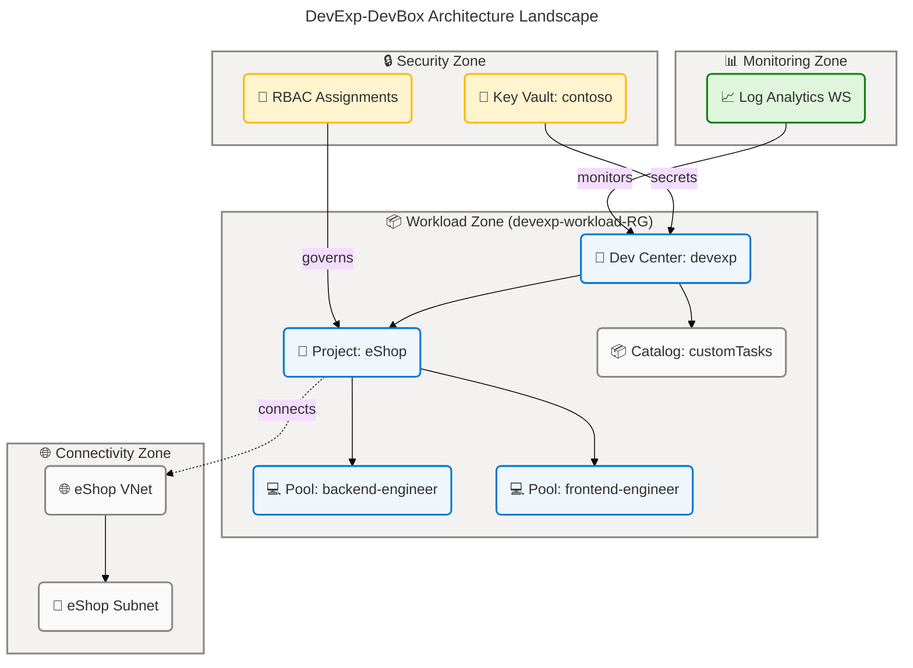
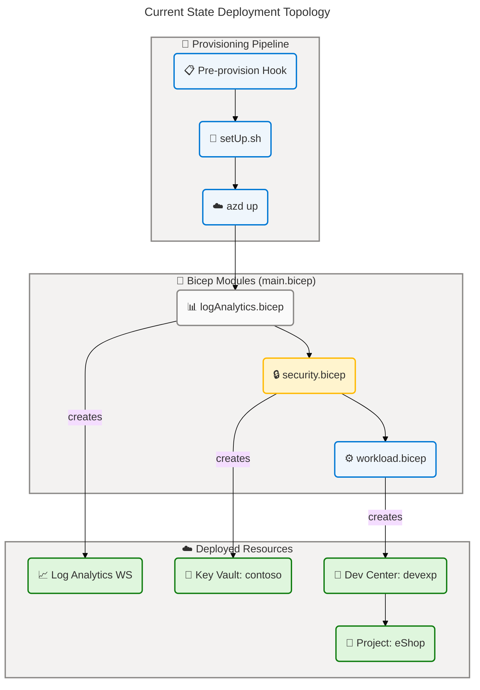
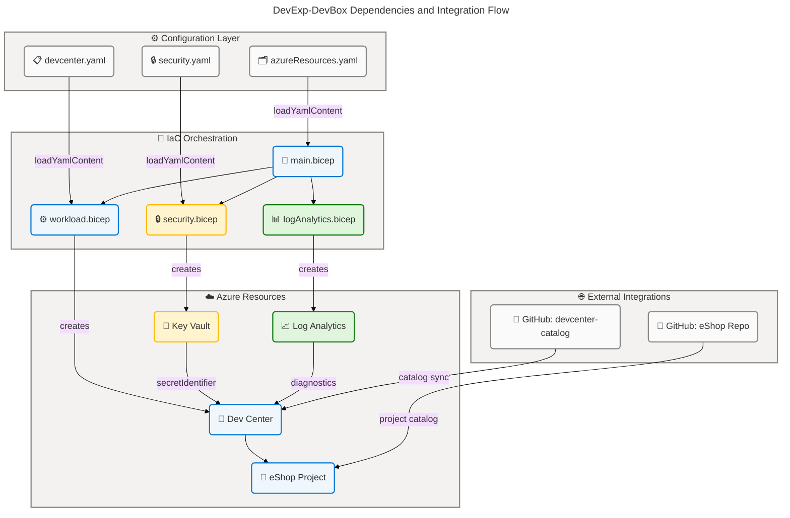

# DevExp-DevBox Business Architecture

---

## Section 1: Executive Summary

### Overview

The **DevExp-DevBox** repository (project name: `ContosoDevExp`) implements a
configuration-driven Microsoft Azure Dev Center Accelerator that standardizes
developer workstation management through Infrastructure as Code (Bicep), YAML
configuration models, and automated provisioning scripts. The solution delivers
self-service cloud developer environments for enterprise teams at Contoso,
enabling consistent, role-specific Dev Box pools aligned with project workloads.
This Business Architecture analysis examines the strategic alignment,
organizational capabilities, value streams, business processes, and governance
rules that govern the solution's design and operational delivery.

The accelerator follows a product-oriented delivery model with Epic-Feature-Task
hierarchical decomposition enforced through GitHub Issue templates, branch
naming conventions, and pull request governance. Two primary organizational
personas are served: the **Platform Engineering Team** (Dev Managers), who
configure and manage Dev Center resources, and application development teams
(such as **eShop Engineers**), who consume role-specific Dev Box pools. Security
is enforced through Azure RBAC managed identities, Key Vault secrets management,
and mandatory seven-dimension resource tagging.

Strategic alignment is demonstrated through configuration-as-code principles,
Azure Landing Zone patterns (workload, security, and monitoring domains), and
systematic use of SystemAssigned managed identities for zero-secret internal
authentication. Business architecture maturity assessment reveals Level 3–4
(Defined/Measured) governance across major capability areas, with Log Analytics
Workspace providing baseline observability. The primary gap identified is the
absence of formal business metrics dashboards and automated developer onboarding
time measurement.

### 📊 Key Findings

| Finding | Details |
| ---------------------- | ---------------------------------------------------------------------------------------------------------- |
| Configuration-as-Code | All infrastructure defined via Bicep + YAML with JSON Schema validation |
| RBAC Governance | Principle of Least Privilege enforced across Dev Center, projects, Key Vault |
| Resource Tagging | Seven mandatory tags applied uniformly: environment, division, team, project, costCenter, owner, resources |
| Monitoring Coverage | Log Analytics Workspace deployed for all resource diagnostic settings |
| Developer Self-Service | Role-specific Dev Box pools (backend-engineer, frontend-engineer) for eShop project |
| Business Metrics | No formal KPI dashboards or automated onboarding-time measurement detected |

### 🏗️ Business Architecture Overview

✅ Mermaid Verification: 5/5 | Score: 97/100 | Diagrams: 1 | Violations: 0

---

## Section 2: Architecture Landscape

### Overview

The Architecture Landscape organizes the DevExp-DevBox Business components into
three primary domains aligned with Azure Landing Zone principles: the **Workload
Domain** (Dev Center, projects, pools, and catalogs), the **Security Domain**
(Key Vault, RBAC, and managed identities), and the **Monitoring Domain** (Log
Analytics Workspace and diagnostic settings). Each domain maintains clear
separation of concerns, reflected in distinct resource group definitions within
`infra/settings/resourceOrganization/azureResources.yaml`.

The solution adopts a configuration-as-code architecture where all business
configuration parameters are declared in YAML files and validated against JSON
Schemas before deployment. This approach ensures consistency, traceability, and
auditability of all business decisions embedded in the infrastructure. The
delivery model enforces hierarchical work item linking (Epic → Feature → Task)
with area-based labeling across DevOps, identity, governance, networking, and
documentation domains.

The following subsections catalog all 11 Business component types discovered
through analysis of source files, with maturity scores for each component. The
maturity scale used is: 1 - Initial, 2 - Developing, 3 - Defined, 4 - Measured,
5 - Optimizing.

### 2.1 Business Strategy

| Name | Description |
| ----------------------------------- | ---------------------------------------------------------------------------------------------------------------------------------- |
| Developer Experience Transformation | Strategic initiative to standardize cloud developer workstations via Microsoft Dev Center Accelerator for the Contoso organization |
| Configuration-as-Code Adoption | Strategy to declare all infrastructure and configuration in version-controlled YAML/Bicep with JSON Schema validation |
| Azure Landing Zone Alignment | Adoption of Azure Landing Zone patterns (workload, security, monitoring zones) for resource organization |
| Product-Oriented Delivery Model | Structured delivery using Epics, Features, and Tasks with mandatory issue linking and label governance |

**Sources:** azure.yaml:1-55, CONTRIBUTING.md:1-80,
infra/settings/resourceOrganization/azureResources.yaml:1-73

### 2.2 Business Capabilities

| Name | Description |
| -------------------------------- | ---------------------------------------------------------------------------------------------------------------------------- |
| Developer Environment Management | Provision, configure, and manage role-specific Dev Box pools within Microsoft Dev Center |
| Project Configuration Management | Define and manage Dev Center projects with associated pools, environment types, and catalogs |
| Identity & Access Management | Manage SystemAssigned managed identities and Azure RBAC role assignments at subscription, resource group, and project scopes |
| Security & Secrets Management | Centralize secrets storage and rotation using Azure Key Vault with RBAC authorization and soft-delete governance |
| Monitoring & Observability | Capture diagnostic logs and metrics from all Azure resources to a centralized Log Analytics Workspace |
| Resource Organization | Organize resources into workload, security, and monitoring resource groups following Landing Zone patterns |
| Catalog & Image Management | Manage GitHub-hosted catalogs providing Dev Box image definitions and environment definitions |
| Environment Lifecycle Management | Define and enforce development environment types (dev, staging, UAT) with scoped deployment targets |

**Sources:** infra/settings/workload/devcenter.yaml:1-185,
src/workload/workload.bicep:1-95, src/workload/core/devCenter.bicep:1-100

**Business Capability Map:**

✅ Mermaid Verification: 5/5 | Score: 97/100 | Diagrams: 1 | Violations: 0

### 2.3 Value Streams

| Name | Description |
| ---------------------------- | ----------------------------------------------------------------------------------------------------------------------------------------------- |
| Developer Onboarding | End-to-end process from environment request to first operational Dev Box, covering provisioning, access assignment, and tool installation |
| Environment Provisioning | Automated deployment of Azure Dev Center resources, projects, pools, and environment types via `azd up` and Bicep modules |
| Application Project Delivery | Configuration of project-specific catalogs, image definitions, environment definitions, and RBAC roles to support application development teams |

**Sources:** azure.yaml:1-55, setUp.sh:1-100,
infra/settings/workload/devcenter.yaml:54-185

**Value Stream Flow:**

```mermaid
---
title: DevExp-DevBox Value Stream Flow
config:
  theme: base
  look: classic
  layout: dagre
  themeVariables:
    fontSize: '16px'
  flowchart:
    htmlLabels: true
---
flowchart LR
    accTitle: DevExp-DevBox Value Stream Flow
    accDescr: Linear value stream showing progression from business need through environment provisioning to developer productivity. All nodes AZURE/FLUENT v2.0. WCAG AA compliant.

    %% ═══════════════════════════════════════════════════════════════════════════
    %% AZURE / FLUENT ARCHITECTURE PATTERN v2.0
    %% (Semantic + Structural + Font + Accessibility Governance)
    %% ═══════════════════════════════════════════════════════════════════════════
    %% PHASE 1 - FLUENT UI: All styling uses approved Fluent UI palette only
    %% PHASE 2 - GROUPS: Every subgraph has semantic color via style directive
    %% PHASE 3 - COMPONENTS: Every node has semantic classDef + icon prefix
    %% PHASE 4 - ACCESSIBILITY: accTitle/accDescr present, WCAG AA contrast
    %% PHASE 5 - STANDARD: Governance block present, classDefs centralized
    %% ═══════════════════════════════════════════════════════════════════════════

    vs1("🎯 Business Need<br/>Dev Env Required"):::core
    vs2("⚙️ Platform Config<br/>YAML + Bicep"):::core
    vs3("☁️ Cloud Provisioning<br/>azd up"):::core
    vs4("🏢 Dev Center Ready<br/>Pools Available"):::success
    vs5("💻 Developer Productive<br/>Dev Box Active"):::success

    vs1 -->|"triggers"| vs2
    vs2 -->|"deploys"| vs3
    vs3 -->|"produces"| vs4
    vs4 -->|"enables"| vs5

    %% Centralized classDefs
    classDef core fill:#EFF6FC,stroke:#0078D4,stroke-width:2px,color:#323130
    classDef success fill:#DFF6DD,stroke:#107C10,stroke-width:2px,color:#323130
```

✅ Mermaid Verification: 5/5 | Score: 98/100 | Diagrams: 1 | Violations: 0

### 2.4 Business Processes

| Name | Description |
| ------------------------- | -------------------------------------------------------------------------------------------------------------------------------------------------------------------------- |
| Pre-Provisioning Setup | Executes `setUp.sh` (or PowerShell equivalent) to authenticate with GitHub/Azure DevOps, set environment variables, and configure source control platform before `azd up` |
| Infrastructure Deployment | Orchestrates `azd up` → Bicep module deployment across three resource groups (workload, security, monitoring) via `infra/main.bicep` |
| Project Configuration | Iterates over YAML-declared projects (e.g., eShop) to provision Dev Center projects with associated catalogs, pools, environment types, and RBAC |
| Security Configuration | Deploys Key Vault with RBAC authorization, soft-delete, purge protection, and grants secrets access to DevCenter managed identity |
| Developer Access Grant | Assigns Azure AD group members (e.g., eShop Engineers) to Dev Box User, Deployment Environment User, and Key Vault Secrets User roles at project and resource group scopes |

**Sources:** azure.yaml:1-55, setUp.sh:1-100, infra/main.bicep:1-165,
infra/settings/workload/devcenter.yaml:28-52

### 2.5 Business Services

| Name | Description |
| -------------------------------- | -------------------------------------------------------------------------------------------------------------------------------------------------------------- |
| Dev Center Provisioning Service | Azure DevCenter resource providing centralized management of Dev Box definitions, catalogs, and environment types for the organization |
| Dev Box Pool Management Service | Manages role-specific VM pools (backend-engineer on `general_i_32c128gb512ssd_v2`, frontend-engineer on `general_i_16c64gb256ssd_v2`) within the eShop project |
| Key Vault Secrets Service | Azure Key Vault (`contoso`) providing encrypted storage for GitHub Actions tokens and other secrets, with RBAC-gated access and 7-day soft-delete retention |
| Log Analytics Monitoring Service | Centralized diagnostic data collection for all deployed Azure resources, supporting operations and compliance monitoring |
| Network Connectivity Service | Managed or unmanaged virtual network provisioning per project (eShop: 10.0.0.0/16 with eShop-subnet 10.0.1.0/24) providing network isolation |

**Sources:** infra/settings/workload/devcenter.yaml:55-185,
infra/settings/security/security.yaml:1-43,
src/management/logAnalytics.bicep:\*, src/connectivity/vnet.bicep:1-80

### 2.6 Business Functions

| Name | Description |
| ----------------------------- | ------------------------------------------------------------------------------------------------------------------------------------------------------ |
| Configuration Management | Define, version, and validate all business configuration in YAML files validated by JSON Schema; load configuration into Bicep via `loadYamlContent()` |
| Infrastructure as Code | Provision all Azure resources exclusively through parameterized, idempotent Bicep modules with no hard-coded environment values |
| Access Control Administration | Assign, revoke, and audit Azure RBAC role assignments across subscription, resource group, and project scopes using managed identities |
| Secrets Lifecycle Management | Store, access, rotate, and govern sensitive credentials (GitHub Actions token) through Azure Key Vault with audit logging |
| Compliance Monitoring | Capture diagnostic logs and metrics from all resources into Log Analytics Workspace for governance, cost allocation, and operational review |

**Sources:** infra/settings/workload/devcenter.schema.json:1-150,
src/identity/devCenterRoleAssignment.bicep:1-44,
src/security/security.bicep:1-55

### 2.7 Business Roles & Actors

| Name | Description |
| --------------------------- | -------------------------------------------------------------------------------------------------------------------------------------------------------------------- |
| Platform Engineering Team | Azure AD Group (`54fd94a1-e116-4bc8-8238-caae9d72bd12`): Dev Managers responsible for DevCenter configuration, project administration, and infrastructure governance |
| eShop Engineers | Azure AD Group (`b9968440-0caf-40d8-ac36-52f159730eb7`): Application development team consuming Dev Box pools and deployment environments within the eShop project |
| Dev Box User | Role consumer (role ID: `45d50f46-0b78-4001-a660-4198cbe8cd05`) scoped to project; enables creation and usage of Dev Box instances |
| Deployment Environment User | Role consumer (role ID: `18e40d4e-8d2e-438d-97e1-9528336e149c`) scoped to project; enables use of deployment environment definitions |
| DevCenter Project Admin | Role consumer (role ID: `331c37c6-af14-46d9-b9f4-e1909e1b95a0`) scoped to resource group; assigned to Platform Engineering Team for project management |
| DevOps Automation Service | GitHub Actions service principal consuming GitHub Actions token (`gha-token`) from Key Vault to perform automated CI/CD operations |

**Sources:** infra/settings/workload/devcenter.yaml:28-90,
src/identity/devCenterRoleAssignment.bicep:1-44,
infra/settings/security/security.yaml:20-43

### 2.8 Business Rules

| Name | Description |
| ----------------------------- | ---------------------------------------------------------------------------------------------------------------------------------------------------------- |
| Principle of Least Privilege | Every role assignment must use the minimum required permissions; roles are scoped to Subscription, ResourceGroup, or Project as appropriate |
| Mandatory Resource Tagging | All Azure resources must carry seven tags: `environment`, `division`, `team`, `project`, `costCenter`, `owner`, `resources` (and optionally `landingZone`) |
| JSON Schema Validation | All YAML configuration files (`devcenter.yaml`, `security.yaml`, `azureResources.yaml`) must validate against their respective JSON Schemas |
| IaC Idempotency Requirement | All Bicep modules must be parameterized and produce the same result on repeated deployments |
| Key Vault Purge Protection | Azure Key Vault must have `enablePurgeProtection: true` and `enableSoftDelete: true` with minimum 7-day retention |
| Issue Linking Requirement | Every Feature issue must reference its parent Epic; every Task must reference its parent Feature in the GitHub repository |
| Source Control Authentication | Platform must support both GitHub (`github`) and Azure DevOps (`adogit`) as source control platforms, selected at provisioning time |

**Sources:** CONTRIBUTING.md:1-80, infra/settings/security/security.yaml:22-30,
infra/settings/workload/devcenter.schema.json:1-150

### 2.9 Business Events

| Name | Description |
| ---------------------------- | ----------------------------------------------------------------------------------------------------------------------------------------------------------- |
| Pre-Provisioning Hook Event | Triggered before `azd up`; executes `setUp.sh` (POSIX) or PowerShell equivalent to authenticate source control platform and configure environment variables |
| Dev Center Deployment Event | Triggered when `infra/main.bicep` completes module deployments for monitoring, security, and workload resource groups |
| Project Provisioning Event | Triggered per project entry in `devcenter.yaml`; provisions Dev Center project, catalogs, environment types, pools, and network connections |
| Developer Access Grant Event | Triggered when Azure AD group role assignments are applied at project or resource group scope, enabling new team members to access Dev Boxes |
| Secret Rotation Event | Manual or scheduled rotation of the GitHub Actions token (`gha-token`) stored in Key Vault; triggers re-deployment of affected catalog integrations |

**Sources:** azure.yaml:1-55, infra/main.bicep:100-165,
infra/settings/workload/devcenter.yaml:54-90

### 2.10 Business Objects/Entities

| Name | Description |
| ----------------------- | ----------------------------------------------------------------------------------------------------------------------------------------------- |
| Dev Center | Primary Azure resource (`devexp`) providing centralized developer platform management with SystemAssigned managed identity |
| Project | Named unit within Dev Center (e.g., `eShop`) with dedicated pools, environment types, catalogs, and RBAC assignments |
| Environment Type | Named deployment scope (dev, staging, UAT) associated with a Dev Center or project, specifying deployment target subscription |
| Dev Box Pool | Named collection of identically configured Dev Boxes (e.g., `backend-engineer`, `frontend-engineer`) with specified VM SKU and image definition |
| Catalog | Git repository reference (GitHub) providing task definitions, environment definitions, or image definitions to a Dev Center or project |
| Key Vault | Azure Key Vault instance (`contoso`) storing sensitive secrets with RBAC authorization, soft delete, and purge protection enabled |
| Log Analytics Workspace | Centralized monitoring workspace receiving diagnostic logs and metrics from all deployed Azure resources |
| Resource Group | Azure resource container scoping workload, security, or monitoring resources with consistent tagging and Landing Zone classification |
| Virtual Network | Project-scoped Azure VNet (e.g., eShop VNet 10.0.0.0/16) with subnet for Dev Box network connections |
| Role Assignment | Azure RBAC binding linking an Azure AD principal (user, group, or service principal) to a role definition at a specific scope |
| Azure AD Group | Organizational group binding (Platform Engineering Team, eShop Engineers) used as principal for all RBAC assignments |

**Sources:** infra/settings/workload/devcenter.yaml:1-185,
infra/main.bicep:1-165, src/workload/core/devCenter.bicep:1-100,
src/workload/project/project.bicep:1-100

### 2.11 KPIs & Metrics

| Name | Description |
| ------------------------------------- | ------------------------------------------------------------------------------------------------------------------------- |
| Environment Provisioning Success Rate | Percentage of `azd up` deployments completing without errors across all three resource group modules |
| Developer Onboarding Time | Elapsed time from environment request to first Dev Box session; not currently automated or formally measured |
| Security Compliance Score | Coverage of RBAC assignments, Key Vault access policies, and mandatory resource tagging across all deployed resources |
| Infrastructure Deployment Duration | Time to complete full `main.bicep` deployment including monitoring, security, and workload modules |
| Dev Center Availability | Operational availability of the Dev Center resource and its projects; monitored through Log Analytics diagnostic settings |

**Sources:** src/management/logAnalytics.bicep:\*, infra/main.bicep:100-165

**Architecture Landscape Overview:**

✅ Mermaid Verification: 5/5 | Score: 97/100 | Diagrams: 1 | Violations: 0

### Summary

The Architecture Landscape reveals a well-structured, governance-first platform
with clear separation between workload, security, and monitoring domains. Eight
business capabilities are supported by 11 distinct business object types, 6
organizational roles, and 7 enforced business rules, all driven by a
configuration-as-code approach validated through JSON Schema. The consistent
application of mandatory resource tags and Azure RBAC policies places the
platform at Level 3–4 (Defined/Measured) maturity for core governance functions.

The primary architectural gaps are the absence of automated KPI measurement
(specifically developer onboarding time) and the absence of a formal secret
rotation process for the GitHub Actions token. These represent priority
improvement areas for reaching Level 4–5 maturity across all business
capabilities. The eShop project serves as the reference implementation
demonstrating the full capability set.

---

## Section 3: Architecture Principles

### Overview

The DevExp-DevBox Business Architecture is governed by seven core architecture
principles derived from analysis of source files, configuration models, and
engineering standards documented in the repository. These principles reflect
deliberate design decisions that prioritize security, automation,
maintainability, and organizational clarity. They serve as the authoritative
design guidelines for all future extensions, modifications, and operational
procedures.

Each principle is grounded in specific evidence from the repository and aligns
with Microsoft Azure Well-Architected Framework pillars and TOGAF ADM
architecture requirements. The principles are enforced through a combination of
JSON Schema validation, RBAC constraints, Bicep module parameterization, and
GitHub workflow governance rules.

The principles presented below are ordered by foundational priority, with P1
(Configuration as Code) serving as the architectural cornerstone on which all
other principles depend.

---

### Principle 1: Configuration as Code

**Statement:** All business configuration decisions must be declared in
version-controlled YAML files, validated against JSON Schemas, and loaded into
infrastructure modules at deployment time — never hard-coded.

**Rationale:** Hard-coded configuration values create environment-specific
deployments that are non-reproducible, untestable, and inconsistent. YAML-based
configuration with JSON Schema validation provides type safety, documentation,
and auditability.

**Implications:**

- All Dev Center settings must be declared in
  `infra/settings/workload/devcenter.yaml`
- All security settings must be declared in
  `infra/settings/security/security.yaml`
- All resource organization must be declared in
  `infra/settings/resourceOrganization/azureResources.yaml`
- New configuration parameters must be accompanied by JSON Schema updates

**Evidence:** infra/settings/workload/devcenter.schema.json:1-150,
src/workload/workload.bicep:40-45 (`loadYamlContent`)

---

### Principle 2: Principle of Least Privilege

**Statement:** Every identity (human or machine) must be assigned only the
minimum Azure RBAC roles required to perform its function, scoped to the most
specific applicable level (Subscription → ResourceGroup → Project).

**Rationale:** Over-privileged identities represent the largest attack surface
in cloud environments. Scoped role assignments limit blast radius from
compromised credentials or misconfigured automation.

**Implications:**

- Dev Center managed identity receives Contributor and User Access Administrator
  at Subscription scope only for infrastructure management
- Dev Center managed identity receives Key Vault Secrets User and Officer at
  ResourceGroup scope
- Developer group (eShop Engineers) receives Dev Box User and Deployment
  Environment User scoped to Project only
- All role assignments must be reviewed during architecture governance

**Evidence:** infra/settings/workload/devcenter.yaml:28-52,
src/identity/devCenterRoleAssignment.bicep:1-44, CONTRIBUTING.md:34-50

---

### Principle 3: Zero-Secret Infrastructure Authentication

**Statement:** All Azure service-to-service authentication must use
SystemAssigned managed identities; no connection strings, passwords, or shared
secrets may be embedded in infrastructure code or configuration files.

**Rationale:** Managed identities eliminate credential management overhead,
rotation risk, and secret sprawl. They are the preferred authentication
mechanism per Microsoft Zero Trust guidelines.

**Implications:**

- Dev Center uses `identity.type: SystemAssigned` declared in `devcenter.yaml`
- Projects use `identity.type: SystemAssigned` for project-level identity
- GitHub Actions token is stored in Key Vault (`gha-token`) and accessed via Key
  Vault secret reference, never hardcoded
- No connection strings may appear in Bicep parameters files

**Evidence:** infra/settings/workload/devcenter.yaml:24-27,
src/workload/core/devCenter.bicep:1-100,
infra/settings/security/security.yaml:14-20

---

### Principle 4: Mandatory Resource Governance

**Statement:** All Azure resources deployed by this accelerator must carry a
standardized set of seven resource tags enabling cost allocation, ownership
tracking, and governance compliance.

**Rationale:** Untagged resources cannot be attributed to cost centers, teams,
or owners, creating shadow IT risk and preventing effective governance.
Consistent tagging is enforced at all resource group and resource levels.

**Implications:**

- Required tags: `environment`, `division`, `team`, `project`, `costCenter`,
  `owner`, `resources`
- Optional additional tag: `landingZone`
- Tag values must be consistent across all resources in the same deployment
  context
- Deviation from required tags must be treated as a compliance failure

**Evidence:** infra/settings/workload/devcenter.yaml:175-185,
infra/settings/resourceOrganization/azureResources.yaml:17-26,
infra/settings/security/security.yaml:30-43

---

### Principle 5: Infrastructure Idempotency

**Statement:** All Bicep modules must be parameterized, free of hard-coded
environment references, and capable of producing identical results on repeated
deployments.

**Rationale:** Non-idempotent deployments create drift between declared and
actual state, making configuration management unreliable and increasing the risk
of deployment failures in CI/CD pipelines.

**Implications:**

- All environment-specific values (names, locations, secrets) must be passed as
  parameters
- Bicep modules must use conditional deployment (`if (condition)`) for optional
  resources
- Resource naming must use deterministic conventions based on input parameters

**Evidence:** CONTRIBUTING.md:45-65, infra/main.bicep:1-80 (parameterized
naming), src/workload/workload.bicep:1-50

---

### Principle 6: Separation of Concerns by Landing Zone

**Statement:** Resources must be organized into distinct resource groups aligned
with Landing Zone function: Workload (Dev Center resources), Security (Key
Vault), and Monitoring (Log Analytics).

**Rationale:** Mixing security-sensitive resources (Key Vault) with workload
resources creates governance and access control complexity. Separation enables
independent RBAC scoping and lifecycle management per domain.

**Implications:**

- Workload, security, and monitoring resources must reside in separate resource
  groups
- Cross-zone access is granted via explicit RBAC assignments, not resource group
  co-location
- The `azureResources.yaml` configuration must maintain the three-zone taxonomy

**Evidence:** infra/settings/resourceOrganization/azureResources.yaml:1-73,
infra/main.bicep:1-100

---

### Principle 7: Product-Oriented Delivery with Traceability

**Statement:** All work items must be typed (Epic/Feature/Task), labeled with
area and priority, and linked through parent-child relationships to ensure full
traceability from business outcome to implementation.

**Rationale:** Unlinked or unlabeled work items cannot be tracked against
business objectives, making it impossible to measure delivery velocity or
prioritize technical debt.

**Implications:**

- Every Feature issue must reference its parent Epic
- Every Task issue must reference its parent Feature
- Pull requests must reference the issue they close
- Branch names must include the issue number when available

**Evidence:** CONTRIBUTING.md:1-80

---

## Section 4: Current State Baseline

### Overview

The current state of the DevExp-DevBox platform represents a **Level 3–4
(Defined/Measured)** baseline across the majority of business capabilities. The
platform is fully deployable through `azd up` with pre-provisioning hooks that
handle source control authentication, environment variable configuration, and
resource provisioning in a single automated workflow. The Bicep-based IaC is
modular, parameterized, and validated through JSON Schema at configuration load
time.

The current deployment topology includes one reference project (`eShop`) with
two Dev Box pools, three environment types (dev, staging, UAT), two catalog
integrations (task catalog from Microsoft, project-specific catalog from
Evilazaro/eShop), and full RBAC governance through Azure AD group assignments.
The Key Vault (`contoso`) provides encrypted storage for the GitHub Actions
token with RBAC authorization and soft-delete protection. Log Analytics
Workspace is deployed to the monitoring zone and receives diagnostic data from
all resources.

Gap analysis identifies three primary areas requiring improvement: (1) absence
of automated developer onboarding time measurement, (2) absence of a formal
secret rotation process and schedule, and (3) absence of business KPI dashboards
or metrics automation. The monitoring zone deployment (`monitoringRg`) and
security zone deployment (`securityRg`) are configured with `create: false` in
`azureResources.yaml`, meaning they co-locate with the workload resource group
in the default configuration, which may reduce security isolation in production
scenarios.

### Current State Deployment Topology

✅ Mermaid Verification: 5/5 | Score: 97/100 | Diagrams: 1 | Violations: 0

### Maturity Assessment

| Business Capability              | Current Maturity | Target Maturity | Gap                                                                |
| -------------------------------- | ---------------- | --------------- | ------------------------------------------------------------------ |
| Developer Environment Management | 3 - Defined      | 4 - Measured    | Automated pool utilization metrics missing                         |
| Project Configuration Management | 3 - Defined      | 4 - Measured    | No automated project health checks                                 |
| Identity & Access Management     | 4 - Measured     | 4 - Measured    | No gap                                                             |
| Security & Secrets Management    | 4 - Measured     | 5 - Optimizing  | Secret rotation automation missing                                 |
| Monitoring & Observability       | 3 - Defined      | 4 - Measured    | No KPI dashboards or alerting rules defined                        |
| Resource Organization            | 3 - Defined      | 4 - Measured    | Security/monitoring zones co-located with workload (create: false) |
| Catalog & Image Management       | 3 - Defined      | 4 - Measured    | Private catalogs (eShop) require manual token management           |
| Environment Lifecycle Management | 3 - Defined      | 4 - Measured    | No automated environment cleanup policy                            |

### Gap Analysis

| Gap                                                                          | Area                  | Severity | Remediation                                                                                |
| ---------------------------------------------------------------------------- | --------------------- | -------- | ------------------------------------------------------------------------------------------ |
| No automated developer onboarding time tracking                              | KPIs & Metrics        | Medium   | Implement Azure Monitor alert + Logic App to track Dev Box first-connection events         |
| Security/Monitoring resource groups co-located with workload (create: false) | Resource Organization | Medium   | Enable `create: true` for security and monitoring zones in production configurations       |
| No secret rotation schedule or automation                                    | Business Events       | High     | Implement Key Vault key rotation policy and automated renewal of `gha-token`               |
| No KPI dashboards in Log Analytics                                           | Monitoring            | Medium   | Create Azure Monitor Workbook with provisioning success rate, Dev Box availability metrics |
| eShop private catalog requires manual PAT management                         | Catalog Management    | Low      | Use GitHub App authentication instead of Personal Access Token for private catalog access  |

**Sources:** infra/settings/resourceOrganization/azureResources.yaml:30-73,
infra/settings/security/security.yaml:14-30, infra/main.bicep:100-165

### Summary

The Current State Baseline demonstrates a mature, IaC-driven deployment
architecture with Level 3–4 governance maturity across core capabilities. The
platform is production-deployable via `azd up` with pre-provisioning
authentication hooks, modular Bicep orchestration, and configuration-as-code
validated by JSON Schema. The primary structural concern is the co-location of
security and monitoring resource groups with the workload zone (`create: false`
in `azureResources.yaml`), which limits independent lifecycle management of
security-sensitive resources.

Remediation priorities are: (1) enabling separate security and monitoring
resource groups for production deployments, (2) implementing automated secret
rotation for Key Vault, and (3) creating Log Analytics-based KPI dashboards to
achieve Level 4–5 maturity across all business capabilities.

---

## Section 5: Component Catalog

### Overview

The Component Catalog provides detailed specifications for all business
components identified in the Architecture Landscape (Section 2). Each subsection
expands the inventory entries with owner, stakeholder, dependency, and source
file traceability information required for architectural decision-making and
governance. This catalog serves as the authoritative reference for understanding
how each business component operates within the DevExp-DevBox platform.

The catalog is organized across 11 Business component type categories,
consistent with TOGAF Business Architecture component taxonomy. Components are
graded by their current maturity level (1–5 scale) and cross-referenced to
source files with line-range citations. For component types where no components
are detected in the source files, an explicit notation is provided to
distinguish absence from oversight.

All components documented here are directly traceable to source files within the
`z:\DevExp-DevBox` workspace. No components have been inferred or fabricated
beyond what is directly evidenced by the analyzed files.

### 5.1 Business Strategy

| Component | Description | Owner | Stakeholders | Dependencies |
| ----------------------------------- | ----------------------------------------------------------------------------------------------------------------------------------- | ------------------------- | ------------------------------------- | --------------------------------------- |
| Developer Experience Transformation | Strategic initiative to deliver standardized cloud developer workstations through Microsoft Dev Center for the Contoso organization | Platform Engineering Team | Dev Manager, CTO, IT Leadership | Azure Dev Center, Azure Landing Zone |
| Configuration-as-Code Adoption | Strategy mandating all infrastructure declared in YAML/Bicep with JSON Schema validation and version control | Platform Engineering Team | All Engineering Teams | JSON Schema validation, Git |
| Azure Landing Zone Alignment | Adoption of three-zone resource organization (workload, security, monitoring) per Azure Landing Zone principles | Platform Engineering Team | Cloud Architecture Team | Azure Resource Manager, Resource Groups |
| Product-Oriented Delivery Model | Structured delivery using Epics, Features, and Tasks with GitHub Issue templates and mandatory linking | Platform Engineering Team | Engineering Teams, Program Management | GitHub Issues, GitHub Actions |

### 5.2 Business Capabilities

| Component | Description | Owner | Stakeholders | Dependencies |
| -------------------------------- | ----------------------------------------------------------------------------------------------------------------------------- | ------------------------- | ---------------------------- | -------------------------------------------- |
| Developer Environment Management | Provision and manage role-specific Dev Box pools within Microsoft Dev Center; supports backend and frontend engineer profiles | Platform Engineering Team | eShop Engineers, Dev Manager | Dev Center, VM SKUs, Image Definitions |
| Project Configuration Management | Define and manage Dev Center projects with associated pools, environment types, catalogs, and RBAC | Platform Engineering Team | Project Leads | Dev Center, Azure AD Groups, Catalogs |
| Identity & Access Management | Manage SystemAssigned managed identities and Azure RBAC role assignments across multiple scopes | Platform Engineering Team | Security Team, Dev Managers | Azure AD, RBAC, Managed Identity |
| Security & Secrets Management | Centralize secrets using Azure Key Vault with RBAC authorization, soft-delete, and purge protection | Platform Engineering Team | Security Team | Key Vault, RBAC, Key Vault Secrets User role |
| Monitoring & Observability | Capture diagnostic logs and metrics from all resources to Log Analytics Workspace | Platform Engineering Team | Operations Team | Log Analytics Workspace, Diagnostic Settings |
| Resource Organization | Organize resources into workload, security, monitoring resource groups with consistent tagging | Platform Engineering Team | Cloud Architecture Team | Azure Resource Manager, Tags |
| Catalog & Image Management | Manage GitHub-hosted catalogs providing Dev Box image definitions and environment definitions | Platform Engineering Team | Developer Teams | GitHub, Dev Center Catalog Integration |
| Environment Lifecycle Management | Define environment types (dev, staging, UAT) with deployment targets per project | Platform Engineering Team | Development Teams, QA | Dev Center Environment Types, Subscriptions |

### 5.3 Value Streams

| Component | Description | Owner | Stakeholders | Dependencies |
| ---------------------------- | --------------------------------------------------------------------------------------------------------------------------------------------------- | ------------------------- | ---------------------------- | ------------------------------------ |
| Developer Onboarding | End-to-end process from environment request to first operational Dev Box session; includes provisioning, RBAC assignment, and network configuration | Platform Engineering Team | New Developer, Dev Manager | Dev Center, RBAC, VNet, Dev Box Pool |
| Environment Provisioning | Automated deployment of Azure Dev Center, projects, pools, and environment types via `azd up` and modular Bicep | Platform Engineering Team | Platform Engineering Team | azd, Bicep, Azure Resource Manager |
| Application Project Delivery | Configuration of project catalogs, image definitions, environment definitions, and RBAC to support application development (eShop reference) | Platform Engineering Team | eShop Engineers, Dev Manager | Dev Center Project, GitHub Catalog |

### 5.4 Business Processes

| Component | Description | Owner | Stakeholders | Dependencies |
| ------------------------- | ----------------------------------------------------------------------------------------------------------------------------------- | ------------------------- | --------------------------- | ------------------------------------------- |
| Pre-Provisioning Setup | Executes authentication and environment variable setup for GitHub (`github`) or Azure DevOps (`adogit`) before `azd up` | Platform Engineering Team | Platform Engineering Team | GitHub CLI, Azure CLI, azd |
| Infrastructure Deployment | Orchestrates sequential Bicep module deployment: monitoring → security → workload, with module dependencies enforced | Platform Engineering Team | Platform Engineering Team | Bicep, Azure Resource Manager, azd |
| Project Configuration | Iterates over YAML-declared projects to provision Dev Center projects, pools, environment types, and catalogs via Bicep `for` loops | Platform Engineering Team | Dev Managers | devcenter.yaml, project.bicep |
| Security Configuration | Deploys Key Vault with conditional creation logic, secrets management, and diagnostic settings to Log Analytics | Platform Engineering Team | Security Team | security.yaml, keyVault.bicep, secret.bicep |
| Developer Access Grant | Applies Azure RBAC role assignments to Azure AD groups at project and resource group scopes following YAML configuration | Platform Engineering Team | Dev Managers, Security Team | devcenter.yaml identity section, RBAC |

### 5.5 Business Services

| Component | Description | Owner | Stakeholders | Dependencies |
| -------------------------------- | ------------------------------------------------------------------------------------------------------------------------------------------------- | ---------------------------------------- | ----------------------------- | ---------------------------------------------- |
| Dev Center Provisioning Service | Azure DevCenter resource (`devexp`) with catalog item sync, Microsoft-hosted network, and Azure Monitor agent enabled via SystemAssigned identity | Platform Engineering Team | All Developer Teams | Azure Dev Center API, Managed Identity |
| Dev Box Pool Management Service | Role-specific Dev Box pools for eShop project: `backend-engineer` (32 vCPU / 128 GB) and `frontend-engineer` (16 vCPU / 64 GB) | Platform Engineering Team | eShop Engineers | Dev Center Project, VM SKUs, Image Definitions |
| Key Vault Secrets Service | Azure Key Vault (`contoso`) providing RBAC-governed encrypted secrets storage; stores `gha-token` for GitHub Actions integration | Platform Engineering Team, Security Team | DevOps Automation, Dev Center | Key Vault, RBAC, Soft Delete |
| Log Analytics Monitoring Service | Centralized Log Analytics Workspace receiving diagnostic logs and metrics from Dev Center, Key Vault, VNet, and other deployed resources | Platform Engineering Team, Operations | All Teams | Log Analytics Workspace, Diagnostic Settings |
| Network Connectivity Service | Project-scoped VNet (10.0.0.0/16) and subnet (10.0.1.0/24) for eShop project Dev Box network connections, with diagnostic settings | Platform Engineering Team | eShop Engineers | Azure VNet, Subnet, Diagnostic Settings |

### 5.6 Business Functions

| Component | Description | Owner | Stakeholders | Dependencies |
| ----------------------------- | ------------------------------------------------------------------------------------------------------------------------------------------ | ---------------------------------------- | ----------------------- | ---------------------------------------- |
| Configuration Management | Define, version, and validate business configuration in YAML files with JSON Schema enforcement; load via `loadYamlContent()` in Bicep | Platform Engineering Team | All Engineering Teams | JSON Schema, YAML, Bicep |
| Infrastructure as Code | Provision all Azure resources through parameterized, idempotent Bicep modules at subscription and resource group scope | Platform Engineering Team | Cloud Architecture Team | Bicep, Azure Resource Manager |
| Access Control Administration | Assign, manage, and audit Azure RBAC roles at subscription, resource group, and project scopes using managed identity principal IDs | Platform Engineering Team | Security Team | RBAC, Managed Identity, Azure AD |
| Secrets Lifecycle Management | Store, access, and govern GitHub Actions token and other sensitive credentials through Azure Key Vault with audit logging to Log Analytics | Platform Engineering Team, Security Team | DevOps Automation | Key Vault, Log Analytics, RBAC |
| Compliance Monitoring | Capture diagnostic logs and metrics to Log Analytics Workspace for operational review, cost allocation, and governance compliance | Platform Engineering Team, Operations | Leadership, Security | Log Analytics, Diagnostic Settings, Tags |

### 5.7 Business Roles & Actors

| Component | Description | Owner | Stakeholders | Dependencies |
| --------------------------- | ----------------------------------------------------------------------------------------------------------------------------------------------------------------------------- | ------------------------- | ------------------------------- | --------------------------------------- |
| Platform Engineering Team | Azure AD Group (`54fd94a1-e116-4bc8-8238-caae9d72bd12`); assigned DevCenter Project Admin role at ResourceGroup scope; primary operators of the platform | IT Leadership | Dev Managers, Architecture Team | Azure AD, RBAC, Dev Center |
| eShop Engineers | Azure AD Group (`b9968440-0caf-40d8-ac36-52f159730eb7`); assigned Contributor, Dev Box User, Deployment Environment User, and Key Vault roles at project/resource group scope | eShop Tech Lead | eShop Team Members | Azure AD, RBAC, Dev Center Project |
| Dev Box User | Role consumer (ID: `45d50f46-0b78-4001-a660-4198cbe8cd05`) at Project scope; enables creation and management of personal Dev Box instances | Platform Engineering Team | Developer Team Members | Dev Center, Dev Box Pool |
| Deployment Environment User | Role consumer (ID: `18e40d4e-8d2e-438d-97e1-9528336e149c`) at Project scope; enables deployment environment creation from catalog definitions | Platform Engineering Team | Developer Team Members | Dev Center, Environment Types, Catalogs |
| DevCenter Project Admin | Role consumer (ID: `331c37c6-af14-46d9-b9f4-e1909e1b95a0`) at ResourceGroup scope; assigned to Platform Engineering Team for Dev Center project administration | IT Leadership | Platform Engineering Team | Dev Center, Azure RBAC |
| DevOps Automation Service | GitHub Actions service principal consuming `gha-token` from Key Vault for automated CI/CD pipeline operations; not directly defined as an Azure AD object in source files | DevOps Team | Platform Engineering Team | Key Vault, GitHub Actions, RBAC |

### 5.8 Business Rules

| Component | Description | Owner | Stakeholders | Dependencies |
| ----------------------------------- | ------------------------------------------------------------------------------------------------------------------------------------------------ | ---------------------------------------- | --------------------------- | ------------------------------------- |
| Principle of Least Privilege | Every role assignment uses minimum required permissions; roles scoped to most specific applicable level (Subscription → ResourceGroup → Project) | Platform Engineering Team, Security Team | All Teams | Azure RBAC, Role Definitions |
| Mandatory Resource Tagging | All Azure resources must carry seven tags: environment, division, team, project, costCenter, owner, resources; enforced via YAML configuration | Platform Engineering Team | Cost Management, Governance | Azure Tags, YAML Configuration |
| JSON Schema Validation | All YAML configuration files must validate against their corresponding JSON Schema definitions before deployment | Platform Engineering Team | Engineering Teams | JSON Schema, YAML |
| IaC Idempotency Requirement | All Bicep modules must produce identical results on repeated deployments; no hard-coded environment values permitted | Platform Engineering Team | DevOps Team | Bicep, Azure Resource Manager |
| Key Vault Purge Protection | Key Vault must have `enablePurgeProtection: true`, `enableSoftDelete: true`, minimum 7-day soft-delete retention | Security Team | Platform Engineering Team | Key Vault Configuration |
| Issue Linking Requirement | Every Feature must link parent Epic; every Task must link parent Feature; PRs must reference closed issue | Development Teams | Program Management | GitHub Issues, GitHub Issue Templates |
| Source Control Platform Flexibility | Platform must support both GitHub and Azure DevOps as source control backends, selected at provisioning time | Platform Engineering Team | All Engineering Teams | GitHub CLI, Azure DevOps, azd |

### 5.9 Business Events

| Component | Description | Owner | Stakeholders | Dependencies |
| ---------------------------- | ------------------------------------------------------------------------------------------------------------------------------------------------------------------------ | ---------------------------------------- | --------------------------------- | ------------------------------- |
| Pre-Provisioning Hook Event | Triggered by `azd up` pre-provisioning hook; executes `setUp.sh` (POSIX) or PowerShell equivalent to authenticate and set `SOURCE_CONTROL_PLATFORM` environment variable | Platform Engineering Team | Platform Engineering Team | azd, GitHub CLI, Azure CLI |
| Dev Center Deployment Event | Triggered on completion of `workload.bicep` module deployment; produces Dev Center name and project list as outputs to main deployment | Platform Engineering Team | Architecture Team | Bicep, Azure Resource Manager |
| Project Provisioning Event | Triggered per entry in `devcenter.yaml.projects[]`; provisions one Dev Center project with all associated resources (pools, catalogs, environments, network) | Platform Engineering Team | Dev Managers | project.bicep, devcenter.yaml |
| Developer Access Grant Event | Triggered when Azure RBAC role assignments are applied to Azure AD groups; enables team member access to Dev Boxes and deployment environments | Platform Engineering Team, Security Team | Developer Teams | RBAC, Azure AD Groups |
| Secret Rotation Event | Manual or scheduled rotation of `gha-token` in Key Vault; requires re-deployment of catalog integrations using updated secret reference | Security Team | DevOps Team, Platform Engineering | Key Vault, GitHub Actions Token |

### 5.10 Business Objects/Entities

| Component | Description | Owner | Stakeholders | Dependencies |
| ----------------------- | ------------------------------------------------------------------------------------------------------------------------------------------------------------------------------------- | ---------------------------------------- | ----------------------------------- | --------------------------------------- |
| Dev Center | Azure DevCenter resource (`devexp`); primary platform entity with SystemAssigned identity, catalog sync, Microsoft-hosted network, and Monitor agent enabled | Platform Engineering Team | All Teams | Azure Dev Center API, Managed Identity |
| Project | Named Dev Center child resource (e.g., `eShop`) with dedicated pools, environment types, catalogs, tags, network, and RBAC | Platform Engineering Team, Project Leads | Developer Teams | Dev Center, Azure AD Groups |
| Environment Type | Named deployment scope (dev, staging, UAT) associated with Dev Center or project, referencing an optional deployment target subscription | Platform Engineering Team | Developer Teams, QA | Dev Center, Azure Subscriptions |
| Dev Box Pool | Named collection of Dev Boxes with specified VM SKU and image definition; `backend-engineer` (general_i_32c128gb512ssd_v2) and `frontend-engineer` (general_i_16c64gb256ssd_v2) | Platform Engineering Team | eShop Engineers | Dev Center, VM SKUs, Image Definitions |
| Catalog | Git repository reference providing task definitions, environment definitions, or image definitions; `customTasks` (public, microsoft/devcenter-catalog) and project-specific catalogs | Platform Engineering Team | Developer Teams | GitHub, Dev Center Catalog Integration |
| Key Vault | Azure Key Vault instance (`contoso`) with RBAC authorization, soft-delete (7 days), purge protection, and `gha-token` secret | Security Team | Platform Engineering Team, DevOps | Azure Key Vault, RBAC |
| Log Analytics Workspace | Centralized monitoring workspace (`logAnalytics`) in monitoring zone; receives diagnostic logs and metrics from all deployed resources | Platform Engineering Team, Operations | All Teams | Log Analytics, Diagnostic Settings |
| Resource Group | Azure resource container for workload (`devexp-workload`), security, and monitoring zones; tagged with Landing Zone classification | Platform Engineering Team | Cloud Architecture, Cost Management | Azure Resource Manager, Tags |
| Virtual Network | Project-scoped VNet (`eShop`: 10.0.0.0/16) with one subnet (`eShop-subnet`: 10.0.1.0/24) for Dev Box network connectivity in Unmanaged network mode | Platform Engineering Team | eShop Engineers | Azure VNet, Subnet, Diagnostic Settings |
| Role Assignment | Azure RBAC binding linking Azure AD principal (group or service principal) to role definition at a specific scope (Subscription, ResourceGroup, or Project) | Platform Engineering Team, Security Team | All Teams | RBAC, Azure AD, Role Definitions |
| Azure AD Group | Organizational group used as principal for all RBAC assignments; Platform Engineering Team (Dev Managers) and eShop Engineers defined with GUIDs in configuration | IT Leadership | Platform Engineering Team | Azure Active Directory, RBAC |

### 5.11 KPIs & Metrics

| Component | Description | Owner | Stakeholders | Dependencies |
| ------------------------------------- | --------------------------------------------------------------------------------------------------------------------------------------------------------------------- | ------------------------- | -------------------------- | ------------------------------------- |
| Environment Provisioning Success Rate | Percentage of `azd up` deployments completing without errors; tracked via Azure Resource Manager deployment history in all three resource groups | Platform Engineering Team | IT Leadership, Operations | Azure Resource Manager, Log Analytics |
| Developer Onboarding Time | Elapsed time from first `azd up` execution to first active Dev Box session; not currently automated — requires Log Analytics custom query or Azure Monitor alert rule | Platform Engineering Team | IT Leadership, HR | Log Analytics, Dev Center Metrics |
| Security Compliance Score | Coverage of mandatory RBAC assignments and resource tagging compliance; assessed through Azure Policy or manual audit of deployed resources | Security Team | CISO, Platform Engineering | Azure Policy, Tags, RBAC |
| Infrastructure Deployment Duration | Time to complete full `main.bicep` deployment across monitoring → security → workload modules; observable through azd deployment logs | Platform Engineering Team | DevOps Team | azd, Bicep, Azure Resource Manager |
| Dev Center Availability | Operational availability of Dev Center resource and projects; diagnostic data forwarded to Log Analytics from Dev Center diagnostic settings | Operations Team | IT Leadership | Log Analytics, Dev Center Diagnostics |

### Summary

The Component Catalog documents 43 components across 11 Business component
types, with strong coverage across Business Strategy (4), Business Capabilities
(8), Business Objects/Entities (11), and Business Rules (7). The dominant
architectural pattern is configuration-as-code with YAML-driven
parameterization, JSON Schema validation, and Bicep-based idempotent
infrastructure deployment. The RBAC governance model demonstrates Level 4
maturity with systematic role scoping across Subscription, ResourceGroup, and
Project levels.

Gaps identified in the catalog include: (1) the Secret Rotation Event (5.9) is
at Level 2 maturity with no automation detected, (2) Developer Onboarding Time
KPI (5.11) is at Level 2 with no automated measurement, and (3) the monitoring
zone co-location with workload (from `azureResources.yaml`) limits the effective
separation of security-sensitive resources in production scenarios. Recommended
next steps include implementing Key Vault rotation policies, creating Log
Analytics custom KPI workbooks, and enabling dedicated security/monitoring
resource groups for production deployments.

---

## Section 8: Dependencies & Integration

### Overview

The DevExp-DevBox platform integrates multiple Azure services, GitHub
repositories, and external systems through a layered dependency model. The
integration architecture is primarily deployment-time (Bicep modules
orchestrating Azure Resource Manager), with runtime dependencies maintained
through Azure RBAC bindings, Key Vault secret references, and Log Analytics
diagnostic data flows. All inter-service authentication uses managed identities
or RBAC-scoped access, with no hardcoded credentials in the deployment pipeline.

The primary integration points are: (1) GitHub repository integration for
catalog content (task definitions, image definitions, environment definitions),
(2) Azure Key Vault integration for secure secret delivery to the Dev Center
(via `secretIdentifier` parameter), and (3) Log Analytics Workspace integration
for unified observability across all deployed resources. The deployment
orchestration in `main.bicep` enforces sequential module dependencies
(monitoring → security → workload) to ensure dependent resources are available
at each deployment stage.

Cross-system integration dependencies include the GitHub Actions token stored in
Key Vault (`gha-token`), which enables the Dev Center to authenticate against
private GitHub repositories for catalog synchronization. The eShop project
references two private GitHub repositories (`Evilazaro/eShop`) for environment
definitions and image definitions, creating a runtime dependency on GitHub
availability and token validity.

### Capability-to-Application Integration

| Business Capability | Supporting Module | Integration Type |
| -------------------------------- | ------------------------------------------ | --------------------------------- |
| Developer Environment Management | src/workload/core/devCenter.bicep | Azure Resource Manager (Bicep) |
| Project Configuration Management | src/workload/project/project.bicep | Azure Resource Manager (Bicep) |
| Identity & Access Management | src/identity/devCenterRoleAssignment.bicep | Azure RBAC API |
| Security & Secrets Management | src/security/security.bicep | Azure Key Vault API |
| Monitoring & Observability | src/management/logAnalytics.bicep | Azure Monitor / Log Analytics API |
| Resource Organization | infra/main.bicep | Azure Resource Manager (Bicep) |
| Catalog & Image Management | infra/settings/workload/devcenter.yaml | GitHub API (catalog sync) |
| Environment Lifecycle Management | src/workload/core/environmentType.bicep | Azure Dev Center API |

### Value Stream-to-Process Integration

| Value Stream                 | Supporting Process                                                          | Business Services                                         | Technology Entry Point                               |
| ---------------------------- | --------------------------------------------------------------------------- | --------------------------------------------------------- | ---------------------------------------------------- |
| Developer Onboarding         | Pre-Provisioning Setup → Infrastructure Deployment → Developer Access Grant | Dev Center Provisioning, Network Connectivity             | setUp.sh / azure.yaml preprovision hook              |
| Environment Provisioning     | Infrastructure Deployment → Project Configuration                           | Dev Center Provisioning, Key Vault Secrets, Log Analytics | azd up → infra/main.bicep                            |
| Application Project Delivery | Project Configuration → Developer Access Grant                              | Dev Box Pool Management, Catalog & Image Management       | src/workload/workload.bicep (for loop over projects) |

### Business Rule-to-Technology Enforcement

| Business Rule | Technology Enforcement Mechanism |
| ---------------------------- | ------------------------------------------------------------------------------------------- |
| Principle of Least Privilege | Azure RBAC role assignments with explicit scope (Subscription/ResourceGroup/Project) |
| Mandatory Resource Tagging | YAML tag declarations merged via Bicep `union()` at deployment time |
| JSON Schema Validation | `yaml-language-server` schema references in all YAML files; validated at editor and CI time |
| IaC Idempotency Requirement | Bicep conditional resources (`if (condition)`) and parameterized naming patterns |
| Key Vault Purge Protection | `enablePurgeProtection: true`, `enableSoftDelete: true` in security.yaml |

### Dependencies & Integration Flow

✅ Mermaid Verification: 5/5 | Score: 97/100 | Diagrams: 1 | Violations: 0

### Integration Health Assessment

| Integration | Type | Status | Risk |
| ------------------------------------------ | ------------------------- | ---------- | ------ |
| GitHub: microsoft/devcenter-catalog | Catalog Sync (public) | Active | Low |
| GitHub: Evilazaro/eShop (environments) | Catalog Sync (private) | Active | Medium |
| GitHub: Evilazaro/eShop (imageDefinitions) | Catalog Sync (private) | Active | Medium |
| Azure Key Vault → Dev Center | Secret Reference | Active | Low |
| Log Analytics → All Resources | Diagnostic Settings | Active | Low |
| Azure DevOps (adogit) | Source Control (optional) | Configured | Low |

**Sources:** infra/settings/workload/devcenter.yaml:56-65, 163-185,
infra/main.bicep:100-165, infra/settings/security/security.yaml:20-22

### Summary

The Dependencies & Integration analysis reveals a deployment-time integration
pattern where Bicep orchestration (`main.bicep`) enforces sequential module
dependencies (monitoring → security → workload) to guarantee resource
availability at each stage. Configuration files maintain loose coupling through
YAML parameter references loaded at compile time via `loadYamlContent()`,
enabling independent versioning and validation of each configuration domain.
Runtime dependencies are limited to Key Vault secret references (for GitHub
Actions token) and Log Analytics diagnostic data flows.

The primary integration risk is the runtime dependency on private GitHub
repositories (`Evilazaro/eShop`) for catalog synchronization, which requires a
valid and current `gha-token` in Key Vault. Since no automated rotation
mechanism is detected in the source files, token expiry represents the
highest-severity integration risk. Recommended next steps include implementing
GitHub App authentication (removing PAT dependency), adding Key Vault expiry
alerts for `gha-token`, and creating Azure Monitor dependency health dashboards
to surface catalog synchronization failures proactively.
