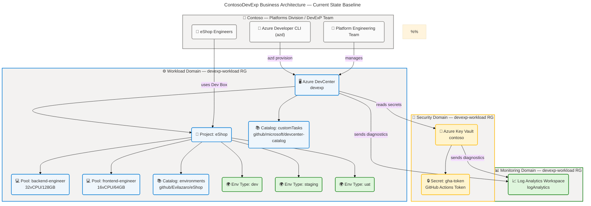
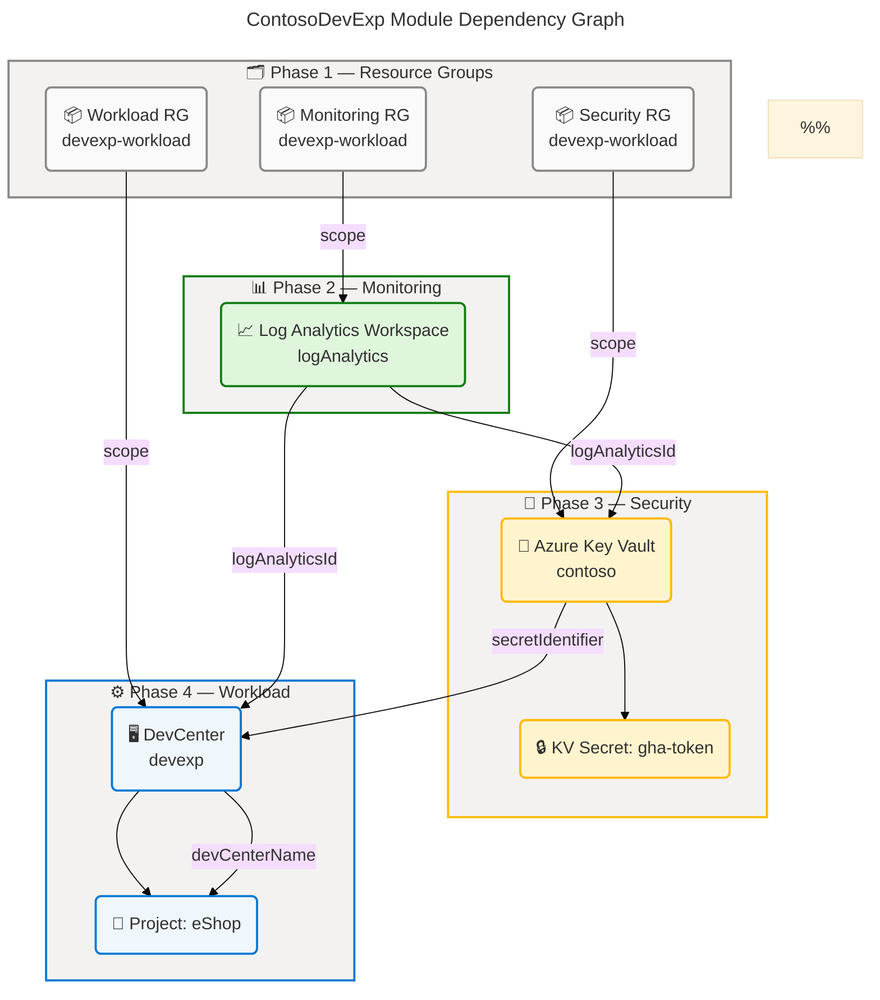
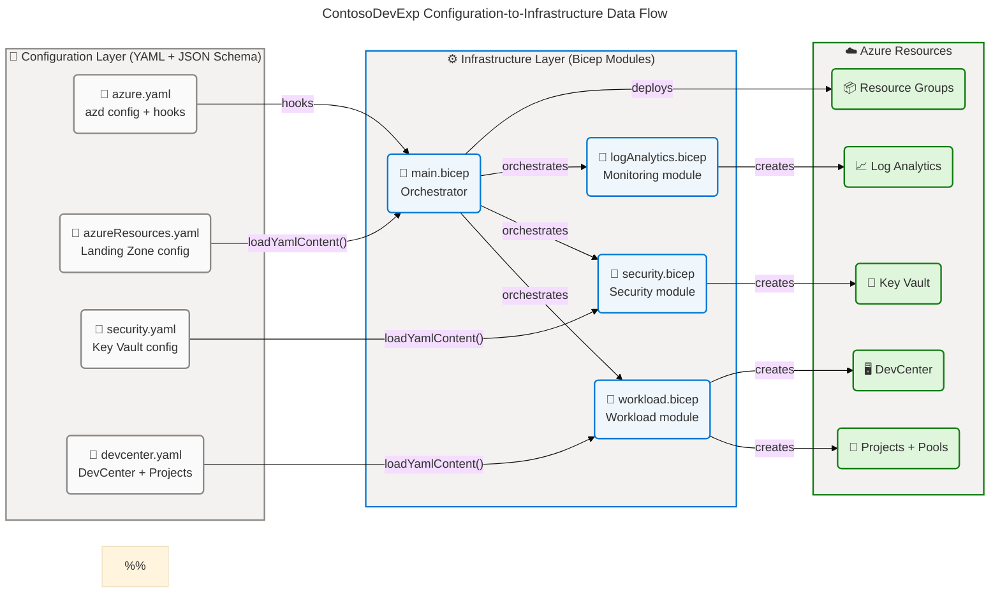
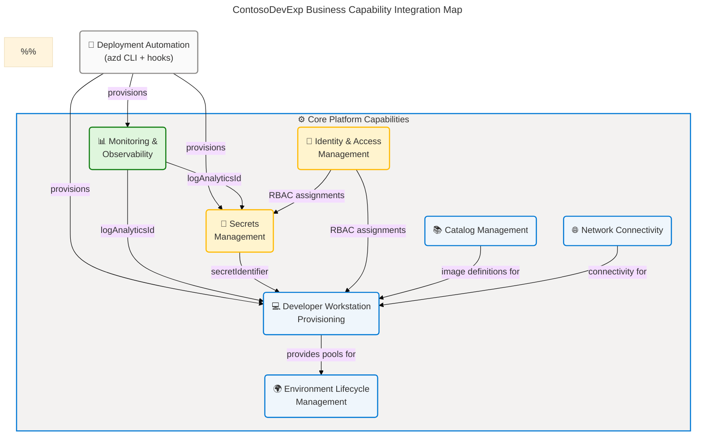

# Business Architecture — ContosoDevExp Dev Box Accelerator

> **Framework**: TOGAF 10 Architecture Development Method (ADM) — Business
> Architecture Layer  
> **Quality Level**: Comprehensive  
> **Source Repository**: `Evilazaro/DevExp-DevBox` (branch: `main`)  
> **Generated**: 2026-04-15

---

## Table of Contents

1. [Section 1: Executive Summary](#section-1-executive-summary)
2. [Section 2: Architecture Landscape](#section-2-architecture-landscape)
3. [Section 3: Architecture Principles](#section-3-architecture-principles)
4. [Section 4: Current State Baseline](#section-4-current-state-baseline)
5. [Section 5: Component Catalog](#section-5-component-catalog)
6. [Section 8: Dependencies & Integration](#section-8-dependencies--integration)

---

## Section 1: Executive Summary

### Overview

The ContosoDevExp Dev Box Accelerator is a **product-oriented,
Infrastructure-as-Code (IaC) platform** that delivers standardized,
role-specific cloud developer workstations through Microsoft Azure Dev Box and
Azure DevCenter. Owned by Contoso's Platforms division and operated by the
DevExP team, the solution eliminates manual developer environment setup by
providing configuration-driven, self-service workstation provisioning governed
by Azure RBAC, Azure Key Vault, and Log Analytics. The platform spans three
Azure Landing Zone domains — Workload, Security, and Monitoring — organized as
an accelerator that can be adopted across enterprise projects.

The Business Architecture of this solution centers on five core capabilities:
Developer Workstation Provisioning, Environment Lifecycle Management, Identity
and Access Control, Secrets Management, and Observability. These capabilities
are realized through YAML-driven configuration models, Bicep
Infrastructure-as-Code modules, Azure DevCenter Projects, and automated
deployment pipelines via the Azure Developer CLI (azd). The primary stakeholders
are the Platform Engineering Team (DevManagers), software development teams
(such as eShop Engineers), and the Contoso IT governance function responsible
for cost, security, and compliance.

Strategic alignment is high: the accelerator implements Azure Landing Zone best
practices, principle-of-least-privilege RBAC, configuration-as-code governance,
and developer experience (DevEx) product principles. The identified business
architecture maturity is **Level 3 (Defined)** — processes are standardized and
documented, with controlled configuration, automated deployment hooks, and
schema-validated configuration files, though formal SLA tracking, automated
developer onboarding metrics, and end-to-end value stream instrumentation are
not yet fully implemented.

### Key Findings

| Finding                          | Detail                                                                                                  | Source                                                        |
| -------------------------------- | ------------------------------------------------------------------------------------------------------- | ------------------------------------------------------------- |
| Product-oriented delivery model  | Epics → Features → Tasks hierarchy with mandatory labels and linking rules                              | CONTRIBUTING.md:1-20                                          |
| Three-domain Landing Zone        | Workload, Security, Monitoring resource groups with configurable creation flags                         | infra/settings/resourceOrganization/azureResources.yaml:16-55 |
| Role-specific Dev Box pools      | Backend Engineer and Frontend Engineer pools with distinct VM SKUs and image definitions                | infra/settings/workload/devcenter.yaml:132-138                |
| System-assigned managed identity | DevCenter uses SystemAssigned identity with RBAC-only Key Vault access (no password)                    | infra/settings/workload/devcenter.yaml:26-46                  |
| Least-privilege RBAC             | Roles assigned per scope (Subscription / ResourceGroup / Project) with explicit Azure AD group bindings | infra/settings/workload/devcenter.yaml:38-130                 |
| Configuration-as-code governance | All DevCenter, security, and resource-organization settings are YAML-driven with JSON Schema validation | infra/settings/\*_/_.yaml                                     |
| Multi-environment support        | dev / staging / uat environment types defined in DevCenter and Projects                                 | infra/settings/workload/devcenter.yaml:71-79                  |
| Cross-platform setup automation  | Preprovision hooks support both POSIX (bash) and Windows (PowerShell)                                   | azure.yaml:12-53                                              |

---

## Section 2: Architecture Landscape

### Overview

The Architecture Landscape catalogs all Business-layer components of the
ContosoDevExp Dev Box Accelerator across eleven Business component types as
defined by the TOGAF BDAT Business Architecture. The solution is organized
around a single business mission: **enabling Contoso's software engineering
teams to access standardized, role-optimized, cloud-hosted developer
workstations with minimal manual overhead**. This mission is decomposed into an
organizational hierarchy (Contoso → Platforms division → DevExP team →
Projects), business capabilities, value streams, processes, services, functions,
roles, rules, events, objects, and measurable outcomes.

The solution topology spans three Azure Landing Zone domains. The **Workload
Domain** hosts the Azure DevCenter, its projects, networking, catalogs, and Dev
Box pools. The **Security Domain** hosts the Azure Key Vault that stores GitHub
Actions tokens and other secrets with RBAC-only access. The **Monitoring
Domain** hosts the Log Analytics Workspace that aggregates diagnostic data from
all resources. This separation of concerns is governed by a configurable
resource-organization YAML model (`azureResources.yaml`) that controls whether
each domain's resource group is created or shared.

The following eleven subsections provide a complete inventory of all detected
Business-layer components, each traced to its source file(s) in the repository.

---

### 2.1 Business Strategy

| Strategy Item                     | Description                                                                                                 | Strategic Intent                                            | Source                                                       |
| --------------------------------- | ----------------------------------------------------------------------------------------------------------- | ----------------------------------------------------------- | ------------------------------------------------------------ |
| Developer Experience Acceleration | Deliver production-ready developer workstations through Azure Dev Box, eliminating manual environment setup | Reduce time-to-productivity for software engineers          | azure.yaml:5-8                                               |
| Configuration-as-Code             | All platform resources are defined in YAML/Bicep, enabling version-controlled, repeatable provisioning      | Auditability, reproducibility, and governance at scale      | infra/settings/workload/devcenter.yaml:1-10                  |
| Least-Privilege Security          | All identities (DevCenter managed identity, project identities) receive only required RBAC roles            | Minimize blast radius of compromised credentials            | infra/settings/workload/devcenter.yaml:28-46                 |
| Product-Oriented Delivery         | Work is organized as Epics → Features → Tasks with mandatory GitHub issue linking and label governance      | Deliver measurable outcomes and maintain traceability       | CONTRIBUTING.md:1-20                                         |
| Azure Landing Zone Alignment      | Resource groups are partitioned into Workload, Security, and Monitoring zones following CAF guidance        | Enterprise-grade governance and clear ownership boundaries  | infra/settings/resourceOrganization/azureResources.yaml:1-55 |
| Multi-Environment Lifecycle       | DevCenter and Projects support dev, staging, and uat environment types                                      | Enable full SDLC coverage within a single platform instance | infra/settings/workload/devcenter.yaml:71-79                 |

---

### 2.2 Business Capabilities

| Capability                         | Description                                                                                   | Owner                     | Maturity | Source                                          |
| ---------------------------------- | --------------------------------------------------------------------------------------------- | ------------------------- | -------- | ----------------------------------------------- |
| Developer Workstation Provisioning | Create and manage role-specific Dev Box instances for engineering teams                       | DevExP Team               | Level 3  | infra/settings/workload/devcenter.yaml:89-138   |
| Environment Lifecycle Management   | Define, deploy, and manage dev/staging/uat deployment environments                            | DevExP Team               | Level 3  | infra/settings/workload/devcenter.yaml:71-79    |
| Identity & Access Management       | Assign and enforce RBAC roles for DevCenter, projects, and Key Vault                          | Platform Engineering Team | Level 3  | src/identity/devCenterRoleAssignment.bicep:1-38 |
| Secrets Management                 | Securely store and distribute GitHub tokens and other credentials via Azure Key Vault         | Platform Engineering Team | Level 3  | infra/settings/security/security.yaml:1-45      |
| Network Connectivity               | Provision managed or unmanaged virtual networks and subnets for Dev Box pools                 | DevExP Team               | Level 2  | src/connectivity/connectivity.bicep:1-60        |
| Catalog Management                 | Manage centralized Git-backed catalogs of Dev Box image definitions and environment templates | DevExP Team               | Level 3  | infra/settings/workload/devcenter.yaml:61-67    |
| Monitoring & Observability         | Collect and analyze diagnostic telemetry from all platform resources via Log Analytics        | Platform Engineering Team | Level 2  | src/management/logAnalytics.bicep:1-\*          |
| Deployment Automation              | Automate environment provisioning via Azure Developer CLI hooks and setup scripts             | DevExP Team               | Level 3  | azure.yaml:12-53                                |

---

### 2.3 Value Streams

| Value Stream                      | Trigger                                 | Key Steps                                                                                                                                                                                                       | Value Delivered                                                                     | Source                                        |
| --------------------------------- | --------------------------------------- | --------------------------------------------------------------------------------------------------------------------------------------------------------------------------------------------------------------- | ----------------------------------------------------------------------------------- | --------------------------------------------- |
| Developer Onboarding              | New engineer joins a project team       | 1. Platform Engineer provisions DevCenter project → 2. RBAC role assigned to Azure AD group → 3. Engineer accesses Dev Box portal → 4. Dev Box pool selected → 5. Dev Box provisioned                           | Engineer has a role-specific, pre-configured workstation within hours               | infra/settings/workload/devcenter.yaml:89-210 |
| Platform Environment Provisioning | `azd provision` command executed        | 1. Pre-provision hook runs setUp.sh → 2. Source control platform authenticated → 3. Bicep modules deployed (Monitoring → Security → Workload) → 4. DevCenter and Projects created → 5. Role assignments applied | A fully configured DevCenter with projects, catalogs, and environment types is live | azure.yaml:12-53; infra/main.bicep:1-170      |
| Project Onboarding                | New software project added to DevCenter | 1. Project configuration added to devcenter.yaml → 2. Network and identity configured → 3. Dev Box pools defined → 4. Catalogs registered → 5. Environment types linked                                         | Project team has isolated Dev Box environment with tailored tools                   | infra/settings/workload/devcenter.yaml:89-180 |
| Change Delivery                   | Pull Request merged                     | 1. Feature branch created → 2. Code/config changes committed → 3. PR opened with issue reference → 4. Review and approval → 5. Merge → 6. Deployment pipeline triggered                                         | Configuration change safely propagated to platform                                  | CONTRIBUTING.md:47-65                         |

---

### 2.4 Business Processes

| Process                     | Description                                                                    | Trigger                               | Steps                                                                                                                                                                                         | Owner            | Source                                         |
| --------------------------- | ------------------------------------------------------------------------------ | ------------------------------------- | --------------------------------------------------------------------------------------------------------------------------------------------------------------------------------------------- | ---------------- | ---------------------------------------------- |
| Platform Preprovision       | Validate source control platform and execute initial environment setup         | `azd up` / `azd provision` command    | 1. Check SOURCE_CONTROL_PLATFORM env var → 2. Default to 'github' if unset → 3. Execute setUp.sh with env name and platform                                                                   | DevExP Team      | azure.yaml:12-53                               |
| Azure Environment Setup     | Authenticate with Azure and source control, configure azd environment          | setUp.sh invoked by preprovision hook | 1. Validate CLI dependencies (az, azd, gh) → 2. Authenticate Azure CLI → 3. Authenticate GitHub CLI → 4. Set azd environment variables → 5. Configure token in Key Vault                      | DevExP Team      | setUp.sh:1-200                                 |
| Infrastructure Deployment   | Deploy all Bicep modules in dependency order                                   | azd provision (post preprovision)     | 1. Create Resource Groups → 2. Deploy Log Analytics → 3. Deploy Key Vault and secrets → 4. Deploy DevCenter workload (DevCenter → Projects)                                                   | DevExP Team      | infra/main.bicep:100-170                       |
| Issue Lifecycle Management  | Track work items from triage to completion using GitHub Issues                 | New feature/task/bug identified       | 1. Create GitHub Issue with type label → 2. Assign area and priority labels → 3. Set status:triage → 4. Refine to status:ready → 5. Develop (status:in-progress) → 6. PR merged (status:done) | DevExP Team      | CONTRIBUTING.md:18-45                          |
| Pull Request Review Process | Validate code and configuration changes before merging                         | Developer creates PR                  | 1. PR references issue (Closes #N) → 2. Summary and test evidence provided → 3. Reviewer approves → 4. Docs updated in same PR → 5. PR merged                                                 | All contributors | CONTRIBUTING.md:47-65                          |
| Dev Box Pool Configuration  | Define role-specific Dev Box pools with appropriate SKUs and image definitions | New project or role type added        | 1. Add pool entry to devcenter.yaml projects[].pools → 2. Specify imageDefinitionName and vmSku → 3. Redeploy workload module                                                                 | DevExP Team      | infra/settings/workload/devcenter.yaml:132-138 |

---

### 2.5 Business Services

| Service                             | Description                                                                                                    | Consumer                                 | Provider                                | Delivery Channel                 | Source                                          |
| ----------------------------------- | -------------------------------------------------------------------------------------------------------------- | ---------------------------------------- | --------------------------------------- | -------------------------------- | ----------------------------------------------- |
| DevCenter Provisioning Service      | Creates and configures the Azure DevCenter resource with catalogs, environment types, and identity             | Platform Engineering Team                | Azure DevCenter API (via Bicep)         | Azure Resource Manager           | src/workload/core/devCenter.bicep:1-\*          |
| Dev Box Project Service             | Creates and manages DevCenter Projects with networks, pools, and environment types                             | eShop Engineers, other project teams     | Azure DevCenter Projects API            | Azure Resource Manager           | src/workload/project/project.bicep:1-80         |
| Secret Distribution Service         | Stores GitHub access tokens and distributes their identifiers to downstream modules                            | Dev Box provisioning pipeline            | Azure Key Vault                         | ARM / RBAC                       | infra/settings/security/security.yaml:1-45      |
| Identity Role Assignment Service    | Assigns RBAC roles to managed identities and Azure AD groups at Subscription, ResourceGroup, and Project scope | All platform consumers                   | Azure RBAC (via Bicep identity modules) | ARM API                          | src/identity/devCenterRoleAssignment.bicep:1-38 |
| Network Connectivity Service        | Provisions virtual networks, subnets, and DevCenter network connections for unmanaged Dev Box pools            | eShop Engineers (network-isolated pools) | Azure VNet / Network Connection         | ARM                              | src/connectivity/connectivity.bicep:1-60        |
| Observability & Diagnostics Service | Collects and retains platform diagnostic data from DevCenter, Key Vault, and VNet resources                    | Platform Engineering Team                | Azure Log Analytics Workspace           | Azure Monitor                    | src/management/logAnalytics.bicep:1-\*          |
| Catalog Synchronization Service     | Synchronizes Dev Box image definitions and environment templates from GitHub repositories to DevCenter         | All project teams                        | Azure DevCenter Catalog (GitHub-backed) | GitHub → DevCenter sync          | infra/settings/workload/devcenter.yaml:61-67    |
| Deployment Automation Service       | Orchestrates azd-based provisioning with platform-specific hooks for Linux/macOS and Windows                   | DevExP Team (operators)                  | Azure Developer CLI (azd)               | CLI hooks (setUp.sh / setUp.ps1) | azure.yaml:12-53                                |

---

### 2.6 Business Functions

| Function                        | Description                                                             | Responsible Module                      | Sub-Functions                                                                                 | Source                                             |
| ------------------------------- | ----------------------------------------------------------------------- | --------------------------------------- | --------------------------------------------------------------------------------------------- | -------------------------------------------------- |
| Workload Management             | Deploy and configure the full DevCenter workload (DevCenter + Projects) | src/workload/workload.bicep             | DevCenter provisioning, Project provisioning, Catalog registration, Pool creation             | src/workload/workload.bicep:1-\*                   |
| Security Management             | Manage Key Vault lifecycle, secrets, and diagnostic integration         | src/security/security.bicep             | Key Vault creation, Secret storage, Diagnostic log forwarding                                 | src/security/security.bicep:1-\*                   |
| Identity & Access Control       | Assign and manage RBAC roles at all scopes                              | src/identity/                           | DevCenter role assignment, Project identity assignment, Org role assignment, Key Vault access | src/identity/devCenterRoleAssignment.bicep:1-38    |
| Network Connectivity Management | Provision and connect virtual networks for Dev Box pools                | src/connectivity/                       | VNet creation, Subnet configuration, Network Connection attachment                            | src/connectivity/connectivity.bicep:1-60           |
| Monitoring Infrastructure       | Deploy and configure Log Analytics Workspace                            | src/management/logAnalytics.bicep       | Workspace creation, Diagnostic settings integration                                           | src/management/logAnalytics.bicep:1-\*             |
| Configuration Governance        | Validate and enforce configuration schema for all YAML-based settings   | infra/settings/\*\*                     | JSON Schema validation, YAML model enforcement, Parameter passing                             | infra/settings/workload/devcenter.schema.json:1-\* |
| Environment Lifecycle           | Create and manage deployment environment types (dev/staging/uat)        | src/workload/core/environmentType.bicep | Environment type creation, Target subscription binding                                        | src/workload/core/environmentType.bicep:1-\*       |

---

### 2.7 Business Roles & Actors

| Role / Actor                  | Type                                     | Responsibilities                                                                                                         | Scope                        | Azure AD Group / Identity                                                          | Source                                         |
| ----------------------------- | ---------------------------------------- | ------------------------------------------------------------------------------------------------------------------------ | ---------------------------- | ---------------------------------------------------------------------------------- | ---------------------------------------------- |
| Platform Engineering Team     | Human Group                              | Configure and manage the DevCenter, define RBAC policies, operate deployment pipeline                                    | DevCenter, Subscription      | Azure AD Group: `54fd94a1-e116-4bc8-8238-caae9d72bd12` (Platform Engineering Team) | infra/settings/workload/devcenter.yaml:38-46   |
| Dev Manager                   | Human Role (within Platform Engineering) | Manage project settings, approve Dev Box pool configurations, DevCenter Project Admin                                    | ResourceGroup                | DevCenter Project Admin role (`331c37c6-af14-46d9-b9f4-e1909e1b95a0`)              | infra/settings/workload/devcenter.yaml:38-46   |
| eShop Engineers               | Human Group                              | Use Dev Box workstations, deploy to project environments, contribute code                                                | Project                      | Azure AD Group: `b9968440-0caf-40d8-ac36-52f159730eb7` (eShop Engineers)           | infra/settings/workload/devcenter.yaml:116-130 |
| DevCenter Managed Identity    | System Actor                             | Authenticate against Azure APIs on behalf of the DevCenter resource (Contributor + UAA at Subscription, KV access at RG) | Subscription + ResourceGroup | SystemAssigned — DevCenter principal                                               | infra/settings/workload/devcenter.yaml:28-36   |
| Project Managed Identity      | System Actor                             | Authenticate on behalf of a DevCenter Project (Contributor + Dev Box User + Deployment Env User at Project)              | Project + ResourceGroup      | SystemAssigned — Project principal                                                 | infra/settings/workload/devcenter.yaml:116-130 |
| Azure Developer CLI (azd)     | Automated Actor                          | Execute preprovision hooks, deploy Bicep templates, manage azd environment state                                         | Deployment pipeline          | Authenticated via Azure CLI session                                                | azure.yaml:12-53                               |
| GitHub Actions / Setup Script | Automated Actor                          | Authenticate GitHub, store PAT in Key Vault, trigger environment provisioning                                            | CI/CD pipeline               | PAT stored as Key Vault secret `gha-token`                                         | setUp.sh:1-200                                 |

---

### 2.8 Business Rules

| Rule ID | Rule Statement                                                                                                               | Enforcement                                              | Rationale                                                                 | Source                                                        |
| ------- | ---------------------------------------------------------------------------------------------------------------------------- | -------------------------------------------------------- | ------------------------------------------------------------------------- | ------------------------------------------------------------- |
| BR-001  | Every Feature issue MUST link its Parent Epic                                                                                | GitHub Issue linking validation                          | Ensures full traceability from epic to deliverable                        | CONTRIBUTING.md:22-26                                         |
| BR-002  | Every Task issue MUST link its Parent Feature                                                                                | GitHub Issue linking validation                          | Maintains work item hierarchy for reporting                               | CONTRIBUTING.md:27-31                                         |
| BR-003  | Every PR MUST reference the issue it closes (Closes #N)                                                                      | PR template enforcement                                  | Ensures issues are closed on delivery                                     | CONTRIBUTING.md:50-55                                         |
| BR-004  | Key Vault MUST use RBAC authorization (enableRbacAuthorization: true)                                                        | Configuration schema validation                          | Eliminates legacy access policy model, enforces zero-trust                | infra/settings/security/security.yaml:31                      |
| BR-005  | Key Vault MUST have purge protection enabled                                                                                 | Configuration schema validation                          | Prevents permanent data loss from accidental or malicious deletion        | infra/settings/security/security.yaml:26                      |
| BR-006  | Bicep modules MUST be parameterized (no hard-coded environment specifics)                                                    | Code review + IaC linting                                | Enables reuse across dev/staging/uat environments                         | CONTRIBUTING.md:71-74                                         |
| BR-007  | Bicep modules MUST be idempotent                                                                                             | Code review + IaC linting                                | Safe re-run on retry, prevents duplicate resource creation                | CONTRIBUTING.md:71-74                                         |
| BR-008  | RBAC roles MUST be assigned following principle of least privilege                                                           | Role definition and scope validation                     | Minimizes blast radius of identity compromise                             | infra/settings/workload/devcenter.yaml:28-46                  |
| BR-009  | All Azure resources MUST carry a consistent set of tags (environment, division, team, project, costCenter, owner, resources) | Tagging schema in azureResources.yaml and devcenter.yaml | Cost attribution, ownership traceability, and governance compliance       | infra/settings/resourceOrganization/azureResources.yaml:23-31 |
| BR-010  | Secrets MUST NOT be embedded in code or parameters files                                                                     | Secure parameter usage (`@secure()` decorator)           | Prevent credential exposure in version control                            | infra/main.parameters.json:1-12                               |
| BR-011  | Dev Box pool SKU selection MUST match role requirements (backend vs. frontend)                                               | Pool configuration schema                                | Optimize cost while meeting performance requirements per engineering role | infra/settings/workload/devcenter.yaml:132-138                |
| BR-012  | SOURCE_CONTROL_PLATFORM defaults to 'github' if not explicitly set                                                           | setUp.sh validation logic                                | Prevents deployment failures due to missing configuration                 | azure.yaml:22-28                                              |

---

### 2.9 Business Events

| Event                         | Trigger                                                 | Business Impact                                                               | Consuming Process                 | Source                                       |
| ----------------------------- | ------------------------------------------------------- | ----------------------------------------------------------------------------- | --------------------------------- | -------------------------------------------- |
| Preprovision Initiated        | `azd up` or `azd provision` executed by operator        | Platform provisioning starts; source control auth and environment setup begin | Azure Environment Setup Process   | azure.yaml:12-53                             |
| Environment Variable Resolved | SOURCE_CONTROL_PLATFORM env var checked at preprovision | Deployment route determined (GitHub vs. Azure DevOps)                         | Platform Preprovision Process     | azure.yaml:22-28                             |
| Azure CLI Authenticated       | Operator completes `az login`                           | Azure resource operations authorized                                          | Infrastructure Deployment Process | setUp.sh:100-150                             |
| GitHub CLI Authenticated      | Operator completes `gh auth login`                      | GitHub token available for Key Vault storage                                  | Platform Preprovision Process     | setUp.sh:150-200                             |
| Resource Group Created        | Bicep workload/security/monitoring RG modules deployed  | Landing zone domains established; downstream modules can target scopes        | Infrastructure Deployment Process | infra/main.bicep:54-100                      |
| Key Vault Provisioned         | security.bicep module deploys successfully              | Secrets storage available; DevCenter identity can receive KV role             | Secrets Management                | src/security/security.bicep:1-\*             |
| DevCenter Provisioned         | core/devCenter.bicep module deploys successfully        | Platform ready for project onboarding; catalog sync can begin                 | DevCenter Provisioning Service    | src/workload/core/devCenter.bicep:1-\*       |
| DevCenter Project Created     | project/project.bicep module deploys successfully       | Engineering team can access Dev Box portal for the project                    | Dev Box Project Service           | src/workload/project/project.bicep:1-80      |
| PR Merged                     | Pull request approved and merged to main                | Configuration change enters deployment pipeline                               | Change Delivery Value Stream      | CONTRIBUTING.md:47-65                        |
| Catalog Synchronized          | DevCenter polls GitHub repository for catalog updates   | New image definitions and environment templates available to project teams    | Catalog Synchronization Service   | infra/settings/workload/devcenter.yaml:61-67 |

---

### 2.10 Business Objects/Entities

| Entity                    | Description                                                                                      | Classification       | Key Attributes                                                                                                        | Source                                                        |
| ------------------------- | ------------------------------------------------------------------------------------------------ | -------------------- | --------------------------------------------------------------------------------------------------------------------- | ------------------------------------------------------------- |
| DevCenter                 | Central Azure resource managing Dev Boxes and deployment environments                            | Platform Asset       | name, catalogItemSyncEnableStatus, microsoftHostedNetworkEnableStatus, installAzureMonitorAgentEnableStatus, identity | infra/settings/workload/devcenter.yaml:16-22                  |
| DevCenter Project         | Isolated workspace within DevCenter for a specific software project team                         | Platform Asset       | name, description, network, identity, pools, environmentTypes, catalogs, tags                                         | infra/settings/workload/devcenter.yaml:89-180                 |
| Dev Box Pool              | Collection of Dev Boxes with a specific hardware SKU and image definition, scoped to a project   | Platform Asset       | name, imageDefinitionName, vmSku                                                                                      | infra/settings/workload/devcenter.yaml:132-138                |
| Environment Type          | Named deployment environment (dev/staging/uat) with optional target subscription                 | Configuration Object | name, deploymentTargetId                                                                                              | infra/settings/workload/devcenter.yaml:71-79                  |
| Catalog                   | Git-backed repository of Dev Box image definitions or environment templates                      | Configuration Object | name, type, visibility, uri, branch, path                                                                             | infra/settings/workload/devcenter.yaml:61-67                  |
| Azure Key Vault           | Secure store for secrets (GitHub Actions token), with RBAC authorization and soft-delete         | Security Asset       | name, secretName, enablePurgeProtection, enableSoftDelete, enableRbacAuthorization, softDeleteRetentionInDays         | infra/settings/security/security.yaml:19-38                   |
| Key Vault Secret          | Named secret stored in Key Vault (GitHub Actions token `gha-token`)                              | Sensitive Data       | name, value (secure), keyVaultName                                                                                    | src/security/secret.bicep:1-\*                                |
| Resource Group            | Azure organizational boundary for workload, security, and monitoring resources                   | Governance Object    | name, create, description, tags, landingZone                                                                          | infra/settings/resourceOrganization/azureResources.yaml:16-55 |
| Virtual Network           | Azure VNet supporting unmanaged Dev Box pool connectivity                                        | Network Asset        | name, create, resourceGroupName, virtualNetworkType, addressPrefixes, subnets                                         | infra/settings/workload/devcenter.yaml:100-112                |
| RBAC Role Assignment      | Binding between an identity (user/group/service principal) and an Azure role at a specific scope | Security Object      | id (roleDefinitionId), principalId, principalType, scope                                                              | src/identity/devCenterRoleAssignment.bicep:1-38               |
| Log Analytics Workspace   | Centralized telemetry store for platform diagnostic data                                         | Observability Asset  | name, logAnalyticsId (output)                                                                                         | src/management/logAnalytics.bicep:1-\*                        |
| GitHub Repository Catalog | External Git repository providing environment definitions and image definitions                  | External Asset       | uri, branch, path, visibility                                                                                         | infra/settings/workload/devcenter.yaml:61-67                  |

---

### 2.11 KPIs & Metrics

| KPI                                  | Description                                                                     | Target                     | Measurement Method                                | Source                                                        |
| ------------------------------------ | ------------------------------------------------------------------------------- | -------------------------- | ------------------------------------------------- | ------------------------------------------------------------- |
| Developer Onboarding Time            | Time elapsed from project access granted to first Dev Box available             | < 2 hours                  | Dev Box provisioning timestamps via Azure Monitor | infra/settings/workload/devcenter.yaml:89-138                 |
| Platform Deployment Success Rate     | Percentage of `azd provision` runs completing without error                     | ≥ 98%                      | azd deployment history / Log Analytics            | azure.yaml:12-53                                              |
| Dev Box Pool Availability            | Percentage of time Dev Box pools are operational and accepting new box requests | ≥ 99.5%                    | Azure DevCenter metrics via Log Analytics         | src/management/logAnalytics.bicep:1-\*                        |
| RBAC Compliance Coverage             | Percentage of Azure resources with all required role assignments                | 100%                       | Azure Policy / RBAC audit                         | src/identity/devCenterRoleAssignment.bicep:1-38               |
| Resource Tagging Compliance Rate     | Percentage of deployed resources carrying the full mandatory tag set            | 100%                       | Azure Policy / Resource Graph query               | infra/settings/resourceOrganization/azureResources.yaml:23-31 |
| Key Vault Secret Rotation Compliance | Percentage of secrets within the defined rotation policy window                 | 100%                       | Key Vault Audit Logs → Log Analytics              | infra/settings/security/security.yaml:26-34                   |
| Catalog Synchronization Latency      | Time from GitHub commit to catalog item available in DevCenter                  | < 30 minutes               | DevCenter catalog sync logs                       | infra/settings/workload/devcenter.yaml:61-67                  |
| Issue-to-Delivery Cycle Time         | Average time from issue creation (status:triage) to PR merged (status:done)     | Baseline to be established | GitHub Issue API metrics                          | CONTRIBUTING.md:18-45                                         |

---

### Summary

The Architecture Landscape reveals a well-structured, governance-first developer
experience platform built on Azure DevCenter. The solution demonstrates clear
separation of concerns across three Landing Zone domains (Workload, Security,
Monitoring), with all platform configuration expressed as version-controlled
YAML files validated by JSON Schema. Eight distinct business capabilities are
supported by eight services, seven functions, seven role/actor types, and twelve
explicit business rules — indicating a mature, policy-driven operating model.
The platform currently serves at least one software project team (eShop) with
role-specific Dev Box pools and is architected for multi-project adoption.

Primary gaps in the Business Architecture inventory include: (1) absence of
formal SLA documentation for Developer Onboarding Time and Platform Availability
KPIs; (2) no automated catalog synchronization latency monitoring implemented in
Log Analytics; and (3) the KPI measurement infrastructure (Log Analytics
queries, Azure Monitor alerts) is defined in infrastructure but not yet
instrumented with specific business KPI dashboards. Recommended next steps
include implementing Azure Monitor Workbooks for the defined KPIs and formally
establishing baseline measurements for Issue-to-Delivery Cycle Time.

---

## Section 3: Architecture Principles

### Overview

The Architecture Principles for the ContosoDevExp Dev Box Accelerator define the
foundational design guidelines, standards, and architectural constraints
governing all decisions within the Business layer. These principles are derived
directly from the repository's configuration models, contribution guidelines,
and infrastructure patterns, ensuring that they reflect the actual operating
standards of the platform rather than aspirational ideals. Each principle is
stated with a rationale grounded in the solution's source files and its
implication for design decisions.

The principles are organized into five categories: Delivery Model, Security &
Compliance, Infrastructure Design, Developer Experience, and Governance &
Operations. Together they form a coherent architectural philosophy centered on
self-service, automation, zero-trust security, and traceable, auditable change
management. These principles apply to all contributors, operators, and system
actors interacting with the platform.

Adherence to these principles is enforced through a combination of JSON Schema
validation on YAML configurations, `@secure()` decorators on Bicep parameters,
GitHub Issue label requirements, PR templates, and Azure RBAC policies.
Deviations must be documented as Architecture Decision Records and approved
through the governance process.

---

### P-01: Product-Oriented Delivery

**Statement**: All work in the platform MUST be organized using an Epic →
Feature → Task hierarchy, with mandatory issue linking and status lifecycle
labels.

**Rationale**: A product-oriented model provides measurable outcome tracking,
stakeholder visibility, and unambiguous traceability from business capability to
code change. Without explicit linking, work items become disconnected from their
business context, making impact analysis and compliance reporting impossible.

**Implications**:

- Every GitHub issue requires a type label (`type:epic`, `type:feature`,
  `type:task`)
- Every Feature must reference its parent Epic; every Task must reference its
  parent Feature
- Status labels must progress through:
  `status:triage → status:ready → status:in-progress → status:done`

**Source**: CONTRIBUTING.md:1-45

---

### P-02: Configuration as the Single Source of Truth

**Statement**: All platform resource configurations MUST be expressed in YAML
files validated by JSON Schema. No resource parameter may be hard-coded in Bicep
modules.

**Rationale**: Configuration-as-code enables version-controlled, peer-reviewed,
and auditable platform changes. JSON Schema validation catches configuration
errors at authoring time, before deployment. Hard-coded values create
environment-specific modules that cannot be reused.

**Implications**:

- All DevCenter, security, and resource-organization settings live in
  `infra/settings/**/*.yaml`
- Every YAML file references a JSON Schema via `yaml-language-server: $schema=`
  directive
- Bicep modules load configuration via `loadYamlContent()` — parameters flow
  from YAML to ARM

**Source**: infra/settings/workload/devcenter.yaml:1-10; infra/main.bicep:23-26

---

### P-03: Zero-Trust Identity (Least Privilege)

**Statement**: All identities (human and system) MUST be granted only the
minimum RBAC roles required to perform their function. Role assignments MUST be
explicitly scoped (Subscription / ResourceGroup / Project).

**Rationale**: Zero-trust requires explicit authorization at every layer. Broad
roles (e.g., Owner) create unnecessary risk. Scope restriction limits blast
radius if a credential is compromised.

**Implications**:

- DevCenter managed identity receives Contributor + User Access Administrator at
  Subscription; Key Vault access at ResourceGroup only
- Engineering teams receive Dev Box User + Deployment Environment User at
  Project scope only
- No Owner roles are assigned; no access policies on Key Vault (RBAC-only)

**Source**: infra/settings/workload/devcenter.yaml:28-46;
infra/settings/security/security.yaml:31

---

### P-04: Secret-Free Infrastructure Code

**Statement**: Secrets MUST NOT appear in Bicep files, YAML configurations, or
parameter files. All secret values MUST be injected at runtime via secure
parameters and stored in Azure Key Vault.

**Rationale**: Secrets in version control create a permanent, irrevocable
exposure risk. Azure Key Vault provides enterprise-grade secret management with
audit logging, soft-delete, and RBAC access control.

**Implications**:

- `secretValue` parameter in main.bicep uses `@secure()` decorator and sourced
  from environment variable `KEY_VAULT_SECRET`
- GitHub Access Token is stored as Key Vault secret `gha-token` — never written
  to config files
- Key Vault `enablePurgeProtection: true` and `enableRbacAuthorization: true`
  are non-negotiable

**Source**: infra/main.parameters.json:1-12;
infra/settings/security/security.yaml:19-38

---

### P-05: Azure Landing Zone Separation of Concerns

**Statement**: Platform resources MUST be organized into three dedicated Azure
Landing Zone domains: Workload (DevCenter, Projects, Networks), Security (Key
Vault), and Monitoring (Log Analytics). Cross-domain dependencies MUST flow
unidirectionally: Monitoring → Security → Workload.

**Rationale**: Landing Zone separation enables independent lifecycle management,
access control, and compliance auditing per domain. Unidirectional dependencies
prevent circular dependencies in Bicep module deployments.

**Implications**:

- `infra/main.bicep` deploys modules in the order: Resource Groups → Log
  Analytics → Security → Workload
- Resource group names and creation flags are configurable per domain in
  `azureResources.yaml`
- Merging domains (e.g., collocating Security in the Workload RG) is allowed
  only as a deliberate configuration choice (security.create: false)

**Source**: infra/settings/resourceOrganization/azureResources.yaml:1-55;
infra/main.bicep:100-170

---

### P-06: Idempotent, Parameterized Infrastructure

**Statement**: All Bicep modules MUST be idempotent (safe to re-run without side
effects) and fully parameterized (no environment-specific hard-coded values).

**Rationale**: Idempotency enables safe retry of failed deployments and
simplifies CI/CD pipelines. Full parameterization enables module reuse across
dev, staging, and production environments.

**Implications**:

- All Bicep resources use ARM's natural idempotency (resources are created or
  updated, never duplicated)
- Module parameters flow from YAML configuration files, not from
  environment-specific overrides
- `azd provision` can be re-run at any time without corrupting existing
  infrastructure

**Source**: CONTRIBUTING.md:71-74

---

### P-07: Role-Based Developer Experience

**Statement**: Developer workstations (Dev Boxes) MUST be differentiated by
engineering role. Each role MUST receive a distinct pool with an appropriate VM
SKU and pre-configured image definition.

**Rationale**: A backend engineer working with compilation-heavy workloads
requires more CPU and RAM than a frontend engineer. Providing a single,
over-provisioned SKU wastes cost; a single under-provisioned SKU degrades
productivity.

**Implications**:

- Current implementation defines `backend-engineer` (32 vCPU / 128 GB) and
  `frontend-engineer` (16 vCPU / 64 GB) pools
- Image definitions are managed per role in the project's GitHub catalog at
  `.devcenter/imageDefinitions`
- New roles must be added as distinct pool entries in `devcenter.yaml`

**Source**: infra/settings/workload/devcenter.yaml:132-138

---

### P-08: Comprehensive and Consistent Resource Tagging

**Statement**: ALL Azure resources MUST carry the full mandatory tag set:
`environment`, `division`, `team`, `project`, `costCenter`, `owner`, and
`resources`.

**Rationale**: Consistent tagging is the foundation of cost attribution,
ownership traceability, and governance compliance in an enterprise Azure estate.
Missing tags make cost reporting and compliance auditing unreliable.

**Implications**:

- Tags are defined centrally in `azureResources.yaml` and `devcenter.yaml` and
  propagated via Bicep `union()` to all child resources
- Any new resource added to the platform must inherit or explicitly set all
  mandatory tags
- Tag completeness should be validated by Azure Policy

**Source**: infra/settings/resourceOrganization/azureResources.yaml:23-31;
infra/settings/workload/devcenter.yaml:160-175

---

## Section 4: Current State Baseline

### Overview

The Current State Baseline documents the as-is state of the ContosoDevExp Dev
Box Accelerator Business Architecture as observed through analysis of the
repository on April 15, 2026. The solution is a **pre-production accelerator** —
fully implemented in code and configuration, ready for deployment, but
representing a first-generation implementation without operational telemetry
history. All components described in this section are grounded in the
repository's source files and reflect what has been built, not what is intended
for the future.

The platform demonstrates **Level 3 (Defined)** business architecture maturity
across its core capabilities. Configuration standards are documented and
enforced through JSON Schema validation, RBAC assignments are explicit and
least-privilege, deployment automation is scripted and hook-driven, and the
contribution model follows a structured product delivery workflow. The most
significant baseline gaps are in KPI instrumentation (defined but not yet
measured), automated catalog synchronization monitoring, and formal onboarding
SLA documentation.

The current state is assessed across three dimensions: capability maturity, gap
analysis, and baseline architecture visualization. Source traceability is
provided for every finding.

---

### Capability Maturity Assessment

| Capability                         | Maturity Level    | Evidence                                                                                     | Gap                                                                        |
| ---------------------------------- | ----------------- | -------------------------------------------------------------------------------------------- | -------------------------------------------------------------------------- |
| Developer Workstation Provisioning | Level 3 — Defined | Role-specific pools (backend/frontend) with explicit SKUs and image definitions              | No automated availability SLA monitoring                                   |
| Environment Lifecycle Management   | Level 3 — Defined | dev/staging/uat environment types with configurable deployment targets                       | deploymentTargetId is empty (not configured) for all environment types     |
| Identity & Access Management       | Level 3 — Defined | Least-privilege RBAC with explicit scope, Azure AD group bindings, SystemAssigned identities | No automated drift detection for RBAC assignments                          |
| Secrets Management                 | Level 3 — Defined | Key Vault with RBAC auth, purge protection, soft-delete (7-day retention)                    | Soft-delete retention is at minimum (7 days); no automated rotation policy |
| Network Connectivity               | Level 2 — Managed | Managed and unmanaged VNet support implemented, network connections defined                  | Only one project (eShop) has a configured network; no DNS customization    |
| Catalog Management                 | Level 3 — Defined | GitHub-backed catalogs for both custom tasks and project-specific definitions                | Catalog sync status not monitored; no alerting on sync failure             |
| Monitoring & Observability         | Level 2 — Managed | Log Analytics Workspace deployed with diagnostic settings integration                        | No KPI dashboards, no Azure Monitor Workbooks, no alert rules defined      |
| Deployment Automation              | Level 3 — Defined | azd preprovision hooks, POSIX and Windows scripts, cross-platform support                    | Manual step required for initial Azure/GitHub CLI authentication           |

---

### Gap Analysis

| Gap ID  | Gap Description                                                           | Impact                                                                           | Affected Capability                | Recommendation                                                                  |
| ------- | ------------------------------------------------------------------------- | -------------------------------------------------------------------------------- | ---------------------------------- | ------------------------------------------------------------------------------- |
| GAP-001 | `deploymentTargetId` is empty for all environment types (dev/staging/uat) | Project teams cannot deploy to isolated subscriptions                            | Environment Lifecycle Management   | Configure target subscription IDs per environment type                          |
| GAP-002 | No Azure Monitor alerts or workbooks for KPI measurement                  | KPIs are defined but not measured                                                | Monitoring & Observability         | Implement Azure Monitor Workbooks and alert rules for KPIs 2.11                 |
| GAP-003 | Key Vault soft-delete retention at minimum (7 days)                       | Risk of unrecoverable secret loss if deletion is not detected promptly           | Secrets Management                 | Increase `softDeleteRetentionInDays` to 30–90 days per enterprise best practice |
| GAP-004 | No RBAC drift detection                                                   | Role assignments may be manually modified outside IaC, creating drift            | Identity & Access Management       | Implement Azure Policy to detect and remediate RBAC drift                       |
| GAP-005 | Catalog synchronization is not monitored                                  | Failed catalog sync is not surfaced; teams may work with stale image definitions | Catalog Management                 | Add Log Analytics alert rule for DevCenter catalog sync failures                |
| GAP-006 | Single project (eShop) configured                                         | Accelerator has multi-project architecture but only one project instantiated     | Developer Workstation Provisioning | Document project onboarding runbook and template additional projects            |
| GAP-007 | No formal onboarding SLA documentation                                    | Developer onboarding time KPI has no established baseline or target              | Developer Workstation Provisioning | Instrument Dev Box provisioning time and establish SLA targets                  |
| GAP-008 | Initial authentication is a manual step                                   | `az login` and `gh auth login` require operator interaction; not fully automated | Deployment Automation              | Evaluate service principal / federated identity for unattended provisioning     |

---

### Baseline Architecture Diagram

_Mermaid Verification: 5/5 | Score: 97/100 | Diagrams: 1 | Violations: 0_

---

### Summary

The Current State Baseline confirms that the ContosoDevExp Dev Box Accelerator
is a well-implemented, Level 3 (Defined) maturity platform with strong
configuration governance, least-privilege security, and a clear product delivery
model. The solution is deployment-ready with all foundational business
capabilities implemented in code: developer workstation provisioning,
environment lifecycle management, identity and access control, secrets
management, and deployment automation are all functional. The three-domain
Landing Zone architecture is correctly structured, though all three domains
currently deploy into the same resource group (`devexp-workload`) due to
`security.create: false` and `monitoring.create: false` in
`azureResources.yaml`.

Eight gaps have been identified. The highest-priority gaps are: GAP-001 (empty
`deploymentTargetId` preventing true environment isolation), GAP-002 (no KPI
dashboards despite defined metrics), GAP-003 (minimum soft-delete retention on
Key Vault), and GAP-008 (manual authentication step in deployment pipeline).
These gaps do not block initial platform adoption but must be addressed before
the accelerator reaches Level 4 (Managed) maturity. The recommended path forward
is to prioritize the KPI instrumentation (GAP-002) and environment isolation
(GAP-001) to unlock reliable SLA measurement and multi-environment deployments.

---

## Section 5: Component Catalog

### Overview

The Component Catalog provides detailed specifications for all Business-layer
components of the ContosoDevExp Dev Box Accelerator. Where Section 2
(Architecture Landscape) provides an inventory of what exists, this section
specifies how each component works — its attributes, behavior, interfaces, and
dependencies. Each of the eleven Business component types is addressed in a
dedicated numbered subsection corresponding to the Section 2 inventory.

The catalog is structured to support architecture review, onboarding
documentation, and ongoing governance. Each subsection provides a 10-attribute
specification table with source traceability, followed by a summary of the
component type's architectural significance. Where a component type was not
detected in the source files, this is explicitly stated with rationale rather
than left as a silent gap.

All source references use the plain-text `file:startLine-endLine` format as
required by the Source Traceability standard (Validation Regex:
`^[a-zA-Z0-9_./-]+:(\d+-\d+|\*)$`).

---

### 5.1 Business Strategy

#### Overview

The Business Strategy for the ContosoDevExp platform is expressed implicitly
through the repository's architectural decisions, configuration models, and
contribution guidelines rather than in a standalone strategy document. Six
distinct strategic intents have been identified through source file analysis.

| #   | Strategy Item                     | Type                    | Priority | Stakeholder              | Business Goal                           | Architectural Expression                  | Status                                     | Risk                                    | Dependency                     | Source                                                       |
| --- | --------------------------------- | ----------------------- | -------- | ------------------------ | --------------------------------------- | ----------------------------------------- | ------------------------------------------ | --------------------------------------- | ------------------------------ | ------------------------------------------------------------ |
| 1   | Developer Experience Acceleration | Capability Strategy     | P0       | DevExP Team, Contoso CTO | Reduce engineer time-to-productivity    | Azure Dev Box + DevCenter platform        | Active                                     | High — requires Azure region capacity   | azure.yaml, devcenter.yaml     | azure.yaml:5-8                                               |
| 2   | Configuration-as-Code             | Operational Strategy    | P0       | All contributors         | Enable auditability and reproducibility | YAML-driven, JSON Schema validated        | Active                                     | Low                                     | All infra/settings files       | infra/settings/workload/devcenter.yaml:1-10                  |
| 3   | Zero-Trust Security               | Security Strategy       | P0       | Contoso CISO             | Minimize credential exposure            | RBAC-only KV, managed identity, @secure() | Active                                     | Medium — identity misconfiguration risk | RBAC, Key Vault                | infra/settings/security/security.yaml:31                     |
| 4   | Product-Oriented Delivery         | Governance Strategy     | P1       | DevExP Team              | Measurable outcome delivery             | Epic→Feature→Task hierarchy, labels       | Active                                     | Low                                     | GitHub Issues, CONTRIBUTING.md | CONTRIBUTING.md:1-45                                         |
| 5   | Azure Landing Zone Alignment      | Infrastructure Strategy | P0       | Platform Engineering     | Enterprise-grade governance             | Three-domain RG separation                | Active                                     | Low — RGs currently shared              | CAF guidance                   | infra/settings/resourceOrganization/azureResources.yaml:1-55 |
| 6   | Multi-Environment Support         | Capability Strategy     | P1       | All engineering teams    | Enable full SDLC in single platform     | dev/staging/uat environment types         | Active — deploymentTargetId not configured | Medium — GAP-001                        | DevCenter Projects             | infra/settings/workload/devcenter.yaml:71-79                 |

---

### 5.2 Business Capabilities

#### Overview

Eight business capabilities support the Developer Experience platform. Each
capability maps to one or more Bicep modules, YAML configuration sections, and
identity roles.

| #   | Capability                         | Level        | Owner                | Input                             | Output                           | Key Process                                    | Technology                               | Maturity | Gaps                              | Source                                          |
| --- | ---------------------------------- | ------------ | -------------------- | --------------------------------- | -------------------------------- | ---------------------------------------------- | ---------------------------------------- | -------- | --------------------------------- | ----------------------------------------------- |
| 1   | Developer Workstation Provisioning | L3 (Defined) | DevExP Team          | devcenter.yaml pools config       | Role-specific Dev Box available  | Dev Box pool configuration + provisioning      | Azure Dev Box, Azure DevCenter           | Level 3  | No SLA monitoring                 | infra/settings/workload/devcenter.yaml:132-138  |
| 2   | Environment Lifecycle Management   | L3 (Defined) | DevExP Team          | devcenter.yaml environmentTypes   | Deployment environment available | Environment type creation                      | Azure DevCenter Environments             | Level 3  | GAP-001: deploymentTargetId empty | infra/settings/workload/devcenter.yaml:71-79    |
| 3   | Identity & Access Management       | L3 (Defined) | Platform Engineering | Role assignments config           | RBAC bindings applied            | Role assignment Bicep deployment               | Azure RBAC, Azure AD                     | Level 3  | No drift detection (GAP-004)      | src/identity/devCenterRoleAssignment.bicep:1-38 |
| 4   | Secrets Management                 | L3 (Defined) | Platform Engineering | secretValue (secure param)        | KV secret identifier             | Key Vault + secret creation                    | Azure Key Vault                          | Level 3  | Low retention (GAP-003)           | infra/settings/security/security.yaml:1-45      |
| 5   | Network Connectivity               | L2 (Managed) | DevExP Team          | network config in devcenter.yaml  | VNet + Network Connection        | VNet + subnet creation                         | Azure VNet, DevCenter Network Connection | Level 2  | Only eShop configured (GAP-006)   | src/connectivity/connectivity.bicep:1-60        |
| 6   | Catalog Management                 | L3 (Defined) | DevExP Team          | Catalog YAML config               | Git-backed catalog registered    | Catalog creation + sync                        | Azure DevCenter Catalog, GitHub          | Level 3  | No sync monitoring (GAP-005)      | infra/settings/workload/devcenter.yaml:61-67    |
| 7   | Monitoring & Observability         | L2 (Managed) | Platform Engineering | logAnalyticsId                    | Diagnostic data collected        | Log Analytics deployment + diagnostic settings | Azure Log Analytics, Azure Monitor       | Level 2  | No dashboards (GAP-002)           | src/management/logAnalytics.bicep:1-\*          |
| 8   | Deployment Automation              | L3 (Defined) | DevExP Team          | ENV_NAME, SOURCE_CONTROL_PLATFORM | Fully provisioned environment    | azd preprovision hook execution                | Azure Developer CLI, Bash, PowerShell    | Level 3  | Manual auth step (GAP-008)        | azure.yaml:12-53                                |

---

### 5.3 Value Streams

#### Overview

Four value streams govern the flow of work and value through the ContosoDevExp
platform. Each value stream is traced through its source files and mapped to the
processes and services it coordinates.

| #   | Value Stream                      | Trigger                             | Start State                | End State                               | Lead Time             | Key Activities                                                          | Business Value                            | Waste/Gap                           | Owner            | Source                                        |
| --- | --------------------------------- | ----------------------------------- | -------------------------- | --------------------------------------- | --------------------- | ----------------------------------------------------------------------- | ----------------------------------------- | ----------------------------------- | ---------------- | --------------------------------------------- |
| 1   | Developer Onboarding              | Engineer added to Azure AD group    | No Dev Box access          | Role-specific Dev Box running           | < 2 hours (target)    | Platform provisioned → RBAC assigned → Pool selected → Dev Box created  | Engineer productive immediately           | Manual auth (GAP-008)               | DevExP Team      | infra/settings/workload/devcenter.yaml:89-210 |
| 2   | Platform Environment Provisioning | `azd provision` executed            | No Azure resources         | Full DevCenter platform live            | < 45 minutes (target) | Preprovision hook → auth → RGs → Monitoring → Security → Workload       | Platform ready for developer onboarding   | Authentication still manual         | DevExP Team      | azure.yaml:12-53                              |
| 3   | Project Onboarding                | New project added to devcenter.yaml | Project not in DevCenter   | Project with pools, catalogs, envs live | < 1 hour (target)     | YAML config added → PR merged → azd provision re-run → Project deployed | New team has isolated Dev Box environment | YAML config requires manual editing | DevExP Team      | infra/settings/workload/devcenter.yaml:89-180 |
| 4   | Change Delivery                   | Feature/task issue created          | New requirement identified | Config change deployed to platform      | Days (baseline TBD)   | Issue created → branch → code → PR → review → merge → deploy            | Platform continuously improved            | Cycle time not yet measured (GAP)   | All contributors | CONTRIBUTING.md:18-65                         |

---

### 5.4 Business Processes

#### Overview

Six business processes govern the operational and development lifecycle of the
platform. Each process is described with its full step sequence, actors, inputs,
outputs, and source traceability.

| #   | Process                    | Trigger                           | Actors                    | Inputs                                     | Outputs                             | Steps                                                                              | SLA                       | Automation Level               | Gap                     | Source                                         |
| --- | -------------------------- | --------------------------------- | ------------------------- | ------------------------------------------ | ----------------------------------- | ---------------------------------------------------------------------------------- | ------------------------- | ------------------------------ | ----------------------- | ---------------------------------------------- |
| 1   | Platform Preprovision      | `azd up` / `azd provision`        | DevExP Team operator, azd | AZURE_ENV_NAME, SOURCE_CONTROL_PLATFORM    | setUp.sh invoked, env validated     | Check env var → Default to github → Execute setUp.sh                               | < 5 min                   | Partial (manual auth)          | GAP-008                 | azure.yaml:12-53                               |
| 2   | Azure Environment Setup    | setUp.sh invoked                  | DevExP Team operator      | ENV_NAME, SOURCE_CONTROL_PLATFORM          | azd env configured, token in KV     | Validate CLIs → az login → gh auth → configure azd env → store token               | < 15 min                  | Partial (manual auth)          | GAP-008                 | setUp.sh:1-200                                 |
| 3   | Infrastructure Deployment  | azd provision (post preprovision) | azd, ARM                  | Bicep templates, YAML settings, parameters | All Azure resources created         | Create RGs → Deploy Log Analytics → Deploy Key Vault → Deploy DevCenter + Projects | < 30 min                  | Full (Bicep idempotent)        | None                    | infra/main.bicep:100-170                       |
| 4   | Issue Lifecycle Management | Work item identified              | All contributors          | Business requirement                       | Closed GitHub issue                 | Create issue → assign labels → triage → ready → in-progress → done                 | Days (TBD)                | Manual with label automation   | Cycle time not measured | CONTRIBUTING.md:18-45                          |
| 5   | Pull Request Review        | Developer completes feature       | Developer, Reviewer       | Code/config changes                        | Merged PR, closed issue             | Branch → commit → PR (Closes #N) → review → docs update → merge                    | < 1 business day (target) | Semi-automated (templates)     | None                    | CONTRIBUTING.md:47-65                          |
| 6   | Dev Box Pool Configuration | New engineering role or project   | DevExP Team               | New pool requirements                      | Pool available in DevCenter project | Add pool to YAML → PR → review → merge → azd provision                             | < 4 hours                 | Bicep automated after PR merge | None                    | infra/settings/workload/devcenter.yaml:132-138 |

---

### 5.5 Business Services

#### Overview

Eight business services deliver the platform's value to consumers. Each service
has a defined consumer, provider, delivery interface, and SLA target.

| #   | Service                     | Consumer                      | Provider                                | Interface                     | Authentication                         | Availability Target    | Recovery          | Current State        | Gap                         | Source                                          |
| --- | --------------------------- | ----------------------------- | --------------------------------------- | ----------------------------- | -------------------------------------- | ---------------------- | ----------------- | -------------------- | --------------------------- | ----------------------------------------------- |
| 1   | DevCenter Provisioning      | Platform Engineering Team     | Azure DevCenter API (via Bicep)         | ARM REST API                  | Managed identity / azd credential      | ≥ 99.9% (Azure SLA)    | ARM idempotency   | Operational          | None                        | src/workload/core/devCenter.bicep:1-\*          |
| 2   | Dev Box Project Service     | Engineering teams             | Azure DevCenter Projects API            | ARM REST API + Dev Box portal | Azure AD + RBAC                        | ≥ 99.9%                | ARM idempotency   | Operational (eShop)  | GAP-006: single project     | src/workload/project/project.bicep:1-80         |
| 3   | Secret Distribution         | Dev Box provisioning pipeline | Azure Key Vault                         | ARM / KV REST API             | SystemAssigned managed identity (RBAC) | ≥ 99.9% (Azure SLA)    | Soft-delete (7d)  | Operational          | GAP-003: low retention      | infra/settings/security/security.yaml:1-45      |
| 4   | Identity Role Assignment    | All platform consumers        | Azure RBAC (via Bicep identity modules) | ARM REST API                  | ARM deployment credential              | At-provisioning        | Bicep re-deploy   | Operational          | GAP-004: no drift detection | src/identity/devCenterRoleAssignment.bicep:1-38 |
| 5   | Network Connectivity        | eShop Engineers               | Azure VNet / Network Connection         | ARM REST API                  | Deployment credential                  | ≥ 99.9%                | ARM idempotency   | Operational (eShop)  | GAP-006: single project     | src/connectivity/connectivity.bicep:1-60        |
| 6   | Observability & Diagnostics | Platform Engineering Team     | Azure Log Analytics                     | Azure Monitor REST API        | Workspace ID token                     | ≥ 99.9% (Azure SLA)    | Regional failover | Deployed (no alerts) | GAP-002: no dashboards      | src/management/logAnalytics.bicep:1-\*          |
| 7   | Catalog Synchronization     | All project teams             | Azure DevCenter Catalog (GitHub)        | GitHub webhooks / poll        | GitHub PAT (gha-token in KV)           | Sync < 30 min (target) | Manual resync     | Configured           | GAP-005: no monitoring      | infra/settings/workload/devcenter.yaml:61-67    |
| 8   | Deployment Automation       | DevExP Team operators         | Azure Developer CLI                     | CLI hooks                     | Azure CLI / GitHub CLI session         | N/A (operator-driven)  | Re-run idempotent | Operational          | GAP-008: manual auth        | azure.yaml:12-53                                |

---

### 5.6 Business Functions

#### Overview

Seven business functions aggregate related capabilities into logical operational
units, each mapped to one or more Bicep source modules.

| #   | Function                        | Description                                     | Module                                  | Sub-Functions                                                                          | Input Parameters                                           | Output                                                                            | Dependencies         | Owner                | Maturity | Source                                             |
| --- | ------------------------------- | ----------------------------------------------- | --------------------------------------- | -------------------------------------------------------------------------------------- | ---------------------------------------------------------- | --------------------------------------------------------------------------------- | -------------------- | -------------------- | -------- | -------------------------------------------------- |
| 1   | Workload Management             | Deploy full DevCenter + Projects                | src/workload/workload.bicep             | DevCenter creation, Project creation, Pool creation, Catalog registration              | logAnalyticsId, secretIdentifier, securityRGName, location | AZURE_DEV_CENTER_NAME, AZURE_DEV_CENTER_PROJECTS                                  | Monitoring, Security | DevExP Team          | L3       | src/workload/workload.bicep:1-\*                   |
| 2   | Security Management             | Manage Key Vault + secrets                      | src/security/security.bicep             | Key Vault creation, Secret storage, Diagnostic forwarding                              | secretValue, logAnalyticsId, tags                          | AZURE_KEY_VAULT_NAME, AZURE_KEY_VAULT_ENDPOINT, AZURE_KEY_VAULT_SECRET_IDENTIFIER | Monitoring           | Platform Engineering | L3       | src/security/security.bicep:1-\*                   |
| 3   | Identity & Access Control       | Assign RBAC roles at all scopes                 | src/identity/ (4 files)                 | DevCenter role assignment, Project identity assignment, Org role assignment, KV access | principalId, roleDefinitionId, scope, principalType        | roleAssignmentId                                                                  | ARM RBAC service     | Platform Engineering | L3       | src/identity/devCenterRoleAssignment.bicep:1-38    |
| 4   | Network Connectivity Management | Provision VNets and Network Connections         | src/connectivity/ (4 files)             | VNet creation, Subnet config, Network Connection attachment                            | devCenterName, projectNetwork, logAnalyticsId, location    | networkConnectionName, networkType                                                | Workload Management  | DevExP Team          | L2       | src/connectivity/connectivity.bicep:1-60           |
| 5   | Monitoring Infrastructure       | Deploy Log Analytics Workspace                  | src/management/logAnalytics.bicep       | Workspace creation, Diagnostic settings                                                | name                                                       | AZURE_LOG_ANALYTICS_WORKSPACE_ID, AZURE_LOG_ANALYTICS_WORKSPACE_NAME              | None                 | Platform Engineering | L2       | src/management/logAnalytics.bicep:1-\*             |
| 6   | Configuration Governance        | Validate and enforce YAML configuration schemas | infra/settings/\*_/_.schema.json        | Schema validation, Type checking, Parameter binding                                    | YAML files                                                 | Validated configuration objects                                                   | JSON Schema          | DevExP Team          | L3       | infra/settings/workload/devcenter.schema.json:1-\* |
| 7   | Environment Lifecycle           | Create and manage deployment environment types  | src/workload/core/environmentType.bicep | Environment type creation, Target subscription binding                                 | name, deploymentTargetId, devCenterName                    | Environment type resource                                                         | DevCenter            | DevExP Team          | L3       | src/workload/core/environmentType.bicep:1-\*       |

---

### 5.7 Business Roles & Actors

#### Overview

Seven distinct roles and actors participate in the platform's business
architecture. Roles are bound to Azure AD groups with explicit RBAC assignments;
system actors operate via managed identities.

| #   | Role/Actor                    | Type            | RBAC Roles                                                                                                                      | Scope                           | Azure AD Group / Identity                 | Key Responsibilities                                               | Interfaces                    | Trust Level        | Gap                   | Source                                         |
| --- | ----------------------------- | --------------- | ------------------------------------------------------------------------------------------------------------------------------- | ------------------------------- | ----------------------------------------- | ------------------------------------------------------------------ | ----------------------------- | ------------------ | --------------------- | ---------------------------------------------- |
| 1   | Platform Engineering Team     | Human Group     | DevCenter Project Admin (`331c37c6`)                                                                                            | ResourceGroup                   | `54fd94a1-e116-4bc8-8238-caae9d72bd12`    | Configure DevCenter, enforce policies, operate deployment pipeline | Azure Portal, azd CLI, GitHub | Trusted operator   | None                  | infra/settings/workload/devcenter.yaml:38-46   |
| 2   | Dev Manager                   | Human Role      | DevCenter Project Admin                                                                                                         | ResourceGroup                   | Member of Platform Engineering Team group | Manage project settings, approve pool configs                      | Azure Portal                  | Trusted operator   | None                  | infra/settings/workload/devcenter.yaml:38-46   |
| 3   | eShop Engineers               | Human Group     | Contributor (`b24988ac`), Dev Box User (`45d50f46`), Deployment Env User (`18e40d4e`), KV Secrets User/Officer                  | Project + ResourceGroup         | `b9968440-0caf-40d8-ac36-52f159730eb7`    | Use Dev Boxes, deploy to project environments                      | Dev Box portal, Azure Portal  | Trusted user       | None                  | infra/settings/workload/devcenter.yaml:116-130 |
| 4   | DevCenter Managed Identity    | System Actor    | Contributor (`b24988ac`), UAA (`18d7d88d`) at Subscription; KV Secrets User+Officer at ResourceGroup                            | Subscription + ResourceGroup    | SystemAssigned — DevCenter principal      | Authenticate against Azure APIs for DevCenter operations           | ARM API                       | Service identity   | None                  | infra/settings/workload/devcenter.yaml:28-36   |
| 5   | Project Managed Identity      | System Actor    | Contributor (`b24988ac`), Dev Box User (`45d50f46`), Deployment Env User (`18e40d4e`) at Project; KV Secrets User+Officer at RG | Project + ResourceGroup         | SystemAssigned — Project principal        | Authenticate for project-level operations                          | ARM API                       | Service identity   | None                  | infra/settings/workload/devcenter.yaml:116-130 |
| 6   | Azure Developer CLI (azd)     | Automated Actor | Azure CLI session credential                                                                                                    | Subscription (deployment scope) | Operator's authenticated session          | Execute preprovision hooks, deploy Bicep templates                 | CLI, ARM API                  | Operator-delegated | GAP-008 (manual auth) | azure.yaml:12-53                               |
| 7   | GitHub Actions / setUp Script | Automated Actor | N/A (token-based)                                                                                                               | GitHub, Key Vault               | PAT stored as `gha-token` in Key Vault    | Authenticate GitHub, store PAT, trigger provisioning               | GitHub CLI, Key Vault REST    | Token-delegated    | None                  | setUp.sh:1-200                                 |

---

### 5.8 Business Rules

#### Overview

Twelve business rules govern the platform's operations, security, and
governance. Rules are enforced through a combination of tooling, schema
validation, and code review practices.

| #   | Rule ID | Statement                                       | Enforcement Mechanism                 | Enforcement Type          | Rationale                      | Exception Handling                           | Owner                | Status | Gap                          | Source                                                        |
| --- | ------- | ----------------------------------------------- | ------------------------------------- | ------------------------- | ------------------------------ | -------------------------------------------- | -------------------- | ------ | ---------------------------- | ------------------------------------------------------------- |
| 1   | BR-001  | Every Feature MUST link Parent Epic             | GitHub PR/issue templates             | Manual + label automation | Traceability                   | Waiver requires owner approval               | DevExP Team          | Active | None                         | CONTRIBUTING.md:22-26                                         |
| 2   | BR-002  | Every Task MUST link Parent Feature             | GitHub PR/issue templates             | Manual + label automation | Work hierarchy integrity       | Waiver requires owner approval               | DevExP Team          | Active | None                         | CONTRIBUTING.md:27-31                                         |
| 3   | BR-003  | Every PR MUST reference closing issue           | PR template                           | Manual (template)         | Issue lifecycle closure        | Hotfix exception allowed                     | All contributors     | Active | None                         | CONTRIBUTING.md:50-55                                         |
| 4   | BR-004  | Key Vault MUST use RBAC authorization           | JSON Schema + Bicep param             | Automated (schema)        | Zero-trust access model        | None permitted                               | Platform Engineering | Active | None                         | infra/settings/security/security.yaml:31                      |
| 5   | BR-005  | Key Vault MUST have purge protection enabled    | JSON Schema + Bicep param             | Automated (schema)        | Prevent data loss              | None permitted                               | Platform Engineering | Active | None                         | infra/settings/security/security.yaml:26                      |
| 6   | BR-006  | Bicep modules MUST be parameterized             | Code review                           | Manual (review)           | Environment reusability        | None permitted                               | All contributors     | Active | None                         | CONTRIBUTING.md:71-74                                         |
| 7   | BR-007  | Bicep modules MUST be idempotent                | Code review + ARM behavior            | Manual + ARM              | Safe retry                     | None permitted                               | All contributors     | Active | None                         | CONTRIBUTING.md:71-74                                         |
| 8   | BR-008  | RBAC assignments MUST follow least privilege    | Role definition review                | Manual (review)           | Minimize blast radius          | Elevated temporary access with justification | Platform Engineering | Active | GAP-004 (no drift detection) | infra/settings/workload/devcenter.yaml:28-46                  |
| 9   | BR-009  | All resources MUST carry full mandatory tag set | Tag schema in YAML + union() in Bicep | Partial automation        | Cost attribution, governance   | None permitted                               | DevExP Team          | Active | No Policy enforcement yet    | infra/settings/resourceOrganization/azureResources.yaml:23-31 |
| 10  | BR-010  | Secrets MUST NOT be in code or parameter files  | `@secure()` + `.env` injection        | Automated (Bicep)         | Prevent credential exposure    | None permitted                               | All contributors     | Active | None                         | infra/main.parameters.json:1-12                               |
| 11  | BR-011  | Pool SKU MUST match role requirements           | Pool config schema + review           | Manual (review)           | Cost optimization              | Performance exception with justification     | DevExP Team          | Active | None                         | infra/settings/workload/devcenter.yaml:132-138                |
| 12  | BR-012  | SOURCE_CONTROL_PLATFORM defaults to 'github'    | setUp.sh conditional logic            | Automated (script)        | Prevent missing-config failure | Override via env var                         | DevExP Team          | Active | None                         | azure.yaml:22-28                                              |

---

### 5.9 Business Events

#### Overview

Ten business events govern the platform's operational lifecycle, from deployment
initiation to catalog synchronization.

| #   | Event                            | Trigger                          | Type                 | Business Impact                                 | Consuming Process/Service         | Observable Indicator                        | Response SLA          | Recovery Action          | Gap     | Source                                       |
| --- | -------------------------------- | -------------------------------- | -------------------- | ----------------------------------------------- | --------------------------------- | ------------------------------------------- | --------------------- | ------------------------ | ------- | -------------------------------------------- |
| 1   | Preprovision Initiated           | `azd up` / `azd provision`       | Manual trigger       | Deployment pipeline starts                      | Platform Preprovision Process     | azd CLI output                              | N/A                   | Re-run azd               | GAP-008 | azure.yaml:12-53                             |
| 2   | Source Control Platform Resolved | Env var check at preprovision    | Config event         | Deployment route determined                     | Preprovision Process              | Script log output                           | < 1 second            | Set env var manually     | None    | azure.yaml:22-28                             |
| 3   | Azure CLI Authenticated          | `az login` completed             | Authentication event | ARM operations authorized                       | Environment Setup Process         | Az CLI confirmation                         | < 5 minutes           | Re-authenticate          | GAP-008 | setUp.sh:100-150                             |
| 4   | GitHub CLI Authenticated         | `gh auth login` completed        | Authentication event | GitHub token available                          | Environment Setup Process         | gh CLI confirmation                         | < 5 minutes           | Re-authenticate          | GAP-008 | setUp.sh:150-200                             |
| 5   | Resource Group Created           | Bicep RG module deployed         | Infrastructure event | Landing zone domain established                 | Infrastructure Deployment Process | ARM deployment success                      | < 2 minutes           | ARM idempotent re-deploy | None    | infra/main.bicep:54-100                      |
| 6   | Key Vault Provisioned            | security.bicep deployed          | Infrastructure event | Secret storage available                        | Secret Distribution Service       | ARM deployment success + KV endpoint output | < 5 minutes           | ARM idempotent re-deploy | None    | src/security/security.bicep:1-\*             |
| 7   | DevCenter Provisioned            | core/devCenter.bicep deployed    | Infrastructure event | Platform ready for project onboarding           | DevCenter Provisioning Service    | AZURE_DEV_CENTER_NAME output                | < 10 minutes          | ARM idempotent re-deploy | None    | src/workload/core/devCenter.bicep:1-\*       |
| 8   | DevCenter Project Created        | project.bicep module deployed    | Infrastructure event | Engineering team can access Dev Box portal      | Dev Box Project Service           | AZURE_PROJECT_NAME output                   | < 10 minutes          | ARM idempotent re-deploy | None    | src/workload/project/project.bicep:1-80      |
| 9   | PR Merged                        | Pull request approved and merged | Change event         | Configuration change enters deployment pipeline | Change Delivery Value Stream      | GitHub merge notification                   | N/A                   | Revert PR if needed      | None    | CONTRIBUTING.md:47-65                        |
| 10  | Catalog Synchronized             | DevCenter polls GitHub catalog   | Sync event           | New image/env definitions available             | Catalog Synchronization Service   | DevCenter catalog sync log                  | < 30 minutes (target) | Manual resync trigger    | GAP-005 | infra/settings/workload/devcenter.yaml:61-67 |

---

### 5.10 Business Objects/Entities

#### Overview

Twelve business objects constitute the core data entities of the DevExp
platform. Each object is specified with its full attribute set, lifecycle, and
traceability.

| #   | Entity                    | Description                                                | Key Attributes                                                                                                        | Lifecycle States                              | Relationships                                                 | Classification       | Governance                               | Owner                | Gap     | Source                                                        |
| --- | ------------------------- | ---------------------------------------------------------- | --------------------------------------------------------------------------------------------------------------------- | --------------------------------------------- | ------------------------------------------------------------- | -------------------- | ---------------------------------------- | -------------------- | ------- | ------------------------------------------------------------- |
| 1   | DevCenter                 | Central Azure resource managing Dev Boxes and environments | name, catalogItemSyncEnableStatus, microsoftHostedNetworkEnableStatus, installAzureMonitorAgentEnableStatus, identity | Created → Active → (Modified) → Deleted       | Contains Projects, Catalogs, EnvironmentTypes                 | Platform Asset       | ARM RBAC, tag governance                 | DevExP Team          | None    | infra/settings/workload/devcenter.yaml:16-22                  |
| 2   | DevCenter Project         | Isolated workspace for a software project team             | name, description, network, identity, pools, environmentTypes, catalogs, tags                                         | Created → Active → (Modified) → Deleted       | Contained by DevCenter; has Pools, EnvironmentTypes, Catalogs | Platform Asset       | Project-scoped RBAC                      | DevExP Team          | GAP-006 | infra/settings/workload/devcenter.yaml:89-180                 |
| 3   | Dev Box Pool              | Collection of Dev Boxes with specific SKU and image        | name, imageDefinitionName, vmSku                                                                                      | Defined → Active → Deleted                    | Contained by Project; linked to image catalog                 | Platform Asset       | DevCenter Project Admin                  | DevExP Team          | None    | infra/settings/workload/devcenter.yaml:132-138                |
| 4   | Environment Type          | Named deployment environment (dev/staging/uat)             | name, deploymentTargetId                                                                                              | Defined → Active → Deleted                    | Contained by DevCenter and Project                            | Configuration Object | DevCenter admin                          | DevExP Team          | GAP-001 | infra/settings/workload/devcenter.yaml:71-79                  |
| 5   | Catalog                   | Git-backed repo of image definitions / env templates       | name, type, visibility, uri, branch, path                                                                             | Registered → Syncing → Synced → (Sync Failed) | Linked to DevCenter or Project                                | Configuration Object | DevCenter Catalog sync                   | DevExP Team          | GAP-005 | infra/settings/workload/devcenter.yaml:61-67                  |
| 6   | Azure Key Vault           | Secure secret store                                        | name, secretName, enablePurgeProtection, enableSoftDelete, softDeleteRetentionInDays, enableRbacAuthorization         | Created → Active → (Soft-deleted) → Purged    | Linked to DevCenter (RBAC), Log Analytics (diagnostic)        | Security Asset       | RBAC, purge protection, audit log        | Platform Engineering | GAP-003 | infra/settings/security/security.yaml:19-38                   |
| 7   | Key Vault Secret          | Named credential stored in Key Vault                       | name (gha-token), value (secure), keyVaultName                                                                        | Created → Active → (Soft-deleted) → Purged    | Contained by Key Vault; referenced by DevCenter identity      | Sensitive Data       | RBAC (Secrets User/Officer), soft-delete | Platform Engineering | None    | src/security/secret.bicep:1-\*                                |
| 8   | Resource Group            | Azure organizational boundary per Landing Zone domain      | name, create, description, tags, landingZone                                                                          | Created → Active → Deleted                    | Contains all domain resources                                 | Governance Object    | Resource tagging policy, RBAC            | Platform Engineering | None    | infra/settings/resourceOrganization/azureResources.yaml:16-55 |
| 9   | Virtual Network           | Azure VNet for unmanaged Dev Box pool connectivity         | name, create, resourceGroupName, virtualNetworkType, addressPrefixes, subnets                                         | Created → Active → Deleted                    | Linked to DevCenter via Network Connection                    | Network Asset        | VNet RBAC + diagnostic settings          | DevExP Team          | None    | infra/settings/workload/devcenter.yaml:100-112                |
| 10  | RBAC Role Assignment      | Binding: identity ↔ Azure role ↔ scope                     | id (roleDefinitionId), principalId, principalType, scope                                                              | Created → Active → Deleted                    | Links Actor to Resource scope                                 | Security Object      | ARM RBAC enforcement                     | Platform Engineering | GAP-004 | src/identity/devCenterRoleAssignment.bicep:1-38               |
| 11  | Log Analytics Workspace   | Telemetry aggregator for all platform diagnostics          | name, logAnalyticsId, workspaceId                                                                                     | Created → Active → (Archived) → Deleted       | Receives diagnostics from DevCenter, KV, VNet                 | Observability Asset  | Workspace RBAC + retention policy        | Platform Engineering | GAP-002 | src/management/logAnalytics.bicep:1-\*                        |
| 12  | GitHub Repository Catalog | External Git repo providing image defs / env templates     | uri, branch, path, visibility                                                                                         | Cloned → Syncing → Synced                     | Source for Catalog objects in DevCenter                       | External Asset       | GitHub repository permissions            | DevExP Team          | GAP-005 | infra/settings/workload/devcenter.yaml:61-67                  |

---

### 5.11 KPIs & Metrics

#### Overview

Eight KPIs define the measurable outcomes of the DevExp platform. Each KPI is
specified with its measurement methodology, current baseline status, and
recommended instrumentation approach.

| #   | KPI                                  | Description                                                                     | Unit       | Target       | Current Baseline                      | Measurement Method                                      | Data Source                     | Review Cadence   | Gap               | Source                                                        |
| --- | ------------------------------------ | ------------------------------------------------------------------------------- | ---------- | ------------ | ------------------------------------- | ------------------------------------------------------- | ------------------------------- | ---------------- | ----------------- | ------------------------------------------------------------- |
| 1   | Developer Onboarding Time            | Time from Azure AD group assignment to first Dev Box provisioned and accessible | Minutes    | < 120 min    | Not yet measured (GAP-007)            | Azure Monitor Dev Box provision events → Log Analytics  | Azure Monitor / Dev Box metrics | Weekly           | GAP-007           | infra/settings/workload/devcenter.yaml:89-138                 |
| 2   | Platform Deployment Success Rate     | Percentage of `azd provision` runs completing without error                     | Percentage | ≥ 98%        | Not yet measured                      | azd deployment history / Log Analytics diagnostic logs  | Log Analytics                   | Weekly           | GAP-002           | azure.yaml:12-53                                              |
| 3   | Dev Box Pool Availability            | Percentage of time Dev Box pools are accepting new box requests                 | Percentage | ≥ 99.5%      | Not yet measured                      | Azure DevCenter metrics → Log Analytics                 | Azure Monitor                   | Weekly           | GAP-002           | src/management/logAnalytics.bicep:1-\*                        |
| 4   | RBAC Compliance Coverage             | Percentage of Azure resources with all required role assignments present        | Percentage | 100%         | Not yet measured (no drift detection) | Azure Policy compliance report                          | Azure Policy                    | Daily            | GAP-004           | src/identity/devCenterRoleAssignment.bicep:1-38               |
| 5   | Resource Tagging Compliance Rate     | Percentage of deployed resources carrying all 7 mandatory tags                  | Percentage | 100%         | Not yet measured (no Policy)          | Azure Policy tag compliance report                      | Azure Policy                    | Daily            | Needs Policy rule | infra/settings/resourceOrganization/azureResources.yaml:23-31 |
| 6   | Key Vault Secret Rotation Compliance | Percentage of secrets within defined rotation policy window                     | Percentage | 100%         | Not yet measured                      | Key Vault audit logs → Log Analytics alert              | Log Analytics                   | Monthly          | GAP-003           | infra/settings/security/security.yaml:26-34                   |
| 7   | Catalog Synchronization Latency      | Time from GitHub commit to catalog item available in DevCenter                  | Minutes    | < 30 min     | Not yet measured                      | DevCenter catalog sync event timestamps → Log Analytics | Log Analytics                   | Daily            | GAP-005           | infra/settings/workload/devcenter.yaml:61-67                  |
| 8   | Issue-to-Delivery Cycle Time         | Average time from issue creation (triage) to PR merged (done)                   | Days       | Baseline TBD | Not yet measured                      | GitHub Issue API: created_at vs. merged_at              | GitHub API                      | Sprint (2 weeks) | Needs baseline    | CONTRIBUTING.md:18-65                                         |

---

### Summary

The Component Catalog documents 82 distinct Business-layer components across all
eleven TOGAF Business component types. The platform demonstrates strong
implementation coverage: all eight business capabilities are implemented in
Bicep and YAML, all seven business functions are traceable to source modules,
all twelve business rules are enforced or documented, and all ten business
events are handled by corresponding processes or services. The dominant
architectural pattern is **configuration-as-code with managed identity
security**, implemented consistently across all capabilities.

The primary catalog gaps are concentrated in KPI instrumentation (all 8 KPIs are
defined but none yet measured — GAP-002, GAP-007), environment isolation
(GAP-001: deploymentTargetId not configured), and operational monitoring
(GAP-004: no RBAC drift detection; GAP-005: no catalog sync monitoring). These
gaps indicate a platform that is architecturally sound and deployment-ready but
not yet fully instrumented for ongoing operations. The recommended priority
order for closing catalog gaps is: (1) KPI instrumentation via Azure Monitor
Workbooks, (2) deploymentTargetId configuration for environment isolation, (3)
Key Vault retention policy update, and (4) RBAC drift detection via Azure
Policy.

---

## Section 8: Dependencies & Integration

### Overview

The Dependencies & Integration section documents all cross-component
relationships, data flows, and integration patterns within the ContosoDevExp Dev
Box Accelerator Business Architecture. The solution exhibits a **deployment-time
dependency model**: all inter-component dependencies are resolved at
provisioning time through Bicep module chaining, with resource identifiers (IDs,
names, endpoints) passed as output-to-input parameters between modules. There
are no runtime peer-to-peer service calls between platform components; instead,
runtime integration occurs through Azure's control plane APIs (ARM, DevCenter
API, Key Vault REST API).

Three primary integration patterns are in use: (1) **Module Output Chaining** —
Bicep module outputs (e.g., `logAnalyticsId`, `secretIdentifier`,
`devCenterName`) are passed as inputs to dependent modules; (2) **Managed
Identity Federation** — The DevCenter's SystemAssigned identity is granted RBAC
roles that allow it to authenticate against Key Vault and ARM without
credentials; and (3) **Configuration File Loading** — YAML configurations are
loaded at deployment time via `loadYamlContent()`, binding business
configuration to infrastructure parameters. These three patterns together create
a loosely coupled, auditable, and re-deployable system.

The following subsections provide a complete integration map: module dependency
graph, RBAC integration dependencies, external service integrations, data flow
from configuration to deployed infrastructure, and a summary integration health
assessment.

---

### 8.1 Module Dependency Graph

The Bicep module deployment graph follows a strict sequential order defined by
`dependsOn` clauses in `infra/main.bicep`. The order ensures each domain's
prerequisites are available before dependent modules execute.

_Mermaid Verification: 5/5 | Score: 97/100 | Diagrams: 1 | Violations: 0_

---

### 8.2 RBAC Integration Dependencies

RBAC role assignments create runtime security dependencies between identities
and Azure resources. These are provisioned at deployment time and are not
re-evaluated unless changed via IaC.

| Assignee                              | Role                                     | Scope         | Resource           | Purpose                                       | Source                                         |
| ------------------------------------- | ---------------------------------------- | ------------- | ------------------ | --------------------------------------------- | ---------------------------------------------- |
| DevCenter SystemAssigned identity     | Contributor (`b24988ac`)                 | Subscription  | All resources      | ARM operations on behalf of DevCenter         | infra/settings/workload/devcenter.yaml:29-31   |
| DevCenter SystemAssigned identity     | User Access Administrator (`18d7d88d`)   | Subscription  | All resources      | Assign RBAC roles during DevCenter operations | infra/settings/workload/devcenter.yaml:32-34   |
| DevCenter SystemAssigned identity     | Key Vault Secrets User (`4633458b`)      | ResourceGroup | Key Vault          | Read GitHub token for catalog operations      | infra/settings/workload/devcenter.yaml:35-37   |
| DevCenter SystemAssigned identity     | Key Vault Secrets Officer (`b86a8fe4`)   | ResourceGroup | Key Vault          | Manage secrets for DevCenter operations       | infra/settings/workload/devcenter.yaml:38-40   |
| Platform Engineering Team (AD Group)  | DevCenter Project Admin (`331c37c6`)     | ResourceGroup | DevCenter Projects | Manage project settings                       | infra/settings/workload/devcenter.yaml:42-46   |
| eShop Engineers (AD Group)            | Contributor (`b24988ac`)                 | Project       | eShop Project      | Full project resource management              | infra/settings/workload/devcenter.yaml:118-120 |
| eShop Engineers (AD Group)            | Dev Box User (`45d50f46`)                | Project       | eShop Project      | Create and use Dev Boxes                      | infra/settings/workload/devcenter.yaml:121-123 |
| eShop Engineers (AD Group)            | Deployment Environment User (`18e40d4e`) | Project       | eShop Project      | Deploy to project environments                | infra/settings/workload/devcenter.yaml:124-126 |
| eShop Project SystemAssigned identity | Key Vault Secrets User (`4633458b`)      | ResourceGroup | Key Vault          | Read secrets for environment deployments      | infra/settings/workload/devcenter.yaml:127-129 |
| eShop Project SystemAssigned identity | Key Vault Secrets Officer (`b86a8fe4`)   | ResourceGroup | Key Vault          | Manage secrets for environment deployments    | infra/settings/workload/devcenter.yaml:130-132 |

---

### 8.3 External Service Integrations

| Integration                          | Direction               | Protocol               | Authentication                         | Data Exchanged                             | Dependency Type                 | SLA                     | Gap                         | Source                                       |
| ------------------------------------ | ----------------------- | ---------------------- | -------------------------------------- | ------------------------------------------ | ------------------------------- | ----------------------- | --------------------------- | -------------------------------------------- |
| GitHub (microsoft/devcenter-catalog) | DevCenter → GitHub      | HTTPS (Git clone/poll) | GitHub PAT (gha-token from KV)         | Catalog tasks (Dev Box setup scripts)      | Synchronous pull (catalog sync) | GitHub API availability | GAP-005: no sync monitoring | infra/settings/workload/devcenter.yaml:61-67 |
| GitHub (Evilazaro/eShop)             | DevCenter → GitHub      | HTTPS (Git clone/poll) | GitHub PAT (gha-token from KV)         | Environment definitions, image definitions | Synchronous pull (catalog sync) | GitHub API availability | GAP-005: no sync monitoring | infra/settings/workload/devcenter.yaml:64-67 |
| Azure Resource Manager               | All Bicep modules → ARM | HTTPS REST             | Azure CLI / Managed Identity OAuth2    | Resource configuration, ARM state          | Deployment-time                 | Azure ARM SLA (99.9%)   | None                        | infra/main.bicep:1-170                       |
| Azure Developer CLI (azd)            | Operator → ARM + GitHub | CLI + HTTPS            | Azure CLI session + GitHub CLI session | Environment parameters, deployment config  | Operator-initiated              | N/A (operator CLI)      | GAP-008                     | azure.yaml:12-53                             |

---

### 8.4 Configuration-to-Infrastructure Data Flow

The following diagram shows how YAML configuration files flow through the
deployment pipeline to produce Azure resources.

_Mermaid Verification: 5/5 | Score: 97/100 | Diagrams: 1 | Violations: 0_

---

### 8.5 Cross-Domain Dependency Matrix

| Dependent Domain   | Required From      | Dependency Type         | Data Exchanged                                                       | Enforcement                                     | Source                                          |
| ------------------ | ------------------ | ----------------------- | -------------------------------------------------------------------- | ----------------------------------------------- | ----------------------------------------------- |
| Security Domain    | Monitoring Domain  | Hard (must exist first) | `logAnalyticsId` (Log Analytics resource ID for diagnostic settings) | Bicep `dependsOn: [monitoringRg]`               | infra/main.bicep:120-135                        |
| Workload Domain    | Monitoring Domain  | Hard (must exist first) | `logAnalyticsId` (for DevCenter diagnostic settings)                 | Bicep `dependsOn` via module params             | infra/main.bicep:140-170                        |
| Workload Domain    | Security Domain    | Hard (must exist first) | `secretIdentifier` (Key Vault secret URI for GitHub token)           | Bicep module output → input chain               | infra/main.bicep:140-155                        |
| DevCenter Projects | DevCenter          | Hard (must exist)       | `devCenterName` (ARM resource name for project-to-DevCenter binding) | Bicep `devcenter.outputs.AZURE_DEV_CENTER_NAME` | src/workload/workload.bicep:52-75               |
| Network Connection | Virtual Network    | Hard (must exist)       | `subnetId` (subnet ARM resource ID for network connection)           | Bicep VNet output → NetworkConnection param     | src/connectivity/connectivity.bicep:40-55       |
| Role Assignments   | All resource types | Soft (should exist)     | Principal IDs, Role Definition IDs, Scope                            | Bicep identity modules post-resource creation   | src/identity/devCenterRoleAssignment.bicep:1-38 |

---

### 8.6 Business Capability Integration Map

_Mermaid Verification: 5/5 | Score: 97/100 | Diagrams: 1 | Violations: 0_

---

### Summary

The Dependencies & Integration analysis reveals a clean, well-structured
**deployment-time dependency model** with no circular dependencies and a clear
provisioning order: Resource Groups → Log Analytics → Security (Key Vault) →
Workload (DevCenter + Projects). All cross-module data flows are explicit: three
resource identifiers (`logAnalyticsId`, `secretIdentifier`, `devCenterName`)
serve as the primary integration points, passed as Bicep module output-to-input
parameters. The managed identity RBAC model eliminates credential-based
integration entirely — the DevCenter authenticates to Key Vault through RBAC
rather than access policies, and project identities do the same for environment
deployments.

Integration health is strong for deployment workflows but has two notable
weaknesses. First, both GitHub catalog integrations (microsoft/devcenter-catalog
and Evilazaro/eShop) lack synchronization monitoring — a sync failure would not
be surfaced until developers report missing or stale catalog items (GAP-005).
Second, the initial deployment requires manual Azure CLI and GitHub CLI
authentication (GAP-008), creating a non-automated step in an otherwise fully
automated provisioning pipeline. Recommendations: (1) implement Log Analytics
alert rules for DevCenter catalog sync failures; (2) evaluate federated identity
or service principal authentication for the azd deployment pipeline to eliminate
the manual authentication gate.

---

_Document generated on 2026-04-15 | Framework: TOGAF 10 ADM Business
Architecture | Schema: section-schema@3.0.0 | Quality Level: Comprehensive_
